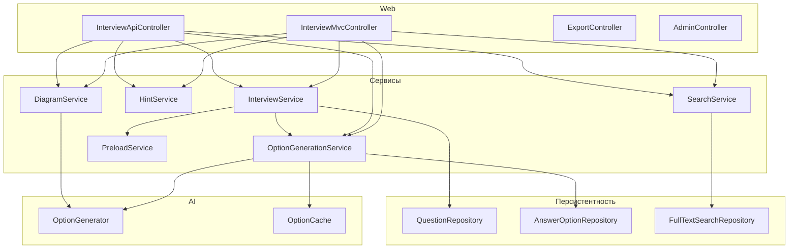

# Подготовка к собеседованию (Interview Prep)

Локальное приложение для тестирования перед интервью: вопросы из markdown-файлов, генерация вариантов ответов через AI (DeepSeek, OpenAI, Spring AI), интервальное повторение (SM-2), подсказки и Mermaid-диаграммы.

## Возможности

- **Режимы:** Тренировка (по одному вопросу), Экзамен (фиксированное число вопросов, по умолчанию 20), Марафон (по умолчанию 50).
- **Интервальное повторение:** алгоритм SM-2, дата следующего повторения и статистика по вопросам.
- **AI-генерация:** варианты ответов (1 правильный + неверные), прогрессивные подсказки (3 уровня), Mermaid-диаграммы к вопросам.
- **Полнотекстовый поиск:** по вопросам и ответам (SQLite FTS5 / PostgreSQL tsvector).
- **Экспорт прогресса:** JSON и CSV (эндпоинт `/export`).
- **Горячие клавиши:** `1–4` — выбор варианта, `Enter` — отправить ответ.

## Инженерная документация

- `docs/ARCHITECTURE.md` — архитектура и границы слоёв.
- `docs/DOMAIN.md` — доменная модель и жизненный цикл вопроса.
- `docs/LLM_PIPELINE.md` — построение prompt, интеграция с AI и обработка ошибок провайдера.
- `docs/QUESTION_ENGINE.md` — pipeline генерации вопросов в режиме prompt-first (single-call, strict JSON contract).
- `ENGINEERING_CONTEXT.md` — актуальный инженерный контекст по ключевым архитектурным решениям.
- `docs/API.md` — API contracts и примеры JSON.
- `docs/SECURITY.md` — текущая security-модель, ограничения и hardening checklist.
- `docs/SESSION_LOGIC.md` — логика тренировки, сессий и mastery.
- `docs/CONTRIBUTING.md` — правила расширения и тестирования.

## Требования

- **JDK 17+**
- **SQLite 3.24+** (профиль по умолчанию) или **PostgreSQL 11+** (профиль `postgres`)
- Переменные окружения для API-ключей: `DEEPSEEK_API_KEY`, `OPENAI_API_KEY`, `SPRING_AI_API_KEY` (по необходимости)

## Быстрый старт

**Перед первой сборкой:** в репозитории может не быть `gradle-wrapper.jar`. Выполните один раз:

```bash
gradle wrapper
```

и закоммитьте папку `gradle/wrapper/`. В CI перед сборкой при необходимости выполните `gradle wrapper`.

```bash
export DEEPSEEK_API_KEY=ваш_ключ   # или OPENAI_API_KEY / SPRING_AI_API_KEY
./gradlew bootRun
```

Откройте в браузере: **http://localhost:8080**

- **REST API и Swagger UI:** http://localhost:8080/swagger-ui.html

## Конфигурация

Настройки задаются в `src/main/resources/application.yml` (и профилях `application-prod.yml`, `application-postgres.yml`) по префиксу `app.*`.

| Свойство | Описание | По умолчанию |
|----------|----------|--------------|
| `app.interviewPath` | Путь к директории с markdown-файлами вопросов (относительно рабочей директории) | — |
| `app.aiProvider` | Основной AI-провайдер: `spring-ai`, `openai`, `deepseek` | `spring-ai` |
| `app.aiFallbackProvider` | Резервный провайдер при недоступности основного; `none` — отключить | `spring-ai` |
| `app.interview.optionsCount` | Количество вариантов ответа на вопрос (2–10) | 4 |
| `app.interview.learnedRepetitions` | Порог повторений для статуса «выучено» | 3 |
| `app.interview.examPenaltyQuestions` | Доп. вопросов при ошибке в режиме экзамена | 5 |
| `app.interview.maxSessionCount` | Максимум вопросов в одной сессии | 200 |
| `app.interview.resetOnStartup` | Удалять ли все варианты при старте (только для dev) | `false` |
| `app.ai.timeoutSeconds` | Таймаут HTTP-запроса к AI | 30 |
| `app.ai.maxRetries` | Повторные попытки при 429/5xx | 3 |
| `app.deepseek.baseUrl`, `apiKey`, `model`, `temperature` | Параметры DeepSeek API | — |
| `app.openai.baseUrl`, `apiKey`, `model`, `temperature` | Параметры OpenAI API | — |
| `app.springAi.baseUrl`, `apiKey`, `model`, `temperature` | Параметры Spring AI (Ollama и др.) | — |
| `app.preload.batchSize`, `corePoolSize`, `maxPoolSize`, `queueCapacity` | Предзагрузка вариантов | — |
| `app.sqlite.enableWal` | Включить WAL для SQLite | `true` |
| `app.cache.optionMaxSize` | Размер кэша вариантов ответов | 500 |
| `app.cache.ttlHours` | Время жизни записей кэша (часы) | 1 |
| `app.search.maxLimit` | Максимум результатов полнотекстового поиска | 100 |
| `app.adminToken` | Токен для админ-эндпоинтов (`X-Admin-Token`); пусто — доступ без токена (dev) | — |

Подробное описание полей и вложенных классов — в Javadoc: `./gradlew javadoc`, затем класс `AppProperties`.

В production задайте профиль `prod` (`--spring.profiles.active=prod` или `SPRING_PROFILES_ACTIVE=prod`), чтобы отключить Swagger UI и открытую документацию API.

## Архитектура

- **Веб:** MVC (Thymeleaf) + REST API. Контроллеры: `InterviewMvcController` (страницы тестирования), `InterviewApiController` (API тестирования), `ExportController` (экспорт), `AdminController` (очистка вариантов).
- **Сервисы:** `InterviewService` (вопросы, сессии, ответы), `OptionGenerationService` (генерация вариантов с кэшем и fallback), `HintService` (подсказки), `DiagramService` (Mermaid), `SpacedRepetitionService` (SM-2), `PreloadService` (фоновая предзагрузка), `SearchService` (FTS), `QuestionImportService` (импорт из markdown).
- **Персистентность:** JDBC-репозитории (`QuestionRepository`, `AnswerOptionRepository`, `HintRepository`, `ReviewStateRepository` и др.), Flyway-миграции. Поддержка SQLite и PostgreSQL.
- **Кэш:** in-memory кэш вариантов ответов (Caffeine) с TTL и ограничением размера.

Ключевые классы для разработчиков: `InterviewApplication`, `InterviewMvcController`, `InterviewApiController`, `AppProperties`, `InterviewService`, `OptionGenerationService`.



## Для разработчиков

- **Сборка и тесты:** `./gradlew build` — полная сборка с тестами; `./gradlew test` — только тесты; `./gradlew compileJava` — компиляция без тестов.
- **Javadoc:** `./gradlew javadoc` — генерация в `build/docs/javadoc/`. Подробное описание полей конфигурации — в Javadoc класса `AppProperties` и вложенных классов (`AppProperties.Interview`, `AppProperties.Ai`, `AppProperties.DeepSeek` и т.д.).
- **Конфигурация:** все настройки приложения — в `com.cheatsheet.quiz.config.AppProperties` (префикс `app.*` в `application.yml`).
- **Добавление AI-провайдера:** реализуйте интерфейс `OptionGenerator` (пакет `service.ai`), зарегистрируйте бин в `InfrastructureConfig` и при необходимости добавьте выбор в `optionGenerator()` (primary/fallback). Для OpenAI-совместимых API можно наследовать `AbstractAiClient` и использовать `ConfigurableAiClient` с нужными параметрами.

## Расширяемость

- **Свой AI-провайдер:** реализация `OptionGenerator` + конфигурация в `application.yml` (при необходимости новый вложенный класс в `AppProperties`) + бин в `InfrastructureConfig`. Промпты задаются в `AiPrompts`; для провайдера с другим форматом ответа переопределите парсинг в своей реализации.
- **Новый формат экспорта:** в `ExportController` добавьте значение в `ExportFormats`, реализуйте формирование тела ответа (аналогично `toCsv`) и ветку в методе `export`.
- **Правка промптов для вариантов, подсказок, диаграмм:** константы и шаблоны в `com.cheatsheet.quiz.service.ai.AiPrompts`.

## REST API

Полное описание — в Swagger UI: http://localhost:8080/swagger-ui.html

Кратко:

- **GET /** — главная страница (текущий вопрос или форма старта сессии).
- **POST /start**, **POST /finish** — старт/завершение сессии экзамена/марафона.
- **POST /answer** — отправка ответа (форма).
- **POST /api/answer** — отправка ответа (JSON, для AJAX).
- **POST /api/regenerate** — перегенерация вариантов и подсказок для вопроса.
- **POST /api/hint** — получение подсказки по уровню (1–3).
- **POST /api/favorite** — переключение «избранное» для вопроса.
- **GET /stats** — страница статистики.
- **GET /export?format=json|csv** — экспорт прогресса.
- **POST /api/admin/options/clear** — очистка всех вариантов (заголовок `X-Admin-Token` при заданном `app.adminToken`).

Пример curl-запроса ответа:

```bash
curl -X POST "http://localhost:8080/api/answer" \
  -H "Content-Type: application/x-www-form-urlencoded" \
  -d "questionId=1&optionId=2"
```

Пример UI-сценария:

1. Открыть главную страницу `/`.
2. Выбрать вариант ответа.
3. Нажать `Проверить ответ`.
4. Просмотреть краткий и полный разбор.
5. Перейти к следующему вопросу.

## База данных

- **По умолчанию:** SQLite, файл в каталоге приложения (например `data/`). Миграции Flyway: `src/main/resources/db/migration/`.
- **PostgreSQL:** профиль `postgres`, миграции в `db/migration-postgres/`.

Основные таблицы: `questions`, `answer_options`, `question_hints`, `review_state`, при необходимости FTS-таблицы (SQLite: `questions_fts`).

## Docker

Сборка образа (в корне проекта должна быть папка `cheatsheets` с вопросами):

```bash
docker build --build-arg VERSION=1.0.0 -t interview-prep .
```

Запуск с профилем по умолчанию (в т.ч. Swagger UI):

```bash
docker run -e SPRING_PROFILES_ACTIVE=default -p 8080:8080 interview-prep
```

В production-образе по умолчанию активен профиль `prod` (Swagger отключён).

### Docker Compose

```bash
docker compose up -d
```

После изменений в коде или шаблонах пересоберите образ:

```bash
docker compose build interview-prep --no-cache
docker compose up -d interview-prep
```

Очистка вариантов для перегенерации:

```bash
curl -X POST -H "X-Admin-Token: ваш_токен" http://localhost:8080/api/admin/options/clear
```

(Если `app.adminToken` не задан, заголовок можно не передавать.)

## Безопасность

- Приложение рассчитано на **локальное использование** (localhost). Аутентификация пользователей и CSRF-защита **не реализованы**.
- **POST-эндпоинты** (`/answer`, `/api/answer`, `/api/regenerate`, `/api/hint`, `/api/favorite`, `/start`, `/finish`, `/api/admin/*`) **не защищены CSRF-токенами**. Spring Security не подключён. При развёртывании в общем доступе возможны запросы от сторонних сайтов (CSRF). Для production рекомендуется:
  - подключить Spring Security с включённой CSRF-защитой;
  - добавлять CSRF-токены в формы (Thymeleaf делает это при включённом Spring Security);
  - для AJAX — передавать токен в заголовке `X-CSRF-TOKEN`.
- Вывод пользовательского и AI-генерируемого контента (подсказки, ответы) санитизируется (текст подсказок через `textContent`; HTML ответов — через jsoup в `MarkdownRenderService`). Админ-действия защищены опциональным токеном `X-Admin-Token` (константное сравнение заменено на `MessageDigest.isEqual` для устранения timing attack).

## Javadoc

Подробное описание API классов и методов:

```bash
./gradlew javadoc
```

Результат в `modules/quiz-app/build/docs/javadoc/`.

## Структура проекта (модульная архитектура)

Проект разделен на 3 Gradle-модуля с явными зависимостями:

| Модуль | Назначение | Зависит от |
|--------|------------|------------|
| `quiz-domain` | Чистая доменная модель: сущности, value-объекты, доменные исключения | — |
| `quiz-persistence` | JDBC-репозитории, SQL-утилиты, FTS-адаптеры | `quiz-domain` |
| `quiz-app` | Spring Boot web/API, сервисы, конфигурация, AI-интеграции, templates/static | `quiz-domain`, `quiz-persistence` |

Ключевые пакетные границы в `quiz-app`:

| Пакет | Назначение |
|--------|----------|
| `com.cheatsheet.quiz.api` | MVC/REST контроллеры, DTO и обработка ошибок |
| `com.cheatsheet.quiz.service` | Бизнес-логика тестирования, AI-интеграции, подсказки, поиск |
| `com.cheatsheet.quiz.config` | Конфигурация приложения, `AppProperties`, инфраструктурные бины |
| `com.cheatsheet.quiz.util` | Вспомогательные утилиты |

Такая декомпозиция уменьшает связность, упрощает развитие и позволяет независимо тестировать доменный и persistence-слои.

## Примечания

- Варианты ответов кэшируются в БД и in-memory (Caffeine) и показываются одинаково при повторе вопроса.
- При изменении вопроса/ответа в markdown варианты и подсказки пересоздаются при следующем показе (или через кнопку «Обновить» / API regenerate).
- Режимы: **Тренировка**, **Экзамен** (по умолчанию 20 вопросов), **Марафон** (по умолчанию 50).
