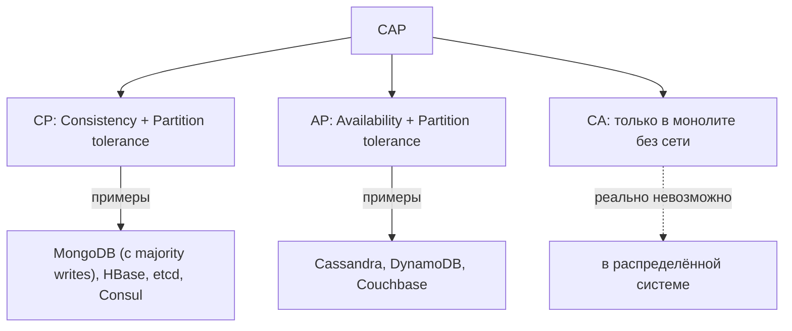
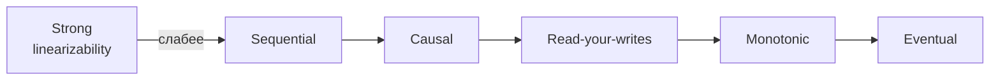
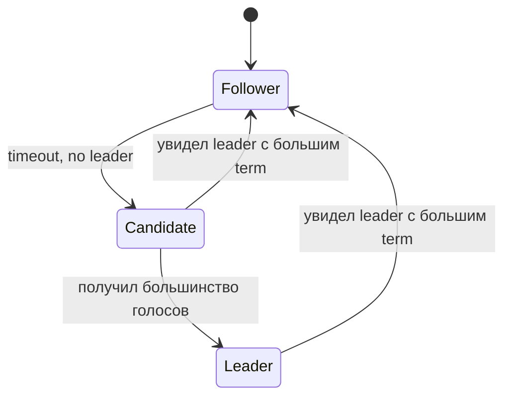
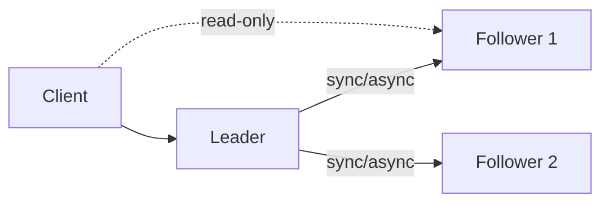
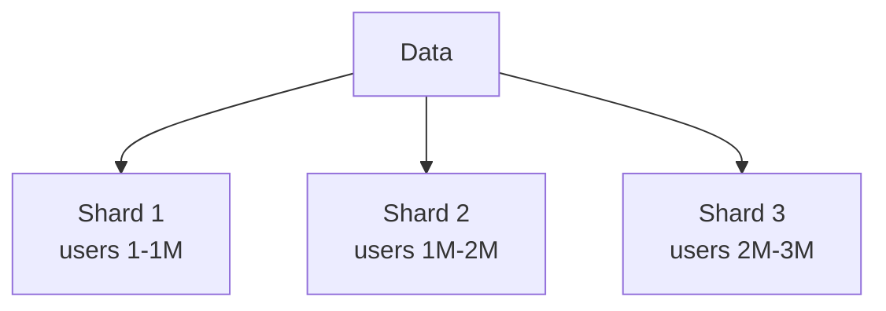

# Distributed Systems: фундамент

Распределённая система — несколько процессов, связанных сетью и работающих
над общей задачей. Сеть теряет пакеты, ноды падают, часы расходятся — и всё
это нужно учитывать в дизайне. Документ собирает ключевые теоремы и
механизмы, которые лежат в основе любых распределённых баз и сервисов: CAP
и PACELC, модели консистентности, алгоритмы консенсуса, кворумы и
репликации, шардинг и партиционирование.

Это фундамент для понимания, почему БД ведут себя так, а не иначе, какие
гарантии даёт Kafka, что значит «eventual consistency» и зачем нужен Raft.

## Полезные ссылки

### Книги и статьи

- [Designing Data-Intensive Applications (Martin Kleppmann)](https://dataintensive.net/) — главный учебник
- [CAP Twelve Years Later (Eric Brewer)](https://www.infoq.com/articles/cap-twelve-years-later-how-the-rules-have-changed/) — переосмысление CAP
- [Don't Settle for Eventual (Daniel Abadi, PACELC)](http://www.cs.umd.edu/~abadi/papers/abadi-pacelc.pdf) — оригинал
- [The Raft Paper (Ongaro, Ousterhout)](https://raft.github.io/raft.pdf) — оригинал Raft
- [Paxos Made Simple (Leslie Lamport)](https://lamport.azurewebsites.net/pubs/paxos-simple.pdf) — попытка упростить Paxos

### Обучающие материалы

- [Jepsen Analyses](https://jepsen.io/analyses) — реальные эксперименты с консистентностью БД
- [The Verification of a Distributed System (Caitie McCaffrey)](https://queue.acm.org/detail.cfm?id=2889274) — практика
- [Hermitage](https://github.com/ept/hermitage) — тесты уровней изоляции БД

### См. также

- [Saga Pattern](saga-pattern.md) — координация распределённых транзакций
- [Event Sourcing](event-sourcing.md) — журнал событий как источник истины
- [Resilience Patterns](resilience-patterns.md) — защита от частичных сбоев
- [PostgreSQL Replication](../databases/relational/postgresql/postgres-replication.md) — практика репликации
- [Redis Replication](../databases/nosql/redis/redis-replication.md) — leader-follower на практике
- [Kafka](../development/messaging/kafka/kafka.md) — distributed log
- [Caching Patterns](enterprise-patterns/caching-patterns.md) — кеш в распределённой системе

## Содержание

- [Восемь заблуждений распределённых систем](#восемь-заблуждений-распределённых-систем)
- [CAP-теорема](#cap-теорема)
- [PACELC: расширение CAP](#pacelc-расширение-cap)
- [Модели консистентности](#модели-консистентности)
- [Linearizability и serializability](#linearizability-и-serializability)
- [Уровни изоляции БД](#уровни-изоляции-бд)
- [Алгоритмы консенсуса: Raft и Paxos](#алгоритмы-консенсуса-raft-и-paxos)
- [Кворумы и кворум-системы](#кворумы-и-кворум-системы)
- [Репликация: leader-based, multi-leader, leaderless](#репликация-leader-based-multi-leader-leaderless)
- [Sharding и партиционирование](#sharding-и-партиционирование)
- [Two Generals и Byzantine fault](#two-generals-и-byzantine-fault)
- [Логические часы и vector clocks](#логические-часы-и-vector-clocks)
- [CRDT](#crdt)
- [Лучшие практики](#лучшие-практики)
- [Антипаттерны](#антипаттерны)

## Восемь заблуждений распределённых систем

Сформулированы Питером Дойчем в 1994 году. Каждое — источник реальных багов.

| Заблуждение | Реальность |
|-------------|------------|
| Сеть надёжна | Пакеты теряются, соединения рвутся |
| Латентность нулевая | Round-trip может быть 1 ms или 500 ms |
| Bandwidth бесконечен | Throughput ограничен |
| Сеть безопасна | MITM, перехваты, спуфинг |
| Топология не меняется | DNS меняется, инстансы переезжают |
| Один администратор | Множество команд с разными политиками |
| Стоимость передачи нулевая | Egress traffic стоит денег, особенно cross-region |
| Сеть однородная | Разные протоколы, версии, прокси, NAT |

Если не учитываешь — система ломается на проде.

## CAP-теорема

Eric Brewer, 2000. Распределённая система может одновременно гарантировать
максимум два из трёх свойств:

| Свойство | Что значит |
|----------|-----------|
| Consistency | Все ноды видят одинаковые данные в одно время |
| Availability | Каждый запрос получает ответ (не обязательно свежий) |
| Partition tolerance | Система продолжает работать при разрыве сети между нодами |



**Главный нюанс:** в реальной распределённой системе partition (разрыв сети)
неизбежен. Поэтому выбор реально между C и A: при partition либо отдаём
ошибку (CP), либо отвечаем устаревшие данные (AP).

| Тип | При сбое | Примеры |
|-----|----------|---------|
| CP | Возвращает error / timeout | MongoDB w=majority, etcd, ZooKeeper, Consul, HBase, Spanner |
| AP | Возвращает старые данные | Cassandra, DynamoDB (по умолчанию), Riak, CouchDB |

> Часто формулируют «либо строгая консистентность, либо высокая
> доступность» — это упрощение CAP. Реальные системы дают тонкую настройку:
> Cassandra с `consistency=ALL` становится CP; MongoDB с `w=1` — AP.

## PACELC: расширение CAP

Daniel Abadi, 2010. CAP описывает поведение при partition. Но в нормальном
режиме тоже есть выбор: latency vs consistency.

```text
PACELC: if Partition then Availability vs Consistency,
        Else                Latency vs Consistency
```

| Система | При partition | В нормальном режиме |
|---------|--------------|--------------------|
| PA/EL | A | L (низкая latency) |
| PA/EC | A | C (строгая консистентность ценой latency) |
| PC/EL | C | L |
| PC/EC | C | C |

Примеры:

| Система | Классификация |
|---------|---------------|
| Cassandra (default) | PA/EL |
| DynamoDB | PA/EL |
| MongoDB (w=1) | PA/EL |
| MongoDB (w=majority) | PC/EC |
| Spanner | PC/EC |
| etcd, ZooKeeper | PC/EC |

PACELC точнее описывает реальный выбор. CAP — только пол истории.

## Модели консистентности

От самой строгой к самой слабой:

| Модель | Гарантия |
|--------|----------|
| Linearizability (strict) | После записи все читают новое значение немедленно |
| Sequential consistency | Все видят одинаковый порядок операций |
| Causal consistency | Связанные операции видны в правильном порядке |
| Read-your-writes | После своей записи я её вижу |
| Monotonic reads | Я не вижу данные «откатывающимися» |
| Eventual consistency | Без новых записей все ноды сойдутся |



**Eventual consistency** — слабая, но дешёвая. Cassandra и DynamoDB по
умолчанию дают её. Используется, когда чтение устаревших данных приемлемо.

**Causal consistency** — золотая середина для соцсетей: видишь свой пост
сразу, чужие могут прийти с задержкой.

**Linearizability** — нужна для платежей и счётчиков. Дорого: требует
консенсуса (Raft/Paxos).

## Linearizability и serializability

| Свойство | Про что |
|----------|---------|
| Linearizability | Про порядок одиночных операций (последовательно во времени) |
| Serializability | Про порядок транзакций (как будто выполнены последовательно) |
| Strict serializability | Linearizability плюс serializability (самое сильное) |

ACID-БД дают serializability (через 2PL или MVCC). Распределённые системы
с консенсусом — обычно linearizability на уровне отдельной операции,
но не serializability на уровне многооперационных транзакций.

> Пример: Cassandra даёт linearizable read/write через `consistency=ALL`,
> но НЕ serializability — нет транзакций. Spanner даёт обе (через
> TrueTime + Paxos).

## Уровни изоляции БД

ACID `I` — Isolation. Стандарт ANSI SQL определяет четыре уровня, плюс
снэпшотные:

| Уровень | Dirty Read | Non-repeatable Read | Phantom Read | Lost Update |
|---------|-----------|---------------------|--------------|-------------|
| Read Uncommitted | возможно | возможно | возможно | возможно |
| Read Committed | нет | возможно | возможно | возможно |
| Repeatable Read (классика) | нет | нет | возможно | возможно |
| Snapshot Isolation | нет | нет | нет | возможно (Write skew) |
| Serializable | нет | нет | нет | нет |

PostgreSQL реализует Read Committed по умолчанию, Repeatable Read как
Snapshot Isolation, и Serializable через SSI (Serializable Snapshot Isolation).

MySQL InnoDB по умолчанию — Repeatable Read, но с особым поведением gap-locks.

> Read Committed может удивить: один SELECT внутри одной транзакции даст
> разные результаты, если параллельная транзакция закоммитилась между ними.
> Для отчётов и денежных операций используй Repeatable Read или выше.

## Алгоритмы консенсуса: Raft и Paxos

Консенсус — задача, при которой N нод соглашаются на одном значении даже
при сбоях части из них. Используется для линеаризуемой репликации,
выбора лидера, конфигурации кластера.

| Алгоритм | Особенности |
|----------|-------------|
| Paxos | Оригинал (Lamport, 1989), сложно понять |
| Multi-Paxos | Расширение для последовательности значений |
| Raft | Cпроектирован для понимаемости (Stanford, 2014) |
| Zab | Используется в ZooKeeper |
| EPaxos | Без выделенного лидера |
| Viewstamped Replication | Использует похожие идеи |

**Raft устроен из трёх частей:**

| Часть | Что делает |
|-------|-----------|
| Leader election | Выбор лидера через голосование с timeout |
| Log replication | Лидер реплицирует записи на followers |
| Safety | Гарантии: коммитнутая запись не теряется |



Где используется Raft:

| Система | Применение |
|---------|-----------|
| etcd | Хранение конфигурации Kubernetes |
| Consul | Service discovery, KV-store |
| TiKV | Распределённое хранилище TiDB |
| CockroachDB | Линеаризация на уровне диапазонов |
| MongoDB (Replica Set) | Выбор primary |
| Kafka (KRaft) | Замена ZooKeeper |
| Patroni | Postgres HA |

**Кворум для Raft:** для отказоустойчивости F нод нужен `2F+1` (3, 5, 7).
Кластер из 3 переживёт падение 1, кластер из 5 — двух.

## Кворумы и кворум-системы

Quorum — большинство (или явно заданное число) нод, согласных на операцию.

В кворум-репликации (Cassandra, Dynamo, Riak):

| Параметр | Что |
|----------|-----|
| N | Количество реплик каждого ключа |
| W | Сколько нод должны подтвердить запись |
| R | Сколько нод должны ответить на чтение |

Условие сильной консистентности: `W + R > N`. Иначе возможны stale reads.

| Конфигурация | Гарантия |
|--------------|----------|
| W=1, R=1 | Высокая латентность, потенциальные stale reads |
| W=N, R=1 | Все запись синхронны, чтение быстрое |
| W=majority, R=majority | Сбалансированный, выживает падение меньшинства |
| W=1, R=N | Запись быстрая, чтение медленное |

```text
N=3:
  W=2, R=2 → quorum, stronger consistency, выживает падение 1 ноды
  W=3, R=1 → R+W>N, but если упала 1 нода, запись невозможна
  W=1, R=1 → fast, но возможны конфликты
```

Cassandra `consistency=QUORUM` — это `W=majority, R=majority`.

## Репликация: leader-based, multi-leader, leaderless

| Модель | Кто пишет | Конфликты | Примеры |
|--------|-----------|-----------|---------|
| Leader-based (single-leader) | Один primary | Невозможны | PostgreSQL, MySQL, MongoDB, Kafka, Redis |
| Multi-leader | Несколько leaders | Возможны | CouchDB, BDR Postgres, мульти-мастер MySQL |
| Leaderless (Dynamo-style) | Любая нода | Возможны | Cassandra, Riak, DynamoDB |

### Leader-based



| Replication mode | Семантика |
|------------------|-----------|
| Synchronous | Leader ждёт acknowledgment всех followers |
| Semi-synchronous | Ждёт acknowledgment одного follower |
| Asynchronous | Не ждёт followers (риск потери данных при failover) |

**Failover** — выбор нового leader при падении старого. Источник проблем:

- Split-brain (несколько leaders одновременно).
- Потеря данных, не успевших реплицироваться.
- Несогласованные индексы между leader и replica.

Решается через Raft/Paxos для выбора leader (etcd, Patroni для Postgres).

### Multi-leader

Каждая нода может писать. Удобно для multi-region (latency низкая локально),
но конфликты надо разрешать.

Стратегии разрешения конфликтов:

- Last-write-wins (LWW) — побеждает запись с большим timestamp. Может терять данные.
- Application-defined merge — разработчик пишет логику.
- CRDT — структуры данных, где конфликты разрешаются автоматически.

### Leaderless (Dynamo-style)

Нет единого primary. Любой клиент пишет на любую ноду. Кворумы R и W
обеспечивают согласованность.

Read repair и hinted handoff — механизмы лечения расхождений.

## Sharding и партиционирование

Партиционирование — разбиение данных по нодам. Sharding — обычно про
горизонтальное (по строкам), partitioning — может быть и по столбцам.

| Стратегия | Как делится | Плюсы | Минусы |
|-----------|-------------|-------|--------|
| Range-based | По диапазонам ключа (A-M, N-Z) | Range queries эффективны | Hot partitions при skewed data |
| Hash-based | По хешу ключа | Равномерное распределение | Range queries не работают |
| Directory (lookup) | Внешняя таблица соответствия | Гибкость | Нужен lookup-сервис |
| Geographic | По региону | Локальность | Сложно при перемещении |
| Composite | Hash(tenant) + range(date) | Гибридные плюсы | Сложнее |



**Consistent hashing** — уменьшает rebalancing при добавлении/удалении нод.
Используется в Cassandra, DynamoDB, Memcached client-side, CDN.

```text
Hash ring 0..2^32:
  Node A: 100°
  Node B: 220°
  Node C: 340°
  Key X (hash=150°) → ближайшая по часовой = Node B
  Key Y (hash=355°) → Node A (через 0)
```

При добавлении нового узла переезжает только ~1/N ключей, не все.

**Hot partitions** — главная проблема шардинга. Если 80% запросов идут на
один shard, его узкое горло. Решения:

- Лучший partition key (UUID вместо timestamp).
- Sharding key из нескольких полей.
- Caching горячих ключей.
- Composite keys (`tenant_id + entity_id`).

**Re-sharding** — болезненная операция. Перемещение данных требует:

- Двойную запись на время миграции.
- Backfill старых данных.
- Переключение reads.
- Удаление старого.

Вivendel: проектируй sharding с запасом — лучше избыточно, чем re-shard через год.

## Two Generals и Byzantine fault

**Two Generals problem.** Двое не могут договориться о синхронной атаке через
ненадёжный канал. Нет способа гарантировать, что оба получили подтверждение.

Следствие: распределённая система не может гарантировать atomic commit
через ненадёжную сеть. Поэтому 2PC (two-phase commit) блокирующий, а Saga
работает через eventual consistency.

**Byzantine faults.** Ноды могут вести себя злонамеренно — посылать
противоречивые сообщения. Большинство систем (Raft, Paxos) предполагают
fail-stop модель: нода либо работает, либо упала. Byzantine — это про блокчейн,
PBFT, Tendermint.

Внутренние корпоративные системы редко рассматривают Byzantine. Достаточно fail-stop.

## Логические часы и vector clocks

Распределённые часы расходятся. Использовать `time.Now()` для упорядочения
событий — баг.

| Механизм | Что |
|----------|-----|
| Lamport timestamps | Логический счётчик, увеличивается при событии и при получении |
| Vector clocks | Вектор счётчиков для каждой ноды |
| Hybrid Logical Clocks (HLC) | Lamport + физическое время (Spanner, CockroachDB) |
| TrueTime | Глобальное время с интервалом неопределённости (Spanner) |

```text
Lamport:
  A: send msg, ts=5
  B: receive, ts = max(local, 5) + 1 = 6

Vector clock (3 nodes):
  A: [3, 0, 0] sends to B
  B: [3, 4, 0] (max of incoming and local + own increment)
```

Vector clocks используются в Riak, DynamoDB для обнаружения concurrent updates.

## CRDT

Conflict-free Replicated Data Types — структуры, которые мержатся
автоматически без конфликтов.

| Тип | Пример |
|-----|--------|
| G-Counter | Возрастающий счётчик |
| PN-Counter | Счётчик с увеличением и уменьшением |
| G-Set | Множество с добавлением |
| 2P-Set | Множество с добавлением и удалением |
| OR-Set | Observed-Remove Set |
| LWW-Register | Last-Write-Wins регистр |

Используются в:

- Yjs, Automerge — collaborative editing (Google Docs, Figma).
- Redis CRDT (Enterprise).
- Riak.

CRDT решают конфликты ценой ограниченной семантики. Не всё можно выразить.

## Лучшие практики

- Принимай, что сеть может разорваться. Любой call через сеть может упасть, висеть, отвечать дубликатами.
- Не используй `time.Now()` для упорядочения событий. Логические часы или single source of truth.
- Не пытайся сделать атомарную операцию через несколько систем без 2PC или Saga.
- Идемпотентность — обязательное свойство для любой операции через сеть.
- Используй existing проверенные системы для консенсуса (etcd, ZooKeeper, Consul). Не пиши свой Raft.
- Выбирай consistency model осознанно. Не «как удобно», а с пониманием цены.
- Тестируй failure scenarios. Chaos engineering, Jepsen-style. Без тестирования partition тебя ждут сюрпризы в проде.
- Мониторь split-brain и расхождения. Метрики replication lag, deviation от leader.
- При sharding думай заранее. Хороший partition key решает 90% проблем масштабирования.
- При выборе БД смотри PACELC, не только CAP. Реальный профиль шире.
- Не доверяй слепо термину «strong consistency» в маркетинге БД. Сверяй с Jepsen-тестами.

## Антипаттерны

| Антипаттерн | Почему плохо |
|-------------|--------------|
| Sync-replication через все DC ради консистентности | Латентность убивает |
| Self-implemented 2PC поверх HTTP | Не атомарно при сбоях |
| Использование физических часов для ordering | Часы расходятся, события путаются |
| Игнорирование partition tolerance | «У нас partition не бывает» — бывает |
| Один shard для самых горячих данных | Hot partition валит шард |
| Cross-shard transactions без явного дизайна | Деградация под нагрузкой |
| Multi-leader без conflict resolution | Lost updates |
| Кворум W=1 для критичных данных | Возможна потеря при сбое до replication |
| Слепое доверие RDBMS isolation level | Read Committed не защищает от race conditions |
| Пропуск idempotency-keys в API | Дубликаты при retry |

**Итог:** распределённая система — это компромисс между консистентностью,
доступностью и латентностью. CAP даёт грубую рамку, PACELC — более точную.
Консенсус (Raft/Paxos) — основа линеаризуемой репликации. Кворумы — основа
надёжной шириной репликации без leader. Шардинг — основа масштабирования
по объёму данных. Любой компромисс должен быть осознанным и проверенным
тестами.
