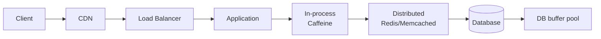
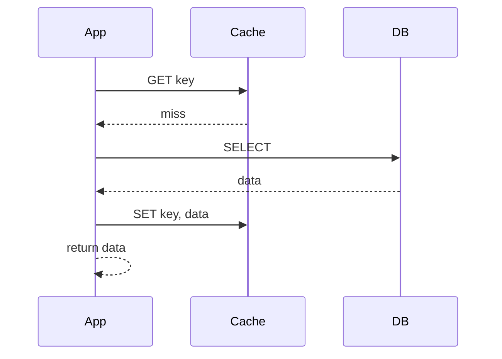
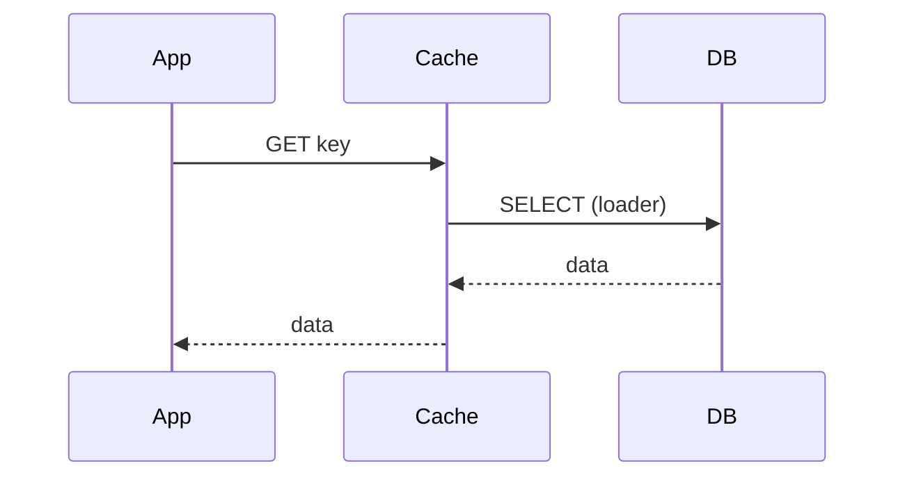
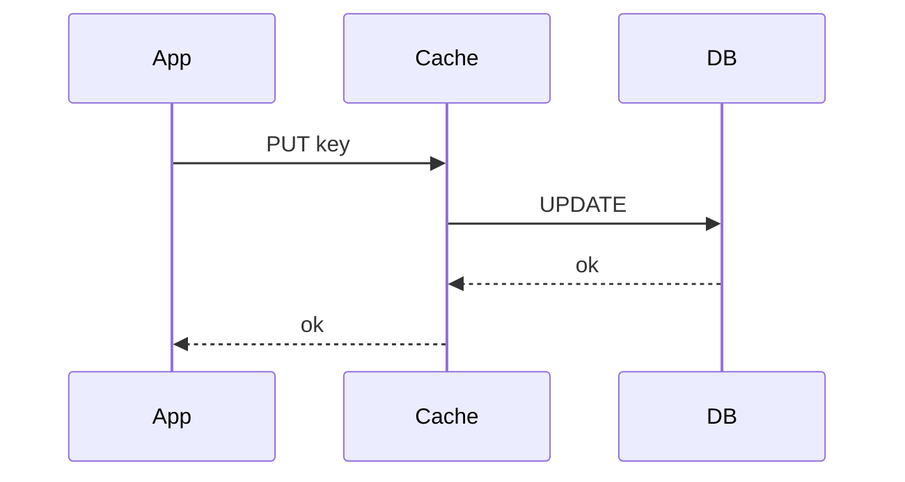
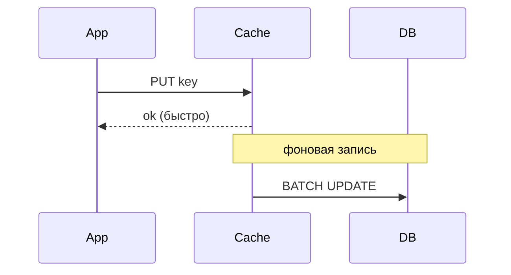
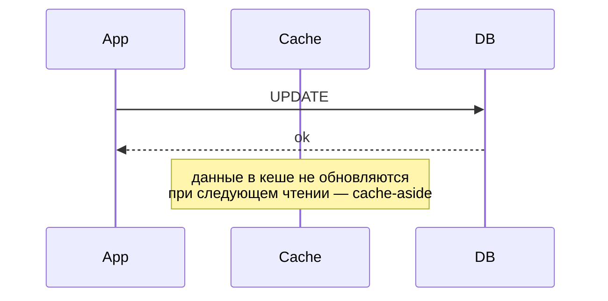
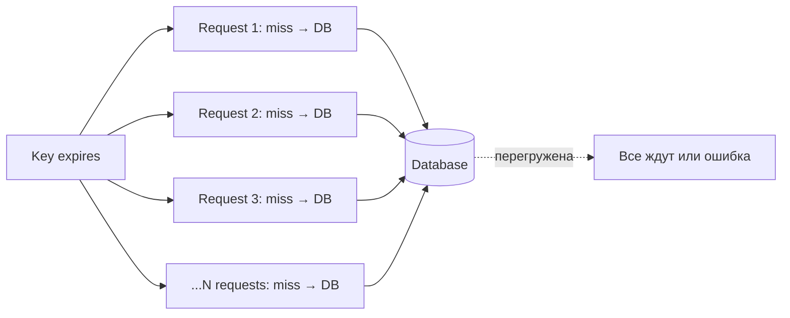

# Caching Patterns: стратегии кеширования

Кеш — копия данных в более быстром (но обычно меньшем) хранилище для ускорения
повторного доступа. Главный закон: кеш всегда может разойтись с источником
истины. Дизайн кеша — это про выбор, как и когда обновлять копию, что хранить,
как удалять устаревшее.

Документ описывает основные паттерны (cache-aside, read-/write-through и
другие), политики вытеснения, TTL, борьбу с cache stampede, многоуровневое
кеширование и стратегии инвалидации. Технологические детали (Redis, Memcached,
Spring Cache) — в специализированных шпаргалках.

## Полезные ссылки

### Официальная документация

- [AWS Caching Strategies](https://docs.aws.amazon.com/AmazonElastiCache/latest/red-ug/Strategies.html) — стратегии в ElastiCache
- [Redis Documentation](https://redis.io/docs/) — Redis как хранилище кеша
- [Caffeine: high-performance Java cache](https://github.com/ben-manes/caffeine) — современный in-process cache

### Обучающие материалы

- [Microsoft: Caching Patterns](https://learn.microsoft.com/en-us/azure/architecture/patterns/cache-aside) — каноничные определения
- [High Performance Browser Networking — Caching](https://hpbn.co/) — про HTTP-кеши
- [The Tail at Scale (Jeff Dean)](https://research.google/pubs/the-tail-at-scale/) — почему хвосты latency опасны и как кеш помогает

### См. также

- [Redis: основы](../../databases/nosql/redis/redis-basics.md) — типы данных, команды, persistence
- [Spring Cache](../../frameworks/java-frameworks/spring/spring-cache.md) — `@Cacheable` и абстракция Spring
- [Hibernate Caching](../../databases/orm/hibernate-caching.md) — кеш L1, L2 и query cache
- [Event-Driven Architecture](../event-driven.md) — инвалидация через события
- [System Design](../system-design/README.md) — место кеша в общей архитектуре

## Содержание

- [Что хранить в кеше и зачем](#что-хранить-в-кеше-и-зачем)
- [Слои кеширования](#слои-кеширования)
- [Главные паттерны: краткое сравнение](#главные-паттерны-краткое-сравнение)
- [Cache-Aside (Lazy Loading)](#cache-aside-lazy-loading)
- [Read-Through](#read-through)
- [Write-Through](#write-through)
- [Write-Behind (Write-Back)](#write-behind-write-back)
- [Write-Around](#write-around)
- [Refresh-Ahead](#refresh-ahead)
- [Политики вытеснения](#политики-вытеснения)
- [TTL и негативное кеширование](#ttl-и-негативное-кеширование)
- [Cache Stampede и защита](#cache-stampede-и-защита)
- [Инвалидация](#инвалидация)
- [Ключи кеша: дизайн и версионирование](#ключи-кеша-дизайн-и-версионирование)
- [Многоуровневый кеш](#многоуровневый-кеш)
- [Метрики кеша](#метрики-кеша)
- [Антипаттерны](#антипаттерны)
- [Лучшие практики](#лучшие-практики)

## Что хранить в кеше и зачем

Кеш помогает в трёх сценариях:

| Сценарий | Что даёт |
|----------|---------|
| Уменьшить latency | Сократить путь до источника (L1 быстрее L2 быстрее БД быстрее API) |
| Снизить нагрузку на источник | Меньше запросов к БД и внешним API |
| Сгладить пики | Кеш держит ответ, пока БД восстанавливается |

Хорошие кандидаты:

- Часто читаемые, редко меняющиеся данные: справочники, профили, конфиги.
- Дорогие в вычислении агрегаты: счётчики, рейтинги, отчёты.
- Ответы внешних API с лимитом RPS.
- Метаданные сессии и аутентификации.

Плохие кандидаты:

- Сильно изменяемые данные с требованием консистентности (баланс счёта).
- Уникальные данные (запросы по uuid пользователя без повторов).
- Большие BLOB'ы, которые редко переиспользуются.

> Перед добавлением кеша измерь: сколько раз читается одна и та же запись?
> Если меньше 5–10, кеш не окупится — добавит сложность без ускорения.

## Слои кеширования



| Слой | Где живёт | Скорость | Особенности |
|------|-----------|----------|-------------|
| Browser cache | Клиент | мс–десятки мс | HTTP-headers (Cache-Control, ETag) |
| CDN | Edge | < 10мс | Статика, кеш по URL |
| Reverse proxy | Nginx, Varnish | < 1мс | HTTP-кеш на стороне сервера |
| In-process | Caffeine, Guava | < 1μs | Очень быстрый, не shared между Pod |
| Distributed | Redis, Memcached | 1–5мс | Shared, переживает рестарт Pod |
| DB query cache | Buffer pool | 0.1–1мс | Прозрачный для приложения |

Чем ближе к клиенту — тем быстрее, но тем хуже консистентность. Каждый слой —
отдельная стратегия инвалидации.

## Главные паттерны: краткое сравнение

| Паттерн | Кто пишет в кеш | Кто пишет в источник | Сложность | Когда |
|---------|----------------|----------------------|-----------|-------|
| Cache-Aside | Приложение | Приложение | Низкая | Большинство случаев |
| Read-Through | Кеш-библиотека | Приложение | Средняя | Прозрачная замена БД-доступа |
| Write-Through | Приложение → кеш → БД | Кеш-библиотека | Средняя | Запись редкая, чтение частое |
| Write-Behind | Приложение → кеш | Кеш (асинхронно) | Высокая | Высокий write throughput, мирится с потерей |
| Write-Around | Приложение → БД | Приложение | Низкая | Запись частая, чтение тех же данных редкое |
| Refresh-Ahead | Кеш-библиотека (proactive) | Приложение | Высокая | Hot keys с предсказуемым временем жизни |

## Cache-Aside (Lazy Loading)

Самый распространённый паттерн. Приложение само управляет кешем.



```java
public User findUser(Long id) {
    String key = "user:" + id;
    User cached = cache.get(key);
    if (cached != null) {
        return cached;
    }
    User loaded = userRepository.findById(id).orElseThrow();
    cache.put(key, loaded, Duration.ofMinutes(10));
    return loaded;
}

public void updateUser(User u) {
    userRepository.save(u);
    cache.evict("user:" + u.getId());     // или put с новым значением
}
```

Плюсы:

- Простая модель, понятная по коду.
- Кеш-сбой не валит приложение (просто идём в БД).
- Загружаем в кеш только то, что реально читали.

Минусы:

- Первое обращение всегда медленное (cache miss).
- Логика повторяется в каждом сервисе. Декларативно через `@Cacheable`/`@CacheEvict`.
- Сложно держать консистентность при множественных писателях.

## Read-Through

Кеш сам загружает данные при miss. Приложение видит «как будто это БД».



```java
LoadingCache<Long, User> cache = Caffeine.newBuilder()
    .maximumSize(10_000)
    .expireAfterWrite(Duration.ofMinutes(10))
    .build(id -> userRepository.findById(id).orElseThrow());

User user = cache.get(123L);    // miss → автоматически грузится из БД
```

Плюсы:

- Логика загрузки в одном месте.
- Естественная защита от stampede через `LoadingCache`/`refreshAfterWrite`.

Минусы:

- Привязка к библиотеке, которая умеет loader.
- Сложнее тестировать без кеша.

## Write-Through

Запись идёт через кеш: сначала обновляем кеш, потом синхронно БД. Кеш и БД
всегда согласованы (на уровне записи).



Плюсы:

- Кеш всегда содержит свежие данные.
- При чтении не нужен fallback в БД (если данные есть).

Минусы:

- Запись медленнее (latency = cache + DB).
- Если запись редко — кеш забивается данными, которые не будут читаться.

## Write-Behind (Write-Back)

Приложение пишет в кеш, кеш асинхронно сбрасывает в БД.



Плюсы:

- Очень высокий write throughput.
- Можно батчить и комбинировать записи.

Минусы:

- Потеря данных при падении кеша до flush.
- Сложная согласованность (БД отстаёт от кеша).
- Сложный recovery.

> Write-Behind подходит только если допустима потеря последних N секунд
> записей. Финансовые данные, аудит, юридически значимые операции — не сюда.

## Write-Around

Запись идёт мимо кеша — прямо в БД. Кеш заполняется только при чтении.



Плюсы:

- Не забиваем кеш данными, которые могут не читаться.
- Запись быстрая (одна операция).

Минусы:

- Последующее чтение пройдёт через cache miss.
- Если кеш содержал старое значение — оно будет stale до eviction или TTL.

Используется в комбинации с cache-aside для записи-тяжёлой нагрузки.

## Refresh-Ahead

Кеш сам обновляет «горячие» ключи до истечения TTL, чтобы клиент никогда
не получил miss.

```java
LoadingCache<Long, User> cache = Caffeine.newBuilder()
    .maximumSize(10_000)
    .refreshAfterWrite(Duration.ofMinutes(5))
    .expireAfterWrite(Duration.ofMinutes(15))
    .build(id -> userRepository.findById(id).orElseThrow());
```

`refreshAfterWrite` < `expireAfterWrite`: после 5 минут первое чтение
запускает фоновую refresh, продолжая отдавать старое значение клиенту.
Когда обновление завершилось — следующий запрос получает свежее.

Плюсы:

- Нет miss на горячие ключи.
- Клиент не ждёт refresh.

Минусы:

- Лишние запросы к БД для редко читаемых ключей (если refresh запускается на каждый ключ).
- Сложность настройки тайминга.

## Политики вытеснения

Когда кеш заполнен, нужно решать, что выкинуть.

| Политика | Логика | Когда использовать |
|----------|--------|--------------------|
| LRU (Least Recently Used) | Выкидываем тот, к кому давно не обращались | По умолчанию для большинства случаев |
| LFU (Least Frequently Used) | Выкидываем тот, у кого мало обращений | Долгоживущие hot keys |
| FIFO | По порядку добавления | Простота, редко оптимально |
| Random | Случайно | Низкие накладные расходы |
| TinyLFU / W-TinyLFU | LFU + window для адмиссии | Современный default (Caffeine) |
| TTL-based | По истечению времени | Когда есть естественный «срок годности» |
| Size-aware | По размеру элементов | Если значения сильно разного размера |

W-TinyLFU (Caffeine, по умолчанию) — текущее state-of-the-art: бьёт LRU и LFU
на большинстве реальных нагрузок.

```java
Caffeine.newBuilder()
    .maximumSize(10_000)              // по количеству элементов
    .maximumWeight(100_000_000L)      // или по «весу» (например, байтам)
    .weigher((k, v) -> ((User) v).estimatedSize())
    .build();
```

В Redis — `maxmemory-policy`:

| Значение | Описание |
|----------|----------|
| `allkeys-lru` | LRU по всем ключам |
| `allkeys-lfu` | LFU по всем |
| `volatile-lru` | LRU только среди ключей с TTL |
| `volatile-lfu` | LFU только среди ключей с TTL |
| `noeviction` | Не вытеснять, возвращать ошибку |

`allkeys-lru` — разумный default для general-purpose кеша.

## TTL и негативное кеширование

TTL — время жизни записи в кеше. Без TTL кеш постепенно становится свалкой.

| Что кешируем | Типичный TTL |
|--------------|--------------|
| Профиль пользователя | 5–15 минут |
| Справочники (страны, валюты) | 1 час — сутки |
| Результаты дорогих агрегатов | 1–10 минут |
| Сессии | 30 минут — несколько часов (sliding) |
| Ответы внешних API | По их Cache-Control или 1–5 минут |

Sliding TTL: каждое обращение продлевает срок. Полезен для сессий и hot data.

Negative caching — кешируем «ничего не нашлось». Защищает от повторных
запросов к БД за заведомо отсутствующими данными:

```java
User user = cache.get(key);
if (user == NULL_MARKER) return null;
if (user != null) return user;

user = repo.findById(id).orElse(null);
cache.put(key, user != null ? user : NULL_MARKER, Duration.ofSeconds(30));
return user;
```

TTL для negative cache обычно короче, чем для positive — чтобы быстро
подхватить появление записи.

> Без negative caching атака на несуществующие ключи (cache penetration)
> кладёт БД: каждый запрос — cache miss + полный SELECT.

## Cache Stampede и защита

Cache stampede (thundering herd) — когда популярный ключ истекает, и сотни
параллельных запросов одновременно идут в БД.



Способы защиты:

| Способ | Как работает |
|--------|--------------|
| Single-flight (request coalescing) | Параллельные запросы за одним ключом мержатся в один |
| Distributed lock | Только один запрос идёт в БД, остальные ждут |
| Probabilistic early refresh | За X% до TTL случайно обновляем заранее |
| Refresh-ahead | Фоновое обновление до истечения |
| Stale-while-revalidate | Отдаём старое, пока обновляем в фоне |
| Jitter в TTL | Разный срок у похожих ключей, чтобы не истекали одновременно |

Caffeine `LoadingCache` делает single-flight автоматически:

```java
LoadingCache<String, Data> cache = Caffeine.newBuilder()
    .build(key -> expensiveLoad(key));

// 100 параллельных вызовов get("hot") вызовут expensiveLoad ровно один раз
```

В Redis — через distributed lock (Redlock или похожие):

```python
def get_with_lock(key):
    value = cache.get(key)
    if value: return value

    lock_key = f"lock:{key}"
    if cache.set(lock_key, "1", nx=True, ex=10):  # SET NX EX
        try:
            value = db.fetch(key)
            cache.set(key, value, ex=600)
            return value
        finally:
            cache.delete(lock_key)
    else:
        time.sleep(0.1)              # ждём, потом повторяем
        return get_with_lock(key)
```

Probabilistic early expiration (XFetch):

```python
import math, random
def get_xfetch(key, beta=1):
    value, ttl, delta = cache.get_with_meta(key)
    now = time.time()
    if not value or now - delta * beta * math.log(random.random()) >= ttl:
        value = recompute(key)
        cache.set(key, value, ttl)
    return value
```

## Инвалидация

Phil Karlton: «There are only two hard things in Computer Science: cache
invalidation and naming things.»

Стратегии:

| Стратегия | Когда |
|-----------|-------|
| TTL-only | Терпимо к stale данным, simple |
| Explicit eviction | Знаем, когда меняется источник |
| Event-based | Инвалидация по сообщению (Kafka, Redis pub/sub) |
| Versioned keys | Меняем суффикс ключа при изменении схемы данных |
| Tag-based | Группа ключей помечается тегом, инвалидация по тегу |

Event-based — для распределённого кеша между сервисами:

```text
1) Service A пишет в БД → публикует UserUpdated event
2) Service B получает event → удаляет cache key user:<id>
3) Следующее чтение в Service B загружает свежие данные
```

Tag-based в Spring Cache:

```java
@Cacheable(value = "users", key = "#id")
User findUser(Long id) { ... }

@CacheEvict(value = "users", allEntries = true)
void invalidateAll() { ... }
```

> Не пытайся синхронизировать кеш с БД 100% — это разные системы. Принимай,
> что окно несогласованности равно TTL или времени до получения события.
> Для строгой консистентности используй БД, не кеш.

## Ключи кеша: дизайн и версионирование

Принципы хорошего ключа:

- Префикс по сервису и сущности: `user:profile:{id}`, `orders:byUser:{userId}`.
- Версия схемы в префиксе: `v2:user:{id}`. При смене формата старые ключи
  игнорируются автоматически.
- Учитываем все аргументы запроса, влияющие на результат:
  `user:list:status={status}:page={page}`.
- Не клади в ключ персональные данные (email, телефон) — это попадает в
  логи и метрики.

Антипаттерны:

- Слишком длинные ключи (> 250 байт) — bandwidth и память.
- Сериализованный объект в ключе — не воспроизводим, hash-зависим.
- Нет namespace между сервисами — конфликты в shared Redis.

Hash-теги в Redis Cluster:

```text
{user:123}:profile      # все ключи с тэгом {user:123} — на одном слоте
{user:123}:orders
```

Это позволяет MULTI/EXEC и SCAN работать на сгруппированных ключах.

## Многоуровневый кеш

Комбинация in-process (L1) и distributed (L2) даёт лучшее из двух:
скорость L1 и shared-state L2.

```java
public User findUser(Long id) {
    User cached = caffeineL1.getIfPresent(id);
    if (cached != null) return cached;

    cached = redisL2.get("user:" + id);
    if (cached != null) {
        caffeineL1.put(id, cached);
        return cached;
    }

    User loaded = userRepo.findById(id).orElseThrow();
    redisL2.put("user:" + id, loaded, Duration.ofMinutes(10));
    caffeineL1.put(id, loaded);
    return loaded;
}
```

| Слой | Скорость | Объём | Persistence | Когда |
|------|----------|-------|-------------|-------|
| L1 (in-process) | < 1μs | МБ | Нет, теряется при рестарте | Hot keys, частое чтение |
| L2 (distributed) | 1–5мс | ГБ–ТБ | Опционально | Shared между Pod, переживает рестарт |

Сложности:

- Инвалидация: L1 в каждом Pod; нужно событие, чтобы все Pod узнали.
- Дрейф между Pod'ами: разные L1 могут показывать разное.
- Сериализация: L2 хранит байты, L1 — объекты. Нужен консистентный формат.

Для инвалидации L1 — Redis pub/sub или дешёвый «cache version» ключ в L2:
при изменении инкрементим версию, L1 проверяет её на каждый запрос.

## Метрики кеша

Минимум, что должно быть в дашборде:

| Метрика | Что показывает | Алерт |
|---------|----------------|-------|
| Hit rate | % обращений, попавших в кеш | < 70–80% — пересмотреть TTL/keys |
| Miss rate | % промахов | Скачок — деплой или инвалидация |
| Eviction rate | Сколько ключей выкидывается | Высокая — мало памяти |
| Latency (get/put) | p95/p99 | Выше нормы — сетевая проблема |
| Memory used / max | Заполненность | > 80% — увеличивать или менять политику |
| Connection errors | Ошибки соединения с Redis | Любая — проблема инфры |

Hit rate < 50% обычно значит, что кеш не помогает. Либо данные слишком
разнообразные, либо TTL слишком короткий, либо размер кеша слишком мал.

```promql
# Prometheus — hit rate
sum(rate(cache_hit_total[5m])) / sum(rate(cache_request_total[5m]))
```

Caffeine выдаёт статистику через `cache.stats()`. Spring Cache — через
Micrometer и `cache.gets`/`cache.puts`.

## Антипаттерны

| Антипаттерн | Почему плохо | Что делать |
|-------------|--------------|------------|
| Нет TTL | Кеш забивается мусором, не освобождается | Всегда задавай TTL, даже большой |
| TTL = TTL | Все ключи истекают одновременно (stampede) | Добавь jitter ±20% |
| Кеш как persistence | Падение Redis = потеря данных | Кеш — не БД. Persistent данные — в БД |
| Большие объекты в кеше | Сериализация дорогая, сеть забита | Кеши только то, что переиспользуется N раз |
| Кеширование персонализированных данных под общим ключом | Один пользователь видит данные другого | Включай user_id в ключ |
| Игнорирование cache-misses в latency-метриках | Видишь только good path | Метрика include миссы |
| Кеширование ошибок без TTL | Ошибка БД залипает в кеше | Кешируй negative с коротким TTL |
| Прямая запись в shared Redis из множества писателей | Race conditions, lost updates | Используй distributed lock или MULTI |
| Использование `KEYS *` в проде | Блокирует Redis на секунды | `SCAN` с курсором |
| Один Redis на весь продакшен | Падение = всё сломано | Cluster + replicas, или несколько кешей по доменам |

## Лучшие практики

- Начинай без кеша. Добавляй после измерения, что нужно ускорить.
- Cache-aside по умолчанию. Read-through и write-through — когда осознанно.
- TTL обязателен. Никогда `expireAfterWrite=Duration.ZERO`.
- Jitter в TTL: `expireAfter = baseTTL ± random(0..20%)`.
- Negative caching — короткий TTL, не игнорируй cache misses.
- Single-flight (Caffeine LoadingCache, distributed lock) для горячих ключей.
- Версионируй ключи: `v2:user:{id}`. Меняем схему — меняем префикс.
- Префикс по сервису: `orders:user:{id}`, не `user:{id}` в shared Redis.
- Не клади PII в ключи — попадает в логи и метрики.
- Метрики hit rate, latency, eviction — обязательны.
- В Production Redis — кластер с replicas. Single-node Redis — single point of failure.
- Многоуровневый кеш (L1 + L2) — для горячих read-heavy workloads.
- Инвалидация через события (Kafka/Redis pub/sub) — для cross-service consistency.
- Для долгих TTL и hot keys — refresh-ahead вместо stampede на истечение.
- Тестируй с пустым кешом и с забитым: latency должна быть приемлемой в обоих случаях.

**Итог:** кеш — это управляемая копия с контролируемой степенью устаревания.
Cache-aside покрывает 80% случаев, остальные паттерны — для специфических
нагрузок. TTL + jitter + single-flight + negative caching защищают от
типовых проблем (stampede, penetration, dogpile). Hit rate и latency —
ключевые метрики. Кеш не заменяет БД и не гарантирует консистентность —
это компромисс скорости и свежести данных.
