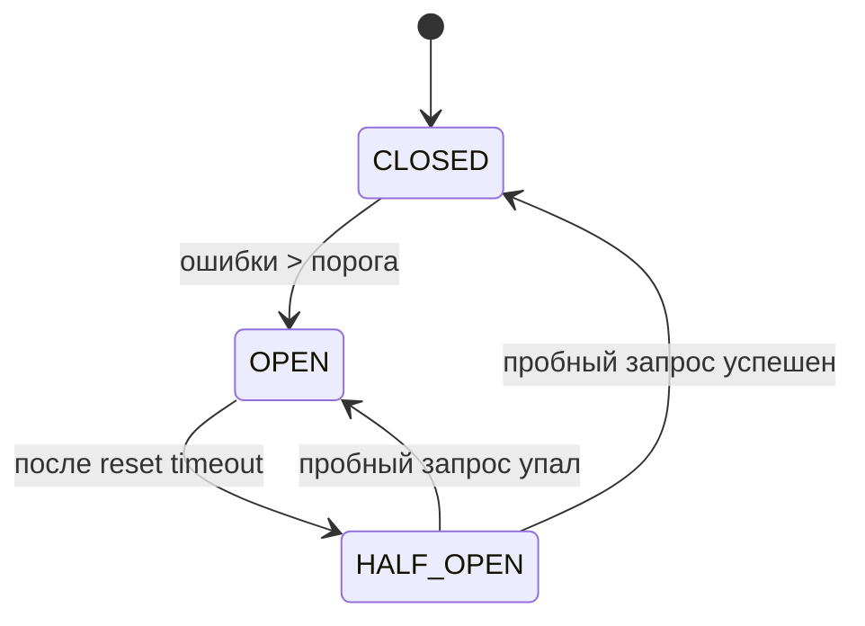
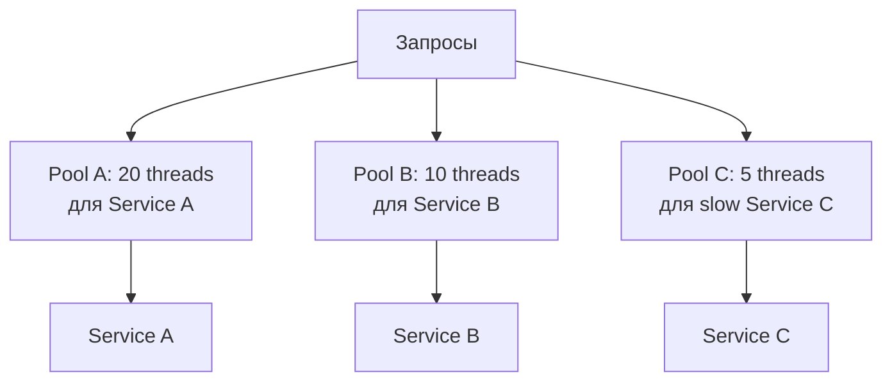
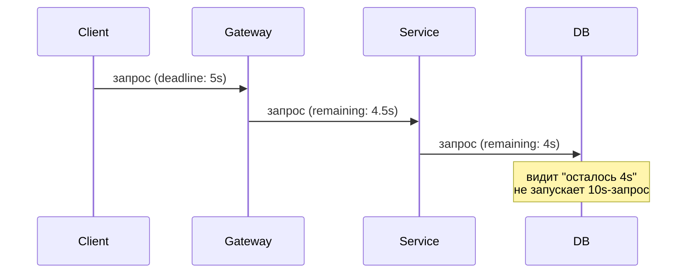

# Resilience Patterns: устойчивость распределённых систем

В распределённой системе зависимости падают, сеть тормозит, очереди забиваются.
Устойчивость (resilience) — это способность системы продолжать работать
осмысленно при сбоях части компонентов. Не «не падать никогда», а «деградировать
контролируемо».

Документ покрывает основные паттерны: circuit breaker, retry, timeout,
bulkhead, rate limiter, fallback, deadline propagation. Где они работают,
как комбинируются, какие подвохи и антипаттерны.

## Полезные ссылки

### Официальная документация

- [Resilience4j Documentation](https://resilience4j.readme.io/) — Java/Kotlin библиотека
- [Polly Documentation](https://www.pollydocs.org/) — .NET resilience
- [Hystrix (legacy)](https://github.com/Netflix/Hystrix) — оригинал, не развивается с 2018
- [AWS Architecture Center](https://docs.aws.amazon.com/architecture/latest/aws-cloud-best-practices/resilience.html) — рекомендации

### Обучающие материалы

- [Release It! (Michael Nygard)](https://pragprog.com/titles/mnee2/release-it-second-edition/) — каноничная книга по resilience
- [Site Reliability Engineering (Google)](https://sre.google/books/) — главы про cascading failure и overload
- [Failure modes and effects analysis](https://en.wikipedia.org/wiki/Failure_mode_and_effects_analysis) — методика анализа

### См. также

- [Saga Pattern](saga-pattern.md) — координация распределённых операций
- [Event-Driven Architecture](event-driven.md) — события и асинхронность как resilience-инструмент
- [Resilience4j](../libraries/java/java-resilience4j.md) — детальный гайд по библиотеке
- [Istio](../platform/containers/kubernetes/istio.md) — resilience на уровне service mesh
- [Observability](../monitoring/observability-guide.md) — без observability resilience не работает
- [Caching Patterns](enterprise-patterns/caching-patterns.md) — кеш как fallback

## Содержание

- [Зачем нужны resilience patterns](#зачем-нужны-resilience-patterns)
- [Виды отказов](#виды-отказов)
- [Каскадные сбои](#каскадные-сбои)
- [Timeout: фундамент всего](#timeout-фундамент-всего)
- [Retry: повторные попытки](#retry-повторные-попытки)
- [Circuit Breaker](#circuit-breaker)
- [Bulkhead: изоляция ресурсов](#bulkhead-изоляция-ресурсов)
- [Rate Limiter](#rate-limiter)
- [Fallback](#fallback)
- [Deadline propagation](#deadline-propagation)
- [Health checks](#health-checks)
- [Graceful degradation](#graceful-degradation)
- [Backpressure](#backpressure)
- [Идемпотентность](#идемпотентность)
- [Dead Letter Queue](#dead-letter-queue)
- [Где применять resilience](#где-применять-resilience)
- [Антипаттерны](#антипаттерны)
- [Лучшие практики](#лучшие-практики)

## Зачем нужны resilience patterns

В распределённой системе любой вызов через сеть может:

- Завершиться успешно.
- Завершиться с ошибкой.
- Не завершиться вовсе (зависнуть).
- Завершиться, но ответ потеряться по пути.

Без явных мер защиты эти ситуации заклинивают thread pool, превращают
проблему одной зависимости в downtime всего сервиса, делают пользовательский
опыт непредсказуемым.

Resilience patterns — конкретные механизмы для этих случаев. Они не
заменяют дизайн, но дают строительные блоки для надёжных систем.

## Виды отказов

| Отказ | Симптом | Источник |
|-------|---------|----------|
| Crash | Приложение упало, не отвечает | Bug, OOM, kill |
| Slow | Отвечает, но медленно | Перегрузка, GC, lock contention |
| Timeout | Не отвечает в разумное время | Зависший downstream |
| Partial | Часть запросов проходит, часть — нет | Один из replicas сломан |
| Byzantine | Отвечает неправильным результатом | Bug, corrupted state |
| Network partition | Часть сети недоступна | Switch failure, AZ outage |

Resilience patterns обычно справляются с первыми пятью. Byzantine — отдельная
тема (consensus-алгоритмы типа Raft, Paxos).

## Каскадные сбои

Самый опасный сценарий: один сервис тормозит → его клиенты копят запросы
→ thread pool забивается → клиенты клиентов тормозят → весь стек падает.


Без resilience patterns это происходит за секунды. Один лагающий downstream
кладёт весь backend.

Защита — комбинация:

- **Timeout** — не ждём бесконечно.
- **Circuit Breaker** — после серии ошибок не звоним вообще.
- **Bulkhead** — выделяем разные пулы под разные зависимости.
- **Rate Limiter** — не пропускаем больше N запросов.

> Главный смысл resilience patterns — превратить отказ зависимости в
> локальную проблему сервиса, а не в системную аварию всего платформы.

## Timeout: фундамент всего

Без timeout все остальные паттерны не работают. Если запрос может висеть
вечно, никакой circuit breaker не поможет.

Принципы:

- **Любой network call имеет timeout.** HTTP, gRPC, БД, кеш — всё.
- **Timeout pyramid.** Клиент > Gateway > Backend > БД. Внутренний timeout
  должен быть меньше внешнего.
- **Connect timeout и read timeout различны.** Connect — установка TCP,
  обычно 1–5s. Read — ожидание ответа после установки, зависит от
  природы запроса.
- **Default timeout HTTP-клиентов часто бесконечный.** Это не приемлемо.

```java
// Apache HttpClient — нужно явно
RequestConfig config = RequestConfig.custom()
    .setConnectTimeout(5_000)         // 5s на установку соединения
    .setSocketTimeout(10_000)         // 10s на ожидание ответа
    .setConnectionRequestTimeout(2_000) // 2s на получение коннекта из пула
    .build();
```

```java
// OkHttp
OkHttpClient client = new OkHttpClient.Builder()
    .connectTimeout(5, TimeUnit.SECONDS)
    .readTimeout(10, TimeUnit.SECONDS)
    .writeTimeout(10, TimeUnit.SECONDS)
    .callTimeout(15, TimeUnit.SECONDS)   // общий лимит на весь запрос
    .build();
```

| Что | Типичный timeout |
|-----|------------------|
| Connect | 1–5s |
| Внутренний HTTP-вызов | 1–10s |
| Внешний API | 10–30s |
| БД-запрос | 100ms–5s |
| Кеш | 100–500ms |
| Background job | минуты |

> Не ставь timeout «на глаз». Измерь p99 нормального ответа, поставь
> timeout = p99 × 2–3. Реальные данные лучше интуиции.

## Retry: повторные попытки

Идея: транзиентная ошибка часто исчезает на следующей попытке.

```java
// Resilience4j
RetryConfig config = RetryConfig.custom()
    .maxAttempts(3)
    .waitDuration(Duration.ofMillis(500))
    .retryExceptions(IOException.class, TimeoutException.class)
    .ignoreExceptions(BadRequestException.class)
    .build();

Retry retry = Retry.of("upstreamApi", config);
Supplier<Response> decorated = Retry.decorateSupplier(retry, () -> api.call());
Response response = decorated.get();
```

Параметры:

| Параметр | Что значит |
|----------|-----------|
| Max attempts | Сколько всего попыток (3 — типичное) |
| Backoff | Задержка между попытками (фиксированная или растущая) |
| Jitter | Случайное добавление к backoff, чтобы не синхронизировать клиентов |
| Retryable exceptions | Какие ошибки повторяем (IOException, 5xx) |
| Non-retryable | Что точно не повторяем (4xx, бизнес-ошибки) |

**Exponential backoff with jitter:**

```text
attempt 1: random(0..1s)
attempt 2: random(0..2s)
attempt 3: random(0..4s)
```

Без jitter все клиенты ретраят одновременно — bursts на восстанавливающийся
backend, новый раунд отказов.

**Что НЕ ретраить:**

- 4xx ошибки. Клиент сам виноват.
- Не-идемпотентные операции (POST без `Idempotency-Key`).
- Ошибки бизнес-логики.
- Превышение лимита без `Retry-After`.

**Когда ретраить:**

- 5xx (сервер сломан временно).
- Network errors (connection refused, timeout, reset).
- 429 Too Many Requests (с уважением `Retry-After`).
- 503 Service Unavailable.

> Retry в нескольких слоях (gateway + код + service mesh) → retry storm.
> При проблеме backend получает N×N×N запросов вместо N. Выбери ровно
> один слой для retry на каждый downstream.

## Circuit Breaker

После серии ошибок прекращаем звонить downstream — даём ему восстановиться,
быстро возвращаем ошибку клиенту.



Состояния:

| Состояние | Что происходит |
|-----------|----------------|
| CLOSED | Запросы идут, ошибки считаются |
| OPEN | Запросы НЕ идут, сразу fallback или ошибка |
| HALF_OPEN | Один пробный запрос, чтобы проверить выздоровление |

Resilience4j:

```java
CircuitBreakerConfig config = CircuitBreakerConfig.custom()
    .failureRateThreshold(50)              // 50% ошибок — открыть
    .slowCallRateThreshold(50)             // 50% медленных тоже считаем
    .slowCallDurationThreshold(Duration.ofSeconds(2))
    .waitDurationInOpenState(Duration.ofSeconds(30))
    .permittedNumberOfCallsInHalfOpenState(3)
    .slidingWindowType(SlidingWindowType.COUNT_BASED)
    .slidingWindowSize(20)
    .minimumNumberOfCalls(10)
    .build();

CircuitBreaker cb = CircuitBreaker.of("paymentApi", config);
Supplier<Response> decorated = CircuitBreaker.decorateSupplier(cb, () -> api.call());
```

Параметры:

| Параметр | Описание |
|----------|----------|
| Failure rate threshold | Процент ошибок для открытия |
| Slow call threshold | Процент медленных вызовов |
| Sliding window | Окно для подсчёта (count или time-based) |
| Min number of calls | Минимум вызовов до решения (избегаем триггера на 1 ошибку из 1) |
| Wait duration in open | Через сколько пробуем half-open |
| Permitted calls in half-open | Сколько пробных, прежде чем закрыть |

> Circuit breaker без fallback бессмысленен. Когда он открыт, что
> возвращать клиенту? Кешированное значение, default, понятную ошибку,
> degraded mode — но что-то.

## Bulkhead: изоляция ресурсов

Принцип переборок на корабле: пробоина в одном отсеке не топит весь корабль.
В софте — отдельные пулы потоков, коннектов, семафоров под разные зависимости.



Без bulkhead: один медленный downstream забивает общий thread pool, и
быстрые тоже не выполняются.

```java
// Resilience4j thread pool bulkhead
ThreadPoolBulkheadConfig config = ThreadPoolBulkheadConfig.custom()
    .maxThreadPoolSize(10)
    .coreThreadPoolSize(5)
    .queueCapacity(20)
    .build();

ThreadPoolBulkhead bulkhead = ThreadPoolBulkhead.of("slowService", config);
```

Semaphore-based (без отдельных потоков, для async):

```java
BulkheadConfig config = BulkheadConfig.custom()
    .maxConcurrentCalls(20)
    .maxWaitDuration(Duration.ofMillis(500))
    .build();
Bulkhead bulkhead = Bulkhead.of("api", config);
```

Уровни bulkhead:

- **Connection pool per upstream.** HikariCP per БД, Apache HttpClient pool per API.
- **Thread pool per integration.** Один пул на каждый внешний API.
- **Semaphore per critical resource.** Лимит in-flight запросов.
- **Process per workload.** Отдельные deployments для разных типов нагрузки.

## Rate Limiter

Защита от перегрузки: ограничивает количество запросов в единицу времени.

| Алгоритм | Особенности |
|----------|-------------|
| Token bucket | Burst разрешён, средняя скорость ограничена |
| Leaky bucket | Сглаживание трафика, фиксированная скорость |
| Fixed window | Простой, но «edge effect» |
| Sliding window | Точнее fixed, но дороже |
| Concurrent | Лимит в моменте, не в окне |

Применяется на двух уровнях:

- **На входе** (rate limit входящих): защита от abuse, см. [API Gateway](../development/api/api-gateway.md).
- **На выходе** (исходящие к чужому API): уважение их лимитов.

```java
// Resilience4j RateLimiter
RateLimiterConfig config = RateLimiterConfig.custom()
    .limitForPeriod(50)
    .limitRefreshPeriod(Duration.ofSeconds(1))
    .timeoutDuration(Duration.ofMillis(500))
    .build();

RateLimiter rateLimiter = RateLimiter.of("externalApi", config);
```

Если ответ от чужого API содержит `X-RateLimit-Remaining` или `Retry-After` —
учитывай в адаптивной стратегии.

## Fallback

Что вернуть, когда нормальный путь не работает?

Стратегии:

| Стратегия | Пример |
|-----------|--------|
| Кешированный ответ | Старые данные из Redis |
| Default value | Пустой список вместо рекомендаций |
| Static response | «Попробуйте позже» |
| Degraded mode | Без рекомендаций, но с основными данными |
| Альтернативный backend | Secondary region, другая партия данных |
| Очередь на потом | Сохранить запрос, обработать после восстановления |

```java
Supplier<Recommendations> fallback = () -> Recommendations.empty();

Supplier<Recommendations> resilient = Decorators.ofSupplier(() -> recApi.get())
    .withCircuitBreaker(cb)
    .withRetry(retry)
    .withFallback(List.of(Exception.class), fallback)
    .decorate();
```

Хороший fallback должен:

- Быть быстрым (никаких внешних вызовов).
- Не падать сам (тестируется).
- Возвращать что-то осмысленное для клиента.
- Логировать, что использован fallback (для алерта).

> Fallback — это не «маскировка ошибок». Метрики и алерты должны срабатывать
> при частых fallback. Иначе деградация становится нормой и никто не чинит.

## Deadline propagation

Запрос имеет «дедлайн» — момент, после которого ответ бесполезен. Дедлайн
передаётся через границы сервисов: каждый downstream видит, сколько времени
осталось, и не тратит время на обработку, которая всё равно не успеет.



В gRPC это встроено: `context.WithDeadline()` в Go, `Deadline` в Java.
Каждый сервер видит deadline и может проверить:

```go
ctx, cancel := context.WithTimeout(parentCtx, 5*time.Second)
defer cancel()

select {
case <-ctx.Done():
    return ctx.Err()  // дедлайн прошёл, не делаем запрос
default:
    return downstream.Call(ctx, req)
}
```

В HTTP — через заголовок (нестандартный):

```text
Deadline: 1714145000.123
X-Request-Deadline: 5000  # ms left
```

Польза:

- Не тратим CPU и пул потоков на запросы, которые клиент уже не ждёт.
- Каскадные timeout согласованы: deadline на любом уровне меньше клиентского.
- Защита от слабых retries: после первого retry дедлайн уже сократился.

## Health checks

Сервис должен сам сообщать о своей готовности обслуживать трафик.

| Probe | Что проверяет |
|-------|--------------|
| Liveness | Приложение живо (event loop работает, нет deadlock) |
| Readiness | Готов принимать трафик (БД доступна, кэш прогрет) |
| Startup | Приложение завершило инициализацию (для долгого старта) |

Различие критично:

- **Liveness fail** → kubelet перезапустит pod. Это hard reset.
- **Readiness fail** → pod не получает трафик, но не перезапускается.

Liveness — простой, без зависимостей. «Я отвечаю на HTTP — значит жив».
Readiness — глубже: «БД доступна, кэш загружен, миграции применены».

```yaml
# Kubernetes
livenessProbe:
  httpGet: { path: /health/liveness, port: 8080 }
  initialDelaySeconds: 30
  periodSeconds: 10
  failureThreshold: 3
readinessProbe:
  httpGet: { path: /health/readiness, port: 8080 }
  initialDelaySeconds: 5
  periodSeconds: 5
  failureThreshold: 1
```

```java
// Spring Boot Actuator
management:
  endpoint:
    health:
      probes: { enabled: true }
      show-details: when_authorized
  health:
    db:           { enabled: true }
    diskSpace:    { enabled: true }
    livenessState: { enabled: true }
    readinessState: { enabled: true }
```

> Не клади БД в liveness. Если БД упала на 30 секунд — все pod'ы перезапустятся,
> но БД не вернётся быстрее. Получаем ничего, теряем кэши и in-memory state.

## Graceful degradation

Принцип: при сбое некритичной зависимости показываем меньше функций,
а не валим всё.

| Critical | Non-critical |
|----------|--------------|
| Логин, корзина, оплата | Рекомендации, отзывы, аналитика |
| Должно работать всегда | Можно отключить при проблемах |

Дизайн:

- Каждая зависимость имеет fallback (см. выше).
- Critical path не зависит от non-critical (нет cross-вызовов).
- При перегрузке отключаем non-critical через feature flags.

```java
@Service
public class HomePageService {

    public HomePageDto build(Long userId) {
        Catalog catalog = catalogService.getMain();         // critical
        User user = userService.get(userId);                 // critical

        // Non-critical: с fallback
        List<Recommendation> recs = circuitBreaker.executeSupplier(
            () -> recService.recommend(userId),
            ex -> List.of()
        );

        return new HomePageDto(catalog, user, recs);
    }
}
```

## Backpressure

Когда downstream не успевает — нужно тормозить upstream, а не топить его.

| Подход | Где применяется |
|--------|-----------------|
| Bounded queue | Producer-consumer на одной машине |
| Semaphore | Ограничение параллелизма |
| Reactive Streams | RxJava, Project Reactor — встроено |
| HTTP 429 | API возвращает «slow down» |
| Kafka consumer lag | Producer ориентируется на лаг |
| Acknowledgment-based flow control | gRPC streaming, Reactive Streams |

Reactive Streams (Project Reactor):

```java
Flux.fromIterable(largeList)
    .onBackpressureBuffer(1000,
        dropped -> log.warn("Dropped: {}", dropped),
        BufferOverflowStrategy.DROP_OLDEST)
    .flatMap(item -> processAsync(item), 10)  // параллелизм 10
    .subscribe();
```

Backpressure нужен везде, где скорость генерации может превысить скорость
обработки. Без него — OOM или потеря данных без видимости.

## Идемпотентность

Если retry безопасен, нужно меньше волноваться об ошибках. Идемпотентность —
это «N выполнений = 1 выполнение».

| Операция | Идемпотентна? |
|----------|---------------|
| GET | Да |
| PUT с полным состоянием | Да |
| DELETE | Да (повторное удаление = no-op) |
| POST | Нет по умолчанию. Делаем через `Idempotency-Key` |
| INSERT | Нет. Через `INSERT ... ON CONFLICT` |

`Idempotency-Key` для POST — стандарт для платежей и других важных операций:

```http
POST /api/payments HTTP/1.1
Idempotency-Key: 7e3c9d4f-...
Content-Type: application/json

{ "amount": 100.00, "to": "alice" }
```

Сервер:

1. Видит `Idempotency-Key`, ищет в кеше или БД.
2. Если есть — возвращает сохранённый ответ.
3. Если нет — выполняет операцию и сохраняет результат с этим ключом.

См. подробнее в [Saga Pattern](saga-pattern.md), раздел про идемпотентность.

## Dead Letter Queue

Сообщение, которое не удаётся обработать после N попыток, отправляется в
отдельную очередь — DLQ. Это предотвращает зацикливание и позволяет
расследовать причины.


Что должно быть в DLQ:

- Оригинальное сообщение целиком.
- Метаданные: попытки, последняя ошибка, timestamps.
- Trace_id для связи с логами.

```java
// Spring Kafka — конфигурация DLQ
@Bean
public DefaultErrorHandler errorHandler(KafkaTemplate<Object, Object> template) {
    DeadLetterPublishingRecoverer recoverer = new DeadLetterPublishingRecoverer(
        template,
        (record, ex) -> new TopicPartition("orders.DLQ", record.partition())
    );
    return new DefaultErrorHandler(recoverer,
        new FixedBackOff(1000L, 3L));
}
```

Эксплуатация:

- Алерт: сообщений в DLQ > 0 — для критичных топиков. > N — для остальных.
- Скрипты replay в main queue после фикса.
- Retention в DLQ дольше, чем в main (не теряем историю).

## Где применять resilience

Не везде нужно. Стоимость patterns — сложность кода и эксплуатации.

| Где обязательно | Где можно проще |
|-----------------|-----------------|
| Внешние API | Локальные вызовы внутри процесса |
| Cross-region вызовы | Тот же datacenter |
| Платежи, critical bizz logic | Аналитика, метрики |
| Long-running операции | Быстрые in-process |

Для каждой network-зависимости минимум:

- Timeout (любой network call).
- Retry с backoff и jitter (для idempotent).
- Circuit breaker (для критичных).
- Fallback (хотя бы понятная ошибка клиенту).

## Антипаттерны

| Антипаттерн | Почему плохо |
|-------------|--------------|
| Retry без backoff | Бьём по падающему backend |
| Retry на не-идемпотентные операции | Дубликаты, double-charge |
| Retry на нескольких слоях | Retry storm |
| Бесконечный timeout | Thread pool забивается на одной зависимости |
| Circuit breaker без fallback | Просто возвращаем ошибку — какая разница |
| Один общий thread pool на всё | Bulkhead не работает |
| Health check, проверяющий всё | БД упала — pods перезапускаются массово |
| Catch-all и log.error | Скрываем причину, нет алертов |
| Retry на 4xx | Клиент сам виноват, retry не поможет |
| Маскирование ошибок fallback'ом | Деградация становится нормой |
| Resilience «по фэн-шую» — на всё | Сложность без пользы для не-критичных вещей |

## Лучшие практики

- **Timeout — везде.** Без него остальное не работает.
- **Timeout pyramid.** Внутренние < клиентских. Координируйся между сервисами.
- **Retry только для идемпотентных операций.** POST → `Idempotency-Key`.
- **Exponential backoff with jitter.** Не synchronized retries.
- **Circuit breaker на критичные downstream.** Быстро падать вместо
  висеть пять минут на каждом запросе.
- **Bulkhead на каждый downstream.** Отдельные thread pool, connection pool.
- **Fallback с видимостью.** Метрика «запросов через fallback» обязательна.
- **Liveness — простой. Readiness — реальный.** Не лезь в БД из liveness.
- **Graceful degradation.** Critical path не зависит от non-critical.
- **DLQ для брокеров.** С алертами и runbook.
- **Тестируй failure scenarios.** Chaos engineering, fault injection.
  Без тестов resilience не работает.
- **Без observability никакой resilience.** Метрики open/half-open/closed
  по circuit breaker, retry counts, fallback usage — обязательны.
- **Документируй runbook.** «Если 99% запросов идут через fallback X, то Y».

**Итог:** resilience patterns превращают каскадные сбои в локальные. Timeout —
основа, Retry — для transient errors с jitter и идемпотентностью, Circuit
Breaker — для падающих downstream, Bulkhead — изоляция ресурсов, Fallback —
осмысленная деградация. Все паттерны бесполезны без observability и без
тестирования отказов.
