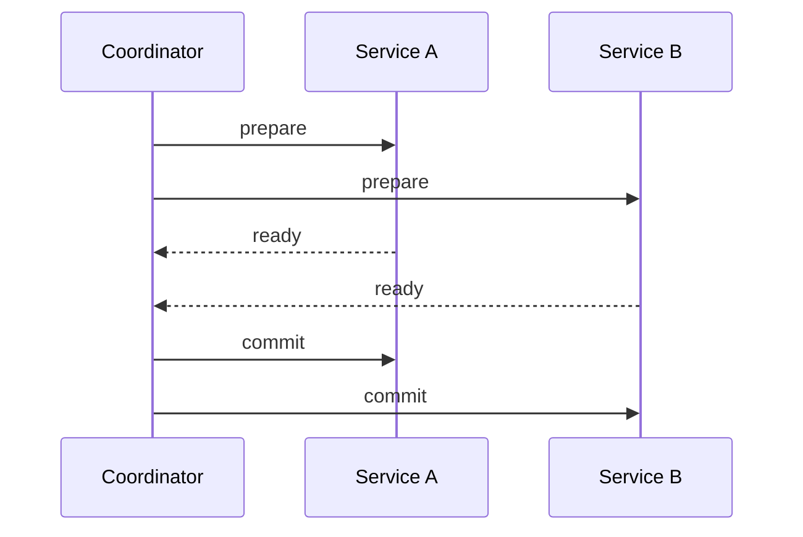
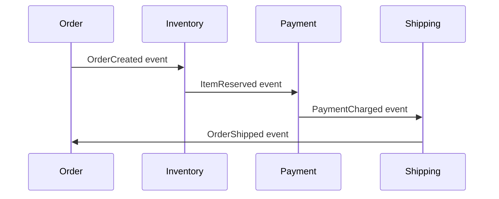
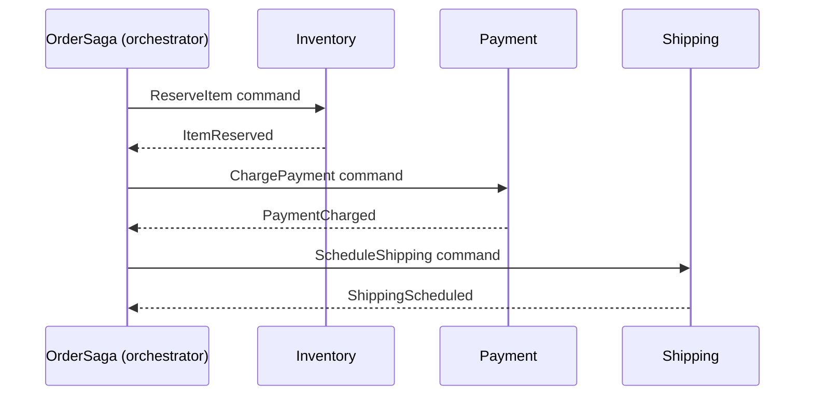
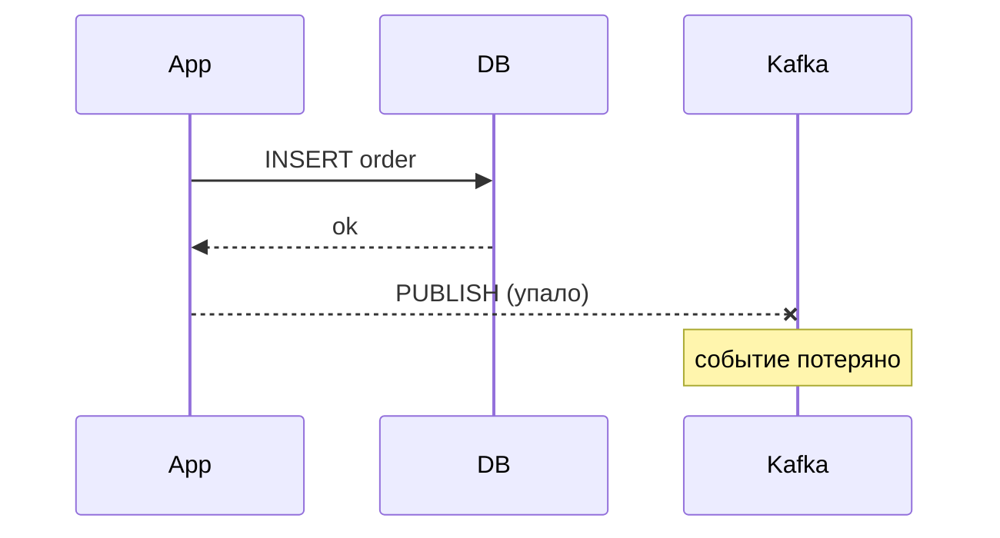
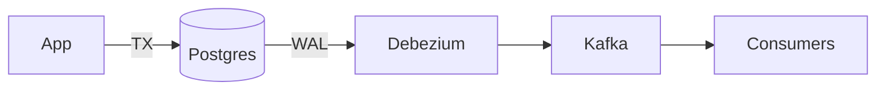
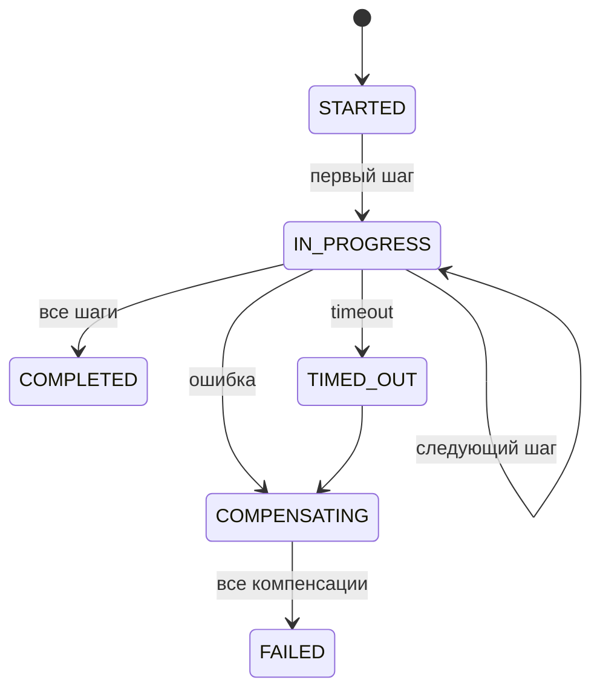

# Saga Pattern: распределённые транзакции

В микросервисной архитектуре одна бизнес-операция часто затрагивает несколько
сервисов: создание заказа = резерв склада + списание оплаты + уведомление.
Классический ACID-транзакции с двухфазным коммитом (2PC) для этого не подходит —
блокирующий, не масштабируется, требует поддержки в каждом ресурсе.

Saga — последовательность локальных транзакций. Каждая транзакция обновляет
данные в одном сервисе и публикует событие, триггерящее следующую. Если шаг
падает — выполняются компенсирующие действия, откатывающие предыдущие шаги.
Это даёт eventual consistency без распределённой блокировки.

Документ объясняет, чем Saga отличается от 2PC, две модели координации
(choreography и orchestration), как реализуется на практике (Outbox,
идемпотентность, дедупликация), и какие подводные камни ждут.

## Полезные ссылки

### Официальная документация и статьи

- [Pattern: Saga (microservices.io)](https://microservices.io/patterns/data/saga.html) — каноничное определение
- [Sagas (Hector Garcia-Molina, 1987)](https://www.cs.cornell.edu/andru/cs711/2002fa/reading/sagas.pdf) — оригинальная статья
- [Outbox Pattern](https://microservices.io/patterns/data/transactional-outbox.html) — транзакционный outbox
- [Debezium](https://debezium.io/documentation/) — CDC для outbox

### Обучающие материалы

- [Microservices Patterns (Chris Richardson)](https://microservices.io/book) — глава про Saga
- [Designing Data-Intensive Applications (Martin Kleppmann)](https://dataintensive.net/) — главы про распределённые транзакции
- [Eventuate Tram Saga](https://eventuate.io/abouteventuatetram.html) — фреймворк для Java/Spring

### См. также

- [Event-Driven Architecture](event-driven.md) — события как способ интеграции
- [Event Sourcing](event-sourcing.md) — хранение состояния как событий
- [CQRS](cqrs.md) — разделение чтения и записи
- [Domain-Driven Design](ddd.md) — границы агрегатов и сервисов
- [Kafka](../development/messaging/kafka/kafka.md) — message broker для саг
- [Caching Patterns](enterprise-patterns/caching-patterns.md) — кеш в распределённых системах

## Содержание

- [Зачем Saga: проблема с 2PC](#зачем-saga-проблема-с-2pc)
- [Базовая модель](#базовая-модель)
- [Choreography vs Orchestration](#choreography-vs-orchestration)
- [Компенсирующие действия](#компенсирующие-действия)
- [Идемпотентность](#идемпотентность)
- [Outbox Pattern: атомарность БД и брокера](#outbox-pattern-атомарность-бд-и-брокера)
- [Inbox Pattern: дедупликация на стороне получателя](#inbox-pattern-дедупликация-на-стороне-получателя)
- [Семантические блокировки](#семантические-блокировки)
- [Пример: оформление заказа](#пример-оформление-заказа)
- [Состояния саги](#состояния-саги)
- [Тестирование саг](#тестирование-саг)
- [Решение проблем](#решение-проблем)
- [Когда не использовать Saga](#когда-не-использовать-saga)
- [Лучшие практики](#лучшие-практики)

## Зачем Saga: проблема с 2PC

Классический способ сделать атомарную операцию через границы — Two-Phase
Commit (2PC):



Проблемы 2PC в микросервисах:

| Проблема | Почему важно |
|----------|--------------|
| Блокировки на время prepare | Низкая пропускная способность, лочки на ресурсы |
| Single point of failure | Падение координатора — все участники в подвешенном состоянии |
| Не работает с внешними системами | Stripe, SendGrid, AWS S3 не поддерживают XA |
| Проблема в гетерогенной инфраструктуре | Не все БД и брокеры умеют XA |
| Теорема CAP | 2PC выбирает CP, на длинных операциях это убивает доступность |

Saga решает эти проблемы за счёт отказа от глобальной атомарности. Вместо
этого — eventual consistency через последовательность локальных транзакций
с компенсациями.

## Базовая модель

Saga состоит из шагов. Каждый шаг — локальная ACID-транзакция в одном
сервисе. У каждого шага есть пара: `forward action` и `compensating action`.

```text
Step 1:  bookHotel()        compensation: cancelHotelBooking()
Step 2:  bookFlight()       compensation: cancelFlightBooking()
Step 3:  chargePayment()    compensation: refundPayment()
```

Если шаг 3 упал, компенсации запускаются в обратном порядке: `cancelFlight`,
затем `cancelHotel`. Saga завершается в консистентном состоянии (как до старта),
но не атомарно — в течение времени выполнения данные были «полу-готовы».

> Eventual consistency — фундаментальный компромисс Saga. В моменте между
> шагами система неконсистентна. Дизайн должен это учитывать в UI и в API
> (статусы `PENDING`, `PROCESSING`).

## Choreography vs Orchestration

Два способа координировать шаги саги.

### Choreography

Каждый сервис слушает события и реагирует. Нет центрального координатора —
сервисы общаются через broker.



Плюсы:

- Слабая связь: добавил сервис — он подписался на нужные события.
- Простая реализация для коротких саг (2–3 шага).
- Никаких single point of failure кроме брокера.

Минусы:

- Бизнес-логика размазана по сервисам — сложно понять весь flow.
- Сложно добавлять условные ветвления.
- Цикл событий между сервисами — можно создать race conditions.
- Тестирование сложнее: нужно поднимать несколько сервисов.

### Orchestration

Центральный сервис-оркестратор координирует шаги. Каждый шаг — запрос к
сервису, ответ — событие.



Плюсы:

- Бизнес-логика в одном месте — оркестраторе.
- Легко добавлять условные ветвления, ретраи.
- Легче дебажить: один state machine.
- Удобно для длинных саг (5+ шагов).

Минусы:

- Оркестратор — потенциальный узкий место.
- Связность выше: сервисы знают о существовании оркестратора.
- Нужен механизм state persistence (event sourcing, БД).

| Параметр | Choreography | Orchestration |
|----------|--------------|---------------|
| Сложность | Низкая | Средняя |
| Видимость flow | Низкая (распределена) | Высокая (в одном месте) |
| Связность | Слабая (через события) | Средняя (через команды) |
| Подходит для | 2–3 шага, простая логика | 5+ шагов, ветвления, retries |
| State machine | Распределён | Централизован |

**Когда выбрать choreography:** короткая сага без сложных условий, добавление
новых сервисов без изменения existing.

**Когда выбрать orchestration:** длинная сага с ветвлениями, нужен dashboard
текущего состояния, retry-политики на каждом шаге.

> Для критичных бизнес-процессов (заказ, платёж, KYC) предпочитай orchestration.
> Бизнес-логику легче ревьюить и менять, когда она в одном файле, а не размазана.

## Компенсирующие действия

Компенсация — это «логический откат», не настоящий rollback. Она оставляет
след в БД (запись о возврате, отмене), а не удаляет данные.

| Forward | Compensation |
|---------|--------------|
| `bookFlight()` | `cancelFlight()` |
| `chargePayment()` | `refundPayment()` |
| `reserveStock()` | `releaseStock()` |
| `sendEmail()` | `sendCancellationEmail()` (нельзя «отменить» отправленный email) |
| `createUser()` | `disableUser()` или `markDeleted()` |

Принципы:

- **Идемпотентность.** Компенсация может вызваться несколько раз — повторное
  выполнение не должно ломать консистентность.
- **Должна всегда заканчиваться успехом.** Если компенсация падает — система
  застряла. Делай компенсации простыми и тестируй на retry.
- **Не использует внешние сервисы без необходимости.** Компенсация должна
  быть быстрой и надёжной.
- **Sequenceable.** Можно выполнить в любом порядке относительно других
  шагов (если бизнес позволяет).

> Не все действия откатываемы. Отправленный email, нажатый «Print» в
> физическом мире, опубликованный пост в соцсети. Дизайн саги должен это
> учитывать: либо такие шаги — последние, либо есть альтернатива (отдельный
> отзыв-email, скрытие поста).

## Идемпотентность

Сообщение в брокере может прийти больше одного раза (at-least-once delivery).
Каждый шаг саги должен быть идемпотентен.

Способы:

| Способ | Как работает |
|--------|--------------|
| Уникальный ID операции | В таблицу processed_messages пишется ID, перед обработкой проверяется наличие |
| Условные UPDATE | `UPDATE balance SET amount = ? WHERE id = ? AND version = ?` |
| Natural idempotency | `SET status = SHIPPED` — повторное выполнение не меняет состояние |
| Outbox с deduplication | Outbox содержит unique constraint по message_id |

Пример с processed_messages:

```sql
CREATE TABLE processed_messages (
    message_id UUID PRIMARY KEY,
    saga_id UUID NOT NULL,
    processed_at TIMESTAMP NOT NULL DEFAULT now()
);

-- В транзакции обработки:
INSERT INTO processed_messages (message_id, saga_id) VALUES (?, ?)
ON CONFLICT DO NOTHING;
-- Если CONFLICT — сообщение уже обработано, выходим
-- Иначе — выполняем бизнес-логику
```

```java
@Transactional
public void handle(ChargePaymentCommand cmd) {
    if (!processedMessageRepo.tryInsert(cmd.getMessageId())) {
        // дубликат, пропускаем
        return;
    }
    // основная логика
    paymentService.charge(cmd.getAmount(), cmd.getOrderId());
    publishEvent(new PaymentChargedEvent(cmd.getOrderId(), cmd.getMessageId()));
}
```

## Outbox Pattern: атомарность БД и брокера

Проблема dual-write: после успешного `INSERT` в БД нужно опубликовать событие
в Kafka. Если приложение упадёт между этими действиями — БД обновлена, событие
потеряно. И наоборот: событие отправлено, БД ещё не зафиксирована.



Outbox решает это через одну транзакцию: `INSERT` в основную таблицу
+ `INSERT` в `outbox` таблицу. Отдельный процесс читает `outbox` и публикует
в Kafka.

```sql
CREATE TABLE outbox (
    id UUID PRIMARY KEY,
    aggregate_type VARCHAR(255),
    aggregate_id VARCHAR(255),
    type VARCHAR(255),
    payload JSONB,
    created_at TIMESTAMP NOT NULL DEFAULT now()
);

BEGIN;
    INSERT INTO orders (id, status, ...) VALUES (?, 'PENDING', ...);
    INSERT INTO outbox (id, aggregate_type, aggregate_id, type, payload)
    VALUES (gen_random_uuid(), 'Order', ?, 'OrderCreated', '{"orderId": ...}');
COMMIT;
```

Способы доставки:

| Способ | Как работает |
|--------|--------------|
| Polling publisher | Приложение периодически читает outbox и публикует |
| CDC (Change Data Capture) | Debezium читает WAL Postgres и публикует в Kafka |
| Trigger-based | Триггер БД пишет в стейджинг, отдельный процесс публикует |

CDC через Debezium — текущий стандарт. Без polling-задержки, без нагрузки
от polling-запросов.

```yaml
# Debezium connector
name: orders-outbox
config:
  connector.class: io.debezium.connector.postgresql.PostgresConnector
  database.hostname: postgres
  database.port: 5432
  database.user: ...
  table.include.list: public.outbox
  transforms: outbox
  transforms.outbox.type: io.debezium.transforms.outbox.EventRouter
```



## Inbox Pattern: дедупликация на стороне получателя

Аналог outbox для получателей. Сохраняем входящие сообщения в `inbox`
таблицу в той же транзакции, что и бизнес-логика. Перед обработкой
проверяем — не было ли это сообщение раньше.

```sql
CREATE TABLE inbox (
    message_id UUID PRIMARY KEY,
    received_at TIMESTAMP NOT NULL DEFAULT now()
);

BEGIN;
    INSERT INTO inbox (message_id) VALUES (?);  -- дубликат → CONFLICT
    UPDATE order SET status = 'PAID' WHERE id = ?;
COMMIT;
```

Outbox + Inbox дают exactly-once семантику в распределённой системе:
дублирующее сообщение в Kafka не приведёт к двойной обработке.

## Семантические блокировки

Чтобы избежать гонок и double-spending в момент саги, используются
семантические блокировки — статусы в БД, не настоящие row-level locks.

```text
Order status:
  PENDING       — сага в процессе
  CONFIRMED     — сага успешно завершилась
  CANCELLED     — компенсации выполнены
```

Никакая операция не может изменять order, пока он не в состоянии CONFIRMED.
API возвращает 409 Conflict при попытке изменения PENDING-заказа.

Это лучше, чем настоящие БД-блокировки: они не висят между сервисами,
не вызывают deadlock, чисто декларативны.

## Пример: оформление заказа

Orchestration на Java, оркестратор как state machine:

```java
public enum OrderSagaState {
    STARTED,
    INVENTORY_RESERVED,
    PAYMENT_CHARGED,
    SHIPPING_SCHEDULED,
    COMPLETED,
    COMPENSATING,
    FAILED
}

@Service
@Transactional
public class OrderSagaOrchestrator {

    public void on(OrderCreated event) {
        sagaRepo.save(new Saga(event.getOrderId(), STARTED));
        commandBus.send(new ReserveInventoryCmd(event.getOrderId(), event.getItems()));
    }

    public void on(InventoryReserved event) {
        Saga saga = sagaRepo.findById(event.getOrderId()).orElseThrow();
        saga.transitionTo(INVENTORY_RESERVED);
        commandBus.send(new ChargePaymentCmd(event.getOrderId(), event.getAmount()));
    }

    public void on(PaymentChargeFailed event) {
        Saga saga = sagaRepo.findById(event.getOrderId()).orElseThrow();
        saga.transitionTo(COMPENSATING);
        // Компенсация в обратном порядке
        commandBus.send(new ReleaseInventoryCmd(event.getOrderId()));
    }

    public void on(InventoryReleased event) {
        Saga saga = sagaRepo.findById(event.getOrderId()).orElseThrow();
        saga.transitionTo(FAILED);
        commandBus.send(new RejectOrderCmd(event.getOrderId(), saga.getFailureReason()));
    }
    // ...
}
```

Choreography альтернатива (упрощённо):

```java
// Inventory Service
@KafkaListener(topics = "order-events")
public void on(OrderCreated event) {
    boolean reserved = inventory.reserve(event.getItems());
    if (reserved) {
        kafka.send("inventory-events", new InventoryReserved(event.getOrderId()));
    } else {
        kafka.send("inventory-events", new InventoryReservationFailed(event.getOrderId()));
    }
}

// Payment Service
@KafkaListener(topics = "inventory-events")
public void on(InventoryReserved event) {
    boolean charged = payment.charge(event.getOrderId());
    if (charged) {
        kafka.send("payment-events", new PaymentCharged(event.getOrderId()));
    } else {
        kafka.send("payment-events", new PaymentFailed(event.getOrderId()));
    }
}

// Inventory Service compensates on payment failure
@KafkaListener(topics = "payment-events")
public void on(PaymentFailed event) {
    inventory.release(event.getOrderId());
    kafka.send("inventory-events", new InventoryReleased(event.getOrderId()));
}
```

## Состояния саги

Saga — это state machine. Стандартные состояния:

| Состояние | Что значит |
|-----------|-----------|
| STARTED | Сага запущена, шагов нет |
| IN_PROGRESS | Выполняется один из шагов |
| COMPENSATING | Один из шагов упал, выполняются компенсации |
| COMPLETED | Все шаги успешно выполнены |
| FAILED | Компенсации завершены, начальное состояние восстановлено |
| TIMED_OUT | Превышен общий timeout саги |



Persistence:

- **Event sourcing.** Каждое изменение состояния — событие в журнал.
  Восстановление при рестарте — replay событий.
- **State + log.** Текущее состояние в БД + log изменений отдельно.
- **Camunda / Temporal.** Внешний workflow engine с persistence.

Для production-саг рекомендуется Temporal или Camunda — они дают timer'ы,
retry-политики, dashboard, тестирование из коробки.

## Тестирование саг

Уровни тестирования:

| Уровень | Что тестируем |
|---------|---------------|
| Unit | Логика state machine оркестратора, переходы |
| Integration | Один сервис против реального брокера |
| Contract | События имеют ожидаемую схему между сервисами |
| End-to-end | Весь happy path и компенсации, через тестовый Kafka |
| Chaos | Падение одного сервиса в середине, дубликаты сообщений |

Test cases:

- Happy path: все шаги успешны.
- Компенсация на каждом шаге: если падает шаг N, проверь что компенсации
  для шагов 1..N-1 выполнились.
- Дубликаты сообщений: одно и то же событие приходит дважды.
- Out-of-order: события приходят в неправильном порядке.
- Timeout: оркестратор не получил ответ за N минут.
- Race conditions: несколько саг одновременно меняют один ресурс.

```java
@Test
void testCompensationOnPaymentFailure() {
    // 1. Запуск саги
    sagaOrchestrator.on(new OrderCreated(orderId, items, amount));

    // 2. Inventory успешно резервирует
    sagaOrchestrator.on(new InventoryReserved(orderId, reservationId));

    // 3. Payment падает
    sagaOrchestrator.on(new PaymentChargeFailed(orderId, "Insufficient funds"));

    // 4. Проверяем — компенсация Inventory вызвана
    verify(commandBus).send(argThat(cmd ->
        cmd instanceof ReleaseInventoryCmd &&
        ((ReleaseInventoryCmd) cmd).getOrderId().equals(orderId)));

    // 5. После компенсации сага в FAILED
    sagaOrchestrator.on(new InventoryReleased(orderId));
    Saga saga = sagaRepo.findById(orderId).orElseThrow();
    assertThat(saga.getState()).isEqualTo(FAILED);
}
```

## Решение проблем

| Симптом | Причина | Что сделать |
|---------|---------|-------------|
| Сага «зависла» — все шаги вроде ок, но статус не меняется | Событие потеряно или не доставлено | Outbox + retry, alerting на саги > N минут в IN_PROGRESS |
| Компенсация не выполняется | Падает компенсирующий шаг | Сделать компенсацию идемпотентной, retry с backoff, alert на FAILED |
| Двойная обработка одного шага | At-least-once delivery + нет дедупликации | Inbox pattern или обработанные message_id в БД |
| Компенсации в неправильном порядке | Out-of-order events | Saga ID + sequence number в каждом событии, ordering на consumer |
| Race condition между двумя сагами на один ресурс | Нет блокировки | Семантические блокировки (статусы) или optimistic locking |
| Сага зацикливается | Forward action генерирует событие, которое триггерит сама себя | Чёткое разделение топиков команд и событий |
| Бизнес-логика в Choreography сложно понять | Размазана по сервисам | Перейти на orchestration или диаграмму последовательности в документации |
| Outbox таблица растёт | Не очищается | Cron-job или Debezium с retention; индекс на `created_at` |

## Когда не использовать Saga

Saga — это сложность. Не нужна, когда:

- Операция в одном bounded context — обычная ACID-транзакция.
- Высокая допустимая консистентность — простой retry в коде.
- Нет компенсирующих действий — некоторые домены физически нельзя откатить.
- Один монолит — Saga — анти-паттерн в монолите, ACID работает.
- Команда не готова — Saga требует зрелости в observability и тестировании.

Альтернативы:

| Альтернатива | Когда |
|--------------|-------|
| Локальная транзакция | Один сервис, один БД |
| 2PC (XA) | Внутри корпоративной инфраструктуры с XA-БД и без внешних API |
| Eventual consistency без саги | Если откат не нужен (всегда forward) |
| TCC (Try-Confirm-Cancel) | Когда нужны зарезервированные ресурсы с явным confirm |
| Workflow engine (Temporal, Camunda) | Сложные long-running процессы (часы, дни) |

## Лучшие практики

- Начинай с orchestration. Он понятнее и легче рефакторится в choreography
  при необходимости.
- Каждый шаг идемпотентен. Это не «nice to have», это обязательно.
- Используй Outbox pattern с самого начала. Dual-write — источник тонких багов.
- CDC через Debezium для outbox в production. Polling — только для прототипа.
- Логируй все переходы состояний саги с saga_id и trace_id.
- Алерт на саги, висящие в IN_PROGRESS дольше N минут.
- Дашборд: сколько саг в каждом состоянии, время выполнения, частота
  компенсаций. Рост компенсаций — признак проблем.
- Компенсации тестируются отдельно — это критичный код.
- Используй workflow engine (Temporal, Camunda) для саг с timer'ами и
  длинными процессами (часы, дни).
- Не клади бизнес-логику в обработчики событий — выноси в domain service.
  Обработчик — только координация.
- Версионируй события. Schema Registry в Kafka, Avro/Protobuf, чтобы
  старые consumer'ы не ломались.
- Семантические блокировки (статусы) вместо row-locks. Это работает
  через границы сервисов.

**Итог:** Saga — стандартный способ обеспечить консистентность операций
через несколько микросервисов, заменяющий 2PC. Choreography — для коротких
саг и слабой связности, orchestration — для сложных бизнес-процессов.
Outbox + Inbox + идемпотентность — обязательная инфраструктура. Eventual
consistency — фундаментальный компромисс, который должен учитываться
в UX и API.
