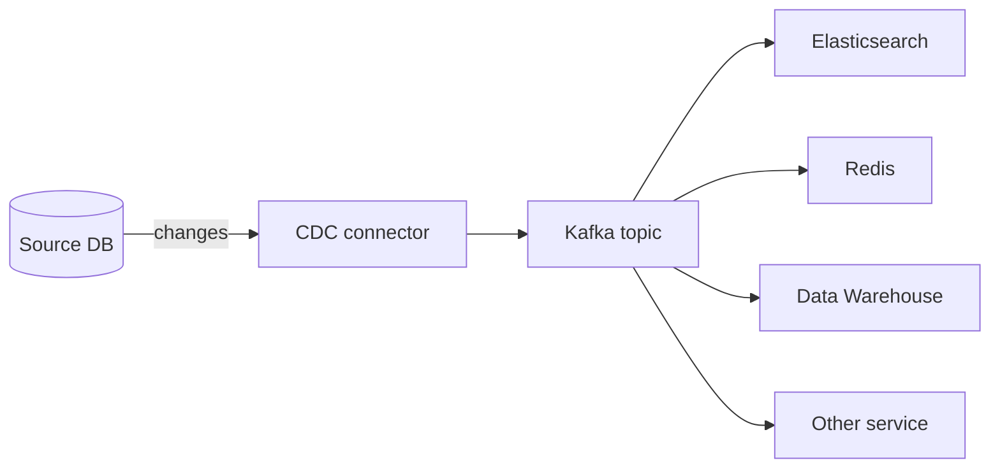
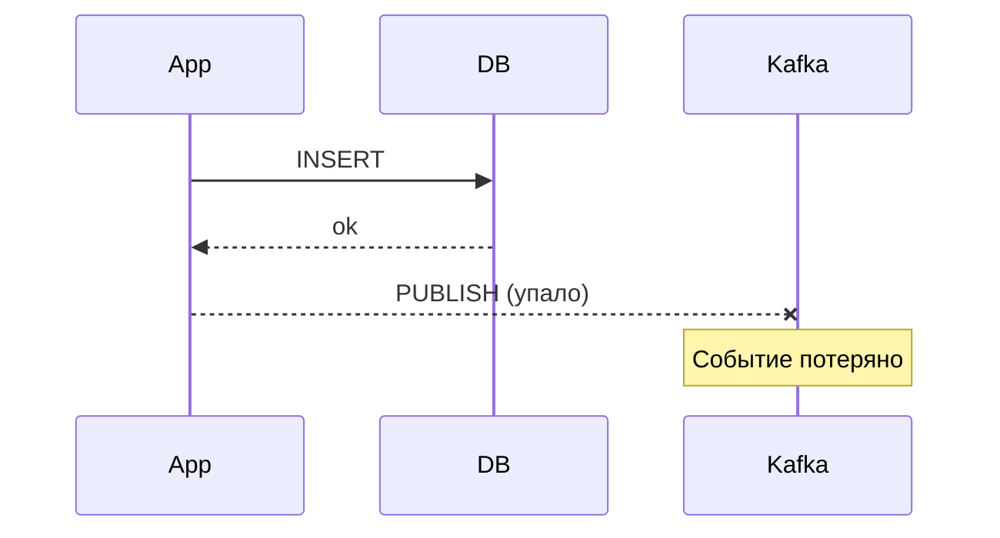
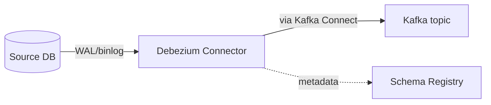
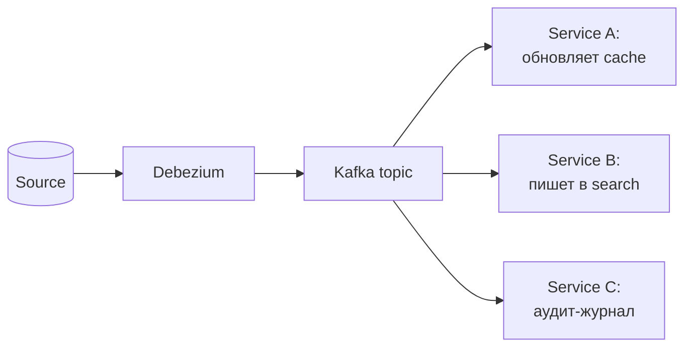

# Change Data Capture: распространение изменений из БД

CDC (Change Data Capture) — техника отслеживания и распространения изменений
в БД во внешние системы (Kafka, другие БД, поисковые индексы, кеши).
Превращает «таблицы с данными» в «поток событий», который потребляют другие
сервисы.

Альтернативы (polling, dual-write, batch ETL) ломаются на масштабе:
polling нагружает БД, dual-write теряет атомарность, batch ETL медленный.
CDC решает все три проблемы за счёт чтения transaction log БД.

Документ покрывает: что такое CDC и зачем он нужен, два подхода (log-based
и trigger-based), Debezium как стандартное решение, snapshot для исторических
данных, интеграцию с Kafka, типовые проблемы.

## Полезные ссылки

### Официальная документация

- [Debezium Documentation](https://debezium.io/documentation/) — самый популярный CDC-инструмент
- [Kafka Connect](https://docs.confluent.io/platform/current/connect/) — фреймворк для коннекторов
- [Postgres Logical Decoding](https://www.postgresql.org/docs/current/logicaldecoding.html) — основа CDC для Postgres
- [MySQL binlog](https://dev.mysql.com/doc/refman/8.0/en/binary-log.html) — основа CDC для MySQL

### Обучающие материалы

- [The Log: Pat Helland, LinkedIn](https://engineering.linkedin.com/distributed-systems/log-what-every-software-engineer-should-know-about-real-time-datas-unifying) — каноничная статья
- [Streaming Data Patterns (Kleppmann)](https://www.confluent.io/blog/turning-the-database-inside-out-with-apache-samza/) — БД как поток
- [Debezium Tutorials](https://debezium.io/documentation/reference/stable/tutorial.html) — практические гайды

### См. также

- [Saga Pattern](../architecture/saga-pattern.md) — outbox pattern на CDC
- [Event-Driven Architecture](../architecture/event-driven.md) — события как способ интеграции
- [Distributed Systems Fundamentals](../architecture/distributed-systems-fundamentals.md) — теория репликации
- [Kafka](../development/messaging/kafka/kafka.md) — стандартный target для CDC
- [PostgreSQL Replication](relational/postgresql/postgres-replication.md) — фундамент Postgres CDC
- [Caching Patterns](../architecture/enterprise-patterns/caching-patterns.md) — инвалидация кеша по CDC

## Содержание

- [Зачем нужен CDC](#зачем-нужен-cdc)
- [Альтернативы и их проблемы](#альтернативы-и-их-проблемы)
- [Log-based vs trigger-based CDC](#log-based-vs-trigger-based-cdc)
- [Debezium: архитектура](#debezium-архитектура)
- [Snapshot: начальная загрузка](#snapshot-начальная-загрузка)
- [Структура CDC-события](#структура-cdc-события)
- [Outbox pattern на CDC](#outbox-pattern-на-cdc)
- [Топология Kafka для CDC](#топология-kafka-для-cdc)
- [Schema evolution](#schema-evolution)
- [Гарантии доставки](#гарантии-доставки)
- [CDC-специфичные паттерны потребления](#cdc-специфичные-паттерны-потребления)
- [Производительность](#производительность)
- [Решение проблем](#решение-проблем)
- [Лучшие практики](#лучшие-практики)

## Зачем нужен CDC



Сценарии:

| Кейс | Описание |
|------|----------|
| Микросервисная интеграция | Order service пишет в БД, другие сервисы читают изменения через Kafka |
| Search index sync | Изменения в БД → Elasticsearch без двойной записи |
| Cache invalidation | UPDATE → инвалидация Redis-ключа |
| Data warehouse | Реал-тайм репликация в Snowflake/BigQuery |
| Cross-region replication | Copy-on-change в другой регион |
| Audit log | Журнал всех изменений для compliance |
| Outbox pattern | Атомарная публикация событий с транзакционной гарантией |
| Migration | Поэтапная миграция между БД без даунтайма |

Преимущества:

- **Не нагружает приложение.** Читается transaction log, а не таблицы.
- **Не нагружает БД.** Чтение log'а почти бесплатно для primary.
- **Real-time.** Latency — миллисекунды-секунды.
- **Полная история.** Все изменения, не только текущее состояние.
- **Без потерь.** Atomicity гарантирована БД (commit либо есть, либо нет).

## Альтернативы и их проблемы

| Подход | Проблема |
|--------|----------|
| Polling (`SELECT WHERE updated_at > ?`) | Нагрузка на БД, пропуск удалений, latency |
| Triggers + outbox table | Нагрузка на запись, выборки таблицы — тоже polling |
| Dual-write (запись в БД и в Kafka) | Не атомарно, теряется при сбоях |
| Batch ETL | Latency часы, не подходит для real-time |
| Application-level events | Логика в каждом сервисе, дубли |

Ключевая проблема dual-write:



Если приложение упадёт между записью в БД и публикацией в Kafka — БД содержит
данные, событие потеряно. Обратная ситуация: событие отправлено, БД ещё не
закоммитилась (rollback), потребители видят несуществующие данные.

CDC решает это: запись в БД — единственное действие, событие генерируется
из transaction log после коммита.

## Log-based vs trigger-based CDC

### Log-based

CDC-коннектор читает transaction log БД (WAL для Postgres, binlog для MySQL,
oplog для Mongo).

| Плюс | Минус |
|------|-------|
| Не трогает приложение | Зависит от настроек репликации БД |
| Минимум нагрузки на БД | Сложнее настройка |
| Все изменения, включая DDL | Особенности per БД |
| Не пропускает удалений | Нужны права на чтение log |

Log-based — текущий стандарт. Используется Debezium, Maxwell, AWS DMS.

### Trigger-based

Триггеры на каждой таблице записывают изменения в служебную таблицу.
Отдельный процесс читает её и публикует.

| Плюс | Минус |
|------|-------|
| Работает на любой БД с триггерами | Нагрузка на каждую запись (триггер выполняется в транзакции) |
| Простая настройка | Polling по служебной таблице — то же самое замедление |
| Гибкая логика | Нужно поддерживать триггеры |

Используется когда log-based недоступен (старые БД, нет прав).

| Подход | Когда выбирать |
|--------|---------------|
| Log-based | По умолчанию, любой современный кейс |
| Trigger-based | Legacy БД, нет доступа к log, MS SQL Server без CDC license |

## Debezium: архитектура

Debezium — платформа CDC от Red Hat, де-факто стандарт open-source. Запускается
поверх Kafka Connect или embedded в JVM-приложении.



Поддерживаемые БД:

| БД | Connector |
|-----|-----------|
| PostgreSQL | `io.debezium.connector.postgresql.PostgresConnector` |
| MySQL | `io.debezium.connector.mysql.MySqlConnector` |
| MongoDB | `io.debezium.connector.mongodb.MongoDbConnector` |
| SQL Server | `io.debezium.connector.sqlserver.SqlServerConnector` |
| Oracle | `io.debezium.connector.oracle.OracleConnector` |
| Db2 | `io.debezium.connector.db2.Db2Connector` |
| Cassandra | Через debezium-connector-cassandra |
| Vitess | Для MySQL-кластера на Vitess |

Минимальная конфигурация для PostgreSQL:

```json
{
  "name": "orders-connector",
  "config": {
    "connector.class": "io.debezium.connector.postgresql.PostgresConnector",
    "database.hostname": "postgres.example.com",
    "database.port": "5432",
    "database.user": "debezium",
    "database.password": "***",
    "database.dbname": "orders",
    "database.server.name": "orders-prod",
    "plugin.name": "pgoutput",
    "publication.name": "debezium_pub",
    "slot.name": "debezium_slot",
    "table.include.list": "public.orders,public.outbox",
    "topic.prefix": "orders.cdc",
    "snapshot.mode": "initial",
    "key.converter": "org.apache.kafka.connect.json.JsonConverter",
    "value.converter": "io.confluent.connect.avro.AvroConverter",
    "value.converter.schema.registry.url": "http://schema-registry:8081"
  }
}
```

Ключевые параметры:

| Параметр | Что делает |
|----------|-----------|
| `plugin.name` | `pgoutput` (built-in) или `wal2json` или `decoderbufs` |
| `publication.name` | Postgres publication для logical replication |
| `slot.name` | Replication slot (хранит позицию чтения) |
| `table.include.list` | Какие таблицы захватывать |
| `snapshot.mode` | `initial`, `never`, `when_needed`, `schema_only` |
| `topic.prefix` | Prefix для Kafka-топиков |

Для PostgreSQL обязательно:

```bash
# В postgresql.conf
wal_level = logical
max_wal_senders = 10
max_replication_slots = 10
```

```sql
-- Создать роль с правами repl
CREATE ROLE debezium WITH REPLICATION LOGIN PASSWORD '***';
GRANT SELECT ON ALL TABLES IN SCHEMA public TO debezium;

-- Publication для всех таблиц или конкретных
CREATE PUBLICATION debezium_pub FOR TABLE orders, outbox;
```

## Snapshot: начальная загрузка

При первом старте Debezium делает snapshot — полное чтение существующих данных
до того, как начнёт читать log. Без этого новые потребители не увидят
старые данные.

Режимы snapshot:

| Режим | Что делает |
|-------|-----------|
| `initial` | Сначала snapshot, потом log. По умолчанию |
| `never` | Только log с текущей позиции |
| `when_needed` | Snapshot при необходимости (если нет позиции в log) |
| `schema_only` | Snapshot только структуры, без данных |
| `initial_only` | Snapshot и остановка, без log-чтения |
| `incremental` | Параллельный snapshot с продолжением чтения log |

Incremental snapshot (Debezium 1.6+) — главное улучшение: snapshot не
блокирует stream, можно snapshot конкретных таблиц без рестарта.

```sql
-- Триггерим incremental snapshot через signal table
INSERT INTO debezium.signals(id, type, data)
VALUES ('1', 'execute-snapshot',
        '{"data-collections": ["public.orders"], "type": "incremental"}');
```

> Snapshot большой таблицы (миллиарды строк) может занять часы. Планируй
> заранее, мониторь lag, делай в low-traffic окно.

## Структура CDC-события

Debezium-событие в Kafka:

```json
{
  "schema": { ... },
  "payload": {
    "before": null,
    "after": {
      "id": 123,
      "user_id": "u-456",
      "amount": "100.50",
      "status": "PENDING",
      "created_at": "2026-04-27T10:00:00Z"
    },
    "source": {
      "version": "2.5.0.Final",
      "connector": "postgresql",
      "name": "orders-prod",
      "ts_ms": 1714145000000,
      "db": "orders",
      "schema": "public",
      "table": "orders",
      "txId": 12345,
      "lsn": "0/1A2B3C4D"
    },
    "op": "c",
    "ts_ms": 1714145000123
  }
}
```

| Поле | Что |
|------|-----|
| `before` | Состояние до изменения (null для INSERT) |
| `after` | Состояние после (null для DELETE) |
| `source` | Метаданные: имя БД, таблица, LSN/binlog position, txId |
| `op` | `c` (create), `u` (update), `d` (delete), `r` (read = snapshot) |
| `ts_ms` | Timestamp события |

Tombstone — спец-событие с `value=null` и тем же ключом — отправляется после
delete. Используется для compaction в Kafka.

## Outbox pattern на CDC

Канонический способ публиковать события из микросервиса с транзакционной
гарантией.

```sql
-- Бизнес-транзакция
BEGIN;
  INSERT INTO orders (id, ...) VALUES ('o-123', ...);
  INSERT INTO outbox (id, aggregate_type, aggregate_id, type, payload)
  VALUES (gen_random_uuid(), 'Order', 'o-123', 'OrderCreated', '{...}');
COMMIT;
```

Debezium читает outbox, публикует в Kafka. Single Message Transform `EventRouter`
извлекает payload и маршрутизирует:

```json
{
  "transforms": "outbox",
  "transforms.outbox.type": "io.debezium.transforms.outbox.EventRouter",
  "transforms.outbox.route.by.field": "aggregate_type",
  "transforms.outbox.route.topic.replacement": "${routedByValue}.events",
  "transforms.outbox.table.field.event.id": "id",
  "transforms.outbox.table.field.event.key": "aggregate_id",
  "transforms.outbox.table.field.event.payload": "payload"
}
```

Результат: события `Order` идут в топик `Order.events`, ключ — `aggregate_id`,
payload — содержимое поля `payload`.

Подробно про Outbox — в [Saga Pattern](../architecture/saga-pattern.md).

> Outbox через CDC — основная альтернатива dual-write. Не пиши в Kafka из
> приложения напрямую — теряется атомарность. Пиши в outbox-таблицу, CDC
> сделает остальное.

## Топология Kafka для CDC

Стандартная организация:

| Тип топика | Naming | Примечание |
|-----------|--------|------------|
| Per-table CDC | `<server>.<schema>.<table>` | Низкоуровневые события |
| Per-aggregate (от outbox) | `<aggregate>.events` | Бизнес-события |
| Schema topics | `<topic>-key`, `<topic>-value` (Schema Registry) | Хранят схемы |

Tombstones и compaction:

```bash
# Topic с compaction для CDC-снимка текущего состояния
kafka-topics --create \
  --topic orders.cdc.public.orders \
  --partitions 12 \
  --replication-factor 3 \
  --config cleanup.policy=compact \
  --config segment.bytes=1073741824
```

Compacted topic держит только последнее значение per key. Через какое-то
время старые версии удаляются. Полезно для:

- Полного состояния таблицы в Kafka.
- Воспроизведение state в новый сервис.
- Reduce в storage.

## Schema evolution

Изменения в структуре таблиц меняют схему CDC-событий. Без управления это
ломает потребителей.

| Изменение | Совместимость |
|-----------|---------------|
| Добавить nullable колонку | Backward compatible (новые consumers читают старые события) |
| Добавить required колонку | Breaking — нужен default или migration |
| Удалить колонку | Forward compatible (старые consumers читают новые) |
| Переименовать колонку | Breaking — comparable add+remove |
| Изменить тип | Чаще всего breaking |

Confluent Schema Registry с `BACKWARD` или `FULL` совместимостью защищает от
breaking changes на уровне валидации.

```bash
# Set compatibility on subject
curl -X PUT http://schema-registry:8081/config/orders.public.orders-value \
  -H "Content-Type: application/json" \
  -d '{"compatibility": "BACKWARD"}'
```

Avro и Protobuf лучше JSON для CDC: явная схема, быстрая сериализация,
встроенная поддержка эволюции.

## Гарантии доставки

CDC обычно даёт at-least-once: одно изменение может быть доставлено больше раза.

Источники дубликатов:

- Restart connector — переотправка событий с последней зафиксированной позиции.
- Crash во время commit offset.
- Kafka producer retry.

Решение для consumers:

- **Идемпотентная обработка.** Используй уникальный `id` события (поле
  `source.txId+lsn` для Debezium, либо event id из outbox).
- **Inbox pattern.** Перед обработкой проверяй, не было ли события раньше
  (см. [Saga Pattern](../architecture/saga-pattern.md)).
- **Exactly-once с Kafka Streams.** Если все этапы внутри Kafka Streams,
  можно настроить EOS.

## CDC-специфичные паттерны потребления

| Паттерн | Описание |
|---------|----------|
| Materialized view | Состояние агрегата собирается из CDC-событий в Redis/ES |
| Cache invalidation | UPDATE → DELETE из Redis по ключу |
| Search sync | INSERT/UPDATE/DELETE → синхронизация с Elasticsearch |
| Replicator | Запись в другой кластер БД для DR/multi-region |
| Audit | Все события в неизменяемое хранилище для compliance |
| Stream join | CDC из двух таблиц + join в Flink/Kafka Streams |
| Outbox events | Outbox-таблица → бизнес-события |



Один источник данных — много потребителей с разными целями. Это ключевая
ценность CDC: больше нет дублирующейся логики «обновить кеш и БД и поиск»
в каждом сервисе.

## Производительность

| Параметр | Что влияет |
|----------|-----------|
| `max.batch.size` | Сколько событий в одном batch (default 2048) |
| `max.queue.size` | Размер очереди событий (default 8192) |
| `poll.interval.ms` | Как часто опрашивать БД |
| `heartbeat.interval.ms` | Heartbeat для предотвращения slot bloat в Postgres |
| Topic partitions | Параллелизм потребления |

**Postgres specific:**

- `max_replication_slots` — лимит slot'ов. По одному на коннектор.
- WAL может расти неограниченно, если slot не консьюмит. Мониторь
  `pg_replication_slots.wal_status`.
- Для больших write-нагрузок — отдельный standby для CDC, чтобы не нагружать primary.

**MySQL specific:**

- `binlog_format=ROW` — обязательно (statement-based не подходит).
- `binlog_row_image=FULL` — для `before` снимков.
- `expire_logs_days` — auto-cleanup binlog.

> Replication slot, который не читается, — главная причина «БД упала по
> диску». WAL не очищается, пока slot существует. Алерт на `pg_replication_slots`
> обязателен.

## Решение проблем

| Симптом | Причина | Что сделать |
|---------|---------|-------------|
| Postgres WAL растёт | Slot не консьюмится (упал коннектор) | Запустить коннектор или удалить slot: `SELECT pg_drop_replication_slot('debezium_slot')` |
| Snapshot занимает дни | Большая таблица, много данных | Incremental snapshot, разбить на этапы, увеличить `snapshot.fetch.size` |
| События приходят с задержкой | Lag в Kafka Connect | Проверить `lag` метрики, увеличить `tasks.max`, добавить partitions |
| Schema registry conflict | Несовместимые изменения | Установить `compatibility=NONE` (опасно) или сделать migration |
| Дубликаты событий | At-least-once семантика | Идемпотентная обработка, Inbox pattern |
| `before` всегда null | `replica.identity=DEFAULT` (по умолчанию) | `ALTER TABLE ... REPLICA IDENTITY FULL` |
| Нет событий после кратковременного сбоя | Slot отстал, WAL уже удалён | Re-snapshot или восстановить из бэкапа log |
| `JsonConverter` падает на NULL | Schema без `optional=true` | Убедиться, что схема позволяет null |
| MySQL `binlog purged before connector` | Слишком короткий retention | Увеличить `binlog_expire_logs_seconds`, или re-snapshot |
| Topic не создаётся | `auto.create.topics.enable=false` | Создать вручную с правильными настройками |
| Compaction не работает | Tombstones не доходят, retention.ms маленький | `cleanup.policy=compact`, `min.compaction.lag.ms` |

Полезные SQL-запросы для диагностики Postgres:

```sql
-- Активные replication slots
SELECT slot_name, slot_type, active, restart_lsn,
       pg_size_pretty(pg_wal_lsn_diff(pg_current_wal_lsn(), restart_lsn)) AS lag
FROM pg_replication_slots;

-- WAL retained для slot'ов
SELECT pg_size_pretty(sum(pg_wal_lsn_diff(pg_current_wal_lsn(), restart_lsn)))
FROM pg_replication_slots WHERE active;

-- Активные publications
SELECT * FROM pg_publication;
```

## Лучшие практики

- Использовать log-based, не trigger-based, если БД позволяет.
- Debezium — стандарт для open-source CDC. Не пиши свой коннектор.
- Outbox pattern для бизнес-событий вместо direct-publish из приложения.
- Schema Registry с явной политикой compatibility (BACKWARD по умолчанию).
- Avro или Protobuf вместо JSON для CDC-событий.
- Idempotent consumers через event id.
- Мониторинг replication slot lag — обязательный алерт.
- Tombstones для удалений (включи `tombstones.on.delete=true`).
- `replica.identity=FULL` на таблицах, где нужен `before` снимок (большее
  потребление WAL — но оправдано).
- Compacted topics для current-state снапшотов; обычные топики для streaming.
- Snapshot — в low-traffic окно. Incremental для больших таблиц.
- Kafka Connect cluster в high-availability режиме (несколько workers).
- Версионируй коннектор-конфиги в Git (как IaC).
- Тестируй DDL-изменения в стейдже до prod. Schema evolution — частая причина инцидентов.
- Изолируй CDC от primary read trafic: отдельный standby или dedicated reader.
- Для компликэйтед DB-кластеров (Patroni, Aurora) — учитывай failover на CDC.

**Итог:** CDC превращает БД в источник реального потока событий без нагрузки
на приложение и БД. Log-based через Debezium — стандарт open-source.
Outbox pattern на CDC решает dual-write проблему атомарно. Главные подводные
камни: snapshot большой таблицы, replication slot lag, schema evolution.
Идемпотентность consumer'ов — обязательное свойство, потому что доставка
at-least-once.
