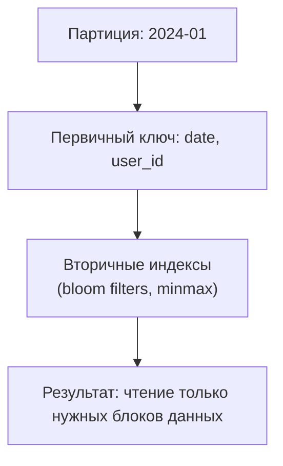

# ClickHouse: Индексы и оптимизация - Полное руководство по индексации и партиционированию

Комплексное руководство по индексам **ClickHouse**: первичные ключи, вторичные индексы, партиционирование и оптимизация запросов.

## Полезные ссылки

### Официальная документация
- [Indexes](https://clickhouse.com/docs/en/optimize/skipping-indexes)
- [Partitioning](https://clickhouse.com/docs/en/guides/best-practices#partitioning)
- [Query Optimization](https://clickhouse.com/docs/en/operations/optimizing-performance)
- [Index Best Practices](https://clickhouse.com/docs/en/guides/best-practices)

### Обучающие материалы
- [ClickHouse Indexing](https://www.baeldung.com/clickhouse-indexes)

### Инструменты
- [ClickHouse Benchmark](https://clickhouse.com/docs/en/operations/utilities/clickhouse-benchmark)
- [System Tables](https://clickhouse.com/docs/en/operations/system-tables)

### См. также
- [[clickhouse-queries|Запросы]] — оптимизация запросов
- [[clickhouse-performance|Производительность]] — производительность и мониторинг

## Содержание

- [Введение в индексацию](#введение-в-индексацию)
  - [Типы индексов в ClickHouse](#типы-индексов-в-clickhouse)
  - [Принцип работы](#принцип-работы)
- [Первичный ключ](#первичный-ключ)
  - [Создание первичного ключа](#создание-первичного-ключа)
  - [Как работает первичный ключ](#как-работает-первичный-ключ)
  - [Выбор первичного ключа](#выбор-первичного-ключа)
    - [Правила выбора:](#правила-выбора)
    - [Примеры выбора ключа:](#примеры-выбора-ключа)
  - [Granularity (Гранулярность)](#granularity-гранулярность)
- [Вторичные индексы](#вторичные-индексы)
  - [Типы вторичных индексов](#типы-вторичных-индексов)
    - [minmax индекс](#minmax-индекс)
    - [bloom_filter индекс](#bloom_filter-индекс)
    - [ngrambf_v1 индекс](#ngrambf_v1-индекс)
    - [tokenbf_v1 индекс](#tokenbf_v1-индекс)
  - [Управление индексами](#управление-индексами)
  - [Оптимизация индексов](#оптимизация-индексов)
- [Партиционирование](#партиционирование)
  - [Создание партиционированных таблиц](#создание-партиционированных-таблиц)
  - [Продвинутые схемы партиционирования](#продвинутые-схемы-партиционирования)
  - [Управление партициями](#управление-партициями)
  - [TTL (Time To Live)](#ttl-time-to-live)
- [Оптимизация запросов](#оптимизация-запросов)
  - [PREWHERE для эффективной фильтрации](#prewhere-для-эффективной-фильтрации)
  - [Оптимизация JOIN](#оптимизация-join)
  - [Использование SAMPLE](#использование-sample)
  - [Материализация вычислений](#материализация-вычислений)
- [Мониторинг индексов](#мониторинг-индексов)
  - [Системные таблицы для анализа](#системные-таблицы-для-анализа)
- [Решение проблем](#решение-проблем)
- [Лучшие практики](#лучшие-практики)
  - [Проектирование первичного ключа](#проектирование-первичного-ключа)
  - [Вторичные индексы](#вторичные-индексы-1)
  - [Партиционирование](#партиционирование-1)
  - [Мониторинг и обслуживание](#мониторинг-и-обслуживание)
  - [Ключевые принципы:](#ключевые-принципы)
  - [Рекомендации:](#рекомендации)
- [Продвинутые стратегии оптимизации](#продвинутые-стратегии-оптимизации)
  - [Многоуровневая индексация](#многоуровневая-индексация)
  - [Оптимизация для временных рядов](#оптимизация-для-временных-рядов)
  - [Стратегии шардирования и репликации](#стратегии-шардирования-и-репликации)
  - [Мониторинг и обслуживание индексов](#мониторинг-и-обслуживание-индексов)
- [Производительность и масштабируемость](#производительность-и-масштабируемость)
  - [Бенчмаркинг индексов](#бенчмаркинг-индексов)
  - [Следующие темы:](#следующие-темы)

## Введение в индексацию

Индексы в **ClickHouse** значительно отличаются от традиционных реляционных СУБД. Вместо B-деревьев **ClickHouse** использует разреженные индексы и партиционирование для оптимизации запросов.

### Типы индексов в ClickHouse

1. **Первичный ключ** — определяет порядок хранения данных
2. **Вторичные индексы** — для пропуска нерелевантных данных (data skipping indexes)
3. **Партиционирование** — логическое разделение данных

### Принцип работы

Таблица без индексов:
- Данные: 100M строк
- Запрос: `WHERE date = '2024-01-01'`
- Результат: сканирование всех строк

Таблица с индексами:



## Первичный ключ

Первичный ключ в **ClickHouse** определяет порядок хранения данных на диске и является основным механизмом оптимизации запросов.

### Создание первичного ключа

```sql
-- Простой первичный ключ
CREATE TABLE events (
    event_id UInt64,
    timestamp DateTime,
    user_id UInt64,
    event_type String,
    data String
) ENGINE = MergeTree()
ORDER BY event_id;  -- Первичный ключ

-- Составной первичный ключ
CREATE TABLE sales (
    date Date,
    product_id UInt64,
    customer_id UInt64,
    quantity UInt32,
    amount Decimal64(2)
) ENGINE = MergeTree()
ORDER BY (date, product_id, customer_id);  -- Составной ключ

-- Оптимизированный первичный ключ для аналитики
CREATE TABLE analytics (
    tenant_id UInt32,
    date Date,
    category String,
    metric_name String,
    value Float64
) ENGINE = MergeTree()
ORDER BY (tenant_id, date, category, metric_name);
```

### Как работает первичный ключ

```sql
-- Данные сортируются на диске по первичному ключу
-- Пример структуры данных:
-- Блок 1: (date=2024-01-01, product_id=1, customer_id=1) -> данные
-- Блок 2: (date=2024-01-01, product_id=1, customer_id=2) -> данные
-- Блок 3: (date=2024-01-01, product_id=2, customer_id=1) -> данные

-- Запрос с использованием первичного ключа
SELECT * FROM sales
WHERE date = '2024-01-01' AND product_id = 1;
-- ClickHouse прочитает только блоки, соответствующие условию
```

### Выбор первичного ключа

#### Правила выбора:

1. **Часто используемые поля в WHERE** должны быть первыми
2. **Высокая кардинальность** для эффективной фильтрации
3. **Последовательность сортировки** должна соответствовать запросам
4. **Баланс** между скоростью записи и чтения

#### Примеры выбора ключа:

```sql
-- Для временных рядов
ORDER BY (timestamp, sensor_id)  -- Время первым для range queries

-- Для пользовательских данных
ORDER BY (user_id, created_at)   -- Пользователь для фильтрации, время для сортировки

-- Для геоданных
ORDER BY (country, city, timestamp)  -- География для фильтрации

-- Для финансовых данных
ORDER BY (account_id, transaction_date, transaction_id)  -- Аккаунт и дата для фильтрации
```

### Granularity (Гранулярность)

```sql
-- Гранулярность определяет размер индексных блоков
CREATE TABLE table_with_granularity (
    id UInt64,
    data String
) ENGINE = MergeTree()
ORDER BY id
SETTINGS index_granularity = 8192;  -- 8192 строк на индексный блок (по умолчанию)

-- Меньшая гранулярность для точных запросов
CREATE TABLE precise_table (
    id UInt64,
    timestamp DateTime,
    value Float64
) ENGINE = MergeTree()
ORDER BY (id, timestamp)
SETTINGS index_granularity = 4096;

-- Большая гранулярность для массовых вставок
CREATE TABLE bulk_insert_table (
    id UInt64,
    batch_id UInt32,
    data String
) ENGINE = MergeTree()
ORDER BY (batch_id, id)
SETTINGS index_granularity = 16384;
```

## Вторичные индексы

Вторичные индексы (data skipping indexes) позволяют пропускать нерелевантные блоки данных при чтении.

### Типы вторичных индексов

#### minmax индекс

Хранит минимальное и максимальное значения в блоке.

```sql
-- Создание minmax индекса
CREATE TABLE products (
    id UInt64,
    category String,
    price Decimal64(2),
    stock UInt32,
    created_at DateTime
) ENGINE = MergeTree()
ORDER BY id
SETTINGS index_granularity = 8192;

-- Добавление minmax индекса для цены
ALTER TABLE products ADD INDEX idx_price price TYPE minmax GRANULARITY 1;

-- Индекс работает для запросов:
SELECT * FROM products WHERE price > 100;    -- Использует индекс
SELECT * FROM products WHERE price BETWEEN 50 AND 200;  -- Использует индекс
```

#### bloom_filter индекс

Использует **bloom filter** для проверки наличия значений.

```sql
-- Bloom filter для строковых полей
ALTER TABLE products ADD INDEX idx_category category TYPE bloom_filter(0.01) GRANULARITY 1;

-- Bloom filter для массивов
ALTER TABLE articles ADD INDEX idx_tags tags TYPE bloom_filter(0.01) GRANULARITY 1;

-- Запросы, использующие bloom filter
SELECT * FROM products WHERE category = 'electronics';  -- Быстрое нахождение
SELECT * FROM articles WHERE has(tags, 'technology');   -- Проверка массивов
```

#### ngrambf_v1 индекс

Для полнотекстового поиска с n-граммами.

```sql
-- N-gram bloom filter для текста
ALTER TABLE articles ADD INDEX idx_content content TYPE ngrambf_v1(3, 256, 2, 0) GRANULARITY 1;

-- Параметры: (размер n-граммы, размер bloom filter, хэш-функции, seed)
-- Пример: 3-граммы, bloom filter 256 байт, 2 хэш-функции

-- Поиск текста
SELECT * FROM articles WHERE content LIKE '%database%';  -- Использует индекс
```

#### tokenbf_v1 индекс

Для полнотекстового поиска с токенизацией.

```sql
-- Token bloom filter для текста
ALTER TABLE articles ADD INDEX idx_title title TYPE tokenbf_v1(256, 2, 0) GRANULARITY 1;

-- Поиск по словам
SELECT * FROM articles WHERE title LIKE '%ClickHouse%';  -- Быстрый поиск
```

### Управление индексами

```sql
-- Просмотр индексов таблицы
SELECT name, type, expr, granularity
FROM system.data_skipping_indices
WHERE table = 'products' AND database = 'default';

-- Материализация индекса (построение для существующих данных)
ALTER TABLE products MATERIALIZE INDEX idx_price;

-- Удаление индекса
ALTER TABLE products DROP INDEX idx_price;

-- Перестроение индекса
ALTER TABLE products CLEAR INDEX idx_price;
ALTER TABLE products MATERIALIZE INDEX idx_price;

-- Проверка использования индекса
EXPLAIN SELECT * FROM products WHERE price > 100;
-- В выводе должно быть: "Index: idx_price"
```

### Оптимизация индексов

```sql
-- Выбор гранулярности индекса
-- Меньше гранулярность = точнее индекс, но больше overhead
GRANULARITY 1    -- Каждый блок индексируется (точный, но медленный)
GRANULARITY 4    -- Каждый 4-й блок индексируется (баланс)
GRANULARITY 16   -- Каждый 16-й блок индексируется (быстрый, но менее точный)

-- Bloom filter параметры
bloom_filter(0.01)   -- 1% false positive rate (точный)
bloom_filter(0.05)   -- 5% false positive rate (быстрый)

-- Мониторинг эффективности индексов
SELECT
    table,
    name,
    num_skipped_parts,
    num_total_parts,
    (num_skipped_parts / num_total_parts) * 100 as skip_ratio
FROM system.data_skipping_indices_usage
WHERE table = 'products';
```

## Партиционирование

Партиционирование логически разделяет таблицу на независимые части для оптимизации запросов и обслуживания.

### Создание партиционированных таблиц

```sql
-- Партиционирование по месяцам
CREATE TABLE monthly_sales (
    date Date,
    product_id UInt64,
    amount Decimal64(2)
) ENGINE = MergeTree()
PARTITION BY toYYYYMM(date)  -- Партиция: 202401, 202402, etc.
ORDER BY (date, product_id);

-- Партиционирование по дням (для больших объемов)
CREATE TABLE daily_events (
    timestamp DateTime,
    event_type String,
    user_id UInt64,
    data String
) ENGINE = MergeTree()
PARTITION BY toDate(timestamp)  -- Партиция: 2024-01-01, 2024-01-02, etc.
ORDER BY (timestamp, user_id);

-- Партиционирование по выражению
CREATE TABLE user_logs (
    user_id UInt64,
    log_level String,
    message String,
    timestamp DateTime
) ENGINE = MergeTree()
PARTITION BY user_id % 100  -- 100 партиций по остатку от деления
ORDER BY (user_id, timestamp);
```

### Продвинутые схемы партиционирования

```sql
-- Партиционирование по нескольким полям
CREATE TABLE multi_dimension (
    tenant_id UInt32,
    date Date,
    category String,
    metric_name String,
    value Float64
) ENGINE = MergeTree()
PARTITION BY (tenant_id, toYYYYMM(date))  -- tenant + месяц
ORDER BY (tenant_id, date, category);

-- Кастомное партиционирование
CREATE TABLE custom_partitioned (
    id UInt64,
    created_at DateTime,
    data String
) ENGINE = MergeTree()
PARTITION BY (
    CASE
        WHEN created_at >= '2024-01-01' THEN 'recent'
        ELSE 'archive'
    END
)
ORDER BY created_at;
```

### Управление партициями

```sql
-- Просмотр партиций
SELECT
    database,
    table,
    partition,
    name,
    active,
    marks,
    rows,
    bytes_on_disk
FROM system.parts
WHERE table = 'monthly_sales';

-- Детализация по партициям
SELECT
    partition,
    count() as parts_count,
    sum(rows) as total_rows,
    formatReadableSize(sum(bytes_on_disk)) as size
FROM system.parts
WHERE table = 'monthly_sales'
GROUP BY partition
ORDER BY partition;

-- Удаление старых партиций
ALTER TABLE monthly_sales DROP PARTITION 202301;  -- Удалить январь 2023

-- Перемещение партиций на другой диск
ALTER TABLE monthly_sales MOVE PARTITION 202312 TO DISK 'ssd';
ALTER TABLE monthly_sales MOVE PARTITION 202311 TO DISK 'hdd';

-- Оптимизация партиций (слияние)
OPTIMIZE TABLE monthly_sales;

-- Заморозка партиций (создание бэкапа)
ALTER TABLE monthly_sales FREEZE PARTITION 202312;
```

### TTL (Time To Live)

```sql
-- Автоматическое удаление данных
CREATE TABLE logs (
    timestamp DateTime,
    level String,
    message String
) ENGINE = MergeTree()
PARTITION BY toYYYYMM(timestamp)
ORDER BY timestamp
TTL timestamp + INTERVAL 90 DAY;  -- Удаление через 90 дней

-- Сложные правила TTL
CREATE TABLE user_sessions (
    user_id UInt64,
    session_start DateTime,
    session_end DateTime,
    data String
) ENGINE = MergeTree()
PARTITION BY toYYYYMM(session_start)
ORDER BY (user_id, session_start)
TTL session_start + INTERVAL 1 YEAR DELETE,  -- Удаление через год
    session_start + INTERVAL 30 DAY TO VOLUME 'cold',  -- Перемещение через месяц
    session_start + INTERVAL 90 DAY TO DISK 'archive'; -- На архивный диск через 3 месяца

-- Групповые правила TTL
TTL
    timestamp + INTERVAL 1 MONTH TO VOLUME 'hot',
    timestamp + INTERVAL 3 MONTH TO VOLUME 'warm',
    timestamp + INTERVAL 6 MONTH TO VOLUME 'cold',
    timestamp + INTERVAL 1 YEAR DELETE;
```

## Оптимизация запросов

### PREWHERE для эффективной фильтрации

```sql
-- PREWHERE читает только нужные столбцы перед фильтрацией
SELECT user_id, sum(amount) as total
FROM transactions
PREWHERE date >= '2024-01-01'  -- Фильтр по индексированному полю
WHERE amount > 100           -- Дополнительные условия
GROUP BY user_id;

-- Эффективность PREWHERE
EXPLAIN SELECT * FROM large_table
PREWHERE indexed_column = 'value'
WHERE other_column > 100;
-- Читает только необходимые столбцы и блоки
```

### Оптимизация JOIN

```sql
-- Создание таблиц для примера
CREATE TABLE users (
    user_id UInt64,
    name String,
    city String
) ENGINE = MergeTree()
ORDER BY user_id;

CREATE TABLE orders (
    order_id UInt64,
    user_id UInt64,
    amount Decimal64(2),
    order_date Date
) ENGINE = MergeTree()
PARTITION BY toYYYYMM(order_date)
ORDER BY (user_id, order_date);

-- Оптимизированный JOIN
SELECT
    u.name,
    u.city,
    count(o.order_id) as orders_count,
    sum(o.amount) as total_amount
FROM users u
LEFT JOIN orders o ON u.user_id = o.user_id
WHERE o.order_date >= '2024-01-01'  -- Фильтр по партиционированному полю
GROUP BY u.user_id, u.name, u.city
ORDER BY total_amount DESC;
```

### Использование SAMPLE

```sql
-- Приближенные расчеты на выборке
SELECT
    product_id,
    count() as approx_orders,
    sum(amount) as approx_revenue
FROM orders
SAMPLE 0.1  -- 10% данных
WHERE order_date >= '2024-01-01'
GROUP BY product_id;

-- Стратифицированная выборка
SELECT
    region,
    avg(price) as avg_price
FROM products
SAMPLE 10000  -- Точное количество строк
GROUP BY region;
```

### Материализация вычислений

```sql
-- Материализованное представление для частых расчетов
CREATE MATERIALIZED VIEW daily_user_stats
ENGINE = SummingMergeTree()
PARTITION BY toYYYYMM(date)
ORDER BY (user_id, date)
AS SELECT
    toDate(created_at) as date,
    user_id,
    count() as daily_actions,
    uniq(product_id) as unique_products,
    sum(amount) as daily_spent
FROM user_actions
WHERE created_at >= '2024-01-01'
GROUP BY date, user_id;

-- Запрос к материализованному представлению (быстрый)
SELECT * FROM daily_user_stats
WHERE date >= '2024-01-01' AND user_id = 12345;
```

## Мониторинг индексов

### Системные таблицы для анализа

```sql
-- Использование индексов
SELECT
    table,
    name as index_name,
    type,
    num_skipped_parts,
    num_total_parts,
    (num_skipped_parts / num_total_parts) * 100 as skip_ratio
FROM system.data_skipping_indices_usage
WHERE database = 'default'
ORDER BY skip_ratio DESC;

-- Статистика по партициям
SELECT
    database,
    table,
    partition,
    count() as parts_count,
    sum(rows) as total_rows,
    formatReadableSize(sum(bytes_on_disk)) as compressed_size,
    formatReadableSize(sum(bytes_on_disk) / sum(rows)) as avg_row_size
FROM system.parts
WHERE active
GROUP BY database, table, partition
ORDER BY total_rows DESC;

-- Производительность запросов
SELECT
    query,
    query_duration_ms,
    read_rows,
    read_bytes,
    result_rows,
    result_bytes
FROM system.query_log
WHERE type = 'QueryFinish'
    AND query_duration_ms > 100
ORDER BY query_duration_ms DESC
LIMIT 10;
```

## Решение проблем

```sql
-- Запросы без использования индексов
SELECT
    query,
    read_rows,
    result_rows,
    (read_rows / result_rows) as selectivity_ratio
FROM system.query_log
WHERE type = 'QueryFinish'
    AND read_rows > 10000
    AND result_rows < 1000
ORDER BY selectivity_ratio DESC;

-- Анализ merge операций
SELECT
    database,
    table,
    count() as merges_count,
    sum(rows_read) as total_rows_read,
    sum(rows_written) as total_rows_written,
    formatReadableSize(sum(bytes_read)) as bytes_read,
    formatReadableSize(sum(bytes_written)) as bytes_written
FROM system.merges
WHERE start_time >= now() - INTERVAL 1 DAY
GROUP BY database, table
ORDER BY merges_count DESC;
```

## Лучшие практики

### Проектирование первичного ключа

1. **Анализируйте паттерны запросов**
   ```sql
   -- Посмотрите на реальные запросы
   SELECT query FROM system.query_log
   WHERE query LIKE 'SELECT%WHERE%'
   LIMIT 100;

   -- Выберите ключ на основе частых условий
   ORDER BY (tenant_id, date, category)  -- tenant для фильтрации, date для диапазонов
   ```

2. **Балансируйте чтение и запись**
   ```sql
   -- Для частого чтения
   ORDER BY (user_id, timestamp)  -- Оптимизировано для запросов пользователя

   -- Для массовой вставки
   ORDER BY (batch_id, id)  -- Минимизирует merges при вставке
   ```

3. **Учитывайте партиционирование**
   ```sql
   -- Ключ должен дополнять партиционирование
   PARTITION BY toYYYYMM(date)
   ORDER BY (date, user_id, event_type)  -- date уже в партиции
   ```

### Вторичные индексы

1. **Выбирайте подходящий тип**
   ```sql
   -- Для числовых диапазонов
   INDEX idx_price price TYPE minmax GRANULARITY 1

   -- Для категориальных данных
   INDEX idx_category category TYPE bloom_filter(0.01) GRANULARITY 1

   -- Для текстового поиска
   INDEX idx_content content TYPE ngrambf_v1(3, 256, 2, 0) GRANULARITY 1
   ```

2. **Оптимизируйте гранулярность**
   ```sql
   -- Для точных запросов
   GRANULARITY 1

   -- Для производительности
   GRANULARITY 4

   -- Для больших таблиц
   GRANULARITY 16
   ```

### Партиционирование

1. **Выбирайте правильный размер партиции**
   ```sql
   -- Не слишком мелко (слишком много файлов)
   PARTITION BY toDate(timestamp)  -- Может создать 365+ партиций в год

   -- Не слишком крупно (сложно управлять)
   PARTITION BY toYYYY(timestamp)  -- 1 партиция в год

   -- Оптимально
   PARTITION BY toYYYYMM(timestamp)  -- 12 партиций в год
   ```

2. **Используйте `TTL` для очистки**
   ```sql
   -- Автоматическая очистка старых данных
   TTL timestamp + INTERVAL 1 YEAR DELETE

   -- Многоуровневое хранение
   TTL timestamp + INTERVAL 30 DAY TO VOLUME 'hot'
   TTL timestamp + INTERVAL 90 DAY TO VOLUME 'cold'
   ```

3. **Планируйте обслуживание**
   ```sql
   -- Регулярная оптимизация
   OPTIMIZE TABLE table_name

   -- Мониторинг размера партиций
   SELECT partition, sum(bytes_on_disk) / 1024/1024 as size_mb
   FROM system.parts
   WHERE table = 'table_name'
   GROUP BY partition
   ORDER BY size_mb DESC
   ```

### Мониторинг и обслуживание

1. **Отслеживайте эффективность индексов**
   ```sql
   SELECT * FROM system.data_skipping_indices_usage
   WHERE skip_ratio < 50;  -- Индексы с низкой эффективностью
   ```

2. **Мониторьте размер партиций**
   ```sql
   SELECT partition, count() as parts_count
   FROM system.parts
   WHERE table = 'table_name'
   GROUP BY partition
   HAVING parts_count > 100;  -- Слишком много частей
   ```

3. **Регулярная оптимизация**
   ```sql
   -- Еженедельная оптимизация
   OPTIMIZE TABLE table_name

   -- Очистка старых партиций
   ALTER TABLE table_name DROP PARTITION partition_name
   ```

Индексы и партиционирование являются ключевыми факторами производительности **ClickHouse**. Правильное проектирование может ускорить запросы в десятки и сотни раз.

### Ключевые принципы:

1. **Первичный ключ** определяет порядок хранения и базовую оптимизацию
2. **Вторичные индексы** позволяют пропускать нерелевантные данные
3. **Партиционирование** логически разделяет данные для эффективного доступа
4. **TTL** автоматизирует управление жизненным циклом данных

### Рекомендации:

- **Анализируйте запросы** перед проектированием индексов
- **Выбирайте гранулярность** в зависимости от паттернов использования
- **Используйте партиционирование** для больших таблиц
- **Регулярно мониторьте** эффективность индексов
- **Планируйте обслуживание** партиций

## Продвинутые стратегии оптимизации

### Многоуровневая индексация

**ClickHouse** поддерживает комбинацию различных типов индексов для максимальной эффективности.

```sql
-- Таблица с комплексной индексацией
CREATE TABLE analytics_events (
    tenant_id UInt32,
    event_date Date,
    event_time DateTime,
    user_id UInt64,
    event_type String,
    category String,
    tags Array(String),
    properties Map(String, String),
    value Float64
) ENGINE = MergeTree()
PARTITION BY toYYYYMM(event_date)  -- Ежемесячные партиции
ORDER BY (tenant_id, event_date, user_id, event_type)  -- Первичный ключ
TTL event_date + INTERVAL 1 YEAR  -- Автоматическое удаление старых данных
SETTINGS index_granularity = 8192;

-- Добавление индексов пропуска данных
ALTER TABLE analytics_events
ADD INDEX idx_category category TYPE minmax GRANULARITY 1;

ALTER TABLE analytics_events
ADD INDEX idx_tags tags TYPE bloom_filter(0.01) GRANULARITY 1;

ALTER TABLE analytics_events
ADD INDEX idx_properties properties TYPE bloom_filter(0.01) GRANULARITY 1;

-- Создание материализованного представления для быстрого доступа
CREATE MATERIALIZED VIEW analytics_summary ENGINE = SummingMergeTree()
PARTITION BY toYYYYMM(period)
ORDER BY (tenant_id, period, event_type)
AS SELECT
    tenant_id,
    toStartOfMonth(event_date) as period,
    event_type,
    count() as events_count,
    sum(value) as total_value,
    avg(value) as avg_value,
    quantileExact(0.95)(value) as p95_value
FROM analytics_events
GROUP BY tenant_id, period, event_type;
```

### Оптимизация для временных рядов

Специальные стратегии для высокочастотных данных временных рядов.

```sql
-- Оптимизированная таблица для метрик
CREATE TABLE metrics (
    metric_name String,
    timestamp DateTime,
    tags Map(String, String),
    value Float64
) ENGINE = MergeTree()
PARTITION BY toDate(timestamp)  -- Ежедневные партиции
ORDER BY (metric_name, timestamp)  -- Оптимальный порядок для временных запросов
TTL toDate(timestamp) + INTERVAL 90 DAY  -- 90 дней хранения
SETTINGS index_granularity = 8192;

-- Индексы для эффективного поиска по тегам
ALTER TABLE metrics
ADD INDEX idx_tags tags TYPE bloom_filter(0.01) GRANULARITY 1;

-- Создание rollup таблиц для разных гранулярностей
CREATE TABLE metrics_hourly ENGINE = AggregatingMergeTree()
PARTITION BY toYYYYMM(hour)
ORDER BY (metric_name, hour)
AS SELECT
    metric_name,
    toStartOfHour(timestamp) as hour,
    argMaxState(tags, timestamp) as tags_state,
    avgState(value) as avg_value_state,
    sumState(value) as sum_value_state,
    countState() as count_state,
    quantileState(0.95)(value) as p95_state
FROM metrics
GROUP BY metric_name, hour;

-- Материализованное представление для автоматического обновления
CREATE MATERIALIZED VIEW metrics_hourly_mv
TO metrics_hourly
AS SELECT
    metric_name,
    toStartOfHour(timestamp) as hour,
    argMaxState(tags, timestamp) as tags_state,
    avgState(value) as avg_value_state,
    sumState(value) as sum_value_state,
    countState() as count_state,
    quantileState(0.95)(value) as p95_state
FROM metrics
GROUP BY metric_name, hour;
```

### Стратегии шардирования и репликации

Оптимизация индексов для кластерных развертываний.

```sql
-- Таблица с учетом шардирования
CREATE TABLE distributed_events (
    event_id UInt64,
    user_id UInt64,
    event_type String,
    timestamp DateTime,
    data String
) ENGINE = Distributed('cluster_name', 'default', 'events_local', user_id);

-- Локальная таблица на каждом шарде
CREATE TABLE events_local (
    event_id UInt64,
    user_id UInt64,
    event_type String,
    timestamp DateTime,
    data String
) ENGINE = ReplicatedMergeTree('/clickhouse/tables/{shard}/events', '{replica}')
PARTITION BY toYYYYMM(timestamp)
ORDER BY (user_id, timestamp, event_id)  -- user_id для равномерного распределения
SETTINGS index_granularity = 8192;

-- Оптимизация индексов для шардирования
ALTER TABLE events_local
ADD INDEX idx_event_type event_type TYPE bloom_filter(0.01) GRANULARITY 1;

ALTER TABLE events_local
ADD INDEX idx_timestamp timestamp TYPE minmax GRANULARITY 1;

-- Запросы с учетом шардирования
SELECT
    event_type,
    count() as events_count,
    uniqExact(user_id) as unique_users
FROM distributed_events
WHERE timestamp >= now() - INTERVAL 1 DAY
    AND event_type IN ('login', 'purchase', 'error')
GROUP BY event_type
ORDER BY events_count DESC;
```

### Мониторинг и обслуживание индексов

Автоматизированное обслуживание индексов и партиций.

```sql
-- Мониторинг использования индексов
SELECT
    database,
    table,
    name as index_name,
    type as index_type,
    granularity,
    num_parts_with_index,
    total_parts,
    round(num_parts_with_index / total_parts * 100, 2) as usage_percentage
FROM system.data_skipping_indices
WHERE database = 'default'
ORDER BY usage_percentage DESC;

-- Анализ эффективности партиций
SELECT
    database,
    table,
    partition,
    name,
    rows,
    bytes_on_disk,
    formatReadableSize(bytes_on_disk) as readable_size,
    compression_ratio,
    marks
FROM system.parts
WHERE active
ORDER BY bytes_on_disk DESC
LIMIT 20;

-- Автоматическая оптимизация
OPTIMIZE TABLE analytics_events
ON CLUSTER cluster_name
FINAL;  -- Слияние партиций для оптимизации

-- Очистка старых партиций
ALTER TABLE analytics_events
ON CLUSTER cluster_name
DROP PARTITION WHERE toYYYYMM(event_date) < toYYYYMM(now() - INTERVAL 1 YEAR);
```

## Производительность и масштабируемость

### Бенчмаркинг индексов

Методики измерения эффективности индексов.

```sql
-- Создание тестовой таблицы
CREATE TABLE benchmark_test (
    id UInt64,
    category String,
    subcategory String,
    value UInt32,
    timestamp DateTime
) ENGINE = MergeTree()
ORDER BY (category, subcategory, timestamp)
SETTINGS index_granularity = 8192;

-- Наполнение тестовыми данными
INSERT INTO benchmark_test
SELECT
    number as id,
    concat('category_', toString(number % 100)) as category,
    concat('subcategory_', toString(number % 1000)) as subcategory,
    rand() % 1000000 as value,
    now() - INTERVAL (rand() % 365) DAY as timestamp
FROM numbers(10000000);

-- Бенчмарк запросов с индексами
SELECT
    category,
    count() as total_count,
    sum(value) as total_value,
    avg(value) as avg_value
FROM benchmark_test
WHERE category IN ('category_1', 'category_2', 'category_50')
    AND timestamp >= '2024-01-01'
GROUP BY category
ORDER BY total_value DESC;

-- Сравнение производительности с разными индексами
ALTER TABLE benchmark_test
ADD INDEX idx_category category TYPE minmax GRANULARITY 1;

ALTER TABLE benchmark_test
ADD INDEX idx_subcategory subcategory TYPE bloom_filter(0.01) GRANULARITY 1;

-- Анализ использования индексов
SELECT
    query_id,
    read_rows,
    read_bytes,
    total_rows_approx,
    formatReadableSize(read_bytes) as readable_read_bytes,
    round(read_rows / total_rows_approx * 100, 2) as selectivity_percentage
FROM system.query_log
WHERE query LIKE '%benchmark_test%'
    AND event_time >= now() - INTERVAL 1 HOUR
ORDER BY event_time DESC;
```

### Следующие темы:

- **Материализованные представления** — предвычисленные агрегаты
- **Репликация и кластеры** — масштабирование и отказоустойчивость
- **Производительность** — глубокий тюнинг и оптимизация

**ClickHouse** предоставляет мощные инструменты для оптимизации, но требует тщательного планирования и мониторинга. Продвинутые стратегии индексации позволяют добиться максимальной производительности даже с петабайтами данных.


**Следующие темы:**
- [[clickhouse-materialized-views|Материализованные представления]]
- [[clickhouse-replication|Репликация и кластеры]]

