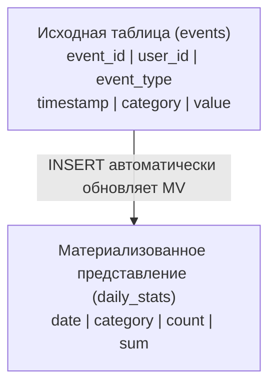

# ClickHouse: Материализованные представления - Предварительно вычисленные агрегаты и трансформации

Комплексное руководство по материализованным представлениям **ClickHouse**: создание, управление, оптимизация и практические примеры.

## Полезные ссылки

### Официальная документация
- [Materialized Views](https://clickhouse.com/docs/en/guides/developer/cascading-materialized-views)
- [AggregatingMergeTree](https://clickhouse.com/docs/en/engines/table-engines/mergetree-family/aggregatingmergetree)
- [SummingMergeTree](https://clickhouse.com/docs/en/engines/table-engines/mergetree-family/summingmergetree)
- [Materialized Views Best Practices](https://clickhouse.com/docs/en/guides/best-practices)
- [Real-time Analytics](https://clickhouse.com/docs/en/guides/developer/cascading-materialized-views)
- [Common Patterns](https://clickhouse.com/docs/en/guides/best-practices)

### Обучающие материалы
- [ClickHouse Materialized Views](https://www.baeldung.com/clickhouse-materialized-views)
- [MV Examples](https://clickhouse.com/docs/en/getting-started/tutorial)

### См. также
- [[clickhouse-tables|Таблицы]] — создание таблиц и движков
- [[clickhouse-queries|Запросы]] — агрегационные запросы

## Содержание

- [Введение в материализованные представления](#введение-в-материализованные-представления)
  - [Принцип работы](#принцип-работы)
  - [Преимущества материализованных представлений](#преимущества-материализованных-представлений)
  - [Когда использовать MV](#когда-использовать-mv)
- [Создание материализованных представлений](#создание-материализованных-представлений)
  - [Базовый синтаксис](#базовый-синтаксис)
  - [Простой пример](#простой-пример)
  - [Тестирование работы](#тестирование-работы)
- [Типы движков для MV](#типы-движков-для-mv)
  - [SummingMergeTree](#summingmergetree)
  - [AggregatingMergeTree](#aggregatingmergetree)
  - [ReplacingMergeTree](#replacingmergetree)
  - [MergeTree](#mergetree)
- [Управление материализованными представлениями](#управление-материализованными-представлениями)
  - [Просмотр существующих MV](#просмотр-существующих-mv)
  - [Модификация MV](#модификация-mv)
  - [Удаление MV](#удаление-mv)
  - [Восстановление после сбоев](#восстановление-после-сбоев)
- [Практические примеры](#практические-примеры)
  - [Аналитика электронной коммерции](#аналитика-электронной-коммерции)
  - [Мониторинг и логирование](#мониторинг-и-логирование)
  - [IoT и телеметрия](#iot-и-телеметрия)
  - [Финансовая аналитика](#финансовая-аналитика)
- [Оптимизация и производительность](#оптимизация-и-производительность)
  - [Выбор правильного движка](#выбор-правильного-движка)
  - [Оптимизация запросов к MV](#оптимизация-запросов-к-mv)
  - [Управление памятью и дисками](#управление-памятью-и-дисками)
- [Мониторинг и обслуживание](#мониторинг-и-обслуживание)
  - [Метрики производительности](#метрики-производительности)
  - [Диагностика проблем](#диагностика-проблем)
  - [Обслуживание MV](#обслуживание-mv)
- [Лучшие практики](#лучшие-практики)
  - [Проектирование MV](#проектирование-mv)
  - [Оптимизация производительности](#оптимизация-производительности)
  - [Управление жизненным циклом](#управление-жизненным-циклом)
  - [Распространенные ошибки](#распространенные-ошибки)
  - [Ключевые преимущества:](#ключевые-преимущества)
  - [Основные движки MV:](#основные-движки-mv)
  - [Лучшие практики:](#лучшие-практики-1)
  - [Следующие темы:](#следующие-темы)

## Введение в материализованные представления

Материализованные представления (Materialized Views) в **ClickHouse** автоматически поддерживают предварительно вычисленные агрегаты и трансформации данных в реальном времени.

### Принцип работы



### Преимущества материализованных представлений

1. **Реальное время**: Данные обновляются автоматически при вставке
2. **Производительность**: Предварительно вычисленные агрегаты
3. **Сложность**: Сокрытие сложных расчетов от пользователей
4. **Масштабируемость**: Эффективная работа с большими данными

### Когда использовать `MV`

- **Частые агрегационные запросы**
- **Комплексные расчеты и трансформации**
- **Real-time аналитика**
- **Денормализация данных**
- **Кэширование результатов**

## Создание материализованных представлений

### Базовый синтаксис

```sql
CREATE MATERIALIZED VIEW view_name
ENGINE = engine_type([parameters])
[PARTITION BY partition_expression]
[ORDER BY (column1, column2, ...)]
[TTL ttl_expression]
[SETTINGS setting_name = setting_value]
AS SELECT
    expression1 AS column1,
    expression2 AS column2,
    ...
FROM source_table
[WHERE condition]
[GROUP BY group_expression]
[HAVING having_condition]
```

### Простой пример

```sql
-- Исходная таблица событий
CREATE TABLE user_events (
    event_id UInt64,
    user_id UInt64,
    event_type String,
    timestamp DateTime,
    value UInt32
) ENGINE = MergeTree()
PARTITION BY toYYYYMM(timestamp)
ORDER BY (user_id, timestamp);

-- Материализованное представление для ежедневной статистики
CREATE MATERIALIZED VIEW daily_user_stats
ENGINE = SummingMergeTree()
PARTITION BY toYYYYMM(date)
ORDER BY (date, user_id)
AS SELECT
    toDate(timestamp) AS date,
    user_id,
    count() AS events_count,
    sum(value) AS total_value
FROM user_events
GROUP BY date, user_id;
```

### Тестирование работы

```sql
-- Вставка данных в исходную таблицу
INSERT INTO user_events VALUES
(1, 1001, 'click', '2024-01-15 10:00:00', 5),
(2, 1001, 'view', '2024-01-15 10:05:00', 1),
(3, 1002, 'click', '2024-01-15 11:00:00', 3);

-- Проверка результатов в MV
SELECT * FROM daily_user_stats;

-- Результат:
-- date       | user_id | events_count | total_value
-- 2024-01-15 | 1001   | 2            | 6
-- 2024-01-15 | 1002   | 1            | 3
```

## Типы движков для `MV`

### SummingMergeTree

Автоматически суммирует значения при слиянии партиций.

```sql
-- MV для суммирования метрик
CREATE MATERIALIZED VIEW hourly_metrics
ENGINE = SummingMergeTree()
PARTITION BY toYYYYMMDD(hour)
ORDER BY (hour, metric_name)
AS SELECT
    toStartOfHour(timestamp) AS hour,
    metric_name,
    sum(value) AS total_value,
    count() AS measurements_count
FROM raw_metrics
GROUP BY hour, metric_name;

-- Особенности:
-- - Суммирует числовые поля при слиянии
-- - Оставляет одно значение для каждой группы ключей
-- - Идеально для счетчиков и метрик
```

### AggregatingMergeTree

Хранит состояния агрегатных функций для сложных расчетов.

```sql
-- MV для сложной аналитики
CREATE MATERIALIZED VIEW user_behavior_agg
ENGINE = AggregatingMergeTree()
PARTITION BY toYYYYMM(date)
ORDER BY (date, user_id)
AS SELECT
    toDate(timestamp) AS date,
    user_id,
    countState() AS sessions_count,
    sumState(session_duration) AS total_duration,
    uniqState(page_url) AS unique_pages,
    quantileState(0.95)(load_time) AS p95_load_time
FROM user_sessions
GROUP BY date, user_id;

-- Особенности:
-- - Хранит состояния агрегатных функций
-- - Позволяет финализировать агрегаты при запросе
-- - Поддерживает все агрегатные функции ClickHouse
```

### ReplacingMergeTree

Заменяет старые записи новыми с тем же ключом.

```sql
-- MV для последних состояний
CREATE MATERIALIZED VIEW user_last_status
ENGINE = ReplacingMergeTree(last_update)
PARTITION BY user_id % 100
ORDER BY (user_id, last_update)
AS SELECT
    user_id,
    argMax(status, timestamp) AS current_status,
    max(timestamp) AS last_update,
    argMax(location, timestamp) AS last_location
FROM user_status_updates
GROUP BY user_id;

-- Особенности:
-- - Хранит только последнюю версию для каждого ключа
-- - Требует поля версии для разрешения конфликтов
-- - Эффективен для slowly changing dimensions
```

### MergeTree

Стандартный движок без специальной логики агрегации.

```sql
-- MV для трансформации данных
CREATE MATERIALIZED VIEW enriched_events
ENGINE = MergeTree()
PARTITION BY toYYYYMM(timestamp)
ORDER BY (user_id, timestamp)
AS SELECT
    event_id,
    user_id,
    event_type,
    timestamp,
    value,
    -- Обогащение данных
    CASE
        WHEN value > 100 THEN 'high'
        WHEN value > 50 THEN 'medium'
        ELSE 'low'
    END AS value_category,
    -- Геолокация по IP
    geohashEncode(55.7558, 37.6173, 5) AS location_hash
FROM raw_events
WHERE event_type IN ('click', 'purchase');
```

## Управление материализованными представлениями

### Просмотр существующих `MV`

```sql
-- Все материализованные представления
SELECT
    database,
    name,
    engine,
    create_table_query
FROM system.tables
WHERE engine LIKE '%MaterializedView';

-- Детальная информация
SHOW CREATE MATERIALIZED VIEW view_name;

-- Зависимости MV
SELECT
    database,
    name,
    dependencies_database,
    dependencies_table
FROM system.tables
WHERE engine LIKE '%MaterializedView';
```

### Модификация `MV`

```sql
-- Добавление столбца (невозможно напрямую)
-- Нужно пересоздать MV

-- Удаление и пересоздание MV
DROP VIEW existing_mv;

CREATE MATERIALIZED VIEW existing_mv
ENGINE = SummingMergeTree()
-- ... новый код
AS SELECT ...;
```

### Удаление `MV`

```sql
-- Удаление MV (данные остаются)
DROP VIEW view_name;

-- Удаление MV и связанных данных
DROP TABLE view_name;  -- Если MV использует собственную таблицу
```

### Восстановление после сбоев

```sql
-- Проверка состояния MV
SELECT
    database,
    table,
    is_readonly,
    parts_count,
    bytes_on_disk
FROM system.tables
WHERE name LIKE '%_mv';

-- Перезапуск материализации (если необходимо)
SYSTEM FLUSH DISTRIBUTED view_name;

-- Восстановление данных MV
-- Данные автоматически восстанавливаются из исходных таблиц
```

## Практические примеры

### Аналитика электронной коммерции

```sql
-- Исходная таблица заказов
CREATE TABLE orders (
    order_id UInt64,
    user_id UInt64,
    product_id UInt64,
    quantity UInt32,
    price Decimal64(2),
    order_date DateTime,
    status String
) ENGINE = MergeTree()
PARTITION BY toYYYYMM(order_date)
ORDER BY (user_id, order_date);

-- MV: Ежедневные продажи по продуктам
CREATE MATERIALIZED VIEW daily_product_sales
ENGINE = SummingMergeTree()
PARTITION BY toYYYYMM(date)
ORDER BY (date, product_id)
AS SELECT
    toDate(order_date) AS date,
    product_id,
    sum(quantity) AS total_quantity,
    sum(price * quantity) AS total_revenue,
    count() AS orders_count
FROM orders
WHERE status = 'completed'
GROUP BY date, product_id;

-- MV: Пользовательские метрики
CREATE MATERIALIZED VIEW user_metrics
ENGINE = AggregatingMergeTree()
PARTITION BY user_id % 100
ORDER BY user_id
AS SELECT
    user_id,
    countState() AS total_orders,
    sumState(price * quantity) AS total_spent,
    avgState(price) AS avg_order_value,
    minState(order_date) AS first_order_date,
    maxState(order_date) AS last_order_date
FROM orders
WHERE status = 'completed'
GROUP BY user_id;
```

### Мониторинг и логирование

```sql
-- Исходная таблица логов
CREATE TABLE application_logs (
    timestamp DateTime,
    level String,
    service String,
    message String,
    user_id Nullable(UInt64),
    request_id String,
    response_time Nullable(Float64)
) ENGINE = MergeTree()
PARTITION BY toYYYYMMDD(timestamp)
ORDER BY (service, timestamp);

-- MV: Статистика по сервисам
CREATE MATERIALIZED VIEW service_stats
ENGINE = SummingMergeTree()
PARTITION BY toYYYYMMDD(hour)
ORDER BY (hour, service)
AS SELECT
    toStartOfHour(timestamp) AS hour,
    service,
    count() AS total_logs,
    countIf(level = 'ERROR') AS error_count,
    countIf(level = 'WARN') AS warn_count,
    quantileIf(0.95, response_time, response_time IS NOT NULL) AS p95_response_time
FROM application_logs
GROUP BY hour, service;

-- MV: Ошибки по пользователям
CREATE MATERIALIZED VIEW user_errors
ENGINE = AggregatingMergeTree()
PARTITION BY toYYYYMMDD(date)
ORDER BY (date, user_id)
AS SELECT
    toDate(timestamp) AS date,
    user_id,
    countState() AS error_count,
    groupArrayState(50)(message) AS recent_errors
FROM application_logs
WHERE level = 'ERROR' AND user_id IS NOT NULL
GROUP BY date, user_id;
```

### IoT и телеметрия

```sql
-- Исходная таблица показаний датчиков
CREATE TABLE sensor_readings (
    sensor_id String,
    timestamp DateTime,
    temperature Float32,
    humidity Float32,
    pressure Float32,
    battery_voltage Float32,
    location Tuple(Float64, Float64)
) ENGINE = MergeTree()
PARTITION BY toYYYYMMDD(timestamp)
ORDER BY (sensor_id, timestamp);

-- MV: Агрегированные показания по часам
CREATE MATERIALIZED VIEW hourly_sensor_agg
ENGINE = AggregatingMergeTree()
PARTITION BY toYYYYMMDD(hour)
ORDER BY (hour, sensor_id)
AS SELECT
    toStartOfHour(timestamp) AS hour,
    sensor_id,
    countState() AS readings_count,
    avgState(temperature) AS avg_temperature,
    minState(temperature) AS min_temperature,
    maxState(temperature) AS max_temperature,
    quantileState(0.95)(temperature) AS p95_temperature,
    argMaxState(battery_voltage, timestamp) AS last_battery_voltage
FROM sensor_readings
GROUP BY hour, sensor_id;

-- MV: Географическая агрегация
CREATE MATERIALIZED VIEW geo_sensor_summary
ENGINE = SummingMergeTree()
PARTITION BY toYYYYMMDD(date)
ORDER BY (date, geo_hash)
AS SELECT
    toDate(timestamp) AS date,
    geohashEncode(location.1, location.2, 4) AS geo_hash,
    count() AS sensors_count,
    avg(temperature) AS avg_temperature,
    min(battery_voltage) AS min_battery
FROM sensor_readings
WHERE timestamp >= today()
GROUP BY date, geo_hash;
```

### Финансовая аналитика

```sql
-- Исходная таблица транзакций
CREATE TABLE transactions (
    transaction_id UInt64,
    account_id UInt64,
    amount Decimal64(2),
    currency String,
    transaction_type String,
    timestamp DateTime,
    merchant_id UInt64,
    category String
) ENGINE = MergeTree()
PARTITION BY toYYYYMM(timestamp)
ORDER BY (account_id, timestamp);

-- MV: Дневной баланс счетов
CREATE MATERIALIZED VIEW daily_account_balance
ENGINE = SummingMergeTree()
PARTITION BY toYYYYMM(date)
ORDER BY (date, account_id)
AS SELECT
    toDate(timestamp) AS date,
    account_id,
    sum(CASE WHEN transaction_type = 'credit' THEN amount ELSE -amount END) AS balance_change,
    count() AS transactions_count,
    sumIf(amount, transaction_type = 'debit') AS debit_total,
    sumIf(amount, transaction_type = 'credit') AS credit_total
FROM transactions
GROUP BY date, account_id;

-- MV: Категорийный анализ расходов
CREATE MATERIALIZED VIEW spending_by_category
ENGINE = SummingMergeTree()
PARTITION BY toYYYYMM(date)
ORDER BY (date, account_id, category)
AS SELECT
    toDate(timestamp) AS date,
    account_id,
    category,
    sum(amount) AS total_spent,
    count() AS transactions_count,
    avg(amount) AS avg_transaction
FROM transactions
WHERE transaction_type = 'debit'
GROUP BY date, account_id, category;
```

## Оптимизация и производительность

### Выбор правильного движка

```sql
-- Для счетчиков и сумм: SummingMergeTree
CREATE MATERIALIZED VIEW counters_mv
ENGINE = SummingMergeTree()
ORDER BY (date, key)
AS SELECT date, key, sum(value) AS total
FROM raw_data GROUP BY date, key;

-- Для сложных агрегатов: AggregatingMergeTree
CREATE MATERIALIZED VIEW complex_agg_mv
ENGINE = AggregatingMergeTree()
ORDER BY (date, group_key)
AS SELECT
    date,
    group_key,
    quantileState(0.95)(response_time) AS p95_response_time,
    uniqState(user_id) AS unique_users
FROM events GROUP BY date, group_key;

-- Для последних значений: ReplacingMergeTree
CREATE MATERIALIZED VIEW last_values_mv
ENGINE = ReplacingMergeTree(timestamp)
ORDER BY (key, timestamp)
AS SELECT key, value, timestamp
FROM updates;
```

### Оптимизация запросов к `MV`

```sql
-- Использование финализирующих функций
SELECT
    date,
    group_key,
    finalizeAggregation(p95_response_time) AS p95_final,
    uniqMerge(unique_users) AS unique_users_final
FROM complex_agg_mv
WHERE date >= '2024-01-01';

-- Эффективные запросы к SummingMergeTree
SELECT
    date,
    sum(total) AS day_total
FROM counters_mv
WHERE date BETWEEN '2024-01-01' AND '2024-01-31'
GROUP BY date;
```

### Управление памятью и дисками

```sql
-- MV с TTL для автоматической очистки
CREATE MATERIALIZED VIEW temp_stats
ENGINE = SummingMergeTree()
ORDER BY date
TTL date + INTERVAL 90 DAY  -- Автоматическое удаление старых данных
AS SELECT date, sum(value) AS total
FROM raw_data GROUP BY date;

-- MV с многоуровневым хранением
CREATE MATERIALIZED VIEW historical_data
ENGINE = MergeTree()
ORDER BY timestamp
TTL timestamp + INTERVAL 30 DAY TO VOLUME 'hot',
    timestamp + INTERVAL 90 DAY TO VOLUME 'warm',
    timestamp + INTERVAL 1 YEAR TO VOLUME 'cold'
AS SELECT * FROM source_table;
```

## Мониторинг и обслуживание

### Метрики производительности

```sql
-- Статистика по MV
SELECT
    database,
    name,
    engine,
    total_rows,
    total_bytes,
    lifetime_rows,
    lifetime_bytes
FROM system.tables
WHERE engine LIKE '%MaterializedView%';

-- Зависимости MV
SELECT
    database,
    view_name,
    source_database,
    source_table
FROM (
    SELECT
        database,
        name as view_name,
        dependencies_database as source_database,
        dependencies_table as source_table
    FROM system.tables
    WHERE engine LIKE '%MaterializedView%'
) ARRAY JOIN dependencies_database, dependencies_table;

-- Проверка консистентности
SELECT
    source_table,
    mv_table,
    source_count,
    mv_count,
    (source_count - mv_count) as difference
FROM (
    SELECT
        (SELECT count() FROM source_table) as source_count,
        (SELECT count() FROM mv_table) as mv_count
);
```

### Диагностика проблем

```sql
-- Логи материализованных представлений
SELECT
    event_time,
    level,
    message
FROM system.text_log
WHERE message LIKE '%materialized%'
ORDER BY event_time DESC
LIMIT 50;

-- Проверка очередей вставки
SELECT
    database,
    table,
    is_readonly,
    parts_count,
    queue_size
FROM system.replicas
WHERE database = 'default';

-- Мониторинг слияний
SELECT
    database,
    table,
    count() as merges_count,
    sum(rows_read) as total_rows_processed
FROM system.merges
WHERE start_time >= now() - INTERVAL 1 HOUR
GROUP BY database, table;
```

### Обслуживание `MV`

```sql
-- Оптимизация MV (слияние партиций)
OPTIMIZE TABLE mv_name;

-- Перестроение MV (при изменении структуры)
DROP VIEW mv_name;
-- Создать заново

-- Очистка устаревших данных
ALTER TABLE mv_name DROP PARTITION partition_expr;

-- Восстановление после сбоя
SYSTEM RESTORE REPLICA mv_name;
```

## Лучшие практики

### Проектирование `MV`

1. **Определите цель использования**
   ```sql
   -- Для дашбордов: SummingMergeTree с предварительными суммами
   -- Для сложной аналитики: AggregatingMergeTree с состояниями
   -- Для кэширования: обычный MergeTree с трансформациями
   ```

2. **Выберите подходящую гранулярность агрегации**
   ```sql
   -- Для hourly дашбордов
   GROUP BY toStartOfHour(timestamp), dimension

   -- Для daily отчетов
   GROUP BY toDate(timestamp), dimension

   -- Для monthly архивов
   GROUP BY toYYYYMM(timestamp), dimension
   ```

3. **Учитывайте требования к свежести данных**
   ```sql
   -- Для real-time: небольшие гранулы, частые обновления
   -- Для batch: крупные гранулы, периодические обновления
   ```

### Оптимизация производительности

1. **Используйте правильное партиционирование**
   ```sql
   -- Партиционирование должно соответствовать запросам
   PARTITION BY toYYYYMM(date)  -- Для monthly запросов
   PARTITION BY toDate(timestamp)  -- Для daily запросов
   ```

2. **Оптимизируйте первичные ключи**
   ```sql
   -- Ключ должен соответствовать паттернам запросов
   ORDER BY (date, category, metric)  -- date для фильтрации, category для группировки
   ```

3. **Мониторьте и обслуживайте**
   ```sql
   -- Регулярная оптимизация
   OPTIMIZE TABLE mv_name ON CLUSTER cluster FINAL;

   -- Мониторинг размера
   SELECT table, formatReadableSize(bytes) as size
   FROM system.parts
   WHERE table = 'mv_name' AND active;
   ```

### Управление жизненным циклом

1. **Планируйте TTL**
   ```sql
   -- Автоматическая очистка для экономии места
   TTL date + INTERVAL 1 YEAR DELETE
   ```

2. **Версионируйте изменения**
   ```sql
   -- Создавайте новые MV вместо изменения существующих
   CREATE MATERIALIZED VIEW user_stats_v2
   -- Новая версия с улучшениями
   ```

3. **Тестируйте перед развертыванием**
   ```sql
   -- Создайте тестовую версию MV
   CREATE MATERIALIZED VIEW test_mv
   ENGINE = MergeTree()
   ORDER BY id
   AS SELECT * FROM source_table WHERE created_at >= '2024-01-01';

   -- Проверьте производительность
   SELECT count() FROM test_mv;
   ```

### Распространенные ошибки

1. **Забыли `GROUP` BY**
   ```sql
   -- Неправильно
   CREATE MATERIALIZED VIEW bad_mv
   AS SELECT sum(value) FROM table;  -- Без GROUP BY

   -- Правильно
   CREATE MATERIALIZED VIEW good_mv
   AS SELECT sum(value) FROM table;  -- SummingMergeTree обрабатывает это
   ```

2. **Неправильный движок**
   ```sql
   -- Неправильно: обычный MergeTree для агрегатов
   CREATE MATERIALIZED VIEW bad_mv
   ENGINE = MergeTree()
   AS SELECT date, sum(value) FROM table GROUP BY date;

   -- Правильно: SummingMergeTree
   CREATE MATERIALIZED VIEW good_mv
   ENGINE = SummingMergeTree()
   AS SELECT date, sum(value) FROM table GROUP BY date;
   ```

3. **Отсутствие партиционирования**
   ```sql
   -- Для больших MV обязательно партиционирование
   PARTITION BY toYYYYMM(date)
   ```

Материализованные представления — инструмент **ClickHouse** для создания эффективных аналитических систем. Они позволяют автоматически поддерживать предварительно вычисленные агрегаты в реальном времени.

### Ключевые преимущества:

1. **Автоматическое обновление** при вставке данных
2. **Высокая производительность** для аналитических запросов
3. **Снижение сложности** запросов для пользователей
4. **Масштабируемость** для больших объемов данных

### Основные движки `MV`:

- **SummingMergeTree**: Для суммирования и счетчиков
- **AggregatingMergeTree**: Для сложных агрегатных функций
- **ReplacingMergeTree**: Для последних значений
- **MergeTree**: Для трансформаций и обогащения данных

### Лучшие практики:

- Выбирайте движок в соответствии с типом агрегации
- Оптимизируйте партиционирование и ключи
- Регулярно мониторьте производительность
- Планируйте жизненный цикл данных

### Следующие темы:

- **Репликация и кластеры** — распределение `MV`
- **Производительность** — глубокий тюнинг
- **Интеграции** — подключение внешних систем

Материализованные представления позволяют создавать высокопроизводительные аналитические системы с минимальными усилиями по поддержке.


**Следующие темы:**
- [[clickhouse-replication|Репликация и кластеры]]
- [[clickhouse-performance|Производительность]]

