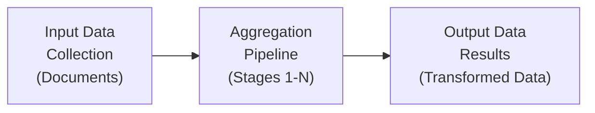

# MongoDB: Aggregation Framework — Полное руководство по агрегации данных

Комплексное руководство по **Aggregation Framework** в **MongoDB**: стадии, операторы, оптимизация и практические примеры.

## Полезные ссылки

### Официальная документация
- [MongoDB Aggregation](https://www.mongodb.com/docs/manual/aggregation/)
- [Aggregation Pipeline Stages](https://www.mongodb.com/docs/manual/reference/operator/aggregation-pipeline/)
- [Aggregation Operators](https://www.mongodb.com/docs/manual/reference/operator/aggregation/)

### Обучающие материалы
- [MongoDB Aggregation Framework](https://www.baeldung.com/java-mongodb-aggregation)

### См. также
- [[mongodb-queries|Запросы]] — основы запросов
- [[mongodb-indexes|Производительность]] — оптимизация

## Содержание

- [Введение в Aggregation Framework](#введение-в-aggregation-framework)
  - [Преимущества Aggregation Framework](#преимущества-aggregation-framework)
  - [Когда использовать Aggregation](#когда-использовать-aggregation)
- [Основы Aggregation Pipeline](#основы-aggregation-pipeline)
  - [Структура Pipeline](#структура-pipeline)
  - [Пример простой агрегации](#пример-простой-агрегации)
- [Стадии агрегации](#стадии-агрегации)
  - [1. $match — Фильтрация документов](#1-match-фильтрация-документов)
  - [2. $group — Группировка документов](#2-group-группировка-документов)
  - [Остальные стадии агрегации](#остальные-стадии-агрегации)
    - [$project — Проекция полей](#project-проекция-полей)
    - [$addFields — Добавление полей](#addfields-добавление-полей)
    - [$unwind — Разворачивание массивов](#unwind-разворачивание-массивов)
    - [$lookup — JOIN операции](#lookup-join-операции)
    - [$facet — Множественные агрегации](#facet-множественные-агрегации)
  - [Операторы агрегации](#операторы-агрегации)
    - [Арифметические операторы](#арифметические-операторы)
  - [Основные возможности:](#основные-возможности)
  - [Стадии агрегации:](#стадии-агрегации-1)
  - [Оптимизация:](#оптимизация)
  - [Лучшие практики:](#лучшие-практики)
  - [4. $limit и $skip — Ограничение результатов](#4-limit-и-skip-ограничение-результатов)
  - [3. $project — Формирование выходных документов](#3-project-формирование-выходных-документов)
- [Решение проблем](#решение-проблем)

## Введение в Aggregation Framework

**Aggregation Framework** — это инструмент **MongoDB** для обработки, анализа и трансформации данных. Он позволяет выполнять сложные аналитические запросы, подобные **SQL GROUP** `BY`, **JOIN** и другим операциям реляционных баз данных.

Схема пайплайна **Aggregation Framework**: входная коллекция стадии результат.



### Преимущества Aggregation Framework

1. **Мощная аналитика**: Сложные вычисления и трансформации данных
2. **Производительность**: Оптимизированные операции на сервере
3. **Гибкость**: Поддержка различных стадий и операторов
4. **Масштабируемость**: Работает с большими наборами данных
5. **JSON-подобный синтаксис**: Удобство для разработчиков

### Когда использовать Aggregation

- **Аналитика и отчетность**: Группировка, суммирование, средние значения
- **Трансформация данных**: Изменение структуры документов
- **JOIN-подобные операции**: Связывание данных из разных коллекций
- **Комплексная фильтрация**: Многоуровневая фильтрация с вычислениями
- **Агрегация временных рядов**: Анализ данных по времени

## Основы Aggregation Pipeline

### Структура Pipeline

**Aggregation pipeline** состоит из последовательности стадий (stages), каждая из которых получает на вход документы, обрабатывает их и передает результат следующей стадии.

```java
@Service
public class AggregationService {

    @Autowired
    private MongoTemplate mongoTemplate;

    // Структура Pipeline - базовый синтаксис
    public Aggregation createBasicPipeline() {
        return Aggregation.newAggregation(
            // Стадия 1
            Aggregation.match(Criteria.where("status").is("active")),

            // Стадия 2
            Aggregation.group("category").count().as("total"),

            // Стадия N
            Aggregation.sort(Sort.by(Sort.Direction.DESC, "total"))
        );
    }

    // Выполнение агрегации
    public List<Document> executeAggregation(Aggregation aggregation, String collection) {
        return mongoTemplate.aggregate(aggregation, collection, Document.class)
                          .getMappedResults();
    }
}
```

### Пример простой агрегации

```java
@Service
public class OrderAggregationService {

    @Autowired
    private MongoTemplate mongoTemplate;

    // Расчет общей суммы заказов по клиентам
    public List<Document> calculateTotalOrdersByCustomer() {
        Aggregation aggregation = Aggregation.newAggregation(
            // Фильтрация завершенных заказов
            Aggregation.match(Criteria.where("status").is("completed")),

            // Группировка по клиенту с расчетом суммы
            Aggregation.group("customerId")
                .count().as("orderCount")
                .sum("totalAmount").as("totalSpent")
                .avg("totalAmount").as("avgOrderValue"),

            // Сортировка по общей сумме
            Aggregation.sort(Sort.by(Sort.Direction.DESC, "totalSpent"))
        );

        return mongoTemplate.aggregate(aggregation, "orders", Document.class)
                          .getMappedResults();
    }

    // Более сложная агрегация с несколькими стадиями
    public List<Document> getCustomerOrderAnalytics() {
        Aggregation aggregation = Aggregation.newAggregation(
            // Фильтрация
            Aggregation.match(Criteria.where("status").is("completed")),

            // Группировка с расчетами
            Aggregation.group("customerId")
                .count().as("totalOrders")
                .sum("totalAmount").as("totalSpent")
                .avg("totalAmount").as("avgOrderValue")
                .min("orderDate").as("firstOrderDate")
                .max("orderDate").as("lastOrderDate"),

            // Фильтрация агрегированных результатов
            Aggregation.match(Criteria.where("totalSpent").gte(1000)),

            // Сортировка
            Aggregation.sort(Sort.by(Sort.Direction.DESC, "totalSpent")),

            // Ограничение результатов
            Aggregation.limit(10)
        );

        return mongoTemplate.aggregate(aggregation, "orders", Document.class)
                          .getMappedResults();
    }
}
```

## Стадии агрегации

### 1. $match — Фильтрация документов

Фильтрует документы по условиям. Аналогично **find**(), но работает внутри **pipeline**.

```java
@Service
public class AggregationStagesService {

    @Autowired
    private MongoTemplate mongoTemplate;

    // $match - Фильтрация по простым условиям
    public Aggregation createMatchStage() {
        return Aggregation.newAggregation(
            Aggregation.match(Criteria.where("status").is("active")
                .and("age").gte(18).lte(65))
        );
    }

    // $match - Фильтрация по вложенным полям
    public List<Document> filterByNestedFields() {
        Aggregation aggregation = Aggregation.newAggregation(
            Aggregation.match(Criteria.where("user.profile.age").gte(21)
                .and("user.status").is("verified"))
        );

        return mongoTemplate.aggregate(aggregation, "users", Document.class)
                          .getMappedResults();
    }

    // Комплексная фильтрация с несколькими условиями
    public List<Document> complexMatchFiltering() {
        Criteria criteria = new Criteria().andOperator(
            Criteria.where("status").is("active"),
            Criteria.where("createdDate").gte(new Date(System.currentTimeMillis() - 30L * 24 * 60 * 60 * 1000)), // 30 дней
            Criteria.where("tags").in("premium", "vip"),
            Criteria.where("balance").gt(100)
        );

        Aggregation aggregation = Aggregation.newAggregation(
            Aggregation.match(criteria)
        );

        return mongoTemplate.aggregate(aggregation, "accounts", Document.class)
                          .getMappedResults();
    }

    // Фильтрация по вложенным полям
    public List<Document> filterByAddressAndOrders() {
        Aggregation aggregation = Aggregation.newAggregation(
            Aggregation.match(Criteria.where("address.city").is("Moscow")
                .and("orders.total").gt(1000))
        );

        return mongoTemplate.aggregate(aggregation, "customers", Document.class)
                          .getMappedResults();
    }

    // Фильтрация с регулярными выражениями
    public List<Document> filterByCompanyEmail() {
        Aggregation aggregation = Aggregation.newAggregation(
            Aggregation.match(Criteria.where("email").regex("@company\\.com$", "i"))
        );

        return mongoTemplate.aggregate(aggregation, "users", Document.class)
                          .getMappedResults();
    }

    // Фильтрация по массивам
    public List<Document> filterByTags() {
        Aggregation aggregation = Aggregation.newAggregation(
            Aggregation.match(Criteria.where("tags").in("mongodb", "spring"))
        );

        return mongoTemplate.aggregate(aggregation, "articles", Document.class)
                          .getMappedResults();
    }
}
```

### 2. $group — Группировка документов

Группирует документы по ключу и выполняет агрегатные функции.

```java
@Service
public class GroupAggregationService {

    @Autowired
    private MongoTemplate mongoTemplate;

    // Простая группировка
    public List<Document> groupByCategory() {
        Aggregation aggregation = Aggregation.newAggregation(
            Aggregation.group("category")
                .count().as("totalItems")
                .sum("price").as("totalValue")
        );

        return mongoTemplate.aggregate(aggregation, "products", Document.class)
                          .getMappedResults();
    }

    // Группировка по нескольким полям
    public List<Document> groupByMultipleFields() {
        Aggregation aggregation = Aggregation.newAggregation(
            Aggregation.group("category", "brand")
                .count().as("productCount")
                .avg("price").as("avgPrice")
                .min("price").as("minPrice")
                .max("price").as("maxPrice")
        );

        return mongoTemplate.aggregate(aggregation, "products", Document.class)
                          .getMappedResults();
    }

    // Группировка с вычислениями
    public List<Document> salesAnalyticsByMonth() {
        Aggregation aggregation = Aggregation.newAggregation(
            // Добавляем поле месяца
            Aggregation.addFields()
                .addField("month")
                .withValue(DateOperators.dateOf("orderDate").month())
                .build(),

            // Группировка по месяцу
            Aggregation.group("month")
                .count().as("totalOrders")
                .sum("totalAmount").as("totalRevenue")
                .avg("totalAmount").as("avgOrderValue")
        );

        return mongoTemplate.aggregate(aggregation, "orders", Document.class)
                          .getMappedResults();
    }

    // Группировка с условными расчетами
    public List<Document> customerSegmentation() {
        Aggregation aggregation = Aggregation.newAggregation(
            Aggregation.group("customerId")
                .sum("totalAmount").as("totalSpent")
                .count().as("orderCount"),

            // Добавляем сегмент на основе трат
            Aggregation.addFields()
                .addField("segment")
                .withValue(ConditionalOperators.switchCases(
                    CaseOperator.when(ComparisonOperators.Gte.valueOf("$totalSpent").gteValue(10000))
                        .then("VIP"),
                    CaseOperator.when(ComparisonOperators.Gte.valueOf("$totalSpent").gteValue(1000))
                        .then("Gold"),
                    CaseOperator.when(ComparisonOperators.Gte.valueOf("$totalSpent").gteValue(100))
                        .then("Silver")
                ).defaultTo("Bronze"))
                .build()
        );

        return mongoTemplate.aggregate(aggregation, "orders", Document.class)
                          .getMappedResults();
    }
}
```

### Остальные стадии агрегации

#### $project — Проекция полей

```java
@Service
public class ProjectAggregationService {

    @Autowired
    private MongoTemplate mongoTemplate;

    // Выбор определенных полей
    public List<Document> projectBasicFields() {
        Aggregation aggregation = Aggregation.newAggregation(
            Aggregation.project("title", "price", "category")
        );

        return mongoTemplate.aggregate(aggregation, "products", Document.class)
                          .getMappedResults();
    }

    // Вычисляемые поля в проекции
    public List<Document> projectWithCalculations() {
        Aggregation aggregation = Aggregation.newAggregation(
            Aggregation.project()
                .and("title").as("productName")
                .and("price").as("originalPrice")
                .and(ArithmeticOperators.Multiply.valueOf("price").multiplyBy(0.8))
                    .as("discountedPrice")
                .and(ConditionalOperators.ifNull("category").then("uncategorized"))
                    .as("category")
        );

        return mongoTemplate.aggregate(aggregation, "products", Document.class)
                          .getMappedResults();
    }
}
```

#### $addFields — Добавление полей

```java
@Service
public class AddFieldsAggregationService {

    @Autowired
    private MongoTemplate mongoTemplate;

    // Добавление вычисляемых полей
    public List<Document> addCalculatedFields() {
        Aggregation aggregation = Aggregation.newAggregation(
            Aggregation.addFields()
                .addField("totalValue")
                .withValue(ArithmeticOperators.Multiply.valueOf("$price").multiplyBy("$quantity"))
                .build(),
            Aggregation.addFields()
                .addField("profit")
                .withValue(ArithmeticOperators.Subtract.valueOf("$totalValue").subtract("$cost"))
                .build()
        );

        return mongoTemplate.aggregate(aggregation, "sales", Document.class)
                          .getMappedResults();
    }
}
```

#### $unwind — Разворачивание массивов

```java
@Service
public class UnwindAggregationService {

    @Autowired
    private MongoTemplate mongoTemplate;

    // Разворачивание массива тегов
    public List<Document> unwindTags() {
        Aggregation aggregation = Aggregation.newAggregation(
            Aggregation.unwind("tags")
        );

        return mongoTemplate.aggregate(aggregation, "articles", Document.class)
                          .getMappedResults();
    }

    // Анализ тегов
    public List<Document> analyzeTags() {
        Aggregation aggregation = Aggregation.newAggregation(
            Aggregation.unwind("tags"),
            Aggregation.group("tags")
                .count().as("usageCount"),
            Aggregation.sort(Sort.by(Sort.Direction.DESC, "usageCount"))
        );

        return mongoTemplate.aggregate(aggregation, "articles", Document.class)
                          .getMappedResults();
    }
}
```

#### $lookup — JOIN операции

```java
@Service
public class LookupAggregationService {

    @Autowired
    private MongoTemplate mongoTemplate;

    // LEFT JOIN с другой коллекцией
    public List<Document> joinOrdersWithCustomers() {
        Aggregation aggregation = Aggregation.newAggregation(
            Aggregation.lookup()
                .from("customers")
                .localField("customerId")
                .foreignField("_id")
                .as("customer")
        );

        return mongoTemplate.aggregate(aggregation, "orders", Document.class)
                          .getMappedResults();
    }

    // INNER JOIN с фильтрацией
    public List<Document> joinWithPipeline() {
        Aggregation aggregation = Aggregation.newAggregation(
            Aggregation.lookup()
                .from("customers")
                .let("customerId")
                .pipeline(
                    Aggregation.match(VariableOperators.ExpressionVariable.newVariable("customerId")
                        .exists(true)),
                    Aggregation.match(Criteria.where("status").is("active"))
                )
                .as("activeCustomer")
        );

        return mongoTemplate.aggregate(aggregation, "orders", Document.class)
                          .getMappedResults();
    }
}
```

#### $facet — Множественные агрегации

```java
@Service
public class FacetAggregationService {

    @Autowired
    private MongoTemplate mongoTemplate;

    // Множественные агрегации в одном запросе
    public Document multiFacetAnalysis() {
        Aggregation aggregation = Aggregation.newAggregation(
            Aggregation.facet(
                FacetOperation.facet("categorizedByPrice")
                    .and(Aggregation.bucket("price")
                        .withBoundaries(0, 50, 100, 500)
                        .withDefaultBucket("Other")
                        .andOutput("count").count().as("productCount")
                        .andOutput("avgPrice").avg("price").as("avgPrice")),

                FacetOperation.facet("topCategories")
                    .and(Aggregation.group("category").count().as("count"))
                    .and(Aggregation.sort(Sort.by(Sort.Direction.DESC, "count")))
                    .and(Aggregation.limit(5)),

                FacetOperation.facet("priceStats")
                    .and(Aggregation.group()
                        .avg("price").as("avgPrice")
                        .min("price").as("minPrice")
                        .max("price").as("maxPrice"))
            )
        );

        return mongoTemplate.aggregate(aggregation, "products", Document.class)
                          .getUniqueMappedResult();
    }
}
```

### Операторы агрегации

#### Арифметические операторы

```java
@Service
public class ArithmeticOperatorsService {

    @Autowired
    private MongoTemplate mongoTemplate;

    // Арифметические вычисления
    public List<Document> calculateProfitMargins() {
        Aggregation aggregation = Aggregation.newAggregation(
            Aggregation.addFields()
                .addField("profitMargin")
                .withValue(ArithmeticOperators.Divide.valueOf(
                    ArithmeticOperators.Subtract.valueOf("$sellingPrice").subtract("$costPrice"),
                    "$sellingPrice"
                ))
                .build()
        );

        return mongoTemplate.aggregate(aggregation, "products", Document.class)
                          .getMappedResults();
    }

    // Комплексные вычисления
    public List<Document> complexCalculations() {
        Aggregation aggregation = Aggregation.newAggregation(
            Aggregation.addFields()
                .addField("finalPrice")
                .withValue(ArithmeticOperators.Add.valueOf("$basePrice")
                    .add(ArithmeticOperators.Multiply.valueOf("$basePrice").multiplyBy("$taxRate"))
                    .add("$shippingCost"))
                .build()
        );

        return mongoTemplate.aggregate(aggregation, "orders", Document.class)
                          .getMappedResults();
    }
}
```

**MongoDB Aggregation Framework** предоставляет мощные возможности для аналитики и трансформации данных. Ключевые преимущества:**

### Основные возможности:

1. **Pipeline processing**: Последовательная обработка стадий
2. **Rich operators**: Разнообразные операторы для различных задач
3. **Performance**: Оптимизированные операции на сервере
4. **Flexibility**: Поддержка сложных аналитических запросов
5. **Scalability**: Работает с большими наборами данных

### Стадии агрегации:

- **$match**: Фильтрация документов
- **$group**: Группировка и агрегация
- **$sort**: Сортировка результатов
- **$project**: Выбор и трансформация полей
- **$lookup**: **JOIN**-подобные операции
- **$unwind**: Работа с массивами
- **$facet**: Множественные агрегации

### Оптимизация:

- **Использование индексов** для начальных стадий
- **Правильный порядок стадий** в **pipeline**
- **Ограничение результатов** с $**limit**
- **Мониторинг производительности aggregation**

### Лучшие практики:

1. **Фильтруйте рано**: Используйте $**match** в начале **pipeline**
2. **Используйте проекции**: Выбирайте только нужные поля
3. **Оптимизируйте группировку**: Выбирайте подходящие ключи группировки
4. **Мониторьте память**: Большие **aggregation** могут потреблять много памяти
5. **Тестируйте производительность**: Используйте **explain**() для анализа

**Aggregation Framework** позволяет решать сложные аналитические задачи эффективно и масштабируемо.

    // Сортировка по нескольким полям
    **public List**<**Document**> **sortByCategoryThenPrice**() {
        **Aggregation aggregation** = **Aggregation.newAggregation**(
            **Aggregation.sort(**Sort.by(`Sort`.`Direction`.`ASC`, "category")
                .**and(Sort.`Direction`.`DESC`, "price"))
        );

        **return mongoTemplate.aggregate(aggregation, "products", `Document`.class)
                          .**getMappedResults**();
    }

    // Сортировка с предварительной агрегацией
    **public List**<**Document**> **topSellingProducts**() {
        **Aggregation aggregation** = **Aggregation.newAggregation**(
            // Группировка
            **Aggregation.group("`productId`")
                .**sum("quantity").as("`totalSold`"),

            // Сортировка по продажам
            **Aggregation.sort(**Sort.by(`Sort`.`Direction`.`DESC`, "`totalSold`")),

            // Ограничение
            **Aggregation.limit**(10)
        );

        **return mongoTemplate.aggregate(aggregation, "`order_items`", `Document`.class)
                          .**getMappedResults**();
    }
}

### 4. $limit и $skip — Ограничение результатов

```java
`@Service`
public class `LimitSkipService` {

    `@Autowired`
    private `MongoTemplate mongoTemplate`;

    // Пагинация с limit и skip
    public `List`<`Document`> `getPage`(int page, int size) {
        `Aggregation aggregation` = `Aggregation`.`newAggregation`(
            `Aggregation`.sort(`Sort`.by(`Sort`.`Direction`.`DESC`, "`createdDate`")),
            `Aggregation`.skip((long) page * size),
            `Aggregation`.limit(size)
        );

        return `mongoTemplate`.aggregate(aggregation, "articles", `Document`.class)
                          .`getMappedResults`();
    }

    // Топ N элементов после группировки
    public `List`<`Document`> `topCategoriesByRevenue`(int `topN`) {
        `Aggregation aggregation` = `Aggregation`.`newAggregation`(
            `Aggregation`.group("category")
                .sum("revenue").as("`totalRevenue`"),

            `Aggregation`.sort(`Sort`.by(`Sort`.`Direction`.`DESC`, "`totalRevenue`")),
            `Aggregation`.limit(`topN`)
        );

        return `mongoTemplate`.aggregate(aggregation, "sales", `Document`.class)
                          .`getMappedResults`();
    }
}
```
  $match: {
    tags: { $in: ["urgent", "important"] },
    categories: { $all: ["A", "B"] }
  }
}
```text

### 2. $group - Группировка документов

Группирует документы по ключу и выполняет агрегационные функции.

```
@Service
public class GroupAggregationService {

    @Autowired
    private MongoTemplate mongoTemplate;

    // Базовая группировка
    public List<Document> basicGrouping() {
        Aggregation aggregation = Aggregation.newAggregation(
            Aggregation.group("category")
                .count().as("count")
                .sum("amount").as("total")
                .avg("price").as("average")
                .min("price").as("min")
                .max("price").as("max")
        );

        return mongoTemplate.aggregate(aggregation, "products", Document.class)
                          .getMappedResults();
    }

    // Группировка по нескольким полям
    public List<Document> multiFieldGrouping() {
        Aggregation aggregation = Aggregation.newAggregation(
            Aggregation.group("category", "year")
                .count().as("count")
                .sum("amount").as("total")
        );

        return mongoTemplate.aggregate(aggregation, "sales", Document.class)
                          .getMappedResults();
    }

    // Группировка с вычислениями
    public List<Document> groupingWithCalculations() {
        Aggregation aggregation = Aggregation.newAggregation(
            Aggregation.group("customerId")
                .count().as("orderCount")
                .sum("totalAmount").as("totalSpent")
                .avg("totalAmount").as("avgOrderValue")
                .first("orderDate").as("firstOrder")
                .last("orderDate").as("lastOrder")
        );

        return mongoTemplate.aggregate(aggregation, "orders", Document.class)
                          .getMappedResults();
    }

    // Группировка с условными операторами
    public List<Document> conditionalGrouping() {
        Aggregation aggregation = Aggregation.newAggregation(
            Aggregation.group("productId")
                .sum(ConditionalOperators.ifNull("soldQuantity").then(0)).as("totalSold")
                .avg(ConditionalOperators.ifNull("price").then(0)).as("avgPrice")
                .addToSet(ConditionalOperators.ifNull("category").then("uncategorized")).as("categories")
        );

        return mongoTemplate.aggregate(aggregation, "products", Document.class)
                          .getMappedResults();
    }
}
```text

## Комплексные примеры агрегации

### Анализ продаж по категориям и времени

```
@Service
public class SalesAnalyticsService {

    @Autowired
    private MongoTemplate mongoTemplate;

    // Анализ продаж по категориям и месяцам
    public List<Document> salesByCategoryAndMonth() {
        Aggregation aggregation = Aggregation.newAggregation(
            // Добавляем поля для группировки
            Aggregation.addFields()
                .addField("month")
                .withValue(DateOperators.dateOf("orderDate").month())
                .build(),

            // Группировка
            Aggregation.group("category", "month")
                .count().as("orderCount")
                .sum("totalAmount").as("totalRevenue")
                .avg("totalAmount").as("avgOrderValue"),

            // Сортировка
            Aggregation.sort(Sort.by(Sort.Direction.DESC, "totalRevenue")),

            // Ограничение результатов
            Aggregation.limit(20)
        );

        return mongoTemplate.aggregate(aggregation, "orders", Document.class)
                          .getMappedResults();
    }

    // Анализ поведения клиентов
    public List<Document> customerBehaviorAnalysis() {
        Aggregation aggregation = Aggregation.newAggregation(
            // Фильтрация активных клиентов
            Aggregation.match(Criteria.where("lastActivity").gte(
                new Date(System.currentTimeMillis() — 30L * 24 * 60 * 60 * 1000))),

            // Группировка по сегментам клиентов
            Aggregation.group()
                .sum("totalSpent").as("totalRevenue")
                .avg("orderFrequency").as("avgOrderFrequency")
                .count().as("customerCount"),

            // Добавление категоризации
            Aggregation.addFields()
                .addField("revenueSegment")
                .withValue(ConditionalOperators.switchCases(
                    CaseOperator.when(ComparisonOperators.Gte.valueOf("$totalRevenue").gteValue(10000))
                        .then("high"),
                    CaseOperator.when(ComparisonOperators.Gte.valueOf("$totalRevenue").gteValue(1000))
                        .then("medium")
                ).defaultTo("low"))
                .build()
        );

        return mongoTemplate.aggregate(aggregation, "customers", Document.class)
                          .getMappedResults();
    }

    // Агрегация с lookup (JOIN)
    public List<Document> ordersWithCustomerDetails() {
        Aggregation aggregation = Aggregation.newAggregation(
            // Lookup для получения данных о клиентах
            Aggregation.lookup()
                .from("customers")
                .localField("customerId")
                .foreignField("_id")
                .as("customer"),

            // Разворачиваем массив customer
            Aggregation.unwind("customer", true),

            // Проекция результатов
            Aggregation.project()
                .and("_id").as("orderId")
                .and("totalAmount").as("orderAmount")
                .and("orderDate").as("orderDate")
                .and("customer.name").as("customerName")
                .and("customer.email").as("customerEmail")
                .and("customer.segment").as("customerSegment")
        );

        return mongoTemplate.aggregate(aggregation, "orders", Document.class)
                          .getMappedResults();
    }
}
```text

## Оптимизация Aggregation Pipeline

### Использование индексов

```
@Configuration
public class AggregationIndexConfig {

    @Autowired
    private MongoTemplate mongoTemplate;

    @PostConstruct
    public void createAggregationIndexes() {
        // Индекс для группировки по категориям
        mongoTemplate.indexOps("products")
            .ensureIndex(new Index().on("category", Sort.Direction.ASC));

        // Составной индекс для временных запросов
        mongoTemplate.indexOps("orders")
            .ensureIndex(new CompoundIndexDefinition(new Document()
                .append("orderDate", 1)
                .append("customerId", 1)
                .append("totalAmount", 1)));

        // Индекс для lookup операций
        mongoTemplate.indexOps("customers")
            .ensureIndex(new Index().on("_id", Sort.Direction.ASC));
    }
}
```text

### Оптимизация производительности

```
@Service
public class OptimizedAggregationService {

    @Autowired
    private MongoTemplate mongoTemplate;

    // Оптимизированная агрегация с ранней фильтрацией
    public List<Document> optimizedSalesReport(Date startDate, Date endDate) {
        Aggregation aggregation = Aggregation.newAggregation(
            // Ранняя фильтрация (использует индекс)
            Aggregation.match(Criteria.where("orderDate")
                .gte(startDate).lte(endDate)),

            // Группировка
            Aggregation.group("category")
                .sum("totalAmount").as("revenue")
                .count().as("orders"),

            // Фильтрация агрегированных данных
            Aggregation.match(Criteria.where("revenue").gte(1000)),

            // Сортировка
            Aggregation.sort(Sort.by(Sort.Direction.DESC, "revenue"))
        );

        return mongoTemplate.aggregate(aggregation, "orders", Document.class)
                          .getMappedResults();
    }

    // Использование $facet для множественных агрегаций
    public Document multiFacetAnalytics() {
        Aggregation aggregation = Aggregation.newAggregation(
            Aggregation.facet(
                FacetOperation.facet("revenueByCategory")
                    .and(Aggregation.group("category").sum("totalAmount").as("revenue"))
                    .and(Aggregation.sort(Sort.by(Sort.Direction.DESC, "revenue"))),

                FacetOperation.facet("ordersByMonth")
                    .and(Aggregation.addFields().addField("month")
                        .withValue(DateOperators.dateOf("orderDate").month()).build())
                    .and(Aggregation.group("month").count().as("orderCount")),

                FacetOperation.facet("topCustomers")
                    .and(Aggregation.group("customerId").sum("totalAmount").as("totalSpent"))
                    .and(Aggregation.sort(Sort.by(Sort.Direction.DESC, "totalSpent")))
                    .and(Aggregation.limit(10))
            )
        );

        return mongoTemplate.aggregate(aggregation, "orders", Document.class)
                          .getUniqueMappedResult();
    }

    // Агрегация с дискретизацией (bucket)
    public List<Document> salesByPriceRanges() {
        Aggregation aggregation = Aggregation.newAggregation(
            Aggregation.bucket("totalAmount")
                .withBoundaries(0, 100, 500, 1000, Double.MAX_VALUE)
                .withDefaultBucket("Other")
                .andOutputCount().as("orderCount")
                .andOutput("totalAmount").sum().as("totalRevenue")
                .andOutput("totalAmount").avg().as("avgOrderValue")
        );

        return mongoTemplate.aggregate(aggregation, "orders", Document.class)
                          .getMappedResults();
    }
}
```text

## Лучшие практики

### Проектирование Aggregation Pipeline

1. Фильтруйте рано - используйте $match в начале pipeline
2. Используйте проекции - выбирайте только нужные поля
3. Оптимизируйте порядок стадий - группировка после фильтрации
4. Мониторьте производительность - используйте explain()
5. Используйте индексы - для полей в $match и $sort

### Избегайте распространенных ошибок

1. Не группируйте без необходимости - фильтруйте перед группировкой
2. Избегайте больших документов - используйте проекции
3. Не используйте $where - он не использует индексы
4. Ограничьте размер pipeline - разбивайте сложные агрегации
5. Тестируйте на реальных данных - производительность может отличаться

### Мониторинг и отладка

```
@Service
public class AggregationMonitoringService {

    @Autowired
    private MongoTemplate mongoTemplate;

    // Анализ производительности агрегации
    public Document analyzeAggregationPerformance(Aggregation aggregation, String collection) {
        // Добавляем стадию для измерения производительности
        Aggregation performanceAggregation = Aggregation.newAggregation(
            aggregation.getPipeline().toArray(new AggregationOperation[0])
        );

        long startTime = System.currentTimeMillis();
        AggregationResults<Document> results = mongoTemplate.aggregate(
            performanceAggregation, collection, Document.class);
        long endTime = System.currentTimeMillis();

        Document performance = new Document()
            .append("executionTimeMs", endTime — startTime)
            .append("resultCount", results.getMappedResults().size())
            .append("collection", collection);

        return performance;
    }

    // Проверка использования индексов
    public void validateIndexUsage(String collection, Aggregation aggregation) {
        // Используйте MongoDB Compass или mongosh для анализа explain
        // Здесь можно добавить логику для валидации индексов
        System.out.println("Проверьте использование индексов для коллекции: " + collection);
    }
}
```text

## Заключение

MongoDB Aggregation Framework предоставляет мощные возможности для обработки и анализа данных. Ключевые преимущества включают:

### Основные возможности:
1. Pipeline processing - последовательная обработка стадий
2. Rich operators - разнообразные операторы для различных задач
3. Performance - оптимизированные операции на сервере
4. Flexibility - поддержка сложных аналитических запросов
5. Scalability - работает с большими наборами данных

### Стадии агрегации:
- $match - фильтрация документов
- $group - группировка и агрегация
- $sort - сортировка результатов
- $project - выбор и трансформация полей
- $lookup - JOIN-подобные операции
- $unwind - работа с массивами
- $facet - множественные агрегации

### Оптимизация:
- Использование индексов для начальных стадий
- Правильный порядок стадий в pipeline
- Ограничение результатов с $limit
- Мониторинг памяти - большие aggregation могут потреблять много памяти

### Лучшие практики:
1. Фильтруйте рано - используйте $match в начале pipeline
2. Используйте проекции - выбирайте только нужные поля
3. Оптимизируйте группировку - группируйте после фильтрации
4. Мониторьте производительность - используйте explain()
5. Тестируйте на реальных данных - производительность может отличаться

Aggregation Framework позволяет решать сложные аналитические задачи эффективно и масштабируемо, предоставляя богатый набор инструментов для обработки данных в MongoDB.
{
  $group: {
    _id: "$userId",
    firstOrder: { $first: "$orderDate" },
    lastOrder: { $last: "$orderDate" },
    orders: { $push: "$$ROOT" }  // Все документы группы
  }
}
```

### 3. $project — Формирование выходных документов

Выбирает, переименовывает и вычисляет поля в выходных документах.

```java
// Java + Spring implementation available above
```

## Решение проблем

**Медленная агрегация:** добавьте индексы для полей в `$match` и в начале пайплайна; по возможности фильтруйте рано. Ограничьте объём данных на стадиях `$group` (избегайте огромных ключей группировки). Используйте `allowDiskUse: true` при нехватке памяти.

**Превышение лимита памяти (allowDiskUse):** включите `allowDiskUse`, уменьшите размер пайплайна или разбейте агрегацию на несколько (например, по диапазонам дат). Упростите стадии `$lookup` и `$group`.

**Пустые или неверные результаты:** проверьте типы полей (строка vs число, вложенные документы). Учитывайте, что отсутствующие поля ведут себя по-разному в `$group` и `$match`. Для дат используйте корректные операторы и форматы. Проверяйте порядок стадий в пайплайне.

**Таймаут (maxTimeMS):** увеличьте таймаут для тяжёлых пайплайнов, но в приоритете — оптимизация (индексы, ранний $match, уменьшение объёма). Рассмотрите материализацию промежуточных результатов в коллекцию.

