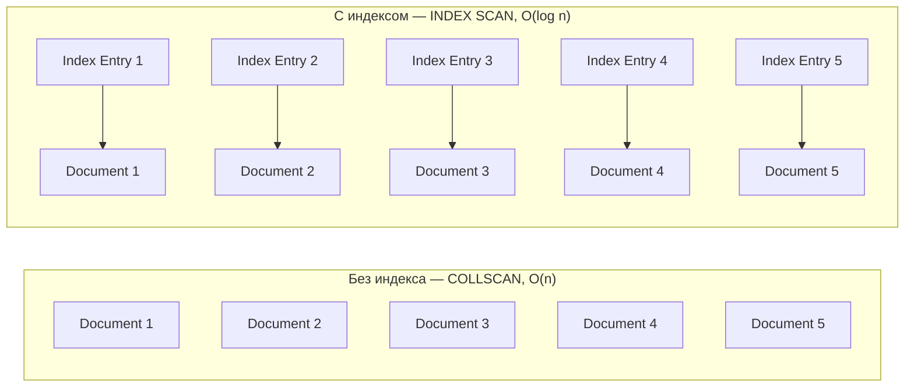

# MongoDB: Индексы — Полное руководство по индексации и оптимизации запросов

Комплексное руководство по индексам в **MongoDB**: типы индексов, стратегии индексации, управление и оптимизация производительности.

## Полезные ссылки

### Официальная документация
- [MongoDB Indexes](https://www.mongodb.com/docs/manual/indexes/)
- [Index Strategies](https://www.mongodb.com/docs/manual/applications/indexes/)
- [Index Types](https://www.mongodb.com/docs/manual/indexes/#index-types)

### Обучающие материалы
- [MongoDB Indexes](https://www.baeldung.com/spring-data-mongodb-index-annotation)

### См. также
- [[mongodb-queries|Запросы]] — оптимизация запросов
- [[mongodb-performance|Производительность]] — производительность и мониторинг

- [[clickhouse|ClickHouse]]
- [[mongodb-crud|MongoDB: CRUD операции — Создание, чтение, обновление и удаление документов]]
- [[mongodb-aggregation|MongoDB: Aggregation Framework — Полное руководство по агрегации данных]]
## Содержание

- [Введение в индексы MongoDB](#введение-в-индексы-mongodb)
  - [Преимущества индексов](#преимущества-индексов)
  - [Недостатки индексов](#недостатки-индексов)
  - [Default индекс](#default-индекс)
- [Типы индексов в MongoDB](#типы-индексов-в-mongodb)
  - [1. Single Field Index (Однопольный индекс)](#1-single-field-index-однопольный-индекс)
    - [Создание в MongoDB Shell](#создание-в-mongodb-shell)
    - [Java + Spring реализация](#java-spring-реализация)
    - [Spring Data MongoDB аннотации](#spring-data-mongodb-аннотации)
  - [2. Compound Index (Составной индекс)](#2-compound-index-составной-индекс)
    - [Создание составных индексов](#создание-составных-индексов)
    - [Java реализация](#java-реализация)
    - [Spring Data MongoDB](#spring-data-mongodb)
    - [Оптимизация запросов с compound индексами](#оптимизация-запросов-с-compound-индексами)
  - [3. Multikey Index (Мультиключевой индекс)](#3-multikey-index-мультиключевой-индекс)
    - [Создание multikey индексов](#создание-multikey-индексов)
    - [Java реализация](#java-реализация-1)
    - [Ограничения multikey индексов](#ограничения-multikey-индексов)
  - [4. Text Index (Текстовый индекс)](#4-text-index-текстовый-индекс)
    - [Создание text индексов](#создание-text-индексов)
    - [Java реализация](#java-реализация-2)
    - [Spring Data MongoDB](#spring-data-mongodb-1)
    - [Text поиск](#text-поиск)
  - [5. Geospatial Index (Геопространственный индекс)](#5-geospatial-index-геопространственный-индекс)
    - [2d индекс (для плоских координат)](#2d-индекс-для-плоских-координат)
    - [2dsphere индекс (для сферических координат)](#2dsphere-индекс-для-сферических-координат)
    - [Java реализация геоиндексов](#java-реализация-геоиндексов)
    - [Spring Data MongoDB гео](#spring-data-mongodb-гео)
  - [6. Partial Index (Частичный индекс)](#6-partial-index-частичный-индекс)
    - [Создание partial индексов](#создание-partial-индексов)
    - [Java реализация](#java-реализация-3)
  - [7. TTL Index (Time-To-Live индекс)](#7-ttl-index-time-to-live-индекс)
    - [Создание TTL индексов](#создание-ttl-индексов)
    - [Java реализация](#java-реализация-4)
- [Управление индексами](#управление-индексами)
  - [Просмотр индексов](#просмотр-индексов)
    - [MongoDB Shell](#mongodb-shell)
    - [Java реализация](#java-реализация-5)
  - [Удаление индексов](#удаление-индексов)
    - [MongoDB Shell](#mongodb-shell-1)
    - [Java реализация](#java-реализация-6)
  - [Перестройка индексов](#перестройка-индексов)
    - [MongoDB Shell](#mongodb-shell-2)
    - [Java реализация](#java-реализация-7)
- [Стратегии индексации](#стратегии-индексации)
  - [1. ESR (Equality, Sort, Range) правило](#1-esr-equality-sort-range-правило)
  - [2. Covering indexes](#2-covering-indexes)
  - [3. Index intersection](#3-index-intersection)
  - [4. Sparse indexes](#4-sparse-indexes)
- [Оптимизация запросов с индексами](#оптимизация-запросов-с-индексами)
  - [Explain plan анализ](#explain-plan-анализ)
    - [MongoDB Shell](#mongodb-shell-3)
    - [Java анализ](#java-анализ)
  - [Индексные паттерны](#индексные-паттерны)
    - [1. Zero or few documents match](#1-zero-or-few-documents-match)
    - [2. Many documents match](#2-many-documents-match)
    - [3. Aggregation optimization](#3-aggregation-optimization)
- [Лучшие практики по индексации](#лучшие-практики-по-индексации)
  - [1. Анализируйте запросы](#1-анализируйте-запросы)
  - [2. Не переусердствуйте с индексами](#2-не-переусердствуйте-с-индексами)
  - [3. Мониторьте использование индексов](#3-мониторьте-использование-индексов)
  - [4. Регулярное обслуживание](#4-регулярное-обслуживание)
- [Решение проблем](#решение-проблем)
  - [1. Index not used](#1-index-not-used)
  - [2. Index too large](#2-index-too-large)
  - [3. Write performance degradation](#3-write-performance-degradation)
  - [4. Index key too long](#4-index-key-too-long)
- [Мониторинг и обслуживание индексов](#мониторинг-и-обслуживание-индексов)
  - [Метрики индексов](#метрики-индексов)
    - [MongoDB metrics](#mongodb-metrics)
    - [Java мониторинг](#java-мониторинг)
  - [Обслуживание индексов](#обслуживание-индексов)
    - [Проверка фрагментации](#проверка-фрагментации)
    - [Резервное копирование индексов](#резервное-копирование-индексов)
  - [Автоматизация мониторинга](#автоматизация-мониторинга)
    - [Проверка индексов скриптом](#проверка-индексов-скриптом)
    - [Java monitoring service](#java-monitoring-service)
  - [Ключевые принципы:](#ключевые-принципы)
  - [Рекомендации по типам индексов:](#рекомендации-по-типам-индексов)
  - [Производительность:](#производительность)
  - [Best practices:](#best-practices)

## Введение в индексы MongoDB

**Индексы** в **MongoDB** — это специальные структуры данных, которые хранят упорядоченную копию части данных коллекции. Они позволяют **MongoDB** быстро находить документы без сканирования всей коллекции.

Сравнение поиска без индекса (COLLSCAN) и с индексом (INDEX SCAN).



### Преимущества индексов

1. **Быстрый поиск**: Логарифмическое время вместо линейного
2. **Сортировка**: Индексы поддерживают упорядоченное извлечение
3. **Покрытие**: Некоторые запросы могут быть выполнены только из индекса
4. **Уникальность**: Обеспечение уникальности значений

### Недостатки индексов

1. **Место на диске**: Индексы занимают дополнительное пространство
2. **Замедление вставки**: Обновление индексов при модификации данных
3. **Память**: Большие индексы могут не помещаться в **RAM**

### Default индекс

**MongoDB** автоматически создает индекс на поле `_id` для каждой коллекции:**

```java
// Spring Data MongoDB
@Document(collection = "users")
public class User {
    @Id
    private String id; // Автоматически индексируется

    private String name;
    private String email;
}
```

## Типы индексов в MongoDB

### 1. Single Field Index (Однопольный индекс)

Самый простой тип индекса, создаваемый на одном поле документа.

#### Создание в MongoDB Shell
```javascript
// Создание индекса на поле name
db.users.createIndex({ name: 1 })

// Создание индекса на поле email (уникальный)
db.users.createIndex({ email: 1 }, { unique: true })

// Создание индекса на вложенном поле
db.users.createIndex({ "address.city": 1 })
```

#### Java + Spring реализация
```java
// Зависимость Maven
<dependency>
    <groupId>org.mongodb</groupId>
    <artifactId>mongodb-driver-sync</artifactId>
    <version>4.9.0</version>
</dependency>

// Создание индекса программно
MongoCollection<Document> collection = database.getCollection("users");

// Single field index
collection.createIndex(Indexes.ascending("name"));

// Unique index
collection.createIndex(Indexes.ascending("email"),
    new IndexOptions().unique(true));

// Compound index (see below)
collection.createIndex(Indexes.compoundIndex(
    Indexes.ascending("lastName"),
    Indexes.ascending("firstName")));
```

#### Spring Data MongoDB аннотации
```java
@Document(collection = "users")
public class User {
    @Id
    private String id;

    @Indexed
    private String name;

    @Indexed(unique = true)
    private String email;

    @Indexed(direction = IndexDirection.DESCENDING)
    private LocalDateTime createdAt;

    // Compound index
    @CompoundIndex(def = "{'lastName': 1, 'firstName': 1}")
    private String lastName;
    private String firstName;
}
```

### 2. Compound Index (Составной индекс)

Индекс на нескольких полях документа. Порядок полей в индексе важен для оптимизации запросов.

#### Создание составных индексов
```javascript
// Индекс для поиска по имени и возрасту
db.users.createIndex({ name: 1, age: -1 })

// Индекс для поиска по городу и имени
db.users.createIndex({ "address.city": 1, name: 1 })

// Индекс для сортировки по дате и имени
db.users.createIndex({ createdAt: -1, name: 1 })
```

#### Java реализация
```java
// Compound index с сортировкой
collection.createIndex(Indexes.compoundIndex(
    Indexes.ascending("department"),
    Indexes.descending("salary"),
    Indexes.ascending("name")
));

// Wildcard index для динамических полей
collection.createIndex(Indexes.ascending("metadata.$"));
```

#### Spring Data MongoDB
```java
@Document(collection = "employees")
public class Employee {
    @Id
    private String id;

    @Indexed
    private String department;

    private int salary;
    private String name;

    // Compound index для department + salary
    @CompoundIndex(def = "{'department': 1, 'salary': -1}")
    public String getDepartment() { return department; }

    // Compound index для поиска и сортировки
    @CompoundIndex(def = "{'department': 1, 'name': 1}")
    public String getName() { return name; }
}
```

#### Оптимизация запросов с compound индексами

```javascript
// Запрос использует индекс {name: 1, age: -1}
db.users.find({ name: "John", age: { $gt: 25 } }).sort({ age: -1 })

// Запрос использует индекс {city: 1, name: 1}
db.users.find({ "address.city": "Moscow", name: /^A/ })

// Запрос НЕ использует индекс (непрефиксная часть)
db.users.find({ age: { $gt: 25 } }).sort({ name: 1 })
```

### 3. Multikey Index (Мультиключевой индекс)

Индекс на массивы. **MongoDB** создает отдельную запись индекса для каждого элемента массива.

#### Создание multikey индексов
```javascript
// Индекс на массив тегов
db.articles.createIndex({ tags: 1 })

// Индекс на массив объектов
db.products.createIndex({ "specifications.color": 1 })

// Compound multikey index
db.products.createIndex({ category: 1, tags: 1 })
```

#### Java реализация
```java
// Multikey index для массива
collection.createIndex(Indexes.ascending("tags"));

// Multikey для вложенных массивов
collection.createIndex(Indexes.ascending("comments.author"));

// Compound multikey
collection.createIndex(Indexes.compoundIndex(
    Indexes.ascending("category"),
    Indexes.ascending("tags")
));
```

#### Ограничения multikey индексов
- **Один массив на индекс**: **Compound** индекс может иметь только одно поле массива
- **Порядок**: **Multikey** поля должны быть последними в **compound** индексе
- **Sparse**: **Multikey** индексы не могут быть **sparse**

### 4. Text Index (Текстовый индекс)

Полнотекстовый поиск по текстовым полям с поддержкой языков и **stemming**.

#### Создание text индексов
```javascript
// Простой text index
db.articles.createIndex({ content: "text" })

// Text index на нескольких полях
db.articles.createIndex({
    title: "text",
    content: "text",
    tags: "text"
})

// Text index с весами
db.articles.createIndex({
    title: "text",
    content: "text"
}, {
    weights: { title: 10, content: 1 },
    name: "article_text_index"
})
```

#### Java реализация
```java
// Text index
collection.createIndex(Indexes.text("content"));

// Compound text index
collection.createIndex(Indexes.compoundIndex(
    Indexes.text("title"),
    Indexes.text("content"),
    Indexes.ascending("publishedAt")
));

// Text index с настройками
TextIndexOptions options = new TextIndexOptions()
    .weights(new Document("title", 10).append("content", 1))
    .languageOverride("language")
    .name("article_text");

collection.createIndex(Indexes.text(Arrays.asList("title", "content")), options);
```

#### Spring Data MongoDB
```java
@Document(collection = "articles")
public class Article {
    @Id
    private String id;

    @TextIndexed(weight = 10)
    private String title;

    @TextIndexed
    private String content;

    @TextIndexed
    private List<String> tags;

    private String language = "english";
}

// Text index на уровне класса
@TextIndex(definition = "{'title': 'text', 'content': 'text'}",
           weights = "{'title': 10, 'content': 1}")
public class Article {
    // ...
}
```

#### Text поиск
```javascript
// Простой поиск
db.articles.find({ $text: { $search: "database optimization" } })

// Поиск с языком
db.articles.find({
    $text: { $search: "database", $language: "english" }
})

// Поиск фразы
db.articles.find({
    $text: { $search: "\"database optimization\"" }
})

// Поиск с исключением
db.articles.find({
    $text: { $search: "database -mysql" }
})
```

### 5. Geospatial Index (Геопространственный индекс)

Индексы для географических данных: точки, линии, полигоны.

#### 2d индекс (для плоских координат)
```javascript
// 2d index для точек
db.places.createIndex({ location: "2d" })

// 2d index с границами
db.places.createIndex({ location: "2d" }, { min: -180, max: 180 })

// Пример документа
{
    name: "Red Square",
    location: [37.617, 55.755]  // [longitude, latitude]
}
```

#### 2dsphere индекс (для сферических координат)
```javascript
// 2dsphere для GeoJSON
db.places.createIndex({ location: "2dsphere" })

// Примеры GeoJSON объектов
{
    name: "Moscow",
    location: {
        type: "Point",
        coordinates: [37.617, 55.755]
    }
}

{
    name: "Kremlin",
    location: {
        type: "Polygon",
        coordinates: [[
            [37.614, 55.752],
            [37.620, 55.752],
            [37.620, 55.758],
            [37.614, 55.758],
            [37.614, 55.752]
        ]]
    }
}
```

#### Java реализация геоиндексов
```java
// 2d index
collection.createIndex(Indexes.geo2d("location"));

// 2dsphere index
collection.createIndex(Indexes.geo2dsphere("location"));

// Geospatial queries
collection.find(Filters.near("location",
    new Point(new Position(37.617, 55.755)), 1000.0, 0.0));

collection.find(Filters.geoWithinCenter("location", 37.617, 55.755, 5.0));
```

#### Spring Data MongoDB гео
```java
@Document(collection = "places")
public class Place {
    @Id
    private String id;

    private String name;

    @GeoSpatialIndexed(type = GeoSpatialIndexType.GEO_2DSPHERE)
    private Point location;

    // Для legacy координат
    @GeoSpatialIndexed(type = GeoSpatialIndexType.GEO_2D)
    private double[] coordinates;
}
```

### 6. Partial Index (Частичный индекс)

Индекс только на документах, удовлетворяющих условию фильтра.

#### Создание partial индексов
```javascript
// Индекс только на активных пользователях
db.users.createIndex(
    { email: 1 },
    {
        partialFilterExpression: { status: "active" },
        unique: true
    }
)

// Индекс на документах с определенными полями
db.products.createIndex(
    { price: 1 },
    { partialFilterExpression: { category: "electronics" } }
)
```

#### Java реализация
```java
// Partial index
PartialIndexOptions options = new PartialIndexOptions()
    .partialFilterExpression(Filters.eq("status", "active"));

collection.createIndex(
    Indexes.ascending("email"),
    new IndexOptions().partialFilterExpression(Filters.eq("status", "active"))
);
```

### 7. TTL Index (Time-`To-Live` индекс)

Автоматическое удаление документов по истечении времени.

#### Создание TTL индексов
```javascript
// TTL на поле с датой
db.sessions.createIndex(
    { createdAt: 1 },
    { expireAfterSeconds: 3600 }  // 1 час
)

// TTL на будущее время
db.notifications.createIndex(
    { expiresAt: 1 },
    { expireAfterSeconds: 0 }  // Удалить после expiresAt
)
```

#### Java реализация
```java
// TTL index
collection.createIndex(
    Indexes.ascending("createdAt"),
    new IndexOptions().expireAfter(1, TimeUnit.HOURS)
);

// TTL на будущее время
collection.createIndex(
    Indexes.ascending("expiresAt"),
    new IndexOptions().expireAfter(0, TimeUnit.SECONDS)
);
```

## Управление индексами

### Просмотр индексов

#### MongoDB Shell
```javascript
// Просмотр всех индексов коллекции
db.users.getIndexes()

// Просмотр индексов базы данных
db.getCollectionNames().forEach(function(collection) {
    print(collection + ":");
    printjson(db[collection].getIndexes());
});

// Размер индексов
db.users.stats().indexSizes
```

#### Java реализация
```java
// Получить все индексы
for (Document index : collection.listIndexes()) {
    System.out.println(index.toJson());
}

// Статистика индексов
Document stats = database.runCommand(new Document("collStats", "users"));
Document indexSizes = (Document) stats.get("indexSizes");
```

### Удаление индексов

#### MongoDB Shell
```javascript
// Удалить индекс по имени
db.users.dropIndex("name_1")

// Удалить индекс по спецификации
db.users.dropIndex({ name: 1, age: -1 })

// Удалить все индексы (кроме _id)
db.users.dropIndexes()
```

#### Java реализация
```java
// Удалить индекс по имени
collection.dropIndex("name_1");

// Удалить индекс по спецификации
collection.dropIndex(Indexes.ascending("name"));

// Удалить все индексы
collection.dropIndexes();
```

### Перестройка индексов

#### MongoDB Shell
```javascript
// Перестроить индексы коллекции
db.users.reIndex()

// Компакт индексы (MongoDB 4.4+)
db.runCommand({ compact: "users" })
```

#### Java реализация
```java
// Перестроить индексы
database.runCommand(new Document("reIndex", "users"));

// Компакт (если поддерживается)
database.runCommand(new Document("compact", "users"));
```

## Стратегии индексации

### 1. ESR (Equality, `Sort`, Range) правило

При создании **compound** индексов следовать порядку: **Equality** **Sort** **Range**.

```javascript
// Хороший индекс для ESR
db.orders.createIndex({
    customerId: 1,  // Equality
    orderDate: -1,  // Sort
    total: 1        // Range
})

// Запрос использующий индекс
db.orders.find({ customerId: "123" })
    .sort({ orderDate: -1 })
    .limit(10)
```

### 2. Covering indexes

Индекс покрывает все поля запроса, данные читаются только из индекса.

```javascript
// Covering index
db.users.createIndex({
    name: 1,
    email: 1,
    age: 1
})

// Запрос полностью покрыт индексом
db.users.find(
    { age: { $gte: 18 } },
    { name: 1, email: 1, _id: 0 }
).explain("executionStats")
```

### 3. Index intersection

**MongoDB** может использовать несколько индексов для одного запроса.

```javascript
// Два отдельных индекса
db.users.createIndex({ name: 1 })
db.users.createIndex({ age: 1 })

// Запрос использует оба индекса
db.users.find({
    name: "John",
    age: { $gte: 25 }
})
```

### 4. Sparse indexes

Индексы только на документах, содержащих индексируемое поле.

```javascript
// Sparse index
db.users.createIndex(
    { email: 1 },
    { sparse: true }
)

// Документы без email не индексируются
{
    name: "John",
    age: 30
    // нет поля email - не индексируется
}
```

## Оптимизация запросов с индексами

### Explain plan анализ

#### MongoDB Shell
```javascript
// Анализ плана выполнения
db.users.find({ name: "John" }).explain("executionStats")

// Ключевые метрики
{
    "executionStats": {
        "totalDocsExamined": 1,      // Документов просмотрено
        "totalDocsReturned": 1,      // Документов возвращено
        "executionTimeMillis": 0,    // Время выполнения
        "indexesUsed": ["name_1"]    // Использованные индексы
    }
}
```

#### Java анализ
```java
// Анализ с Java драйвером
FindIterable<Document> iterable = collection.find(Filters.eq("name", "John"));
Document explanation = iterable.explain();

System.out.println("Winning plan: " + explanation.get("winningPlan"));
System.out.println("Execution stats: " + explanation.get("executionStats"));
```

### Индексные паттерны

#### 1. Zero or few documents match

Для запросов возвращающих мало документов — индекс обязателен.

```javascript
// Плохой запрос без индекса
db.users.find({ email: "unique@example.com" })  // COLLSCAN

// Хороший запрос с индексом
db.users.createIndex({ email: 1 })
db.users.find({ email: "unique@example.com" })  // INDEX SCAN
```

#### 2. Many documents match

Для запросов возвращающих много документов — **compound** индексы с сортировкой.

```javascript
// Индекс для фильтрации и сортировки
db.products.createIndex({
    category: 1,
    price: -1,
    rating: -1
})

// Эффективный запрос
db.products.find({ category: "electronics" })
    .sort({ price: -1, rating: -1 })
    .limit(20)
```

#### 3. Aggregation optimization

Индексы для **aggregation pipeline**.

```javascript
// Индекс для $match стадии
db.orders.createIndex({ status: 1, createdAt: 1 })

// Aggregation с индексом
db.orders.aggregate([
    { $match: { status: "completed", createdAt: { $gte: ISODate("2023-01-01") } } },
    { $group: { _id: "$customerId", total: { $sum: "$amount" } } },
    { $sort: { total: -1 } }
])
```

## Лучшие практики по индексации

### 1. Анализируйте запросы

```javascript
// Включить профилирование медленных запросов
db.setProfilingLevel(1, { slowms: 100 })

// Просмотр медленных запросов
db.system.profile.find().sort({ ts: -1 }).limit(5)

// Отключить профилирование
db.setProfilingLevel(0)
```

### 2. Не переусердствуйте с индексами

```javascript
// Плохо: слишком много индексов
db.users.createIndex({ name: 1 })
db.users.createIndex({ email: 1 })
db.users.createIndex({ age: 1 })
db.users.createIndex({ name: 1, email: 1 })
db.users.createIndex({ name: 1, age: 1 })

// Хорошо: только нужные индексы
db.users.createIndex({ email: 1 }, { unique: true })  // Для поиска
db.users.createIndex({ name: 1, age: -1 })           // Для сортировки
```

### 3. Мониторьте использование индексов

```javascript
// Статистика использования индексов
db.users.aggregate([
    { $indexStats: {} }
])

// Найти неиспользуемые индексы
db.users.getIndexes().forEach(function(index) {
    var key = Object.keys(index.key)[0];
    var usage = db.runCommand({
        "collStats": "users",
        "indexDetails": true
    });
    // Анализировать usage
});
```

### 4. Регулярное обслуживание

```javascript
// Перестроить поврежденные индексы
db.users.reIndex()

// Компакт индексы
db.runCommand({ compact: "users" })

// Удалить неиспользуемые индексы
db.users.dropIndex("unused_index")
```

## Решение проблем

### 1. Index not used

```javascript
// Проблема: индекс не используется
db.users.find({ age: { $gt: 25 } })  // COLLSCAN вместо IXSCAN

// Решение: проверить селективность
db.users.find({ age: { $gt: 25 } }).explain()

// Если индекс не используется - возможно низкая селективность
// Решение: compound индекс или hint
db.users.find({ age: { $gt: 25 } }).hint({ age: 1 })
```

### 2. Index too large

```javascript
// Проблема: индекс не помещается в память
db.products.stats().indexSizes

// Решения:
// 1. Partial индексы
db.products.createIndex(
    { price: 1 },
    { partialFilterExpression: { category: "active" } }
)

// 2. Sparse индексы
db.products.createIndex(
    { discontinuedAt: 1 },
    { sparse: true }
)
```

### 3. Write performance degradation

```javascript
// Проблема: вставка замедлилась после создания индексов

// Решения:
// 1. Удалить ненужные индексы
db.users.dropIndex("unused_compound_index")

// 2. Использовать background создание индексов
db.users.createIndex(
    { createdAt: 1 },
    { background: true }
)

// 3. Bulk операции вместо множественных insert
db.users.bulkWrite([
    { insertOne: { document: doc1 } },
    { insertOne: { document: doc2 } }
])
```

### 4. Index key too long

```javascript
// Проблема: ключ индекса превышает лимит (1024 байта)

// Решения:
// 1. Хэшированные индексы
db.users.createIndex(
    { longField: "hashed" }
)

// 2. Partial индексы для сокращения
db.users.createIndex(
    { longField: 1 },
    { partialFilterExpression: { status: "active" } }
)
```

## Мониторинг и обслуживание индексов

### Метрики индексов

#### MongoDB metrics
```javascript
// Размер индексов
db.users.stats().indexSizes

// Использование индексов
db.serverStatus().metrics

// Index usage statistics
db.users.aggregate([
    { $indexStats: {} },
    { $project: { name: 1, usage: "$accesses.ops" } }
])
```

#### Java мониторинг
```java
// Получить статистику индексов
Document collStats = database.runCommand(new Document("collStats", "users"));
System.out.println("Index sizes: " + collStats.get("indexSizes"));

Document indexStats = database.runCommand(new Document("aggregate", "users")
    .append("pipeline", Arrays.asList(
        new Document("$indexStats", new Document())
    ))
    .append("cursor", new Document())
);
```

### Обслуживание индексов

#### Проверка фрагментации
```javascript
// Проверка степени фрагментации
db.users.stats().wiredTiger

// Компакт индексы при необходимости
db.runCommand({ compact: "users" })
```

#### Резервное копирование индексов
```javascript
// Включить индексы в backup
mongodump --db users --collection users --indexes

// Восстановить с индексами
mongorestore --db users --collection users --indexes
```

### Автоматизация мониторинга

#### Проверка индексов скриптом
```javascript
// check_indexes.js
db.getCollectionNames().forEach(function(collection) {
    var indexes = db[collection].getIndexes();
    var stats = db[collection].stats();

    print("Collection: " + collection);
    print("Index count: " + indexes.length);
    print("Total index size: " + (stats.indexSizes || 0));
    print("---");
});
```

#### Java monitoring service
```java
@Service
public class IndexMonitorService {

    @Autowired
    private MongoTemplate mongoTemplate;

    @Scheduled(fixedRate = 3600000) // Каждый час
    public void monitorIndexes() {
        for (String collection : mongoTemplate.getCollectionNames()) {
            Document stats = mongoTemplate.getDb().runCommand(
                new Document("collStats", collection));

            // Логировать размеры индексов
            Document indexSizes = (Document) stats.get("indexSizes");
            if (indexSizes != null) {
                for (String indexName : indexSizes.keySet()) {
                    long size = ((Number) indexSizes.get(indexName)).longValue();
                    logger.info("Index {} size: {} bytes", indexName, size);
                }
            }
        }
    }
}
```

**Индексы** — это фундаментальная часть оптимизации производительности **MongoDB**. Правильная стратегия индексации может ускорить запросы в сотни раз, но неправильная — значительно замедлить операции записи.

### Ключевые принципы:

1. **Анализ перед созданием**: Изучайте паттерны запросов
2. **ESR правило**: **Equality** **Sort** **Range** порядок полей
3. **Не переусердствуйте**: Каждый индекс имеет стоимость
4. **Мониторинг**: Регулярно проверяйте использование индексов
5. **Обслуживание**: Перестраивайте и удаляйте ненужные индексы

### Рекомендации по типам индексов:

- **Single Field**: Для простых запросов по одному полю
- **Compound**: Для сложных запросов с фильтрацией и сортировкой
- **Multikey**: Для поиска по массивам
- **Text**: Для полнотекстового поиска
- **Geospatial**: Для географических данных
- **Partial**: Для выборочного индексирования
- **TTL**: Для автоматического удаления данных

### Производительность:

- **Read queries**: Индексы могут ускорить в 100-1000 раз
- **Write operations**: Каждый индекс замедляет вставку на 10-50%
- **Memory**: Индексы должны помещаться в **RAM**
- **Storage**: Индексы занимают 10-50% от размера данных

### Best practices:

1. **Создавайте индексы на полях частых запросов**
2. **Используйте compound индексы для сложных условий**
3. **Удаляйте неиспользуемые индексы**
4. **Мониторьте производительность запросов**
5. **Тестируйте индексы на staging окружении**

Эффективная индексация — это баланс между скоростью чтения и записи, использованием памяти и места на диске. Регулярный мониторинг и оптимизация индексов критически важны для поддержания высокой производительности **MongoDB** в **production**.

```text

### Преимущества индексов

1. Быстрый поиск: Логарифмическое время вместо линейного
2. Сортировка: Индексы поддерживают упорядоченное извлечение
3. Покрытие: Некоторые запросы могут быть выполнены только из индекса
4. Уникальность: Обеспечение уникальности значений

### Недостатки индексов

1. Место на диске: Индексы занимают дополнительное пространство
2. Замедление вставки: Обновление индексов при модификации данных
3. Память: Большие индексы могут не помещаться в RAM

## Типы индексов в MongoDB

### 1. Single Field Index (Однопольный индекс)

Самый простой тип индекса, создаваемый на одном поле документа.

```
// Java + Spring implementation available
``````java
// `Java` + `Spring implementation available`
```
// Java + Spring implementation available
``````java
// `Java` + `Spring implementation available`
```
// Java + Spring implementation available
``````java
// `Java` + `Spring implementation available`
```
// Java + Spring implementation available
``````java
// `Java` + `Spring implementation available`
```
// Java + Spring implementation available
``````java
// `Java` + `Spring implementation available`
```
// Java + Spring implementation available
``````java
// `Java` + `Spring implementation available`
```
// Java + Spring implementation available
``````java
// `Java` + `Spring implementation available`
```
// Java + Spring implementation available
``````java
// `Java` + `Spring implementation available`
```
// Java + Spring implementation available
``````java
// `Java` + `Spring implementation available`
```
// Java + Spring implementation available
``````java
// `Java` + `Spring implementation available`
```
// Java + Spring implementation available
``````java
// `Java` + `Spring implementation available`
```
// Java + Spring implementation available
``````java
// `Java` + `Spring implementation available`
```
// Java + Spring implementation available
``````java
// `Java` + `Spring implementation available`
```
// Java + Spring implementation available
``````java
// `Java` + `Spring implementation available`
```
// Java + Spring implementation available
``````java
// `Java` + `Spring implementation available`
```
// Java + Spring implementation available
``````java
// `Java` + `Spring implementation available`
```
// Java + Spring implementation available
```text

```
