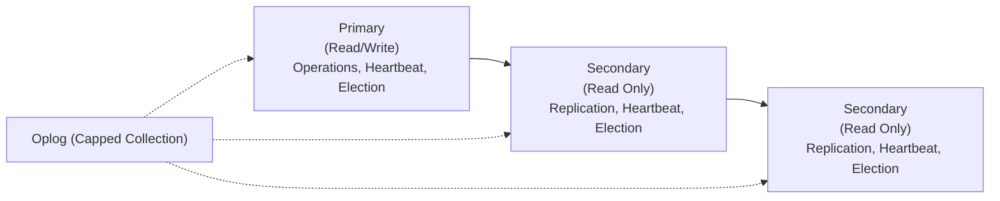
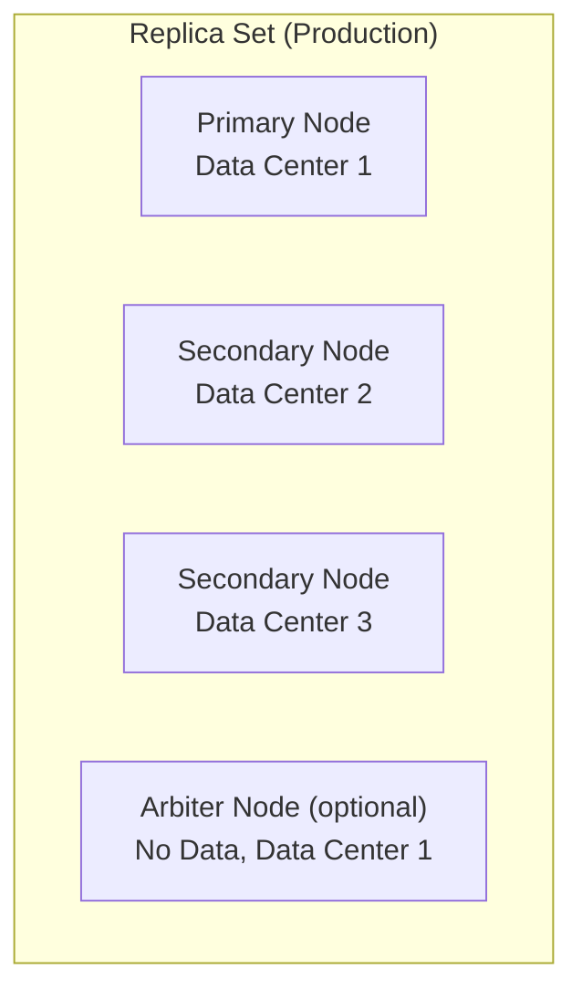

# MongoDB: Репликация — Replica Sets для высокой доступности и отказоустойчивости

Полное руководство по репликации в **MongoDB**: **Replica Sets**, настройка, управление, **Read Preferences** и **Write Concerns**.

## Полезные ссылки

### Официальная документация
- [MongoDB Replication](https://www.mongodb.com/docs/manual/replication/)
- [Replica Set Configuration](https://www.mongodb.com/docs/manual/reference/replica-configuration/)
- [Read Preferences](https://www.mongodb.com/docs/manual/core/read-preference/)

### Обучающие материалы
- [MongoDB Replica Sets](https://www.baeldung.com/spring-data-mongodb-replica-set)

### См. также
- [[mongodb-basics|Основы]] — **MongoDB**
- [[mongodb-sharding|Шардирование]] — масштабирование

## Содержание

- [Введение в репликацию MongoDB](#введение-в-репликацию-mongodb)
  - [Преимущества репликации](#преимущества-репликации)
  - [Типы членов Replica Set](#типы-членов-replica-set)
    - [Primary Node](#primary-node)
    - [Secondary Nodes](#secondary-nodes)
    - [Arbiter Nodes](#arbiter-nodes)
- [Архитектура Replica Set](#архитектура-replica-set)
  - [Базовая архитектура](#базовая-архитектура)
  - [Рекомендуемые конфигурации](#рекомендуемые-конфигурации)
    - [Для разработки](#для-разработки)
    - [Для production](#для-production)
    - [Минимальная конфигурация](#минимальная-конфигурация)
- [Настройка Replica Set](#настройка-replica-set)
  - [1. Подготовка серверов](#1-подготовка-серверов)
- [Создание директорий для данных](#создание-директорий-для-данных)
- [Запуск MongoDB инстансов](#запуск-mongodb-инстансов)
  - [2. Инициализация Replica Set](#2-инициализация-replica-set)
    - [MongoDB Shell](#mongodb-shell)
    - [Конфигурация с приоритетами](#конфигурация-с-приоритетами)
  - [3. Java + Spring настройка](#3-java-spring-настройка)
    - [Зависимости Maven](#зависимости-maven)
    - [Подключение к Replica Set](#подключение-к-replica-set)
    - [Spring Boot application.yml](#spring-boot-applicationyml)
  - [4. Docker Compose настройка](#4-docker-compose-настройка)
    - [docker-compose.yml](#docker-composeyml)
    - [Инициализация](#инициализация)
- [Подключение к первому контейнеру](#подключение-к-первому-контейнеру)
- [Инициализация replica set](#инициализация-replica-set)
- [Управление Replica Set](#управление-replica-set)
  - [Добавление членов](#добавление-членов)
    - [Добавление Secondary](#добавление-secondary)
    - [Добавление Arbiter](#добавление-arbiter)
  - [Удаление членов](#удаление-членов)
    - [Удаление члена](#удаление-члена)
  - [Изменение конфигурации](#изменение-конфигурации)
    - [Обновление конфигурации](#обновление-конфигурации)
  - [Управление состоянием](#управление-состоянием)
    - [Переключение Primary](#переключение-primary)
    - [Режим обслуживания](#режим-обслуживания)
- [Read Preferences](#read-preferences)
  - [Типы Read Preferences](#типы-read-preferences)
    - [primary (по умолчанию)](#primary-по-умолчанию)
    - [primaryPreferred](#primarypreferred)
    - [secondary](#secondary)
    - [secondaryPreferred](#secondarypreferred)
    - [nearest](#nearest)
  - [Java реализация Read Preferences](#java-реализация-read-preferences)
  - [Spring Data MongoDB](#spring-data-mongodb)
  - [Тэги Read Preferences](#тэги-read-preferences)
    - [Настройка тегов](#настройка-тегов)
- [Write Concerns](#write-concerns)
  - [Уровни Write Concern](#уровни-write-concern)
    - [w: 0 (Unacknowledged)](#w-0-unacknowledged)
    - [w: 1 (Acknowledged)](#w-1-acknowledged)
    - [w: "majority"](#w-majority)
    - [w: N (Custom)](#w-n-custom)
  - [Дополнительные параметры](#дополнительные-параметры)
    - [wtimeout](#wtimeout)
    - [j: true (Journal)](#j-true-journal)
  - [Java Write Concerns](#java-write-concerns)
- [Oplog (Operation Log)](#oplog-operation-log)
  - [Структура Oplog](#структура-oplog)
  - [Типы операций в Oplog](#типы-операций-в-oplog)
    - [Insert (i)](#insert-i)
    - [Update (u)](#update-u)
    - [Delete (d)](#delete-d)
    - [Command (c)](#command-c)
  - [Управление Oplog](#управление-oplog)
    - [Размер Oplog](#размер-oplog)
    - [Мониторинг Oplog](#мониторинг-oplog)
- [Мониторинг и обслуживание](#мониторинг-и-обслуживание)
  - [Метрики Replica Set](#метрики-replica-set)
    - [Статус репликации](#статус-репликации)
    - [MongoDB метрики](#mongodb-метрики)
  - [Java мониторинг](#java-мониторинг)
  - [Обслуживание](#обслуживание)
    - [Синхронизация данных](#синхронизация-данных)
    - [Обновление без простоя](#обновление-без-простоя)
- [Безопасность Replica Set](#безопасность-replica-set)
  - [Аутентификация](#аутентификация)
    - [Настройка аутентификации](#настройка-аутентификации)
    - [Создание пользователей](#создание-пользователей)
  - [Шифрование](#шифрование)
    - [TLS/SSL настройка](#tlsssl-настройка)
  - [Авторизация](#авторизация)
    - [Роли и права](#роли-и-права)
- [Решение проблем](#решение-проблем)
  - [1. Replica lag (отставание реплики)](#1-replica-lag-отставание-реплики)
  - [2. Split brain (разделение кластера)](#2-split-brain-разделение-кластера)
  - [3. Неожиданное переключение primary](#3-неожиданное-переключение-primary)
  - [4. Oplog overflow](#4-oplog-overflow)
  - [5. Read preference не работает](#5-read-preference-не-работает)
- [Best Practices](#лучшие-практики)
  - [Конфигурация](#конфигурация)
    - [Оптимальный размер кластера](#оптимальный-размер-кластера)
    - [Настройки таймаутов](#настройки-таймаутов)
  - [Мониторинг](#мониторинг)
    - [Ключевые метрики](#ключевые-метрики)
    - [Алертинг](#алертинг)
- [Prometheus alerting rules](#prometheus-alerting-rules)
  - [Безопасность](#безопасность)
    - [Network security](#network-security)
    - [Access control](#access-control)
  - [Производительность](#производительность)
    - [Оптимизация репликации](#оптимизация-репликации)
    - [Hardware recommendations](#hardware-recommendations)
  - [Ключевые преимущества:](#ключевые-преимущества)
  - [Архитектурные решения:](#архитектурные-решения)
    - [Выбор конфигурации:](#выбор-конфигурации)
  - [Распространенные ошибки:](#распространенные-ошибки)

## Введение в репликацию MongoDB

**Репликация** в **MongoDB** обеспечивает высокую доступность, отказоустойчивость и масштабируемость чтения данных. Основной механизм репликации — **Replica Set** — это группа **MongoDB** серверов, которые поддерживают одинаковый набор данных.



### Преимущества репликации

1. **Высокая доступность**: Автоматический **failover** при отказе **primary**
2. **Отказоустойчивость**: Защита от потери данных
3. **Масштабируемость чтения**: Распределение нагрузки чтения
4. **Резервное копирование**: Горячее резервное копирование
5. **Обслуживание**: Обновления без простоя

### Типы членов Replica Set

#### Primary Node
- **Роль**: Принимает все операции записи и чтения (по умолчанию)
- **Количество**: Только один в кластере
- **Функции**: Запись операций в **oplog**, координация репликации

#### Secondary Nodes
- **Роль**: Реплицируют данные от **primary**, могут обслуживать чтение
- **Количество**: 1-50 в кластере
- **Функции**: Применение операций из **oplog**, участие в выборах

#### Arbiter Nodes
- **Роль**: Участвуют только в выборах, не хранят данные
- **Количество**: Опционально, до 50% от общего числа голосов
- **Функции**: Обеспечение нечетного числа голосов для кворума

## Архитектура Replica Set

### Базовая архитектура



### Рекомендуемые конфигурации

#### Для разработки
```text
3 узла: Primary + 2 Secondary
- Все в одном дата-центре
- Быстрое восстановление
```

#### Для production
```text
Разные дата-центры:
DC1: Primary + Secondary
DC2: Secondary + Arbiter
DC3: Secondary

Или:
5 узлов: Primary + 4 Secondary
- Гибкая конфигурация для обслуживания
```

#### Минимальная конфигурация
```text
Primary + Secondary (не рекомендуется для production)
- Недостаточная отказоустойчивость
```

## Настройка Replica Set

### 1. Подготовка серверов

```bash
# Создание директорий для данных
mkdir -p /data/db/rs0-1 /data/db/rs0-2 /data/db/rs0-3

# Запуск MongoDB инстансов
mongod --replSet rs0 --port 27017 --dbpath /data/db/rs0-1 --logpath /data/db/rs0-1.log --fork
mongod --replSet rs0 --port 27018 --dbpath /data/db/rs0-2 --logpath /data/db/rs0-2.log --fork
mongod --replSet rs0 --port 27019 --dbpath /data/db/rs0-3 --logpath /data/db/rs0-3.log --fork
```

### 2. Инициализация Replica Set

#### MongoDB Shell
```javascript
// Подключение к одному из инстансов
mongo --port 27017

// Инициализация replica set
rs.initiate({
  _id: "rs0",
  members: [
    { _id: 0, host: "localhost:27017" },
    { _id: 1, host: "localhost:27018" },
    { _id: 2, host: "localhost:27019" }
  ]
})

// Проверка статуса
rs.status()
```

#### Конфигурация с приоритетами
```javascript
// Расширенная конфигурация
rs.initiate({
  _id: "rs0",
  members: [
    { _id: 0, host: "server1:27017", priority: 3 },  // Высокий приоритет
    { _id: 1, host: "server2:27017", priority: 2 },
    { _id: 2, host: "server3:27017", priority: 1 },
    { _id: 3, host: "server4:27017", priority: 0, hidden: true }  // Hidden member
  ]
})
```

### 3. Java + Spring настройка

#### Зависимости Maven
```xml
<dependency>
    <groupId>org.mongodb</groupId>
    <artifactId>mongodb-driver-sync</artifactId>
    <version>4.9.0</version>
</dependency>

<dependency>
    <groupId>org.springframework.boot</groupId>
    <artifactId>spring-boot-starter-data-mongodb</artifactId>
</dependency>
```

#### Подключение к Replica Set
```java
@Configuration
public class MongoConfig {

    @Bean
    public MongoClient mongoClient() {
        // Connection string для replica set
        String connectionString = "mongodb://host1:27017,host2:27017,host3:27017/mydb?replicaSet=rs0";

        MongoClientSettings settings = MongoClientSettings.builder()
            .applyConnectionString(new ConnectionString(connectionString))
            .readPreference(ReadPreference.secondaryPreferred())
            .writeConcern(WriteConcern.W2)  // Majority
            .build();

        return MongoClients.create(settings);
    }
}
```

#### Spring Boot application.yml
```yaml
spring:
  data:
    mongodb:
      uri: mongodb://host1:27017,host2:27017,host3:27017/mydb?replicaSet=rs0
      # Дополнительные настройки
      read-preference: secondaryPreferred
      write-concern: w2
```

### 4. Docker Compose настройка

#### docker-compose.yml
```yaml
version: '3.8'
services:
  mongo1:
    image: mongo:7.0
    command: --replSet rs0 --port 27017
    ports:
      - "27017:27017"
    volumes:
      - ./data/mongo1:/data/db
    networks:
      - mongo-net

  mongo2:
    image: mongo:7.0
    command: --replSet rs0 --port 27017
    ports:
      - "27018:27017"
    volumes:
      - ./data/mongo2:/data/db
    networks:
      - mongo-net

  mongo3:
    image: mongo:7.0
    command: --replSet rs0 --port 27017
    ports:
      - "27019:27017"
    volumes:
      - ./data/mongo3:/data/db
    networks:
      - mongo-net

networks:
  mongo-net:
    driver: bridge
```

#### Инициализация
```bash
# Подключение к первому контейнеру
docker exec -it mongo1 mongo

# Инициализация replica set
rs.initiate({
  _id: "rs0",
  members: [
    { _id: 0, host: "mongo1:27017" },
    { _id: 1, host: "mongo2:27017" },
    { _id: 2, host: "mongo3:27017" }
  ]
})
```

## Управление Replica Set

### Добавление членов

#### Добавление Secondary
```javascript
// Добавить новый secondary
rs.add("hostname:27017")

// Добавить с опциями
rs.add({
  host: "hostname:27017",
  priority: 2,
  votes: 1
})
```

#### Добавление Arbiter
```javascript
// Добавить arbiter (только для голосования)
rs.addArb("hostname:27017")
```

### Удаление членов

#### Удаление члена
```javascript
// Удалить по hostname
rs.remove("hostname:27017")

// Или по _id
rs.remove(2)
```

### Изменение конфигурации

#### Обновление конфигурации
```javascript
// Получить текущую конфигурацию
var config = rs.config()

// Изменить настройки
config.members[0].priority = 3
config.members[1].hidden = true

// Применить изменения
rs.reconfig(config)
```

### Управление состоянием

#### Переключение Primary
```javascript
// Принудительное переключение (step down)
rs.stepDown()

// Переключение на конкретный сервер
rs.freeze(300)  // Заморозить голосование на 5 минут
```

#### Режим обслуживания
```javascript
// Перевести в режим обслуживания
db.adminCommand({ replSetMaintenance: true })

// Вывести из режима обслуживания
db.adminCommand({ replSetMaintenance: false })
```

## Read Preferences

### Типы Read Preferences

#### primary (по умолчанию)
```javascript
// Чтение только с primary
db.collection.find().readPref("primary")
```

#### primaryPreferred
```javascript
// Предпочтительно primary, но можно secondary
db.collection.find().readPref("primaryPreferred")
```

#### secondary
```javascript
// Только secondary
db.collection.find().readPref("secondary")
```

#### secondaryPreferred
```javascript
// Предпочтительно secondary, но можно primary
db.collection.find().readPref("secondaryPreferred")
```

#### nearest
```javascript
// Ближайший сервер (минимальная latency)
db.collection.find().readPref("nearest")
```

### Java реализация Read Preferences

```java
import com.mongodb.ReadPreference;
import com.mongodb.client.MongoCollection;

// Primary only
collection.withReadPreference(ReadPreference.primary());

// Primary preferred
collection.withReadPreference(ReadPreference.primaryPreferred());

// Secondary only
collection.withReadPreference(ReadPreference.secondary());

// Secondary preferred
collection.withReadPreference(ReadPreference.secondaryPreferred());

// Nearest (minimal latency)
collection.withReadPreference(ReadPreference.nearest());
```

### Spring Data MongoDB

```java
@Repository
public class UserRepositoryImpl implements UserRepository {

    private final MongoTemplate mongoTemplate;

    public UserRepositoryImpl(MongoTemplate mongoTemplate) {
        this.mongoTemplate = mongoTemplate;
    }

    @Override
    public List<User> findAllUsers() {
        // Используем secondary для чтения
        ReadPreference readPref = ReadPreference.secondaryPreferred();

        Query query = new Query();
        return mongoTemplate.find(query, User.class).withReadPreference(readPref);
    }
}
```

### Тэги Read Preferences

#### Настройка тегов
```javascript
// Конфигурация с тегами
rs.initiate({
  _id: "rs0",
  members: [
    { _id: 0, host: "server1:27017", tags: { "dc": "east", "usage": "production" } },
    { _id: 1, host: "server2:27017", tags: { "dc": "west", "usage": "reporting" } },
    { _id: 2, host: "server3:27017", tags: { "dc": "east", "usage": "reporting" } }
  ]
})

// Чтение с тегом
db.collection.find().readPref("secondary",
  [{ "dc": "west" }, { "usage": "reporting" }])
```

## Write Concerns

### Уровни Write Concern

#### w: 0 (Unacknowledged)
```javascript
// Fire and forget - нет подтверждения
db.collection.insertOne(doc, { writeConcern: { w: 0 } })
```

#### w: 1 (Acknowledged)
```javascript
// Подтверждение от primary
db.collection.insertOne(doc, { writeConcern: { w: 1 } })
```

#### w: "majority"
```javascript
// Подтверждение от большинства
db.collection.insertOne(doc, { writeConcern: { w: "majority" } })
```

#### w: N (Custom)
```javascript
// Подтверждение от N серверов
db.collection.insertOne(doc, { writeConcern: { w: 3 } })
```

### Дополнительные параметры

#### wtimeout
```javascript
// Таймаут ожидания подтверждения (мс)
db.collection.insertOne(doc, {
  writeConcern: {
    w: "majority",
    wtimeout: 5000
  }
})
```

#### j: true (Journal)
```javascript
// Ждать записи в journal
db.collection.insertOne(doc, {
  writeConcern: {
    w: 1,
    j: true
  }
})
```

### Java Write Concerns

```java
import com.mongodb.WriteConcern;

// Unacknowledged
WriteConcern unacknowledged = WriteConcern.UNACKNOWLEDGED;

// Acknowledged
WriteConcern acknowledged = WriteConcern.ACKNOWLEDGED;

// Majority
WriteConcern majority = WriteConcern.MAJORITY;

// Custom
WriteConcern custom = WriteConcern.w3().withWTimeout(5000, TimeUnit.MILLISECONDS).withJournal(true);

// Использование
collection.withWriteConcern(majority).insertOne(document);
```

### Spring Data MongoDB

```java
@Configuration
public class MongoConfig {

    @Bean
    public MongoTemplate mongoTemplate(MongoClient mongoClient) {
        MongoTemplate template = new MongoTemplate(mongoClient, "mydb");

        // Настройка write concern
        template.setWriteConcern(WriteConcern.MAJORITY.withWTimeout(5000, TimeUnit.MILLISECONDS));

        return template;
    }
}
```

## Oplog (Operation Log)

### Структура Oplog

```javascript
// Просмотр oplog
use local
db.oplog.rs.find().limit(5)

// Структура записи oplog
{
  "ts": Timestamp(1640995200, 1),     // Timestamp
  "h": NumberLong("-1234567890"),      // Hash операции
  "v": 2,                              // Version
  "op": "i",                           // Operation type
  "ns": "mydb.users",                  // Namespace
  "o": {                               // Operation data
    "_id": ObjectId("..."),
    "name": "John",
    "email": "john@example.com"
  }
}
```

### Типы операций в Oplog

#### Insert (i)
```javascript
{
  "op": "i",
  "ns": "mydb.users",
  "o": {
    "_id": ObjectId("..."),
    "name": "John Doe",
    "email": "john@example.com"
  }
}
```

#### Update (u)
```javascript
{
  "op": "u",
  "ns": "mydb.users",
  "o": { "$set": { "name": "Jane Doe" } },
  "o2": { "_id": ObjectId("...") }  // Query для поиска документа
}
```

#### Delete (d)
```javascript
{
  "op": "d",
  "ns": "mydb.users",
  "o": { "_id": ObjectId("...") }
}
```

#### Command (c)
```javascript
{
  "op": "c",
  "ns": "mydb.$cmd",
  "o": {
    "create": "newCollection"
  }
}
```

### Управление Oplog

#### Размер Oplog
```javascript
// Проверить размер oplog
use local
db.oplog.rs.stats().maxSize

// Изменить размер oplog (требует перезапуска)
db.adminCommand({
  replSetResizeOplog: 1,
  size: 990  // MB
})
```

#### Мониторинг Oplog
```javascript
// Время хранения операций
db.getReplicationInfo().timeDiff

// Статус репликации
db.printReplicationInfo()
```

## Мониторинг и обслуживание

### Метрики Replica Set

#### Статус репликации
```javascript
// Общий статус
rs.status()

// Детальный статус
rs.printReplicationInfo()

// Пинг членов
rs.printSlaveReplicationInfo()
```

#### MongoDB метрики
```javascript
// Метрики репликации
db.serverStatus().repl

// Oplog статистика
db.getReplicationInfo()
```

### Java мониторинг

```java
@Service
public class ReplicaSetMonitor {

    private final MongoClient mongoClient;

    public void monitorReplicaSet() {
        MongoDatabase adminDb = mongoClient.getDatabase("admin");
        Document replSetStatus = adminDb.runCommand(new Document("replSetGetStatus", 1));

        List<Document> members = (List<Document>) replSetStatus.get("members");
        for (Document member : members) {
            String name = member.getString("name");
            String stateStr = member.getString("stateStr");
            double health = member.getDouble("health");

            System.out.printf("Member: %s, State: %s, Health: %.0f%n",
                            name, stateStr, health);
        }
    }
}
```

### Обслуживание

#### Синхронизация данных
```javascript
// Проверить статус синхронизации
rs.printSlaveReplicationInfo()

// Пересинхронизация secondary
rs.syncFrom("hostname:27017")
```

#### Обновление без простоя
```javascript
// Rolling upgrade процедуры
// 1. Обновить secondary
// 2. Подождать синхронизации
// 3. Переключить primary
// 4. Обновить старый primary
rs.stepDown()
```

## Безопасность Replica Set

### Аутентификация

#### Настройка аутентификации
```javascript
// Включить аутентификацию
rs.initiate({
  _id: "rs0",
  members: [...],
  settings: {
    keyFile: "/path/to/keyfile"
  }
})
```

#### Создание пользователей
```javascript
// Создать admin пользователя
use admin
db.createUser({
  user: "admin",
  pwd: "securepassword",
  roles: ["root"]
})

// Создать пользователя для приложения
db.createUser({
  user: "appuser",
  pwd: "apppassword",
  roles: ["readWrite"]
})
```

### Шифрование

#### TLS/SSL настройка
```javascript
// Конфигурация с TLS
rs.initiate({
  _id: "rs0",
  members: [
    {
      _id: 0,
      host: "mongo1:27017",
      ssl: true,
      sslCert: "/path/to/cert.pem",
      sslKey: "/path/to/key.pem"
    }
  ]
})
```

### Авторизация

#### Роли и права
```javascript
// Создать пользователя с ограниченными правами
db.createUser({
  user: "readonly",
  pwd: "password",
  roles: [
    { role: "read", db: "mydb" }
  ]
})

// Пользователь для чтения с secondary
db.createUser({
  user: "secondaryReader",
  pwd: "password",
  roles: [
    { role: "read", db: "mydb" },
    { role: "readAnyDatabase", db: "admin" }
  ]
})
```

## Решение проблем

### 1. Replica lag (отставание реплики)

```javascript
// Проверить lag
rs.printSlaveReplicationInfo()

// Решения:
// 1. Проверить сетевую задержку
// 2. Увеличить oplog size
// 3. Оптимизировать индексы
// 4. Увеличить аппаратные ресурсы
```

### 2. Split brain (разделение кластера)

```javascript
// Симптомы: два primary в разных сетях

// Решения:
// 1. Настроить правильные network partitions
// 2. Использовать arbiters wisely
// 3. Настроить election timeouts
```

### 3. Неожиданное переключение primary

```javascript
// Проверить причины
rs.status().myState

// Решения:
// 1. Проверить heartbeat intervals
// 2. Настроить election timeouts
// 3. Проверить network stability
// 4. Настроить write concerns
```

### 4. Oplog overflow

```javascript
// Проверить размер oplog
db.getReplicationInfo()

// Решения:
// 1. Увеличить oplog size
// 2. Уменьшить retention time
// 3. Улучшить сеть между дата-центрами
```

### 5. Read preference не работает

```javascript
// Проверить read preference
db.getMongo().getReadPref()

// Решения:
// 1. Проверить network connectivity
// 2. Проверить secondary availability
// 3. Проверить tags configuration
// 4. Проверить read preference modes
```

## Лучшие практики

### Конфигурация

#### Оптимальный размер кластера
```javascript
// Рекомендации:
// - Development: 3 nodes (P + 2S)
// - Production: 5+ nodes (P + 4S)
// - Multi-DC: Распределение по дата-центрам
// - Arbiter: Только если нужно нечетное число голосов
```

#### Настройки таймаутов
```javascript
// Оптимальные таймауты
rs.initiate({
  _id: "rs0",
  settings: {
    heartbeatTimeoutSecs: 10,
    electionTimeoutMillis: 10000,
    catchUpTimeoutMillis: 30000
  },
  members: [...]
})
```

### Мониторинг

#### Ключевые метрики
```javascript
// 1. Replication lag
rs.printSlaveReplicationInfo()

// 2. Heartbeat status
rs.status().members[].health

// 3. Oplog size
db.getReplicationInfo()

// 4. Connection counts
db.serverStatus().connections
```

#### Алертинг
```yaml
# Prometheus alerting rules
groups:
  - name: mongodb_replication
    rules:
      - alert: MongoDBReplicationLag
        expr: mongodb_replset_member_replication_lag > 30
        for: 5m
        labels:
          severity: warning

      - alert: MongoDBPrimaryDown
        expr: mongodb_replset_member_state != 1
        for: 5m
        labels:
          severity: critical
```

### Безопасность

#### Network security
```javascript
// Bind to specific interfaces
net:
  bindIp: 10.0.0.1,127.0.0.1

// Enable TLS
net:
  ssl:
    mode: requireSSL
    PEMKeyFile: /etc/ssl/mongodb.pem
    CAFile: /etc/ssl/ca.pem
```

#### Access control
```javascript
// Включить авторизацию
security:
  authorization: enabled
  keyFile: /path/to/keyfile

// Создать пользователей с минимальными правами
db.createUser({
  user: "app",
  pwd: "securepwd",
  roles: ["readWrite"]
})
```

### Производительность

#### Оптимизация репликации
```javascript
// 1. Разместить secondary ближе к приложениям чтения
// 2. Использовать read preferences для балансировки
// 3. Мониторить и оптимизировать индексы
// 4. Настроить write concerns в зависимости от требований
```

#### Hardware recommendations
```javascript
// Primary node: Лучший CPU и storage
// Secondary nodes: Могут иметь меньше ресурсов
// Network: Стабильное низколатентное соединение
// Storage: SSD для всех nodes
```

**Replica Sets** — это фундамент высокодоступных **MongoDB** развертываний. Правильная настройка и мониторинг репликации обеспечивает:**

### Ключевые преимущества:

1. **Автоматический failover** — непрерывная доступность при отказах
2. **Защита данных** — копирование на多个 серверов
3. **Масштабируемость чтения** — распределение нагрузки
4. **Гибкость чтения** — различные **read preferences**

### Архитектурные решения:

#### Выбор конфигурации:
- **Development**: 3 **nodes** (P + 2S)
- **Production**: 5+ **nodes** с распределением по `DC`
- **Critical systems**: **Multi-DC** с **arbiters**

#### Read preferences:
- **primary**: Строгая консистентность
- **secondaryPreferred**: Баланс производительности
- **nearest**: Минимальная **latency**

#### Write concerns:
- **w:1**: Быстрые записи
- **w:majority**: Надежность
- **wtimeout**: Предотвращение зависаний

### Мониторинг и обслуживание:

1. **Регулярный мониторинг** состояния репликации
2. **Тестирование failover** сценариев
3. **Обновления без простоя** с **rolling upgrades**
4. **Резервное копирование** из **secondary nodes**

### Распространенные ошибки:

- **Неправильное размещение** — все **nodes** в одном `DC`
- **Недостаточные ресурсы** — **secondary** медленнее **primary**
- **Игнорирование сетевых проблем** — **heartbeat timeouts**
- **Неправильные write concerns** — слишком строгие или слабые

**Replica Sets** обеспечивают надёжную основу для **production MongoDB** развёртываний. Понимание принципов репликации, правильная конфигурация и регулярное обслуживание гарантируют высокую доступность и надёжность системы.

## Полезные ссылки

### Официальная документация
- [MongoDB Replication](https://www.mongodb.com/docs/manual/replication/)
- [Replica Set Configuration](https://www.mongodb.com/docs/manual/reference/replica-configuration/)
- [Read Preferences](https://www.mongodb.com/docs/manual/core/read-preference/)

### Обучающие материалы
- [MongoDB Replica Sets](https://www.baeldung.com/spring-data-mongodb-replica-set)

### См. также
- [[mongodb-basics|Основы]] — **MongoDB**
- [[mongodb-sharding|Шардирование]] — масштабирование

```text

### Преимущества репликации

1. Высокая доступность: Автоматический failover при отказе primary
2. Отказоустойчивость: Защита от потери данных
3. Масштабируемость чтения: Распределение нагрузки чтения
4. Резервное копирование: Горячее резервное копирование
5. Обслуживание: Обновления без простоя

### Типы членов Replica Set

#### Primary Node
- Роль: Принимает все операции записи и чтения (по умолчанию)
- Количество: Только один в кластере
- Функции: Запись операций в oplog, координация репликации

#### Secondary Nodes
- Роль: Реплицируют данные от primary, могут обслуживать чтение
- Количество: 1-50 в кластере
- Функции: Применение операций из oplog, участие в выборах

#### Arbiter Nodes
- Роль: Участвуют только в выборах, не хранят данные
- Количество: Опционально, до 50% от общего числа голосов
- Функции: Обеспечение нечетного числа голосов для кворума

## Архитектура Replica Set

### Базовая архитектура

```
flowchart TB
    subgraph RS["Replica Set (Production)"]
        P["Primary Node<br/>Data Center 1"]
        S1["Secondary Node<br/>Data Center 2"]
        S2["Secondary Node<br/>Data Center 3"]
        A["Arbiter Node (optional)<br/>No Data, Data Center 1"]
    end
```text

### Рекомендуемые конфигурации

#### Для разработки
```
3 узла: Primary + 2 Secondary
- Все в одном дата-центре
- Быстрое восстановление
```text

#### Для production
```
Разные дата-центры:
DC1: Primary + Secondary
DC2: Secondary + Arbiter
DC3: Secondary

Или:
5 узлов: Primary + 4 Secondary
- Гибкая конфигурация для обслуживания
```text

#### Минимальная конфигурация
```
Primary + Secondary (не рекомендуется для production)
- Недостаточная отказоустойчивость
```text

## Настройка Replica Set

### 1. Подготовка серверов

```
# Создание директорий для данных
mkdir -p /data/db/rs0-1 /data/db/rs0-2 /data/db/rs0-3

# Запуск MongoDB инстансов
mongod --replSet rs0 --port 27017 --dbpath /data/db/rs0-1 --logpath /data/db/rs0-1.log --fork
mongod --replSet rs0 --port 27018 --dbpath /data/db/rs0-2 --logpath /data/db/rs0-2.log --fork
mongod --replSet rs0 --port 27019 --dbpath /data/db/rs0-3 --logpath /data/db/rs0-3.log --fork
```text

### 2. Инициализация Replica Set

```
// Java + Spring implementation available
```text

```
