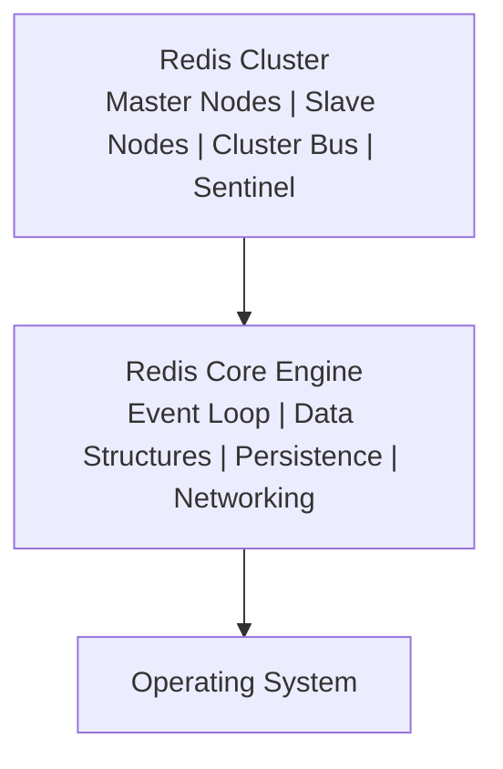

# Redis: Основы

## Полезные ссылки

- [Redis Documentation](https://redis.io/docs/)
- [Redis Commands](https://redis.io/commands/)
- [Redis Data Types](https://redis.io/docs/data-types/)
- [Redis Best Practices](https://redis.io/docs/management/optimization/)


## Содержание

- [Введение в Redis](#введение-в-redis)
  - [Основные возможности Redis](#основные-возможности-redis)
  - [Архитектура Redis](#архитектура-redis)
  - [Варианты использования Redis](#варианты-использования-redis)
- [Установка и первоначальная настройка](#установка-и-первоначальная-настройка)
  - [Установка Redis](#установка-redis)
    - [Linux (Ubuntu/Debian)](#linux-ubuntudebian)
    - [Linux (RHEL/CentOS)](#linux-rhelcentos)
    - [macOS (с Homebrew)](#macos-с-homebrew)
    - [Docker](#docker)
    - [Компиляция из исходников](#компиляция-из-исходников)
  - [Конфигурационный файл](#конфигурационный-файл)
    - [Основные настройки](#основные-настройки)
    - [Оптимизация конфигурации](#оптимизация-конфигурации)
  - [Подключение к Redis](#подключение-к-redis)
    - [Redis CLI](#redis-cli)
    - [Программные подключения](#программные-подключения)
- [Базовые команды](#базовые-команды)
  - [Информация и управление](#информация-и-управление)
  - [Работа с TTL (Time To Live)](#работа-с-ttl-time-to-live)
  - [Управление базами данных](#управление-базами-данных)
  - [Конфигурация через команды](#конфигурация-через-команды)
- [Работа с ключами](#работа-с-ключами)
  - [Базовые операции с ключами](#базовые-операции-с-ключами)
  - [Атомарные операции](#атомарные-операции)
  - [Паттерны работы с ключами](#паттерны-работы-с-ключами)
    - [Именование ключей](#именование-ключей)
    - [Организация ключей](#организация-ключей)
- [Лучшие практики](#лучшие-практики)
  - [Производительность](#производительность)
  - [Безопасность](#безопасность)
  - [Мониторинг](#мониторинг)
- [Расширенная конфигурация](#расширенная-конфигурация)
  - [Управление памятью](#управление-памятью)
  - [Network Configuration](#network-configuration)
  - [Performance Tuning](#performance-tuning)
- [Управление подключениями](#управление-подключениями)
  - [Connection Pooling](#connection-pooling)
    - [Java (Jedis)](#java-jedis)
    - [Java (Jedis)](#java-jedis-1)
  - [Connection Monitoring](#connection-monitoring)
- [Расширенные операции с ключами](#расширенные-операции-с-ключами)
  - [Batch Operations](#batch-operations)
  - [Key Expiration Patterns](#key-expiration-patterns)
  - [Key Scanning](#key-scanning)
- [Мониторинг и отладка](#мониторинг-и-отладка)
  - [Server Information](#server-information)
  - [Slow Log](#slow-log)
  - [Memory Analysis](#memory-analysis)
- [Реальные примеры](#реальные-примеры)
  - [Session Management](#session-management)
  - [Cache Implementation](#cache-implementation)
  - [Rate Limiting](#rate-limiting)
- [Решение проблем](#решение-проблем)
  - [Common Issues](#common-issues)
    - [Issue 1: Connection Refused](#issue-1-connection-refused)
    - [Issue 2: Out of Memory](#issue-2-out-of-memory)
    - [Issue 3: Slow Performance](#issue-3-slow-performance)
    - [Issue 4: Высокая задержка из-за KEYS в production](#issue-4-высокая-задержка-из-за-keys-в-production)
- [Развёртывание в продакшене](#развёртывание-в-продакшене)
  - [Systemd Service Configuration](#systemd-service-configuration)
  - [Docker Deployment](#docker-deployment)
  - [Kubernetes Deployment](#kubernetes-deployment)
- [Сводка лучших практик](#сводка-лучших-практик)
  - [Configuration](#configuration)
  - [Performance](#performance)
  - [Security](#security)
  - [Monitoring](#monitoring)
- [Дополнительные примеры конфигурации](#дополнительные-примеры-конфигурации)
  - [Настройка сети](#настройка-сети)
  - [Управление памятью](#управление-памятью-1)
  - [Настройка персистентности](#настройка-персистентности)
  - [Настройка безопасности](#настройка-безопасности)
- [Развёртывание в продакшене](#развёртывание-в-продакшене-1)
  - [Сервис Systemd](#сервис-systemd)
  - [Docker Deployment](#docker-deployment-1)
  - [Kubernetes Deployment](#kubernetes-deployment-1)
- [Сводка лучших практик](#сводка-лучших-практик-1)
  - [Configuration](#configuration-1)
  - [Операции](#операции)
- [См. также](#см-также)

## Введение в Redis

**Redis** (REmote DIctionary Server) — это быстрая **in-memory** структура данных, которая может использоваться как база данных, кэш и **message broker**. **Redis** поддерживает различные типы данных и предлагает высокую производительность благодаря хранению данных в оперативной памяти.

### Основные возможности Redis

- **In-memory хранилище**: Все данные хранятся в **RAM** для максимальной скорости
- **Разнообразие типов данных**: **Strings**, **Lists**, **Sets**, **Hashes**, **Sorted Sets**, **Streams**
- **Персистентность**: **RDB snapshots** и **AOF** (Append `Only` File)
- **Репликация**: **Master-slave** репликация с автоматическим **failover**
- **Кластеризация**: Автоматическое шардинг и распределение данных
- **Pub/Sub**: **Publish-Subscribe messaging**
- **Lua скриптинг**: Выполнение **Lua** скриптов на сервере
- **Transactions**: **ACID** транзакции
- **TTL**: Автоматическое истечение ключей

### Архитектура Redis

Диаграмма компонентов **Redis**: кластер (Master/`Slave`, Sentinel), ядро (Event `Loop`, структуры данных, персистентность, сеть), ОС.



### Варианты использования Redis

1. **Кэширование**: Кэш для веб-приложений
2. **Сессии**: Хранение сессий пользователей
3. **Очереди**: Очереди задач и сообщений
4. **Pub/Sub**: Системы публикации/подписки
5. **Счетчики**: Реализация счетчиков и рейтингов
6. **Геопространственные данные**: Хранение координат и геокодирование
7. **Leaderboards**: Рейтинги и таблицы лидеров
8. **Rate Limiting**: Ограничение частоты запросов


## Установка и первоначальная настройка

### Установка Redis

Команды для установки **Redis** на **Ubuntu**/**Debian**: обновление пакетов, установка **redis-server**, проверка статуса и управление службой.

#### Linux (Ubuntu/Debian)

```bash
# Обновление пакетов
sudo apt update

# Установка Redis
sudo apt install redis-server

# Проверка статуса
sudo systemctl status redis

# Управление службой
sudo systemctl start redis
sudo systemctl enable redis
sudo systemctl stop redis
sudo systemctl restart redis
```

#### Linux (RHEL/CentOS)

```bash
# Установка EPEL репозитория
sudo yum install epel-release

# Установка Redis
sudo yum install redis

# Запуск Redis
sudo systemctl start redis
sudo systemctl enable redis
```

#### macOS (с Homebrew)

```bash
# Установка Redis
brew install redis

# Запуск Redis
brew services start redis

# Или запуск вручную
redis-server /usr/local/etc/redis.conf
```

#### Docker

```bash
# Запуск Redis в Docker
docker run -d \
  --name redis \
  -p 6379:6379 \
  -v redis_data:/data \
  redis:7-alpine

# С кастомной конфигурацией
docker run -d \
  --name redis \
  -p 6379:6379 \
  -v $(pwd)/redis.conf:/etc/redis/redis.conf \
  -v redis_data:/data \
  redis:7-alpine redis-server /etc/redis/redis.conf

# С паролем
docker run -d \
  --name redis \
  -p 6379:6379 \
  -e REDIS_PASSWORD=mypassword \
  redis:7-alpine

# Docker Compose
cat > docker-compose.yml << EOF
version: '3.8'
services:
  redis:
    image: redis:7-alpine
    ports:
      - "6379:6379"
    volumes:
      - redis_data:/data
    command: redis-server --appendonly yes
volumes:
  redis_data:
EOF
docker-compose up -d
```

#### Компиляция из исходников

```bash
# Скачать исходники
wget https://download.redis.io/redis-stable.tar.gz
tar xzf redis-stable.tar.gz
cd redis-stable

# Компиляция
make

# Установка
sudo make install

# Запуск
redis-server
```

### Конфигурационный файл

#### Основные настройки

Файл `redis.conf` — основной конфигурационный файл Redis. Ниже приведён базовый набор параметров, который чаще всего проверяют в первую очередь.

Расположение файла:
- Linux: `/etc/redis/redis.conf`
- macOS: `/usr/local/etc/redis.conf`
- Docker: файл монтируется в контейнер как volume

Сетевые настройки (пример):
```ini
# /etc/redis/redis.conf
bind 127.0.0.1 ::1
port 6379
timeout 0
tcp-keepalive 300
tcp-backlog 511
protected-mode yes
# requirepass yourpassword
```

ОСНОВНЫЕ НАСТРОЙКИ
```ini
# Запуск в фоне как демон
daemonize yes

# Система инициализации (systemd, upstart, auto)
supervised systemd

# Путь к `PID` файлу
pidfile /var/run/redis_6379.pid

# Уровень логирования (debug, verbose, notice, warning)
loglevel notice

# Путь к файлу логов (пустая строка = stdout)
logfile /var/log/redis/redis.log

# Количество баз данных (по умолчанию 16: `DB 0`-15)
databases 16

# Максимальное количество одновременных подключений
maxclients 10000

# Максимальный размер `heap` для `Redis` (0 = неограничено)
maxmemory 256mb

# Политика `eviction` при достижении maxmemory
# noeviction, `allkeys-lru`, `volatile-lru`, `allkeys-random`, `volatile-random`, `volatile-ttl`
maxmemory-policy noeviction
```

НАСТРОЙКИ ПЕРСИСТЕНТНОСТИ — RDB (Snapshots)
```ini
# Правила для создания `RDB` snapshots
# save <seconds> <changes> - создать `snapshot` если за N секунд >= M изменений
save 900 1      # За 900 сек (15 мин) если >=1 изменения
save 300 10     # За 300 сек (5 мин) если >=10 изменений
save 60 10000   # За 60 сек если >=10000 изменений

# Остановить запись при ошибке `BGSAVE` (рекомендуется yes)
stop-writes-on-bgsave-error yes

# Сжимать `RDB` файл (рекомендуется yes)
rdbcompression yes

# Проверять checksum `RDB` файла (рекомендуется yes)
rdbchecksum yes

# Имя `RDB` файла
dbfilename dump.rdb

# Директория для `RDB` файлов
dir /var/lib/redis
```

НАСТРОЙКИ ПЕРСИСТЕНТНОСТИ — AOF (Append Only File)
```ini
# Включить `AOF` (рекомендуется yes для durability)
appendonly yes

# Имя `AOF` файла
appendfilename "appendonly.aof"

# Частота синхронизации `AOF`
# no - никогда (самый быстрый, но риск потери данных)
# always - всегда (самый надежный, но медленный)
# everysec - каждую секунду (баланс скорости и надежности)
appendfsync everysec

# Перезаписывать `AOF` файл когда он становится слишком большим
# auto - автоматически перезаписывать
# no - никогда не перезаписывать
no-appendfsync-on-rewrite no

# Автоматическая перезапись `AOF` файла
# Триггеры: процент увеличения размера и минимальный размер
auto-aof-rewrite-percentage 100
auto-aof-rewrite-min-size 64mb
```

НАСТРОЙКИ ПРОИЗВОДИТЕЛЬНОСТИ
```ini
# Размер TCP keepalive
tcp-keepalive 300

# Размер hash-max-ziplist для оптимизации памяти
hash-max-ziplist-entries 512
hash-max-ziplist-value 64

# Размер set-max-intset для оптимизации памяти
set-max-intset-entries 512

# Размер zset-max-ziplist для оптимизации памяти
zset-max-ziplist-entries 128
zset-max-ziplist-value 64

# Размер `list-max-ziplist` для оптимизации памяти
list-max-ziplist-size -2

# Лимиты для slow log
slowlog-log-slower-than 10000
slowlog-max-len 128

# Отключить опасные команды в production
rename-command FLUSHDB ""
rename-command FLUSHALL ""
rename-command SHUTDOWN SHUTDOWN_REDIS
```

НАСТРОЙКИ РЕПЛИКАЦИИ
```ini
# Роль сервера: master или slave/replica
# replicaof <masterip> <masterport>

# Пароль для подключения к master
# masterauth <master-password>

# Путь к `RDB` файлу для реплики (для diskless replication)
# repl-diskless-sync no
# repl-diskless-sync-delay 5

# Размер backlog для частичной ресинхронизации
repl-backlog-size 1mb

# Время жизни backlog
repl-backlog-ttl 3600
```

НАСТРОЙКИ КЛАСТЕРИЗАЦИИ
```ini
# Включить кластерный режим
# cluster-enabled yes

# Конфигурационный файл кластера
# cluster-config-file nodes-6379.conf

# Таймаут кластерных операций
# cluster-node-timeout 15000

# Минимальное количество слотов для миграции
# cluster-migration-barrier 1
```

РАЗЛИЧНЫЕ КОНФИГУРАЦИИ ДЛЯ РАЗНЫХ СРЕД:

Development конфигурация:
```ini
# Максимально простой setup для разработки
bind 127.0.0.1
protected-mode no
tcp-keepalive 60
timeout 300
maxclients 1000
maxmemory 128mb
maxmemory-policy allkeys-lru

# Отключить persistence для скорости
save ""
appendonly no

# Включить все команды для разработки
# `rename-command` "" (ничего не переименовывать)

# Детальное логирование для debugging
loglevel debug
```

Production конфигурация:
```ini
# Безопасность и производительность для production
bind 0.0.0.0
protected-mode yes
requirepass your-strong-password-here
tcp-keepalive 300
timeout 0
maxclients 10000
maxmemory 2gb
maxmemory-policy volatile-lru

# Надежная persistence
save 900 1
save 300 10
save 60 10000
appendonly yes
appendfsync everysec

# Отключить опасные команды
rename-command FLUSHDB ""
rename-command FLUSHALL ""
rename-command DEBUG ""
rename-command CONFIG ""

# Оптимизация производительности
loglevel notice
slowlog-log-slower-than 1000
slowlog-max-len 1000
```

High-performance конфигурация:
```ini
# Максимальная производительность
bind 0.0.0.0
tcp-keepalive 60
maxclients 50000
maxmemory 8gb
maxmemory-policy allkeys-lru

# Минимальная persistence для скорости
save 3600 1
appendonly no

# Отключить лишние логи
loglevel warning

# Оптимизация TCP
tcp-backlog 65536

# Отключить медленные операции
slowlog-log-slower-than 1000000

# Репликация для высокой доступности
# replicaof master-host 6379
```

Memory-constrained конфигурация:
```ini
# Для систем с ограниченной памятью
maxmemory 256mb
maxmemory-policy allkeys-lru

# Оптимизация использования памяти
hash-max-ziplist-entries 256
hash-max-ziplist-value 32
set-max-intset-entries 256
zset-max-ziplist-entries 64
zset-max-ziplist-value 32
list-max-ziplist-size -1

# Минимальная persistence
save 3600 100
appendonly no

# Ограничить клиентов
maxclients 1000
```

ПРОВЕРКА И ВАЛИДАЦИЯ КОНФИГУРАЦИИ:

```bash
# Проверить синтаксис конфигурации
redis-server --test-memory 1gb
redis-server --check-config redis.conf

# Запустить с новой конфигурацией
redis-server redis.conf

# Перезагрузить конфигурацию без перезапуска (некоторые параметры)
redis-cli CONFIG SET maxmemory 512mb
redis-cli CONFIG SET maxmemory-policy allkeys-lru

# Посмотреть текущую конфигурацию
redis-cli CONFIG GET *

# Сохранить конфигурацию в файл
redis-cli CONFIG REWRITE
```

МОНИТОРИНГ КОНФИГУРАЦИИ:

```bash
# Проверить использование памяти
redis-cli INFO memory

# Посмотреть подключения
redis-cli INFO clients

# Проверить статистику команд
redis-cli INFO commandstats

# Мониторить slow log
redis-cli SLOWLOG GET 10

# Проверить replication статус
redis-cli INFO replication
```

```conf
no-appendfsync-on-rewrite no
auto-aof-rewrite-percentage 100
auto-aof-rewrite-min-size 64mb

# Безопасность
# requirepass yourpassword
maxclients 10000

# Память
maxmemory 256mb
maxmemory-policy allkeys-lru

# Репликация (для slave)
# replicaof <masterip> <masterport>
# masterauth <master-password>

# Кластеризация
# cluster-enabled yes
# cluster-config-file nodes.conf
# cluster-node-timeout 5000

# Lua скриптинг
lua-time-limit 5000
```

#### Оптимизация конфигурации

```conf
# Оптимизация для production

# Отключить опасные команды
rename-command FLUSHDB ""
rename-command FLUSHALL ""
rename-command CONFIG "CONFIG_9cb4d4c8b5a1be8a5b2f3c4d5e6f7a8b9"

# Увеличить лимиты
maxclients 10000
tcp-backlog 511

# Оптимизация памяти
maxmemory 2gb
maxmemory-policy allkeys-lru
maxmemory-samples 5

# Оптимизация персистентности
save ""  # Отключить RDB если используется только AOF
appendonly yes
appendfsync everysec
no-appendfsync-on-rewrite yes
auto-aof-rewrite-percentage 100
auto-aof-rewrite-min-size 64mb

# Оптимизация сети
tcp-keepalive 60
timeout 300
```

### Подключение к Redis

#### Redis CLI

```bash
# Подключение к локальному Redis
redis-cli

# Подключение к удаленному Redis
redis-cli -h redis.example.com -p 6379

# Подключение с паролем
redis-cli -a mypassword

# Подключение к кластеру
redis-cli -c -h cluster-node -p 7000

# Выполнение команды напрямую
redis-cli ping
redis-cli set mykey "Hello Redis"
redis-cli get mykey

# Выполнение скрипта
redis-cli --eval script.lua key1 key2 , arg1 arg2

# Интерактивная сессия
redis-cli
127.0.0.1:6379> ping
PONG
127.0.0.1:6379> set name "Redis"
OK
127.0.0.1:6379> get name
"Redis"
127.0.0.1:6379> SELECT 1
OK
127.0.0.1:6379[1]>
```

#### Программные подключения

##### Java с Jedis

```java
import redis.clients.jedis.Jedis;
import redis.clients.jedis.JedisPool;
import redis.clients.jedis.JedisPoolConfig;

public class RedisJavaExample {
    private JedisPool jedisPool;

    public RedisJavaExample() {
        JedisPoolConfig poolConfig = new JedisPoolConfig();
        poolConfig.setMaxTotal(10);
        poolConfig.setMaxIdle(5);
        poolConfig.setMinIdle(1);
        poolConfig.setTestOnBorrow(true);
        poolConfig.setTestOnReturn(true);
        poolConfig.setTestWhileIdle(true);
        poolConfig.setMinEvictableIdleTimeMillis(60000);
        poolConfig.setTimeBetweenEvictionRunsMillis(30000);

        this.jedisPool = new JedisPool(
            poolConfig,
            "localhost",
            6379,
            2000,  // connection timeout
            "password"  // optional password
        );
    }

    public void basicOperations() {
        try (Jedis jedis = jedisPool.getResource()) {
            // Проверка подключения
            String pong = jedis.ping();
            System.out.println("Ping: " + pong);

            // Strings
            jedis.set("name", "Redis");
            String name = jedis.get("name");
            System.out.println("Name: " + name);

            // Counters
            jedis.set("counter", "0");
            long counter = jedis.incr("counter");
            System.out.println("Counter: " + counter);

            // Expiration
            jedis.setex("temp_key", 10, "temporary value");
            long ttl = jedis.ttl("temp_key");
            System.out.println("TTL: " + ttl);
        }
    }

    public void close() {
        if (jedisPool != null) {
            jedisPool.close();
        }
    }

    public static void main(String[] args) {
        RedisJavaExample example = new RedisJavaExample();
        example.basicOperations();
        example.close();
    }
}
```

##### Java с Jedis (расширенный пример)

```java
import redis.clients.jedis.Jedis;
import redis.clients.jedis.JedisPool;
import redis.clients.jedis.JedisPoolConfig;
import java.util.List;
import java.util.Map;

public class RedisAdvancedExample {
    private JedisPool jedisPool;

    public RedisAdvancedExample(String host, int port, String password) {
        JedisPoolConfig poolConfig = new JedisPoolConfig();
        poolConfig.setMaxTotal(10);
        poolConfig.setMaxIdle(5);
        poolConfig.setMinIdle(1);
        poolConfig.setTestOnBorrow(true);
        poolConfig.setTestOnReturn(true);
        poolConfig.setTestWhileIdle(true);
        poolConfig.setMinEvictableIdleTimeMillis(60000);
        poolConfig.setTimeBetweenEvictionRunsMillis(30000);

        this.jedisPool = new JedisPool(
            poolConfig,
            host,
            port,
            2000,  // connection timeout
            password  // optional password
        );
    }

    public boolean testConnection() {
        try (Jedis jedis = jedisPool.getResource()) {
            return "PONG".equals(jedis.ping());
        } catch (Exception e) {
            return false;
        }
    }

    public void stringOperations() {
        try (Jedis jedis = jedisPool.getResource()) {
            // Установка значений
            jedis.set("name", "Redis");
            jedis.set("counter", "0");
            jedis.setex("temp_key", 300, "temporary value");  // 5 минут

            // Получение значений
            String name = jedis.get("name");
            System.out.println("Name: " + name);

            // Атомарные операции
            long counter = jedis.incr("counter");
            System.out.println("Counter: " + counter);

            // Множественная установка
            jedis.mset("key1", "value1", "key2", "value2");
            List<String> values = jedis.mget("key1", "key2", "nonexistent");
            System.out.println("Multiple values: " + values);
        }
    }

    public void close() {
        if (jedisPool != null) {
            jedisPool.close();
        }
    }

    public static void main(String[] args) {
        RedisAdvancedExample example = new RedisAdvancedExample("localhost", 6379, null);
        if (example.testConnection()) {
            example.stringOperations();
        } else {
            System.out.println("Failed to connect to Redis");
        }
        example.close();
    }
}
```


## Базовые команды

### Информация и управление

```redis
# Информация о сервере
INFO

# Информация о памяти
INFO memory

# Информация о клиентах
INFO clients

# Информация о репликации
INFO replication

# Информация о статистике
INFO stats

# Количество ключей в текущей БД
DBSIZE

# Список всех ключей (осторожно в production!)
KEYS *

# Поиск ключей по шаблону
KEYS user:*
KEYS *:active
KEYS user:?:profile

# SCAN для безопасного перебора (рекомендуется)
SCAN 0 MATCH user:* COUNT 100

# Проверка существования ключа
EXISTS key

# Проверка типа ключа
TYPE key

# Удаление ключа(ов)
DEL key
DEL key1 key2 key3

# Переименование ключа
RENAME oldkey newkey

# Переименование только если новый ключ не существует
RENAMENX oldkey newkey

# Перемещение ключа в другую БД
MOVE key 1

# Копирование ключа
COPY sourcekey destkey

# Получение случайного ключа
RANDOMKEY
```

### Работа с TTL (Time To Live)

```redis
# Установка TTL для ключа (в секундах)
EXPIRE key 60

# Установка TTL в миллисекундах
PEXPIRE key 60000

# Установка времени истечения (Unix timestamp в секундах)
EXPIREAT key 1609459200

# Установка времени истечения (Unix timestamp в миллисекундах)
PEXPIREAT key 1609459200000

# Получение оставшегося времени жизни (в секундах)
TTL key

# Получение оставшегося времени жизни (в миллисекундах)
PTTL key

# Удаление TTL (сделать ключ постоянным)
PERSIST key

# Установка значения с TTL
SETEX key 60 "value"
SET key "value" EX 60
SET key "value" PX 60000
```

### Управление базами данных

```redis
# Выбор базы данных (0-15 по умолчанию)
SELECT 1

# Очистка текущей базы данных
FLUSHDB

# Очистка всех баз данных
FLUSHALL

# Сохранение данных на диск (синхронно)
SAVE

# Сохранение данных на диск (асинхронно)
BGSAVE

# Последнее время сохранения
LASTSAVE
```

### Конфигурация через команды

```redis
# Получение конфигурации
CONFIG GET maxmemory
CONFIG GET "*memory*"

# Установка конфигурации
CONFIG SET maxmemory 512mb
CONFIG SET save ""

# Перезагрузка конфигурации из файла
CONFIG REWRITE

# Сброс статистики
CONFIG RESETSTAT
```


## Работа с ключами

### Базовые операции с ключами

```redis
# Установка значения
SET key "value"

# Получение значения
GET key

# Установка значения только если ключ не существует
SETNX key "value"

# Установка значения только если ключ существует
SETXX key "value"

# Получение и установка значения атомарно
GETSET key "new_value"

# Получение длины строки
STRLEN key

# Получение подстроки
GETRANGE key 0 4

# Установка подстроки
SETRANGE key 0 "new"

# Аппенд к строке
APPEND key " additional text"
```

### Атомарные операции

```redis
# Инкремент
INCR key
INCRBY key 5

# Декремент
DECR key
DECRBY key 5

# Инкремент с плавающей точкой
INCRBYFLOAT key 1.5

# Битовая операция AND
BITOP AND destkey key1 key2

# Битовая операция OR
BITOP OR destkey key1 key2

# Битовая операция XOR
BITOP XOR destkey key1 key2

# Битовая операция NOT
BITOP NOT destkey key

# Подсчет установленных битов
BITCOUNT key

# Получение бита
GETBIT key offset

# Установка бита
SETBIT key offset value
```

### Паттерны работы с ключами

#### Именование ключей

```redis
# Рекомендуемые паттерны именования
# object-type:id:field

# Пользователи
SET user:1000:name "John"
SET user:1000:email "john@example.com"

# Сессии
SET session:abc123:user_id "1000"
SET session:abc123:expires_at "1609459200"

# Кэш
SET cache:product:1234 "{...json...}"

# Счетчики
SET counter:page:views:2024:01:16 "0"
INCR counter:page:views:2024:01:16

# Временные ключи
SETEX temp:upload:abc123 3600 "processing"
```

#### Организация ключей

```redis
# Использование префиксов для группировки
SET app:users:1000:name "John"
SET app:users:1000:email "john@example.com"
SET app:users:1001:name "Jane"
SET app:users:1001:email "jane@example.com"

# Поиск всех ключей группы
KEYS app:users:*

# Использование хэшей для группировки (более эффективно)
HSET app:user:1000 name "John" email "john@example.com"
HSET app:user:1001 name "Jane" email "jane@example.com"
```


## Лучшие практики

### Производительность

1. **Используйте `SCAN` вместо KEYS** для перебора ключей
2. **Используйте Pipeline** для множественных операций
3. **Используйте хэши** вместо множества отдельных ключей
4. **Настройте maxmemory-policy** для управления памятью
5. **Используйте TTL** для автоматической очистки

### Безопасность

1. **Установите пароль** через **requirepass**
2. **Ограничьте доступ** через **bind** и **firewall**
3. **Отключите опасные команды** через **rename-command**
4. **Используйте `SSL`/TLS** для удаленных подключений
5. **Регулярно обновляйте Redis**

### Мониторинг

1. **Мониторьте использование памяти** через **INFO memory**
2. **Отслеживайте количество ключей** через **DBSIZE**
3. **Проверяйте медленные команды** через **SLOWLOG**
4. **Мониторьте подключения** через **INFO clients**

## Расширенная конфигурация

### Управление памятью

```conf
# Управление памятью
maxmemory 2gb
maxmemory-policy allkeys-lru
maxmemory-samples 5

# Политики eviction
# noeviction - не удалять ключи, возвращать ошибки при записи
# allkeys-lru - удалять наименее используемые ключи
# volatile-lru - удалять наименее используемые ключи с TTL
# allkeys-lfu - удалять наименее часто используемые ключи
# volatile-lfu - удалять наименее часто используемые ключи с TTL
# allkeys-random - удалять случайные ключи
# volatile-random - удалять случайные ключи с TTL
# volatile-ttl - удалять ключи с наименьшим TTL
```

### Network Configuration

```conf
# Настройки сети
bind 127.0.0.1 ::1
port 6379
protected-mode yes
timeout 0
tcp-keepalive 300
tcp-backlog 511

# SSL/TLS (Redis 6+)
# port 0
# tls-port 6380
# tls-cert-file /path/to/cert.pem
# tls-key-file /path/to/key.pem
# tls-ca-cert-file /path/to/ca.pem
```

### Performance Tuning

```conf
# Оптимизация производительности
# Отключить RDB если используется только AOF
save ""

# Оптимизация AOF
appendonly yes
appendfsync everysec
no-appendfsync-on-rewrite yes
auto-aof-rewrite-percentage 100
auto-aof-rewrite-min-size 64mb

# Оптимизация сети
tcp-keepalive 60
tcp-backlog 511

# Оптимизация памяти
hash-max-ziplist-entries 512
hash-max-ziplist-value 64
list-max-ziplist-size -2
list-compress-depth 0
set-max-intset-entries 512
zset-max-ziplist-entries 128
zset-max-ziplist-value 64
```

## Управление подключениями

### Connection Pooling

#### Java (Jedis)

```java
import redis.clients.jedis.JedisPool;
import redis.clients.jedis.JedisPoolConfig;

public class RedisConnectionPool {
    private JedisPool jedisPool;

    public RedisConnectionPool() {
        JedisPoolConfig config = new JedisPoolConfig();

        // Размер пула
        config.setMaxTotal(20);
        config.setMaxIdle(10);
        config.setMinIdle(5);

        // Проверка соединений
        config.setTestOnBorrow(true);
        config.setTestOnReturn(true);
        config.setTestWhileIdle(true);

        // Эвакуация неактивных соединений
        config.setMinEvictableIdleTimeMillis(60000);
        config.setTimeBetweenEvictionRunsMillis(30000);
        config.setNumTestsPerEvictionRun(3);

        // Таймауты
        config.setMaxWaitMillis(5000);

        this.jedisPool = new JedisPool(
            config,
            "localhost",
            6379,
            2000,
            "password"
        );
    }

    public Jedis getResource() {
        return jedisPool.getResource();
    }

    public void close() {
        jedisPool.close();
    }
}
```

#### Java (Jedis)

```java
import redis.clients.jedis.JedisPool;
import redis.clients.jedis.JedisPoolConfig;

public class RedisConnectionPool {
    private JedisPool jedisPool;

    public RedisConnectionPool(String host, int port, String password) {
        JedisPoolConfig config = new JedisPoolConfig();

        // Настройка пула
        config.setMaxTotal(20);
        config.setMaxIdle(10);
        config.setMinIdle(5);
        config.setTestOnBorrow(true);
        config.setTestOnReturn(true);
        config.setTestWhileIdle(true);
        config.setMinEvictableIdleTimeMillis(60000);
        config.setTimeBetweenEvictionRunsMillis(30000);
        config.setNumTestsPerEvictionRun(3);
        config.setMaxWaitMillis(5000);

        this.jedisPool = new JedisPool(config, host, port, 2000, password);
    }

    public JedisPool getPool() {
        return jedisPool;
    }

    public void close() {
        jedisPool.close();
    }
}
```

### Connection Monitoring

```redis
# Информация о подключениях
INFO clients

# Список подключенных клиентов
CLIENT LIST

# Получение информации о клиенте
CLIENT INFO

# Установка имени клиента
CLIENT SETNAME my-client

# Получение имени клиента
CLIENT GETNAME

# Получение списка клиентов по имени
CLIENT LIST ID client-id

# Завершение подключения клиента
CLIENT KILL ip:port
CLIENT KILL ID client-id

# Пауза всех клиентов
CLIENT PAUSE timeout

# Установка лимита на количество подключений
CONFIG SET maxclients 10000
```

## Расширенные операции с ключами

### Batch Operations

```redis
# Множественная установка
MSET key1 "value1" key2 "value2" key3 "value3"

# Множественное получение
MGET key1 key2 key3

# Множественная установка только если ключи не существуют
MSETNX key1 "value1" key2 "value2"

# Атомарная операция получения и установки
GETSET key "new_value"
```

### Key Expiration Patterns

```redis
# Установка значения с TTL
SETEX key 60 "value"
SET key "value" EX 60
SET key "value" PX 60000

# Обновление TTL
EXPIRE key 120
PEXPIRE key 120000

# Установка TTL только если ключ существует
EXPIRE key 60 NX
EXPIRE key 60 XX
EXPIRE key 60 GT
EXPIRE key 60 LT

# Удаление TTL
PERSIST key
```

### Key Scanning

```redis
# Безопасный перебор ключей
SCAN 0 MATCH user:* COUNT 100

# SCAN с типом
SCAN 0 MATCH user:* COUNT 100 TYPE string

# Перебор ключей в конкретной БД
SCAN 0 MATCH user:* COUNT 100 DB 1
```

## Мониторинг и отладка

### Server Information

```redis
# Полная информация о сервере
INFO

# Информация по секциям
INFO server
INFO clients
INFO memory
INFO persistence
INFO stats
INFO replication
INFO cpu
INFO commandstats
INFO cluster
INFO keyspace

# Получение конфигурации
CONFIG GET *
CONFIG GET maxmemory
CONFIG GET "*memory*"
```

### Slow Log

```redis
# Настройка slow log
CONFIG SET slowlog-log-slower-than 10000  # микросекунды
CONFIG SET slowlog-max-len 128

# Просмотр slow log
SLOWLOG GET 10
SLOWLOG GET 10  # последние 10 записей

# Очистка slow log
SLOWLOG RESET

# Количество записей в slow log
SLOWLOG LEN
```

### Memory Analysis

```redis
# Информация о памяти
INFO memory

# Анализ использования памяти ключами
MEMORY USAGE key
MEMORY STATS

# Профилирование памяти
MEMORY DOCTOR
MEMORY MALLOC-STATS

# Получение образца ключей для анализа
MEMORY SAMPLES 5
```

## Реальные примеры

### Session Management

```java
// Java пример управления сессиями
public class SessionManager {
    private JedisPool jedisPool;
    private static final int SESSION_TIMEOUT = 3600; // 1 час

    public SessionManager(JedisPool jedisPool) {
        this.jedisPool = jedisPool;
    }

    public void createSession(String sessionId, String userId, Map<String, String> attributes) {
        try (Jedis jedis = jedisPool.getResource()) {
            String key = "session:" + sessionId;

            // Сохранение атрибутов сессии
            jedis.hset(key, "user_id", userId);
            for (Map.Entry<String, String> entry : attributes.entrySet()) {
                jedis.hset(key, entry.getKey(), entry.getValue());
            }

            // Установка TTL
            jedis.expire(key, SESSION_TIMEOUT);
        }
    }

    public Map<String, String> getSession(String sessionId) {
        try (Jedis jedis = jedisPool.getResource()) {
            String key = "session:" + sessionId;
            return jedis.hgetAll(key);
        }
    }

    public void updateSession(String sessionId, Map<String, String> updates) {
        try (Jedis jedis = jedisPool.getResource()) {
            String key = "session:" + sessionId;
            for (Map.Entry<String, String> entry : updates.entrySet()) {
                jedis.hset(key, entry.getKey(), entry.getValue());
            }
            // Обновление TTL
            jedis.expire(key, SESSION_TIMEOUT);
        }
    }

    public void deleteSession(String sessionId) {
        try (Jedis jedis = jedisPool.getResource()) {
            String key = "session:" + sessionId;
            jedis.del(key);
        }
    }
}
```

### Cache Implementation

```java
// Java пример реализации кэша
import redis.clients.jedis.JedisPool;
import redis.clients.jedis.Jedis;
import com.fasterxml.jackson.databind.ObjectMapper;
import java.util.Optional;
import java.util.List;

public class RedisCache {
    private JedisPool jedisPool;
    private ObjectMapper objectMapper;

    public RedisCache(JedisPool jedisPool) {
        this.jedisPool = jedisPool;
        this.objectMapper = new ObjectMapper();
    }

    public <T> Optional<T> get(String key, Class<T> clazz) {
        try (Jedis jedis = jedisPool.getResource()) {
            String value = jedis.get(key);
            if (value != null) {
                return Optional.of(objectMapper.readValue(value, clazz));
            }
            return Optional.empty();
        } catch (Exception e) {
            throw new RuntimeException("Failed to get from cache", e);
        }
    }

    public void set(String key, Object value, int ttlSeconds) {
        try (Jedis jedis = jedisPool.getResource()) {
            String serialized = objectMapper.writeValueAsString(value);
            jedis.setex(key, ttlSeconds, serialized);
        } catch (Exception e) {
            throw new RuntimeException("Failed to set cache", e);
        }
    }

    public void delete(String key) {
        try (Jedis jedis = jedisPool.getResource()) {
            jedis.del(key);
        }
    }

    public void clearPattern(String pattern) {
        try (Jedis jedis = jedisPool.getResource()) {
            List<String> keys = jedis.keys(pattern).stream().toList();
            if (!keys.isEmpty()) {
                jedis.del(keys.toArray(new String[0]));
            }
        }
    }
}

// Пример использования с декоратором
import java.lang.reflect.Method;
import java.security.MessageDigest;
import java.util.Arrays;

public class Cached {
    public static <T> T getCached(Class<?> clazz, String methodName,
                                  Object[] args, CacheSupplier<T> supplier,
                                  JedisPool jedisPool, int ttl, String keyPrefix) {
        try {
            // Генерация ключа кэша
            String argsStr = Arrays.toString(args);
            String cacheKey = keyPrefix + ":" + methodName + ":" +
                             md5(argsStr);

            RedisCache cache = new RedisCache(jedisPool);
            Optional<T> cached = cache.get(cacheKey, clazz);
            if (cached.isPresent()) {
                return cached.get();
            }

            // Выполнение и кэширование
            T result = supplier.get();
            cache.set(cacheKey, result, ttl);
            return result;
        } catch (Exception e) {
            throw new RuntimeException("Cache operation failed", e);
        }
    }

    private static String md5(String input) {
        try {
            MessageDigest md = MessageDigest.getInstance("MD5");
            byte[] hash = md.digest(input.getBytes());
            StringBuilder sb = new StringBuilder();
            for (byte b : hash) {
                sb.append(String.format("%02x", b));
            }
            return sb.toString();
        } catch (Exception e) {
            throw new RuntimeException("MD5 failed", e);
        }
    }

    @FunctionalInterface
    public interface CacheSupplier<T> {
        T get();
    }
}
```

### Rate Limiting

```java
// Java пример rate limiting
public class RateLimiter {
    private JedisPool jedisPool;

    public RateLimiter(JedisPool jedisPool) {
        this.jedisPool = jedisPool;
    }

    public boolean isAllowed(String key, int maxRequests, int windowSeconds) {
        try (Jedis jedis = jedisPool.getResource()) {
            String rateLimitKey = "ratelimit:" + key;

            // Получить текущее количество запросов
            String current = jedis.get(rateLimitKey);

            if (current == null) {
                // Первый запрос в окне
                jedis.setex(rateLimitKey, windowSeconds, "1");
                return true;
            }

            int count = Integer.parseInt(current);
            if (count < maxRequests) {
                // Увеличить счетчик
                jedis.incr(rateLimitKey);
                return true;
            }

            // Лимит превышен
            return false;
        }
    }

    public boolean isAllowedSlidingWindow(String key, int maxRequests, int windowSeconds) {
        try (Jedis jedis = jedisPool.getResource()) {
            String rateLimitKey = "ratelimit:" + key;
            long now = System.currentTimeMillis() / 1000;
            long windowStart = now - windowSeconds;

            // Удалить старые записи
            jedis.zremrangeByScore(rateLimitKey, 0, windowStart);

            // Подсчитать текущие запросы
            long count = jedis.zcard(rateLimitKey);

            if (count < maxRequests) {
                // Добавить новый запрос
                jedis.zadd(rateLimitKey, now, String.valueOf(now));
                jedis.expire(rateLimitKey, windowSeconds);
                return true;
            }

            return false;
        }
    }
}
```

## Решение проблем

### Common Issues

#### Issue 1: Connection Refused

```bash
# Проверить статус Redis
sudo systemctl status redis

# Проверить логи
tail -f /var/log/redis/redis-server.log

# Проверить порт
netstat -tuln | grep 6379

# Проверить конфигурацию
redis-cli CONFIG GET bind
redis-cli CONFIG GET port
```

#### Issue 2: Out of Memory

```redis
# Проверить использование памяти
INFO memory

# Проверить maxmemory настройку
CONFIG GET maxmemory

# Проверить политику eviction
CONFIG GET maxmemory-policy

# Увеличить maxmemory или изменить политику
CONFIG SET maxmemory 4gb
CONFIG SET maxmemory-policy allkeys-lru
```

#### Issue 3: Slow Performance

```redis
# Проверить slow log
SLOWLOG GET 10

# Проверить статистику команд
INFO commandstats

# Проверить количество ключей
DBSIZE

# Проверить использование памяти
INFO memory

# Оптимизировать конфигурацию
CONFIG SET save ""
CONFIG SET appendfsync everysec
```

#### Issue 4: Высокая задержка из-за `KEYS` в production

```redis
# Найти проблемные команды
SLOWLOG GET 20

# Вместо KEYS использовать SCAN (батчами)
SCAN 0 MATCH user:* COUNT 1000

# Проверить самые "тяжёлые" ключи по памяти
MEMORY USAGE user:123
```

Рекомендация: команда `KEYS *` блокирует сервер на больших наборах данных. Для фоновых операций и админ-задач использовать только `SCAN`/`SSCAN`/`HSCAN` с ограниченным `COUNT`.

## Развёртывание в продакшене

### Systemd Service Configuration

```ini
# /etc/systemd/system/redis.service
[Unit]
Description=Redis In-Memory Data Store
After=network.target

[Service]
Type=notify
ExecStart=/usr/bin/redis-server /etc/redis/redis.conf
ExecStop=/bin/kill -s QUIT $MAINPID
TimeoutStopSec=0
Restart=always
User=redis
Group=redis
RuntimeDirectory=redis
RuntimeDirectoryMode=0755

[Install]
WantedBy=multi-user.target
```

### Docker Deployment

```yaml
# docker-compose.yml для production
version: '3.8'

services:
  redis:
    image: redis:7-alpine
    container_name: redis
    ports:
      - "6379:6379"
    volumes:
      - redis_data:/data
      - ./redis.conf:/etc/redis/redis.conf
    command: redis-server /etc/redis/redis.conf
    restart: always
    networks:
      - app-network
    healthcheck:
      test: ["CMD", "redis-cli", "ping"]
      interval: 10s
      timeout: 3s
      retries: 3

volumes:
  redis_data:
    driver: local

networks:
  app-network:
    driver: bridge
```

### Kubernetes Deployment

```yaml
# redis-deployment.yaml
apiVersion: apps/v1
kind: Deployment
metadata:
  name: redis
spec:
  replicas: 1
  selector:
    matchLabels:
      app: redis
  template:
    metadata:
      labels:
        app: redis
    spec:
      containers:
      - name: redis
        image: redis:7-alpine
        ports:
        - containerPort: 6379
        volumeMounts:
        - name: redis-data
          mountPath: /data
        - name: redis-config
          mountPath: /etc/redis/redis.conf
        resources:
          requests:
            memory: "256Mi"
            cpu: "100m"
          limits:
            memory: "512Mi"
            cpu: "500m"
      volumes:
      - name: redis-data
        persistentVolumeClaim:
          claimName: redis-pvc
      - name: redis-config
        configMap:
          name: redis-config
---
apiVersion: v1
kind: Service
metadata:
  name: redis
spec:
  selector:
    app: redis
  ports:
  - port: 6379
    targetPort: 6379
  type: ClusterIP
```

## Сводка лучших практик

### Configuration

1. **Настройте maxmemory** в зависимости от доступной **RAM**
2. **Выберите правильную политику eviction** для вашего **use case**
3. **Используйте AOF** для критически важных данных
4. **Настройте правильный appendfsync** (everysec для баланса)
5. **Отключите опасные команды** в **production**

### Performance

1. **Используйте Pipeline** для множественных операций
2. **Используйте SCAN** вместо **KEYS** для перебора
3. **Используйте хэши** вместо множества ключей
4. **Настройте правильные структуры данных** для ваших задач
5. **Мониторьте slow log** регулярно

### Security

1. **Установите пароль** через **requirepass**
2. **Ограничьте доступ** через **bind**
3. **Используйте `SSL`/TLS** для удаленных подключений
4. **Отключите опасные команды** через **rename-command**
5. **Регулярно обновляйте Redis**

### Monitoring

1. **Мониторьте использование памяти** через **INFO memory**
2. **Отслеживайте количество ключей** через **DBSIZE**
3. **Проверяйте медленные команды** через **SLOWLOG**
4. **Мониторьте подключения** через **INFO clients**
5. **Настройте алерты** на критические метрики

## Дополнительные примеры конфигурации

### Настройка сети

```conf
# Настройка сети
bind 0.0.0.0
port 6379
protected-mode yes
tcp-backlog 511
tcp-keepalive 300
timeout 0
```

### Управление памятью

```conf
# Управление памятью
maxmemory 2gb
maxmemory-policy allkeys-lru
maxmemory-samples 5
```

### Настройка персистентности

```conf
# Настройка персистентности
save 900 1
save 300 10
save 60 10000
appendonly yes
appendfsync everysec
```

### Настройка безопасности

```conf
# Безопасность
requirepass strongpassword
rename-command FLUSHDB ""
rename-command FLUSHALL ""
rename-command CONFIG ""
```

## Развёртывание в продакшене

### Сервис Systemd

```ini
# /etc/systemd/system/redis.service
[Unit]
Description=Redis In-Memory Data Store
After=network.target

[Service]
ExecStart=/usr/bin/redis-server /etc/redis/redis.conf
ExecStop=/usr/bin/redis-cli shutdown
Restart=always
User=redis
Group=redis

[Install]
WantedBy=multi-user.target
```

### Docker Deployment

```yaml
version: '3.8'
services:
  redis:
    image: redis:7-alpine
    ports:
      - "6379:6379"
    volumes:
      - redis_data:/data
      - ./redis.conf:/etc/redis/redis.conf
    command: redis-server /etc/redis/redis.conf
    restart: always

volumes:
  redis_data:
```

### Kubernetes Deployment

```yaml
apiVersion: apps/v1
kind: Deployment
metadata:
  name: redis
spec:
  replicas: 1
  selector:
    matchLabels:
      app: redis
  template:
    metadata:
      labels:
        app: redis
    spec:
      containers:
      - name: redis
        image: redis:7-alpine
        ports:
        - containerPort: 6379
        volumeMounts:
        - name: redis-data
          mountPath: /data
      volumes:
      - name: redis-data
        persistentVolumeClaim:
          claimName: redis-pvc
```

## Сводка лучших практик

### Configuration

1. **Используйте пароли** для **production**
2. **Настройте maxmemory** правильно
3. **Включите персистентность** для важных данных
4. **Ограничьте доступ** через **bind** и **firewall**
5. **Мониторьте производительность** регулярно

### Операции

1. **Регулярно создавайте бэкапы**
2. **Тестируйте восстановление** еженедельно
3. **Мониторьте использование памяти**
4. **Проверяйте логи** на ошибки
5. **Обновляйте Redis** регулярно

## См. также

- [[redis-clustering|Redis: Кластеризация]]
- [[redis-data-structures|Redis: Структуры данных]]
- [[redis-geospatial|Redis: Геопространственные данные]]
- [[redis-high-availability|Redis: Высокая доступность]]
- [[redis-lua-scripting|Redis: Lua Scripting]]
