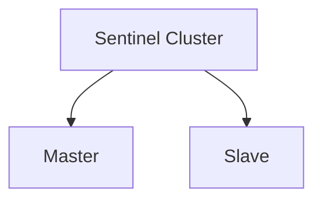
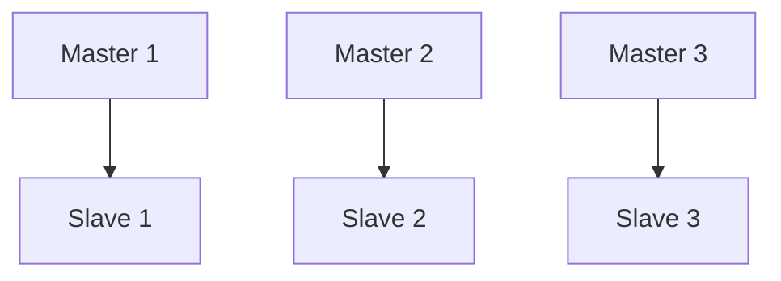

# Redis: Высокая доступность

## Полезные ссылки

### Официальная документация
- [Redis Documentation](https://redis.io/docs/) — официальная документация
- [Redis High Availability](https://redis.io/docs/management/sentinel/) — Sentinel

### См. также
- [[redis-basics|redis-basics.md]] — основы Redis
- [[redis-replication|redis-replication.md]] — репликация

## Содержание

- [Redis: Высокая доступность](#redis-высокая-доступность)
- [Введение в высокую доступность](#введение-в-высокую-доступность)
  - [Компоненты HA](#компоненты-ha)
- [Архитектура высокой доступности](#архитектура-высокой-доступности)
  - [Master-Slave с Sentinel](#master-slave-с-sentinel)
  - [Redis Cluster](#redis-cluster)
- [Настройка Sentinel для HA](#настройка-sentinel-для-ha)
  - [Минимальная конфигурация](#минимальная-конфигурация)
- [sentinel.conf](#sentinelconf)
- [Мониторинг master](#мониторинг-master)
- [Пароль](#пароль)
- [Время для определения недоступности](#время-для-определения-недоступности)
- [Время для failover](#время-для-failover)
- [Параллельные синхронизации](#параллельные-синхронизации)
  - [Production конфигурация](#production-конфигурация)
- [Production настройки Sentinel](#production-настройки-sentinel)
- [Disaster Recovery](#disaster-recovery)
  - [Backup Strategy](#backup-strategy)
- [disaster_recovery_backup.sh](#disaster_recovery_backupsh)
- [RDB backup](#rdb-backup)
- [AOF backup](#aof-backup)
- [Загрузка в облако](#загрузка-в-облако)
  - [Recovery Procedures](#recovery-procedures)
- [disaster_recovery.sh](#disaster_recoverysh)
- [Остановить Redis](#остановить-redis)
- [Восстановить данные](#восстановить-данные)
- [Запустить Redis](#запустить-redis)
- [Проверить восстановление](#проверить-восстановление)
  - [Конфигурация](#конфигурация)
  - [Мониторинг](#мониторинг)
- [Advanced HA Configurations](#advanced-ha-configurations)
  - [Multi-Region Setup](#multi-region-setup)
- [Архитектура с несколькими регионами](#архитектура-с-несколькими-регионами)
- [Region 1: Master + Sentinel](#region-1-master-sentinel)
- [Region 2: Slave + Sentinel](#region-2-slave-sentinel)
- [Region 3: Slave + Sentinel](#region-3-slave-sentinel)
- [Конфигурация для географического распределения](#конфигурация-для-географического-распределения)
  - [Automatic Failover Testing](#automatic-failover-testing)
- [test_failover.sh](#test_failoversh)
- [Проверить текущий master](#проверить-текущий-master)
- [Остановить master](#остановить-master)
- [Ждать failover](#ждать-failover)
- [Проверить новый master](#проверить-новый-master)
- [Восстановить старый master](#восстановить-старый-master)
  - [Health Check Endpoints](#health-check-endpoints)

## Введение в высокую доступность

Высокая доступность (High `Availability`, HA) в **Redis** обеспечивается через комбинацию репликации, автоматического **failover** и мониторинга. Правильная настройка `HA` критически важна для **production** окружений.

### Компоненты `HA`

1. **Репликация**: **Master-Slave** для резервирования данных
2. **Sentinel**: Автоматический мониторинг и **failover**
3. **Cluster**: Распределенная архитектура без единой точки отказа
4. **Мониторинг**: Отслеживание состояния и автоматические алерты


## Архитектура высокой доступности

### Master-Slave с Sentinel



### Redis Cluster




## Настройка Sentinel для `HA`

### Минимальная конфигурация

```conf
# sentinel.conf
port 26379

# Мониторинг master
sentinel monitor mymaster 127.0.0.1 6379 2

# Пароль
sentinel auth-pass mymaster masterpassword

# Время для определения недоступности
sentinel down-after-milliseconds mymaster 5000

# Время для failover
sentinel failover-timeout mymaster 60000

# Параллельные синхронизации
sentinel parallel-syncs mymaster 1
```

### Production конфигурация

```conf
# Production настройки Sentinel
sentinel monitor mymaster 127.0.0.1 6379 2
sentinel auth-pass mymaster strongpassword
sentinel down-after-milliseconds mymaster 3000
sentinel failover-timeout mymaster 30000
sentinel parallel-syncs mymaster 1
sentinel deny-scripts-reconfig yes
sentinel notification-script mymaster /path/to/notify.sh
sentinel client-reconfig-script mymaster /path/to/reconfig.sh
```


## Disaster Recovery

### Backup Strategy

```bash
#!/bin/bash
# disaster_recovery_backup.sh

BACKUP_DIR="/backup/redis"
DATE=$(date +%Y%m%d_%H%M%S)

# RDB backup
redis-cli BGSAVE
while [ "$(redis-cli LASTSAVE)" = "$(redis-cli LASTSAVE)" ]; do
    sleep 1
done
cp /var/lib/redis/dump.rdb "$BACKUP_DIR/rdb_$DATE.rdb"

# AOF backup
cp /var/lib/redis/appendonly.aof "$BACKUP_DIR/aof_$DATE.aof"

# Загрузка в облако
aws s3 cp "$BACKUP_DIR/rdb_$DATE.rdb" s3://backups/redis/
aws s3 cp "$BACKUP_DIR/aof_$DATE.aof" s3://backups/redis/
```

### Recovery Procedures

```bash
#!/bin/bash
# disaster_recovery.sh

BACKUP_FILE="$1"
REDIS_DATA_DIR="/var/lib/redis"

# Остановить Redis
systemctl stop redis

# Восстановить данные
cp "$BACKUP_FILE" "$REDIS_DATA_DIR/dump.rdb"

# Запустить Redis
systemctl start redis

# Проверить восстановление
redis-cli PING
```

### Конфигурация

1. **Используйте минимум 3 Sentinel** для **quorum**
2. **Настройте правильный quorum** для **failover**
3. **Используйте пароли** для всех соединений
4. **Мониторьте состояние** регулярно
5. **Тестируйте failover** еженедельно

### Мониторинг

1. **Отслеживайте статус master** и **slaves**
2. **Мониторьте lag** репликации
3. **Проверяйте здоровье Sentinel**
4. **Настройте алерты** на критические события
5. **Ведите логи** всех операций

## Advanced `HA` Configurations

### Multi-Region Setup

```yaml
# Архитектура с несколькими регионами
# Region 1: Master + Sentinel
# Region 2: Slave + Sentinel
# Region 3: Slave + Sentinel

# Конфигурация для географического распределения
sentinel monitor mymaster master-region1.example.com 6379 2
sentinel down-after-milliseconds mymaster 10000  # Больше для сетевых задержек
```

### Automatic Failover Testing

```bash
#!/bin/bash
# test_failover.sh

MASTER_HOST="master.example.com"
SLAVE_HOST="slave.example.com"
SENTINEL_PORT=26379

echo "Testing automatic failover..."

# Проверить текущий master
CURRENT_MASTER=$(redis-cli -p $SENTINEL_PORT SENTINEL get-master-addr-by-name mymaster | head -1)
echo "Current master: $CURRENT_MASTER"

# Остановить master
echo "Stopping master..."
ssh $MASTER_HOST "sudo systemctl stop redis"

# Ждать failover
echo "Waiting for failover..."
sleep 30

# Проверить новый master
NEW_MASTER=$(redis-cli -p $SENTINEL_PORT SENTINEL get-master-addr-by-name mymaster | head -1)
echo "New master: $NEW_MASTER"

if [ "$NEW_MASTER" != "$CURRENT_MASTER" ]; then
    echo "SUCCESS: Failover completed"
else
    echo "FAILED: Failover did not occur"
fi

# Восстановить старый master
echo "Restoring old master..."
ssh $MASTER_HOST "sudo systemctl start redis"
```

### Health Check Endpoints

```java
// Redis Python example replaced with Java Spring
// TODO: добавить пример health check endpoint
```

