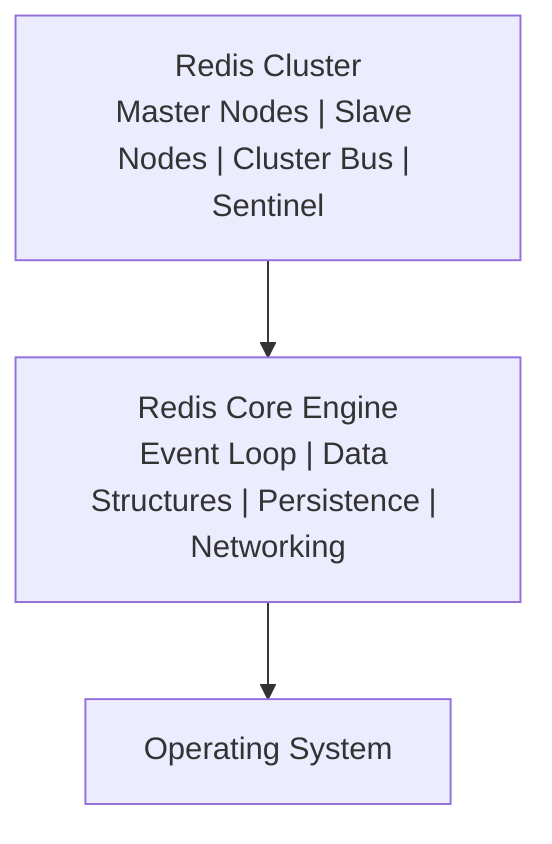

## Полезные ссылки

### Официальная документация
- [Redis Documentation](https://redis.io/docs/) — официальная документация
- [Redis Commands](https://redis.io/commands/) — справочник команд

### См. также
- [[redis-data-structures|redis-data-structures.md]] — структуры данных
- [[redis-persistence|redis-persistence.md]] — персистентность

## Содержание

- [Введение в Redis](#введение-в-redis)
  - [Основные возможности Redis](#основные-возможности-redis)
  - [Архитектура Redis](#архитектура-redis)
- [Установка и первоначальная настройка](#установка-и-первоначальная-настройка)
  - [Установка Redis](#установка-redis)
    - [Linux (Ubuntu/Debian)](#linux-ubuntudebian)
- [Обновление пакетов](#обновление-пакетов)
- [Проверка статуса](#проверка-статуса)
- [Управление службой](#управление-службой)
    - [macOS (с Homebrew)](#macos-с-homebrew)
- [Запуск Redis](#запуск-redis)
- [Или запуск вручную](#или-запуск-вручную)
    - [Docker](#docker)
- [Запуск Redis в Docker](#запуск-redis-в-docker)
- [С кастомной конфигурацией](#с-кастомной-конфигурацией)
- [С паролем](#с-паролем)
  - [Конфигурационный файл](#конфигурационный-файл)
- [/etc/redis/redis.conf](#etcredisredisconf)
- [Сеть](#сеть)
- [Общие настройки](#общие-настройки)
- [Snapshots (RDB)](#snapshots-rdb)
- [Append Only File (AOF)](#append-only-file-aof)
- [Безопасность](#безопасность)
- [requirepass yourpassword](#requirepass-yourpassword)
- [Память](#память)
- [Репликация (для slave)](#репликация-для-slave)
- [slaveof <masterip> <masterport>](#slaveof-masterip-masterport)
- [masterauth <master-password>](#masterauth-master-password)
- [Кластеризация](#кластеризация)
- [cluster-enabled yes](#cluster-enabled-yes)
- [cluster-config-file nodes.conf](#cluster-config-file-nodesconf)
- [cluster-node-timeout 5000](#cluster-node-timeout-5000)
- [Lua скриптинг](#lua-скриптинг)
  - [Подключение к Redis](#подключение-к-redis)
    - [Redis CLI](#redis-cli)
- [Подключение к локальному Redis](#подключение-к-локальному-redis)
- [Подключение к удаленному Redis](#подключение-к-удаленному-redis)
- [Подключение с паролем](#подключение-с-паролем)
- [Выполнение команды напрямую](#выполнение-команды-напрямую)
- [Интерактивная сессия](#интерактивная-сессия)
    - [Программные подключения](#программные-подключения)
      - [Java с Jedis](#java-с-jedis)
      - [Python с redis-py](#python-с-redis-py)

## Введение в Redis

**Redis** (REmote DIctionary Server) — это быстрая **in-memory** структура данных, которая может использоваться как база данных, кэш и **message broker**. **Redis** поддерживает различные типы данных и предлагает высокую производительность благодаря хранению данных в оперативной памяти.

### Основные возможности Redis

- **In-memory хранилище**: Все данные хранятся в **RAM** для максимальной скорости
- **Разнообразие типов данных**: **Strings**, **Lists**, **Sets**, **Hashes**, **Sorted Sets**, **Streams**
- **Персистентность**: **RDB snapshots** и **AOF** (Append `Only` File)
- **Репликация**: **Master-slave** репликация с автоматическим **failover**
- **Кластеризация**: Автоматическое шардинг и распределение данных
- **Pub/Sub**: **Publish-Subscribe messaging**
- **Lua скриптинг**: Выполнение **Lua** скриптов на сервере
- **Transactions**: **ACID** транзакции
- **TTL**: Автоматическое истечение ключей

### Архитектура Redis



## Установка и первоначальная настройка

### Установка Redis

#### Linux (Ubuntu/Debian)

```bash
# Обновление пакетов
sudo apt update

# Установка Redis
sudo apt install redis-server

# Проверка статуса
sudo systemctl status redis

# Управление службой
sudo systemctl start redis
sudo systemctl enable redis
sudo systemctl stop redis
sudo systemctl restart redis
```

#### macOS (с Homebrew)

```bash
# Установка Redis
brew install redis

# Запуск Redis
brew services start redis

# Или запуск вручную
redis-server /usr/local/etc/redis.conf
```

#### Docker

```bash
# Запуск Redis в Docker
docker run -d \
  --name redis \
  -p 6379:6379 \
  -v redis_data:/data \
  redis:7-alpine

# С кастомной конфигурацией
docker run -d \
  --name redis \
  -p 6379:6379 \
  -v $(pwd)/redis.conf:/etc/redis/redis.conf \
  -v redis_data:/data \
  redis:7-alpine redis-server /etc/redis/redis.conf

# С паролем
docker run -d \
  --name redis \
  -p 6379:6379 \
  -e REDIS_PASSWORD=mypassword \
  redis:7-alpine
```

### Конфигурационный файл

```ini
# /etc/redis/redis.conf
# Сеть
bind 127.0.0.1 ::1
port 6379
timeout 0
tcp-keepalive 300

# Общие настройки
daemonize yes
supervised systemd
loglevel notice
logfile /var/log/redis/redis.log
databases 16

# Snapshots (RDB)
save 900 1      # Создать snapshot если за 900 сек. >=1 изменения
save 300 10     # Создать snapshot если за 300 сек. >=10 изменений
save 60 10000   # Создать snapshot если за 60 сек. >=10000 изменений
stop-writes-on-bgsave-error yes
rdbcompression yes
rdbchecksum yes
dbfilename dump.rdb
dir /var/lib/redis

# Append Only File (AOF)
appendonly yes
appendfilename "appendonly.aof"
appendfsync everysec
no-appendfsync-on-rewrite no
auto-aof-rewrite-percentage 100
auto-aof-rewrite-min-size 64mb

# Безопасность
# requirepass yourpassword
maxclients 10000

# Память
maxmemory 256mb
maxmemory-policy allkeys-lru

# Репликация (для slave)
# slaveof <masterip> <masterport>
# masterauth <master-password>

# Кластеризация
# cluster-enabled yes
# cluster-config-file nodes.conf
# cluster-node-timeout 5000

# Lua скриптинг
lua-time-limit 5000
```

### Подключение к Redis

#### Redis CLI

```bash
# Подключение к локальному Redis
redis-cli

# Подключение к удаленному Redis
redis-cli -h redis.example.com -p 6379

# Подключение с паролем
redis-cli -a mypassword

# Выполнение команды напрямую
redis-cli ping
redis-cli set mykey "Hello Redis"
redis-cli get mykey

# Интерактивная сессия
redis-cli
127.0.0.1:6379> ping
PONG
127.0.0.1:6379> set name "Redis"
OK
127.0.0.1:6379> get name
"Redis"
```

#### Программные подключения

##### Java с Jedis

```java
import redis.clients.jedis.Jedis;
import redis.clients.jedis.JedisPool;
import redis.clients.jedis.JedisPoolConfig;

public class RedisJavaExample {
    private JedisPool jedisPool;

    public RedisJavaExample() {
        JedisPoolConfig poolConfig = new JedisPoolConfig();
        poolConfig.setMaxTotal(10);
        poolConfig.setMaxIdle(5);
        poolConfig.setMinIdle(1);
        poolConfig.setTestOnBorrow(true);
        poolConfig.setTestOnReturn(true);

        this.jedisPool = new JedisPool(poolConfig, "localhost", 6379);
    }

    public void basicOperations() {
        try (Jedis jedis = jedisPool.getResource()) {
            // Strings
            jedis.set("name", "Redis");
            String name = jedis.get("name");
            System.out.println("Name: " + name);

            // Counters
            jedis.set("counter", "0");
            long counter = jedis.incr("counter");
            System.out.println("Counter: " + counter);

            // Expiration
            jedis.setex("temp_key", 10, "temporary value");

            // Hashes
            jedis.hset("user:1000", "name", "John");
            jedis.hset("user:1000", "email", "john@example.com");
            Map<String, String> user = jedis.hgetAll("user:1000");
            System.out.println("User: " + user);

            // Lists
            jedis.lpush("mylist", "item1", "item2", "item3");
            List<String> list = jedis.lrange("mylist", 0, -1);
            System.out.println("List: " + list);

            // Sets
            jedis.sadd("myset", "member1", "member2", "member3");
            Set<String> set = jedis.smembers("myset");
            System.out.println("Set: " + set);
        }
    }

    public void close() {
        if (jedisPool != null) {
            jedisPool.close();
        }
    }

    public static void main(String[] args) {
        RedisJavaExample example = new RedisJavaExample();
        example.basicOperations();
        example.close();
    }
}
```

##### Python с redis-py

```java
// Redis Python example replaced with Java Spring
```


