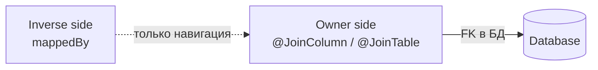
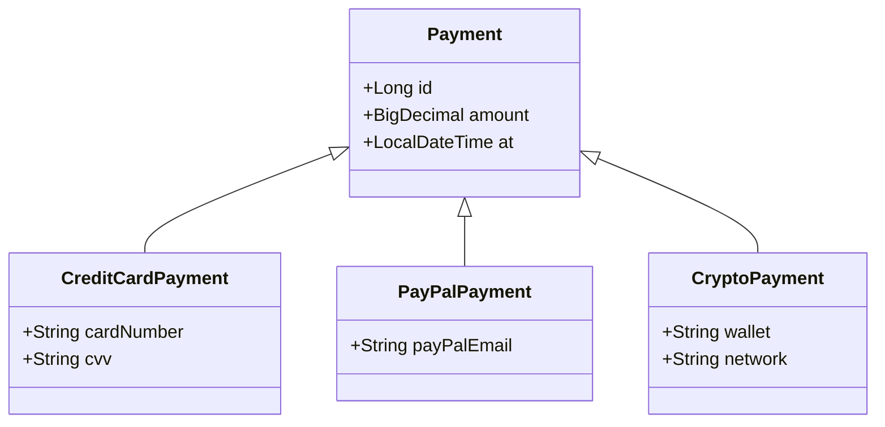

# Hibernate: связи между сущностями

Связи — основной источник ошибок в Hibernate: неправильная сторона владения, утечки памяти через `EAGER`, `StackOverflowError` в `equals`, `N+1`, `MultipleBagFetchException`. Шпаргалка разбирает все типы ассоциаций, их направление, каскадирование и синхронизацию.

Для базового обзора JPA-аннотаций см. [[orm-basics]]. Для практики в Spring-контексте — [[spring-data-jpa]].

## Полезные ссылки

### Официальная документация
- [Hibernate User Guide: Associations](https://docs.jboss.org/hibernate/orm/current/userguide/html_single/Hibernate_User_Guide.html#associations) — раздел про связи
- [Jakarta Persistence 3.2 Specification](https://jakarta.ee/specifications/persistence/3.2/) — спецификация JPA

### Обучающие материалы
- [Baeldung: Hibernate One to Many](https://www.baeldung.com/hibernate-one-to-many) — разбор `@OneToMany`
- [Baeldung: JPA Many to Many](https://www.baeldung.com/jpa-many-to-many) — `@ManyToMany` и join-таблицы
- [Vlad Mihalcea: Best way to map OneToOne](https://vladmihalcea.com/the-best-way-to-map-a-onetoone-relationship-with-jpa-and-hibernate/) — `@MapsId` и shared PK
- [Vlad Mihalcea: MultipleBagFetchException](https://vladmihalcea.com/hibernate-multiplebagfetchexception/) — как лечить

### См. также
- [[orm-basics]] — базовые JPA-аннотации и `EntityManager`
- [[spring-data-jpa]] — репозитории поверх Hibernate
- [[hibernate-caching]] — кэши L1/L2 и взаимодействие со связями
- [[hibernate-jpql-criteria]] — `JOIN FETCH` и запросы по связям
- [[postgres-indexes]] — индексы на FK-колонках
- [[java-jdbc]] — что происходит ниже Hibernate

## Содержание

- [Направление ассоциации](#направление-ассоциации)
- [OneToOne](#onetoone)
  - [Shared Primary Key через MapsId](#shared-primary-key-через-mapsid)
  - [Foreign Key через JoinColumn](#foreign-key-через-joincolumn)
  - [Bidirectional OneToOne](#bidirectional-onetoone)
- [ManyToOne и OneToMany](#manytoone-и-onetomany)
  - [ManyToOne: владеющая сторона](#manytoone-владеющая-сторона)
  - [Bidirectional OneToMany с mappedBy](#bidirectional-onetomany-с-mappedby)
  - [Unidirectional OneToMany — антипаттерн](#unidirectional-onetomany--антипаттерн)
  - [orphanRemoval](#orphanremoval)
- [ManyToMany](#manytomany)
  - [Классический JoinTable](#классический-jointable)
  - [Явная entity-связка](#явная-entity-связка)
- [Каскадирование](#каскадирование)
- [FetchType: LAZY vs EAGER](#fetchtype-lazy-vs-eager)
- [Синхронизация сторон](#синхронизация-сторон)
- [equals и hashCode](#equals-и-hashcode)
- [Наследование сущностей](#наследование-сущностей)
- [Типичные ошибки](#типичные-ошибки)
- [Лучшие практики](#лучшие-практики)

## Направление ассоциации

Ассоциация в JPA всегда описана одной стороной-владельцем (owner) — она хранит `FK` в БД. Вторая сторона, если есть, — inverse (помечена `mappedBy`).

| Тип | Владелец | Inverse |
|-----|----------|---------|
| `@ManyToOne` | всегда эта сторона | противоположный `@OneToMany` с `mappedBy` |
| `@OneToOne` | сторона с `@JoinColumn` или `@MapsId` | сторона с `mappedBy` |
| `@ManyToMany` | любая сторона с `@JoinTable` | сторона с `mappedBy` |
| `@OneToMany` unidirectional | эта сторона (создаёт join-table) | нет |



**Правило:** Hibernate синхронизирует с БД только владеющую сторону. Если выставил поле только на inverse — изменение не сохранится.

## OneToOne

Три способа связать две таблицы один-к-одному: shared primary key, foreign key, join table (редко).

### Shared Primary Key через MapsId

Дочерняя сущность использует `PK` родителя как свой `PK`. Самый эффективный вариант — одна колонка вместо двух, без отдельного индекса.

```java
@Entity
public class User {
    @Id
    @GeneratedValue
    private Long id;

    @OneToOne(mappedBy = "user", cascade = CascadeType.ALL, orphanRemoval = true)
    private UserProfile profile;
}

@Entity
public class UserProfile {
    @Id
    private Long id;

    @OneToOne(fetch = FetchType.LAZY)
    @MapsId
    @JoinColumn(name = "id")
    private User user;

    private String bio;
}
```

`@MapsId` говорит Hibernate: `PK` этой сущности берётся из связанного `User.id`. В БД у `user_profile` один столбец `id`, он же `PK` и `FK`.

### Foreign Key через JoinColumn

Классический вариант: у дочерней сущности свой `PK` плюс `FK`-колонка.

```java
@Entity
public class Employee {
    @Id @GeneratedValue
    private Long id;

    @OneToOne(fetch = FetchType.LAZY)
    @JoinColumn(name = "address_id", unique = true)
    private Address address;
}
```

`unique = true` на `FK` — обязательно для настоящего 1-к-1, иначе модель превращается в `@ManyToOne`.

### Bidirectional OneToOne

LAZY на inverse-стороне не работает из коробки — Hibernate не знает, загружать `null` или объект, пока не сходит в БД. Решения: `@MapsId` (см. выше), bytecode enhancement, или `optional = false`.

```java
@Entity
public class Address {
    @Id @GeneratedValue
    private Long id;

    @OneToOne(mappedBy = "address", fetch = FetchType.LAZY, optional = false)
    private Employee employee;
}
```

**Внимание:** если `optional = true`, LAZY на mappedBy-стороне игнорируется — связь всегда грузится eagerly.

## ManyToOne и OneToMany

Самая частая ассоциация. Владелец — `@ManyToOne` сторона, она держит `FK`.

### ManyToOne: владеющая сторона

```java
@Entity
public class OrderItem {
    @Id @GeneratedValue
    private Long id;

    @ManyToOne(fetch = FetchType.LAZY)
    @JoinColumn(name = "order_id", nullable = false)
    private Order order;

    private int quantity;
}
```

`@ManyToOne` по умолчанию `EAGER` — это ошибка JPA-спеки. Всегда явно ставь `fetch = LAZY`.

### Bidirectional OneToMany с mappedBy

```java
@Entity
public class Order {
    @Id @GeneratedValue
    private Long id;

    @OneToMany(
        mappedBy = "order",
        cascade = CascadeType.ALL,
        orphanRemoval = true,
        fetch = FetchType.LAZY
    )
    private List<OrderItem> items = new ArrayList<>();

    public void addItem(OrderItem item) {
        items.add(item);
        item.setOrder(this);
    }

    public void removeItem(OrderItem item) {
        items.remove(item);
        item.setOrder(null);
    }
}
```

`mappedBy = "order"` указывает на поле `OrderItem.order` — именно оно держит `FK`. Hibernate не создаёт отдельную join-таблицу.

### Unidirectional OneToMany — антипаттерн

Если описать только `@OneToMany` без `@ManyToOne` с другой стороны, Hibernate создаст лишнюю join-таблицу или будет делать `UPDATE` дочерних строк отдельными запросами.

```java
// Плохо: лишняя join-таблица order_items_mapping
@Entity
public class Order {
    @OneToMany(cascade = CascadeType.ALL)
    @JoinColumn(name = "order_id")
    private List<OrderItem> items;
}
```

**Итог:** всегда делай bidirectional через `mappedBy` + `@ManyToOne` на дочерней стороне, либо просто `@ManyToOne` без обратной стороны.

### orphanRemoval

`orphanRemoval = true` удаляет дочернюю запись, когда она отвязана от родителя.

```java
order.getItems().remove(item); // item удалится из БД
```

Разница с `CascadeType.REMOVE`:
- `REMOVE` — удаляет детей при удалении родителя.
- `orphanRemoval` — удаляет ребёнка, когда он удалён из коллекции родителя, даже без удаления родителя.

## ManyToMany

### Классический JoinTable

```java
@Entity
public class Student {
    @Id @GeneratedValue
    private Long id;

    @ManyToMany
    @JoinTable(
        name = "student_course",
        joinColumns = @JoinColumn(name = "student_id"),
        inverseJoinColumns = @JoinColumn(name = "course_id")
    )
    private Set<Course> courses = new HashSet<>();
}

@Entity
public class Course {
    @Id @GeneratedValue
    private Long id;

    @ManyToMany(mappedBy = "courses")
    private Set<Student> students = new HashSet<>();
}
```

`Set` вместо `List` для `@ManyToMany` — критически важно. С `List` Hibernate при добавлении удаляет все строки из join-таблицы и вставляет заново.

### Явная entity-связка

Предпочтительный подход в продакшене: вместо `@ManyToMany` — отдельная сущность, два `@ManyToOne`. Позволяет добавить поля (дата зачисления, оценка), использовать `orphanRemoval` и кэш.

```java
@Entity
@Table(name = "enrollment")
public class Enrollment {
    @EmbeddedId
    private EnrollmentId id;

    @ManyToOne(fetch = FetchType.LAZY)
    @MapsId("studentId")
    private Student student;

    @ManyToOne(fetch = FetchType.LAZY)
    @MapsId("courseId")
    private Course course;

    private LocalDate enrolledAt;
    private Integer grade;
}

@Embeddable
public class EnrollmentId implements Serializable {
    private Long studentId;
    private Long courseId;

    @Override
    public boolean equals(Object o) { /* ... */ }

    @Override
    public int hashCode() { /* ... */ }
}
```

**Когда использовать явную связку:**
- Нужны дополнительные атрибуты на связи.
- Нужен тонкий контроль каскадирования.
- Нужно индексировать связь по отдельной колонке.
- Нужен `@Version` на связи.

## Каскадирование

`cascade` — какие операции пробрасываются с родителя на детей.

| Тип | Операция | Когда использовать |
|-----|----------|-------------------|
| `PERSIST` | `em.persist(parent)` пробрасывает на детей | Сохранение агрегата целиком |
| `MERGE` | `em.merge(parent)` пробрасывает | Обновление detached-графов |
| `REMOVE` | `em.remove(parent)` удаляет и детей | Агрегат с жёстко зависимыми детьми |
| `REFRESH` | `em.refresh(parent)` перечитывает детей | Редко, в read-only сценариях |
| `DETACH` | `em.detach(parent)` отвязывает детей | Редко |
| `ALL` | всё выше | Агрегат-рут с полной ответственностью |

```java
@OneToMany(mappedBy = "order", cascade = {CascadeType.PERSIST, CascadeType.MERGE})
private List<OrderItem> items;
```

`CascadeType.ALL` на `@ManyToOne` — почти всегда ошибка: при удалении `OrderItem` удалится и `Order`, а это не то, чего хочет приложение.

**Правило:** каскадирование ставится только на направлении «от агрегата-корня к частям агрегата», не наоборот.

## FetchType: LAZY vs EAGER

| FetchType | По умолчанию для | Что делает |
|-----------|------------------|------------|
| `LAZY` | `@OneToMany`, `@ManyToMany` | Загружает при первом обращении |
| `EAGER` | `@ManyToOne`, `@OneToOne` | Загружает сразу с родителем |

JPA-спека ставит `EAGER` для `@ManyToOne` и `@OneToOne` — это историческая ошибка, которая генерирует скрытые `SELECT`-ы на каждую загрузку родителя.

```java
// Плохо: неявный EAGER на @ManyToOne
@ManyToOne
private User user;

// Хорошо
@ManyToOne(fetch = FetchType.LAZY)
private User user;
```

Проверка LAZY-полей без загрузки:

```java
Hibernate.isInitialized(entity.getUser()); // true/false без LOAD
Hibernate.initialize(entity.getUser());    // принудительная загрузка
```

## Синхронизация сторон

Hibernate сохраняет состояние только с владеющей стороны. Изменения inverse-стороны в памяти **не пишутся в БД**. Но в пределах одной сессии inverse-сторона должна быть консистентна с owner — иначе `equals` / `size()` / стримы будут давать неправильный результат.

Правило «синхронизирующих методов» на обеих сторонах:

```java
@Entity
public class Order {
    @OneToMany(mappedBy = "order", cascade = CascadeType.ALL, orphanRemoval = true)
    private List<OrderItem> items = new ArrayList<>();

    public void addItem(OrderItem item) {
        items.add(item);           // обновляем inverse
        item.setOrder(this);       // обновляем owner
    }

    public void removeItem(OrderItem item) {
        items.remove(item);
        item.setOrder(null);
    }
}
```

Без таких методов программист где-то выставит `orderItem.setOrder(order)` и забудет `order.getItems().add(orderItem)` — коллекция в памяти окажется пустой до перечитывания из БД.

## equals и hashCode

Самая частая ловушка: `equals` и `hashCode` через Lombok `@Data` включают связи — вызов `hashCode()` на `Order` загружает `List<OrderItem>`, который загружает `Product` в каждом `OrderItem`, и получается `StackOverflowError` или `LazyInitializationException`.

**Правила:**
- Не используй `@Data` / `@EqualsAndHashCode` без `exclude` на сущностях.
- `equals` на сущности должен использовать бизнес-ключ (email, SKU) либо `id`, выставленный до `persist`.
- Если `id` генерируется через `IDENTITY` — он null до `persist`, `hashCode` должен быть константой класса.

```java
@Entity
public class User {
    @Id @GeneratedValue
    private Long id;

    @NaturalId
    private String email;

    @Override
    public boolean equals(Object o) {
        if (this == o) return true;
        if (!(o instanceof User u)) return false;
        return email != null && email.equals(u.email);
    }

    @Override
    public int hashCode() {
        return getClass().hashCode();
    }
}
```

Подробнее про Lombok на сущностях — см. [[java-lombok]].

## Наследование сущностей

Три стратегии, у каждой свой компромисс.



| Стратегия | Таблиц | Плюсы | Минусы |
|-----------|--------|-------|--------|
| `SINGLE_TABLE` | одна на всю иерархию | быстрые запросы, polymorphic JOIN-ы | колонки детей — `nullable`, нельзя `NOT NULL` |
| `JOINED` | одна на базовый + по одной на каждый подкласс | нормализация, `NOT NULL` возможен | `JOIN` при каждом выборе |
| `TABLE_PER_CLASS` | одна на каждый конкретный подкласс | подклассы не пересекаются | `UNION ALL` для выборки по базовому типу, нельзя `IDENTITY` |

```java
@Entity
@Inheritance(strategy = InheritanceType.JOINED)
@DiscriminatorColumn(name = "payment_type")
public abstract class Payment {
    @Id @GeneratedValue
    private Long id;
    private BigDecimal amount;
}

@Entity
@DiscriminatorValue("CARD")
public class CreditCardPayment extends Payment {
    private String cardNumber;
}
```

**Итог:** `SINGLE_TABLE` — по умолчанию для небольших иерархий с общими полями. `JOINED` — когда жертвы `NULL`-ами неприемлемы. `TABLE_PER_CLASS` — редко, только когда подклассы почти не используются вместе.

## Типичные ошибки

### N+1 при обходе коллекции

```java
List<Order> orders = em.createQuery("FROM Order", Order.class).getResultList();
for (Order o : orders) {
    o.getItems().size(); // отдельный SELECT на каждый order
}
```

**Решение:** `JOIN FETCH`, `EntityGraph`, `@BatchSize`. Подробнее — [[hibernate-jpql-criteria]].

```java
em.createQuery("SELECT o FROM Order o LEFT JOIN FETCH o.items", Order.class);
```

### MultipleBagFetchException

Возникает при попытке `JOIN FETCH` на две коллекции `List` в одном запросе:

```java
// Упадёт с MultipleBagFetchException
SELECT o FROM Order o
JOIN FETCH o.items
JOIN FETCH o.discounts
```

**Решения:**
- Заменить `List` на `Set` — тогда Hibernate декартово произведение схлопнет.
- Разбить на два запроса, или использовать `@BatchSize`.
- Один `JOIN FETCH` в запросе, второй через `EntityGraph`.

### StackOverflowError в toString / equals

Bidirectional-связь + Lombok `@ToString` / `@EqualsAndHashCode` без exclude = бесконечная рекурсия. Решение — `@ToString.Exclude` на inverse-стороне.

### LazyInitializationException

Возникает, когда LAZY-связь запрашивается вне транзакции — сессия закрыта, Hibernate не может сходить в БД.

```java
Order order;
try (Session s = sf.openSession()) {
    order = s.get(Order.class, 1L);
}
order.getItems().size(); // LazyInitializationException
```

**Решения:**
- Загрузить заранее через `JOIN FETCH`.
- Использовать DTO-проекцию — отдавать из сервиса уже плоские данные.
- `Open Session in View` — анти-паттерн, не использовать.

### Cartesian product

Два `JOIN FETCH` на коллекции без `DISTINCT` множат строки: 10 orders × 5 items × 3 discounts = 150 строк результата.

```java
SELECT DISTINCT o FROM Order o
LEFT JOIN FETCH o.items i
LEFT JOIN FETCH i.product
```

`DISTINCT` в JPQL работает на уровне Java-объектов, не SQL.

## Лучшие практики

- Владелец ассоциации — всегда сторона с `@JoinColumn` / `@JoinTable`, inverse — с `mappedBy`.
- `@ManyToOne` и `@OneToOne` — всегда явно `fetch = LAZY`.
- `@ManyToMany` заменять на явную entity-связку, как только появляется хоть одно поле на связи.
- Писать методы-синхронизаторы `addX` / `removeX` на bidirectional-связях.
- `equals` / `hashCode` — по бизнес-ключу, `@NaturalId` помогает.
- Не ставить `CascadeType.ALL` без причины — это взрывоопасно на `@ManyToOne`.
- `Set` вместо `List` для `@ManyToMany` и `@OneToMany` с нетривиальной частотой изменений.
- FK-колонки индексировать явно — см. [[postgres-indexes]] для PostgreSQL.
- Внешний ключ всегда `NOT NULL` + `ON DELETE` стратегия на уровне БД, если агрегат не допускает свободных детей.
- Смотри `show_sql` / `p6spy` / `datasource-proxy` на этапе разработки, чтобы видеть все запросы Hibernate.
- Для Spring-слоя — всё то же + репозитории поверх, см. [[spring-data-jpa]].
- Поверх сущностей удобно класть валидацию через [[java-bean-validation]].

## См. также

- [[orm-basics]] — обзор JPA и базовые аннотации
- [[spring-data-jpa]] — репозитории и производные запросы
- [[hibernate-caching]] — кэш L1/L2 и коллекции в кэше
- [[hibernate-jpql-criteria]] — `JOIN FETCH`, criteria, native queries
- [[postgres-indexes]] — индексы на `FK`-колонках
- [[postgres-transactions]] — транзакции и изоляция
- [[java-jdbc]] — слой ниже Hibernate
- [[java-hikaricp]] — пул соединений
- [[java-bean-validation]] — `@NotNull`, `@Size` на сущностях
- [[java-lombok]] — ловушки `@Data` на entity
