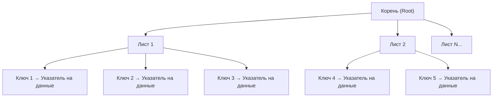
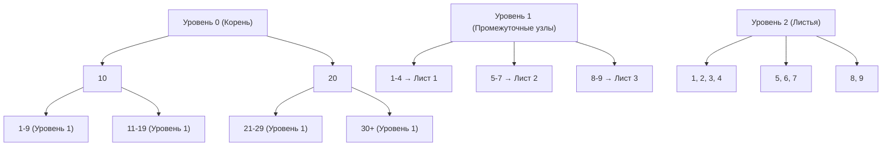

# MySQL: Индексы и оптимизация производительности - Полное руководство по индексации

Комплексное руководство по индексам **MySQL**: типы индексов, стратегии индексации, оптимизация производительности и **best practices**.

## Полезные ссылки

### Официальная документация
- [MySQL Indexes](https://dev.mysql.com/doc/refman/8.0/en/mysql-indexes.html)
- [CREATE INDEX](https://dev.mysql.com/doc/refman/8.0/en/create-index.html)
- [Optimization and Indexes](https://dev.mysql.com/doc/refman/8.0/en/optimization-indexes.html)

### Оптимизация производительности
- [Index Statistics](https://dev.mysql.com/doc/refman/8.0/en/show-index.html) — `SHOW INDEX`
- [Multiple-Column Indexes](https://dev.mysql.com/doc/refman/8.0/en/multiple-column-indexes.html)
- [InnoDB Index Extensions](https://dev.mysql.com/doc/refman/8.0/en/innodb-index-types.html)

### Инструменты и анализ
- [Percona Toolkit](https://docs.percona.com/percona-toolkit/)
- [pt-index-usage](https://docs.percona.com/percona-toolkit/pt-index-usage.html)
- [MySQL Enterprise Monitor](https://dev.mysql.com/doc/mysql-monitor/en/)

### См. также
- [[mysql-basics|mysql-basics.md]] — основы **MySQL**
- [[mysql-queries|mysql-queries.md]] — запросы и оптимизация **SQL**
- [[mysql-performance|mysql-performance.md]] — производительность сервера
- [[postgres-indexes|PostgreSQL]] — сравнение с **PostgreSQL**

## Содержание

- [Введение в индексы](#введение-в-индексы)
  - [Что такое индексы](#что-такое-индексы)
    - [Преимущества индексов:](#преимущества-индексов)
    - [Недостатки индексов:](#недостатки-индексов)
  - [Как работают индексы](#как-работают-индексы)
    - [Аналогия с книгой](#аналогия-с-книгой)
    - [B-Tree структура](#b-tree-структура)
    - [Процесс поиска](#процесс-поиска)
  - [Когда использовать индексы](#когда-использовать-индексы)
    - [Обязательные индексы:](#обязательные-индексы)
    - [Рекомендуемые индексы:](#рекомендуемые-индексы)
    - [Избегать индексов:](#избегать-индексов)
  - [Измерение эффективности индексов](#измерение-эффективности-индексов)
    - [Селективность индекса](#селективность-индекса)
    - [Пример расчета селективности](#пример-расчета-селективности)
- [Типы индексов в MySQL](#типы-индексов-в-mysql)
  - [Первичные индексы (PRIMARY KEY)](#первичные-индексы-primary-key)
    - [Автоматическое создание](#автоматическое-создание)
    - [Кластеризованный индекс в InnoDB](#кластеризованный-индекс-в-innodb)
  - [Уникальные индексы (UNIQUE)](#уникальные-индексы-unique)
    - [Создание уникальных индексов](#создание-уникальных-индексов)
    - [Разница между PRIMARY KEY и UNIQUE](#разница-между-primary-key-и-unique)
  - [Обычные индексы (INDEX)](#обычные-индексы-index)
    - [Создание обычных индексов](#создание-обычных-индексов)
    - [Префиксные индексы](#префиксные-индексы)
  - [FULLTEXT индексы](#fulltext-индексы)
    - [Создание FULLTEXT индексов](#создание-fulltext-индексов)
    - [Настройка FULLTEXT](#настройка-fulltext)
  - [SPATIAL индексы](#spatial-индексы)
    - [Геопространственные данные](#геопространственные-данные)
- [B-Tree индексы](#b-tree-индексы)
  - [Структура B-Tree](#структура-b-tree)
    - [Уровни B-Tree](#уровни-b-tree)
    - [Преимущества B-Tree:](#преимущества-b-tree)
  - [Оптимизация B-Tree индексов](#оптимизация-b-tree-индексов)
    - [Выбор правильного порядка столбцов](#выбор-правильного-порядка-столбцов)
    - [Покрывающие индексы (Covering Indexes)](#покрывающие-индексы-covering-indexes)
    - [Индексные сканирования](#индексные-сканирования)
- [Составные индексы](#составные-индексы)
  - [Создание составных индексов](#создание-составных-индексов)
    - [Базовый синтаксис](#базовый-синтаксис)
    - [Определение порядка столбцов](#определение-порядка-столбцов)
  - [Стратегии использования составных индексов](#стратегии-использования-составных-индексов)
    - [Leftmost Prefix](#leftmost-prefix)
    - [Покрывающие составные индексы](#покрывающие-составные-индексы)
  - [Оптимизация составных индексов](#оптимизация-составных-индексов)
    - [Анализ эффективности](#анализ-эффективности)
    - [Перестройка индексов](#перестройка-индексов)
- [Функциональные индексы](#функциональные-индексы)
  - [Выражения в индексах (MySQL 8.0+)](#выражения-в-индексах-mysql-80)
    - [Создание функциональных индексов](#создание-функциональных-индексов)
    - [Использование функциональных индексов](#использование-функциональных-индексов)
  - [Ограничения функциональных индексов](#ограничения-функциональных-индексов)
    - [Требования к выражениям](#требования-к-выражениям)
    - [Производительность](#производительность)
- [Стратегии индексации](#стратегии-индексации)
  - [Анализ рабочей нагрузки](#анализ-рабочей-нагрузки)
    - [Сбор статистики запросов](#сбор-статистики-запросов)
    - [Определение кандидатов для индексации](#определение-кандидатов-для-индексации)
  - [Создание плана индексации](#создание-плана-индексации)
    - [Приоритезация индексов](#приоритезация-индексов)
    - [Пошаговое создание индексов](#пошаговое-создание-индексов)
  - [Тестирование индексов](#тестирование-индексов)
    - [Сравнение производительности](#сравнение-производительности)
- [Оптимизация индексов](#оптимизация-индексов)
  - [Перестройка и обслуживание](#перестройка-и-обслуживание)
    - [ANALYZE TABLE](#analyze-table)
    - [OPTIMIZE TABLE](#optimize-table)
  - [Удаление неиспользуемых индексов](#удаление-неиспользуемых-индексов)
    - [Поиск неиспользуемых индексов](#поиск-неиспользуемых-индексов)
    - [Когда перестраивать индексы](#когда-перестраивать-индексы)
- [Мониторинг индексов](#мониторинг-индексов)
  - [Performance Schema](#performance-schema)
    - [Настройка мониторинга](#настройка-мониторинга)
    - [Сбор статистики](#сбор-статистики)
  - [Системные таблицы](#системные-таблицы)
    - [Информация о индексах](#информация-о-индексах)
  - [Инструменты мониторинга](#инструменты-мониторинга)
    - [MySQL Enterprise Monitor](#mysql-enterprise-monitor)
    - [Percona Toolkit](#percona-toolkit)
- [Анализ использования индексов](#анализ-использования-индексов)
- [Поиск дублированных индексов](#поиск-дублированных-индексов)
- [Анализ медленных запросов](#анализ-медленных-запросов)
- [Управление индексами](#управление-индексами)
  - [Создание индексов](#создание-индексов)
    - [Online DDL (MySQL 8.0+)](#online-ddl-mysql-80)
    - [Batch создание индексов](#batch-создание-индексов)
  - [Удаление индексов](#удаление-индексов)
    - [Безопасное удаление](#безопасное-удаление)
  - [Переименование индексов](#переименование-индексов)
    - [Переименование через DROP/CREATE](#переименование-через-dropcreate)
- [Решение проблем](#решение-проблем)
  - [Недостаточная индексация](#недостаточная-индексация)
    - [Симптомы](#симптомы)
    - [Решение](#решение)
  - [Избыточная индексация](#избыточная-индексация)
  - [Неправильный порядок столбцов](#неправильный-порядок-столбцов)
  - [Фрагментация индексов](#фрагментация-индексов)
- [Best Practices](#лучшие-практики)
  - [Проектирование индексов](#проектирование-индексов)
    - [1. Анализируйте запросы перед созданием индексов](#1-анализируйте-запросы-перед-созданием-индексов)
    - [2. Создавайте индексы поэтапно](#2-создавайте-индексы-поэтапно)
    - [3. Используйте подходящие типы индексов](#3-используйте-подходящие-типы-индексов)
  - [Обслуживание индексов](#обслуживание-индексов)
    - [1. Регулярный анализ](#1-регулярный-анализ)
    - [2. Перестройка при необходимости](#2-перестройка-при-необходимости)
    - [3. Удаление ненужных индексов](#3-удаление-ненужных-индексов)
  - [Мониторинг и оптимизация](#мониторинг-и-оптимизация)
    - [1. Устанавливайте базовые метрики](#1-устанавливайте-базовые-метрики)
    - [2. Автоматизируйте мониторинг](#2-автоматизируйте-мониторинг)
    - [3. Документируйте решения](#3-документируйте-решения)
  - [Распространенные ошибки](#распространенные-ошибки)
  - [Ключевые принципы эффективной индексации:](#ключевые-принципы-эффективной-индексации)
  - [Типы индексов MySQL:](#типы-индексов-mysql)
  - [Стратегии оптимизации:](#стратегии-оптимизации)
  - [Инструменты для работы с индексами:](#инструменты-для-работы-с-индексами)

## Введение в индексы

### Что такое индексы

**Индексы** в **MySQL** — это структуры данных, которые позволяют быстро находить и извлекать записи из таблиц базы данных. Они работают аналогично оглавлению книги: вместо чтения всей книги (таблицы) можно быстро найти нужную страницу (запись).

#### Преимущества индексов:
- **Быстрый поиск** — значительно ускоряют **SELECT** запросы
- **Эффективная сортировка** — ускоряют **ORDER** `BY`
- **Оптимизация JOIN** — улучшают производительность соединений
- **Уникальность** — обеспечивают ограничения **UNIQUE** и **PRIMARY KEY**

#### Недостатки индексов:
- **Замедление записи** — **INSERT**, **UPDATE**, **DELETE** становятся медленнее
- **Дополнительное место** — индексы занимают дисковое пространство
- **Обслуживание** — требуют регулярного обслуживания и оптимизации
- **Избыточность** — неправильные индексы могут замедлить систему

### Как работают индексы

#### Аналогия с книгой

Аналогия: книга как таблица, оглавление как индекс.

```text
Книга = Таблица базы данных
Страницы = Строки таблицы
Оглавление = Индекс

Без оглавления: перелистывать всю книгу
С оглавлением: быстро найти страницу
```

#### B-Tree структура



#### Процесс поиска
1. **Корневой уровень** — определение диапазона
2. **Промежуточные уровни** — сужение поиска
3. **Листовой уровень** — нахождение точного значения
4. **Доступ к данным** — чтение строки по указателю

### Когда использовать индексы

#### Обязательные индексы:
- **PRIMARY KEY** — всегда индексируется автоматически
- **UNIQUE constraints** — обеспечивают уникальность
- **FOREIGN KEY** — рекомендуется для оптимизации **JOIN**

#### Рекомендуемые индексы:
- **Часто используемые `WHERE` условия**
- **Столбцы в `ORDER BY` и `GROUP` BY**
- **Столбцы в `JOIN` условиях**
- **Составные индексы для множественных условий**

#### Избегать индексов:
- **Редко используемые столбцы**
- **Столбцы с низкой селективностью** (мало уникальных значений)
- **Часто обновляемые столбцы** (высокая стоимость обслуживания)
- **Очень длинные текстовые поля**

### Измерение эффективности индексов

#### Селективность индекса
```text
Селективность = (Количество уникальных значений) / (Общее количество строк)

Высокая селективность (> 0.8): Отличный кандидат для индекса
Средняя селективность (0.3-0.8): Может быть полезен
Низкая селективность (< 0.3): Обычно не эффективен
```

#### Пример расчета селективности
```sql
-- Проверка селективности столбца
SELECT
    COUNT(DISTINCT status) / COUNT(*) AS selectivity,
    COUNT(DISTINCT status) AS unique_values,
    COUNT(*) AS total_rows
FROM orders;

-- Результат: selectivity = 0.05 (5 уникальных из 100) - низкая селективность
-- Не рекомендуется индексировать
```

## Типы индексов в MySQL

### Первичные индексы (PRIMARY KEY)

#### Автоматическое создание
```sql
-- PRIMARY KEY автоматически создает уникальный индекс
CREATE TABLE users (
    id INT AUTO_INCREMENT PRIMARY KEY,
    username VARCHAR(50) UNIQUE NOT NULL,
    email VARCHAR(100) UNIQUE NOT NULL
);

-- Эквивалентно:
-- CREATE UNIQUE INDEX PRIMARY ON users(id);
-- CREATE UNIQUE INDEX username ON users(username);
-- CREATE UNIQUE INDEX email ON users(email);
```

#### Кластеризованный индекс в InnoDB
```sql
-- В InnoDB PRIMARY KEY определяет физический порядок хранения
-- Данные хранятся в порядке PRIMARY KEY
CREATE TABLE products (
    id INT AUTO_INCREMENT PRIMARY KEY,
    sku VARCHAR(50) UNIQUE,
    name VARCHAR(255),
    price DECIMAL(10,2),
    created_at TIMESTAMP DEFAULT CURRENT_TIMESTAMP
) ENGINE=InnoDB;

-- Данные физически упорядочены по id
-- Вторичные индексы содержат ссылки на PRIMARY KEY
```

### Уникальные индексы (UNIQUE)

#### Создание уникальных индексов
```sql
-- Явное создание UNIQUE индекса
CREATE UNIQUE INDEX idx_users_email ON users(email);

-- UNIQUE ограничение (автоматически создает индекс)
ALTER TABLE users ADD CONSTRAINT uk_users_email UNIQUE (email);

-- Составной уникальный индекс
CREATE UNIQUE INDEX idx_orders_user_product
ON order_items(user_id, product_id);

-- Частичный уникальный индекс (MySQL 8.0+)
CREATE UNIQUE INDEX idx_active_users_email
ON users(email) WHERE active = true;
```

#### Разница между PRIMARY KEY и UNIQUE
```sql
-- PRIMARY KEY:
-- - Только один на таблицу
-- - Не может содержать NULL
-- - Автоматически кластеризуется в InnoDB
-- - Используется как ссылка во внешних ключах

-- UNIQUE:
-- - Может быть несколько на таблицу
-- - Может содержать NULL (одно значение)
-- - Не кластеризуется автоматически
-- - Не используется как ссылка по умолчанию
```

### Обычные индексы (INDEX)

#### Создание обычных индексов
```sql
-- Простой индекс
CREATE INDEX idx_users_last_name ON users(last_name);

-- Индекс с пользовательским именем
CREATE INDEX idx_orders_created_date ON orders(created_at);

-- Индекс на выражение (MySQL 8.0+)
CREATE INDEX idx_users_name_lower ON users((LOWER(name)));

-- Невидимый индекс (MySQL 8.0+)
CREATE INDEX idx_temp_search ON products(name) INVISIBLE;
-- Не используется оптимизатором, но сохраняется для быстрого включения
```

#### Префиксные индексы
```sql
-- Индекс на префикс строки (для длинных текстов)
CREATE INDEX idx_posts_title_prefix ON posts(title(50));

-- Автоматическое определение длины префикса
SELECT
    ROUND(SUM(LENGTH(column_name)) / COUNT(*), 0) AS avg_length,
    MAX(LENGTH(column_name)) AS max_length,
    COUNT(*) AS total_rows
FROM table_name;

-- Рекомендация: префикс должен покрывать 80-90% значений
```

### FULLTEXT индексы

#### Создание FULLTEXT индексов
```sql
-- FULLTEXT индекс для текста
CREATE FULLTEXT INDEX idx_articles_content
ON articles(title, content, tags);

-- Поиск по FULLTEXT индексу
SELECT
    id,
    title,
    MATCH(title, content, tags) AGAINST('database optimization' IN NATURAL LANGUAGE MODE) AS relevance
FROM articles
WHERE MATCH(title, content, tags) AGAINST('database optimization' IN NATURAL LANGUAGE MODE)
ORDER BY relevance DESC;

-- Булев поиск
SELECT * FROM articles
WHERE MATCH(title, content) AGAINST('+mysql -postgres optimization' IN BOOLEAN MODE);

-- Поиск с расширенным модификатором
SELECT * FROM articles
WHERE MATCH(content) AGAINST('database' WITH QUERY EXPANSION);
```

#### Настройка FULLTEXT
```sql
-- Просмотр стоп-слов
SELECT * FROM information_schema.innodb_ft_default_stopword;

-- Кастомный список стоп-слов
CREATE TABLE custom_stopwords (
    value VARCHAR(30)
) ENGINE=InnoDB;

INSERT INTO custom_stopwords VALUES
('the'), ('and'), ('or'), ('but'), ('not');

-- Создание индекса с кастомными стоп-словами
CREATE FULLTEXT INDEX idx_content_custom
ON articles(content)
WITH PARSER ngram;
```

### SPATIAL индексы

#### Геопространственные данные
```sql
-- Создание таблицы с геоданными
CREATE TABLE locations (
    id INT AUTO_INCREMENT PRIMARY KEY,
    name VARCHAR(100),
    coordinates POINT NOT NULL,
    SPATIAL INDEX idx_coordinates (coordinates)
) ENGINE=MyISAM;

-- Вставка геоданных
INSERT INTO locations (name, coordinates) VALUES
('New York', POINT(-74.0060, 40.7128)),
('London', POINT(-0.1276, 51.5074)),
('Tokyo', POINT(139.6917, 35.6895));

-- Геопространственные запросы
SELECT
    name,
    ST_X(coordinates) AS longitude,
    ST_Y(coordinates) AS latitude,
    ST_Distance(coordinates, POINT(-74.0060, 40.7128)) AS distance
FROM locations
WHERE ST_Distance(coordinates, POINT(-74.0060, 40.7128)) < 1000000  -- в метрах
ORDER BY distance;
```

## B-Tree индексы

### Структура B-Tree

#### Уровни B-Tree


#### Преимущества B-Tree:
- **Сбалансированная структура** — одинаковая высота всех листьев
- **Эффективный поиск** — `O(log n)` сложность
- **Хорошая локальность** — близкие значения хранятся рядом
- **Поддержка диапазонов** — эффективные запросы **BETWEEN**, <, >

### Оптимизация B-Tree индексов

#### Выбор правильного порядка столбцов
```sql
-- Правильный порядок для составного индекса
-- 1. Высокая селективность
-- 2. Часто используемый в WHERE
-- 3. Равенство перед диапазоном

CREATE INDEX idx_orders_user_date_amount
ON orders(user_id, order_date, total_amount);

-- Эффективные запросы:
SELECT * FROM orders WHERE user_id = 123 AND order_date >= '2024-01-01';
SELECT * FROM orders WHERE user_id = 123;

-- Менее эффективные:
SELECT * FROM orders WHERE order_date >= '2024-01-01'; -- не использует индекс полностью
SELECT * FROM orders WHERE total_amount > 100; -- не использует индекс
```

#### Покрывающие индексы (Covering Indexes)
```sql
-- Покрывающий индекс включает все необходимые столбцы
CREATE INDEX idx_users_name_email_active
ON users(last_name, first_name, email, active);

-- Запрос полностью покрывается индексом
SELECT last_name, first_name, email
FROM users
WHERE active = true
ORDER BY last_name, first_name;

-- Не нужно обращаться к таблице!
-- Результаты читаются только из индекса
```

#### Индексные сканирования
```sql
-- Index Range Scan
EXPLAIN SELECT * FROM users WHERE age BETWEEN 25 AND 35;
-- type: range

-- Index Unique Scan
EXPLAIN SELECT * FROM users WHERE id = 123;
-- type: const

-- Index Full Scan
EXPLAIN SELECT COUNT(*) FROM users WHERE active = true;
-- type: index (если есть подходящий индекс)

-- Index Only Scan (покрывающий индекс)
EXPLAIN SELECT id, name FROM users WHERE active = true;
-- type: index, Extra: Using index
```

## Составные индексы

### Создание составных индексов

#### Базовый синтаксис
```sql
-- Составной индекс на несколько столбцов
CREATE INDEX idx_orders_customer_date
ON orders(customer_id, order_date);

-- Индекс с включенными столбцами (MySQL 8.0+)
CREATE INDEX idx_users_name_covering
ON users(last_name, first_name)
INCLUDE (email, phone, active);
```

#### Определение порядка столбцов
```sql
-- Анализ паттернов запросов
SELECT
    'customer_id = ? AND order_date >= ?' AS pattern,
    COUNT(*) AS usage_count
FROM query_log
WHERE query LIKE '%customer_id = %'
  AND query LIKE '%order_date >= %';

-- На основе анализа: customer_id имеет более высокую селективность
CREATE INDEX idx_orders_customer_date
ON orders(customer_id, order_date, total_amount);
```

### Стратегии использования составных индексов

#### Leftmost Prefix
```sql
-- Индекс: (a, b, c)
CREATE INDEX idx_abc ON table_name(a, b, c);

-- Эффективные запросы:
SELECT * FROM table_name WHERE a = 1;
SELECT * FROM table_name WHERE a = 1 AND b = 2;
SELECT * FROM table_name WHERE a = 1 AND b = 2 AND c = 3;

-- ORDER BY использует индекс:
SELECT * FROM table_name WHERE a = 1 ORDER BY b, c;

-- Менее эффективные:
SELECT * FROM table_name WHERE b = 2; -- не использует индекс
SELECT * FROM table_name WHERE a = 1 AND c = 3; -- пропускает b
```

#### Покрывающие составные индексы
```sql
-- Индекс покрывает весь запрос
CREATE INDEX idx_user_orders_covering
ON orders(user_id, order_date, total_amount, status);

-- Запрос полностью обслуживается индексом
SELECT user_id, order_date, total_amount, status
FROM orders
WHERE user_id = ? AND order_date >= ?
ORDER BY order_date;

-- Преимущества:
-- 1. Нет доступа к таблице
-- 2. Минимальное количество чтений
-- 3. Отличная производительность
```

### Оптимизация составных индексов

#### Анализ эффективности
```sql
-- Проверка использования индекса
EXPLAIN FORMAT=JSON
SELECT * FROM orders
WHERE customer_id = 123 AND order_date >= '2024-01-01'
ORDER BY order_date;

-- Результат должен показывать:
-- "key": "idx_orders_customer_date"
-- "key_length": использование полного индекса
-- "rows": небольшое количество проверяемых строк
```

#### Перестройка индексов
```sql
-- Когда индекс становится неэффективным
ANALYZE TABLE orders;

-- Перестройка индекса
ALTER TABLE orders DROP INDEX idx_orders_customer_date;
ALTER TABLE orders ADD INDEX idx_orders_customer_date (customer_id, order_date);

-- Или более эффективно:
OPTIMIZE TABLE orders;
```

## Функциональные индексы

### Выражения в индексах (MySQL 8.0+)

#### Создание функциональных индексов
```sql
-- Индекс на выражение
CREATE INDEX idx_users_email_lower
ON users((LOWER(email)));

-- Индекс на вычисляемое поле
CREATE INDEX idx_orders_year_month
ON orders((YEAR(order_date)), (MONTH(order_date)));

-- Индекс на JSON поле
CREATE INDEX idx_profiles_age
ON user_profiles((JSON_EXTRACT(profile_data, '$.age')));

-- Индекс на конкатенацию
CREATE INDEX idx_users_full_name
ON users((CONCAT(first_name, ' ', last_name)));
```

#### Использование функциональных индексов
```sql
-- Запрос использует функциональный индекс
SELECT * FROM users
WHERE LOWER(email) = 'john@example.com';

-- Запрос по году и месяцу
SELECT * FROM orders
WHERE YEAR(order_date) = 2024 AND MONTH(order_date) = 1;

-- Поиск по JSON
SELECT * FROM user_profiles
WHERE JSON_EXTRACT(profile_data, '$.age') BETWEEN 25 AND 35;

-- Поиск по полному имени
SELECT * FROM users
WHERE CONCAT(first_name, ' ', last_name) LIKE 'John%';
```

### Ограничения функциональных индексов

#### Требования к выражениям
```sql
-- Допустимые выражения:
CREATE INDEX idx_valid ON table_name((column_name + 1));
CREATE INDEX idx_valid ON table_name((UPPER(column_name)));
CREATE INDEX idx_valid ON table_name((YEAR(date_column)));

-- Недопустимые выражения:
CREATE INDEX idx_invalid ON table_name((NOW())); -- непостоянное
CREATE INDEX idx_invalid ON table_name((RAND())); -- непостоянное
CREATE INDEX idx_invalid ON table_name((other_table.column)); -- другая таблица
```

#### Производительность
```sql
-- Функциональный индекс vs вычисляемый столбец
-- Индекс на выражение:
CREATE INDEX idx_orders_year ON orders((YEAR(created_at)));

-- Вычисляемый столбец + индекс:
ALTER TABLE orders ADD COLUMN order_year YEAR GENERATED ALWAYS AS (YEAR(created_at)) VIRTUAL;
CREATE INDEX idx_orders_year ON orders(order_year);

-- Сравнение производительности:
-- Функциональный индекс: быстрее создание, больше места
-- Вычисляемый столбец: медленнее создание, меньше места, более гибкий
```

## Стратегии индексации

### Анализ рабочей нагрузки

#### Сбор статистики запросов
```sql
-- Включение Performance Schema
UPDATE performance_schema.setup_instruments
SET ENABLED = 'YES'
WHERE NAME LIKE 'statement/%';

-- Анализ популярных запросов
SELECT
    digest_text AS query_pattern,
    count_star AS executions,
    avg_timer_wait / 1000000000 AS avg_time_sec,
    (sum_rows_examined / count_star) AS avg_rows_examined
FROM performance_schema.events_statements_summary_by_digest
WHERE schema_name = DATABASE()
AND avg_timer_wait > 1000000000  -- > 1 секунда
ORDER BY avg_timer_wait DESC
LIMIT 20;
```

#### Определение кандидатов для индексации
```sql
-- Поиск таблиц без индексов на внешних ключах
SELECT
    t.table_name,
    kcu.column_name,
    kcu.referenced_table_name,
    kcu.referenced_column_name
FROM information_schema.table_constraints tc
JOIN information_schema.key_column_usage kcu ON tc.constraint_name = kcu.constraint_name
LEFT JOIN information_schema.statistics s ON s.table_schema = kcu.table_schema
    AND s.table_name = kcu.table_name
    AND s.column_name = kcu.column_name
WHERE tc.constraint_type = 'FOREIGN KEY'
AND s.index_name IS NULL;

-- Поиск часто используемых столбцов в WHERE
SELECT
    table_name,
    column_name,
    'WHERE condition' AS usage_type,
    COUNT(*) AS usage_count
FROM query_log
WHERE query LIKE CONCAT('%', table_name, '.', column_name, '%')
AND query LIKE '%WHERE%'
GROUP BY table_name, column_name
ORDER BY usage_count DESC;
```

### Создание плана индексации

#### Приоритезация индексов
```sql
-- 1. Индексы для первичных ключей (автоматически)
-- 2. Индексы для внешних ключей
-- 3. Индексы для уникальных ограничений
-- 4. Индексы для часто используемых WHERE условий
-- 5. Индексы для ORDER BY и GROUP BY
-- 6. Составные индексы для множественных условий
-- 7. Покрывающие индексы для часто используемых запросов
```

#### Пошаговое создание индексов
```sql
-- Шаг 1: Анализ и создание основных индексов
START TRANSACTION;

-- Индексы для внешних ключей
CREATE INDEX idx_orders_user_id ON orders(user_id);
CREATE INDEX idx_order_items_order_id ON order_items(order_id);
CREATE INDEX idx_order_items_product_id ON order_items(product_id);

-- Индексы для часто используемых условий
CREATE INDEX idx_users_email ON users(email);
CREATE INDEX idx_users_active_created ON users(active, created_at);
CREATE INDEX idx_products_category_price ON products(category_id, price);

COMMIT;

-- Шаг 2: Мониторинг и оптимизация
ANALYZE TABLE users, orders, products, order_items;

-- Шаг 3: Создание составных индексов
CREATE INDEX idx_orders_user_date_status
ON orders(user_id, order_date, status);

CREATE INDEX idx_products_category_active_price
ON products(category_id, active, price DESC);
```

### Тестирование индексов

#### Сравнение производительности
```sql
-- Измерение производительности до создания индекса
SET @start_time = NOW(6);
SELECT COUNT(*) FROM orders WHERE user_id = 123 AND order_date >= '2024-01-01';
SET @end_time = NOW(6);
SELECT TIMESTAMPDIFF(MICROSECOND, @start_time, @end_time) AS execution_time_us;

-- Создание индекса
CREATE INDEX idx_orders_user_date ON orders(user_id, order_date);

-- Измерение производительности после создания индекса
SET @start_time = NOW(6);
SELECT COUNT(*) FROM orders WHERE user_id = 123 AND order_date >= '2024-01-01';
SET @end_time = NOW(6);
SELECT TIMESTAMPDIFF(MICROSECOND, @start_time, @end_time) AS execution_time_us;
```

## Оптимизация индексов

### Перестройка и обслуживание

#### ANALYZE TABLE
```sql
-- Обновление статистики индексов
ANALYZE TABLE users, orders, products;

-- Проверка актуальности статистики
SELECT
    table_name,
    index_name,
    cardinality,
    pages,
    ROUND(cardinality / table_rows * 100, 2) AS selectivity_percent
FROM information_schema.statistics
WHERE table_schema = DATABASE()
ORDER BY table_name, seq_in_index;
```

#### OPTIMIZE TABLE
```sql
-- Перестройка таблицы и индексов
OPTIMIZE TABLE large_table;

-- Для InnoDB это эквивалентно:
ALTER TABLE large_table ENGINE=InnoDB;

-- Проверка фрагментации
SELECT
    table_name,
    data_free / 1024 / 1024 AS fragmentation_mb,
    (data_length + index_length) / 1024 / 1024 AS total_size_mb
FROM information_schema.tables
WHERE table_schema = DATABASE()
AND data_free > 1024 * 1024; -- > 1MB фрагментации
```

### Удаление неиспользуемых индексов

#### Поиск неиспользуемых индексов
```sql
-- Индексы без использования за последний месяц
SELECT
    object_name AS table_name,
    index_name,
    count_read,
    count_write,
    last_update
FROM performance_schema.table_io_waits_summary_by_index_usage
WHERE object_schema = DATABASE()
AND count_read = 0
AND index_name != 'PRIMARY'
AND (last_update IS NULL OR last_update < DATE_SUB(NOW(), INTERVAL 30 DAY));

-- Автоматическое создание скрипта удаления
SELECT CONCAT(
    'ALTER TABLE ', object_name,
    ' DROP INDEX ', index_name, '; -- Last used: ',
    IFNULL(last_update, 'NEVER')
) AS drop_statement
FROM performance_schema.table_io_waits_summary_by_index_usage
WHERE object_schema = DATABASE()
AND count_read = 0
AND index_name != 'PRIMARY';
```

### Перестройка индексов

#### Когда перестраивать индексы
```sql
-- После массовых операций
ALTER TABLE orders DROP INDEX idx_orders_user_date;
-- Массовые вставки/обновления/удаления
ALTER TABLE orders ADD INDEX idx_orders_user_date (user_id, order_date);

-- При изменении распределения данных
ANALYZE TABLE orders;
-- Если селективность сильно изменилась

-- При обновлении MySQL
-- Новые версии могут использовать индексы эффективнее
OPTIMIZE TABLE table_name;
```

## Мониторинг индексов

### Performance Schema

#### Настройка мониторинга
```sql
-- Включение сбора статистики индексов
UPDATE performance_schema.setup_instruments
SET ENABLED = 'YES'
WHERE NAME LIKE '%wait/io%';

-- Создание сводной таблицы мониторинга
CREATE TABLE index_usage_stats (
    table_name VARCHAR(64),
    index_name VARCHAR(64),
    total_reads BIGINT DEFAULT 0,
    total_writes BIGINT DEFAULT 0,
    last_used TIMESTAMP NULL,
    created_at TIMESTAMP DEFAULT CURRENT_TIMESTAMP,
    PRIMARY KEY (table_name, index_name)
);
```

#### Сбор статистики
```sql
-- Процедура сбора статистики использования индексов
DELIMITER //

CREATE PROCEDURE collect_index_usage_stats()
BEGIN
    REPLACE INTO index_usage_stats
    SELECT
        object_name,
        index_name,
        count_read,
        count_write,
        IF(count_read > 0 OR count_write > 0, NOW(), NULL) AS last_used,
        NOW()
    FROM performance_schema.table_io_waits_summary_by_index_usage
    WHERE object_schema = DATABASE();
END //

DELIMITER ;

-- Запуск сбора статистики (например, раз в час)
CREATE EVENT collect_index_stats
ON SCHEDULE EVERY 1 HOUR
DO CALL collect_index_usage_stats();
```

### Системные таблицы

#### Информация о индексах
```sql
-- Детальная информация об индексах
SELECT
    table_name,
    index_name,
    column_name,
    seq_in_index,
    cardinality,
    sub_part,
    packed,
    nullable,
    index_type,
    comment
FROM information_schema.statistics
WHERE table_schema = DATABASE()
ORDER BY table_name, index_name, seq_in_index;

-- Размер индексов
SELECT
    table_name,
    index_name,
    sum(data_length + index_length) / 1024 / 1024 AS size_mb,
    count(*) AS columns_count
FROM information_schema.statistics s
LEFT JOIN information_schema.tables t ON s.table_schema = t.table_schema
    AND s.table_name = t.table_name
WHERE s.table_schema = DATABASE()
AND s.index_name IS NOT NULL
GROUP BY table_name, index_name
ORDER BY size_mb DESC;
```

### Инструменты мониторинга

#### MySQL Enterprise Monitor
```sql
-- Автоматический мониторинг индексов
-- Предупреждения о неиспользуемых индексах
-- Рекомендации по оптимизации
-- Историческая статистика использования
```

#### Percona Toolkit
```bash
# Анализ использования индексов
pt-index-usage /var/log/mysql/mysql.log --host localhost

# Поиск дублированных индексов
pt-duplicate-key-checker --host localhost --user root --password

# Анализ медленных запросов
pt-query-digest /var/log/mysql/mysql-slow.log
```

## Управление индексами

### Создание индексов

#### Online DDL (MySQL 8.0+)
```sql
-- Создание индекса без блокировки таблицы
ALTER TABLE users ADD INDEX idx_users_email (email), ALGORITHM=INPLACE, LOCK=NONE;

-- Проверка возможности online DDL
SELECT ddl.OBJECT_SCHEMA, ddl.OBJECT_NAME, ddl.OBJECT_TYPE,
       ddl.ENGINE, ddl.ISTEMPORARY, ddl.ISTABLES, ddl.ISVIEW
FROM performance_schema.data_lock_waits dlw
JOIN performance_schema.metadata_locks ddl ON dlw.OBJECT_SCHEMA = ddl.OBJECT_SCHEMA
    AND dlw.OBJECT_NAME = ddl.OBJECT_NAME;
```

#### Batch создание индексов
```sql
-- Создание нескольких индексов за одну операцию
ALTER TABLE products
ADD INDEX idx_category (category_id),
ADD INDEX idx_brand (brand_id),
ADD INDEX idx_price (price),
ADD INDEX idx_category_price (category_id, price);

-- Откат в случае ошибки
-- ALTER TABLE products DROP INDEX idx_category, DROP INDEX idx_brand, ...;
```

### Удаление индексов

#### Безопасное удаление
```sql
-- Проверка использования перед удалением
SELECT
    index_name,
    count_read,
    count_write,
    last_update
FROM performance_schema.table_io_waits_summary_by_index_usage
WHERE object_name = 'users'
AND index_name = 'idx_users_temp';

-- Создание плана отката
-- DROP INDEX idx_users_temp ON users; -- если что-то пойдет не так
-- CREATE INDEX idx_users_temp ON users(temp_column);

-- Удаление индекса
DROP INDEX idx_users_temp ON users;
```

### Переименование индексов

#### Переименование через DROP/CREATE
```sql
-- Переименование индекса
ALTER TABLE users DROP INDEX old_index_name;
ALTER TABLE users ADD INDEX new_index_name (column1, column2);

-- Для уникальных индексов
ALTER TABLE users DROP INDEX uk_users_email;
ALTER TABLE users ADD CONSTRAINT uk_users_email_address UNIQUE (email);
```

## Решение проблем

### Недостаточная индексация

#### Симптомы
```sql
-- Медленные запросы
EXPLAIN SELECT * FROM large_table WHERE column = 'value';
-- type: ALL, rows: 1000000

-- Высокая нагрузка на CPU
SHOW PROCESSLIST; -- много запросов в состоянии "Sending data"

-- Большое количество чтений
SHOW STATUS LIKE 'Innodb_buffer_pool_read%';
-- Высокий процент misses
```

#### Решение
```sql
-- Создание необходимых индексов
CREATE INDEX idx_large_table_column ON large_table(column);

-- Проверка улучшения
EXPLAIN SELECT * FROM large_table WHERE column = 'value';
-- type: ref, rows: 10
```

### Избыточная индексация

#### Симптомы
```sql
-- Медленные вставки/обновления
INSERT INTO table_with_many_indexes VALUES (...); -- медленно

-- Большой размер базы данных
SELECT
    SUM(index_length) / SUM(data_length) AS index_to_data_ratio
FROM information_schema.tables
WHERE table_schema = DATABASE();
-- Если > 2-3, возможно избыточная индексация

-- Высокая нагрузка на диск
SHOW ENGINE INNODB STATUS; -- много операций ввода-вывода
```

#### Решение
```sql
-- Поиск и удаление неиспользуемых индексов
SELECT
    'DROP INDEX ' + index_name + ' ON ' + table_name + ';'
FROM performance_schema.table_io_waits_summary_by_index_usage
WHERE count_read = 0 AND count_write > 0
AND index_name != 'PRIMARY';
```

### Неправильный порядок столбцов

#### Симптомы
```sql
-- Индекс не используется для некоторых запросов
EXPLAIN SELECT * FROM table WHERE col2 = 1 AND col1 = 2;
-- key: idx_col1_col2 - хорошо

EXPLAIN SELECT * FROM table WHERE col2 = 1;
-- key: NULL - индекс не используется

-- Решение: поменять порядок
ALTER TABLE table DROP INDEX idx_col1_col2;
ALTER TABLE table ADD INDEX idx_col2_col1 (col2, col1);
```

### Фрагментация индексов

#### Симптомы
```sql
-- Индексы используют больше места чем необходимо
SELECT
    index_name,
    avg_fragmentation_pct
FROM sys.schema_index_statistics
WHERE avg_fragmentation_pct > 10;
```

#### Решение
```sql
-- Перестройка индексов
OPTIMIZE TABLE table_name;

-- Или пересоздание
ALTER TABLE table_name DROP INDEX index_name;
ALTER TABLE table_name ADD INDEX index_name (columns);
```

## Лучшие практики

### Проектирование индексов

#### 1. Анализируйте запросы перед созданием индексов
```sql
-- Соберите статистику использования
SELECT
    sql_text,
    exec_count,
    avg_timer_wait
FROM performance_schema.events_statements_summary_by_digest
WHERE avg_timer_wait > 1000000000
ORDER BY avg_timer_wait DESC;
```

#### 2. Создавайте индексы поэтапно
```sql
-- Начинайте с наиболее критичных запросов
-- Мониторьте влияние на производительность
-- Удаляйте неэффективные индексы
```

#### 3. Используйте подходящие типы индексов
```sql
-- B-Tree для точного поиска и диапазонов
-- FULLTEXT для текстового поиска
-- SPATIAL для геоданных
-- Функциональные для выражений
```

### Обслуживание индексов

#### 1. Регулярный анализ
```sql
-- Еженедельно анализируйте статистику
ANALYZE TABLE important_tables;

-- Мониторьте использование индексов
SELECT * FROM index_usage_stats
WHERE total_reads = 0 AND total_writes > 0;
```

#### 2. Перестройка при необходимости
```sql
-- При значительных изменениях данных
OPTIMIZE TABLE tables_with_high_fragmentation;

-- После массовых операций
ALTER TABLE bulk_updated_table ENGINE=InnoDB;
```

#### 3. Удаление ненужных индексов
```sql
-- Безопасно удаляйте неиспользуемые индексы
-- Тестируйте производительность после удаления
-- Имейте план отката
```

### Мониторинг и оптимизация

#### 1. Устанавливайте базовые метрики
```sql
-- Измеряйте производительность ключевых запросов
-- Отслеживайте размер индексов
-- Мониторьте использование буфера
```

#### 2. Автоматизируйте мониторинг
```sql
-- Создавайте события для регулярного анализа
-- Настраивайте алерты на проблемы
-- Ведите историю изменений индексов
```

#### 3. Документируйте решения
```sql
-- Записывайте почему создан каждый индекс
-- Документируйте влияние на производительность
-- Ведите changelog изменений схемы
```

### Распространенные ошибки

1. **Создание индексов на все подряд**
   - Анализируйте паттерны использования
   - Учитывайте стоимость обслуживания
   - Мониторьте влияние на **INSERT**/**UPDATE**

2. **Игнорирование составных индексов**
   - Правильный порядок столбцов критичен
   - Используйте **leftmost prefix** правило
   - Создавайте покрывающие индексы

3. **Забывание про обслуживание**
   - Регулярно анализируйте статистику
   - Перестраивайте фрагментированные индексы
   - Удаляйте неиспользуемые индексы

4. **Неправильная оценка селективности**
   - Высокая селективность (>0.8) — отличный индекс
   - Низкая селективность (<0.3) — обычно бесполезен
   - Тестируйте на реальных данных

Индексы **MySQL** — это инструмент оптимизации производительности, но требующий внимательного подхода. Правильное использование индексов может ускорить запросы в десятки и сотни раз, в то время как неправильное — замедлить всю систему.

### Ключевые принципы эффективной индексации:

1. **Анализ перед действием** — изучайте паттерны запросов и данные
2. **Правильный выбор типов** — **B-Tree**, **FULLTEXT**, **SPATIAL**, функциональные
3. **Оптимальный порядок столбцов** — селективность и паттерны использования
4. **Покрывающие индексы** — включают все необходимые данные
5. **Регулярное обслуживание** — анализ, перестройка, удаление ненужных
6. **Мониторинг и оптимизация** — постоянный контроль эффективности

### Типы индексов MySQL:

- **PRIMARY KEY** — кластеризованный, уникальный, автоинкремент
- **UNIQUE** — обеспечивает уникальность значений
- **INDEX** — обычный **B-Tree** индекс для быстрого поиска
- **FULLTEXT** — для полнотекстового поиска
- **SPATIAL** — для геопространственных данных
- **Функциональные** — на выражения и функции

### Стратегии оптимизации:

1. **Начинайте с самых критичных запросов**
2. **Создавайте составные индексы для множественных условий**
3. **Используйте покрывающие индексы для частых запросов**
4. **Мониторьте использование и эффективность**
5. **Регулярно обслуживайте и перестраивайте индексы**

### Инструменты для работы с индексами:

- **EXPLAIN** — анализ планов выполнения
- **Performance Schema** — статистика использования
- **Information Schema** — метаданные индексов
- **Percona Toolkit** — продвинутые инструменты анализа
- **MySQL `Enterprise` Monitor** — коммерческий мониторинг

**Следующие темы:**
- [[mysql-performance]] — производительность и тюнинг **MySQL**
- [[mysql-replication]] — репликация и высокая доступность
- [[mysql-admin]] — администрирование и обслуживание **MySQL**

Правильная индексация — это искусство баланса между скоростью чтения и эффективностью записи!


