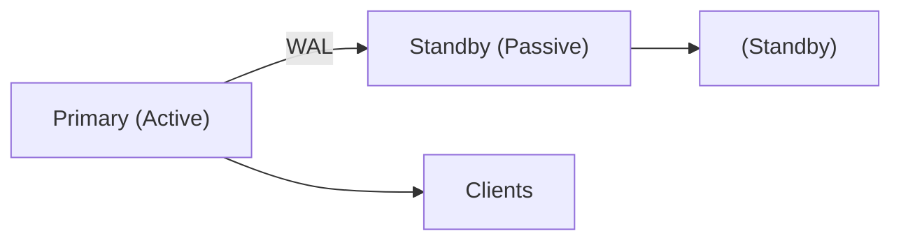
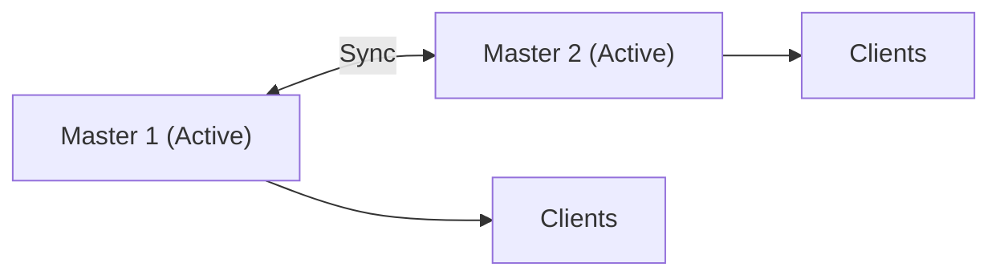
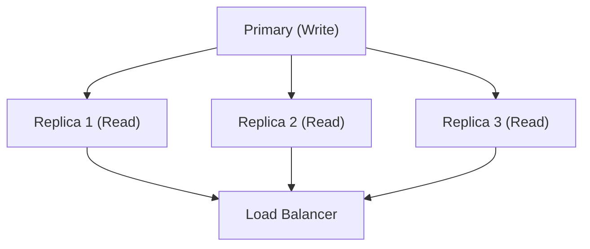

# PostgreSQL: Высокая доступность

## Полезные ссылки

### Официальная документация
- [PostgreSQL Documentation](https://www.postgresql.org/docs/) — официальная документация
- [PostgreSQL High Availability](https://www.postgresql.org/docs/current/high-availability.html) — высокая доступность

### См. также
- [[postgres-basics|postgres-basics.md]] — основы PostgreSQL
- [[postgres-replication|postgres-replication.md]] — репликация

## Содержание

- [Введение в высокую доступность](#введение-в-высокую-доступность)
  - [Компоненты HA решения](#компоненты-ha-решения)
- [Patroni](#patroni)
  - [Установка Patroni](#установка-patroni)
  - [Конфигурация Patroni](#конфигурация-patroni)
    - [patroni.yml](#patroniyml)
  - [Запуск Patroni](#запуск-patroni)
  - [Управление через REST API](#управление-через-rest-api)
- [pg_auto_failover](#pg_auto_failover)
  - [Установка](#установка)
  - [Настройка Monitor](#настройка-monitor)
  - [Настройка Primary](#настройка-primary)
  - [Настройка Standby](#настройка-standby)
  - [Проверка статуса](#проверка-статуса)
- [Streaming Replication для HA](#streaming-replication-для-ha)
  - [Настройка синхронной репликации](#настройка-синхронной-репликации)
  - [Мониторинг репликации](#мониторинг-репликации)
- [Load Balancing](#load-balancing)
  - [PgBouncer для Load Balancing](#pgbouncer-для-load-balancing)
  - [HAProxy для Load Balancing](#haproxy-для-load-balancing)
- [Мониторинг HA](#мониторинг-ha)
  - [Ключевые метрики](#ключевые-метрики)
  - [Алерты](#алерты)
- [Лучшие практики](#лучшие-практики)
  - [Архитектура](#архитектура)
  - [Настройка](#настройка)
  - [Patroni с Consul](#patroni-с-consul)
  - [Patroni с ZooKeeper](#patroni-с-zookeeper)
  - [Patroni с Kubernetes](#patroni-с-kubernetes)
  - [Patroni Watchdog](#patroni-watchdog)
  - [Patroni с Custom Hooks](#patroni-с-custom-hooks)
- [Advanced pg_auto_failover Configuration](#advanced-pg_auto_failover-configuration)
  - [Multi-Node Setup](#multi-node-setup)
  - [pg_auto_failover с SSL](#pg_auto_failover-с-ssl)
  - [Мониторинг pg_auto_failover](#мониторинг-pg_auto_failover)
- [Advanced Load Balancing](#advanced-load-balancing)
  - [PgBouncer Advanced Configuration](#pgbouncer-advanced-configuration)
  - [HAProxy Advanced Configuration](#haproxy-advanced-configuration)
  - [Keepalived для VIP](#keepalived-для-vip)
- [Мониторинг с Prometheus и Grafana](#мониторинг-с-prometheus-и-grafana)
  - [Prometheus Exporter для Patroni](#prometheus-exporter-для-patroni)
  - [Prometheus Exporter для PostgreSQL](#prometheus-exporter-для-postgresql)
  - [Grafana Dashboard для HA](#grafana-dashboard-для-ha)
- [Disaster Recovery Strategies](#disaster-recovery-strategies)
  - [Backup Strategy](#backup-strategy)
  - [Point-in-Time Recovery](#point-in-time-recovery)
- [Тестирование HA](#тестирование-ha)
  - [Тестирование Failover](#тестирование-failover)
  - [Нагрузочное тестирование](#нагрузочное-тестирование)
- [Решение проблем](#решение-проблем)
  - [Проблема: Failover не происходит](#проблема-failover-не-происходит)
  - [Проблема: Большой lag после failover](#проблема-большой-lag-после-failover)
  - [Проблема: Split-brain](#проблема-split-brain)
  - [Проблема: Медленный failover](#проблема-медленный-failover)
- [Production Deployment Checklist](#production-deployment-checklist)
  - [Перед развертыванием](#перед-развертыванием)
  - [После развертывания](#после-развертывания)
- [Архитектурные паттерны HA](#архитектурные-паттерны-ha)
  - [Active-Passive (Hot Standby)](#active-passive-hot-standby)
  - [Active-Active (Multi-Master)](#active-active-multi-master)
  - [Cascading Replication](#cascading-replication)
  - [Read Replicas с Load Balancing](#read-replicas-с-load-balancing)
- [Географическое распределение](#географическое-распределение)
  - [Multi-Region Setup](#multi-region-setup)
  - [Настройка для Multi-Region](#настройка-для-multi-region)
  - [Routing по региону](#routing-по-региону)
  - [Connection Pooling с SQLAlchemy (Python)](#connection-pooling-с-sqlalchemy-python)

## Введение в высокую доступность

Высокая доступность (High `Availability`, HA) — это способность системы оставаться доступной даже при сбоях отдельных компонентов.

### Компоненты `HA` решения

1. **Репликация**: Копирование данных на несколько серверов
2. **Failover**: Автоматическое переключение на резервный сервер
3. **Load Balancing**: Распределение нагрузки между серверами
4. **Мониторинг**: Отслеживание состояния системы


## Patroni

**Patroni** — это решение для автоматического управления репликацией и **failover** в **PostgreSQL**.

### Установка Patroni

**Установка **Patroni** с поддержкой **etcd**, **Consul** или **Zookeeper**:**

```bash
# Установить Patroni
pip install patroni[etcd]
# или
pip install patroni[consul]
# или
pip install patroni[zookeeper]
```

### Конфигурация Patroni

#### patroni.yml

```yaml
scope: postgres
namespace: /db/
name: postgresql1

restapi:
  listen: 127.0.0.1:8008
  connect_address: 127.0.0.1:8008
  authentication:
    username: admin
    password: admin_password

etcd:
  host: 127.0.0.1:2379

bootstrap:
  dcs:
    ttl: 30
    loop_wait: 10
    retry_timeout: 30
    maximum_lag_on_failover: 1048576
    postgresql:
      use_pg_rewind: true
      parameters:
        wal_level: replica
        hot_standby: "on"
        max_connections: 100
        max_wal_senders: 10
        max_replication_slots: 10
        wal_keep_segments: 8
  initdb:
    - encoding: UTF8
    - data-checksums
  pg_hba:
    - host replication replicator 0.0.0.0/0 md5
    - host all all 0.0.0.0/0 md5

postgresql:
  listen: 127.0.0.1:5432
  connect_address: 127.0.0.1:5432
  data_dir: /var/lib/postgresql/data
  pgpass: /var/lib/postgresql/.pgpass
  authentication:
    replication:
      username: replicator
      password: replicator_password
    superuser:
      username: postgres
      password: postgres_password
  parameters:
    unix_socket_directories: '/var/run/postgresql'

tags:
  nofailover: false
  noloadbalance: false
  clonefrom: false
  nosync: false
```

### Запуск Patroni

```bash
# Запустить Patroni
patroni patroni.yml

# Или как systemd service
sudo systemctl start patroni
sudo systemctl enable patroni
```

### Управление через REST API

```bash
# Проверить статус
curl http://localhost:8008/patroni

# Промоутить standby в primary
curl -X POST http://localhost:8008/patroni -d '{"action": "promote"}'

# Перезагрузить
curl -X POST http://localhost:8008/patroni -d '{"action": "restart"}'
```


## pg_auto_failover

**pg_auto_failover** — это расширение **PostgreSQL** для автоматического **failover**.

### Установка

```bash
# Ubuntu/Debian
sudo apt-get install postgresql-14-auto-failover

# RHEL/CentOS
sudo yum install postgresql14-auto-failover
```

### Настройка Monitor

```bash
# Создать monitor
pg_auto_failover create monitor \
  --hostname monitor_host \
  --pgport 5432 \
  --pgdata /var/lib/postgresql/data/monitor \
  --run
```

### Настройка Primary

```bash
pg_auto_failover create postgres \
  --hostname primary_host \
  --pgport 5432 \
  --pgdata /var/lib/postgresql/data \
  --monitor 'postgres://autoctl_node@monitor_host:5432/pg_auto_failover' \
  --run
```

### Настройка Standby

```bash
pg_auto_failover create postgres \
  --hostname standby_host \
  --pgport 5432 \
  --pgdata /var/lib/postgresql/data \
  --monitor 'postgres://autoctl_node@monitor_host:5432/pg_auto_failover' \
  --run
```

### Проверка статуса

```bash
# Статус кластера
pg_auto_failover status \
  --monitor 'postgres://autoctl_node@monitor_host:5432/pg_auto_failover'

# Детальная информация
pg_auto_failover show state \
  --monitor 'postgres://autoctl_node@monitor_host:5432/pg_auto_failover'
```


## Streaming Replication для `HA`

### Настройка синхронной репликации

```conf
# В postgresql.conf на Primary
synchronous_standby_names = 'standby1,standby2'
synchronous_commit = on
```

### Мониторинг репликации

```sql
-- Проверить статус репликации
SELECT
    application_name,
    sync_state,
    sync_priority,
    pg_wal_lsn_diff(pg_current_wal_lsn(), replay_lsn) AS lag_bytes
FROM pg_stat_replication;
```


## Load Balancing

### PgBouncer для Load Balancing

```ini
# /etc/pgbouncer/pgbouncer.ini
[databases]
mydb = host=primary_host port=5432 dbname=mydb
mydb_ro = host=standby1_host,standby2_host port=5432 dbname=mydb

[pgbouncer]
listen_addr = 0.0.0.0
listen_port = 6432
pool_mode = transaction

# Load balancing для read-only запросов
query_wait_timeout = 120
```

### HAProxy для Load Balancing

```conf
# /etc/haproxy/haproxy.cfg
global
    log /dev/log local0
    maxconn 100

defaults
    log global
    mode tcp
    timeout connect 5000ms
    timeout client 50000ms
    timeout server 50000ms

frontend postgresql_frontend
    bind *:5432
    default_backend postgresql_backend

backend postgresql_backend
    balance roundrobin
    option pgsql-check user postgres
    server primary primary_host:5432 check
    server standby1 standby1_host:5432 check backup
    server standby2 standby2_host:5432 check backup
```


## Мониторинг `HA`

### Ключевые метрики

```sql
-- Проверить статус репликации
SELECT
    application_name,
    state,
    sync_state,
    pg_wal_lsn_diff(pg_current_wal_lsn(), replay_lsn) AS lag_bytes
FROM pg_stat_replication;

-- Проверить replication slots
SELECT
    slot_name,
    active,
    pg_wal_lsn_diff(pg_current_wal_lsn(), restart_lsn) AS lag_bytes
FROM pg_replication_slots;
```

### Алерты

```bash
#!/bin/bash
# check_ha.sh

PRIMARY_HOST="primary_host"
STANDBY_HOST="standby_host"
ALERT_EMAIL="admin@example.com"

# Проверить доступность Primary
if ! pg_isready -h $PRIMARY_HOST; then
    echo "ALERT: Primary server is down" | mail -s "HA Alert" $ALERT_EMAIL
    exit 1
fi

# Проверить lag
LAG=$(psql -h $STANDBY_HOST -U postgres -t -c "
    SELECT pg_wal_lsn_diff(
        pg_last_wal_receive_lsn(),
        pg_last_wal_replay_lsn()
    );
")

if [ "$LAG" -gt 104857600 ]; then  # 100MB
    echo "ALERT: Replication lag is ${LAG} bytes" | mail -s "HA Alert" $ALERT_EMAIL
    exit 1
fi

echo "OK: HA is healthy"
exit 0
```


## Лучшие практики

### Архитектура

1. **Минимум 3 сервера**: **Primary** + 2 **Standby**
2. **Географическое распределение**: **Standby** в разных регионах
3. **Мониторинг**: Непрерывный мониторинг состояния
4. **Тестирование**: Регулярное тестирование **failover**

### Настройка

1. **Синхронная репликация**: Для критических данных
2. **Replication slots**: Предотвращение потери данных
3. **Connection pooling**: Для управления подключениями
4. **Load balancing**: Для распределения нагрузки

### Patroni с Consul

```yaml
# patroni-consul.yml
scope: postgres
namespace: /db/
name: postgresql1

restapi:
  listen: 127.0.0.1:8008
  connect_address: 127.0.0.1:8008

consul:
  host: 127.0.0.1:8500
  scheme: http
  token: consul_token
  datacenter: dc1
  register_service: true
  service_tags:
    - postgresql
    - primary
  service_check_interval: 10s

bootstrap:
  dcs:
    ttl: 30
    loop_wait: 10
    retry_timeout: 30
    maximum_lag_on_failover: 1048576
    postgresql:
      use_pg_rewind: true
      parameters:
        wal_level: replica
        hot_standby: "on"
        max_connections: 100
        max_wal_senders: 10
        max_replication_slots: 10
        wal_keep_segments: 8
        synchronous_commit: "on"
        synchronous_standby_names: "standby1,standby2"

postgresql:
  listen: 127.0.0.1:5432
  connect_address: 127.0.0.1:5432
  data_dir: /var/lib/postgresql/data
  pgpass: /var/lib/postgresql/.pgpass
  authentication:
    replication:
      username: replicator
      password: replicator_password
    superuser:
      username: postgres
      password: postgres_password
  parameters:
    unix_socket_directories: '/var/run/postgresql'
    shared_buffers: 256MB
    effective_cache_size: 1GB
    maintenance_work_mem: 64MB
    checkpoint_completion_target: 0.9
    wal_buffers: 16MB
    default_statistics_target: 100
    random_page_cost: 1.1
    effective_io_concurrency: 200
    work_mem: 4MB
    min_wal_size: 1GB
    max_wal_size: 4GB

tags:
  nofailover: false
  noloadbalance: false
  clonefrom: false
  nosync: false
  replicatefrom: null
```

### Patroni с ZooKeeper

```yaml
# patroni-zookeeper.yml
scope: postgres
namespace: /db/
name: postgresql1

restapi:
  listen: 127.0.0.1:8008
  connect_address: 127.0.0.1:8008

zookeeper:
  hosts: 127.0.0.1:2181,127.0.0.1:2182,127.0.0.1:2183
  use_ssl: false
  timeout: 30

bootstrap:
  dcs:
    ttl: 30
    loop_wait: 10
    retry_timeout: 30
    maximum_lag_on_failover: 1048576
    postgresql:
      use_pg_rewind: true
      parameters:
        wal_level: replica
        hot_standby: "on"
        max_connections: 100
        max_wal_senders: 10
        max_replication_slots: 10
        wal_keep_segments: 8

postgresql:
  listen: 127.0.0.1:5432
  connect_address: 127.0.0.1:5432
  data_dir: /var/lib/postgresql/data
  authentication:
    replication:
      username: replicator
      password: replicator_password
    superuser:
      username: postgres
      password: postgres_password
```

### Patroni с Kubernetes

```yaml
# patroni-k8s.yml
scope: postgres
namespace: /db/
name: postgresql-0

kubernetes:
  namespace: default
  labels:
    application: postgresql
  use_endpoints: true
  pod_ip: ${POD_IP}
  ports:
    - name: postgresql
      port: 5432
    - name: patroni
      port: 8008

bootstrap:
  dcs:
    ttl: 30
    loop_wait: 10
    retry_timeout: 30
    maximum_lag_on_failover: 1048576
    postgresql:
      use_pg_rewind: true
      parameters:
        wal_level: replica
        hot_standby: "on"
        max_connections: 100
        max_wal_senders: 10
        max_replication_slots: 10

postgresql:
  listen: 0.0.0.0:5432
  connect_address: ${POD_IP}:5432
  data_dir: /var/lib/postgresql/data
  authentication:
    replication:
      username: replicator
      password: ${REPLICATOR_PASSWORD}
    superuser:
      username: postgres
      password: ${POSTGRES_PASSWORD}
```

### Patroni Watchdog

**Настройка **watchdog** для автоматического перезапуска при проблемах:**

```yaml
# patroni.yml
watchdog:
  mode: automatic
  device: /dev/watchdog
  safety_margin: 5
  loop_wait: 10
  ttl: 30
```

### Patroni с Custom Hooks

```yaml
# patroni.yml
postgresql:
  callbacks:
    on_start: /usr/local/bin/on_start.sh
    on_stop: /usr/local/bin/on_stop.sh
    on_role_change: /usr/local/bin/on_role_change.sh
    on_restart: /usr/local/bin/on_restart.sh
```

**Пример скрипта `on_role_change.sh`:**

```bash
#!/bin/bash
# on_role_change.sh

ROLE=$1
CLUSTER=$2
OLD_ROLE=$3

if [ "$ROLE" = "master" ]; then
    # Действия при переходе в master
    systemctl start vip-manager
    echo "$(date): Promoted to master" >> /var/log/patroni.log
elif [ "$ROLE" = "replica" ]; then
    # Действия при переходе в replica
    systemctl stop vip-manager
    echo "$(date): Demoted to replica" >> /var/log/patroni.log
fi
```

## Advanced pg_auto_failover Configuration

### Multi-Node Setup

```bash
# Monitor
pg_auto_failover create monitor \
  --hostname monitor.example.com \
  --pgport 5432 \
  --pgdata /var/lib/postgresql/data/monitor \
  --run

# Primary
pg_auto_failover create postgres \
  --hostname primary.example.com \
  --pgport 5432 \
  --pgdata /var/lib/postgresql/data \
  --monitor 'postgres://autoctl_node@monitor.example.com:5432/pg_auto_failover' \
  --run

# Standby 1
pg_auto_failover create postgres \
  --hostname standby1.example.com \
  --pgport 5432 \
  --pgdata /var/lib/postgresql/data \
  --monitor 'postgres://autoctl_node@monitor.example.com:5432/pg_auto_failover' \
  --run

# Standby 2
pg_auto_failover create postgres \
  --hostname standby2.example.com \
  --pgport 5432 \
  --pgdata /var/lib/postgresql/data \
  --monitor 'postgres://autoctl_node@monitor.example.com:5432/pg_auto_failover' \
  --run
```

### pg_auto_failover с SSL

```bash
# Создать сертификаты
openssl req -new -x509 -days 365 -nodes \
  -out server.crt -keyout server.key

# Настроить с SSL
pg_auto_failover create postgres \
  --hostname primary.example.com \
  --pgport 5432 \
  --pgdata /var/lib/postgresql/data \
  --ssl-ca-file /etc/ssl/certs/ca.crt \
  --ssl-crl-file /etc/ssl/certs/ca.crl \
  --monitor 'postgres://autoctl_node@monitor.example.com:5432/pg_auto_failover' \
  --run
```

### Мониторинг pg_auto_failover

```sql
-- Статус всех узлов
SELECT
    nodeid,
    groupid,
    nodename,
    nodeport,
    reportedstate,
    goalstate,
    reportedrepstate,
    goalrepstate
FROM pgautofailover.node;

-- История событий
SELECT
    eventtime,
    nodename,
    reportedstate,
    goalstate
FROM pgautofailover.event
ORDER BY eventtime DESC
LIMIT 20;
```

## Advanced Load Balancing

### PgBouncer Advanced Configuration

```ini
# /etc/pgbouncer/pgbouncer.ini
[databases]
mydb = host=primary_host port=5432 dbname=mydb
mydb_ro = host=standby1_host,standby2_host port=5432 dbname=mydb

[pgbouncer]
listen_addr = 0.0.0.0
listen_port = 6432
auth_type = md5
auth_file = /etc/pgbouncer/userlist.txt
pool_mode = transaction
max_client_conn = 1000
default_pool_size = 25
min_pool_size = 5
reserve_pool_size = 5
reserve_pool_timeout = 3
max_db_connections = 100
max_user_connections = 100
server_round_robin = 1
ignore_startup_parameters = extra_float_digits
application_name_add_host = 1

# Health check
server_check_delay = 10
server_check_query = SELECT 1
server_lifetime = 3600
server_idle_timeout = 600

# Logging
log_connections = 1
log_disconnections = 1
log_pooler_errors = 1
stats_period = 60

# Admin console
admin_users = admin
stats_users = stats
```

### HAProxy Advanced Configuration

```conf
# /etc/haproxy/haproxy.cfg
global
    log /dev/log local0
    maxconn 4096
    user haproxy
    group haproxy
    daemon
    stats socket /var/run/haproxy.sock mode 660 level admin
    stats timeout 2m

defaults
    log global
    mode tcp
    option tcplog
    option dontlognull
    retries 3
    timeout connect 5000ms
    timeout client 50000ms
    timeout server 50000ms
    option redispatch
    balance roundrobin

# Stats page
listen stats
    bind *:8404
    stats enable
    stats uri /stats
    stats refresh 30s
    stats admin if TRUE

# PostgreSQL Primary (write)
frontend postgresql_write
    bind *:5432
    default_backend postgresql_primary

backend postgresql_primary
    option pgsql-check user postgres
    server primary primary_host:5432 check port 5432 inter 3s fall 3 rise 2

# PostgreSQL Read Replicas
frontend postgresql_read
    bind *:5433
    default_backend postgresql_replicas

backend postgresql_replicas
    balance roundrobin
    option pgsql-check user postgres
    server standby1 standby1_host:5432 check port 5432 inter 3s fall 3 rise 2
    server standby2 standby2_host:5432 check port 5432 inter 3s fall 3 rise 2 backup
```

### Keepalived для VIP

```conf
# /etc/keepalived/keepalived.conf
global_defs {
    router_id POSTGRES_HA
}

vrrp_script check_postgres {
    script "/usr/local/bin/check_postgres.sh"
    interval 2
    weight -2
    fall 2
    rise 2
}

vrrp_instance VI_1 {
    state MASTER
    interface eth0
    virtual_router_id 51
    priority 101
    advert_int 1
    authentication {
        auth_type PASS
        auth_pass postgres_ha
    }
    virtual_ipaddress {
        192.168.1.100
    }
    track_script {
        check_postgres
    }
}
```

## Мониторинг с Prometheus и Grafana

### Prometheus Exporter для Patroni

```yaml
# prometheus.yml
scrape_configs:
  - job_name: 'patroni'
    static_configs:
      - targets: ['patroni1:8008', 'patroni2:8008', 'patroni3:8008']
    metrics_path: '/metrics'
```

### Prometheus Exporter для PostgreSQL

```yaml
# prometheus.yml
scrape_configs:
  - job_name: 'postgresql'
    static_configs:
      - targets: ['postgres1:9187', 'postgres2:9187', 'postgres3:9187']
```

### Grafana Dashboard для `HA`

```json
{
  "dashboard": {
    "title": "PostgreSQL HA Dashboard",
    "panels": [
      {
        "title": "Replication Lag",
        "targets": [
          {
            "expr": "pg_replication_lag_bytes",
            "legendFormat": "{{instance}}"
          }
        ]
      },
      {
        "title": "Replication Status",
        "targets": [
          {
            "expr": "pg_replication_is_replica",
            "legendFormat": "{{instance}}"
          }
        ]
      },
      {
        "title": "Connection Count",
        "targets": [
          {
            "expr": "pg_stat_database_numbackends",
            "legendFormat": "{{datname}}"
          }
        ]
      }
    ]
  }
}
```

## Disaster Recovery Strategies

### Backup Strategy

```bash
#!/bin/bash
# backup_strategy.sh

# Ежедневный полный бэкап
pg_basebackup -D /backup/daily/$(date +%Y%m%d) \
  -h primary_host -U replicator -P -Ft -z

# Еженедельный бэкап с архивированием
pg_basebackup -D /backup/weekly/$(date +%Y%m%d) \
  -h primary_host -U replicator -P -Ft -z -X stream

# Удаление старых бэкапов
find /backup/daily -type d -mtime +7 -exec rm -rf {} \;
find /backup/weekly -type d -mtime +30 -exec rm -rf {} \;
```

### Point-in-Time Recovery

```bash
# Восстановление на определенный момент времени
pg_basebackup -D /var/lib/postgresql/data \
  -h primary_host -U replicator -P -Ft -z

# Настроить recovery.conf
echo "restore_command = 'cp /backup/wal/%f %p'" >> /var/lib/postgresql/data/recovery.conf
echo "recovery_target_time = '2026-01-16 12:00:00'" >> /var/lib/postgresql/data/recovery.conf

# Запустить восстановление
pg_ctl start -D /var/lib/postgresql/data
```

## Тестирование `HA`

### Тестирование Failover

```bash
#!/bin/bash
# test_failover.sh

PRIMARY_HOST="primary_host"
STANDBY_HOST="standby_host"

# 1. Проверить текущее состояние
echo "Current state:"
psql -h $PRIMARY_HOST -U postgres -c "SELECT pg_is_in_recovery();"

# 2. Остановить Primary
echo "Stopping primary..."
sudo systemctl stop postgresql@14-main

# 3. Подождать failover
sleep 30

# 4. Проверить новый Primary
echo "New primary:"
psql -h $STANDBY_HOST -U postgres -c "SELECT pg_is_in_recovery();"

# 5. Восстановить старый Primary как Standby
echo "Restoring old primary as standby..."
pg_rewind --target-pgdata=/var/lib/postgresql/data \
  --source-server="host=$STANDBY_HOST port=5432 user=postgres"
```

### Нагрузочное тестирование

```bash
#!/bin/bash
# load_test.sh

# Использовать pgbench для нагрузочного тестирования
pgbench -h primary_host -U postgres -i -s 100 mydb
pgbench -h primary_host -U postgres -c 10 -j 2 -T 60 mydb

# Тестирование read-only запросов на репликах
pgbench -h standby_host -U postgres -c 20 -j 4 -T 60 -S mydb
```

## Решение проблем

### Проблема: Failover не происходит

**Решение:**
```bash
# Проверить статус Patroni
curl http://localhost:8008/patroni

# Проверить логи
journalctl -u patroni -f

# Проверить etcd/consul
etcdctl get /db/postgres/leader

# Проверить сетевую связность
ping primary_host
telnet primary_host 5432

# Проверить firewall
sudo iptables -L -n
```

### Проблема: Большой lag после failover

**Решение:**
```sql
-- Проверить lag
SELECT pg_wal_lsn_diff(pg_current_wal_lsn(), replay_lsn) AS lag_bytes;

-- Использовать pg_rewind для синхронизации
pg_rewind --target-pgdata=/var/lib/postgresql/data \
  --source-server="host=primary_host port=5432 user=postgres"

-- Проверить replication slots
SELECT * FROM pg_replication_slots;
```

### Проблема: Split-brain

**Решение:**
```bash
# Определить правильный Primary
psql -h primary1 -U postgres -c "SELECT pg_current_wal_lsn();"
psql -h primary2 -U postgres -c "SELECT pg_current_wal_lsn();"

# Остановить неправильный Primary
sudo systemctl stop postgresql@14-main

# Использовать pg_rewind для синхронизации
pg_rewind --target-pgdata=/var/lib/postgresql/data \
  --source-server="host=correct_primary port=5432 user=postgres"
```

### Проблема: Медленный failover

**Решение:**
```yaml
# Уменьшить TTL в Patroni
bootstrap:
  dcs:
    ttl: 20  # Уменьшить с 30 до 20
    loop_wait: 5  # Уменьшить с 10 до 5
    retry_timeout: 15  # Уменьшить с 30 до 15
```

## Production Deployment Checklist

### Перед развертыванием

- [ ] Настроена репликация (Streaming или Logical)
- [ ] Настроен автоматический **failover** (Patroni или pg_auto_failover)
- [ ] Настроен **Load Balancing** (PgBouncer или HAProxy)
- [ ] Настроен мониторинг (Prometheus, Grafana)
- [ ] Настроены алерты
- [ ] Настроено резервное копирование
- [ ] Протестирован **failover**
- [ ] Документирована процедура восстановления
- [ ] Настроена аутентификация и авторизация
- [ ] Настроено шифрование соединений (SSL/TLS)

### После развертывания

- [ ] Регулярный мониторинг метрик
- [ ] Регулярное тестирование **failover**
- [ ] Регулярное тестирование восстановления из бэкапов
- [ ] Обновление документации
- [ ] Обучение команды

## Архитектурные паттерны `HA`

### Active-Passive (Hot Standby)



**Характеристики:**
- Один активный сервер обрабатывает все запросы
- **Standby** сервер готов к **failover**
- Минимальная задержка при **failover**
- Простая архитектура

**Использование:**
- Критические приложения с низкой нагрузкой
- Системы, где потеря данных недопустима
- Приложения с преимущественно **write** операциями

### Active-Active (Multi-Master)



**Характеристики:**
- Оба сервера активны и обрабатывают запросы
- Синхронная репликация между серверами
- Высокая доступность
- Сложная настройка и управление

**Использование:**
- Географически распределенные приложения
- Высокая нагрузка на чтение и запись
- Требования к низкой задержке в разных регионах

### Cascading Replication


**Характеристики:**
- Многоуровневая репликация
- Снижение нагрузки на **Primary**
- Увеличенная задержка на удаленных репликах
- Гибкая архитектура

**Использование:**
- Большое количество реплик
- Географическое распределение
- Разные уровни доступности данных

### Read Replicas с Load Balancing



**Характеристики:**
- **Primary** обрабатывает все записи
- Несколько реплик для чтения
- **Load balancing** для распределения запросов
- Масштабируемость чтения

**Использование:**
- Приложения с высокой нагрузкой на чтение
- Аналитические запросы
- Отчетность и дашборды

## Географическое распределение

### Multi-Region Setup

```yaml
# Регион 1: US-East
regions:
  - name: us-east
    primary: primary-us-east.example.com
    standbys:
      - standby1-us-east.example.com
      - standby2-us-east.example.com

# Регион 2: EU-West
  - name: eu-west
    primary: primary-eu-west.example.com
    standbys:
      - standby1-eu-west.example.com
      - standby2-eu-west.example.com

# Регион 3: Asia-Pacific
  - name: ap-south
    primary: primary-ap-south.example.com
    standbys:
      - standby1-ap-south.example.com
      - standby2-ap-south.example.com
```

### Настройка для Multi-Region

```sql
-- На Primary в каждом регионе
ALTER SYSTEM SET synchronous_standby_names = 'ANY 1 (standby1, standby2)';
ALTER SYSTEM SET synchronous_commit = 'remote_write';
SELECT pg_reload_conf();
```

### Routing по региону

```java
// PostgreSQL Python example replaced with Java Spring — HikariCP configuration
`HikariConfig` config = new `HikariConfig`();
config.setJdbcUrl("jdbc:postgresql://primary_host:5432/mydb");
config.`setUsername`("`app_user`");
config.`setPassword`("password");
config.`setMaximumPoolSize`(20);
config.`setMinimumIdle`(5);
config.`setConnectionTimeout`(`30000`);
config.`setIdleTimeout`(`600000`);
config.`setMaxLifetime`(`1800000`);
config.`setLeakDetectionThreshold`(`60000`);

`HikariDataSource dataSource` = new `HikariDataSource`(config);
```

### Connection Pooling с SQLAlchemy (Python)

```java
// `PostgreSQL Python example replaced with Java Spring`
// TODO: добавить пример
```

