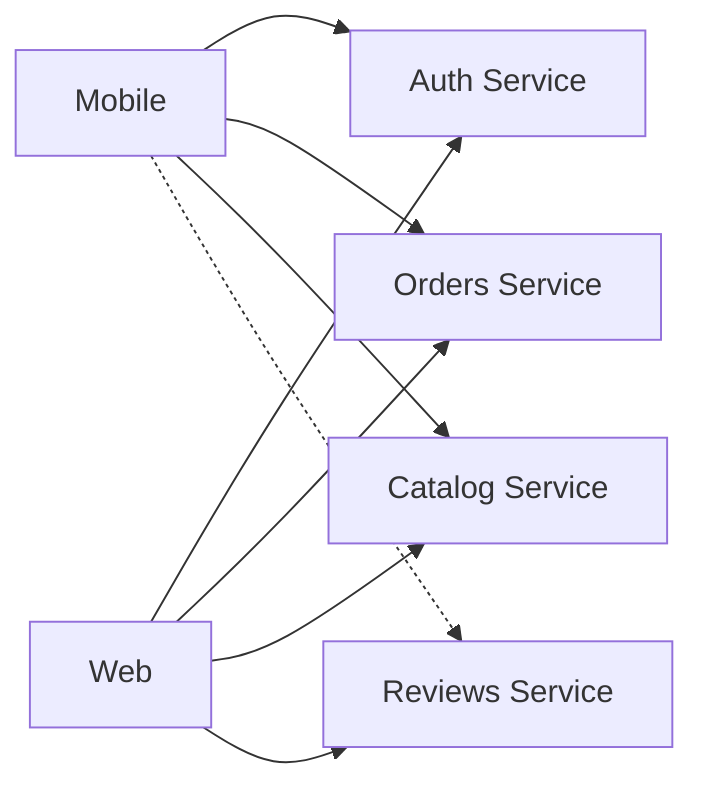
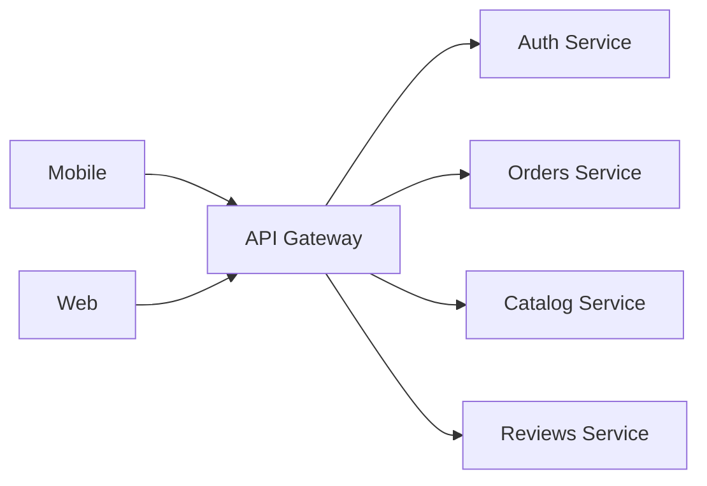
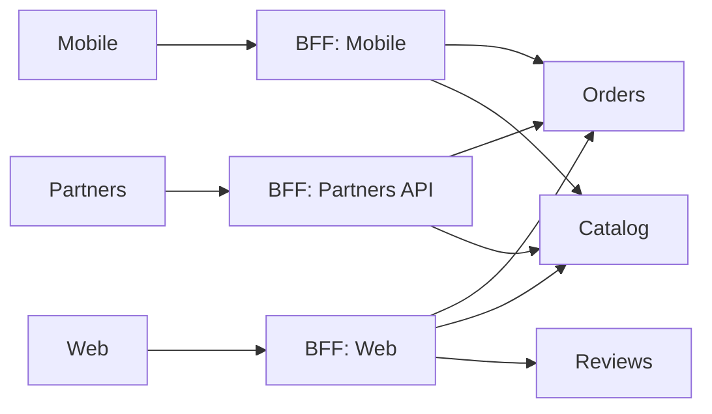
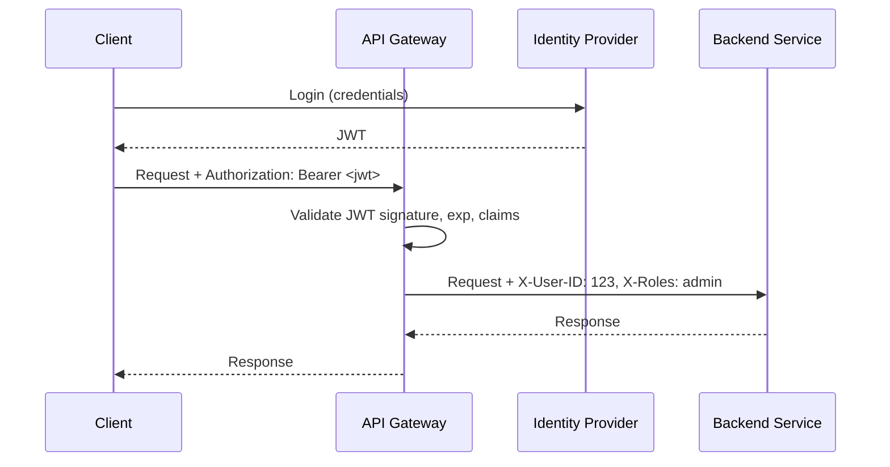

# API Gateway: единая точка входа

API Gateway — единая точка входа в backend для внешних клиентов. Маршрутизирует
запросы к внутренним сервисам, выполняет аутентификацию, rate limiting,
трансформацию форматов, кеширование, агрегацию ответов. Без gateway каждый
клиент должен знать про десятки микросервисов и реализовать всю эту логику
сам — что плохо для поддержки и безопасности.

Документ покрывает: что именно делает gateway, чем отличается от reverse proxy
и service mesh, какие продукты выбирать, паттерн BFF, типичные функции
(auth, rate limit, retry), антипаттерны и проблемы эксплуатации.

## Полезные ссылки

### Официальная документация продуктов

- [Kong Gateway](https://docs.konghq.com/) — open-source и enterprise
- [Spring Cloud Gateway](https://spring.io/projects/spring-cloud-gateway) — Java/Spring
- [AWS API Gateway](https://docs.aws.amazon.com/apigateway/) — managed, REST/HTTP/WebSocket
- [Traefik](https://doc.traefik.io/traefik/) — cloud-native edge router
- [Envoy](https://www.envoyproxy.io/docs) — низкоуровневый proxy

### Обучающие материалы

- [Microservices Patterns: API Gateway](https://microservices.io/patterns/apigateway.html) — каноничное определение
- [Pattern: Backends For Frontends (Sam Newman)](https://samnewman.io/patterns/architectural/bff/) — BFF
- [API Gateway Design Patterns (NGINX)](https://www.nginx.com/blog/microservices-api-gateways-part-1-why-an-api-gateway/) — серия статей

### См. также

- [REST API Design](rest/rest-api-design.md) — что выставляем через gateway
- [REST API Best Practices](rest/rest-api-best-practices.md) — стандарты для бэкенда
- [Saga Pattern](../../architecture/saga-pattern.md) — координация распределённых операций
- [Istio](../../platform/containers/kubernetes/istio.md) — service mesh, частично пересекается с gateway
- [API Security](../../security/application/api-security.md) — OAuth2, JWT, защита API
- [Resilience patterns](../../libraries/java/java-resilience4j.md) — retry, timeout, circuit breaker
- [Spring Cloud Gateway](../../frameworks/java-frameworks/spring/spring-cloud.md) — Java-реализация

## Содержание

- [Зачем нужен API Gateway](#зачем-нужен-api-gateway)
- [Gateway vs reverse proxy vs service mesh](#gateway-vs-reverse-proxy-vs-service-mesh)
- [Что делает API Gateway](#что-делает-api-gateway)
- [Backend For Frontend (BFF)](#backend-for-frontend-bff)
- [Выбор продукта](#выбор-продукта)
- [Аутентификация и авторизация](#аутентификация-и-авторизация)
- [Rate Limiting](#rate-limiting)
- [Retry, timeout, circuit breaker](#retry-timeout-circuit-breaker)
- [Кеширование](#кеширование)
- [Трансформация запросов и ответов](#трансформация-запросов-и-ответов)
- [Агрегация ответов](#агрегация-ответов)
- [Версионирование API](#версионирование-api)
- [Observability](#observability)
- [Деплой и масштабирование](#деплой-и-масштабирование)
- [Антипаттерны](#антипаттерны)
- [Решение проблем](#решение-проблем)
- [Лучшие практики](#лучшие-практики)

## Зачем нужен API Gateway

Без gateway клиент общается напрямую с микросервисами:



Проблемы:

- Клиент знает топологию: список сервисов, их URL, протоколы.
- Каждый клиент дублирует логику: auth, retry, разные форматы.
- Невозможно сменить URL сервиса без обновления клиентов.
- Нет единого места для security policies и observability.
- Cross-domain запросы из браузера (CORS) к каждому сервису.

С gateway:



Один публичный endpoint, единая точка для аутентификации, rate limiting,
логирования. Клиент не знает топологию, gateway скрывает её за стабильным API.

## Gateway vs reverse proxy vs service mesh

Часто путают три похожих понятия.

| Слой | Где работает | Кто пользователь | Функции |
|------|--------------|------------------|---------|
| Reverse proxy | На границе сети | Любой HTTP-клиент | Routing, TLS termination, простой балансер |
| API Gateway | На границе backend | Внешние клиенты (mobile, web) | Auth, rate limit, transformation, BFF |
| Service mesh | Между сервисами | Внутренние сервисы | mTLS, retry, observability, traffic shifting |

Reverse proxy (Nginx, HAProxy) — это нижний уровень. API Gateway часто
встроен в reverse proxy (Kong = Nginx + Lua, Traefik имеет gateway-функции).

Service mesh (Istio, Linkerd) — внутри кластера, между микросервисами.
API Gateway — на границе кластера, между миром и сервисами. Они
дополняют друг друга, не заменяют.

> Многие команды совершают ошибку: разворачивают service mesh, думая, что
> он заменяет API Gateway. Mesh не делает auth для внешних клиентов, не
> предоставляет developer portal, не управляет квотами по партнёрам.

## Что делает API Gateway

Стандартный набор функций:

| Функция | Описание |
|---------|---------|
| Routing | Маршрутизация: `/api/orders/*` → orders service |
| Authentication | Проверка JWT/OAuth2 токена; проброс identity в backend |
| Authorization | Простой ACL по path/method, сложный — в backend |
| Rate limiting | Лимиты per-IP, per-API-key, per-tenant |
| Request/response transformation | JSON ↔ XML, добавление/удаление headers |
| Caching | Кеш ответов на GET по URL+headers |
| Compression | gzip/brotli ответов |
| TLS termination | HTTPS снаружи, HTTP внутри (или mTLS внутрь) |
| CORS | Единая политика для всех endpoint'ов |
| Logging / metrics | Структурированные логи, RED-метрики per route |
| Circuit breaking | Открытие circuit при ошибках backend |
| Retry | Повторные попытки с backoff |
| Versioning | Маршрутизация по версии в URL или header |
| Aggregation | Сборка ответа из нескольких backend |
| WebSocket / SSE | Долгоживущие соединения |
| API key management | Регистрация партнёров, выдача ключей |
| Developer portal | Документация, песочница, регистрация ключей |

В реальности команда выбирает 5–10 функций из списка. Не нужно использовать все.

## Backend For Frontend (BFF)

Один gateway для всех клиентов — компромисс. Mobile, web и партнёрские API
имеют разные требования к данным и формату ответов. BFF — отдельный gateway
для каждого типа клиента.



Плюсы:

- Mobile получает компактные ответы (мало полей, нет лишних связей).
- Web получает rich-ответы для красивого UI (с агрегацией, метаданными).
- Partners получают стабильный публичный контракт.
- Команда фронта владеет своим BFF — не зависит от backend-команды.

Минусы:

- Дублирование кода между BFF.
- Больше сервисов в эксплуатации.

**Когда применять:** разные клиенты с явно разными потребностями. Не делай
BFF, если все клиенты пользуются одним и тем же набором данных одинаково.

## Выбор продукта

| Продукт | Тип | Плюсы | Минусы |
|---------|-----|-------|--------|
| Kong Gateway | Self-hosted, OSS + Enterprise | Развитый, плагины, хорошее сообщество | Lua-плагины, сложная установка |
| Tyk | Self-hosted, OSS + Cloud | Простая установка, хорошее API management | Меньше плагинов, чем у Kong |
| Traefik | Self-hosted, OSS | Cloud-native, авто-discovery, простой | Менее богатые auth-функции |
| Envoy | Self-hosted, OSS | Максимально гибкий, основа service mesh | Сложная конфигурация |
| Spring Cloud Gateway | Self-hosted, JVM | Java-нативный, легко расширяется кодом | Только JVM, не для polyglot |
| AWS API Gateway | Managed | Не надо эксплуатировать, интеграция с Lambda | AWS lock-in, цена при больших объёмах |
| Apigee (Google) | Managed | Enterprise-grade, развитый портал | Дорогой |
| Azure API Management | Managed | Интеграция с Azure | Azure lock-in |
| KrakenD | Self-hosted, OSS | Декларативный JSON-конфиг, fast | Меньше плагинов |
| Apollo Router | Specialised | Federated GraphQL Gateway | Только для GraphQL |

**Когда выбрать managed (AWS API Gateway, Apigee):**

- Не хочется эксплуатировать (deploy, upgrade, masштабирование).
- Уже в облаке провайдера.
- Объёмы запросов оправданы по цене.

**Когда выбрать self-hosted (Kong, Traefik, Envoy):**

- Нужен полный контроль над конфигурацией.
- Регулярные требования (data residency).
- Большие объёмы — managed становится дорогим.

**Когда выбрать code-based (Spring Cloud Gateway):**

- Команда — Java/Spring.
- Сложная логика трансформации лучше выражается кодом.
- Нужна тесная интеграция с domain-сервисами.

> Не пиши свой gateway с нуля, если только это не часть твоего основного
> продукта. Коробочные решения покрывают 95% кейсов и дают observability,
> rate limiting, security policies из коробки.

## Аутентификация и авторизация

Стандартный pattern: gateway проверяет JWT/OAuth2-токен, backend получает
identity в заголовке.



Принципы:

- Gateway валидирует подпись JWT (через JWKS из IdP).
- Backend доверяет заголовкам от gateway (mTLS между gateway и backend).
- Backend не валидирует JWT повторно — это уже сделал gateway.
- Authorization уровень доступа (RBAC, ABAC) — на стороне backend, gateway
  делает только базовые проверки (есть ли токен, не истёк ли).

Spring Cloud Gateway пример:

```yaml
spring:
  cloud:
    gateway:
      routes:
        - id: orders
          uri: lb://orders-service
          predicates:
            - Path=/api/orders/**
          filters:
            - TokenRelay=          # пробросить токен в backend
            - StripPrefix=2

  security:
    oauth2:
      resourceserver:
        jwt:
          jwk-set-uri: https://idp.example.com/.well-known/jwks.json
```

Kong с OAuth2 plugin:

```bash
curl -X POST http://kong:8001/services/orders/plugins \
  --data "name=jwt"

curl -X POST http://kong:8001/services/orders/plugins \
  --data "name=acl" \
  --data "config.allow=admin,user"
```

> Не пиши auth-логику в каждом сервисе. Это работа gateway или sidecar
> в service mesh. Backend получает уже верифицированную identity.

## Rate Limiting

Защищает backend от перегрузки и abuse от клиентов.

| Алгоритм | Особенности |
|----------|-------------|
| Token bucket | Лимит N запросов в минуту, burst допустим |
| Leaky bucket | Сглаживание трафика, фиксированная скорость |
| Fixed window | Лимит на интервал, проще, но «edge effect» |
| Sliding window | Точнее fixed, но дороже по памяти |

Уровни лимитирования:

| Уровень | Цель |
|---------|------|
| Global | Защита всего gateway (DDoS) |
| Per-IP | Базовая защита от ботов |
| Per-API-key | Лимиты для партнёров и пользователей |
| Per-tenant | Multi-tenant SaaS — справедливое распределение |
| Per-endpoint | Дорогие операции жёстче |

Kong example:

```yaml
plugins:
  - name: rate-limiting
    config:
      minute: 60
      hour: 1000
      policy: redis
      redis_host: redis.example.com
```

Spring Cloud Gateway с Redis:

```yaml
filters:
  - name: RequestRateLimiter
    args:
      redis-rate-limiter.replenishRate: 10
      redis-rate-limiter.burstCapacity: 20
      key-resolver: "#{@apiKeyResolver}"
```

Возвращай 429 Too Many Requests с заголовками:

```text
HTTP/1.1 429 Too Many Requests
X-RateLimit-Limit: 60
X-RateLimit-Remaining: 0
X-RateLimit-Reset: 1714142400
Retry-After: 30
```

Клиент должен уважать `Retry-After` и backoff. Gateway не должен резать
без объяснения — клиент не поймёт, почему сломался.

## Retry, timeout, circuit breaker

Gateway защищает себя от медленных и упавших backend.

```yaml
# Spring Cloud Gateway
filters:
  - name: Retry
    args:
      retries: 3
      statuses: BAD_GATEWAY,SERVICE_UNAVAILABLE
      methods: GET,HEAD
      backoff:
        firstBackoff: 100ms
        maxBackoff: 2s
        factor: 2
        basedOnPreviousValue: false
  - name: CircuitBreaker
    args:
      name: ordersCB
      fallbackUri: forward:/fallback/orders
```

Принципы:

- **Retry только идемпотентных методов.** GET, HEAD, PUT — да. POST — почти
  никогда (риск двойной обработки).
- **Timeout каждого запроса меньше клиентского.** Если клиент ждёт 10 секунд,
  gateway → backend timeout = 8s, retry × 3 не должны выйти за 10s.
- **Circuit breaker per backend.** Один сервис упал — fallback или 503,
  остальные работают.
- **Не накладывай retry в gateway поверх retry в коде.** Источник retry storm.

> Retry в gateway + retry в service mesh + retry в коде = N×N×N. При панике
> backend это убивает его окончательно. Выбери один уровень и держись его.

## Кеширование

Gateway кеширует ответы на GET для безопасной разгрузки backend.

Что нужно учесть:

- **Vary headers.** Кеш должен учитывать `Authorization`, `Accept-Language`.
- **Cache-Control от backend.** `no-store` — не кешировать. `private` — только клиент.
- **Инвалидация.** При обновлении данных в backend нужен механизм очистки.
- **Размер кеша.** Большие ответы — нужно ограничить по объёму.
- **Negative caching.** 404 кешируется коротко, чтобы не долбить backend.

```yaml
# Kong
plugins:
  - name: proxy-cache
    config:
      response_code: [200, 301, 404]
      request_method: [GET, HEAD]
      content_type: [application/json]
      cache_ttl: 300
      strategy: memory
```

Edge-кеширование (CDN): для публичных GET — кеши на CDN перед gateway,
а не в самом gateway. Это разгружает gateway.

## Трансформация запросов и ответов

| Что | Зачем |
|-----|-------|
| Добавить header | Пробросить tenant_id из JWT, добавить trace_id |
| Удалить header | Скрыть internal headers от клиента |
| Переписать URL | `/v2/orders` → `/api/orders` |
| JSON → XML | Legacy-клиенты на SOAP |
| Маскировать поля | Скрыть PII в ответе для определённых ролей |
| GraphQL → REST | Старый клиент → новый GraphQL backend |

Простые трансформации — в конфиге:

```yaml
# Spring Cloud Gateway
filters:
  - AddRequestHeader=X-Source, gateway
  - RemoveResponseHeader=Server
  - RewritePath=/api/v1/(?<path>.*), /$\{path}
```

Сложные — в коде/Lua-плагинах. Это сигнал, что логика растёт за пределы
gateway. Возможно, нужен BFF.

## Агрегация ответов

Один внешний запрос → несколько внутренних, gateway собирает финальный JSON.

```text
GET /api/dashboard
  → GET /orders/recent
  → GET /catalog/featured
  → GET /reviews/recent
  ← объединённый JSON
```

Плюсы:

- Меньше round-trips для клиента (особенно mobile с плохим интернетом).
- Не надо open N коннектов.

Минусы:

- Latency = max(N коннектов в backend), а не sum.
- При падении одного backend — частичный ответ или fallback.
- Логика в gateway растёт — сигнал, что нужен BFF.

> Если агрегация сложная — выноси в отдельный BFF-сервис, а не накручивай
> в gateway. Spring Cloud Gateway, Kong и подобные не предназначены для
> сложной композиции данных.

GraphQL и Apollo Federation — нативный способ агрегации. Если у тебя много
агрегаций — посмотри в их сторону.

## Версионирование API

Стратегии:

| Стратегия | Пример | Плюсы | Минусы |
|-----------|--------|-------|--------|
| URL versioning | `/api/v1/orders`, `/api/v2/orders` | Просто, видно | Засоряет URL |
| Header versioning | `Accept: application/vnd.app.v2+json` | Чистый URL | Сложнее тестировать |
| Query parameter | `/api/orders?version=2` | Простота | Ломает кеши |

URL versioning — стандарт. Gateway маршрутизирует по префиксу:

```yaml
routes:
  - id: orders-v1
    uri: lb://orders-v1
    predicates:
      - Path=/api/v1/orders/**
  - id: orders-v2
    uri: lb://orders-v2
    predicates:
      - Path=/api/v2/orders/**
```

Sunset policy — ясная коммуникация про deprecation:

```text
Sunset: Sat, 31 Dec 2026 23:59:59 GMT
Deprecation: true
Link: <https://docs.example.com/migration>; rel="deprecation"
```

## Observability

Gateway — естественное место для централизованных метрик:

| Метрика | Алерт |
|---------|-------|
| Request rate per route | Резкое падение = инцидент |
| Latency p50/p95/p99 per route | p99 > N — деградация |
| Error rate per route per status | 5xx > 1% — backend сломан |
| Backend connection errors | Любая → пейджить |
| Rate-limit rejections | Резкий рост — abuse или ошибка клиента |
| Cache hit rate | Падение — инвалидация работает не так |

Логи: каждый запрос с trace_id, user_id (если есть), backend_target,
duration, status.

```text
{"timestamp":"2026-04-26T10:00:00Z","trace_id":"abc","method":"POST","path":"/api/orders","user":"u123","backend":"orders-svc","status":201,"duration_ms":45}
```

Распределённая трассировка: gateway генерирует trace_id, пробрасывает
`traceparent` в backend. Backend добавляет свои span'ы. В конце видим путь
запроса целиком: client → gateway → orders → payment → orders.

## Деплой и масштабирование

Gateway — обычно stateless, масштабируется горизонтально через replicas.

```yaml
apiVersion: apps/v1
kind: Deployment
metadata:
  name: api-gateway
spec:
  replicas: 5
  template:
    spec:
      containers:
        - name: gateway
          image: kong:3.8
          resources:
            requests: { cpu: 500m, memory: 512Mi }
            limits:   { cpu: 2000m, memory: 2Gi }
          readinessProbe:
            httpGet: { path: /status, port: 8001 }
---
apiVersion: autoscaling/v2
kind: HorizontalPodAutoscaler
metadata:
  name: api-gateway
spec:
  minReplicas: 3
  maxReplicas: 30
  metrics:
    - type: Resource
      resource:
        name: cpu
        target:
          type: Utilization
          averageUtilization: 70
```

Развёртывание blue/green или canary через нагрузочный балансер: ставим
новый gateway рядом со старым, переключаем DNS или Service.

Stateful-конфигурация (rate limit counters, sessions) — во внешнем хранилище
(Redis), gateway-pod сами stateless.

## Антипаттерны

| Антипаттерн | Почему плохо | Что делать |
|-------------|--------------|-----------|
| Бизнес-логика в gateway | Рост сложности, gateway становится монолитом | Бизнес-логика — в backend, gateway тонкий |
| Gateway знает про domain (заказы, пользователи) | Связность gateway и backend | Generic routing, identity-based authz |
| Single huge gateway для всего | Один деплой влияет на всех | BFF per client или domain-разделение |
| Вся auth в backend | Дублирование, риск пропуска | Centralized в gateway |
| Нет rate limiting | Перегрузка от любого клиента | Минимум — global и per-IP |
| Игнорирование cache headers backend | Кешируем то, что нельзя | Уважай `Cache-Control: private/no-store` |
| Без TLS между gateway и backend | MitM внутри сети | mTLS или sidecar mesh |
| 5xx скрывается за 200 | Клиент не видит реальный статус | Возвращай корректные коды |
| Retry на POST без идемпотентности | Двойная обработка платежа | Idempotency-Key или only GET |
| Все routes в одной conf-файле | 500 routes, неподдерживаемо | Разбить по командам/доменам |

## Решение проблем

| Симптом | Причина | Что сделать |
|---------|---------|-------------|
| Клиенты получают 504 после 30s | Default timeout gateway | Настрой timeout per route, скоординируй с клиентами |
| Backend «забивается» при пиках | Нет rate limit или connection pool | Включи rate limit, настрой `connection_pool` per upstream |
| Gateway тратит много CPU | TLS termination, gzip, JSON-парсинг | Hardware-acceleration TLS, уменьшить parsing, профилировать |
| Latency через gateway высокая | Долгий backend, dual-TLS, агрегация | APM-трассировка, ищем boтлнек |
| Кеш отдаёт старые данные после deploy | Нет инвалидации | TTL не больше N минут, явные purge endpoints |
| 401 после успешного login | Истёк JWT, gateway не видит refresh | Refresh-flow, `WWW-Authenticate` для clear ошибок |
| CORS preflight (OPTIONS) проходит, основной запрос — нет | Header не разрешён в `Access-Control-Allow-Headers` | Расширь CORS-конфиг |
| Один backend упал, gateway возвращает ошибки от других | Нет per-route circuit breaker | CB per route, fallback или явный 503 |
| Логи переполнены health-чеками | Health-чек kubelet попадает в access log | Excluded routes из логов |
| Sticky session не работают | Multiple replicas без shared state | Redis для sessions или JWT (stateless) |

## Лучшие практики

- Один gateway-домен (`api.example.com`) и под-пути (`/api/v1/orders`).
  Не плоди десятки доменов.
- BFF per client (mobile, web, partners) — если потребности разные.
  Не лепи всё в один gateway.
- Auth централизованно в gateway, business authz в backend.
- Rate limit с самого начала: global + per-IP + per-API-key.
- Timeout-pyramid: client > gateway > backend > database.
- Идемпотентность для не-GET операций — `Idempotency-Key` header.
- mTLS или service mesh между gateway и backend.
- Структурированные логи с `trace_id` и `user_id`.
- Дашборды per route: rate, latency, errors. Алерты по SLO.
- Версионирование API в URL, sunset-headers при deprecation.
- Документация — OpenAPI 3, размещена на developer portal с песочницей.
- Стандартные коды ошибок (RFC 7807 problem+json), не custom JSON.
- Стандартные headers: `X-Request-ID`, `X-Correlation-ID`, `Retry-After`.
- Не вкладывай бизнес-логику. Gateway — тонкий слой маршрутизации
  и cross-cutting функций.
- Регулярно ревьюй маршруты и плагины. Удаляй неиспользуемые.

**Итог:** API Gateway — единая точка входа в backend для внешних клиентов:
auth, rate limit, transformation, observability. Не путать с reverse proxy
(ниже уровнем) и service mesh (внутри кластера). Для разных клиентов —
паттерн BFF. Выбор продукта: Kong/Traefik/Spring Cloud Gateway для self-hosted,
AWS API Gateway/Apigee для managed. Антипаттерны: бизнес-логика в gateway,
один huge-gateway для всего, отсутствие rate limit.
