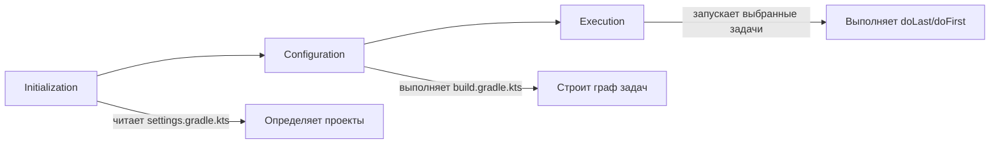

# Gradle: основы

Gradle — система сборки на JVM. Build-скрипт пишется на Kotlin DSL (`build.gradle.kts`)
или Groovy DSL (`build.gradle`). Применяется для Java, Kotlin, Android, Scala, Groovy
проектов. Сильные стороны — инкрементальная сборка, build cache, гибкая модель задач.

Документ покрывает то, что нужно знать инженеру для работы с обычным Java/Kotlin
сервисом: структуру проекта, базовый build-скрипт, конфигурации зависимостей,
задачи, тесты, wrapper и типовые проблемы. Продвинутые темы — в
[Gradle Advanced](gradle-advanced.md).

## Полезные ссылки

### Официальная документация

- [Gradle User Manual](https://docs.gradle.org/current/userguide/userguide.html) — полное руководство
- [Gradle DSL Reference](https://docs.gradle.org/current/dsl/) — описание DSL
- [Plugin Portal](https://plugins.gradle.org/) — поиск плагинов
- [Migrating from Maven](https://docs.gradle.org/current/userguide/migrating_from_maven.html) — миграция с Maven

### Обучающие материалы

- [Building Java Projects](https://docs.gradle.org/current/userguide/building_java_projects.html) — гайд по Java-сборкам
- [Kotlin DSL Primer](https://docs.gradle.org/current/userguide/kotlin_dsl.html) — введение в Kotlin DSL

### См. также

- [Gradle Advanced](gradle-advanced.md) — multi-module, Version Catalogs, build cache, кастомные плагины
- [Maven: основы](../maven/maven.md) — альтернативная система сборки
- [Java: основы](../../../languages/java/java-basics.md) — язык, под который чаще всего собирают
- [GitHub Actions](../../../platform/ci-cd/github-actions.md) — типовая интеграция Gradle в CI
- [Spring Boot](../../../frameworks/java-frameworks/spring/spring-boot.md) — фреймворк, который собирают через Gradle plugin

## Содержание

- [Gradle vs Maven](#gradle-vs-maven)
- [Установка и Wrapper](#установка-и-wrapper)
- [Структура проекта](#структура-проекта)
- [Build-скрипт: основные блоки](#build-скрипт-основные-блоки)
  - [Plugins](#plugins)
  - [Repositories](#repositories)
  - [Dependencies](#dependencies)
  - [Java toolchain](#java-toolchain)
- [Конфигурации зависимостей](#конфигурации-зависимостей)
- [Задачи](#задачи)
- [Жизненный цикл сборки](#жизненный-цикл-сборки)
- [Тестирование](#тестирование)
- [Multi-module: минимальный пример](#multi-module-минимальный-пример)
- [Профили через свойства](#профили-через-свойства)
- [Часто используемые команды](#часто-используемые-команды)
- [Производительность](#производительность)
- [Решение проблем](#решение-проблем)
- [Лучшие практики](#лучшие-практики)

## Gradle vs Maven

| Критерий | Gradle | Maven |
|----------|--------|-------|
| DSL | Kotlin/Groovy, программируемый | XML, декларативный |
| Скорость | Инкрементальная сборка, build cache | Полная фаза каждый раз |
| Плагины | Plugins DSL, легко писать свои | Многословный XML, своих писать дольше |
| Multi-module | Гибкий, через `subprojects` и Version Catalog | Через `<modules>`, `parent pom` |
| Кривая обучения | Высокая (есть программируемая логика) | Ниже (только XML) |
| Где применяется чаще | Android, новые JVM-сервисы | Корпоративные Java-проекты, унаследованные кодовые базы |

**Когда использовать Gradle:** новый проект, нужна скорость инкрементальной сборки,
сложные кастомные шаги сборки, multi-module с переиспользованием конфигурации.

**Когда оставить Maven:** существующая большая кодовая база на Maven, команда
не хочет учить новый DSL, нужна максимальная предсказуемость без программируемой логики.

## Установка и Wrapper

Wrapper — это `gradlew` (Linux/macOS) и `gradlew.bat` (Windows) в корне проекта.
Он скачивает указанную в `gradle/wrapper/gradle-wrapper.properties` версию Gradle
и запускает её. Все собирают одной и той же версией без ручной установки.

```bash
gradle wrapper --gradle-version 8.10
./gradlew build
```

Версия Gradle фиксируется в `gradle/wrapper/gradle-wrapper.properties`:

```text
distributionUrl=https\://services.gradle.org/distributions/gradle-8.10-bin.zip
```

**Правило:** в репозиторий коммитится `gradlew`, `gradlew.bat`, `gradle/wrapper/`.
Локально установленный Gradle нужен только чтобы создать wrapper в первый раз.

## Структура проекта

Минимальный одно-модульный Java-проект:

```text
my-app/
├── build.gradle.kts          # build-скрипт
├── settings.gradle.kts       # имя проекта, подмодули
├── gradle.properties         # свойства (версии, JVM-аргументы)
├── gradlew                   # wrapper-скрипт
├── gradlew.bat
├── gradle/
│   └── wrapper/
│       ├── gradle-wrapper.jar
│       └── gradle-wrapper.properties
└── src/
    ├── main/
    │   ├── java/             # исходники
    │   └── resources/        # ресурсы (application.yml и т. п.)
    └── test/
        ├── java/             # тесты
        └── resources/
```

Каталог `build/` создаётся при сборке и игнорируется в Git — там лежат
скомпилированные классы, отчёты тестов, jar-файлы.

## Build-скрипт: основные блоки

```kotlin
// build.gradle.kts
plugins {
    java
    id("org.springframework.boot") version "3.4.0"
    id("io.spring.dependency-management") version "1.1.6"
}

group = "com.example"
version = "1.0.0"

java {
    toolchain {
        languageVersion = JavaLanguageVersion.of(21)
    }
}

repositories {
    mavenCentral()
}

dependencies {
    implementation("org.springframework.boot:spring-boot-starter-web")
    runtimeOnly("org.postgresql:postgresql")
    testImplementation("org.springframework.boot:spring-boot-starter-test")
}

tasks.test {
    useJUnitPlatform()
}
```

### Plugins

Плагины применяются через блок `plugins {}` в начале файла. Источник по умолчанию —
Plugin Portal. Плагины могут быть встроенные (`java`, `application`, `kotlin("jvm")`)
или сторонние (`org.springframework.boot`).

```kotlin
plugins {
    java                                            // встроенный плагин Java
    application                                     // run-задача и distZip/distTar
    id("org.springframework.boot") version "3.4.0" // сторонний с версией
    kotlin("jvm") version "2.0.0"                   // shorthand для kotlin-плагинов
}
```

### Repositories

Откуда тянуть зависимости:

```kotlin
repositories {
    mavenCentral()
    google()                                        // для Android-библиотек
    maven("https://nexus.example.com/repository/maven-public/")
    mavenLocal()                                    // ~/.m2/repository, для локально опубликованных
}
```

### Dependencies

```kotlin
dependencies {
    implementation("org.apache.commons:commons-lang3:3.14.0")
    api("com.fasterxml.jackson.core:jackson-databind:2.18.0")
    runtimeOnly("ch.qos.logback:logback-classic:1.5.12")
    compileOnly("org.projectlombok:lombok:1.18.34")
    annotationProcessor("org.projectlombok:lombok:1.18.34")

    testImplementation("org.junit.jupiter:junit-jupiter:5.11.0")
    testRuntimeOnly("org.junit.platform:junit-platform-launcher")
}
```

Подробно про конфигурации — следующий раздел.

### Java toolchain

Toolchain автоматически скачивает нужный JDK, если в системе его нет:

```kotlin
java {
    toolchain {
        languageVersion = JavaLanguageVersion.of(21)
        vendor = JvmVendorSpec.TEMURIN
    }
}
```

Это полезно в CI, где можно не ставить JDK заранее: Gradle поднимет нужный.

## Конфигурации зависимостей

Конфигурация определяет, где зависимость видна и попадёт ли в финальный артефакт.

| Конфигурация | Compile classpath | Runtime classpath | Test classpath | Виден потребителям |
|--------------|-------------------|-------------------|----------------|--------------------|
| `implementation` | да | да | да | нет |
| `api` | да | да | да | да |
| `compileOnly` | да | нет | нет | нет |
| `runtimeOnly` | нет | да | да | нет |
| `annotationProcessor` | при компиляции | нет | нет | нет |
| `testImplementation` | нет | нет | да (compile + runtime) | нет |
| `testRuntimeOnly` | нет | нет | да (только runtime) | нет |

**Различие `implementation` vs `api`:** при `implementation` транзитивные зависимости
не видны потребителям модуля — это сокращает classpath и время компиляции.
`api` пробрасывает зависимость дальше — оправдано только если тип реально
торчит в публичном API модуля.

**Когда использовать `compileOnly`:** Lombok, аннотации, которые нужны только при
компиляции (`@Nullable`, `javax.servlet-api` для контейнера).

**Когда использовать `runtimeOnly`:** JDBC-драйверы, реализация SLF4J (`logback-classic`),
которые подгружаются по SPI и не нужны в коде напрямую.

## Задачи

Задача (`Task`) — единица работы. У задачи есть имя, входы, выходы и действия.
Gradle строит граф задач и выполняет только те, чьи входы изменились.

```kotlin
tasks.register("printVersion") {
    group = "verification"
    description = "Выводит версию проекта"
    doLast {
        println("Version: ${project.version}")
    }
}
```

Конфигурация существующей задачи:

```kotlin
tasks.test {
    useJUnitPlatform()
    maxParallelForks = 4
    testLogging {
        events("passed", "failed", "skipped")
    }
}

tasks.jar {
    archiveBaseName = "my-app"
    manifest {
        attributes["Main-Class"] = "com.example.Main"
    }
}
```

**Внимание:** избегай выполнения тяжёлой логики в фазе конфигурации (вне `doLast`/`doFirst`).
Код в теле `tasks.register {}` выполняется при каждом запуске Gradle. Если нужно
тяжёлое действие — оборачивай в `doLast`.

## Жизненный цикл сборки

Gradle проходит три фазы при каждом запуске:



- Initialization — Gradle определяет, какие модули в сборке (`settings.gradle.kts`).
- Configuration — выполняется тело каждого `build.gradle.kts`, формируется граф задач.
- Execution — Gradle запускает задачи из графа в нужном порядке.

Configuration cache (`--configuration-cache`) кэширует результат фазы конфигурации:
второй запуск той же команды пропускает её.

## Тестирование

Стандартный путь — JUnit 5 + Spring Boot Test (если это сервис на Spring).

```kotlin
dependencies {
    testImplementation("org.springframework.boot:spring-boot-starter-test")
    testImplementation("org.testcontainers:postgresql:1.20.4")
    testImplementation("org.testcontainers:junit-jupiter:1.20.4")
}

tasks.test {
    useJUnitPlatform()
    systemProperty("spring.profiles.active", "test")

    testLogging {
        events("passed", "skipped", "failed")
        showStandardStreams = false
        exceptionFormat = org.gradle.api.tasks.testing.logging.TestExceptionFormat.FULL
    }
}
```

Запуск:

```bash
./gradlew test                                  # все тесты
./gradlew test --tests "com.example.UserServiceTest"
./gradlew test --tests "*UserServiceTest.shouldCreateUser"
./gradlew :module-name:test                     # тесты конкретного модуля
```

Отчёт — в `build/reports/tests/test/index.html`. Покрытие добавляется плагином
`jacoco`:

```kotlin
plugins {
    jacoco
}

tasks.jacocoTestReport {
    dependsOn(tasks.test)
}
```

## Multi-module: минимальный пример

`settings.gradle.kts`:

```kotlin
rootProject.name = "my-service"

include("domain")
include("persistence")
include("app")
```

`build.gradle.kts` в корне (общая конфигурация для всех модулей):

```kotlin
allprojects {
    group = "com.example"
    version = "1.0.0"
    repositories { mavenCentral() }
}

subprojects {
    apply(plugin = "java")

    java {
        toolchain { languageVersion = JavaLanguageVersion.of(21) }
    }
}
```

Зависимость одного модуля от другого:

```kotlin
// app/build.gradle.kts
dependencies {
    implementation(project(":domain"))
    implementation(project(":persistence"))
}
```

Подробнее про крупные multi-module проекты, Version Catalogs, conventions plugins —
в [Gradle Advanced](gradle-advanced.md).

## Профили через свойства

В Gradle нет «профилей» как в Maven. Используй `gradle.properties` и `-P`:

```text
# gradle.properties
springProfile=dev
```

```kotlin
val activeProfile = (project.findProperty("springProfile") ?: "dev") as String

tasks.bootRun {
    systemProperty("spring.profiles.active", activeProfile)
}
```

```bash
./gradlew bootRun -PspringProfile=prod
```

## Часто используемые команды

| Команда | Что делает |
|---------|-----------|
| `./gradlew tasks` | Список доступных задач |
| `./gradlew tasks --all` | Все задачи, включая системные |
| `./gradlew build` | Полная сборка: compile, test, jar |
| `./gradlew assemble` | Собрать артефакты, без тестов |
| `./gradlew clean` | Удалить `build/` |
| `./gradlew test` | Запустить тесты |
| `./gradlew check` | Тесты + статический анализ + покрытие |
| `./gradlew dependencies` | Дерево зависимостей корневого проекта |
| `./gradlew :module:dependencies --configuration runtimeClasspath` | Дерево конкретного модуля и конфигурации |
| `./gradlew dependencyInsight --dependency jackson-core` | Откуда тянется конкретная зависимость |
| `./gradlew bootRun` | Запуск Spring Boot приложения |
| `./gradlew --refresh-dependencies build` | Игнорировать локальный кеш, перекачать зависимости |
| `./gradlew --offline build` | Сборка без сети |
| `./gradlew build --scan` | Опубликовать build scan на gradle.com |

## Производительность

Базовые настройки в `gradle.properties`:

```text
org.gradle.parallel=true                # параллельное выполнение модулей
org.gradle.caching=true                 # build cache (локальный)
org.gradle.configuration-cache=true     # configuration cache
org.gradle.jvmargs=-Xmx4g -Dfile.encoding=UTF-8
org.gradle.daemon=true                  # включён по умолчанию
```

| Механизм | Что ускоряет | Как включить |
|----------|--------------|--------------|
| Daemon | Прогрев JVM, повторные запуски | Включён по умолчанию |
| Parallel | Сборка независимых модулей одновременно | `org.gradle.parallel=true` |
| Build cache | Переиспользование результатов задач | `org.gradle.caching=true` |
| Configuration cache | Пропуск фазы Configuration | `org.gradle.configuration-cache=true` |
| Incremental compile | Перекомпиляция только изменённых классов | По умолчанию |

> Configuration cache несовместима с некоторыми старыми плагинами. Если сборка
> валится с ошибкой про несериализуемое состояние — отключай флаг для проблемного модуля.

## Решение проблем

| Симптом | Причина | Решение |
|---------|---------|---------|
| `Could not resolve dependency` | Артефакт не найден в репозитории | Проверь `repositories {}`, имя/версию, доступ к корпоративному Nexus |
| `Could not find method ... for arguments` | Несовместимая версия плагина с версией Gradle | Обнови плагин или Gradle, проверь матрицу совместимости |
| Тест проходит локально, валится в CI | Различие в JDK, локали, таймзоне, очерёдности тестов | Зафиксируй toolchain, `systemProperty("user.timezone", "UTC")`, `--tests` |
| `OutOfMemoryError` при сборке | Маленький heap для daemon | `org.gradle.jvmargs=-Xmx4g` в `gradle.properties` |
| Изменения в коде не применяются | Stale build cache | `./gradlew clean build --no-build-cache` |
| Daemon съедает память | Много параллельных проектов | `./gradlew --stop` или ограничить `-Dorg.gradle.workers.max=2` |
| `Plugin not found` | Не подключён нужный repository для плагинов | Добавь `gradlePluginPortal()` в `pluginManagement.repositories` |
| Конфликт версий транзитивных зависимостей | Несколько версий одной библиотеки | `./gradlew dependencyInsight --dependency <name>`, добавь strict-version или constraint |

Принудительная версия зависимости:

```kotlin
configurations.all {
    resolutionStrategy {
        force("com.fasterxml.jackson.core:jackson-databind:2.18.0")
    }
}
```

## Лучшие практики

- Всегда используй wrapper. Локальный Gradle нужен только для `gradle wrapper`.
- Kotlin DSL предпочтительнее Groovy DSL в новых проектах: статическая типизация
  и автодополнение в IDE.
- Версии зависимостей храни в одном месте: BOM (Spring Boot, Quarkus уже дают свой)
  или Version Catalog (`gradle/libs.versions.toml`).
- Не пиши логику в фазе конфигурации — оборачивай тяжёлое в `doLast`.
- В CI выключай daemon (`--no-daemon`) — на коротких сборках он не выгоден.
- Включи `--scan` для проблемных сборок — Gradle опубликует подробный отчёт
  о времени выполнения каждой задачи.
- Не коммить `build/`, локальный `.gradle/`, IDE-файлы — есть стандартный `.gitignore`.
- Для больших monorepo переходи на Gradle Enterprise или Develocity для
  remote build cache между разработчиками и CI.

**Итог:** для рутинной работы достаточно знать `plugins`, `dependencies`, `repositories`,
конфигурации зависимостей и команды `build`/`test`. Всё остальное (custom tasks,
multi-module, Version Catalogs, build cache) — в [Gradle Advanced](gradle-advanced.md).
