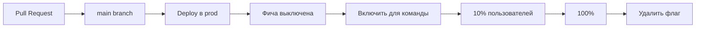
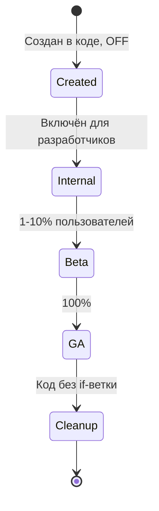
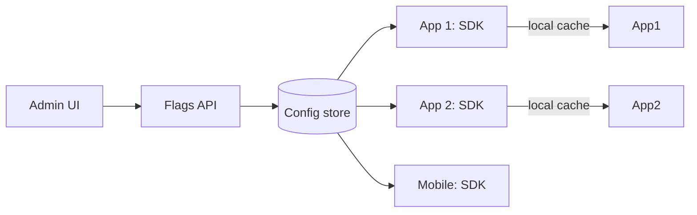

# Feature Flags: тогглы для продакшна

Feature flag (toggle) — переключатель в коде, позволяющий менять поведение
без деплоя. Включить новую фичу 5% пользователей, выключить сломанный
функционал за секунды, провести A/B-тест, ограничить доступ для конкретного
тенанта — всё это feature flags.

В современной разработке flags — основа continuous delivery: код мерджится
в main за выключенным флагом, фича включается отдельно. Документ описывает
типы тогглов по Pete Hodgson, выбор продукта (Unleash, LaunchDarkly,
OpenFeature), стратегии раскатки, антипаттерны и технический долг.

## Полезные ссылки

### Официальная документация

- [Unleash](https://docs.getunleash.io/) — open-source feature management
- [LaunchDarkly](https://docs.launchdarkly.com/) — коммерческий стандарт
- [OpenFeature](https://openfeature.dev/) — стандарт CNCF, vendor-neutral SDK
- [Flagsmith](https://docs.flagsmith.com/) — open-source альтернатива
- [GrowthBook](https://docs.growthbook.io/) — open-source с фокусом на A/B-тесты

### Обучающие материалы

- [Feature Toggles (Pete Hodgson, Martin Fowler)](https://martinfowler.com/articles/feature-toggles.html) — каноничная статья
- [Feature Flags Best Practices (LaunchDarkly)](https://launchdarkly.com/blog/feature-flag-best-practices/) — practical guide
- [Continuous Delivery: Feature Flags](https://continuousdelivery.com/) — Jez Humble & Dave Farley

### См. также

- [Resilience Patterns](../architecture/resilience-patterns.md) — flags как kill switch
- [ArgoCD](../platform/ci-cd/argocd.md) — деплой и flags вместе
- [GitHub Actions](../platform/ci-cd/github-actions.md) — управление flags из CI
- [Saga Pattern](../architecture/saga-pattern.md) — постепенная миграция через flags
- [Containerization Overview](../platform/containers/containerization-overview.md) — runtime config через flags

## Содержание

- [Зачем нужны Feature Flags](#зачем-нужны-feature-flags)
- [Типы тогглов (Pete Hodgson)](#типы-тогглов-pete-hodgson)
- [Жизненный цикл тоггла](#жизненный-цикл-тоггла)
- [Стратегии раскатки](#стратегии-раскатки)
- [Targeting: per-user / per-tenant](#targeting-per-user--per-tenant)
- [Архитектура feature flag системы](#архитектура-feature-flag-системы)
- [OpenFeature: стандарт SDK](#openfeature-стандарт-sdk)
- [Сравнение продуктов](#сравнение-продуктов)
- [Тестирование с тогглами](#тестирование-с-тогглами)
- [Технический долг и cleanup](#технический-долг-и-cleanup)
- [Kill switches и operational tools](#kill-switches-и-operational-tools)
- [A/B-тесты и эксперименты](#ab-тесты-и-эксперименты)
- [Безопасность и compliance](#безопасность-и-compliance)
- [Антипаттерны](#антипаттерны)
- [Лучшие практики](#лучшие-практики)

## Зачем нужны Feature Flags



Главные сценарии:

| Сценарий | Описание |
|----------|----------|
| Trunk-based development | Незавершённая работа в main, скрыта за флагом |
| Gradual rollout | 1% → 10% → 50% → 100% с остановкой при метриках |
| Canary release | Новая фича только для бета-тестеров |
| A/B testing | Эксперимент: измерить эффект изменения |
| Kill switch | Отключить сломанный функционал без отката |
| Permissioning | Включить функционал для платного тарифа |
| Operational toggle | Отключить фичу при перегрузке (load shedding) |
| Migration | Постепенный переход: старая логика OFF, новая ON |

Без флагов:

- Каждая незавершённая фича = отдельная ветка → merge conflicts.
- Откат проблемного релиза = ревёрт + redeploy (минуты-часы).
- A/B-тест требует отдельного деплоя.
- Постепенная раскатка невозможна без custom-инфраструктуры.

## Типы тогглов (Pete Hodgson)

Классификация Мартина Фаулера по двум осям: время жизни и динамичность.

| Тип | Время жизни | Динамичность | Назначение |
|-----|-------------|--------------|------------|
| Release Toggle | Дни — недели | Статическая | Скрыть незавершённую фичу |
| Experiment Toggle | Дни — недели | Динамическая (per-user) | A/B-тест |
| Ops Toggle | Месяцы — годы | Динамическая (runtime) | Kill switch, load management |
| Permission Toggle | Постоянно | Динамическая (per-user) | Premium features, beta access |

### Release Toggle

Самый простой. Используется в trunk-based development для скрытия
незавершённого кода.

```java
if (featureFlags.isEnabled("new-checkout")) {
    return newCheckoutFlow(order);
} else {
    return legacyCheckoutFlow(order);
}
```

Включается на короткое время, потом удаляется вместе с устаревшим кодом.

### Experiment Toggle

Для A/B-тестов. Решение — per-user, на основе хеша user_id или явных правил.

```java
if (experiments.variant("checkout-button-color", userId).equals("green")) {
    return renderGreenButton();
} else {
    return renderBlueButton();
}
```

Должен быть стабилен per-user: один пользователь всегда видит одну версию.

### Ops Toggle

Runtime-управление. Для аварийного выключения функций.

```java
if (!ops.isEnabled("recommendations")) {
    return Recommendations.empty();   // graceful degradation
}
return recService.compute();
```

Используется командой эксплуатации, не разработчиками.

### Permission Toggle

Долгоживущий. Решает доступ на основе тарифа, региона, прав.

```java
if (permissions.has(user, "advanced-analytics")) {
    return analyticsService.advanced(query);
}
return PermissionDenied();
```

Часто эволюционирует в полноценный entitlement service, выходя за рамки flag-системы.

## Жизненный цикл тоггла



Каждый release toggle ОБЯЗАН быть удалён после раскатки. Накопление мёртвых
флагов — главная проблема систем тогглов.

## Стратегии раскатки

| Стратегия | Как работает |
|-----------|--------------|
| Boolean | ON/OFF для всех |
| Percentage rollout | N% случайных пользователей |
| Gradual rollout | 1% → 5% → 25% → 50% → 100% по расписанию |
| User list | Конкретный список user_id |
| Segment-based | Включено для группы (premium, beta-testers) |
| Geographic | По региону |
| Time-based | С такой-то даты |
| Variant | Несколько вариантов (control + 2 treatment) |

```yaml
# Unleash strategy example
- name: gradualRolloutUserId
  parameters:
    percentage: "25"
    groupId: "new-checkout"
- name: userWithId
  parameters:
    userIds: "alice@example.com,bob@example.com"
```

**Sticky percentage:** один пользователь всегда попадает в одну группу.
Реализуется через хеш `(user_id + flag_name)` modulo 100. Без этого
пользователь видит разное при каждом обновлении страницы.

## Targeting: per-user / per-tenant

Ключевой механизм — context-based evaluation.

```java
EvaluationContext ctx = new ImmutableContext(userId)
    .add("country", "RU")
    .add("plan", "premium")
    .add("appVersion", "2.5.0");

boolean enabled = client.getBooleanValue("new-checkout", false, ctx);
```

Правила, которые SDK эвалюирует против контекста:

```yaml
flag: new-checkout
rules:
  - if: country == "US" and plan == "premium"
    then: enabled
  - if: appVersion >= "2.5.0"
    then: percentage(50)
  - default: disabled
```

Хороший SDK эвалюирует правила локально (после получения конфига),
не делает HTTP-запрос на каждый вызов. Иначе latency и доступность.

## Архитектура feature flag системы



| Компонент | Назначение |
|-----------|-----------|
| Admin UI | Управление флагами (включить/выключить, правила targeting) |
| Flags API | Read API для SDK и Write API для админа |
| Config store | Хранилище конфигов (PostgreSQL, Redis) |
| SDK | Библиотека в приложении: cache, evaluation |
| Streaming | Push изменений в SDK через SSE/WebSocket (для realtime) |

**Critical path:** SDK кеширует конфиг локально и эвалюирует правила
in-process. Без этого недоступность Flags API ломает приложение.

Защита:

- Локальный кеш с TTL.
- Default values при недоступности сервера.
- Fail-open или fail-closed — выбор зависит от семантики флага.

## OpenFeature: стандарт SDK

OpenFeature (CNCF) — стандарт API для feature flags, vendor-neutral.

Идея: одна библиотека в коде, разные провайдеры (Unleash, LaunchDarkly,
Flagsmith) меняются конфигурацией.

```java
// Java SDK
import dev.openfeature.sdk.*;

OpenFeatureAPI.getInstance().setProvider(new UnleashProvider(unleashConfig));

Client client = OpenFeatureAPI.getInstance().getClient();
boolean enabled = client.getBooleanValue("new-checkout", false);
```

```typescript
// TypeScript SDK
import { OpenFeature } from '@openfeature/web-sdk';
import { LaunchDarklyProvider } from '@openfeature/launchdarkly-provider';

OpenFeature.setProvider(new LaunchDarklyProvider({ ... }));
const client = OpenFeature.getClient();
const enabled = await client.getBooleanValue('new-checkout', false);
```

**Преимущества OpenFeature:**

- Снимает vendor lock-in.
- Stardartized API: один и тот же код в Java/Go/TypeScript/Python.
- Hooks для логирования, метрик.
- Provider-based архитектура.

Для новых проектов — OpenFeature по умолчанию.

## Сравнение продуктов

| Продукт | Тип | Цена | Особенности |
|---------|-----|------|-------------|
| LaunchDarkly | SaaS | Дорогой | Зрелый, лидер рынка, A/B встроен |
| Unleash | OSS + Enterprise | Free / paid | Self-hosted, OpenFeature-совместим |
| Flagsmith | OSS + SaaS | Free / cheap | Простой, opensource |
| GrowthBook | OSS | Free | Сильный A/B, statistical engine |
| Split.io | SaaS | Средний | Фокус на experiments |
| Optimizely | SaaS | Дорогой | Marketing + product flags |
| AWS AppConfig | SaaS | Cheap | Только AWS, ограниченный UI |
| ConfigCat | SaaS | Cheap | Простота |
| Posthog | OSS + SaaS | Free | Product analytics + flags |

**Когда что:**

- Стартап, бюджет ограничен → Unleash self-hosted или Flagsmith Cloud.
- Серьёзная компания, нужно SLA и A/B → LaunchDarkly.
- Активные эксперименты → GrowthBook или Split.io.
- AWS-only → AppConfig.
- Не хотим vendor lock-in → OpenFeature + любой backend.

## Тестирование с тогглами

Каждый flag добавляет ветку в коде. Без дисциплины test-coverage страдает.

| Подход | Что проверяем |
|--------|---------------|
| Per-flag tests | Тест с включённым и выключенным флагом |
| Integration tests | E2E с разными состояниями флагов |
| CI matrix | Прогон тестов с разными комбинациями |
| Override в тестах | SDK с in-memory provider, тесты явно ставят значения |

```java
@Test
void newCheckoutFlow_whenEnabled() {
    flags.override("new-checkout", true);
    Order o = service.checkout(...);
    assertThat(o.getFlow()).isEqualTo("new");
}

@Test
void newCheckoutFlow_whenDisabled() {
    flags.override("new-checkout", false);
    Order o = service.checkout(...);
    assertThat(o.getFlow()).isEqualTo("legacy");
}
```

> Каждое if-разветвление по флагу — две ветви в тестах. После cleanup
> половина тестов удаляется. Если этого не делать, тесты накапливают
> комбинаторный взрыв.

## Технический долг и cleanup

Главная проблема feature flags — забытые. После раскатки на 100% if-ветка
не нужна, но никто не возвращается удалить.

Метрики долга:

- Возраст самого старого toggle.
- Количество toggles > 90 дней.
- Toggles на 100% без изменений за месяц.

Стратегии:

- **Expiration date в коде.** Аннотация типа `@FeatureFlag(expires="2026-06-01")`.
- **Audit раз в квартал.** Команда смотрит все флаги, удаляет 100%-ные.
- **Linter.** Custom-правило для CI, ругается на старые флаги.
- **Automated PR.** Скрипт находит флаги на 100% и создаёт PR с удалением.

```python
# Пример: skрипт ищет флаги с 100% rollout > 30 дней
import requests
for flag in api.list_flags():
    if flag.percentage == 100 and flag.days_since_change > 30:
        print(f"Cleanup candidate: {flag.name}")
```

Жёсткое правило: больше 5–10 одновременных release-toggles — звоночек,
что cleanup отстал.

## Kill switches и operational tools

Долгоживущие ops-toggles для эксплуатации:

| Switch | Что делает |
|--------|-----------|
| `disable-recommendations` | Полностью выключить рекомендации |
| `cache-only-mode` | Не ходить в БД, только из кеша |
| `read-only-mode` | Запретить writes (на время миграции) |
| `disable-payment-provider-X` | Если упал внешний провайдер |
| `force-sync-replicas` | Синхронная репликация для критичных операций |

Документируются в runbook: что делает switch, когда использовать, как
проверить эффект.

> Kill switches — отдельный класс флагов. Они никогда не удаляются,
> у них чётко описанные триггеры, и регулярно тестируется их работа в
> chaos-сценариях.

## A/B-тесты и эксперименты

Feature flags — основа A/B-тестов, но настоящий experimentation требует
больше:

- Случайное распределение пользователей.
- Стабильное распределение (sticky).
- Метрики и события (что считать успехом).
- Statistical engine (t-тест, p-value, confidence interval).
- Analytics-дашборды.

| Tool | Уровень |
|------|---------|
| Сам по себе flag | Только распределение |
| Posthog, Amplitude | Flag + analytics |
| GrowthBook, Split.io | Flag + analytics + statistics |
| LaunchDarkly Experimentation | Flag + analytics + statistics |
| Optimizely | Полный experimentation suite |

Для product team с активными экспериментами — выбирай инструмент с
встроенной statistics. Иначе вычисление статистической значимости
вручную — источник false positives.

## Безопасность и compliance

| Аспект | Что нужно |
|--------|-----------|
| Audit log | Все изменения флагов логируются (кто, когда, что) |
| RBAC | Кто может включать какие флаги |
| Approval flow | Изменения prod-флагов требуют ревью (как PR) |
| Sensitive flags | Флаги, влияющие на безопасность, требуют MFA |
| GDPR | Если targeting по PII (email), нужно соответствие |
| Tenant isolation | Multi-tenant SaaS: флаги per-tenant, не shared |

Аудит-лог для compliance — не «полезно иметь», а обязательное требование
для регулируемых отраслей.

## Антипаттерны

| Антипаттерн | Почему плохо |
|-------------|--------------|
| Forever-flags | Флаги-пенсионеры засоряют код и UI |
| Hardcoded if everywhere | Нет централизованной аудита, кто проверяет что |
| Без default value | При недоступности SDK приложение падает |
| Critical path с required flag check | Каждый запрос — HTTP в Flags API |
| Чувствительные данные в targeting | PII в логах, GDPR violations |
| Не sticky distribution в A/B | Один и тот же user видит обе версии |
| Тестирование только основного варианта | Edge case в новой ветке не покрыт |
| Изменение semantics под одним именем | «orders-v2» сначала фича, потом миграция |
| Кросс-сервисные флаги без координации | Несогласованное состояние сервиса A и B |
| Ops toggle отключает критичную функцию | Должен быть документирован, не сюрприз |

## Лучшие практики

- **OpenFeature SDK.** Один интерфейс, разные провайдеры. Без vendor lock-in.
- **Default values.** Любой `getBooleanValue` имеет default. SDK работает в offline.
- **Local evaluation.** Не делай HTTP-запрос на каждый вызов. SDK кеширует.
- **Sticky distribution.** Stable per-user через хеш. Без этого UX рваный.
- **Naming convention.** `<scope>-<feature>-<modifier>`: `checkout-new-flow`, `ops-disable-recommendations`.
- **Один flag — одно решение.** Не комбинируй несколько фич в одном флаге.
- **Удаляй после 100%.** Audit раз в квартал, expiration date в коде.
- **Тесты на обе ветки.** В CI прогон с разными состояниями.
- **Audit log.** Кто, когда, что. Обязательно для compliance.
- **RBAC.** Не все могут включать prod-флаги. Approval для критичных.
- **Документация ops-toggles.** Runbook с описанием каждого ops-флага.
- **Метрики.** Сколько вызовов, какие значения, latency SDK.
- **Алерт на старые флаги.** > 90 дней — звоночек.
- **Не клади секреты в targeting context.** Только идентификаторы.
- **Постепенная раскатка с автоматическим откатом.** Argo Rollouts с
  flags для canary, метрики решают.
- **Document почему флаг существует.** Description в admin UI, ссылка на тикет.

**Итог:** feature flags — основа continuous delivery и safe deployments.
Четыре типа тогглов (release, experiment, ops, permission) с разными
жизненными циклами. OpenFeature — текущий стандарт SDK. Главная проблема —
накопление забытых флагов; решается дисциплиной cleanup и audit. Для
A/B-тестов нужны инструменты с встроенной statistics.
