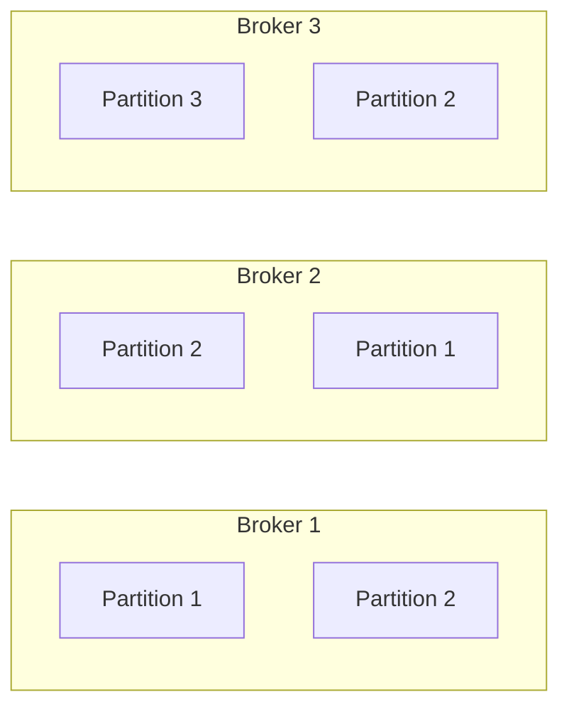
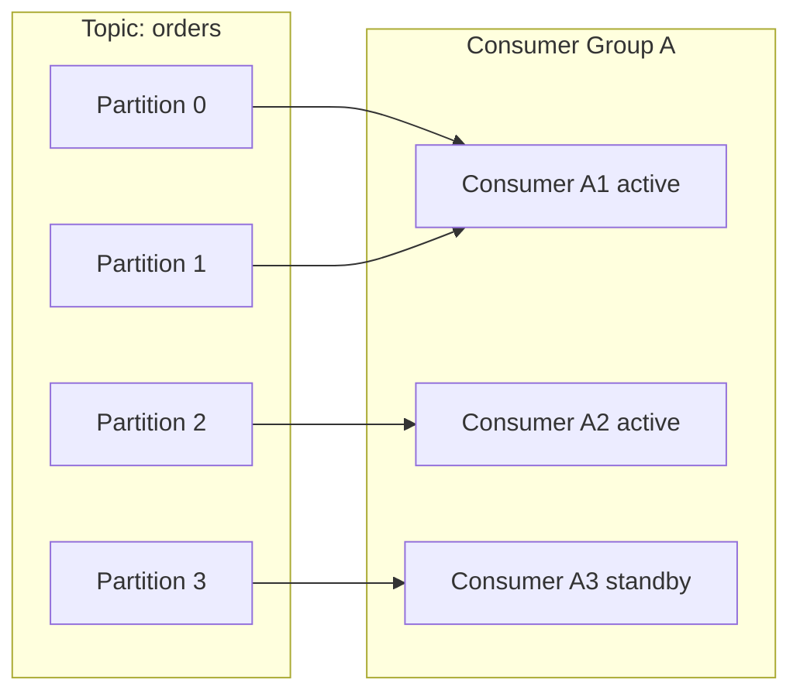

# Apache Kafka для Java

Комплексное руководство по работе с **Apache Kafka** в **Java**-приложениях: **producers**, **consumers**, **streams API**, **Spring Kafka** интеграция, кластерная архитектура, мониторинг и **best practices**.

## Полезные ссылки

### Официальная документация
- [Apache Kafka Documentation](https://kafka.apache.org/documentation/) — официальная документация **Kafka**
- [Kafka Streams Documentation](https://kafka.apache.org/documentation/streams/) — документация **Streams API**
- [Kafka Connect Documentation](https://kafka.apache.org/documentation/connect/) — документация **Connect**

### Java интеграции
- [Spring Kafka](https://docs.spring.io/spring-kafka/reference/html/) — **Spring Boot** интеграция
- [Kafka Java Client](https://kafka.apache.org/documentation/#api) — **Java** клиент **Kafka**
- [Kafka Streams JavaDoc](https://kafka.apache.org/documentation/streams/) — **Streams API**

### Книги и ресурсы
- [Kafka: The Definitive Guide](https://www.confluent.io/resources/kafka-the-definitive-guide/) — классическая книга по **Kafka**
- [Designing Event-Driven Systems](https://www.oreilly.com/library/view/designing-event-driven-systems/9781492038252/) — архитектура **event-driven** систем
- [Kafka Summit](https://kafka-summit.org/) — конференция по **Kafka**

### Мониторинг и инструменты
- [Confluent Control Center](https://docs.confluent.io/platform/current/control-center/index.html) — управление **Kafka** кластером
- [Kafka Manager](https://github.com/yahoo/CMAK) — **Web**-интерфейс для управления
- [Burrow](https://github.com/linkedin/Burrow) — **Consumer lag** мониторинг

### См. также
- [REST API](../../api/rest/rest-api-best-practices.md) — практики проектирования **REST API**
- [gRPC](../../api/grpc/grpc.md) — **gRPC**
- [RabbitMQ](../../../basics/README.md) — **RabbitMQ**
- [Spring Frameworks](../../../basics/README.md) — экосистема **Spring**
- [PostgreSQL](../../../databases/relational/postgresql/postgres-basics.md) — БД для **Kafka**
- [Observability](../../../monitoring/tracing/distributed-tracing.md) — мониторинг и трейсинг
- [Вопросы на собеседовании](../../../interview/messaging/kafka-interview.md) — подготовка к интервью

## Содержание

- [Введение в Apache Kafka](#введение-в-apache-kafka)
  - [Почему Kafka?](#почему-kafka)
  - [Kafka vs традиционный messaging](#kafka-vs-традиционный-messaging)
    - [Традиционные message brokers (RabbitMQ, ActiveMQ):](#традиционные-message-brokers-rabbitmq-activemq)
    - [Kafka архитектура:](#kafka-архитектура)
  - [Когда использовать Kafka?](#когда-использовать-kafka)
    - [Идеально подходит для:](#идеально-подходит-для)
    - [Не подходит для:](#не-подходит-для)
- [Архитектура Kafka](#архитектура-kafka)
  - [Компоненты Kafka кластера](#компоненты-kafka-кластера)
    - [Brokers (Брокеры)](#brokers-брокеры)
    - [Zookeeper](#zookeeper)
    - [Producers (Производители)](#producers-производители)
    - [Consumers (Потребители)](#consumers-потребители)
  - [Topics и Partitions](#topics-и-partitions)
    - [Topics (Топики)](#topics-топики)
    - [Partitions (Партиции)](#partitions-партиции)
  - [Consumer Groups](#consumer-groups)
    - [Consumer Groups (Группы потребителей)](#consumer-groups-группы-потребителей)
- [Основные концепции](#основные-концепции)
  - [Messages (Сообщения)](#messages-сообщения)
    - [Структура сообщения](#структура-сообщения)
    - [Headers (Заголовки)](#headers-заголовки)
    - [Timestamps (Временные метки)](#timestamps-временные-метки)
  - [Retention и Cleanup](#retention-и-cleanup)
    - [Retention policies (Политики хранения)](#retention-policies-политики-хранения)
    - [Log Compaction](#log-compaction)
  - [Delivery Semantics](#delivery-semantics)
    - [At most once (Максимум один раз)](#at-most-once-максимум-один-раз)
    - [At least once (Минимум один раз)](#at-least-once-минимум-один-раз)
    - [Exactly once (Ровно один раз)](#exactly-once-ровно-один-раз)
- [Установка и настройка](#установка-и-настройка)
  - [Single-node установка](#single-node-установка)
    - [Docker Compose](#docker-compose)
    - [Конфигурация брокера](#конфигурация-брокера)
  - [Multi-node кластер](#multi-node-кластер)
    - [Docker Compose для кластера](#docker-compose-для-кластера)
  - [Kubernetes развертывание](#kubernetes-развертывание)
    - [StatefulSet для Kafka](#statefulset-для-kafka)
  - [Тестирование установки](#тестирование-установки)

## Введение в Apache Kafka

**Apache Kafka** — это распределенная платформа для потоковой обработки данных в реальном времени. **Kafka** была разработана **LinkedIn** в `2010` году и стала **open-source** проектом **Apache** в `2011` году. Сегодня **Kafka** является одним из ключевых компонентов современной микросервисной архитектуры и **event-driven** систем.

### Почему Kafka?

**Kafka** решает критические проблемы масштабируемости и надежности в системах обработки больших объемов данных:**

1. **Высокая пропускная способность** — обработка миллионов сообщений в секунду
2. **Горизонтальное масштабирование** — добавление новых брокеров без **downtime**
3. **Устойчивость к сбоям** — репликация и **fault tolerance**
4. **Durability** — сохранение сообщений на диске
5. **Decoupling** — асинхронная коммуникация между сервисами
6. **Event sourcing** — хранение истории всех изменений
7. **Stream processing** — обработка данных в реальном времени
8. **Backpressure handling** — автоматическое управление нагрузкой

### Kafka vs традиционный messaging

#### Традиционные message brokers (RabbitMQ, ActiveMQ):

Ниже — схема традиционного брокера (текст).
```text
# Схема традиционного брокера: одна очередь на producer-consumer
Producer → Queue → Consumer
```

**Ограничения:**
- Очереди не предназначены для больших объемов данных
- Сложность масштабирования очередей
- Ограниченная **persistence**
- Нет **stream processing**
- Проблемы с **backpressure**

#### Kafka архитектура:
```text
# Архитектура Kafka: топики, партиции и группы потребителей
Producers → Topics (Partitions) → Consumers (Consumer Groups)
```

**Преимущества:**
- **Append-only logs** — все сообщения сохраняются
- **Partitioning** — параллельная обработка
- **Consumer groups** — масштабирование **consumer**'ов
- **Retention policies** — управление жизненным циклом данных
- **Stream processing** — **KSQL**, **Kafka Streams**
- **Exactly-once semantics** — гарантии доставки

### Когда использовать Kafka?

#### Идеально подходит для:
- **Event-driven архитектура** — асинхронная коммуникация
- **`Big Data` pipelines** — **ingestion** и **processing** больших данных
- **Log aggregation** — сбор и анализ логов
- **Real-time analytics** — обработка в реальном времени
- **Microservices decoupling** — независимое масштабирование сервисов
- **Event sourcing** — хранение истории состояний
- **CDC (Change Data Capture)** — синхронизация баз данных

#### Не подходит для:
- **Request-response** — использовать **REST**/**gRPC**
- **Транзакции** — **ACID** транзакции лучше в базах данных
- **Файловый storage** — использовать **object storage**
- **Кеширование** — использовать **Redis**/**Memcached**
- **Простые очереди** — **RabbitMQ** для простых случаев

## Архитектура Kafka

### Компоненты Kafka кластера

#### Brokers (Брокеры)
**Брокеры — это серверы **Kafka**, которые хранят данные и обслуживают клиентов:**



#### Zookeeper
**Zookeeper** координирует работу кластера:**
- **Controller election** — выбор лидера кластера
- **Topic management** — управление топиками и партициями
- **Broker registration** — регистрация брокеров
- **Access control** — управление доступом

#### Producers (Производители)
**Клиенты, которые отправляют сообщения в **Kafka**:**

```java
// Простой пример producer'а: отправка одного сообщения в топик user-events
Properties props = new Properties();
props.put("bootstrap.servers", "localhost:9092");
props.put("key.serializer", StringSerializer.class.getName());
props.put("value.serializer", StringSerializer.class.getName());

KafkaProducer<String, String> producer = new KafkaProducer<>(props);

ProducerRecord<String, String> record = new ProducerRecord<>(
    "user-events", "user123", "User logged in");

producer.send(record);
producer.close();
```

#### Consumers (Потребители)
**Клиенты, которые читают сообщения из **Kafka**:**

```java
// Простой пример consumer'а: подписка на топик и чтение сообщений в цикле
Properties props = new Properties();
props.put("bootstrap.servers", "localhost:9092");
props.put("group.id", "user-consumer-group");
props.put("key.deserializer", StringDeserializer.class.getName());
props.put("value.deserializer", StringDeserializer.class.getName());

KafkaConsumer<String, String> consumer = new KafkaConsumer<>(props);
consumer.subscribe(Arrays.asList("user-events"));

while (true) {
    ConsumerRecords<String, String> records = consumer.poll(Duration.ofMillis(100));
    for (ConsumerRecord<String, String> record : records) {
        System.out.println("Received: " + record.value());
    }
}
```

### Topics и Partitions

#### Topics (Топики)
**Topics** представляют собой логическую группировку сообщений в **Kafka**. Это фундаментальная абстракция, которая позволяет организовывать поток данных по категориям или доменам. Каждый топик может содержать миллиарды сообщений и автоматически партиционируется для обеспечения масштабируемости.

**Почему топики важны:**
1. **Логическое разделение** — группировка связанных сообщений
2. **Изоляция данных** — разные команды/сервисы могут владеть своими топиками
3. **Retention policies** — разные политики хранения для разных типов данных
4. **Security** — **granular** контроль доступа на уровне топиков

**Примеры использования топиков:**
- `user-events` — все события, связанные с пользователями (регистрация, логин, обновление профиля)
- `order-events` — события заказов (создание, оплата, доставка)
- `audit-logs` — логи аудита для **compliance**
- `metrics` — метрики приложений для мониторинга

```text
# Пример топика: три партиции с сообщениями по ключу
Topic: user-events
├── Partition 0: [user.registered:1, user.login:2, user.updated:3]
├── Partition 1: [user.login:4, user.registered:5, user.logout:6]
└── Partition 2: [user.updated:7, user.login:8, user.registered:9]
```

#### Partitions (Партиции)
**Partitions** — это единицы параллелизма в **Kafka**, которые позволяют системе обрабатывать огромные объемы данных. Каждая партиция представляет собой упорядоченный, неизменяемый лог сообщений. Партиции распределяются между брокерами кластера и реплицируются для обеспечения отказоустойчивости.

**Характеристики партиций:**
- **Ordered** — сообщения в партиции всегда упорядочены по времени прибытия
- **Immutable** — после записи сообщения нельзя изменить
- **Append-only** — новые сообщения только добавляются в конец
- **Distributed** — партиции распределяются между брокерами кластера
- **Replicated** — каждая партиция имеет несколько копий для отказоустойчивости

**Как работают партиции:**
1. **Сообщение** поступает в партицию по ключу или **round-robin**
2. **Offset** присваивается сообщению (позиция в логе)
3. **Consumer** читает сообщения последовательно по **offset**'ам
4. **Retention** управляет временем жизни сообщений в партиции

**Пример распределения сообщений по партициям:**
```text
# Распределение: каждая партиция — независимый лог с offset'ами
Topic: orders (3 partitions)
Partition 0: offset 0-99 (100 messages)
Partition 1: offset 0-149 (150 messages)
Partition 2: offset 0-79 (80 messages)
```

**Ключевые параметры партиций:**
- `num.partitions` — количество партиций при создании топика (по умолчанию 1)
- `replication.factor` — коэффициент репликации (по умолчанию 1)
- `min.insync.replicas` — минимальное количество синхронизированных реплик
- `unclean.`leader.election`.enable` — разрешить выбор лидера из не-синхронизированных реплик
- **Immutable** — сообщения нельзя изменить
- **Distributed** — партиции распределены по брокерам
- **Replicated** — партиции реплицируются для надежности

**Факторы партиционирования:**
```java
// Варианты партиционирования: round-robin, по ключу, кастомный Partitioner
// Default partitioning (round-robin)
producer.send(new ProducerRecord<>("topic", "value"));

// Key-based partitioning (same key → same partition)
producer.send(new ProducerRecord<>("topic", "key", "value"));

// Custom partitioner
public class CustomPartitioner implements Partitioner {
    @Override
    public int partition(String topic, Object key, byte[] keyBytes,
                        Object value, byte[] valueBytes, Cluster cluster) {
        // Custom partitioning logic
        return Math.abs(key.hashCode()) % cluster.partitionsForTopic(topic).size();
    }
}
```

### Consumer Groups

#### Consumer Groups (Группы потребителей)
**Механизм масштабирования **consumer**'ов:**



**Свойства consumer groups:**
- **Load balancing** — распределение партиций между **consumer**'ами
- **Fault tolerance** — автоматический **rebalancing** при сбоях
- **Scalability** — добавление **consumer**'ов без остановки
- **Independent processing** — группы не влияют друг на друга

## Основные концепции

### Messages (Сообщения)

#### Структура сообщения
```java
// Поля записи: топик, партиция, ключ, значение, заголовки
public class ProducerRecord<K, V> {
    private final String topic;
    private final Integer partition;  // Optional
    private final Long timestamp;     // Optional
    private final K key;             // Optional
    private final V value;           // Required
    private final Iterable<Header> headers;  // Optional
}
```

#### Headers (Заголовки)
**Метаданные сообщения:**

```java
// Добавление заголовков к сообщению (event-type, version, source)
ProducerRecord<String, String> record = new ProducerRecord<>(
    "user-events", "user123", "User registered");

record.headers().add("event-type", "user-registration".getBytes());
record.headers().add("version", "1.0".getBytes());
record.headers().add("source", "web-app".getBytes());
```

#### Timestamps (Временные метки)
**Временные метки в сообщениях:**

```java
// Create time (default) - время создания producer'ом
Properties props = new Properties();
props.put("message.timestamp.type", "CreateTime");

// Log append time - время записи в Kafka
props.put("message.timestamp.type", "LogAppendTime");
```

### Retention и Cleanup

#### Retention policies (Политики хранения)
**Управление жизненным циклом данных:**

```properties
# Time-based retention (default: 7 days)
log.retention.hours=168

# Size-based retention
log.retention.bytes=1073741824  # 1GB

# Compact retention (for changelog topics)
log.cleanup.policy=compact

# Combined retention
log.cleanup.policy=delete,compact
```

#### Log Compaction
**Удаление дубликатов для **changelog** топиков:**

```text
# Compaction: для каждого ключа остаётся только последнее значение
Before compaction:
Key1 → Value1 (offset 0)
Key1 → Value2 (offset 1)
Key1 → Value3 (offset 2)
Key2 → Value4 (offset 3)

After compaction:
Key1 → Value3 (offset 2)  // Latest value
Key2 → Value4 (offset 3)  // Only value
```

### Delivery Semantics

#### At most once (Максимум один раз)
**Сообщение может быть потеряно, но не дублировано:**

```java
// At most once: без подтверждения от брокера, возможна потеря
Properties props = new Properties();
props.put("acks", "0");  // No acknowledgment
props.put("enable.idempotence", false);
```

#### At least once (Минимум один раз)
**Сообщение может быть дублировано, но не потеряно:**

```java
// At least once: подтверждение от лидера, возможны дубликаты
Properties props = new Properties();
props.put("acks", "1");  // Leader acknowledgment
props.put("enable.idempotence", false);
props.put("retries", Integer.MAX_VALUE);
```

#### Exactly once (Ровно один раз)
**Идеальная гарантия доставки:**

```java
// Exactly once: идемпотентность и подтверждение от всех реплик
Properties props = new Properties();
props.put("acks", "all");  // All replicas acknowledgment
props.put("enable.idempotence", true);
props.put("max.in.flight.requests.per.connection", 5);
props.put("retries", Integer.MAX_VALUE);
```

## Установка и настройка

### Single-node установка

**Single-node установка** представляет собой развертывание **Kafka** на одном сервере. Это подходит для разработки, тестирования и небольших **production** сред. В этой конфигурации запускается один брокер **Kafka** и один **Zookeeper**.

#### Docker Compose

**Docker Compose** позволяет определить и запустить **multi-container** приложение. Для **Kafka** это означает одновременный запуск **Zookeeper** и **Kafka** брокера с правильной конфигурацией сети.

```yaml
version: '3.8'
services:
  # Zookeeper - координационный сервис для Kafka кластера
  # Отвечает за:
  # - Выбор контроллера кластера
  # - Управление метаданными топиков и партиций
  # - Регистрацию брокеров
  # - Хранение конфигурации кластера
  zookeeper:
    image: confluentinc/cp-zookeeper:7.4.0
    environment:
      # Порт для клиентских подключений (Kafka брокеры подключаются сюда)
      ZOOKEEPER_CLIENT_PORT: 2181
      # Интервал heartbeat между клиентами и сервером
      ZOOKEEPER_TICK_TIME: 2000
    ports:
      # Открываем порт для внешнего доступа
      - "2181:2181"

  # Kafka брокер - основной компонент для хранения и обработки сообщений
  kafka:
    image: confluentinc/cp-kafka:7.4.0
    depends_on:
      # Гарантируем, что Zookeeper запустится первым
      - zookeeper
    ports:
      # Открываем порт Kafka для внешнего доступа
      - "9092:9092"
    environment:
      # Уникальный ID брокера в кластере (для single-node = 1)
      KAFKA_BROKER_ID: 1
      # Адрес Zookeeper для регистрации и координации
      KAFKA_ZOOKEEPER_CONNECT: zookeeper:2181
      # Карта протоколов безопасности для разных listener'ов
      KAFKA_LISTENER_SECURITY_PROTOCOL_MAP: PLAINTEXT:PLAINTEXT,PLAINTEXT_HOST:PLAINTEXT
      # Список адресов, которые брокер сообщает клиентам
      KAFKA_ADVERTISED_LISTENERS: PLAINTEXT://kafka:9092,PLAINTEXT_HOST://localhost:29092
      # Фактор репликации для внутренних топиков (__consumer_offsets)
      KAFKA_OFFSETS_TOPIC_REPLICATION_FACTOR: 1
      # Минимальное количество ISR для лога транзакций
      KAFKA_TRANSACTION_STATE_LOG_MIN_ISR: 1
      # Фактор репликации для лога транзакций
      KAFKA_TRANSACTION_STATE_LOG_REPLICATION_FACTOR: 1
      # Отключаем авто-создание топиков для production-like поведения
      KAFKA_AUTO_CREATE_TOPICS_ENABLE: 'false'
      # Разрешить удаление топиков
      KAFKA_DELETE_TOPIC_ENABLE: 'true'
```

**Запуск и управление:**
```bash
# Запускаем кластер в фоне
docker-compose up -d

# Проверяем статус контейнеров
docker-compose ps

# Просматриваем логи Kafka
docker-compose logs -f kafka

# Просматриваем логи Zookeeper
docker-compose logs -f zookeeper

# Останавливаем кластер
docker-compose down

# Останавливаем с удалением volumes
docker-compose down -v
```

**Что происходит при запуске:**
1. **Zookeeper** стартует первым и начинает слушать порт `2181`
2. **Kafka брокер** подключается к **Zookeeper** и регистрируется
3. Брокер создает внутренние топики (__consumer_offsets, __transaction_state)
4. Брокер готов принимать подключения от клиентов на порту `9092`

#### Конфигурация брокера

**Файл server.properties** содержит все настройки поведения **Kafka** брокера. Каждая настройка влияет на производительность, надежность и функциональность.

```properties
# === ОСНОВНЫЕ НАСТРОЙКИ СЕРВЕРА ===

# Уникальный идентификатор брокера в кластере
# Должен быть уникальным для каждого брокера (0, 1, 2, ...)
broker.id=1

# Сетевые интерфейсы для прослушивания клиентских подключений
# PLAINTEXT означает отсутствие шифрования (для development)
listeners=PLAINTEXT://:9092

# Адреса, которые брокер сообщает клиентам для подключения
# Важно для Docker и кластерных развертываний
advertised.listeners=PLAINTEXT://localhost:9092

# Адрес Zookeeper для координации кластера
# Zookeeper хранит метаданные о топиках, партициях, брокерах
zookeeper.connect=localhost:2181

# === НАСТРОЙКИ ХРАНЕНИЯ ДАННЫХ ===

# Директории для хранения данных (сообщения, индексы, метаданные)
# Можно указать несколько директорий через запятую для распределения нагрузки
log.dirs=/tmp/kafka-logs

# === НАСТРОЙКИ ТОПИКОВ ПО УМОЛЧАНИЮ ===

# Количество партиций для новых топиков
# Больше партиций = выше параллелизм, но больше overhead
num.partitions=3

# Фактор репликации для новых топиков
# Количество копий сообщений для отказоустойчивости
default.replication.factor=3

# Минимальное количество in-sync реплик
# Гарантирует надежность записи (min.insync.replicas <= replication.factor)
min.insync.replicas=2

# === НАСТРОЙКИ УДАЛЕНИЯ ДАННЫХ ===

# Время хранения сегментов логов в часах (7 дней = 168 часов)
# После этого времени старые сегменты удаляются
log.retention.hours=168

# Максимальный размер сегмента лога в байтах (1GB)
# Когда достигается, создается новый сегмент
log.segment.bytes=1073741824

# === НАСТРОЙКИ ПРОИЗВОДИТЕЛЬНОСТИ ===

# Размер буфера отправки для сетевых операций
# Увеличивает пропускную способность за счет памяти
socket.send.buffer.bytes=102400

# Размер буфера приема для сетевых операций
socket.receive.buffer.bytes=102400

# Максимальный размер запроса в байтах
# Ограничивает размер батчей от производителей
socket.request.max.bytes=104857600

# === ДОПОЛНИТЕЛЬНЫЕ НАСТРОЙКИ ===

# Включение авто-создания топиков
# В production обычно отключено для контроля
auto.create.topics.enable=false

# Разрешение удаления топиков
delete.topic.enable=true

# Максимальный размер сообщения в байтах
message.max.bytes=1000000

# Уровень логирования
log4j.logger.kafka=INFO
```

**Ключевые параметры производительности:**

**Для высокой пропускной способности:**
```properties
# Увеличиваем размер батчей для производителей
batch.size=65536
linger.ms=5

# Увеличиваем буферы
socket.send.buffer.bytes=1048576
socket.receive.buffer.bytes=1048576

# Оптимизируем для throughput
num.replica.fetchers=2
replica.fetch.max.bytes=1048576
```

**Для низкой латентности:**
```properties
# Уменьшаем задержки
linger.ms=0
batch.size=16384

# Увеличиваем количество потоков
num.network.threads=8
num.io.threads=16
```

### Multi-node кластер

**Multi-node кластер** обеспечивает высокую доступность и масштабируемость. Рекомендуется минимум 3 брокера для отказоустойчивости.

#### Docker Compose для кластера
```yaml
version: '3.8'
services:
  zookeeper:
    image: confluentinc/cp-zookeeper:7.4.0
    environment:
      ZOOKEEPER_CLIENT_PORT: 2181
      ZOOKEEPER_TICK_TIME: 2000

  kafka1:
    image: confluentinc/cp-kafka:7.4.0
    depends_on:
      - zookeeper
    environment:
      KAFKA_BROKER_ID: 1
      KAFKA_ZOOKEEPER_CONNECT: zookeeper:2181
      KAFKA_ADVERTISED_LISTENERS: PLAINTEXT://kafka1:9092
      KAFKA_OFFSETS_TOPIC_REPLICATION_FACTOR: 3

  kafka2:
    image: confluentinc/cp-kafka:7.4.0
    depends_on:
      - zookeeper
    environment:
      KAFKA_BROKER_ID: 2
      KAFKA_ZOOKEEPER_CONNECT: zookeeper:2181
      KAFKA_ADVERTISED_LISTENERS: PLAINTEXT://kafka2:9092
      KAFKA_OFFSETS_TOPIC_REPLICATION_FACTOR: 3

  kafka3:
    image: confluentinc/cp-kafka:7.4.0
    depends_on:
      - zookeeper
    environment:
      KAFKA_BROKER_ID: 3
      KAFKA_ZOOKEEPER_CONNECT: zookeeper:2181
      KAFKA_ADVERTISED_LISTENERS: PLAINTEXT://kafka3:9092
      KAFKA_OFFSETS_TOPIC_REPLICATION_FACTOR: 3
```

**Масштабирование кластера:**
```bash
# Добавляем нового брокера
docker-compose up -d --scale kafka=4

# Проверяем состояние кластера
docker exec kafka1 kafka-broker-api-versions --bootstrap-server kafka1:9092

# Просматриваем топики и их распределение
docker exec kafka1 kafka-topics --describe --bootstrap-server kafka1:9092
```

### Kubernetes развертывание

**Kubernetes** предоставляет оркестрацию для **production** развертываний **Kafka**.

#### StatefulSet для Kafka
```yaml
apiVersion: apps/v1
kind: StatefulSet
metadata:
  name: kafka
spec:
  serviceName: kafka
  replicas: 3
  selector:
    matchLabels:
      app: kafka
  template:
    metadata:
      labels:
        app: kafka
    spec:
      containers:
      - name: kafka
        image: confluentinc/cp-kafka:7.4.0
        ports:
        - containerPort: 9092
        env:
        - name: KAFKA_BROKER_ID
          valueFrom:
            fieldRef:
              fieldPath: metadata.name
        - name: KAFKA_ZOOKEEPER_CONNECT
          value: "zookeeper:2181"
        - name: KAFKA_ADVERTISED_LISTENERS
          value: "PLAINTEXT://$(KAFKA_BROKER_ID).kafka:9092"
        volumeMounts:
        - name: kafka-data
          mountPath: /var/lib/kafka/data
  volumeClaimTemplates:
  - metadata:
      name: kafka-data
    spec:
      accessModes: ["ReadWriteOnce"]
      resources:
        requests:
          storage: 100Gi
```

### Тестирование установки

**После установки необходимо протестировать функциональность:**

```bash
# Создаем тестовый топик
kafka-topics --create \
  --topic test-topic \
  --bootstrap-server localhost:9092 \
  --partitions 3 \
  --replication-factor 1

# Проверяем создание топика
kafka-topics --list --bootstrap-server localhost:9092

# Отправляем тестовые сообщения
echo "Message 1" | kafka-console-producer --topic test-topic --bootstrap-server localhost:9092
echo "Message 2" | kafka-console-producer --topic test-topic --bootstrap-server localhost:9092

# Читаем сообщения
kafka-console-consumer \
  --topic test-topic \
  --from-beginning \
  --bootstrap-server localhost:9092

# Проверяем состояние кластера
kafka-cluster cluster-id --bootstrap-server localhost:9092

# Мониторим потребительские группы
kafka-consumer-groups --list --bootstrap-server localhost:9092
```

**Ожидаемые результаты тестирования:**
- Топик успешно создан с указанными партициями
- Сообщения успешно отправлены и прочитаны
- **Cluster** `ID` возвращается без ошибок
- Все брокеры доступны и функционируют
**socket.`request.max`.bytes**=104857600
```text

### Multi-node кластер

#### 3-node кластер
```
version: '3.8'
services:
  zookeeper:
    image: confluentinc/`cp-zookeeper`:7.4.0
    environment:
      ZOOKEEPER_CLIENT_PORT: `2181`

  kafka1:
    image: confluentinc/`cp-kafka`:7.4.0
    environment:
      KAFKA_BROKER_ID: 1
      KAFKA_ZOOKEEPER_CONNECT: zookeeper:2181
      KAFKA_ADVERTISED_LISTENERS: `PLAINTEXT`://kafka1:9092

  kafka2:
    image: confluentinc/`cp-kafka`:7.4.0
    environment:
      KAFKA_BROKER_ID: 2
      KAFKA_ZOOKEEPER_CONNECT: zookeeper:2181
      KAFKA_ADVERTISED_LISTENERS: `PLAINTEXT`://kafka2:9092

  kafka3:
    image: confluentinc/`cp-kafka`:7.4.0
    environment:
      KAFKA_BROKER_ID: 3
      KAFKA_ZOOKEEPER_CONNECT: zookeeper:2181
      KAFKA_ADVERTISED_LISTENERS: `PLAINTEXT`://kafka3:9092
```text

### KRaft mode (Kafka без Zookeeper)

#### KRaft конфигурация
```
# `Enable KRaft mode`
`process.roles`=broker,controller
`node.id`=1
`controller.quorum.voters`=1`@localhost`:9093,2`@localhost`:9094,3`@localhost`:9095
`controller.listener.names`=`CONTROLLER`
listeners=`PLAINTEXT`://localhost:9092,`CONTROLLER`://:9093
`advertised.listeners`=`PLAINTEXT`://localhost:9092
`listener.`security.protocol`.map`=`CONTROLLER`:`PLAINTEXT`,`PLAINTEXT`:`PLAINTEXT`
`inter.`broker.listener`.name`=`PLAINTEXT`
```text

## Kafka Java Producer

### Basic Producer

#### Конфигурация producer'а

Производитель (Producer) в Kafka отвечает за отправку сообщений в топики. Конфигурация producer'а определяет надежность доставки, производительность и поведение при ошибках. Давайте разберем основные настройки по категориям:

1. Обязательные настройки подключения:

```
`@Configuration`
public class `KafkaProducerConfig` {

    `@Bean`
    public `ProducerFactory`<`String`, `String`> `producerFactory()` {
        Map<`String`, `Object`> `configProps` = new `HashMap`<>();

        // ======= ОБЯЗАТЕЛЬНЫЕ НАСТРОЙКИ ПОДКЛЮЧЕНИЯ =======

        // Список брокеров `Kafka` кластера для начального подключения
        // Формат: host1:port1,host2:port2,...
        // `Producer` использует эту информацию для обнаружения всех брокеров кластера
        `configProps`.put(`ProducerConfig`.BOOTSTRAP_SERVERS_CONFIG, "localhost:9092,kafka2:9092,kafka3:9092");

        // ======= СЕРИАЛИЗАЦИЯ =======

        // Класс для сериализации ключей сообщений
        // Должен реализовывать интерфейс `Serializer`<T>
        // `StringSerializer` преобразует `String` в байты используя `UTF-8`
        `configProps`.put(`ProducerConfig`.KEY_SERIALIZER_CLASS_CONFIG, `StringSerializer`.class);

        // Класс для сериализации значений сообщений
        // Для `JSON` часто используется `StringSerializer` или `JsonSerializer`
        `configProps`.put(`ProducerConfig`.VALUE_SERIALIZER_CLASS_CONFIG, `StringSerializer`.class);

        // ======= НАДЕЖНОСТЬ ДОСТАВКИ =======

        // Уровень подтверждения записи (acks)
        // "0" — нет подтверждения (быстрее, но может потерять данные)
        // "1" — подтверждение от лидера партиции
        // "all" — подтверждение от всех синхронизированных реплик (максимальная надежность)
        `configProps`.put(`ProducerConfig`.ACKS_CONFIG, "all");

        // Количество повторных попыток при ошибках отправки
        // Увеличивает надежность, но может вызвать дубликаты сообщений
        `configProps`.put(`ProducerConfig`.RETRIES_CONFIG, 3);

        // Максимальное время между повторными попытками в миллисекундах
        `configProps`.put(`ProducerConfig`.RETRY_BACKOFF_MS_CONFIG, `100`);

        // Включение идемпотентности producer'а
        // Гарантирует `exactly-once` доставку в рамках одной сессии
        // Требует acks=all и `min.insync.replicas` >= 2
        `configProps`.put(`ProducerConfig`.ENABLE_IDEMPOTENCE_CONFIG, `true`);

        // ======= ПРОИЗВОДИТЕЛЬНОСТЬ =======

        // Размер батча в байтах для накопления сообщений перед отправкой
        // Большие батчи повышают пропускную способность, но увеличивают latency
        // По умолчанию: `16384` (16KB)
        `configProps`.put(`ProducerConfig`.BATCH_SIZE_CONFIG, `16384`);

        // Время ожидания накопления батча в миллисекундах
        // 0 — отправка немедленно, >0 — ожидание для формирования батча
        `configProps`.put(`ProducerConfig`.LINGER_MS_CONFIG, 5);

        // Общий размер буфера в памяти для неотправленных сообщений
        // При превышении producer блокируется или выбрасывает исключение
        `configProps`.put(`ProducerConfig`.BUFFER_MEMORY_CONFIG, `33554432`); // 32MB

        // Максимальный размер одного сообщения в байтах
        // Включает ключ и значение, не превышает лимит брокера
        `configProps`.put(`ProducerConfig`.MAX_REQUEST_SIZE_CONFIG, `1048576`); // 1MB

        // Таймаут для отправки запроса в миллисекундах
        `configProps`.put(`ProducerConfig`.REQUEST_TIMEOUT_MS_CONFIG, `30000`);

        // ======= ДОПОЛНИТЕЛЬНЫЕ НАСТРОЙКИ =======

        // Сжатие сообщений для экономии bandwidth
        // "none", "gzip", "snappy", "lz4", "zstd"
        // `Snappy` рекомендуется для большинства случаев
        `configProps`.put(`ProducerConfig`.COMPRESSION_TYPE_CONFIG, "snappy");

        // Максимальное количество неотправленных запросов
        // При превышении send() блокируется
        `configProps`.put(`ProducerConfig`.MAX_IN_FLIGHT_REQUESTS_PER_CONNECTION, 5);

        // Включение транзакций для atomic writes
        `configProps`.put(`ProducerConfig`.TRANSACTIONAL_ID_CONFIG, "`my-producer-tx`");

        return new `DefaultKafkaProducerFactory`<>(`configProps`);
    }

    `@Bean`
    public `KafkaTemplate`<`String`, `String`> `kafkaTemplate()` {
        return new `KafkaTemplate`<>(`producerFactory()`);
    }
}
```text

Подробное объяснение ключевых параметров:

BOOTSTRAP_SERVERS_CONFIG:
- Это начальная точка подключения к кластеру Kafka
- Producer использует эту информацию для получения метаданных о всех брокерах
- Рекомендуется указывать несколько брокеров через запятую для отказоустойчивости
- Пример: `"kafka1:9092,kafka2:9092,kafka3:9092"`

ACKS_CONFIG:
- "0" - Producer не ждет подтверждения. Максимальная скорость, но возможна потеря данных при сбое брокера
- "1" - Producer ждет подтверждения от лидера партиции. Баланс между скоростью и надежностью
- "all" - Producer ждет подтверждения от всех синхронизированных реплик. Максимальная надежность, но ниже скорость

BATCH_SIZE_CONFIG и LINGER_MS_CONFIG:
- Вместе контролируют, когда сообщения отправляются брокеру
- batch.size - максимальный размер батча перед отправкой
- linger.ms - максимальное время ожидания заполнения батча
- Увеличение этих параметров повышает пропускную способность, но увеличивает latency

ENABLE_IDEMPOTENCE_CONFIG:
- Гарантирует, что каждое сообщение будет записано ровно один раз
- Автоматически устанавливает acks="all" и max.in.flight.requests.per.connection=5
- Требует min.insync.replicas >= 2 на уровне топика

COMPRESSION_TYPE_CONFIG:
- Сжатие уменьшает сетевой трафик и дисковое пространство
- gzip - лучшее сжатие, но медленнее
- snappy - баланс между скоростью и сжатием (рекомендуется)
- lz4 - быстрая компрессия
- zstd - новое, хорошее сжатие с низким CPU overhead

TRANSACTIONAL_ID_CONFIG:
- Включает транзакционную отправку сообщений
- Позволяет atomic writes в несколько топиков
- Требует enable.idempotence=true

#### Синхронная отправка
```
// Синхронная отправка через KafkaTemplate.send().get() с ожиданием результата
`@Service`
public class `SyncProducerService` {

    private final `KafkaTemplate`<`String`, `String`> `kafkaTemplate`;

    public `SyncProducerService`(`KafkaTemplate`<`String`, `String`> `kafkaTemplate`) {
        this.`kafkaTemplate` = `kafkaTemplate`;
    }

    public void `sendMessage`(`String topic`, `String key`, `String message`) {
        try {
            `SendResult`<`String`, `String`> result = `kafkaTemplate`.send(topic, key, message).get();
            `RecordMetadata` metadata = result.`getRecordMetadata()`;

            `System`.`out.println`("`Message sent successfully`:");
            `System`.`out.println`("`Topic`: " + `metadata.topic`());
            `System`.`out.println`("`Partition`: " + `metadata.partition`());
            `System`.`out.println`("`Offset`: " + `metadata.offset`());
            `System`.`out.println`("`Timestamp`: " + `metadata.timestamp`());

        } catch (`InterruptedException` | `ExecutionException` e) {
            `System`.`err.println`("`Failed to send message`: " + e.`getMessage()`);
            `Thread`.`currentThread()`.interrupt();
        }
    }
}
```text

#### Асинхронная отправка
```
// Асинхронная отправка через CompletableFuture без блокировки потока
`@Service`
public class `AsyncProducerService` {

    private final `KafkaTemplate`<`String`, `String`> `kafkaTemplate`;

    public `AsyncProducerService`(`KafkaTemplate`<`String`, `String`> `kafkaTemplate`) {
        this.`kafkaTemplate` = `kafkaTemplate`;
    }

    public `CompletableFuture`<`SendResult`<`String`, `String`>> `sendMessageAsync`(
            `String topic`, `String key`, `String message`) {

        `ProducerRecord`<`String`, `String`> record = new `ProducerRecord`<>(topic, key, message);

        // `Add headers`
        `record.headers`().add("source", "`user-service`".`getBytes()`);
        `record.headers`().add("version", "1.0".`getBytes()`);

        return `kafkaTemplate`.send(record)
            .`whenComplete`((result, exception) -> {
                if (exception == `null`) {
                    `RecordMetadata` metadata = result.`getRecordMetadata()`;
                    `System`.`out.println`("`Message sent`: " + metadata);
                } else {
                    `System`.`err.println`("`Failed to send message`: " + exception.`getMessage()`);
                }
            });
    }

    public void `sendMessageWithCallback`(`String topic`, `String key`, `String message`) {
        `kafkaTemplate`.send(topic, key, message)
            .`addCallback`(
                result -> {
                    `RecordMetadata` metadata = result.`getRecordMetadata()`;
                    `System`.`out.println`("`Success`: " + metadata);
                },
                exception -> {
                    `System`.`err.println`("`Failed`: " + exception.`getMessage()`);
                }
            );
    }
}
```text

### Advanced Producer Features

#### Custom Serializer
```
// Кастомный сериализатор: DTO UserEvent и UserEventSerializer в JSON для Kafka
public class `UserEvent` {
    private `String userId`;
    private `String eventType`;
    private Map<`String`, `Object`> data;
    private `Instant timestamp`;

    // `Constructors`, getters, setters
}

public class `UserEventSerializer` implements `Serializer`<`UserEvent`> {

    private final `ObjectMapper objectMapper` = new `ObjectMapper()`;

    `@Override`
    public void configure(Map<`String`, ?> configs, boolean `isKey`) {
        // `Configuration`
    }

    `@Override`
    public byte[] serialize(`String topic`, `UserEvent` data) {
        try {
            return `objectMapper`.`writeValueAsBytes`(data);
        } catch (`JsonProcessingException` e) {
            throw new `SerializationException`("`Failed to serialize UserEvent`", e);
        }
    }

    `@Override`
    public void close() {
        // `Cleanup`
    }
}

`@Configuration`
public class `CustomSerializerConfig` {

    `@Bean`
    public `ProducerFactory`<`String`, `UserEvent`> `userEventProducerFactory()` {
        Map<`String`, `Object`> `configProps` = new `HashMap`<>();
        `configProps`.put(`ProducerConfig`.BOOTSTRAP_SERVERS_CONFIG, "localhost:9092");
        `configProps`.put(`ProducerConfig`.KEY_SERIALIZER_CLASS_CONFIG, `StringSerializer`.class);
        `configProps`.put(`ProducerConfig`.VALUE_SERIALIZER_CLASS_CONFIG, `UserEventSerializer`.class);

        return new `DefaultKafkaProducerFactory`<>(`configProps`);
    }

    `@Bean`
    public `KafkaTemplate`<`String`, `UserEvent`> `userEventKafkaTemplate()` {
        return new `KafkaTemplate`<>(`userEventProducerFactory()`);
    }
}
```text

#### Partitioning стратегии
```
`@Service`
public class `PartitionedProducerService` {

    private final `KafkaTemplate`<`String`, `String`> `kafkaTemplate`;

    public `PartitionedProducerService`(`KafkaTemplate`<`String`, `String`> `kafkaTemplate`) {
        this.`kafkaTemplate` = `kafkaTemplate`;
    }

    // `Round-robin` partitioning (no key)
    public void `sendRoundRobin`(`String topic`, `String message`) {
        `kafkaTemplate`.send(topic, message);
    }

    // `Key-based` partitioning
    public void `sendWithKey`(`String topic`, `String key`, `String message`) {
        `kafkaTemplate`.send(topic, key, message);
    }

    // `Explicit partition`
    public void `sendToPartition`(`String topic`, int partition, `String key`, `String message`) {
        `kafkaTemplate`.send(topic, partition, key, message);
    }

    // `Custom partitioner`
    public void `sendWithCustomPartitioner`(`String topic`, `String message`) {
        // `Uses custom partitioner configured` in `ProducerFactory`
        `kafkaTemplate`.send(topic, message);
    }
}

public class `UserIdPartitioner` implements `Partitioner` {

    `@Override`
    public int partition(`String topic`, `Object key`, byte[] `keyBytes`,
                        `Object value`, byte[] `valueBytes`, `Cluster cluster`) {

        if (key == `null`) {
            // `Round-robin` for `null` keys
            return new `Random()`.`nextInt`(cluster.`partitionsForTopic`(topic).size());
        }

        // `Hash-based` partitioning for user IDs
        int `numPartitions` = cluster.`partitionsForTopic`(topic).size();
        return `Math`.abs(key.`hashCode()`) % `numPartitions`;
    }

    `@Override`
    public void close() {}

    `@Override`
    public void configure(Map<`String`, ?> configs) {}
}
```text

#### Transactional Producer
```
`@Configuration`
public class `TransactionalProducerConfig` {

    `@Bean`
    public `ProducerFactory`<`String`, `String`> `transactionalProducerFactory()` {
        Map<`String`, `Object`> `configProps` = new `HashMap`<>();
        `configProps`.put(`ProducerConfig`.BOOTSTRAP_SERVERS_CONFIG, "localhost:9092");
        `configProps`.put(`ProducerConfig`.KEY_SERIALIZER_CLASS_CONFIG, `StringSerializer`.class);
        `configProps`.put(`ProducerConfig`.VALUE_SERIALIZER_CLASS_CONFIG, `StringSerializer`.class);

        // `Transaction settings`
        `configProps`.put(`ProducerConfig`.TRANSACTIONAL_ID_CONFIG, "`user-service-producer`");
        `configProps`.put(`ProducerConfig`.ENABLE_IDEMPOTENCE_CONFIG, `true`);
        `configProps`.put(`ProducerConfig`.ACKS_CONFIG, "all");

        `DefaultKafkaProducerFactory`<`String`, `String`> `factory` =
            new `DefaultKafkaProducerFactory`<>(`configProps`);
        `factory`.`setTransactionIdPrefix`("`user-service`-");

        return `factory`;
    }

    `@Bean`
    public `KafkaTemplate`<`String`, `String`> `transactionalKafkaTemplate()` {
        return new `KafkaTemplate`<>(`transactionalProducerFactory()`);
    }
}

`@Service`
`@Transactional`
public class `TransactionalProducerService` {

    private final `KafkaTemplate`<`String`, `String`> `kafkaTemplate`;

    public `TransactionalProducerService`(`KafkaTemplate`<`String`, `String`> `kafkaTemplate`) {
        this.`kafkaTemplate` = `kafkaTemplate`;
    }

    public void `sendUserEventsInTransaction`(`String userId`) {
        // `All sends in this` method are part of the same transaction
        `kafkaTemplate`.send("`user-events`", `userId`, "`User created`: " + `userId`);
        `kafkaTemplate`.send("`user-events`", `userId`, "`Profile created`: " + `userId`);
        `kafkaTemplate`.send("`user-events`", `userId`, "`Preferences initialized`: " + `userId`);

        // `If any send fails`, all will be rolled back
        // `If method throws exception`, transaction rolls back
    }
}
```text

## Kafka Java Consumer

### Basic Consumer

#### Consumer конфигурация

Потребитель (Consumer) в Kafka отвечает за чтение и обработку сообщений из топиков. Consumer'ы могут работать как индивидуально, так и в группах для распределения нагрузки. Конфигурация определяет поведение при подключении, обработке ошибок и управлении offset'ами.

1. Обязательные настройки подключения:

```
`@Configuration`
public class `KafkaConsumerConfig` {

    `@Bean`
    public `ConsumerFactory`<`String`, `String`> `consumerFactory()` {
        Map<`String`, `Object`> `configProps` = new `HashMap`<>();

        // ======= ОБЯЗАТЕЛЬНЫЕ НАСТРОЙКИ ПОДКЛЮЧЕНИЯ =======

        // Список брокеров `Kafka` кластера
        // Аналогично producer'у, используется для обнаружения кластера
        `configProps`.put(`ConsumerConfig`.BOOTSTRAP_SERVERS_CONFIG, "localhost:9092,kafka2:9092,kafka3:9092");

        // ======= ГРУППЫ ПОТРЕБИТЕЛЕЙ =======

        // Идентификатор группы потребителей
        // Потребители с одинаковым `group.id` делят партиции топика
        // Каждый партиция присваивается только одному consumer'у в группе
        `configProps`.put(`ConsumerConfig`.GROUP_ID_CONFIG, "`user-service-group`");

        // ======= ДЕСЕРИАЛИЗАЦИЯ =======

        // Класс для десериализации ключей сообщений
        // Должен соответствовать serializer'у producer'а
        `configProps`.put(`ConsumerConfig`.KEY_DESERIALIZER_CLASS_CONFIG, `StringDeserializer`.class);

        // Класс для десериализации значений сообщений
        `configProps`.put(`ConsumerConfig`.VALUE_DESERIALIZER_CLASS_CONFIG, `StringDeserializer`.class);

        // ======= УПРАВЛЕНИЕ `OFFSET`'АМИ =======

        // Стратегия сброса offset'а при первом подключении
        // "earliest" — чтение с самого начала топика
        // "latest" — чтение только новых сообщений
        // "none" — ошибка, если нет сохраненного offset'а
        `configProps`.put(`ConsumerConfig`.AUTO_OFFSET_RESET_CONFIG, "earliest");

        // Автоматическое подтверждение offset'ов
        // `false` - ручное управление (рекомендуется для надежности)
        // `true` - автоматическое подтверждение после poll()
        `configProps`.put(`ConsumerConfig`.ENABLE_AUTO_COMMIT_CONFIG, `false`);

        // Интервал автоматического подтверждения в миллисекундах (если включено)
        `configProps`.put(`ConsumerConfig`.AUTO_COMMIT_INTERVAL_MS_CONFIG, `5000`);

        // ======= ПРОИЗВОДИТЕЛЬНОСТЬ =======

        // Максимальное количество сообщений в одном poll() запросе
        // Увеличение повышает пропускную способность, но увеличивает latency обработки
        `configProps`.put(`ConsumerConfig`.MAX_POLL_RECORDS_CONFIG, `100`);

        // Максимальное время ожидания сообщений в poll() в миллисекундах
        // 0 — немедленный возврат, >0 — ожидание новых сообщений
        `configProps`.put(`ConsumerConfig`.MAX_POLL_INTERVAL_MS_CONFIG, `300000`); // 5 минут

        // Таймаут для подключения к брокеру
        `configProps`.put(`ConsumerConfig`.REQUEST_TIMEOUT_MS_CONFIG, `40000`);

        // ======= `HEARTBEAT` И КООРДИНАЦИЯ =======

        // Интервал отправки heartbeat брокеру в миллисекундах
        // Показывает, что consumer жив и работает
        `configProps`.put(`ConsumerConfig`.HEARTBEAT_INTERVAL_MS_CONFIG, `3000`);

        // Максимальное время ожидания heartbeat от consumer'а
        // При превышении consumer считается мертвым и партиции перераспределяются
        `configProps`.put(`ConsumerConfig`.SESSION_TIMEOUT_MS_CONFIG, `30000`);

        // ======= ДОПОЛНИТЕЛЬНЫЕ НАСТРОЙКИ =======

        // Размер буфера для fetch запросов
        `configProps`.put(`ConsumerConfig`.FETCH_MIN_BYTES_CONFIG, `1024`);

        // Максимальный размер fetch ответа
        `configProps`.put(`ConsumerConfig`.FETCH_MAX_BYTES_CONFIG, `52428800`); // 50MB

        // Максимальный размер одного сообщения
        `configProps`.put(`ConsumerConfig`.MAX_PARTITION_FETCH_BYTES_CONFIG, `1048576`); // 1MB

        // `Client ID` для идентификации consumer'а в логах
        `configProps`.put(`ConsumerConfig`.CLIENT_ID_CONFIG, "`user-`service-consumer`-1`");

        // Включение чтения сжатых сообщений
        `configProps`.put(`ConsumerConfig`.ENABLE_AUTO_COMMIT_CONFIG, `false`);

        return new `DefaultKafkaConsumerFactory`<>(`configProps`);
    }

    `@Bean`
    public `ConcurrentKafkaListenerContainerFactory`<`String`, `String`> `kafkaListenerContainerFactory()` {
        `ConcurrentKafkaListenerContainerFactory`<`String`, `String`> `factory` =
            new `ConcurrentKafkaListenerContainerFactory`<>();
        `factory`.`setConsumerFactory`(`consumerFactory()`);

        // ======= `ACKNOWLEDGMENT` РЕЖИМЫ =======

        // MANUAL_IMMEDIATE — немедленное подтверждение после обработки
        // `MANUAL` - подтверждение в конце транзакции
        // `BATCH` - подтверждение батча сообщений
        // `RECORD` - подтверждение каждого сообщения
        `factory`.`getContainerProperties()`.`setAckMode`(`ContainerProperties`.`AckMode`.MANUAL_IMMEDIATE);

        // Количество потоков для обработки сообщений
        `factory`.`setConcurrency`(3);

        return `factory`;
    }
}
```text

Подробное объяснение ключевых параметров:

GROUP_ID_CONFIG:
- Определяет группу потребителей для совместного чтения топика
- Consumer Group позволяет масштабировать обработку путем добавления consumer'ов
- Каждый партиция присваивается только одному consumer'у в группе
- Consumer'ы из разных групп читают топик независимо

AUTO_OFFSET_RESET_CONFIG:
- "earliest" - начать чтение с самого старого доступного сообщения
- "latest" - начать чтение только новых сообщений после старта consumer'а
- "none" - выбросить исключение, если нет сохраненного offset'а
- Используется только при первом подключении или отсутствии offset'а

ENABLE_AUTO_COMMIT_CONFIG:
- true - Kafka автоматически подтверждает offset'ы через интервал auto.commit.interval.ms
- false - разработчик сам управляет подтверждениями через acknowledgment.acknowledge()
- Рекомендация: false для critical business logic, чтобы избежать потери данных

MAX_POLL_RECORDS_CONFIG:
- Контролирует размер батча сообщений в одном poll() вызове
- Маленькое значение - низкая latency, но низкая пропускная способность
- Большое значение - высокая пропускная способность, но может вызвать OOM при пиковых нагрузках
- Рекомендация: 100-500 для большинства приложений

SESSION_TIMEOUT_MS_CONFIG и HEARTBEAT_INTERVAL_MS_CONFIG:
- session.timeout.ms - время, через которое consumer считается мертвым
- heartbeat.interval.ms - частота отправки heartbeat'ов
- Правило: heartbeat.interval.ms < session.timeout.ms < max.poll.interval.ms
- Нарушение heartbeat приводит к rebalance группы

AckMode в Spring Kafka:
- RECORD - подтверждение каждого сообщения (низкая производительность)
- BATCH - подтверждение после обработки всего батча
- MANUAL - явное подтверждение через Acknowledgment
- MANUAL_IMMEDIATE - немедленное подтверждение без ожидания транзакции

Конфигурация для высокой производительности:
```
// High-throughput consumer
configProps.put(ConsumerConfig.MAX_POLL_RECORDS_CONFIG, 1000);
configProps.put(ConsumerConfig.FETCH_MIN_BYTES_CONFIG, 1024 * 1024); // 1MB
configProps.put(ConsumerConfig.FETCH_MAX_BYTES_CONFIG, 50 * 1024 * 1024); // 50MB
configProps.put(ConsumerConfig.MAX_PARTITION_FETCH_BYTES_CONFIG, 2 * 1024 * 1024); // 2MB
```text

Конфигурация для низкой latency:
```
// `Low-latency` consumer
`configProps`.put(`ConsumerConfig`.MAX_POLL_RECORDS_CONFIG, 10);
`configProps`.put(`ConsumerConfig`.FETCH_MIN_BYTES_CONFIG, 1);
`configProps`.put(`ConsumerConfig`.FETCH_MAX_WAIT_MS_CONFIG, `100`);
```text

#### Message Listener
```
`@Service`
public class `UserEventConsumer` {

    private static final `Logger logger` = `LoggerFactory`.`getLogger`(`UserEventConsumer`.class);

    ``@KafkaListener`(topics = "`user-events`", `groupId` = "`user-service-group`")`
    public void `handleUserEvent`(`ConsumerRecord`<`String`, `String`> record,
                               `Acknowledgment acknowledgment`) {

        try {
            `String key` = `record.key`();
            `String value` = `record.value`();
            long offset = `record.offset`();
            int partition = `record.partition`();

            `logger.info`("`Received user event`: key={}, value={}, partition={}, offset={}",
                       key, value, partition, offset);

            // `Process the event`
            `processUserEvent`(key, value);

            // `Manual acknowledgment`
            `acknowledgment.acknowledge`();

        } catch (`Exception e`) {
            `logger.error`("`Failed to process user` event: " + record, e);
            // Don't acknowledge — message will be retried
            throw e;
        }
    }

    private void `processUserEvent`(`String userId`, `String event`) {
        // `Business logic here`
        `logger.info`("`Processing event for user` {}: {}", `userId`, event);
    }
}
```text

#### Batch Consumer
```
`@Service`
public class `BatchUserEventConsumer` {

    `@KafkaListener`(topics = "`user-events`", `groupId` = "`batch-processor-group`",
                   `containerFactory` = "`batchKafkaListenerContainerFactory`")
    public void `handleBatchUserEvents`(`List`<`ConsumerRecord`<`String`, `String`>> records,
                                     `Acknowledgment acknowledgment`) {

        `logger.info`("`Received batch of` {} user events", `records.size`());

        // `Process records in batch`
        Map<`String`, `List`<`String`>> `eventsByUser` = `records.stream`()
            .collect(`Collectors`.`groupingBy`(
                `ConsumerRecord::key`,
                `Collectors`.mapping(`ConsumerRecord::value`, `Collectors`.`toList()`)
            ));

        try {
            for (Map.`Entry`<`String`, `List`<`String`>> entry : `eventsByUser`.`entrySet()`) {
                `String userId` = entry.`getKey()`;
                `List`<`String`> `userEvents` = entry.`getValue()`;

                `processUserEventsBatch`(`userId`, `userEvents`);
            }

            `acknowledgment.acknowledge`();

        } catch (`Exception e`) {
            `logger.error`("`Failed to process batch` of user events", e);
            throw e;
        }
    }

    private void `processUserEventsBatch`(`String userId`, `List`<`String`> events) {
        // `Batch processing logic`
        `logger.info`("`Processing` {} events for user {}", `events.size`(), `userId`);
    }
}

`@Configuration`
public class `BatchConsumerConfig` {

    `@Bean`
    public `ConcurrentKafkaListenerContainerFactory`<`String`, `String`> `batchKafkaListenerContainerFactory()` {
        `ConcurrentKafkaListenerContainerFactory`<`String`, `String`> `factory` =
            new `ConcurrentKafkaListenerContainerFactory`<>();
        `factory`.`setConsumerFactory`(`consumerFactory()`);

        // `Batch settings`
        `factory`.`setBatchListener`(`true`);
        `factory`.`getContainerProperties()`.`setAckMode`(`ContainerProperties`.`AckMode`.MANUAL_IMMEDIATE);

        return `factory`;
    }
}
```text

### Consumer Groups и Rebalancing

#### Multiple Consumer Groups
```
`@Service`
public class `UserEventConsumers` {

    // `Primary consumer group for real-time` processing
    `@KafkaListener`(topics = "`user-events`", `groupId` = "`realtime-processor`",
                   `containerFactory` = "`realtimeContainerFactory`")
    public void `processRealtime`(`ConsumerRecord`<`String`, `String`> record) {
        // `Real-time` processing logic
        `logger.info`("`Real-time` processing: {}", `record.value`());
    }

    // `Analytics consumer group for` batch processing
    `@KafkaListener`(topics = "`user-events`", `groupId` = "`analytics-processor`",
                   `containerFactory` = "`analyticsContainerFactory`")
    public void `processForAnalytics`(`ConsumerRecord`<`String`, `String`> record) {
        // `Analytics processing logic`
        `logger.info`("`Analytics processing`: {}", `record.value`());
    }

    // `Audit consumer group for` compliance
    `@KafkaListener`(topics = "`user-events`", `groupId` = "`audit-processor`",
                   `containerFactory` = "`auditContainerFactory`")
    public void `processForAudit`(`ConsumerRecord`<`String`, `String`> record) {
        // `Audit logging logic`
        `logger.info`("`Audit logging`: {}", `record.value`());
    }
}
```text

#### Manual Consumer
```
`@Service`
public class `ManualConsumerService` {

    private final `ConsumerFactory`<`String`, `String`> `consumerFactory`;
    private `KafkaConsumer`<`String`, `String`> consumer;

    public `ManualConsumerService`(`ConsumerFactory`<`String`, `String`> `consumerFactory`) {
        this.`consumerFactory` = `consumerFactory`;
    }

    `@PostConstruct`
    public void init() {
        consumer = (`KafkaConsumer`<`String`, `String`>) `consumerFactory`.`createConsumer()`;
        `consumer.subscribe`(`Arrays`.`asList`("`user-events`"));
    }

    `@PreDestroy`
    public void destroy() {
        if (consumer != `null`) {
            `consumer.close`();
        }
    }

    ``@Scheduled`(`fixedDelay` = `1000`)`
    public void `pollMessages()` {
        `ConsumerRecords`<`String`, `String`> records = `consumer.poll`(`Duration`.`ofMillis`(`100`));

        for (`ConsumerRecord`<`String`, `String`> record : records) {
            try {
                `processRecord`(record);
                consumer.`commitSync`(`Collections`.`singletonMap`(
                    new `TopicPartition`(`record.topic`(), `record.partition`()),
                    new `OffsetAndMetadata`(`record.offset`() + 1)
                ));
            } catch (`Exception e`) {
                `logger.error`("`Failed to process record`: " + record, e);
                // `Handle error` - maybe send to dead letter queue
            }
        }
    }

    private void `processRecord`(`ConsumerRecord`<`String`, `String`> record) {
        // `Processing logic`
    }
}
```text

### Error Handling

#### Dead Letter Topic (DLT)
```
`@Configuration`
public class `ErrorHandlingConfig` {

    `@Bean`
    public `KafkaTemplate`<`String`, `String`> `dlqKafkaTemplate()` {
        return new `KafkaTemplate`<>(`dlqProducerFactory()`);
    }

    private `ProducerFactory`<`String`, `String`> `dlqProducerFactory()` {
        Map<`String`, `Object`> `configProps` = new `HashMap`<>();
        `configProps`.put(`ProducerConfig`.BOOTSTRAP_SERVERS_CONFIG, "localhost:9092");
        `configProps`.put(`ProducerConfig`.KEY_SERIALIZER_CLASS_CONFIG, `StringSerializer`.class);
        `configProps`.put(`ProducerConfig`.VALUE_SERIALIZER_CLASS_CONFIG, `StringSerializer`.class);
        return new `DefaultKafkaProducerFactory`<>(`configProps`);
    }

    `@Bean`
    public `ConcurrentKafkaListenerContainerFactory`<`String`, `String`> `errorHandlingContainerFactory()` {
        `ConcurrentKafkaListenerContainerFactory`<`String`, `String`> `factory` =
            new `ConcurrentKafkaListenerContainerFactory`<>();
        `factory`.`setConsumerFactory`(`consumerFactory()`);

        // `Error handling`
        `factory`.`setCommonErrorHandler`(new `DefaultErrorHandler`(
            new `DeadLetterPublishingRecoverer`(`dlqKafkaTemplate()`,
                (record, exception) -> new `TopicPartition`("`user-events-dlt`", `record.partition`())),
            new `FixedBackOff`(1000L, 3)
        ));

        return `factory`;
    }
}

`@Service`
public class `ErrorHandlingConsumer` {

    `@KafkaListener`(topics = "`user-events`", `groupId` = "`error-handling-group`",
                   `containerFactory` = "`errorHandlingContainerFactory`")
    public void `handleUserEvent`(`ConsumerRecord`<`String`, `String`> record) {
        // `Processing logic that might` fail
        if (`record.value`().contains("error")) {
            throw new `RuntimeException`("`Simulated processing error`");
        }

        `logger.info`("`Successfully processed`: {}", `record.value`());
    }

    // `DLT` consumer for manual processing
    ``@KafkaListener`(topics = "`user-events-dlt`", `groupId` = "`dlt-processor`")`
    public void `handleDeadLetter`(`ConsumerRecord`<`String`, `String`> record) {
        `logger.warn`("`Processing dead letter`: {}", `record.value`());

        // `Manual processing or alerting` logic
        // `Could send to external` monitoring system
    }
}
```text

## Spring Kafka интеграция

### Spring Boot авто-конфигурация

#### Application Properties
```
spring:
  kafka:
    `bootstrap-servers`: localhost:9092
    producer:
      `key-serializer`: `org.`apache.kafka.common`.serialization`.`StringSerializer`
      `value-serializer`: `org.`apache.kafka.common`.serialization`.`StringSerializer`
      acks: all
      retries: 3
      `batch-size`: `16384`
      `linger-ms`: 5
    consumer:
      `group-id`: `my-app-group`
      `key-deserializer`: `org.`apache.kafka.common`.serialization`.`StringDeserializer`
      `value-deserializer`: `org.`apache.kafka.common`.serialization`.`StringDeserializer`
      `auto-offset-reset`: earliest
      `enable-auto-commit`: `false`
      `max-poll-records`: `100`
    listener:
      `ack-mode`: `manual_immediate`
      concurrency: 3
```text

#### Авто-конфигурированные бины
```
`@Service`
public class `AutoConfiguredProducer` {

    private final `KafkaTemplate`<`String`, `String`> `kafkaTemplate`;

    public `AutoConfiguredProducer`(`KafkaTemplate`<`String`, `String`> `kafkaTemplate`) {
        this.`kafkaTemplate` = `kafkaTemplate`;
    }

    public void `sendMessage`(`String topic`, `String message`) {
        `kafkaTemplate`.send(topic, message)
            .`whenComplete`((result, ex) -> {
                if (ex == `null`) {
                    `System`.`out.println`("`Sent`: " + result.`getRecordMetadata()`);
                } else {
                    `System`.`err.println`("`Failed`: " + ex.`getMessage()`);
                }
            });
    }
}

`@Service`
public class `AutoConfiguredConsumer` {

    ``@KafkaListener`(topics = "`auto-config-topic`", `groupId` = "`auto-group`")`
    public void `handleMessage`(`String message`) {
        `System`.`out.println`("`Received`: " + message);
        // `Spring Boot` automatically configures everything
    }
}
```text

### Advanced Spring Kafka

#### Custom MessageConverter
```
`@Configuration`
public class `MessageConverterConfig` {

    `@Bean`
    public `RecordMessageConverter messageConverter`() {
        `StringJsonMessageConverter` converter = new `StringJsonMessageConverter()`;
        `DefaultJackson2JavaTypeMapper typeMapper` = new `DefaultJackson2JavaTypeMapper()`;
        `typeMapper`.`setTypePrecedence`(`Jackson2JavaTypeMapper`.`TypePrecedence`.TYPE_ID);
        `typeMapper`.`addTrustedPackages`("`com.example.events`");
        converter.`setTypeMapper`(`typeMapper`);
        return converter;
    }

    `@Bean`
    public `ConcurrentKafkaListenerContainerFactory`<`String`, `Object`> `jsonListenerContainerFactory()` {
        `ConcurrentKafkaListenerContainerFactory`<`String`, `Object`> `factory` =
            new `ConcurrentKafkaListenerContainerFactory`<>();
        `factory`.`setConsumerFactory`(`consumerFactory()`);
        `factory`.`setMessageConverter`(`messageConverter()`);
        return `factory`;
    }
}

public class `UserEvent` {
    private `String userId`;
    private `String eventType`;
    private Map<`String`, `Object`> data;

    // `Constructors`, getters, setters
}

`@Service`
public class `JsonConsumer` {

    `@KafkaListener`(topics = "`user-events`", `groupId` = "`json-consumer`",
                   `containerFactory` = "`jsonListenerContainerFactory`")
    public void `handleUserEvent`(`UserEvent` event) {
        `System`.`out.println`("`Received user event`: " + event);
    }
}
```text

#### @KafkaListener аннотации
```
`@Service`
public class `AdvancedKafkaListeners` {

    // `Basic listener`
    ``@KafkaListener`(topics = "`basic-topic`")`
    public void `basicListener`(`String message`) {
        // `Simple string processing`
    }

    // Listener with headers
    `@KafkaListener(topics = "header-topic")`
    public void `headerListener(String message, @Header("event-type") String eventType)` {
        `System`.`out.println`("`Event type`: " + `eventType` + ", `Message`: " + message);
    }

    // `Listener with ConsumerRecord`
    ``@KafkaListener`(topics = "`record-topic`")`
    public void `recordListener`(`ConsumerRecord`<`String`, `String`> record) {
        `System`.`out.println`("`Full record`: " + record);
    }

    // `Conditional listener`
    `@KafkaListener`(topics = "`conditional-topic`",
                   `groupId` = "#{`groupIdResolver`.`getGroupId()`}")
    public void `conditionalListener`(`String message`) {
        // `Only active when condition` is met
    }

    // `Filtered listener`
    `@KafkaListener`(topics = "`filtered-topic`",
                   `containerFactory` = "`filterContainerFactory`")
    public void `filteredListener`(`String message`) {
        // `Only receives messages that` pass the filter
    }

    // `Batch listener`
    ``@KafkaListener`(topics = "`batch-topic`", `containerFactory` = "`batchFactory`")`
    public void `batchListener`(`List`<`String`> messages) {
        `System`.`out.println`("`Received batch of` " + `messages.size`() + " messages");
    }
}

`@Configuration`
public class `FilterConfig` {

    `@Bean`
    public `ConcurrentKafkaListenerContainerFactory`<`String`, `String`> `filterContainerFactory()` {
        `ConcurrentKafkaListenerContainerFactory`<`String`, `String`> `factory` =
            new `ConcurrentKafkaListenerContainerFactory`<>();
        `factory`.`setConsumerFactory`(`consumerFactory()`);
        `factory`.`setRecordFilterStrategy`(record -> !`record.value`().contains("`SKIP`"));
        return `factory`;
    }
}
```text

## Kafka Streams API

### Basic Stream Processing

#### Word Count пример
```
`@Configuration`
public class `KafkaStreamsConfig` {

    `@Bean`
    public KStream<`String`, `String`> `wordCountStream`(`StreamsBuilder streamsBuilder`) {
        KStream<`String`, `String`> source = `streamsBuilder`.`stream`("`input-topic`");

        KStream<`String`, `Long`> `wordCounts` = source
            .`flatMapValues`(value -> `Arrays`.`asList`(value.`toLowerCase()`.split("\\W+")))
            .`groupBy`((key, word) -> word)
            .count()
            .`toStream()`;

        `wordCounts`.to("`output-topic`", `Produced`.with(`Serdes`.`String()`, `Serdes`.`Long()`));

        return source;
    }
}
```text

#### Stream Builder
```
`@Configuration`
public class `StreamProcessingConfig` {

    `@Bean`
    public `StreamsBuilderFactoryBean streamsBuilderFactoryBean`() {
        Map<`String`, `Object`> props = new `HashMap`<>();
        `props.put`(`StreamsConfig`.APPLICATION_ID_CONFIG, "`stream-processing-app`");
        `props.put`(`StreamsConfig`.BOOTSTRAP_SERVERS_CONFIG, "localhost:9092");
        `props.put`(`StreamsConfig`.DEFAULT_KEY_SERDE_CLASS_CONFIG, `Serdes`.`String()`.`getClass()`);
        `props.put`(`StreamsConfig`.DEFAULT_VALUE_SERDE_CLASS_CONFIG, `Serdes`.`String()`.`getClass()`);

        `StreamsBuilderFactoryBean factoryBean` = new `StreamsBuilderFactoryBean()`;
        `factoryBean`.`setStreamsConfiguration`(props);
        return `factoryBean`;
    }

    `@Bean`
    public KStream<`String`, `UserEvent`> `userEventStream`(`StreamsBuilder streamsBuilder`) {
        return `streamsBuilder`.`stream`("`user-events`", `Consumed`.with(`Serdes`.`String()`, `userEventSerde()`));
    }

    `@Bean`
    public KTable<`String`, `UserStats`> `userStatsTable`(`StreamsBuilder streamsBuilder`) {
        return `streamsBuilder`.`stream`("`user-events`")
            .`groupByKey()`
            .aggregate(
                () -> new `UserStats`(0, `Instant`.now()),
                (key, value, aggregate) -> {
                    aggregate.`setEventCount`(aggregate.`getEventCount()` + 1);
                    aggregate.`setLastActivity`(`Instant`.now());
                    return aggregate;
                },
                `Materialized`.with(`Serdes`.`String()`, `userStatsSerde()`)
            );
    }

    private `Serde`<`UserEvent`> `userEventSerde()` {
        // `Custom serde implementation`
        return `null`;
    }

    private `Serde`<`UserStats`> `userStatsSerde()` {
        // `Custom serde implementation`
        return `null`;
    }
}
```text

### Advanced Stream Operations

#### Windowing и Aggregation
```
`@Service`
public class `UserActivityProcessor` {

    `@Autowired`
    private `StreamsBuilder streamsBuilder`;

    `@PostConstruct`
    public void `buildTopology()` {
        KStream<`String`, `UserEvent`> `userEvents` = `streamsBuilder`.`stream`("`user-events`");

        // `Tumbling windows` - 1 minute windows
        KTable<`Windowed`<`String`>, `Long`> `tumblingCounts` = `userEvents`
            .`groupByKey()`
            .`windowedBy`(`TimeWindows`.of(`Duration`.`ofMinutes`(1)))
            .count();

        // `Sliding windows` - 1 minute windows, advance `by 10` seconds
        KTable<`Windowed`<`String`>, `Long`> `slidingCounts` = `userEvents`
            .`groupByKey()`
            .`windowedBy`(`TimeWindows`.of(`Duration`.`ofMinutes`(1)).`advanceBy`(`Duration`.`ofSeconds`(10)))
            .count();

        // `Session windows` - sessions with max gap `of 5` minutes
        KTable<`Windowed`<`String`>, `Long`> `sessionCounts` = `userEvents`
            .`groupByKey()`
            .`windowedBy`(`SessionWindows`.with(`Duration`.`ofMinutes`(5)))
            .count();

        // `Output to topics`
        `tumblingCounts`.`toStream()`.to("`user-activity-tumbling`");
        `slidingCounts`.`toStream()`.to("`user-activity-sliding`");
        `sessionCounts`.`toStream()`.to("`user-activity-sessions`");
    }
}
```text

#### Joins и State Stores
```
`@Service`
public class `OrderProcessor` {

    `@Autowired`
    private `StreamsBuilder streamsBuilder`;

    `@PostConstruct`
    public void `buildTopology()` {
        // `Order events stream`
        KStream<`String`, `OrderEvent`> orders = `streamsBuilder`.`stream`("orders");

        // `User data table` (KTable for latest user info)
        KTable<`String`, `User`> users = `streamsBuilder`.table("users");

        // `Product data global table` (accessible from all partitions)
        `GlobalKTable`<`String`, `Product`> products = `streamsBuilder`.`globalTable`("products");

        // `Join orders with users`
        KStream<`String`, `OrderWithUser`> `ordersWithUsers` = orders
            .join(users,
                (order, user) -> new `OrderWithUser`(order, user),
                `Joined`.with(`Serdes`.`String()`, `orderSerde()`, `userSerde()`)
            );

        // `Join with products using` global table
        KStream<`String`, `EnrichedOrder`> `enrichedOrders` = `ordersWithUsers`
            .join(products,
                (key, `orderWithUser`) -> `orderWithUser`.`getOrder()`.`getProductId()`,
                (`orderWithUser`, product) -> new `EnrichedOrder`(`orderWithUser`, product)
            );

        `enrichedOrders`.to("`enriched-orders`");
    }
}
```text

#### Custom State Stores
```
`@Configuration`
public class `CustomStoreConfig` {

    `@Bean`
    public `StoreBuilder`<`KeyValueStore`<`String`, `UserSession`>> `userSessionStore()` {
        return `Stores`.`keyValueStoreBuilder`(
            `Stores`.`persistentKeyValueStore`("`user-sessions`"),
            `Serdes`.`String()`,
            `userSessionSerde()`
        );
    }

    `@Bean`
    public KStream<`String`, `UserEvent`> `sessionProcessor`(
            `StreamsBuilder streamsBuilder`,
            `StoreBuilder`<`KeyValueStore`<`String`, `UserSession`>> `userSessionStore`) {

        `streamsBuilder`.`addStateStore`(`userSessionStore`);

        return `streamsBuilder`.`stream`("`user-events`")
            .transform(() -> new `UserSessionTransformer()`, "`user-sessions`");
    }
}

public class `UserSessionTransformer` implements `Transformer`<`String`, `UserEvent`, `KeyValue`<`String`, `UserEvent`>> {

    private `KeyValueStore`<`String`, `UserSession`> `sessionStore`;

    `@Override`
    public void init(`ProcessorContext` context) {
        this.`sessionStore` = (`KeyValueStore`<`String`, `UserSession`>) context.`getStateStore`("`user-sessions`");
    }

    `@Override`
    public `KeyValue`<`String`, `UserEvent`> transform(`String key`, `UserEvent` value) {
        `UserSession` session = `sessionStore`.get(key);

        if (session == `null`) {
            session = new `UserSession`(key, `Instant`.now());
        }

        session.`setLastActivity`(`Instant`.now());
        session.`setEventCount`(session.`getEventCount()` + 1);

        `sessionStore`.put(key, session);

        // `Only forward events from` active sessions (`last 30` minutes)
        if (session.`getLastActivity()`.`isAfter`(`Instant`.now().minus(30, `ChronoUnit`.`MINUTES`))) {
            return `KeyValue`.pair(key, value);
        }

        return `null`; // Filter out old sessions
    }

    `@Override`
    public void close() {
        // `Cleanup`
    }
}
```text

## Kafka Connect

### Source Connectors

#### JDBC Source Connector
```
{
  "name": "`jdbc-source-connector`",
  "config": {
    "`connector.class`": "`io.`confluent.connect`.jdbc`.`JdbcSourceConnector`",
    "`tasks.max`": "1",
    "`connection.url`": "jdbc:postgresql://localhost:5432/mydb",
    "`connection.user`": "user",
    "`connection.password`": "password",
    "mode": "incrementing",
    "`incrementing.column.name`": "id",
    "`topic.prefix`": "postgres-",
    "`table.whitelist`": "users,orders",
    "`poll.interval.ms`": "1000",
    "`batch.max.rows`": "100",
    "transforms": "unwrap",
    "`transforms.unwrap.type`": "`io.debezium.transforms`.`ExtractNewRecordState`",
    "`transforms.`unwrap.drop`.tombstones`": "`false`"
  }
}
```text

#### Debezium CDC Connector
```
{
  "name": "`postgres-cdc-connector`",
  "config": {
    "`connector.class`": "`io.`debezium.connector`.postgresql`.`PostgresConnector`",
    "`tasks.max`": "1",
    "`database.hostname`": "localhost",
    "`database.port`": "5432",
    "`database.user`": "debezium",
    "`database.password`": "password",
    "`database.dbname`": "mydb",
    "`database.server.name`": "`postgres-server`",
    "`table.include.list`": "`public.users`,`public.orders`",
    "`plugin.name`": "pgoutput",
    "`publication.autocreate.mode`": "filtered",
    "`slot.name`": "`debezium_slot`",
    "`topic.creation.enable`": `true`,
    "`topic.`creation.default.replication`.factor`": 3,
    "`topic.`creation.default`.partitions`": 3
  }
}
```text

### Sink Connectors

#### JDBC Sink Connector
```
{
  "name": "`jdbc-sink-connector`",
  "config": {
    "`connector.class`": "`io.`confluent.connect`.jdbc`.`JdbcSinkConnector`",
    "`tasks.max`": "1",
    "topics": "`user-events`,`order-events`",
    "`connection.url`": "jdbc:mysql://localhost:3306/dwh",
    "`connection.user`": "user",
    "`connection.password`": "password",
    "`auto.create`": `true`,
    "`auto.evolve`": `true`,
    "`insert.mode`": "upsert",
    "`pk.mode`": "`record_key`",
    "`pk.fields`": "id",
    "transforms": "`routeTopic`",
    "transforms.`routeTopic`.type": "`org.`apache.kafka.connect`.transforms`.`RegexRouter`",
    "transforms.`routeTopic`.`regex`": "(.)",
    "transforms.`routeTopic`.replacement": "$1_sink"
  }
}
```text

#### Elasticsearch Sink Connector
```
{
  "name": "`elasticsearch-sink-connector`",
  "config": {
    "`connector.class`": "`io.`confluent.connect`.elasticsearch`.`ElasticsearchSinkConnector`",
    "`tasks.max`": "1",
    "topics": "`user-events`,`order-events`",
    "`connection.url`": "http://localhost:9200",
    "`type.name`": "_doc",
    "`key.ignore`": `false`,
    "`schema.ignore`": `true`,
    "`behavior.`on.malformed`.documents`": "warn",
    "`behavior.`on.null`.values`": "delete",
    "`max.buffered.records`": "500",
    "`flush.timeout.ms`": "10000",
    "`retry.backoff.ms`": "100",
    "`max.retries`": "3"
  }
}
```text

### Custom Connectors

#### Custom Source Connector
```
public class `CustomSourceConnector` extends `SourceConnector` {

    `@Override`
    public void start(Map<`String`, `String`> props) {
        // `Initialize connector`
    }

    `@Override`
    public `Class`<? extends `Task`> `taskClass()` {
        return `CustomSourceTask`.class;
    }

    `@Override`
    public `List`<Map<`String`, `String`>> `taskConfigs`(int `maxTasks`) {
        // `Return task configurations`
        return `List`.of(Map.of("`task.id`", "1"));
    }

    `@Override`
    public void stop() {
        // `Cleanup`
    }

    `@Override`
    public `ConfigDef` config() {
        return new `ConfigDef()`
            .define("`api.url`", `ConfigDef`.`Type`.`STRING`, `ConfigDef`.`Importance`.`HIGH`, "`API URL`")
            .define("`poll.interval`", `ConfigDef`.`Type`.`INT`, `5000`, `ConfigDef`.`Importance`.`MEDIUM`, "`Poll interval in ms`");
    }
}

public class `CustomSourceTask` extends `SourceTask` {

    private `String apiUrl`;
    private int `pollInterval`;

    `@Override`
    public void start(Map<`String`, `String`> props) {
        this.`apiUrl` = `props.get`("`api.url`");
        this.`pollInterval` = `Integer`.`parseInt`(`props.get`("`poll.interval`"));
    }

    `@Override`
    public `List`<`SourceRecord`> poll() throws `InterruptedException` {
        // `Poll external system for` new data
        `List`<`SourceRecord`> records = new `ArrayList`<>();

        // `Simulate polling external API`
        `List`<Map<`String`, `Object`>> events = `pollExternalAPI()`;

        for (Map<`String`, `Object`> event : events) {
            `SourceRecord` record = new `SourceRecord`(
                Map.of("source", "`external-api`"),  // source partition
                Map.of("offset", `event.get`("id")), // source offset
                "`events-topic`",                    // target topic
                `null`,                                  // let `Kafka` decide
                `Schema`.STRING_SCHEMA,              // key schema
                `event.get`("`userId`"),               // key
                `Schema`.BYTES_SCHEMA,               // value schema
                `serializeEvent`(event)              // value
            );
            `records.add`(record);
        }

        return records;
    }

    `@Override`
    public void stop() {
        // `Cleanup`
    }
}
```text

## Безопасность

### SSL/TLS шифрование

#### SSL конфигурация
```
# `Producer SSL` settings
`security.protocol`=`SSL`
`ssl.truststore.location`=/path/to/truststore.jks
`ssl.truststore.password`=`truststore_password`
`ssl.keystore.location`=/path/to/keystore.jks
`ssl.keystore.password`=`keystore_password`
`ssl.key.password`=`key_password`

# `Consumer SSL` settings (same as producer)
`security.protocol`=`SSL`
`ssl.truststore.location`=/path/to/truststore.jks
`ssl.truststore.password`=`truststore_password`
```text

#### Spring Boot SSL конфигурация
```
spring:
  kafka:
    security:
      protocol: `SSL`
    ssl:
      `trust-store-location`: classpath:`truststore.jks`
      `trust-store-password`: `truststore_password`
      `key-store-location`: classpath:`keystore.jks`
      `key-store-password`: `keystore_password`
      `key-password`: `key_password`
```text

### SASL аутентификация

#### SASL/PLAIN
```
`security.protocol`=SASL_SSL
`sasl.mechanism`=`PLAIN`
`sasl.jaas.config`=`org.`apache.`kafka.common`.security`.plain`.`PlainLoginModule` required \
  username="alice" \
  password="`alice-secret`";
```text

#### SASL/SCRAM
```
`security.protocol`=SASL_SSL
`sasl.mechanism`=`SCRAM-`SHA`-256`
`sasl.jaas.config`=`org.`apache.`kafka.common`.security`.scram`.`ScramLoginModule` required \
  username="alice" \
  password="`alice-secret`";
```text

### ACL авторизация

#### ACL команды
```
# `Create topic with ACL`
`kafka-acls` --`bootstrap-server` localhost:9092 \
  --`command-config admin.properties` \
  --add \
  --`allow-principal User`:alice \
  --operation `Read` \
  --operation `Write` \
  --topic orders

# `List ACLs`
`kafka-acls` --`bootstrap-server` localhost:9092 \
  --`command-config admin.properties` \
  --list \
  --topic orders

# `Remove ACL`
`kafka-acls` --`bootstrap-server` localhost:9092 \
  --`command-config admin.properties` \
  --remove \
  --`allow-principal User`:alice \
  --operation `Read` \
  --topic orders
```text

#### ACL конфигурация
```
# `Server properties`
`authorizer.class.name`=`kafka.security.authorizer`.`AclAuthorizer`
`allow.`everyone.`if.no`.acl`.found`=`false`
`super.users`=`User`:`kafka-admin`

# `Client properties`
`security.protocol`=SASL_SSL
`sasl.mechanism`=`PLAIN`
```text

## Мониторинг и управление

### Metrics

#### JMX метрики
```
`@Configuration`
public class `MetricsConfig` {

    `@Bean`
    public `MeterRegistry meterRegistry`() {
        return new `SimpleMeterRegistry()`;
    }

    `@Bean`
    public `KafkaTemplate`<`String`, `String`> `monitoredKafkaTemplate`(
            `ProducerFactory`<`String`, `String`> `producerFactory`,
            `MeterRegistry meterRegistry`) {

        `KafkaTemplate`<`String`, `String`> template = new `KafkaTemplate`<>(`producerFactory`);

        // `Add metrics`
        template.`setProducerListener`(new `MicrometerProducerListener`<>(`meterRegistry`));

        return template;
    }
}

`@Service`
public class `KafkaMetricsService` {

    private final `MeterRegistry meterRegistry`;

    public `KafkaMetricsService`(`MeterRegistry meterRegistry`) {
        this.`meterRegistry` = `meterRegistry`;
    }

    public void `recordMessageSent`(`String topic`, long size) {
        `Counter`.`builder`("`kafka.`producer.messages`.sent`")
            .tag("topic", topic)
            .register(`meterRegistry`)
            .increment();

        `DistributionSummary`.`builder`("`kafka.`producer.message`.size`")
            .tag("topic", topic)
            .register(`meterRegistry`)
            .record(size);
    }

    public void `recordMessageProcessed`(`String topic`, long `processingTime`) {
        `Timer`.`builder`("`kafka.`consumer.processing`.time`")
            .tag("topic", topic)
            .register(`meterRegistry`)
            .record(`processingTime`, `TimeUnit`.`MILLISECONDS`);
    }
}
```text

### Consumer Lag мониторинг

#### Lag метрики
```
`@Service`
public class `ConsumerLagMonitor` {

    private final `ConsumerFactory`<`String`, `String`> `consumerFactory`;

    public `ConsumerLagMonitor`(`ConsumerFactory`<`String`, `String`> `consumerFactory`) {
        this.`consumerFactory` = `consumerFactory`;
    }

    `@Scheduled`(`fixedDelay` = `30000`) // Every 30 seconds
    public void `monitorConsumerLag()` {
        `KafkaConsumer`<`String`, `String`> consumer = `null`;
        try {
            consumer = (`KafkaConsumer`<`String`, `String`>) `consumerFactory`.`createConsumer`("`monitor-group`");

            // `Get lag for all` assigned partitions
            Map<`TopicPartition`, `Long`> lags = consumer.`endOffsets`(`consumer.assignment`())
                .`entrySet()`
                .`stream()`
                .collect(`Collectors`.`toMap`(
                    Map.`Entry::getKey`,
                    entry -> entry.`getValue()` - `consumer.position`(entry.`getKey()`)
                ));

            // `Log or send metrics`
            lags.`forEach`((partition, lag) -> {
                if (lag > `1000`) { // Alert threshold
                    `System`.`err.println`("`High lag detected`: " + partition + " = " + lag);
                }
            });

        } finally {
            if (consumer != `null`) {
                `consumer.close`();
            }
        }
    }
}
```text

### Kafka Admin Client

#### Topic управление
```
`@Service`
public class `KafkaAdminService` {

    private final `AdminClient adminClient`;

    public `KafkaAdminService(@Value("${spring.kafka.bootstrap-servers}") String bootstrapServers)` {
        `Properties props` = new `Properties()`;
        `props.put`(`AdminClientConfig`.BOOTSTRAP_SERVERS_CONFIG, `bootstrapServers`);
        this.`adminClient` = `AdminClient`.create(props);
    }

    public void `createTopic`(`String topicName`, int partitions, short `replicationFactor`) {
        `NewTopic newTopic` = new `NewTopic`(`topicName`, partitions, `replicationFactor`);

        `CreateTopicsResult` result = `adminClient`.`createTopics`(`List`.of(`newTopic`));

        try {
            `result.all`().get();
            `System`.`out.println`("`Topic created`: " + `topicName`);
        } catch (`Exception e`) {
            `System`.`err.println`("`Failed to create topic`: " + e.`getMessage()`);
        }
    }

    public void `deleteTopic`(`String topicName`) {
        `DeleteTopicsResult` result = `adminClient`.`deleteTopics`(`List`.of(`topicName`));

        try {
            `result.all`().get();
            `System`.`out.println`("`Topic deleted`: " + `topicName`);
        } catch (`Exception e`) {
            `System`.`err.println`("`Failed to delete topic`: " + e.`getMessage()`);
        }
    }

    public Map<`String`, `TopicDescription`> `describeTopics`(`List`<`String`> `topicNames`) {
        `DescribeTopicsResult` result = `adminClient`.`describeTopics`(`topicNames`);

        try {
            return `result.all`().get();
        } catch (`Exception e`) {
            throw new `RuntimeException`("`Failed to describe topics`", e);
        }
    }

    public `List`<`String`> `listTopics()` {
        `ListTopicsResult` result = `adminClient`.`listTopics()`;

        try {
            return new `ArrayList`<>(`result.names`().get());
        } catch (`Exception e`) {
            throw new `RuntimeException`("`Failed to list topics`", e);
        }
    }

    `@PreDestroy`
    public void close() {
        `adminClient`.close();
    }
}
```text

## Производительность и оптимизация

### Producer оптимизация

#### Batch настройки
```
# `Producer batch settings`
`batch.size`=16384                    # 16KB batch size
`linger.ms`=5                         # `Wait 5ms for more` records
`buffer.memory`=33554432              # 32MB buffer
`compression.type`=snappy             # `Compression`
`max.request.size`=1048576            # 1MB max request size
```text

#### Throughput vs Latency
```
`@Configuration`
public class `OptimizedProducerConfig` {

    `@Bean`
    public `ProducerFactory`<`String`, `String`> `highThroughputProducerFactory()` {
        Map<`String`, `Object`> `configProps` = new `HashMap`<>();
        `configProps`.put(`ProducerConfig`.BOOTSTRAP_SERVERS_CONFIG, "localhost:9092");
        `configProps`.put(`ProducerConfig`.KEY_SERIALIZER_CLASS_CONFIG, `StringSerializer`.class);
        `configProps`.put(`ProducerConfig`.VALUE_SERIALIZER_CLASS_CONFIG, `StringSerializer`.class);

        // `High throughput settings`
        `configProps`.put(`ProducerConfig`.ACKS_CONFIG, "1"); // Leader ack only
        `configProps`.put(`ProducerConfig`.BATCH_SIZE_CONFIG, `32768`);  // 32KB batches
        `configProps`.put(`ProducerConfig`.LINGER_MS_CONFIG, 10);  // 10ms linger
        `configProps`.put(`ProducerConfig`.COMPRESSION_TYPE_CONFIG, "lz4"); // Fast compression
        `configProps`.put(`ProducerConfig`.BUFFER_MEMORY_CONFIG, `67108864`);  // 64MB buffer

        return new `DefaultKafkaProducerFactory`<>(`configProps`);
    }

    `@Bean`
    public `ProducerFactory`<`String`, `String`> `lowLatencyProducerFactory()` {
        Map<`String`, `Object`> `configProps` = new `HashMap`<>();
        `configProps`.put(`ProducerConfig`.BOOTSTRAP_SERVERS_CONFIG, "localhost:9092");
        `configProps`.put(`ProducerConfig`.KEY_SERIALIZER_CLASS_CONFIG, `StringSerializer`.class);
        `configProps`.put(`ProducerConfig`.VALUE_SERIALIZER_CLASS_CONFIG, `StringSerializer`.class);

        // `Low latency settings`
        `configProps`.put(`ProducerConfig`.ACKS_CONFIG, "1");
        `configProps`.put(`ProducerConfig`.BATCH_SIZE_CONFIG, 0); // No batching
        `configProps`.put(`ProducerConfig`.LINGER_MS_CONFIG, 0); // No linger
        `configProps`.put(`ProducerConfig`.MAX_IN_FLIGHT_REQUESTS_PER_CONNECTION, 1); // Sequential

        return new `DefaultKafkaProducerFactory`<>(`configProps`);
    }
}
```text

### Consumer оптимизация

#### Consumer настройки
```
# `Consumer performance settings`
`fetch.min.bytes`=1024                # `Min fetch size`
`fetch.max.bytes`=52428800            # 50MB max fetch size
`fetch.`max.wait`.ms`=500               # `Max wait time`
`max.poll.records`=500                # `Records per poll`
`max.`partition.fetch`.bytes`=1048576   # 1MB per partition
```text

#### Parallel Processing
```
`@Configuration`
public class `ParallelConsumerConfig` {

    `@Bean`
    public `ConcurrentKafkaListenerContainerFactory`<`String`, `String`> `parallelContainerFactory()` {
        `ConcurrentKafkaListenerContainerFactory`<`String`, `String`> `factory` =
            new `ConcurrentKafkaListenerContainerFactory`<>();
        `factory`.`setConsumerFactory`(`consumerFactory()`);

        // 3 concurrent consumers
        `factory`.`setConcurrency`(3);

        // `Manual acknowledgment for better` control
        `factory`.`getContainerProperties()`.`setAckMode`(`ContainerProperties`.`AckMode`.MANUAL_IMMEDIATE);

        return `factory`;
    }
}

`@Service`
public class `ParallelMessageProcessor` {

    private final `ExecutorService executorService` = `Executors`.`newFixedThreadPool`(10);

    `@KafkaListener`(topics = "`high-volume-topic`", `groupId` = "`parallel-processor`",
                   `containerFactory` = "`parallelContainerFactory`")
    public void `processMessages`(`List`<`ConsumerRecord`<`String`, `String`>> records,
                               `Acknowledgment acknowledgment`) {

        // `Process records in parallel`
        `List`<`CompletableFuture`<`Void`>> futures = `records.stream`()
            .map(record -> `CompletableFuture`.`runAsync`(() -> `processRecord`(record), `executorService`))
            .collect(`Collectors`.`toList()`);

        // `Wait for all processing` to complete
        `CompletableFuture`.`allOf`(futures.`toArray`(new `CompletableFuture`[0]))
            .`thenRun`(() -> `acknowledgment.acknowledge`())
            .exceptionally(ex -> {
                `System`.`err.println`("`Error processing batch`: " + ex.`getMessage()`);
                // `Handle error` - maybe don't acknowledge
                return `null`;
            });
    }

    private void `processRecord`(`ConsumerRecord`<`String`, `String`> record) {
        // `Individual record processing`
        `System`.`out.println`("`Processing`: " + `record.value`());
    }
}
```text

### Cluster оптимизация

#### Broker настройки
```
# `Broker performance settings`
`num.io.threads`=8                    # `IO` threads
`num.network.threads`=3               # `Network threads`
`num.replica.fetchers`=2              # `Replica fetchers`
`socket.`send.buffer`.bytes`=102400     # `Send buffer`
`socket.`receive.buffer`.bytes`=102400  # `Receive buffer`
`socket.`request.max`.bytes`=104857600  # `Max request size`

# `Log settings`
`log.`flush.interval`.messages`=10000   # `Flush every 10k messages`
`log.`flush.interval`.ms`=1000          # `Flush every 1s`
`num.`recovery.`threads.per`.data`.dir`=2 # `Recovery threads`
```text

#### Topic оптимизация
```
`@Service`
public class `TopicOptimizationService` {

    private final `AdminClient adminClient`;

    public void `optimizeTopicForHighThroughput`(`String topicName`) {
        Map<`String`, `String`> configs = Map.of(
            "`cleanup.policy`", "delete",
            "`compression.type`", "lz4",
            "`min.`cleanable.dirty`.ratio`", "0.5",
            "`segment.ms`", "86400000",  // 24 hours
            "`retention.ms`", "604800000" // 7 days
        );

        `alterTopicConfig`(`topicName`, configs);
    }

    public void `optimizeTopicForLowLatency`(`String topicName`) {
        Map<`String`, `String`> configs = Map.of(
            "`cleanup.policy`", "delete",
            "`compression.type`", "none",
            "`min.`cleanable.dirty`.ratio`", "0.1",
            "`segment.ms`", "3600000",  // 1 hour
            "`retention.ms`", "86400000" // 1 day
        );

        `alterTopicConfig`(`topicName`, configs);
    }

    private void `alterTopicConfig`(`String topicName`, Map<`String`, `String`> configs) {
        `ConfigResource` resource = new `ConfigResource`(`ConfigResource`.`Type`.`TOPIC`, `topicName`);
        `Collection`<`AlterConfigOp`> ops = configs.`entrySet()`.`stream()`
            .map(entry -> new `AlterConfigOp`(
                new `ConfigEntry`(entry.`getKey()`, entry.`getValue()`),
                `AlterConfigOp`.`OpType`.`SET`))
            .collect(`Collectors`.`toList()`);

        `AlterConfigsResult` result = `adminClient`.`incrementalAlterConfigs`(Map.of(resource, ops));

        try {
            `result.all`().get();
            `System`.`out.println`("`Topic config updated`: " + `topicName`);
        } catch (`Exception e`) {
            `System`.`err.println`("`Failed to update topic` config: " + e.`getMessage()`);
        }
    }
}
```text

## Тестирование

### Модульное тестирование

#### Producer тестирование
```
`@SpringBootTest`
``@ExtendWith`(`MockitoExtension`.class)`
public class `ProducerServiceTest` {

    `@Mock`
    private `KafkaTemplate`<`String`, `String`> `kafkaTemplate`;

    `@InjectMocks`
    private `ProducerService producerService`;

    `@Test`
    void `testSendMessageSuccess()` {
        // `Given`
        `String topic` = "`test-topic`";
        `String message` = "test message";
        `SendResult`<`String`, `String`> `sendResult` = `mock`(`SendResult`.class);
        `RecordMetadata` metadata = `mock`(`RecordMetadata`.class);

        when(`metadata.topic`()).`thenReturn`(topic);
        when(`metadata.partition`()).`thenReturn`(0);
        when(`metadata.offset`()).`thenReturn`(123L);
        when(`sendResult`.`getRecordMetadata()`).`thenReturn`(metadata);

        when(`kafkaTemplate`.send(topic, message))
            .`thenReturn`(`CompletableFuture`.`completedFuture`(`sendResult`));

        // When
        `CompletableFuture`<`Void`> result = `producerService`.`sendMessageAsync`(topic, message);

        // `Then`
        `assertThat`(result).`isCompleted()`;
        verify(`kafkaTemplate`).send(topic, message);
    }

    `@Test`
    void `testSendMessageFailure()` {
        // `Given`
        `String topic` = "`test-topic`";
        `String message` = "test message";
        `RuntimeException` exception = new `RuntimeException`("`Kafka error`");

        when(`kafkaTemplate`.send(topic, message))
            .`thenReturn`(`CompletableFuture`.`failedFuture`(exception));

        // When & `Then`
        `assertThatThrownBy`(() -> `producerService`.`sendMessageAsync`(topic, message).join())
            .`hasCause`(exception);
    }
}
```text

#### Consumer тестирование
```
`@SpringBootTest`
``@ExtendWith`(`MockitoExtension`.class)`
public class `ConsumerServiceTest` {

    `@Mock`
    private `UserService userService`;

    `@InjectMocks`
    private `UserEventConsumer` consumer;

    `@Test`
    void `testHandleUserEventSuccess()` {
        // `Given`
        `ConsumerRecord`<`String`, `String`> record = new `ConsumerRecord`<>(
            "`user-events`", 0, 123L, "user123", "`User created`");

        `Acknowledgment acknowledgment` = `mock`(`Acknowledgment`.class);

        // When
        consumer.`handleUserEvent`(record, acknowledgment);

        // `Then`
        verify(`userService`).`processUserEvent`("user123", "`User created`");
        verify(acknowledgment).acknowledge();
    }

    `@Test`
    void `testHandleUserEventFailure()` {
        // `Given`
        `ConsumerRecord`<`String`, `String`> record = new `ConsumerRecord`<>(
            "`user-events`", 0, 123L, "user123", "`Invalid event`");

        `Acknowledgment acknowledgment` = `mock`(`Acknowledgment`.class);
        `doThrow`(new `RuntimeException`("`Processing failed`"))
            .when(`userService`).`processUserEvent`(any(), any());

        // When & `Then`
        `assertThatThrownBy`(() -> consumer.`handleUserEvent`(record, acknowledgment))
            .`isInstanceOf`(`RuntimeException`.class);

        verify(acknowledgment, never()).acknowledge();
    }
}
```text

### Интеграционное тестирование

#### Embedded Kafka
```
`@SpringBootTest`
`@EmbeddedKafka`(partitions = 1,
               `brokerProperties` = {"listeners=`PLAINTEXT`://localhost:9092", "port=9092"},
               topics = {"`test-topic`"})
public class `KafkaIntegrationTest` {

    `@Autowired`
    private `KafkaTemplate`<`String`, `String`> `kafkaTemplate`;

    `@Autowired`
    private `KafkaConsumer`<`String`, `String`> `kafkaConsumer`;

    `@Test`
    void `testSendAndReceiveMessage()` {
        // `Given`
        `String topic` = "`test-topic`";
        `String message` = "test message";

        // When
        `kafkaTemplate`.send(topic, message);

        // `Then`
        `ConsumerRecords`<`String`, `String`> records = `kafkaConsumer`.poll(`Duration`.`ofSeconds`(5));
        `assertThat`(records).`hasSize`(1);

        `ConsumerRecord`<`String`, `String`> record = `records.iterator`().next();
        `assertThat`(`record.value`()).`isEqualTo`(message);
        `assertThat`(`record.topic`()).`isEqualTo`(topic);
    }
}
```text

#### Testcontainers
```
`@SpringBootTest`
`@Testcontainers`
public class `KafkaContainerTest` {

    `@Container`
    private static final `KafkaContainer` kafka = new `KafkaContainer`(`DockerImageName`.parse("confluentinc/`cp-kafka`:7.4.0"))
        .`withEmbeddedZookeeper()`;

    `@DynamicPropertySource`
    static void `kafkaProperties`(`DynamicPropertyRegistry` registry) {
        `registry.add`("`spring.kafka`.`bootstrap-servers`", kafka::`getBootstrapServers`);
    }

    `@Autowired`
    private `KafkaTemplate`<`String`, `String`> `kafkaTemplate`;

    `@Autowired`
    private `UserEventConsumer` consumer;

    `@Test`
    void `testEndToEndMessageFlow()` {
        // `Given`
        `String userId` = "`test-user`";
        `String event` = "`User registered`";

        // When
        `kafkaTemplate`.send("`user-events`", `userId`, event);

        // `Then` - verify that consumer processed the message
        // `This would typically involve` waiting for async processing
        // or checking database state changes
        await().`atMost`(10, `TimeUnit`.`SECONDS`)
            .until(() -> `userService`.`userExists`(`userId`));
    }
}
```text

## Решение проблем

### Распространенные проблемы

#### Producer проблемы

Проблема: Producer hangs on send()
```
**Caused** by: **org.`apache.`kafka.common`.errors`.TimeoutException**: **Failed** to **allocate memory within the configured max blocking time**
```text

Решение:
```
# `Increase buffer memory`
`buffer.memory`=67108864  # 64MB

# `Reduce batch size and` linger time for low latency
`batch.size`=8192         # 8KB
`linger.ms`=0             # `No linger`
```text

Проблема: Leader Not Available
```
**org.`apache.`kafka.common`.errors`.NotLeaderOrFollowerException**: **Leader not available for partition**
```text

Решение:
- Проверить состояние кластера
- Подождать re-election лидера
- Проверить network connectivity

#### Consumer проблемы

Проблема: Consumer lag растет
```
**Consumer lag**: 100000+ **messages**
```text

Решение:
```
// `Increase consumer instances`
`factory`.`setConcurrency`(5);

// `Optimize processing`
`@EnableAsync`
public void `processRecord`(`ConsumerRecord`<`String`, `String`> record) {
    // `Async processing`
}

// `Batch processing`
``@KafkaListener`(`containerFactory` = "`batchFactory`")`
public void `processBatch`(`List`<`ConsumerRecord`<`String`, `String`>> records) {
    // `Process multiple records at` once
}
```text

Проблема: Rebalancing loop
```
**INFO**  **ConsumerCoordinator** — **Revoking previously assigned partitions**
**INFO**  **ConsumerCoordinator** — (Re-)**joining group**
```text

Решение:
```
# `Increase session timeout`
`session.timeout.ms`=30000

# `Increase heartbeat interval`
`heartbeat.interval.ms`=3000

# `Reduce max poll interval`
`max.`poll.interval`.ms`=300000
```text

#### Broker проблемы

Проблема: Under-replicated partitions
```
**Under replicated partitions**: 5
```text

Решение:
- Проверить состояние брокеров
- Добавить брокеры в кластер
- Проверить дисковое пространство

Проблема: High CPU usage
```
**CPU usage**: 90%+
```text

Решение:
```
# `Increase threads`
`num.io.threads`=16
`num.network.threads`=8

# `Enable compression`
`compression.type`=snappy

# `Optimize JVM` settings
-`Xmx8g` -`Xms8g`
-`XX`:+`UseG1GC`
```text

### Debug инструменты

#### Consumer Group состояние
```
# `List consumer groups`
`kafka-consumer-groups` --`bootstrap-server` localhost:9092 --list

# `Describe consumer group`
`kafka-consumer-groups` --`bootstrap-server` localhost:9092 \
  --describe \
  --group `my-consumer-group`

# `Reset consumer offsets`
`kafka-consumer-groups` --`bootstrap-server` localhost:9092 \
  --`reset-offsets` \
  --`to-earliest` \
  --execute \
  --group `my-consumer-group` \
  --topic `my-topic`
```text

#### Topic информация
```
# `Describe topic`
`kafka-topics` --`bootstrap-server` localhost:9092 \
  --describe \
  --topic `my-topic`

# `List topics`
`kafka-topics` --`bootstrap-server` localhost:9092 --list

# `Topic configuration`
`kafka-configs` --`bootstrap-server` localhost:9092 \
  --`entity-type` topics \
  --`entity-name my-topic` \
  --describe
```text

#### Log анализ
```
# `Consumer lag analysis`
`kafka-run-class kafka.tools`.`ConsumerLag` \
  --`broker-list` localhost:9092 \
  --`consumer-group my-group`

# `Message dump`
`kafka-run-class kafka.tools`.`DumpLogSegments` \
  --files /tmp/`kafka-logs`/`my-topic`-0/00000000000000000000.log \
  --`print-data-log`
```text

## Лучшие практики

### Архитектурные рекомендации

#### 1. Schema Design
```
// `Use schema registry for` message schemas
syntax = "proto3";

message `UserEvent` {
  string `user_id` = 1;
  `EventType event_type` = 2;
  `google.protobuf`.`Timestamp timestamp` = 3;
  oneof payload {
    `UserCreated` created = 4;
    `UserUpdated` updated = 5;
    `UserDeleted` deleted = 6;
  }
}

enum `EventType` {
  USER_CREATED = 0;
  USER_UPDATED = 1;
  USER_DELETED = 2;
}

message `UserCreated` {
  string username = 1;
  string email = 2;
}
```text

#### 2. Topic Naming Convention
```
/* **Good topic names** */
**orders.created**
**orders.updated**
**user.profile.updated**
**inventory.product.added**
**audit.security.login**

/* **Bad topic names** */
**topic1**
**my_topic**
**orders**
```text

#### 3. Partition Strategy
```
public class `SmartPartitioner` implements `Partitioner` {

    `@Override`
    public int partition(`String topic`, `Object key`, byte[] `keyBytes`,
                        `Object value`, byte[] `valueBytes`, `Cluster cluster`) {

        if (key == `null`) {
            // `Round-robin` for events without keys
            return `roundRobinPartition`(cluster);
        }

        if (`isUserEvent`(value)) {
            // `Partition by user_id` for user events
            return `userIdPartition`(key.`toString()`, cluster);
        }

        if (`isOrderEvent`(value)) {
            // `Partition by order_id` for order events
            return `orderIdPartition`(key.`toString()`, cluster);
        }

        // `Default partitioning`
        return `defaultPartition`(key, cluster);
    }
}
```text

### Производительность

#### 4. Message Size Optimization
```
public class `MessageOptimizer` {

    public byte[] `compressMessage`(`Object message`) {
        // Use `Snappy` or `LZ4` for compression
        return `Snappy`.compress(`objectMapper`.`writeValueAsBytes`(message));
    }

    public <T> T `decompressMessage`(byte[] compressed, `Class`<T> type) {
        byte[] decompressed = `Snappy`.uncompress(compressed);
        return `objectMapper`.`readValue`(decompressed, type);
    }
}
```text

#### 5. Batch Processing
```
`@Service`
public class `BatchProcessor` {

    ``@KafkaListener`(topics = "events", `containerFactory` = "`batchFactory`")`
    public void `processBatch`(`List`<`ConsumerRecord`<`String`, `String`>> records,
                           `Acknowledgment acknowledgment`) {

        // `Group by type for` efficient processing
        Map<`String`, `List`<`ConsumerRecord`<`String`, `String`>>> grouped = `records.stream`()
            .collect(`Collectors`.`groupingBy`(record -> `extractEventType`(record)));

        // `Process each group`
        grouped.`forEach`((`eventType`, `groupRecords`) -> {
            switch (`eventType`) {
                case "user":
                    `processUserEvents`(`groupRecords`);
                    break;
                case "order":
                    `processOrderEvents`(`groupRecords`);
                    break;
            }
        });

        `acknowledgment.acknowledge`();
    }
}
```text

### Мониторинг

#### 6. Health Checks
```
`@Component`
public class `KafkaHealthIndicator` implements `HealthIndicator` {

    private final `AdminClient adminClient`;

    `@Override`
    public `Health health`() {
        try {
            // `Check cluster connectivity`
            `DescribeClusterResult` cluster = `adminClient`.`describeCluster()`;
            `Collection`<`Node`> nodes = `cluster.nodes`().get(10, `TimeUnit`.`SECONDS`);

            // `Check topic accessibility`
            `DescribeTopicsResult` topics = `adminClient`.`describeTopics`(`List`.of("__consumer_offsets"));
            `topics.all`().get(10, `TimeUnit`.`SECONDS`);

            return `Health`.up()
                .`withDetail`("`clusterId`", cluster.`clusterId()`.get())
                .`withDetail`("nodes", `nodes.size`())
                .build();

        } catch (`Exception e`) {
            return `Health`.down()
                .`withDetail`("error", e.`getMessage()`)
                .build();
        }
    }
}
```text

#### 7. Alerting Rules
```
# `Prometheus alerting rules for Kafka`
groups:
  - name: kafka
    rules:
      - alert: `KafkaHighConsumerLag`
        expr: `kafka_consumergroup_lag` > `10000`
        for: 5m
        labels:
          severity: warning
        annotations:
          summary: "`High consumer lag detected`"

      - alert: `KafkaUnderReplicatedPartitions`
        expr: `kafka_server_replicamanager_underreplicatedpartitions` > 0
        for: 2m
        labels:
          severity: critical
        annotations:
          summary: "`Under-replicated` partitions detected"

      - alert: `KafkaOfflinePartitions`
        expr: `kafka_server_replicamanager_offlinepartitionscount` > 0
        for: 1m
        labels:
          severity: critical
        annotations:
          summary: "`Offline partitions detected`"
```text

### Безопасность

#### 8. Лучшие практики безопасности
```
`@Configuration`
public class `KafkaSecurityConfig` {

    `@Bean`
    public `ProducerFactory`<`String`, `String`> `secureProducerFactory()` {
        Map<`String`, `Object`> `configProps` = new `HashMap`<>();

        // `SSL` configuration
        `configProps`.put("`security.protocol`", "SASL_SSL");
        `configProps`.put("`ssl.truststore.location`=/path/to/truststore.jks");
        `configProps`.put("`ssl.truststore.password`", `getTruststorePassword()`);

        // `SASL` configuration
        `configProps`.put("`sasl.mechanism`", "`SCRAM-`SHA`-256`");
        `configProps`.put("`sasl.jaas.config`",
            "`org.`apache.`kafka.common`.security`.scram`.`ScramLoginModule` required " +
            "username=\"" + `getUsername()` + "\" " +
            "password=\"" + `getPassword()` + "\";");

        // `Serializer configuration`
        `configProps`.put(`ProducerConfig`.KEY_SERIALIZER_CLASS_CONFIG, `StringSerializer`.class);
        `configProps`.put(`ProducerConfig`.VALUE_SERIALIZER_CLASS_CONFIG, `StringSerializer`.class);

        return new `DefaultKafkaProducerFactory`<>(`configProps`);
    }

    `@Bean`
    public `ConsumerFactory`<`String`, `String`> `secureConsumerFactory()` {
        Map<`String`, `Object`> `configProps` = new `HashMap`<>();

        // `Same `SSL`/`SASL` config as producer
        `configProps`.`putAll`(`secureProducerFactory()`.`getConfigurationProperties()`);

        // `Consumer-specific` config
        `configProps`.put(`ConsumerConfig`.GROUP_ID_CONFIG, "`secure-consumer-group`");
        `configProps`.put(`ConsumerConfig`.KEY_DESERIALIZER_CLASS_CONFIG, `StringDeserializer`.class);
        `configProps`.put(`ConsumerConfig`.VALUE_DESERIALIZER_CLASS_CONFIG, `StringDeserializer`.class);

        return new `DefaultKafkaConsumerFactory`<>(`configProps`);
    }
}
```text

### Масштабирование

#### 9. Horizontal Scaling
```
`@Configuration`
public class `ScalingConfig` {

    ``@Value`("${`kafka.consumer.concurrency`:3}")`
    private int `consumerConcurrency`;

    `@Bean`
    public `ConcurrentKafkaListenerContainerFactory`<`String`, `String`> `scalableContainerFactory()` {
        `ConcurrentKafkaListenerContainerFactory`<`String`, `String`> `factory` =
            new `ConcurrentKafkaListenerContainerFactory`<>();
        `factory`.`setConsumerFactory`(`consumerFactory()`);

        // `Scale based on configuration`
        `factory`.`setConcurrency`(`consumerConcurrency`);

        // `Handle rebalancing gracefully`
        `factory`.`getContainerProperties()`.`setConsumerRebalanceListener`(new `ConsumerRebalanceListener()` {
            `@Override`
            public void `onPartitionsRevoked`(`Collection`<`TopicPartition`> partitions) {
                `logger.info`("`Partitions revoked`: {}", partitions);
                // `Cleanup resources for revoked` partitions
            }

            `@Override`
            public void `onPartitionsAssigned`(`Collection`<`TopicPartition`> partitions) {
                `logger.info`("`Partitions assigned`: {}", partitions);
                // `Initialize resources for assigned` partitions
            }
        });

        return `factory`;
    }
}
```text

#### 10. Cluster Management
```
`@Service`
public class `ClusterManager` {

    private final `AdminClient adminClient`;

    public void `addBroker`(`String brokerConfig`) {
        // `Add new broker to` cluster
        `AlterConfigsResult` result = `adminClient`.`incrementalAlterConfigs`(
            Map.of(new `ConfigResource`(`ConfigResource`.`Type`.`BROKER`, "`new-broker-id`"),
                   `List`.of(new `AlterConfigOp`(
                       new `ConfigEntry`("`broker.config`", `brokerConfig`),
                       `AlterConfigOp`.`OpType`.`SET`))));

        `result.all`().get();
    }

    public void `rebalancePartitions()` {
        // `Trigger partition rebalancing`
        `adminClient`.`alterPartitionReassignments`(Map.of()).all().get();
    }

    public void `optimizeTopicPlacement`(`String topicName`) {
        // `Move partitions to optimal` brokers
        Map<`TopicPartition`, `Optional`<`NewPartitionReassignment`>> reassignments = Map.of(
            new `TopicPartition`(`topicName`, 0),
            `Optional`.of(new `NewPartitionReassignment`(`List`.of(1, 2, 3))));

        `adminClient`.`alterPartitionReassignments`(reassignments).all().get();
    }
}
```text

## Заключение

Apache Kafka — это мощная и гибкая платформа для построения современных event-driven систем. Ее способность обрабатывать огромные объемы данных в реальном времени делает ее идеальным выбором для широкого спектра приложений: от простых систем логирования до сложных микросервисных архитектур.

### Ключевые преимущества Kafka:

1. Масштабируемость — горизонтальное масштабирование без downtime
2. Надежность — гарантии доставки и fault tolerance
3. Производительность — миллионы сообщений в секунду
4. Гибкость — поддержка различных паттернов обработки данных
5. Экосистема — богатая экосистема инструментов и интеграций

### Архитектурные паттерны:

#### Event Sourcing
```
**Commands** **Events** (Kafka) **Event Handlers** **Projections**
```text

#### CQRS
```
**Commands** **Write Model** **Events** (Kafka) **Read Models**
```text

#### Saga Pattern
```
**Service** A **Event** **Service** B **Event** **Service** C **Compensation**
```text

#### Event-Driven Microservices
```
**API Gateway** **Commands** (Kafka) **Services** **Events** (Kafka) **Subscribers**
```text

### Когда выбирать Kafka:

✅ Высокая пропускная способность — >100K сообщений/сек
✅ Event-driven архитектура — асинхронная коммуникация
✅ Big Data интеграция — ingestion и processing
✅ Микросервисы — decoupling и resilience
✅ Real-time аналитика — stream processing
✅ Event sourcing — хранение истории изменений
✅ CDC — синхронизация между системами

### Ограничения и компромиссы:

❌ Операционная сложность — требует экспертизы для настройки
❌ Задержки — не для sub-millisecond latency
❌ Exactly-once — сложнее чем at-least-once
❌ Schema evolution — требует careful planning
❌ Debugging — сложнее чем synchronous calls

### Рекомендации по внедрению:

1. Начинайте с малого — пилотный проект на 3 брокерах
2. Мониторьте метрики — lag, throughput, errors
3. Планируйте capacity — рост на 3-6 месяцев вперед
4. Используйте schema registry — для типизации сообщений
5. Тестируйте failover — симулируйте сбои брокеров
6. Документируйте топики — naming conventions и ownership
7. Мониторьте consumer lag — алерты на растущий lag
8. Планируйте upgrades — rolling upgrades для zero downtime

### Будущее Kafka:

- KRaft — отказ от Zookeeper для упрощения
- Tiered Storage — хранение данных в object storage
- Kafka Streams improvements — лучшая интеграция с Kubernetes
- Security enhancements — улучшенная аутентификация и авторизация
- Multi-region clusters — геораспределенные кластеры

Kafka продолжает развиваться и остается ведущей платформой для event streaming. Ее adoption в enterprise системах растет, и она становится стандартом для современных data-intensive приложений. 🚀

Далее: RabbitMQ (message queuing)

```
