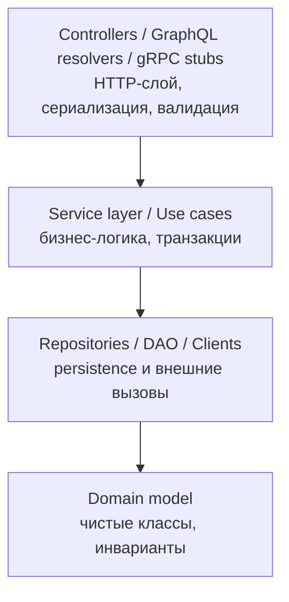

# Web Backend

Серверная часть веб-приложений: приём HTTP-запросов, бизнес-логика, работа с БД, интеграция с внешними системами, аутентификация, кэширование, очереди, наблюдаемость. Этот раздел — overview-документ, связывающий практики и инструменты из всех соседних доменов репозитория.

Раздел не заменяет углублённые материалы по Spring, REST, SQL — он описывает, как из этих кусочков собрать работающую систему и где читать про каждый слой.

## Полезные ссылки

### Основной документ
- [[backend-basics|Основы backend-разработки]]

### Смежные разделы репозитория

Backend — это мост между множеством доменов:

- [[README|REST API]], [[README|GraphQL]], [[README|gRPC]] — протоколы
- [[README|Spring Boot]] — основной стек в репозитории
- [[README|Базы данных]], [[README|SQL]], [[README|ORM]] — persistence
- [[README|Messaging]] — асинхронная интеграция
- [[README|Безопасность приложения]], [[README|OAuth2/OIDC]]
- [[README|Docker]], [[README|Kubernetes]], [[README|CI/CD]]
- [[README|Мониторинг]], [[README|Логирование]], [[README|Трейсинг]]
- [[README|Тестирование]]

### Внешние ресурсы
- [System Design Primer](https://github.com/donnemartin/system-design-primer)
- [High Scalability](http://highscalability.com/)
- [12 Factor App](https://12factor.net/)
- [OWASP Top 10](https://owasp.org/www-project-top-ten/)

## Содержание

- [Слои типичного backend](#слои-типичного-backend)
- [Карта тем и где читать](#карта-тем-и-где-читать)
- [Чек-лист production backend](#чек-лист-production-backend)
- [Маршруты чтения](#маршруты-чтения)
- [Куда идти дальше](#куда-идти-дальше)

## Слои типичного backend

## Карта тем и где читать

| Слой / практика | Файл |
|-----------------|------|
| Архитектура backend, слои | [[backend-basics#архитектура-типичного-backend]] |
| REST API-контракт, OpenAPI | [[README|development/api/rest/]] |
| Spring Web, `@RestController` | [[README|frameworks/java-frameworks/spring/]] |
| JDBC / JPA / Hibernate | [[README|databases/orm/]] |
| Аутентификация (JWT, OAuth2) | [[README|security/application/]] |
| Кэширование (Caffeine, Redis) | [databases/nosql/redis/](../../databases/nosql/redis/) |
| Очереди (Kafka, RabbitMQ) | [[README|development/messaging/]] |
| Валидация (Bean Validation) | [[backend-basics]] |
| Логирование и метрики | [[README|monitoring/]] |
| Контейнеризация и деплой | [[README|platform/containers/]] |
| Тестирование | [[README|testing/]] |

## Чек-лист production backend

- [ ] OpenAPI-спецификация синхронизирована с кодом
- [ ] Health/readiness endpoints (Actuator)
- [ ] Structured logging (JSON, correlation-id)
- [ ] Метрики: latency p50/p95/p99, error rate, in-flight
- [ ] Distributed tracing (OpenTelemetry)
- [ ] Graceful shutdown и connection draining
- [ ] Rate limiting / circuit breaker
- [ ] Backups и миграции БД через Flyway/Liquibase
- [ ] Секреты не в git: vault / k8s secrets
- [ ] OWASP Top 10: XSS, SQLi, CSRF, SSRF, IDOR
- [ ] Load testing перед релизом
- [ ] Runbook для on-call

## Маршруты чтения

- **Junior backend (1 день):** `backend-basics.md` `REST API` `Spring Boot` `SQL` `Testing`.
- **Подготовка к system design интервью:** `backend-basics.md` `architecture/system-design/` `architecture/scalability-patterns`.
- **Production readiness review:** чек-лист выше + `monitoring/` + `security/application/`.

## Куда идти дальше

- Проектирование систем — [[README|architecture/system-design/]]
- Паттерны интеграции — [[README|patterns/]]
- Масштабирование и HA — [[README|architecture/]]
- DevOps-практики — [[README|platform/ci-cd/]]
