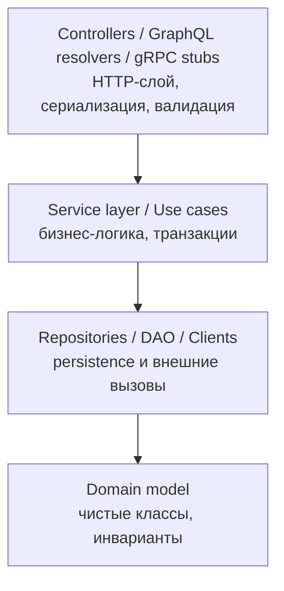

# Web Backend

Серверная часть веб-приложений: приём HTTP-запросов, бизнес-логика, работа с БД, интеграция с внешними системами, аутентификация, кэширование, очереди, наблюдаемость. Этот раздел — overview-документ, связывающий практики и инструменты из всех соседних доменов репозитория.

Раздел не заменяет углублённые материалы по Spring, REST, SQL — он описывает, как из этих кусочков собрать работающую систему и где читать про каждый слой.

## Полезные ссылки

### Основной документ
- [Основы backend-разработки](backend-basics.md)

### Смежные разделы репозитория

Backend — это мост между множеством доменов:

- [REST API](../../basics/README.md), [GraphQL](../../basics/README.md), [gRPC](../../basics/README.md) — протоколы
- [Spring Boot](../../basics/README.md) — основной стек в репозитории
- [Базы данных](../../basics/README.md), [SQL](../../basics/README.md), [ORM](../../basics/README.md) — persistence
- [Messaging](../../basics/README.md) — асинхронная интеграция
- [Безопасность приложения](../../basics/README.md), [OAuth2/OIDC](../../basics/README.md)
- [Docker](../../basics/README.md), [Kubernetes](../../basics/README.md), [CI/CD](../../basics/README.md)
- [Мониторинг](../../basics/README.md), [Логирование](../../basics/README.md), [Трейсинг](../../basics/README.md)
- [Тестирование](../../basics/README.md)

### Внешние ресурсы
- [System Design Primer](https://github.com/donnemartin/system-design-primer)
- [High Scalability](http://highscalability.com/)
- [12 Factor App](https://12factor.net/)
- [OWASP Top 10](https://owasp.org/www-project-top-ten/)

## Содержание

- [Слои типичного backend](#слои-типичного-backend)
- [Карта тем и где читать](#карта-тем-и-где-читать)
- [Чек-лист production backend](#чек-лист-production-backend)
- [Маршруты чтения](#маршруты-чтения)
- [Куда идти дальше](#куда-идти-дальше)

## Слои типичного backend

## Карта тем и где читать

| Слой / практика | Файл |
|-----------------|------|
| Архитектура backend, слои | [backend-basics](backend-basics.md#архитектура-типичного-backend) |
| REST API-контракт, OpenAPI | [development/api/rest/](../../basics/README.md) |
| Spring Web, `@RestController` | [frameworks/java-frameworks/spring/](../../basics/README.md) |
| JDBC / JPA / Hibernate | [databases/orm/](../../basics/README.md) |
| Аутентификация (JWT, OAuth2) | [security/application/](../../basics/README.md) |
| Кэширование (Caffeine, Redis) | [databases/nosql/redis/](../../databases/nosql/redis/) |
| Очереди (Kafka, RabbitMQ) | [development/messaging/](../../basics/README.md) |
| Валидация (Bean Validation) | [backend-basics](backend-basics.md) |
| Логирование и метрики | [monitoring/](../../basics/README.md) |
| Контейнеризация и деплой | [platform/containers/](../../basics/README.md) |
| Тестирование | [testing/](../../basics/README.md) |

## Чек-лист production backend

- [ ] OpenAPI-спецификация синхронизирована с кодом
- [ ] Health/readiness endpoints (Actuator)
- [ ] Structured logging (JSON, correlation-id)
- [ ] Метрики: latency p50/p95/p99, error rate, in-flight
- [ ] Distributed tracing (OpenTelemetry)
- [ ] Graceful shutdown и connection draining
- [ ] Rate limiting / circuit breaker
- [ ] Backups и миграции БД через Flyway/Liquibase
- [ ] Секреты не в git: vault / k8s secrets
- [ ] OWASP Top 10: XSS, SQLi, CSRF, SSRF, IDOR
- [ ] Load testing перед релизом
- [ ] Runbook для on-call

## Маршруты чтения

- **Junior backend (1 день):** `backend-basics.md` `REST API` `Spring Boot` `SQL` `Testing`.
- **Подготовка к system design интервью:** `backend-basics.md` `architecture/system-design/` `architecture/scalability-patterns`.
- **Production readiness review:** чек-лист выше + `monitoring/` + `security/application/`.

## Куда идти дальше

- Проектирование систем — [architecture/system-design/](../../basics/README.md)
- Паттерны интеграции — [patterns/](../../basics/README.md)
- Масштабирование и HA — [architecture/](../../basics/README.md)
- DevOps-практики — [platform/ci-cd/](../../basics/README.md)
