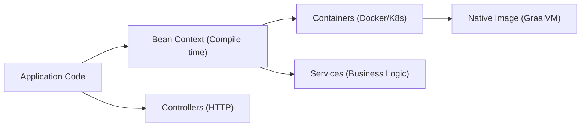

# Micronaut: Основы

## Полезные ссылки

### Официальная документация
- [**Micronaut** Documentation](https://micronaut.io/documentation/)
- [**Micronaut** Guides](https://micronaut.io/guides/)

### Сообщество
- [**Micronaut** Blog](https://micronaut.io/blog/)
- [**Micronaut** Slack](https://micronaut.io/slack/)

### Обучающие материалы
- [**Micronaut** Launch](https://micronaut.io/launch/)
- [**Micronaut** YouTube](https://www.youtube.com/c/MicronautFramework)

## Содержание

- [Введение в Micronaut](#введение-в-micronaut)
  - [Основные особенности](#основные-особенности)
  - [Архитектура Micronaut](#архитектура-micronaut)
  - [Сравнение с Spring Boot](#сравнение-с-spring-boot)
- [Установка и настройка](#установка-и-настройка)
  - [Создание проекта](#создание-проекта)
  - [Структура проекта](#структура-проекта)
  - [Gradle (рекомендуется)](#gradle-рекомендуется)
  - [Maven](#maven)
  - [Application Class](#application-class)
- [Configuration](#configuration)
  - [application.yml](#applicationyml)
  - [Configuration Classes](#configuration-classes)
- [HTTP Controllers](#http-controllers)
  - [Basic Controller](#basic-controller)
  - [REST Controller с CRUD](#rest-controller-с-crud)
  - [Request/Response DTOs](#requestresponse-dtos)
  - [Exception Handling](#exception-handling)
- [Dependency Injection](#dependency-injection)
  - [Services](#services)
  - [Repository Interface](#repository-interface)
  - [Entity Model](#entity-model)
- [Reactive Programming](#reactive-programming)
  - [Reactive Controller](#reactive-controller)
  - [Reactive Service](#reactive-service)
- [Testing](#testing)
  - [Unit Testing](#unit-testing)
  - [Integration Testing](#integration-testing)
  - [HTTP Client](#http-client)
  - [Declarative HTTP Client](#declarative-http-client)
  - [Programmatic HTTP Client](#programmatic-http-client)
- [Security](#security)
  - [JWT Authentication](#jwt-authentication)
  - [Security Configuration](#security-configuration)
  - [Custom Security](#custom-security)
- [Observability](#observability)
  - [Health Checks](#health-checks)
  - [Metrics](#metrics)
  - [Distributed Tracing](#distributed-tracing)
- [Deployment](#deployment)
  - [Docker](#docker)
  - [Native Image](#native-image)
  - [Kubernetes](#kubernetes)
- [Лучшие практики](#лучшие-практики)
  - [Application Structure](#application-structure)
  - [Performance](#performance)
  - [Security](#security-1)
  - [Development](#development)
- [Migration from Spring Boot](#migration-from-spring-boot)
  - [Key Differences](#key-differences)
  - [Migration Steps](#migration-steps)
- [Решение проблем](#решение-проблем)
- [См. также](#см-также)

## Введение в Micronaut

**Micronaut** — это современный **JVM** фреймворк для создания модульных, легко тестируемых микросервисов. **Micronaut** использует **compile-time dependency injection** и **AOP**, что обеспечивает высокую производительность и минимальное потребление ресурсов.

### Основные особенности

- **Compile-time DI**: Зависимости разрешаются во время компиляции
- **AOT (Ahead-of-Time) compilation**: **Native image support** без **reflection**
- **Reactive**: Полная поддержка **reactive programming**
- **Multi-language**: **Java**, **Kotlin**, **Groovy**
- **Cloud-native**: Оптимизирован для контейнеров и **Kubernetes**
- **Low memory footprint**: Минимальное потребление памяти

### Архитектура Micronaut



### Сравнение с Spring Boot

| Характеристика | **Spring Boot** | **Micronaut** |
|----------------|-------------|-----------|
| Стартап время | 2-5 сек | 0.1-0.5 сек |
| Память | 500MB+ | 50-100MB |
| `DI` | **Runtime** | **Compile-time** |
| **Reflection** | **Heavy usage** | **Minimal** |
| **Native images** | Сложно | Нативная поддержка |
| **Configuration** | **Properties**/**YAML** | **Properties**/**YAML** + **Code** |

## Установка и настройка

### Создание проекта

```bash
# Используя Micronaut CLI
mn create-app my-app --lang java --build maven

# С features
mn create-app my-app \
    --features data-jdbc,hibernate-jpa,flyway,kafka,management \
    --lang java --build maven

# Для Kotlin
mn create-app my-kotlin-app --lang kotlin --build gradle

# Для Groovy
mn create-app my-groovy-app --lang groovy --build gradle
```

### Структура проекта

```text
# Стандартная структура проекта Micronaut
my-app/
├── src/main/java/com/example/
│   ├── Application.java
│   └── controller/
│       └── HelloController.java
├── src/main/resources/
│   ├── application.yml
│   └── logback.xml
├── src/test/java/com/example/
│   └── HelloControllerTest.java
├── build.gradle (или pom.xml)
└── micronaut-cli.yml
```

### Gradle (рекомендуется)

```gradle
plugins {
    id("com.github.johnrengelman.shadow") version "8.1.1"
    id("io.micronaut.application") version "4.1.4"
    id("io.micronaut.aot") version "4.1.4"
}

version = "0.1"
group = "com.example"

repositories {
    mavenCentral()
}

dependencies {
    annotationProcessor("io.micronaut:micronaut-http-validation")
    implementation("io.micronaut:micronaut-http-client")
    implementation("io.micronaut:micronaut-jackson-databind")
    implementation("io.micronaut:micronaut-management")
    implementation("io.micronaut:micronaut-runtime")
    implementation("jakarta.annotation:jakarta.annotation-api")
    implementation("ch.qos.logback:logback-classic")
    runtimeOnly("com.fasterxml.jackson.module:jackson-module-kotlin")
    testImplementation("io.micronaut:micronaut-test-junit5")
    testImplementation("org.junit.jupiter:junit-jupiter-api")
    testImplementation("org.junit.jupiter:junit-jupiter-engine")
}

application {
    mainClass = "com.example.Application"
}

java {
    sourceCompatibility = JavaVersion.toVersion("17")
    targetCompatibility = JavaVersion.toVersion("17")
}

graalvmNative {
    toolchainDetection = false
    binaries {
        main {
            imageName = "my-app"
            mainClass = "com.example.Application"
            buildArgs.add("--static")
            buildArgs.add("--libc=musl")
        }
    }
}
```

### Maven

```xml
<!-- Фрагмент pom.xml: parent Micronaut, packaging jar, mainClass -->
<?xml version="1.0" encoding="UTF-8"?>
<project xmlns="http://maven.apache.org/POM/4.0.0"
         xmlns:xsi="http://www.w3.org/2001/XMLSchema-instance"
         xsi:schemaLocation="http://maven.apache.org/POM/4.0.0 http://maven.apache.org/xsd/maven-4.0.0.xsd">
    <modelVersion>4.0.0</modelVersion>
    <groupId>com.example</groupId>
    <artifactId>my-app</artifactId>
    <version>0.1</version>

    <parent>
        <groupId>io.micronaut</groupId>
        <artifactId>micronaut-parent</artifactId>
        <version>4.1.4</version>
    </parent>

    <properties>
        <packaging>jar</packaging>
        <jdk.version>17</jdk.version>
        <release.version>17</release.version>
        <micronaut.version>4.1.4</micronaut.version>
        <exec.mainClass>com.example.Application</exec.mainClass>
    </properties>

    <repositories>
        <repository>
            <id>central</id>
            <url>https://repo.maven.apache.org/maven2</url>
        </repository>
    </repositories>

    <dependencies>
        <dependency>
            <groupId>io.micronaut</groupId>
            <artifactId>micronaut-http-server-netty</artifactId>
            <scope>compile</scope>
        </dependency>
        <dependency>
            <groupId>io.micronaut</groupId>
            <artifactId>micronaut-http-client</artifactId>
            <scope>compile</scope>
        </dependency>
        <dependency>
            <groupId>io.micronaut</groupId>
            <artifactId>micronaut-jackson-databind</artifactId>
            <scope>compile</scope>
        </dependency>
        <dependency>
            <groupId>io.micronaut</groupId>
            <artifactId>micronaut-management</artifactId>
            <scope>compile</scope>
        </dependency>
        <dependency>
            <groupId>io.micronaut</groupId>
            <artifactId>micronaut-runtime</artifactId>
            <scope>compile</scope>
        </dependency>
        <dependency>
            <groupId>ch.qos.logback</groupId>
            <artifactId>logback-classic</artifactId>
            <scope>runtime</scope>
        </dependency>
        <dependency>
            <groupId>io.micronaut.test</groupId>
            <artifactId>micronaut-test-junit5</artifactId>
            <scope>test</scope>
        </dependency>
        <dependency>
            <groupId>org.junit.jupiter</groupId>
            <artifactId>junit-jupiter-api</artifactId>
            <scope>test</scope>
        </dependency>
        <dependency>
            <groupId>org.junit.jupiter</groupId>
            <artifactId>junit-jupiter-engine</artifactId>
            <scope>test</scope>
        </dependency>
    </dependencies>

    <build>
        <plugins>
            <plugin>
                <groupId>io.micronaut.build</groupId>
                <artifactId>micronaut-maven-plugin</artifactId>
            </plugin>
            <plugin>
                <groupId>org.apache.maven.plugins</groupId>
                <artifactId>maven-compiler-plugin</artifactId>
                <configuration>
                    <annotationProcessorPaths>
                        <path>
                            <groupId>io.micronaut</groupId>
                            <artifactId>micronaut-http-validation</artifactId>
                            <version>${micronaut.version}</version>
                        </path>
                    </annotationProcessorPaths>
                </configuration>
            </plugin>
        </plugins>
    </build>
</project>
```

### Application Class

```java
// Точка входа Micronaut-приложения
package com.example;

import io.micronaut.runtime.Micronaut;

public class Application {

    public static void main(String[] args) {
        Micronaut.run(Application.class, args);
    }
}
```

## Configuration

### application.yml

```yaml
micronaut:
  application:
    name: my-app

  server:
    port: 8080
    host: 0.0.0.0
    cors:
      enabled: true
      configurations:
        web:
          allowedOrigins: ["http://localhost:3000"]
          allowedMethods: ["GET", "POST", "PUT", "DELETE", "OPTIONS"]
          allowedHeaders: ["*"]
          exposedHeaders: ["X-Custom-Header"]
          allowCredentials: true

  router:
    static-resources:
      default:
        enabled: true
        mapping: "/"
        paths: "classpath:public"

  security:
    enabled: false  # Включаем позже

  metrics:
    enabled: true
    export:
      prometheus:
        enabled: true
        descriptions: true
        step: PT1M

  health:
    enabled: true
    diskspace:
      enabled: true
      threshold: 100MB

  http:
    client:
      read-timeout: 30s
      connect-timeout: 10s
      follow-redirects: true

  executors:
    io:
      type: fixed
      n-threads: 100
      parallelism: 4

# Database
datasources:
  default:
    url: jdbc:postgresql://localhost:5432/myapp
    username: ${DB_USERNAME:myuser}
    password: ${DB_PASSWORD:mypassword}
    driverClassName: org.postgresql.Driver
    dialect: POSTGRES
    schema-generate: CREATE_DROP
    maximum-pool-size: 20
    minimum-idle: 5

# JPA
jpa:
  default:
    entity-scan:
      packages: 'com.example.entity'
    properties:
      hibernate:
        hbm2ddl:
          auto: update
        show_sql: true
        format_sql: true
        dialect: org.hibernate.dialect.PostgreSQLDialect

# Kafka
kafka:
  bootstrap:
    servers: localhost:9092
  consumers:
    default:
      group-id: 'my-group'
  producers:
    default:
      retries: 3
      acks: 'all'

# Redis
redis:
  uri: redis://localhost:6379
  timeout: 10s

# Logging
logger:
  levels:
    com.example: DEBUG
    io.micronaut: INFO
    ROOT: INFO

# Custom configuration
app:
  upload:
    max-file-size: 10MB
    temp-dir: /tmp/uploads
  api:
    version: v1
    timeout: 30s
  cache:
    enabled: true
    ttl: 3600
```

### Configuration Classes

```java
// Класс конфигурации с @ConfigurationProperties
package com.example.config;

import io.micronaut.context.annotation.ConfigurationProperties;
import jakarta.validation.constraints.NotBlank;
import jakarta.validation.constraints.Positive;
import java.time.Duration;

@ConfigurationProperties("app.upload")
public class UploadConfig {

    @NotBlank
    private String tempDir = "/tmp/uploads";

    @Positive
    private long maxFileSize = 10 * 1024 * 1024; // 10MB

    public String getTempDir() {
        return tempDir;
    }

    public void setTempDir(String tempDir) {
        this.tempDir = tempDir;
    }

    public long getMaxFileSize() {
        return maxFileSize;
    }

    public void setMaxFileSize(long maxFileSize) {
        this.maxFileSize = maxFileSize;
    }
}

@ConfigurationProperties("app.api")
public class ApiConfig {

    @NotBlank
    private String version = "v1";

    private Duration timeout = Duration.ofSeconds(30);

    public String getVersion() {
        return version;
    }

    public void setVersion(String version) {
        this.version = version;
    }

    public Duration getTimeout() {
        return timeout;
    }

    public void setTimeout(Duration timeout) {
        this.timeout = timeout;
    }
}

@ConfigurationProperties("app.cache")
public class CacheConfig {

    private boolean enabled = true;

    @Positive
    private int ttl = 3600; // 1 hour

    public boolean isEnabled() {
        return enabled;
    }

    public void setEnabled(boolean enabled) {
        this.enabled = enabled;
    }

    public int getTtl() {
        return ttl;
    }

    public void setTtl(int ttl) {
        this.ttl = ttl;
    }
}
```

## HTTP Controllers

### Basic Controller

```java
// Контроллер с маппингом GET /hello
package com.example.controller;

import io.micronaut.http.annotation.Controller;
import io.micronaut.http.annotation.Get;
import io.micronaut.http.annotation.Produces;
import io.micronaut.http.MediaType;

@Controller("/api/hello")
public class HelloController {

    @Get("/")
    @Produces(MediaType.TEXT_PLAIN)
    public String hello() {
        return "Hello World!";
    }

    @Get("/greet/{name}")
    @Produces(MediaType.TEXT_PLAIN)
    public String greet(String name) {
        return "Hello " + name + "!";
    }

    @Get("/json")
    @Produces(MediaType.APPLICATION_JSON)
    public Greeting jsonGreeting() {
        return new Greeting("Hello", "World");
    }

    public static class Greeting {
        private String greeting;
        private String name;

        public Greeting(String greeting, String name) {
            this.greeting = greeting;
            this.name = name;
        }

        public String getGreeting() { return greeting; }
        public String getName() { return name; }
    }
}
```

### REST Controller с CRUD

```java
// REST-контроллер с CRUD и пагинацией (list, show, save, update, delete)
package com.example.controller;

import com.example.model.User;
import com.example.service.UserService;
import io.micronaut.data.model.Page;
import io.micronaut.data.model.Pageable;
import io.micronaut.http.HttpResponse;
import io.micronaut.http.annotation.*;
import io.micronaut.validation.Validated;
import jakarta.validation.Valid;
import java.net.URI;
import java.util.List;
import java.util.Optional;

@Controller("/api/users")
@Validated
public class UserController {

    private final UserService userService;

    public UserController(UserService userService) {
        this.userService = userService;
    }

    @Get("/")
    public Page<User> list(@Valid Pageable pageable) {
        return userService.list(pageable);
    }

    @Get("/{id}")
    public Optional<User> show(Long id) {
        return userService.findById(id);
    }

    @Post("/")
    public HttpResponse<User> save(@Body @Valid CreateUserRequest request) {
        User user = userService.save(request);
        return HttpResponse.created(URI.create("/api/users/" + user.getId()))
                          .body(user);
    }

    @Put("/{id}")
    public HttpResponse<User> update(Long id, @Body @Valid UpdateUserRequest request) {
        User user = userService.update(id, request);
        return HttpResponse.ok(user);
    }

    @Delete("/{id}")
    public HttpResponse<Void> delete(Long id) {
        userService.delete(id);
        return HttpResponse.noContent();
    }

    // Search endpoint
    @Get("/search{?name, email}")
    public List<User> search(String name, String email) {
        return userService.search(name, email);
    }

    // Bulk operations
    @Post("/bulk")
    public List<User> createBulk(@Body List<@Valid CreateUserRequest> requests) {
        return requests.stream()
                      .map(userService::save)
                      .collect(Collectors.toList());
    }
}
```

### Request/Response DTOs

```java
// DTO для создания и обновления пользователя с валидацией
package com.example.controller;

import io.micronaut.core.annotation.Introspected;
import jakarta.validation.constraints.*;

@Introspected
public class CreateUserRequest {

    @NotBlank(message = "Name is required")
    @Size(min = 2, max = 100, message = "Name must be between 2 and 100 characters")
    private String name;

    @NotBlank(message = "Email is required")
    @Email(message = "Email should be valid")
    private String email;

    @NotNull(message = "Age is required")
    @Min(value = 18, message = "Age must be at least 18")
    @Max(value = 120, message = "Age must be at most 120")
    private Integer age;

    // Default constructor for JSON deserialization
    public CreateUserRequest() {}

    public CreateUserRequest(String name, String email, Integer age) {
        this.name = name;
        this.email = email;
        this.age = age;
    }

    // Getters and setters
    public String getName() { return name; }
    public void setName(String name) { this.name = name; }

    public String getEmail() { return email; }
    public void setEmail(String email) { this.email = email; }

    public Integer getAge() { return age; }
    public void setAge(Integer age) { this.age = age; }
}

@Introspected
public class UpdateUserRequest {

    @Size(min = 2, max = 100, message = "Name must be between 2 and 100 characters")
    private String name;

    @Email(message = "Email should be valid")
    private String email;

    @Min(value = 18, message = "Age must be at least 18")
    @Max(value = 120, message = "Age must be at most 120")
    private Integer age;

    // Getters and setters
    public String getName() { return name; }
    public void setName(String name) { this.name = name; }

    public String getEmail() { return email; }
    public void setEmail(String email) { this.email = email; }

    public Integer getAge() { return age; }
    public void setAge(Integer age) { this.age = age; }
}
```

### Exception Handling

```java
// Глобальный перехват исключений и формирование JSON-ответа
package com.example.exception;

import io.micronaut.http.HttpRequest;
import io.micronaut.http.HttpResponse;
import io.micronaut.http.annotation.Produces;
import io.micronaut.http.server.exceptions.ExceptionHandler;
import jakarta.inject.Singleton;
import java.util.Map;

@Singleton
@Produces
public class GlobalExceptionHandler implements ExceptionHandler<Throwable, HttpResponse<?>> {

    @Override
    public HttpResponse<?> handle(HttpRequest request, Throwable exception) {
        Map<String, Object> error = Map.of(
            "error", exception.getClass().getSimpleName(),
            "message", exception.getMessage(),
            "path", request.getPath(),
            "timestamp", System.currentTimeMillis()
        );

        return HttpResponse.serverError(error);
    }
}

@Singleton
@Produces
public class ValidationExceptionHandler implements ExceptionHandler<jakarta.validation.ConstraintViolationException, HttpResponse<?>> {

    @Override
    public HttpResponse<?> handle(HttpRequest request, jakarta.validation.ConstraintViolationException exception) {
        List<Map<String, Object>> violations = exception.getConstraintViolations().stream()
            .map(violation -> Map.of(
                "field", violation.getPropertyPath().toString(),
                "message", violation.getMessage(),
                "invalidValue", violation.getInvalidValue()
            ))
            .collect(Collectors.toList());

        Map<String, Object> error = Map.of(
            "error", "Validation Error",
            "violations", violations,
            "timestamp", System.currentTimeMillis()
        );

        return HttpResponse.badRequest(error);
    }
}

@Singleton
@Produces
public class NotFoundExceptionHandler implements ExceptionHandler<NotFoundException, HttpResponse<?>> {

    @Override
    public HttpResponse<?> handle(HttpRequest request, NotFoundException exception) {
        Map<String, Object> error = Map.of(
            "error", "Not Found",
            "message", exception.getMessage(),
            "timestamp", System.currentTimeMillis()
        );

        return HttpResponse.notFound(error);
    }
}
```

## Dependency Injection

### Services

```java
package com.example.service;

import com.example.model.User;
import com.example.repository.UserRepository;
import io.micronaut.data.model.Page;
import io.micronaut.data.model.Pageable;
import jakarta.inject.Singleton;
import jakarta.transaction.Transactional;
import java.util.List;
import java.util.Optional;

@Singleton
public class UserService {

    private final UserRepository userRepository;

    public UserService(UserRepository userRepository) {
        this.userRepository = userRepository;
    }

    public Page<User> list(Pageable pageable) {
        return userRepository.findAll(pageable);
    }

    public Optional<User> findById(Long id) {
        return userRepository.findById(id);
    }

    @Transactional
    public User save(CreateUserRequest request) {
        User user = new User();
        user.setName(request.getName());
        user.setEmail(request.getEmail());
        user.setAge(request.getAge());
        user.setActive(true);

        return userRepository.save(user);
    }

    @Transactional
    public User update(Long id, UpdateUserRequest request) {
        User user = userRepository.findById(id)
            .orElseThrow(() -> new NotFoundException("User not found"));

        if (request.getName() != null) {
            user.setName(request.getName());
        }
        if (request.getEmail() != null) {
            user.setEmail(request.getEmail());
        }
        if (request.getAge() != null) {
            user.setAge(request.getAge());
        }

        return userRepository.save(user);
    }

    @Transactional
    public void delete(Long id) {
        userRepository.findById(id)
            .orElseThrow(() -> new NotFoundException("User not found"));
        userRepository.deleteById(id);
    }

    public List<User> search(String name, String email) {
        if (name != null && email != null) {
            return userRepository.findByNameAndEmail(name, email);
        } else if (name != null) {
            return userRepository.findByNameLike("%" + name + "%");
        } else if (email != null) {
            return userRepository.findByEmail(email);
        } else {
            return List.of();
        }
    }
}
```

### Repository Interface

```java
package com.example.repository;

import com.example.model.User;
import io.micronaut.data.annotation.Repository;
import io.micronaut.data.jpa.repository.JpaRepository;
import io.micronaut.data.model.Page;
import io.micronaut.data.model.Pageable;
import java.util.List;

@Repository
public interface UserRepository extends JpaRepository<User, Long> {

    // Basic CRUD operations inherited from JpaRepository

    // Custom queries
    List<User> findByName(String name);

    List<User> findByEmail(String email);

    List<User> findByNameLike(String namePattern);

    List<User> findByEmailLike(String emailPattern);

    List<User> findByNameAndEmail(String name, String email);

    List<User> findByActive(boolean active);

    long countByActive(boolean active);

    // Custom query with JPQL
    @Query("SELECT u FROM User u WHERE u.age >= :minAge AND u.age <= :maxAge")
    List<User> findByAgeRange(@Param("minAge") int minAge, @Param("maxAge") int maxAge);

    // Native SQL query
    @Query(value = "SELECT * FROM users WHERE created_at >= :since", nativeQuery = true)
    List<User> findRecentlyCreated(@Param("since") java.time.LocalDateTime since);

    // Pagination support
    Page<User> findAll(Pageable pageable);

    // Custom finder methods
    List<User> findByNameOrderByCreatedAtDesc(String name);

    // Exists methods
    boolean existsByEmail(String email);

    // Delete methods
    long deleteByActive(boolean active);
}
```

### Entity Model

```java
package com.example.model;

import io.micronaut.core.annotation.Introspected;
import io.micronaut.data.annotation.*;
import jakarta.persistence.*;
import jakarta.validation.constraints.*;
import java.time.LocalDateTime;
import java.util.Objects;

@MappedEntity("users")
@Introspected
public class User {

    @Id
    @GeneratedValue(strategy = GenerationType.IDENTITY)
    private Long id;

    @Column(nullable = false, length = 100)
    @NotBlank
    @Size(max = 100)
    private String name;

    @Column(unique = true, nullable = false, length = 255)
    @NotBlank
    @Email
    private String email;

    @Column(nullable = false)
    @NotNull
    @Min(18)
    @Max(120)
    private Integer age;

    @Column(nullable = false)
    private Boolean active = true;

    @Column(nullable = false)
    @DateCreated
    private LocalDateTime createdAt;

    @Column(nullable = false)
    @DateUpdated
    private LocalDateTime updatedAt;

    @Version
    private Long version;

    // Default constructor
    public User() {}

    public User(String name, String email, Integer age) {
        this.name = name;
        this.email = email;
        this.age = age;
        this.active = true;
    }

    // Getters and setters
    public Long getId() { return id; }
    public void setId(Long id) { this.id = id; }

    public String getName() { return name; }
    public void setName(String name) { this.name = name; }

    public String getEmail() { return email; }
    public void setEmail(String email) { this.email = email; }

    public Integer getAge() { return age; }
    public void setAge(Integer age) { this.age = age; }

    public Boolean getActive() { return active; }
    public void setActive(Boolean active) { this.active = active; }

    public LocalDateTime getCreatedAt() { return createdAt; }
    public void setCreatedAt(LocalDateTime createdAt) { this.createdAt = createdAt; }

    public LocalDateTime getUpdatedAt() { return updatedAt; }
    public void setUpdatedAt(LocalDateTime updatedAt) { this.updatedAt = updatedAt; }

    public Long getVersion() { return version; }
    public void setVersion(Long version) { this.version = version; }

    @Override
    public boolean equals(Object o) {
        if (this == o) return true;
        if (o == null || getClass() != o.getClass()) return false;
        User user = (User) o;
        return Objects.equals(id, user.id);
    }

    @Override
    public int hashCode() {
        return Objects.hash(id);
    }

    @Override
    public String toString() {
        return "User{" +
                "id=" + id +
                ", name='" + name + '\'' +
                ", email='" + email + '\'' +
                ", age=" + age +
                ", active=" + active +
                '}';
    }
}
```

## Reactive Programming

### Reactive Controller

```java
package com.example.controller;

import com.example.model.User;
import com.example.service.ReactiveUserService;
import io.micronaut.http.annotation.Controller;
import io.micronaut.http.annotation.Get;
import io.micronaut.http.annotation.Post;
import io.micronaut.http.annotation.Body;
import io.reactivex.rxjava3.core.Flowable;
import io.reactivex.rxjava3.core.Single;
import jakarta.validation.Valid;
import java.util.List;

@Controller("/api/reactive/users")
public class ReactiveUserController {

    private final ReactiveUserService userService;

    public ReactiveUserController(ReactiveUserService userService) {
        this.userService = userService;
    }

    @Get("/")
    public Flowable<User> getAllUsers() {
        return userService.findAllUsers();
    }

    @Get("/{id}")
    public Single<User> getUser(Long id) {
        return userService.findUserById(id)
                         .switchIfEmpty(Single.error(new NotFoundException("User not found")));
    }

    @Post("/")
    public Single<User> createUser(@Body @Valid CreateUserRequest request) {
        return userService.createUser(request);
    }

    // Streaming endpoint
    @Get("/stream")
    public Flowable<User> streamUsers() {
        return userService.streamAllUsers();
    }

    // Search with reactive types
    @Get("/search")
    public Flowable<User> searchUsers(String name) {
        return userService.searchByName(name);
    }
}
```

### Reactive Service

```java
package com.example.service;

import com.example.model.User;
import com.example.repository.UserRepository;
import io.reactivex.rxjava3.core.Flowable;
import io.reactivex.rxjava3.core.Single;
import jakarta.inject.Singleton;
import jakarta.transaction.Transactional;
import org.reactivestreams.Publisher;

@Singleton
public class ReactiveUserService {

    private final UserRepository userRepository;

    public ReactiveUserService(UserRepository userRepository) {
        this.userRepository = userRepository;
    }

    public Flowable<User> findAllUsers() {
        return Flowable.fromIterable(userRepository.findAll());
    }

    public Single<User> findUserById(Long id) {
        return Single.fromOptional(userRepository.findById(id));
    }

    @Transactional
    public Single<User> createUser(CreateUserRequest request) {
        User user = new User(request.getName(), request.getEmail(), request.getAge());
        User savedUser = userRepository.save(user);
        return Single.just(savedUser);
    }

    public Flowable<User> streamAllUsers() {
        return Flowable.fromIterable(userRepository.findAll())
                      .delay(user -> Flowable.timer(100, TimeUnit.MILLISECONDS)
                                           .toFlowable()
                                           .flatMap(ignore -> Flowable.just(user)));
    }

    public Flowable<User> searchByName(String name) {
        return Flowable.fromIterable(userRepository.findByNameLike("%" + name + "%"));
    }

    // Complex reactive operations
    public Flowable<User> findActiveUsersInAgeRange(int minAge, int maxAge) {
        return Flowable.fromIterable(userRepository.findByAgeRange(minAge, maxAge))
                      .filter(User::getActive);
    }

    public Single<UserStats> getUserStats() {
        return Single.zip(
            Single.fromCallable(() -> userRepository.count()),
            Single.fromCallable(() -> userRepository.countByActive(true)),
            (total, active) -> new UserStats(total, active, total - active)
        );
    }
}

public class UserStats {
    private final long total;
    private final long active;
    private final long inactive;

    public UserStats(long total, long active, long inactive) {
        this.total = total;
        this.active = active;
        this.inactive = inactive;
    }

    // Getters
    public long getTotal() { return total; }
    public long getActive() { return active; }
    public long getInactive() { return inactive; }
}
```

## Testing

### Unit Testing

```java
package com.example;

import io.micronaut.test.annotation.MockBean;
import io.micronaut.test.extensions.junit5.annotation.MicronautTest;
import jakarta.inject.Inject;
import org.junit.jupiter.api.Test;
import org.mockito.Mockito;
import java.util.Optional;
import static org.junit.jupiter.api.Assertions.*;
import static org.mockito.ArgumentMatchers.any;
import static org.mockito.Mockito.when;

@MicronautTest
class UserServiceTest {

    @Inject
    UserService userService;

    @Inject
    UserRepository userRepository;

    @Test
    void shouldCreateUser() {
        // Given
        CreateUserRequest request = new CreateUserRequest("John", "john@example.com", 30);
        User savedUser = new User("John", "john@example.com", 30);
        savedUser.setId(1L);

        when(userRepository.save(any(User.class))).thenReturn(savedUser);
        when(userRepository.existsByEmail("john@example.com")).thenReturn(false);

        // When
        User result = userService.save(request);

        // Then
        assertNotNull(result.getId());
        assertEquals("John", result.getName());
        assertEquals("john@example.com", result.getEmail());
        assertEquals(30, result.getAge());
        assertTrue(result.getActive());
    }

    @Test
    void shouldFindUserById() {
        // Given
        User user = new User("Jane", "jane@example.com", 25);
        user.setId(1L);

        when(userRepository.findById(1L)).thenReturn(Optional.of(user));

        // When
        Optional<User> result = userService.findById(1L);

        // Then
        assertTrue(result.isPresent());
        assertEquals("Jane", result.get().getName());
    }

    @Test
    void shouldThrowExceptionWhenUserNotFound() {
        // Given
        when(userRepository.findById(999L)).thenReturn(Optional.empty());

        // When & Then
        assertThrows(NotFoundException.class, () -> {
            userService.findById(999L).orElseThrow(() -> new NotFoundException("User not found"));
        });
    }
}
```

### Integration Testing

```java
package com.example;

import io.micronaut.test.extensions.junit5.annotation.MicronautTest;
import io.micronaut.test.support.TestPropertyProvider;
import io.restassured.RestAssured;
import io.restassured.http.ContentType;
import org.junit.jupiter.api.BeforeEach;
import org.junit.jupiter.api.Test;
import org.testcontainers.containers.PostgreSQLContainer;
import org.testcontainers.junit.jupiter.Container;
import org.testcontainers.junit.jupiter.Testcontainers;

import java.util.Map;

import static io.restassured.RestAssured.given;
import static org.hamcrest.Matchers.*;

@MicronautTest
@Testcontainers
class UserControllerIntegrationTest implements TestPropertyProvider {

    @Container
    static PostgreSQLContainer<?> postgres = new PostgreSQLContainer<>("postgres:15-alpine")
        .withDatabaseName("testdb")
        .withUsername("test")
        .withPassword("test");

    @Override
    public Map<String, String> getProperties() {
        return Map.of(
            "datasources.default.url", postgres.getJdbcUrl(),
            "datasources.default.username", postgres.getUsername(),
            "datasources.default.password", postgres.getPassword(),
            "datasources.default.driverClassName", "org.postgresql.Driver"
        );
    }

    @BeforeEach
    void setUp() {
        RestAssured.port = 8080;
    }

    @Test
    void shouldCreateAndRetrieveUser() {
        // Create user
        String userJson = """
            {
                "name": "John Doe",
                "email": "john@example.com",
                "age": 30
            }
            """;

        String location = given()
            .contentType(ContentType.JSON)
            .body(userJson)
        .when()
            .post("/api/users")
        .then()
            .statusCode(201)
            .header("Location", containsString("/api/users/"))
            .extract()
            .header("Location");

        // Extract user ID from location header
        String userId = location.substring(location.lastIndexOf("/") + 1);

        // Retrieve user
        given()
        .when()
            .get("/api/users/" + userId)
        .then()
            .statusCode(200)
            .body("name", equalTo("John Doe"))
            .body("email", equalTo("john@example.com"))
            .body("age", equalTo(30))
            .body("active", equalTo(true));
    }

    @Test
    void shouldReturnValidationErrors() {
        String invalidUserJson = """
            {
                "name": "",
                "email": "invalid-email",
                "age": 150
            }
            """;

        given()
            .contentType(ContentType.JSON)
            .body(invalidUserJson)
        .when()
            .post("/api/users")
        .then()
            .statusCode(400)
            .body("error", equalTo("Validation Error"))
            .body("violations", hasSize(greaterThan(0)));
    }

    @Test
    void shouldHandleNotFound() {
        given()
        .when()
            .get("/api/users/999")
        .then()
            .statusCode(404)
            .body("error", equalTo("Not Found"));
    }

    @Test
    void shouldSearchUsers() {
        // Create test user
        given()
            .contentType(ContentType.JSON)
            .body("{\"name\":\"Alice\",\"email\":\"alice@example.com\",\"age\":25}")
        .when()
            .post("/api/users");

        // Search by name
        given()
            .queryParam("name", "Alice")
        .when()
            .get("/api/users/search")
        .then()
            .statusCode(200)
            .body("[0].name", equalTo("Alice"));
    }
}
```

### HTTP Client

### Declarative HTTP Client

```java
package com.example.client;

import io.micronaut.http.annotation.Get;
import io.micronaut.http.annotation.Post;
import io.micronaut.http.annotation.Body;
import io.micronaut.http.client.annotation.Client;
import io.reactivex.rxjava3.core.Single;
import java.util.List;

@Client("https://jsonplaceholder.typicode.com")
public interface JsonPlaceholderClient {

    @Get("/posts")
    List<Post> getPosts();

    @Get("/posts/{id}")
    Post getPost(Long id);

    @Post("/posts")
    Post createPost(@Body Post post);

    // Reactive version
    @Get("/posts/{id}")
    Single<Post> getPostReactive(Long id);
}

public class Post {
    private Long id;
    private Long userId;
    private String title;
    private String body;

    // Constructors, getters, setters
    public Post() {}

    public Post(Long userId, String title, String body) {
        this.userId = userId;
        this.title = title;
        this.body = body;
    }

    public Long getId() { return id; }
    public void setId(Long id) { this.id = id; }

    public Long getUserId() { return userId; }
    public void setUserId(Long userId) { this.userId = userId; }

    public String getTitle() { return title; }
    public void setTitle(String title) { this.title = title; }

    public String getBody() { return body; }
    public void setBody(String body) { this.body = body; }
}
```

### Programmatic HTTP Client

```java
package com.example.service;

import io.micronaut.http.HttpRequest;
import io.micronaut.http.client.HttpClient;
import io.micronaut.http.client.annotation.Client;
import jakarta.inject.Singleton;
import org.slf4j.Logger;
import org.slf4j.LoggerFactory;

@Singleton
public class ExternalApiService {

    private static final Logger LOG = LoggerFactory.getLogger(ExternalApiService.class);

    @Client("https://api.example.com")
    private HttpClient httpClient;

    public UserData getUserData(String userId) {
        try {
            HttpRequest<?> request = HttpRequest.GET("/users/" + userId)
                .header("Authorization", "Bearer " + getAccessToken())
                .header("Accept", "application/json");

            return httpClient.toBlocking()
                           .retrieve(request, UserData.class);

        } catch (Exception e) {
            LOG.error("Failed to get user data for user: {}", userId, e);
            throw new ExternalApiException("Failed to retrieve user data", e);
        }
    }

    public List<Product> searchProducts(String query, int limit) {
        HttpRequest<?> request = HttpRequest.GET("/products/search")
            .header("Accept", "application/json")
            .parameter("q", query)
            .parameter("limit", String.valueOf(limit));

        return httpClient.toBlocking()
                       .retrieve(request, Argument.of(List.class, Product.class));
    }

    public void sendNotification(String userId, String message) {
        NotificationRequest request = new NotificationRequest(userId, message);

        HttpRequest<?> httpRequest = HttpRequest.POST("/notifications", request)
            .header("Content-Type", "application/json")
            .header("Authorization", "Bearer " + getAccessToken());

        httpClient.toBlocking().exchange(httpRequest);
    }

    private String getAccessToken() {
        // Implement token retrieval logic
        return "your-access-token";
    }
}

public class UserData {
    private String id;
    private String name;
    private String email;

    // Getters and setters
}

public class Product {
    private String id;
    private String name;
    private BigDecimal price;

    // Getters and setters
}

public class NotificationRequest {
    private String userId;
    private String message;

    public NotificationRequest(String userId, String message) {
        this.userId = userId;
        this.message = message;
    }

    // Getters
}
```

## Security

### JWT Authentication

```java
package com.example.security;

import io.micronaut.http.HttpRequest;
import io.micronaut.http.HttpResponse;
import io.micronaut.http.annotation.Controller;
import io.micronaut.http.annotation.Post;
import io.micronaut.http.annotation.Body;
import io.micronaut.security.annotation.Secured;
import io.micronaut.security.rules.SecurityRule;
import jakarta.inject.Inject;
import jakarta.validation.Valid;

@Controller("/auth")
public class AuthController {

    @Inject
    AuthService authService;

    @Post("/login")
    public HttpResponse<LoginResponse> login(@Body @Valid LoginRequest request) {
        try {
            String token = authService.authenticate(request.getUsername(), request.getPassword());
            return HttpResponse.ok(new LoginResponse(token));
        } catch (AuthenticationException e) {
            return HttpResponse.unauthorized();
        }
    }

    @Post("/register")
    public HttpResponse<Void> register(@Body @Valid RegisterRequest request) {
        authService.register(request.getUsername(), request.getEmail(), request.getPassword());
        return HttpResponse.created(URI.create("/auth/login"));
    }
}

@Controller("/api/users")
@Secured(SecurityRule.IS_AUTHENTICATED)
public class SecureUserController {

    @Get("/")
    @Secured("ROLE_ADMIN")
    public List<User> getAllUsers() {
        // Only admins can access
        return userService.findAll();
    }

    @Get("/profile")
    public User getCurrentUser(@AuthenticationPrincipal User user) {
        // Current authenticated user
        return user;
    }
}
```

### Security Configuration

```yaml
micronaut:
  security:
    enabled: true
    authentication: bearer
    intercept-url-map:
      - pattern: /auth/
        httpMethod: GET
        access:
          - isAnonymous()
      - pattern: /api/admin/
        access:
          - ROLE_ADMIN
      - pattern: /api/
        access:
          - isAuthenticated()

# JWT configuration
jwt:
  generator:
    signature:
      algorithm: HS256
      secret: "my-secret-key-change-in-production"
  parser:
    signature:
      algorithm: HS256
      secret: "my-secret-key-change-in-production"
```

### Custom Security

```java
package com.example.security;

import io.micronaut.http.HttpRequest;
import io.micronaut.http.HttpResponse;
import io.micronaut.http.annotation.Filter;
import io.micronaut.http.filter.HttpServerFilter;
import io.micronaut.http.filter.ServerFilterChain;
import io.micronaut.security.filters.SecurityFilter;
import org.reactivestreams.Publisher;

@Filter("/api/")
public class CustomSecurityFilter implements HttpServerFilter {

    @Override
    public Publisher<? extends HttpResponse<?>> doFilter(HttpRequest<?> request,
                                                       ServerFilterChain chain) {

        // Custom security logic
        String apiKey = request.getHeaders().get("X-API-Key");

        if (apiKey == null || !isValidApiKey(apiKey)) {
            return Publisher.just(HttpResponse.unauthorized());
        }

        // Add user context
        request.setAttribute("apiKey", apiKey);

        return chain.proceed(request);
    }

    private boolean isValidApiKey(String apiKey) {
        // Validate API key logic
        return "valid-api-key".equals(apiKey);
    }
}

@Filter("/api/")
public class RateLimitFilter implements HttpServerFilter {

    private final Map<String, RateLimiter> rateLimiters = new ConcurrentHashMap<>();

    @Override
    public Publisher<? extends HttpResponse<?>> doFilter(HttpRequest<?> request,
                                                       ServerFilterChain chain) {

        String clientIp = request.getRemoteAddress().getAddress().getHostAddress();

        RateLimiter limiter = rateLimiters.computeIfAbsent(clientIp,
            k -> RateLimiter.create(10.0)); // 10 requests per second

        if (!limiter.tryAcquire()) {
            return Publisher.just(HttpResponse.tooManyRequests());
        }

        return chain.proceed(request);
    }
}
```

## Observability

### Health Checks

```java
package com.example.health;

import io.micronaut.health.HealthStatus;
import io.micronaut.management.health.indicator.HealthIndicator;
import io.micronaut.management.health.indicator.annotation.Readiness;
import jakarta.inject.Singleton;
import org.slf4j.Logger;
import org.slf4j.LoggerFactory;

@Singleton
@Readiness
public class DatabaseHealthIndicator implements HealthIndicator {

    private static final Logger LOG = LoggerFactory.getLogger(DatabaseHealthIndicator.class);

    private final UserRepository userRepository;

    public DatabaseHealthIndicator(UserRepository userRepository) {
        this.userRepository = userRepository;
    }

    @Override
    public Publisher<HealthResult> getResult() {
        return Mono.fromCallable(() -> {
            try {
                // Simple database connectivity check
                userRepository.count();

                return HealthResult.builder("database")
                    .status(HealthStatus.UP)
                    .details(Map.of(
                        "connection", "successful",
                        "activeConnections", getActiveConnections()
                    ))
                    .build();

            } catch (Exception e) {
                LOG.error("Database health check failed", e);

                return HealthResult.builder("database")
                    .status(HealthStatus.DOWN)
                    .details(Map.of(
                        "error", e.getMessage(),
                        "connection", "failed"
                    ))
                    .build();
            }
        });
    }

    private long getActiveConnections() {
        // Implement logic to get active connections count
        return 5; // Placeholder
    }
}

@Singleton
@Readiness
public class ExternalServiceHealthIndicator implements HealthIndicator {

    private final HttpClient httpClient;

    public ExternalServiceHealthIndicator(@Client("https://api.example.com") HttpClient httpClient) {
        this.httpClient = httpClient;
    }

    @Override
    public Publisher<HealthResult> getResult() {
        return Mono.from(httpClient.exchange(HttpRequest.GET("/health")))
            .map(response -> {
                if (response.getStatus() == HttpStatus.OK) {
                    return HealthResult.builder("external-service")
                        .status(HealthStatus.UP)
                        .build();
                } else {
                    return HealthResult.builder("external-service")
                        .status(HealthStatus.DOWN)
                        .details(Map.of("statusCode", response.getStatus().getCode()))
                        .build();
                }
            })
            .onErrorReturn(HealthResult.builder("external-service")
                .status(HealthStatus.DOWN)
                .details(Map.of("error", "Connection failed"))
                .build());
    }
}
```

### Metrics

```java
package com.example.metrics;

import io.micrometer.core.annotation.Counted;
import io.micrometer.core.annotation.Timed;
import io.micrometer.core.instrument.Counter;
import io.micrometer.core.instrument.MeterRegistry;
import io.micrometer.core.instrument.Timer;
import jakarta.inject.Singleton;
import java.util.concurrent.TimeUnit;

@Singleton
public class MetricsService {

    private final Counter usersCreated;
    private final Timer userCreationTimer;

    public MetricsService(MeterRegistry registry) {
        this.usersCreated = Counter.builder("users_created_total")
            .description("Total number of users created")
            .register(registry);

        this.userCreationTimer = Timer.builder("user_creation_duration")
            .description("Time spent creating users")
            .register(registry);
    }

    @Timed(value = "user_creation_duration", histogram = true)
    public User createUser(CreateUserRequest request) {
        long startTime = System.nanoTime();

        try {
            User user = userService.save(request);
            usersCreated.increment();

            return user;
        } finally {
            userCreationTimer.record(System.nanoTime() - startTime, TimeUnit.NANOSECONDS);
        }
    }

    @Counted(value = "user_searches_total", extraTags = {"type", "by_name"})
    public List<User> searchByName(String name) {
        return userService.search(name, null);
    }

    @Counted(value = "user_searches_total", extraTags = {"type", "by_email"})
    public List<User> searchByEmail(String email) {
        return userService.search(null, email);
    }
}
```

### Distributed Tracing

```yaml
# application.yml
tracing:
  zipkin:
    enabled: true
    http:
      url: http://localhost:9411/api/v2/spans
  jaeger:
    enabled: true
    endpoint: http://localhost:14268/api/traces
```

```java
package com.example.service;

import io.micronaut.tracing.annotation.ContinueSpan;
import io.micronaut.tracing.annotation.NewSpan;
import io.micronaut.tracing.annotation.SpanTag;
import jakarta.inject.Singleton;

@Singleton
public class TracedService {

    @NewSpan("create-user")
    public User createUser(@SpanTag("user.name") String name,
                          @SpanTag("user.email") String email) {

        // This creates a new span
        return userService.save(new CreateUserRequest(name, email, 25));
    }

    @ContinueSpan
    public void sendWelcomeEmail(@SpanTag("user.id") Long userId) {

        // This continues the current span
        User user = userService.findById(userId).orElseThrow();
        emailService.sendWelcomeEmail(user.getEmail());
    }

    @NewSpan("external-api-call")
    public ExternalData callExternalApi(@SpanTag("api.endpoint") String endpoint) {

        // Custom span for external API call
        return externalApiClient.getData(endpoint);
    }
}
```

## Deployment

### Docker

```dockerfile
FROM eclipse-temurin:17-jre-alpine

WORKDIR /home/app

COPY target/my-app-*-runner.jar app.jar

RUN addgroup -S appgroup && adduser -S appuser -G appgroup
USER appuser

EXPOSE 8080

ENTRYPOINT ["java", "-jar", "app.jar"]
```

### Native Image

```bash
# Build native image
./gradlew nativeCompile

# Or with Maven
./mvnw package -Dpackaging=native-image

# Run native binary
./build/native/nativeCompile/my-app
```

### Kubernetes

```yaml
apiVersion: apps/v1
kind: Deployment
metadata:
  name: micronaut-app
spec:
  replicas: 3
  selector:
    matchLabels:
      app: micronaut-app
  template:
    metadata:
      labels:
        app: micronaut-app
    spec:
      containers:
      - name: micronaut-app
        image: my-registry/micronaut-app:latest
        ports:
        - containerPort: 8080
        env:
        - name: MICRONAUT_ENVIRONMENTS
          value: k8s
        resources:
          requests:
            memory: "128Mi"
            cpu: "100m"
          limits:
            memory: "512Mi"
            cpu: "500m"
        livenessProbe:
          httpGet:
            path: /health/live
            port: 8080
          initialDelaySeconds: 60
          periodSeconds: 10
        readinessProbe:
          httpGet:
            path: /health/ready
            port: 8080
          initialDelaySeconds: 30
          periodSeconds: 5

---
apiVersion: v1
kind: Service
metadata:
  name: micronaut-app
spec:
  selector:
    app: micronaut-app
  ports:
  - port: 80
    targetPort: 8080
  type: ClusterIP


---
apiVersion: networking.k8s.io/v1
kind: Ingress
metadata:
  name: micronaut-app
  annotations:
    nginx.ingress.kubernetes.io/rewrite-target: /
spec:
  rules:
  - host: my-app.example.com
    http:
      paths:
      - path: /
        pathType: Prefix
        backend:
          service:
            name: micronaut-app
            port:
              number: 80
```

## Лучшие практики

### Application Structure

1. **Use `compile-time` DI** — **Micronaut resolves dependencies** at **compile time**
2. **Prefer constructor injection** — It's **more testable and reliable**
3. **Use reactive types** — **For better resource utilization**
4. **Implement health checks** — **For monitoring application state**
5. **Use configuration properties** — **For externalized configuration**

### Performance

1. **Build native images** — **For fastest startup and minimal memory usage**
2. **Use reactive programming** — **For handling concurrent requests efficiently**
3. **Implement caching** — **Use Micronaut**'s **caching annotations**
4. **Monitor metrics** — **Use Micrometer for application metrics**
5. **Optimize data access** — **Use Micronaut Data repositories effectively**

### Security

1. **Use JWT tokens** — **For stateless authentication**
2. **Implement proper authorization** — **Use role-based access control**
3. **Validate input** — **Use Bean Validation annotations**
4. **Use HTTPS** — **Always** in **production environments**
5. **Implement rate limiting** — To **prevent abuse**

### Development

1. **Use Dev Mode** — **For hot reloading during development**
2. **Write tests** — **Unit and integration tests**
3. **Use logging** — **Proper logging configuration**
4. **Document APIs** — **Use OpenAPI**/**Swagger**
5. **Follow conventions** — **Micronaut coding conventions**

## Migration from Spring Boot

### Key Differences

| **Aspect** | **Spring Boot** | **Micronaut** |
|--------|-------------|-----------|
| **Startup** | 2-5 **seconds** | 0.1-0.5 **seconds** |
| **Memory** | 500MB+ | 50-100MB |
| `DI` | **Runtime reflection** | **Compile-time** |
| **AOP** | **Runtime proxy** | **Compile-time** |
| **Configuration** | **Properties**/**YAML** | **Properties**/**YAML** + **Code** |
| **Native images** | **Limited support** | **Full support** |

### Migration Steps

1. **Replace `Spring annotations with Micronaut` equivalents**
   ```java
   // Spring Boot
   @RestController
   @RequestMapping("/api")
   public class UserController {
       @Autowired
       private UserService userService;
   }

   // Micronaut
   @Controller("/api")
   public class UserController {
       private final UserService userService;

       public UserController(UserService userService) {
           this.userService = userService;
       }
   }
   ```

2. **Update configuration**
   ```yaml
   # Spring Boot
   spring:
     datasource:
       url: jdbc:postgresql://localhost:5432/mydb

   # Micronaut
   datasources:
     default:
       url: jdbc:postgresql://localhost:5432/mydb
   ```

3. **Replace `Spring starters with Micronaut` features**
   ```xml
   <!-- Spring Boot -->
   <dependency>
       <groupId>org.springframework.boot</groupId>
       <artifactId>spring-boot-starter-web</artifactId>
   </dependency>

   <!-- Micronaut -->
   <dependency>
       <groupId>io.micronaut</groupId>
       <artifactId>micronaut-http-server-netty</artifactId>
   </dependency>
   ```

4. **Update testing approach**
   ```java
   // Spring Boot
   @SpringBootTest
   public class UserControllerTest {
   }

   // Micronaut
   @MicronautTest
   public class UserControllerTest {
   }
   ```

## Решение проблем

| Проблема | Возможная причина | Действие |
|----------|-------------------|----------|
| Bean не резолвится | Отсутствует `@Singleton`, цикл зависимостей | Проверить DI-граф, использовать `@Lazy` |
| Native image не собирается | Reflection, ресурсы не включены | Добавить `@RegisterForReflection`, настроить `reflect-config.json` |
| Медленный старт | Инициализация при старте | Использовать ленивую загрузку, проверить `@Context` |
| Ошибки подключения | Неверная конфигурация `datasource` | Проверить `application.yml`, Dev Services |
| 404 на endpoints | Неверный путь, отсутствует `@Controller` | Проверить `@Controller("/path")`, логирование |

## См. также

- [Micronaut: Actuator — Health Checks, Metrics и Endpoints](micronaut-actuator.md)
- [Micronaut: Batch Processing — Job Processing и Scheduling](micronaut-batch.md)
- [Micronaut: Caching — Cache Abstraction и Redis Cache](micronaut-cache.md)
- [Micronaut: Cloud Native — Service Discovery, Configuration и Distributed Tracing](micronaut-cloud.md)
- [Micronaut: Core — Dependency Injection и Bean Management](micronaut-core.md)
