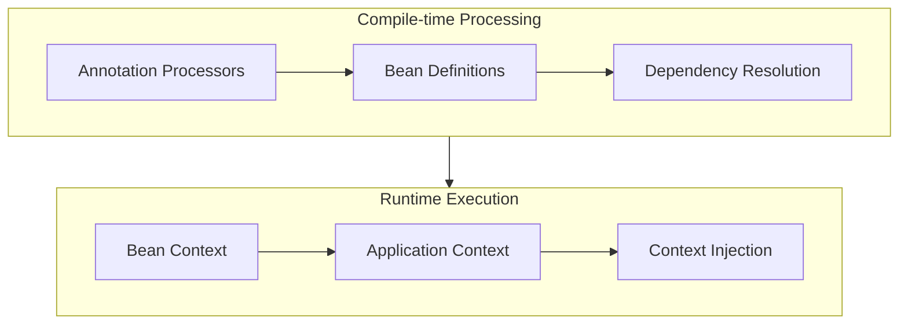

# Micronaut: Core — Dependency Injection и Bean Management

## Полезные ссылки

[Официальная документация Micronaut](https://docs.micronaut.io/)
[Micronaut GitHub](https://github.com/micronaut-projects/micronaut-core)

## Содержание

- [Введение](#введение)
  - [Преимущества Compile-time DI](#преимущества-compile-time-di)
  - [Архитектура DI в Micronaut](#архитектура-di-в-micronaut)
- [Dependency Injection](#dependency-injection)
  - [Constructor Injection (Рекомендуется)](#constructor-injection-рекомендуется)
  - [Field Injection](#field-injection)
  - [Method Injection](#method-injection)
  - [Provider Injection](#provider-injection)
  - [Optional Dependencies](#optional-dependencies)
- [Bean Scopes](#bean-scopes)
  - [Singleton (По умолчанию)](#singleton-по-умолчанию)
  - [Prototype](#prototype)
  - [Request Scope](#request-scope)
  - [Context Scope](#context-scope)
  - [Custom Scopes](#custom-scopes)
- [Bean Lifecycle](#bean-lifecycle)
  - [@PostConstruct и @PreDestroy](#postconstruct-и-predestroy)
  - [Lifecycle Interfaces](#lifecycle-interfaces)
  - [@EventListener для Application Events](#eventlistener-для-application-events)
- [Configuration](#configuration)
  - [@ConfigurationProperties](#configurationproperties)
  - [@EachProperty для Collections](#eachproperty-для-collections)
  - [Property Sources](#property-sources)
  - [Environment Variables](#environment-variables)
  - [@Value Annotation](#value-annotation)
  - [Configuration Validation](#configuration-validation)
- [Bean Factories](#bean-factories)
  - [@Factory Methods](#factory-methods)
  - [Conditional Beans](#conditional-beans)
- [Bean Introspection](#bean-introspection)
- [Лучшие практики](#лучшие-практики)
  - [1. Используйте Constructor Injection](#1-используйте-constructor-injection)
  - [2. Используйте Singleton для Stateless Services](#2-используйте-singleton-для-stateless-services)
  - [3. Валидируйте Конфигурацию](#3-валидируйте-конфигурацию)
  - [4. Используйте @Requires для Условных Bean'ов](#4-используйте-requires-для-условных-beanов)
  - [5. Группируйте Связанную Конфигурацию](#5-группируйте-связанную-конфигурацию)
- [Advanced Topics](#advanced-topics)
  - [Bean Qualifiers](#bean-qualifiers)
  - [Custom Qualifiers](#custom-qualifiers)
  - [Bean Replacement](#bean-replacement)
  - [Conditional Bean Creation](#conditional-bean-creation)
  - [Circular Dependencies](#circular-dependencies)
  - [Bean Execution Order](#bean-execution-order)
  - [Environment-specific Configuration](#environment-specific-configuration)
  - [Configuration Validation](#configuration-validation-1)
- [Решение проблем](#решение-проблем)
  - [Common Issues](#common-issues)
  - [Debugging](#debugging)
- [Event Publishing](#event-publishing)
  - [Application Events](#application-events)
- [Bean Validation](#bean-validation)
  - [Validation Annotations](#validation-annotations)
  - [Custom Validators](#custom-validators)
- [AOP (Aspect-Oriented Programming)](#aop-aspect-oriented-programming)
  - [Method Interceptors](#method-interceptors)
  - [Custom Annotations](#custom-annotations)
- [Bean Factories](#bean-factories-1)
  - [Factory Beans](#factory-beans)
- [Conditional Beans](#conditional-beans-1)
  - [Conditional Bean Creation](#conditional-bean-creation-1)
- [Заключение](#заключение)
- [Дополнительные ресурсы](#дополнительные-ресурсы)
- [См. также](#см-также)

## Введение

**Micronaut** использует **compile-time dependency injection** (DI), что является ключевым отличием от других **JVM** фреймворков. Это означает, что все зависимости разрешаются во время компиляции, а не во время выполнения, что обеспечивает высокую производительность, минимальное потребление памяти и полную поддержку **native images**.

### Преимущества Compile-time `DI`

1. **Производительность**: Нет накладных расходов на **reflection** во время выполнения
2. **Память**: Минимальное потребление памяти, так как не нужны **runtime proxies**
3. **Native images**: Полная поддержка **GraalVM native images**
4. **Валидация**: Ошибки зависимостей обнаруживаются на этапе компиляции
5. **Type safety**: Полная типобезопасность на уровне компилятора

### Архитектура `DI` в Micronaut



## Dependency Injection

### Constructor Injection (Рекомендуется)

**Constructor injection** является предпочтительным способом внедрения зависимостей в **Micronaut**, так как обеспечивает неизменяемость и упрощает тестирование.

```java
// Singleton-сервис с внедрением зависимостей через конструктор
import jakarta.inject.Singleton;

@Singleton
public class UserService {
    private final UserRepository userRepository;
    private final EmailService emailService;

    public UserService(UserRepository userRepository, EmailService emailService) {
        this.userRepository = userRepository;
        this.emailService = emailService;
    }

    public User createUser(String email) {
        User user = userRepository.save(new User(email));
        emailService.sendWelcomeEmail(user);
        return user;
    }
}
```

**Преимущества constructor injection:**
- Неизменяемость: поля могут быть `final`
- Явные зависимости: все зависимости видны в конструкторе
- Легкое тестирование: просто создать объект с **mock**-зависимостями
- Валидация на этапе компиляции: если зависимость отсутствует, код не скомпилируется

### Field Injection

**Field injection** поддерживается, но не рекомендуется для **production** кода. Используется в основном для тестирования или **legacy** кода.

```java
// Field injection (не рекомендуется для production)
import jakarta.inject.Inject;
import jakarta.inject.Singleton;

@Singleton
public class UserService {
    @Inject
    private UserRepository userRepository;

    @Inject
    private EmailService emailService;

    public User createUser(String email) {
        User user = userRepository.save(new User(email));
        emailService.sendWelcomeEmail(user);
        return user;
    }
}
```

**Недостатки field injection:**
- Поля не могут быть `final`
- Скрытые зависимости: зависимости не видны в конструкторе
- Сложнее тестирование: нужны специальные инструменты для **mock**-инъекции
- Меньше типобезопасности

### Method Injection

**Method injection** используется редко, в основном для **optional dependencies** или **lifecycle callbacks**.

```java
import jakarta.inject.Inject;
import jakarta.inject.Singleton;

@Singleton
public class UserService {
    private UserRepository userRepository;
    private EmailService emailService;

    @Inject
    public void setUserRepository(UserRepository userRepository) {
        this.userRepository = userRepository;
    }

    @Inject
    public void setEmailService(EmailService emailService) {
        this.emailService = emailService;
    }
}
```

### Provider Injection

Для получения зависимостей лениво или для работы с **generic types** используется `Provider<T>`.

```java
import jakarta.inject.Provider;
import jakarta.inject.Singleton;

@Singleton
public class OrderService {
    private final Provider<PaymentService> paymentServiceProvider;

    public OrderService(Provider<PaymentService> paymentServiceProvider) {
        this.paymentServiceProvider = paymentServiceProvider;
    }

    public void processOrder(Order order) {
        // Получаем экземпляр только когда нужно
        PaymentService paymentService = paymentServiceProvider.get();
        paymentService.processPayment(order);
    }
}
```

### Optional Dependencies

Для опциональных зависимостей используется `@Nullable` или `Optional<T>`.

```java
import jakarta.inject.Singleton;
import jakarta.annotation.Nullable;

@Singleton
public class NotificationService {
    private final EmailService emailService;
    @Nullable
    private final SmsService smsService; // Опциональная зависимость

    public NotificationService(
            EmailService emailService,
            @Nullable SmsService smsService) {
        this.emailService = emailService;
        this.smsService = smsService;
    }

    public void sendNotification(String message) {
        emailService.send(message);
        if (smsService != null) {
            smsService.send(message);
        }
    }
}
```

**Или с использованием `Optional`:**

```java
import jakarta.inject.Singleton;
import java.util.Optional;

@Singleton
public class NotificationService {
    private final EmailService emailService;
    private final Optional<SmsService> smsService;

    public NotificationService(
            EmailService emailService,
            Optional<SmsService> smsService) {
        this.emailService = emailService;
        this.smsService = smsService;
    }

    public void sendNotification(String message) {
        emailService.send(message);
        smsService.ifPresent(service -> service.send(message));
    }
}
```

## Bean Scopes

**Bean scopes** определяют жизненный цикл и количество экземпляров **bean**'ов в приложении.

### Singleton (По умолчанию)

**Singleton scope** создает один экземпляр **bean**'а на все приложение. Это самый распространенный **scope**.

```java
import jakarta.inject.Singleton;

@Singleton
public class UserService {
    private int instanceCount = 0;

    public UserService() {
        instanceCount++;
        System.out.println("UserService created. Instance count: " + instanceCount);
    }

    public int getInstanceCount() {
        return instanceCount;
    }
}
```

**Характеристики `Singleton`:**
- Создается один раз при старте приложения
- Живет в течение всего жизненного цикла приложения
- **Thread-safe** по умолчанию (но нужно быть осторожным с состоянием)
- Используется для **stateless** сервисов

### Prototype

**Prototype scope** создает новый экземпляр **bean**'а каждый раз, когда он запрашивается.

```java
import jakarta.inject.Scope;
import java.lang.annotation.Retention;
import static java.lang.annotation.RetentionPolicy.RUNTIME;

@Scope
@Retention(RUNTIME)
@interface Prototype {}

@Prototype
public class RequestProcessor {
    private final String id;

    public RequestProcessor() {
        this.id = UUID.randomUUID().toString();
        System.out.println("RequestProcessor created with ID: " + id);
    }

    public String getId() {
        return id;
    }
}
```

**Характеристики `Prototype`:**
- Новый экземпляр при каждом запросе
- Используется для **stateful** объектов
- Больше накладных расходов на создание
- Не подходит для тяжелых объектов

### Request Scope

**Request scope** создает один экземпляр **bean**'а на **HTTP** запрос.

```java
import io.micronaut.http.annotation.RequestScope;

@RequestScope
public class RequestContext {
    private final String requestId;
    private final long timestamp;

    public RequestContext() {
        this.requestId = UUID.randomUUID().toString();
        this.timestamp = System.currentTimeMillis();
    }

    public String getRequestId() {
        return requestId;
    }

    public long getTimestamp() {
        return timestamp;
    }
}
```

**Характеристики `Request Scope`:**
- Один экземпляр на **HTTP** запрос
- Автоматически очищается после завершения запроса
- Используется для хранения контекста запроса
- Доступен только в **HTTP** контексте

### Context Scope

**Context scope** создает один экземпляр **bean**'а в определенном контексте (например, в контексте транзакции).

```java
import io.micronaut.context.annotation.Context;

@Context
public class TransactionContext {
    private final String transactionId;

    public TransactionContext() {
        this.transactionId = UUID.randomUUID().toString();
    }

    public String getTransactionId() {
        return transactionId;
    }
}
```

### Custom Scopes

Можно создавать собственные **scopes** для специфических нужд приложения.

```java
import io.micronaut.context.annotation.Bean;
import io.micronaut.context.annotation.DefaultScope;
import jakarta.inject.Scope;
import java.lang.annotation.Retention;
import static java.lang.annotation.RetentionPolicy.RUNTIME;

@Scope
@Retention(RUNTIME)
public @interface SessionScope {}

@SessionScope
public class UserSession {
    private final String sessionId;
    private final String userId;

    public UserSession() {
        this.sessionId = UUID.randomUUID().toString();
        this.userId = "user123";
    }

    public String getSessionId() {
        return sessionId;
    }

    public String getUserId() {
        return userId;
    }
}
```

## Bean Lifecycle

**Micronaut** предоставляет несколько способов управления жизненным циклом **bean**'ов.

### @PostConstruct и @PreDestroy

Стандартные **JSR-250** аннотации для **lifecycle callbacks**.

```java
import jakarta.annotation.PostConstruct;
import jakarta.annotation.PreDestroy;
import jakarta.inject.Singleton;

@Singleton
public class DatabaseConnection {
    private Connection connection;

    @PostConstruct
    public void init() {
        System.out.println("Initializing database connection...");
        // Инициализация соединения
        connection = createConnection();
        System.out.println("Database connection initialized");
    }

    @PreDestroy
    public void cleanup() {
        System.out.println("Closing database connection...");
        if (connection != null) {
            try {
                connection.close();
            } catch (SQLException e) {
                e.printStackTrace();
            }
        }
        System.out.println("Database connection closed");
    }

    private Connection createConnection() {
        // Создание соединения
        return null; // Placeholder
    }
}
```

### Lifecycle Interfaces

**Micronaut** предоставляет интерфейсы для более детального контроля жизненного цикла.

```java
import io.micronaut.context.LifeCycle;
import jakarta.inject.Singleton;

@Singleton
public class CacheManager implements LifeCycle<CacheManager> {
    private boolean running = false;

    @Override
    public CacheManager start() {
        System.out.println("Starting cache manager...");
        // Инициализация кеша
        running = true;
        System.out.println("Cache manager started");
        return this;
    }

    @Override
    public CacheManager stop() {
        System.out.println("Stopping cache manager...");
        // Очистка кеша
        running = false;
        System.out.println("Cache manager stopped");
        return this;
    }

    @Override
    public boolean isRunning() {
        return running;
    }
}
```

### @EventListener для Application Events

Можно слушать события жизненного цикла приложения.

```java
import io.micronaut.context.event.ApplicationEventListener;
import io.micronaut.context.event.StartupEvent;
import io.micronaut.context.event.ShutdownEvent;
import jakarta.inject.Singleton;

@Singleton
public class ApplicationLifecycleListener
        implements ApplicationEventListener<StartupEvent> {

    @Override
    public void onApplicationEvent(StartupEvent event) {
        System.out.println("Application started at: " + new Date());
        // Выполнение инициализации при старте
        initializeApplication();
    }

    @EventListener
    public void onShutdown(ShutdownEvent event) {
        System.out.println("Application shutting down at: " + new Date());
        // Выполнение cleanup при остановке
        cleanupApplication();
    }

    private void initializeApplication() {
        // Инициализация
    }

    private void cleanupApplication() {
        // Очистка
    }
}
```

## Configuration

**Micronaut** предоставляет мощную систему конфигурации с поддержкой различных источников.

### @ConfigurationProperties

Для типобезопасной конфигурации используется `@ConfigurationProperties`.

```java
import io.micronaut.context.annotation.ConfigurationProperties;
import jakarta.validation.constraints.Min;
import jakarta.validation.constraints.NotBlank;

@ConfigurationProperties("app.database")
public class DatabaseConfiguration {
    @NotBlank
    private String host = "localhost";

    @Min(1)
    private int port = 5432;

    @NotBlank
    private String name;

    @NotBlank
    private String username;

    private String password;

    private int maxPoolSize = 10;

    // Getters and setters
    public String getHost() {
        return host;
    }

    public void setHost(String host) {
        this.host = host;
    }

    public int getPort() {
        return port;
    }

    public void setPort(int port) {
        this.port = port;
    }

    public String getName() {
        return name;
    }

    public void setName(String name) {
        this.name = name;
    }

    public String getUsername() {
        return username;
    }

    public void setUsername(String username) {
        this.username = username;
    }

    public String getPassword() {
        return password;
    }

    public void setPassword(String password) {
        this.password = password;
    }

    public int getMaxPoolSize() {
        return maxPoolSize;
    }

    public void setMaxPoolSize(int maxPoolSize) {
        this.maxPoolSize = maxPoolSize;
    }
}
```

**Соответствующий `application.yml`:**

```yaml
app:
  database:
    host: localhost
    port: 5432
    name: myapp
    username: ${DB_USERNAME:admin}
    password: ${DB_PASSWORD:secret}
    max-pool-size: 20
```

### @EachProperty для Collections

Для конфигурации коллекций используется `@EachProperty`.

```java
import io.micronaut.context.annotation.EachProperty;
import io.micronaut.context.annotation.Parameter;

@EachProperty("app.datasources")
public class DataSourceConfiguration {
    private final String name;
    private String url;
    private String username;
    private String password;

    public DataSourceConfiguration(@Parameter String name) {
        this.name = name;
    }

    public String getName() {
        return name;
    }

    public String getUrl() {
        return url;
    }

    public void setUrl(String url) {
        this.url = url;
    }

    public String getUsername() {
        return username;
    }

    public void setUsername(String username) {
        this.username = username;
    }

    public String getPassword() {
        return password;
    }

    public void setPassword(String password) {
        this.password = password;
    }
}
```

**Соответствующий `application.yml`:**

```yaml
app:
  datasources:
    primary:
      url: jdbc:postgresql://localhost:5432/primary
      username: user1
      password: pass1
    secondary:
      url: jdbc:postgresql://localhost:5432/secondary
      username: user2
      password: pass2
```

### Property Sources

**Micronaut** поддерживает множественные источники конфигурации с приоритетами.

```java
import io.micronaut.context.annotation.PropertySource;
import io.micronaut.context.annotation.PropertySources;

@PropertySources({
    @PropertySource("classpath:application.yml"),
    @PropertySource("classpath:application-${micronaut.environments.active:dev}.yml"),
    @PropertySource(value = "file:${user.home}/.myapp/config.yml", optional = true)
})
public class Application {
    // ...
}
```

### Environment Variables

Переменные окружения автоматически доступны через `${ENV_VAR}` синтаксис.

```yaml
database:
  url: ${DATABASE_URL:jdbc:postgresql://localhost:5432/mydb}
  username: ${DATABASE_USERNAME:admin}
  password: ${DATABASE_PASSWORD:secret}
```

### @Value Annotation

Для инъекции отдельных значений используется `@Value`.

```java
import io.micronaut.context.annotation.Value;
import jakarta.inject.Singleton;

@Singleton
public class ApiService {
    private final String apiKey;
    private final int timeout;
    private final boolean enabled;

    public ApiService(
            @Value("${app.api.key}") String apiKey,
            @Value("${app.api.timeout:30}") int timeout,
            @Value("${app.api.enabled:true}") boolean enabled) {
        this.apiKey = apiKey;
        this.timeout = timeout;
        this.enabled = enabled;
    }
}
```

### Configuration Validation

Конфигурация может быть валидирована с помощью **Bean Validation**.

```java
import io.micronaut.context.annotation.ConfigurationProperties;
import jakarta.validation.constraints.*;

@ConfigurationProperties("app.mail")
public class MailConfiguration {
    @NotBlank
    @Email
    private String from;

    @NotBlank
    private String host;

    @Min(1)
    @Max(65535)
    private int port = 25;

    @Pattern(regexp = "^[a-zA-Z0-9._%+-]+@[a-zA-Z0-9.-]+\\.[a-zA-Z]{2,}$")
    private String adminEmail;

    // Getters and setters...
}
```

## Bean Factories

**Bean factories** позволяют создавать **bean**'ы программно.

### @Factory Methods

```java
import io.micronaut.context.annotation.Bean;
import io.micronaut.context.annotation.Factory;
import jakarta.inject.Singleton;

@Factory
public class BeanFactory {

    @Bean
    @Singleton
    public ObjectMapper objectMapper() {
        ObjectMapper mapper = new ObjectMapper();
        mapper.configure(DeserializationFeature.FAIL_ON_UNKNOWN_PROPERTIES, false);
        mapper.configure(SerializationFeature.WRITE_DATES_AS_TIMESTAMPS, false);
        return mapper;
    }

    @Bean
    @Singleton
    public RestTemplate restTemplate() {
        RestTemplate restTemplate = new RestTemplate();
        restTemplate.setRequestFactory(new HttpComponentsClientHttpRequestFactory());
        return restTemplate;
    }
}
```

### Conditional Beans

**Bean**'ы могут быть созданы условно на основе конфигурации или окружения.

```java
import io.micronaut.context.annotation.Requires;
import io.micronaut.context.annotation.Factory;
import jakarta.inject.Singleton;

@Factory
public class ConditionalBeanFactory {

    @Bean
    @Singleton
    @Requires(property = "app.cache.enabled", value = "true")
    public CacheManager cacheManager() {
        return new CacheManager();
    }

    @Bean
    @Singleton
    @Requires(env = "prod")
    public ProductionService productionService() {
        return new ProductionService();
    }

    @Bean
    @Singleton
    @Requires(missingProperty = "app.feature.disabled")
    public FeatureService featureService() {
        return new FeatureService();
    }
}
```

## Bean Introspection

**Micronaut** генерирует **introspection** данные во время компиляции для работы с **bean**'ами.

```java
import io.micronaut.core.beans.BeanIntrospection;
import io.micronaut.core.beans.BeanProperty;

public class BeanIntrospectionExample {
    public void example() {
        BeanIntrospection<User> introspection =
            BeanIntrospection.getIntrospection(User.class);

        User user = introspection.instantiate("John", "john@example.com");

        BeanProperty<User, String> nameProperty =
            introspection.getProperty("name", String.class).orElseThrow();

        nameProperty.set(user, "Jane");
        String name = nameProperty.get(user);
    }
}
```

## Лучшие практики

### 1. Используйте Constructor Injection

```java
// ✅ Хорошо
@Singleton
public class UserService {
    private final UserRepository repository;

    public UserService(UserRepository repository) {
        this.repository = repository;
    }
}

// ❌ Плохо
@Singleton
public class UserService {
    @Inject
    private UserRepository repository;
}
```

### 2. Используйте Singleton для Stateless Services

```java
// ✅ Хорошо - stateless service
@Singleton
public class CalculatorService {
    public int add(int a, int b) {
        return a + b;
    }
}

// ✅ Хорошо - stateful, нужен prototype
@Prototype
public class RequestProcessor {
    private final String requestId;
    // ...
}
```

### 3. Валидируйте Конфигурацию

```java
@ConfigurationProperties("app")
public class AppConfiguration {
    @NotBlank
    private String apiKey;

    @Min(1)
    private int maxRetries;
    // ...
}
```

### 4. Используйте @Requires для Условных Bean'ов

```java
@Singleton
@Requires(property = "app.feature.enabled", value = "true")
public class FeatureService {
    // ...
}
```

### 5. Группируйте Связанную Конфигурацию

```java
@ConfigurationProperties("app.database")
public class DatabaseConfiguration {
    // Все настройки БД в одном месте
}
```

## Advanced Topics

### Bean Qualifiers

**Qualifiers** позволяют различать несколько **bean**'ов одного типа.

```java
import jakarta.inject.Named;
import jakarta.inject.Singleton;

@Singleton
@Named("primary")
public class PrimaryDataSource implements DataSource {
    // ...
}

@Singleton
@Named("secondary")
public class SecondaryDataSource implements DataSource {
    // ...
}

@Singleton
public class DataService {
    private final DataSource primaryDataSource;
    private final DataSource secondaryDataSource;

    public DataService(
            @Named("primary") DataSource primaryDataSource,
            @Named("secondary") DataSource secondaryDataSource) {
        this.primaryDataSource = primaryDataSource;
        this.secondaryDataSource = secondaryDataSource;
    }
}
```

### Custom Qualifiers

```java
import jakarta.inject.Qualifier;
import java.lang.annotation.Retention;
import java.lang.annotation.RetentionPolicy;

@Qualifier
@Retention(RetentionPolicy.RUNTIME)
public @interface Database {
    String value();
}

@Singleton
@Database("primary")
public class PrimaryDatabase implements DatabaseConnection {
    // ...
}
```

### Bean Replacement

Можно заменять **bean**'ы для тестирования или разных окружений.

```java
import io.micronaut.context.annotation.Replaces;
import jakarta.inject.Singleton;

@Singleton
@Replaces(ProductionEmailService.class)
public class MockEmailService implements EmailService {
    @Override
    public void sendEmail(String to, String subject, String body) {
        // Mock implementation
        System.out.println("Mock email sent to: " + to);
    }
}
```

### Conditional Bean Creation

```java
import io.micronaut.context.annotation.Requires;
import jakarta.inject.Singleton;

@Singleton
@Requires(property = "app.feature.email.enabled", value = "true")
public class EmailService {
    // ...
}

@Singleton
@Requires(env = "prod")
public class ProductionConfig {
    // ...
}

@Singleton
@Requires(missingProperty = "app.feature.disabled")
public class FeatureService {
    // ...
}
```

### Circular Dependencies

**Micronaut** предупреждает о циклических зависимостях на этапе компиляции.

```java
// ❌ Плохо - циклическая зависимость
@Singleton
public class ServiceA {
    private final ServiceB serviceB;
    public ServiceA(ServiceB serviceB) {
        this.serviceB = serviceB;
    }
}

@Singleton
public class ServiceB {
    private final ServiceA serviceA;
    public ServiceB(ServiceA serviceA) {
        this.serviceA = serviceA;
    }
}

// ✅ Хорошо - используйте Provider или события
@Singleton
public class ServiceA {
    private final Provider<ServiceB> serviceBProvider;
    public ServiceA(Provider<ServiceB> serviceBProvider) {
        this.serviceBProvider = serviceBProvider;
    }
}
```

### Bean Execution Order

```java
import io.micronaut.core.order.Ordered;
import jakarta.inject.Singleton;

@Singleton
public class FirstService implements Ordered {
    @Override
    public int getOrder() {
        return Ordered.HIGHEST_PRECEDENCE;
    }
}

@Singleton
public class SecondService implements Ordered {
    @Override
    public int getOrder() {
        return Ordered.LOWEST_PRECEDENCE;
    }
}
```

### Environment-specific Configuration

```yaml
# application.yml
app:
  database:
    url: jdbc:h2:mem:devdb

---
# application-prod.yml
app:
  database:
    url: ${DATABASE_URL}
    username: ${DATABASE_USERNAME}
    password: ${DATABASE_PASSWORD}
```

### Configuration Validation

```java
import io.micronaut.context.annotation.ConfigurationProperties;
import jakarta.validation.constraints.*;

@ConfigurationProperties("app.mail")
public class MailConfiguration {
    @NotBlank
    @Email
    private String from;

    @NotBlank
    private String host;

    @Min(1)
    @Max(65535)
    private int port = 25;

    @Pattern(regexp = "^[a-zA-Z0-9._%+-]+@[a-zA-Z0-9.-]+\\.[a-zA-Z]{2,}$")
    private String adminEmail;

    // Validation происходит при создании bean'а
    // Если validation fails, приложение не запустится
}
```

## Решение проблем

### Common Issues

1. **Bean not found**: Проверьте, что класс имеет аннотацию `@Singleton` или другой **scope**
2. **Circular dependency**: Используйте `Provider<T>` для разрыва цикла
3. **Configuration not loaded**: Проверьте пути к конфигурационным файлам и **property sources**
4. **Bean not injected**: Убедитесь, что зависимость доступна в контексте

### Debugging

```java
import io.micronaut.context.ApplicationContext;
import jakarta.inject.Singleton;

@Singleton
public class DebugService {
    private final ApplicationContext applicationContext;

    public DebugService(ApplicationContext applicationContext) {
        this.applicationContext = applicationContext;
    }

    public void debugBeans() {
        // Получить все bean'ы определенного типа
        Collection<UserService> userServices =
            applicationContext.getBeansOfType(UserService.class);

        // Проверить наличие bean'а
        boolean hasBean = applicationContext.containsBean(UserService.class);

        // Получить bean
        Optional<UserService> userService =
            applicationContext.findBean(UserService.class);
    }
}
```

## Event Publishing

### Application Events

```java
import io.micronaut.context.event.ApplicationEventPublisher;
import jakarta.inject.Singleton;

@Singleton
public class UserService {
    private final ApplicationEventPublisher<UserCreatedEvent> eventPublisher;

    public UserService(ApplicationEventPublisher<UserCreatedEvent> eventPublisher) {
        this.eventPublisher = eventPublisher;
    }

    public User createUser(User user) {
        User created = userRepository.save(user);
        eventPublisher.publishEvent(new UserCreatedEvent(created));
        return created;
    }
}

public class UserCreatedEvent {
    private final User user;

    public UserCreatedEvent(User user) {
        this.user = user;
    }

    public User getUser() {
        return user;
    }
}

@Singleton
public class UserEventListener {

    @EventListener
    public void onUserCreated(UserCreatedEvent event) {
        // Обработка события
        emailService.sendWelcomeEmail(event.getUser());
    }
}
```

## Bean Validation

### Validation Annotations

```java
import jakarta.validation.constraints.*;
import io.micronaut.validation.validator.Validated;

@Validated
@Singleton
public class UserService {

    public User createUser(
            @NotBlank String name,
            @Email String email,
            @Min(18) @Max(100) Integer age) {
        return new User(name, email, age);
    }

    public void updateUser(
            @NotNull Long id,
            @Valid User user) {
        // Обновление пользователя
    }
}
```

### Custom Validators

```java
import jakarta.validation.Constraint;
import jakarta.validation.ConstraintValidator;
import jakarta.validation.ConstraintValidatorContext;
import java.lang.annotation.*;

@Target({ElementType.FIELD, ElementType.PARAMETER})
@Retention(RetentionPolicy.RUNTIME)
@Constraint(validatedBy = ValidEmail.Validator.class)
public @interface ValidEmail {
    String message() default "Invalid email format";

    class Validator implements ConstraintValidator<ValidEmail, String> {
        @Override
        public boolean isValid(String value, ConstraintValidatorContext context) {
            return value != null && value.contains("@") && value.contains(".");
        }
    }
}
```

## AOP (Aspect-Oriented Programming)

### Method Interceptors

```java
import io.micronaut.aop.MethodInterceptor;
import io.micronaut.aop.MethodInvocationContext;
import jakarta.inject.Singleton;

@Singleton
public class LoggingInterceptor implements MethodInterceptor<Object, Object> {

    @Override
    public Object intercept(MethodInvocationContext<Object, Object> context) {
        long startTime = System.currentTimeMillis();
        try {
            Object result = context.proceed();
            long duration = System.currentTimeMillis() - startTime;
            log.info("Method {} executed in {} ms", context.getMethodName(), duration);
            return result;
        } catch (Exception e) {
            log.error("Error in method {}", context.getMethodName(), e);
            throw e;
        }
    }
}
```

### Custom Annotations

```java
import io.micronaut.aop.Around;
import java.lang.annotation.*;

@Target({ElementType.METHOD, ElementType.TYPE})
@Retention(RetentionPolicy.RUNTIME)
@Around
public @interface Logged {
}
```

## Bean Factories

### Factory Beans

```java
import io.micronaut.context.annotation.Bean;
import io.micronaut.context.annotation.Factory;
import jakarta.inject.Singleton;

@Factory
public class BeanFactory {

    @Bean
    @Singleton
    public DataSource dataSource() {
        HikariConfig config = new HikariConfig();
        config.setJdbcUrl("jdbc:postgresql://localhost:5432/mydb");
        config.setUsername("user");
        config.setPassword("password");
        return new HikariDataSource(config);
    }
}
```

## Conditional Beans

### Conditional Bean Creation

```java
import io.micronaut.context.annotation.Requires;
import jakarta.inject.Singleton;

@Singleton
@Requires(property = "feature.enabled", value = "true")
public class FeatureService {
    // Сервис создается только если feature.enabled=true
}

@Singleton
@Requires(missingProperty = "feature.enabled")
public class DefaultFeatureService {
    // Сервис создается если feature.enabled отсутствует
}
```


## Заключение

**Micronaut Core** предоставляет мощную систему **dependency injection** и управления **bean**'ами, которая работает во время компиляции. Это обеспечивает высокую производительность, минимальное потребление памяти и полную поддержку **native images**. Поддержка событий, провайдеров, условных **bean**'ов, конфигурации, валидации, **AOP**, **bean factories**, **conditional beans** и других продвинутых возможностей делает **Micronaut** гибким и мощным фреймворком. Понимание этих концепций критично для эффективной разработки на **Micronaut**.

## Дополнительные ресурсы

- [**Micronaut Dependency Injection** Documentation](https://docs.micronaut.io/latest/guide/index.html#ioc)
- [**Micronaut Configuration** Documentation](https://docs.micronaut.io/latest/guide/index.html#config)
- [**Micronaut Bean** Scopes](https://docs.micronaut.io/latest/guide/index.html#beanScope)
- [**Micronaut** Events](https://docs.micronaut.io/latest/guide/index.html#contextEvents)
- [**Bean Validation**](https://beanvalidation.org/2.0/)
- [**Micronaut** AOP](https://docs.micronaut.io/latest/guide/index.html#aop)

## См. также

- [Micronaut: Actuator — Health Checks, Metrics и Endpoints](micronaut-actuator.md)
- [Micronaut: Основы](micronaut-basics.md)
- [Micronaut: Batch Processing — Job Processing и Scheduling](micronaut-batch.md)
- [Micronaut: Caching — Cache Abstraction и Redis Cache](micronaut-cache.md)
- [Micronaut: Cloud Native — Service Discovery, Configuration и Distributed Tracing](micronaut-cloud.md)
