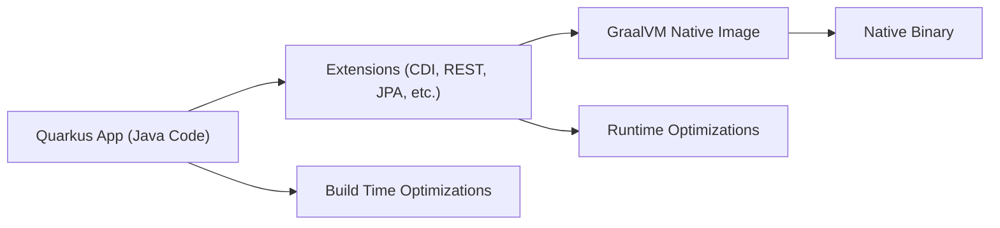

# Quarkus: Основы

## Полезные ссылки

[Официальная документация Quarkus](https://quarkus.io/guides/)
[Quarkus GitHub](https://github.com/quarkusio/quarkus)

## Содержание

- [Введение в Quarkus](#введение-в-quarkus)
  - [Архитектура Quarkus](#архитектура-quarkus)
- [Установка и настройка](#установка-и-настройка)
  - [Создание проекта](#создание-проекта)
- [Используя Quarkus CLI](#используя-quarkus-cli)
- [Или Maven](#или-maven)
- [Или Gradle](#или-gradle)
  - [Структура проекта](#структура-проекта)
  - [Основные конфигурационные файлы](#основные-конфигурационные-файлы)
    - [pom.xml](#pomxml)
    - [application.properties](#applicationproperties)
- [Конфигурация сервера](#server-configuration)
- [Конфигурация базы данных](#database-configuration)
- [Hibernate ORM](#hibernate-orm)
- [Logging](#logging)
- [Health checks](#health-checks)
- [Metrics](#metrics)
- [Система расширений](#extensions-system)
  - [Основные категории extensions](#основные-категории-extensions)
    - [Веб-фреймворки](#web-frameworks)
    - [Доступ к данным](#data-access)
    - [Наблюдаемость](#observability)
    - [Безопасность](#security)
    - [Обмен сообщениями](#messaging)
    - [Cloud Native](#cloud-native)
- [Разработка REST API](#rest-api-development)
  - [RESTEasy Reactive](#resteasy-reactive)
  - [Классы данных](#data-classes)
  - [Обработка исключений](#exception-handling)
- [Доступ к данным с Panache](#data-access-with-panache)
  - [Entity Definition](#entity-definition)
  - [Repository/Service Layer](#repositoryservice-layer)
  - [REST Resource with Panache](#rest-resource-with-panache)
- [Реактивное программирование](#reactive-programming)
  - [Reactive REST with Mutiny](#reactive-rest-with-mutiny)
  - [Reactive Service](#reactive-service)
- [Управление конфигурацией](#configuration-management)
  - [Application Properties](#application-properties)
- [Кэширование](#caching)
- [Resilience](#resilience)
- [OpenAPI/Swagger](#openapiswagger)
- [Kubernetes](#kubernetes)
- [Container](#container)
  - [Configuration Classes](#configuration-classes)
  - [Using Configuration](#using-configuration)
- [Тестирование](#testing)
  - [Unit Testing](#unit-testing)
  - [Integration Testing with TestContainers](#integration-testing-with-testcontainers)
  - [Native Testing](#native-testing)
- [Оптимизация производительности](#performance-optimization)
  - [Native Image Compilation](#native-image-compilation)
- [Build native image](#build-native-image)
- [Run native image](#run-native-image)
- [Multi-stage Docker build for native image](#multi-stage-docker-build-for-native-image)
  - [JVM Mode Optimization](#jvm-mode-optimization)
- [JVM optimizations](#jvm-optimizations)
- [Memory optimization](#memory-optimization)
- [Build optimization](#build-optimization)
- [Health Checks and Metrics](#health-checks-and-metrics)
  - [Custom Metrics](#custom-metrics)
  - [Basic Authentication](#basic-authentication)
  - [JWT Authentication](#jwt-authentication)
  - [Authorization](#authorization)
- [Deployment](#deployment)
  - [Docker](#docker)
- [Create a non-root user](#create-a-non-root-user)
- [Лучшие практики](#лучшие-практики)
  - [Структура приложения](#application-structure)
  - [Производительность](#performance)
  - [Разработка](#development)
- [Миграция с Spring Boot](#migration-from-spring-boot)
  - [Ключевые различия](#key-differences)
  - [Шаги миграции](#migration-steps)
  - [Слой совместимости](#compatibility-layer)
- [Решение проблем](#решение-проблем)
  - [Common Issues](#common-issues)
    - [Slow Startup in Dev Mode](#slow-startup-in-dev-mode)
- [Disable dev services you don't need](#disable-dev-services-you-dont-need)
    - [Native Image Issues](#native-image-issues)
- [Add reflection configuration](#add-reflection-configuration)
    - [Memory Issues](#memory-issues)
- [Adjust JVM memory settings](#adjust-jvm-memory-settings)
    - [Testing Issues](#testing-issues)
- [Ресурсы](#resources)
  - [Официальная документация](#официальная-документация)
  - [Ресурсы сообщества](#community-resources)
  - [Обучающие ресурсы](#learning-resources)
- [Продвинутая конфигурация сборки](#advanced-build-configuration)
  - [Maven Profiles](#maven-profiles)
  - [Gradle Configuration](#gradle-configuration)
- [Инструменты разработки](#development-tools)
  - [Dev Services](#dev-services)
  - [Hot Reload](#hot-reload)
- [Запуск в dev mode с hot reload](#запуск-в-dev-mode-с-hot-reload)
- [Настройка производительности](#performance-tuning)
  - [JVM Tuning](#jvm-tuning)
  - [Native Image Tuning](#native-image-tuning)
- [Monitoring и Observability](#monitoring-и-observability)
  - [Distributed Tracing](#distributed-tracing)
- [Advanced Development Patterns](#advanced-development-patterns)
  - [Command Pattern](#command-pattern)
  - [Strategy Pattern](#strategy-pattern)
  - [Factory Pattern](#factory-pattern)
  - [Incremental Builds](#incremental-builds)
  - [Build Caching](#build-caching)
  - [Parallel Builds](#parallel-builds)
- [Maven settings](#maven-settings)
- [Container Optimization](#container-optimization)
  - [Multi-stage Builds](#multi-stage-builds)
  - [Image Size Optimization](#image-size-optimization)
- [Performance Monitoring](#performance-monitoring)
  - [Application Metrics](#application-metrics)
- [Error Handling Strategies](#error-handling-strategies)
  - [Global Exception Handler](#global-exception-handler)
  - [Retry Strategy](#retry-strategy)
- [Security Best Practices](#security-best-practices)
  - [Input Validation](#input-validation)
  - [Output Sanitization](#output-sanitization)
- [Advanced Deployment Patterns](#advanced-deployment-patterns)
  - [Container Registry Integration](#container-registry-integration)
- [Build and push to registry](#build-and-push-to-registry)
  - [Multi-stage Docker Builds](#multi-stage-docker-builds)
- [Production Readiness Checklist](#production-readiness-checklist)
  - [Monitoring](#monitoring)
- [Application Lifecycle Management](#application-lifecycle-management)
  - [Startup Hooks](#startup-hooks)
  - [Application Events](#application-events)
- [Development Workflow](#development-workflow)
  - [Hot Reload Configuration](#hot-reload-configuration)
  - [Dev UI](#dev-ui)
  - [Continuous Testing](#continuous-testing)
- [Запуск в режиме continuous testing](#запуск-в-режиме-continuous-testing)
- [Production Deployment Strategies](#production-deployment-strategies)
  - [Rolling Update](#rolling-update)
  - [Health Check Integration](#health-check-integration)
- [Performance Optimization Strategies](#performance-optimization-strategies)
  - [JVM Tuning for Production](#jvm-tuning-for-production)
  - [Native Image Optimization](#native-image-optimization)
  - [Connection Pool Tuning](#connection-pool-tuning)
- [Monitoring and Observability](#monitoring-and-observability)
  - [Log Aggregation Setup](#log-aggregation-setup)
  - [Metrics Export](#metrics-export)
  - [Distributed Tracing Configuration](#distributed-tracing-configuration)
- [Security Hardening](#security-hardening)
  - [SSL/TLS Configuration](#ssltls-configuration)
  - [Security Headers](#security-headers)
- [Руководство по решению проблем](#troubleshooting-guide)
  - [Common Performance Issues](#common-performance-issues)
  - [Debugging Native Images](#debugging-native-images)
  - [Memory Leak Detection](#memory-leak-detection)

## Введение в Quarkus

**Quarkus** — это **Kubernetes-native Java** фреймворк, оптимизированный для создания облачных микросервисов. Основные преимущества:**

- **Быстрый запуск**: **Sub-second startup time**
- **Низкое потребление памяти**: **Minimal footprint**
- **Container-first**: Оптимизирован для контейнеров
- **Cloud-native**: Полная поддержка **Kubernetes**
- **Reactive**: Встроенная поддержка **reactive programming**
- **Extensions**: Модульная архитектура с **extensions**

### Архитектура Quarkus



## Установка и настройка

### Создание проекта

```bash
# Используя Quarkus CLI
quarkus create app my-app

# Или Maven
mvn io.quarkus:quarkus-maven-plugin:3.6.4:create \
    -DprojectGroupId=org.example \
    -DprojectArtifactId=my-app \
    -Dextensions="resteasy-reactive,jdbc-postgresql,hibernate-orm-panache"

# Или Gradle
gradle create-quarkus-project --name=my-app --extensions=resteasy-reactive,jdbc-postgresql
```

### Структура проекта

```text
# Стандартная структура проекта Quarkus
my-app/
├── src/main/java/org/example/
│   ├── GreetingResource.java
│   └── GreetingService.java
├── src/main/resources/
│   ├── application.properties
│   └── META-INF/resources/index.html
├── src/test/java/org/example/
│   └── GreetingResourceTest.java
├── pom.xml
└── README.md
```

### Основные конфигурационные файлы

#### pom.xml

```xml
<!-- pom.xml: Quarkus BOM и плагин -->
<?xml version="1.0"?>
<project xsi:schemaLocation="http://maven.apache.org/POM/4.0.0 https://maven.apache.org/xsd/maven-4.0.0.xsd"
         xmlns="http://maven.apache.org/POM/4.0.0"
         xmlns:xsi="http://www.w3.org/2001/XMLSchema-instance">
    <modelVersion>4.0.0</modelVersion>
    <groupId>org.example</groupId>
    <artifactId>my-app</artifactId>
    <version>1.0.0-SNAPSHOT</version>
    <properties>
        <compiler-plugin.version>3.11.0</compiler-plugin.version>
        <maven.compiler.release>17</maven.compiler.release>
        <project.build.sourceEncoding>UTF-8</project.build.sourceEncoding>
        <project.reporting.outputEncoding>UTF-8</project.reporting.outputEncoding>
        <quarkus.platform.artifact-id>quarkus-bom</quarkus.platform.artifact-id>
        <quarkus.platform.group-id>io.quarkus</quarkus.platform.group-id>
        <quarkus.platform.version>3.6.4</quarkus.platform.version>
    </properties>
    <dependencyManagement>
        <dependencies>
            <dependency>
                <groupId>${quarkus.platform.group-id}</groupId>
                <artifactId>${quarkus.platform.artifact-id}</artifactId>
                <version>${quarkus.platform.version}</version>
                <type>pom</type>
                <scope>import</scope>
            </dependency>
        </dependencies>
    </dependencyManagement>
    <dependencies>
        <dependency>
            <groupId>io.quarkus</groupId>
            <artifactId>quarkus-resteasy-reactive</artifactId>
        </dependency>
        <dependency>
            <groupId>io.quarkus</groupId>
            <artifactId>quarkus-jdbc-postgresql</artifactId>
        </dependency>
        <dependency>
            <groupId>io.quarkus</groupId>
            <artifactId>quarkus-hibernate-orm-panache</artifactId>
        </dependency>
        <dependency>
            <groupId>io.quarkus</groupId>
            <artifactId>quarkus-smallrye-health</artifactId>
        </dependency>
        <dependency>
            <groupId>io.quarkus</groupId>
            <artifactId>quarkus-smallrye-metrics</artifactId>
        </dependency>
        <dependency>
            <groupId>io.quarkus</groupId>
            <artifactId>quarkus-junit5</artifactId>
            <scope>test</scope>
        </dependency>
    </dependencies>
    <build>
        <plugins>
            <plugin>
                <groupId>io.quarkus</groupId>
                <artifactId>quarkus-maven-plugin</artifactId>
                <version>${quarkus.platform.version}</version>
                <extensions>true</extensions>
                <executions>
                    <execution>
                        <goals>
                            <goal>build</goal>
                            <goal>generate-code</goal>
                            <goal>generate-code-tests</goal>
                        </goals>
                    </execution>
                </executions>
            </plugin>
            <plugin>
                <groupId>org.apache.maven.plugins</groupId>
                <artifactId>maven-compiler-plugin</artifactId>
                <version>${compiler-plugin.version}</version>
                <configuration>
                    <compilerArgs>
                        <arg>-parameters</arg>
                    </compilerArgs>
                </configuration>
            </plugin>
        </plugins>
    </build>
    <profiles>
        <profile>
            <id>native</id>
            <activation>
                <property>
                    <name>native</name>
                </property>
            </activation>
            <properties>
                <quarkus.package.type>native</quarkus.package.type>
            </properties>
        </profile>
    </profiles>
</project>
```

#### application.properties

```properties
# Server configuration
quarkus.http.port=8080
quarkus.http.host=0.0.0.0

# Database configuration
quarkus.datasource.db-kind=postgresql
quarkus.datasource.username=myuser
quarkus.datasource.password=mypassword
quarkus.datasource.jdbc.url=jdbc:postgresql://localhost:5432/mydb

# Hibernate ORM
quarkus.hibernate-orm.database.generation=drop-and-create
quarkus.hibernate-orm.log.sql=true
quarkus.hibernate-orm.sql-load-script=import.sql

# Logging
quarkus.log.level=INFO
quarkus.log.category."org.example".level=DEBUG

# Health checks
quarkus.smallrye-health.ui.enable=true

# Metrics
quarkus.micrometer.export.prometheus.enabled=true
quarkus.micrometer.export.prometheus.path=/metrics
```

## Extensions System

### Основные категории extensions

#### Web Frameworks
```xml
<!-- RESTEasy Reactive (рекомендуется) -->
<dependency>
    <groupId>io.quarkus</groupId>
    <artifactId>quarkus-resteasy-reactive</artifactId>
</dependency>

<!-- RESTEasy Classic -->
<dependency>
    <groupId>io.quarkus</groupId>
    <artifactId>quarkus-resteasy</artifactId>
</dependency>

<!-- Qute templating -->
<dependency>
    <groupId>io.quarkus</groupId>
    <artifactId>quarkus-qute</artifactId>
</dependency>
```

#### Data Access
```xml
<!-- JDBC -->
<dependency>
    <groupId>io.quarkus</groupId>
    <artifactId>quarkus-jdbc-postgresql</artifactId>
</dependency>

<!-- Hibernate ORM -->
<dependency>
    <groupId>io.quarkus</groupId>
    <artifactId>quarkus-hibernate-orm</artifactId>
</dependency>

<!-- Hibernate ORM Panache -->
<dependency>
    <groupId>io.quarkus</groupId>
    <artifactId>quarkus-hibernate-orm-panache</artifactId>
</dependency>

<!-- MongoDB -->
<dependency>
    <groupId>io.quarkus</groupId>
    <artifactId>quarkus-mongodb-panache</artifactId>
</dependency>
```

#### Observability
```xml
<!-- Health checks -->
<dependency>
    <groupId>io.quarkus</groupId>
    <artifactId>quarkus-smallrye-health</artifactId>
</dependency>

<!-- Metrics -->
<dependency>
    <groupId>io.quarkus</groupId>
    <artifactId>quarkus-smallrye-metrics</artifactId>
</dependency>

<!-- OpenTelemetry -->
<dependency>
    <groupId>io.quarkus</groupId>
    <artifactId>quarkus-opentelemetry</artifactId>
</dependency>
```

#### Security
```xml
<!-- Security -->
<dependency>
    <groupId>io.quarkus</groupId>
    <artifactId>quarkus-security</artifactId>
</dependency>

<!-- JWT -->
<dependency>
    <groupId>io.quarkus</groupId>
    <artifactId>quarkus-smallrye-jwt</artifactId>
</dependency>

<!-- OAuth2 -->
<dependency>
    <groupId>io.quarkus</groupId>
    <artifactId>quarkus-oidc</artifactId>
</dependency>
```

#### Messaging
```xml
<!-- Kafka -->
<dependency>
    <groupId>io.quarkus</groupId>
    <artifactId>quarkus-smallrye-reactive-messaging-kafka</artifactId>
</dependency>

<!-- AMQP -->
<dependency>
    <groupId>io.quarkus</groupId>
    <artifactId>quarkus-smallrye-reactive-messaging-amqp</artifactId>
</dependency>
```

#### Cloud Native
```xml
<!-- Kubernetes -->
<dependency>
    <groupId>io.quarkus</groupId>
    <artifactId>quarkus-kubernetes</artifactId>
</dependency>

<!-- Kubernetes Client -->
<dependency>
    <groupId>io.quarkus</groupId>
    <artifactId>quarkus-kubernetes-client</artifactId>
</dependency>

<!-- Container Image -->
<dependency>
    <groupId>io.quarkus</groupId>
    <artifactId>quarkus-container-image-jib</artifactId>
</dependency>
```

## REST API Development

### RESTEasy Reactive

```java
// REST-ресурс с инъекцией и эндпоинтами
package org.example;

import jakarta.ws.rs.*;
import jakarta.ws.rs.core.MediaType;
import jakarta.ws.rs.core.Response;
import java.util.List;
import java.util.Optional;

@Path("/api/users")
@Produces(MediaType.APPLICATION_JSON)
@Consumes(MediaType.APPLICATION_JSON)
public class UserResource {

    @Inject
    UserService userService;

    @GET
    public List<User> getAllUsers(
            @QueryParam("page") @DefaultValue("0") int page,
            @QueryParam("size") @DefaultValue("20") int size) {
        return userService.findAll(page, size);
    }

    @GET
    @Path("/{id}")
    public Response getUser(@PathParam("id") Long id) {
        Optional<User> user = userService.findById(id);
        if (user.isPresent()) {
            return Response.ok(user.get()).build();
        } else {
            return Response.status(Response.Status.NOT_FOUND).build();
        }
    }

    @POST
    public Response createUser(CreateUserRequest request) {
        try {
            User user = userService.createUser(request);
            return Response.created(
                UriBuilder.fromResource(UserResource.class)
                    .path(Long.toString(user.getId()))
                    .build())
                .entity(user)
                .build();
        } catch (ValidationException e) {
            return Response.status(Response.Status.BAD_REQUEST)
                .entity(Map.of("error", e.getMessage()))
                .build();
        }
    }

    @PUT
    @Path("/{id}")
    public Response updateUser(@PathParam("id") Long id, UpdateUserRequest request) {
        try {
            User user = userService.updateUser(id, request);
            return Response.ok(user).build();
        } catch (NotFoundException e) {
            return Response.status(Response.Status.NOT_FOUND).build();
        }
    }

    @DELETE
    @Path("/{id}")
    public Response deleteUser(@PathParam("id") Long id) {
        userService.deleteUser(id);
        return Response.noContent().build();
    }

    // Async endpoint
    @GET
    @Path("/async/{id}")
    public CompletionStage<User> getUserAsync(@PathParam("id") Long id) {
        return userService.findByIdAsync(id)
            .thenApply(optional -> {
                if (optional.isPresent()) {
                    return optional.get();
                } else {
                    throw new WebApplicationException(Response.Status.NOT_FOUND);
                }
            });
    }
}
```

### Data Classes

```java
// Сущность User и DTO для создания/обновления с валидацией
package org.example;

import jakarta.validation.constraints.*;
import java.time.LocalDateTime;

public class User {

    public Long id;

    @NotBlank(message = "Name is required")
    @Size(min = 2, max = 100, message = "Name must be between 2 and 100 characters")
    public String name;

    @NotBlank(message = "Email is required")
    @Email(message = "Email should be valid")
    public String email;

    public LocalDateTime createdAt;
    public LocalDateTime updatedAt;

    // Default constructor for JSON deserialization
    public User() {}

    public User(String name, String email) {
        this.name = name;
        this.email = email;
        this.createdAt = LocalDateTime.now();
        this.updatedAt = LocalDateTime.now();
    }

    // Getters and setters or use public fields
    public Long getId() { return id; }
    public void setId(Long id) { this.id = id; }

    public String getName() { return name; }
    public void setName(String name) { this.name = name; }

    public String getEmail() { return email; }
    public void setEmail(String email) { this.email = email; }

    public LocalDateTime getCreatedAt() { return createdAt; }
    public void setCreatedAt(LocalDateTime createdAt) { this.createdAt = createdAt; }

    public LocalDateTime getUpdatedAt() { return updatedAt; }
    public void setUpdatedAt(LocalDateTime updatedAt) { this.updatedAt = updatedAt; }
}

public class CreateUserRequest {
    @NotBlank @Size(min = 2, max = 100)
    public String name;

    @NotBlank @Email
    public String email;
}

public class UpdateUserRequest {
    @Size(min = 2, max = 100)
    public String name;

    @Email
    public String email;
}
```

### Exception Handling

```java
// Маппер исключений валидации в HTTP 400 с телом ошибки
package org.example;

import jakarta.ws.rs.core.Response;
import jakarta.ws.rs.ext.ExceptionMapper;
import jakarta.ws.rs.ext.Provider;
import java.util.Map;

@Provider
public class ValidationExceptionMapper implements ExceptionMapper<ValidationException> {

    @Override
    public Response toResponse(ValidationException exception) {
        return Response.status(Response.Status.BAD_REQUEST)
            .entity(Map.of(
                "error", "Validation Error",
                "message", exception.getMessage(),
                "timestamp", System.currentTimeMillis()
            ))
            .type("application/json")
            .build();
    }
}

@Provider
public class NotFoundExceptionMapper implements ExceptionMapper<NotFoundException> {

    @Override
    public Response toResponse(NotFoundException exception) {
        return Response.status(Response.Status.NOT_FOUND)
            .entity(Map.of(
                "error", "Not Found",
                "message", exception.getMessage(),
                "timestamp", System.currentTimeMillis()
            ))
            .type("application/json")
            .build();
    }
}

@Provider
public class GlobalExceptionMapper implements ExceptionMapper<Throwable> {

    @Override
    public Response toResponse(Throwable exception) {
        // Log the exception
        exception.printStackTrace();

        return Response.status(Response.Status.INTERNAL_SERVER_ERROR)
            .entity(Map.of(
                "error", "Internal Server Error",
                "message", "An unexpected error occurred",
                "timestamp", System.currentTimeMillis()
            ))
            .type("application/json")
            .build();
    }
}
```

## Data Access with Panache

### Entity Definition

```java
// Сущность Panache с именованными запросами
package org.example;

import io.quarkus.hibernate.orm.panache.PanacheEntity;
import jakarta.persistence.*;
import jakarta.validation.constraints.*;
import java.time.LocalDateTime;

@Entity
@Table(name = "users")
public class User extends PanacheEntity {

    @Column(unique = true, nullable = false)
    @NotBlank @Size(min = 2, max = 100)
    public String name;

    @Column(unique = true, nullable = false)
    @NotBlank @Email
    public String email;

    @Column(nullable = false)
    public LocalDateTime createdAt;

    @Column(nullable = false)
    public LocalDateTime updatedAt;

    public Boolean active = true;

    // Default constructor
    public User() {
        this.createdAt = LocalDateTime.now();
        this.updatedAt = LocalDateTime.now();
    }

    public User(String name, String email) {
        this.name = name;
        this.email = email;
        this.createdAt = LocalDateTime.now();
        this.updatedAt = LocalDateTime.now();
    }

    @PreUpdate
    public void preUpdate() {
        this.updatedAt = LocalDateTime.now();
    }

    // Named queries
    public static User findByName(String name) {
        return find("name", name).firstResult();
    }

    public static List<User> findActive() {
        return list("active", true);
    }

    public static long countActive() {
        return count("active", true);
    }

    public static List<User> findByEmailDomain(String domain) {
        return list("email like ?1", "%@" + domain);
    }
}
```

### Repository/Service Layer

```java
// Сервис с транзакциями и пагинацией через Panache
package org.example;

import jakarta.enterprise.context.ApplicationScoped;
import jakarta.transaction.Transactional;
import jakarta.validation.Valid;
import jakarta.validation.constraints.NotNull;
import java.util.List;
import java.util.Optional;

@ApplicationScoped
public class UserService {

    public List<User> findAll(int page, int size) {
        return User.findAll()
            .page(page, size)
            .list();
    }

    public Optional<User> findById(Long id) {
        return User.findByIdOptional(id);
    }

    @Transactional
    public User createUser(@Valid CreateUserRequest request) {
        // Check if user already exists
        if (User.find("email", request.email).count() > 0) {
            throw new ValidationException("User with this email already exists");
        }

        User user = new User(request.name, request.email);
        user.persist();
        return user;
    }

    @Transactional
    public User updateUser(@NotNull Long id, @Valid UpdateUserRequest request) {
        User user = User.findById(id);
        if (user == null) {
            throw new NotFoundException("User not found");
        }

        // Check email uniqueness if email is being changed
        if (request.email != null && !request.email.equals(user.email)) {
            if (User.find("email", request.email).count() > 0) {
                throw new ValidationException("Email already in use");
            }
            user.email = request.email;
        }

        if (request.name != null) {
            user.name = request.name;
        }

        return user;
    }

    @Transactional
    public void deleteUser(@NotNull Long id) {
        User user = User.findById(id);
        if (user == null) {
            throw new NotFoundException("User not found");
        }

        user.active = false; // Soft delete
        // or user.delete(); for hard delete
    }

    // Advanced queries
    public List<User> findUsersByNamePattern(String pattern) {
        return User.find("name like ?1", "%" + pattern + "%").list();
    }

    public List<User> findRecentUsers(int days) {
        LocalDateTime since = LocalDateTime.now().minusDays(days);
        return User.find("createdAt >= ?1", since).list();
    }

    // Pagination with sorting
    public PagedResult<User> findUsersPaged(int page, int size, String sortBy, String sortDir) {
        PanacheQuery<User> query = User.findAll();

        if ("desc".equalsIgnoreCase(sortDir)) {
            query.order(sortBy + " desc");
        } else {
            query.order(sortBy + " asc");
        }

        List<User> users = query.page(page, size).list();
        long totalCount = query.count();

        return new PagedResult<>(users, totalCount, page, size);
    }
}
```

### REST Resource with Panache

```java
package org.example;

import jakarta.inject.Inject;
import jakarta.validation.Valid;
import jakarta.ws.rs.*;
import jakarta.ws.rs.core.MediaType;
import jakarta.ws.rs.core.Response;
import java.net.URI;
import java.util.List;

@Path("/api/users")
@Produces(MediaType.APPLICATION_JSON)
@Consumes(MediaType.APPLICATION_JSON)
public class UserResource {

    @Inject
    UserService userService;

    @GET
    public List<User> getUsers(
            @QueryParam("page") @DefaultValue("0") int page,
            @QueryParam("size") @DefaultValue("20") int size,
            @QueryParam("sortBy") @DefaultValue("name") String sortBy,
            @QueryParam("sortDir") @DefaultValue("asc") String sortDir) {

        return userService.findUsersPaged(page, size, sortBy, sortDir).getContent();
    }

    @GET
    @Path("/search")
    public List<User> searchUsers(@QueryParam("name") String namePattern) {
        if (namePattern == null || namePattern.trim().isEmpty()) {
            throw new BadRequestException("Name pattern is required");
        }
        return userService.findUsersByNamePattern(namePattern);
    }

    @GET
    @Path("/recent")
    public List<User> getRecentUsers(@QueryParam("days") @DefaultValue("7") int days) {
        return userService.findRecentUsers(days);
    }

    @GET
    @Path("/{id}")
    public User getUser(@PathParam("id") Long id) {
        return userService.findById(id)
            .orElseThrow(() -> new NotFoundException("User not found"));
    }

    @POST
    @Transactional
    public Response createUser(@Valid CreateUserRequest request) {
        User user = userService.createUser(request);
        return Response.created(URI.create("/api/users/" + user.id))
            .entity(user)
            .build();
    }

    @PUT
    @Path("/{id}")
    @Transactional
    public User updateUser(@PathParam("id") Long id, @Valid UpdateUserRequest request) {
        return userService.updateUser(id, request);
    }

    @DELETE
    @Path("/{id}")
    @Transactional
    public Response deleteUser(@PathParam("id") Long id) {
        userService.deleteUser(id);
        return Response.noContent().build();
    }

    // Bulk operations
    @POST
    @Path("/bulk")
    @Transactional
    public List<User> createUsersBulk(@Valid List<CreateUserRequest> requests) {
        return requests.stream()
            .map(userService::createUser)
            .collect(Collectors.toList());
    }

    // Statistics endpoint
    @GET
    @Path("/stats")
    public UserStats getUserStats() {
        long totalUsers = User.count();
        long activeUsers = User.count("active", true);
        long inactiveUsers = totalUsers - activeUsers;

        // Users created in last 30 days
        LocalDateTime thirtyDaysAgo = LocalDateTime.now().minusDays(30);
        long recentUsers = User.find("createdAt >= ?1", thirtyDaysAgo).count();

        return new UserStats(totalUsers, activeUsers, inactiveUsers, recentUsers);
    }
}

// Supporting classes
public class PagedResult<T> {
    private List<T> content;
    private long totalElements;
    private int page;
    private int size;
    private int totalPages;

    public PagedResult(List<T> content, long totalElements, int page, int size) {
        this.content = content;
        this.totalElements = totalElements;
        this.page = page;
        this.size = size;
        this.totalPages = (int) Math.ceil((double) totalElements / size);
    }

    // Getters
    public List<T> getContent() { return content; }
    public long getTotalElements() { return totalElements; }
    public int getPage() { return page; }
    public int getSize() { return size; }
    public int getTotalPages() { return totalPages; }
}

public class UserStats {
    public long totalUsers;
    public long activeUsers;
    public long inactiveUsers;
    public long recentUsers;

    public UserStats(long totalUsers, long activeUsers, long inactiveUsers, long recentUsers) {
        this.totalUsers = totalUsers;
        this.activeUsers = activeUsers;
        this.inactiveUsers = inactiveUsers;
        this.recentUsers = recentUsers;
    }
}
```

## Reactive Programming

### Reactive REST with Mutiny

```java
package org.example;

import io.smallrye.mutiny.Uni;
import io.smallrye.mutiny.Multi;
import jakarta.inject.Inject;
import jakarta.ws.rs.*;
import jakarta.ws.rs.core.MediaType;
import java.time.Duration;

@Path("/api/reactive/users")
@Produces(MediaType.APPLICATION_JSON)
@Consumes(MediaType.APPLICATION_JSON)
public class ReactiveUserResource {

    @Inject
    ReactiveUserService userService;

    @GET
    public Multi<User> getAllUsers() {
        return userService.findAllUsers();
    }

    @GET
    @Path("/{id}")
    public Uni<User> getUser(@PathParam("id") Long id) {
        return userService.findUserById(id)
            .onItem().ifNull().failWith(() ->
                new NotFoundException("User not found"));
    }

    @POST
    public Uni<Response> createUser(@Valid CreateUserRequest request) {
        return userService.createUser(request)
            .map(user -> Response.created(URI.create("/api/users/" + user.id))
                .entity(user)
                .build());
    }

    @GET
    @Path("/stream")
    @Produces(MediaType.SERVER_SENT_EVENTS)
    public Multi<String> streamUsers() {
        return userService.streamAllUsers()
            .map(user -> Json.encode(user));
    }

    // Timeout handling
    @GET
    @Path("/{id}/timeout")
    public Uni<User> getUserWithTimeout(@PathParam("id") Long id) {
        return userService.findUserById(id)
            .ifNoItem().after(Duration.ofSeconds(5)).fail()
            .onFailure().transform(throwable -> {
                if (throwable instanceof NoSuchElementException) {
                    return new NotFoundException("User not found");
                }
                return throwable;
            });
    }

    // Circuit breaker pattern
    @GET
    @Path("/protected/{id}")
    public Uni<User> getUserProtected(@PathParam("id") Long id) {
        return userService.findUserById(id)
            .onFailure().retry().atMost(3)
            .onFailure().recoverWithItem(() -> {
                User fallbackUser = new User();
                fallbackUser.name = "Fallback User";
                fallbackUser.email = "fallback@example.com";
                return fallbackUser;
            });
    }
}
```

### Reactive Service

```java
package org.example;

import io.smallrye.mutiny.Uni;
import io.smallrye.mutiny.Multi;
import jakarta.enterprise.context.ApplicationScoped;
import jakarta.transaction.Transactional;
import java.util.List;

@ApplicationScoped
public class ReactiveUserService {

    public Multi<User> findAllUsers() {
        return User.<User>streamAll()
            .filter(user -> user.active)
            .onItem().transform(user -> {
                // Additional processing
                user.name = user.name.toUpperCase();
                return user;
            });
    }

    public Uni<User> findUserById(Long id) {
        return User.<User>findById(id)
            .onItem().ifNull().continueWith(() -> null);
    }

    @Transactional
    public Uni<User> createUser(CreateUserRequest request) {
        return Uni.createFrom().item(() -> {
            // Validation
            if (User.find("email", request.email).count() > 0) {
                throw new ValidationException("Email already exists");
            }

            User user = new User(request.name, request.email);
            user.persist();
            return user;
        });
    }

    public Multi<User> streamAllUsers() {
        return Multi.createFrom().items(() -> User.streamAll())
            .filter(user -> user.active)
            .onItem().delayIt().by(Duration.ofMillis(100)); // Simulate streaming
    }

    // Batch operations
    @Transactional
    public Uni<List<User>> createUsersBatch(List<CreateUserRequest> requests) {
        return Uni.createFrom().item(() -> {
            return requests.stream()
                .map(request -> {
                    User user = new User(request.name, request.email);
                    user.persist();
                    return user;
                })
                .collect(Collectors.toList());
        });
    }

    // Complex reactive operations
    public Uni<UserStats> getReactiveUserStats() {
        Uni<Long> totalCount = User.count();
        Uni<Long> activeCount = User.count("active", true);

        return Uni.combine().all().unis(totalCount, activeCount)
            .combinedWith((total, active) -> {
                long inactive = total - active;
                return new UserStats(total, active, inactive, 0);
            });
    }
}
```

## Configuration Management

### Application Properties

```properties
# Server configuration
quarkus.http.port=8080
quarkus.http.host=0.0.0.0
quarkus.http.ssl-port=8443
quarkus.http.ssl.certificate.file=/path/to/server.crt
quarkus.http.ssl.certificate.key-file=/path/to/server.key

# Database configuration
quarkus.datasource.db-kind=postgresql
quarkus.datasource.username=${DB_USERNAME:myuser}
quarkus.datasource.password=${DB_PASSWORD:mypassword}
quarkus.datasource.jdbc.url=jdbc:postgresql://${DB_HOST:localhost}:${DB_PORT:5432}/${DB_NAME:mydb}
quarkus.datasource.jdbc.max-size=20
quarkus.datasource.jdbc.min-size=5

# Hibernate ORM
quarkus.hibernate-orm.database.generation=validate
quarkus.hibernate-orm.log.sql=${LOG_SQL:false}
quarkus.hibernate-orm.sql-load-script=import.sql
quarkus.hibernate-orm.physical-naming-strategy=org.example.CustomPhysicalNamingStrategy

# Caching
quarkus.cache.enabled=true
quarkus.cache.caffeine."user-cache".initial-capacity=100
quarkus.cache.caffeine."user-cache".maximum-size=1000

# Resilience
quarkus.fault-tolerance."UserService".timeout.duration=5s
quarkus.fault-tolerance."UserService".retry.max-retries=3
quarkus.fault-tolerance."UserService".circuit-breaker.failure-rate-threshold=50
quarkus.fault-tolerance."UserService".circuit-breaker.wait-duration=10s

# Metrics
quarkus.micrometer.export.prometheus.enabled=true
quarkus.micrometer.export.prometheus.path=/metrics

# Health checks
quarkus.smallrye-health.ui.enable=true

# Logging
quarkus.log.level=INFO
quarkus.log.category."org.example".level=DEBUG
quarkus.log.category."io.quarkus".level=WARN
quarkus.log.file.enable=true
quarkus.log.file.path=/var/log/quarkus.log
quarkus.log.file.rotation.max-file-size=10M
quarkus.log.file.rotation.max-backup-index=5

# Security
quarkus.security.users.embedded.enabled=true
quarkus.security.users.embedded.plain-text=true
quarkus.security.users.embedded.users.admin=password
quarkus.security.users.embedded.users.user=userpassword
quarkus.security.users.embedded.roles.admin=admin
quarkus.security.users.embedded.roles.user=user

# OpenAPI/Swagger
quarkus.smallrye-openapi.path=/swagger
quarkus.swagger-ui.path=/swagger-ui

# Kubernetes
quarkus.kubernetes.deploy=true
quarkus.kubernetes.deployment-target=kubernetes
quarkus.kubernetes.part-of=my-app
quarkus.kubernetes.env-vars.DATABASE_URL.from-secret=my-secret
quarkus.kubernetes.env-vars.DATABASE_URL.with-key=database-url

# Container
quarkus.container-image.build=true
quarkus.container-image.push=true
quarkus.container-image.registry=quay.io
quarkus.container-image.group=my-group
quarkus.container-image.name=my-app
quarkus.container-image.tag=latest
```

### Configuration Classes

```java
package org.example.config;

import io.smallrye.config.ConfigMapping;
import jakarta.validation.constraints.NotBlank;
import jakarta.validation.constraints.Positive;
import java.util.List;
import java.util.Optional;

@ConfigMapping(prefix = "app")
public interface AppConfig {

    @NotBlank
    String name();

    @Positive
    int version();

    DatabaseConfig database();

    CacheConfig cache();

    FeaturesConfig features();

    interface DatabaseConfig {
        @NotBlank
        String url();

        @NotBlank
        String username();

        @NotBlank
        String password();

        @Positive
        int maxPoolSize();

        Optional<String> schema();
    }

    interface CacheConfig {
        @Positive
        int defaultTtl();

        @Positive
        int maxSize();

        List<String> enabledCaches();
    }

    interface FeaturesConfig {
        boolean userRegistration();

        boolean emailNotifications();

        boolean analytics();

        Optional<String> apiKey();
    }
}
```

### Using Configuration

```java
package org.example;

import jakarta.inject.Inject;
import jakarta.enterprise.context.ApplicationScoped;

@ApplicationScoped
public class ConfiguredService {

    @Inject
    AppConfig config;

    public void demonstrateConfigUsage() {
        System.out.println("App Name: " + config.name());
        System.out.println("Version: " + config.version());

        System.out.println("Database URL: " + config.database().url());
        System.out.println("Max Pool Size: " + config.database().maxPoolSize());

        System.out.println("Default TTL: " + config.cache().defaultTtl());
        System.out.println("Enabled caches: " + config.cache().enabledCaches());

        if (config.features().userRegistration()) {
            System.out.println("User registration is enabled");
        }
    }
}
```

## Testing

### Unit Testing

```java
package org.example;

import io.quarkus.test.junit.QuarkusTest;
import io.restassured.RestAssured;
import org.junit.jupiter.api.Test;
import static io.restassured.RestAssured.given;
import static org.hamcrest.CoreMatchers.is;

@QuarkusTest
public class UserResourceTest {

    @Test
    public void testCreateUserEndpoint() {
        given()
          .header("Content-Type", "application/json")
          .body("{\"name\":\"John\",\"email\":\"john@example.com\"}")
          .when()
          .post("/api/users")
          .then()
          .statusCode(201)
          .body("name", is("John"))
          .body("email", is("john@example.com"));
    }

    @Test
    public void testGetUserEndpoint() {
        // First create a user
        given()
          .header("Content-Type", "application/json")
          .body("{\"name\":\"Jane\",\"email\":\"jane@example.com\"}")
          .when()
          .post("/api/users")
          .then()
          .statusCode(201);

        // Then get it
        given()
          .when()
          .get("/api/users/1")
          .then()
          .statusCode(200)
          .body("name", is("Jane"));
    }

    @Test
    public void testValidation() {
        given()
          .header("Content-Type", "application/json")
          .body("{\"name\":\"\",\"email\":\"invalid-email\"}")
          .when()
          .post("/api/users")
          .then()
          .statusCode(400);
    }
}
```

### Integration Testing with TestContainers

```java
package org.example;

import io.quarkus.test.common.QuarkusTestResource;
import io.quarkus.test.h2.H2DatabaseTestResource;
import io.quarkus.test.junit.QuarkusTest;
import org.junit.jupiter.api.Test;
import org.testcontainers.containers.PostgreSQLContainer;
import org.testcontainers.junit.jupiter.Container;
import org.testcontainers.junit.jupiter.Testcontainers;

@QuarkusTest
@Testcontainers
@QuarkusTestResource(H2DatabaseTestResource.class)
public class UserResourceIntegrationTest {

    @Container
    static PostgreSQLContainer<?> postgres = new PostgreSQLContainer<>("postgres:15")
        .withDatabaseName("testdb")
        .withUsername("test")
        .withPassword("test");

    @Test
    public void testFullUserLifecycle() {
        // Test complete user lifecycle with real database
        // Create, read, update, delete operations
    }
}
```

### Native Testing

```java
package org.example;

import io.quarkus.test.junit.NativeImageTest;

@NativeImageTest
public class NativeUserResourceIT extends UserResourceTest {
    // Runs the same tests but in native mode
}
```

## Performance Optimization

### Native Image Compilation

```bash
# Build native image
./mvnw package -Pnative

# Run native image
./target/my-app-1.0.0-SNAPSHOT-runner

# Multi-stage Docker build for native image
FROM quay.io/quarkus/ubi-quarkus-native-image:22.3-java17 AS build
COPY --chown=quarkus:quarkus mvnw /code/mvnw
COPY --chown=quarkus:quarkus .mvn /code/.mvn
COPY --chown=quarkus:quarkus pom.xml /code/
USER quarkus
WORKDIR /code
RUN ./mvnw -B org.apache.maven.plugins:maven-dependency-plugin:3.6.1:go-offline
COPY src /code/src
RUN ./mvnw package -Pnative

FROM quay.io/quarkus/quarkus-micro-image:2.0
WORKDIR /work/
COPY --from=build /code/target/*-runner /work/application
RUN chmod 775 /work
EXPOSE 8080
CMD ["./application", "-Dquarkus.http.host=0.0.0.0"]
```

### JVM Mode Optimization

```properties
# JVM optimizations
quarkus.package.jar.enabled=true
quarkus.native.enable-all-security-services=true
quarkus.native.enable-fallback-images=true

# Memory optimization
quarkus.native.additional-build-args=-H:ReflectionConfigurationFiles=reflection-config.json,-H:ResourceConfigurationFiles=resources-config.json

# Build optimization
quarkus.native.builder-image=quay.io/quarkus/ubi-quarkus-native-image:22.3-java17
quarkus.native.container-build=true
```

## Health Checks and Metrics

### Health Checks

```java
package org.example.health;

import org.eclipse.microprofile.health.HealthCheck;
import org.eclipse.microprofile.health.HealthCheckResponse;
import org.eclipse.microprofile.health.Liveness;
import org.eclipse.microprofile.health.Readiness;
import org.eclipse.microprofile.health.Startup;
import jakarta.enterprise.context.ApplicationScoped;
import jakarta.inject.Inject;

@ApplicationScoped
public class HealthChecks {

    @Inject
    UserService userService;

    @Liveness
    HealthCheck liveness() {
        return () -> HealthCheckResponse.named("liveness")
            .up()
            .withData("status", "alive")
            .build();
    }

    @Readiness
    HealthCheck readiness() {
        try {
            // Check database connectivity
            userService.findAll(0, 1);
            return HealthCheckResponse.named("database-readiness")
                .up()
                .withData("database", "connected")
                .build();
        } catch (Exception e) {
            return HealthCheckResponse.named("database-readiness")
                .down()
                .withData("error", e.getMessage())
                .build();
        }
    }

    @Startup
    HealthCheck startup() {
        return HealthCheckResponse.named("startup")
            .up()
            .withData("startup", "completed")
            .build();
    }

    // Custom health check
    @HealthCheck
    HealthCheck customHealth() {
        long userCount = User.count();
        return HealthCheckResponse.named("user-count")
            .status(userCount > 0)
            .withData("user-count", userCount)
            .build();
    }
}
```

### Custom Metrics

```java
package org.example.metrics;

import org.eclipse.microprofile.metrics.annotation.Counted;
import org.eclipse.microprofile.metrics.annotation.Timed;
import org.eclipse.microprofile.metrics.annotation.Gauge;
import jakarta.enterprise.context.ApplicationScoped;
import jakarta.inject.Inject;
import java.util.concurrent.atomic.AtomicLong;

@ApplicationScoped
public class MetricsService {

    private final AtomicLong activeUsers = new AtomicLong(0);

    @Inject
    UserService userService;

    @Counted(name = "user_creations_total", description = "Total number of user creations")
    public User createUser(CreateUserRequest request) {
        return userService.createUser(request);
    }

    @Timed(name = "user_search_duration", description = "Time spent searching users")
    public List<User> searchUsers(String query) {
        return userService.findUsersByNamePattern(query);
    }

    @Gauge(name = "active_users", description = "Number of currently active users")
    public long getActiveUsers() {
        return activeUsers.get();
    }

    public void incrementActiveUsers() {
        activeUsers.incrementAndGet();
    }

    public void decrementActiveUsers() {
        activeUsers.decrementAndGet();
    }
}
```

## Security

### Basic Authentication

```java
package org.example.security;

import io.quarkus.security.AuthenticationFailedException;
import io.quarkus.security.credential.PasswordCredential;
import io.quarkus.security.identity.AuthenticationRequestContext;
import io.quarkus.security.identity.IdentityProvider;
import io.quarkus.security.identity.SecurityIdentity;
import io.quarkus.security.identity.request.UsernamePasswordAuthenticationRequest;
import io.smallrye.mutiny.Uni;
import jakarta.enterprise.context.ApplicationScoped;

@ApplicationScoped
public class CustomIdentityProvider implements IdentityProvider<UsernamePasswordAuthenticationRequest> {

    @Override
    public Class<UsernamePasswordAuthenticationRequest> getRequestType() {
        return UsernamePasswordAuthenticationRequest.class;
    }

    @Override
    public Uni<SecurityIdentity> authenticate(UsernamePasswordAuthenticationRequest request,
                                             AuthenticationRequestContext context) {

        String username = request.getUsername();
        String password = request.getPassword().getPassword();

        // Validate credentials (in real app, check against database)
        if ("admin".equals(username) && "password".equals(password)) {
            return Uni.createFrom().item(() -> {
                return QuarkusSecurityIdentity.builder()
                    .setPrincipal(new QuarkusPrincipal(username))
                    .addRole("admin")
                    .build();
            });
        }

        return Uni.createFrom().failure(new AuthenticationFailedException("Invalid credentials"));
    }
}
```

### JWT Authentication

```java
package org.example.security;

import io.smallrye.jwt.build.Jwt;
import jakarta.inject.Singleton;
import java.util.Arrays;
import java.util.HashSet;

@Singleton
public class JwtService {

    public String generateToken(String username, String... roles) {
        return Jwt.issuer("https://example.com/issuer")
            .subject(username)
            .groups(new HashSet<>(Arrays.asList(roles)))
            .expiresIn(3600) // 1 hour
            .sign();
    }

    public boolean validateToken(String token) {
        try {
            // JWT validation happens automatically by quarkus-smallrye-jwt
            return true;
        } catch (Exception e) {
            return false;
        }
    }
}
```

### Authorization

```java
package org.example;

import io.quarkus.security.Authenticated;
import jakarta.annotation.security.RolesAllowed;
import jakarta.ws.rs.*;
import jakarta.ws.rs.core.Context;
import jakarta.ws.rs.core.SecurityContext;
import java.security.Principal;

@Path("/api/admin")
@Authenticated
public class AdminResource {

    @GET
    @RolesAllowed("admin")
    public String adminOnly() {
        return "Admin access granted";
    }

    @GET
    @Path("/user-info")
    public UserInfo getUserInfo(@Context SecurityContext ctx) {
        Principal principal = ctx.getUserPrincipal();
        String username = principal.getName();
        boolean isAdmin = ctx.isUserInRole("admin");

        return new UserInfo(username, isAdmin);
    }

    // Custom authorization
    @GET
    @Path("/custom")
    public String customAuth(@Context SecurityContext ctx) {
        // Custom authorization logic
        if (hasCustomPermission(ctx.getUserPrincipal().getName())) {
            return "Custom access granted";
        }
        throw new ForbiddenException();
    }

    private boolean hasCustomPermission(String username) {
        // Custom permission check
        return "admin".equals(username);
    }
}

public class UserInfo {
    public String username;
    public boolean isAdmin;

    public UserInfo(String username, boolean isAdmin) {
        this.username = username;
        this.isAdmin = isAdmin;
    }
}
```

## Deployment

### Docker

```dockerfile
FROM registry.access.redhat.com/ubi8/openjdk-17:1.17

ENV LANG='en_US.UTF-8' LANGUAGE='en_US:en'

# Create a non-root user
RUN mkdir /deployments \
    && chown 1001 /deployments \
    && chmod "g+rwX" /deployments \
    && chown 1001:root /deployments

COPY --chown=1001 target/quarkus-app/lib/ /deployments/lib/
COPY --chown=1001 target/quarkus-app/*.jar /deployments/
COPY --chown=1001 target/quarkus-app/app/ /deployments/app/
COPY --chown=1001 target/quarkus-app/quarkus/ /deployments/quarkus/

EXPOSE 8080
USER 1001

ENTRYPOINT ["java", "-jar", "/deployments/quarkus-run.jar"]
```

### Kubernetes

```yaml
apiVersion: apps/v1
kind: Deployment
metadata:
  name: quarkus-app
spec:
  replicas: 3
  selector:
    matchLabels:
      app: quarkus-app
  template:
    metadata:
      labels:
        app: quarkus-app
    spec:
      containers:
      - name: quarkus-app
        image: my-registry/quarkus-app:latest
        ports:
        - containerPort: 8080
        env:
        - name: QUARKUS_DATASOURCE_JDBC_URL
          valueFrom:
            secretKeyRef:
              name: db-secret
              key: jdbc-url
        resources:
          requests:
            memory: "128Mi"
            cpu: "100m"
          limits:
            memory: "512Mi"
            cpu: "500m"
        livenessProbe:
          httpGet:
            path: /q/health/live
            port: 8080
          initialDelaySeconds: 30
          periodSeconds: 10
        readinessProbe:
          httpGet:
            path: /q/health/ready
            port: 8080
          initialDelaySeconds: 10
          periodSeconds: 5

---
apiVersion: v1
kind: Service
metadata:
  name: quarkus-app
spec:
  selector:
    app: quarkus-app
  ports:
  - port: 80
    targetPort: 8080
  type: ClusterIP


---
apiVersion: networking.k8s.io/v1
kind: Ingress
metadata:
  name: quarkus-app
  annotations:
    nginx.ingress.kubernetes.io/rewrite-target: /
spec:
  rules:
  - host: my-app.example.com
    http:
      paths:
      - path: /
        pathType: Prefix
        backend:
          service:
            name: quarkus-app
            port:
              number: 80
```

## Лучшие практики

### Application Structure

1. **Use `CDI` for dependency injection**
2. **Prefer constructor injection over field injection**
3. **Use Panache for data access**
4. **Implement proper exception handling**
5. **Use configuration properties wisely**

### Performance

1. **Build native images for production**
2. **Use reactive programming for I/O operations**
3. **Implement proper caching strategies**
4. **Monitor application metrics**
5. **Use health checks for monitoring**

### Security

1. **Always use `HTTPS` in production**
2. **Implement proper authentication and authorization**
3. **Validate all inputs**
4. **Use secrets management**
5. **Regularly update dependencies**

### Development

1. **Use Dev Services for development**
2. **Write comprehensive tests**
3. **Use Quarkus Dev Mode for development**
4. **Document your APIs with OpenAPI**
5. **Follow the Twelve-Factor App methodology**

## Migration from Spring Boot

### Key Differences

| **Aspect** | **Spring Boot** | **Quarkus** |
|--------|-------------|---------|
| **Startup** | 2-5 **seconds** | 0.01-0.1 **seconds** |
| **Memory** | 512MB+ | 50-100MB |
| **Build** | **JAR** | **JAR** or **Native** |
| **Extensions** | **Starters** | **Extensions** |
| **CDI** | **Spring** `DI` | **CDI** + **Arc** |
| **Reactive** | **WebFlux** | **Mutiny** |

### Migration Steps

1. **Replace `Spring starters with Quarkus` extensions**
2. **Convert Spring annotations to CDI/JAX-RS**
3. **Update configuration format**
4. **Adapt testing approach**
5. **Consider native compilation**

### Compatibility Layer

```xml
<!-- Use Spring compatibility layer if needed -->
<dependency>
    <groupId>io.quarkus</groupId>
    <artifactId>quarkus-spring-web</artifactId>
</dependency>
<dependency>
    <groupId>io.quarkus</groupId>
    <artifactId>quarkus-spring-data-jpa</artifactId>
</dependency>
```

## Решение проблем

### Common Issues

#### Slow Startup in Dev Mode

```properties
# Disable dev services you don't need
quarkus.datasource.devservices.enabled=false
quarkus.redis.devservices.enabled=false
```

#### Native Image Issues

```properties
# Add reflection configuration
quarkus.native.additional-build-args=-H:ReflectionConfigurationFiles=reflection-config.json
```

#### Memory Issues

```properties
# Adjust JVM memory settings
quarkus.native.native-image-xmx=4g
-Xmx512m
```

#### Testing Issues

```java
// Use @QuarkusTestResource for external dependencies
@QuarkusTestResource(PostgresResource.class)
public class MyTest {
    // Test code
}
```

## Resources

### Официальная документация
- [**Quarkus** Guide](https://quarkus.io/guides/)
- [**Quarkus** Extensions](https://quarkus.io/extensions/)

### Community Resources
- [**Quarkus** Insights](https://quarkus.io/blog/)
- [**Quarkus** Blog](https://quarkus.io/blog/)

### Learning Resources
- [**Quarkus** Workshops](https://quarkus.io/blog/workshops/)
- [**Quarkus YouTube** Channel](https://www.youtube.com/c/Quarkusio)

## Advanced Build Configuration

### Maven Profiles

**Использование **Maven** профилей:**

```xml
<profiles>
    <profile>
        <id>dev</id>
        <properties>
            <quarkus.profile>dev</quarkus.profile>
        </properties>
    </profile>
    <profile>
        <id>prod</id>
        <properties>
            <quarkus.profile>prod</quarkus.profile>
        </properties>
    </profile>
</profiles>
```

### Gradle Configuration

**Настройка **Gradle**:**

```gradle
plugins {
    id 'io.quarkus' version '3.6.4'
}

dependencies {
    implementation 'io.quarkus:quarkus-resteasy-reactive'
    implementation 'io.quarkus:quarkus-hibernate-orm-panache'
}

quarkus {
    finalName = 'my-app'
}
```

## Development Tools

### Dev Services

**Автоматические **dev services**:**

```properties
# application.properties
quarkus.datasource.devservices.enabled=true
quarkus.redis.devservices.enabled=true
quarkus.kafka.devservices.enabled=true
```

### Hot Reload

**Горячая перезагрузка:**

```bash
# Запуск в dev mode с hot reload
./mvnw quarkus:dev
```

## Performance Tuning

### JVM Tuning

**Настройка **JVM**:**

```properties
# application.properties
quarkus.jvm.args=-Xmx512m,-Xms256m
```

### Native Image Tuning

**Оптимизация **native image**:**

```properties
quarkus.native.additional-build-args=--gc=G1,-H:+ReportExceptionStackTraces
```

## Monitoring и Observability

### Health Checks

**Настройка **health checks**:**

```properties
quarkus.smallrye-health.ui.enable=true
quarkus.smallrye-health.root-path=/health
```

### Metrics

**Настройка метрик:**

```properties
quarkus.micrometer.enabled=true
quarkus.micrometer.export.prometheus.enabled=true
```

### Distributed Tracing

**Настройка **distributed tracing**:**

```properties
quarkus.opentelemetry.enabled=true
quarkus.opentelemetry.tracer.exporter.otlp.endpoint=http://jaeger:4317
```

## Advanced Development Patterns

### Command Pattern

**Использование **command pattern**:**

```java
@ApplicationScoped
public class CommandHandler {

    public <T> Uni<T> execute(Command<T> command) {
        return command.execute();
    }
}

public interface Command<T> {
    Uni<T> execute();
}
```

### Strategy Pattern

**Использование **strategy pattern**:**

```java
@ApplicationScoped
public class PaymentStrategyFactory {

    @Inject
    @Any
    Instance<PaymentStrategy> strategies;

    public PaymentStrategy getStrategy(String type) {
        return strategies.stream()
            .filter(s -> s.supports(type))
            .findFirst()
            .orElseThrow();
    }
}
```

### Factory Pattern

**Использование **factory pattern**:**

```java
@ApplicationScoped
public class ServiceFactory {

    @Inject
    Instance<Service> services;

    public Service create(String type) {
        return services.stream()
            .filter(s -> s.getType().equals(type))
            .findFirst()
            .orElseThrow();
    }
}
```

## Build Optimization

### Incremental Builds

**Оптимизация инкрементальных сборок:**

```properties
# application.properties
quarkus.build.include-tests=false
quarkus.build.skip=false
```

### Build Caching

**Использование кеширования сборок:**

```xml
<!-- pom.xml -->
<plugin>
    <groupId>io.quarkus</groupId>
    <artifactId>quarkus-maven-plugin</artifactId>
    <configuration>
        <cache>true</cache>
    </configuration>
</plugin>
```

### Parallel Builds

**Параллельные сборки:**

```properties
# Maven settings
maven.build.parallel=true
maven.build.threads=4
```

## Container Optimization

### Multi-stage Builds

**Оптимизация **Docker** образов:**

```dockerfile
FROM quay.io/quarkus/ubi-quarkus-mandrel-builder-image:jdk-17 AS build
WORKDIR /build
COPY pom.xml .
RUN mvn dependency:go-offline
COPY src ./src
RUN mvn package -DskipTests

FROM registry.access.redhat.com/ubi8/ubi-minimal:8.6
WORKDIR /work
COPY --from=build /build/target/*-runner.jar /work/app.jar
RUN chmod 775 /work/app.jar
EXPOSE 8080
ENTRYPOINT ["java", "-jar", "/work/app.jar"]
```

### Image Size Optimization

**Оптимизация размера образа:**

```dockerfile
FROM registry.access.redhat.com/ubi8/ubi-minimal:8.6
WORKDIR /work
COPY target/*-runner /work/application
RUN chmod 775 /work/application && \
    microdnf clean all && \
    rm -rf /var/cache/yum
EXPOSE 8080
USER 185
ENTRYPOINT ["./application"]
```

## Performance Monitoring

### Application Metrics

**Мониторинг метрик приложения:**

```java
import io.micrometer.core.instrument.MeterRegistry;
import jakarta.inject.Inject;
import jakarta.enterprise.context.ApplicationScoped;

@ApplicationScoped
public class MetricsService {

    @Inject
    MeterRegistry registry;

    public void recordRequest(String endpoint) {
        registry.counter("http.requests", "endpoint", endpoint).increment();
    }
}
```

### Custom Metrics

**Создание кастомных метрик:**

```java
@ApplicationScoped
public class CustomMetrics {

    @Inject
    MeterRegistry registry;

    private final Counter customCounter;

    public CustomMetrics(MeterRegistry registry) {
        this.registry = registry;
        this.customCounter = Counter.builder("custom.counter")
            .description("Custom counter metric")
            .register(registry);
    }

    public void increment() {
        customCounter.increment();
    }
}
```

## Error Handling Strategies

### Global Exception Handler

**Глобальный обработчик исключений:**

```java
@Provider
public class GlobalExceptionHandler implements ExceptionMapper<Exception> {

    @Override
    public Response toResponse(Exception exception) {
        ErrorResponse error = new ErrorResponse(
            exception.getMessage(),
            Response.Status.INTERNAL_SERVER_ERROR.getStatusCode()
        );
        return Response.status(500).entity(error).build();
    }
}
```

### Retry Strategy

**Стратегия повторных попыток:**

```java
@ApplicationScoped
public class RetryService {

    public Uni<String> executeWithRetry(Uni<String> operation) {
        return operation
            .onFailure().retry().atMost(3)
            .onFailure().recoverWithItem("default");
    }
}
```

## Security Best Practices

### Input Validation

**Валидация входных данных:**

```java
@Path("/api/users")
public class UserResource {

    @POST
    public Response createUser(@Valid @NotNull User user) {
        User created = userService.create(user);
        return Response.status(201).entity(created).build();
    }
}
```

### Output Sanitization

**Санитизация выходных данных:**

```java
@ApplicationScoped
public class SanitizationService {

    public String sanitize(String input) {
        return input.replaceAll("<script>", "")
                   .replaceAll("</script>", "");
    }
}
```

## Advanced Deployment Patterns

### Container Registry Integration

**Интеграция с **registry** контейнеров:**

```bash
# Build and push to registry
docker build -t myregistry/my-app:1.0.0 .
docker push myregistry/my-app:1.0.0
```

### Multi-stage Docker Builds

**Многоэтапные **Docker** сборки:**

```dockerfile
FROM quay.io/quarkus/ubi-quarkus-mandrel-builder-image:jdk-17 AS build
WORKDIR /build
COPY pom.xml .
RUN mvn dependency:go-offline
COPY src ./src
RUN ./mvnw package -DskipTests -Pnative

FROM registry.access.redhat.com/ubi8/ubi-minimal:8.6
WORKDIR /work
COPY --from=build /build/target/*-runner /work/application
RUN chmod 775 /work/application
EXPOSE 8080
USER 185
ENTRYPOINT ["./application", "-Dquarkus.http.host=0.0.0.0"]
```

## Production Readiness Checklist

### Performance

- [ ] Настроены **health checks**
- [ ] Настроены метрики
- [ ] Настроен **distributed tracing**
- [ ] Оптимизирован **connection pooling**
- [ ] Настроено кеширование

### Security

- [ ] Используется **HTTPS**
- [ ] Настроена аутентификация
- [ ] Настроена авторизация
- [ ] Валидируются все входные данные
- [ ] Настроены **security headers**

### Monitoring

- [ ] Настроены **health endpoints**
- [ ] Настроены **metrics endpoints**
- [ ] Настроен **log aggregation**
- [ ] Настроен **alerting**
- [ ] Настроен **distributed tracing**

## Application Lifecycle Management

### Startup Hooks

**Хуки запуска приложения:**

```java
@ApplicationScoped
public class StartupService {

    @PostConstruct
    void onStart() {
        // Инициализация при запуске
        initializeServices();
    }

    @PreDestroy
    void onStop() {
        // Очистка при остановке
        cleanupResources();
    }
}
```

### Application Events

**События приложения:**

```java
@ApplicationScoped
public class ApplicationEventListener {

    @Observes
    void onStartup(@Observes StartupEvent event) {
        // Обработка события запуска
        log.info("Application started");
    }

    @Observes
    void onShutdown(@Observes ShutdownEvent event) {
        // Обработка события остановки
        log.info("Application shutting down");
    }
}
```

## Development Workflow

### Hot Reload Configuration

**Настройка **hot reload**:**

```properties
quarkus.live-reload.enabled=true
quarkus.live-reload.password=dev
quarkus.live-reload.url=http://localhost:8080
```

### Dev `UI`

**Использование **Dev** `UI`:**

```properties
quarkus.dev-ui.enabled=true
quarkus.dev-ui.path=/q/dev
```

### Continuous Testing

**Непрерывное тестирование:**

```bash
# Запуск в режиме continuous testing
./mvnw quarkus:test
```

## Production Deployment Strategies

### Rolling Update

**Rolling update** стратегия:**

```yaml
apiVersion: apps/v1
kind: Deployment
metadata:
  name: my-app
spec:
  strategy:
    type: RollingUpdate
    rollingUpdate:
      maxSurge: 1
      maxUnavailable: 0
  replicas: 3
```

### Health Check Integration

**Интеграция **health checks**:**

```yaml
livenessProbe:
  httpGet:
    path: /q/health/live
    port: 8080
  initialDelaySeconds: 10
  periodSeconds: 5

readinessProbe:
  httpGet:
    path: /q/health/ready
    port: 8080
  initialDelaySeconds: 5
  periodSeconds: 3
```

## Performance Optimization Strategies

### JVM Tuning for Production

**Настройка **JVM** для **production**:**

```properties
quarkus.jvm.args=-Xmx512m,-Xms256m,-XX:+UseG1GC,-XX:MaxGCPauseMillis=200
```

### Native Image Optimization

**Оптимизация **native image**:**

```properties
quarkus.native.additional-build-args=\
  --gc=G1,\
  -H:+ReportExceptionStackTraces,\
  -H:IncludeResources=.*properties,\
  -H:+InlineBeforeAnalysis
```

### Connection Pool Tuning

**Настройка **connection pool**:**

```properties
quarkus.datasource.jdbc.max-size=20
quarkus.datasource.jdbc.min-size=5
quarkus.datasource.jdbc.initial-size=5
quarkus.datasource.jdbc.validation-query-sql=SELECT 1
```

## Monitoring and Observability

### Log Aggregation Setup

**Настройка агрегации логов:**

```properties
quarkus.log.console.json=true
quarkus.log.console.json.pretty-print=false
quarkus.log.category."org.example".level=INFO
```

### Metrics Export

**Экспорт метрик:**

```properties
quarkus.micrometer.enabled=true
quarkus.micrometer.export.prometheus.enabled=true
quarkus.micrometer.export.prometheus.path=/metrics
```

### Distributed Tracing Configuration

**Настройка **distributed tracing**:**

```properties
quarkus.opentelemetry.enabled=true
quarkus.opentelemetry.tracer.exporter.otlp.endpoint=http://jaeger:4317
quarkus.opentelemetry.service-name=my-app
```

## Security Hardening

### SSL/TLS Configuration

**Настройка **SSL**/**TLS**:**

```properties
quarkus.http.ssl-port=8443
quarkus.http.ssl.certificate.file=/path/to/cert.pem
quarkus.http.ssl.certificate.key-file=/path/to/key.pem
```

### Security Headers

**Настройка **security headers**:**

```java
@Provider
public class SecurityHeadersFilter implements ContainerResponseFilter {

    @Override
    public void filter(ContainerRequestContext requestContext,
                      ContainerResponseContext responseContext) {
        responseContext.getHeaders().add("X-Content-Type-Options", "nosniff");
        responseContext.getHeaders().add("X-Frame-Options", "DENY");
        responseContext.getHeaders().add("X-XSS-Protection", "1; mode=block");
        responseContext.getHeaders().add("Strict-Transport-Security",
            "max-age=31536000; includeSubDomains");
    }
}
```

## Решение проблем

### Common Performance Issues

**Типичные проблемы производительности:**

1. **Медленный startup**: Проверьте количество **extensions** и используйте **native compilation**
2. **Высокое потребление памяти**: Оптимизируйте **connection pools** и кеши
3. **Медленные запросы**: Используйте **reactive** подходы и оптимизируйте запросы к БД

### Debugging Native Images

**Отладка **native images**:**

```properties
quarkus.native.debug.enabled=true
quarkus.native.debug.build-process=true
quarkus.native.additional-build-args=-H:+ReportExceptionStackTraces
```

### Memory Leak Detection

**Обнаружение утечек памяти:**

```properties
quarkus.jvm.args=-XX:+HeapDumpOnOutOfMemoryError,-XX:HeapDumpPath=/tmp/heapdump.hprof
```

**This comprehensive guide covers all major aspects** of **Quarkus development**, **from basic setup** to **advanced features like reactive programming**, **security**, **deployment**, **build configuration**, **development tools**, **performance tuning**, **and observability**. **The file provides detailed examples and best practices for building cloud-native applications with Quarkus**.

## См. также

- [[quarkus-actuator|Quarkus: Actuator — Health Checks и Metrics]]
- [[quarkus-cache|Quarkus: Cache — Кеширование данных]]
- [[quarkus-cloud|Quarkus: Cloud Native — Kubernetes, OpenShift и Service Mesh]]
- [[quarkus-core|Quarkus: Core — CDI, Bean Scopes и Configuration]]
- [[quarkus-data|Quarkus: Data Access — Hibernate ORM, Panache и Repositories]]
