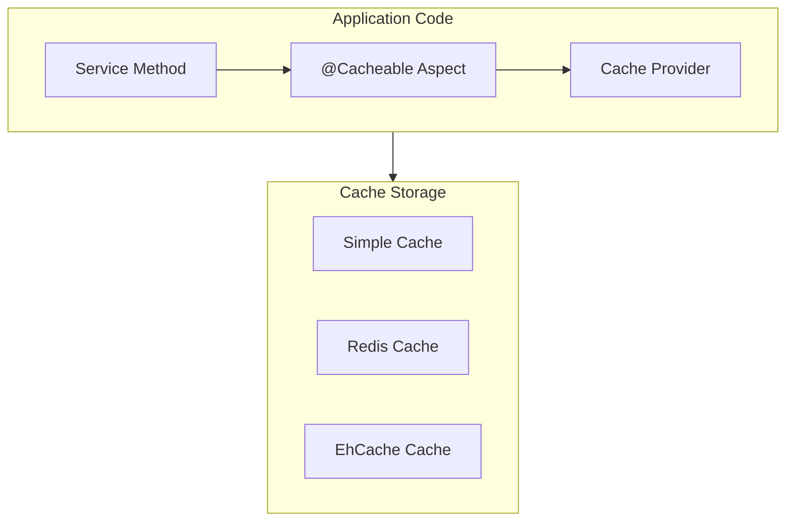

# Spring Cache: Полное руководство по кешированию


### См. также
- [Вопросы на собеседовании](../../../interview/frameworks/spring/spring-cache-interview.md) — подготовка к интервью

## Полезные ссылки

[Официальная документация Spring](https://docs.spring.io/)
[Spring Projects](https://spring.io/projects)

## Содержание

- [Введение в Spring Cache](#введение-в-spring-cache)
  - [Основные возможности](#основные-возможности)
  - [Архитектура Spring Cache](#архитектура-spring-cache)
- [Настройка Spring Cache](#настройка-spring-cache)
  - [Включение кеширования](#включение-кеширования)
  - [Spring Boot Auto-Configuration](#spring-boot-auto-configuration)
- [@Cacheable](#cacheable)
  - [Базовое использование](#базовое-использование)
  - [Условное кеширование](#условное-кеширование)
  - [Кастомные ключи](#кастомные-ключи)
  - [Кеширование списков](#кеширование-списков)
- [@CacheEvict](#cacheevict)
  - [Базовое использование](#базовое-использование-1)
  - [beforeInvocation](#beforeinvocation)
- [@CachePut](#cacheput)
- [@Caching](#caching)
- [Redis Cache](#redis-cache)
  - [Настройка Redis Cache Manager](#настройка-redis-cache-manager)
  - [Использование Redis Cache](#использование-redis-cache)
  - [Конфигурация через application.properties](#конфигурация-через-applicationproperties)
- [EhCache](#ehcache)
  - [Настройка EhCache](#настройка-ehcache)
- [Caffeine Cache](#caffeine-cache)
  - [Настройка Caffeine](#настройка-caffeine)
- [Программное управление кешем](#программное-управление-кешем)
- [Лучшие практики](#лучшие-практики)
  - [1. Используйте осмысленные имена кешей](#1-используйте-осмысленные-имена-кешей)
  - [2. Настраивайте TTL в зависимости от данных](#2-настраивайте-ttl-в-зависимости-от-данных)
  - [3. Используйте condition и unless](#3-используйте-condition-и-unless)
  - [4. Очищайте кеш при обновлении](#4-очищайте-кеш-при-обновлении)
  - [5. Мониторьте производительность кеша](#5-мониторьте-производительность-кеша)
- [Заключение](#заключение)
- [Дополнительные ресурсы](#дополнительные-ресурсы)
- [См. также](#см-также-1)

## Введение в Spring Cache

**Spring Cache** предоставляет абстракцию для кеширования, которая позволяет легко добавлять кеширование в приложения без изменения бизнес-логики. Поддерживаются различные провайдеры кеширования: простой **in-memory cache**, **EhCache**, **Caffeine**, **Redis** и другие.

### Основные возможности

- **Аннотации**: @**Cacheable**, @**CacheEvict**, @**CachePut**, @**Caching**
- **Абстракция**: Независимость от конкретной реализации кеша
- **Гибкость**: Легкое переключение между провайдерами
- **Производительность**: Значительное улучшение производительности приложений

### Архитектура Spring Cache



## Настройка Spring Cache

### Включение кеширования

**Конфигурация **CacheManager** с @**EnableCaching**:**

```java
// Включение кеширования и настройка CacheManager
@Configuration
@EnableCaching
public class CacheConfig {

    @Bean
    public CacheManager cacheManager() {
        SimpleCacheManager cacheManager = new SimpleCacheManager();
        cacheManager.setCaches(Arrays.asList(
            new ConcurrentMapCache("users"),
            new ConcurrentMapCache("products"),
            new ConcurrentMapCache("orders")
        ));
        return cacheManager;
    }
}
```

### Spring Boot Auto-Configuration

**Spring Boot** автоматически настраивает кеширование при наличии зависимости:**

```xml
<dependency>
    <groupId>org.springframework.boot</groupId>
    <artifactId>spring-boot-starter-cache</artifactId>
</dependency>
```

## @Cacheable

Аннотация @**Cacheable** указывает, что результат метода должен быть закеширован.

### Базовое использование

```java
// Сервис с кешированием по ключу "users"
@Service
public class UserService {

    @Cacheable("users")
    public User findById(Long id) {
        System.out.println("Fetching user from database: " + id);
        return userRepository.findById(id)
            .orElseThrow(() -> new UserNotFoundException(id));
    }

    @Cacheable(value = "users", key = "#id")
    public User getUser(Long id) {
        return userRepository.findById(id)
            .orElseThrow(() -> new UserNotFoundException(id));
    }
}
```

### Условное кеширование

```java
// condition и unless для условного кеширования
@Service
public class UserService {

    @Cacheable(value = "users", condition = "#id > 0")
    public User findById(Long id) {
        return userRepository.findById(id)
            .orElseThrow(() -> new UserNotFoundException(id));
    }

    @Cacheable(value = "users", unless = "#result == null")
    public User findById(Long id) {
        return userRepository.findById(id).orElse(null);
    }

    @Cacheable(value = "users",
               condition = "#id > 10",
               unless = "#result.age < 18")
    public User findById(Long id) {
        return userRepository.findById(id)
            .orElseThrow(() -> new UserNotFoundException(id));
    }
}
```

### Кастомные ключи

```java
// Кастомный ключ кеша через SpEL (key = "#user.id", "#p0" и т.д.)
@Service
public class UserService {

    @Cacheable(value = "users", key = "#user.id")
    public User save(User user) {
        return userRepository.save(user);
    }

    @Cacheable(value = "users", key = "#p0")
    public User findById(Long id) {
        return userRepository.findById(id)
            .orElseThrow(() -> new UserNotFoundException(id));
    }

    @Cacheable(value = "users", key = "#id + '_' + #name")
    public User findByIdAndName(Long id, String name) {
        return userRepository.findByIdAndName(id, name);
    }

    @Cacheable(value = "users", key = "T(String).valueOf(#id).concat('-').concat(#name)")
    public User findByIdAndNameComplex(Long id, String name) {
        return userRepository.findByIdAndName(id, name);
    }
}
```

### Кеширование списков

```java
// Кеширование списка и пагинированного результата
@Service
public class UserService {

    @Cacheable(value = "users")
    public List<User> findAll() {
        return userRepository.findAll();
    }

    @Cacheable(value = "users", key = "#page + '_' + #size")
    public List<User> findAll(int page, int size) {
        return userRepository.findAll(PageRequest.of(page, size));
    }
}
```

## @CacheEvict

Аннотация @**CacheEvict** позволяет удалять записи из кеша.

### Базовое использование

```java
// Очистка кеша по ключу или всех записей (allEntries)
@Service
public class UserService {

    @CacheEvict(value = "users", key = "#id")
    public void deleteById(Long id) {
        userRepository.deleteById(id);
    }

    @CacheEvict(value = "users", allEntries = true)
    public void deleteAll() {
        userRepository.deleteAll();
    }
}
```

### beforeInvocation

```java
@Service
public class UserService {

    // Удаление происходит после выполнения метода
    @CacheEvict(value = "users", key = "#id")
    public void deleteById(Long id) {
        userRepository.deleteById(id);
    }

    // Удаление происходит до выполнения метода
    @CacheEvict(value = "users", key = "#id", beforeInvocation = true)
    public void deleteByIdBefore(Long id) {
        userRepository.deleteById(id);
    }
}
```

## @CachePut

Аннотация @**CachePut** обновляет кеш, не проверяя существующие записи.

```java
@Service
public class UserService {

    @CachePut(value = "users", key = "#user.id")
    public User update(User user) {
        return userRepository.save(user);
    }

    @CachePut(value = "users", key = "#result.id")
    public User create(User user) {
        return userRepository.save(user);
    }
}
```

## @Caching

Аннотация @**Caching** позволяет комбинировать несколько операций кеширования.

```java
@Service
public class UserService {

    @Caching(
        cacheable = {
            @Cacheable(value = "users", key = "#id")
        },
        evict = {
            @CacheEvict(value = "usersList", allEntries = true)
        }
    )
    public User findById(Long id) {
        return userRepository.findById(id)
            .orElseThrow(() -> new UserNotFoundException(id));
    }

    @Caching(
        put = {
            @CachePut(value = "users", key = "#user.id"),
            @CachePut(value = "usersByEmail", key = "#user.email")
        },
        evict = {
            @CacheEvict(value = "usersList", allEntries = true)
        }
    )
    public User update(User user) {
        return userRepository.save(user);
    }
}
```

## Redis Cache

### Настройка Redis Cache Manager

```xml
<dependency>
    <groupId>org.springframework.boot</groupId>
    <artifactId>spring-boot-starter-data-redis</artifactId>
</dependency>
```

```java
@Configuration
@EnableCaching
public class RedisCacheConfig {

    @Bean
    public RedisConnectionFactory redisConnectionFactory() {
        RedisStandaloneConfiguration config = new RedisStandaloneConfiguration();
        config.setHostName("localhost");
        config.setPort(6379);
        return new LettuceConnectionFactory(config);
    }

    @Bean
    public CacheManager cacheManager(RedisConnectionFactory connectionFactory) {
        RedisCacheConfiguration config = RedisCacheConfiguration.defaultCacheConfig()
            .entryTtl(Duration.ofHours(1))
            .serializeKeysWith(RedisSerializationContext.SerializationPair
                .fromSerializer(new StringRedisSerializer()))
            .serializeValuesWith(RedisSerializationContext.SerializationPair
                .fromSerializer(new GenericJackson2JsonRedisSerializer()))
            .disableCachingNullValues();

        return RedisCacheManager.builder(connectionFactory)
            .cacheDefaults(config)
            .withCacheConfiguration("users",
                config.entryTtl(Duration.ofMinutes(30)))
            .withCacheConfiguration("products",
                config.entryTtl(Duration.ofHours(2)))
            .transactionAware()
            .build();
    }
}
```

### Использование Redis Cache

```java
@Service
public class UserService {

    @Cacheable(value = "users", key = "#id")
    public User findById(Long id) {
        return userRepository.findById(id)
            .orElseThrow(() -> new UserNotFoundException(id));
    }

    @CacheEvict(value = "users", key = "#id")
    public void deleteById(Long id) {
        userRepository.deleteById(id);
    }
}
```

### Конфигурация через application.properties

```properties
# Redis Configuration
spring.redis.host=localhost
spring.redis.port=6379
spring.redis.password=
spring.redis.timeout=2000ms

# Cache Configuration
spring.cache.type=redis
spring.cache.redis.time-to-live=3600000
spring.cache.redis.cache-null-values=false
spring.cache.redis.key-prefix=cache:
spring.cache.redis.use-key-prefix=true
```

## EhCache

### Настройка EhCache

```xml
<dependency>
    <groupId>org.springframework.boot</groupId>
    <artifactId>spring-boot-starter-cache</artifactId>
</dependency>
<dependency>
    <groupId>org.ehcache</groupId>
    <artifactId>ehcache</artifactId>
</dependency>
```

**ehcache.xml:**

```xml
<config xmlns:xsi="http://www.w3.org/2001/XMLSchema-instance"
        xsi:noNamespaceSchemaLocation="ehcache.xsd">

    <cache alias="users">
        <key-type>java.lang.Long</key-type>
        <value-type>com.example.User</value-type>
        <expiry>
            <ttl unit="minutes">30</ttl>
        </expiry>
        <resources>
            <heap unit="entries">1000</heap>
            <offheap unit="MB">10</offheap>
        </resources>
    </cache>

    <cache alias="products">
        <key-type>java.lang.Long</key-type>
        <value-type>com.example.Product</value-type>
        <expiry>
            <ttl unit="hours">2</ttl>
        </expiry>
        <resources>
            <heap unit="entries">5000</heap>
            <offheap unit="MB">50</offheap>
        </resources>
    </cache>
</config>
```

```java
@Configuration
@EnableCaching
public class EhCacheConfig {

    @Bean
    public CacheManager cacheManager() {
        return new EhCacheCacheManager(ehCacheManager());
    }

    @Bean
    public EhCacheManagerFactoryBean ehCacheManager() {
        EhCacheManagerFactoryBean factory = new EhCacheManagerFactoryBean();
        factory.setConfigLocation(new ClassPathResource("ehcache.xml"));
        factory.setShared(true);
        return factory;
    }
}
```

## Caffeine Cache

### Настройка Caffeine

```xml
<dependency>
    <groupId>com.github.ben-manes.caffeine</groupId>
    <artifactId>caffeine</artifactId>
</dependency>
```

```java
@Configuration
@EnableCaching
public class CaffeineCacheConfig {

    @Bean
    public CacheManager cacheManager() {
        CaffeineCache usersCache = new CaffeineCache("users",
            Caffeine.newBuilder()
                .maximumSize(1000)
                .expireAfterWrite(30, TimeUnit.MINUTES)
                .recordStats()
                .build());

        CaffeineCache productsCache = new CaffeineCache("products",
            Caffeine.newBuilder()
                .maximumSize(5000)
                .expireAfterWrite(2, TimeUnit.HOURS)
                .recordStats()
                .build());

        SimpleCacheManager cacheManager = new SimpleCacheManager();
        cacheManager.setCaches(Arrays.asList(usersCache, productsCache));
        return cacheManager;
    }
}
```

## Программное управление кешем

```java
@Service
public class CacheService {

    @Autowired
    private CacheManager cacheManager;

    public void evictUserCache(Long userId) {
        Cache cache = cacheManager.getCache("users");
        if (cache != null) {
            cache.evict(userId);
        }
    }

    public void evictAllUsers() {
        Cache cache = cacheManager.getCache("users");
        if (cache != null) {
            cache.clear();
        }
    }

    public void putUserInCache(User user) {
        Cache cache = cacheManager.getCache("users");
        if (cache != null) {
            cache.put(user.getId(), user);
        }
    }

    public User getUserFromCache(Long userId) {
        Cache cache = cacheManager.getCache("users");
        if (cache != null) {
            Cache.ValueWrapper wrapper = cache.get(userId);
            if (wrapper != null) {
                return (User) wrapper.get();
            }
        }
        return null;
    }
}
```

## Лучшие практики

### 1. Используйте осмысленные имена кешей

```java
// ✅ Хорошо
@Cacheable("users")
@Cacheable("products")
@Cacheable("orders")

// ❌ Плохо
@Cacheable("cache1")
@Cacheable("data")
```

### 2. Настраивайте TTL в зависимости от данных

```java
// ✅ Хорошо - статические данные кешируются дольше
@Cacheable(value = "products", key = "#id")
// TTL: 2 hours

// ✅ Хорошо - динамические данные кешируются меньше
@Cacheable(value = "users", key = "#id")
// TTL: 30 minutes
```

### 3. Используйте condition и unless

```java
// ✅ Хорошо
@Cacheable(value = "users",
           condition = "#id > 0",
           unless = "#result == null")
public User findById(Long id) {
    // ...
}
```

### 4. Очищайте кеш при обновлении

```java
// ✅ Хорошо
@CacheEvict(value = "users", key = "#user.id")
public User update(User user) {
    return userRepository.save(user);
}
```

### 5. Мониторьте производительность кеша

```java
// ✅ Хорошо - используйте статистику
Caffeine.newBuilder()
    .recordStats()
    .build();
```

## Заключение

**Spring Cache** предоставляет мощную абстракцию для кеширования, которая значительно улучшает производительность приложений. Выбор правильного провайдера кеша и настройка **TTL** критичны для эффективного использования кеширования.

## Дополнительные ресурсы

- [**Spring Cache** Documentation](https://docs.spring.io/spring-framework/reference/integration/cache.html)
- [**Spring Boot** Cache](https://docs.spring.io/spring-boot/docs/current/reference/html/io.html#io.caching)
- [Baeldung **Spring** Cache](https://www.baeldung.com/spring-cache-tutorial)

## См. также

- [Spring Actuator: Полное руководство по мониторингу и управлению](spring-actuator.md)
- [Spring AI](spring-ai.md)
- [Spring AOP: Полное руководство по аспектно-ориентированному программированию](spring-aop.md)
- [Spring Batch для Java](spring-batch.md)
- [Spring Boot — Полное руководство](../../spring/spring-boot.md)
