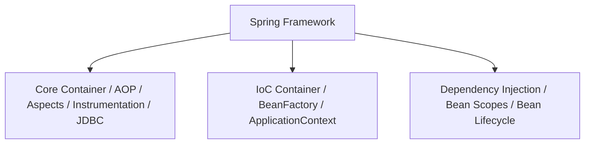

# Spring Core: Inversion of Control и Dependency Injection

## Введение в Spring Framework

**Spring Framework** — это всеобъемлющая платформа для разработки **Java**-приложений корпоративного уровня. Он предоставляет инфраструктуру, которая упрощает разработку приложений, позволяя разработчикам сосредоточиться на бизнес-логике, а не на инфраструктурном коде.

### Основные возможности Spring Core

- **Inversion of Control (IoC)**: управление жизненным циклом объектов
- **Dependency Injection (DI)**: внедрение зависимостей
- **Aspect-Oriented Programming (AOP)**: аспектно-ориентированное программирование
- **Application Context**: Контекст приложения с дополнительными возможностями
- **Bean Management**: Управление жизненным циклом бинов
- **Configuration**: Гибкие способы конфигурации

### Архитектура Spring Core



## Полезные ссылки

### Официальная документация

- [**Spring** Documentation](https://spring.io/projects/spring-framework)
- [**Spring Framework** Reference](https://docs.spring.io/spring-framework/reference/)

### Обучающие материалы

- [**Spring** Tutorial](https://www.baeldung.com/spring-tutorial)

## Содержание

- [Inversion of Control (IoC) и Dependency Injection (DI)](#inversion-of-control-ioc-и-dependency-injection-di)
  - [Что такое Inversion of Control?](#что-такое-inversion-of-control)
  - [Преимущества IoC](#преимущества-ioc)
  - [Что такое Dependency Injection?](#что-такое-dependency-injection)
  - [Типы Dependency Injection](#типы-dependency-injection)
    - [1. Constructor Injection (Рекомендуемый)](#1-constructor-injection-рекомендуемый)
    - [2. Setter Injection](#2-setter-injection)
    - [3. Field Injection (Антипаттерн)](#3-field-injection-антипаттерн)
  - [Autowiring в Spring](#autowiring-в-spring)
    - [Типы Autowiring](#типы-autowiring)
    - [XML конфигурация](#xml-конфигурация)
    - [Аннотационная конфигурация](#аннотационная-конфигурация)
  - [Qualifiers для разрешения неоднозначности](#qualifiers-для-разрешения-неоднозначности)
- [Контейнеры Spring](#контейнеры-spring)
  - [BeanFactory](#beanfactory)
  - [ApplicationContext](#applicationcontext)
  - [Сравнение BeanFactory и ApplicationContext](#сравнение-beanfactory-и-applicationcontext)
- [Руководство по Spring](#руководство-по-spring)
  - [Режимы автоматического подключения](#режимы-автоматического-подключения)
  - [@SpringBootApplication](#springbootapplication)
- [Bean Management в Spring](#bean-management-в-spring)
  - [Что такое Bean в Spring?](#что-такое-bean-в-spring)
  - [Характеристики Bean](#характеристики-bean)
  - [Жизненный цикл бина](#жизненный-цикл-бина)
    - [Пример жизненного цикла](#пример-жизненного-цикла)
  - [Bean Scopes (Области видимости)](#bean-scopes-области-видимости)
    - [1. Singleton (По умолчанию)](#1-singleton-по-умолчанию)
    - [2. Prototype](#2-prototype)
    - [3. Request (Только для веб-приложений)](#3-request-только-для-веб-приложений)
    - [4. Session (Только для веб-приложений)](#4-session-только-для-веб-приложений)
    - [5. Application (Только для веб-приложений)](#5-application-только-для-веб-приложений)
    - [6. Custom Scopes](#6-custom-scopes)
  - [Bean Definition](#bean-definition)
    - [XML конфигурация](#xml-конфигурация-1)
    - [Java конфигурация](#java-конфигурация)
    - [Аннотационная конфигурация](#аннотационная-конфигурация-1)
  - [BeanFactory.getBean()](#beanfactorygetbean)
  - [Lazy и Eager инициализация](#lazy-и-eager-инициализация)
    - [Eager Initialization (По умолчанию)](#eager-initialization-по-умолчанию)
    - [Lazy Initialization](#lazy-initialization)
    - [Глобальная настройка lazy initialization](#глобальная-настройка-lazy-initialization)
- [Advanced Spring Core Features](#advanced-spring-core-features)
  - [Factory Beans](#factory-beans)
  - [Bean Post Processors](#bean-post-processors)
  - [Property Sources и Environment](#property-sources-и-environment)
  - [Profiles для разных сред](#profiles-для-разных-сред)
  - [Conditional Configuration](#conditional-configuration)
- [Лучшие практики и решение проблем](#лучшие-практики-и-решение-проблем)
  - [Лучшие практики Spring Core](#лучшие-практики-spring-core)
  - [Распространенные ошибки](#распространенные-ошибки)
    - [1. Циклические зависимости](#1-циклические-зависимости)
    - [2. Неправильный scope](#2-неправильный-scope)
    - [3. Resource leaks](#3-resource-leaks)
  - [Производительность и оптимизации](#производительность-и-оптимизации)
    - [1. Lazy initialization](#1-lazy-initialization)
    - [2. Bean definition optimization](#2-bean-definition-optimization)
    - [3. Component scanning optimization](#3-component-scanning-optimization)
  - [Тестирование Spring приложений](#тестирование-spring-приложений)
- [Заключение](#заключение)
  - [Ключевые принципы:](#ключевые-принципы)
  - [Документация и ресурсы:](#документация-и-ресурсы)
  - [@Primary](#primary)
  - [@Order](#order)
  - [Получение доступа к бинам для тестирования](#получение-доступа-к-бинам-для-тестирования)
  - [Области видимости бинов](#области-видимости-бинов)
  - [Внедрение зависимости через Lombok](#внедрение-зависимости-через-lombok)
  - [Factory Bean](#factory-bean)
- [Руководство по Application Context](#руководство-по-application-context)
  - [Типы ApplicationContext](#типы-applicationcontext)
  - [Получение бинов из ApplicationContext](#получение-бинов-из-applicationcontext)
  - [Проверка наличия бина](#проверка-наличия-бина)
  - [Получение всех бинов определенного типа](#получение-всех-бинов-определенного-типа)
- [Разница между BeanFactory и ApplicationContext](#разница-между-beanfactory-и-applicationcontext)
  - [Основные различия](#основные-различия)
  - [Когда использовать BeanFactory?](#когда-использовать-beanfactory)
  - [Когда использовать ApplicationContext?](#когда-использовать-applicationcontext)
- [Введение в Inversion of Control и Dependency Injection](#введение-в-inversion-of-control-и-dependency-injection)
  - [Инверсия управления (IoC)](#инверсия-управления-ioc)
  - [Преимущества IoC](#преимущества-ioc-1)
  - [Dependency Injection (DI)](#dependency-injection-di)
  - [Традиционный подход (плохой)](#традиционный-подход-плохой)
  - [Подход с Dependency Injection (хороший)](#подход-с-dependency-injection-хороший)
  - [Контейнер IoC в Spring](#контейнер-ioc-в-spring)
  - [Внедрение через конструктор](#внедрение-через-конструктор)
  - [Внедрение через сеттер](#внедрение-через-сеттер)
  - [Внедрение через поле (Field-Based DI)](#внедрение-через-поле-field-based-di)
  - [Автоматическое связывание (Autowiring)](#автоматическое-связывание-autowiring)
  - [Ленивая инициализация](#ленивая-инициализация)
- [Руководство по Ahead-of-Time в Spring 6](#руководство-по-ahead-of-time-в-spring-6)
  - [Что такое AOT компиляция?](#что-такое-aot-компиляция)
  - [Варианты выполнения в Spring 6](#варианты-выполнения-в-spring-6)
  - [Преимущества AOT компиляции](#преимущества-aot-компиляции)
  - [Использование AOT компиляции](#использование-aot-компиляции)
- [Получение текущего Application Context](#получение-текущего-application-context)
  - [Способ 1: Реализация ApplicationContextAware](#способ-1-реализация-applicationcontextaware)
  - [Способ 2: Инъекция ApplicationContext](#способ-2-инъекция-applicationcontext)
  - [Способ 3: Использование @Autowired с конструктором](#способ-3-использование-autowired-с-конструктором)
- [Руководство по внедрению зависимости через конструктор](#руководство-по-внедрению-зависимости-через-конструктор)
  - [Преимущества](#преимущества)
  - [Пример](#пример)
  - [С @Autowired (опционально)](#с-autowired-опционально)
- [Почему внедрение зависимости через поле не рекомендуется?](#почему-внедрение-зависимости-через-поле-не-рекомендуется)
  - [Недостатки](#недостатки)
  - [Вывод](#вывод)
- [Что такое Bean?](#что-такое-bean)
  - [Определение Bean](#определение-bean)
  - [IoC Container](#ioc-container)
  - [Пример](#пример-1)
  - [Традиционный подход](#традиционный-подход)
  - [Подход с Spring](#подход-с-spring)
- [Руководство по Spring Bean Scopes](#руководство-по-spring-bean-scopes)
  - [Singleton Scope (по умолчанию)](#singleton-scope-по-умолчанию)
  - [Prototype Scope](#prototype-scope)
  - [Request Scope](#request-scope)
  - [Session Scope](#session-scope)
  - [Application Scope](#application-scope)
  - [WebSocket Scope](#websocket-scope)
- [Руководство по BeanFactory.getBean()](#руководство-по-beanfactorygetbean)
  - [Способы получения бинов](#способы-получения-бинов)
  - [Проверка наличия бина](#проверка-наличия-бина-1)
  - [Получение всех бинов определенного типа](#получение-всех-бинов-определенного-типа-1)
  - [Предупреждение](#предупреждение)
- [См. также](#см-также)

## Inversion of Control (IoC) и Dependency Injection (DI)

### Что такое Inversion of Control?

**Inversion of `Control` (IoC)** — это принцип проектирования, при котором контроль над созданием и управлением объектами передается от кода приложения к фреймворку. Вместо того чтобы создавать объекты вручную с помощью оператора `new`, **Spring** берет на себя ответственность за создание, настройку и управление жизненным циклом объектов.

### Преимущества IoC

1. **Разделение ответственности**: Код приложения фокусируется на бизнес-логике
2. **Управление жизненным циклом**: **Spring** управляет созданием и уничтожением объектов
3. **Тестируемость**: Легче создавать **mock** объекты для тестирования
4. **Гибкость**: Легко менять реализации без изменения кода
5. **Внедрение зависимостей**: Автоматическое разрешение зависимостей

### Что такое Dependency Injection?

**Dependency `Injection` (DI)** — это паттерн, который реализует принцип **IoC**. Он позволяет объектам получать свои зависимости извне, а не создавать их самостоятельно.

```java
// Без DI - тесная связь
public class UserService {
    private UserRepository repository = new UserRepositoryImpl();

    public User getUser(String id) {
        return repository.findById(id);
    }
}

// С DI - слабая связь
public class UserService {
    private UserRepository repository;

    // Constructor injection
    public UserService(UserRepository repository) {
        this.repository = repository;
    }

    public User getUser(String id) {
        return repository.findById(id);
    }
}
```

### Типы Dependency Injection

#### 1. Constructor Injection (Рекомендуемый)

```java
// Внедрение зависимостей через конструктор (рекомендуемый способ)
@Component
public class OrderService {
    private final UserService userService;
    private final PaymentService paymentService;

    // Все зависимости передаются через конструктор
    public OrderService(UserService userService, PaymentService paymentService) {
        this.userService = userService;
        this.paymentService = paymentService;
    }
}
```

**Преимущества:**
- Неизменность (immutability) объекта
- Легче тестировать
- **Spring** гарантирует, что все зависимости внедрены
- Предотвращает циклические зависимости

#### 2. Setter Injection

```java
// Зависимость внедряется через setter-метод (опциональные зависимости)
@Component
public class NotificationService {
    private EmailService emailService;

    // Зависимость внедряется через setter
    @Autowired
    public void setEmailService(EmailService emailService) {
        this.emailService = emailService;
    }
}
```

**Использование:**
- Для опциональных зависимостей
- Когда нужно изменить зависимость во время выполнения
- Для избежания циклических зависимостей

#### 3. Field Injection (Антипаттерн)

```java
// Field injection через @Autowired — не рекомендуется (сложно тестировать)
@Component
public class ReportService {
    // Не рекомендуется!
    @Autowired
    private DataService dataService;
}
```

**Проблемы:**
- Трудно тестировать (нужен reflection или фреймворк)
- Нарушает принцип единственной ответственности
- Скрытые зависимости
- Трудно обнаружить циклические зависимости

### Autowiring в Spring

#### Типы Autowiring

1. **no** (по умолчанию) — нет автоматического связывания
2. **byName** — по имени свойства
3. **byType** — по типу
4. **constructor** — по конструктору

#### XML конфигурация

```xml
<!-- XML: объявление бинов и autowire byType -->
<bean id="userService" class="com.example.UserService" autowire="byType"/>
<bean id="userRepository" class="com.example.UserRepositoryImpl"/>
```

#### Аннотационная конфигурация

```java
// Java-конфигурация с компонентным сканированием
@Configuration
@ComponentScan(basePackages = "com.example")
public class AppConfig {
    // Конфигурационные методы
}

@Service
public class UserService {

    private final UserRepository userRepository;

    @Autowired  // Не обязательно для конструктора с Spring 4.3+
    public UserService(UserRepository userRepository) {
        this.userRepository = userRepository;
    }
}
```

### Qualifiers для разрешения неоднозначности

```java
// Выбор реализации через @Qualifier при нескольких бинах одного типа
public interface PaymentService {
    void processPayment(Order order);
}

@Service
@Qualifier("creditCardPayment")
public class CreditCardPaymentService implements PaymentService {
    // Implementation
}

@Service
@Qualifier("paypalPayment")
public class PaypalPaymentService implements PaymentService {
    // Implementation
}

@Service
public class OrderService {

    private final PaymentService paymentService;

    public OrderService(@Qualifier("creditCardPayment") PaymentService paymentService) {
        this.paymentService = paymentService;
    }
}
```

## Контейнеры Spring

### BeanFactory

**BeanFactory** — это базовый интерфейс **IoC** контейнера в **Spring**. Он предоставляет основные возможности для управления бинами.

```java
// Получение BeanFactory
Resource resource = new ClassPathResource("applicationContext.xml");
BeanFactory factory = new XmlBeanFactory(resource);

// Получение бина
UserService userService = (UserService) factory.getBean("userService");
```

**Особенности `BeanFactory`:**
- **Lazy loading** бинов
- Минималистичный интерфейс
- Основные возможности **IoC**
- Не поддерживает **AOP**

### ApplicationContext

**ApplicationContext** — это расширенная версия **BeanFactory** с дополнительными возможностями.

```java
// Разные реализации ApplicationContext
ApplicationContext context = new ClassPathXmlApplicationContext("applicationContext.xml");
ApplicationContext context = new AnnotationConfigApplicationContext(AppConfig.class);
ApplicationContext context = new FileSystemXmlApplicationContext("c:/app/applicationContext.xml");
```

**Дополнительные возможности `ApplicationContext`:**
- Автоматическое создание и управление бинами
- **AOP** интеграция
- **Event handling**
- **Internationalization**
- **Resource loading**
- **BeanPostProcessor** поддержка

### Сравнение BeanFactory и ApplicationContext

| Характеристика | **BeanFactory** | **ApplicationContext** |
|---|---|---|
| **Загрузка бинов** | **Lazy** | **Eager** |
| **AOP** | Не поддерживает | Поддерживает |
| **Events** | Не поддерживает | Поддерживает |
| **i18n** | Не поддерживает | Поддерживает |
| **Resource loading** | Ограничено | Полная поддержка |
| **Annotation processing** | Ограничено | Полная поддержка |
| **Производительность** | Быстрее при запуске | Медленнее при запуске, но быстрее в **runtime** |

## Руководство по Spring

Платформа **Spring** предоставляет несколько реализаций интерфейса **ApplicationContext: ClassPathXmlApplicationContext** и **FileSystemXmlApplicationContext** для автономных приложений и **WebApplicationContext** для веб-приложений**.

### Режимы автоматического подключения

Существует четыре режима автоматического подключения **bean-**компонента с использованием конфигурации **XML:**

1.  **no:** значение по умолчанию — это означает, что для **bean-**компонента не используется автоматическое подключение, и мы должны явно указать зависимости**.
2.  **byName:** автоматическое подключение выполняется на основе имени свойства, поэтому **Spring** будет искать **bean-**компонент с тем же именем, что и свойство, которое необходимо установить**.
3.  **byType:** аналогично автонастройке **byName,** только в зависимости от типа свойства**. Это означает, что **Spring** будет искать **bean**-**компонент с тем же типом свойства, которое нужно установить**. Если существует более одного **bean-**компонента этого типа, фреймворк выдает исключение**.
4.  **constructor:** автоматическое подключение выполняется на основе аргументов конструктора, что означает, что **Spring** будет искать **bean-**компоненты с тем же типом, что и аргументы конструктора**.

**Внедрение зависимостей должно происходить в конструкторе.**

### @SpringBootApplication

Кроме того, **Spring Boot** представляет аннотацию **@SpringBootApplication**. Эта единственная аннотация эквивалентна использованию **@Configuration**, **@EnableAutoConfiguration** и **@ComponentScan**.

```java
// Точка входа Spring Boot: @SpringBootApplication объединяет конфигурацию и сканирование
@SpringBootApplication
public class Application {
    public static void main(String[] args) {
        SpringApplication.run(Application.class, args);
    }
}

// Эквивалентно:
@Configuration
@EnableAutoConfiguration
@ComponentScan
public class Application {
    // ...
}
```

## Bean Management в Spring

### Что такое Bean в Spring?

**Bean** — это объект, жизненным циклом которого управляет **Spring IoC** контейнер. **Bean**'ы являются основными строительными блоками **Spring**-приложений.

### Характеристики Bean

1. **Идентификатор**: Уникальное имя бина в контейнере
2. **Тип**: Класс, экземпляры которого создает контейнер
3. **Область видимости (Scope)**: Определяет жизненный цикл бина
4. **Свойства**: Зависимости и конфигурационные параметры
5. **Callback методы**: Методы жизненного цикла

### Жизненный цикл бина

```text
# Жизненный цикл бина: определение → создание → инициализация → использование → уничтожение
1. Bean Definition                    // Определение бина
    ↓
2. Instantiation                     // Создание экземпляра
    ↓
3. Population of Properties          // Внедрение зависимостей
    ↓
4. BeanNameAware.setBeanName()       // Установка имени бина
    ↓
5. BeanFactoryAware.setBeanFactory() // Установка BeanFactory
    ↓
6. ApplicationContextAware...        // Установка ApplicationContext
    ↓
7. BeanPostProcessor.postProcessBeforeInitialization()
    ↓
8. @PostConstruct / InitializingBean.afterPropertiesSet()
    ↓
9. BeanPostProcessor.postProcessAfterInitialization()
    ↓
10. Bean готов к использованию
     ↓
11. @PreDestroy / DisposableBean.destroy() при завершении
```

#### Пример жизненного цикла

```java
@Component
public class LifeCycleBean implements BeanNameAware, BeanFactoryAware,
        ApplicationContextAware, InitializingBean, DisposableBean {

    private String beanName;
    private BeanFactory beanFactory;
    private ApplicationContext applicationContext;

    // 1. Конструктор
    public LifeCycleBean() {
        System.out.println("1. Bean instantiated");
    }

    // 2. BeanNameAware
    @Override
    public void setBeanName(String name) {
        this.beanName = name;
        System.out.println("2. Bean name set: " + name);
    }

    // 3. BeanFactoryAware
    @Override
    public void setBeanFactory(BeanFactory beanFactory) throws BeansException {
        this.beanFactory = beanFactory;
        System.out.println("3. BeanFactory set");
    }

    // 4. ApplicationContextAware
    @Override
    public void setApplicationContext(ApplicationContext applicationContext) throws BeansException {
        this.applicationContext = applicationContext;
        System.out.println("4. ApplicationContext set");
    }

    // 5. @PostConstruct или afterPropertiesSet
    @PostConstruct
    public void init() {
        System.out.println("5. Bean initialized with @PostConstruct");
    }

    @Override
    public void afterPropertiesSet() throws Exception {
        System.out.println("5. Bean initialized with InitializingBean");
    }

    // 6. Bean готов к использованию
    public void doSomething() {
        System.out.println("6. Bean is ready to use");
    }

    // 7. @PreDestroy или destroy
    @PreDestroy
    public void cleanup() {
        System.out.println("7. Bean cleanup with @PreDestroy");
    }

    @Override
    public void destroy() throws Exception {
        System.out.println("7. Bean cleanup with DisposableBean");
    }
}
```

### Bean Scopes (Области видимости)

**Spring** предоставляет несколько областей видимости для бинов:**

#### 1. Singleton (По умолчанию)

```java
@Component
@Scope("singleton")  // или просто @Component
public class SingletonBean {
    // Один экземпляр на весь контейнер
}
```

**Характеристики:**
- Один экземпляр на **Spring IoC** контейнер
- Разделяется между всеми запросами
- Создается при старте контекста (если не lazy)
- **Thread-safe** (если сам бин `thread`-safe)

#### 2. Prototype

```java
@Component
@Scope("prototype")
public class PrototypeBean {
    // Новый экземпляр при каждом запросе
}
```

**Характеристики:**
- Новый экземпляр при каждом запросе `getBean()` или внедрении
- Не управляется жизненным циклом контейнера
- Не получает **callback**'и уничтожения
- Может быть не **thread-safe**

#### 3. Request (Только для веб-приложений)

```java
@Component
@Scope(value = WebApplicationContext.SCOPE_REQUEST, proxyMode = ScopedProxyMode.TARGET_CLASS)
public class RequestBean {
    // Один экземпляр на HTTP запрос
}
```

**Характеристики:**
- Один экземпляр на **HTTP** запрос
- Создается при первом доступе в запросе
- Уничтожается при завершении запроса

#### 4. Session (Только для веб-приложений)

```java
@Component
@Scope(value = WebApplicationContext.SCOPE_SESSION, proxyMode = ScopedProxyMode.TARGET_CLASS)
public class SessionBean {
    // Один экземпляр на HTTP сессию
}
```

**Характеристики:**
- Один экземпляр на **HTTP** сессию пользователя
- Создается при первом доступе в сессии
- Уничтожается при завершении сессии

#### 5. Application (Только для веб-приложений)

```java
@Component
@Scope(value = WebApplicationContext.SCOPE_APPLICATION, proxyMode = ScopedProxyMode.TARGET_CLASS)
public class ApplicationBean {
    // Один экземпляр на ServletContext
}
```

**Характеристики:**
- Один экземпляр на весь веб-приложение
- Аналог **singleton** для веб-контекста

#### 6. Custom Scopes

```java
// Создание кастомного scope
@Component
public class CustomScopeConfigurer implements Scope {

    private final Map<String, Object> scopedObjects = new ConcurrentHashMap<>();

    @Override
    public Object get(String name, ObjectFactory<?> objectFactory) {
        return scopedObjects.computeIfAbsent(name, k -> objectFactory.getObject());
    }

    @Override
    public Object remove(String name) {
        return scopedObjects.remove(name);
    }

    @Override
    public void registerDestructionCallback(String name, Runnable callback) {
        // Регистрация callback'а уничтожения
    }

    @Override
    public Object resolveContextualObject(String key) {
        return null;
    }

    @Override
    public String getConversationId() {
        return "custom";
    }
}

// Регистрация scope
@Configuration
public class ScopeConfig {
    @Bean
    public CustomScopeConfigurer customScope() {
        return new CustomScopeConfigurer();
    }

    @Bean
    public ScopeConfigurer scopeConfigurer(CustomScopeConfigurer customScope) {
        ScopeConfigurer configurer = new ScopeConfigurer();
        configurer.addScope("custom", customScope);
        return configurer;
    }
}
```

### Bean Definition

#### XML конфигурация

```xml
<bean id="userService" class="com.example.UserService" scope="singleton" lazy-init="false">
    <constructor-arg ref="userRepository"/>
    <property name="timeout" value="30"/>
</bean>

<bean id="userRepository" class="com.example.UserRepositoryImpl">
    <constructor-arg value="jdbc:mysql://localhost:3306/mydb"/>
</bean>
```

#### Java конфигурация

```java
// Java-конфигурация с @Configuration и @Bean
@Configuration
public class AppConfig {

    // Бин с scope=prototype и lazy инициализацией
    @Bean
    @Scope("prototype")
    @Lazy
    public UserService userService(UserRepository userRepository) {
        UserService service = new UserService(userRepository);
        service.setTimeout(30);
        return service;
    }

    @Bean
    public UserRepository userRepository() {
        return new UserRepositoryImpl("jdbc:mysql://localhost:3306/mydb");
    }
}
```

#### Аннотационная конфигурация

```java
// Аннотационная конфигурация с @Service, @Scope, @Value
@Service
@Scope("singleton")
public class UserService {

    private final UserRepository userRepository;
    private int timeout = 30;

    @Autowired  // Внедрение через конструктор
    public UserService(UserRepository userRepository) {
        this.userRepository = userRepository;
    }

    @Value("${service.timeout:30}")  // Значение из properties с дефолтом
    public void setTimeout(int timeout) {
        this.timeout = timeout;
    }
}

@Repository
public class UserRepositoryImpl implements UserRepository {
    // Implementation
}
```

### BeanFactory.getBean()

**BeanFactory.`getBean()`** — это основной метод для получения бинов из контейнера.

```java
// Различные способы получения бинов из контейнера
ApplicationContext context = new ClassPathXmlApplicationContext("applicationContext.xml");

// Получение по имени (требует каст)
UserService userService = (UserService) context.getBean("userService");

// Получение по типу (рекомендуется)
UserService userService = context.getBean(UserService.class);

// Получение по имени и типу (безопасно)
UserService userService = context.getBean("userService", UserService.class);

// Проверка существования бина
boolean exists = context.containsBean("userService");

// Получение имен бинов определенного типа
String[] beanNames = context.getBeanNamesForType(UserService.class);

// Получение всех бинов определенного типа (Map: имя -> бин)
Map<String, UserService> userServices = context.getBeansOfType(UserService.class);
```

### Lazy и Eager инициализация

#### Eager Initialization (По умолчанию)

```java
@Configuration
public class AppConfig {

    @Bean
    public ExpensiveBean expensiveBean() {
        return new ExpensiveBean(); // Создается при старте контекста
    }
}
```

**Преимущества:**
- Быстрое обнаружение ошибок конфигурации
- Предсказуемое время запуска

**Недостатки:**
- Дольше время запуска приложения
- Больше потребление памяти

#### Lazy Initialization

```java
@Configuration
public class AppConfig {

    @Bean
    @Lazy
    public ExpensiveBean expensiveBean() {
        return new ExpensiveBean(); // Создается при первом запросе
    }
}

@Component
@Lazy
public class LazyComponent {
    // Создается при первом использовании
}
```

**Преимущества:**
- Быстрее время запуска
- Меньше потребление памяти при старте

**Недостатки:**
- Ошибки конфигурации обнаруживаются позже
- Первый запрос может быть медленным

#### Глобальная настройка lazy initialization

```java
// Включение ленивой инициализации всех бинов через SpringApplicationBuilder
@SpringBootApplication
public class Application {
    public static void main(String[] args) {
        new SpringApplicationBuilder(Application.class)
            .lazyInitialization(true)
            .run(args);
    }
}
```

## Advanced Spring Core Features

### Factory Beans

**FactoryBean** — это интерфейс для создания сложных бинов, которые нельзя создать простым конструктором.

```java
// Фабрика бинов для создания Connection (не создаётся простым new)
@Component
public class ConnectionFactoryBean implements FactoryBean<Connection> {

    private String url;
    private String username;
    private String password;

    @Override
    public Connection getObject() throws Exception {
        // Сложная логика создания объекта
        return DriverManager.getConnection(url, username, password);
    }

    @Override
    public Class<?> getObjectType() {
        return Connection.class;
    }

    @Override
    public boolean isSingleton() {
        return false; // Каждый раз новый объект
    }

    // Getters and setters для свойств
}
```

### Bean Post Processors

**BeanPostProcessor** позволяет модифицировать бины после их создания.

```java
// Модификация бинов до и после инициализации
@Component
public class CustomBeanPostProcessor implements BeanPostProcessor {

    @Override
    public Object postProcessBeforeInitialization(Object bean, String beanName) throws BeansException {
        if (bean instanceof Validatable) {
            // Дополнительная инициализация перед @PostConstruct
            System.out.println("Before initialization: " + beanName);
        }
        return bean;
    }

    @Override
    public Object postProcessAfterInitialization(Object bean, String beanName) throws BeansException {
        if (bean instanceof Validatable) {
            // Дополнительная инициализация после @PostConstruct
            System.out.println("After initialization: " + beanName);
        }
        return bean;
    }
}
```

### Property Sources и Environment

```java
// Загрузка свойств из classpath и внешнего файла
@Configuration
@PropertySource("classpath:application.properties")
@PropertySource("file:/etc/myapp/application.properties")
public class PropertyConfig {

    @Autowired
    private Environment environment;

    @Bean
    public DataSource dataSource() {
        String url = environment.getProperty("database.url");
        String username = environment.getProperty("database.username");
        String password = environment.getProperty("database.password");

        // Создание DataSource
        return new DriverManagerDataSource(url, username, password);
    }
}

// Использование @Value
@Component
public class DatabaseConfig {

    @Value("${database.url}")
    private String databaseUrl;

    @Value("${database.maxConnections:10}")
    private int maxConnections;

    @Value("${app.features.enabled:false}")
    private boolean featuresEnabled;
}
```

### Profiles для разных сред

```java
// @Profile - разные бины для разных окружений
@Configuration
public class DataSourceConfig {

    // Бин для development окружения (H2 in-memory DB)
    @Bean
    @Profile("development")
    public DataSource developmentDataSource() {
        return new EmbeddedDatabaseBuilder()
            .setType(EmbeddedDatabaseType.H2)
            .build();
    }

    // Бин для production окружения (MySQL)
    @Bean
    @Profile("production")
    public DataSource productionDataSource() {
        return new DriverManagerDataSource(
            "jdbc:mysql://prod-db:3306/myapp",
            "prod-user",
            "prod-password"
        );
    }
}

// Активация профилей программно
@SpringBootApplication
public class Application {
    public static void main(String[] args) {
        SpringApplication app = new SpringApplication(Application.class);
        app.setAdditionalProfiles("development");
        app.run(args);
    }
}

// Через свойства
# application.properties
spring.profiles.active=development,swagger

# Через переменные окружения
export SPRING_PROFILES_ACTIVE=production
```

### Conditional Configuration

```java
// @Conditional* - условное создание бинов
@Configuration
public class ConditionalConfig {

    // Создаётся только если класс MySQL драйвера в classpath И property=mysql
    @Bean
    @ConditionalOnClass(name = "com.mysql.jdbc.Driver")
    @ConditionalOnProperty(name = "database.type", havingValue = "mysql")
    public DataSource mysqlDataSource() {
        return new MysqlDataSource();
    }

    // Fallback: создаётся если нет другого DataSource
    @Bean
    @ConditionalOnMissingBean(DataSource.class)
    public DataSource defaultDataSource() {
        return new EmbeddedDatabaseBuilder()
            .setType(EmbeddedDatabaseType.HSQL)
            .build();
    }

    // Создаётся только в веб-приложении
    @Bean
    @ConditionalOnWebApplication
    public WebConfig webConfig() {
        return new WebConfig();
    }

    // Создаётся на основе SpEL выражения
    @Bean
    @ConditionalOnExpression("${app.cache.enabled:true}")
    public CacheManager cacheManager() {
        return new ConcurrentMapCacheManager();
    }
}
```

## Лучшие практики и решение проблем

### Лучшие практики Spring Core

1. **Используйте constructor injection** вместо **field injection**
2. **Делайте бины immutable** где возможно
3. **Используйте `@Configuration` вместо `@Componen`t** для конфигурационных классов
4. **Избегайте циклических зависимостей**
5. **Правильно выбирайте scope бинов**
6. **Используйте `@Qualifie`r** для разрешения неоднозначности
7. **Тестируйте свои бины** с @**SpringBootTest**

### Распространенные ошибки

#### 1. Циклические зависимости

```java
// ПЛОХО - циклическая зависимость
@Service
public class A {
    @Autowired
    private B b;
}

@Service
public class B {
    @Autowired
    private A a;
}

// ХОРОШО - constructor injection
@Service
public class A {
    private final B b;

    public A(B b) {
        this.b = b;
    }
}

@Service
public class B {
    private final A a;

    public B(A a) {
        this.a = a;
    }
}

// ИЛИ - setter injection для одного из бинов
@Service
public class A {
    private B b;

    @Autowired
    public void setB(B b) {
        this.b = b;
    }
}

@Service
public class B {
    private final A a;

    public B(A a) {
        this.a = a;
    }
}
```

#### 2. Неправильный scope

```java
// ПЛОХО - stateful бин в singleton scope
@Component
public class StatefulSingleton {
    private int counter = 0; // Не thread-safe!

    public int increment() {
        return counter++;
    }
}

// ХОРОШО - prototype scope или synchronized
@Component
@Scope("prototype")
public class StatefulPrototype {
    private int counter = 0;

    public synchronized int increment() {
        return counter++;
    }
}
```

#### 3. Resource leaks

```java
// ПЛОХО - нет управления жизненным циклом
@Component
public class ResourceHolder {
    private Connection connection;

    @PostConstruct
    public void init() {
        this.connection = DriverManager.getConnection("...");
    }
    // Connection никогда не закрывается!
}

// ХОРОШО - правильное управление ресурсами
@Component
public class ResourceHolder implements DisposableBean {

    private Connection connection;

    @PostConstruct
    public void init() throws SQLException {
        this.connection = DriverManager.getConnection("...");
    }

    @Override
    public void destroy() throws Exception {
        if (connection != null && !connection.isClosed()) {
            connection.close();
        }
    }
}
```

### Производительность и оптимизации

#### 1. Lazy initialization

```java
// Lazy-инициализация тяжёлого сервиса
@Configuration
public class PerformanceConfig {

    @Bean
    @Lazy
    public ExpensiveService expensiveService() {
        return new ExpensiveService();
    }
}
```

#### 2. Bean definition optimization

```java
@Configuration
public class OptimizedConfig {

    // Избегайте создания лишних бинов в @Configuration классах
    @Bean
    public ServiceA serviceA() {
        return new ServiceA();
    }

    @Bean
    public ServiceB serviceB(ServiceA serviceA) {
        // Переиспользование существующего бина
        ServiceB serviceB = new ServiceB();
        serviceB.setServiceA(serviceA);
        return serviceB;
    }
}
```

#### 3. Component scanning optimization

```java
@Configuration
@ComponentScan(
    basePackages = "com.example.service",
    excludeFilters = @ComponentScan.Filter(type = FilterType.ANNOTATION, classes = SlowComponent.class)
)
public class ScanConfig {
    // Быстрое сканирование только нужных пакетов
}
```

### Тестирование Spring приложений

```java
// Интеграционный тест с загрузкой контекста Spring
@RunWith(SpringRunner.class)
@SpringBootTest
public class ApplicationTests {

    @Autowired
    private UserService userService;

    @Test
    public void contextLoads() {
        assertThat(userService).isNotNull();
    }

    @Test
    public void userServiceWorks() {
        User user = userService.getUser("test");
        assertThat(user).isNotNull();
        assertThat(user.getName()).isEqualTo("Test User");
    }
}

// Тестирование с mock
@RunWith(SpringRunner.class)
@SpringBootTest
public class UserServiceTest {

    @MockBean
    private UserRepository userRepository;

    @Autowired
    private UserService userService;

    @Test
    public void getUserReturnsCorrectUser() {
        User mockUser = new User("test", "Test User");
        when(userRepository.findById("test")).thenReturn(mockUser);

        User user = userService.getUser("test");

        assertThat(user.getName()).isEqualTo("Test User");
        verify(userRepository).findById("test");
    }
}

// Тестирование только контекста
@RunWith(SpringRunner.class)
@ContextConfiguration(classes = TestConfig.class)
public class UnitTest {

    @Autowired
    private UserService userService;

    @Test
    public void testUserService() {
        // Тест без полного Spring Boot контекста
    }
}
```


## Заключение

**Spring Core** предоставляет мощную и гибкую инфраструктуру для управления зависимостями и жизненным циклом объектов в **Java**-приложениях. Понимание принципов **IoC** и `DI`, правильное использование **bean scopes**, жизненного цикла и конфигураций является ключом к созданию качественных и поддерживаемых приложений.

### Ключевые принципы:

1. **Constructor injection** для обязательных зависимостей
2. **Правильный выбор bean scope** в зависимости от требований
3. **Избегание циклических зависимостей**
4. **Использование `@Configuratio`n** для конфигурационных классов
5. **Тестирование** компонентов с правильной изоляцией

### Документация и ресурсы:

- [**Spring Framework** Documentation](https://docs.spring.io/spring-framework/reference/)
- [**Spring Boot** Reference](https://docs.spring.io/spring-boot/docs/current/reference/html/)
- [Baeldung **Spring** Tutorials](https://www.baeldung.com/spring-tutorial)

```java
@SpringBootApplication
public class Application {
    public static void main(String[] args) {
        SpringApplication.run(Application.class, args);
    }
}
```

### @Primary

Мы используем **`@Primary`,** чтобы отдавать большее предпочтение компоненту, когда существует несколько компонентов одного типа**.

```java
// @Primary - указывает предпочтительный бин при наличии нескольких
@Configuration
public class Config {
    @Bean
    public Employee johnEmployee() {
        return new Employee("John");
    }

    @Bean
    @Primary  // Этот бин будет внедряться по умолчанию
    public Employee tonyEmployee() {
        return new Employee("Tony");
    }
}
```

**Или с аннотацией на классе:**

```java
// @Primary на уровне класса
@Component
@Primary  // Предпочтительная реализация Manager
public class GeneralManager implements Manager {
    @Override
    public String getManagerName() {
        return "General manager";
    }
}
```

### @Order

**@Order** аннотаций определяет порядок сортировки аннотированного компонента или компонента**.

```java
// @Order - определяет порядок внедрения/сортировки бинов
@Component
@Order(1)  // Первый в списке
public class Excellent implements Rating {
    @Override
    public int getRating() {
        return 1;
    }
}

@Component
@Order(2)  // Второй в списке
public class Good implements Rating {
    @Override
    public int getRating() {
        return 2;
    }
}

@Component
@Order(Ordered.LOWEST_PRECEDENCE)  // Последний
public class Average implements Rating {
    @Override
    public int getRating() {
        return 3;
    }
}
```

### Получение доступа к бинам для тестирования

```java
// Получение бина из контекста для тестирования
@Test
public void whenGetBeans_returnsBean() {
    ApplicationContext applicationContext =
        new ClassPathXmlApplicationContext("...");
    IndexApp indexApp = applicationContext.getBean("indexApp", IndexApp.class);
    assertNotNull(indexApp);
}
```

### Области видимости бинов

1.  **singleton** (По умолчанию) Области применения одного определения компонента к одному экземпляру объекта для каждого контейнера **IoC Spring**.
2.  **prototype** Области применения одного определения бина для любого количества экземпляров объекта.
3.  **request** Обрабатывает определение единственного компонента для жизненного цикла одного **HTTP**-запроса. То есть каждый **HTTP**-запрос имеет свой собственный экземпляр компонента, созданного на основе определения одного компонента. Действителен только в контексте веб-приложения **Spring ApplicationContext**.
4.  **session** Обрабатывает определение единственного компонента для жизненного цикла сеанса **HTTP**. Действителен только в контексте веб-приложения **Spring ApplicationContext**.
5.  **application** Области применения одного определения бина к жизненному циклу **ServletContext**. Действителен только в контексте веб-приложения **Spring ApplicationContext**.
6.  **websocket** Области применения одного определения бина к жизненному циклу **WebSocket**. Действителен только в контексте веб-приложения **Spring ApplicationContext**.

### Внедрение зависимости через Lombok

Если мы хотим, чтобы аннотировать **Lombok** — сгенерированный конструктор, мы должны пройти аннотацию с **onConstructor** параметром **`@AllArgsConstructor`:**

```java
// Lombok + Spring: @Autowired на сгенерированный конструктор
@Component
@RequiredArgsConstructor(onConstructor = @__(@Autowired))
public class ApologizeService {
}
```

### Factory Bean

В контейнере для бинов **Spring** есть два вида бинов**: обычные и фабричные**. **Spring** использует первый напрямую, тогда как последний может создавать сами объекты, которые управляются фреймворком**. Проще говоря, мы можем создать фабричный компонент, реализовав интерфейс **org.`springframework.beans.factory`.FactoryBean**

```java
// Интерфейс FactoryBean для создания сложных объектов
public interface FactoryBean<T> {
    T getObject() throws Exception;  // Создание объекта
    Class<?> getObjectType();  // Тип создаваемого объекта
    boolean isSingleton();  // Singleton или prototype
}
```

- **getObject()** — возвращает объект, созданный фабрикой, и это объект, который будет использоваться контейнером **Spring**
- **getObjectType()** — возвращает тип объекта, который производит **FactoryBean.**
- **isSingleton()** — указывает, является ли объект, созданный этим **FactoryBean,** одноэлементным

**Пример использования:**

```java
// Класс, который будет создаваться фабрикой
public class Tool {
    private int id;

    public Tool(int id) {
        this.id = id;
    }
}

// Реализация FactoryBean для создания Tool
public class ToolFactory implements FactoryBean<Tool> {
    private int factoryId;
    private int toolId;

    @Override
    public Tool getObject() throws Exception {
        return new Tool(toolId);  // Логика создания
    }

    @Override
    public Class<?> getObjectType() {
        return Tool.class;
    }

    @Override
    public boolean isSingleton() {
        return false;  // Новый экземпляр при каждом запросе
    }

    // геттеры и сеттеры
}
```

**Конфигурация **FactoryBean** на основе **Java-**конфигурации:**

```java
// Конфигурация FactoryBean через Java-конфигурацию
@Configuration
public class FactoryBeanAppConfig {
    // Регистрация фабрики как бина
    @Bean(name = "tool")
    public ToolFactory toolFactory() {
        ToolFactory factory = new ToolFactory();
        factory.setFactoryId(7070);
        factory.setToolId(2);
        return factory;
    }

    // Альтернативный способ получения продукта фабрики
    @Bean
    public Tool tool() throws Exception {
        return toolFactory().getObject();
    }
}
```

Для получения самого **FactoryBean** (а не созданного объекта), используйте символ **&:**

```java
// Получение самой фабрики (не её продукта) через &
@Resource(name = "&tool")
private ToolFactory toolFactory;
```

## Руководство по Application Context

**ApplicationContext** — это центральный интерфейс в приложении **Spring** для предоставления информации о конфигурации приложения**. Он доступен только для чтения во время выполнения, но может быть перезагружен при необходимости, если реализация поддерживает это**.

**ApplicationContext** предоставляет:**

- **Bean factory** методы для доступа к компонентам приложения
- Возможность загружать файловые ресурсы обобщенным способом
- Возможность публиковать события для зарегистрированных слушателей
- Разрешение сообщений, поддерживающее интернационализацию
- Наследование от родительского контекста

### Типы ApplicationContext

1. **ClassPathXmlApplicationContext** — загружает конфигурацию из **XML** файлов, расположенных в **classpath**:**

```java
ApplicationContext context = new ClassPathXmlApplicationContext("applicationContext.xml");
```

2. **FileSystemXmlApplicationContext** — загружает конфигурацию из **XML** файлов, расположенных в файловой системе:**

```java
ApplicationContext context = new FileSystemXmlApplicationContext("C:/config/applicationContext.xml");
```

3. **AnnotationConfigApplicationContext** — загружает конфигурацию на основе аннотаций:**

```java
ApplicationContext context = new AnnotationConfigApplicationContext(AppConfig.class);
```

4. **WebApplicationContext** — используется в веб-приложениях, расширяет **ApplicationContext** с веб-функциональностью**.

### Получение бинов из ApplicationContext

```java
// По имени и типу (рекомендуемый способ)
MyBean bean = context.getBean("myBean", MyBean.class);

// Только по имени
Object bean = context.getBean("myBean");

// Только по типу (если есть только один бии этого типа)
MyBean bean = context.getBean(MyBean.class);
```

### Проверка наличия бина

```java
if (context.containsBean("myBean")) {
    // бин существует
}
```

### Получение всех бинов определенного типа

```java
Map<String, MyBean> beans = context.getBeansOfType(MyBean.class);
```

## Разница между BeanFactory и ApplicationContext

**Spring Framework** поставляется с двумя контейнерами **IOC — BeanFactory** и **ApplicationContext. BeanFactory** — это самая базовая версия контейнеров **IOC,** а **ApplicationContext** расширяет возможности **BeanFactory**.

### Основные различия

1. **Ленивая инициализация vs. Инициализация при запуске**

   **BeanFactory** загружает компоненты по запросу, а **ApplicationContext** загружает все компоненты при запуске**.

   ```java
   // BeanFactory - ленивая загрузка
   Resource res = new ClassPathResource("ioc-container-difference-example.xml");
   BeanFactory factory = new XmlBeanFactory(res);
   // Bean не инициализирован

   Student student = (Student) factory.getBean("student");
   // Теперь bean инициализирован
   ```

   ```java
   // ApplicationContext - инициализация при запуске
   ApplicationContext context = new ClassPathXmlApplicationContext("ioc-container-difference-example.xml");
   // Все singleton бины уже инициализированы
   ```

2. **Регистрация `BeanPostProcessor` и BeanFactoryPostProcessor**

   **ApplicationContext** автоматически регистрирует **BeanPostProcessor** и **BeanFactoryPostProcessor**, а **BeanFactory** требует ручной регистрации**.

   ```java
   // BeanFactory - требуется ручная регистрация
   ConfigurableBeanFactory factory = new XmlBeanFactory(resource);
   factory.addBeanPostProcessor(new CustomBeanPostProcessor());
   factory.addBeanFactoryPostProcessor(new CustomBeanFactoryPostProcessor());
   ```

   ```java
   // ApplicationContext - автоматическая регистрация
   ApplicationContext context = new ClassPathXmlApplicationContext("config.xml");
   // BeanPostProcessor и BeanFactoryPostProcessor автоматически зарегистрированы
   ```

3. **Дополнительные возможности ApplicationContext**

   - Интеграция с **Spring AOP** (Aspect-Oriented Programming)
   - Поддержка интернационализации (i18n)
   - Публикация событий
   - Загрузка ресурсов
   - Автоматическая регистрация **BeanPostProcessor** и **BeanFactoryPostProcessor**

### Когда использовать BeanFactory?

**BeanFactory** следует использовать только тогда, когда потребление памяти критично, так как она загружает бины ленивым образом**. Однако это означает, что ошибки конфигурации будут обнаружены позже, только при запросе бина**.

### Когда использовать ApplicationContext?

**ApplicationContext** рекомендуется для большинства случаев, поскольку она:**

- Обнаруживает ошибки конфигурации на раннем этапе
- Автоматически регистрирует **BeanPostProcessor** и **BeanFactoryPostProcessor**
- Поддерживает транзакции и **AOP** из коробки
- Предоставляет дополнительные корпоративные функции

## Введение в Inversion of Control и Dependency Injection

В этом руководстве мы представим концепции **IoC (инверсия управления)** и **DI** (внедрение зависимостей), а также посмотрим, как они реализованы в среде **Spring**.

### Инверсия управления (IoC)

**Инверсия управления -** это принцип разработки программного обеспечения, который передает управление объектами или частями программы контейнеру или фреймворку**. Чаще всего мы используем его в контексте объектно-ориентированного программирования**.

В отличие от традиционного программирования, в котором наш пользовательский код обращается к библиотеке**, IoC** позволяет фреймворку управлять потоком программы и выполнять вызовы нашего пользовательского кода**. Для этого фреймворки используют абстракции со встроенным дополнительным поведением**. Если мы хотим добавить собственное поведение, нам нужно расширить классы фреймворка или добавить наши собственные классы**.

### Преимущества IoC

1. отделение выполнения задачи от ее реализации
2. упрощение переключения между различными реализациями
3. большая модульность программы
4. более простое тестирование программы за счет изоляции компонента или имитации его зависимостей и предоставления компонентам возможности взаимодействовать через контракты**.

### Dependency Injection (DI)

**Внедрение зависимостей -** это шаблон, который мы можем использовать для реализации **IoC,** где инвертируемый элемент управления устанавливает зависимости объекта**.

Соединение объектов с другими объектами или **«**внедрение**»** объектов в другие объекты выполняется ассемблером, а не самими объектами**.

### Традиционный подход (плохой)

**Вот как бы мы создали зависимость объекта в традиционном программировании:**

```java
// АНТИПАТТЕРН: жёсткая связь с конкретной реализацией
public class Store {
    private Item item;

    public Store() {
        item = new ItemImpl1();  // жесткая привязка к реализации
    }
}
```

В приведенном выше примере нам нужно создать экземпляр реализации интерфейса **Item** в самом классе **Store.**

### Подход с Dependency Injection (хороший)

Используя **DI,** мы можем переписать пример, не указывая реализацию нужного нам **Item:**

```java
// ХОРОШО: Dependency Injection через конструктор
public class Store {
    private Item item;

    public Store(Item item) {
        this.item = item;  // зависимость передается извне
    }
}
```

### Контейнер IoC в Spring

Контейнер **IoC** является общей характеристикой фреймворков, реализующих **IoC.**

В среде **Spring** интерфейс **ApplicationContext** представляет контейнер **IoC.** Контейнер **Spring** отвечает за создание, настройку и сборку объектов, известных как **bean-**компоненты, а также за управление их жизненными циклами**.

Платформа **Spring** предоставляет несколько реализаций интерфейса **ApplicationContext: ClassPathXmlApplicationContext** и **FileSystemXmlApplicationContext** для автономных приложений и **WebApplicationContext** для веб-приложений**.

Для сборки **bean-**компонентов контейнер использует метаданные конфигурации, которые могут быть в форме **XML-**конфигурации или аннотаций**.

**Вот один из способов вручную создать экземпляр контейнера:**

```java
ApplicationContext context = new ClassPathXmlApplicationContext("applicationContext.xml");
```

### Внедрение через конструктор

В случае внедрения зависимостей на основе конструктора контейнер вызовет конструктор с аргументами, каждый из которых представляет зависимость, которую мы хотим установить**.

**Spring** разрешает каждый аргумент в первую очередь по типу, за которым следует имя атрибута и индекс для устранения неоднозначности**. Давайте посмотрим на конфигурацию **bean**-**компонента и его зависимостей с помощью аннотаций:**

```java
// Конфигурация бинов с Constructor Injection
@Configuration
public class AppConfig {
    @Bean
    public Item item1() {
        return new ItemImpl1();
    }

    @Bean
    public Store store() {
        return new Store(item1());  // Внедрение через конструктор
    }
}
```

**XML-**конфигурация:**

```xml
<bean id="item1" class="org.baeldung.store.ItemImpl1" />
<bean id="store" class="org.baeldung.store.Store">
    <constructor-arg type="ItemImpl1" index="0" name="item" ref="item1" />
</bean>
```

### Внедрение через сеттер

Для **DI** на основе установки контейнер будет вызывать методы установки нашего класса после вызова конструктора без аргументов или статического фабричного метода без аргументов для создания экземпляра компонента**.

```java
// Setter Injection через @Bean метод
@Bean
public Store store() {
    Store store = new Store();
    store.setItem(item1());  // Внедрение через setter
    return store;
}
```

**XML-**конфигурация:**

```xml
<bean id="store" class="org.baeldung.store.Store">
    <property name="item" ref="item1" />
</bean>
```

Мы можем комбинировать типы внедрения на основе конструктора и сеттера для одного и того же **bean-**компонента**. В документации **Spring** рекомендуется использовать внедрение на основе конструктора для обязательных зависимостей и внедрение на основе установщика для необязательных**.

### Внедрение через поле (Field-`Based` DI)

В случае **Field-`Based` DI** мы можем внедрить зависимости, пометив их аннотацией **`@Autowired`:**

```java
public class Store {
    @Autowired
    private Item item;
}
```

**XML-**конфигурация:**

```xml
<bean id="store" class="org.baeldung.store.Store" autowire="byType" />
```

**Этот подход может выглядеть проще и чище, но мы не рекомендуем его использовать, поскольку он имеет несколько недостатков:**

1. Этот метод использует отражение для внедрения зависимостей, что обходится дороже, чем внедрение на основе конструктора или сеттера**.
2. Используя этот подход, очень легко продолжать добавлять несколько зависимостей**. Если бы мы использовали внедрение конструктора, наличие нескольких аргументов заставило бы нас думать, что класс выполняет более одной функции, что может нарушить принцип единой ответственности**.

### Автоматическое связывание (Autowiring)

Связывание позволяет контейнеру **Spring** автоматически разрешать зависимости между взаимодействующими **bean-**компонентами путем проверки определенных **bean-**компонентов**.

Существует четыре режима автоподключения **bean-**компонента с использованием конфигурации **XML:**

1.  **no:** значение по умолчанию — это означает, что для **bean-**компонента не используется автоматическое связывание, и мы должны явно указать зависимости**.
2.  **byName:** автосвязывание выполняется на основе имени свойства, поэтому **Spring** будет искать **bean-**компонент с тем же именем, что и свойство, которое необходимо установить**.
3.  **byType:** аналогично автосвязыванию **byName,** только на основе типа свойства**. Это означает, что **Spring** будет искать **bean**-**компонент с тем же типом свойства, которое нужно установить**. Если есть более одного **bean-**компонента этого типа, фреймворк выдает исключение**.
4.  **constructor:** автосвязывание выполняется на основе аргументов конструктора, что означает, что **Spring** будет искать **bean-**компоненты того же типа, что и аргументы конструктора**.

**Пример с аннотациями:**

```java
@Configuration
public class AppConfig {
    @Bean
    public Item item() {
        return new ItemImpl1();
    }

    @Bean(autowire = Autowire.BY_TYPE)  // устарело с Spring 5.1
    public Store store() {
        return new Store();
    }
}
```

**Или с аннотацией **@**Autowired**:**

```java
public class Store {
    @Autowired
    private Item item;
}
```

**Если есть более одного **bean-**компонента одного типа, мы можем использовать аннотацию **@Qualifier** для ссылки на **bean-**компонент по имени:**

```java
public class Store {
    @Autowired
    @Qualifier("item1")
    private Item item;
}
```

### Ленивая инициализация

**По умолчанию контейнер создает и настраивает все одноэлементные компоненты во время инициализации**. Чтобы избежать этого, мы можем использовать атрибут **lazy-init** со значением **true** в конфигурации компонента:**

```xml
<bean id="item1" class="org.baeldung.store.ItemImpl1" lazy-init="true" />
```

Следовательно**, bean-**компонент **item1** будет инициализирован только при первом запросе, а не при запуске**. Преимуществом этого является более быстрое время инициализации, но компромисс заключается в том, что мы не обнаружим никаких ошибок конфигурации до тех пор, пока не будет запрошен **bean**-**компонент, что может занять несколько часов или даже дней после того, как приложение уже запущено**.

**С аннотациями:**

```java
@Component
@Lazy
public class MyService {
    // ...
}
```

И **IoC,** и **DI** являются простыми концепциями, но они имеют глубокие последствия для того, как мы структурируем наши системы, поэтому их стоит полностью понять**.

## Руководство по Ahead-of-Time в Spring 6

**Spring 6** поставляется с новой функцией, которая обещает оптимизировать производительность приложений**: поддержка компиляции **Ahead-of-Time** (AOT).**

### Что такое AOT компиляция?

Для наиболее часто используемых виртуальных машин **Java (JVM),** таких как **Oracle `HotSpot` JVM** и **OpenJDK,** когда мы компилируем исходный код **(файл.java),** полученный байт-код сохраняется в файлах**.class.** Таким образом**, JVM** использует компилятор **JIT** для преобразования байт-кода в машинный код**.

Кроме того**, `JIT`-**компиляция включает в себя интерпретацию байт-кода **JVM** и динамическую компиляцию часто выполняемого кода в собственный машинный код во время выполнения**.

**Компиляция с опережением времени (AOT) -** это метод, при котором байт-код предварительно компилируется в собственный машинный код перед запуском приложения**.

Виртуальные машины **Java** обычно не поддерживают эту функцию**. Тем не менее**, **Oracle** выпустила экспериментальную функцию **AOT** для **HotSpot JVM** в проекте **OpenJDK** под названием **«**GraalVM Native Image**»,** которая позволяет проводить предварительную компиляцию**.

После предварительной компиляции кода процессор компьютера может выполнить его напрямую, что избавляет **JVM** от необходимости интерпретировать байт-код и сокращает время запуска**.

### Варианты выполнения в Spring 6

**Когда мы создаем приложение **Spring 6,** необходимо учитывать три различных варианта выполнения:**

1. Традиционное приложение **Spring,** работающее на **JRE.**
2. Код, созданный на этапе компиляции **AOT** и запущенный в **JRE.**
3. Код, сгенерированный на этапе компиляции **AOT** и запущенный в собственном образе **GraalVM.**

### Преимущества AOT компиляции

**Создание приложения с помощью компиляции **AOT** имеет несколько преимуществ с точки зрения производительности и потребления ресурсов:**

1. **Dead `Code Elimination`:** компилятор **AOT** может исключить код, который никогда не выполнялся во время выполнения**. Это может повысить производительность за счет уменьшения объема кода, который необходимо выполнить**.
2. **Inlining:** Встраивание — это метод, при котором компилятор **AOT** заменяет вызов функции фактическим кодом функции**. Это может повысить производительность за счет уменьшения накладных расходов на вызовы функций**.
3. **Constant `Propagation`:** компилятор **AOT** оптимизирует производительность, заменяя переменные их постоянными значениями, которые он может определить во время компиляции**. Это устраняет необходимость вычислений во время выполнения и повышает производительность**.
4. **Inter-procedural optimization:** компилятор **AOT** может оптимизировать код для нескольких функций, анализируя граф вызовов программы**. Это может повысить производительность за счет сокращения накладных расходов на вызовы функций и определения общих подвыражений**.
5. **Bean `Definition`:** Компилятор **AOT** в **Spring 6** повышает эффективность приложений, вырезая ненужные экземпляры **BeanDefinition**.

### Использование AOT компиляции

**Итак, давайте создадим приложение с оптимизацией **AOT** с помощью команды:**

```bash
mvn clean compile spring-boot:process-aot package
```

Или с **Gradle:**

```bash
./gradlew clean compileKotlin processAot build
```

## Получение текущего Application Context

**Иногда нам может понадобиться получить текущий **ApplicationContext** в коде**. Вот несколько способов:**

### Способ 1: Реализация ApplicationContextAware

```java
@Component
public class ApplicationContextProvider implements ApplicationContextAware {
    private static ApplicationContext context;

    public static ApplicationContext getApplicationContext() {
        return context;
    }

    @Override
    public void setApplicationContext(ApplicationContext applicationContext) throws BeansException {
        context = applicationContext;
    }
}
```

**Использование:**

```java
ApplicationContext context = ApplicationContextProvider.getApplicationContext();
MyBean bean = context.getBean(MyBean.class);
```

### Способ 2: Инъекция ApplicationContext

```java
@Component
public class MyService {
    @Autowired
    private ApplicationContext applicationContext;

    public void doSomething() {
        MyBean bean = applicationContext.getBean(MyBean.class);
    }
}
```

### Способ 3: Использование @Autowired с конструктором

```java
@Component
public class MyService {
    private final ApplicationContext applicationContext;

    @Autowired
    public MyService(ApplicationContext applicationContext) {
        this.applicationContext = applicationContext;
    }
}
```

## Руководство по внедрению зависимости через конструктор

Внедрение зависимости через конструктор является рекомендуемым способом внедрения зависимостей в **Spring**.

### Преимущества

1. **Обязательные зависимости:** Конструктор гарантирует, что все обязательные зависимости предоставлены во время создания объекта**.
2. **Неизменяемость:** Поля могут быть **final**, что делает объект неизменяемым**.
3. **Тестируемость:** Легко создавать объект для тестирования, передавая моки в конструктор**.
4. **Отсутствие отражения:** Не требует использования отражения, что улучшает производительность**.

### Пример

```java
@Service
public class UserService {
    private final UserRepository userRepository;
    private final EmailService emailService;

    // Внедрение через конструктор
    public UserService(UserRepository userRepository, EmailService emailService) {
        this.userRepository = userRepository;
        this.emailService = emailService;
    }

    public void createUser(User user) {
        userRepository.save(user);
        emailService.sendWelcomeEmail(user);
    }
}
```

### С @Autowired (опционально)

**Начиная с **Spring 4.3**, если класс имеет только один конструктор, аннотация **@Autowired** не требуется:**

```java
@Service
public class UserService {
    private final UserRepository userRepository;

    // @Autowired не требуется
    public UserService(UserRepository userRepository) {
        this.userRepository = userRepository;
    }
}
```

**Если конструкторов несколько, аннотация **@Autowired** обязательна:**

```java
@Service
public class UserService {
    private final UserRepository userRepository;

    @Autowired
    public UserService(UserRepository userRepository) {
        this.userRepository = userRepository;
    }

    public UserService() {
        // конструктор по умолчанию
    }
}
```

## Почему внедрение зависимости через поле не рекомендуется?

**Внедрение зависимости через поле использует отражение для установки зависимостей:**

```java
@Service
public class EmailService {
    @Autowired
    private EmailValidator emailValidator;
}
```

### Недостатки

1. **Тестирование:** Сложнее тестировать, так как зависимости скрыты и не могут быть легко заменены моками**:

```java
// С внедрением через поле
public class EmailServiceTest {
    @Mock
    private EmailValidator emailValidator;

    @InjectMocks
    private EmailService emailService;

    @BeforeEach
    public void setup() {
        MockitoAnnotations.openMocks(this);
    }
    // Mockito может не сработать
}
```

```java
// С внедрением через конструктор - гораздо проще
public class EmailServiceTest {
    private EmailValidator emailValidator;
    private EmailService emailService;

    @BeforeEach
    public void setup() {
        this.emailValidator = Mockito.mock(EmailValidator.class);
        this.emailService = new EmailService(emailValidator);
    }
}
```

2. **Производительность:** Использует отражение, что медленнее, чем прямой вызов конструктора**.
3. **Неизменяемость:** Поля не могут быть **final**, что позволяет изменять их после создания объекта**.
4. **Скрытые зависимости:** Зависимости не видны извне, что затрудняет понимание того, какие зависимости требуются классу**.
5. **Принцип единой ответственности:** Легко добавить много зависимостей, не осознавая, что класс делает слишком много**:

```java
@Service
public class BadService {
    @Autowired private Dependency1 dep1;
    @Autowired private Dependency2 dep2;
    @Autowired private Dependency3 dep3;
    @Autowired private Dependency4 dep4;
    @Autowired private Dependency5 dep5;
    // Слишком много зависимостей - нарушение SRP
}
```

**С внедрением через конструктор много параметров заставит задуматься:**

```java
@Service
public class BadService {
    // 5 параметров в конструкторе - очевидно, что что-то не так
    public BadService(Dependency1 dep1, Dependency2 dep2, Dependency3 dep3,
                      Dependency4 dep4, Dependency5 dep5) {
        // ...
    }
}
```

### Вывод

Вместо внедрения поля мы должны использовать внедрение конструктора для обязательных зависимостей и внедрение сеттера для необязательных зависимостей**.

## Что такое Bean?

**Бин -** ключевая концепция **Spring `Framework`.** Поэтому понимание этого понятия имеет решающее значение для понимания структуры и эффективного ее использования**.

### Определение Bean

В документации **Spring `Framework`:** В **Spring** объекты, формирующие основу вашего приложения и управляемые контейнером **Spring `IoC`,** называются **bean-**компонентами**. Компонент — это объект, который создается, собирается и иным образом управляется контейнером **Spring IoC**.**

### IoC Container

Проще говоря, инверсия управления (IoC) -** это процесс, в котором объект определяет свои зависимости, не создавая их**. Этот объект делегирует работу по созданию таких зависимостей контейнеру **IoC**.**

### Пример

**Предположим, у нас есть класс:**

```java
public class Company {
    private Address address;

    public Company(Address address) {
        this.address = address;
    }
}
```

Этому классу нужен объект типа **Address:**

```java
public class Address {
    private String street;
    private int number;

    public Address(String street, int number) {
        this.street = street;
        this.number = number;
    }
}
```

### Традиционный подход

**Обычно мы создаем объекты с помощью конструкторов их классов:**

```java
Address address = new Address("High Street", 1000);
Company company = new Company(address);
```

В этом подходе нет ничего плохого, но лучше управлять зависимостями через **Spring IoC**.

### Подход с Spring

Во-первых, давайте украсим класс **Company** аннотацией **`@Component`:**

```java
@Component
public class Company {
    private Address address;

    @Autowired
    public Company(Address address) {
        this.address = address;
    }
}
```

Класс конфигурации, предоставляющий метаданные **bean-**компонента в контейнер **IoC:**

```java
@Configuration
@ComponentScan(basePackageClasses = Company.class)
public class Config {
    @Bean
    public Address getAddress() {
        return new Address("High Street", 1000);
    }
}
```

Класс конфигурации создает **bean-**компонент типа **Address.** Он также содержит аннотацию **`@ComponentScan`,** которая указывает контейнеру искать **bean-**компоненты в пакете, содержащем класс **Company.**

Когда контейнер **Spring IoC** создает объекты этих типов, все объекты называются **bean-**компонентами **Spring,** поскольку они управляются контейнером **IoC.**

**Поскольку мы определили **bean-**компоненты в классе конфигурации, нам понадобится экземпляр класса **AnnotationConfigApplicationContext** для создания контейнера:**

```java
ApplicationContext context = new AnnotationConfigApplicationContext(Config.class);
```

**Быстрый тест проверяет существование и значения свойств наших **bean-**компонентов:**

```java
Company company = context.getBean("company", Company.class);
assertEquals("High Street", company.getAddress().getStreet());
assertEquals(1000, company.getAddress().getNumber());
```

Результат доказывает, что контейнер **IoC** правильно создал и инициализировал **bean-**компоненты**.

## Руководство по Spring Bean Scopes

В этом кратком руководстве мы узнаем о различных типах областей действия компонентов в среде **Spring.**

Область действия **bean-**компонента определяет жизненный цикл и видимость этого **bean-**компонента в контекстах, в которых мы его используем**.

**Последняя версия фреймворка **Spring** определяет **6** типов областей видимости:**

1. **singleton**
2. **prototype**
3. **request**
4. **session**
5. **application**
6. **websocket**

Последние четыре упомянутые области**, request, session, application** и **websocket,** доступны только в веб-приложении**.

### Singleton Scope (по умолчанию)

Когда мы определяем **bean-**компонент с областью **singleton,** контейнер создает один экземпляр этого **bean-**компонента; все запросы для этого имени компонента будут возвращать один и тот же объект, который кэшируется**. Любые изменения объекта будут отражены во всех ссылках на компонент**. Эта область является значением по умолчанию, если не указана другая область**.

**Давайте создадим сущность **Person,** чтобы проиллюстрировать концепцию областей действия:**

```java
public class Person {
    private String name;

    // геттеры и сеттеры
}
```

После этого мы определяем **bean-**компонент с областью **singleton,** используя аннотацию **`@Scope`:**

```java
@Bean
@Scope("singleton")
public Person personSingleton() {
    return new Person();
}
```

**Или с константой:**

```java
@Scope(value = ConfigurableBeanFactory.SCOPE_SINGLETON)
```

**Тест, который показывает, что два объекта, ссылающиеся на один и тот же компонент, будут иметь одинаковые значения:**

```java
@Test
public void givenSingletonScope_whenSetName_thenEqualNames() {
    ApplicationContext applicationContext =
        new ClassPathXmlApplicationContext("scopes.xml");

    Person personSingletonA = (Person) applicationContext.getBean("personSingleton");
    Person personSingletonB = (Person) applicationContext.getBean("personSingleton");

    personSingletonA.setName("John");
    Assert.assertEquals("John", personSingletonB.getName());

    ((AbstractApplicationContext) applicationContext).close();
}
```

**XML-**конфигурация:**

```xml
<bean id="personSingleton" class="org.baeldung.scopes.Person" scope="singleton"/>
```

### Prototype Scope

**Бин с областью действия прототипа будет возвращать другой экземпляр каждый раз, когда он запрашивается из контейнера**. Он определяется установкой прототипа значения в аннотацию **@**Scope** в определении **bean**-**компонента:**

```java
@Bean
@Scope("prototype")
public Person personPrototype() {
    return new Person();
}
```

**Или с константой:**

```java
@Scope(value = ConfigurableBeanFactory.SCOPE_PROTOTYPE)
```

**Тест, который показывает, что два объекта имеют разные состояния:**

```java
@Test
public void givenPrototypeScope_whenSetNames_thenDifferentNames() {
    ApplicationContext applicationContext =
        new ClassPathXmlApplicationContext("scopes.xml");

    Person personPrototypeA = (Person) applicationContext.getBean("personPrototype");
    Person personPrototypeB = (Person) applicationContext.getBean("personPrototype");

    personPrototypeA.setName("John");
    personPrototypeB.setName("Anna");

    Assert.assertEquals("John", personPrototypeA.getName());
    Assert.assertEquals("Anna", personPrototypeB.getName());

    ((AbstractApplicationContext) applicationContext).close();
}
```

**XML-**конфигурация:**

```xml
<bean id="personPrototype" class="org.baeldung.scopes.Person" scope="prototype"/>
```

### Request Scope

Область запроса создает экземпляр компонента для одного **HTTP-**запроса, а область сеанса создает экземпляр компонента для сеанса **HTTP.**

**Давайте создадим класс:**

```java
public class HelloMessageGenerator {
    private String message;
    // геттеры и сеттеры
}
```

Мы можем определить **bean-**компонент с областью запроса, используя аннотацию **`@Scope`:**

```java
@Bean
@Scope(value = WebApplicationContext.SCOPE_REQUEST, proxyMode = ScopedProxyMode.TARGET_CLASS)
public HelloMessageGenerator requestScopedBean() {
    return new HelloMessageGenerator();
}
```

Атрибут **proxyMode** необходим, поскольку в момент создания экземпляра контекста веб-приложения нет активного запроса**. Spring** создает прокси для внедрения в качестве зависимости и создает экземпляр целевого компонента, когда это необходимо в запросе**.

**Мы также можем использовать составную аннотацию **`@RequestScope`,** которая действует как ярлык:**

```java
@Bean
@RequestScope
public HelloMessageGenerator requestScopedBean() {
    return new HelloMessageGenerator();
}
```

**Контроллер:**

```java
@Controller
public class ScopesController {
    @Resource(name = "requestScopedBean")
    HelloMessageGenerator requestScopedBean;

    @RequestMapping("/scopes/request")
    public String getRequestScopeMessage(final Model model) {
        model.addAttribute("previousMessage", requestScopedBean.getMessage());
        requestScopedBean.setMessage("Good morning!");
        model.addAttribute("currentMessage", requestScopedBean.getMessage());
        return "scopesExample";
    }
}
```

### Session Scope

**Аналогичным образом мы можем определить **bean-**компонент с областью действия сеанса:**

```java
@Bean
@Scope(value = WebApplicationContext.SCOPE_SESSION, proxyMode = ScopedProxyMode.TARGET_CLASS)
public HelloMessageGenerator sessionScopedBean() {
    return new HelloMessageGenerator();
}
```

Или с аннотацией **`@SessionScope`:**

```java
@Bean
@SessionScope
public HelloMessageGenerator sessionScopedBean() {
    return new HelloMessageGenerator();
}
```

**Контроллер:**

```java
@Controller
public class ScopesController {
    @Resource(name = "sessionScopedBean")
    HelloMessageGenerator sessionScopedBean;

    @RequestMapping("/scopes/session")
    public String getSessionScopeMessage(final Model model) {
        model.addAttribute("previousMessage", sessionScopedBean.getMessage());
        sessionScopedBean.setMessage("Good afternoon!");
        model.addAttribute("currentMessage", sessionScopedBean.getMessage());
        return "scopesExample";
    }
}
```

### Application Scope

**Область приложения создает экземпляр компонента для жизненного цикла **ServletContext.** Это похоже на область действия **singleton,** но есть очень важное отличие:**

Когда **bean-**компоненты ограничены приложением, один и тот же экземпляр **bean-**компонента совместно используется несколькими приложениями на основе сервлетов, работающими в одном и том же **ServletContext,** в то время как **bean-**компоненты с областью действия **singleton** ограничены только одним контекстом приложения**.

```java
@Bean
@Scope(value = WebApplicationContext.SCOPE_APPLICATION, proxyMode = ScopedProxyMode.TARGET_CLASS)
public HelloMessageGenerator applicationScopedBean() {
    return new HelloMessageGenerator();
}
```

### WebSocket Scope

Область **websocket** создает экземпляр компонента для жизненного цикла **WebSocket.**

```java
@Bean
@Scope(scopeName = "websocket", proxyMode = ScopedProxyMode.TARGET_CLASS)
public HelloMessageGenerator websocketScopedBean() {
    return new HelloMessageGenerator();
}
```

## Руководство по BeanFactory.getBean()

**BeanFactory.`getBean()`** — это метод для получения бина из контейнера **Spring**.

### Способы получения бинов

1. **По имени и типу (рекомендуемый способ):**

```java
ApplicationContext context = new ClassPathXmlApplicationContext("applicationContext.xml");
MyBean bean = context.getBean("myBean", MyBean.class);
```

2. **Только по имени:**

```java
Object bean = context.getBean("myBean");
MyBean myBean = (MyBean) bean;  // требуется приведение типа
```

3. **Только по типу (если есть только один бин этого типа):**

```java
MyBean bean = context.getBean(MyBean.class);
```

4. **По имени и аргументам конструктора:**

```java
MyBean bean = context.getBean("myBean", arg1, arg2);
```

### Проверка наличия бина

```java
if (context.containsBean("myBean")) {
    MyBean bean = context.getBean("myBean", MyBean.class);
}
```

### Получение всех бинов определенного типа

```java
Map<String, MyBean> beans = context.getBeansOfType(MyBean.class);
```

### Предупреждение

**ВАЖНО:** Хотя **getBean()** является публичным **API**, использование его напрямую в коде приложения считается антипаттерном**. Лучше использовать внедрение зависимостей через конструктор или сеттер, позволяя **Spring** управлять зависимостями автоматически**.

Используйте **getBean()** только в исключительных случаях, например, при создании бинов программно или в специфических ситуациях, когда внедрение зависимостей невозможно**.

## См. также

- [Spring Actuator: Полное руководство по мониторингу и управлению](spring-actuator.md)
- [Spring AI](spring-ai.md)
- [Spring AOP: Полное руководство по аспектно-ориентированному программированию](spring-aop.md)
- [Spring Batch для Java](spring-batch.md)
- [Spring Boot — Полное руководство](../../spring/spring-boot.md)
