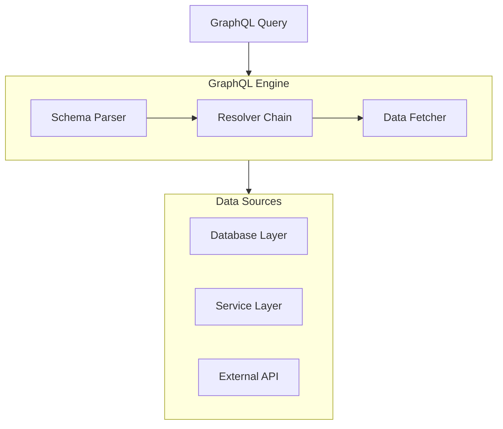

# Spring GraphQL: Полное руководство

## Полезные ссылки

[Официальная документация Spring](https://docs.spring.io/)
[Spring Projects](https://spring.io/projects)

## Содержание

- [Введение в Spring GraphQL](#введение-в-spring-graphql)
  - [Основные возможности](#основные-возможности)
  - [Архитектура Spring GraphQL](#архитектура-spring-graphql)
- [Настройка Spring GraphQL](#настройка-spring-graphql)
  - [Зависимости](#зависимости)
  - [Конфигурация](#конфигурация)
- [Schema Definition](#schema-definition)
  - [Базовый Schema](#базовый-schema)
- [Query Resolvers](#query-resolvers)
  - [Базовый Query Resolver](#базовый-query-resolver)
  - [Field Resolvers](#field-resolvers)
- [Mutation Resolvers](#mutation-resolvers)
- [DataFetchers](#datafetchers)
  - [Custom DataFetcher](#custom-datafetcher)
  - [Batch DataFetcher](#batch-datafetcher)
- [Subscriptions](#subscriptions)
  - [WebSocket Configuration](#websocket-configuration)
  - [Subscription Resolver](#subscription-resolver)
- [Error Handling](#error-handling)
  - [Custom Exception Handler](#custom-exception-handler)
- [Лучшие практики](#лучшие-практики)
  - [1. Используйте правильные типы данных](#1-используйте-правильные-типы-данных)
  - [2. Используйте Input типы для мутаций](#2-используйте-input-типы-для-мутаций)
  - [3. Обрабатывайте ошибки](#3-обрабатывайте-ошибки)
  - [4. Используйте DataLoader для N+1 проблем](#4-используйте-dataloader-для-n1-проблем)
  - [5. Валидируйте входные данные](#5-валидируйте-входные-данные)
- [DataLoader для решения N+1 проблем](#dataloader-для-решения-n1-проблем)
  - [Проблема N+1](#проблема-n1)
  - [Решение с DataLoader](#решение-с-dataloader)
  - [Кэширование в DataLoader](#кэширование-в-dataloader)
- [Фильтрация и пагинация](#фильтрация-и-пагинация)
  - [Фильтрация в Schema](#фильтрация-в-schema)
  - [Реализация фильтрации](#реализация-фильтрации)
- [Сортировка](#сортировка)
  - [Schema для сортировки](#schema-для-сортировки)
  - [Реализация сортировки](#реализация-сортировки)
- [Интерфейсы и Union типы](#интерфейсы-и-union-типы)
  - [Интерфейсы в Schema](#интерфейсы-в-schema)
  - [Реализация интерфейсов](#реализация-интерфейсов)
  - [Union типы](#union-типы)
- [Директивы](#директивы)
  - [Создание кастомных директив](#создание-кастомных-директив)
  - [Обработка директив](#обработка-директив)
- [Фрагменты и инлайн фрагменты](#фрагменты-и-инлайн-фрагменты)
  - [Использование фрагментов](#использование-фрагментов)
  - [Инлайн фрагменты для Union типов](#инлайн-фрагменты-для-union-типов)
- [Валидация запросов](#валидация-запросов)
  - [Кастомная валидация](#кастомная-валидация)
- [Инструментация и мониторинг](#инструментация-и-мониторинг)
  - [Метрики запросов](#метрики-запросов)
  - [Логирование запросов](#логирование-запросов)
- [Тестирование GraphQL](#тестирование-graphql)
  - [Тестирование с MockMvc](#тестирование-с-mockmvc)
  - [Тестирование с GraphQLTestTemplate](#тестирование-с-graphqltesttemplate)
- [Безопасность](#безопасность)
  - [Защита от сложных запросов](#защита-от-сложных-запросов)
  - [Rate Limiting](#rate-limiting)
- [Оптимизация производительности](#оптимизация-производительности)
  - [Кэширование результатов](#кэширование-результатов)
  - [Асинхронные resolvers](#асинхронные-resolvers)
- [Интеграция с Spring Security](#интеграция-с-spring-security)
  - [Аутентификация в GraphQL](#аутентификация-в-graphql)
  - [Авторизация на уровне полей](#авторизация-на-уровне-полей)
- [Заключение](#заключение)
- [Дополнительные ресурсы](#дополнительные-ресурсы)
- [См. также](#см-также)

## Введение в Spring GraphQL

**Spring GraphQL** предоставляет интеграцию с **GraphQL** для создания гибких **API**. **GraphQL** позволяет клиентам запрашивать только нужные данные, что делает **API** более эффективным и гибким по сравнению с **REST**.

### Основные возможности

- **Schema Definition**: Определение **GraphQL** схемы
- **Resolvers**: Разрешение полей и типов
- **Data Fetchers**: Получение данных для полей
- **Subscriptions**: **Real-time** обновления через **WebSocket**
- **Error Handling**: Обработка ошибок в **GraphQL**

### Архитектура Spring GraphQL



## Настройка Spring GraphQL

### Зависимости

**Зависимости **spring-`boot-starter`-graphql** и **spring-`boot-starter`-web** (pom.xml):**

```xml
<dependency>
    <groupId>org.springframework.boot</groupId>
    <artifactId>spring-boot-starter-graphql</artifactId>
</dependency>
<dependency>
    <groupId>org.springframework.boot</groupId>
    <artifactId>spring-boot-starter-web</artifactId>
</dependency>
```

### Конфигурация

**application.properties:**

```properties
# GraphQL Configuration
spring.graphql.path=/graphql
spring.graphql.graphiql.enabled=true
spring.graphql.graphiql.path=/graphiql
spring.graphql.schema.locations=classpath:graphql/
spring.graphql.schema.file-extensions=.graphqls
```

## Schema Definition

### Базовый Schema

**schema.graphqls:**

```graphql
type Query {
    user(id: ID!): User
    users: [User!]!
    usersByAge(minAge: Int!, maxAge: Int!): [User!]!
}

type User {
    id: ID!
    name: String!
    email: String!
    age: Int!
    orders: [Order!]!
}

type Order {
    id: ID!
    total: Float!
    items: [OrderItem!]!
}

type OrderItem {
    id: ID!
    product: Product!
    quantity: Int!
    price: Float!
}

type Product {
    id: ID!
    name: String!
    price: Float!
}

type Mutation {
    createUser(input: UserInput!): User!
    updateUser(id: ID!, input: UserInput!): User!
    deleteUser(id: ID!): Boolean!
}

input UserInput {
    name: String!
    email: String!
    age: Int!
}

type Subscription {
    userCreated: User!
    userUpdated: User!
}
```

## Query Resolvers

### Базовый Query Resolver

```java
// Базовый резолвер запросов GraphQL (Query)
@Component
public class UserQueryResolver implements GraphQLQueryResolver {

    @Autowired
    private UserService userService;

    public User user(Long id) {
        return userService.findById(id)
            .orElseThrow(() -> new UserNotFoundException(id));
    }

    public List<User> users() {
        return userService.findAll();
    }

    public List<User> usersByAge(Integer minAge, Integer maxAge) {
        return userService.findByAgeBetween(minAge, maxAge);
    }
}
```

### Field Resolvers

```java
// Резолвер поля для типа User (GraphQLResolver)
@Component
public class UserResolver implements GraphQLResolver<User> {

    @Autowired
    private OrderService orderService;

    public List<Order> orders(User user) {
        return orderService.findByUserId(user.getId());
    }

    public Integer orderCount(User user) {
        return orderService.countByUserId(user.getId());
    }
}
```

## Mutation Resolvers

```java
@Component
public class UserMutationResolver implements GraphQLMutationResolver {

    @Autowired
    private UserService userService;

    public User createUser(UserInput input) {
        User user = new User();
        user.setName(input.getName());
        user.setEmail(input.getEmail());
        user.setAge(input.getAge());
        return userService.save(user);
    }

    public User updateUser(Long id, UserInput input) {
        User user = userService.findById(id)
            .orElseThrow(() -> new UserNotFoundException(id));
        user.setName(input.getName());
        user.setEmail(input.getEmail());
        user.setAge(input.getAge());
        return userService.save(user);
    }

    public Boolean deleteUser(Long id) {
        userService.deleteById(id);
        return true;
    }
}
```

## DataFetchers

### Custom DataFetcher

```java
@Component
public class UserDataFetcher implements DataFetcher<User> {

    @Autowired
    private UserService userService;

    @Override
    public User get(DataFetchingEnvironment environment) throws Exception {
        Long id = environment.getArgument("id");
        return userService.findById(id)
            .orElseThrow(() -> new UserNotFoundException(id));
    }
}

@Configuration
public class GraphQLConfig {

    @Bean
    public RuntimeWiringConfigurer runtimeWiringConfigurer(UserDataFetcher userDataFetcher) {
        return wiringBuilder -> wiringBuilder
            .type("Query", typeWiring -> typeWiring
                .dataFetcher("user", userDataFetcher)
            );
    }
}
```

### Batch DataFetcher

```java
@Component
public class OrderDataFetcher implements DataFetcher<List<Order>> {

    @Autowired
    private OrderService orderService;

    @Override
    public List<Order> get(DataFetchingEnvironment environment) throws Exception {
        User user = environment.getSource();
        return orderService.findByUserId(user.getId());
    }
}
```

## Subscriptions

### WebSocket Configuration

```java
@Configuration
@EnableWebSocket
public class WebSocketConfig implements WebSocketConfigurer {

    @Override
    public void registerWebSocketHandlers(WebSocketHandlerRegistry registry) {
        registry.addHandler(graphQLWebSocketHandler(), "/graphql-ws");
    }

    @Bean
    public WebSocketHandler graphQLWebSocketHandler() {
        return new GraphQLWebSocketHandler();
    }
}
```

### Subscription Resolver

```java
@Component
public class UserSubscriptionResolver implements GraphQLSubscriptionResolver {

    @Autowired
    private UserService userService;

    public Publisher<User> userCreated() {
        return userService.getUserCreatedPublisher();
    }

    public Publisher<User> userUpdated() {
        return userService.getUserUpdatedPublisher();
    }
}
```

## Error Handling

### Custom Exception Handler

```java
@Component
public class GraphQLExceptionHandler {

    @GraphQLExceptionHandler
    public GraphQLError handleUserNotFound(UserNotFoundException ex) {
        return GraphQLError.newError()
            .errorType(ErrorType.NOT_FOUND)
            .message(ex.getMessage())
            .build();
    }

    @GraphQLExceptionHandler
    public GraphQLError handleValidation(ValidationException ex) {
        return GraphQLError.newError()
            .errorType(ErrorType.BAD_REQUEST)
            .message("Validation failed")
            .extensions(Map.of("errors", ex.getErrors()))
            .build();
    }
}
```

## Лучшие практики

### 1. Используйте правильные типы данных

```graphql
# ✅ Хорошо
type User {
    id: ID!
    name: String!
    age: Int!
}

# ❌ Плохо
type User {
    id: String!
    age: String!
}
```

### 2. Используйте Input типы для мутаций

```graphql
# ✅ Хорошо
type Mutation {
    createUser(input: UserInput!): User!
}

input UserInput {
    name: String!
    email: String!
}

# ❌ Плохо
type Mutation {
    createUser(name: String!, email: String!): User!
}
```

### 3. Обрабатывайте ошибки

```java
// ✅ Хорошо
@GraphQLExceptionHandler
public GraphQLError handleException(Exception ex) {
    // Обработка ошибки
}
```

### 4. Используйте DataLoader для N+1 проблем

```java
// ✅ Хорошо
@Bean
public DataLoader<Long, List<Order>> orderDataLoader() {
    return DataLoader.newDataLoader(userIds ->
        orderService.findByUserIds(userIds));
}
```

### 5. Валидируйте входные данные

```java
// ✅ Хорошо
public User createUser(@Valid UserInput input) {
    // Валидация и создание
}
```

## DataLoader для решения N+1 проблем

**DataLoader** — это паттерн для батчинга и кэширования запросов, который решает проблему N+1 запросов в **GraphQL**.

### Проблема N+1

```java
// ❌ Плохо: N+1 запросов
@Component
public class UserResolver implements GraphQLResolver<User> {
    @Autowired
    private OrderService orderService;

    public List<Order> orders(User user) {
        // Для каждого пользователя выполняется отдельный запрос
        return orderService.findByUserId(user.getId());
    }
}
```

### Решение с DataLoader

```java
@Component
public class OrderDataLoader implements BatchLoader<Long, List<Order>> {

    @Autowired
    private OrderService orderService;

    @Override
    public CompletionStage<List<List<Order>>> load(List<Long> userIds) {
        // Один запрос для всех пользователей
        Map<Long, List<Order>> ordersByUserId = orderService
            .findByUserIds(userIds)
            .stream()
            .collect(Collectors.groupingBy(Order::getUserId));

        return CompletableFuture.completedFuture(
            userIds.stream()
                .map(userId -> ordersByUserId.getOrDefault(userId, Collections.emptyList()))
                .collect(Collectors.toList())
        );
    }
}

@Configuration
public class GraphQLDataLoaderConfig {

    @Bean
    public DataLoaderRegistryFactory dataLoaderRegistryFactory(
            OrderDataLoader orderDataLoader) {
        return () -> {
            DataLoaderRegistry registry = new DataLoaderRegistry();
            registry.register("orders",
                DataLoader.newDataLoader(orderDataLoader));
            return registry;
        };
    }
}

@Component
public class UserResolver implements GraphQLResolver<User> {

    public CompletableFuture<List<Order>> orders(User user,
            DataFetchingEnvironment environment) {
        DataLoader<Long, List<Order>> orderDataLoader =
            environment.getDataLoader("orders");
        return orderDataLoader.load(user.getId());
    }
}
```

### Кэширование в DataLoader

```java
@Component
public class OrderDataLoader implements BatchLoader<Long, List<Order>> {

    @Autowired
    private OrderService orderService;

    @Override
    public CompletionStage<List<List<Order>>> load(List<Long> userIds) {
        // DataLoader автоматически кэширует результаты в рамках одного запроса
        return CompletableFuture.completedFuture(
            orderService.findByUserIds(userIds)
        );
    }
}
```

## Фильтрация и пагинация

### Фильтрация в Schema

```graphql
type Query {
    users(filter: UserFilter, page: Int, size: Int): UserPage!
}

input UserFilter {
    name: String
    email: String
    minAge: Int
    maxAge: Int
    status: UserStatus
}

type UserPage {
    content: [User!]!
    totalElements: Int!
    totalPages: Int!
    page: Int!
    size: Int!
}

enum UserStatus {
    ACTIVE
    INACTIVE
    SUSPENDED
}
```

### Реализация фильтрации

```java
@Component
public class UserQueryResolver implements GraphQLQueryResolver {

    @Autowired
    private UserService userService;

    public UserPage users(UserFilter filter, Integer page, Integer size) {
        if (page == null) page = 0;
        if (size == null) size = 20;

        Pageable pageable = PageRequest.of(page, size);
        Specification<User> spec = buildSpecification(filter);

        Page<User> userPage = userService.findAll(spec, pageable);

        return UserPage.builder()
            .content(userPage.getContent())
            .totalElements((int) userPage.getTotalElements())
            .totalPages(userPage.getTotalPages())
            .page(page)
            .size(size)
            .build();
    }

    private Specification<User> buildSpecification(UserFilter filter) {
        return (root, query, cb) -> {
            List<Predicate> predicates = new ArrayList<>();

            if (filter.getName() != null) {
                predicates.add(cb.like(
                    cb.lower(root.get("name")),
                    "%" + filter.getName().toLowerCase() + "%"
                ));
            }

            if (filter.getEmail() != null) {
                predicates.add(cb.equal(root.get("email"), filter.getEmail()));
            }

            if (filter.getMinAge() != null) {
                predicates.add(cb.ge(root.get("age"), filter.getMinAge()));
            }

            if (filter.getMaxAge() != null) {
                predicates.add(cb.le(root.get("age"), filter.getMaxAge()));
            }

            if (filter.getStatus() != null) {
                predicates.add(cb.equal(root.get("status"), filter.getStatus()));
            }

            return cb.and(predicates.toArray(new Predicate[0]));
        };
    }
}
```

## Сортировка

### Schema для сортировки

```graphql
type Query {
    users(sort: [UserSort!]): [User!]!
}

input UserSort {
    field: UserSortField!
    direction: SortDirection!
}

enum UserSortField {
    NAME
    EMAIL
    AGE
    CREATED_AT
}

enum SortDirection {
    ASC
    DESC
}
```

### Реализация сортировки

```java
@Component
public class UserQueryResolver implements GraphQLQueryResolver {

    @Autowired
    private UserService userService;

    public List<User> users(List<UserSort> sorts) {
        Sort sort = buildSort(sorts);
        return userService.findAll(sort);
    }

    private Sort buildSort(List<UserSort> sorts) {
        if (sorts == null || sorts.isEmpty()) {
            return Sort.by("name").ascending();
        }

        List<Sort.Order> orders = sorts.stream()
            .map(s -> new Sort.Order(
                s.getDirection() == SortDirection.ASC
                    ? Sort.Direction.ASC
                    : Sort.Direction.DESC,
                mapFieldName(s.getField())
            ))
            .collect(Collectors.toList());

        return Sort.by(orders);
    }

    private String mapFieldName(UserSortField field) {
        switch (field) {
            case NAME: return "name";
            case EMAIL: return "email";
            case AGE: return "age";
            case CREATED_AT: return "createdAt";
            default: return "name";
        }
    }
}
```

## Интерфейсы и Union типы

### Интерфейсы в Schema

```graphql
interface Node {
    id: ID!
}

type User implements Node {
    id: ID!
    name: String!
    email: String!
}

type Product implements Node {
    id: ID!
    name: String!
    price: Float!
}

type Query {
    node(id: ID!): Node
    nodes(ids: [ID!]!): [Node!]!
}
```

### Реализация интерфейсов

```java
@Component
public class NodeQueryResolver implements GraphQLQueryResolver {

    @Autowired
    private UserService userService;

    @Autowired
    private ProductService productService;

    public Node node(String id) {
        if (id.startsWith("USER_")) {
            Long userId = Long.parseLong(id.substring(5));
            return userService.findById(userId).orElse(null);
        } else if (id.startsWith("PRODUCT_")) {
            Long productId = Long.parseLong(id.substring(8));
            return productService.findById(productId).orElse(null);
        }
        return null;
    }

    public List<Node> nodes(List<String> ids) {
        return ids.stream()
            .map(this::node)
            .filter(Objects::nonNull)
            .collect(Collectors.toList());
    }
}
```

### Union типы

```graphql
union SearchResult = User | Product | Order

type Query {
    search(query: String!): [SearchResult!]!
}
```

```java
@Component
public class SearchQueryResolver implements GraphQLQueryResolver {

    @Autowired
    private UserService userService;

    @Autowired
    private ProductService productService;

    @Autowired
    private OrderService orderService;

    public List<Object> search(String query) {
        List<Object> results = new ArrayList<>();
        results.addAll(userService.search(query));
        results.addAll(productService.search(query));
        results.addAll(orderService.search(query));
        return results;
    }
}
```

## Директивы

### Создание кастомных директив

```graphql
directive @auth(roles: [String!]!) on FIELD_DEFINITION
directive @rateLimit(max: Int!) on FIELD_DEFINITION
directive @cache(maxAge: Int!) on FIELD_DEFINITION

type Query {
    users: [User!]! @auth(roles: ["ADMIN"]) @rateLimit(max: 100)
    user(id: ID!): User @cache(maxAge: 3600)
}
```

### Обработка директив

```java
@Component
public class AuthDirective implements SchemaDirectiveWiring {

    @Override
    public GraphQLFieldDefinition onField(
            SchemaDirectiveWiringEnvironment<GraphQLFieldDefinition> environment) {

        GraphQLFieldDefinition field = environment.getFieldDefinition();
        List<String> roles = (List<String>) environment
            .getAppliedDirective("auth")
            .getArgument("roles")
            .getValue();

        DataFetcher<?> originalDataFetcher = environment.getFieldDataFetcher();
        DataFetcher<?> authDataFetcher = environment -> {
            // Проверка авторизации
            Authentication auth = SecurityContextHolder.getContext().getAuthentication();
            if (!hasRoles(auth, roles)) {
                throw new AccessDeniedException("Access denied");
            }
            return originalDataFetcher.get(environment);
        };

        return field.transform(builder ->
            builder.dataFetcher(authDataFetcher)
        );
    }

    private boolean hasRoles(Authentication auth, List<String> roles) {
        return auth.getAuthorities().stream()
            .anyMatch(a -> roles.contains(a.getAuthority()));
    }
}
```

## Фрагменты и инлайн фрагменты

### Использование фрагментов

```graphql
query {
    users {
        ...UserDetails
        orders {
            ...OrderDetails
        }
    }
}

fragment UserDetails on User {
    id
    name
    email
    age
}

fragment OrderDetails on Order {
    id
    total
    createdAt
    items {
        product {
            name
            price
        }
        quantity
    }
}
```

### Инлайн фрагменты для Union типов

```graphql
query {
    search(query: "test") {
        ... on User {
            id
            name
            email
        }
        ... on Product {
            id
            name
            price
        }
        ... on Order {
            id
            total
        }
    }
}
```

## Валидация запросов

### Кастомная валидация

```java
@Component
public class GraphQLQueryValidator implements QueryValidator {

    @Override
    public ValidationResult validate(Query query) {
        List<ValidationError> errors = new ArrayList<>();

        // Проверка глубины запроса
        int depth = calculateDepth(query);
        if (depth > 10) {
            errors.add(new ValidationError(
                "Query depth exceeds maximum of 10"
            ));
        }

        // Проверка сложности
        int complexity = calculateComplexity(query);
        if (complexity > 1000) {
            errors.add(new ValidationError(
                "Query complexity exceeds maximum of 1000"
            ));
        }

        return new ValidationResult(errors);
    }

    private int calculateDepth(Query query) {
        // Реализация расчета глубины
        return 0;
    }

    private int calculateComplexity(Query query) {
        // Реализация расчета сложности
        return 0;
    }
}
```

## Инструментация и мониторинг

### Метрики запросов

```java
@Component
public class GraphQLMetricsInstrumentation implements Instrumentation {

    private final MeterRegistry meterRegistry;

    public GraphQLMetricsInstrumentation(MeterRegistry meterRegistry) {
        this.meterRegistry = meterRegistry;
    }

    @Override
    public InstrumentationContext<ExecutionResult> beginExecution(
            InstrumentationExecutionParameters parameters) {

        Timer.Sample sample = Timer.start(meterRegistry);
        String operationName = parameters.getOperation();

        return new SimpleInstrumentationContext<ExecutionResult>() {
            @Override
            public void onCompleted(ExecutionResult result, Throwable t) {
                sample.stop(Timer.builder("graphql.execution")
                    .tag("operation", operationName)
                    .tag("status", t == null ? "success" : "error")
                    .register(meterRegistry));
            }
        };
    }
}
```

### Логирование запросов

```java
@Component
public class GraphQLLoggingInstrumentation implements Instrumentation {

    private static final Logger logger = LoggerFactory
        .getLogger(GraphQLLoggingInstrumentation.class);

    @Override
    public InstrumentationContext<ExecutionResult> beginExecution(
            InstrumentationExecutionParameters parameters) {

        String query = parameters.getQuery();
        String operationName = parameters.getOperation();

        logger.info("GraphQL query: {} (operation: {})", query, operationName);

        return new SimpleInstrumentationContext<ExecutionResult>() {
            @Override
            public void onCompleted(ExecutionResult result, Throwable t) {
                if (t != null) {
                    logger.error("GraphQL execution error", t);
                } else {
                    logger.debug("GraphQL execution completed successfully");
                }
            }
        };
    }
}
```

## Тестирование GraphQL

### Тестирование с MockMvc

```java
@SpringBootTest
@AutoConfigureMockMvc
class UserGraphQLTest {

    @Autowired
    private MockMvc mockMvc;

    @Test
    void testUserQuery() throws Exception {
        String query = """
            query {
                user(id: "1") {
                    id
                    name
                    email
                }
            }
            """;

        mockMvc.perform(post("/graphql")
                .contentType(MediaType.APPLICATION_JSON)
                .content(createGraphQLRequest(query)))
            .andExpect(status().isOk())
            .andExpect(jsonPath("$.data.user.id").value("1"))
            .andExpect(jsonPath("$.data.user.name").exists());
    }

    private String createGraphQLRequest(String query) {
        return """
            {
                "query": "%s"
            }
            """.formatted(query.replace("\n", "\\n"));
    }
}
```

### Тестирование с GraphQLTestTemplate

```java
@SpringBootTest
class UserGraphQLTest {

    @Autowired
    private GraphQLTestTemplate graphQLTestTemplate;

    @Test
    void testUserQuery() throws IOException {
        GraphQLResponse response = graphQLTestTemplate
            .postForResource("graphql/user-query.graphql");

        assertThat(response.isOk()).isTrue();
        assertThat(response.get("$.data.user.id")).isEqualTo("1");
    }
}
```

## Безопасность

### Защита от сложных запросов

```java
@Configuration
public class GraphQLSecurityConfig {

    @Bean
    public QueryComplexityInstrumentation queryComplexityInstrumentation() {
        return QueryComplexityInstrumentation.builder()
            .maximumComplexity(1000)
            .maximumDepth(10)
            .build();
    }

    @Bean
    public QueryDepthInstrumentation queryDepthInstrumentation() {
        return QueryDepthInstrumentation.builder()
            .maximumDepth(10)
            .build();
    }
}
```

### Rate Limiting

```java
@Component
public class GraphQLRateLimitInterceptor implements HandlerInterceptor {

    private final RateLimiter rateLimiter;

    public GraphQLRateLimitInterceptor() {
        this.rateLimiter = RateLimiter.create(100.0); // 100 запросов в секунду
    }

    @Override
    public boolean preHandle(HttpServletRequest request,
            HttpServletResponse response, Object handler) {
        if (!rateLimiter.tryAcquire()) {
            response.setStatus(HttpStatus.TOO_MANY_REQUESTS.value());
            return false;
        }
        return true;
    }
}
```

## Оптимизация производительности

### Кэширование результатов

```java
@Component
public class CachedUserResolver implements GraphQLResolver<User> {

    @Autowired
    private UserService userService;

    @Cacheable(value = "users", key = "#user.id")
    public List<Order> orders(User user) {
        return userService.findOrdersByUserId(user.getId());
    }
}
```

### Асинхронные resolvers

```java
@Component
public class AsyncUserResolver implements GraphQLResolver<User> {

    @Autowired
    private OrderService orderService;

    public CompletableFuture<List<Order>> orders(User user) {
        return CompletableFuture.supplyAsync(() ->
            orderService.findByUserId(user.getId())
        );
    }
}
```

## Интеграция с Spring Security

### Аутентификация в GraphQL

```java
@Component
public class SecurityContextDataFetcher implements DataFetcher<Authentication> {

    @Override
    public Authentication get(DataFetchingEnvironment environment) {
        return SecurityContextHolder.getContext().getAuthentication();
    }
}
```

### Авторизация на уровне полей

```java
@Component
public class SecureUserResolver implements GraphQLResolver<User> {

    @PreAuthorize("hasRole('ADMIN')")
    public String email(User user) {
        return user.getEmail();
    }

    @PreAuthorize("hasRole('USER')")
    public List<Order> orders(User user) {
        return user.getOrders();
    }
}
```


## Заключение

**Spring GraphQL** предоставляет мощные инструменты для создания **GraphQL API**. Правильное использование схем, **resolvers**, **data fetchers**, **subscriptions**, **DataLoader** и других продвинутых возможностей позволяет создавать гибкие, эффективные и безопасные **API**. Важно учитывать производительность, безопасность и лучшие практики при разработке **GraphQL** приложений.

## Дополнительные ресурсы

- [**Spring GraphQL** Documentation](https://docs.spring.io/spring-graphql/reference/)
- [**GraphQL** Specification](https://spec.graphql.org/)
- [**GraphQL Best Practices**](https://graphql.org/learn/best-practices/)
- [**DataLoader** Pattern](https://github.com/graphql/dataloader)
- [**GraphQL Security**](https://cheatsheetseries.owasp.org/cheatsheets/GraphQL_Cheat_Sheet.html)

## См. также

- [[spring-actuator|Spring Actuator: Полное руководство по мониторингу и управлению]]
- [[spring-ai|Spring AI]]
- [[spring-aop|Spring AOP: Полное руководство по аспектно-ориентированному программированию]]
- [[spring-batch|Spring Batch для Java]]
- [[spring-boot|Spring Boot — Полное руководство]]
