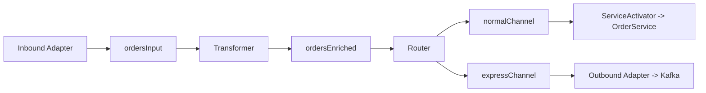

# Spring Integration

`Spring Integration` — реализация паттернов `Enterprise Integration Patterns` (EIP) поверх модели программирования `Spring`. Позволяет связывать приложение с очередями, файловыми системами, HTTP-сервисами, почтой и другими источниками через конвейер из каналов и endpoint-ов без жёсткого связывания между компонентами.

## Полезные ссылки

### Официальная документация
- [Spring Integration Reference](https://docs.spring.io/spring-integration/reference/)
- [Enterprise Integration Patterns (Gregor Hohpe)](https://www.enterpriseintegrationpatterns.com/) — каноничный источник EIP

### Учебные ресурсы
- [Introduction to Spring Integration — Baeldung](https://www.baeldung.com/spring-integration)
- [Spring Integration Java DSL — Baeldung](https://www.baeldung.com/spring-integration-java-dsl)

### См. также
- [spring-core](../../spring/spring-core.md) — IoC-контейнер, bean lifecycle
- [spring-messaging](spring-messaging.md) — `Message`, `MessageChannel` на уровне Spring
- [spring-kafka](spring-kafka.md) — Kafka-adapter для Spring Integration
- [spring-mvc](spring-mvc.md) — HTTP-inbound adapters и gateways
- [spring-batch](spring-batch.md) — связка batch + integration для ETL

## Содержание

- [Зачем Spring Integration](#зачем-spring-integration)
- [Основные понятия](#основные-понятия)
- [Типы каналов](#типы-каналов)
- [Endpoints и их роли](#endpoints-и-их-роли)
- [Адаптеры и gateway](#адаптеры-и-gateway)
- [Java DSL](#java-dsl)
- [Преобразователи и фильтры](#преобразователи-и-фильтры)
- [Маршрутизация](#маршрутизация)
- [Splitter и aggregator](#splitter-и-aggregator)
- [Обработка ошибок](#обработка-ошибок)
- [Транзакции](#транзакции)
- [Тестирование](#тестирование)
- [Мониторинг](#мониторинг)
- [Когда использовать, когда нет](#когда-использовать-когда-нет)

## Зачем Spring Integration

Типовые кейсы:

- Поток «файл парсер БД» с retry и dead-letter.
- Мост между Kafka и HTTP-сервисом с валидацией и обогащением.
- Распределение сообщений по нескольким потребителям по content-based правилам.
- Агрегация ответов от N сервисов в одно итоговое сообщение.

Если поток — чистый Kafka consumer/producer без разветвлений и обогащений, достаточно [spring-kafka](spring-kafka.md). Если есть хотя бы два трансформера/роутер/splitter — Spring Integration экономит много boilerplate.

## Основные понятия

| Понятие | Что это |
|---|---|
| `Message<T>` | носитель: `payload` + `headers` (`MessageHeaders`) |
| `MessageChannel` | канал доставки между endpoint-ами |
| `MessageHandler` | обработчик сообщения |
| Endpoint | `MessageHandler` + способ потребления канала |
| `IntegrationFlow` | DSL-описание конвейера из endpoint-ов |
| Inbound / Outbound Adapter | односторонний мост с внешней системой |
| Gateway | двусторонний мост (request/reply) |



## Типы каналов

| Канал | Поведение | Когда использовать |
|---|---|---|
| `DirectChannel` | синхронный, вызов в потоке отправителя | default, low-latency, нужны транзакции |
| `PublishSubscribeChannel` | broadcast всем подписчикам | событийная модель, один producer много consumers |
| `QueueChannel` | in-memory FIFO-очередь | буферизация, поток-развязка, нужен poller |
| `PriorityChannel` | очередь с приоритетом | редко; когда есть приоритеты сообщений |
| `RendezvousChannel` | sync handoff, ждёт ровно одного потребителя | backpressure |
| `ExecutorChannel` | асинхронная доставка через `TaskExecutor` | parallel fan-out |
| `FluxMessageChannel` | reactive (Reactor `Flux`) | мост в [spring-webflux](spring-webflux.md) |

```java
@Bean public MessageChannel ordersInput() { return new DirectChannel(); }
@Bean public MessageChannel ordersQueue() { return new QueueChannel(100); }
@Bean public MessageChannel events() { return new PublishSubscribeChannel(); }
```

**Правило:** используй `DirectChannel` по умолчанию — единственный канал, который пропускает транзакции через конвейер.

## Endpoints и их роли

| Тип | Аннотация / DSL | Назначение |
|---|---|---|
| Service Activator | `@ServiceActivator` / `.handle(...)` | вызов бизнес-метода |
| Transformer | `@Transformer` / `.transform(...)` | преобразование payload |
| Filter | `@Filter` / `.filter(...)` | пропуск/отбрасывание |
| Router | `@Router` / `.route(...)` | выбор канала-назначения |
| Splitter | `@Splitter` / `.split(...)` | разрезать на несколько сообщений |
| Aggregator | `@Aggregator` / `.aggregate(...)` | собрать несколько в одно |
| Bridge | `.bridge()` | соединить два канала |
| Enricher | `@Enricher` / `.enrich(...)` | добавить данные в сообщение |

## Адаптеры и gateway

**Inbound adapter** превращает внешнее событие в `Message<?>` и шлёт в канал. Примеры:

- `FileInboundChannelAdapter` — новые файлы в директории.
- `KafkaMessageDrivenChannelAdapter` — consumer.
- `JmsMessageDrivenEndpoint` — JMS consumer.
- `HttpRequestHandlingMessagingGateway` — inbound HTTP endpoint.
- `FtpInboundFileSynchronizingMessageSource` — FTP poll.

**Outbound adapter** пишет в внешнюю систему:

- `KafkaProducerMessageHandler`.
- `JmsSendingMessageHandler`.
- `HttpRequestExecutingMessageHandler`.
- `FileWritingMessageHandler`.

**Gateway** — двусторонний мост для request/reply: приложение вызывает интерфейс, Spring Integration превращает вызов в сообщение, ждёт ответ и возвращает результат.

```java
@MessagingGateway(defaultRequestChannel = "ordersInput")
public interface OrderGateway {
    OrderResult place(Order order);
}
```

## Java DSL

Java DSL — идиоматичный способ описать поток в одном `@Bean`. Лаконичнее XML и `@Configuration` с разрозненными бинами.

```java
@Configuration
@EnableIntegration
public class OrdersFlow {

    @Bean
    IntegrationFlow ordersFlow(OrderService service) {
        return IntegrationFlows.from(Kafka.messageDrivenChannelAdapter(
                    consumerFactory(), "orders-topic"))
                .transform(Transformers.fromJson(Order.class))
                .filter((Order o) -> o.amount().compareTo(BigDecimal.ZERO) > 0)
                .enrich(e -> e.requestChannel("customerLookup")
                              .propertyExpression("customer", "payload"))
                .<Order, String>route(o -> o.type().name(),
                    m -> m.subFlowMapping("EXPRESS", sf -> sf.handle(service::fastPath))
                          .subFlowMapping("NORMAL",  sf -> sf.handle(service::save)))
                .get();
    }
}
```

Ключевые билдеры:

| Статический класс | Что предоставляет |
|---|---|
| `IntegrationFlows` | точка входа (устарело, в 6.x — `IntegrationFlow`) |
| `Kafka`, `Jms`, `Amqp`, `Http`, `Files`, `Mail`, `Mqtt`, `Ftp` | адаптеры |
| `Transformers` | встроенные трансформеры (JSON, XML, ByteArray) |
| `Filters`, `Splitters`, `Aggregators` | DSL для соответствующих endpoint-ов |

## Преобразователи и фильтры

```java
@Transformer(inputChannel = "rawOrders", outputChannel = "orders")
public Order parse(String json) {
    return objectMapper.readValue(json, Order.class);
}

@Filter(inputChannel = "orders", outputChannel = "validOrders",
        discardChannel = "rejectedOrders")
public boolean isValid(Order order) {
    return order.items() != null && !order.items().isEmpty();
}
```

В DSL это же:

```java
.transform(Order.class, o -> o.withStatus(NEW))
.filter((Order o) -> o.amount().signum() > 0, f -> f.discardChannel("rejected"))
```

## Маршрутизация

```java
@Router(inputChannel = "orders")
public String route(Order order) {
    return switch (order.priority()) {
        case HIGH -> "expressChannel";
        case LOW -> "batchChannel";
        default -> "normalChannel";
    };
}
```

Типы роутеров:

- `PayloadTypeRouter` — по классу payload.
- `HeaderValueRouter` — по значению заголовка.
- `RecipientListRouter` — в несколько каналов одновременно.
- `ErrorMessageExceptionTypeRouter` — по типу исключения в ErrorMessage.

## Splitter и aggregator

`Splitter` разрезает сообщение с коллекцией на N сообщений:

```java
@Splitter(inputChannel = "batchOrders", outputChannel = "singleOrder")
public List<Order> split(BatchOrder batch) {
    return batch.items();
}
```

`Aggregator` собирает обратно. Корелляция — по correlationId:

```java
@Aggregator(inputChannel = "singleResult", outputChannel = "batchResult")
public BatchResult merge(@Payloads List<Result> results,
                         @Header("correlationId") String corr) {
    return new BatchResult(corr, results);
}
```

Обычно используют в сценарии Scatter-Gather: послать параллельные запросы в несколько систем, собрать все ответы одно сообщение.

## Обработка ошибок

Каждый входной поток автоматически имеет `errorChannel` (default — `errorChannel`). При исключении сообщение превращается в `ErrorMessage` и шлётся туда.

```java
@Bean
IntegrationFlow errorFlow() {
    return IntegrationFlow.from("errorChannel")
            .handle(m -> log.error("integration error", ((ErrorMessage) m).getPayload()))
            .get();
}
```

Паттерны:

- **Retry advice** на handler:
  ```java
  .handle(service::save, e -> e.advice(retryAdvice()))
  ```
- **Dead-letter channel** — отдельный канал для сообщений после исчерпания retry.
- **Expression-based error channel** — разный error-channel под разные типы исключений.

## Транзакции

`DirectChannel` + `@Transactional` на handler = одна транзакция от входа до выхода.

```java
.handle(repo::save, e -> e.transactional(true))
```

**Подводный камень:** `QueueChannel`, `ExecutorChannel`, `PublishSubscribeChannel` (с executor) — рвут поток, транзакция не пройдёт через канал. Если нужна сквозная транзакционность — только `DirectChannel`.

Для Kafka-inbound используй `containerProperties.setAckMode(MANUAL_IMMEDIATE)` и подтверждай ack только после успешного handle.

## Тестирование

`spring-integration-test` даёт `MockIntegrationContext` и возможность подменять каналы.

```java
@SpringBootTest
@SpringIntegrationTest(noAutoStartup = "ordersFlow.*adapter")   // не стартовать Kafka
class OrdersFlowTest {

    @Autowired MockIntegrationContext mock;
    @Autowired @Qualifier("ordersInput") MessageChannel input;
    @Autowired @Qualifier("ordersEnriched") QueueChannel out;

    @Test
    void routesExpressToFastPath() {
        mock.substituteMessageHandlerFor("customerLookupEndpoint",
                (m, h) -> MessageBuilder.fromMessage(m).setHeader("customer", CUSTOMER).build());

        input.send(new GenericMessage<>(order("EXPRESS")));

        Message<?> msg = out.receive(1000);
        assertThat(msg.getPayload()).isInstanceOf(FastPathResult.class);
    }
}
```

## Мониторинг

- Метрики через [spring-actuator](spring-actuator.md): `/actuator/metrics/spring.integration.channel.send`, `.receive`, `.timer`.
- JMX: `@EnableIntegrationManagement` публикует MBean-ы для каждого канала/endpoint.
- Micrometer — автоматические теги `name`, `type` на каналах.

## Когда использовать, когда нет

**Использовать:**

- Несколько внешних систем, между которыми нужен конвейер с преобразованиями.
- EIP-паттерны: splitter+aggregator, scatter-gather, content-based router.
- ETL-поток без батчевой логики (иначе — [spring-batch](spring-batch.md)).

**Не использовать:**

- Один прямой Kafka consumer без разветвлений — достаточно [spring-kafka](spring-kafka.md) + [spring-messaging](spring-messaging.md).
- Вся логика уже помещается в один контроллер / сервис.
- Команда не знакома с EIP — порог входа выше, чем кажется.

**Итог:** берите Spring Integration, когда поток имеет ≥3 шагов и хотя бы один splitter/router/aggregator; иначе — обойдётесь прямыми клиентами и [spring-kafka](spring-kafka.md)/[spring-mvc](spring-mvc.md).
