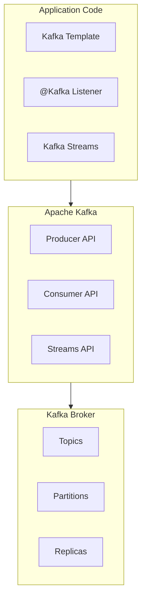

# Spring for Apache Kafka: Полное руководство

## Полезные ссылки

[Официальная документация Spring](https://docs.spring.io/)
[Spring Projects](https://spring.io/projects)

## Содержание

- [Введение в Spring for Apache Kafka](#введение-в-spring-for-apache-kafka)
  - [Основные возможности](#основные-возможности)
  - [Архитектура Spring Kafka](#архитектура-spring-kafka)
- [Настройка Spring Kafka](#настройка-spring-kafka)
  - [Зависимости](#зависимости)
  - [Конфигурация](#конфигурация)
- [KafkaTemplate (Producer)](#kafkatemplate-producer)
  - [Базовое использование](#базовое-использование)
  - [Отправка объектов](#отправка-объектов)
  - [Асинхронная отправка с Callback](#асинхронная-отправка-с-callback)
- [@KafkaListener (Consumer)](#kafkalistener-consumer)
  - [Базовое использование](#базовое-использование-1)
  - [Получение объектов](#получение-объектов)
  - [Несколько topics](#несколько-topics)
  - [Фильтрация сообщений](#фильтрация-сообщений)
- [Kafka Streams](#kafka-streams)
  - [Настройка Kafka Streams](#настройка-kafka-streams)
  - [Базовый Stream Processing](#базовый-stream-processing)
  - [Сложная обработка потоков](#сложная-обработка-потоков)
- [Transactions](#transactions)
  - [Транзакционные Producers](#транзакционные-producers)
- [Error Handling](#error-handling)
  - [Обработка ошибок в Consumer](#обработка-ошибок-в-consumer)
  - [Dead Letter Queue](#dead-letter-queue)
  - [Retry Configuration](#retry-configuration)
- [Лучшие практики](#лучшие-практики)
  - [1. Используйте правильные сериализаторы](#1-используйте-правильные-сериализаторы)
  - [2. Настраивайте consumer groups](#2-настраивайте-consumer-groups)
  - [3. Обрабатывайте ошибки](#3-обрабатывайте-ошибки)
  - [4. Используйте транзакции для критических операций](#4-используйте-транзакции-для-критических-операций)
  - [5. Настраивайте retry для надежности](#5-настраивайте-retry-для-надежности)
- [Kafka Streams (расширенная)](#kafka-streams-расширенная)
  - [Stream Processing](#stream-processing)
  - [Windowing](#windowing)
  - [State Stores](#state-stores)
- [Продвинутая обработка ошибок](#продвинутая-обработка-ошибок)
  - [Dead Letter Topic](#dead-letter-topic)
  - [Custom Error Handler](#custom-error-handler)
- [Мониторинг и метрики](#мониторинг-и-метрики)
  - [Kafka Metrics](#kafka-metrics)
- [Продвинутые паттерны](#продвинутые-паттерны)
  - [Exactly-Once Semantics](#exactly-once-semantics)
  - [Idempotent Consumer](#idempotent-consumer)
  - [Transactional Producer](#transactional-producer)
- [Оптимизация производительности](#оптимизация-производительности)
  - [Batch Processing](#batch-processing)
  - [Compression](#compression)
- [Заключение](#заключение)
- [Дополнительные ресурсы](#дополнительные-ресурсы)
- [См. также](#см-также)

## Введение в Spring for Apache Kafka

**Spring for Apache Kafka** предоставляет простую интеграцию с **Apache Kafka** для создания **producers**, **consumers** и **stream processing** приложений. Он абстрагирует сложности работы с **Kafka API** и предоставляет удобные аннотации и шаблоны.

### Основные возможности

- **KafkaTemplate**: Отправка сообщений в **Kafka**
- **@KafkaListener**: Упрощенное создание **consumers**
- **Kafka Streams**: Обработка потоков данных
- **Transactions**: Транзакционная поддержка
- **Error Handling**: Обработка ошибок и **retry**

### Архитектура Spring Kafka



## Настройка Spring Kafka

### Зависимости

**Зависимость **spring-kafka** (pom.xml):**

```xml
<dependency>
    <groupId>org.springframework.kafka</groupId>
    <artifactId>spring-kafka</artifactId>
</dependency>
```

### Конфигурация

**application.properties:**

```properties
# Kafka Configuration
spring.kafka.bootstrap-servers=localhost:9092
spring.kafka.consumer.group-id=my-group
spring.kafka.consumer.auto-offset-reset=earliest
spring.kafka.consumer.key-deserializer=org.apache.kafka.common.serialization.StringDeserializer
spring.kafka.consumer.value-deserializer=org.apache.kafka.common.serialization.StringDeserializer
spring.kafka.producer.key-serializer=org.apache.kafka.common.serialization.StringSerializer
spring.kafka.producer.value-serializer=org.apache.kafka.common.serialization.StringSerializer
```

## KafkaTemplate (Producer)

### Базовое использование

```java
// Producer: отправка сообщений в топик через KafkaTemplate
@Service
public class KafkaProducer {

    @Autowired
    private KafkaTemplate<String, String> kafkaTemplate;

    public void sendMessage(String topic, String message) {
        kafkaTemplate.send(topic, message);
    }

    public void sendMessage(String topic, String key, String message) {
        kafkaTemplate.send(topic, key, message);
    }

    public void sendMessage(String topic, Integer partition, String key, String message) {
        kafkaTemplate.send(topic, partition, key, message);
    }
}
```

### Отправка объектов

```java
@Configuration
public class KafkaConfig {

    @Bean
    public ProducerFactory<String, User> producerFactory() {
        Map<String, Object> configProps = new HashMap<>();
        configProps.put(ProducerConfig.BOOTSTRAP_SERVERS_CONFIG, "localhost:9092");
        configProps.put(ProducerConfig.KEY_SERIALIZER_CLASS_CONFIG, StringSerializer.class);
        configProps.put(ProducerConfig.VALUE_SERIALIZER_CLASS_CONFIG, JsonSerializer.class);
        return new DefaultKafkaProducerFactory<>(configProps);
    }

    @Bean
    public KafkaTemplate<String, User> kafkaTemplate() {
        return new KafkaTemplate<>(producerFactory());
    }
}

@Service
public class UserKafkaProducer {

    @Autowired
    private KafkaTemplate<String, User> kafkaTemplate;

    public void sendUser(String topic, User user) {
        kafkaTemplate.send(topic, user.getId().toString(), user);
    }
}
```

### Асинхронная отправка с Callback

```java
@Service
public class KafkaProducer {

    @Autowired
    private KafkaTemplate<String, String> kafkaTemplate;

    public void sendMessageWithCallback(String topic, String message) {
        ListenableFuture<SendResult<String, String>> future =
            kafkaTemplate.send(topic, message);

        future.addCallback(new ListenableFutureCallback<SendResult<String, String>>() {
            @Override
            public void onSuccess(SendResult<String, String> result) {
                System.out.println("Sent message: " + message +
                    " with offset: " + result.getRecordMetadata().offset());
            }

            @Override
            public void onFailure(Throwable ex) {
                System.out.println("Unable to send message: " + message, ex);
            }
        });
    }
}
```

## @KafkaListener (Consumer)

### Базовое использование

```java
// Consumer: приём сообщений из топика через @KafkaListener
@Component
public class KafkaConsumer {

    @KafkaListener(topics = "my-topic", groupId = "my-group")
    public void consume(String message) {
        System.out.println("Received message: " + message);
    }

    @KafkaListener(topics = "my-topic", groupId = "my-group")
    public void consumeWithHeaders(
            @Payload String message,
            @Header(KafkaHeaders.RECEIVED_TOPIC) String topic,
            @Header(KafkaHeaders.RECEIVED_PARTITION_ID) int partition,
            @Header(KafkaHeaders.OFFSET) long offset) {
        System.out.println("Received message: " + message +
            " from topic: " + topic +
            " partition: " + partition +
            " offset: " + offset);
    }
}
```

### Получение объектов

```java
@Component
public class UserKafkaConsumer {

    @KafkaListener(topics = "user-topic", groupId = "user-group")
    public void consumeUser(User user) {
        System.out.println("Received user: " + user.getName());
    }

    @KafkaListener(topics = "user-topic", groupId = "user-group")
    public void consumeUserWithKey(
            @Payload User user,
            @Header(KafkaHeaders.RECEIVED_KEY) String key) {
        System.out.println("Received user with key: " + key +
            ", user: " + user.getName());
    }
}
```

### Несколько topics

```java
@Component
public class MultiTopicConsumer {

    @KafkaListener(topics = {"topic1", "topic2", "topic3"}, groupId = "multi-group")
    public void consumeFromMultipleTopics(String message) {
        System.out.println("Received message: " + message);
    }
}
```

### Фильтрация сообщений

```java
@Component
public class FilteredConsumer {

    @KafkaListener(topics = "my-topic", groupId = "filtered-group")
    public void consumeFiltered(
            @Payload String message,
            @Header(KafkaHeaders.RECEIVED_KEY) String key) {
        if (key.startsWith("important-")) {
            System.out.println("Important message: " + message);
        }
    }
}
```

## Kafka Streams

### Настройка Kafka Streams

```xml
<dependency>
    <groupId>org.apache.kafka</groupId>
    <artifactId>kafka-streams</artifactId>
</dependency>
<dependency>
    <groupId>org.springframework.kafka</groupId>
    <artifactId>spring-kafka</artifactId>
</dependency>
```

### Базовый Stream Processing

```java
@Configuration
@EnableKafkaStreams
public class KafkaStreamsConfig {

    @Bean
    public KStream<String, String> kStream(StreamsBuilder streamsBuilder) {
        KStream<String, String> stream = streamsBuilder.stream("input-topic");

        stream
            .filter((key, value) -> value.length() > 5)
            .mapValues(value -> value.toUpperCase())
            .to("output-topic");

        return stream;
    }
}
```

### Сложная обработка потоков

```java
@Configuration
@EnableKafkaStreams
public class ComplexStreamsConfig {

    @Bean
    public KStream<String, User> userStream(StreamsBuilder streamsBuilder) {
        KStream<String, User> stream = streamsBuilder.stream("user-topic");

        KStream<String, User> filtered = stream
            .filter((key, user) -> user.getAge() >= 18)
            .mapValues(user -> {
                user.setStatus("ACTIVE");
                return user;
            });

        filtered.to("active-user-topic");

        KGroupedStream<String, User> grouped = filtered
            .groupBy((key, user) -> user.getCountry());

        KTable<String, Long> countByCountry = grouped.count();
        countByCountry.toStream().to("user-count-topic");

        return stream;
    }
}
```

## Transactions

### Транзакционные Producers

```java
@Configuration
public class KafkaTransactionConfig {

    @Bean
    public ProducerFactory<String, String> producerFactory() {
        Map<String, Object> configProps = new HashMap<>();
        configProps.put(ProducerConfig.BOOTSTRAP_SERVERS_CONFIG, "localhost:9092");
        configProps.put(ProducerConfig.TRANSACTIONAL_ID_CONFIG, "my-transactional-id");
        configProps.put(ProducerConfig.KEY_SERIALIZER_CLASS_CONFIG, StringSerializer.class);
        configProps.put(ProducerConfig.VALUE_SERIALIZER_CLASS_CONFIG, StringSerializer.class);
        return new DefaultKafkaProducerFactory<>(configProps);
    }

    @Bean
    public KafkaTransactionManager<String, String> kafkaTransactionManager(
            ProducerFactory<String, String> producerFactory) {
        return new KafkaTransactionManager<>(producerFactory);
    }
}

@Service
@Transactional
public class TransactionalKafkaService {

    @Autowired
    private KafkaTemplate<String, String> kafkaTemplate;

    @Autowired
    private UserRepository userRepository;

    public void processUser(User user) {
        // Сохранение в БД
        userRepository.save(user);

        // Отправка в Kafka (в той же транзакции)
        kafkaTemplate.send("user-topic", user.getId().toString(), user.getName());
    }
}
```

## Error Handling

### Обработка ошибок в Consumer

```java
@Component
public class ErrorHandlingConsumer {

    @KafkaListener(topics = "my-topic", groupId = "error-group")
    public void consumeWithErrorHandling(String message) {
        try {
            // Обработка сообщения
            processMessage(message);
        } catch (Exception e) {
            // Обработка ошибки
            log.error("Error processing message: " + message, e);
            // Можно отправить в dead letter queue
        }
    }
}
```

### Dead Letter Queue

```java
@Configuration
public class DeadLetterQueueConfig {

    @Bean
    public DeadLetterPublishingRecoverer deadLetterPublishingRecoverer(
            KafkaTemplate<String, String> kafkaTemplate) {
        return new DeadLetterPublishingRecoverer(kafkaTemplate,
            (record, ex) -> new TopicPartition("dead-letter-topic", -1));
    }

    @Bean
    public ConsumerRecordRecoverer consumerRecordRecoverer() {
        return (record, exception) -> {
            log.error("Failed to process record: " + record, exception);
            // Дополнительная обработка
        };
    }
}
```

### Retry Configuration

```java
@Configuration
public class RetryConfig {

    @Bean
    public ConcurrentKafkaListenerContainerFactory<String, String> kafkaListenerContainerFactory(
            ConsumerFactory<String, String> consumerFactory) {
        ConcurrentKafkaListenerContainerFactory<String, String> factory =
            new ConcurrentKafkaListenerContainerFactory<>();
        factory.setConsumerFactory(consumerFactory);

        // Retry configuration
        RetryTemplate retryTemplate = new RetryTemplate();
        FixedBackOffPolicy backOffPolicy = new FixedBackOffPolicy();
        backOffPolicy.setBackOffPeriod(1000);
        retryTemplate.setBackOffPolicy(backOffPolicy);

        SimpleRetryPolicy retryPolicy = new SimpleRetryPolicy();
        retryPolicy.setMaxAttempts(3);
        retryTemplate.setRetryPolicy(retryPolicy);

        factory.setRetryTemplate(retryTemplate);

        return factory;
    }
}
```

## Лучшие практики

### 1. Используйте правильные сериализаторы

```java
// ✅ Хорошо
configProps.put(ProducerConfig.VALUE_SERIALIZER_CLASS_CONFIG, JsonSerializer.class);

// ❌ Плохо - для объектов
configProps.put(ProducerConfig.VALUE_SERIALIZER_CLASS_CONFIG, StringSerializer.class);
```

### 2. Настраивайте consumer groups

```java
// ✅ Хорошо
@KafkaListener(topics = "my-topic", groupId = "my-group")
```

### 3. Обрабатывайте ошибки

```java
// ✅ Хорошо
@KafkaListener(topics = "my-topic", groupId = "my-group")
public void consume(String message) {
    try {
        // Обработка
    } catch (Exception e) {
        // Обработка ошибки
    }
}
```

### 4. Используйте транзакции для критических операций

```java
// ✅ Хорошо
@Transactional
public void processUser(User user) {
    userRepository.save(user);
    kafkaTemplate.send("user-topic", user);
}
```

### 5. Настраивайте retry для надежности

```java
// ✅ Хорошо
factory.setRetryTemplate(retryTemplate);
```

## Kafka Streams (расширенная)

### Stream Processing

```java
@Configuration
@EnableKafkaStreams
public class KafkaStreamsConfig {

    @Bean(name = KafkaStreamsDefaultConfiguration.DEFAULT_STREAMS_CONFIG_BEAN_NAME)
    public KafkaStreamsConfiguration kafkaStreamsConfiguration() {
        Map<String, Object> props = new HashMap<>();
        props.put(StreamsConfig.APPLICATION_ID_CONFIG, "streams-app");
        props.put(StreamsConfig.BOOTSTRAP_SERVERS_CONFIG, "localhost:9092");
        props.put(StreamsConfig.DEFAULT_KEY_SERDE_CLASS_CONFIG, Serdes.String().getClass());
        props.put(StreamsConfig.DEFAULT_VALUE_SERDE_CLASS_CONFIG, Serdes.String().getClass());

        return new KafkaStreamsConfiguration(props);
    }
}

@Component
public class StreamProcessor {

    @Autowired
    private StreamsBuilder streamsBuilder;

    @PostConstruct
    public void buildPipeline() {
        KStream<String, String> source = streamsBuilder.stream("input-topic");

        KStream<String, String> processed = source
            .filter((key, value) -> value != null)
            .mapValues(value -> value.toUpperCase())
            .peek((key, value) -> log.info("Processing: {}", value));

        processed.to("output-topic");
    }
}
```

### Windowing

```java
@Component
public class WindowedStreamProcessor {

    @Autowired
    private StreamsBuilder streamsBuilder;

    @PostConstruct
    public void buildWindowedPipeline() {
        KStream<String, String> source = streamsBuilder.stream("input-topic");

        KTable<Windowed<String>, Long> windowedCounts = source
            .groupByKey()
            .windowedBy(TimeWindows.of(Duration.ofMinutes(5)))
            .count();

        windowedCounts.toStream()
            .foreach((key, value) -> log.info("Window: {}, Count: {}", key, value));
    }
}
```

### State Stores

```java
@Component
public class StateStoreProcessor {

    @Autowired
    private StreamsBuilder streamsBuilder;

    @PostConstruct
    public void buildStatefulPipeline() {
        StoreBuilder<KeyValueStore<String, Long>> storeBuilder = Stores.keyValueStoreBuilder(
            Stores.persistentKeyValueStore("count-store"),
            Serdes.String(),
            Serdes.Long()
        );

        streamsBuilder.addStateStore(storeBuilder);

        KStream<String, String> source = streamsBuilder.stream("input-topic");

        source.transform(() -> new Transformer<String, String, KeyValue<String, Long>>() {
            private KeyValueStore<String, Long> stateStore;

            @Override
            public void init(ProcessorContext context) {
                this.stateStore = (KeyValueStore<String, Long>) context.getStateStore("count-store");
            }

            @Override
            public KeyValue<String, Long> transform(String key, String value) {
                Long count = stateStore.get(key);
                if (count == null) {
                    count = 0L;
                }
                count++;
                stateStore.put(key, count);
                return KeyValue.pair(key, count);
            }

            @Override
            public void close() {
                // Cleanup
            }
        }, "count-store");
    }
}
```

## Продвинутая обработка ошибок

### Dead Letter Topic

```java
@Configuration
public class DeadLetterTopicConfig {

    @Bean
    public ConcurrentKafkaListenerContainerFactory<String, String> kafkaListenerContainerFactory(
            ConsumerFactory<String, String> consumerFactory) {
        ConcurrentKafkaListenerContainerFactory<String, String> factory =
            new ConcurrentKafkaListenerContainerFactory<>();
        factory.setConsumerFactory(consumerFactory);

        factory.setCommonErrorHandler(new DefaultErrorHandler(
            new DeadLetterPublishingRecoverer(kafkaTemplate()),
            new FixedBackOff(1000L, 3L)
        ));

        return factory;
    }

    @Bean
    public KafkaTemplate<String, String> kafkaTemplate() {
        return new KafkaTemplate<>(producerFactory());
    }

    @Bean
    public ProducerFactory<String, String> producerFactory() {
        Map<String, Object> configProps = new HashMap<>();
        configProps.put(ProducerConfig.BOOTSTRAP_SERVERS_CONFIG, "localhost:9092");
        configProps.put(ProducerConfig.KEY_SERIALIZER_CLASS_CONFIG, StringSerializer.class);
        configProps.put(ProducerConfig.VALUE_SERIALIZER_CLASS_CONFIG, StringSerializer.class);
        return new DefaultKafkaProducerFactory<>(configProps);
    }
}
```

### Custom Error Handler

```java
@Component
public class CustomKafkaErrorHandler implements ConsumerAwareErrorHandler {

    @Override
    public void handle(Exception thrownException,
            List<ConsumerRecord<?, ?>> records,
            Consumer<?, ?> consumer,
            MessageListenerContainer container) {
        log.error("Error processing Kafka message", thrownException);

        // Кастомная обработка ошибки
        if (thrownException instanceof DeserializationException) {
            handleDeserializationError((DeserializationException) thrownException, records);
        } else if (thrownException instanceof CommitFailedException) {
            handleCommitError((CommitFailedException) thrownException, consumer);
        } else {
            handleGenericError(thrownException, records);
        }
    }

    private void handleDeserializationError(DeserializationException ex,
            List<ConsumerRecord<?, ?>> records) {
        // Обработка ошибки десериализации
    }

    private void handleCommitError(CommitFailedException ex, Consumer<?, ?> consumer) {
        // Обработка ошибки коммита
    }

    private void handleGenericError(Exception ex, List<ConsumerRecord<?, ?>> records) {
        // Общая обработка ошибок
    }
}
```

## Мониторинг и метрики

### Kafka Metrics

```java
@Component
public class KafkaMetrics {

    private final MeterRegistry meterRegistry;
    private final Counter messagesProduced;
    private final Counter messagesConsumed;
    private final Timer producerLatency;
    private final Timer consumerProcessingTime;

    public KafkaMetrics(MeterRegistry meterRegistry) {
        this.meterRegistry = meterRegistry;
        this.messagesProduced = Counter.builder("kafka.messages.produced")
            .description("Number of messages produced")
            .register(meterRegistry);
        this.messagesConsumed = Counter.builder("kafka.messages.consumed")
            .description("Number of messages consumed")
            .register(meterRegistry);
        this.producerLatency = Timer.builder("kafka.producer.latency")
            .description("Producer latency")
            .register(meterRegistry);
        this.consumerProcessingTime = Timer.builder("kafka.consumer.processing.time")
            .description("Consumer processing time")
            .register(meterRegistry);
    }

    public void recordMessageProduced(String topic) {
        messagesProduced.increment(Tags.of("topic", topic));
    }

    public void recordMessageConsumed(String topic) {
        messagesConsumed.increment(Tags.of("topic", topic));
    }

    public <T> T measureProducer(String topic, Supplier<T> supplier) {
        Timer.Sample sample = Timer.start(meterRegistry);
        try {
            T result = supplier.get();
            recordMessageProduced(topic);
            return result;
        } finally {
            sample.stop(producerLatency);
        }
    }
}
```

## Продвинутые паттерны

### Exactly-Once Semantics

```java
@Configuration
public class ExactlyOnceConfig {

    @Bean
    public ProducerFactory<String, String> exactlyOnceProducerFactory() {
        Map<String, Object> configProps = new HashMap<>();
        configProps.put(ProducerConfig.BOOTSTRAP_SERVERS_CONFIG, "localhost:9092");
        configProps.put(ProducerConfig.KEY_SERIALIZER_CLASS_CONFIG, StringSerializer.class);
        configProps.put(ProducerConfig.VALUE_SERIALIZER_CLASS_CONFIG, StringSerializer.class);
        configProps.put(ProducerConfig.ENABLE_IDEMPOTENCE_CONFIG, true);
        configProps.put(ProducerConfig.ACKS_CONFIG, "all");
        configProps.put(ProducerConfig.RETRIES_CONFIG, Integer.MAX_VALUE);
        return new DefaultKafkaProducerFactory<>(configProps);
    }

    @Bean
    public ConsumerFactory<String, String> exactlyOnceConsumerFactory() {
        Map<String, Object> configProps = new HashMap<>();
        configProps.put(ConsumerConfig.BOOTSTRAP_SERVERS_CONFIG, "localhost:9092");
        configProps.put(ConsumerConfig.KEY_DESERIALIZER_CLASS_CONFIG, StringDeserializer.class);
        configProps.put(ConsumerConfig.VALUE_DESERIALIZER_CLASS_CONFIG, StringDeserializer.class);
        configProps.put(ConsumerConfig.ISOLATION_LEVEL_CONFIG, "read_committed");
        configProps.put(ConsumerConfig.ENABLE_AUTO_COMMIT_CONFIG, false);
        return new DefaultKafkaConsumerFactory<>(configProps);
    }
}
```

### Idempotent Consumer

```java
@Component
public class IdempotentKafkaConsumer {

    @Autowired
    private RedisTemplate<String, String> redisTemplate;

    @KafkaListener(topics = "my-topic", groupId = "my-group")
    public void consume(@Payload String message,
            @Header(KafkaHeaders.RECEIVED_MESSAGE_ID) String messageId) {
        // Проверка на дубликаты
        if (isDuplicate(messageId)) {
            log.warn("Duplicate message ignored: {}", messageId);
            return;
        }

        // Обработка сообщения
        processMessage(message);

        // Сохранение ID сообщения
        markAsProcessed(messageId);
    }

    private boolean isDuplicate(String messageId) {
        return Boolean.TRUE.equals(redisTemplate.hasKey("processed:" + messageId));
    }

    private void markAsProcessed(String messageId) {
        redisTemplate.opsForValue().set("processed:" + messageId, "true", Duration.ofDays(7));
    }
}
```

### Transactional Producer

```java
@Configuration
public class TransactionalKafkaConfig {

    @Bean
    public ProducerFactory<String, String> transactionalProducerFactory() {
        Map<String, Object> configProps = new HashMap<>();
        configProps.put(ProducerConfig.BOOTSTRAP_SERVERS_CONFIG, "localhost:9092");
        configProps.put(ProducerConfig.KEY_SERIALIZER_CLASS_CONFIG, StringSerializer.class);
        configProps.put(ProducerConfig.VALUE_SERIALIZER_CLASS_CONFIG, StringSerializer.class);
        configProps.put(ProducerConfig.TRANSACTIONAL_ID_CONFIG, "my-transactional-id");
        configProps.put(ProducerConfig.ENABLE_IDEMPOTENCE_CONFIG, true);
        return new DefaultKafkaProducerFactory<>(configProps);
    }

    @Bean
    public KafkaTransactionManager<String, String> kafkaTransactionManager(
            ProducerFactory<String, String> producerFactory) {
        return new KafkaTransactionManager<>(producerFactory);
    }
}

@Service
@Transactional
public class TransactionalKafkaService {

    @Autowired
    private KafkaTemplate<String, String> kafkaTemplate;

    @Autowired
    private UserRepository userRepository;

    public void processUser(User user) {
        // Сохранение в БД
        userRepository.save(user);

        // Отправка в Kafka (в той же транзакции)
        kafkaTemplate.send("user-topic", user.getId().toString(), user.getName());
    }
}
```

## Оптимизация производительности

### Batch Processing

```java
@Configuration
public class BatchConsumerConfig {

    @Bean
    public ConcurrentKafkaListenerContainerFactory<String, String> batchFactory(
            ConsumerFactory<String, String> consumerFactory) {
        ConcurrentKafkaListenerContainerFactory<String, String> factory =
            new ConcurrentKafkaListenerContainerFactory<>();
        factory.setConsumerFactory(consumerFactory);
        factory.setBatchListener(true);
        return factory;
    }
}

@Component
public class BatchKafkaConsumer {

    @KafkaListener(topics = "my-topic", groupId = "my-group",
            containerFactory = "batchFactory")
    public void consumeBatch(List<ConsumerRecord<String, String>> records) {
        records.forEach(record -> {
            // Обработка каждого сообщения в батче
            processMessage(record.value());
        });
    }
}
```

### Compression

```java
@Configuration
public class CompressionConfig {

    @Bean
    public ProducerFactory<String, String> compressedProducerFactory() {
        Map<String, Object> configProps = new HashMap<>();
        configProps.put(ProducerConfig.BOOTSTRAP_SERVERS_CONFIG, "localhost:9092");
        configProps.put(ProducerConfig.KEY_SERIALIZER_CLASS_CONFIG, StringSerializer.class);
        configProps.put(ProducerConfig.VALUE_SERIALIZER_CLASS_CONFIG, StringSerializer.class);
        configProps.put(ProducerConfig.COMPRESSION_TYPE_CONFIG, "snappy");
        return new DefaultKafkaProducerFactory<>(configProps);
    }
}
```


## Заключение

**Spring for Apache Kafka** предоставляет мощные инструменты для работы с **Kafka**. Правильное использование **KafkaTemplate**, @**KafkaListener**, **Kafka Streams**, обработки ошибок, транзакций, **exactly-once semantics**, мониторинга и других продвинутых возможностей позволяет создавать надежные, масштабируемые распределенные системы с высокой производительностью.

## Дополнительные ресурсы

- [**Spring** for **Apache Kafka** Documentation](https://docs.spring.io/spring-kafka/reference/)
- [**Apache Kafka** Documentation](https://kafka.apache.org/documentation/)
- [**Kafka Streams** Documentation](https://kafka.apache.org/documentation/streams/)
- [**Kafka Best Practices**](https://www.confluent.io/blog/)
- [Confluent **Kafka**](https://docs.confluent.io/)

## См. также

- [[spring-actuator|Spring Actuator: Полное руководство по мониторингу и управлению]]
- [[spring-ai|Spring AI]]
- [[spring-aop|Spring AOP: Полное руководство по аспектно-ориентированному программированию]]
- [[spring-batch|Spring Batch для Java]]
- [[spring-boot|Spring Boot — Полное руководство]]
