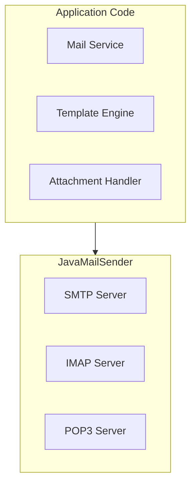

# Spring Mail: Полное руководство по отправке email

## Полезные ссылки

[Официальная документация Spring](https://docs.spring.io/)
[Spring Projects](https://spring.io/projects)

## Содержание

- [Введение в Spring Mail](#введение-в-spring-mail)
  - [Основные возможности](#основные-возможности)
  - [Архитектура Spring Mail](#архитектура-spring-mail)
- [Настройка Spring Mail](#настройка-spring-mail)
  - [Зависимости](#зависимости)
  - [Конфигурация](#конфигурация)
- [SMTP Configuration](#smtp-configuration)
- [Default sender](#default-sender)
  - [Java Configuration](#java-configuration)
- [Отправка простых сообщений](#отправка-простых-сообщений)
  - [Базовое использование](#базовое-использование)
  - [Отправка нескольким получателям](#отправка-нескольким-получателям)
- [Отправка MIME сообщений](#отправка-mime-сообщений)
  - [HTML Email](#html-email)
  - [Email с вложениями](#email-с-вложениями)
  - [Email с встроенными изображениями](#email-с-встроенными-изображениями)
- [Шаблоны Email](#шаблоны-email)
  - [Thymeleaf Templates](#thymeleaf-templates)
  - [FreeMarker Templates](#freemarker-templates)
- [Асинхронная отправка](#асинхронная-отправка)
  - [@Async](#async)
- [Лучшие практики](#лучшие-практики)
  - [1. Используйте шаблоны для HTML email](#1-используйте-шаблоны-для-html-email)
  - [2. Обрабатывайте исключения](#2-обрабатывайте-исключения)
  - [3. Используйте асинхронную отправку для больших объемов](#3-используйте-асинхронную-отправку-для-больших-объемов)
  - [4. Валидируйте email адреса](#4-валидируйте-email-адреса)
  - [5. Используйте конфигурацию из properties](#5-используйте-конфигурацию-из-properties)
- [✅ Хорошо](#хорошо)
- [Retry механизм](#retry-механизм)
  - [Retry при ошибках отправки](#retry-при-ошибках-отправки)
- [Очередь отправки](#очередь-отправки)
  - [Отправка через очередь](#отправка-через-очередь)
- [Мониторинг и метрики](#мониторинг-и-метрики)
  - [Email Metrics](#email-metrics)
- [Продвинутые шаблоны](#продвинутые-шаблоны)
  - [Динамические шаблоны](#динамические-шаблоны)
  - [Мультиязычные шаблоны](#мультиязычные-шаблоны)
- [Валидация email](#валидация-email)
  - [Email Validation](#email-validation)
  - [Bean Validation](#bean-validation)
- [Безопасность](#безопасность)
  - [Email Security](#email-security)
  - [Защита от спама](#защита-от-спама)
- [Тестирование](#тестирование)
  - [Mock Email Service](#mock-email-service)
  - [Integration Testing](#integration-testing)
- [Оптимизация производительности](#оптимизация-производительности)
  - [Connection Pooling](#connection-pooling)
  - [Batch Sending](#batch-sending)
- [Заключение](#заключение)
- [Дополнительные ресурсы](#дополнительные-ресурсы)

## Введение в Spring Mail

**Spring Mail** предоставляет простой и мощный **API** для отправки **email** сообщений. Он абстрагирует детали работы с **JavaMail API** и интегрируется с различными шаблонизаторами для создания красивых **HTML** писем.

### Основные возможности

- **JavaMailSender**: Отправка простых и **MIME** сообщений
- **Шаблоны**: Интеграция с **Thymeleaf**, **FreeMarker** и другими
- **Вложения**: Отправка файлов и вложений
- **HTML Email**: Создание **HTML** писем
- **Асинхронная отправка**: Отправка **email** в фоновом режиме

### Архитектура Spring Mail



## Настройка Spring Mail

### Зависимости

**Зависимость **spring-`boot-starter`-mail** (pom.xml):**

```xml
<dependency>
    <groupId>org.springframework.boot</groupId>
    <artifactId>spring-boot-starter-mail</artifactId>
</dependency>
```

### Конфигурация

**application.properties:**

```properties
# SMTP Configuration
spring.mail.host=smtp.gmail.com
spring.mail.port=587
spring.mail.username=your-email@gmail.com
spring.mail.password=your-password
spring.mail.properties.mail.smtp.auth=true
spring.mail.properties.mail.smtp.starttls.enable=true
spring.mail.properties.mail.smtp.starttls.required=true

# Default sender
spring.mail.default-encoding=UTF-8
```

### Java Configuration

```java
// Конфигурация JavaMailSender (SMTP)
@Configuration
public class MailConfig {

    @Bean
    public JavaMailSenderImpl mailSender() {
        JavaMailSenderImpl mailSender = new JavaMailSenderImpl();
        mailSender.setHost("smtp.gmail.com");
        mailSender.setPort(587);
        mailSender.setUsername("your-email@gmail.com");
        mailSender.setPassword("your-password");

        Properties props = mailSender.getJavaMailProperties();
        props.put("mail.transport.protocol", "smtp");
        props.put("mail.smtp.auth", "true");
        props.put("mail.smtp.starttls.enable", "true");
        props.put("mail.debug", "true");

        return mailSender;
    }
}
```

## Отправка простых сообщений

### Базовое использование

```java
// Сервис отправки простого текстового письма
@Service
public class EmailService {

    @Autowired
    private JavaMailSender mailSender;

    public void sendSimpleEmail(String to, String subject, String text) {
        SimpleMailMessage message = new SimpleMailMessage();
        message.setTo(to);
        message.setSubject(subject);
        message.setText(text);
        message.setFrom("noreply@example.com");

        mailSender.send(message);
    }
}
```

### Отправка нескольким получателям

```java
// Сервис отправки простого текстового письма
@Service
public class EmailService {

    @Autowired
    private JavaMailSender mailSender;

    public void sendToMultipleRecipients(
            String[] to,
            String[] cc,
            String[] bcc,
            String subject,
            String text) {
        SimpleMailMessage message = new SimpleMailMessage();
        message.setTo(to);
        message.setCc(cc);
        message.setBcc(bcc);
        message.setSubject(subject);
        message.setText(text);
        message.setFrom("noreply@example.com");

        mailSender.send(message);
    }
}
```

## Отправка MIME сообщений

### HTML Email

```java
// Сервис отправки простого текстового письма
@Service
public class EmailService {

    @Autowired
    private JavaMailSender mailSender;

    public void sendHtmlEmail(String to, String subject, String htmlContent) {
        MimeMessage message = mailSender.createMimeMessage();

        try {
            MimeMessageHelper helper = new MimeMessageHelper(message, true, "UTF-8");
            helper.setTo(to);
            helper.setSubject(subject);
            helper.setText(htmlContent, true); // true = HTML
            helper.setFrom("noreply@example.com");

            mailSender.send(message);
        } catch (MessagingException e) {
            throw new EmailException("Failed to send email", e);
        }
    }
}
```

### Email с вложениями

```java
// Сервис отправки простого текстового письма
@Service
public class EmailService {

    @Autowired
    private JavaMailSender mailSender;

    public void sendEmailWithAttachment(
            String to,
            String subject,
            String text,
            String attachmentPath) {
        MimeMessage message = mailSender.createMimeMessage();

        try {
            MimeMessageHelper helper = new MimeMessageHelper(message, true, "UTF-8");
            helper.setTo(to);
            helper.setSubject(subject);
            helper.setText(text);
            helper.setFrom("noreply@example.com");

            FileSystemResource file = new FileSystemResource(new File(attachmentPath));
            helper.addAttachment(file.getFilename(), file);

            mailSender.send(message);
        } catch (MessagingException e) {
            throw new EmailException("Failed to send email", e);
        }
    }
}
```

### Email с встроенными изображениями

```java
// Сервис отправки простого текстового письма
@Service
public class EmailService {

    @Autowired
    private JavaMailSender mailSender;

    public void sendEmailWithInlineImage(
            String to,
            String subject,
            String htmlContent,
            String imagePath) {
        MimeMessage message = mailSender.createMimeMessage();

        try {
            MimeMessageHelper helper = new MimeMessageHelper(message, true, "UTF-8");
            helper.setTo(to);
            helper.setSubject(subject);
            helper.setText(htmlContent, true);
            helper.setFrom("noreply@example.com");

            FileSystemResource image = new FileSystemResource(new File(imagePath));
            helper.addInline("logo", image);

            mailSender.send(message);
        } catch (MessagingException e) {
            throw new EmailException("Failed to send email", e);
        }
    }
}
```

## Шаблоны Email

### Thymeleaf Templates

**Зависимости:**

```xml
<dependency>
    <groupId>org.springframework.boot</groupId>
    <artifactId>spring-boot-starter-thymeleaf</artifactId>
</dependency>
```

**Шаблон (**templates**/**email**/**welcome.html**):**

```html
<!DOCTYPE html>
<html xmlns:th="http://www.thymeleaf.org">
<head>
    <meta charset="UTF-8">
    <title>Welcome</title>
</head>
<body>
    <h1>Welcome, <span th:text="${name}">User</span>!</h1>
    <p>Thank you for registering with us.</p>
    <p>Your email: <span th:text="${email}">email</span></p>
</body>
</html>
```

**Использование:**

```java
// Сервис отправки простого текстового письма
@Service
public class EmailService {

    @Autowired
    private JavaMailSender mailSender;

    @Autowired
    private TemplateEngine templateEngine;

    public void sendWelcomeEmail(String to, String name, String email) {
        MimeMessage message = mailSender.createMimeMessage();

        try {
            MimeMessageHelper helper = new MimeMessageHelper(message, true, "UTF-8");
            helper.setTo(to);
            helper.setSubject("Welcome!");
            helper.setFrom("noreply@example.com");

            Context context = new Context();
            context.setVariable("name", name);
            context.setVariable("email", email);

            String htmlContent = templateEngine.process("email/welcome", context);
            helper.setText(htmlContent, true);

            mailSender.send(message);
        } catch (MessagingException e) {
            throw new EmailException("Failed to send email", e);
        }
    }
}
```

### FreeMarker Templates

**Зависимости:**

```xml
<dependency>
    <groupId>org.springframework.boot</groupId>
    <artifactId>spring-boot-starter-freemarker</artifactId>
</dependency>
```

**Шаблон (**templates**/**email**/**order-confirmation.ftl**):**

```html
<!DOCTYPE html>
<html>
<head>
    <meta charset="UTF-8">
    <title>Order Confirmation</title>
</head>
<body>
    <h1>Order Confirmation</h1>
    <p>Order ID: ${orderId}</p>
    <p>Total: ${total}</p>
    <p>Items:</p>
    <ul>
        <#list items as item>
            <li>${item.name} - ${item.price}</li>
        </#list>
    </ul>
</body>
</html>
```

**Использование:**

```java
// Сервис отправки простого текстового письма
@Service
public class EmailService {

    @Autowired
    private JavaMailSender mailSender;

    @Autowired
    private FreeMarkerConfigurer freeMarkerConfigurer;

    public void sendOrderConfirmation(
            String to,
            String orderId,
            BigDecimal total,
            List<OrderItem> items) {
        MimeMessage message = mailSender.createMimeMessage();

        try {
            MimeMessageHelper helper = new MimeMessageHelper(message, true, "UTF-8");
            helper.setTo(to);
            helper.setSubject("Order Confirmation");
            helper.setFrom("noreply@example.com");

            Map<String, Object> model = new HashMap<>();
            model.put("orderId", orderId);
            model.put("total", total);
            model.put("items", items);

            Template template = freeMarkerConfigurer.getConfiguration()
                .getTemplate("email/order-confirmation.ftl");
            String htmlContent = FreeMarkerTemplateUtils.processTemplateIntoString(template, model);
            helper.setText(htmlContent, true);

            mailSender.send(message);
        } catch (Exception e) {
            throw new EmailException("Failed to send email", e);
        }
    }
}
```

## Асинхронная отправка

### @Async

```java
@Configuration
@EnableAsync
public class AsyncConfig {
    // Конфигурация async executor
}

@Service
public class EmailService {

    @Autowired
    private JavaMailSender mailSender;

    @Async
    public CompletableFuture<Void> sendEmailAsync(
            String to,
            String subject,
            String text) {
        try {
            sendSimpleEmail(to, subject, text);
            return CompletableFuture.completedFuture(null);
        } catch (Exception e) {
            return CompletableFuture.failedFuture(e);
        }
    }
}
```

## Лучшие практики

### 1. Используйте шаблоны для HTML email

```java
// ✅ Хорошо
String htmlContent = templateEngine.process("email/welcome", context);
helper.setText(htmlContent, true);

// ❌ Плохо
helper.setText("<html><body>Welcome!</body></html>", true);
```

### 2. Обрабатывайте исключения

```java
// ✅ Хорошо
try {
    mailSender.send(message);
} catch (MailException e) {
    log.error("Failed to send email", e);
    // Обработка ошибки
}
```

### 3. Используйте асинхронную отправку для больших объемов

```java
// ✅ Хорошо
@Async
public CompletableFuture<Void> sendEmailAsync(...) {
    // Асинхронная отправка
}
```

### 4. Валидируйте email адреса

```java
// ✅ Хорошо
@Email
private String email;
```

### 5. Используйте конфигурацию из properties

```properties
# ✅ Хорошо
spring.mail.host=smtp.gmail.com
spring.mail.port=587
```

## Retry механизм

### Retry при ошибках отправки

```java
@Configuration
@EnableRetry
public class MailRetryConfig {

    @Bean
    public RetryTemplate mailRetryTemplate() {
        RetryTemplate retryTemplate = new RetryTemplate();

        ExponentialBackOffPolicy backOffPolicy = new ExponentialBackOffPolicy();
        backOffPolicy.setInitialInterval(1000);
        backOffPolicy.setMultiplier(2);
        backOffPolicy.setMaxInterval(10000);

        SimpleRetryPolicy retryPolicy = new SimpleRetryPolicy();
        retryPolicy.setMaxAttempts(3);

        retryTemplate.setBackOffPolicy(backOffPolicy);
        retryTemplate.setRetryPolicy(retryPolicy);

        return retryTemplate;
    }
}

@Service
public class RetryableEmailService {

    @Autowired
    private JavaMailSender mailSender;

    @Autowired
    private RetryTemplate mailRetryTemplate;

    public void sendEmailWithRetry(String to, String subject, String text) {
        mailRetryTemplate.execute(context -> {
            try {
                SimpleMailMessage message = new SimpleMailMessage();
                message.setTo(to);
                message.setSubject(subject);
                message.setText(text);
                mailSender.send(message);
                return null;
            } catch (MailException e) {
                log.warn("Retry attempt: {}", context.getRetryCount());
                throw e;
            }
        });
    }
}
```

## Очередь отправки

### Отправка через очередь

```java
@Service
public class QueuedEmailService {

    @Autowired
    private RabbitTemplate rabbitTemplate;

    public void queueEmail(EmailMessage emailMessage) {
        rabbitTemplate.convertAndSend("email.queue", emailMessage);
    }
}

@Component
public class EmailQueueConsumer {

    @Autowired
    private JavaMailSender mailSender;

    @RabbitListener(queues = "email.queue")
    public void processEmail(EmailMessage emailMessage) {
        try {
            MimeMessage message = mailSender.createMimeMessage();
            MimeMessageHelper helper = new MimeMessageHelper(message, true);
            helper.setTo(emailMessage.getTo());
            helper.setSubject(emailMessage.getSubject());
            helper.setText(emailMessage.getText(), emailMessage.isHtml());
            mailSender.send(message);
        } catch (Exception e) {
            log.error("Failed to send queued email", e);
            // Обработка ошибки
        }
    }
}
```

## Мониторинг и метрики

### Email Metrics

```java
@Component
public class EmailMetrics {

    private final MeterRegistry meterRegistry;
    private final Counter emailsSent;
    private final Counter emailsFailed;
    private final Timer emailSendingTimer;

    public EmailMetrics(MeterRegistry meterRegistry) {
        this.meterRegistry = meterRegistry;
        this.emailsSent = Counter.builder("emails.sent")
            .description("Number of emails sent")
            .register(meterRegistry);
        this.emailsFailed = Counter.builder("emails.failed")
            .description("Number of failed emails")
            .register(meterRegistry);
        this.emailSendingTimer = Timer.builder("emails.sending.duration")
            .description("Email sending duration")
            .register(meterRegistry);
    }

    public void recordEmailSent(String type) {
        emailsSent.increment(Tags.of("type", type));
    }

    public void recordEmailFailed(String type) {
        emailsFailed.increment(Tags.of("type", type));
    }

    public <T> T measureSending(String type, Supplier<T> supplier) {
        Timer.Sample sample = Timer.start(meterRegistry);
        try {
            T result = supplier.get();
            recordEmailSent(type);
            return result;
        } catch (Exception e) {
            recordEmailFailed(type);
            throw e;
        } finally {
            sample.stop(emailSendingTimer);
        }
    }
}
```

## Продвинутые шаблоны

### Динамические шаблоны

```java
@Service
public class DynamicTemplateService {

    @Autowired
    private TemplateEngine templateEngine;

    public String generateEmailContent(String templateName, Map<String, Object> variables) {
        Context context = new Context();
        variables.forEach(context::setVariable);
        return templateEngine.process(templateName, context);
    }

    public void sendDynamicEmail(String to, String templateName, Map<String, Object> variables) {
        String content = generateEmailContent(templateName, variables);
        sendHtmlEmail(to, "Subject", content);
    }
}
```

### Мультиязычные шаблоны

```java
@Service
public class MultilingualEmailService {

    @Autowired
    private TemplateEngine templateEngine;

    @Autowired
    private MessageSource messageSource;

    public void sendMultilingualEmail(String to, String locale, String templateName) {
        Locale emailLocale = Locale.forLanguageTag(locale);
        Context context = new Context(emailLocale);

        // Добавление локализованных сообщений
        context.setVariable("greeting", messageSource.getMessage("email.greeting", null, emailLocale));
        context.setVariable("footer", messageSource.getMessage("email.footer", null, emailLocale));

        String content = templateEngine.process(templateName, context);
        sendHtmlEmail(to, getSubject(emailLocale), content);
    }

    private String getSubject(Locale locale) {
        return messageSource.getMessage("email.subject", null, locale);
    }
}
```

## Валидация email

### Email Validation

```java
@Service
public class EmailValidationService {

    private static final Pattern EMAIL_PATTERN = Pattern.compile(
        "^[A-Z0-9._%+-]+@[A-Z0-9.-]+\\.[A-Z]{2,6}$",
        Pattern.CASE_INSENSITIVE
    );

    public boolean isValidEmail(String email) {
        return email != null && EMAIL_PATTERN.matcher(email).matches();
    }

    public void validateEmails(List<String> emails) {
        List<String> invalidEmails = emails.stream()
            .filter(email -> !isValidEmail(email))
            .collect(Collectors.toList());

        if (!invalidEmails.isEmpty()) {
            throw new InvalidEmailException("Invalid emails: " + invalidEmails);
        }
    }
}
```

### Bean Validation

```java
public class EmailRequest {

    @Email
    @NotBlank
    private String to;

    @NotBlank
    private String subject;

    @NotBlank
    private String text;

    // Getters and setters
}

@Service
public class ValidatedEmailService {

    @Autowired
    private JavaMailSender mailSender;

    @Autowired
    private Validator validator;

    public void sendValidatedEmail(EmailRequest request) {
        Set<ConstraintViolation<EmailRequest>> violations = validator.validate(request);
        if (!violations.isEmpty()) {
            throw new ValidationException("Email validation failed", violations);
        }

        sendEmail(request.getTo(), request.getSubject(), request.getText());
    }
}
```

## Безопасность

### Email Security

```java
@Configuration
public class SecureMailConfig {

    @Bean
    public JavaMailSender secureMailSender() {
        JavaMailSenderImpl mailSender = new JavaMailSenderImpl();
        mailSender.setHost("smtp.gmail.com");
        mailSender.setPort(587);
        mailSender.setUsername("your-email@gmail.com");
        mailSender.setPassword("your-password");

        Properties props = mailSender.getJavaMailProperties();
        props.put("mail.transport.protocol", "smtp");
        props.put("mail.smtp.auth", "true");
        props.put("mail.smtp.starttls.enable", "true");
        props.put("mail.smtp.starttls.required", "true");
        props.put("mail.smtp.ssl.trust", "smtp.gmail.com");

        return mailSender;
    }
}
```

### Защита от спама

```java
@Service
public class SpamProtectionService {

    private final Map<String, AtomicInteger> emailCounts = new ConcurrentHashMap<>();
    private static final int MAX_EMAILS_PER_HOUR = 10;

    public boolean canSendEmail(String to) {
        String key = to + ":" + LocalDateTime.now().getHour();
        int count = emailCounts.computeIfAbsent(key, k -> new AtomicInteger(0))
            .incrementAndGet();

        return count <= MAX_EMAILS_PER_HOUR;
    }

    public void recordEmailSent(String to) {
        String key = to + ":" + LocalDateTime.now().getHour();
        emailCounts.computeIfAbsent(key, k -> new AtomicInteger(0))
            .incrementAndGet();
    }
}
```

## Тестирование

### Mock Email Service

```java
@SpringBootTest
class EmailServiceTest {

    @MockBean
    private JavaMailSender mailSender;

    @Autowired
    private EmailService emailService;

    @Test
    void testSendEmail() {
        doNothing().when(mailSender).send(any(MimeMessage.class));

        emailService.sendHtmlEmail("test@example.com", "Subject", "Content");

        verify(mailSender, times(1)).send(any(MimeMessage.class));
    }
}
```

### Integration Testing

```java
@SpringBootTest
class EmailIntegrationTest {

    @Autowired
    private JavaMailSender mailSender;

    @Test
    void testEmailSending() {
        // Использование тестового SMTP сервера (например, GreenMail)
        SimpleMailMessage message = new SimpleMailMessage();
        message.setTo("test@example.com");
        message.setSubject("Test");
        message.setText("Test content");

        assertDoesNotThrow(() -> mailSender.send(message));
    }
}
```

## Оптимизация производительности

### Connection Pooling

```java
@Configuration
public class OptimizedMailConfig {

    @Bean
    public JavaMailSender optimizedMailSender() {
        JavaMailSenderImpl mailSender = new JavaMailSenderImpl();
        mailSender.setHost("smtp.gmail.com");
        mailSender.setPort(587);

        Properties props = mailSender.getJavaMailProperties();
        props.put("mail.smtp.connectiontimeout", "5000");
        props.put("mail.smtp.timeout", "5000");
        props.put("mail.smtp.writetimeout", "5000");

        return mailSender;
    }
}
```

### Batch Sending

```java
@Service
public class BatchEmailService {

    @Autowired
    private JavaMailSender mailSender;

    public void sendBatchEmails(List<EmailMessage> messages) {
        MimeMessage[] mimeMessages = messages.stream()
            .map(this::createMimeMessage)
            .toArray(MimeMessage[]::new);

        mailSender.send(mimeMessages);
    }

    private MimeMessage createMimeMessage(EmailMessage emailMessage) {
        try {
            MimeMessage message = mailSender.createMimeMessage();
            MimeMessageHelper helper = new MimeMessageHelper(message, true);
            helper.setTo(emailMessage.getTo());
            helper.setSubject(emailMessage.getSubject());
            helper.setText(emailMessage.getText(), emailMessage.isHtml());
            return message;
        } catch (MessagingException e) {
            throw new EmailException("Failed to create email", e);
        }
    }
}
```


## Заключение

**Spring Mail** предоставляет простой и мощный **API** для отправки **email** сообщений. Использование шаблонов, вложений, асинхронной отправки, **retry** механизмов, очередей, мониторинга, валидации, безопасности и других продвинутых возможностей позволяет создавать профессиональные, надежные и масштабируемые **email** системы.

## Дополнительные ресурсы

- [**Spring Mail** Documentation](https://docs.spring.io/spring-framework/reference/integration/email.html)
- [**Spring Boot** Mail](https://docs.spring.io/spring-boot/docs/current/reference/html/io.html#io.email)
- [Thymeleaf **Email** Templates](https://www.thymeleaf.org/doc/tutorials/3.1/usingthymeleaf.html#email-templates)
- [JavaMail API](https://javaee.github.io/javamail/)
- [**Email Best Practices**](https://www.baeldung.com/spring-email)

## См. также

- [[spring-actuator|Spring Actuator: Полное руководство по мониторингу и управлению]]
- [[spring-ai|Spring AI]]
- [[spring-aop|Spring AOP: Полное руководство по аспектно-ориентированному программированию]]
- [[spring-batch|Spring Batch для Java]]
- [[spring-boot|Spring Boot — Полное руководство]]
