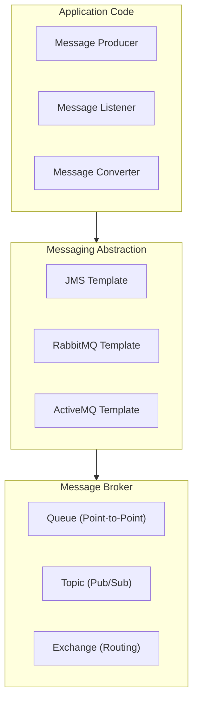

# Spring Messaging: Полное руководство по messaging системам

## Полезные ссылки

[Официальная документация Spring](https://docs.spring.io/)
[Spring Projects](https://spring.io/projects)

## Содержание

- [Введение в Spring Messaging](#введение-в-spring-messaging)
  - [Основные возможности](#основные-возможности)
  - [Архитектура Spring Messaging](#архитектура-spring-messaging)
- [JMS (Java Message Service)](#jms-java-message-service)
  - [Настройка JMS](#настройка-jms)
  - [Отправка сообщений](#отправка-сообщений)
  - [Получение сообщений](#получение-сообщений)
  - [Конфигурация JMS](#конфигурация-jms)
- [RabbitMQ](#rabbitmq)
  - [Настройка RabbitMQ](#настройка-rabbitmq)
  - [Отправка сообщений](#отправка-сообщений-1)
  - [Получение сообщений](#получение-сообщений-1)
  - [Конфигурация RabbitMQ](#конфигурация-rabbitmq)
- [Message Converters](#message-converters)
  - [JSON Converter](#json-converter)
  - [Custom Converter](#custom-converter)
- [Транзакции](#транзакции)
  - [JMS Transactions](#jms-transactions)
  - [RabbitMQ Transactions](#rabbitmq-transactions)
- [Лучшие практики](#лучшие-практики)
  - [1. Используйте правильный тип messaging](#1-используйте-правильный-тип-messaging)
  - [2. Обрабатывайте ошибки](#2-обрабатывайте-ошибки)
  - [3. Используйте транзакции для критических операций](#3-используйте-транзакции-для-критических-операций)
  - [4. Настраивайте конвертеры сообщений](#4-настраивайте-конвертеры-сообщений)
  - [5. Используйте durable queues для важных сообщений](#5-используйте-durable-queues-для-важных-сообщений)
- [Обработка ошибок и Retry](#обработка-ошибок-и-retry)
  - [JMS Error Handling](#jms-error-handling)
  - [RabbitMQ Error Handling](#rabbitmq-error-handling)
  - [Retry механизм](#retry-механизм)
  - [Dead Letter Queue](#dead-letter-queue)
- [Message Patterns](#message-patterns)
  - [Request-Reply Pattern](#request-reply-pattern)
  - [Publish-Subscribe Pattern](#publish-subscribe-pattern)
  - [Message Routing Pattern](#message-routing-pattern)
  - [Message Aggregator Pattern](#message-aggregator-pattern)
- [Message Filtering](#message-filtering)
  - [JMS Selector](#jms-selector)
  - [RabbitMQ Headers Exchange](#rabbitmq-headers-exchange)
- [Message Transformation](#message-transformation)
  - [Custom Message Transformer](#custom-message-transformer)
  - [Message Enricher](#message-enricher)
- [Message Batching](#message-batching)
  - [Batch Processing](#batch-processing)
  - [RabbitMQ Batch Consumer](#rabbitmq-batch-consumer)
- [Мониторинг и метрики](#мониторинг-и-метрики)
  - [JMS Metrics](#jms-metrics)
  - [RabbitMQ Health Check](#rabbitmq-health-check)
- [Безопасность](#безопасность)
  - [JMS Security](#jms-security)
  - [RabbitMQ Security](#rabbitmq-security)
- [Производительность](#производительность)
  - [Connection Pooling](#connection-pooling)
  - [Async Message Processing](#async-message-processing)
- [Интеграция с Spring Cloud](#интеграция-с-spring-cloud)
  - [Spring Cloud Stream](#spring-cloud-stream)
- [Заключение](#заключение)
- [Дополнительные ресурсы](#дополнительные-ресурсы)
- [См. также](#см-также)

## Введение в Spring Messaging

**Spring Messaging** предоставляет абстракцию для работы с различными **messaging** системами: **JMS**, **RabbitMQ**, **ActiveMQ** и другими. Это позволяет легко переключаться между различными провайдерами без изменения бизнес-логики.

### Основные возможности

- **JMS**: Поддержка **Java Message Service**
- **RabbitMQ**: Интеграция с **RabbitMQ** через **AMQP**
- **ActiveMQ**: Поддержка **Apache ActiveMQ**
- **Message Converters**: Преобразование сообщений
- **Transaction Support**: Транзакционная поддержка

### Архитектура Spring Messaging



## JMS (`Java Message Service`)

### Настройка JMS

**Зависимости:**

**Зависимость **spring-`boot-starter`-activemq** (pom.xml):**

```xml
<dependency>
    <groupId>org.springframework.boot</groupId>
    <artifactId>spring-boot-starter-activemq</artifactId>
</dependency>
```

**Конфигурация:**

```properties
# ActiveMQ Configuration
spring.activemq.broker-url=tcp://localhost:61616
spring.activemq.user=admin
spring.activemq.password=admin
spring.jms.pub-sub-domain=false
```

### Отправка сообщений

```java
// Отправка сообщений в JMS/RabbitMQ
@Service
public class MessageProducer {

    @Autowired
    private JmsTemplate jmsTemplate;

    public void sendMessage(String destination, String message) {
        jmsTemplate.convertAndSend(destination, message);
    }

    public void sendMessage(String destination, Object object) {
        jmsTemplate.convertAndSend(destination, object);
    }

    public void sendMessageWithCallback(String destination, String message) {
        jmsTemplate.convertAndSend(destination, message, new MessagePostProcessor() {
            @Override
            public Message postProcessMessage(Message message) throws JMSException {
                message.setStringProperty("custom-header", "value");
                return message;
            }
        });
    }
}
```

### Получение сообщений

```java
// Получение сообщений через @JmsListener
@Service
public class MessageConsumer {

    @JmsListener(destination = "queue.name")
    public void receiveMessage(String message) {
        System.out.println("Received message: " + message);
    }

    @JmsListener(destination = "queue.object")
    public void receiveObject(User user) {
        System.out.println("Received user: " + user.getName());
    }

    @JmsListener(destination = "queue.name", containerFactory = "jmsListenerContainerFactory")
    public void receiveMessageWithFactory(String message) {
        System.out.println("Received message: " + message);
    }
}
```

### Конфигурация JMS

```java
@Configuration
@EnableJms
public class JmsConfig {

    @Bean
    public ConnectionFactory connectionFactory() {
        ActiveMQConnectionFactory factory = new ActiveMQConnectionFactory();
        factory.setBrokerURL("tcp://localhost:61616");
        return factory;
    }

    @Bean
    public JmsTemplate jmsTemplate(ConnectionFactory connectionFactory) {
        JmsTemplate template = new JmsTemplate(connectionFactory);
        template.setDefaultDestinationName("default.queue");
        return template;
    }

    @Bean
    public DefaultJmsListenerContainerFactory jmsListenerContainerFactory(
            ConnectionFactory connectionFactory) {
        DefaultJmsListenerContainerFactory factory = new DefaultJmsListenerContainerFactory();
        factory.setConnectionFactory(connectionFactory);
        factory.setConcurrency("1-5");
        factory.setSessionTransacted(true);
        return factory;
    }
}
```

## RabbitMQ

### Настройка RabbitMQ

**Зависимости:**

```xml
<dependency>
    <groupId>org.springframework.boot</groupId>
    <artifactId>spring-boot-starter-amqp</artifactId>
</dependency>
```

**Конфигурация:**

```properties
# RabbitMQ Configuration
spring.rabbitmq.host=localhost
spring.rabbitmq.port=5672
spring.rabbitmq.username=guest
spring.rabbitmq.password=guest
```

### Отправка сообщений

```java
@Service
public class RabbitMQProducer {

    @Autowired
    private RabbitTemplate rabbitTemplate;

    public void sendMessage(String exchange, String routingKey, String message) {
        rabbitTemplate.convertAndSend(exchange, routingKey, message);
    }

    public void sendMessage(String queue, String message) {
        rabbitTemplate.convertAndSend(queue, message);
    }

    public void sendMessage(String exchange, String routingKey, Object object) {
        rabbitTemplate.convertAndSend(exchange, routingKey, object);
    }
}
```

### Получение сообщений

```java
@Component
public class RabbitMQConsumer {

    @RabbitListener(queues = "queue.name")
    public void receiveMessage(String message) {
        System.out.println("Received message: " + message);
    }

    @RabbitListener(queues = "queue.object")
    public void receiveObject(User user) {
        System.out.println("Received user: " + user.getName());
    }

    @RabbitListener(bindings = @QueueBinding(
        value = @Queue(value = "queue.name", durable = "true"),
        exchange = @Exchange(value = "exchange.name", type = ExchangeTypes.TOPIC),
        key = "routing.key"
    ))
    public void receiveMessageWithBinding(String message) {
        System.out.println("Received message: " + message);
    }
}
```

### Конфигурация RabbitMQ

```java
@Configuration
@EnableRabbit
public class RabbitMQConfig {

    @Bean
    public Queue queue() {
        return QueueBuilder.durable("queue.name").build();
    }

    @Bean
    public TopicExchange exchange() {
        return new TopicExchange("exchange.name");
    }

    @Bean
    public Binding binding(Queue queue, TopicExchange exchange) {
        return BindingBuilder
            .bind(queue)
            .to(exchange)
            .with("routing.key");
    }

    @Bean
    public MessageConverter messageConverter() {
        return new Jackson2JsonMessageConverter();
    }

    @Bean
    public RabbitTemplate rabbitTemplate(ConnectionFactory connectionFactory) {
        RabbitTemplate template = new RabbitTemplate(connectionFactory);
        template.setMessageConverter(messageConverter());
        return template;
    }
}
```

## Message Converters

### JSON Converter

```java
@Configuration
public class MessageConverterConfig {

    @Bean
    public MessageConverter jsonMessageConverter() {
        return new Jackson2JsonMessageConverter();
    }

    @Bean
    public JmsTemplate jmsTemplate(ConnectionFactory connectionFactory) {
        JmsTemplate template = new JmsTemplate(connectionFactory);
        template.setMessageConverter(jsonMessageConverter());
        return template;
    }
}
```

### Custom Converter

```java
public class UserMessageConverter implements MessageConverter {

    @Override
    public Message toMessage(Object object, Session session) throws JMSException {
        User user = (User) object;
        TextMessage message = session.createTextMessage();
        message.setText(user.getId() + "," + user.getName() + "," + user.getEmail());
        return message;
    }

    @Override
    public Object fromMessage(Message message) throws JMSException {
        TextMessage textMessage = (TextMessage) message;
        String[] parts = textMessage.getText().split(",");
        User user = new User();
        user.setId(Long.parseLong(parts[0]));
        user.setName(parts[1]);
        user.setEmail(parts[2]);
        return user;
    }
}
```

## Транзакции

### JMS Transactions

```java
@Service
@Transactional
public class TransactionalMessageService {

    @Autowired
    private JmsTemplate jmsTemplate;

    @Autowired
    private UserRepository userRepository;

    public void processUser(User user) {
        // Сохранение в БД
        userRepository.save(user);

        // Отправка сообщения (в той же транзакции)
        jmsTemplate.convertAndSend("user.queue", user);
    }
}
```

### RabbitMQ Transactions

```java
@Configuration
public class RabbitMQTransactionConfig {

    @Bean
    public RabbitTransactionManager rabbitTransactionManager(
            ConnectionFactory connectionFactory) {
        return new RabbitTransactionManager(connectionFactory);
    }
}

@Service
@Transactional
public class TransactionalRabbitMQService {

    @Autowired
    private RabbitTemplate rabbitTemplate;

    @Autowired
    private UserRepository userRepository;

    public void processUser(User user) {
        userRepository.save(user);
        rabbitTemplate.convertAndSend("user.queue", user);
    }
}
```

## Лучшие практики

### 1. Используйте правильный тип messaging

```java
// ✅ Хорошо - для point-to-point
@JmsListener(destination = "queue.name")

// ✅ Хорошо - для pub/sub
@JmsListener(destination = "topic.name", containerFactory = "topicFactory")
```

### 2. Обрабатывайте ошибки

```java
// ✅ Хорошо
@JmsListener(destination = "queue.name")
public void receiveMessage(String message) {
    try {
        // Обработка сообщения
    } catch (Exception e) {
        // Обработка ошибки
        log.error("Error processing message", e);
    }
}
```

### 3. Используйте транзакции для критических операций

```java
// ✅ Хорошо
@Transactional
public void processUser(User user) {
    userRepository.save(user);
    jmsTemplate.convertAndSend("user.queue", user);
}
```

### 4. Настраивайте конвертеры сообщений

```java
// ✅ Хорошо
@Bean
public MessageConverter jsonMessageConverter() {
    return new Jackson2JsonMessageConverter();
}
```

### 5. Используйте durable queues для важных сообщений

```java
// ✅ Хорошо
@Bean
public Queue queue() {
    return QueueBuilder.durable("queue.name").build();
}
```

## Обработка ошибок и Retry

### JMS Error Handling

```java
@Configuration
@EnableJms
public class JmsErrorHandlingConfig {

    @Bean
    public DefaultJmsListenerContainerFactory jmsListenerContainerFactory(
            ConnectionFactory connectionFactory) {
        DefaultJmsListenerContainerFactory factory = new DefaultJmsListenerContainerFactory();
        factory.setConnectionFactory(connectionFactory);
        factory.setErrorHandler(new JmsErrorHandler() {
            @Override
            public void handleError(Throwable t) {
                log.error("JMS error occurred", t);
                // Дополнительная обработка ошибки
            }
        });
        return factory;
    }
}
```

### RabbitMQ Error Handling

```java
@Configuration
@EnableRabbit
public class RabbitMQErrorHandlingConfig {

    @Bean
    public RabbitListenerContainerFactory<SimpleMessageListenerContainer>
            rabbitListenerContainerFactory(ConnectionFactory connectionFactory) {
        SimpleRabbitListenerContainerFactory factory = new SimpleRabbitListenerContainerFactory();
        factory.setConnectionFactory(connectionFactory);
        factory.setErrorHandler(new ConditionalRejectingErrorHandler(
            new FatalExceptionStrategy()
        ));
        return factory;
    }
}
```

### Retry механизм

```java
@Configuration
@EnableRetry
public class RetryConfig {

    @Bean
    public RetryTemplate retryTemplate() {
        RetryTemplate retryTemplate = new RetryTemplate();

        FixedBackOffPolicy backOffPolicy = new FixedBackOffPolicy();
        backOffPolicy.setBackOffPeriod(2000); // 2 секунды

        SimpleRetryPolicy retryPolicy = new SimpleRetryPolicy();
        retryPolicy.setMaxAttempts(3);

        retryTemplate.setBackOffPolicy(backOffPolicy);
        retryTemplate.setRetryPolicy(retryPolicy);

        return retryTemplate;
    }
}

@Service
public class RetryableMessageService {

    @Autowired
    private RetryTemplate retryTemplate;

    @Autowired
    private JmsTemplate jmsTemplate;

    public void sendMessageWithRetry(String destination, String message) {
        retryTemplate.execute(context -> {
            try {
                jmsTemplate.convertAndSend(destination, message);
                return null;
            } catch (Exception e) {
                log.warn("Retry attempt: {}", context.getRetryCount());
                throw e;
            }
        });
    }
}
```

### Dead Letter Queue

```java
@Configuration
public class DeadLetterQueueConfig {

    @Bean
    public Queue deadLetterQueue() {
        return QueueBuilder.durable("dlq.queue").build();
    }

    @Bean
    public DirectExchange deadLetterExchange() {
        return new DirectExchange("dlx.exchange");
    }

    @Bean
    public Binding deadLetterBinding() {
        return BindingBuilder
            .bind(deadLetterQueue())
            .to(deadLetterExchange())
            .with("dlq.routing.key");
    }

    @Bean
    public Queue mainQueue() {
        return QueueBuilder.durable("main.queue")
            .withArgument("x-dead-letter-exchange", "dlx.exchange")
            .withArgument("x-dead-letter-routing-key", "dlq.routing.key")
            .build();
    }
}
```

## Message Patterns

### Request-Reply Pattern

```java
@Service
public class RequestReplyService {

    @Autowired
    private JmsTemplate jmsTemplate;

    public String sendRequestAndWaitForReply(String request) {
        return (String) jmsTemplate.sendAndReceive("request.queue", session -> {
            TextMessage message = session.createTextMessage(request);
            message.setJMSReplyTo(session.createQueue("reply.queue"));
            return message;
        });
    }
}

@Component
public class RequestReplyListener {

    @JmsListener(destination = "request.queue")
    @SendTo("reply.queue")
    public String handleRequest(String request) {
        // Обработка запроса
        return "Response: " + request.toUpperCase();
    }
}
```

### Publish-Subscribe Pattern

```java
@Configuration
public class PubSubConfig {

    @Bean
    public TopicConnectionFactory topicConnectionFactory() {
        ActiveMQConnectionFactory factory = new ActiveMQConnectionFactory();
        factory.setBrokerURL("tcp://localhost:61616");
        return new ActiveMQTopicConnectionFactory(factory);
    }

    @Bean
    public JmsTemplate topicJmsTemplate(TopicConnectionFactory connectionFactory) {
        JmsTemplate template = new JmsTemplate(connectionFactory);
        template.setPubSubDomain(true);
        return template;
    }
}

@Service
public class PublisherService {

    @Autowired
    @Qualifier("topicJmsTemplate")
    private JmsTemplate topicJmsTemplate;

    public void publish(String topic, String message) {
        topicJmsTemplate.convertAndSend(topic, message);
    }
}

@Component
public class SubscriberService {

    @JmsListener(destination = "news.topic", containerFactory = "topicFactory")
    public void subscribe1(String message) {
        System.out.println("Subscriber 1: " + message);
    }

    @JmsListener(destination = "news.topic", containerFactory = "topicFactory")
    public void subscribe2(String message) {
        System.out.println("Subscriber 2: " + message);
    }
}
```

### Message Routing Pattern

```java
@Configuration
public class RoutingConfig {

    @Bean
    public DirectExchange routingExchange() {
        return new DirectExchange("routing.exchange");
    }

    @Bean
    public Queue highPriorityQueue() {
        return QueueBuilder.durable("high.priority.queue").build();
    }

    @Bean
    public Queue lowPriorityQueue() {
        return QueueBuilder.durable("low.priority.queue").build();
    }

    @Bean
    public Binding highPriorityBinding() {
        return BindingBuilder
            .bind(highPriorityQueue())
            .to(routingExchange())
            .with("high");
    }

    @Bean
    public Binding lowPriorityBinding() {
        return BindingBuilder
            .bind(lowPriorityQueue())
            .to(routingExchange())
            .with("low");
    }
}

@Service
public class RoutingService {

    @Autowired
    private RabbitTemplate rabbitTemplate;

    public void sendHighPriority(String message) {
        rabbitTemplate.convertAndSend("routing.exchange", "high", message);
    }

    public void sendLowPriority(String message) {
        rabbitTemplate.convertAndSend("routing.exchange", "low", message);
    }
}
```

### Message Aggregator Pattern

```java
@Component
public class MessageAggregator {

    private final Map<String, List<Message>> messageGroups = new ConcurrentHashMap<>();

    @JmsListener(destination = "input.queue")
    public void aggregate(Message message) {
        String correlationId = message.getJMSCorrelationID();
        messageGroups.computeIfAbsent(correlationId, k -> new ArrayList<>())
            .add(message);

        if (messageGroups.get(correlationId).size() == 3) {
            // Все сообщения получены, обрабатываем
            processAggregatedMessages(correlationId);
            messageGroups.remove(correlationId);
        }
    }

    private void processAggregatedMessages(String correlationId) {
        List<Message> messages = messageGroups.get(correlationId);
        // Обработка агрегированных сообщений
    }
}
```

## Message Filtering

### JMS Selector

```java
@Service
public class FilteredMessageProducer {

    @Autowired
    private JmsTemplate jmsTemplate;

    public void sendMessageWithProperties(String destination, String message,
            String priority) {
        jmsTemplate.convertAndSend(destination, message, new MessagePostProcessor() {
            @Override
            public Message postProcessMessage(Message message) throws JMSException {
                message.setStringProperty("priority", priority);
                message.setStringProperty("source", "producer");
                return message;
            }
        });
    }
}

@Component
public class FilteredMessageConsumer {

    @JmsListener(
        destination = "filtered.queue",
        selector = "priority = 'HIGH'"
    )
    public void receiveHighPriority(String message) {
        System.out.println("High priority: " + message);
    }

    @JmsListener(
        destination = "filtered.queue",
        selector = "priority = 'LOW'"
    )
    public void receiveLowPriority(String message) {
        System.out.println("Low priority: " + message);
    }
}
```

### RabbitMQ Headers Exchange

```java
@Configuration
public class HeadersExchangeConfig {

    @Bean
    public HeadersExchange headersExchange() {
        return new HeadersExchange("headers.exchange");
    }

    @Bean
    public Queue queue1() {
        return QueueBuilder.durable("queue1").build();
    }

    @Bean
    public Queue queue2() {
        return QueueBuilder.durable("queue2").build();
    }

    @Bean
    public Binding binding1() {
        return BindingBuilder
            .bind(queue1())
            .to(headersExchange())
            .where("type").matches("order");
    }

    @Bean
    public Binding binding2() {
        return BindingBuilder
            .bind(queue2())
            .to(headersExchange())
            .where("type").matches("payment");
    }
}

@Service
public class HeadersMessageService {

    @Autowired
    private RabbitTemplate rabbitTemplate;

    public void sendOrderMessage(String message) {
        MessageProperties properties = new MessageProperties();
        properties.setHeader("type", "order");
        rabbitTemplate.send("headers.exchange", "",
            new org.springframework.amqp.core.Message(
                message.getBytes(), properties
            ));
    }
}
```

## Message Transformation

### Custom Message Transformer

```java
@Component
public class MessageTransformer {

    public String transform(String message) {
        // Трансформация сообщения
        return message.toUpperCase();
    }
}

@Configuration
public class TransformerConfig {

    @Bean
    public IntegrationFlow transformationFlow() {
        return IntegrationFlows.from("input.channel")
            .transform(new MessageTransformer())
            .channel("output.channel")
            .get();
    }
}
```

### Message Enricher

```java
@Component
public class MessageEnricher {

    @Autowired
    private UserService userService;

    public Message<User> enrich(Message<String> message) {
        String userId = message.getPayload();
        User user = userService.findById(Long.parseLong(userId))
            .orElseThrow();

        return MessageBuilder
            .withPayload(user)
            .copyHeaders(message.getHeaders())
            .setHeader("enriched", true)
            .build();
    }
}
```

## Message Batching

### Batch Processing

```java
@Component
public class BatchMessageProcessor {

    private final List<Message> batch = new ArrayList<>();
    private static final int BATCH_SIZE = 10;

    @JmsListener(destination = "batch.queue")
    public void processBatch(Message message) {
        batch.add(message);

        if (batch.size() >= BATCH_SIZE) {
            processBatch();
            batch.clear();
        }
    }

    private void processBatch() {
        // Обработка батча сообщений
        batch.forEach(msg -> {
            // Обработка каждого сообщения
        });
    }
}
```

### RabbitMQ Batch Consumer

```java
@Configuration
public class BatchConsumerConfig {

    @Bean
    public SimpleRabbitListenerContainerFactory batchContainerFactory(
            ConnectionFactory connectionFactory) {
        SimpleRabbitListenerContainerFactory factory = new SimpleRabbitListenerContainerFactory();
        factory.setConnectionFactory(connectionFactory);
        factory.setBatchListener(true);
        factory.setConsumerBatchEnabled(true);
        factory.setBatchSize(10);
        return factory;
    }
}

@Component
public class BatchRabbitMQConsumer {

    @RabbitListener(queues = "batch.queue", containerFactory = "batchContainerFactory")
    public void processBatch(List<Message> messages) {
        messages.forEach(message -> {
            // Обработка каждого сообщения в батче
        });
    }
}
```

## Мониторинг и метрики

### JMS Metrics

```java
@Component
public class JmsMetrics {

    private final MeterRegistry meterRegistry;
    private final Counter messageSentCounter;
    private final Counter messageReceivedCounter;
    private final Timer messageProcessingTimer;

    public JmsMetrics(MeterRegistry meterRegistry) {
        this.meterRegistry = meterRegistry;
        this.messageSentCounter = Counter.builder("jms.messages.sent")
            .description("Number of messages sent")
            .register(meterRegistry);
        this.messageReceivedCounter = Counter.builder("jms.messages.received")
            .description("Number of messages received")
            .register(meterRegistry);
        this.messageProcessingTimer = Timer.builder("jms.message.processing")
            .description("Message processing time")
            .register(meterRegistry);
    }

    public void recordMessageSent() {
        messageSentCounter.increment();
    }

    public void recordMessageReceived() {
        messageReceivedCounter.increment();
    }

    public Timer.Sample startProcessing() {
        return Timer.start(meterRegistry);
    }

    public void stopProcessing(Timer.Sample sample) {
        sample.stop(messageProcessingTimer);
    }
}
```

### RabbitMQ Health Check

```java
@Component
public class RabbitMQHealthIndicator implements HealthIndicator {

    @Autowired
    private RabbitTemplate rabbitTemplate;

    @Override
    public Health health() {
        try {
            rabbitTemplate.execute(channel -> {
                channel.queueDeclarePassive("health.check.queue");
                return null;
            });
            return Health.up()
                .withDetail("broker", "RabbitMQ")
                .withDetail("status", "connected")
                .build();
        } catch (Exception e) {
            return Health.down()
                .withDetail("error", e.getMessage())
                .build();
        }
    }
}
```

## Безопасность

### JMS Security

```java
@Configuration
public class SecureJmsConfig {

    @Bean
    public ActiveMQConnectionFactory secureConnectionFactory() {
        ActiveMQConnectionFactory factory = new ActiveMQConnectionFactory();
        factory.setBrokerURL("tcp://localhost:61616");
        factory.setUserName("admin");
        factory.setPassword("admin");
        return factory;
    }
}
```

### RabbitMQ Security

```java
@Configuration
public class SecureRabbitMQConfig {

    @Bean
    public CachingConnectionFactory secureConnectionFactory() {
        CachingConnectionFactory factory = new CachingConnectionFactory();
        factory.setHost("localhost");
        factory.setPort(5672);
        factory.setUsername("admin");
        factory.setPassword("admin");
        factory.setVirtualHost("/");
        return factory;
    }
}
```

## Производительность

### Connection Pooling

```java
@Configuration
public class PooledConnectionConfig {

    @Bean
    public PooledConnectionFactory pooledConnectionFactory() {
        PooledConnectionFactory factory = new PooledConnectionFactory();
        factory.setConnectionFactory(new ActiveMQConnectionFactory());
        factory.setMaxConnections(10);
        factory.setMaximumActiveSessionPerConnection(5);
        return factory;
    }
}
```

### Async Message Processing

```java
@Configuration
public class AsyncJmsConfig {

    @Bean
    public DefaultJmsListenerContainerFactory asyncJmsListenerContainerFactory(
            ConnectionFactory connectionFactory) {
        DefaultJmsListenerContainerFactory factory = new DefaultJmsListenerContainerFactory();
        factory.setConnectionFactory(connectionFactory);
        factory.setConcurrency("5-10");
        factory.setTaskExecutor(taskExecutor());
        return factory;
    }

    @Bean
    public TaskExecutor taskExecutor() {
        ThreadPoolTaskExecutor executor = new ThreadPoolTaskExecutor();
        executor.setCorePoolSize(5);
        executor.setMaxPoolSize(10);
        executor.setQueueCapacity(100);
        executor.setThreadNamePrefix("jms-");
        executor.initialize();
        return executor;
    }
}
```

## Интеграция с Spring Cloud

### Spring Cloud Stream

```java
@EnableBinding(MessageChannels.class)
public class CloudStreamService {

    @Autowired
    private MessageChannels channels;

    public void sendMessage(String message) {
        channels.output().send(MessageBuilder
            .withPayload(message)
            .build());
    }

    @StreamListener("input")
    public void receiveMessage(String message) {
        System.out.println("Received: " + message);
    }
}

interface MessageChannels {
    @Output("output")
    MessageChannel output();

    @Input("input")
    SubscribableChannel input();
}
```


## Заключение

**Spring Messaging** предоставляет мощную абстракцию для работы с различными **messaging** системами. Правильное использование **JMS**, **RabbitMQ**, обработки ошибок, **retry** механизмов, паттернов **messaging** и других продвинутых возможностей позволяет создавать надежные, масштабируемые и производительные распределенные системы.

## Дополнительные ресурсы

- [**Spring JMS** Documentation](https://docs.spring.io/spring-framework/reference/integration/jms.html)
- [**Spring AMQP** Documentation](https://docs.spring.io/spring-amqp/reference/)
- [**RabbitMQ** Documentation](https://www.rabbitmq.com/documentation.html)
- [Enterprise Integration Patterns](https://www.enterpriseintegrationpatterns.com/)
- [**Spring Cloud Stream**](https://spring.io/projects/spring-cloud-stream)

## См. также

- [Spring Actuator: Полное руководство по мониторингу и управлению](spring-actuator.md)
- [Spring AI](spring-ai.md)
- [Spring AOP: Полное руководство по аспектно-ориентированному программированию](spring-aop.md)
- [Spring Batch для Java](spring-batch.md)
- [Spring Boot — Полное руководство](../../spring/spring-boot.md)
