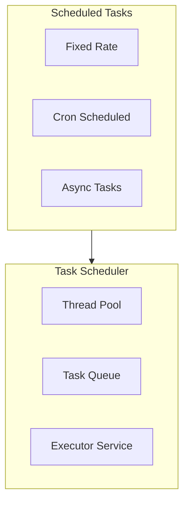

# Spring Scheduling: Полное руководство по планированию задач

## Полезные ссылки

[Официальная документация Spring](https://docs.spring.io/)
[Spring Projects](https://spring.io/projects)

## Содержание

- [Spring Scheduling: Полное руководство по планированию задач](#spring-scheduling-полное-руководство-по-планированию-задач)
- [Введение в Spring Scheduling](#введение-в-spring-scheduling)
  - [Основные возможности](#основные-возможности)
  - [Архитектура Scheduling](#архитектура-scheduling)
- [Настройка Scheduling](#настройка-scheduling)
  - [Включение Scheduling](#включение-scheduling)
  - [Spring Boot Auto-Configuration](#spring-boot-auto-configuration)
- [@Scheduled](#scheduled)
  - [Fixed Rate](#fixed-rate)
  - [Fixed Delay](#fixed-delay)
  - [Cron Expressions](#cron-expressions)
  - [Cron Expression Format](#cron-expression-format)
  - [Использование свойств](#использование-свойств)
- [TaskExecutor](#taskexecutor)
  - [Настройка TaskExecutor](#настройка-taskexecutor)
  - [Использование TaskExecutor](#использование-taskexecutor)
- [Async Execution](#async-execution)
  - [@Async](#async)
  - [Комбинирование @Scheduled и @Async](#комбинирование-scheduled-и-async)
- [Управление задачами](#управление-задачами)
  - [Программное управление](#программное-управление)
  - [Динамическое планирование](#динамическое-планирование)
- [Quartz Integration](#quartz-integration)
  - [Настройка Quartz](#настройка-quartz)
- [Лучшие практики](#лучшие-практики)
  - [1. Используйте правильный тип планирования](#1-используйте-правильный-тип-планирования)
  - [2. Настраивайте Thread Pool](#2-настраивайте-thread-pool)
  - [3. Используйте @Async для долгих задач](#3-используйте-async-для-долгих-задач)
  - [4. Обрабатывайте исключения](#4-обрабатывайте-исключения)
  - [5. Используйте свойства для конфигурации](#5-используйте-свойства-для-конфигурации)
- [Расширенная конфигурация](#расширенная-конфигурация)
  - [Multiple Task Schedulers](#multiple-task-schedulers)
  - [Conditional Scheduling](#conditional-scheduling)
- [Обработка ошибок](#обработка-ошибок)
  - [Global Exception Handler](#global-exception-handler)
  - [Task-specific Error Handling](#task-specific-error-handling)
- [Мониторинг и метрики](#мониторинг-и-метрики)
  - [Task Metrics](#task-metrics)
  - [Task Health Indicator](#task-health-indicator)
- [Кластеризация и распределенные задачи](#кластеризация-и-распределенные-задачи)
  - [Distributed Lock](#distributed-lock)
  - [ShedLock Integration](#shedlock-integration)
- [Продвинутые паттерны](#продвинутые-паттерны)
  - [Task Chaining](#task-chaining)
  - [Task Dependencies](#task-dependencies)
  - [Conditional Task Execution](#conditional-task-execution)
- [Quartz Integration (расширенная)](#quartz-integration-расширенная)
  - [Persistent Jobs](#persistent-jobs)
  - [Job Parameters](#job-parameters)
  - [Job Listeners](#job-listeners)
- [Тестирование](#тестирование)
  - [Mocking Scheduled Tasks](#mocking-scheduled-tasks)
  - [Integration Testing](#integration-testing)
- [Оптимизация производительности](#оптимизация-производительности)
  - [Task Pooling](#task-pooling)
  - [Task Prioritization](#task-prioritization)
- [Заключение](#заключение)
- [Дополнительные ресурсы](#дополнительные-ресурсы)

## Введение в Spring Scheduling

**Spring Scheduling** предоставляет простой и мощный способ выполнения задач по расписанию. Он поддерживает как простые задачи с фиксированной задержкой, так и сложные задачи с использованием **cron** выражений.

### Основные возможности

- **@Scheduled**: Аннотация для планирования задач
- **TaskExecutor**: Управление потоками выполнения
- **Async Execution**: Асинхронное выполнение задач
- **Cron Expressions**: Гибкое планирование с **cron**
- **Quartz Integration**: Интеграция с **Quartz Scheduler**

### Архитектура Scheduling



## Настройка Scheduling

### Включение Scheduling

**Конфигурация с @**EnableScheduling**:**

```java
// Включение планировщика задач (@EnableScheduling)
@Configuration
@EnableScheduling
public class SchedulingConfig {
    // Конфигурация планировщика
}
```

### Spring Boot Auto-Configuration

**В **Spring Boot scheduling** включается автоматически при использовании `@EnableScheduling`:**

```java
@SpringBootApplication
@EnableScheduling
public class Application {
    public static void main(String[] args) {
        SpringApplication.run(Application.class, args);
    }
}
```

## @Scheduled

### Fixed Rate

```java
// Задача по расписанию (@Scheduled)
@Component
public class ScheduledTasks {

    @Scheduled(fixedRate = 5000) // Каждые 5 секунд
    public void reportCurrentTime() {
        System.out.println("Current time: " + new Date());
    }

    @Scheduled(fixedRate = 10000, initialDelay = 5000) // Начало через 5 секунд, затем каждые 10 секунд
    public void reportWithInitialDelay() {
        System.out.println("Task with initial delay: " + new Date());
    }
}
```

### Fixed Delay

```java
// Задача по расписанию (@Scheduled)
@Component
public class ScheduledTasks {

    @Scheduled(fixedDelay = 5000) // Задержка 5 секунд после завершения предыдущей задачи
    public void processData() {
        // Обработка данных
        System.out.println("Processing data: " + new Date());
    }
}
```

### Cron Expressions

```java
// Задача по расписанию (@Scheduled)
@Component
public class ScheduledTasks {

    @Scheduled(cron = "0 0 * * * ?") // Каждый час
    public void hourlyTask() {
        System.out.println("Hourly task executed");
    }

    @Scheduled(cron = "0 0 0 * * ?") // Каждый день в полночь
    public void dailyTask() {
        System.out.println("Daily task executed");
    }

    @Scheduled(cron = "0 0 0 * * MON") // Каждый понедельник в полночь
    public void weeklyTask() {
        System.out.println("Weekly task executed");
    }

    @Scheduled(cron = "0 0 0 1 * ?") // Первое число каждого месяца
    public void monthlyTask() {
        System.out.println("Monthly task executed");
    }

    @Scheduled(cron = "0 */5 * * * ?") // Каждые 5 минут
    public void everyFiveMinutes() {
        System.out.println("Every 5 minutes task");
    }

    @Scheduled(cron = "0 0 9-17 * * MON-FRI") // Каждый час с 9 до 17 в рабочие дни
    public void businessHoursTask() {
        System.out.println("Business hours task");
    }
}
```

### Cron Expression Format

```text
┌───────────── секунды (0-59)
│ ┌─────────── минуты (0-59)
│ │ ┌───────── часы (0-23)
│ │ │ ┌─────── день месяца (1-31)
│ │ │ │ ┌───── месяц (1-12)
│ │ │ │ │ ┌─── день недели (0-7, где 0 и 7 = воскресенье)
│ │ │ │ │ │
* * * * * *
```

### Использование свойств

```java
// Задача по расписанию (@Scheduled)
@Component
public class ScheduledTasks {

    @Scheduled(cron = "${scheduling.task.cron}")
    public void configurableTask() {
        System.out.println("Configurable task executed");
    }

    @Scheduled(fixedRateString = "${scheduling.task.rate}")
    public void configurableRateTask() {
        System.out.println("Configurable rate task");
    }
}
```

**application.properties:**

```properties
scheduling.task.cron=0 0 * * * ?
scheduling.task.rate=5000
```

## TaskExecutor

### Настройка TaskExecutor

```java
@Configuration
@EnableScheduling
public class SchedulingConfig {

    @Bean
    public TaskScheduler taskScheduler() {
        ThreadPoolTaskScheduler scheduler = new ThreadPoolTaskScheduler();
        scheduler.setPoolSize(10);
        scheduler.setThreadNamePrefix("scheduled-task-");
        scheduler.setWaitForTasksToCompleteOnShutdown(true);
        scheduler.setAwaitTerminationSeconds(60);
        return scheduler;
    }

    @Bean
    public Executor taskExecutor() {
        ThreadPoolTaskExecutor executor = new ThreadPoolTaskExecutor();
        executor.setCorePoolSize(5);
        executor.setMaxPoolSize(10);
        executor.setQueueCapacity(100);
        executor.setThreadNamePrefix("async-task-");
        executor.initialize();
        return executor;
    }
}
```

### Использование TaskExecutor

```java
@Service
public class TaskService {

    @Autowired
    private TaskExecutor taskExecutor;

    public void executeTask(Runnable task) {
        taskExecutor.execute(task);
    }

    public void executeMultipleTasks(List<Runnable> tasks) {
        tasks.forEach(taskExecutor::execute);
    }
}
```

## Async Execution

### @Async

```java
@Configuration
@EnableAsync
public class AsyncConfig {

    @Bean
    public Executor asyncExecutor() {
        ThreadPoolTaskExecutor executor = new ThreadPoolTaskExecutor();
        executor.setCorePoolSize(5);
        executor.setMaxPoolSize(10);
        executor.setQueueCapacity(100);
        executor.setThreadNamePrefix("async-");
        executor.initialize();
        return executor;
    }
}

@Service
public class AsyncService {

    @Async
    public CompletableFuture<String> asyncMethod() {
        // Долгая операция
        return CompletableFuture.completedFuture("Result");
    }

    @Async
    public void asyncVoidMethod() {
        // Асинхронная операция без возвращаемого значения
    }

    @Async("asyncExecutor")
    public CompletableFuture<String> asyncWithExecutor() {
        return CompletableFuture.completedFuture("Result");
    }
}
```

### Комбинирование @Scheduled и @Async

```java
@Component
public class ScheduledAsyncTasks {

    @Scheduled(fixedRate = 5000)
    @Async
    public void scheduledAsyncTask() {
        // Задача выполняется асинхронно по расписанию
        System.out.println("Scheduled async task: " + Thread.currentThread().getName());
    }
}
```

## Управление задачами

### Программное управление

```java
@Service
public class TaskManagementService {

    @Autowired
    private TaskScheduler taskScheduler;

    public ScheduledFuture<?> scheduleTask(Runnable task, Date startTime) {
        return taskScheduler.schedule(task, startTime);
    }

    public ScheduledFuture<?> scheduleTaskWithDelay(Runnable task, Duration delay) {
        return taskScheduler.schedule(task, Instant.now().plus(delay));
    }

    public ScheduledFuture<?> scheduleAtFixedRate(
            Runnable task,
            Duration initialDelay,
            Duration period) {
        return taskScheduler.scheduleAtFixedRate(
            task,
            Instant.now().plus(initialDelay),
            period
        );
    }

    public void cancelTask(ScheduledFuture<?> future) {
        future.cancel(false);
    }
}
```

### Динамическое планирование

```java
@Component
public class DynamicScheduler {

    @Autowired
    private TaskScheduler taskScheduler;

    private final Map<String, ScheduledFuture<?>> scheduledTasks = new ConcurrentHashMap<>();

    public void scheduleTask(String taskId, Runnable task, String cronExpression) {
        cancelTask(taskId);

        CronTrigger trigger = new CronTrigger(cronExpression);
        ScheduledFuture<?> future = taskScheduler.schedule(task, trigger);
        scheduledTasks.put(taskId, future);
    }

    public void cancelTask(String taskId) {
        ScheduledFuture<?> future = scheduledTasks.remove(taskId);
        if (future != null) {
            future.cancel(false);
        }
    }

    public void cancelAllTasks() {
        scheduledTasks.values().forEach(future -> future.cancel(false));
        scheduledTasks.clear();
    }
}
```

## Quartz Integration

### Настройка Quartz

```xml
<dependency>
    <groupId>org.springframework.boot</groupId>
    <artifactId>spring-boot-starter-quartz</artifactId>
</dependency>
```

```java
@Configuration
public class QuartzConfig {

    @Bean
    public JobDetail jobDetail() {
        return JobBuilder.newJob(SampleJob.class)
            .withIdentity("sampleJob")
            .storeDurably()
            .build();
    }

    @Bean
    public Trigger trigger() {
        return TriggerBuilder.newTrigger()
            .forJob(jobDetail())
            .withIdentity("sampleTrigger")
            .withSchedule(CronScheduleBuilder.cronSchedule("0 0 * * * ?"))
            .build();
    }
}

public class SampleJob extends QuartzJobBean {

    @Override
    protected void executeInternal(JobExecutionContext context) {
        // Логика задачи
        System.out.println("Quartz job executed");
    }
}
```

## Лучшие практики

### 1. Используйте правильный тип планирования

```java
// ✅ Хорошо - для периодических задач
@Scheduled(fixedRate = 5000)

// ✅ Хорошо - для задач с зависимостями
@Scheduled(fixedDelay = 5000)

// ✅ Хорошо - для сложного расписания
@Scheduled(cron = "0 0 * * * ?")
```

### 2. Настраивайте Thread Pool

```java
// ✅ Хорошо
@Bean
public TaskScheduler taskScheduler() {
    ThreadPoolTaskScheduler scheduler = new ThreadPoolTaskScheduler();
    scheduler.setPoolSize(10);
    return scheduler;
}
```

### 3. Используйте @Async для долгих задач

```java
// ✅ Хорошо
@Scheduled(fixedRate = 5000)
@Async
public void longRunningTask() {
    // Долгая операция
}
```

### 4. Обрабатывайте исключения

```java
// ✅ Хорошо
@Scheduled(fixedRate = 5000)
public void scheduledTask() {
    try {
        // Логика задачи
    } catch (Exception e) {
        // Обработка ошибок
        log.error("Error in scheduled task", e);
    }
}
```

### 5. Используйте свойства для конфигурации

```java
// ✅ Хорошо
@Scheduled(cron = "${scheduling.task.cron}")
```

## Расширенная конфигурация

### Multiple Task Schedulers

```java
@Configuration
@EnableScheduling
public class MultipleSchedulerConfig {

    @Bean(name = "highPriorityScheduler")
    public TaskScheduler highPriorityScheduler() {
        ThreadPoolTaskScheduler scheduler = new ThreadPoolTaskScheduler();
        scheduler.setPoolSize(5);
        scheduler.setThreadNamePrefix("high-priority-");
        scheduler.setWaitForTasksToCompleteOnShutdown(true);
        scheduler.initialize();
        return scheduler;
    }

    @Bean(name = "lowPriorityScheduler")
    public TaskScheduler lowPriorityScheduler() {
        ThreadPoolTaskScheduler scheduler = new ThreadPoolTaskScheduler();
        scheduler.setPoolSize(10);
        scheduler.setThreadNamePrefix("low-priority-");
        scheduler.setWaitForTasksToCompleteOnShutdown(true);
        scheduler.initialize();
        return scheduler;
    }
}

@Component
public class PriorityScheduledTasks {

    @Scheduled(fixedRate = 1000, scheduler = "highPriorityScheduler")
    public void highPriorityTask() {
        // Высокоприоритетная задача
    }

    @Scheduled(fixedRate = 5000, scheduler = "lowPriorityScheduler")
    public void lowPriorityTask() {
        // Низкоприоритетная задача
    }
}
```

### Conditional Scheduling

```java
@Component
@ConditionalOnProperty(name = "scheduling.enabled", havingValue = "true")
public class ConditionalScheduledTasks {

    @Scheduled(fixedRate = 5000)
    public void conditionalTask() {
        // Задача выполняется только если свойство включено
    }
}
```

## Обработка ошибок

### Global Exception Handler

```java
@Configuration
@EnableScheduling
public class SchedulingErrorHandlingConfig {

    @Bean
    public TaskScheduler taskScheduler() {
        ThreadPoolTaskScheduler scheduler = new ThreadPoolTaskScheduler();
        scheduler.setErrorHandler(new ErrorHandler() {
            @Override
            public void handleError(Throwable t) {
                log.error("Error in scheduled task", t);
                // Дополнительная обработка ошибки
                notifyAdministrators(t);
            }

            private void notifyAdministrators(Throwable t) {
                // Уведомление администраторов
            }
        });
        scheduler.initialize();
        return scheduler;
    }
}
```

### Task-specific Error Handling

```java
@Component
public class ErrorHandlingScheduledTasks {

    @Scheduled(fixedRate = 5000)
    public void taskWithErrorHandling() {
        try {
            // Логика задачи
            processData();
        } catch (Exception e) {
            log.error("Error processing scheduled task", e);
            // Retry логика
            retryTask();
        }
    }

    private void retryTask() {
        // Логика повторной попытки
    }
}
```

## Мониторинг и метрики

### Task Metrics

```java
@Component
public class ScheduledTaskMetrics {

    private final MeterRegistry meterRegistry;
    private final Counter taskExecutionCounter;
    private final Timer taskExecutionTimer;
    private final Counter taskErrorCounter;

    public ScheduledTaskMetrics(MeterRegistry meterRegistry) {
        this.meterRegistry = meterRegistry;
        this.taskExecutionCounter = Counter.builder("scheduled.tasks.executed")
            .description("Number of scheduled tasks executed")
            .register(meterRegistry);
        this.taskExecutionTimer = Timer.builder("scheduled.tasks.duration")
            .description("Scheduled task execution time")
            .register(meterRegistry);
        this.taskErrorCounter = Counter.builder("scheduled.tasks.errors")
            .description("Number of scheduled task errors")
            .register(meterRegistry);
    }

    public void recordTaskExecution(String taskName, Runnable task) {
        Timer.Sample sample = Timer.start(meterRegistry);
        try {
            task.run();
            taskExecutionCounter.increment(
                Tags.of("task", taskName, "status", "success")
            );
        } catch (Exception e) {
            taskErrorCounter.increment(
                Tags.of("task", taskName, "status", "error")
            );
            throw e;
        } finally {
            sample.stop(taskExecutionTimer);
        }
    }
}
```

### Task Health Indicator

```java
@Component
public class ScheduledTaskHealthIndicator implements HealthIndicator {

    private final Map<String, TaskStatus> taskStatuses = new ConcurrentHashMap<>();

    @Override
    public Health health() {
        long failedTasks = taskStatuses.values().stream()
            .filter(status -> status.getLastExecutionStatus() == ExecutionStatus.FAILED)
            .count();

        if (failedTasks > 0) {
            return Health.down()
                .withDetail("failedTasks", failedTasks)
                .withDetail("totalTasks", taskStatuses.size())
                .build();
        }

        return Health.up()
            .withDetail("totalTasks", taskStatuses.size())
            .build();
    }

    public void recordTaskExecution(String taskName, ExecutionStatus status) {
        taskStatuses.put(taskName, new TaskStatus(status, System.currentTimeMillis()));
    }

    private static class TaskStatus {
        private final ExecutionStatus lastExecutionStatus;
        private final long lastExecutionTime;

        public TaskStatus(ExecutionStatus lastExecutionStatus, long lastExecutionTime) {
            this.lastExecutionStatus = lastExecutionStatus;
            this.lastExecutionTime = lastExecutionTime;
        }

        public ExecutionStatus getLastExecutionStatus() {
            return lastExecutionStatus;
        }
    }

    private enum ExecutionStatus {
        SUCCESS, FAILED
    }
}
```

## Кластеризация и распределенные задачи

### Distributed Lock

```java
@Component
public class DistributedScheduledTask {

    @Autowired
    private RedisTemplate<String, String> redisTemplate;

    @Scheduled(fixedRate = 60000)
    public void distributedTask() {
        String lockKey = "scheduled:task:lock";
        String lockValue = UUID.randomUUID().toString();

        Boolean acquired = redisTemplate.opsForValue()
            .setIfAbsent(lockKey, lockValue, Duration.ofMinutes(5));

        if (Boolean.TRUE.equals(acquired)) {
            try {
                // Выполнение задачи только на одном узле
                executeTask();
            } finally {
                // Освобождение блокировки
                String script = "if redis.call('get', KEYS[1]) == ARGV[1] then " +
                    "return redis.call('del', KEYS[1]) else return 0 end";
                redisTemplate.execute(
                    new DefaultRedisScript<>(script, Long.class),
                    Collections.singletonList(lockKey),
                    lockValue
                );
            }
        }
    }

    private void executeTask() {
        // Логика задачи
    }
}
```

### ShedLock Integration

```xml
<dependency>
    <groupId>net.javacrumbs.shedlock</groupId>
    <artifactId>shedlock-spring</artifactId>
    <version>5.2.0</version>
</dependency>
<dependency>
    <groupId>net.javacrumbs.shedlock</groupId>
    <artifactId>shedlock-provider-jdbc-template</artifactId>
    <version>5.2.0</version>
</dependency>
```

```java
@Configuration
@EnableSchedulerLock(defaultLockAtMostFor = "10m")
public class ShedLockConfig {

    @Bean
    public LockProvider lockProvider(DataSource dataSource) {
        return new JdbcTemplateLockProvider(JdbcTemplateLockProvider.Configuration.builder()
            .withJdbcTemplate(new JdbcTemplate(dataSource))
            .usingDbTime()
            .build());
    }
}

@Component
public class ShedLockScheduledTask {

    @Scheduled(fixedRate = 60000)
    @SchedulerLock(name = "distributedTask", lockAtMostFor = "5m", lockAtLeastFor = "1m")
    public void distributedTask() {
        // Задача выполняется только на одном узле в кластере
    }
}
```

## Продвинутые паттерны

### Task Chaining

```java
@Component
public class ChainedScheduledTasks {

    @Autowired
    private TaskScheduler taskScheduler;

    @Scheduled(fixedRate = 60000)
    public void firstTask() {
        // Первая задача
        processFirstStep();

        // Планирование следующей задачи
        taskScheduler.schedule(this::secondTask,
            Instant.now().plusSeconds(30));
    }

    private void secondTask() {
        // Вторая задача
        processSecondStep();

        // Планирование третьей задачи
        taskScheduler.schedule(this::thirdTask,
            Instant.now().plusSeconds(30));
    }

    private void thirdTask() {
        // Третья задача
        processThirdStep();
    }
}
```

### Task Dependencies

```java
@Component
public class DependentScheduledTasks {

    private final Map<String, CompletableFuture<?>> taskFutures = new ConcurrentHashMap<>();

    @Scheduled(fixedRate = 60000)
    public void parentTask() {
        CompletableFuture<?> future = CompletableFuture.runAsync(() -> {
            // Родительская задача
            processParentTask();
        });
        taskFutures.put("parent", future);
    }

    @Scheduled(fixedRate = 60000)
    public void childTask() {
        CompletableFuture<?> parentFuture = taskFutures.get("parent");
        if (parentFuture != null && parentFuture.isDone()) {
            // Дочерняя задача выполняется после родительской
            processChildTask();
        }
    }
}
```

### Conditional Task Execution

```java
@Component
public class ConditionalScheduledTasks {

    @Autowired
    private ApplicationContext applicationContext;

    @Scheduled(fixedRate = 60000)
    public void conditionalTask() {
        if (shouldExecute()) {
            executeTask();
        }
    }

    private boolean shouldExecute() {
        // Условие выполнения задачи
        return applicationContext.getEnvironment()
            .getProperty("task.enabled", Boolean.class, true);
    }
}
```

## Quartz Integration (расширенная)

### Persistent Jobs

```java
@Configuration
public class QuartzPersistenceConfig {

    @Bean
    public SchedulerFactoryBean schedulerFactoryBean(DataSource dataSource) {
        SchedulerFactoryBean factory = new SchedulerFactoryBean();
        factory.setDataSource(dataSource);
        factory.setJobFactory(new SpringBeanJobFactory());
        factory.setConfigLocation(new ClassPathResource("quartz.properties"));
        return factory;
    }

    @Bean
    public JobDetail persistentJobDetail() {
        return JobBuilder.newJob(PersistentJob.class)
            .withIdentity("persistentJob")
            .storeDurably()
            .build();
    }

    @Bean
    public Trigger persistentJobTrigger() {
        return TriggerBuilder.newTrigger()
            .forJob(persistentJobDetail())
            .withIdentity("persistentJobTrigger")
            .withSchedule(CronScheduleBuilder.cronSchedule("0 0 * * * ?"))
            .build();
    }
}
```

### Job Parameters

```java
public class ParameterizedJob extends QuartzJobBean {

    @Override
    protected void executeInternal(JobExecutionContext context) {
        JobDataMap dataMap = context.getJobDetail().getJobDataMap();
        String parameter = dataMap.getString("parameter");

        // Использование параметра
        processWithParameter(parameter);
    }
}

@Configuration
public class ParameterizedJobConfig {

    @Bean
    public JobDetail parameterizedJobDetail() {
        JobDataMap dataMap = new JobDataMap();
        dataMap.put("parameter", "value");

        return JobBuilder.newJob(ParameterizedJob.class)
            .withIdentity("parameterizedJob")
            .usingJobData(dataMap)
            .storeDurably()
            .build();
    }
}
```

### Job Listeners

```java
@Component
public class CustomJobListener implements JobListener {

    @Override
    public String getName() {
        return "customJobListener";
    }

    @Override
    public void jobToBeExecuted(JobExecutionContext context) {
        log.info("Job {} is about to be executed", context.getJobDetail().getKey());
    }

    @Override
    public void jobExecutionVetoed(JobExecutionContext context) {
        log.warn("Job {} execution was vetoed", context.getJobDetail().getKey());
    }

    @Override
    public void jobWasExecuted(JobExecutionContext context, JobExecutionException jobException) {
        if (jobException != null) {
            log.error("Job {} execution failed", context.getJobDetail().getKey(), jobException);
        } else {
            log.info("Job {} execution completed successfully", context.getJobDetail().getKey());
        }
    }
}

@Configuration
public class JobListenerConfig {

    @Bean
    public SchedulerFactoryBean schedulerFactoryBean(CustomJobListener jobListener) {
        SchedulerFactoryBean factory = new SchedulerFactoryBean();
        factory.setGlobalJobListeners(jobListener);
        return factory;
    }
}
```

## Тестирование

### Mocking Scheduled Tasks

```java
@SpringBootTest
class ScheduledTaskTest {

    @MockBean
    private TaskScheduler taskScheduler;

    @Autowired
    private ScheduledTasks scheduledTasks;

    @Test
    void testScheduledTask() {
        // Тестирование задачи
        scheduledTasks.reportCurrentTime();
        // Проверки
    }
}
```

### Integration Testing

```java
@SpringBootTest
@EnableScheduling
class ScheduledTaskIntegrationTest {

    @Autowired
    private ScheduledTasks scheduledTasks;

    @Test
    void testScheduledTaskExecution() throws InterruptedException {
        // Ожидание выполнения задачи
        Thread.sleep(6000);
        // Проверки
    }
}
```

## Оптимизация производительности

### Task Pooling

```java
@Configuration
public class OptimizedSchedulerConfig {

    @Bean
    public TaskScheduler optimizedTaskScheduler() {
        ThreadPoolTaskScheduler scheduler = new ThreadPoolTaskScheduler();
        // Оптимизация размера пула
        int corePoolSize = Runtime.getRuntime().availableProcessors();
        scheduler.setPoolSize(corePoolSize * 2);
        scheduler.setThreadNamePrefix("optimized-task-");
        scheduler.setWaitForTasksToCompleteOnShutdown(true);
        scheduler.setAwaitTerminationSeconds(60);
        scheduler.initialize();
        return scheduler;
    }
}
```

### Task Prioritization

```java
@Component
public class PrioritizedScheduledTasks {

    @Autowired
    @Qualifier("highPriorityScheduler")
    private TaskScheduler highPriorityScheduler;

    @Autowired
    @Qualifier("lowPriorityScheduler")
    private TaskScheduler lowPriorityScheduler;

    public void scheduleHighPriorityTask(Runnable task, Instant startTime) {
        highPriorityScheduler.schedule(task, startTime);
    }

    public void scheduleLowPriorityTask(Runnable task, Instant startTime) {
        lowPriorityScheduler.schedule(task, startTime);
    }
}
```


## Заключение

**Spring Scheduling** предоставляет мощные инструменты для планирования и выполнения задач. Правильное использование @**Scheduled**, **TaskExecutor**, @**Async**, интеграции с **Quartz**, обработки ошибок, мониторинга, кластеризации и других продвинутых возможностей позволяет создавать надежные, масштабируемые системы с автоматическим выполнением задач в распределенных средах.

## Дополнительные ресурсы

- [**Spring Scheduling** Documentation](https://docs.spring.io/spring-framework/reference/integration/scheduling.html)
- [**Spring Boot** Scheduling](https://docs.spring.io/spring-boot/docs/current/reference/html/io.html#io.task-execution-and-scheduling)
- [Quartz Scheduler](https://www.quartz-scheduler.org/documentation/)
- [ShedLock](https://github.com/lukas-krecan/ShedLock)
- [**Cron Expression** Guide](https://docs.spring.io/spring-framework/reference/integration/scheduling.html#scheduling-cron-expression)

## См. также

- [[spring-actuator|Spring Actuator: Полное руководство по мониторингу и управлению]]
- [[spring-ai|Spring AI]]
- [[spring-aop|Spring AOP: Полное руководство по аспектно-ориентированному программированию]]
- [[spring-batch|Spring Batch для Java]]
- [[spring-boot|Spring Boot — Полное руководство]]
