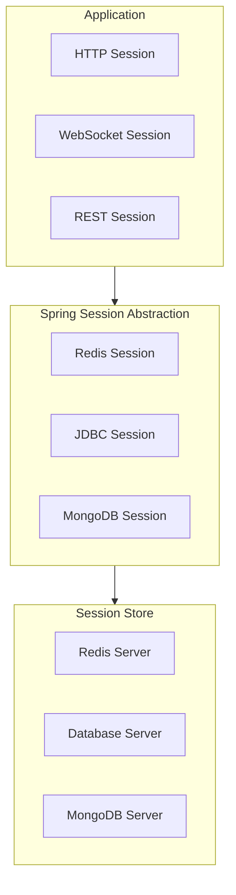

# Spring Session: Полное руководство по управлению сессиями

## Полезные ссылки

[Официальная документация Spring](https://docs.spring.io/)
[Spring Projects](https://spring.io/projects)

## Содержание

- [Spring Session: Полное руководство по управлению сессиями](#spring-session-полное-руководство-по-управлению-сессиями)
- [Введение в Spring Session](#введение-в-spring-session)
  - [Основные возможности](#основные-возможности)
  - [Архитектура Spring Session](#архитектура-spring-session)
- [Redis Session](#redis-session)
  - [Настройка Redis Session](#настройка-redis-session)
- [Redis Session Configuration](#redis-session-configuration)
  - [Конфигурация через Java](#конфигурация-через-java)
  - [Использование Session](#использование-session)
- [JDBC Session](#jdbc-session)
  - [Настройка JDBC Session](#настройка-jdbc-session)
- [JDBC Session Configuration](#jdbc-session-configuration)
  - [Схема БД](#схема-бд)
- [MongoDB Session](#mongodb-session)
  - [Настройка MongoDB Session](#настройка-mongodb-session)
- [MongoDB Session Configuration](#mongodb-session-configuration)
- [Интеграция с Spring Security](#интеграция-с-spring-security)
  - [Security Session Configuration](#security-session-configuration)
  - [Concurrent Session Control](#concurrent-session-control)
- [Кластеризация](#кластеризация)
  - [Multi-Node Configuration](#multi-node-configuration)
  - [Session Replication](#session-replication)
- [Продвинутые возможности](#продвинутые-возможности)
  - [Custom Session Serialization](#custom-session-serialization)
  - [Session Events](#session-events)
  - [Session Timeout Configuration](#session-timeout-configuration)
- [Мониторинг и метрики](#мониторинг-и-метрики)
  - [Session Metrics](#session-metrics)
- [Лучшие практики](#лучшие-практики)
  - [1. Используйте Redis для кластеризации](#1-используйте-redis-для-кластеризации)
  - [2. Настраивайте timeout](#2-настраивайте-timeout)
  - [3. Обрабатывайте session events](#3-обрабатывайте-session-events)
  - [4. Используйте правильный store type](#4-используйте-правильный-store-type)
- [ Хорошо — для кластеризации](#хорошо-для-кластеризации)
- [ Хорошо — для простых приложений](#хорошо-для-простых-приложений)
  - [5. Настраивайте security](#5-настраивайте-security)
- [WebSocket Session](#websocket-session)
  - [WebSocket Session Management](#websocket-session-management)
  - [Custom Session Repository](#custom-session-repository)
  - [Session Indexing](#session-indexing)
  - [Session Flush Mode](#session-flush-mode)
- [Оптимизация производительности](#оптимизация-производительности)
  - [Session Caching](#session-caching)
  - [Connection Pooling](#connection-pooling)
- [Безопасность](#безопасность)
  - [Session Fixation Protection](#session-fixation-protection)
  - [Session Cookie Security](#session-cookie-security)
- [Тестирование](#тестирование)
  - [Mock Session](#mock-session)
  - [Integration Testing](#integration-testing)
- [Миграция сессий](#миграция-сессий)
  - [Session Migration](#session-migration)
- [Мониторинг сессий](#мониторинг-сессий)
  - [Session Health Check](#session-health-check)
- [Продвинутые паттерны](#продвинутые-паттерны)
  - [Session Clustering с Hazelcast](#session-clustering-с-hazelcast)
  - [Session Serialization Customization](#session-serialization-customization)
  - [Session Attribute Filtering](#session-attribute-filtering)
  - [Session Timeout Management](#session-timeout-management)
  - [Session Statistics](#session-statistics)
  - [Session Cleanup Job](#session-cleanup-job)
  - [Session Replication между регионами](#session-replication-между-регионами)
  - [Session Compression](#session-compression)
  - [Session Analytics](#session-analytics)
  - [Session Rate Limiting](#session-rate-limiting)
- [Заключение](#заключение)
- [Дополнительные ресурсы](#дополнительные-ресурсы)

## Введение в Spring Session

**Spring Session** предоставляет **API** и реализации для управления сессиями пользователей. Он позволяет хранить сессии вне контейнера приложения, что критично для кластеризованных и облачных приложений.

### Основные возможности

- **Redis Session**: Хранение сессий в **Redis**
- **JDBC Session**: Хранение сессий в реляционной БД
- **MongoDB Session**: Хранение сессий в **MongoDB**
- **Hazelcast Session**: Хранение сессий в **Hazelcast**
- **Clustering Support**: Поддержка кластеризации
- **Security Integration**: Интеграция с **Spring Security**

### Архитектура Spring Session



## Redis Session

### Настройка Redis Session

**Зависимости:**

**Зависимости **spring-`session-data`-redis** и **spring-`boot-starter-data`-redis** (pom.xml):**

```xml
<dependency>
    <groupId>org.springframework.session</groupId>
    <artifactId>spring-session-data-redis</artifactId>
</dependency>
<dependency>
    <groupId>org.springframework.boot</groupId>
    <artifactId>spring-boot-starter-data-redis</artifactId>
</dependency>
```

**Конфигурация:**

```properties
# Redis Session Configuration
spring.session.store-type=redis
spring.session.redis.flush-mode=on-save
spring.session.timeout=1800s
spring.redis.host=localhost
spring.redis.port=6379
```

### Конфигурация через Java

```java
// Сессия в Redis, TTL 30 минут
@Configuration
@EnableRedisHttpSession(maxInactiveIntervalInSeconds = 1800)
public class RedisSessionConfig {

    @Bean
    public LettuceConnectionFactory connectionFactory() {
        return new LettuceConnectionFactory();
    }

    @Bean
    public RedisSessionRepository sessionRepository(RedisConnectionFactory connectionFactory) {
        RedisSessionRepository sessionRepository = new RedisSessionRepository(connectionFactory);
        sessionRepository.setDefaultMaxInactiveInterval(Duration.ofSeconds(1800));
        return sessionRepository;
    }
}
```

### Использование Session

```java
// Контроллер работы с сессией (чтение/запись атрибутов)
@RestController
public class SessionController {

    @GetMapping("/session")
    public Map<String, Object> getSession(HttpSession session) {
        Map<String, Object> sessionData = new HashMap<>();
        sessionData.put("sessionId", session.getId());
        sessionData.put("creationTime", new Date(session.getCreationTime()));
        sessionData.put("lastAccessedTime", new Date(session.getLastAccessedTime()));
        sessionData.put("maxInactiveInterval", session.getMaxInactiveInterval());
        return sessionData;
    }

    @PostMapping("/session")
    public void setSessionAttribute(HttpSession session,
            @RequestParam String key,
            @RequestParam String value) {
        session.setAttribute(key, value);
    }

    @GetMapping("/session/{key}")
    public Object getSessionAttribute(HttpSession session, @PathVariable String key) {
        return session.getAttribute(key);
    }

    @DeleteMapping("/session/{key}")
    public void removeSessionAttribute(HttpSession session, @PathVariable String key) {
        session.removeAttribute(key);
    }

    @PostMapping("/session/invalidate")
    public void invalidateSession(HttpSession session) {
        session.invalidate();
    }
}
```

## JDBC Session

### Настройка JDBC Session

**Зависимости:**

```xml
<dependency>
    <groupId>org.springframework.session</groupId>
    <artifactId>spring-session-jdbc</artifactId>
</dependency>
<dependency>
    <groupId>org.springframework.boot</groupId>
    <artifactId>spring-boot-starter-jdbc</artifactId>
</dependency>
```

**Конфигурация:**

```properties
# JDBC Session Configuration
spring.session.store-type=jdbc
spring.session.jdbc.table-name=SPRING_SESSION
spring.session.timeout=1800s
spring.datasource.url=jdbc:postgresql://localhost:5432/mydb
spring.datasource.username=user
spring.datasource.password=password
```

### Схема БД

```sql
CREATE TABLE SPRING_SESSION (
    PRIMARY_ID CHAR(36) NOT NULL,
    SESSION_ID CHAR(36) NOT NULL,
    CREATION_TIME BIGINT NOT NULL,
    LAST_ACCESS_TIME BIGINT NOT NULL,
    MAX_INACTIVE_INTERVAL INT NOT NULL,
    EXPIRY_TIME BIGINT NOT NULL,
    PRINCIPAL_NAME VARCHAR(100),
    CONSTRAINT SPRING_SESSION_PK PRIMARY KEY (PRIMARY_ID)
);

CREATE UNIQUE INDEX SPRING_SESSION_IX1 ON SPRING_SESSION (SESSION_ID);
CREATE INDEX SPRING_SESSION_IX2 ON SPRING_SESSION (EXPIRY_TIME);
CREATE INDEX SPRING_SESSION_IX3 ON SPRING_SESSION (PRINCIPAL_NAME);

CREATE TABLE SPRING_SESSION_ATTRIBUTES (
    SESSION_PRIMARY_ID CHAR(36) NOT NULL,
    ATTRIBUTE_NAME VARCHAR(200) NOT NULL,
    ATTRIBUTE_BYTES BYTEA NOT NULL,
    CONSTRAINT SPRING_SESSION_ATTRIBUTES_PK PRIMARY KEY (SESSION_PRIMARY_ID, ATTRIBUTE_NAME),
    CONSTRAINT SPRING_SESSION_ATTRIBUTES_FK FOREIGN KEY (SESSION_PRIMARY_ID)
        REFERENCES SPRING_SESSION(PRIMARY_ID) ON DELETE CASCADE
);
```

### Конфигурация через Java

```java
@Configuration
@EnableJdbcHttpSession(maxInactiveIntervalInSeconds = 1800)
public class JdbcSessionConfig {

    @Bean
    public JdbcSessionRepository sessionRepository(DataSource dataSource) {
        return new JdbcSessionRepository(dataSource);
    }
}
```

## MongoDB Session

### Настройка MongoDB Session

**Зависимости:**

```xml
<dependency>
    <groupId>org.springframework.session</groupId>
    <artifactId>spring-session-data-mongodb</artifactId>
</dependency>
<dependency>
    <groupId>org.springframework.boot</groupId>
    <artifactId>spring-boot-starter-data-mongodb</artifactId>
</dependency>
```

**Конфигурация:**

```properties
# MongoDB Session Configuration
spring.session.store-type=mongodb
spring.session.mongodb.collection-name=spring_session
spring.session.timeout=1800s
spring.data.mongodb.uri=mongodb://localhost:27017/mydb
```

### Конфигурация через Java

```java
@Configuration
@EnableMongoHttpSession(maxInactiveIntervalInSeconds = 1800)
public class MongoSessionConfig {

    @Bean
    public MongoSessionRepository sessionRepository(MongoOperations mongoOperations) {
        return new MongoSessionRepository(mongoOperations);
    }
}
```

## Интеграция с Spring Security

### Security Session Configuration

```java
@Configuration
@EnableWebSecurity
@EnableRedisHttpSession
public class SecuritySessionConfig {

    @Bean
    public SecurityFilterChain securityFilterChain(HttpSecurity http) throws Exception {
        http
            .sessionManagement(session -> session
                .sessionCreationPolicy(SessionCreationPolicy.IF_REQUIRED)
                .maximumSessions(1)
                .maxSessionsPreventsLogin(false)
                .sessionRegistry(sessionRegistry())
            )
            .authorizeHttpRequests(requests -> requests
                .anyRequest().authenticated()
            )
            .formLogin();
        return http.build();
    }

    @Bean
    public SessionRegistry sessionRegistry() {
        return new SessionRegistryImpl();
    }
}
```

### Concurrent Session Control

```java
@Configuration
@EnableWebSecurity
@EnableRedisHttpSession
public class ConcurrentSessionConfig {

    @Bean
    public SecurityFilterChain securityFilterChain(HttpSecurity http) throws Exception {
        http
            .sessionManagement(session -> session
                .maximumSessions(1)
                .maxSessionsPreventsLogin(true)
                .sessionRegistry(sessionRegistry())
            );
        return http.build();
    }

    @Bean
    public SessionRegistry sessionRegistry() {
        return new SpringSessionBackedSessionRegistry<>(sessionRepository());
    }

    @Bean
    public RedisSessionRepository sessionRepository(RedisConnectionFactory connectionFactory) {
        return new RedisSessionRepository(connectionFactory);
    }
}
```

## Кластеризация

### Multi-Node Configuration

```java
@Configuration
@EnableRedisHttpSession
public class ClusterSessionConfig {

    @Bean
    public LettuceConnectionFactory connectionFactory() {
        List<String> clusterNodes = Arrays.asList(
            "localhost:7000",
            "localhost:7001",
            "localhost:7002"
        );

        RedisClusterConfiguration clusterConfiguration = new RedisClusterConfiguration(clusterNodes);
        return new LettuceConnectionFactory(clusterConfiguration);
    }
}
```

### Session Replication

```java
@Configuration
@EnableRedisHttpSession
public class ReplicatedSessionConfig {

    @Bean
    public LettuceConnectionFactory connectionFactory() {
        RedisSentinelConfiguration sentinelConfiguration = new RedisSentinelConfiguration()
            .master("mymaster")
            .sentinel("localhost", 26379)
            .sentinel("localhost", 26380);

        return new LettuceConnectionFactory(sentinelConfiguration);
    }
}
```

## Продвинутые возможности

### Custom Session Serialization

```java
@Configuration
@EnableRedisHttpSession
public class CustomSerializationConfig {

    @Bean
    public RedisSerializer<Object> springSessionDefaultRedisSerializer() {
        return new GenericJackson2JsonRedisSerializer();
    }
}
```

### Session Events

```java
@Component
public class SessionEventListener {

    @EventListener
    public void handleSessionCreated(SessionCreatedEvent event) {
        log.info("Session created: {}", event.getSessionId());
    }

    @EventListener
    public void handleSessionDestroyed(SessionDestroyedEvent event) {
        log.info("Session destroyed: {}", event.getSessionId());
    }

    @EventListener
    public void handleSessionExpired(SessionExpiredEvent event) {
        log.info("Session expired: {}", event.getSessionId());
    }
}
```

### Session Timeout Configuration

```java
@Configuration
@EnableRedisHttpSession(maxInactiveIntervalInSeconds = 3600)
public class SessionTimeoutConfig {

    @Bean
    public RedisSessionRepository sessionRepository(RedisConnectionFactory connectionFactory) {
        RedisSessionRepository repository = new RedisSessionRepository(connectionFactory);
        repository.setDefaultMaxInactiveInterval(Duration.ofHours(1));
        return repository;
    }
}
```

## Мониторинг и метрики

### Session Metrics

```java
@Component
public class SessionMetrics {

    private final MeterRegistry meterRegistry;
    private final Counter sessionsCreated;
    private final Counter sessionsDestroyed;
    private final Gauge activeSessions;

    public SessionMetrics(MeterRegistry meterRegistry) {
        this.meterRegistry = meterRegistry;
        this.sessionsCreated = Counter.builder("sessions.created")
            .description("Number of sessions created")
            .register(meterRegistry);
        this.sessionsDestroyed = Counter.builder("sessions.destroyed")
            .description("Number of sessions destroyed")
            .register(meterRegistry);
        this.activeSessions = Gauge.builder("sessions.active")
            .description("Number of active sessions")
            .register(meterRegistry, this, SessionMetrics::getActiveSessionCount);
    }

    @EventListener
    public void handleSessionCreated(SessionCreatedEvent event) {
        sessionsCreated.increment();
    }

    @EventListener
    public void handleSessionDestroyed(SessionDestroyedEvent event) {
        sessionsDestroyed.increment();
    }

    private double getActiveSessionCount() {
        // Логика подсчета активных сессий
        return 0.0;
    }
}
```

## Лучшие практики

### 1. Используйте Redis для кластеризации

```java
// ✅ Хорошо
@EnableRedisHttpSession
```

### 2. Настраивайте timeout

```java
// ✅ Хорошо
@EnableRedisHttpSession(maxInactiveIntervalInSeconds = 1800)
```

### 3. Обрабатывайте session events

```java
// ✅ Хорошо
@EventListener
public void handleSessionCreated(SessionCreatedEvent event) {
    // Обработка создания сессии
}
```

### 4. Используйте правильный store type

```properties
# ✅ Хорошо - для кластеризации
spring.session.store-type=redis

# ✅ Хорошо - для простых приложений
spring.session.store-type=jdbc
```

### 5. Настраивайте security

```java
// ✅ Хорошо
@Bean
public SecurityFilterChain securityFilterChain(HttpSecurity http) {
    http.sessionManagement(session -> session
        .maximumSessions(1)
    );
    return http.build();
}
```

## WebSocket Session

### WebSocket Session Management

```java
@Configuration
@EnableWebSocketMessageBroker
@EnableRedisWebSocketSession
public class WebSocketSessionConfig implements WebSocketMessageBrokerConfigurer {

    @Override
    public void configureMessageBroker(MessageBrokerRegistry config) {
        config.enableSimpleBroker("/topic", "/queue");
        config.setApplicationDestinationPrefixes("/app");
    }

    @Override
    public void registerStompEndpoints(StompEndpointRegistry registry) {
        registry.addEndpoint("/ws").withSockJS();
    }
}

@Controller
public class WebSocketSessionController {

    @MessageMapping("/chat")
    @SendTo("/topic/messages")
    public ChatMessage sendMessage(ChatMessage message, StompHeaderAccessor headerAccessor) {
        String sessionId = headerAccessor.getSessionId();
        message.setSessionId(sessionId);
        return message;
    }
}
```

## Продвинутые возможности

### Custom Session Repository

```java
public class CustomSessionRepository implements SessionRepository<Session> {

    private final RedisTemplate<String, Object> redisTemplate;
    private final String namespace;

    public CustomSessionRepository(RedisTemplate<String, Object> redisTemplate, String namespace) {
        this.redisTemplate = redisTemplate;
        this.namespace = namespace;
    }

    @Override
    public Session createSession() {
        Session session = new MapSession();
        session.setId(UUID.randomUUID().toString());
        return session;
    }

    @Override
    public void save(Session session) {
        String key = getKey(session.getId());
        redisTemplate.opsForValue().set(key, session,
            Duration.ofSeconds(session.getMaxInactiveInterval().getSeconds()));
    }

    @Override
    public Session findById(String id) {
        String key = getKey(id);
        return (Session) redisTemplate.opsForValue().get(key);
    }

    @Override
    public void deleteById(String id) {
        String key = getKey(id);
        redisTemplate.delete(key);
    }

    private String getKey(String sessionId) {
        return namespace + ":" + sessionId;
    }
}
```

### Session Indexing

```java
@Configuration
@EnableRedisHttpSession
public class IndexedSessionConfig {

    @Bean
    public RedisIndexedSessionRepository sessionRepository(
            RedisConnectionFactory connectionFactory) {
        RedisIndexedSessionRepository repository = new RedisIndexedSessionRepository(connectionFactory);
        repository.setDefaultMaxInactiveInterval(Duration.ofSeconds(1800));
        return repository;
    }
}
```

### Session Flush Mode

```java
@Configuration
@EnableRedisHttpSession(flushMode = FlushMode.IMMEDIATE)
public class ImmediateFlushSessionConfig {
    // Сессии сохраняются немедленно
}

@Configuration
@EnableRedisHttpSession(flushMode = FlushMode.ON_SAVE)
public class OnSaveFlushSessionConfig {
    // Сессии сохраняются при сохранении
}
```

## Оптимизация производительности

### Session Caching

```java
@Configuration
@EnableRedisHttpSession
public class CachedSessionConfig {

    @Bean
    public RedisSessionRepository sessionRepository(RedisConnectionFactory connectionFactory) {
        RedisSessionRepository repository = new RedisSessionRepository(connectionFactory);
        repository.setDefaultMaxInactiveInterval(Duration.ofSeconds(1800));
        return repository;
    }

    @Bean
    public CacheManager sessionCacheManager() {
        RedisCacheManager.Builder builder = RedisCacheManager
            .RedisCacheManagerBuilder
            .fromConnectionFactory(connectionFactory())
            .cacheDefaults(cacheConfiguration());
        return builder.build();
    }

    private RedisCacheConfiguration cacheConfiguration() {
        return RedisCacheConfiguration.defaultCacheConfig()
            .entryTtl(Duration.ofMinutes(30))
            .serializeKeysWith(RedisSerializationContext.SerializationPair
                .fromSerializer(new StringRedisSerializer()))
            .serializeValuesWith(RedisSerializationContext.SerializationPair
                .fromSerializer(new GenericJackson2JsonRedisSerializer()));
    }
}
```

### Connection Pooling

```java
@Configuration
@EnableRedisHttpSession
public class PooledSessionConfig {

    @Bean
    public LettuceConnectionFactory connectionFactory() {
        GenericObjectPoolConfig<Object> poolConfig = new GenericObjectPoolConfig<>();
        poolConfig.setMaxTotal(20);
        poolConfig.setMaxIdle(10);
        poolConfig.setMinIdle(5);

        LettuceClientConfiguration clientConfig = LettuceClientConfiguration.builder()
            .poolConfig(poolConfig)
            .build();

        RedisStandaloneConfiguration serverConfig = new RedisStandaloneConfiguration();
        serverConfig.setHostName("localhost");
        serverConfig.setPort(6379);

        return new LettuceConnectionFactory(serverConfig, clientConfig);
    }
}
```

## Безопасность

### Session Fixation Protection

```java
@Configuration
@EnableWebSecurity
@EnableRedisHttpSession
public class SessionFixationConfig {

    @Bean
    public SecurityFilterChain securityFilterChain(HttpSecurity http) throws Exception {
        http
            .sessionManagement(session -> session
                .sessionFixation().changeSessionId()
            )
            .authorizeHttpRequests(requests -> requests
                .anyRequest().authenticated()
            )
            .formLogin();
        return http.build();
    }
}
```

### Session Cookie Security

```java
@Configuration
@EnableRedisHttpSession
public class SecureCookieConfig {

    @Bean
    public CookieSerializer cookieSerializer() {
        DefaultCookieSerializer serializer = new DefaultCookieSerializer();
        serializer.setCookieName("SESSION");
        serializer.setCookiePath("/");
        serializer.setDomainNamePattern("^.+?\\.(\\w+\\.[a-z]+)$");
        serializer.setUseHttpOnlyCookie(true);
        serializer.setUseSecureCookie(true);
        serializer.setSameSite("Strict");
        return serializer;
    }
}
```

## Тестирование

### Mock Session

```java
@SpringBootTest
class SessionTest {

    @Autowired
    private SessionRepository sessionRepository;

    @Test
    void testSessionCreation() {
        Session session = sessionRepository.createSession();
        assertThat(session).isNotNull();
        assertThat(session.getId()).isNotEmpty();
    }

    @Test
    void testSessionPersistence() {
        Session session = sessionRepository.createSession();
        session.setAttribute("key", "value");
        sessionRepository.save(session);

        Session retrieved = sessionRepository.findById(session.getId());
        assertThat(retrieved).isNotNull();
        assertThat(retrieved.getAttribute("key")).isEqualTo("value");
    }
}
```

### Integration Testing

```java
@SpringBootTest
@AutoConfigureMockMvc
class SessionIntegrationTest {

    @Autowired
    private MockMvc mockMvc;

    @Test
    void testSessionManagement() throws Exception {
        MockHttpSession session = new MockHttpSession();

        mockMvc.perform(get("/session")
                .session(session))
            .andExpect(status().isOk());

        mockMvc.perform(post("/session")
                .param("key", "test")
                .param("value", "value")
                .session(session))
            .andExpect(status().isOk());

        mockMvc.perform(get("/session/test")
                .session(session))
            .andExpect(status().isOk())
            .andExpect(content().string("value"));
    }
}
```

## Миграция сессий

### Session Migration

```java
@Service
public class SessionMigrationService {

    @Autowired
    private RedisSessionRepository sourceRepository;

    @Autowired
    private JdbcSessionRepository targetRepository;

    public void migrateSessions() {
        // Получение всех сессий из Redis
        Set<String> sessionIds = getAllSessionIds();

        sessionIds.forEach(sessionId -> {
            Session session = sourceRepository.findById(sessionId);
            if (session != null) {
                // Миграция в JDBC
                targetRepository.save(session);
            }
        });
    }

    private Set<String> getAllSessionIds() {
        // Логика получения всех ID сессий
        return Collections.emptySet();
    }
}
```

## Мониторинг сессий

### Session Health Check

```java
@Component
public class SessionHealthIndicator implements HealthIndicator {

    @Autowired
    private SessionRepository sessionRepository;

    @Override
    public Health health() {
        try {
            Session testSession = sessionRepository.createSession();
            sessionRepository.save(testSession);
            Session retrieved = sessionRepository.findById(testSession.getId());
            sessionRepository.deleteById(testSession.getId());

            if (retrieved != null) {
                return Health.up()
                    .withDetail("sessionStore", "Available")
                    .build();
            } else {
                return Health.down()
                    .withDetail("sessionStore", "Unavailable")
                    .build();
            }
        } catch (Exception e) {
            return Health.down()
                .withDetail("error", e.getMessage())
                .build();
        }
    }
}
```

## Продвинутые паттерны

### Session Clustering с Hazelcast

```java
@Configuration
@EnableHazelcastHttpSession
public class HazelcastSessionConfig {

    @Bean
    public Config hazelcastConfig() {
        Config config = new Config();
        config.setClusterName("session-cluster");
        config.getNetworkConfig().setPort(5701);
        return config;
    }
}
```

### Session Replication

```java
@Configuration
@EnableRedisHttpSession
public class ReplicatedSessionConfig {

    @Bean
    public LettuceConnectionFactory connectionFactory() {
        RedisSentinelConfiguration sentinelConfiguration = new RedisSentinelConfiguration()
            .master("mymaster")
            .sentinel("localhost", 26379)
            .sentinel("localhost", 26380);

        return new LettuceConnectionFactory(sentinelConfiguration);
    }
}
```

### Session Serialization Customization

```java
@Configuration
@EnableRedisHttpSession
public class CustomSerializationConfig {

    @Bean
    public RedisSerializer<Object> springSessionDefaultRedisSerializer() {
        return new GenericJackson2JsonRedisSerializer(objectMapper());
    }

    @Bean
    public ObjectMapper objectMapper() {
        ObjectMapper mapper = new ObjectMapper();
        mapper.registerModule(new JavaTimeModule());
        mapper.disable(SerializationFeature.WRITE_DATES_AS_TIMESTAMPS);
        return mapper;
    }
}
```

### Session Attribute Filtering

```java
@Component
public class SessionAttributeFilter implements SessionAttributeFilter {

    @Override
    public boolean shouldInclude(String attributeName, Object attributeValue) {
        // Фильтрация атрибутов сессии
        return !attributeName.startsWith("internal_");
    }
}
```

### Session Timeout Management

```java
@Service
public class SessionTimeoutService {

    @Autowired
    private SessionRepository sessionRepository;

    public void extendSessionTimeout(String sessionId, Duration timeout) {
        Session session = sessionRepository.findById(sessionId);
        if (session != null) {
            session.setMaxInactiveInterval(timeout);
            sessionRepository.save(session);
        }
    }

    public void invalidateExpiredSessions() {
        // Логика инвалидации истекших сессий
    }
}
```

### Session Statistics

```java
@Component
public class SessionStatistics {

    private final AtomicLong activeSessions = new AtomicLong(0);
    private final AtomicLong totalSessions = new AtomicLong(0);
    private final AtomicLong expiredSessions = new AtomicLong(0);

    @EventListener
    public void handleSessionCreated(SessionCreatedEvent event) {
        activeSessions.incrementAndGet();
        totalSessions.incrementAndGet();
    }

    @EventListener
    public void handleSessionDestroyed(SessionDestroyedEvent event) {
        activeSessions.decrementAndGet();
    }

    @EventListener
    public void handleSessionExpired(SessionExpiredEvent event) {
        activeSessions.decrementAndGet();
        expiredSessions.incrementAndGet();
    }

    public SessionStats getStats() {
        return new SessionStats(
            activeSessions.get(),
            totalSessions.get(),
            expiredSessions.get()
        );
    }
}
```

### Session Cleanup Job

```java
@Component
public class SessionCleanupJob {

    @Autowired
    private SessionRepository sessionRepository;

    @Scheduled(fixedRate = 3600000) // Каждый час
    public void cleanupExpiredSessions() {
        // Логика очистки истекших сессий
        log.info("Cleaning up expired sessions");
    }
}
```

## Продвинутые паттерны

### Session Replication между регионами

```java
@Configuration
@EnableRedisHttpSession
public class MultiRegionSessionConfig {

    @Bean
    public LettuceConnectionFactory primaryConnectionFactory() {
        RedisStandaloneConfiguration config = new RedisStandaloneConfiguration();
        config.setHostName("primary-redis.example.com");
        config.setPort(6379);
        return new LettuceConnectionFactory(config);
    }

    @Bean
    public LettuceConnectionFactory secondaryConnectionFactory() {
        RedisStandaloneConfiguration config = new RedisStandaloneConfiguration();
        config.setHostName("secondary-redis.example.com");
        config.setPort(6379);
        return new LettuceConnectionFactory(config);
    }

    @Bean
    public RedisSessionRepository sessionRepository() {
        // Использование primary для записи, secondary для чтения
        return new RedisSessionRepository(primaryConnectionFactory());
    }
}
```

### Session Compression

```java
@Configuration
@EnableRedisHttpSession
public class CompressedSessionConfig {

    @Bean
    public RedisSerializer<Object> springSessionDefaultRedisSerializer() {
        // Использование сжатия для больших сессий
        return new GenericJackson2JsonRedisSerializer() {
            @Override
            public byte[] serialize(Object object) throws SerializationException {
                byte[] data = super.serialize(object);
                return compress(data);
            }

            @Override
            public Object deserialize(byte[] bytes) throws SerializationException {
                byte[] decompressed = decompress(bytes);
                return super.deserialize(decompressed);
            }

            private byte[] compress(byte[] data) {
                // Логика сжатия
                return data;
            }

            private byte[] decompress(byte[] data) {
                // Логика распаковки
                return data;
            }
        };
    }
}
```

### Session Analytics

```java
@Component
public class SessionAnalytics {

    private final Map<String, SessionStats> sessionStats = new ConcurrentHashMap<>();

    @EventListener
    public void handleSessionCreated(SessionCreatedEvent event) {
        String sessionId = event.getSessionId();
        sessionStats.put(sessionId, new SessionStats(sessionId));
    }

    @EventListener
    public void handleSessionDestroyed(SessionDestroyedEvent event) {
        String sessionId = event.getSessionId();
        SessionStats stats = sessionStats.remove(sessionId);
        if (stats != null) {
            logSessionStats(stats);
        }
    }

    public Map<String, SessionStats> getAllStats() {
        return new HashMap<>(sessionStats);
    }

    private void logSessionStats(SessionStats stats) {
        // Логирование статистики сессии
    }
}
```

### Session Rate Limiting

```java
@Component
public class SessionRateLimiter {

    private final Map<String, AtomicInteger> sessionRequestCounts = new ConcurrentHashMap<>();
    private static final int MAX_REQUESTS_PER_MINUTE = 100;

    public boolean allowRequest(String sessionId) {
        String key = sessionId + ":" + LocalDateTime.now().getMinute();
        int count = sessionRequestCounts.computeIfAbsent(key, k -> new AtomicInteger(0))
            .incrementAndGet();

        return count <= MAX_REQUESTS_PER_MINUTE;
    }

    @Scheduled(fixedRate = 60000)
    public void cleanupOldCounters() {
        sessionRequestCounts.entrySet().removeIf(entry ->
            entry.getKey().endsWith(":" + (LocalDateTime.now().getMinute() - 1))
        );
    }
}
```


## Заключение

**Spring Session** предоставляет мощные инструменты для управления сессиями в распределенных приложениях. Правильное использование **Redis**, **JDBC**, **MongoDB**, **Hazelcast session stores**, интеграции с **Spring Security**, кластеризации, **WebSocket** сессий, оптимизации производительности, безопасности, мониторинга, статистики, репликации между регионами, сжатия, аналитики, **rate limiting** и других продвинутых возможностей позволяет создавать масштабируемые, надежные приложения с эффективным управлением сессиями.

## Дополнительные ресурсы

- [**Spring Session** Documentation](https://docs.spring.io/spring-session/reference/)
- [**Spring Boot** Session](https://docs.spring.io/spring-boot/docs/current/reference/html/web.html#web.servlet.embedded-container.session)
- [**Redis** Session](https://docs.spring.io/spring-session/reference/guides/boot-redis.html)
- [**JDBC** Session](https://docs.spring.io/spring-session/reference/guides/boot-jdbc.html)
- [**MongoDB** Session](https://docs.spring.io/spring-session/reference/guides/boot-mongodb.html)
- [**Hazelcast** Session](https://docs.spring.io/spring-session/reference/guides/boot-hazelcast.html)

## См. также

- [[spring-actuator|Spring Actuator: Полное руководство по мониторингу и управлению]]
- [[spring-ai|Spring AI]]
- [[spring-aop|Spring AOP: Полное руководство по аспектно-ориентированному программированию]]
- [[spring-batch|Spring Batch для Java]]
- [[spring-boot|Spring Boot — Полное руководство]]
