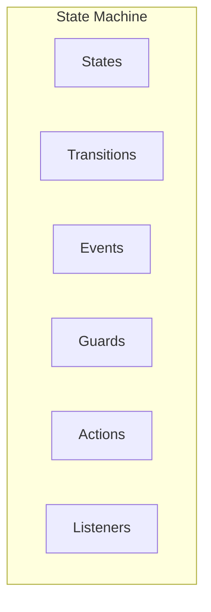

# Spring State Machine: Полное руководство по state machines

## Полезные ссылки

[Официальная документация Spring](https://docs.spring.io/)
[Spring Projects](https://spring.io/projects)

## Содержание

- [Введение в Spring State Machine](#введение-в-spring-state-machine)
  - [Основные возможности](#основные-возможности)
  - [Архитектура State Machine](#архитектура-state-machine)
- [Настройка State Machine](#настройка-state-machine)
  - [Зависимости](#зависимости)
  - [Базовая конфигурация](#базовая-конфигурация)
- [Определение состояний](#определение-состояний)
  - [Enum States](#enum-states)
  - [Hierarchical States](#hierarchical-states)
- [Переходы](#переходы)
  - [External Transitions](#external-transitions)
  - [Internal Transitions](#internal-transitions)
- [Guards](#guards)
  - [Guard Conditions](#guard-conditions)
- [Actions](#actions)
  - [Transition Actions](#transition-actions)
  - [Entry/Exit Actions](#entryexit-actions)
- [Использование State Machine](#использование-state-machine)
  - [Отправка событий](#отправка-событий)
  - [State Machine Listeners](#state-machine-listeners)
- [Persistence](#persistence)
  - [JPA Persistence](#jpa-persistence)
  - [Сохранение и восстановление](#сохранение-и-восстановление)
- [Лучшие практики](#лучшие-практики)
  - [1. Используйте enum для состояний и событий](#1-используйте-enum-для-состояний-и-событий)
  - [2. Определяйте guards для валидации](#2-определяйте-guards-для-валидации)
  - [3. Используйте actions для бизнес-логики](#3-используйте-actions-для-бизнес-логики)
  - [4. Настраивайте persistence для критических процессов](#4-настраивайте-persistence-для-критических-процессов)
  - [5. Обрабатывайте ошибки](#5-обрабатывайте-ошибки)
- [Продвинутые возможности](#продвинутые-возможности)
  - [Choice States](#choice-states)
  - [Junction States](#junction-states)
  - [Fork and Join](#fork-and-join)
  - [History States](#history-states)
- [Регионы](#регионы)
  - [Parallel Regions](#parallel-regions)
- [State Machine Factory](#state-machine-factory)
  - [Factory Pattern](#factory-pattern)
- [Тестирование](#тестирование)
  - [State Machine Testing](#state-machine-testing)
- [Продвинутые паттерны](#продвинутые-паттерны)
  - [State Machine для заказов](#state-machine-для-заказов)
  - [State Machine для документов](#state-machine-для-документов)
  - [State Machine с таймерами](#state-machine-с-таймерами)
  - [State Machine с условиями](#state-machine-с-условиями)
  - [State Machine с композицией](#state-machine-с-композицией)
- [Интеграция с другими компонентами](#интеграция-с-другими-компонентами)
  - [State Machine + Spring Integration](#state-machine-spring-integration)
  - [State Machine + Spring Batch](#state-machine-spring-batch)
- [Продвинутые паттерны](#продвинутые-паттерны-1)
  - [State Machine Builder](#state-machine-builder)
  - [Extended State Variables](#extended-state-variables)
  - [State Machine Interceptors](#state-machine-interceptors)
  - [State Machine Timers](#state-machine-timers)
  - [State Machine Metrics](#state-machine-metrics)
  - [Error Recovery](#error-recovery)
  - [State Machine Persistence with Redis](#state-machine-persistence-with-redis)
- [Заключение](#заключение)
- [Дополнительные ресурсы](#дополнительные-ресурсы)
- [См. также](#см-также)

## Введение в Spring State Machine

**Spring State Machine** предоставляет фреймворк для создания конечных автоматов (state machines) в **Spring** приложениях. Это позволяет моделировать сложные бизнес-процессы с состояниями и переходами.

### Основные возможности

- **States**: Определение состояний
- **Transitions**: Переходы между состояниями
- **Events**: События, вызывающие переходы
- **Guards**: Условия для переходов
- **Actions**: Действия при переходах
- **Persistence**: Сохранение состояния

### Архитектура State Machine



## Настройка State Machine

### Зависимости

**Зависимости **spring-statemachine-core** и **spring-`statemachine-data`-jpa** (pom.xml):**

```xml
<dependency>
    <groupId>org.springframework.statemachine</groupId>
    <artifactId>spring-statemachine-core</artifactId>
</dependency>
<dependency>
    <groupId>org.springframework.statemachine</groupId>
    <artifactId>spring-statemachine-data-jpa</artifactId>
</dependency>
```

### Базовая конфигурация

```java
// Включение State Machine и настройка состояний/переходов
@Configuration
@EnableStateMachine
public class StateMachineConfig extends StateMachineConfigurerAdapter<String, String> {

    @Override
    public void configure(StateMachineStateConfigurer<String, String> states) throws Exception {
        states
            .withStates()
            .initial("SI")
            .states(EnumSet.allOf(States.class));
    }

    @Override
    public void configure(StateMachineTransitionConfigurer<String, String> transitions) throws Exception {
        transitions
            .withExternal()
            .source("SI").target("S1").event("E1")
            .and()
            .withExternal()
            .source("S1").target("S2").event("E2");
    }
}
```

## Определение состояний

### Enum States

```java
public enum States {
    SI, S1, S2, S3, SF
}

public enum Events {
    E1, E2, E3
}

@Configuration
@EnableStateMachine
public class EnumStateMachineConfig extends StateMachineConfigurerAdapter<States, Events> {

    @Override
    public void configure(StateMachineStateConfigurer<States, Events> states) throws Exception {
        states
            .withStates()
            .initial(States.SI)
            .states(EnumSet.allOf(States.class))
            .end(States.SF);
    }
}
```

### Hierarchical States

```java
// Включение State Machine и настройка состояний/переходов
@Configuration
@EnableStateMachine
public class HierarchicalStateMachineConfig extends StateMachineConfigurerAdapter<States, Events> {

    @Override
    public void configure(StateMachineStateConfigurer<States, Events> states) throws Exception {
        states
            .withStates()
            .initial(States.SI)
            .state(States.S1)
            .and()
            .withStates()
            .parent(States.S1)
            .initial(States.S11)
            .state(States.S12);
    }
}
```

## Переходы

### External Transitions

```java
// Включение State Machine и настройка состояний/переходов
@Configuration
@EnableStateMachine
public class TransitionConfig extends StateMachineConfigurerAdapter<States, Events> {

    @Override
    public void configure(StateMachineTransitionConfigurer<States, Events> transitions) throws Exception {
        transitions
            .withExternal()
            .source(States.SI).target(States.S1).event(Events.E1)
            .and()
            .withExternal()
            .source(States.S1).target(States.S2).event(Events.E2)
            .and()
            .withExternal()
            .source(States.S2).target(States.SF).event(Events.E3);
    }
}
```

### Internal Transitions

```java
// Включение State Machine и настройка состояний/переходов
@Configuration
@EnableStateMachine
public class InternalTransitionConfig extends StateMachineConfigurerAdapter<States, Events> {

    @Override
    public void configure(StateMachineTransitionConfigurer<States, Events> transitions) throws Exception {
        transitions
            .withInternal()
            .source(States.S1)
            .event(Events.E1)
            .action(action());
    }

    @Bean
    public Action<States, Events> action() {
        return context -> {
            // Действие при внутреннем переходе
        };
    }
}
```

## Guards

### Guard Conditions

```java
// Включение State Machine и настройка состояний/переходов
@Configuration
@EnableStateMachine
public class GuardConfig extends StateMachineConfigurerAdapter<States, Events> {

    @Override
    public void configure(StateMachineTransitionConfigurer<States, Events> transitions) throws Exception {
        transitions
            .withExternal()
            .source(States.S1).target(States.S2).event(Events.E1)
            .guard(guard());
    }

    @Bean
    public Guard<States, Events> guard() {
        return context -> {
            // Условие для перехода
            return context.getExtendedState().getVariables().get("condition") != null;
        };
    }
}
```

## Actions

### Transition Actions

```java
// Включение State Machine и настройка состояний/переходов
@Configuration
@EnableStateMachine
public class ActionConfig extends StateMachineConfigurerAdapter<States, Events> {

    @Override
    public void configure(StateMachineTransitionConfigurer<States, Events> transitions) throws Exception {
        transitions
            .withExternal()
            .source(States.S1).target(States.S2).event(Events.E1)
            .action(action());
    }

    @Bean
    public Action<States, Events> action() {
        return context -> {
            // Действие при переходе
            log.info("Transition from {} to {}",
                context.getSource().getId(),
                context.getTarget().getId());
        };
    }
}
```

### Entry/Exit Actions

```java
// Включение State Machine и настройка состояний/переходов
@Configuration
@EnableStateMachine
public class EntryExitActionConfig extends StateMachineConfigurerAdapter<States, Events> {

    @Override
    public void configure(StateMachineStateConfigurer<States, Events> states) throws Exception {
        states
            .withStates()
            .initial(States.SI)
            .state(States.S1, entryAction(), exitAction())
            .state(States.S2);
    }

    @Bean
    public Action<States, Events> entryAction() {
        return context -> {
            log.info("Entering state: {}", context.getTarget().getId());
        };
    }

    @Bean
    public Action<States, Events> exitAction() {
        return context -> {
            log.info("Exiting state: {}", context.getSource().getId());
        };
    }
}
```

## Использование State Machine

### Отправка событий

```java
@Service
public class StateMachineService {

    @Autowired
    private StateMachine<States, Events> stateMachine;

    public void startMachine() {
        stateMachine.start();
    }

    public void sendEvent(Events event) {
        stateMachine.sendEvent(event);
    }

    public States getCurrentState() {
        return stateMachine.getState().getId();
    }

    public void stopMachine() {
        stateMachine.stop();
    }
}
```

### State Machine Listeners

```java
@Component
public class StateMachineListener implements StateMachineListener<States, Events> {

    @Override
    public void stateChanged(State<States, Events> from, State<States, Events> to) {
        log.info("State changed from {} to {}", from.getId(), to.getId());
    }

    @Override
    public void stateEntered(State<States, Events> state) {
        log.info("Entered state: {}", state.getId());
    }

    @Override
    public void stateExited(State<States, Events> state) {
        log.info("Exited state: {}", state.getId());
    }

    @Override
    public void eventNotAccepted(Message<Events> event) {
        log.warn("Event not accepted: {}", event.getPayload());
    }

    @Override
    public void transition(Transition<States, Events> transition) {
        log.info("Transition: {} -> {}",
            transition.getSource().getId(),
            transition.getTarget().getId());
    }

    @Override
    public void transitionStarted(Transition<States, Events> transition) {
        log.info("Transition started");
    }

    @Override
    public void transitionEnded(Transition<States, Events> transition) {
        log.info("Transition ended");
    }

    @Override
    public void stateMachineStarted(StateMachine<States, Events> stateMachine) {
        log.info("State machine started");
    }

    @Override
    public void stateMachineStopped(StateMachine<States, Events> stateMachine) {
        log.info("State machine stopped");
    }

    @Override
    public void stateMachineError(StateMachine<States, Events> stateMachine, Exception exception) {
        log.error("State machine error", exception);
    }
}
```

## Persistence

### JPA Persistence

```java
@Entity
public class StateMachineEntity {
    @Id
    private String machineId;
    private String state;
    private byte[] stateMachineContext;

    // Getters and setters
}

@Configuration
@EnableStateMachine
public class PersistentStateMachineConfig extends StateMachineConfigurerAdapter<States, Events> {

    @Autowired
    private StateMachineRepository<States, Events> stateMachineRepository;

    @Bean
    public StateMachinePersister<States, Events, String> stateMachinePersister() {
        return new DefaultStateMachinePersister<>(stateMachineRepository);
    }
}
```

### Сохранение и восстановление

```java
@Service
public class PersistentStateMachineService {

    @Autowired
    private StateMachine<States, Events> stateMachine;

    @Autowired
    private StateMachinePersister<States, Events, String> persister;

    public void saveStateMachine(String machineId) {
        try {
            persister.persist(stateMachine, machineId);
        } catch (Exception e) {
            log.error("Failed to persist state machine", e);
        }
    }

    public void restoreStateMachine(String machineId) {
        try {
            persister.restore(stateMachine, machineId);
        } catch (Exception e) {
            log.error("Failed to restore state machine", e);
        }
    }
}
```

## Лучшие практики

### 1. Используйте enum для состояний и событий

```java
// ✅ Хорошо
public enum States { SI, S1, S2 }
public enum Events { E1, E2 }
```

### 2. Определяйте guards для валидации

```java
// ✅ Хорошо
.guard(context -> validateCondition(context))
```

### 3. Используйте actions для бизнес-логики

```java
// ✅ Хорошо
.action(context -> executeBusinessLogic(context))
```

### 4. Настраивайте persistence для критических процессов

```java
// ✅ Хорошо
@Bean
public StateMachinePersister<States, Events, String> persister() {
    return new DefaultStateMachinePersister<>(repository);
}
```

### 5. Обрабатывайте ошибки

```java
// ✅ Хорошо
@Override
public void stateMachineError(StateMachine<States, Events> stateMachine, Exception exception) {
    log.error("State machine error", exception);
}
```

## Продвинутые возможности

### Choice States

```java
// Включение State Machine и настройка состояний/переходов
@Configuration
@EnableStateMachine
public class ChoiceStateConfig extends StateMachineConfigurerAdapter<States, Events> {

    @Override
    public void configure(StateMachineStateConfigurer<States, Events> states) throws Exception {
        states
            .withStates()
            .initial(States.SI)
            .choice(States.CHOICE)
            .state(States.S1)
            .state(States.S2)
            .state(States.S3);
    }

    @Override
    public void configure(StateMachineTransitionConfigurer<States, Events> transitions) throws Exception {
        transitions
            .withExternal()
            .source(States.SI).target(States.CHOICE).event(Events.E1)
            .and()
            .withChoice()
            .source(States.CHOICE)
            .first(States.S1, guard1())
            .then(States.S2, guard2())
            .last(States.S3);
    }

    @Bean
    public Guard<States, Events> guard1() {
        return context -> {
            // Условие для первого пути
            return true;
        };
    }

    @Bean
    public Guard<States, Events> guard2() {
        return context -> {
            // Условие для второго пути
            return false;
        };
    }
}
```

### Junction States

```java
// Включение State Machine и настройка состояний/переходов
@Configuration
@EnableStateMachine
public class JunctionStateConfig extends StateMachineConfigurerAdapter<States, Events> {

    @Override
    public void configure(StateMachineStateConfigurer<States, Events> states) throws Exception {
        states
            .withStates()
            .initial(States.SI)
            .junction(States.JUNCTION)
            .state(States.S1)
            .state(States.S2)
            .state(States.S3);
    }

    @Override
    public void configure(StateMachineTransitionConfigurer<States, Events> transitions) throws Exception {
        transitions
            .withExternal()
            .source(States.SI).target(States.JUNCTION).event(Events.E1)
            .and()
            .withJunction()
            .source(States.JUNCTION)
            .first(States.S1, guard1())
            .then(States.S2, guard2())
            .last(States.S3);
    }
}
```

### Fork and Join

```java
// Включение State Machine и настройка состояний/переходов
@Configuration
@EnableStateMachine
public class ForkJoinConfig extends StateMachineConfigurerAdapter<States, Events> {

    @Override
    public void configure(StateMachineStateConfigurer<States, Events> states) throws Exception {
        states
            .withStates()
            .initial(States.SI)
            .fork(States.FORK)
            .join(States.JOIN)
            .state(States.S1)
            .state(States.S2)
            .state(States.S3);
    }

    @Override
    public void configure(StateMachineTransitionConfigurer<States, Events> transitions) throws Exception {
        transitions
            .withExternal()
            .source(States.SI).target(States.FORK).event(Events.E1)
            .and()
            .withFork()
            .source(States.FORK)
            .target(States.S1)
            .target(States.S2)
            .and()
            .withJoin()
            .source(States.S1)
            .source(States.S2)
            .target(States.JOIN)
            .and()
            .withExternal()
            .source(States.JOIN).target(States.S3).event(Events.E2);
    }
}
```

### History States

```java
// Включение State Machine и настройка состояний/переходов
@Configuration
@EnableStateMachine
public class HistoryStateConfig extends StateMachineConfigurerAdapter<States, Events> {

    @Override
    public void configure(StateMachineStateConfigurer<States, Events> states) throws Exception {
        states
            .withStates()
            .initial(States.SI)
            .state(States.S1)
            .and()
            .withStates()
            .parent(States.S1)
            .initial(States.S11)
            .state(States.S12)
            .history(States.S1HISTORY, HistoryStateType.DEEP);
    }

    @Override
    public void configure(StateMachineTransitionConfigurer<States, Events> transitions) throws Exception {
        transitions
            .withExternal()
            .source(States.SI).target(States.S1HISTORY).event(Events.E1);
    }
}
```

## Регионы

### Parallel Regions

```java
// Включение State Machine и настройка состояний/переходов
@Configuration
@EnableStateMachine
public class ParallelRegionConfig extends StateMachineConfigurerAdapter<States, Events> {

    @Override
    public void configure(StateMachineStateConfigurer<States, Events> states) throws Exception {
        states
            .withStates()
            .initial(States.SI)
            .state(States.S1)
            .and()
            .withStates()
            .parent(States.S1)
            .initial(States.S11)
            .state(States.S12)
            .and()
            .withStates()
            .parent(States.S1)
            .initial(States.S21)
            .state(States.S22);
    }
}
```

## State Machine Factory

### Factory Pattern

```java
@Configuration
public class StateMachineFactoryConfig {

    @Bean
    public StateMachineFactory<States, Events> stateMachineFactory() {
        StateMachineBuilder.Builder<States, Events> builder = StateMachineBuilder.builder();

        builder.configureStates()
            .withStates()
            .initial(States.SI)
            .states(EnumSet.allOf(States.class));

        builder.configureTransitions()
            .withExternal()
            .source(States.SI).target(States.S1).event(Events.E1);

        return new DefaultStateMachineFactory<>(builder.build());
    }
}

@Service
public class StateMachineFactoryService {

    @Autowired
    private StateMachineFactory<States, Events> stateMachineFactory;

    public StateMachine<States, Events> createStateMachine() {
        return stateMachineFactory.getStateMachine();
    }
}
```

## Тестирование

### State Machine Testing

```java
@SpringBootTest
class StateMachineTest {

    @Autowired
    private StateMachine<States, Events> stateMachine;

    @Test
    void testStateMachine() {
        stateMachine.start();
        assertThat(stateMachine.getState().getId()).isEqualTo(States.SI);

        stateMachine.sendEvent(Events.E1);
        assertThat(stateMachine.getState().getId()).isEqualTo(States.S1);

        stateMachine.sendEvent(Events.E2);
        assertThat(stateMachine.getState().getId()).isEqualTo(States.S2);
    }
}
```

## Продвинутые паттерны

### State Machine для заказов

```java
public enum OrderState {
    CREATED, PAYMENT_PENDING, PAYMENT_RECEIVED,
    PROCESSING, SHIPPED, DELIVERED, CANCELLED
}

public enum OrderEvent {
    PAY, PAYMENT_RECEIVED, PROCESS, SHIP, DELIVER, CANCEL
}

@Configuration
@EnableStateMachine
public class OrderStateMachineConfig extends StateMachineConfigurerAdapter<OrderState, OrderEvent> {

    @Override
    public void configure(StateMachineStateConfigurer<OrderState, OrderEvent> states) throws Exception {
        states
            .withStates()
            .initial(OrderState.CREATED)
            .state(OrderState.PAYMENT_PENDING)
            .state(OrderState.PAYMENT_RECEIVED)
            .state(OrderState.PROCESSING)
            .state(OrderState.SHIPPED)
            .state(OrderState.DELIVERED)
            .end(OrderState.CANCELLED)
            .end(OrderState.DELIVERED);
    }

    @Override
    public void configure(StateMachineTransitionConfigurer<OrderState, OrderEvent> transitions) throws Exception {
        transitions
            .withExternal()
            .source(OrderState.CREATED).target(OrderState.PAYMENT_PENDING).event(OrderEvent.PAY)
            .and()
            .withExternal()
            .source(OrderState.PAYMENT_PENDING).target(OrderState.PAYMENT_RECEIVED).event(OrderEvent.PAYMENT_RECEIVED)
            .and()
            .withExternal()
            .source(OrderState.PAYMENT_RECEIVED).target(OrderState.PROCESSING).event(OrderEvent.PROCESS)
            .and()
            .withExternal()
            .source(OrderState.PROCESSING).target(OrderState.SHIPPED).event(OrderEvent.SHIP)
            .and()
            .withExternal()
            .source(OrderState.SHIPPED).target(OrderState.DELIVERED).event(OrderEvent.DELIVER)
            .and()
            .withExternal()
            .source(OrderState.CREATED).target(OrderState.CANCELLED).event(OrderEvent.CANCEL)
            .and()
            .withExternal()
            .source(OrderState.PAYMENT_PENDING).target(OrderState.CANCELLED).event(OrderEvent.CANCEL);
    }
}
```

### State Machine для документов

```java
public enum DocumentState {
    DRAFT, REVIEW, APPROVED, REJECTED, PUBLISHED, ARCHIVED
}

public enum DocumentEvent {
    SUBMIT, APPROVE, REJECT, PUBLISH, ARCHIVE
}

@Configuration
@EnableStateMachine
public class DocumentStateMachineConfig extends StateMachineConfigurerAdapter<DocumentState, DocumentEvent> {

    @Override
    public void configure(StateMachineStateConfigurer<DocumentState, DocumentEvent> states) throws Exception {
        states
            .withStates()
            .initial(DocumentState.DRAFT)
            .state(DocumentState.REVIEW, reviewAction(), null)
            .state(DocumentState.APPROVED)
            .state(DocumentState.REJECTED)
            .state(DocumentState.PUBLISHED)
            .end(DocumentState.ARCHIVED);
    }

    @Bean
    public Action<DocumentState, DocumentEvent> reviewAction() {
        return context -> {
            // Действие при входе в состояние REVIEW
            log.info("Document entered review state");
        };
    }
}
```

### State Machine с таймерами

```java
// Включение State Machine и настройка состояний/переходов
@Configuration
@EnableStateMachine
public class TimedStateMachineConfig extends StateMachineConfigurerAdapter<States, Events> {

    @Override
    public void configure(StateMachineStateConfigurer<States, Events> states) throws Exception {
        states
            .withStates()
            .initial(States.SI)
            .state(States.S1, null, timeoutAction());
    }

    @Bean
    public Action<States, Events> timeoutAction() {
        return context -> {
            // Действие при таймауте состояния
            log.warn("State timeout occurred");
        };
    }
}
```

### State Machine с условиями

```java
// Включение State Machine и настройка состояний/переходов
@Configuration
@EnableStateMachine
public class ConditionalStateMachineConfig extends StateMachineConfigurerAdapter<States, Events> {

    @Override
    public void configure(StateMachineTransitionConfigurer<States, Events> transitions) throws Exception {
        transitions
            .withExternal()
            .source(States.S1).target(States.S2).event(Events.E1)
            .guard(context -> {
                // Условие для перехода
                String condition = (String) context.getExtendedState().getVariables().get("condition");
                return "valid".equals(condition);
            })
            .action(context -> {
                // Действие при переходе
                log.info("Transition executed with condition");
            });
    }
}
```

### State Machine с композицией

```java
// Включение State Machine и настройка состояний/переходов
@Configuration
@EnableStateMachine
public class CompositeStateMachineConfig extends StateMachineConfigurerAdapter<States, Events> {

    @Override
    public void configure(StateMachineStateConfigurer<States, Events> states) throws Exception {
        states
            .withStates()
            .initial(States.SI)
            .state(States.S1)
            .and()
            .withStates()
            .parent(States.S1)
            .initial(States.S11)
            .state(States.S12)
            .and()
            .withStates()
            .parent(States.S1)
            .initial(States.S21)
            .state(States.S22);
    }
}
```

## Интеграция с другими компонентами

### State Machine + Spring Integration

```java
// Включение State Machine и настройка состояний/переходов
@Configuration
@EnableStateMachine
@EnableIntegration
public class IntegrationStateMachineConfig extends StateMachineConfigurerAdapter<States, Events> {

    @Bean
    public IntegrationFlow stateMachineFlow() {
        return IntegrationFlows.from("stateMachineChannel")
            .handle(stateMachineHandler())
            .channel("outputChannel")
            .get();
    }

    @Bean
    public StateMachineHandler stateMachineHandler() {
        return new StateMachineHandler();
    }
}
```

### State Machine + Spring Batch

```java
@Component
public class BatchStateMachineProcessor implements ItemProcessor<Order, Order> {

    @Autowired
    private StateMachine<OrderState, OrderEvent> stateMachine;

    @Override
    public Order process(Order item) {
        stateMachine.start();
        stateMachine.sendEvent(OrderEvent.PROCESS);
        item.setState(stateMachine.getState().getId());
        return item;
    }
}
```

## Продвинутые паттерны

### State Machine Builder

```java
@Service
public class StateMachineBuilderService {

    public StateMachine<States, Events> buildStateMachine() {
        StateMachineBuilder.Builder<States, Events> builder = StateMachineBuilder.builder();

        builder.configureConfiguration()
            .withConfiguration()
            .autoStartup(true)
            .listener(stateMachineListener());

        builder.configureStates()
            .withStates()
            .initial(States.SI)
            .states(EnumSet.allOf(States.class))
            .end(States.SF);

        builder.configureTransitions()
            .withExternal()
            .source(States.SI).target(States.S1).event(Events.E1)
            .action(action1())
            .and()
            .withExternal()
            .source(States.S1).target(States.S2).event(Events.E2)
            .guard(guard1())
            .action(action2());

        return builder.build();
    }

    @Bean
    public StateMachineListener<States, Events> stateMachineListener() {
        return new StateMachineListenerAdapter<States, Events>() {
            @Override
            public void stateChanged(State<States, Events> from, State<States, Events> to) {
                log.info("State changed: {} -> {}", from.getId(), to.getId());
            }
        };
    }
}
```

### Extended State Variables

```java
@Service
public class ExtendedStateService {

    @Autowired
    private StateMachine<States, Events> stateMachine;

    public void setVariable(String key, Object value) {
        stateMachine.getExtendedState().getVariables().put(key, value);
    }

    public <T> T getVariable(String key, Class<T> type) {
        return type.cast(stateMachine.getExtendedState().getVariables().get(key));
    }

    public void processWithVariables() {
        setVariable("counter", 0);
        setVariable("data", new HashMap<>());

        stateMachine.sendEvent(Events.E1);

        Integer counter = getVariable("counter", Integer.class);
        Map<String, Object> data = getVariable("data", Map.class);
    }
}

@Configuration
@EnableStateMachine
public class ExtendedStateConfig extends StateMachineConfigurerAdapter<States, Events> {

    @Override
    public void configure(StateMachineTransitionConfigurer<States, Events> transitions) throws Exception {
        transitions
            .withExternal()
            .source(States.S1).target(States.S2).event(Events.E1)
            .action(context -> {
                Integer counter = context.getExtendedState().get("counter", Integer.class);
                context.getExtendedState().getVariables().put("counter", counter + 1);
            });
    }
}
```

### State Machine Interceptors

```java
@Component
public class StateMachineInterceptor implements StateMachineInterceptor<States, Events> {

    @Override
    public Message<Events> preEvent(Message<Events> message, StateMachine<States, Events> stateMachine) {
        log.info("Pre-event: {}", message.getPayload());
        return message;
    }

    @Override
    public StateContext<States, Events> preTransition(StateContext<States, Events> stateContext) {
        log.info("Pre-transition: {} -> {}",
            stateContext.getSource().getId(),
            stateContext.getTarget().getId());
        return stateContext;
    }

    @Override
    public StateContext<States, Events> postTransition(StateContext<States, Events> stateContext) {
        log.info("Post-transition: {} -> {}",
            stateContext.getSource().getId(),
            stateContext.getTarget().getId());
        return stateContext;
    }

    @Override
    public Exception stateMachineError(StateMachine<States, Events> stateMachine, Exception exception) {
        log.error("State machine error", exception);
        return exception;
    }
}
```

### State Machine Timers

```java
// Включение State Machine и настройка состояний/переходов
@Configuration
@EnableStateMachine
public class TimerConfig extends StateMachineConfigurerAdapter<States, Events> {

    @Override
    public void configure(StateMachineStateConfigurer<States, Events> states) throws Exception {
        states
            .withStates()
            .initial(States.SI)
            .state(States.S1, null, null,
                Collections.singletonList(timerAction()));
    }

    @Bean
    public Action<States, Events> timerAction() {
        return context -> {
            ScheduledExecutorService executor = Executors.newScheduledThreadPool(1);
            executor.schedule(() -> {
                context.getStateMachine().sendEvent(Events.TIMEOUT);
            }, 5, TimeUnit.SECONDS);
        };
    }
}
```

### State Machine Metrics

```java
@Component
public class StateMachineMetrics {

    private final MeterRegistry meterRegistry;
    private final Counter stateTransitions;
    private final Timer stateMachineExecutionTime;

    public StateMachineMetrics(MeterRegistry meterRegistry) {
        this.meterRegistry = meterRegistry;
        this.stateTransitions = Counter.builder("statemachine.transitions")
            .description("Number of state transitions")
            .register(meterRegistry);
        this.stateMachineExecutionTime = Timer.builder("statemachine.execution.time")
            .description("State machine execution time")
            .register(meterRegistry);
    }

    @EventListener
    public void handleTransition(StateMachineTransitionEvent<States, Events> event) {
        stateTransitions.increment(Tags.of(
            "from", event.getSource().getId().toString(),
            "to", event.getTarget().getId().toString()
        ));
    }
}
```

### Error Recovery

```java
@Component
public class StateMachineErrorHandler implements StateMachineListener<States, Events> {

    @Override
    public void stateMachineError(StateMachine<States, Events> stateMachine, Exception exception) {
        log.error("State machine error in state: {}",
            stateMachine.getState().getId(), exception);

        try {
            stateMachine.sendEvent(Events.RESET);
        } catch (Exception e) {
            log.error("Failed to recover state machine", e);
        }
    }
}
```

### State Machine Persistence with Redis

```java
// Включение State Machine и настройка состояний/переходов
@Configuration
@EnableStateMachine
public class RedisPersistenceConfig extends StateMachineConfigurerAdapter<States, Events> {

    @Autowired
    private RedisConnectionFactory connectionFactory;

    @Bean
    public StateMachinePersister<States, Events, String> stateMachinePersister() {
        RedisStateMachinePersister<States, Events> persister =
            new RedisStateMachinePersister<>(redisStateMachineRepository());
        return persister;
    }

    @Bean
    public RedisStateMachineRepository redisStateMachineRepository() {
        return new RedisStateMachineRepository(connectionFactory);
    }
}
```


## Заключение

**Spring State Machine** предоставляет мощные инструменты для создания конечных автоматов. Правильное использование состояний, переходов, событий, **guards**, **actions**, **persistence**, **listeners**, **choice**/**junction states**, **fork**/**join**, **history states**, регионов, **extended state variables**, **interceptors**, **timers**, тестирования, метрик, **error recovery**, **Redis persistence** и других продвинутых возможностей позволяет моделировать сложные бизнес-процессы с четким управлением состояниями и надежной обработкой ошибок.

## Дополнительные ресурсы

- [**Spring State Machine** Documentation](https://docs.spring.io/spring-statemachine/reference/)
- [**State Machine** Examples](https://github.com/spring-projects/spring-statemachine/tree/main/spring-statemachine-samples)
- [**UML State Machines**](https://www.omg.org/spec/UML/)
- [**State Pattern**](https://refactoring.guru/design-patterns/state) — Refactoring Guru
- [**State Pattern**](https://sourcemaking.com/design_patterns/state) — SourceMaking

## См. также

- [Spring Actuator: Полное руководство по мониторингу и управлению](spring-actuator.md)
- [Spring AI](spring-ai.md)
- [Spring AOP: Полное руководство по аспектно-ориентированному программированию](spring-aop.md)
- [Spring Batch для Java](spring-batch.md)
- [Spring Boot — Полное руководство](../../spring/spring-boot.md)
