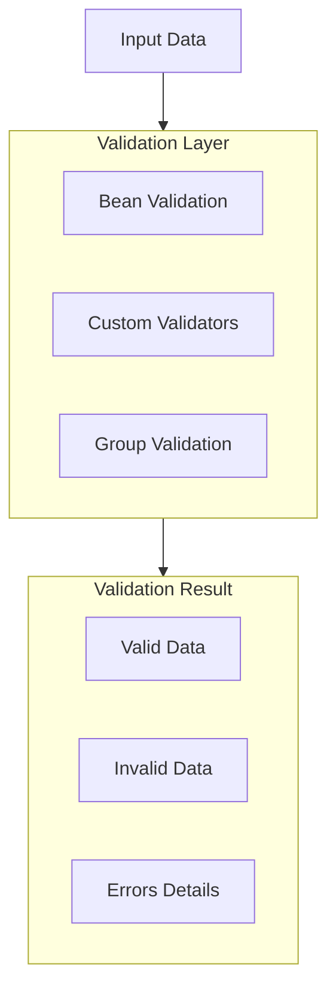

# Spring Validation: Полное руководство по валидации данных


### См. также
- [[spring-validation-interview|Вопросы на собеседовании]] — подготовка к интервью

## Полезные ссылки

[Официальная документация Spring](https://docs.spring.io/)
[Spring Projects](https://spring.io/projects)

## Содержание

- [Введение в Spring Validation](#введение-в-spring-validation)
  - [Основные возможности](#основные-возможности)
  - [Архитектура валидации](#архитектура-валидации)
- [Настройка валидации](#настройка-валидации)
  - [Зависимости](#зависимости)
  - [Включение валидации](#включение-валидации)
- [Bean Validation аннотации](#bean-validation-аннотации)
  - [Стандартные аннотации](#стандартные-аннотации)
  - [Валидация вложенных объектов](#валидация-вложенных-объектов)
- [Валидация в контроллерах](#валидация-в-контроллерах)
  - [@Valid и @Validated](#valid-и-validated)
  - [Обработка ошибок валидации](#обработка-ошибок-валидации)
  - [Глобальная обработка ошибок валидации](#глобальная-обработка-ошибок-валидации)
- [Валидация параметров методов](#валидация-параметров-методов)
  - [@Validated на уровне класса](#validated-на-уровне-класса)
  - [Валидация возвращаемых значений](#валидация-возвращаемых-значений)
- [Custom Validators](#custom-validators)
  - [Создание custom validator](#создание-custom-validator)
  - [Использование custom validator](#использование-custom-validator)
  - [Валидация с зависимостями](#валидация-с-зависимостями)
- [Группировка валидации](#группировка-валидации)
  - [Определение групп валидации](#определение-групп-валидации)
  - [Использование групп валидации](#использование-групп-валидации)
- [Валидация в сервисах](#валидация-в-сервисах)
- [Валидация в репозиториях](#валидация-в-репозиториях)
- [Программная валидация](#программная-валидация)
- [Лучшие практики](#лучшие-практики)
  - [1. Используйте @Valid в контроллерах](#1-используйте-valid-в-контроллерах)
  - [2. Создавайте осмысленные сообщения об ошибках](#2-создавайте-осмысленные-сообщения-об-ошибках)
  - [3. Используйте группы валидации для разных сценариев](#3-используйте-группы-валидации-для-разных-сценариев)
  - [4. Валидируйте на разных уровнях](#4-валидируйте-на-разных-уровнях)
  - [5. Обрабатывайте ошибки валидации централизованно](#5-обрабатывайте-ошибки-валидации-централизованно)
- [Заключение](#заключение)
- [Дополнительные ресурсы](#дополнительные-ресурсы)
- [См. также](#см-также-1)

## Введение в Spring Validation

**Spring Validation** предоставляет мощную систему валидации данных на основе **Bean Validation** (JSR-303/`JSR`-380). Это позволяет валидировать данные на разных уровнях приложения: от контроллеров до сервисов и репозиториев.

### Основные возможности

- **Bean Validation**: Стандартные аннотации валидации (JSR-303/`JSR`-380)
- **Custom Validators**: Создание собственных валидаторов
- **Группировка валидации**: Валидация для разных сценариев
- **Валидация на разных уровнях**: Контроллеры, сервисы, репозитории
- **Интеграция с Spring MVC**: автоматическая валидация в контроллерах

### Архитектура валидации



## Настройка валидации

### Зависимости

**Зависимость **spring-`boot-starter`-validation** (pom.xml):**

```xml
<dependency>
    <groupId>org.springframework.boot</groupId>
    <artifactId>spring-boot-starter-validation</artifactId>
</dependency>
```

### Включение валидации

**В **Spring Boot** валидация включается автоматически при наличии зависимости. Для ручной настройки:**

```java
// Конфигурация валидатора и сообщений об ошибках
@Configuration
public class ValidationConfig {

    @Bean
    public Validator validator() {
        return Validation.buildDefaultValidatorFactory().getValidator();
    }

    @Bean
    public MethodValidationPostProcessor methodValidationPostProcessor() {
        return new MethodValidationPostProcessor();
    }
}
```

## Bean Validation аннотации

### Стандартные аннотации

```java
// Модель с аннотациями Bean Validation
import jakarta.validation.constraints.*;

public class User {

    @NotNull(message = "ID cannot be null")
    private Long id;

    @NotBlank(message = "Name is required")
    @Size(min = 2, max = 50, message = "Name must be between 2 and 50 characters")
    private String name;

    @NotBlank(message = "Email is required")
    @Email(message = "Email should be valid")
    private String email;

    @Min(value = 18, message = "Age must be at least 18")
    @Max(value = 120, message = "Age must be at most 120")
    private Integer age;

    @Pattern(regexp = "^[0-9]{10}$", message = "Phone number must be 10 digits")
    private String phoneNumber;

    @DecimalMin(value = "0.0", inclusive = false, message = "Salary must be positive")
    @DecimalMax(value = "1000000.0", message = "Salary must be less than 1,000,000")
    private BigDecimal salary;

    @Past(message = "Birth date must be in the past")
    private LocalDate birthDate;

    @Future(message = "Expiry date must be in the future")
    private LocalDate expiryDate;

    @AssertTrue(message = "Terms must be accepted")
    private Boolean termsAccepted;

    @AssertFalse(message = "Account must not be locked")
    private Boolean accountLocked;

    @NotEmpty(message = "Tags cannot be empty")
    private List<String> tags;

    @Size(min = 1, max = 5, message = "Must have between 1 and 5 addresses")
    private List<Address> addresses;

    // Getters and setters...
}
```

### Валидация вложенных объектов

```java
public class User {

    @NotNull
    @Valid
    private Address address;

    @NotEmpty
    @Valid
    private List<Order> orders;
}

public class Address {
    @NotBlank
    private String street;

    @NotBlank
    private String city;

    @Pattern(regexp = "^[0-9]{5}$")
    private String zipCode;
}
```

## Валидация в контроллерах

### @Valid и @Validated

```java
@RestController
@RequestMapping("/api/users")
public class UserController {

    @PostMapping
    public ResponseEntity<User> createUser(@Valid @RequestBody User user) {
        User created = userService.save(user);
        return ResponseEntity.status(HttpStatus.CREATED).body(created);
    }

    @PutMapping("/{id}")
    public ResponseEntity<User> updateUser(
            @PathVariable Long id,
            @Valid @RequestBody User user) {
        User updated = userService.update(id, user);
        return ResponseEntity.ok(updated);
    }
}
```

### Обработка ошибок валидации

```java
@RestController
@RequestMapping("/api/users")
public class UserController {

    @PostMapping
    public ResponseEntity<?> createUser(
            @Valid @RequestBody User user,
            BindingResult bindingResult) {
        if (bindingResult.hasErrors()) {
            Map<String, String> errors = new HashMap<>();
            bindingResult.getFieldErrors().forEach(error -> {
                errors.put(error.getField(), error.getDefaultMessage());
            });
            return ResponseEntity.badRequest().body(errors);
        }
        User created = userService.save(user);
        return ResponseEntity.status(HttpStatus.CREATED).body(created);
    }
}
```

### Глобальная обработка ошибок валидации

```java
@ControllerAdvice
public class GlobalExceptionHandler {

    @ExceptionHandler(MethodArgumentNotValidException.class)
    public ResponseEntity<ErrorResponse> handleValidationExceptions(
            MethodArgumentNotValidException ex) {
        Map<String, String> errors = new HashMap<>();
        ex.getBindingResult().getFieldErrors().forEach(error -> {
            errors.put(error.getField(), error.getDefaultMessage());
        });

        ErrorResponse errorResponse = new ErrorResponse(
            "VALIDATION_ERROR",
            "Validation failed",
            errors
        );
        return ResponseEntity.badRequest().body(errorResponse);
    }

    @ExceptionHandler(ConstraintViolationException.class)
    public ResponseEntity<ErrorResponse> handleConstraintViolation(
            ConstraintViolationException ex) {
        Map<String, String> errors = new HashMap<>();
        ex.getConstraintViolations().forEach(violation -> {
            String fieldName = violation.getPropertyPath().toString();
            String errorMessage = violation.getMessage();
            errors.put(fieldName, errorMessage);
        });

        ErrorResponse errorResponse = new ErrorResponse(
            "VALIDATION_ERROR",
            "Validation failed",
            errors
        );
        return ResponseEntity.badRequest().body(errorResponse);
    }
}
```

## Валидация параметров методов

### @Validated на уровне класса

```java
@Service
@Validated
public class UserService {

    public User findById(@NotNull @Min(1) Long id) {
        return userRepository.findById(id)
            .orElseThrow(() -> new UserNotFoundException(id));
    }

    public List<User> findByAge(
            @Min(18) @Max(120) Integer minAge,
            @Min(18) @Max(120) Integer maxAge) {
        return userRepository.findByAgeBetween(minAge, maxAge);
    }

    public User create(@Valid User user) {
        return userRepository.save(user);
    }
}
```

### Валидация возвращаемых значений

```java
@Service
@Validated
public class UserService {

    @NotNull
    public User findById(@NotNull Long id) {
        return userRepository.findById(id)
            .orElseThrow(() -> new UserNotFoundException(id));
    }
}
```

## Custom Validators

### Создание custom validator

```java
import jakarta.validation.Constraint;
import jakarta.validation.ConstraintValidator;
import jakarta.validation.ConstraintValidatorContext;
import jakarta.validation.Payload;
import java.lang.annotation.*;

@Target({ElementType.FIELD, ElementType.PARAMETER})
@Retention(RetentionPolicy.RUNTIME)
@Constraint(validatedBy = PhoneNumberValidator.class)
@Documented
public @interface PhoneNumber {
    String message() default "Invalid phone number";
    Class<?>[] groups() default {};
    Class<? extends Payload>[] payload() default {};
    String countryCode() default "US";
}

public class PhoneNumberValidator implements ConstraintValidator<PhoneNumber, String> {
    private String countryCode;

    @Override
    public void initialize(PhoneNumber constraintAnnotation) {
        this.countryCode = constraintAnnotation.countryCode();
    }

    @Override
    public boolean isValid(String phoneNumber, ConstraintValidatorContext context) {
        if (phoneNumber == null) {
            return true; // @NotNull должен обрабатывать null
        }

        // Валидация в зависимости от кода страны
        switch (countryCode) {
            case "US":
                return phoneNumber.matches("^\\+1[0-9]{10}$");
            case "RU":
                return phoneNumber.matches("^\\+7[0-9]{10}$");
            default:
                return phoneNumber.matches("^\\+[0-9]{10,15}$");
        }
    }
}
```

### Использование custom validator

```java
public class User {

    @PhoneNumber(countryCode = "US", message = "Invalid US phone number")
    private String phoneNumber;
}
```

### Валидация с зависимостями

```java
@Target({ElementType.TYPE})
@Retention(RetentionPolicy.RUNTIME)
@Constraint(validatedBy = PasswordMatchValidator.class)
@Documented
public @interface PasswordMatch {
    String message() default "Passwords do not match";
    Class<?>[] groups() default {};
    Class<? extends Payload>[] payload() default {};
}

public class PasswordMatchValidator implements ConstraintValidator<PasswordMatch, UserRegistration> {

    @Override
    public boolean isValid(UserRegistration registration, ConstraintValidatorContext context) {
        if (registration.getPassword() == null || registration.getConfirmPassword() == null) {
            return true;
        }

        boolean isValid = registration.getPassword().equals(registration.getConfirmPassword());

        if (!isValid) {
            context.disableDefaultConstraintViolation();
            context.buildConstraintViolationWithTemplate(context.getDefaultConstraintMessageTemplate())
                .addPropertyNode("confirmPassword")
                .addConstraintViolation();
        }

        return isValid;
    }
}

@PasswordMatch
public class UserRegistration {
    private String password;
    private String confirmPassword;
    // ...
}
```

## Группировка валидации

### Определение групп валидации

```java
public interface CreateGroup {}
public interface UpdateGroup {}

public class User {

    @NotNull(groups = {CreateGroup.class, UpdateGroup.class})
    private Long id;

    @NotBlank(groups = CreateGroup.class)
    @Size(min = 2, max = 50, groups = {CreateGroup.class, UpdateGroup.class})
    private String name;

    @NotBlank(groups = CreateGroup.class)
    @Email(groups = {CreateGroup.class, UpdateGroup.class})
    private String email;

    @NotNull(groups = UpdateGroup.class)
    private Integer version; // Для optimistic locking
}
```

### Использование групп валидации

```java
@RestController
@RequestMapping("/api/users")
public class UserController {

    @PostMapping
    public ResponseEntity<User> createUser(
            @Validated(CreateGroup.class) @RequestBody User user) {
        User created = userService.save(user);
        return ResponseEntity.status(HttpStatus.CREATED).body(created);
    }

    @PutMapping("/{id}")
    public ResponseEntity<User> updateUser(
            @PathVariable Long id,
            @Validated(UpdateGroup.class) @RequestBody User user) {
        User updated = userService.update(id, user);
        return ResponseEntity.ok(updated);
    }
}
```

## Валидация в сервисах

```java
@Service
@Validated
public class UserService {

    public User create(@Valid User user) {
        return userRepository.save(user);
    }

    public User update(@NotNull Long id, @Valid User user) {
        User existing = userRepository.findById(id)
            .orElseThrow(() -> new UserNotFoundException(id));
        // Обновление полей
        return userRepository.save(existing);
    }

    public void delete(@NotNull @Min(1) Long id) {
        userRepository.deleteById(id);
    }
}
```

## Валидация в репозиториях

```java
@Repository
@Validated
public interface UserRepository extends JpaRepository<User, Long> {

    @Query("SELECT u FROM User u WHERE u.email = :email")
    Optional<User> findByEmail(@NotBlank @Email String email);

    @Query("SELECT u FROM User u WHERE u.age BETWEEN :minAge AND :maxAge")
    List<User> findByAgeBetween(
            @Min(0) @Max(150) Integer minAge,
            @Min(0) @Max(150) Integer maxAge);
}
```

## Программная валидация

```java
@Service
public class UserService {

    @Autowired
    private Validator validator;

    public User create(User user) {
        Set<ConstraintViolation<User>> violations = validator.validate(user);
        if (!violations.isEmpty()) {
            throw new ConstraintViolationException(violations);
        }
        return userRepository.save(user);
    }

    public User createWithGroup(User user, Class<?>... groups) {
        Set<ConstraintViolation<User>> violations = validator.validate(user, groups);
        if (!violations.isEmpty()) {
            throw new ConstraintViolationException(violations);
        }
        return userRepository.save(user);
    }
}
```

## Лучшие практики

### 1. Используйте @Valid в контроллерах

```java
// ✅ Хорошо
@PostMapping
public ResponseEntity<User> createUser(@Valid @RequestBody User user) {
    // ...
}

// ❌ Плохо
@PostMapping
public ResponseEntity<User> createUser(@RequestBody User user) {
    // Валидация не выполняется автоматически
}
```

### 2. Создавайте осмысленные сообщения об ошибках

```java
// ✅ Хорошо
@NotBlank(message = "Email is required")
@Email(message = "Email must be a valid email address")

// ❌ Плохо
@NotBlank
@Email
```

### 3. Используйте группы валидации для разных сценариев

```java
// ✅ Хорошо
@Validated(CreateGroup.class)
@Validated(UpdateGroup.class)
```

### 4. Валидируйте на разных уровнях

```java
// ✅ Хорошо - валидация в контроллере и сервисе
@RestController
public class UserController {
    @PostMapping
    public ResponseEntity<User> create(@Valid @RequestBody User user) {
        return ResponseEntity.ok(userService.create(user));
    }
}

@Service
@Validated
public class UserService {
    public User create(@Valid User user) {
        // Дополнительная валидация
    }
}
```

### 5. Обрабатывайте ошибки валидации централизованно

```java
// ✅ Хорошо
@ControllerAdvice
public class GlobalExceptionHandler {
    @ExceptionHandler(MethodArgumentNotValidException.class)
    public ResponseEntity<ErrorResponse> handleValidation(...) {
        // Централизованная обработка
    }
}
```


## Заключение

**Spring Validation** предоставляет мощную систему валидации данных, которая интегрируется на всех уровнях приложения. Использование **Bean Validation**, **custom validators** и группировки валидации позволяет создавать надежные и безопасные приложения.

## Дополнительные ресурсы

- [**Bean Validation** Specification (JSR 380)](https://beanvalidation.org/2.0/)
- [**Spring Validation** Documentation](https://docs.spring.io/spring-framework/reference/core/validation.html)
- [Baeldung **Spring Validation**](https://www.baeldung.com/spring-validation)

## См. также

- [[spring-actuator|Spring Actuator: Полное руководство по мониторингу и управлению]]
- [[spring-ai|Spring AI]]
- [[spring-aop|Spring AOP: Полное руководство по аспектно-ориентированному программированию]]
- [[spring-batch|Spring Batch для Java]]
- [[spring-boot|Spring Boot — Полное руководство]]
