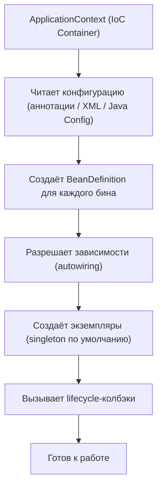

# Spring Framework: Core

Практическое руководство по Spring Core: IoC-контейнер, внедрение зависимостей, жизненный цикл бинов, AOP, события и конфигурация.

## Полезные ссылки

- [Spring Framework Reference](https://docs.spring.io/spring-framework/reference/)
- [Spring Boot Reference](https://docs.spring.io/spring-boot/reference/)


### См. также
- [Spring Messaging: Полное руководство по messaging системам](../java-frameworks/spring/spring-messaging.md)
- [Spring GraphQL: Полное руководство](../java-frameworks/spring/spring-graphql.md)
- [Spring Actuator: Полное руководство по мониторингу и управлению](../java-frameworks/spring/spring-actuator.md)
## Содержание

- [IoC-контейнер и DI](#ioc-контейнер-и-di)
- [Способы внедрения зависимостей](#способы-внедрения-зависимостей)
  - [Constructor Injection (рекомендуется)](#constructor-injection-рекомендуется)
  - [Setter Injection](#setter-injection)
  - [Field Injection (не рекомендуется)](#field-injection-не-рекомендуется)
  - [Разрешение неоднозначности](#разрешение-неоднозначности)
- [Bean Scope](#bean-scope)
- [Жизненный цикл Bean](#жизненный-цикл-bean)
- [Конфигурация](#конфигурация)
  - [Java Config (рекомендуется)](#java-config-рекомендуется)
  - [Component Scanning](#component-scanning)
  - [Properties](#properties)
- [Profiles и условная конфигурация](#profiles-и-условная-конфигурация)
- [AOP](#aop)
- [Events](#events)
- [SpEL](#spel)
- [Типичные ошибки](#типичные-ошибки)
- [См. также](#см-также-1)

## IoC-контейнер и DI

**Inversion of Control** — объект не создаёт свои зависимости, а получает их извне.

**Dependency Injection** — конкретный механизм IoC в Spring: контейнер создаёт бины и «вкалывает» зависимости.



**BeanFactory** vs **ApplicationContext**:
- `BeanFactory` — базовый контейнер (lazy init, минимальные возможности)
- `ApplicationContext` — расширение BeanFactory + events, i18n, AOP, resource loading

На практике всегда используется `ApplicationContext`.

## Способы внедрения зависимостей

### Constructor Injection (рекомендуется)

```java
@Service
public class OrderService {
    private final PaymentService paymentService;
    private final NotificationService notificationService;

    // Spring автоматически внедрит зависимости (если один конструктор — @Autowired не нужен)
    public OrderService(PaymentService paymentService, NotificationService notificationService) {
        this.paymentService = paymentService;
        this.notificationService = notificationService;
    }
}
```

Преимущества: immutable поля (`final`), легко тестировать, невозможно создать объект в невалидном состоянии.

### Setter Injection

```java
@Service
public class ReportService {
    private Formatter formatter;

    @Autowired
    public void setFormatter(Formatter formatter) {
        this.formatter = formatter;
    }
}
```

Используется для опциональных зависимостей.

### Field Injection (не рекомендуется)

```java
@Service
public class UserService {
    @Autowired  // Анти-паттерн: нельзя final, сложно тестировать
    private UserRepository userRepository;
}
```

### Разрешение неоднозначности

```java
// По имени
@Autowired
@Qualifier("emailNotification")
private NotificationService notificationService;

// Primary bean
@Bean
@Primary
public NotificationService emailNotification() { return new EmailNotification(); }

// По типу коллекции — Spring внедрит все реализации
@Autowired
private List<NotificationService> allNotifications;
```

## Bean Scope

| Scope | Описание | Когда использовать |
|-------|---------|-------------------|
| **singleton** (default) | Один экземпляр на контейнер | Stateless-сервисы, репозитории |
| **prototype** | Новый экземпляр при каждом запросе | Stateful-объекты, builders |
| **request** | Один на HTTP-запрос | Request-scoped данные |
| **session** | Один на HTTP-сессию | Корзина покупателя |
| **application** | Один на ServletContext | Глобальный кеш |

```java
@Scope("prototype")
@Component
public class ShoppingCart { }

// ОСТОРОЖНО: singleton зависимость от prototype → prototype не обновляется!
// Решение: ObjectProvider или @Lookup
@Service
public class OrderService {
    private final ObjectProvider<ShoppingCart> cartProvider;

    public void processOrder() {
        ShoppingCart cart = cartProvider.getObject(); // Каждый раз новый
    }
}
```

## Жизненный цикл Bean

```text
1. Instantiation        — конструктор
2. Populate properties  — DI (setter / field injection)
3. BeanNameAware        — setBeanName()
4. BeanFactoryAware     — setBeanFactory()
5. ApplicationContextAware — setApplicationContext()
6. BeanPostProcessor.postProcessBeforeInitialization()
7. @PostConstruct       — инициализация
8. InitializingBean.afterPropertiesSet()
9. @Bean(initMethod)
10. BeanPostProcessor.postProcessAfterInitialization()
    ── Bean готов к использованию ──
11. @PreDestroy          — перед уничтожением
12. DisposableBean.destroy()
13. @Bean(destroyMethod)
```

```java
@Component
public class CacheService {

    @PostConstruct
    void init() {
        // Вызывается после DI — загрузка кеша, валидация конфигурации
    }

    @PreDestroy
    void cleanup() {
        // Вызывается при shutdown — освобождение ресурсов
    }
}
```

**BeanPostProcessor** — перехват создания **любого** бина (так работают `@Transactional`, `@Async`, `@Scheduled`):

```java
@Component
public class LoggingBeanPostProcessor implements BeanPostProcessor {
    @Override
    public Object postProcessAfterInitialization(Object bean, String beanName) {
        // Можно обернуть в proxy, добавить логирование и т.д.
        return bean;
    }
}
```

## Конфигурация

### Java Config (рекомендуется)

```java
@Configuration
public class AppConfig {

    @Bean
    public DataSource dataSource() {
        return new HikariDataSource(hikariConfig());
    }

    @Bean
    @Profile("dev")
    public DataSource devDataSource() {
        return new EmbeddedDatabaseBuilder()
                .setType(EmbeddedDatabaseType.H2)
                .build();
    }
}
```

### Component Scanning

```java
@SpringBootApplication  // включает @ComponentScan от пакета приложения
public class Application { }

// Стереотипы:
@Component      // Общий бин
@Service        // Бизнес-логика
@Repository     // Доступ к данным (+ exception translation)
@Controller     // Web MVC контроллер
@RestController // @Controller + @ResponseBody
```

### Properties

```java
// application.yml
// app:
//   cache:
//     ttl: 300
//     maxSize: 1000

@ConfigurationProperties(prefix = "app.cache")
public record CacheProperties(int ttl, int maxSize) { }
```

## Profiles и условная конфигурация

```java
// Активация: --spring.profiles.active=prod или SPRING_PROFILES_ACTIVE=prod
@Profile("prod")
@Configuration
public class ProdConfig { }

@Profile("!prod")  // Все профили КРОМЕ prod
@Configuration
public class NonProdConfig { }
```

**Conditional beans:**

```java
@Bean
@ConditionalOnProperty(name = "app.cache.enabled", havingValue = "true")
public CacheManager cacheManager() { return new CaffeineCacheManager(); }

@Bean
@ConditionalOnMissingBean(CacheManager.class)
public CacheManager noopCacheManager() { return new NoOpCacheManager(); }

@Bean
@ConditionalOnClass(name = "io.micrometer.core.instrument.MeterRegistry")
public MetricsService metricsService() { return new MetricsService(); }
```

## AOP

Aspect-Oriented Programming — вынесение сквозной функциональности (логирование, транзакции, безопасность) из бизнес-кода.

```java
@Aspect
@Component
public class PerformanceAspect {

    @Around("@annotation(Timed)")
    public Object measureTime(ProceedingJoinPoint pjp) throws Throwable {
        long start = System.nanoTime();
        try {
            return pjp.proceed();
        } finally {
            long elapsed = System.nanoTime() - start;
            log.info("{}.{} выполнен за {} ms",
                    pjp.getTarget().getClass().getSimpleName(),
                    pjp.getSignature().getName(),
                    elapsed / 1_000_000);
        }
    }
}
```

**Pointcut expressions:**

```java
@Pointcut("execution(* com.example.service.*.*(..))")   // Все методы сервисов
@Pointcut("within(com.example.repository..*)")            // Все классы в пакете
@Pointcut("@annotation(org.springframework.transaction.annotation.Transactional)")
@Pointcut("bean(orderService)")                           // Конкретный бин по имени
```

**Типы advice:**

| Advice | Когда |
|--------|-------|
| `@Before` | До вызова метода |
| `@After` | После метода (always) |
| `@AfterReturning` | После успешного возврата |
| `@AfterThrowing` | После исключения |
| `@Around` | Полный контроль (до + после) |

**Spring AOP vs AspectJ:**
- Spring AOP — proxy-based, работает только с Spring beans
- AspectJ — compile-time/load-time weaving, любые классы

## Events

```java
// Определение события
public record OrderCreatedEvent(long orderId, String customerEmail) {}

// Публикация
@Service
@RequiredArgsConstructor
public class OrderService {
    private final ApplicationEventPublisher eventPublisher;

    public void createOrder(Order order) {
        // ... сохранение
        eventPublisher.publishEvent(new OrderCreatedEvent(order.getId(), order.getEmail()));
    }
}

// Слушатель (синхронный)
@Component
public class NotificationListener {
    @EventListener
    public void onOrderCreated(OrderCreatedEvent event) {
        // Отправка уведомления (выполняется в том же потоке!)
    }
}

// Асинхронный слушатель
@Component
public class AnalyticsListener {
    @Async
    @EventListener
    public void onOrderCreated(OrderCreatedEvent event) {
        // Выполняется в отдельном потоке
    }
}

// Условный слушатель
@EventListener(condition = "#event.customerEmail.endsWith('@vip.com')")
public void onVipOrder(OrderCreatedEvent event) { }

// Транзакционный слушатель
@TransactionalEventListener(phase = TransactionPhase.AFTER_COMMIT)
public void afterOrderCommitted(OrderCreatedEvent event) {
    // Вызывается только после успешного коммита транзакции
}
```

## SpEL

Spring Expression Language — выражения в аннотациях и конфигурации:

```java
@Value("${app.name:defaultName}")       // Property с default
@Value("#{systemProperties['user.dir']}") // Системное свойство
@Value("#{T(java.lang.Math).PI}")        // Статический метод
@Value("#{orderService.getDiscount()}")  // Вызов метода бина

@Cacheable(value = "users", key = "#id")
@PreAuthorize("hasRole('ADMIN') or #userId == authentication.principal.id")
@Scheduled(cron = "${app.scheduler.cron}")
```

## Типичные ошибки

| Ошибка | Причина | Решение |
|--------|---------|---------|
| Circular dependency | A B A | Рефакторинг (вынести общий интерфейс), `@Lazy` как workaround |
| `@Transactional` не работает | Self-invocation (вызов из того же класса) | Вынести в отдельный бин, или использовать `TransactionTemplate` |
| `@Async` не работает | Self-invocation | Вынести в отдельный бин |
| Prototype в Singleton | Prototype создаётся один раз | `ObjectProvider`, `@Lookup`, `Provider<T>` |
| `@Value` = null | Поле инжектится до конструктора (field injection) | Constructor injection |
| BeanNotFound | Компонент вне component scan | Проверить `@ComponentScan` / `@SpringBootApplication` package |
| AOP не перехватывает | Метод private / final / вызов внутри класса | Сделать public, вынести в отдельный бин |

## См. также

- [Spring Boot](spring-boot.md)
- [Spring Data: JPA, JDBC и работа с данными](spring-data.md)
