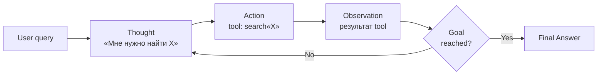
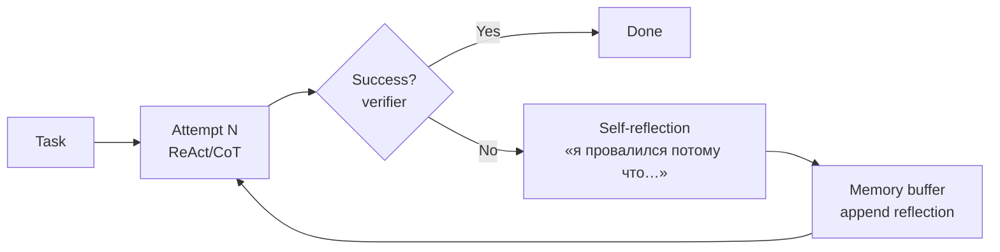
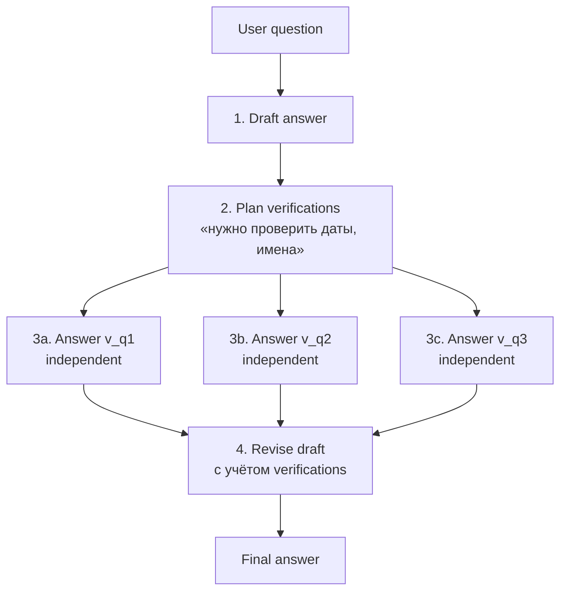
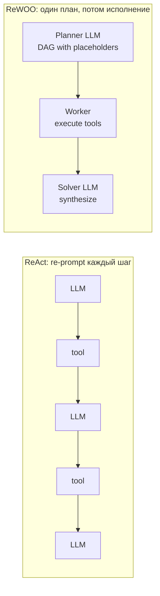
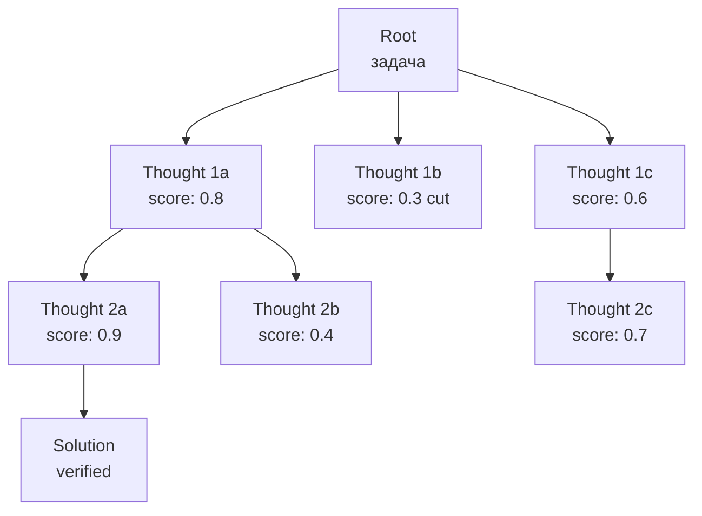

# Вопросы на собеседовании: `Agentic Design Patterns`

**Agentic pattern** — структурированный способ организации LLM-driven workflow с чередованием **reasoning** и **acting**. Это не одна модель и не один промпт, а **протокол управления** ходом выполнения: как агент думает, когда дергает tool, как обрабатывает ошибку, когда останавливается.

К 2026 индустрия выработала набор канонических паттернов: `ReAct`, `Reflexion`, `Plan-and-Execute`, `Tree-of-Thoughts`, `Self-Refine`, `Chain-of-Verification`, `ReWOO`, `Self-Consistency`, `Best-of-N`, `Voyager`. Реальные agent-системы редко используют один паттерн в чистом виде — комбинируют (`ReAct + Reflexion`, `Plan-Execute + Self-Critique`). На интервью спрашивают: чем отличаются, когда какой брать, как сочетаются с reasoning models (o1/R1), где anti-patterns.

## Полезные ссылки

### Original papers и авторитетные источники

- [ReAct: Synergizing Reasoning and Acting in Language Models (Yao et al. 2022)](https://arxiv.org/abs/2210.03629) — базовый Thought→Action→Observation loop
- [Reflexion: Language Agents with Verbal Reinforcement Learning (Shinn et al. 2023)](https://arxiv.org/abs/2303.11366) — self-reflection без gradient updates
- [Tree of Thoughts (Yao et al. 2023)](https://arxiv.org/abs/2305.10601) — branching reasoning + evaluation
- [Self-Refine (Madaan et al. 2023)](https://arxiv.org/abs/2303.17651) — generate → critique → refine
- [Chain-of-Verification (Dhuliawala et al. 2023)](https://arxiv.org/abs/2309.11495) — снижение hallucinations через verification questions
- [ReWOO (Xu et al. 2023)](https://arxiv.org/abs/2305.18323) — Plan/Worker/Solver без перепрогона LLM на каждом observation
- [Plan-and-Solve Prompting (Wang et al. 2023)](https://arxiv.org/abs/2305.04091) — planner + executor
- [Self-Consistency (Wang et al. 2022)](https://arxiv.org/abs/2203.11171) — majority vote по N CoT
- [Voyager (Wang et al. 2023)](https://voyager.minedojo.org/) — skill library + curriculum
- [Generative Agents (Park et al. 2023)](https://arxiv.org/abs/2304.03442) — memory stream + reflection
- [Toolformer (Schick et al. 2023)](https://arxiv.org/abs/2302.04761) — self-supervised tool use
- [Anthropic: Building Effective Agents](https://www.anthropic.com/research/building-effective-agents) — практические patterns от Anthropic

## Содержание

- [Полезные ссылки](#полезные-ссылки)
- [See also](#see-also)

**Основы**
- [Q1. (!) Что такое agentic pattern и чем он отличается от prompt-техники?](#q1--что-такое-agentic-pattern-и-чем-он-отличается-от-prompt-техники)
- [Q2. Как классифицируют agentic patterns?](#q2-как-классифицируют-agentic-patterns)
- [Q3. (!) Почему вообще нужны patterns, если есть reasoning model (o1, R1)?](#q3--почему-вообще-нужны-patterns-если-есть-reasoning-model-o1-r1)

**Базовые паттерны (ReAct / CoT / Self-Consistency)**
- [Q4. (!) Что такое ReAct и как выглядит его loop?](#q4--что-такое-react-и-как-выглядит-его-loop)
- [Q5. (!) Покажи pseudo-code ReAct-агента](#q5--покажи-pseudo-code-react-агента)
- [Q6. Что такое Self-Consistency и когда работает?](#q6-что-такое-self-consistency-и-когда-работает)
- [Q7. Auto-CoT vs Manual CoT — в чём разница?](#q7-auto-cot-vs-manual-cot--в-чём-разница)

**Reflection-based (Reflexion / Self-Critique / CoVe)**
- [Q8. (!) Что такое Reflexion и чем отличается от обычного retry?](#q8--что-такое-reflexion-и-чем-отличается-от-обычного-retry)
- [Q9. Self-Refine / Self-Critique — pattern и pseudo-code](#q9-self-refine--self-critique--pattern-и-pseudo-code)
- [Q10. (!) Chain-of-Verification (CoVe) — как снижает hallucinations?](#q10--chain-of-verification-cove--как-снижает-hallucinations)
- [Q11. Чем self-critique без external feedback опасен?](#q11-чем-self-critique-без-external-feedback-опасен)

**Plan-based (Plan-Execute / ReWOO)**
- [Q12. (!) Plan-and-Execute pattern — структура и use case](#q12--plan-and-execute-pattern--структура-и-use-case)
- [Q13. (!) Что такое ReWOO и чем выигрывает у ReAct?](#q13--что-такое-rewoo-и-чем-выигрывает-у-react)
- [Q14. Когда re-planning важнее изначального плана?](#q14-когда-re-planning-важнее-изначального-плана)

**Tree-based (ToT / Best-of-N)**
- [Q15. (!) Tree-of-Thoughts — структура дерева и evaluation](#q15--tree-of-thoughts--структура-дерева-и-evaluation)
- [Q16. BFS vs DFS в ToT — когда что?](#q16-bfs-vs-dfs-в-tot--когда-что)
- [Q17. Best-of-N sampling: pattern и trade-off с verifier](#q17-best-of-n-sampling-pattern-и-trade-off-с-verifier)

**Memory patterns (Voyager / Generative Agents)**
- [Q18. (!) Voyager pattern: skill library, curriculum, iterative prompting](#q18--voyager-pattern-skill-library-curriculum-iterative-prompting)
- [Q19. Generative Agents (Stanford-style): memory stream + reflection](#q19-generative-agents-stanford-style-memory-stream--reflection)
- [Q20. OODA Loop (Observe-Orient-Decide-Act) — как адаптируется к LLM-агентам?](#q20-ooda-loop-observe-orient-decide-act--как-адаптируется-к-llm-агентам)
- [Q21. Toolformer-подход: учим модель вызывать API через self-supervision](#q21-toolformer-подход-учим-модель-вызывать-api-через-self-supervision)

**Composition и stopping**
- [Q22. (!) Композиция паттернов: ReAct + Reflexion, Plan-Execute + Self-Critique](#q22--композиция-паттернов-react--reflexion-plan-execute--self-critique)
- [Q23. (!) Stopping conditions: как агент решает, что закончить?](#q23--stopping-conditions-как-агент-решает-что-закончить)
- [Q24. Implementation: LangChain / LlamaIndex / Vercel AI SDK — где какой pattern из коробки?](#q24-implementation-langchain--llamaindex--vercel-ai-sdk--где-какой-pattern-из-коробки)

**Anti-patterns и evaluation**
- [Q25. (!) Anti-patterns: pattern без необходимости, recursive без bound, context bloat](#q25--anti-patterns-pattern-без-необходимости-recursive-без-bound-context-bloat)
- [Q26. Сравнительная таблица паттернов: complexity, latency, use case](#q26-сравнительная-таблица-паттернов-complexity-latency-use-case)
- [Q27. Какой pattern когда выбирать: ReAct / Reflexion / ToT / Self-Critique / CoVe](#q27-какой-pattern-когда-выбирать-react--reflexion--tot--self-critique--cove)
- [Q28. (!) Evaluation patterns: harness, метрики (success rate, # steps, tokens)](#q28--evaluation-patterns-harness-метрики-success-rate--steps-tokens)
- [Q29. Reasoning models делают patterns внутри — нужны ли они снаружи?](#q29-reasoning-models-делают-patterns-внутри--нужны-ли-они-снаружи)
- [Q30. Какие паттерны хорошо переносятся на multi-agent системы?](#q30-какие-паттерны-хорошо-переносятся-на-multi-agent-системы)

## Q1. (!) Что такое agentic pattern и чем он отличается от prompt-техники?

**Agentic pattern** — структурированный **протокол управления** LLM-driven workflow, в котором чередуются **reasoning** (модель думает) и **acting** (модель выполняет действие — вызов tool, запрос к памяти, генерация sub-task). Pattern определяет: кто принимает решения, в каком порядке, по каким условиям повторяется цикл, когда останавливается.

**Prompt technique** (CoT, few-shot, role-playing) — статичное содержимое одного промпта. Один запрос — один ответ. Не управляет ходом выполнения.

| Свойство | Prompt technique | Agentic pattern |
|----------|------------------|-----------------|
| Сколько LLM-вызовов | 1 | N (loop / tree / graph) |
| Управление потоком | Нет | Да (planner / evaluator / stopping) |
| Tool use | Опционально, single-shot | Обычно центральная часть |
| State между вызовами | Нет | Memory, history, scratchpad |
| Примеры | `Let's think step by step`, few-shot, system prompt | `ReAct`, `Reflexion`, `Plan-Execute`, `ToT` |

**Граница размытая:** `Chain-of-Thought` — prompt technique, но если поверх него навесить `Self-Consistency` (N сэмплов + majority vote) — это уже pattern.

**Аналогия:** prompt technique — это **формулировка вопроса**, pattern — это **процедура исследования** (как студент строит работу: один черновик vs план→эксперимент→ревизия).

## Q2. Как классифицируют agentic patterns?

Удобная классификация по доминирующему механизму:

1. **Reasoning-action loops** — `ReAct`, `OODA`. Базовое чередование думаю-действую.
2. **Reflection-based** — `Reflexion`, `Self-Refine`, `Chain-of-Verification`. Агент критикует свой вывод.
3. **Plan-based** — `Plan-and-Execute`, `ReWOO`. Сначала план, потом исполнение.
4. **Search/tree-based** — `Tree-of-Thoughts`, `Best-of-N`, `Self-Consistency`. Несколько ветвей, выбор лучшей.
5. **Memory-based** — `Voyager`, `Generative Agents`. Долговременная память, накопление навыков.
6. **Multi-agent** — `Debate`, `Society-of-Mind` (в отдельной шпаргалке про orchestration).

Эти классы **не взаимоисключающие**: production-агенты комбинируют (например, `Plan-Execute + ReAct в executor + Self-Critique перед финалом`).

## Q3. (!) Почему вообще нужны patterns, если есть reasoning model (o1, R1)?

Reasoning model встроила в себя **CoT** и частично **self-critique** (модель сама думает «wait, let me check») — это убрало необходимость в нескольких patterns. Но **большинство agentic паттернов остались актуальны**.

**Что reasoning model заменила:**
- `Chain-of-Thought` prompting — встроено в обучение.
- Простой `Self-Refine` — модель сама перепроверяет внутри thinking-block.
- `Self-Consistency` (частично) — internal verification снижает нужду в majority vote.

**Что reasoning model НЕ заменила:**
- **Tool use** — `ReAct`/`ReWOO` нужны для работы с внешним миром (API, БД, файлы). Reasoning model не умеет дёргать tool изнутри thinking-блока.
- **Multi-step planning с external state** — `Plan-Execute` для задач, где между шагами меняется реальность.
- **External verification** — `CoVe` с реальной проверкой фактов (web search, БД) — модель сама себя не поймает на hallucination.
- **Long-horizon memory** — `Voyager`/`Generative Agents` для накопления знаний между сессиями.
- **Cost optimization** — reasoning model дороже в 5-10×; на простых шагах лучше дёшевая модель + явный pattern.

**Практика:** o1/R1 + ReAct + tools — нормальная комбинация. Reasoning «думает», pattern «действует».

## Q4. (!) Что такое ReAct и как выглядит его loop?

**ReAct** (Reasoning + Acting, Yao et al. 2022) — самый базовый agentic pattern. Цикл из трёх шагов:

1. **Thought** — модель пишет, что собирается делать и почему.
2. **Action** — модель вызывает tool (search, calculator, API).
3. **Observation** — система кладёт результат tool обратно в контекст.

Повтор до тех пор, пока модель не выдаст `Final Answer`.



**Пример trace (ReAct на question answering):**
```
Question: Сколько лет назад родился автор Reflexion paper?
Thought: Мне нужно узнать год рождения первого автора (Shinn).
Action: search["Noah Shinn researcher birth year"]
Observation: Noah Shinn, born 1998
Thought: Сейчас 2026, 2026 - 1998 = 28.
Final Answer: 28 лет.
```

**Зачем `Thought`:** прозрачность (видно мотивацию), better tool selection (LLM меньше галлюцинирует tool/args, когда сначала проговаривает план).

**Минусы:**
- На каждом шаге — полный re-prompt с историей → токены растут квадратично.
- Если tool падает с ошибкой, модель видит её только на следующей итерации.
- Без бюджета может зациклиться.

## Q5. (!) Покажи pseudo-code ReAct-агента

```python
def react_agent(query, tools, max_steps=10):
    history = [{"role": "user", "content": query}]
    for step in range(max_steps):
        # 1. LLM генерирует Thought + Action (или Final Answer)
        response = llm.complete(
            system=REACT_SYSTEM_PROMPT,  # описание tools, формат
            messages=history,
        )
        history.append({"role": "assistant", "content": response})

        # 2. Парсим ответ
        if "Final Answer:" in response:
            return extract_final_answer(response)

        action_name, action_args = parse_action(response)

        # 3. Выполняем tool
        try:
            observation = tools[action_name](**action_args)
        except Exception as e:
            observation = f"Error: {e}"

        # 4. Кладём observation обратно
        history.append({
            "role": "user",
            "content": f"Observation: {observation}",
        })

    raise StopIteration("max steps reached")
```

**Ключевые места:**
- `parse_action` — хрупкое место «классического» ReAct (regex по тексту). В современных API используют **function calling** / **tool use** — модель сразу возвращает структурированный JSON `{name, args}`, парсить регулярками не нужно.
- `max_steps` — обязательный bound (иначе бесконечный цикл).
- Ошибки tool отдаём модели как `Observation`, она сама решит — retry или сменить подход.

В `LangChain` это `create_react_agent` / `AgentExecutor`; в `LlamaIndex` — `ReActAgent`; в Vercel AI SDK — `streamText({ tools, maxSteps })` (автоматически делает loop под капотом).

## Q6. Что такое Self-Consistency и когда работает?

**Self-Consistency** (Wang et al. 2022) — простейший pattern для CoT-задач с детерминированным ответом:

1. Сгенерировать `N` независимых CoT-цепочек при `temperature > 0`.
2. Извлечь финальный ответ из каждой.
3. Взять **majority vote** (для категориальных) или **median** (для численных).

```python
def self_consistency(question, n=20, temperature=0.7):
    answers = []
    for _ in range(n):
        cot = llm.complete(question, temperature=temperature)
        answers.append(extract_answer(cot))
    return Counter(answers).most_common(1)[0][0]
```

**Когда работает:**
- Ответ — короткая величина (число, выбор из списка).
- Reasoning возможен по нескольким путям → правильный путь чаще приходит к верному ответу, ошибочные «расходятся».

**Когда не работает:**
- Open-ended генерация (нет «равенства» между ответами).
- Систематическая ошибка модели — majority будет уверенно неправильным.
- Дорого: N×latency и N×tokens.

**Связь с reasoning models:** o1/R1 встроили похожую идею в обучение (модель внутри пробует несколько ветвей и выбирает лучшую) — внешний Self-Consistency поверх o1 даёт меньший прирост, чем поверх gpt-4o.

## Q7. Auto-CoT vs Manual CoT — в чём разница?

Оба про **few-shot CoT prompting** (показываем модели примеры рассуждений), различаются способом подбора примеров.

**Manual CoT** — человек руками пишет 8-10 экземпляров `Question + Reasoning + Answer` под конкретный домен. Качество высокое, но не масштабируется на разнородные задачи.

**Auto-CoT** (Zhang et al. 2022):
1. Берём пул вопросов из задачи.
2. Получаем embedding каждого, кластеризуем (K-means).
3. Из каждого кластера выбираем вопрос-репрезентант.
4. Для каждого репрезентанта генерируем CoT (`Let's think step by step`) — это и есть exemplars.
5. Используем как few-shot для нового вопроса.

**Плюсы Auto-CoT:** покрывает разнообразие задач без ручной работы.
**Минусы:** сгенерированные exemplars могут содержать ошибки в reasoning → распространяются на target task.

В 2026 практическое значение у обоих снизилось: instruction-tuned модели хорошо справляются с zero-shot CoT, а reasoning models делают CoT нативно.

## Q8. (!) Что такое Reflexion и чем отличается от обычного retry?

**Reflexion** (Shinn et al. 2023) — pattern, в котором агент после **неудачной попытки** генерирует **verbal self-reflection** («что я сделал не так и что попробовать в следующий раз»), сохраняет её в **memory buffer** и использует в следующей попытке как часть промпта.

Это форма **verbal reinforcement learning** — обучение без gradient updates, через текстовые «уроки» в контексте.



**Чем отличается от обычного retry:**
| Свойство | Plain retry | Reflexion |
|----------|-------------|-----------|
| Что передаётся между попытками | Ничего | Verbal reflection (текст) |
| Учится на ошибках | Нет | Да, в контексте |
| Нужен verifier | Опционально | Обязателен (бинарный сигнал) |
| Стоимость | 1×attempt | (attempt + reflection) × N |

**Результаты paper:** Reflexion поднял HumanEval с 80% (GPT-4 baseline) до 91%, AlfWorld — с 75% до 97%.

**Требования:**
- Бинарный/градуированный verifier (тесты для кода, симулятор для embodied).
- Достаточный context window под историю reflections.
- Bound на число попыток.

## Q9. Self-Refine / Self-Critique — pattern и pseudo-code

**Self-Refine** (Madaan et al. 2023) — generate → critique → refine **внутри одной задачи** (без явного «провала», в отличие от Reflexion). Используется в writing/coding/summarization.

```python
def self_refine(task, max_iters=3):
    output = llm.complete(f"Solve: {task}")
    for i in range(max_iters):
        critique = llm.complete(
            f"Task: {task}\nDraft: {output}\n"
            "Find issues in this draft. If perfect, reply 'OK'."
        )
        if critique.strip().startswith("OK"):
            break
        output = llm.complete(
            f"Task: {task}\nDraft: {output}\nCritique: {critique}\n"
            "Produce improved version."
        )
    return output
```

**Где работает хорошо:**
- Coding (модель находит свои bugs).
- Long-form writing (стиль, структура).
- Summarization (что упустили).

**Где не работает:**
- Factual QA — модель не знает фактов и не обнаружит галлюцинацию.
- Math — без verifier модель часто «утверждает» неверный ответ как верный.

**Отличие от Reflexion:**
- Self-Refine **не нужен external verifier** (модель сама критик).
- Reflexion имеет **бинарный signal успеха** и аккумулирует уроки **между задачами**.

## Q10. (!) Chain-of-Verification (CoVe) — как снижает hallucinations?

**Chain-of-Verification** (Dhuliawala et al. 2023, Meta) — 4-шаговый pattern для **fact-heavy ответов**:

1. **Draft answer** — модель пишет первичный ответ.
2. **Plan verifications** — модель формулирует список verification-вопросов (что нужно проверить).
3. **Answer verifications independently** — отвечаем на каждый verification-вопрос **в отдельном контексте** (без draft, чтобы не bias-ить).
4. **Revise** — модель пересматривает draft с учётом verification answers.



**Почему помогает:**
- Изолированные verification — модель не «защищает» свой draft.
- Конкретные factoid-вопросы меньше галлюцинируют, чем длинный narrative.

**Пример:**
- Draft: «Эйнштейн родился в 1880, лауреат Нобеля 1922 за теорию относительности».
- Verification q1: «Когда родился Эйнштейн?» → 1879.
- Verification q2: «За что Эйнштейн получил Нобелевку?» → за фотоэффект, не за относительность.
- Revised: «Эйнштейн родился в 1879, Нобелевка 1921 за фотоэффект».

**Стоимость:** N+2 LLM-вызовов вместо одного. Стоит для high-stakes ответов; для chat — overkill.

## Q11. Чем self-critique без external feedback опасен?

Self-Refine/Self-Critique без внешнего verifier имеет известные проблемы:

1. **Sycophancy / confirmation bias** — модель часто «соглашается» со своим черновиком, особенно если он длинный и уверенный. Критика становится формальной.
2. **Hallucinated issues** — модель может «найти проблему», которой нет, и испортить корректный ответ.
3. **No factual grounding** — модель не знает истинных фактов, поэтому не поймает фактическую ошибку.
4. **Drift** — после нескольких итераций тон/структура могут уплыть, ответ перестаёт отвечать на исходный вопрос.
5. **False confidence** — после self-refine модель более уверена в ответе, даже если он не стал лучше.

**Митигации:**
- Бинарный signal вместо free-form critique (passes test? yes/no).
- External verifier (тесты для кода, search для фактов, calculator для math).
- Cap на iterations (3-5).
- Diff-проверка: если новая версия = старой в N итерациях — stop.
- Использовать **разные модели** для generator и critic (judge может быть слабее, но независимым).

**Эмпирика:** для математики чистый self-critique без verifier часто **ухудшает** результат (Huang et al. 2023, "Large Language Models Cannot Self-Correct Reasoning Yet").

## Q12. (!) Plan-and-Execute pattern — структура и use case

**Plan-and-Execute** (Wang et al. 2023, "Plan-and-Solve"; LangChain `PlanAndExecute`) разделяет роли:

1. **Planner** — сильная модель строит **high-level план** (упорядоченный список шагов) один раз.
2. **Executor** — модель (обычно дешевле) выполняет каждый шаг последовательно (часто как мини-ReAct).
3. **Re-planner** — если на каком-то шаге наблюдается отклонение, planner пересматривает план.

```python
def plan_and_execute(task, planner_llm, executor_llm, max_replans=2):
    plan = planner_llm.complete(f"Break into steps: {task}")  # ["step1", "step2", ...]
    results = []
    for i, step in enumerate(plan):
        result = executor_llm.run_react(step, history=results)
        results.append((step, result))
        if needs_replan(result):
            plan = planner_llm.replan(task, plan, results)
            # дальше идём по новому плану
    return synthesize(task, results)
```

**Use case:**
- Multi-step research («собери информацию о компании X: финансы, продукт, команда»).
- Code refactoring («разбей класс на 3, добавь тесты, обнови doc»).
- Долгие workflow с понятной структурой.

**Vs ReAct:**
| Свойство | ReAct | Plan-Execute |
|----------|-------|--------------|
| Сколько раз думаем | Каждый шаг | План — раз, потом мини-think на шаг |
| Lookahead | 1 шаг | Весь план сразу |
| Стоимость think | High (полная история) | Concentrated в planner |
| Адаптивность | Высокая | Средняя (re-plan) |
| Когда лучше | Exploratory | Известная структура задачи |

## Q13. (!) Что такое ReWOO и чем выигрывает у ReAct?

**ReWOO** (Reasoning WithOut Observation, Xu et al. 2023) — pattern из трёх ролей:

1. **Planner** — строит **DAG плана** со всеми tool calls **upfront**. Места, куда подставятся результаты, помечает placeholders (`#E1`, `#E2`).
2. **Worker** — параллельно/последовательно выполняет tool calls (LLM **не вызывается** на этом шаге, просто запуск инструментов).
3. **Solver** — принимает изначальный вопрос + все evidence и синтезирует финальный ответ.



**Пример plan:**
```
Plan:
  E1 = search("CEO of Anthropic")
  E2 = search("founding year of Anthropic")
  E3 = calculator("2026 - " + E2)
Solver: «CEO #E1, компании #E3 лет»
```

**Преимущества vs ReAct:**
- **Меньше токенов** — LLM не видит весь growing history на каждом шаге.
- **Параллелизуемые tool calls** — DAG позволяет выполнять независимые tool одновременно.
- **Дешевле** — paper заявляет 5-10× снижение токенов на типичных HotpotQA задачах.

**Минусы:**
- Plan жёсткий — если observation противоречит ожиданию planner, нужен fallback (re-plan).
- Не подходит для задач, где следующее действие **зависит от наблюдения** (exploratory).

## Q14. Когда re-planning важнее изначального плана?

Re-planning критичен, если **реальность отличается от модели planner**. Сигналы, что пора re-plan:

- Tool вернул error / empty / inconsistent с ожиданием.
- Появились новые факты, меняющие приоритет шагов.
- Бюджет шагов исчерпан, цели нет.
- User intervened с уточнением.
- Predicate goal-check провалился после ожидаемого завершения.

**Implementation pattern:**
```python
for step in plan:
    result = executor.run(step)
    if is_anomaly(result, expected=step.expected):
        plan = planner.replan(original_task, history, anomaly=result)
        continue
```

**Где re-plan важнее изначального плана:**
- Web automation (страница изменилась).
- Long-horizon embodied agents (Voyager — план превращается в curriculum).
- Research-задачи с неизвестным размером (нашёл новую информацию → меняешь подход).

**Где можно жить без re-plan:** структурированные workflow (ETL-like), где входные данные известны.

## Q15. (!) Tree-of-Thoughts — структура дерева и evaluation

**Tree-of-Thoughts** (Yao et al. 2023) — обобщение CoT на дерево: каждое состояние — частичное рассуждение, ветви — альтернативные продолжения.

Шаги:
1. **Thought decomposition** — определяем гранулярность шага (одна мысль = одна строка / одно равенство / один ход в игре).
2. **Thought generator** — LLM предлагает `k` вариантов следующей мысли из текущего состояния.
3. **State evaluator** — LLM (как judge) оценивает каждое состояние: `sure / likely / impossible` или числовой score.
4. **Search** — BFS / DFS / beam-search по дереву; cut-off веток с низким score.



**Pseudo-code (BFS):**
```python
def tot_bfs(task, k_per_step=3, beam=2, depth=5):
    frontier = [State(task=task, path=[])]
    for _ in range(depth):
        candidates = []
        for s in frontier:
            for thought in llm.generate_thoughts(s, k=k_per_step):
                ns = s.extend(thought)
                ns.score = llm.evaluate(ns)
                if ns.is_solution():
                    return ns
                candidates.append(ns)
        frontier = sorted(candidates, key=lambda x: -x.score)[:beam]
    return max(frontier, key=lambda x: x.score)
```

**Использование:**
- Game-of-24 (paper) — GPT-4 CoT: 4%, ToT: 74%.
- Crosswords, мини-puzzles.
- Step-by-step planning, где можно «откатиться».

**Стоимость:** взрывной рост вызовов (k^depth в худшем). На практике используют для маленьких задач или с агрессивным pruning.

## Q16. BFS vs DFS в ToT — когда что?

**BFS (breadth-first):**
- На каждом уровне расширяем все кандидаты, сортируем по score, оставляем top-`beam`.
- Хорош когда: оптимальное решение **короткое**, scoring надёжен.
- Лучше для **game-like** задач с фиксированной глубиной.

**DFS (depth-first):**
- Идём в самую перспективную ветку до конца, при failure backtrack.
- Хорош когда: глубина решения неизвестна, мало памяти.
- Лучше для **path-finding** в reasoning.

**Beam search** — компромисс: ограниченный размер frontier (как BFS, но с лимитом).

**Практика:** в LLM-агентах чаще используют **beam-search с маленьким beam (2-4)** — баланс между exploration и стоимостью токенов.

## Q17. Best-of-N sampling: pattern и trade-off с verifier

**Best-of-N** — генерируем `N` независимых completions, **verifier** (отдельная модель или функция) выбирает лучшее.

```python
def best_of_n(task, n=10, verifier=None):
    candidates = [llm.complete(task, temperature=0.7) for _ in range(n)]
    if verifier:
        return max(candidates, key=verifier)
    # fallback — LLM как judge
    return llm_judge(task, candidates)
```

**Trade-off:**
- N× стоимость генерации.
- Качество verifier — потолок: плохой verifier даёт случайный выбор.
- Diminishing returns: 1 → 4 даёт большой прирост, 4 → 64 — маленький.

**Где работает:**
- Code generation + unit-tests как verifier.
- Math + symbolic verifier.
- RLHF data labeling (reward model выбирает лучший response).

**Vs Self-Consistency:** Best-of-N использует **verifier** (внешнее знание, что хорошо); Self-Consistency — **agreement** (большинство голосует за ответ).

**Vs ToT:** Best-of-N — independent samples (нет shared state); ToT — incremental с pruning.

## Q18. (!) Voyager pattern: skill library, curriculum, iterative prompting

**Voyager** (Wang et al. 2023, NVIDIA) — long-horizon embodied agent для Minecraft. Три компонента:

1. **Skill library** — растущая база **исполняемого кода** (JavaScript Mineflayer API). Каждый skill — функция с docstring (`mine_diamond()`, `craft_iron_pickaxe()`). При новой задаче агент:
   - retrieves relevant skills (vector search по docstring),
   - composes их в новый код.
2. **Automatic curriculum** — отдельный LLM-prompt предлагает **следующую достижимую цель** по принципу «exploration novelty + проверка предпосылок». Прогресс не задан hardcoded, а самораскрывается.
3. **Iterative prompting** — генерация кода → запуск в среде → ошибки/feedback (game logs) → правка → повтор. Похоже на ReAct, но действиями являются **программы**, а не одиночные tool-вызовы.

**Что унесли в production-агенты:**
- **Skill library** = library of approved tool macros / saved procedures (используется в банковских/девопс ботах).
- **Curriculum** для self-improving агентов / synthetic data generation.
- **Code as action** — Code Agents (e.g. SmolAgents, HuggingFace) реализуют ровно эту идею: LLM пишет Python, выполняется в sandbox, вместо tool-by-tool calls.

## Q19. Generative Agents (Stanford-style): memory stream + reflection

**Generative Agents** (Park et al. 2023) — симулякры человеческого поведения (Smallville). Компоненты:

1. **Memory stream** — append-only лог наблюдений с timestamp и importance score.
2. **Retrieval** — при действии скоринг памятей по `recency × importance × relevance` (last term — embedding similarity к текущему контексту).
3. **Reflection** — периодически (когда накопилось много important events) агент генерирует **higher-level insights** («Klaus интересуется urban gentrification → ему лучше предложить тему диссертации»).
4. **Planning** — иерархический план дня → почасовой → детальный, может перепланироваться по событиям.

**Что унесли в production:**
- **Reflection** как способ сжать длинную history в abstract insights — переиспользуется в **mem0**, **MemGPT**, Anthropic **memory** (2025).
- **Importance scoring** для отбора в long-term память.
- **Hierarchical planning** для долгих agent-сессий.

**Не унесли:** социальную симуляцию (она нужна для исследований, не для tasks).

## Q20. OODA Loop (Observe-Orient-Decide-Act) — как адаптируется к LLM-агентам?

**OODA** — фреймворк военного теоретика John Boyd для принятия решений в неопределённости:
1. **Observe** — собрать данные о ситуации.
2. **Orient** — интерпретировать в свете знаний/контекста (самый ёмкий шаг).
3. **Decide** — выбрать курс действий.
4. **Act** — выполнить.
5. → Observe (цикл).

**Применение к LLM-агентам:**
- Observe = чтение state (logs, sensors, tool outputs).
- Orient = LLM reasoning + retrieval из памяти/RAG.
- Decide = выбор tool/action.
- Act = вызов tool.

По сути это **обобщение ReAct** с явным разделением «интерпретации» (Orient) и «выбора» (Decide). Полезно как **mental model** при дизайне long-running агентов (monitoring/incident response), где нужно явно проектировать каждый шаг (что наблюдаем, как интерпретируем, как решаем).

**Практика:** в чистом виде «OODA-агента» в LangChain нет — это скорее **архитектурный шаблон** для дизайна. Полезен на whiteboard, не в коде.

## Q21. Toolformer-подход: учим модель вызывать API через self-supervision

**Toolformer** (Schick et al. 2023, Meta) — pattern не runtime, а **training-time**. Идея: вместо того чтобы делать prompt engineering для tool use, **обучаем модель** вставлять API-вызовы в текст.

Pipeline:
1. Берём корпус.
2. Для каждого текста ASR-style вставляем кандидаты `[API call]` в потенциально полезные места.
3. Запускаем API, получаем результат.
4. Оставляем только те вставки, которые **снижают perplexity** последующего текста (т.е. вызов реально помог).
5. Fine-tune модель на этом «обогащённом» корпусе.

**Результат:** маленькая GPT-J учится использовать calculator, calendar, search, QA system. Outperforms GPT-3 на bench-ах, где tools полезны.

**Связь с современностью:**
- Концепция «модель сама знает, когда дёргать tool» теперь стандартная (function calling в GPT-4, Claude, Gemini обучены так же).
- **Tool tokens** (`<tool_call>...</tool_call>`) — прямое наследие Toolformer.
- Pattern важен для понимания: tool use — это не только prompt, но и pre/post-training сигнал.

## Q22. (!) Композиция паттернов: ReAct + Reflexion, Plan-Execute + Self-Critique

Реальные production-агенты редко используют один pattern. Типичные комбинации:

**ReAct + Reflexion**
- Внутри попытки — ReAct loop.
- На уровне попыток — Reflexion (verifier + memory of reflections).
- Use case: coding agent с тестами (SWE-bench пайплайны).

**Plan-Execute + ReAct (в executor)**
- Planner строит шаги.
- Каждый шаг исполняет ReAct-агент с tools.
- Use case: research-агент (план «Найди A, потом B, потом сравни», каждый под-шаг — поиск + чтение).

**Plan-Execute + Self-Critique**
- После execute — критическая ревизия плана/результата перед финализацией.
- Use case: long-form report generation.

**ToT + Self-Consistency**
- На листьях дерева — несколько samples, majority vote.
- Use case: math с множественными возможными подходами.

**ReWOO + CoVe**
- ReWOO даёт план + evidence.
- CoVe на финальном synthesizer-шаге проверяет факты.
- Use case: fact-heavy answer generation.

**Voyager + ReAct**
- Voyager на верхнем уровне (curriculum + skill library).
- Внутри skill — ReAct для исполнения шагов.

**Принцип:** разные patterns решают разные классы задач (control flow vs verification vs memory) — комбинируйте по слоям, не по альтернативам.

## Q23. (!) Stopping conditions: как агент решает, что закончить?

Stopping conditions — критический элемент любого agentic pattern. Без них агент **зацикливается** или **бесконечно платит** за токены.

Типы условий:

1. **Max iterations** — самый базовый, ОБЯЗАТЕЛЬНЫЙ. `max_steps=10/20/50` в зависимости от задачи.
2. **Final answer marker** — модель явно выдаёт `FINAL_ANSWER` / финальный JSON / вызов `submit_answer` tool.
3. **Verifier passes** — для Reflexion/Best-of-N: внешняя проверка (тесты, predicate).
4. **Goal predicate** — функция от state: `len(results) >= n`, `target_url_visited`, `payment_completed`.
5. **Token budget** — кумулятивный лимит tokens (защита от growing context).
6. **Time budget** — wall clock (особенно для tool-heavy агентов с медленными API).
7. **No progress** — если N последних шагов не меняют state / повторяют действия — stop.
8. **User confirmation** — human-in-the-loop: агент сам спрашивает «продолжать?».
9. **Cost cap** — $-budget; в production важнее token cap.

**Anti-pattern:** stopping только по `max_iterations`. Это не stopping, это **timeout**. Должен быть хотя бы один **успешный** критерий + timeout как safety net.

**Implementation tip:** wrap агент в `AgentExecutor`, который держит **все** stopping conditions централизованно и пишет в лог, какое сработало.

## Q24. Implementation: LangChain / LlamaIndex / Vercel AI SDK — где какой pattern из коробки?

| Framework | ReAct | Plan-Execute | Reflexion | ToT | Self-Consistency |
|-----------|-------|--------------|-----------|-----|------------------|
| **LangChain (Python)** | `create_react_agent`, `AgentExecutor` | `PlanAndExecute` (deprecated в LangGraph), сейчас через LangGraph | через LangGraph state | не из коробки | через `RunnableParallel` + voter |
| **LangGraph** | низкоуровневые узлы, есть `create_react_agent` | composable graph (любой план) | state с reflections | можно построить вручную | parallel branches |
| **LlamaIndex** | `ReActAgent` | `StructuredPlannerAgent` | нет нативного | нет | нет |
| **Vercel AI SDK** | `streamText({ tools, maxSteps })` — manual loop | вручную | вручную | вручную | вручную |
| **Anthropic SDK (raw)** | примеры в Anthropic Cookbook | вручную | вручную | вручную | вручную |
| **CrewAI** | role-based, ReAct под капотом | через task planning | нет | нет | нет |
| **AutoGen** | conversation-driven, не строго ReAct | через GroupChat | через CritiquerAgent | нет | нет |

**Современный тренд (2026):** **LangGraph** стал стандартом для нетривиальных patterns — он даёт `nodes + edges + state`, поверх которого описывается любой pattern. ReAct-обёртки во всех фреймворках выглядят похоже; различия проявляются в более сложных композициях (re-plan, reflection, multi-agent).

**Anti-pattern:** тащить тяжёлый framework для простого ReAct из 3 tools — голый цикл из Q5 + function calling короче и понятнее.

## Q25. (!) Anti-patterns: pattern без необходимости, recursive без bound, context bloat

1. **Pattern без необходимости (over-engineering)**
   - Простой Q&A решается одним промптом — а навешено Plan-Execute + Self-Refine + Verifier.
   - Признак: 10 LLM-вызовов там, где хватило бы одного.
   - Лечение: начинать с baseline (single prompt), добавлять pattern только когда видим конкретную проблему.

2. **Recursive без bound**
   - Self-critique вызывает себя без max_iters → бесконечный цикл.
   - Tool A вызывает агента, который снова вызывает tool A.
   - Лечение: stack-depth check, дедупликация недавних состояний.

3. **Context bloat от reflection / history**
   - Каждый шаг добавляет в prompt — после 30 шагов уже 100k токенов, дорого и качество падает.
   - Лечение: **rolling window** (последние K), **summarization** (сжать историю), **scratchpad** в отдельном tool вместо context.

4. **Verifier weaker than generator**
   - Self-Critique со слабой judge-моделью — отбирает не лучшие варианты, а удобные для critic.
   - Лечение: использовать **другой** провайдер/модель для judge; ground-truth verifier там, где возможен.

5. **Implicit state via history**
   - Состояние «закодировано» в длинном history, никто его явно не моделирует.
   - При обрезке окна теряется ключевой факт.
   - Лечение: explicit state (`AgentState`/`scratchpad`), summary блоки.

6. **Tool name collision / ambiguous schemas**
   - Два tools с похожими описаниями → модель путает.
   - Лечение: чёткие docstring, тесты на disambiguation.

7. **No instrumentation**
   - Не логируется trace шагов → невозможно понять, почему agent зациклился.
   - Лечение: structured tracing (LangSmith, Helicone, custom logs), включить с первого дня.

8. **Reflection «для галочки»**
   - Pattern есть, но reflections игнорируются при retry (баг в коде).
   - Лечение: assertion в тестах, что reflections появляются в следующем prompt.

## Q26. Сравнительная таблица паттернов: complexity, latency, use case

| Pattern | LLM calls | Cost vs baseline | Latency | Нужен verifier | Хорошо для |
|---------|-----------|------------------|---------|----------------|------------|
| `CoT (prompt)` | 1 | 1× | 1× | Нет | Простые reasoning |
| `Self-Consistency` | N | N× | ~1× (parallel) | Нет (agreement) | Численный ответ |
| `ReAct` | k шагов | k× растущий context | k× | Нет (но желателен) | General tool use |
| `Reflexion` | k × R попыток | k×R | k×R | **Да** | Coding, environment-based |
| `Self-Refine` | 2R+1 (gen+critique+refine) | 2-4× | 2-4× | Нет (рискованно) | Writing, coding draft |
| `Chain-of-Verification` | N+2 | 4-6× | sequential | Нет (LLM-self) | Fact-heavy answers |
| `Plan-and-Execute` | 1 plan + k step | 1+k | 1+k | Нет | Структурированные workflow |
| `ReWOO` | 1 plan + 1 solver | ~2× (без re-prompt) | DAG (parallel tools) | Нет | Token-конкурентные tool-heavy задачи |
| `Tree-of-Thoughts` | k^d (с pruning меньше) | high | high | LLM judge | Math/puzzles |
| `Best-of-N` | N | N× | ~1× (parallel) | **Да** | Code with tests, RLHF |
| `Voyager` | растёт со временем | amortized | long-horizon | env feedback | Embodied / continuous learning |
| `Generative Agents` | high (memory + reflection) | high | continuous | нет | Симуляция, persistent agents |

«Baseline» = одиночный CoT prompt без agentic-надстройки.

## Q27. Какой pattern когда выбирать: ReAct / Reflexion / ToT / Self-Critique / CoVe

Краткий decision-guide:

- **`ReAct`** — general-purpose tool use, exploratory задачи. Дефолт для агента «реши задачу X, у тебя есть tools Y».
- **`Reflexion`** — задачи с **верифицируемым результатом** (тесты, симулятор) и где модель **должна учиться на провалах**: coding agents, game-like, RL-like environments.
- **`Plan-and-Execute`** — когда **структура задачи известна** заранее или хочется явный plan для аудита. Долгие workflow с понятными фазами.
- **`ReWOO`** — когда задача состоит из **набора независимых tool calls**, и хочется сэкономить токены / распараллелить. Multi-hop QA, агрегация из нескольких API.
- **`Tree-of-Thoughts`** — задачи с **дискретным reasoning** и возможностью оценить промежуточное состояние: math, puzzles, planning over short horizon.
- **`Best-of-N`** — когда **есть программный verifier** (unit-tests, eval function) и compute не лимит.
- **`Self-Consistency`** — short factual/numeric answers, есть «канонический» ответ для majority vote.
- **`Self-Refine`** — open-ended writing, summarization, draft → polish. Без verifier — осторожно с математикой.
- **`Chain-of-Verification`** — fact-heavy ответы (биография, исторические факты, описание продукта), где hallucination дорого стоит.
- **`Voyager`** — long-horizon agents с накоплением навыков.
- **`Generative Agents`** — persistent agents с долгой памятью и социальной составляющей.

**Композиция:** в продакшене типично 2-3 pattern в стеке. Пример: `Plan-Execute (верх) + ReAct (executor) + CoVe (на финальном synth)`.

## Q28. (!) Evaluation patterns: harness, метрики (success rate, # steps, tokens)

Agentic system **нельзя** оценивать одной метрикой. Минимальный harness:

**Базовые метрики:**
- **Success rate** — % задач, решённых корректно (по ground-truth / verifier).
- **# steps to solution** — среднее/медиана шагов. Меньше — лучше, но не за счёт quality.
- **Tokens per task** — input + output + thinking. Прокси стоимости.
- **Latency (p50/p95)** — wall clock от запроса до финала.
- **Cost per task** — $ при текущих ценах.
- **Tool calls per task** — сколько раз дёрнули внешние API.

**Качественные:**
- **Tool selection accuracy** — % случаев, когда выбран правильный tool.
- **Tool argument accuracy** — корректность аргументов.
- **Hallucination rate** — % ответов с фактами, не подтверждёнными context/tools.
- **Stop-condition triggered** — какое условие сработало (final answer / max_iters / error). Высокая доля `max_iters` — плохой знак.

**Robustness:**
- **Re-run variance** — std success rate при temperature > 0.
- **Adversarial inputs** — поведение на malformed query, prompt injection.
- **Tool failure resilience** — что если tool вернул error / timeout.

**Eval-frameworks:**
- **LangSmith Evaluators** — datasets + LLM-as-judge.
- **OpenAI Evals** — generic harness.
- **AgentBench, SWE-bench, GAIA, WebArena, ALFWorld** — стандартные benchmarks для категорий агентов.
- **PromptFoo** — для regression-тестов prompts/agents.

**Принцип:** строить **regression suite** из ~30-100 задач разной сложности и гонять её на каждое изменение pattern/prompt/model.

## Q29. Reasoning models делают patterns внутри — нужны ли они снаружи?

Reasoning models (o1, o3, R1, Claude extended thinking, Gemini Deep Think) выполняют внутри thinking-блока:
- CoT (по определению).
- Частичный Self-Refine («wait, let me check this»).
- Эмерджентный Backtracking.
- Иногда Tree-search-like exploration.

**Что отпадает снаружи:**
- Self-Consistency на простой математике даёт мало прироста.
- Self-Refine без verifier — почти бесполезен, модель внутри это сделала.
- Manual CoT exemplars — лишний noise.

**Что остаётся актуальным:**
- **Tool use** — reasoning model не вызывает tools внутри thinking; нужен внешний ReAct/ReWOO loop.
- **External verification** — модель не знает реальных фактов, нужен Search/DB/CoVe с реальными запросами.
- **Long-horizon planning с реальным state** — между шагами реальность меняется (web automation, embodied).
- **Cost optimization** — reasoning model дорогая; в production обычно **routing**: простые шаги → cheap model + ReAct, сложные шаги → reasoning model.
- **Multi-agent orchestration** — patterns между агентами (debate, hierarchical) не делаются «внутри» одной модели.
- **Memory / skill libraries** — Voyager-like наследие не уходит.

**Резюме:** reasoning model заменила **prompt-уровневые** patterns; **system-уровневые** (tool use, external state, multi-agent, memory) остались полностью актуальны.

## Q30. Какие паттерны хорошо переносятся на multi-agent системы?

В multi-agent системах (см. шпаргалку про orchestration) роли разделяются по агентам. Какие single-agent patterns естественно переходят:

- **Plan-Execute → Hierarchical multi-agent**: planner-агент + executor-агенты. Manager делегирует таски workers (CrewAI, AutoGen GroupChat manager).
- **ReWOO → DAG-of-agents**: planner строит граф задач, каждая нода — отдельный agent/role. Параллелизация естественна.
- **Self-Refine / Reflexion → Debater + Critic agents**: критик — отдельный агент с другим system-prompt (часто иной моделью). Снимает confirmation bias.
- **Best-of-N → Proposer + Selector agents**: N генераторов, отдельный selector-агент с verifier.
- **Tree-of-Thoughts → Parallel exploration agents**: каждая ветка дерева — отдельный agent run, head-агент агрегирует.
- **Chain-of-Verification → Asker + Verifier agents**: специализированный verifier-agent (другая модель / другой context).
- **Voyager → Specialist library**: вместо skill code — pool of specialist agents (research-agent, code-agent, browse-agent), индексированных по описанию.

**Что НЕ переносится прямолинейно:**
- **Self-Consistency** — теряет суть, если все «голоса» — копии одного агента; для multi-agent имеет смысл, только если агенты **разные** (разные модели, разные prompts).
- **OODA** — это mental model одного решателя, не паттерн распределения.

**Главное усложнение multi-agent:** communication protocol между агентами (message passing, blackboard, debate format) и stopping condition на уровне всей системы. Это уже **orchestration**, а не pattern.

---

## See also

- [AI Agents (общая шпаргалка)](ai-agents-interview.md) — базовые понятия про агентов
- [Multi-Agent Orchestration](multi-agent-orchestration-interview.md) — паттерны взаимодействия между агентами
- [Function Calling](function-calling-interview.md) — tool use, на котором стоят ReAct/ReWOO
- [Reasoning Models](reasoning-models-interview.md) — o1/o3/R1 и как они меняют необходимость patterns
- [Prompt Engineering](prompt-engineering-interview.md) — CoT, few-shot, foundational техники
- [LLM Basics](llm-basics-interview.md) — основы LLM
- [MCP](mcp-interview.md) — Model Context Protocol для tool ecosystem
- [System Design Interview](../system-design/system-design-interview.md) — общий контекст для system-design разговоров
