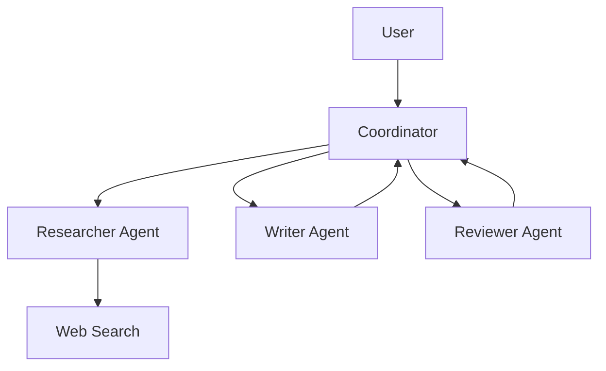

# Вопросы на собеседовании: `AI Agents`

**AI Agent** — LLM, которая умеет **планировать** + **использовать tools** + **наблюдать результаты** + **итерировать** для решения задач. От простого ReAct-цикла до сложных multi-agent-систем. В 2024–2025 — горячая тема. Стандарты: **MCP** (Model Context Protocol). Фреймворки: LangGraph, AutoGen, CrewAI, Anthropic SDK.

## Полезные ссылки

### Официальная документация и авторитетные источники

- [Anthropic: Building Effective Agents](https://www.anthropic.com/research/building-effective-agents)
- [Model Context Protocol (MCP)](https://modelcontextprotocol.io/)
- [LangGraph Documentation](https://langchain-ai.github.io/langgraph/)
- [AutoGen Documentation (Microsoft)](https://microsoft.github.io/autogen/)
- [CrewAI Documentation](https://docs.crewai.com/)
- [ReAct paper](https://arxiv.org/abs/2210.03629)
- [Voyager (long-horizon agent)](https://voyager.minedojo.org/)

## Содержание

- [Полезные ссылки](#полезные-ссылки)
- [See also](#see-also)

**Базовые понятия**
- [Q1. (!) Что такое AI agent?](#q1--что-такое-ai-agent)
- [Q2. (!) Workflows vs Agents — Anthropic классификация?](#q2--workflows-vs-agents--anthropic-классификация)
- [Q3. (!) Когда нужен agent, а когда хватает простого LLM?](#q3--когда-нужен-agent-а-когда-хватает-простого-llm)

**Базовые паттерны**
- [Q4. (!) ReAct (Reasoning + Acting)?](#q4--react-reasoning--acting)
- [Q5. Plan-and-Execute?](#q5-plan-and-execute)
- [Q6. (!) Tool use — function calling?](#q6--tool-use--function-calling)

**Tools**
- [Q7. (!) Какие tools предоставляют agentам?](#q7--какие-tools-предоставляют-agentам)
- [Q8. (!) Code execution as tool?](#q8--code-execution-as-tool)
- [Q9. Web search как tool?](#q9-web-search-как-tool)
- [Q10. (!) Что такое MCP (Model Context Protocol)?](#q10--что-такое-mcp-model-context-protocol)

**Memory**
- [Q11. (!) Short-term vs long-term memory?](#q11--short-term-vs-long-term-memory)
- [Q12. Conversation history truncation?](#q12-conversation-history-truncation)
- [Q13. Vector memory (RAG для memory)?](#q13-vector-memory-rag-для-memory)

**Multi-agent системы**
- [Q14. (!) Что такое multi-agent system?](#q14--что-такое-multi-agent-system)
- [Q15. Supervisor pattern?](#q15-supervisor-pattern)
- [Q16. Hierarchical agents?](#q16-hierarchical-agents)
- [Q17. (!) Agent communication patterns?](#q17--agent-communication-patterns)

**Frameworks**
- [Q18. (!) LangGraph (LangChain)?](#q18--langgraph-langchain)
- [Q19. AutoGen (Microsoft)?](#q19-autogen-microsoft)
- [Q20. CrewAI?](#q20-crewai)
- [Q21. Custom vs framework?](#q21-custom-vs-framework)

**Evaluation**
- [Q22. (!) Как тестировать agents?](#q22--как-тестировать-agents)
- [Q23. Trace evaluation?](#q23-trace-evaluation)

**Production**
- [Q24. (!) Какие риски / pitfalls в agents?](#q24--какие-риски--pitfalls-в-agents)
- [Q25. (!) Human-in-the-loop?](#q25--human-in-the-loop)
- [Q26. Cost control для agents?](#q26-cost-control-для-agents)
- [Q27. Latency в agents?](#q27-latency-в-agents)
- [Q28. (!) Computer use — Claude (с 2024)?](#q28--computer-use--claude-с-2024)

## Q1. (!) Что такое AI agent?

**AI Agent** — система на базе LLM, которая:
1. **Принимает цель** (от пользователя)
2. **Планирует** последовательность шагов
3. **Использует tools** (HTTP, БД, код, ...)
4. **Наблюдает** результаты
5. **Итерирует** до достижения цели

**Простейший agent-цикл:**

```python
def agent(goal):
    state = {"messages": [{"role": "user", "content": goal}]}
    while not is_done(state):
        action = llm.decide(state, tools=available_tools)
        if action.type == "tool_call":
            result = execute_tool(action)
            state.append(result)
        elif action.type == "answer":
            return action.content
```

**Применения:**
- Поддержка клиентов (с доступом к CRM, базе знаний)
- Ассистенты для кода (Cursor, Cline)
- Research-агенты (Deep Research, GPT Researcher)
- Автоматизация рабочих процессов
- Computer-use-агенты


## Q2. (!) Workflows vs Agents — Anthropic классификация?

Anthropic («Building Effective Agents», 2024) разделяет:

**Workflows** — заранее заданные шаги, LLM работает на конкретных шагах.
```
Step 1: Extract entities
Step 2: Classify intent
Step 3: Generate response
```

**Agents** — LLM **динамически решает**, что делать дальше.
```
Loop: LLM decides next action → execute → check result → continue
```

**Trade-off:**
- **Workflows** — предсказуемы, проще отлаживать, дешевле
- **Agents** — гибкие, справляются с неизвестными задачами, дороже, менее предсказуемы

**Best practice:** **начинать с workflows**, переходить к agent только если нужна гибкость.


## Q3. (!) Когда нужен agent, а когда хватает простого LLM?

**Простой LLM:**
- Однократные вопросы-ответы (single-turn QA)
- Классификация
- Генерация (текст, код)
- Перевод, суммаризация

**Workflow (детерминированный):**
- Многошаговые задачи с **известной** последовательностью
- ETL-подобные pipelines
- Структурированный вывод

**Agent:**
- Открытые задачи с **неизвестным** числом шагов
- Нужны tools (база данных, web, выполнение кода)
- Адаптивное поведение (разные пути для разных входных данных)

**Правило:** не делай agent, если достаточно workflow. Agents **дороже, медленнее, менее надёжны**.


## Q4. (!) ReAct (Reasoning + Acting)?

**ReAct** (Yao et al., 2022) — основной паттерн выполнения agent.

```
Thought: I need to find the user's order status
Action: query_database(order_id=12345)
Observation: {"status": "shipped", "tracking": "ABC123"}
Thought: Let me check delivery date
Action: get_delivery_estimate(tracking="ABC123")
Observation: {"estimated_delivery": "2025-04-20"}
Final Answer: Your order has been shipped (ABC123) and will arrive by April 20.
```

**Реализация:**

```python
def react_agent(query, tools):
    history = [{"role": "user", "content": query}]
    while True:
        response = llm.chat.completions.create(
            messages=history,
            tools=tools
        )
        msg = response.choices[0].message
        history.append(msg)
        if not msg.tool_calls:
            return msg.content  # Final answer
        for call in msg.tool_calls:
            result = execute_tool(call)
            history.append({"role": "tool", "content": result, "tool_call_id": call.id})
```


## Q5. Plan-and-Execute?

**Plan-and-Execute** — сначала **полный план**, потом выполнение каждого шага.

```
1. Planner: "To answer X, I need to do A, then B, then C"
2. Executor: do A → result_a
3. Executor: do B(result_a) → result_b
4. Executor: do C(result_b) → result_c
5. Final answer
```

**Сравнение с ReAct:** ReAct выбирает следующий шаг на каждой итерации (гибче). Plan-and-Execute фиксирует план заранее (предсказуемее, но может провалиться, если план плох).

**Когда:** сложные задачи, где важна структура (исследования, анализ данных).


## Q6. (!) Tool use — function calling?

**Определение tool:**

```python
tools = [{
    "type": "function",
    "function": {
        "name": "search_documents",
        "description": "Search company knowledge base for documents matching query",
        "parameters": {
            "type": "object",
            "properties": {
                "query": {"type": "string"},
                "max_results": {"type": "integer", "default": 5}
            },
            "required": ["query"]
        }
    }
}]
```

**LLM выбирает** tool и аргументы:

```python
response = client.chat.completions.create(
    model="gpt-4o",
    messages=[...],
    tools=tools,
    tool_choice="auto"  # или "required" чтобы заставить
)

# response.choices[0].message.tool_calls
# [{"function": {"name": "search_documents", "arguments": '{"query": "vacation policy"}'}}]
```

Подробнее — в [Prompt Engineering](prompt-engineering-interview.md).


## Q7. (!) Какие tools предоставляют agentам?

**Типичные tools:**
1. **Поиск** — внутренние документы, web-поиск (Tavily, Perplexity, Brave)
2. **Запросы к БД** — SQL, NoSQL
3. **HTTP-запросы** — API (REST, GraphQL)
4. **Выполнение кода** — Python-sandbox (например, E2B, Modal)
5. **Файловые операции** — чтение/запись
6. **Email / уведомления** — отправка сообщений
7. **Календарь / планирование**
8. **Генерация изображений** (DALL-E, Imagen)
9. **Web scraping**
10. **Computer-use** (Claude — клавиатура/мышь, экран)

**Best practices:**
- **Чётко описать tool** — модель должна понимать, когда его вызывать
- **Валидировать входные данные** — LLM может передать некорректные аргументы
- **Изолировать потенциально опасные** tools в sandbox (код, файловые операции)
- **Возвращать структурированный результат** — JSON/dict, а не свободный текст


## Q8. (!) Code execution as tool?

**Code execution** — LLM пишет код на Python (или другом языке), он выполняется в **sandbox**, результат возвращается обратно.

```python
def execute_python(code: str) -> str:
    result = sandbox.run(code, timeout=10, network=False)
    return result.stdout
```

**Use cases:**
- Математика, статистика (вместо неточной «математики» самой LLM)
- Анализ данных в CSV
- Генерация графиков
- Кастомная логика

**Sandbox-окружения:**
- **E2B** — управляемый sandbox-API
- **Modal** — serverless-вычисления
- **Self-hosted Docker** — ради приватности
- **Pyodide** — Python на стороне браузера

**Безопасность критична:** вредоносный код может повредить инфраструктуру.


## Q9. Web search как tool?

**Web-поиск** нужен для актуальной информации (обучающие данные LLM часто устарели на месяцы).

**API:**
- **Tavily** — популярен для AI
- **Perplexity Online**
- **Brave Search API**
- **Bing Search API**
- **SerpAPI** (результаты Google)
- **You.com**

```python
def web_search(query: str, max_results: int = 5):
    results = tavily.search(query, max_results=max_results)
    return [{
        "url": r.url,
        "title": r.title,
        "content": r.content[:500]
    } for r in results]
```

**Паттерн:** agent сначала делает поиск, потом подгружает релевантные страницы для деталей.


## Q10. (!) Что такое MCP (Model Context Protocol)?

**Model Context Protocol (MCP)** — открытый стандарт от Anthropic (ноябрь 2024) для интеграции LLM с инструментами и источниками данных.

**Идея:** **универсальный** способ для AI-клиентов (Claude Desktop, Cursor, ...) подключаться к внешним сервисам.

```
Client (Claude Desktop, IDE)
    ↓ MCP protocol (JSON-RPC over stdio/HTTP)
MCP Server (Github, PostgreSQL, Slack, ...)
```

**MCP-серверы** уже есть для:
- Файловой системы, Git, GitHub
- PostgreSQL, SQLite, MongoDB
- Slack, Linear, Notion
- Веб-браузеров (Puppeteer)
- Google Drive, Confluence

**Преимущество:** разработчик пишет MCP-сервер один раз → он работает с любым MCP-совместимым клиентом.

В **2025** стандарт **быстро принимается** (OpenAI анонсировал поддержку, многие IDE тоже).


## Q11. (!) Short-term vs long-term memory?

**Short-term memory** — контекст текущего разговора.
- Хранится в истории prompt
- Забывается после сессии

**Long-term memory** — сохраняется между сессиями.
- Предпочтения пользователя
- Прошлые взаимодействия
- Усвоенные факты

**Реализация long-term:**

```python
# At end of session
memory_summary = llm("Summarize key facts about user from this conversation")
db.save(user_id, memory_summary)

# At start of next session
context = db.get(user_id)
prompt = f"User context: {context}\n\nMessage: {new_message}"
```

**Tools:** Mem0, MemGPT, custom Postgres/Redis.


## Q12. Conversation history truncation?

При длинных разговорах context window заполняется.

**Стратегии:**
1. **Sliding window** — хранить последние N сообщений
2. **Summarization** — старая история → краткое резюме (summary)
3. **Hybrid** — хранить свежие сообщения + резюме старых
4. **Semantic** — находить релевантные прошлые сообщения (vector search)

```python
def truncate_history(history, max_tokens=8000):
    while count_tokens(history) > max_tokens:
        # Summarize oldest 10 messages
        old = history[:10]
        summary = llm(f"Summarize: {old}")
        history = [{"role": "system", "content": f"Earlier: {summary}"}] + history[10:]
    return history
```


## Q13. Vector memory (RAG для memory)?

**Память как vector DB:**

```python
# Store
memory_emb = embed(message)
vector_db.upsert({"user_id": user_id, "embedding": memory_emb, "text": message, "timestamp": ...})

# Retrieve relevant past
relevant = vector_db.search(embed(current_query), filter={"user_id": user_id}, top_k=5)
```

**Применение:**
- «Что я говорил тебе про свои предпочтения?»
- Долгосрочная персонализация
- Непрерывность между сессиями

Это **RAG для истории разговора** вместо RAG для документов.


## Q14. (!) Что такое multi-agent system?

**Multi-agent** — **несколько LLM-агентов** взаимодействуют для решения задачи.



**Типы:**
- **Specialist agents** — каждый эксперт в своей области
- **Pipeline** — последовательная обработка
- **Debate** — два агента спорят, третий судит
- **Hierarchical** — менеджер + работники

**Минусы:**
- **Очень дорого** (много вызовов LLM)
- **Медленно**
- **Сложно отлаживать**
- **Может скатиться в бесконечные циклы**

В **2025** большинство production-систем — это single agent. Multi-agent — для сложных research/creative-задач.


## Q15. Supervisor pattern?

**Supervisor agent** решает, какой **worker agent** должен обработать подзадачу.

```python
def supervisor(query):
    decision = supervisor_llm(f"Which agent for: {query}? Options: researcher, coder, writer")
    if decision == "researcher":
        return research_agent(query)
    elif decision == "coder":
        return code_agent(query)
    elif decision == "writer":
        return writing_agent(query)
```

**Использование:** маршрутизация сложных запросов в нужную команду.


## Q16. Hierarchical agents?

```
Manager Agent
├── Sub-task to Sub-Manager 1
│   ├── Worker 1.1
│   └── Worker 1.2
└── Sub-task to Sub-Manager 2
    ├── Worker 2.1
    └── Worker 2.2
```

**Многоуровневая декомпозиция.** Полезна для очень больших задач (например, рефакторинг codebase).

В **2025** это продвинутая, но всё ещё экспериментальная тема. Стоимость и сложность ограничивают распространение.


## Q17. (!) Agent communication patterns?

**Паттерны:**

1. **Direct messaging** — agent A → agent B напрямую
2. **Shared blackboard** — все агенты читают/пишут в общее состояние
3. **Pub/sub** — события порождают реакцию у подписавшихся агентов
4. **Voting / consensus** — несколько агентов предлагают варианты и голосуют
5. **Debate** — агенты спорят, судья решает

**LangGraph** использует **состояние на основе графа** (общее состояние, агенты как узлы).
**AutoGen** использует **диалоговый** подход (агенты разговаривают друг с другом).


## Q18. (!) LangGraph (LangChain)?

**LangGraph** — agent-фреймворк на основе графа. Состояние = узел, агенты = рёбра.

```python
from langgraph.graph import StateGraph

class State(TypedDict):
    messages: list

def agent_node(state: State):
    response = llm.invoke(state["messages"])
    return {"messages": state["messages"] + [response]}

def tool_node(state: State):
    tool_calls = state["messages"][-1].tool_calls
    results = [execute_tool(tc) for tc in tool_calls]
    return {"messages": state["messages"] + results}

graph = StateGraph(State)
graph.add_node("agent", agent_node)
graph.add_node("tools", tool_node)
graph.add_edge("agent", "tools")
graph.add_edge("tools", "agent")  # loop
graph.set_entry_point("agent")
```

**Преимущества:** явное состояние, удобство отладки, поддержка сложных потоков.

В **2025** — самый популярный agent-фреймворк.


## Q19. AutoGen (Microsoft)?

**AutoGen** — фреймворк для multi-agent-диалогов.

```python
from autogen import AssistantAgent, UserProxyAgent

assistant = AssistantAgent("assistant", llm_config={"model": "gpt-4o"})
user_proxy = UserProxyAgent("user", code_execution_config={"work_dir": "coding"})

user_proxy.initiate_chat(assistant, message="Solve this: ...")
```

**Особенности:**
- Multi-agent-диалоги
- Встроенное выполнение кода
- Поддержка human-in-the-loop

В **2025** популярен в research и генерации кода.


## Q20. CrewAI?

**CrewAI** — фреймворк для **ролевых** команд агентов (agent crews).

```python
researcher = Agent(role="Researcher", goal="Find info", tools=[web_search])
writer = Agent(role="Writer", goal="Write articles", tools=[])
crew = Crew(agents=[researcher, writer], tasks=[task1, task2])
result = crew.kickoff()
```

**Декларативный** подход. Подходит для линейных pipelines с чётко заданными ролями.


## Q21. Custom vs framework?

**Плюсы фреймворков:**
- Быстрый старт
- Готовые реализации паттернов
- Сообщество

**Минусы фреймворков:**
- **Тяжёлые абстракции** — сложно отлаживать
- Частые ломающие изменения (LangChain этим печально известен)
- Иногда ограничивают нестандартные паттерны

**Рекомендация Anthropic (2024):**
> «Не используйте фреймворки, пока они вам действительно не понадобятся. Большинство агентов — это простые циклы.»

```python
# Simple custom agent — может быть лучше LangGraph
def agent(query, tools, max_iterations=10):
    messages = [{"role": "user", "content": query}]
    for _ in range(max_iterations):
        response = client.chat.completions.create(messages=messages, tools=tools)
        messages.append(response.choices[0].message)
        if not response.choices[0].message.tool_calls:
            return response.choices[0].message.content
        for tc in response.choices[0].message.tool_calls:
            result = execute_tool(tc)
            messages.append({"role": "tool", "tool_call_id": tc.id, "content": result})
    raise TimeoutError("Agent exceeded max iterations")
```

**В 2025** растёт мнение, что **кастомный код** для агентов часто лучше фреймворков.


## Q22. (!) Как тестировать agents?

**Сложно**: агенты недетерминированы, к ответу ведёт множество путей.

**Подходы:**

1. **Trace evaluation** — каждый шаг агента логируется, ручной разбор
2. **Outcome evaluation** — корректен ли финальный ответ? (LLM-as-judge)
3. **Tool call evaluation** — правильно ли вызваны tools?
4. **Cost / step count** — агент не должен делать 100 вызовов
5. **Golden trajectories** — заранее заданный «правильный» путь, сравнение с ним

**Фреймворки:** LangSmith, Langfuse, Phoenix Arize, Weights & Biases.

```python
# Pseudo eval
for case in test_cases:
    trace = run_agent(case.input)
    assert trace.tool_calls_count < case.max_calls
    assert llm_judge(trace.final_answer, case.expected) > 0.8
```


## Q23. Trace evaluation?

**Trace** = последовательность мыслей, действий и наблюдений агента.

```
Step 1: Thought "I need order status"
Step 2: Action search_orders(...)
Step 3: Observation {...}
Step 4: Thought "Found order"
Step 5: Final Answer "..."
```

**Критерии оценки:**
- Решил ли агент задачу?
- Эффективны ли вызовы tools (нет ли лишних)?
- Здравые ли рассуждения (без галлюцинаций)?
- Разумна ли стоимость?

**LLM-as-judge:** другая LLM анализирует trace и оценивает качество.


## Q24. (!) Какие риски / pitfalls в agents?

1. **Бесконечные циклы** — агент повторяет одно и то же
2. **Взрыв контекста** — история растёт, расходы взлетают
3. **Неправильное использование tools** — неверные аргументы → сломанное поведение
4. **Галлюцинации при планировании** — план под несуществующие tools
5. **Безопасность** — агент совершает разрушительные действия (удаляет файлы, переводит деньги)
6. **Prompt injection через tools** — tool возвращает вредоносные инструкции
7. **Неконтролируемые расходы** — много итераций, дорого
8. **Высокая latency** — многошаговое выполнение занимает минуты
9. **Непредсказуемое поведение** — разные запуски → разные результаты
10. **Сложность отладки** — длинные trace, сложное состояние


## Q25. (!) Human-in-the-loop?

**HITL** — человек подтверждает критические действия перед их выполнением.

```python
def execute_tool_with_approval(tool_call):
    if tool_call.tool in DANGEROUS_TOOLS:
        approval = ask_human(f"Agent wants to {tool_call.tool} with {tool_call.args}. Approve?")
        if not approval:
            return "User declined"
    return execute(tool_call)
```

**Когда HITL обязателен:**
- **Финансовые транзакции** (перевод денег, размещение заказов)
- **Разрушительные операции** (удаление данных, drop таблиц)
- **Внешние коммуникации** (отправка писем, звонки)
- **Деплои в production**

**Паттерны:**
- **Ручное подтверждение** — каждое опасное действие
- **Выборочный контроль** — 10% случайных действий проверяются вручную
- **Порог уверенности** — высокая уверенность → авто, низкая → спросить


## Q26. Cost control для agents?

```python
def agent_with_budget(query, max_cost_usd=0.50):
    total_cost = 0
    while ...:
        response = llm(...)
        total_cost += calculate_cost(response)
        if total_cost > max_cost_usd:
            return f"Budget exceeded ({total_cost})"
        ...
```

**Стратегии:**
- **Лимит итераций** — максимум 10 шагов
- **Лимит токенов** — потолок на суммарные токены
- **Лимит стоимости** — бюджет в $ на один запуск
- **Лимит времени** — максимум 5 мин
- **Лимит вызовов tools** — максимум 20 вызовов
- **Маленькая модель для планирования**, большая — только для критичной генерации


## Q27. Latency в agents?

**Многошаговые агенты МЕДЛЕННЫЕ.** Один вызов LLM ≈ 1–5 сек. 10 вызовов = 10–50 сек.

**Оптимизации:**
- **Параллельные вызовы tools** (если tools независимы) — `parallel_tool_calls: true` в OpenAI
- **Маленькие быстрые модели** для простых шагов (Haiku, GPT-4o-mini)
- **Кэширование** промежуточных результатов
- **Стриминг** финального ответа сразу, как только он известен
- **Фоновое выполнение** + асинхронное уведомление

**UX:**
- Показывать прогресс («Агент искал документы... проверяет...»)
- Оценочное время завершения
- Возможность отменить выполнение на полпути


## Q28. (!) Computer use — Claude (с 2024)?

**Computer use** (Claude 3.5 Sonnet+, октябрь 2024) — Claude может **видеть screenshots** и **управлять мышью/клавиатурой**.

```python
response = client.messages.create(
    model="claude-opus-4-5",
    tools=[{
        "type": "computer_20241022",
        "name": "computer",
        "display_width_px": 1024,
        "display_height_px": 768
    }],
    messages=[{"role": "user", "content": "Open browser and search Wikipedia"}]
)

# Claude returns actions like:
# {"action": "screenshot"}
# {"action": "left_click", "coordinate": [500, 300]}
# {"action": "type", "text": "Wikipedia"}
```

**Применение:**
- Автоматизация GUI-задач
- Автоматизация браузера
- QA-тестирование
- Легаси-приложения без API

**Подвох:** очень медленно и дорого. Для простых задач лучше использовать API. **Computer use** — для случаев, когда **API не существует**.

В **2025** — растущее распространение в RPA (Robotic Process Automation).


---

## See also

- [LLM Basics](llm-basics-interview.md) — основа agents
- [Prompt Engineering](prompt-engineering-interview.md) — function calling
- [RAG](rag-interview.md) — knowledge для agents
- [LLM Integration Patterns](llm-integration-patterns-interview.md) — production
- [MLOps](mlops-interview.md) — agent operations
- [Микросервисы](../architecture/microservices-interview.md) — agents как services
- [Event-driven](../architecture/event-driven-patterns-interview.md) — agent communication
- [Application Security](../security/application-security-interview.md) — agent risks
- [Saga Pattern](../architecture/saga-pattern-interview.md) — multi-step transactions
- [[testing-strategies-interview|Test Strategies]] — нестандартное тестирование
