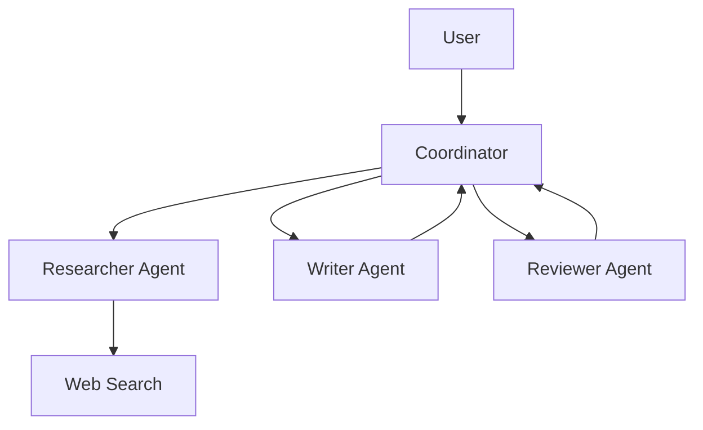

# Вопросы на собеседовании: `AI Agents`

**AI Agent** — LLM, которая может **planning** + **использовать tools** + **observe results** + **iterate** для решения задач. От простой ReAct loop до сложных multi-agent систем. С 2024-2025 — горячая тема. Стандарты: **MCP** (Model Context Protocol). Frameworks: LangGraph, AutoGen, CrewAI, Anthropic SDK.

## Полезные ссылки

### Официальная документация и авторитетные источники

- [Anthropic: Building Effective Agents](https://www.anthropic.com/research/building-effective-agents)
- [Model Context Protocol (MCP)](https://modelcontextprotocol.io/)
- [LangGraph Documentation](https://langchain-ai.github.io/langgraph/)
- [AutoGen Documentation (Microsoft)](https://microsoft.github.io/autogen/)
- [CrewAI Documentation](https://docs.crewai.com/)
- [ReAct paper](https://arxiv.org/abs/2210.03629)
- [Voyager (long-horizon agent)](https://voyager.minedojo.org/)

## Содержание

- [Полезные ссылки](#полезные-ссылки)
- [See also](#see-also)

**Базовые понятия**
- [Q1. (!) Что такое AI agent?](#q1--что-такое-ai-agent)
- [Q2. (!) Workflows vs Agents — Anthropic классификация?](#q2--workflows-vs-agents--anthropic-классификация)
- [Q3. (!) Когда нужен agent, а когда хватает простого LLM?](#q3--когда-нужен-agent-а-когда-хватает-простого-llm)

**Базовые паттерны**
- [Q4. (!) ReAct (Reasoning + Acting)?](#q4--react-reasoning--acting)
- [Q5. Plan-and-Execute?](#q5-plan-and-execute)
- [Q6. (!) Tool use — function calling?](#q6--tool-use--function-calling)

**Tools**
- [Q7. (!) Какие tools предоставляют agentам?](#q7--какие-tools-предоставляют-agentам)
- [Q8. (!) Code execution as tool?](#q8--code-execution-as-tool)
- [Q9. Web search как tool?](#q9-web-search-как-tool)
- [Q10. (!) Что такое MCP (Model Context Protocol)?](#q10--что-такое-mcp-model-context-protocol)

**Memory**
- [Q11. (!) Short-term vs long-term memory?](#q11--short-term-vs-long-term-memory)
- [Q12. Conversation history truncation?](#q12-conversation-history-truncation)
- [Q13. Vector memory (RAG для memory)?](#q13-vector-memory-rag-для-memory)

**Multi-agent системы**
- [Q14. (!) Что такое multi-agent system?](#q14--что-такое-multi-agent-system)
- [Q15. Supervisor pattern?](#q15-supervisor-pattern)
- [Q16. Hierarchical agents?](#q16-hierarchical-agents)
- [Q17. (!) Agent communication patterns?](#q17--agent-communication-patterns)

**Frameworks**
- [Q18. (!) LangGraph (LangChain)?](#q18--langgraph-langchain)
- [Q19. AutoGen (Microsoft)?](#q19-autogen-microsoft)
- [Q20. CrewAI?](#q20-crewai)
- [Q21. Custom vs framework?](#q21-custom-vs-framework)

**Evaluation**
- [Q22. (!) Как тестировать agents?](#q22--как-тестировать-agents)
- [Q23. Trace evaluation?](#q23-trace-evaluation)

**Production**
- [Q24. (!) Какие риски / pitfalls в agents?](#q24--какие-риски--pitfalls-в-agents)
- [Q25. (!) Human-in-the-loop?](#q25--human-in-the-loop)
- [Q26. Cost control для agents?](#q26-cost-control-для-agents)
- [Q27. Latency в agents?](#q27-latency-в-agents)
- [Q28. (!) Computer use — Claude (с 2024)?](#q28--computer-use--claude-с-2024)

## Q1. (!) Что такое AI agent?

**AI Agent** — LLM-powered system, которая:
1. **Принимает goal** (от user)
2. **Планирует** последовательность шагов
3. **Использует tools** (HTTP, DB, code, ...)
4. **Observes** результаты
5. **Iterates** до достижения goal

**Простейший agent loop:**

```python
def agent(goal):
    state = {"messages": [{"role": "user", "content": goal}]}
    while not is_done(state):
        action = llm.decide(state, tools=available_tools)
        if action.type == "tool_call":
            result = execute_tool(action)
            state.append(result)
        elif action.type == "answer":
            return action.content
```

**Применения:**
- Customer support (с access к CRM, knowledge base)
- Code assistants (Cursor, Cline)
- Research agents (Deep Research, GPT Researcher)
- Workflow automation
- Computer-use agents

## Q2. (!) Workflows vs Agents — Anthropic классификация?

Anthropic ("Building Effective Agents", 2024) разделяет:

**Workflows** — pre-defined steps, LLM на конкретных шагах.
```
Step 1: Extract entities
Step 2: Classify intent
Step 3: Generate response
```

**Agents** — LLM **dynamically decides** что делать дальше.
```
Loop: LLM decides next action → execute → check result → continue
```

**Trade-off:**
- **Workflows** — predictable, easier to debug, cheaper
- **Agents** — flexible, handle unknown tasks, more expensive, less predictable

**Best practice:** **start with workflows**, escalate to agent если нужна гибкость.

## Q3. (!) Когда нужен agent, а когда хватает простого LLM?

**Простой LLM:**
- Single-turn QA
- Classification
- Generation (text, code)
- Translation, summarization

**Workflow (deterministic):**
- Multi-step tasks с **известной** последовательностью
- ETL-подобные pipelines
- Структурированный output

**Agent:**
- Открытые задачи с **неизвестным** числом шагов
- Нужны tools (database, web, code execution)
- Adaptive behavior (different paths for different inputs)

**Правило:** не делай agent если workflow достаточен. Agents **дороже, медленнее, менее надёжны**.

## Q4. (!) ReAct (Reasoning + Acting)?

**ReAct** (Yao et al., 2022) — основной паттерн agent execution.

```
Thought: I need to find the user's order status
Action: query_database(order_id=12345)
Observation: {"status": "shipped", "tracking": "ABC123"}
Thought: Let me check delivery date
Action: get_delivery_estimate(tracking="ABC123")
Observation: {"estimated_delivery": "2025-04-20"}
Final Answer: Your order has been shipped (ABC123) and will arrive by April 20.
```

**Implementation:**

```python
def react_agent(query, tools):
    history = [{"role": "user", "content": query}]
    while True:
        response = llm.chat.completions.create(
            messages=history,
            tools=tools
        )
        msg = response.choices[0].message
        history.append(msg)
        if not msg.tool_calls:
            return msg.content  # Final answer
        for call in msg.tool_calls:
            result = execute_tool(call)
            history.append({"role": "tool", "content": result, "tool_call_id": call.id})
```

## Q5. Plan-and-Execute?

**Plan-and-Execute** — сначала **полный план**, потом execution каждого шага.

```
1. Planner: "To answer X, I need to do A, then B, then C"
2. Executor: do A → result_a
3. Executor: do B(result_a) → result_b
4. Executor: do C(result_b) → result_c
5. Final answer
```

**Vs ReAct:** ReAct decides next step at each iteration (more flexible). Plan-and-Execute commits к плану upfront (more predictable, can fail if план bad).

**Когда:** complex tasks where structure matters (research, data analysis).

## Q6. (!) Tool use — function calling?

**Tool definition:**

```python
tools = [{
    "type": "function",
    "function": {
        "name": "search_documents",
        "description": "Search company knowledge base for documents matching query",
        "parameters": {
            "type": "object",
            "properties": {
                "query": {"type": "string"},
                "max_results": {"type": "integer", "default": 5}
            },
            "required": ["query"]
        }
    }
}]
```

**LLM выбирает** tool + аргументы:

```python
response = client.chat.completions.create(
    model="gpt-4o",
    messages=[...],
    tools=tools,
    tool_choice="auto"  # или "required" чтобы заставить
)

# response.choices[0].message.tool_calls
# [{"function": {"name": "search_documents", "arguments": '{"query": "vacation policy"}'}}]
```

Подробнее — в [Prompt Engineering](prompt-engineering-interview.md).

## Q7. (!) Какие tools предоставляют agentам?

**Common tools:**
1. **Search** — internal docs, web search (Tavily, Perplexity, Brave)
2. **Database queries** — SQL, NoSQL
3. **HTTP requests** — APIs (REST, GraphQL)
4. **Code execution** — Python sandbox (e.g., E2B, Modal)
5. **File operations** — read/write
6. **Email / notifications** — send messages
7. **Calendar / scheduling**
8. **Image generation** (DALL-E, Imagen)
9. **Web scraping**
10. **Computer-use** (Claude — клавиатура/мышь, screen)

**Best practices:**
- **Описать tool clearly** — модель должна понимать, когда вызывать
- **Validate inputs** — LLM может передать invalid args
- **Sandbox potentially dangerous** tools (code, file ops)
- **Return structured results** — JSON/dict, not free text

## Q8. (!) Code execution as tool?

**Code execution** — LLM пишет Python (или другой) код, выполняется в **sandbox**, результат обратно.

```python
def execute_python(code: str) -> str:
    result = sandbox.run(code, timeout=10, network=False)
    return result.stdout
```

**Use cases:**
- Math, statistics (вместо неточных LLM math)
- Data analysis на CSV
- Plot generation
- Custom logic

**Sandboxes:**
- **E2B** — managed sandbox API
- **Modal** — serverless compute
- **Self-hosted Docker** — для privacy
- **Pyodide** — browser-side Python

**Безопасность критична:** evil code может damage infrastructure.

## Q9. Web search как tool?

**Web search** для up-to-date информации (LLM training data часто месяцы старая).

**APIs:**
- **Tavily** — popular для AI
- **Perplexity Online**
- **Brave Search API**
- **Bing Search API**
- **SerpAPI** (Google results)
- **You.com**

```python
def web_search(query: str, max_results: int = 5):
    results = tavily.search(query, max_results=max_results)
    return [{
        "url": r.url,
        "title": r.title,
        "content": r.content[:500]
    } for r in results]
```

**Pattern:** agent сначала search, потом fetches relevant pages для деталей.

## Q10. (!) Что такое MCP (Model Context Protocol)?

**Model Context Protocol (MCP)** — открытый стандарт от Anthropic (ноябрь 2024) для интеграции LLM с инструментами и data sources.

**Идея:** **универсальный** way для AI clients (Claude Desktop, Cursor, ...) подключаться к external services.

```
Client (Claude Desktop, IDE)
    ↓ MCP protocol (JSON-RPC over stdio/HTTP)
MCP Server (Github, PostgreSQL, Slack, ...)
```

**MCP Servers** уже есть для:
- File system, Git, GitHub
- PostgreSQL, SQLite, MongoDB
- Slack, Linear, Notion
- Web browsers (Puppeteer)
- Google Drive, Confluence

**Преимущество:** разработчик пишет MCP server один раз → работает с любым MCP-compatible client.

В **2025** — стандарт **быстро принимается** (OpenAI announced support, многие IDE).

## Q11. (!) Short-term vs long-term memory?

**Short-term memory** — context текущей conversation.
- В prompt history
- Forgotten после session

**Long-term memory** — persistent across sessions.
- User preferences
- Past interactions
- Learned facts

**Реализация long-term:**

```python
# At end of session
memory_summary = llm("Summarize key facts about user from this conversation")
db.save(user_id, memory_summary)

# At start of next session
context = db.get(user_id)
prompt = f"User context: {context}\n\nMessage: {new_message}"
```

**Tools:** Mem0, MemGPT, custom Postgres/Redis.

## Q12. Conversation history truncation?

При длинных conversations — context window заполняется.

**Стратегии:**
1. **Sliding window** — keep last N сообщений
2. **Summarization** — старая история → summary
3. **Hybrid** — keep recent + summary of older
4. **Semantic** — find relevant past messages (vector search)

```python
def truncate_history(history, max_tokens=8000):
    while count_tokens(history) > max_tokens:
        # Summarize oldest 10 messages
        old = history[:10]
        summary = llm(f"Summarize: {old}")
        history = [{"role": "system", "content": f"Earlier: {summary}"}] + history[10:]
    return history
```

## Q13. Vector memory (RAG для memory)?

**Memory как vector DB:**

```python
# Store
memory_emb = embed(message)
vector_db.upsert({"user_id": user_id, "embedding": memory_emb, "text": message, "timestamp": ...})

# Retrieve relevant past
relevant = vector_db.search(embed(current_query), filter={"user_id": user_id}, top_k=5)
```

**Применение:**
- "What did I tell you about my preferences?"
- Long-term personalization
- Cross-session continuity

Это **RAG для conversation history** вместо RAG для documents.

## Q14. (!) Что такое multi-agent system?

**Multi-agent** — **несколько LLM agents** взаимодействуют для решения задачи.



**Типы:**
- **Specialist agents** — каждый эксперт в области
- **Pipeline** — sequential
- **Debate** — два agents argue, third judges
- **Hierarchical** — manager + workers

**Минусы:**
- **Очень дорого** (много LLM calls)
- **Slow**
- **Hard to debug**
- **Может escalate в endless loops**

В **2025** — большинство production systems = single agent. Multi-agent — для сложных research/creative задач.

## Q15. Supervisor pattern?

**Supervisor agent** decides which **worker agent** должен handle subtask.

```python
def supervisor(query):
    decision = supervisor_llm(f"Which agent for: {query}? Options: researcher, coder, writer")
    if decision == "researcher":
        return research_agent(query)
    elif decision == "coder":
        return code_agent(query)
    elif decision == "writer":
        return writing_agent(query)
```

**Использование:** routing complex queries в правильную команду.

## Q16. Hierarchical agents?

```
Manager Agent
├── Sub-task to Sub-Manager 1
│   ├── Worker 1.1
│   └── Worker 1.2
└── Sub-task to Sub-Manager 2
    ├── Worker 2.1
    └── Worker 2.2
```

**Multi-level decomposition.** Useful для очень больших задач (например, codebase refactoring).

В **2025** — продвинутая, но experimental тема. Cost и complexity ограничивают adoption.

## Q17. (!) Agent communication patterns?

**Patterns:**

1. **Direct messaging** — agent A → agent B напрямую
2. **Shared blackboard** — все agents читают/пишут shared state
3. **Pub/sub** — events triggered, subscribed agents react
4. **Voting / consensus** — multiple agents propose, vote
5. **Debate** — agents argue, judge decides

**LangGraph** использует **graph-based state** (shared state, agents как nodes).
**AutoGen** использует **conversational** (agents talk to each other).

## Q18. (!) LangGraph (LangChain)?

**LangGraph** — graph-based agent framework. State = node, agents = edges.

```python
from langgraph.graph import StateGraph

class State(TypedDict):
    messages: list

def agent_node(state: State):
    response = llm.invoke(state["messages"])
    return {"messages": state["messages"] + [response]}

def tool_node(state: State):
    tool_calls = state["messages"][-1].tool_calls
    results = [execute_tool(tc) for tc in tool_calls]
    return {"messages": state["messages"] + results}

graph = StateGraph(State)
graph.add_node("agent", agent_node)
graph.add_node("tools", tool_node)
graph.add_edge("agent", "tools")
graph.add_edge("tools", "agent")  # loop
graph.set_entry_point("agent")
```

**Преимущества:** explicit state, debuggable, supports complex flows.

В **2025** — самый популярный agent framework.

## Q19. AutoGen (Microsoft)?

**AutoGen** — multi-agent conversation framework.

```python
from autogen import AssistantAgent, UserProxyAgent

assistant = AssistantAgent("assistant", llm_config={"model": "gpt-4o"})
user_proxy = UserProxyAgent("user", code_execution_config={"work_dir": "coding"})

user_proxy.initiate_chat(assistant, message="Solve this: ...")
```

**Особенности:**
- Multi-agent conversations
- Code execution built-in
- Human-in-the-loop поддержка

В **2025** — популярен в research и code generation.

## Q20. CrewAI?

**CrewAI** — фреймворк для **role-based** agent crews.

```python
researcher = Agent(role="Researcher", goal="Find info", tools=[web_search])
writer = Agent(role="Writer", goal="Write articles", tools=[])
crew = Crew(agents=[researcher, writer], tasks=[task1, task2])
result = crew.kickoff()
```

**Декларативный** подход. Подходит для линейных pipelines с clear roles.

## Q21. Custom vs framework?

**Frameworks pros:**
- Quick start
- Patterns implemented
- Community

**Frameworks cons:**
- **Heavy abstractions** — hard to debug
- Frequent breaking changes (LangChain notorious)
- Sometimes ограничивает creative patterns

**Anthropic's recommendation (2024):**
> "Don't use frameworks unless you really need to. Most agents are simple loops."

```python
# Simple custom agent — может быть лучше LangGraph
def agent(query, tools, max_iterations=10):
    messages = [{"role": "user", "content": query}]
    for _ in range(max_iterations):
        response = client.chat.completions.create(messages=messages, tools=tools)
        messages.append(response.choices[0].message)
        if not response.choices[0].message.tool_calls:
            return response.choices[0].message.content
        for tc in response.choices[0].message.tool_calls:
            result = execute_tool(tc)
            messages.append({"role": "tool", "tool_call_id": tc.id, "content": result})
    raise TimeoutError("Agent exceeded max iterations")
```

**В 2025** — растёт мнение, что **custom код** для agents часто лучше than frameworks.

## Q22. (!) Как тестировать agents?

**Сложно**: agents nondeterministic, могут много путей к ответу.

**Подходы:**

1. **Trace evaluation** — каждый шаг agent logged, manual review
2. **Outcome evaluation** — does final answer correct? (LLM-as-judge)
3. **Tool call evaluation** — правильно ли вызвал tools?
4. **Cost / step count** — agent не должен запускать 100 calls
5. **Golden trajectories** — manually defined "правильный" путь, compare

**Frameworks:** LangSmith, Langfuse, Phoenix Arize, Weights & Biases.

```python
# Pseudo eval
for case in test_cases:
    trace = run_agent(case.input)
    assert trace.tool_calls_count < case.max_calls
    assert llm_judge(trace.final_answer, case.expected) > 0.8
```

## Q23. Trace evaluation?

**Trace** = sequence of agent's thoughts, actions, observations.

```
Step 1: Thought "I need order status"
Step 2: Action search_orders(...)
Step 3: Observation {...}
Step 4: Thought "Found order"
Step 5: Final Answer "..."
```

**Eval criteria:**
- Did agent solve task?
- Tool calls efficient (no unnecessary ones)?
- Reasoning sound (no hallucinations)?
- Cost reasonable?

**LLM-as-judge:** другая LLM анализирует trace, scores quality.

## Q24. (!) Какие риски / pitfalls в agents?

1. **Endless loops** — agent повторяет одно и то же
2. **Context explosion** — history растёт, costs explode
3. **Tool misuse** — wrong arguments → broken behavior
4. **Hallucinations в planning** — план для несуществующих tools
5. **Security** — agent делает destructive actions (delete files, send money)
6. **Prompt injection через tools** — tool returns malicious instructions
7. **Cost runaway** — много iterations, expensive
8. **Slow latency** — multi-step takes minutes
9. **Unpredictable behavior** — different runs → different results
10. **Hard to debug** — long traces, complex state

## Q25. (!) Human-in-the-loop?

**HITL** — human approves critical actions перед execution.

```python
def execute_tool_with_approval(tool_call):
    if tool_call.tool in DANGEROUS_TOOLS:
        approval = ask_human(f"Agent wants to {tool_call.tool} with {tool_call.args}. Approve?")
        if not approval:
            return "User declined"
    return execute(tool_call)
```

**Когда обязательно HITL:**
- **Financial transactions** (move money, place orders)
- **Destructive ops** (delete data, drop tables)
- **External communication** (send emails, make calls)
- **Production deployments**

**Patterns:**
- **Manual approval** — каждый dangerous action
- **Sampling review** — 10% случайных action manually reviewed
- **Confidence threshold** — high confidence auto, low → ask

## Q26. Cost control для agents?

```python
def agent_with_budget(query, max_cost_usd=0.50):
    total_cost = 0
    while ...:
        response = llm(...)
        total_cost += calculate_cost(response)
        if total_cost > max_cost_usd:
            return f"Budget exceeded ({total_cost})"
        ...
```

**Strategies:**
- **Iteration limit** — max 10 steps
- **Token limit** — total tokens cap
- **Cost limit** — $ budget per run
- **Time limit** — max 5 min
- **Tool call limit** — max 20 tool calls
- **Smaller model для planning**, large model только для critical generation

## Q27. Latency в agents?

**Multi-step agents are SLOW.** Single LLM call ≈ 1-5 sec. 10 calls = 10-50 sec.

**Optimizations:**
- **Parallel tool calls** (если tools independent) — `parallel_tool_calls: true` в OpenAI
- **Smaller fast models** для simple steps (Haiku, GPT-4o-mini)
- **Caching** intermediate results
- **Streaming** final answer как только known
- **Background execution** + async notification

**UX:**
- Show progress ("Agent searched documents... reviewing...")
- Estimated completion time
- Allow cancel mid-execution

## Q28. (!) Computer use — Claude (с 2024)?

**Computer use** (Claude 3.5 Sonnet+, October 2024) — Claude может **видеть screenshots**, **управлять mouse/keyboard**.

```python
response = client.messages.create(
    model="claude-opus-4-5",
    tools=[{
        "type": "computer_20241022",
        "name": "computer",
        "display_width_px": 1024,
        "display_height_px": 768
    }],
    messages=[{"role": "user", "content": "Open browser and search Wikipedia"}]
)

# Claude returns actions like:
# {"action": "screenshot"}
# {"action": "left_click", "coordinate": [500, 300]}
# {"action": "type", "text": "Wikipedia"}
```

**Применение:**
- Автоматизация GUI tasks
- Browser automation
- QA testing
- Legacy applications без API

**Подвох:** очень slow, expensive. Для simple tasks — hasta API лучше. **Computer use** для случаев когда **API не существует**.

В **2025** растущая адопция в RPA (Robotic Process Automation).

---

## See also

- [LLM Basics](llm-basics-interview.md) — основа agents
- [Prompt Engineering](prompt-engineering-interview.md) — function calling
- [RAG](rag-interview.md) — knowledge для agents
- [LLM Integration Patterns](llm-integration-patterns-interview.md) — production
- [MLOps](mlops-interview.md) — agent operations
- [Микросервисы](../architecture/microservices-interview.md) — agents как services
- [Event-driven](../architecture/event-driven-patterns-interview.md) — agent communication
- [Application Security](../security/application-security-interview.md) — agent risks
- [Saga Pattern](../architecture/saga-pattern-interview.md) — multi-step transactions
- [[testing-strategies-interview|Test Strategies]] — нестандартное тестирование
