# Вопросы на собеседовании: `AI Application Architecture Patterns`

Архитектура AI-приложений — это не выбор «модной» технологии, а **инженерная задача**: подобрать комбинацию `prompt + RAG + fine-tune + agents` под конкретные требования (свежесть знаний, latency, cost, compliance). На senior-интервью спрашивают про фреймворк выбора, гибридные паттерны, сквозную референсную архитектуру, бюджеты latency/cost, антипаттерны и производственные стадии.

## Полезные ссылки

### Официальная документация и авторитетные источники

- [OpenAI: Choosing between RAG, fine-tuning, and prompt engineering](https://platform.openai.com/docs/guides/optimizing-llm-accuracy)
- [Anthropic: Building effective agents](https://www.anthropic.com/research/building-effective-agents)
- [LangChain: Architecting LLM applications](https://python.langchain.com/docs/concepts/)
- [LlamaIndex: Production-ready RAG](https://docs.llamaindex.ai/en/stable/optimizing/production_rag/)
- [LiteLLM proxy — multi-provider gateway](https://docs.litellm.ai/docs/proxy/quick_start)
- [Portkey — AI gateway](https://portkey.ai/docs)
- [Eugene Yan: Patterns for building LLM systems](https://eugeneyan.com/writing/llm-patterns/)

## Содержание

- [Полезные ссылки](#полезные-ссылки)
- [See also](#see-also)

**4 base patterns**
- [Q1. (!) Какие 4 базовых паттерна AI-приложений?](#q1--какие-4-базовых-паттерна-ai-приложений)
- [Q2. (!) Когда выбрать Prompt Engineering vs RAG vs Fine-tune vs Agents?](#q2--когда-выбрать-prompt-engineering-vs-rag-vs-fine-tune-vs-agents)
- [Q3. Decision matrix по requirements?](#q3-decision-matrix-по-requirements)

**Hybrid patterns**
- [Q4. (!) RAG + Fine-tune — зачем комбинировать?](#q4--rag--fine-tune--зачем-комбинировать)
- [Q5. (!) Agents + RAG — retrieval как tool?](#q5--agents--rag--retrieval-как-tool)
- [Q6. Cascading prompts (small → large model)?](#q6-cascading-prompts-small--large-model)
- [Q7. RAG fallback to fine-tuned при low confidence?](#q7-rag-fallback-to-fine-tuned-при-low-confidence)

**End-to-end architecture**
- [Q8. (!) Reference architecture для production AI app?](#q8--reference-architecture-для-production-ai-app)
- [Q9. (!) Router layer — выбор модели по запросу?](#q9--router-layer--выбор-модели-по-запросу)
- [Q10. Tool Executor и sandboxing tools?](#q10-tool-executor-и-sandboxing-tools)

**Latency / Cost / Quality trade-offs**
- [Q11. (!) Latency budget breakdown (target < 2s)?](#q11--latency-budget-breakdown-target--2s)
- [Q12. (!) Cost arithmetic per request: prompt vs RAG vs agent?](#q12--cost-arithmetic-per-request-prompt-vs-rag-vs-agent)
- [Q13. Quality metrics для каждого паттерна?](#q13-quality-metrics-для-каждого-паттерна)
- [Q14. (!) TTFT, TPOT и streaming для UX?](#q14--ttft-tpot-и-streaming-для-ux)

**Production stages**
- [Q15. (!) Production stages: PoC → MVP → Production?](#q15--production-stages-poc--mvp--production)
- [Q16. Evolution path: prompt → RAG → fine-tune → agent?](#q16-evolution-path-prompt--rag--fine-tune--agent)

**Caching layers**
- [Q17. (!) Какие слои кеширования у AI-приложений?](#q17--какие-слои-кеширования-у-ai-приложений)
- [Q18. Semantic cache vs exact match — когда что?](#q18-semantic-cache-vs-exact-match--когда-что)

**Async patterns**
- [Q19. (!) Sync vs async vs streaming vs batch — data flow patterns?](#q19--sync-vs-async-vs-streaming-vs-batch--data-flow-patterns)
- [Q20. Webhook/SSE для long-running generations?](#q20-webhooksse-для-long-running-generations)

**Failure modes и fallback**
- [Q21. (!) Failure modes AI-системы и стратегии fallback?](#q21--failure-modes-ai-системы-и-стратегии-fallback)
- [Q22. Inference Gateway pattern (LiteLLM / Portkey / OpenRouter)?](#q22-inference-gateway-pattern-litellm--portkey--openrouter)

**Multi-tenancy и security**
- [Q23. (!) Multi-tenancy: per-tenant prompts, indices, rate limits?](#q23--multi-tenancy-per-tenant-prompts-indices-rate-limits)
- [Q24. (!) Security architecture: prompt injection, secrets, sandboxing?](#q24--security-architecture-prompt-injection-secrets-sandboxing)
- [Q25. Compliance-aware architecture (PII, GDPR, residency)?](#q25-compliance-aware-architecture-pii-gdpr-residency)
- [Q26. Cost monitoring и budgets per tenant/feature?](#q26-cost-monitoring-и-budgets-per-tenantfeature)

**Real examples и anti-patterns**
- [Q27. (!) Architecture anti-patterns в AI-проектах?](#q27--architecture-anti-patterns-в-ai-проектах)
- [Q28. Feature flags и A/B testing для AI features?](#q28-feature-flags-и-ab-testing-для-ai-features)
- [Q29. Edge AI: small model on-device + heavy в облаке?](#q29-edge-ai-small-model-on-device--heavy-в-облаке)
- [Q30. Voice agent architecture: STT → LLM → TTS vs Realtime API?](#q30-voice-agent-architecture-stt--llm--tts-vs-realtime-api)
- [Q31. Build vs buy: own RAG vs hosted Pinecone, OSS vs commercial?](#q31-build-vs-buy-own-rag-vs-hosted-pinecone-oss-vs-commercial)
- [Q32. Real examples: Notion AI, Cursor, Perplexity, Devin — какие паттерны?](#q32-real-examples-notion-ai-cursor-perplexity-devin--какие-паттерны)

## Q1. (!) Какие 4 базовых паттерна AI-приложений?

Любой production-AI-app — это комбинация четырёх кирпичей. Знание сильных/слабых сторон каждого — фундамент для архитектурных решений.

| Паттерн | Что делает | Стоимость настройки | Стоимость запроса | Когда выбрать |
|---|---|---|---|---|
| **Prompt Engineering** | Zero/few-shot, system prompt, structured output (JSON schema) | $0 | низкая | Простые задачи, быстрое прототипирование, когда задача укладывается в context |
| **RAG** | Достаёт релевантный контекст из vector/keyword-индекса → LLM генерирует обоснованный (grounded) ответ | средняя (embedding-pipeline + индекс) | средняя (`embedding + LLM`) | Часто обновляемые знания, упор на факты, нужна атрибуция источников |
| **Fine-tuning** | Подгоняет веса модели под domain/стиль/формат | высокая (датасет + обучение) | как у базовой модели + амортизация обучения | Стабильный стиль/формат, узкий domain, нужна низкая latency на маленькой модели |
| **Agents** | Multi-step с tool use, планированием, рефлексией | средняя (проектирование инструментов) | высокая (5-15 вызовов LLM) | Open-ended задачи: код, ресёрч, автоматизация браузера, computer use |

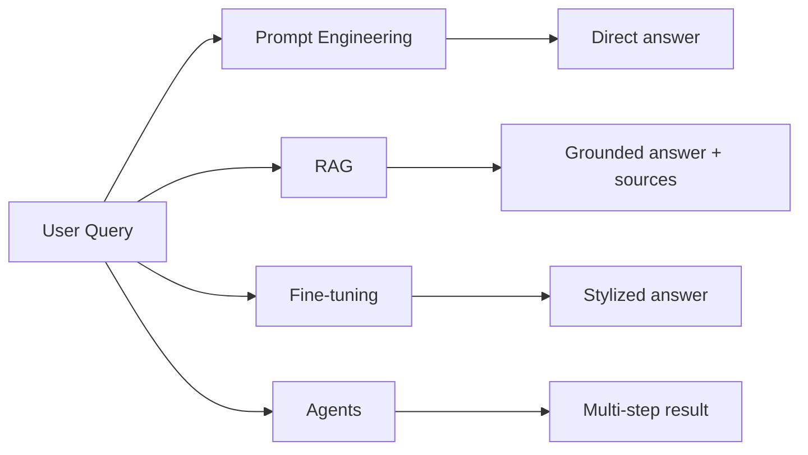

**Ключевая идея:** это не «или-или». В production почти всегда **гибрид** (см. Q4-Q7).

## Q2. (!) Когда выбрать Prompt Engineering vs RAG vs Fine-tune vs Agents?

Алгоритм выбора — по «верхним» характеристикам задачи:

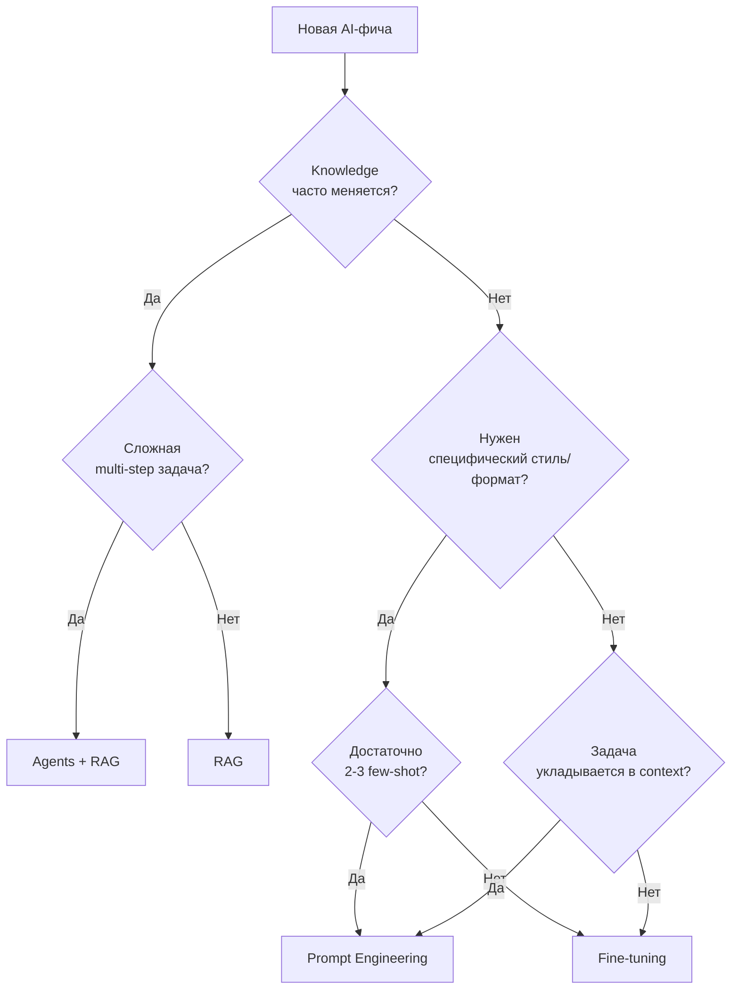

**Подсказки по сигналам:**

- «У нас 100k документов, обновляются каждый день» → **RAG**, не fine-tune.
- «Хотим всегда отвечать в нашем corporate-стиле» → **Fine-tune** (или system prompt + few-shot, если стиль простой).
- «Пользователь говорит "сделай рефакторинг репозитория"» → **Agents** (planning + tool use).
- «5 категорий, FAQ» → **Prompt Engineering** + structured output.

**Правило большого пальца:** начинай с самого дешёвого (Prompt) → эскалируй только при доказанных проблемах с качеством.

## Q3. Decision matrix по requirements?

Матрица для выбора паттерна по требованиям бизнеса:

| Требование | Prompt | RAG | Fine-tune | Agent |
|---|---|---|---|---|
| **Свежесть знаний** (часто меняются) | плохо | отлично | плохо (нужен retrain) | отлично (через RAG-tool) |
| **Адаптация стиля/формата** | средне | плохо | отлично | средне |
| **Latency < 500ms** | отлично | хорошо | отлично (малая модель) | плохо |
| **Cost < $0.01/request** | хорошо | средне | отлично (FT малая) | плохо |
| **Data privacy / on-prem** | через self-hosted | через self-hosted | отлично (свой weights) | сложнее (tools) |
| **Compliance / audit trail** | средне | отлично (источники) | средне | отлично (trace steps) |
| **Open-ended задачи** | плохо | средне | плохо | отлично |
| **Холодный старт (нет данных)** | отлично | средне (нужен корпус) | плохо | средне |

**Применение:** при дизайне фичи прописать requirements строками → найти паттерн, который не «плохо» ни в одной критичной строке.

## Q4. (!) RAG + Fine-tune — зачем комбинировать?

Классическая ошибка: пытаться **RAG-ом учить стилю** (плохо работает) или **fine-tune-ом учить фактам** (быстро устаревает, дорого).

**Правильное разделение:**

- **Fine-tune** учит модель **как отвечать** (style, format, tone, terminology, structured output).
- **RAG** даёт модели **что отвечать** (актуальные факты, документы, политики).

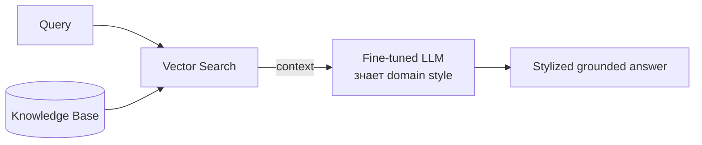

**Пример:** медицинский ассистент.
- Fine-tune на медицинской терминологии и формате SOAP-notes.
- RAG по последним guidelines, конкретной карте пациента.
- Результат: правильный стиль + актуальные факты.

**Когда не комбинировать:**
- Маленькое приложение → один паттерн дешевле.
- Если fine-tune не даёт измеримого +Δ качества над prompt+RAG → не нужен.

## Q5. (!) Agents + RAG — retrieval как tool?

Вместо того, чтобы делать RAG-pipeline жёстко (`retrieve → generate`), даём агенту **retrieval как инструмент** среди других.

```python
tools = [
    {"name": "search_docs", "description": "Search internal knowledge base"},
    {"name": "search_web", "description": "Search the web"},
    {"name": "query_sql", "description": "Run SQL on analytics DB"},
    {"name": "calculate", "description": "Run Python expression"},
]
```

**Преимущества:**
- Агент **сам решает**, когда нужен поиск (а когда хватит знаний из весов).
- Может **итеративно уточнять** запросы (`search_docs("policy") → search_docs("policy 2024 amendment")`).
- Может **комбинировать** источники (RAG + SQL + web).

**Недостатки:**
- Дороже: каждый шаг LLM стоит денег.
- Риск зацикливания: агент может бесконечно делать retrieve.
- Сложно оценивать качество (нет фиксированного pipeline).

**Когда выбрать:** сложный ресёрч, customer support с разнородными данными, code-агенты.
**Когда НЕ выбрать:** простой Q&A — обычный RAG дешевле и предсказуемее.

## Q6. Cascading prompts (small → large model)?

Идея: **дешёвая модель** делает первый шаг (классификация / простой ответ), **дорогая** подключается только при необходимости.

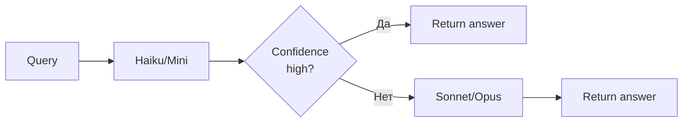

**Варианты каскадирования:**
- **Router-модель** (маленький LLM) классифицирует intent → выбирает специализированный pipeline.
- **Сначала дешёвый ответ** → если confidence низкий, эскалируем к дорогой модели.
- **Набросок + доводка**: маленькая модель генерирует черновик → большая критикует и правит.

**Экономика:** если 70% запросов решает Haiku ($0.001), а 30% эскалируем к Sonnet ($0.03) → усреднённая стоимость = `0.7*0.001 + 0.3*0.03 = $0.0097` против $0.03 на все запросы.

## Q7. RAG fallback to fine-tuned при low confidence?

Гибридная стратегия:

1. Сначала пробуем **RAG** (retrieve + generate).
2. Оцениваем confidence: relevance-score ретривера + неуверенность модели.
3. Если **confidence низкий** (например, retrieval-score < порога или модель сказала «не знаю»):
   - Fallback к **fine-tuned-модели** (которая знает domain «по умолчанию»).
   - Или к **human-in-the-loop**.

```python
result = rag_pipeline(query)
if result.retrieval_score < 0.5 or "I don't know" in result.answer:
    result = fine_tuned_model.answer(query)
    if result.confidence < 0.7:
        escalate_to_human(query)
return result
```

**Когда уместно:** customer support, где RAG не покрывает все кейсы, но fine-tuned-baseline даёт «приемлемый» ответ.

## Q8. (!) Reference architecture для production AI app?

Канонический скелет, который масштабируется от MVP до enterprise:

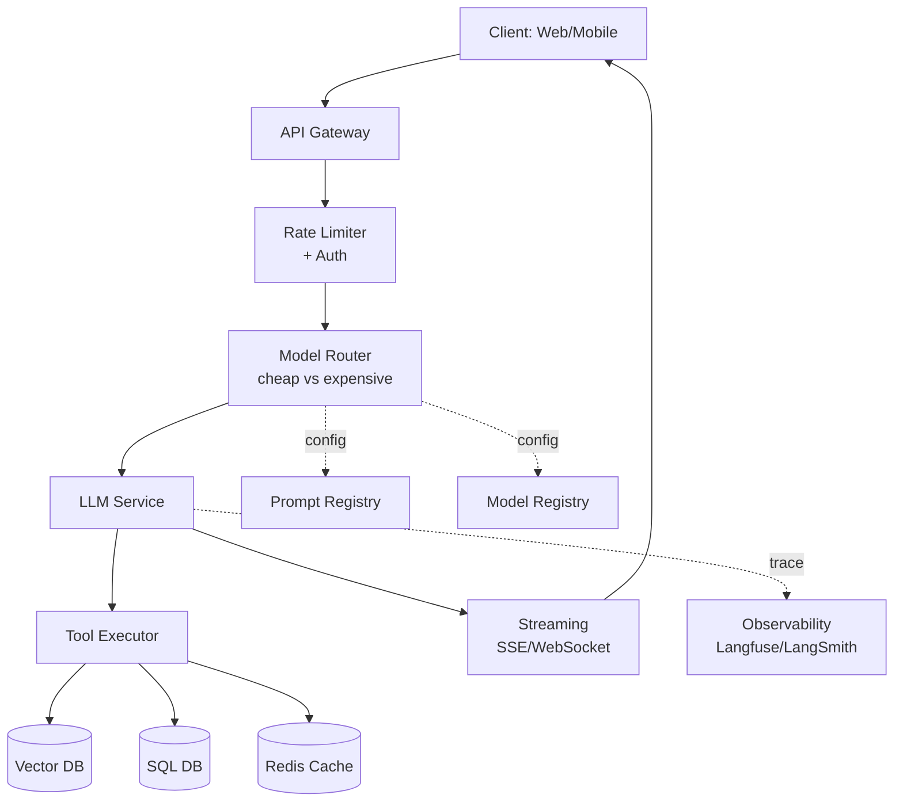

**Слои:**

| Слой | Назначение | Технологии |
|---|---|---|
| **API Gateway** | Маршрутизация, TLS, публичная точка входа | Kong, Envoy, NGINX, AWS ALB |
| **Rate Limiter + Auth** | JWT, лимиты на пользователя/тенанта | Redis token bucket, Auth0, Keycloak |
| **Model Router** | Выбор `model` по запросу/тенанту | Custom + LiteLLM/Portkey |
| **LLM Service** | Вызов модели (OpenAI/Anthropic/локальной) | LangChain, Spring AI, LiteLLM |
| **Tool Executor** | Выполнение function calls (RAG, SQL, web) | Custom + sandbox |
| **Vector DB** | Индекс эмбеддингов | Pinecone, Weaviate, pgvector, Qdrant |
| **Cache** | Embedding/semantic/exact-match кеш | Redis, Mem0 |
| **Streaming** | SSE/WebSocket для TTFT UX | Spring WebFlux, FastAPI, Vercel AI SDK |
| **Observability** | Трейсы, evals, версии промптов | Langfuse, LangSmith, Helicone |
| **Prompt/Model Registry** | Версионирование промптов/моделей | Promptlayer, Langfuse, GitOps |

**Принципы:**
- **Stateless service layer** — горизонтальное масштабирование.
- **Конфигурируемые модель/промпт** — изменения без деплоя.
- **Async-friendly** — SSE для TTFT, jobs для batch.
- **Трассировать всё** — каждый вызов LLM в Langfuse.

## Q9. (!) Router layer — выбор модели по запросу?

Router — слой, который решает: **какую модель** дёрнуть для конкретного запроса.

```python
def route(request: Request) -> Model:
    # 1. Tenant override
    if request.tenant.preferred_model:
        return request.tenant.preferred_model
    # 2. Intent-based routing
    if request.intent == "code":
        return "claude-sonnet-4.5"
    if request.intent == "simple_faq":
        return "haiku"
    # 3. Feature flag (canary)
    if feature_flags.enabled("opus-rollout", request.user_id):
        return "claude-opus-4"
    # 4. Budget-based
    if request.tenant.budget_left < 0.10:
        return "haiku"  # degraded
    return DEFAULT_MODEL
```

**Стратегии маршрутизации:**

| Стратегия | Когда | Плюсы | Минусы |
|---|---|---|---|
| **Статическая (по фиче)** | разным фичам — разные модели | просто | негибко |
| **Intent-классификатор** | router-LLM выбирает | оптимально по cost | +latency, +cost самого классификатора |
| **Каскадирование** | дешёвая → дорогая | экономия | сложная eval |
| **A/B-тестирование** | сравнение моделей | data-driven | накладные расходы на сплит трафика |
| **Tenant-config** | enterprise/BYOK | контроль на стороне тенанта | сложность эксплуатации |

**Production:** обычно гибрид — статические дефолты + tenant override + раскатка через feature flag.

## Q10. Tool Executor и sandboxing tools?

Tool Executor — компонент, который выполняет function calls агента (`search_web`, `run_sql`, `execute_python`, `send_email`).

**Безопасность:**
- **Sandbox** для исполнения кода (Docker, gVisor, Firecracker, браузер в Chrome sandbox).
- **Allowlist** для доменов web-запросов.
- **Read-only DB user** для SQL-инструмента по умолчанию.
- **Human-in-the-loop** для деструктивных действий (отправить email, списать с карты).

**Архитектура:**

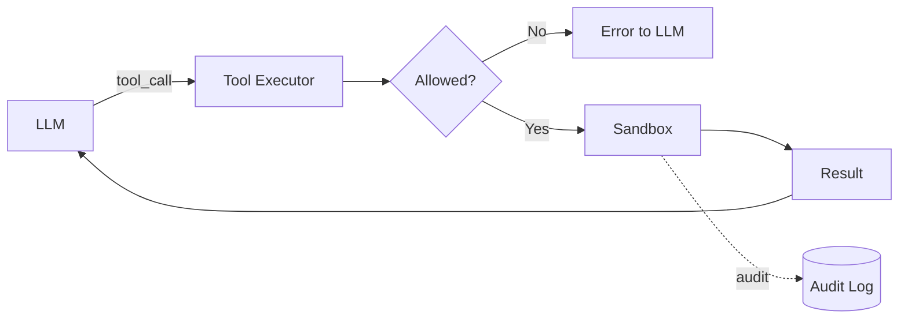

**Реализация в Spring/Python:** реестр инструментов, валидация схемы (Pydantic/JSON Schema), таймаут на каждый tool call, retry с idempotency-ключами.

## Q11. (!) Latency budget breakdown (target < 2s)?

Цель: пользователь получает **TTFT < 1s**, full answer < 2s.

```mermaid
gantt
    title Latency budget end-to-end (~2s)
    dateFormat  x
    axisFormat %L ms
    section Edge
    Auth + rate limit       :a1, 0, 10
    section Retrieve
    Embedding query         :a2, after a1, 30
    Vector search           :a3, after a2, 100
    Rerank (optional)       :a4, after a3, 50
    section LLM
    Prompt assembly         :a5, after a4, 20
    LLM prefill (TTFT)      :a6, after a5, 500
    Token streaming         :a7, after a6, 1000
    section Tools
    Optional tool call      :a8, after a7, 500
```

**Разбивка:**

| Этап | Бюджет |
|---|---|
| Auth + rate limit | ~10ms |
| Embedding-запрос | 20-50ms |
| Vector search | 50-200ms |
| Rerank (cross-encoder) | 30-150ms |
| Сборка промпта | <20ms |
| LLM prefill (TTFT) | 300-800ms (зависит от длины context) |
| Token streaming (полный) | 500-2000ms (зависит от output) |
| Tool call (каждый) | 500-3000ms |

**Оптимизации:**
- **Streaming** — пользователь видит первый токен через TTFT, а не ждёт ответ целиком.
- **Распараллелить** retrieve и работу до вызова LLM.
- **Кешировать** эмбеддинги часто запрашиваемых запросов.
- **Меньше context** — каждый лишний токен = время prefill.
- **Меньшая / специализированная модель** для быстрых ответов.

## Q12. (!) Cost arithmetic per request: prompt vs RAG vs agent?

Цифры для grounded-диалогов (цены Q4 2025, USD):

| Паттерн | Расчёт | Стоимость запроса |
|---|---|---|
| **Чистый prompt (GPT-4o/Sonnet)** | 1k in + 500 out токенов | $0.01 — $0.10 |
| **RAG** | embedding ($0.0001) + 3k context + 500 out | $0.02 — $0.15 |
| **Agent (5-15 вызовов LLM)** | каждый шаг 2k in + 1k out × N | $0.10 — $2.00 |
| **Fine-tuned base** | как base + амортизированная стоимость обучения (разовая ~$100-10000) | базовая цена + амортизация |
| **Каскадирование (70% Haiku, 30% Sonnet)** | усреднённо | $0.005 — $0.015 |

**Формула для agent:**
```
cost_agent ≈ N_steps × (avg_in_tokens × price_in + avg_out_tokens × price_out)
```
Например, 10 шагов × (3000 × $3/1M + 500 × $15/1M) = $0.165.

**Чек-лист оптимизации стоимости:**
- Кеширование (см. Q17).
- Prompt caching (Anthropic / OpenAI prompt-cache).
- Меньше context (только релевантные chunks).
- Каскадирование (Q6).
- Batch API (скидка 50% при SLA < 24ч).
- Self-hosted для высоких объёмов + стабильной нагрузки.

## Q13. Quality metrics для каждого паттерна?

| Паттерн | Сильные стороны | Слабые стороны | Метрики |
|---|---|---|---|
| **Prompt Engineering** | гибкость, скорость итераций | нестабильное качество, дрейф промптов | exact-match, BLEU, LLM-as-judge |
| **RAG** | меньше галлюцинаций (если grounded) | узкое место — качество retrieval | groundedness, recall@k, MRR |
| **Fine-tune** | следование стилю/формату | факты устаревают, качество генерации стагнирует | task-specific accuracy, format-conformance |
| **Agents** | open-ended задачи, tool use | многошаговый failure rate накапливается | task success rate, число шагов, $ за задачу |

**Eval-инфраструктура:** датасеты Langfuse / LangSmith + автоматический LLM-judge + регрессионные тесты на CI.

## Q14. (!) TTFT, TPOT и streaming для UX?

Две главные latency-метрики:

- **TTFT (Time To First Token)** — время от запроса до первого токена. Это **UX-метрика**, пользователь воспринимает её как «отзывчивость».
- **TPOT (Time Per Output Token)** — сколько ms на каждый следующий токен. Определяет «скорость печати».

**Зачем streaming:**
- Без streaming пользователь ждёт ~2s до **первого** символа.
- Со streaming он видит первый токен через ~500ms → воспринимаемая latency × 4 ↓.

**Стек:**
- **Backend:** SSE (Server-Sent Events) — простой HTTP/1.1, легко проходит через прокси.
- **Frontend:** `EventSource` API или Vercel AI SDK `useChat`.

**Тонкости:**
- При streaming **нельзя** делать retry на полпути — нужна стратегия возобновления (resumability) или старт заново.
- Tool calls обычно не поддерживают streaming (надо получить полный объект tool_call).
- Логирование streaming-ответов: дописывать токены в trace по мере прихода.

## Q15. (!) Production stages: PoC → MVP → Production?

| Стадия | Цель | Что строим | Что НЕ строим |
|---|---|---|---|
| **PoC (1-2 недели)** | Доказать, что задача решаема | Jupyter notebook, захардкоженный prompt, OpenAI API, ручная eval на 20 примерах | Не строим: UI, auth, observability, масштабирование |
| **MVP (1-2 месяца)** | Реальные пользователи на dogfood | обёртка LangChain/LlamaIndex, простой UI, базовый auth, минимальное логирование, eval-датасет 100-500 примеров | Не строим: multi-tenant, BYOK, продвинутый routing, FT |
| **Production (3+ месяца)** | Надёжно, масштабируемо, наблюдаемо | референсная архитектура (Q8), полноценные evals, CI/CD промптов, observability, fallback-и, multi-tenancy, compliance | Перестаём срезать углы |

**Антипаттерн:** прыгать через стадии. «Сразу production-grade» без PoC = месяцы, потраченные на фичу, которая не работает.

## Q16. Evolution path: prompt → RAG → fine-tune → agent?

Естественный порядок усложнения, когда задача требует:

1. **Prompt** — пока хватает.
2. **Prompt + Few-shot** — если разброс качества высокий.
3. **RAG** — когда нужны актуальные / объёмные знания.
4. **Улучшенный RAG** (rerank, hybrid search, query rewriting) — оптимизация retrieval.
5. **Fine-tune** — когда стиль/формат не лечатся промптом или нужны скорость/cost.
6. **Agents** — когда задача multi-step / open-ended.
7. **Multi-agent** — когда одиночный агент тонет в сложности.

**Когда переходить:**
- Видишь систематический failure mode → выбираешь следующий шаг.
- НЕ переходи «потому что модно» — каждый шаг увеличивает сложность стека в 2-3×.

## Q17. (!) Какие слои кеширования у AI-приложений?

| Слой | Что кешируется | TTL | Технологии |
|---|---|---|---|
| **Embedding cache** | text → embedding-вектор | долгий (текст детерминирован) | Redis, file cache |
| **Semantic cache** | похожий запрос → закешированный ответ (по cosine similarity) | средний | Redis Vector, Mem0, GPTCache |
| **Prompt cache** | переиспользование префикса у провайдера (system prompt, RAG context) | 5мин-1ч | Anthropic prompt cache, OpenAI prompt caching |
| **LLM response cache** | точное совпадение запроса → ответ | короткий (или инвалидация по событию) | Redis, Memcached |
| **Tool result cache** | аргументы tool call → результат | зависит от инструмента | Redis |

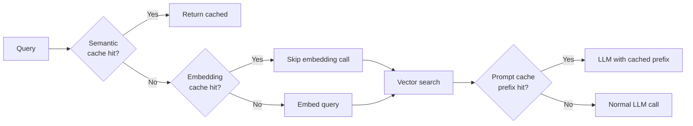

**Эффект:** на «горячих» запросах кеш срабатывает в 30-60% случаев → cost / latency пополам.

## Q18. Semantic cache vs exact match — когда что?

**Exact match cache** — `key = hash(query)`. Срабатывает только на точном повторе.
- Плюсы: нулевой риск false positive.
- Минусы: низкий hit rate (1-5%).

**Semantic cache** — `key = embedding(query)`; попадание, если cosine_similarity > порога.
- Плюсы: hit rate 20-40%.
- Минусы: **риск false positive** — похожий, но не идентичный смысл.

**Когда какой:**

| Сценарий | Кеш |
|---|---|
| Финансы, медицина, юр. данные | Exact match |
| FAQ, базовый support | Semantic (порог ≥ 0.95) |
| Брейншторм / open-ended | Без кеша (нужна вариативность) |

**Совет:** для semantic cache добавь **инвалидацию** при изменении knowledge base — иначе закешированные ответы устаревают.

## Q19. (!) Sync vs async vs streaming vs batch — data flow patterns?

| Паттерн | Описание | Когда | Latency |
|---|---|---|---|
| **Synchronous** | `POST /ask → 200 OK { answer }` | короткие задачи (< 2s) | низкая |
| **Async с колбэком** | `POST /ask → 202 Accepted { job_id }` → webhook | долгие генерации, batch | высокая |
| **Streaming** | `POST /ask → SSE-поток токенов` | chat UX, codegen | TTFT низкий, полный — средний |
| **Batch** | загрузить файл → выходной файл (Anthropic/OpenAI batch API) | не realtime: ночное обогащение, evals | 0-24ч (на 50% дешевле) |

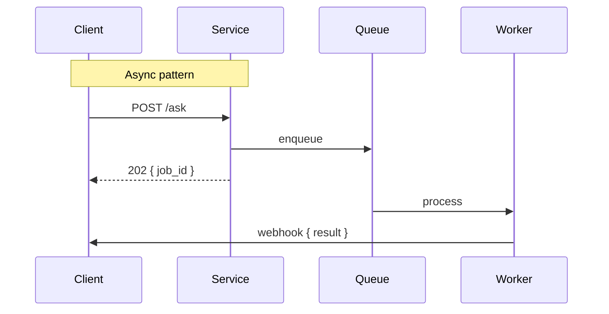

## Q20. Webhook/SSE для long-running generations?

Когда генерация занимает 10с-10мин (deep research, coding-агент):

- **SSE** хорош для задач, «привязанных» к UI: пользователь смотрит на экран.
- **Webhook** хорош, когда клиент может уйти и вернуться: интеграции backend → backend.
- **Polling** — fallback для сервисов без поддержки webhook.

**Гибрид (best practice):** SSE для UI + сохранение прогресса в БД → если клиент отвалился, можно вернуться и **переподписаться** (resubscribe) на state.

## Q21. (!) Failure modes AI-системы и стратегии fallback?

| Failure mode | Симптом | Fallback |
|---|---|---|
| **Провайдер недоступен** | 5xx, таймауты | резервный провайдер (Anthropic ↔ OpenAI ↔ self-hosted) через gateway |
| **Rate limit (429)** | отказы | очередь + retry с jitter + переход на более дешёвую модель |
| **Превышена длина контекста** | ошибка API | сжатие контекста, summarize, меньше chunks |
| **Галлюцинация / неверный ответ** | плохой ответ | проверка groundedness → эскалация на человека |
| **Превышен бюджет по cost** | внутренний alert | graceful degradation (дешёвая модель / кеш / «недоступно») |
| **Медленный ответ (всплеск latency)** | > p95 | таймаут → fallback к кешу / более дешёвой модели |
| **Сбой инструмента** | инструмент вернул ошибку | повтор инструмента / альтернативный инструмент / сообщить LLM |
| **Prompt injection** | вредоносный ввод | input rails + sanitize + reject |

**Принцип:** каждый внешний вызов должен иметь явный **fallback-путь**. Без fallback система превращается в единую точку отказа.

## Q22. Inference Gateway pattern (LiteLLM / Portkey / OpenRouter)?

**Inference Gateway** — единый API над несколькими провайдерами, который централизует retry/fallback/caching/observability/RBAC.

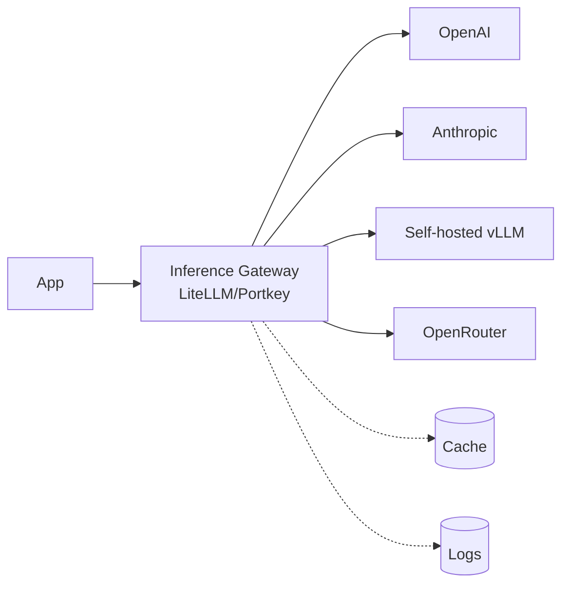

**Преимущества:**
- Единый формат (OpenAI-compatible) для всех провайдеров.
- Централизованные fallback / retry / circuit breaker.
- Rate limits на тенанта и трекинг cost «из коробки».
- Observability одним подключением.
- A/B-тестирование моделей без изменений в коде.

**LiteLLM proxy config (выдержка):**

```yaml
model_list:
  - model_name: gpt-4o
    litellm_params:
      model: openai/gpt-4o
      api_key: os.environ/OPENAI_API_KEY
  - model_name: claude-sonnet
    litellm_params:
      model: anthropic/claude-sonnet-4-5
      api_key: os.environ/ANTHROPIC_API_KEY

router_settings:
  fallbacks:
    - gpt-4o: [claude-sonnet]
  retry_policy:
    num_retries: 3
    timeout: 30
```

**Когда НЕ нужен:** если у вас один провайдер и < 1k запросов/день — накладные расходы того не стоят.

## Q23. (!) Multi-tenancy: per-tenant prompts, indices, rate limits?

Корпоративный AI-app поддерживает **тенантов** (организаций) с собственными:

| Ресурс | Реализация |
|---|---|
| **Промпты** | prompt registry с namespace по tenant_id |
| **RAG-индекс** | отдельный namespace в Pinecone/Weaviate на каждого тенанта (или фильтр по tenant_id) |
| **Модели** | конфиг на тенанта: BYOK (bring-your-own-key) или общая модель с виртуальным бюджетом |
| **Rate limits** | token bucket на тенанта (Redis с ключом `rl:{tenant}:{user}`) |
| **Бюджеты по cost** | месячный лимит на тенанта, alert на 80%, жёсткое отсечение на 100% |
| **Fine-tuned-модели** | FT под конкретного тенанта (если кейс позволяет: enterprise) |
| **Изоляция данных** | row-level security в БД, шифрование ключом тенанта |

**Подводные камни:**
- **Утечка между тенантами в RAG** — забыли фильтр по tenant_id → утечка документов. Обязательный строгий фильтр в ретривере.
- **Отравление общего кеша** — semantic cache без tenant_id → ответ другого тенанта.
- **BYOK-ключи** — храним в Vault, никогда в БД в открытом виде.

## Q24. (!) Security architecture: prompt injection, secrets, sandboxing?

Модель угроз и контрмеры:

| Угроза | Защита |
|---|---|
| **Prompt injection (прямая)** | input rails (классификатор вредоносного ввода), строгое разделение ролей, ограничение набора доступных инструментов |
| **Непрямая prompt injection** (через RAG / web-инструмент) | sanitize полученного контента, content-filter LLM, относиться к выводу инструмента как к недоверенному |
| **Output rails** | проверка ответа: PII, признаки jailbreak, нарушение политик |
| **Утечка секретов** | API-ключи в Vault/AWS Secrets Manager, никогда в промптах/логах; redact PII перед логированием |
| **Sandboxing инструментов** | исполнение в Docker/gVisor, network allowlist, read-only FS, без креденшелов внутри |
| **Audit trails** | каждый LLM call + tool call + решение → audit log с user/tenant/timestamp |
| **Управление API-ключами** | ротация, скоупы на тенанта, отдельные ключи под каждое окружение |
| **Rate limiting** | защита от abuse и DoS по бюджету |

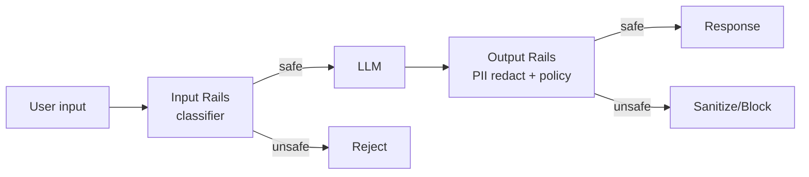

**Бонус по compliance:** для регулируемых отраслей (фин, мед) — pipeline ревью человеком для всех ответов, прежде чем они уйдут клиенту.

## Q25. Compliance-aware architecture (PII, GDPR, residency)?

Архитектурные требования при работе с PII / регулируемыми данными:

- **Слой PII-редактирования** до отправки в LLM (regex + ML-детектор).
- **Data residency** — выбор региона для API (region-aware endpoints Anthropic / Azure OpenAI).
- **No-training agreement** — API Anthropic / OpenAI не обучается на данных (по умолчанию для API).
- **Audit logging** — кто, что, когда, зачем; срок хранения по compliance-окну.
- **GDPR consent** — явное согласие на использование AI-фич; право на забвение для эмбеддингов.
- **Шифрование** — at-rest и in-transit; ключи на тенанта, где возможно.
- **DPA / BAA** — Data Processing Agreement с провайдером (HIPAA: только compliant-endpoints).
- **On-prem-вариант** — для строгих кейсов self-hosted (Llama 3, Mistral, vLLM).

## Q26. Cost monitoring и budgets per tenant/feature?

**Что трекать:**
- Токены in/out по `tenant`, `user`, `feature`, `model`.
- Потраченные $ на запрос (с учётом прайс-листа провайдера).
- Аномалии: запрос с cost > p99 / резкий всплеск.

**Где хранить:** time-series-БД (VictoriaMetrics, Prometheus) + дашборды (Grafana).

**Контроли:**
- **Бюджет на тенанта** — месячный лимит. Мягкий alert на 80%, жёсткое отсечение на 100%.
- **Бюджет на фичу** — лимит для экспериментальных фич.
- **Авто-отключение** — если за час > 10× нормы → временный throttle.
- **Атрибуция cost в trace** — каждый Langfuse-span содержит `cost_usd`.

**Пример формулы:** `cost = (in_tokens × price_in + out_tokens × price_out) / 1_000_000`. Для GPT-4o (Q4 2025): in $2.5/1M, out $10/1M.

## Q27. (!) Architecture anti-patterns в AI-проектах?

Самые частые ошибки на ревью:

| Антипаттерн | Симптом | Лечение |
|---|---|---|
| **Преждевременные агенты** | сложные multi-step pipelines там, где хватит workflow | Простой chain/workflow; агенты только если задача open-ended |
| **RAG вместо fine-tune для стиля** | пытаемся учить стилю через context — плохо работает | Fine-tune для стиля, RAG для фактов |
| **Захардкоженная модель** | `openai.chat.completions.create("gpt-4")` повсюду | model registry + config |
| **Нет стратегии fallback** | один провайдер → сбой = простой | inference gateway + резервный провайдер |
| **Нет observability** | «оно сломалось, не знаю почему» | Langfuse / LangSmith с первого дня MVP |
| **Только синхронность** | блокирующие 30-секундные запросы без streaming | SSE для UX, async для долгих задач |
| **Промпты прямо в коде** | промпты разбросаны по исходникам | prompt registry + version control |
| **Нет evals** | регрессия качества незаметна | golden dataset + CI eval |
| **Доверять всему, что выдаёт LLM** | injection / галлюцинации проскакивают | input + output rails |
| **«Чем больше context, тем лучше»** | заливка 100k токенов — дорого, качество падает | курируемый context (top-k + rerank) |

## Q28. Feature flags и A/B testing для AI features?

**Feature flags для AI:**
- Постепенная раскатка новой модели/промпта (1% → 10% → 50% → 100%).
- Kill switch при инциденте.
- Override на пользователя, на тенанта.

**Инструменты:** LaunchDarkly, Unleash, Flagsmith, кастомные.

**A/B-тестирование:**
- Разделение трафика между вариантами (модель A vs модель B, prompt v1 vs v2).
- Измеряем: удовлетворённость пользователя (thumbs up/down), конверсию, выполнение задачи.
- Статистическая значимость: минимальный размер выборки, p-value < 0.05.
- **Онлайн-evals + офлайн-evals** — синхронизировать онлайн-метрики с результатами на golden dataset.

**Пример:** новый prompt → 10% трафика → через 2 недели сравниваем thumbs-up rate. Если +5% → раскатываем, иначе — откат.

## Q29. Edge AI: small model on-device + heavy в облаке?

Гибрид edge + cloud:

- **На устройстве:** Apple Intelligence (3B), Phi-3-mini, Gemma 2B, ONNX runtime, WebGPU + WebLLM в браузере, MLC LLM на мобильных.
- **В облаке:** тяжёлые модели для сложных задач.

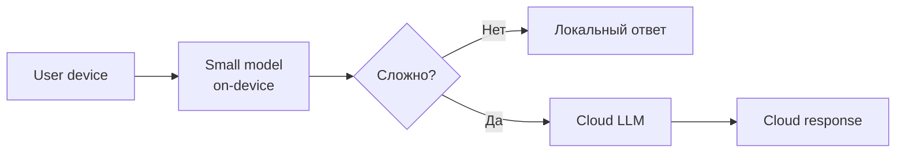

**Сценарии:**
- **Чувствительные к latency** (автодополнение, голос).
- **Приватность** (данные не уходят в облако).
- **Офлайн** (mobile, embedded).
- **Стоимость** (бесплатно на устройстве пользователя).

**Trade-off:** малые модели глупее → нужна тщательная логика маршрутизации для эскалации.

## Q30. Voice agent architecture: STT → LLM → TTS vs Realtime API?

**Pipeline architecture (классика):**

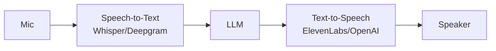

Плюсы: гибкость (выбор LLM/STT/TTS), явный текстовый trace.
Минусы: latency складывается (STT 200ms + LLM 800ms + TTS 300ms = 1.3s+), barge-in сложно реализовать.

**Realtime API (OpenAI Realtime, Gemini Live):**
- Audio → Audio в одной модели (multimodal).
- Latency ~300-500ms, нативный barge-in (модель знает, что пользователь начал говорить).
- Минусы: меньше контроля, выше поминутная стоимость, vendor lock-in.

**Оптимизации:**
- **Streaming STT** — начинаем LLM до конца фразы.
- **Streaming LLM** — TTS начинает озвучивать первые токены.
- **VAD (voice activity detection)** для barge-in.

## Q31. Build vs buy: own RAG vs hosted Pinecone, OSS vs commercial?

Критерии выбора:

| Компонент | Build (своё) | Buy (hosted) |
|---|---|---|
| **Vector DB** | pgvector в существующей PG | Pinecone, Weaviate Cloud |
| **LLM Gateway** | свой proxy на FastAPI | Portkey, LiteLLM, OpenRouter |
| **Observability** | логи + Grafana | Langfuse Cloud, LangSmith |
| **Инфра для fine-tuning** | свой кластер H100 | OpenAI/Together/Anyscale FT API |
| **Prompt registry** | git + сервис | Promptlayer, Langfuse |

**Build когда:** уникальные требования (compliance, кастомный retrieval, on-prem), есть инженерные ресурсы, > 1k QPS (экономика по cost).

**Buy когда:** старт, эксперименты, небольшая команда, нужен фокус на продукте, < 1k QPS.

**OSS vs commercial:** OSS = больше контроля, дешевле на длинной дистанции, требует ops; commercial = быстрее, SLA, поддержка.

## Q32. Real examples: Notion AI, Cursor, Perplexity, Devin — какие паттерны?

Высокоуровневый разбор реальных продуктов:

| Продукт | Базовая архитектура | Ключевые паттерны |
|---|---|---|
| **Notion AI** | RAG поверх документов workspace | индекс на каждый workspace, semantic search, structured output для action items |
| **Cursor** | Гибрид: длинный context (весь файл) + embedding-поиск (по кодовой базе) + tool use | speculative decoding, FT под код, multi-file context |
| **Perplexity** | RAG + агент: инструмент web-поиска + генерация цитат | онлайн-retrieval на каждый запрос, атрибуция источников в UI, streaming с inline-цитатами |
| **Devin** (Cognition) | Автономный coding-агент с долгоживущим исполнением | multi-step-планирование, sandboxed VM, self-reflection, human-checkpoint |
| **Claude apps (Artifacts, Projects)** | Workflow + инструменты: исполнение кода, анализ файлов, MCP | tool use, Projects = постоянный context (RAG-lite), Artifacts = structured output |
| **GitHub Copilot** | Edge (маленькая модель для автодополнения) + cloud (тяжёлая модель для чата) | каскадирование, FT под код, интеграция с IDE как поверхность инструментов |
| **ChatGPT Search** | Prompt + RAG + инструменты-агенты (browser, python) | маршрутизация инструментов, цитирование источников |

**Общий паттерн на 2025-2026:** все серьёзные продукты — **гибрид** (RAG + инструменты + немного FT + аккуратный prompt engineering), а не «чистый» один паттерн.

---

## See also

- [LLM Basics](llm-basics-interview.md) — основы моделей и API
- [RAG](rag-interview.md) — retrieval-augmented generation в деталях
- [Fine-tuning LLM](fine-tuning-llm-interview.md) — когда и как fine-tune
- [AI Agents](ai-agents-interview.md) — autonomous LLM systems
- [LLM Integration Patterns](llm-integration-patterns-interview.md) — gateway, retry, streaming
- [Prompt Engineering](prompt-engineering-interview.md) — design промптов
- [MCP](mcp-interview.md) — Model Context Protocol для tools
- [AI Observability](ai-observability-interview.md) — Langfuse, LangSmith, traces
- [Long Context vs RAG](long-context-vs-rag-interview.md) — когда context > retrieval
- [Inference Optimization](inference-optimization-interview.md) — latency и throughput
- [System Design Interview](../system-design/system-design-interview.md) — общий фреймворк
- [Scalability Patterns](../architecture/scalability-patterns-interview.md) — горизонтальное масштабирование
