# Вопросы на собеседовании: `AI Application Architecture Patterns`

Архитектура AI-приложений — это не выбор между «модной» технологией, а **inженерная задача**: подобрать комбинацию `prompt + RAG + fine-tune + agents` под конкретные требования (свежесть знаний, latency, cost, compliance). На senior-интервью спрашивают decision framework, hybrid-паттерны, end-to-end reference architecture, бюджеты latency/cost, anti-patterns и production stages.

## Полезные ссылки

### Официальная документация и авторитетные источники

- [OpenAI: Choosing between RAG, fine-tuning, and prompt engineering](https://platform.openai.com/docs/guides/optimizing-llm-accuracy)
- [Anthropic: Building effective agents](https://www.anthropic.com/research/building-effective-agents)
- [LangChain: Architecting LLM applications](https://python.langchain.com/docs/concepts/)
- [LlamaIndex: Production-ready RAG](https://docs.llamaindex.ai/en/stable/optimizing/production_rag/)
- [LiteLLM proxy — multi-provider gateway](https://docs.litellm.ai/docs/proxy/quick_start)
- [Portkey — AI gateway](https://portkey.ai/docs)
- [Eugene Yan: Patterns for building LLM systems](https://eugeneyan.com/writing/llm-patterns/)

## Содержание

- [Полезные ссылки](#полезные-ссылки)
- [See also](#see-also)

**4 base patterns**
- [Q1. (!) Какие 4 базовых паттерна AI-приложений?](#q1--какие-4-базовых-паттерна-ai-приложений)
- [Q2. (!) Когда выбрать Prompt Engineering vs RAG vs Fine-tune vs Agents?](#q2--когда-выбрать-prompt-engineering-vs-rag-vs-fine-tune-vs-agents)
- [Q3. Decision matrix по requirements?](#q3-decision-matrix-по-requirements)

**Hybrid patterns**
- [Q4. (!) RAG + Fine-tune — зачем комбинировать?](#q4--rag--fine-tune--зачем-комбинировать)
- [Q5. (!) Agents + RAG — retrieval как tool?](#q5--agents--rag--retrieval-как-tool)
- [Q6. Cascading prompts (small → large model)?](#q6-cascading-prompts-small--large-model)
- [Q7. RAG fallback to fine-tuned при low confidence?](#q7-rag-fallback-to-fine-tuned-при-low-confidence)

**End-to-end architecture**
- [Q8. (!) Reference architecture для production AI app?](#q8--reference-architecture-для-production-ai-app)
- [Q9. (!) Router layer — выбор модели по запросу?](#q9--router-layer--выбор-модели-по-запросу)
- [Q10. Tool Executor и sandboxing tools?](#q10-tool-executor-и-sandboxing-tools)

**Latency / Cost / Quality trade-offs**
- [Q11. (!) Latency budget breakdown (target < 2s)?](#q11--latency-budget-breakdown-target--2s)
- [Q12. (!) Cost arithmetic per request: prompt vs RAG vs agent?](#q12--cost-arithmetic-per-request-prompt-vs-rag-vs-agent)
- [Q13. Quality metrics для каждого паттерна?](#q13-quality-metrics-для-каждого-паттерна)
- [Q14. (!) TTFT, TPOT и streaming для UX?](#q14--ttft-tpot-и-streaming-для-ux)

**Production stages**
- [Q15. (!) Production stages: PoC → MVP → Production?](#q15--production-stages-poc--mvp--production)
- [Q16. Evolution path: prompt → RAG → fine-tune → agent?](#q16-evolution-path-prompt--rag--fine-tune--agent)

**Caching layers**
- [Q17. (!) Какие слои кеширования у AI-приложений?](#q17--какие-слои-кеширования-у-ai-приложений)
- [Q18. Semantic cache vs exact match — когда что?](#q18-semantic-cache-vs-exact-match--когда-что)

**Async patterns**
- [Q19. (!) Sync vs async vs streaming vs batch — data flow patterns?](#q19--sync-vs-async-vs-streaming-vs-batch--data-flow-patterns)
- [Q20. Webhook/SSE для long-running generations?](#q20-webhooksse-для-long-running-generations)

**Failure modes и fallback**
- [Q21. (!) Failure modes AI-системы и стратегии fallback?](#q21--failure-modes-ai-системы-и-стратегии-fallback)
- [Q22. Inference Gateway pattern (LiteLLM / Portkey / OpenRouter)?](#q22-inference-gateway-pattern-litellm--portkey--openrouter)

**Multi-tenancy и security**
- [Q23. (!) Multi-tenancy: per-tenant prompts, indices, rate limits?](#q23--multi-tenancy-per-tenant-prompts-indices-rate-limits)
- [Q24. (!) Security architecture: prompt injection, secrets, sandboxing?](#q24--security-architecture-prompt-injection-secrets-sandboxing)
- [Q25. Compliance-aware architecture (PII, GDPR, residency)?](#q25-compliance-aware-architecture-pii-gdpr-residency)
- [Q26. Cost monitoring и budgets per tenant/feature?](#q26-cost-monitoring-и-budgets-per-tenantfeature)

**Real examples и anti-patterns**
- [Q27. (!) Architecture anti-patterns в AI-проектах?](#q27--architecture-anti-patterns-в-ai-проектах)
- [Q28. Feature flags и A/B testing для AI features?](#q28-feature-flags-и-ab-testing-для-ai-features)
- [Q29. Edge AI: small model on-device + heavy в облаке?](#q29-edge-ai-small-model-on-device--heavy-в-облаке)
- [Q30. Voice agent architecture: STT → LLM → TTS vs Realtime API?](#q30-voice-agent-architecture-stt--llm--tts-vs-realtime-api)
- [Q31. Build vs buy: own RAG vs hosted Pinecone, OSS vs commercial?](#q31-build-vs-buy-own-rag-vs-hosted-pinecone-oss-vs-commercial)
- [Q32. Real examples: Notion AI, Cursor, Perplexity, Devin — какие паттерны?](#q32-real-examples-notion-ai-cursor-perplexity-devin--какие-паттерны)

## Q1. (!) Какие 4 базовых паттерна AI-приложений?

Любой production-AI-app — это комбинация четырёх кирпичей. Знание сильных/слабых сторон каждого — фундамент для архитектурных решений.

| Паттерн | Что делает | Setup cost | Per-request cost | Когда выбрать |
|---|---|---|---|---|
| **Prompt Engineering** | Zero/few-shot, system prompt, structured output (JSON schema) | $0 | низкий | Простые задачи, быстрое прототипирование, когда задача укладывается в context |
| **RAG** | Retrieve relevant context из vector/keyword index → LLM генерирует grounded ответ | средний (embedding pipeline + индекс) | средний (`embedding + LLM`) | Часто-обновляемая knowledge, факты-heavy, нужна attribution источников |
| **Fine-tuning** | Adapt веса модели под domain/style/format | высокий (датасет + train) | как у base + амортизация трейна | Стабильный стиль/формат, узкий domain, нужна низкая latency на маленькой модели |
| **Agents** | Multi-step с tool use, planning, reflection | средний (tool design) | высокий (5-15 LLM calls) | Open-ended задачи: code, research, browser automation, computer use |

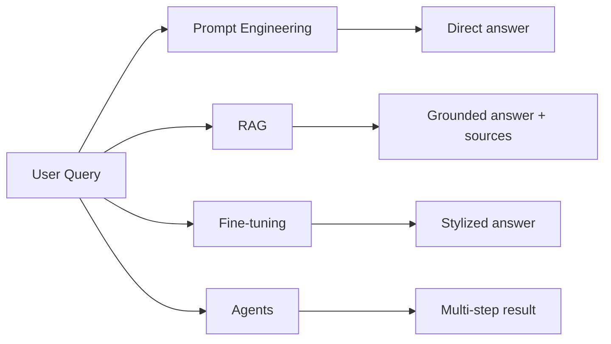

**Ключевая идея:** это не «или-или». В production почти всегда **гибрид** (см. Q4-Q7).

## Q2. (!) Когда выбрать Prompt Engineering vs RAG vs Fine-tune vs Agents?

Алгоритм выбора — по «верхним» характеристикам задачи:

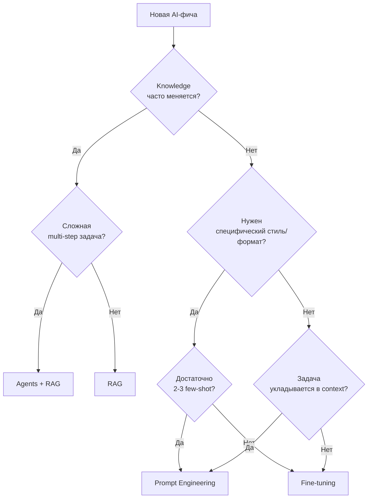

**Подсказки по сигналам:**

- «У нас 100k документов, обновляются каждый день» → **RAG**, не fine-tune.
- «Хотим всегда отвечать в нашем corporate-стиле» → **Fine-tune** (или system prompt + few-shot, если стиль простой).
- «Пользователь говорит "сделай рефакторинг репозитория"» → **Agents** (planning + tool use).
- «5 категорий, FAQ» → **Prompt Engineering** + structured output.

**Правило большого пальца:** начинай с самого дешёвого (Prompt) → эскалируй только при доказанных проблемах качества.

## Q3. Decision matrix по requirements?

Матрица для выбора паттерна по требованиям бизнеса:

| Требование | Prompt | RAG | Fine-tune | Agent |
|---|---|---|---|---|
| **Свежесть знаний** (часто меняются) | плохо | отлично | плохо (нужен retrain) | отлично (через RAG-tool) |
| **Адаптация стиля/формата** | средне | плохо | отлично | средне |
| **Latency < 500ms** | отлично | хорошо | отлично (малая модель) | плохо |
| **Cost < $0.01/request** | хорошо | средне | отлично (FT малая) | плохо |
| **Data privacy / on-prem** | через self-hosted | через self-hosted | отлично (свой weights) | сложнее (tools) |
| **Compliance / audit trail** | средне | отлично (источники) | средне | отлично (trace steps) |
| **Open-ended задачи** | плохо | средне | плохо | отлично |
| **Холодный старт (нет данных)** | отлично | средне (нужен корпус) | плохо | средне |

**Применение:** при дизайне фичи прописать requirements строками → найти паттерн, который не «плохо» ни в одной критичной строке.

## Q4. (!) RAG + Fine-tune — зачем комбинировать?

Классическая ошибка: пытаться **RAG-ом учить стилю** (плохо работает) или **fine-tune-ом учить фактам** (быстро устаревает, дорого).

**Правильное разделение:**

- **Fine-tune** учит модель **как отвечать** (style, format, tone, terminology, structured output).
- **RAG** даёт модели **что отвечать** (актуальные факты, документы, политики).

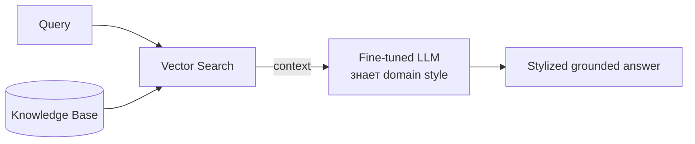

**Пример:** медицинский ассистент.
- Fine-tune на медицинской терминологии и формате SOAP-notes.
- RAG по последним guidelines, конкретной карте пациента.
- Результат: правильный стиль + актуальные факты.

**Когда не комбинировать:**
- Маленькое приложение → один паттерн дешевле.
- Если fine-tune не даёт измеримого +Δ качества над prompt+RAG → не нужен.

## Q5. (!) Agents + RAG — retrieval как tool?

Вместо того, чтобы делать RAG-pipeline жёстко (`retrieve → generate`), даём агенту **retrieval как инструмент** среди других.

```python
tools = [
    {"name": "search_docs", "description": "Search internal knowledge base"},
    {"name": "search_web", "description": "Search the web"},
    {"name": "query_sql", "description": "Run SQL on analytics DB"},
    {"name": "calculate", "description": "Run Python expression"},
]
```

**Преимущества:**
- Агент **сам решает**, когда нужен поиск (а когда хватит знаний из весов).
- Может **итеративно уточнять** запросы (`search_docs("policy") → search_docs("policy 2024 amendment")`).
- Может **комбинировать** источники (RAG + SQL + web).

**Недостатки:**
- Дороже: каждый LLM-step стоит денег.
- Loop risk: агент может бесконечно retrieve.
- Hard to evaluate (нет фиксированного pipeline).

**Когда выбрать:** complex research, customer support с разнородными данными, code agents.
**Когда НЕ выбрать:** простой Q&A — обычный RAG дешевле и предсказуемее.

## Q6. Cascading prompts (small → large model)?

Идея: **дешёвая модель** делает первый шаг (классификация / простой ответ), **дорогая** подключается только при необходимости.

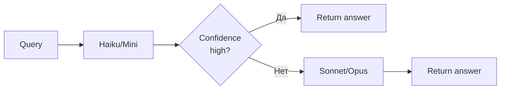

**Варианты cascading:**
- **Router model** (маленький LLM) классифицирует intent → выбирает специализированный pipeline.
- **Cheap-first answer** → если low confidence, эскалируем к dorogoй.
- **Sketch + refine**: small генерирует draft → large критикует и правит.

**Экономика:** если 70% запросов решает Haiku ($0.001), 30% эскалируем к Sonnet ($0.03) → blended cost = `0.7*0.001 + 0.3*0.03 = $0.0097` против $0.03 на все запросы.

## Q7. RAG fallback to fine-tuned при low confidence?

Гибридная стратегия:

1. Сначала пробуем **RAG** (retrieve + generate).
2. Оцениваем confidence: relevance score retriever-а + uncertainty модели.
3. Если **low confidence** (например, retrieval score < threshold или модель сказала «не знаю»):
   - Fallback к **fine-tuned модели** (которая знает domain «по умолчанию»).
   - Или к **human-in-the-loop**.

```python
result = rag_pipeline(query)
if result.retrieval_score < 0.5 or "I don't know" in result.answer:
    result = fine_tuned_model.answer(query)
    if result.confidence < 0.7:
        escalate_to_human(query)
return result
```

**Когда уместно:** customer support, где RAG не покрывает все кейсы, но fine-tuned baseline даёт «приемлемый» ответ.

## Q8. (!) Reference architecture для production AI app?

Канонический скелет, который масштабируется от MVP до enterprise:

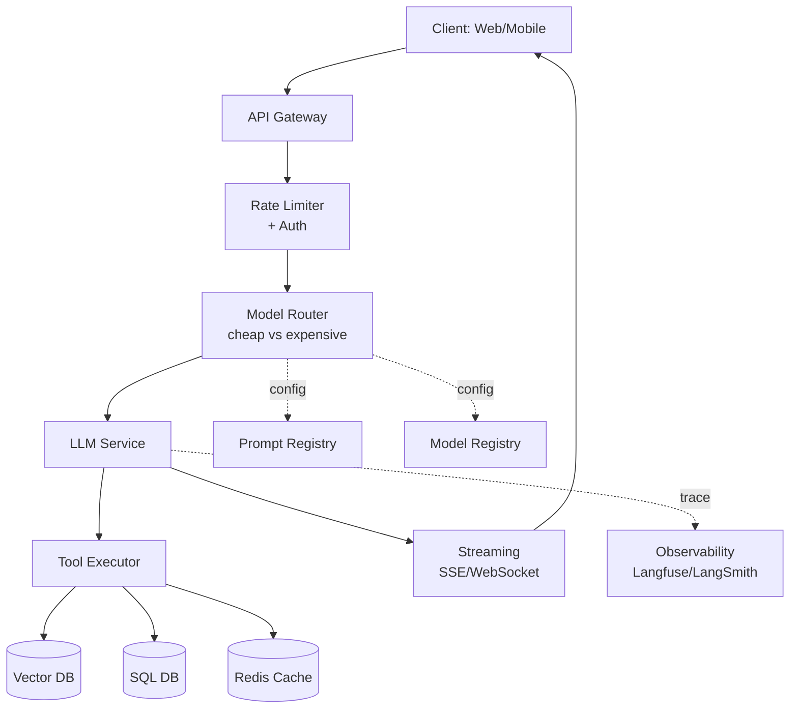

**Слои:**

| Слой | Назначение | Технологии |
|---|---|---|
| **API Gateway** | Routing, TLS, public surface | Kong, Envoy, NGINX, AWS ALB |
| **Rate Limiter + Auth** | JWT, per-user/tenant лимиты | Redis token bucket, Auth0, Keycloak |
| **Model Router** | Выбор `model` по запросу/тенанту | Custom + LiteLLM/Portkey |
| **LLM Service** | Вызов модели (OpenAI/Anthropic/local) | LangChain, Spring AI, LiteLLM |
| **Tool Executor** | Выполнение function calls (RAG, SQL, web) | Custom + sandbox |
| **Vector DB** | Embeddings index | Pinecone, Weaviate, pgvector, Qdrant |
| **Cache** | Embedding/semantic/exact-match cache | Redis, Mem0 |
| **Streaming** | SSE/WebSocket для TTFT UX | Spring WebFlux, FastAPI, Vercel AI SDK |
| **Observability** | Traces, evals, prompt versions | Langfuse, LangSmith, Helicone |
| **Prompt/Model Registry** | Versioning prompts/models | Promptlayer, Langfuse, GitOps |

**Принципы:**
- **Stateless service layer** — горизонтальное масштабирование.
- **Configurable model/prompt** — изменения без deploy.
- **Async-friendly** — SSE для TTFT, jobs для batch.
- **Trace everything** — каждый LLM call в Langfuse.

## Q9. (!) Router layer — выбор модели по запросу?

Router — слой, который решает: **какую модель** дёрнуть для конкретного запроса.

```python
def route(request: Request) -> Model:
    # 1. Tenant override
    if request.tenant.preferred_model:
        return request.tenant.preferred_model
    # 2. Intent-based routing
    if request.intent == "code":
        return "claude-sonnet-4.5"
    if request.intent == "simple_faq":
        return "haiku"
    # 3. Feature flag (canary)
    if feature_flags.enabled("opus-rollout", request.user_id):
        return "claude-opus-4"
    # 4. Budget-based
    if request.tenant.budget_left < 0.10:
        return "haiku"  # degraded
    return DEFAULT_MODEL
```

**Стратегии routing:**

| Стратегия | Когда | Плюсы | Минусы |
|---|---|---|---|
| **Static (по фиче)** | разные фичи разные модели | просто | негибко |
| **Intent classifier** | router-LLM выбирает | оптимально по cost | +latency, +cost classifier-а |
| **Cascading** | cheap → expensive | экономия | сложная eval |
| **A/B testing** | сравнение моделей | data-driven | overhead split traffic |
| **Tenant-config** | enterprise/BYOK | tenant control | ops complexity |

**Production:** обычно гибрид — static defaults + tenant override + feature flag rollout.

## Q10. Tool Executor и sandboxing tools?

Tool Executor — компонент, который выполняет function calls агента (`search_web`, `run_sql`, `execute_python`, `send_email`).

**Безопасность:**
- **Sandbox** для исполнения кода (Docker, gVisor, Firecracker, browser в Chrome sandbox).
- **Allowlist** для домена web-запросов.
- **Read-only DB user** для SQL-tool по умолчанию.
- **Human-in-the-loop** для destructive actions (send email, charge card).

**Архитектура:**

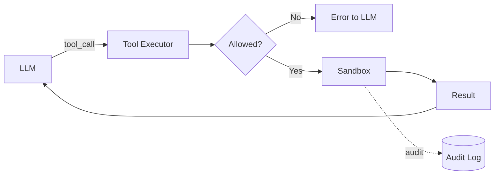

**Реализация в Spring/Python:** registry tool-ов, validation схемы (Pydantic/JSON Schema), timeout per tool call, retry с idempotency keys.

## Q11. (!) Latency budget breakdown (target < 2s)?

Цель: пользователь получает **TTFT < 1s**, full answer < 2s.

```mermaid
gantt
    title Latency budget end-to-end (~2s)
    dateFormat  x
    axisFormat %L ms
    section Edge
    Auth + rate limit       :a1, 0, 10
    section Retrieve
    Embedding query         :a2, after a1, 30
    Vector search           :a3, after a2, 100
    Rerank (optional)       :a4, after a3, 50
    section LLM
    Prompt assembly         :a5, after a4, 20
    LLM prefill (TTFT)      :a6, after a5, 500
    Token streaming         :a7, after a6, 1000
    section Tools
    Optional tool call      :a8, after a7, 500
```

**Разбивка:**

| Этап | Бюджет |
|---|---|
| Auth + rate limit | ~10ms |
| Embedding query | 20-50ms |
| Vector search | 50-200ms |
| Rerank (cross-encoder) | 30-150ms |
| Prompt assembly | <20ms |
| LLM prefill (TTFT) | 300-800ms (зависит от длины context) |
| Token streaming (full) | 500-2000ms (зависит от output) |
| Tool call (each) | 500-3000ms |

**Оптимизации:**
- **Streaming** — пользователь видит первый токен через TTFT, а не ждёт full answer.
- **Параллелить** retrieve и pre-LLM работу.
- **Cache** embeddings часто запрашиваемых queries.
- **Меньше context** — каждый дополнительный токен = время prefill.
- **Smaller / specialized model** для quick replies.

## Q12. (!) Cost arithmetic per request: prompt vs RAG vs agent?

Цифры для grounded conversations (Q4 2025 prices, USD):

| Паттерн | Расчёт | Стоимость request |
|---|---|---|
| **Pure prompt (GPT-4o/Sonnet)** | 1k in + 500 out tokens | $0.01 — $0.10 |
| **RAG** | embedding ($0.0001) + 3k context + 500 out | $0.02 — $0.15 |
| **Agent (5-15 LLM calls)** | каждый шаг 2k in + 1k out × N | $0.10 — $2.00 |
| **Fine-tuned base** | как base + amortized training cost (одноразовый ~$100-10000) | базовая цена + амортизация |
| **Cascading (70% Haiku, 30% Sonnet)** | blended | $0.005 — $0.015 |

**Формула для agent:**
```
cost_agent ≈ N_steps × (avg_in_tokens × price_in + avg_out_tokens × price_out)
```
Например, 10 steps × (3000 × $3/1M + 500 × $15/1M) = $0.165.

**Cost-optimization чек-лист:**
- Кеширование (см. Q17).
- Prompt caching (Anthropic / OpenAI prompt-cache).
- Меньше context (только relevant chunks).
- Cascading (Q6).
- Batch API (50% discount при < 24h SLA).
- Self-hosted для high-volume + стабильного workload.

## Q13. Quality metrics для каждого паттерна?

| Паттерн | Сильные стороны | Слабые стороны | Метрики |
|---|---|---|---|
| **Prompt Engineering** | гибкость, скорость итераций | variable quality, prompt drift | exact-match, BLEU, LLM-as-judge |
| **RAG** | hallucination ↓ (если grounded) | retrieval quality bottleneck | groundedness, recall@k, MRR |
| **Fine-tune** | style/format adherence | facts устаревают, gen quality стагнирует | task-specific accuracy, format-conformance |
| **Agents** | open-ended tasks, tool use | многошаговый failure rate накапливается | task success rate, # steps, $ per task |

**Eval-инфраструктура:** Langfuse / LangSmith датасеты + автоматический LLM-judge + регрессионные тесты на CI.

## Q14. (!) TTFT, TPOT и streaming для UX?

Две главные latency-метрики:

- **TTFT (Time To First Token)** — время от запроса до первого токена. Это **UX-метрика**, пользователь воспринимает её как «отзывчивость».
- **TPOT (Time Per Output Token)** — сколько ms на каждый следующий токен. Определяет «скорость печати».

**Зачем streaming:**
- Без streaming пользователь ждёт ~2s до **первого** символа.
- Со streaming он видит первый токен через ~500ms → воспринимаемая latency × 4 ↓.

**Стек:**
- **Backend:** SSE (Server-Sent Events) — простой HTTP/1.1, легко проходит через прокси.
- **Frontend:** `EventSource` API или Vercel AI SDK `useChat`.

**Тонкости:**
- При streaming **нельзя** retry на полпути — нужна стратегия resumability или начинать заново.
- Tool calls обычно streaming не поддерживают (надо получить полный tool_call объект).
- Логирование streaming-ответов: дописывать токены в trace по мере прихода.

## Q15. (!) Production stages: PoC → MVP → Production?

| Стадия | Цель | Что строим | Что НЕ строим |
|---|---|---|---|
| **PoC (1-2 недели)** | Доказать что задача решаема | Jupyter notebook, hard-coded prompt, OpenAI API, ручная eval на 20 примерах | Не строим: UI, auth, observability, scaling |
| **MVP (1-2 месяца)** | Реальные пользователи на dogfood | LangChain/LlamaIndex wrap, простая UI, базовая auth, минимальное логирование, eval датасет 100-500 примеров | Не строим: multi-tenant, BYOK, sophisticated routing, FT |
| **Production (3+ месяца)** | Reliable, scalable, observable | Reference architecture (Q8), proper evals, CI/CD prompts, observability, fallbacks, multi-tenancy, compliance | Перестаём cut corners |

**Антипаттерн:** прыгать через стадии. «Сразу production-grade» без PoC = трата месяцев на фичу, которая не работает.

## Q16. Evolution path: prompt → RAG → fine-tune → agent?

Естественный порядок усложнения, когда задача требует:

1. **Prompt** — пока хватает.
2. **Prompt + Few-shot** — если variance высокий.
3. **RAG** — когда нужны актуальные / большие знания.
4. **Better RAG** (rerank, hybrid search, query rewriting) — оптимизация retrieval.
5. **Fine-tune** — когда style/format не лечатся prompt-ом, или нужна speed/cost.
6. **Agents** — когда задача multi-step / open-ended.
7. **Multi-agent** — когда single agent тонет в сложности.

**Когда переходить:**
- Видишь systematic failure mode → выбираешь следующий шаг.
- НЕ переходи «потому что модно» — каждый шаг увеличивает stack complexity 2-3×.

## Q17. (!) Какие слои кеширования у AI-приложений?

| Слой | Что кешируется | TTL | Технологии |
|---|---|---|---|
| **Embedding cache** | text → embedding vector | долгий (текст детерминирован) | Redis, file cache |
| **Semantic cache** | similar query → cached answer (по cosine similarity) | средний | Redis Vector, Mem0, GPTCache |
| **Prompt cache** | переиспользование prefix у провайдера (system prompt, RAG context) | 5min-1h | Anthropic prompt cache, OpenAI prompt caching |
| **LLM response cache** | exact match query → answer | короткий (или event-driven invalidate) | Redis, Memcached |
| **Tool result cache** | tool call args → result | зависит от tool | Redis |

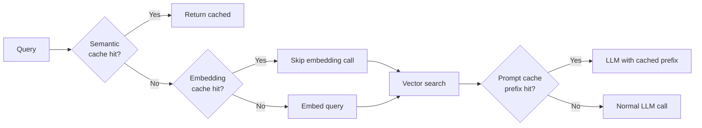

**Эффект:** на «горячих» запросах кеш срабатывает в 30-60% случаев → cost / latency пополам.

## Q18. Semantic cache vs exact match — когда что?

**Exact match cache** — `key = hash(query)`. Срабатывает только на точном повторе.
- Плюсы: 0 risk false positive.
- Минусы: hit rate низкий (1-5%).

**Semantic cache** — `key = embedding(query)`; hit если cosine_similarity > threshold.
- Плюсы: hit rate 20-40%.
- Минусы: **риск false positive** — похожий, но не идентичный смысл.

**Когда какой:**

| Use case | Cache |
|---|---|
| Финансы, медицина, юр. данные | Exact match |
| FAQ, базовый support | Semantic (threshold ≥ 0.95) |
| Brainstorming / open-ended | Без cache (нужна variability) |

**Tip:** для semantic cache добавь **invalidation** при изменении knowledge base — иначе кешированные ответы устаревают.

## Q19. (!) Sync vs async vs streaming vs batch — data flow patterns?

| Pattern | Описание | Когда | Latency |
|---|---|---|---|
| **Synchronous** | `POST /ask → 200 OK { answer }` | короткие задачи (< 2s) | low |
| **Async with callback** | `POST /ask → 202 Accepted { job_id }` → webhook | long generations, batch | high |
| **Streaming** | `POST /ask → SSE stream of tokens` | chat UX, codegen | TTFT low, full medium |
| **Batch** | upload file → output file (Anthropic/OpenAI batch API) | non-realtime: nightly enrich, evals | 0-24h (50% дешевле) |

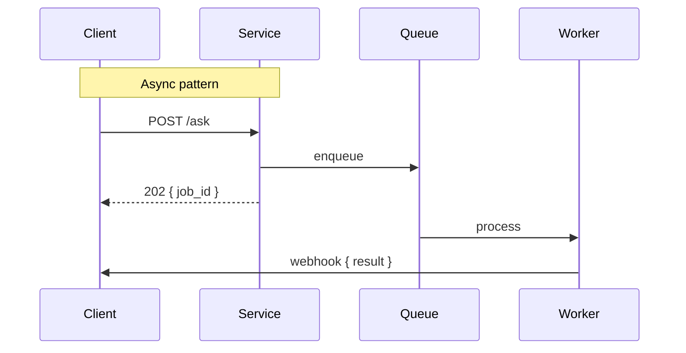

## Q20. Webhook/SSE для long-running generations?

Когда генерация занимает 10s-10min (deep research, coding agent):

- **SSE** хорош для «привязанных» к UI задач: пользователь смотрит на экран.
- **Webhook** хорош, когда клиент может уйти и вернуться: backend → backend интеграции.
- **Polling** — fallback для сервисов без webhook capability.

**Гибрид (best practice):** SSE для UI + сохранение прогресса в БД → если клиент отвалился, можно вернуться и **resubscribe** к state.

## Q21. (!) Failure modes AI-системы и стратегии fallback?

| Failure mode | Симптом | Fallback |
|---|---|---|
| **Provider down** | 5xx, timeouts | secondary provider (Anthropic ↔ OpenAI ↔ self-hosted) через gateway |
| **Rate limit (429)** | reject | queue + retry с jitter + degrade to cheaper model |
| **Context length exceeded** | API error | компрессия контекста, summarize, fewer chunks |
| **Hallucination / wrong** | bad answer | groundedness check → escalate to human |
| **Cost budget exceeded** | внутренний alert | graceful degradation (cheap model / cached / "недоступно") |
| **Slow response (latency spike)** | > p95 | timeout → fallback к cached / cheaper |
| **Tool failure** | tool returns error | retry tool / альтернативный tool / inform LLM |
| **Prompt injection** | malicious input | input rails + sanitize + reject |

**Принцип:** каждый внешний вызов должен иметь явный **fallback path**. Без fallback — system единая точка отказа.

## Q22. Inference Gateway pattern (LiteLLM / Portkey / OpenRouter)?

**Inference Gateway** — единый API над multiple providers, который централизует retry/fallback/caching/observability/RBAC.

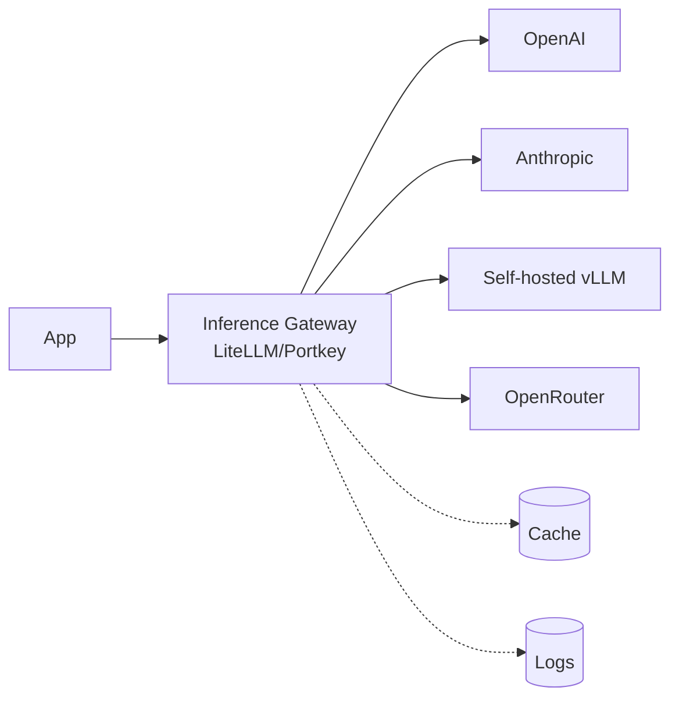

**Преимущества:**
- Единый формат (OpenAI-compatible) для всех провайдеров.
- Централизованные fallback / retry / circuit breaker.
- Per-tenant rate limits и cost tracking out-of-the-box.
- Observability одним подключением.
- A/B testing моделей без изменений в коде.

**LiteLLM proxy config (выдержка):**

```yaml
model_list:
  - model_name: gpt-4o
    litellm_params:
      model: openai/gpt-4o
      api_key: os.environ/OPENAI_API_KEY
  - model_name: claude-sonnet
    litellm_params:
      model: anthropic/claude-sonnet-4-5
      api_key: os.environ/ANTHROPIC_API_KEY

router_settings:
  fallbacks:
    - gpt-4o: [claude-sonnet]
  retry_policy:
    num_retries: 3
    timeout: 30
```

**Когда НЕ нужен:** если у вас один провайдер и < 1k requests/day — overhead не стоит того.

## Q23. (!) Multi-tenancy: per-tenant prompts, indices, rate limits?

Корпоративный AI-app поддерживает **тенантов** (организаций) с собственными:

| Ресурс | Реализация |
|---|---|
| **Prompts** | prompt registry с tenant_id namespace |
| **RAG index** | отдельный namespace в Pinecone/Weaviate per tenant (или filter by tenant_id) |
| **Models** | per-tenant config: BYOK (bring-your-own-key) или shared с virtual budget |
| **Rate limits** | per-tenant token bucket (Redis с key `rl:{tenant}:{user}`) |
| **Cost budgets** | per-tenant monthly cap, alert на 80%, hard cut на 100% |
| **Fine-tuned models** | tenant-specific FT (если кейс позволяет: enterprise) |
| **Data isolation** | row-level security в БД, encryption per-tenant ключом |

**Подводные камни:**
- **Cross-tenant leak в RAG** — забыли filter by tenant_id → утечка документов. Strict mandatory filter в retriever.
- **Shared cache poisoning** — semantic cache без tenant_id → ответ другого тенанта.
- **BYOK ключи** — храним в Vault, никогда в БД plaintext.

## Q24. (!) Security architecture: prompt injection, secrets, sandboxing?

Threat model и контрмеры:

| Угроза | Защита |
|---|---|
| **Prompt injection (direct)** | input rails (классификатор malicious), strict role separation, ограничение tool surface |
| **Indirect prompt injection** (через RAG / web tool) | sanitize retrieved content, content-filter LLM, treat tool output как untrusted |
| **Output rails** | проверка ответа: PII, jailbreak signals, policy violation |
| **Secrets exposure** | API keys в Vault/AWS Secrets Manager, никогда в prompts/logs; redact PII перед logging |
| **Tool sandboxing** | exec в Docker/gVisor, network allowlist, read-only FS, no creds inside |
| **Audit trails** | каждый LLM call + tool call + decision → audit log с user/tenant/timestamp |
| **API key management** | rotation, per-tenant scopes, dedicated keys per environment |
| **Rate limiting** | защита от abuse и budget DoS |

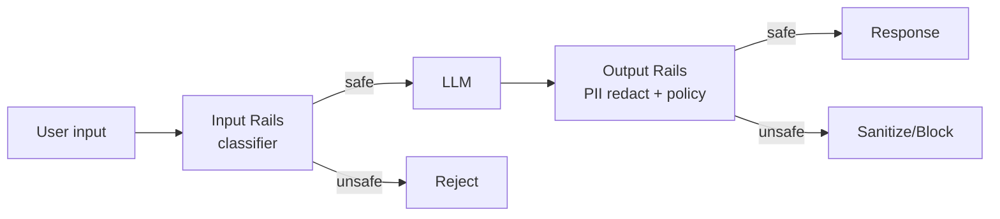

**Compliance bonus:** для regulated industries (фин, мед) — human review pipeline для всех output before customer-facing.

## Q25. Compliance-aware architecture (PII, GDPR, residency)?

Архитектурные требования при работе с PII / regulated data:

- **PII redaction layer** до отправки в LLM (regex + ML-detector).
- **Data residency** — выбор region для API (Anthropic / Azure OpenAI region-aware endpoints).
- **No-training agreement** — Anthropic / OpenAI API не учится на данных (по умолчанию для API).
- **Audit logging** — кто, что, когда, зачем; retention по compliance window.
- **GDPR consent** — explicit consent на использование AI features; right-to-be-forgotten для embeddings.
- **Encryption** — at-rest и in-transit; per-tenant ключи где возможно.
- **DPA / BAA** — Data Processing Agreement с провайдером (HIPAA: только compliant endpoints).
- **On-prem option** — для строгих кейсов self-hosted (Llama 3, Mistral, vLLM).

## Q26. Cost monitoring и budgets per tenant/feature?

**Что трекать:**
- Tokens in/out по `tenant`, `user`, `feature`, `model`.
- $ spent per request (с учётом provider price book).
- Anomaly: запрос > p99 cost / sudden spike.

**Где хранить:** time-series DB (VictoriaMetrics, Prometheus) + dashboards (Grafana).

**Контролы:**
- **Per-tenant budget** — monthly cap. Soft alert at 80%, hard cut at 100%.
- **Per-feature budget** — лимит для exploratory features.
- **Auto-shutoff** — если за час > 10× нормы → temporary throttle.
- **Cost-attribution в trace** — каждый Langfuse span содержит `cost_usd`.

**Пример формулы:** `cost = (in_tokens × price_in + out_tokens × price_out) / 1_000_000`. Для GPT-4o (Q4 2025): in $2.5/1M, out $10/1M.

## Q27. (!) Architecture anti-patterns в AI-проектах?

Самые частые ошибки на ревью:

| Anti-pattern | Симптом | Лечение |
|---|---|---|
| **Premature agents** | сложные multi-step pipelines когда хватает workflow | Use simple chain/workflow; agents only если open-ended |
| **RAG over fine-tune для style** | пытаемся стилем учить через context — плохо работает | Fine-tune для style, RAG для facts |
| **Hard-coded model** | `openai.chat.completions.create("gpt-4")` повсюду | model registry + config |
| **No fallback strategy** | один провайдер → outage = downtime | inference gateway + secondary provider |
| **No observability** | «оно сломалось, не знаю почему» | Langfuse / LangSmith с первого дня MVP |
| **Synchronous-only** | блокирующие 30s requests без streaming | SSE для UX, async для long jobs |
| **Plain prompt в коде** | prompts разбросаны по сорсам | prompt registry + version control |
| **No evals** | regression качества незаметен | golden dataset + CI eval |
| **Trust everything LLM выдаёт** | injection / hallucination проскакивают | input + output rails |
| **«Чем больше context, тем лучше»** | dumping 100k tokens — стоит дорого, качество падает | curated context (top-k + rerank) |

## Q28. Feature flags и A/B testing для AI features?

**Feature flags для AI:**
- Постепенный rollout новой модели/prompt (1% → 10% → 50% → 100%).
- Kill switch при инциденте.
- Per-user, per-tenant override.

**Tools:** LaunchDarkly, Unleash, Flagsmith, custom.

**A/B testing:**
- Split traffic between variants (model A vs model B, prompt v1 vs v2).
- Measure: user satisfaction (thumbs up/down), conversion, task completion.
- Statistical significance: minimum sample size, p-value < 0.05.
- **Online evals + offline evals** — sync online metrics с golden dataset performance.

**Пример:** новый prompt → 10% traffic → через 2 недели сравниваем thumbs-up rate. Если +5% → rollout, иначе — rollback.

## Q29. Edge AI: small model on-device + heavy в облаке?

Гибрид edge + cloud:

- **On-device:** Apple Intelligence (3B), Phi-3-mini, Gemma 2B, ONNX runtime, WebGPU + WebLLM в браузере, MLC LLM на мобильных.
- **Cloud:** тяжёлые модели для сложных задач.

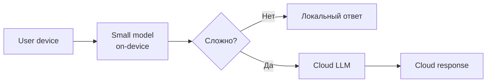

**Use cases:**
- **Latency-sensitive** (autocomplete, voice).
- **Privacy** (data не уходит в облако).
- **Offline** (mobile, embedded).
- **Cost** (free на устройстве пользователя).

**Trade-off:** малые модели глупее → нужна тщательная routing logic для эскалации.

## Q30. Voice agent architecture: STT → LLM → TTS vs Realtime API?

**Pipeline architecture (классика):**

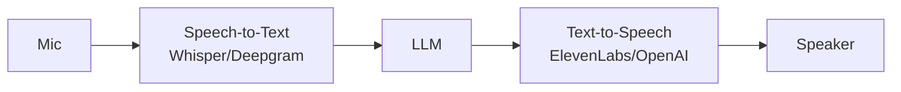

Плюсы: гибкость (выбор LLM/STT/TTS), explicit text trace.
Минусы: latency складывается (STT 200ms + LLM 800ms + TTS 300ms = 1.3s+), barge-in сложно реализовать.

**Realtime API (OpenAI Realtime, Gemini Live):**
- Audio → Audio в одной модели (multimodal).
- Latency ~300-500ms, native barge-in (modal знает, что пользователь начал говорить).
- Минусы: меньше контроля, выше per-minute cost, vendor lock-in.

**Optimizations:**
- **Streaming STT** — начинаем LLM до конца фразы.
- **Streaming LLM** — TTS начинает озвучивать первые токены.
- **VAD (voice activity detection)** для barge-in.

## Q31. Build vs buy: own RAG vs hosted Pinecone, OSS vs commercial?

Decision criteria:

| Component | Build (own) | Buy (hosted) |
|---|---|---|
| **Vector DB** | pgvector в существующей PG | Pinecone, Weaviate Cloud |
| **LLM Gateway** | свой proxy на FastAPI | Portkey, LiteLLM, OpenRouter |
| **Observability** | logs + Grafana | Langfuse Cloud, LangSmith |
| **Fine-tuning infra** | свой H100 кластер | OpenAI/Together/Anyscale FT API |
| **Prompt registry** | git + service | Promptlayer, Langfuse |

**Build когда:** уникальные требования (compliance, custom retrieval, on-prem), есть инженерная мощность, > 1k QPS (cost economics).

**Buy когда:** старт, exploratory, ограниченная команда, требуется фокус на product, < 1k QPS.

**OSS vs commercial:** OSS = больше контроля, дешевле long-run, требует ops; commercial = быстрее, SLA, поддержка.

## Q32. Real examples: Notion AI, Cursor, Perplexity, Devin — какие паттерны?

High-level разбор реальных продуктов:

| Продукт | Базовая архитектура | Ключевые паттерны |
|---|---|---|
| **Notion AI** | RAG поверх workspace документов | Per-workspace index, semantic search, structured output для action items |
| **Cursor** | Hybrid: long context (full file) + embedding search (codebase) + tool use | Speculative decoding, code-specific FT, multi-file context |
| **Perplexity** | RAG + agent: web search tool + citation generation | Online retrieval per query, source-attribution в UI, streaming с inline citations |
| **Devin** (Cognition) | Autonomous coding agent с long-running execution | Multi-step planning, sandboxed VM, self-reflection, human-checkpoint |
| **Claude apps (Artifacts, Projects)** | Workflow + tools: code execution, file analysis, MCP | Tool use, Projects = persistent context (RAG-lite), Artifacts = structured output |
| **GitHub Copilot** | Edge (autocomplete small model) + cloud (chat heavy model) | Cascading, code-specific FT, IDE integration as tool surface |
| **ChatGPT Search** | Prompt + RAG + agent tools (browser, python) | Tool routing, source citation |

**Общий паттерн на 2025-2026:** все серьёзные продукты — **гибрид** (RAG + tools + некоторое FT + careful prompt engineering), а не «чистый» один паттерн.

---

## See also

- [LLM Basics](llm-basics-interview.md) — основы моделей и API
- [RAG](rag-interview.md) — retrieval-augmented generation в деталях
- [Fine-tuning LLM](fine-tuning-llm-interview.md) — когда и как fine-tune
- [AI Agents](ai-agents-interview.md) — autonomous LLM systems
- [LLM Integration Patterns](llm-integration-patterns-interview.md) — gateway, retry, streaming
- [Prompt Engineering](prompt-engineering-interview.md) — design промптов
- [MCP](mcp-interview.md) — Model Context Protocol для tools
- [AI Observability](ai-observability-interview.md) — Langfuse, LangSmith, traces
- [Long Context vs RAG](long-context-vs-rag-interview.md) — когда context > retrieval
- [Inference Optimization](inference-optimization-interview.md) — latency и throughput
- [System Design Interview](../system-design/system-design-interview.md) — общий фреймворк
- [Scalability Patterns](../architecture/scalability-patterns-interview.md) — горизонтальное масштабирование
