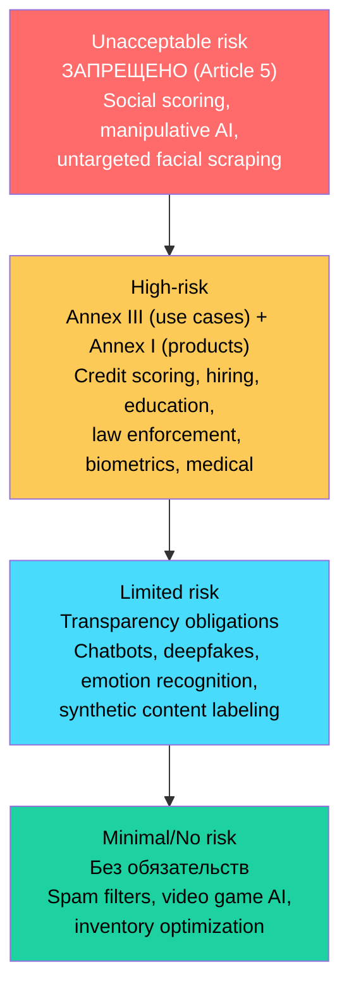
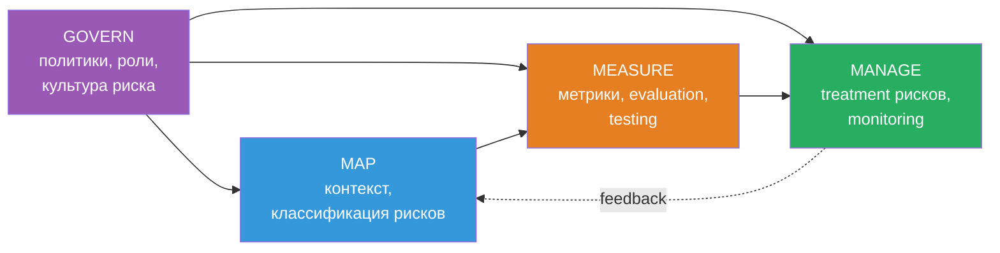
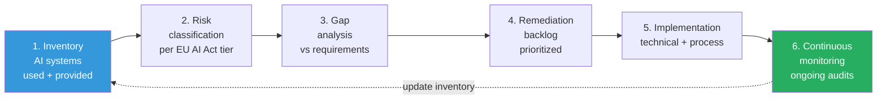

# Вопросы на собеседовании: `AI Compliance & Governance`

**AI Compliance & Governance** — это не «бюрократия про AI», а **операционная дисциплина**: классификация AI-систем по риску, документация (model cards, datasheets), технические меры (bias detection, explainability, audit trails) и процессы (DPIA, conformity assessment, incident reporting). В 2026 году это требование закона (EU AI Act, Colorado AI Act), а не «nice to have».

**Принцип:** compliance — это не «чек-лист перед релизом», а **непрерывный процесс** на всём жизненном цикле модели: от сбора данных и обучения до post-market monitoring и retirement.

> Дата актуализации: 2026-05-25.

## Полезные ссылки

### Регуляторика
- [EU AI Act — Regulation (EU) 2024/1689](https://eur-lex.europa.eu/eli/reg/2024/1689/oj) — официальный текст
- [AI Act Explorer](https://artificialintelligenceact.eu/) — интерактивный обзор статей
- [Colorado AI Act (SB 24-205)](https://leg.colorado.gov/bills/sb24-205) — первый comprehensive US state AI law
- [California AB 2013](https://leginfo.legislature.ca.gov/) — Generative AI Training Data Transparency
- [NYC Local Law 144](https://www.nyc.gov/site/dca/about/automated-employment-decision-tools.page) — hiring AI bias audits

### Фреймворки и стандарты
- [NIST AI Risk Management Framework 1.0](https://www.nist.gov/itl/ai-risk-management-framework) — Jan 2023
- [NIST AI RMF Generative AI Profile (NIST-AI-600-1)](https://nvlpubs.nist.gov/nistpubs/ai/NIST.AI.600-1.pdf) — July 2024
- [ISO/IEC 42001:2023](https://www.iso.org/standard/81230.html) — AI Management System
- [ISO/IEC 23894:2023](https://www.iso.org/standard/77304.html) — AI Risk Management
- [OECD AI Principles](https://oecd.ai/en/ai-principles)

### Документация моделей и данных
- [Model Cards (Mitchell et al. 2019)](https://arxiv.org/abs/1810.03993)
- [Datasheets for Datasets (Gebru et al. 2018)](https://arxiv.org/abs/1803.09010)
- [HuggingFace Model Card Guide](https://huggingface.co/docs/hub/model-cards)
- [C2PA Content Provenance](https://c2pa.org/)

### Incident DB и safety
- [AI Incident Database](https://incidentdatabase.ai/) — Stanford / Partnership on AI
- [White House Blueprint for an AI Bill of Rights](https://www.whitehouse.gov/ostp/ai-bill-of-rights/)
- [UK AI Safety Institute (AISI)](https://www.aisi.gov.uk/)

## Содержание

1. [EU AI Act: risk tiers, GPAI, penalties](#eu-ai-act-risk-tiers-gpai-penalties)
2. [NIST AI RMF и ISO/IEC 42001](#nist-ai-rmf-и-isoiec-42001)
3. [GDPR и data privacy для AI](#gdpr-и-data-privacy-для-ai)
4. [US, UK, China — regulation landscape](#us-uk-china--regulation-landscape)
5. [Model cards и datasheets](#model-cards-и-datasheets)
6. [Bias detection и explainability](#bias-detection-и-explainability)
7. [Audit trails и provenance](#audit-trails-и-provenance)
8. [Compliance roadmap и red teaming](#compliance-roadmap-и-red-teaming)
9. [Copyright и data residency](#copyright-и-data-residency)

---

## EU AI Act: risk tiers, GPAI, penalties

## Q1. Что такое EU AI Act, когда он вступил в силу и какова фазированная имплементация? (!)

**EU AI Act** — Регламент `(EU) 2024/1689`, **первый в мире** комплексный регламент по AI. Опубликован в Official Journal **12 июля 2024**, вступил в силу **1 августа 2024**.

**Фазированная имплементация** (не «всё сразу»):

| Дата | Что вступает в силу |
|---|---|
| **2 февраля 2025** | Запреты `prohibited AI` (Article 5), обязательные требования к AI literacy сотрудников |
| **2 августа 2025** | Правила для `GPAI` (General-Purpose AI), назначение национальных компетентных органов, штрафы (кроме GPAI) |
| **2 августа 2026** | Основная часть требований к `high-risk` (системы из Annex III), обязательства провайдеров и деплойеров |
| **2 августа 2027** | High-risk AI, **встроенный в продукты** (Annex I — медтехника, машины, игрушки), полное правоприменение |

**Зачем фазы:** регуляторам и индустрии нужно время на подготовку — назначить органы оценки соответствия (conformity assessment bodies), написать гармонизированные стандарты (CEN-CENELEC JTC 21), создать AI Office и AI Board. Поэтому самые опасные практики запретили первыми, а сложные технические требования к high-risk отложили на пару лет.

**Кого затрагивает** (Article 2): провайдера (кто создаёт систему и выводит её на рынок EU), деплойера (кто использует AI в EU), импортёра и дистрибьютора. Ключевой момент — **экстерриториальность**: регламент действует и на компании вне EU, если результат работы системы используется в EU. Это та же логика, что у GDPR: важно, где применяется AI, а не где зарегистрирован вендор.

> EU AI Act — это **регулирование безопасности продукта** (product safety regulation), а не закон о приватности. Он не заменяет GDPR, а дополняет его: GDPR покрывает данные, AI Act — систему.

## Q2. Какие четыре risk tier-а определяет EU AI Act? (!)

**Пирамида рисков** — фундамент регламента. Четыре уровня, от запрещённого до минимального:



Чем выше уровень, тем строже режим — от полного запрета до полной свободы:

**Unacceptable risk** (Article 5) — запрещено **полностью**, без вариантов: социальный скоринг госорганами, манипулятивный AI с физическим/психологическим вредом, эксплуатация уязвимостей (детей, инвалидов), биометрическая идентификация в реальном времени в публичных местах (с узкими исключениями для правоохраны), предиктивный полисинг по профилю, нецелевой сбор лиц (scraping) из интернета, распознавание эмоций на работе и в образовании, биометрическая категоризация по чувствительным атрибутам (раса, религия).

**High-risk** (Annex III) — разрешено, но под жёсткими требованиями (Art. 9-15): кредитный скоринг, найм/HR, образование (оценка экзаменов), правоохрана (оценка рисков подозреваемых), критическая инфраструктура (электросети, транспорт), миграция/убежище, отправление правосудия, демократические процессы. Плюс Annex I — AI как компонент безопасности (safety component) в регулируемых продуктах (медтехника MDR, машины, игрушки).

**Limited risk** — единственное обязательство — прозрачность: чат-бот должен признаться, что он AI; deepfake-контент должен быть помечен; при распознавании эмоций — уведомление субъекта.

**Minimal/No risk** — обязательств нет вообще. Сюда попадает большинство AI-систем (≈85% по оценкам Commission): спам-фильтры, AI в играх, оптимизация склада.

> **Ключевая идея:** классификация идёт **по сценарию использования** (per use case), а не по технологии. Один и тот же LLM может быть high-risk в найме (скрининг резюме) и minimal в спам-фильтре — поэтому tier определяют для каждого применения отдельно.

## Q3. Какие требования EU AI Act предъявляет к high-risk AI системам? (!)

High-risk — это не «нельзя», а «можно при выполнении девяти требований» (Chapter III Section 2). Их основная тяжесть лежит на **провайдере** (создающем систему), часть — на **деплойере** (использующем):

| Требование | Что включает |
|---|---|
| **Risk management system** (Art. 9) | Непрерывный процесс на всём жизненном цикле: идентификация рисков → оценка → митигация → тестирование |
| **Data governance** (Art. 10) | Критерии качества для train/validation/test, выявление bias, репрезентативность, статистические свойства |
| **Technical documentation** (Art. 11, Annex IV) | Архитектура, методология обучения, метрики производительности, предвидимые риски |
| **Record-keeping** (Art. 12) | Автоматическое логирование — входные данные, ссылки, идентификация лиц, хранение минимум 6 месяцев |
| **Transparency** (Art. 13) | Инструкции по использованию, возможности, ограничения, ожидаемая точность, требования к человеческому надзору |
| **Human oversight** (Art. 14) | Реальная возможность вмешаться, переопределить (override), остановить — а не косметическое «уведомление» |
| **Accuracy, robustness, cybersecurity** (Art. 15) | Уровни производительности, устойчивость к ошибкам, защита от adversarial-атак, data poisoning |
| **Quality management system** (Art. 17) | В стиле ISO 9001 — политики, процедуры, соответствие регуляторике, post-market monitoring |
| **Conformity assessment** (Art. 43) | Внутренняя (self-assessment) или с notified body — перед `CE marking` |

Важно: соответствие не заканчивается релизом. **Post-market monitoring** (Art. 72) обязывает провайдера непрерывно следить за системой после запуска и сообщать о `serious incidents` (Art. 73) в течение **15 дней** (24 часа — для широко распространённых нарушений или сбоя инфраструктуры). То есть compliance — это процесс на весь жизненный цикл, а не разовая проверка.

**Что должен делать деплойер** (Art. 26): использовать систему строго по инструкции, обеспечить реальный человеческий надзор, мониторить работу, логировать выходы, информировать затронутых людей и проводить **FRIA** (Fundamental Rights Impact Assessment) — если это публичный орган или воздействие значимо.

## Q4. Что такое GPAI и какие у него специальные обязательства? (!)

**GPAI** (General-Purpose AI model) — модель «общего назначения», способная выполнять широкий спектр задач, обычно обученная на больших данных через self-supervision (Article 3(63)). Примеры: GPT-4, Claude, Gemini, Llama 3, Mistral Large.

**Не путать** `GPAI model` с `GPAI system`: модель — это веса + код, system — модель в составе продукта. Регулируют именно модель, потому что её обязательства затем «наследуются» всеми продуктами, построенными поверх неё.

Обязательства устроены **в два уровня** (Chapter V) — базовый для всех и усиленный для самых мощных моделей:

**Все провайдеры GPAI** (Art. 53):
- Техническая документация (Annex XI) — архитектура, процесс обучения, источники данных.
- Информация и документация для downstream-провайдеров (Annex XII).
- Политика соблюдения авторских прав (DSM Directive).
- Публикация **краткого описания обучающего контента** (summary of training content) по шаблону AI Office.

**GPAI с systemic risk** (Art. 51-55) — те же базовые обязательства плюс расширенный набор:
- Критерий попадания: вычислительные ресурсы на обучение **> 10²⁵ FLOPS** (≈ масштаб GPT-4) либо отдельное назначение AI Office по уровню возможностей (capability).
- Дополнительно: оценки модели (включая adversarial-тестирование / red teaming), оценка системных рисков и их митигация, отчётность об инцидентах, кибербезопасность, раскрытие энергопотребления.
- Следование `codes of practice` (на 2026 — General-Purpose AI Code of Practice, опубликован в апреле 2025).

**Исключение для open-source**: со свободно доступных моделей (опубликованы веса, архитектура, информация об использовании) часть обязательств снимается — но НЕ с моделей с systemic risk и НЕ в части авторских прав и публикации training summary. То есть «открытость» спасает от документации, но не от ответственности за самые мощные модели.

## Q5. Какие penalties предусмотрены EU AI Act?

Штрафы трёхуровневые — чем серьёзнее нарушение, тем выше потолок (Article 99). Для каждого уровня берут **большее** из абсолютной суммы и процента от оборота:

| Нарушение | Штраф |
|---|---|
| Запрещённые практики AI (Art. 5) | до **€35M** или **7% от глобального годового оборота** |
| Несоблюдение требований к high-risk или обязательств GPAI | до **€15M** или **3%** |
| Некорректная, неполная или вводящая в заблуждение информация | до **€7.5M** или **1%** |

**Защита малого бизнеса:** для SME и стартапов потолки считают наоборот — берут **меньшее** из двух значений, чтобы штраф не убил небольшую компанию.

**Сравнение с GDPR:** у GDPR потолок 4% или €20M. AI Act заметно жёстче за запрещённые практики (7%) и примерно сопоставим для остальных нарушений.

**Кто штрафует:** для большинства нарушений — национальные `market surveillance authorities` государств-членов; для GPAI — AI Office на уровне Commission.

> Первые крупные штрафы ожидаются **не раньше 2026-2027**, когда полностью вступит в силу часть про high-risk. Но запрещённые практики AI уже подпадают под правоприменение с февраля 2025.

## Q6. Что такое Annex III high-risk use cases — приведи примеры

**Annex III** — список «областей» применения high-risk AI (можно расширять делегированными актами):

1. **Биометрическая идентификация и категоризация** (не запрещённая) — биометрическая верификация (1:1), категоризация не по чувствительным признакам.
2. **Критическая инфраструктура** — управление электро-, газо-, водоснабжением, дорожным трафиком.
3. **Образование и профессиональная подготовка** — оценка экзаменов, приём, мониторинг поведения студентов.
4. **Занятость и HR** — рекрутинг (скрининг и ранжирование резюме), распределение задач, мониторинг, оценка, увольнение.
5. **Базовые частные и публичные услуги** — кредитный скоринг, андеррайтинг в страховании, диспетчеризация экстренных вызовов, право на получение публичных льгот.
6. **Правоохрана** — оценка риска рецидива, альтернативы полиграфу, оценка надёжности доказательств, прогнозирование преступлений.
7. **Миграция, убежище, пограничный контроль** — оценка риска заявителей, подлинность документов, решения о праве на въезд.
8. **Отправление правосудия и демократические процессы** — помощь судье в исследовании/толковании права, влияние на выборы.

**Условно high-risk** (Art. 6(3)) — важная «лазейка»: даже если система формально попадает в область Annex III, она может **не** быть high-risk, если выполняет лишь узкую процедурную задачу, улучшает результат уже принятого человеком решения или выявляет паттерны, не заменяя оценку человеком. Но воспользоваться этим можно только письменно задокументировав обоснование — иначе по умолчанию система считается high-risk.

**Примеры для интуиции** (один и тот же AI в разных ролях даёт разный tier):
- `CV ranker` в найме — high-risk.
- `credit decision engine` в банке — high-risk.
- `traffic light optimization` — high-risk.
- `email spell-checker` — minimal.
- `customer chatbot` для бронирования — limited (только прозрачность).

---

## NIST AI RMF и ISO/IEC 42001

## Q7. Что такое NIST AI Risk Management Framework и какие у него четыре функции? (!)

**NIST AI RMF 1.0** (Jan 2023) — **добровольный** фреймворк от U.S. National Institute of Standards and Technology. Формально это не закон и штрафов за несоблюдение нет, но де-факто он стал стандартом в США: на него ссылаются федеральные контракты, executive orders и законы штатов (Colorado AI Act). Обязательность приходит косвенно — через документы, которые его требуют.

**Четыре ключевые функции** — это не последовательные этапы, а взаимосвязанные блоки, где Govern пронизывает остальные три:



**Govern** — сквозная функция: стратегия управления AI-рисками, ответственность (accountability), политики, роли (RACI), культура, supply chain.

**Map** — контекст: цели системы, стейкхолдеры, риски (предполагаемое и предвидимое злоупотребление), оценка воздействия, классификация по характеристикам доверия (trustworthiness).

**Measure** — количественная и качественная оценка: accuracy, robustness, fairness, explainability, privacy, security. Тестирование, TEVV (Testing, Evaluation, Validation, Verification).

**Manage** — приоритизация рисков, обработка (avoid/mitigate/transfer/accept), непрерывный мониторинг, реагирование на инциденты, вывод из эксплуатации.

**Характеристики Trustworthy AI** (сквозные): valid & reliable, safe, secure & resilient, accountable & transparent, explainable & interpretable, privacy-enhanced, fair (управляемый bias).

## Q8. Что такое NIST AI RMF Generative AI Profile?

**NIST AI 600-1** (July 2024) — сопутствующий профиль (companion profile) к RMF 1.0, заточенный под `generative AI`. Он не добавляет новых функций, а наполняет те же четыре (Govern/Map/Measure/Manage) **200+ конкретными действиями** именно для генеративных моделей — то есть переводит общий фреймворк на язык практики GenAI.

Главная ценность профиля — **12 категорий рисков**, специфичных для генеративного AI:

| Категория | Пример |
|---|---|
| `CBRN information` | Инструкции по химическому/биологическому/радиологическому/ядерному оружию |
| `Confabulation` | Галлюцинации — уверенный неверный ответ |
| `Dangerous, violent, hateful content` | Токсичные выходы |
| `Data privacy` | Утечка PII из обучающих данных, prompt injection с PII |
| `Environmental impact` | Углеродный след обучения/инференса |
| `Harmful bias and homogenization` | Дискриминация, mode collapse |
| `Human-AI configuration` | Чрезмерное доверие, антропоморфизация |
| `Information integrity` | Дезинформация, deepfakes |
| `Information security` | Кража модели, prompt injection, RCE через tool use |
| `Intellectual property` | Нарушения авторских прав в выходах |
| `Obscene/abusive sexual content` | CSAM, изображения без согласия |
| `Value chain and component integration` | Третьи стороны — модели, датасеты, инфраструктура |

> GenAI Profile **не обязателен**, но активно используется как baseline в США — особенно в контрактах федеральных агентств после EO 14110 (даже после его отмены в 2025 многие требования AI Use Case Inventory продолжают действовать).

## Q9. Что такое ISO/IEC 42001 и как он связан с EU AI Act? (!)

**ISO/IEC 42001:2023** (опубликован в декабре 2023) — первый **сертифицируемый** международный стандарт для AI Management System (AIMS). Структура — Annex SL (как у ISO 27001, 9001) — встраивается в существующую ISMS.

**Ключевые элементы**:
- Контекст организации (4) — внешние/внутренние факторы, стейкхолдеры.
- Лидерство (5) — AI-политика, роли.
- Планирование (6) — оценка рисков, возможностей, AI-цели.
- Поддержка (7) — ресурсы, компетенции, осведомлённость, документация.
- Эксплуатация (8) — контроли жизненного цикла, оценка воздействия, третьи стороны.
- Оценка результатов (9) — мониторинг, внутренний аудит, management review.
- Улучшение (10) — несоответствия, корректирующие действия.

**Контроли Annex A**: ~38 контролей в 9 категориях — AI-политики, внутренняя организация, жизненный цикл AI (проектирование, разработка, V&V, развёртывание, эксплуатация, вывод из эксплуатации), данные, информация для заинтересованных сторон.

**Связь с EU AI Act** (ключевая мысль для собеседования) — это разные по природе вещи, которые дополняют друг друга:
- ISO 42001 регулирует **процесс** (как вы управляете AI), AI Act регулирует **продукт** (что именно вы выпускаете).
- Поэтому сертификация ISO 42001 НЕ заменяет соответствие AI Act, но **демонстрирует** наличие quality management system по Art. 17 AI Act — то есть закрывает одно из девяти требований и упрощает аудит.
- Гармонизированные стандарты (CEN-CENELEC) под AI Act ещё пишутся (ожидаются в 2026-2027), и пока их нет, ISO 42001 — лучший доступный способ показать зрелость governance.

**Сопутствующий стандарт:** **ISO/IEC 23894:2023** — руководство по AI Risk Management (НЕ сертифицируемое), детализирует подход к рискам из ISO 31000 применительно к AI.

**Кому полезно:** провайдерам GPAI, корпоративным AI-вендорам, деплойерам high-risk — всем, кому нужно доказать клиентам и регуляторам «у нас есть AI governance».

---

## GDPR и data privacy для AI

## Q10. Как GDPR применяется к AI-системам? (!)

**GDPR** (Regulation 2016/679, в силе с 2018) **не упоминает AI напрямую**, но множество положений активно применяются:

| Положение | Применение к AI |
|---|---|
| **Article 5** — принципы | Минимизация данных против «больше данных = лучше модель» (конфликт), ограничение цели, точность |
| **Article 6** — законное основание | Обучающие данные — на каком правовом основании? Легитимный интерес (с balancing-тестом), согласие, договор |
| **Article 9** — особые категории | Здоровье, биометрия, раса — строгий запрет с исключениями |
| **Article 13-14** — информирование субъекта | Наличие автоматизированного принятия решений, задействованная логика, последствия |
| **Article 15** — право доступа | Включает логику автоматизированных решений |
| **Article 17** — право на удаление | «Право на забвение» в обучающих данных — **технически сложно** (нужен retraining, unlearning) |
| **Article 22** — автоматизированное принятие решений | Особая защита для решений «исключительно» (solely) автоматических с правовым/значимым эффектом |
| **Article 25** — privacy by design | Применимо к архитектуре AI |
| **Article 35** — DPIA | Обязательна для high-risk-обработки — почти всегда для AI |
| **Chapter V** — международные трансферы | Обучение/инференс через границы — SCCs, решения об адекватности |

**Конфликт с AI Act** (любимый вопрос интервьюеров): GDPR требует удалять данные по запросу (Art. 17), а AI Act требует хранить логи решений 6+ месяцев (Art. 12) — прямое противоречие. Разрешают его так: логи и обучающие данные относят к разным категориям, а сами логи анонимизируют, чтобы хранение не нарушало право на удаление.

**Schrems II** (2020) — CJEU признал недействительным Privacy Shield и осложнил трансферы US ↔ EU. Частично решено через EU-US Data Privacy Framework (July 2023), но юридические оспаривания продолжаются — так что трансграничные пайплайны до сих пор юридически уязвимы.

## Q11. Что такое DPIA и когда она обязательна для AI? (!)

**DPIA** (Data Protection Impact Assessment, Article 35 GDPR) — формальная оценка рисков для прав и свобод субъектов данных перед началом обработки.

**Обязательна**, когда:
- Систематическая и масштабная оценка, включая профилирование, с правовыми/значимыми эффектами.
- Крупномасштабная обработка особых категорий (Article 9) или данных о судимостях.
- Систематический мониторинг публично доступной зоны.
- Дополнительные критерии EDPB Guidelines 248 (≥2 из 9): оценка/скоринг, автоматизированное решение, систематический мониторинг, чувствительные данные, большой масштаб, сопоставление/объединение датасетов, уязвимые субъекты, инновационные технологии, блокировка прав субъекта данных.

**Практический вывод:** почти любой AI-проект набирает минимум 2 критерия (например, scoring + automated decision + большой масштаб), поэтому DPIA для AI — фактически обязательна по умолчанию.

**Что входит в DPIA** (Art. 35(7)):
1. Систематическое описание обработки, целей, легитимного интереса.
2. Оценка необходимости и пропорциональности.
3. Риски для прав и свобод субъектов.
4. Меры по снижению рисков — гарантии (safeguards), безопасность, механизмы соответствия.

**Связь с AI Act:** для high-risk AI деплойеры (публичные органы, банки, страховщики) дополнительно проводят `Fundamental Rights Impact Assessment` (FRIA, Art. 27). DPIA и FRIA **дополняют** друг друга, а не заменяют: DPIA — про защиту данных, FRIA — про все фундаментальные права. EDPB советует делать одну **интегрированную** оценку, чтобы не дублировать работу.

**Кто проводит:** контролёр данных с участием DPO (если он есть). Если остаточный высокий риск не удалось снизить — обязательна консультация с надзорным органом до старта.

## Q12. Что говорит Article 22 GDPR про automated decision-making?

**Суть Article 22(1):** субъект имеет право не быть объектом решения, основанного **исключительно** (solely) на автоматизированной обработке (включая профилирование), если это решение порождает **правовые последствия** или **аналогичным образом значимо** на него влияет.

**Главное слово — «solely»:** статья применяется только к решениям, принятым целиком автоматически. Если человек проводит осмысленный (meaningful) пересмотр — Art. 22 не действует. Но ловушка в том, что формальное «нажать approve» без анализа = всё равно исключительно автоматическое решение: EDPB Guidelines 251 требуют **активного и существенного** участия человека, а не косметического.

**Примеры**:
- `Solely automated` (Art. 22 применяется): онлайн кредитный скоринг, автоматический отказ по резюме, онлайн таргетинг рекламы (спорно), авто-отклонение страхового требования.
- `Human in the loop` (Art. 22 НЕ применяется): AI помечает → человек проверяет → человек решает.

**Исключения** (Art. 22(2)):
- Необходимо для договора (a),
- Разрешено правом EU/государства-члена с гарантиями (b),
- Явное согласие (c).

Даже при исключении — минимальные **гарантии**: право на вмешательство человека, выражение своей точки зрения, право оспорить решение.

**Особые категории** (Art. 22(4)): данные по Art. 9 — только согласие или существенный общественный интерес.

**Дело SCHUFA** (CJEU, December 2023, C-634/21) — важный прецедент: сам по себе кредитный скоринговый балл считается автоматизированным решением, даже если банк формально использует его «лишь как входной параметр» — при условии, что на практике балл фактически определяет исход. Прятать решение за словом «input» не получится.

---

## US, UK, China — regulation landscape

## Q13. Что такое AI Bill of Rights и Executive Order 14110?

**Blueprint for an AI Bill of Rights** (October 2022, White House OSTP) — **необязывающий** (non-binding) фреймворк из 5 принципов:

1. **Safe and Effective Systems** — тестирование до развёртывания, мониторинг.
2. **Algorithmic Discrimination Protections** — проактивная оценка справедливости (equity).
3. **Data Privacy** — встроенная защита, контроль над данными.
4. **Notice and Explanation** — субъект знает про AI и логику.
5. **Human Alternatives, Consideration, Fallback** — opt-out, человеческое решение.

**Сила**: морально-политическая, а не закон. Влияет на федеральные госзакупки, рекомендации агентств.

**Executive Order 14110** (Biden, October 2023) — **крупнейший AI executive order в США**. В отличие от Bill of Rights, это уже распоряжение с конкретными требованиями:
- Тестирование безопасности frontier-моделей (compute > 10²⁶ FLOPS) с отчётностью.
- NIST-фреймворк для red-teaming.
- Аутентификация контента (C2PA).
- Виза для AI-талантов.
- Инвентаризации сценариев использования AI (AI Use Case Inventories) в федеральных агентствах.

**Отменён Трампом (January 2025)** — через EO 14179 «Removing Barriers to American Leadership in AI». Но отмена executive order не стёрла всё: ряд элементов пережил её, потому что держится на других опорах:
- Федеральные AI Use Case Inventories продолжаются (это требование Congress, а не EO).
- NIST AI RMF и GenAI Profile независимы от EO.
- Законы штатов не затронуты (федерального вытеснения, preemption, нет).

## Q14. Что такое Colorado AI Act и какие US state-level AI laws есть? (!)

**Colorado AI Act (SB 24-205)**, подписан в мае 2024, в силе с **1 февраля 2026** — **первый комплексный** AI-закон в США.

**Сфера действия**: разработчики (developers) и деплойеры `high-risk AI systems` — значимые решения (образование, занятость, финансы, здравоохранение, жильё, страхование, юриспруденция, госуслуги).

**Обязанности разработчика**:
- Раскрытие деплойерам — назначение, известные ограничения, результаты оценки, data governance.
- Публичное заявление об AI-системах и управлении рисками.
- Уведомление Attorney General об известной алгоритмической дискриминации в течение 90 дней.

**Обязанности деплойера**:
- Политика и программа управления рисками.
- Ежегодная оценка воздействия (impact assessment).
- Уведомление потребителей перед значимым решением.
- Право обжаловать автоматизированное решение.
- Право на объяснение.

**Штрафы**: гражданский иск от AG, до $20,000 за нарушение.

**Другие законы штатов США**:

| Юрисдикция | Закон | Фокус |
|---|---|---|
| California | **AB 2013** (2024) | Раскрытие обучающих данных GenAI (с Jan 2026) |
| California | **AB 1008** (2024) | CCPA включает персональные данные в AI-системах |
| California | **SB 942** (2024) | Раскрытие AI-сгенерированного контента |
| New York City | **Local Law 144** (2023) | Аудит bias в hiring-AI + уведомление |
| Illinois | **BIPA** (2008) | Биометрия — широко применяется к AI |
| Texas | **TRAIGA** (HB 1709, 2026) | Обязательства для high-risk AI |
| Utah | **SB 149** (2024) | Раскрытие GenAI для регулируемых профессий |

> **Вывод для компаний:** регуляторный ландшафт в США фрагментирован — у каждого штата свой закон, а федеральное вытеснение (preemption) обсуждается, но не принято. Поэтому на практике проще соблюдать «наивысший общий знаменатель» (обычно EU AI Act или Colorado), чем подстраиваться под каждый штат отдельно.

## Q15. Какие подходы у UK и China к AI regulation?

**UK** — **мягкий, основанный на принципах** подход (light-touch, white paper 2023, реализован через существующих регуляторов):

Пять принципов:
1. Безопасность, защищённость, устойчивость.
2. Уместная прозрачность и объяснимость.
3. Справедливость.
4. Подотчётность и governance.
5. Возможность оспорить и получить возмещение.

**Без AI Act** на 2026 — Сунак делал ставку на «UK как глобальный хаб AI-безопасности». Лейбористы (с 2024) обещали точечное законодательство для frontier-моделей, но конкретики ещё нет.

**AI Safety Institute (AISI)** — November 2023, государственный орган для оценки frontier-моделей. Один из первых в мире. Не регулятор, а оценщик (evaluator) — добровольный доступ от лабораторий (OpenAI, Anthropic, DeepMind).

**Секторальный подход**: ICO (данные), FCA (финансы), Ofcom (онлайн-безопасность), MHRA (медицина) — каждый применяет принципы в своей сфере.

**China** — **проактивный, предписывающий**:

| Регулирование | Дата | Фокус |
|---|---|---|
| **Algorithmic Recommendations** | Mar 2022 | Рекомендательные системы — реестр алгоритмов |
| **Deep Synthesis** | Jan 2023 | Deepfakes — маркировка, верификация личности |
| **Interim Measures для Generative AI** | Aug 2023 | LLM — регистрация, модерация контента, легальность обучающих данных |
| **Labeling AI-generated content** | Sep 2024 | Водяные знаки, метаданные |

**Ключевые требования**:
- **Регистрация** алгоритмов в CAC (Cyberspace Administration China) — algorithm filing.
- **Оценка безопасности** для LLM с публичным доступом.
- **Модерация контента** — соответствие «социалистическим базовым ценностям».
- **Обучающие данные** — соблюдение законов, реальный источник.
- **Водяные знаки** — видимые и невидимые для AI-сгенерированного.

> Сравнение: **EU** — основан на правах + безопасность продукта. **US** — секторальный + штат-за-штатом. **UK** — принципы + регуляторы. **China** — госконтроль + модерация контента.

---

## Model cards и datasheets

## Q16. Что такое Model Cards и какова их структура? (!)

**Model Cards** — стандарт документации модели (Mitchell, Wu et al., 2019, Google). Цель: прозрачность относительно предполагаемого использования, производительности, ограничений.

**Стандартная структура** (расширенная):

| Секция | Содержание |
|---|---|
| **Model Details** | Разработчик, дата, версия, тип (напр. transformer 7B), лицензия, статья, контакт |
| **Intended Use** | Основные сценарии, основные пользователи, использование вне области применения |
| **Factors** | Демография, инструментирование, окружение, влияющее на производительность |
| **Metrics** | Метрики производительности, пороги принятия решений, подходы к учёту вариативности |
| **Evaluation Data** | Датасеты, мотивация, предобработка |
| **Training Data** | То же, что и evaluation; если конфиденциально — раскрывается |
| **Quantitative Analyses** | Унитарные результаты (в целом), дезагрегированные (по подгруппам) |
| **Ethical Considerations** | Чувствительные данные, влияние на жизнь/безопасность, митигации, риски |
| **Caveats and Recommendations** | Ограничения, дальнейшая работа, идеализированное против операционного развёртывания |

**HuggingFace Model Cards** (обязательны на Hub):
- Лицензия (важно — без лицензии модель «не использовать»).
- Описание модели.
- Использование (direct, downstream, out-of-scope).
- Bias, риски, ограничения.
- Детали обучения.
- Оценка (evaluation).
- Влияние на окружающую среду (выбросы CO2).
- Технические характеристики.

**Рекомендации:**
- Дезагрегированные метрики — **по подгруппам** (gender, age, race, language), а не только усреднённая accuracy. Именно усреднение прячет дискриминацию.
- Честные ограничения — это документ, а не маркетинг.
- Версионирование — каждый retrain = новый card или bump версии.
- Машиночитаемость — `MODEL_CARD.md` рядом с весами или JSON-схема.

**Связь с EU AI Act:** техническая документация Annex IV для high-risk **включает аналог model card**. Нет model card — нет conformity assessment, то есть систему нельзя выпускать на рынок EU.

## Q17. Что такое Datasheets for Datasets и зачем они нужны?

**Datasheets for Datasets** (Gebru et al. 2018, Microsoft Research / Google) — стандарт документации датасетов. Вдохновлён datasheet'ами электроники — у каждого компонента есть свой datasheet.

**Семь категорий вопросов**:

1. **Motivation** — с какой целью создан, кто финансировал, кто создал.
2. **Composition** — что представляют экземпляры (instances), общее число, есть ли метки, пропущенные данные, рекомендованные сплиты.
3. **Collection Process** — как получены, стратегия сэмплирования, валидация, временные рамки, этическое ревью.
4. **Preprocessing/Cleaning/Labeling** — что сделано, доступны ли сырые данные, ПО.
5. **Uses** — прошлые/текущие применения, рекомендованные применения, НЕ рекомендованные применения.
6. **Distribution** — третьи стороны, лицензирование, ограничения, IP.
7. **Maintenance** — владелец, контакт, обновления, версионирование, прекращение поддержки.

**Зачем это нужно** — datasheet превращает «непрозрачный набор данных» в аудируемый артефакт:
- **Выявление bias:** знаешь демографию датасета → понимаешь слепые зоны модели заранее, а не после инцидента.
- **Воспроизводимость:** знаешь предобработку → можешь повторить эксперимент.
- **Соответствие законам:** знаешь правовое основание сбора → можешь ответить регулятору (GDPR, CCPA).
- **Ответственное использование:** применения вне области (out-of-scope) задокументированы явно, а не остаются на совести пользователя.

**Принятие в индустрии**:
- HuggingFace `Dataset Cards` — обязательны для датасетов на Hub.
- Google `Data Cards` — изобретены параллельно, частично пересекаются.
- ML Commons Croissant — машиночитаемая схема для датасетов.

**Анти-паттерн**: «загадочный датасет» — модели обучают на scraped web без datasheet → невозможно аудировать bias, авторские права, PII.

## Q18. Чем Model Card отличается от Datasheet for Dataset и от System Card?

| Артефакт | Объект | Когда создаётся |
|---|---|---|
| **Datasheet for Dataset** | Датасет (обучающий, оценочный) | После сбора данных, обновляется при изменении |
| **Model Card** | Обученная модель (веса + архитектура) | После обучения, обновляется на каждую версию |
| **System Card** | Целая AI-система (модель + промпты + инструменты + guardrails) | На каждую развёрнутую систему; у OpenAI / Anthropic — самостоятельный жанр |

Логика проста: документируют каждый слой ответственности — данные, модель, развёрнутую систему. Datasheet не покрывает поведение модели, а model card не покрывает промпты и guardrails вокруг неё.

**System Card** — относительно новый формат (OpenAI GPT-4 System Card, Anthropic Claude 3 Model Card). Включает:
- Детали модели + использование (chat, API).
- Меры безопасности (post-training, системные промпты).
- Находки red-team.
- Оценки возможностей (включая опасные возможности — CBRN, cyber).
- Контекст развёртывания.

**Иерархия**:

```
Datasheet (data) → Model Card (model) → System Card (deployed system)
```

EU AI Act требует все три уровня для high-risk: документы data governance (Art. 10), технической документации модели (Art. 11, Annex IV), инструкции уровня продукта (Art. 13).

---

## Bias detection и explainability

## Q19. Какие fairness metrics существуют и как выбрать подходящую? (!)

Главная сложность fairness в том, что «справедливость» — не одна метрика, а семейство взаимоисключающих определений. Выбор метрики — это выбор ценностей, а не технический вопрос.

**Групповая справедливость** (group fairness) — модель работает одинаково «хорошо» для разных групп по защищённому атрибуту A (обычно gender/race).

Основные метрики (`Ŷ` — предсказание, `Y` — истинная метка):

| Метрика | Определение | Подходит когда |
|---|---|---|
| **Demographic parity** (statistical parity) | `P(Ŷ=1|A=0) = P(Ŷ=1|A=1)` | Нужна равная доля отбора (напр. квота при найме) |
| **Equal opportunity** | `P(Ŷ=1|Y=1, A=0) = P(Ŷ=1|Y=1, A=1)` | Равный true positive rate — справедливый recall |
| **Equalized odds** | Равные TPR + равные FPR | Более строгая версия equal opportunity |
| **Predictive parity** | `P(Y=1|Ŷ=1, A=0) = P(Y=1|Ŷ=1, A=1)` | Равная precision (калибровка) |
| **Treatment equality** | Равные отношения FP/FN | Ошибки симметричны по группам |

**Теорема о невозможности** (Chouldechova 2017, Kleinberg 2016) — фундаментальный факт, который надо знать: demographic parity, equalized odds и predictive parity **не могут** выполняться все три одновременно, когда базовые частоты (base rates) у групп различаются (кроме вырожденных случаев). Значит, нельзя «сделать модель справедливой по всем определениям» — компромисс неизбежен, и инженер обязан выбрать, какая справедливость важнее в данной задаче.

**Counterfactual fairness** (Kusner 2017): решение модели не должно меняться, если контрфактически изменить только чувствительный атрибут (gender, race), сохранив причинную структуру. Сильнее групповой справедливости, но требует причинной модели.

**Individual fairness**: похожие индивиды → похожие предсказания (Dwork 2012). Требует метрики расстояния.

**Как выбрать**:
- **Квоты при найме** → demographic parity (поставлена цель равного отбора).
- **Медицинский скрининг** → equal opportunity (нельзя пропускать больных ни в одной группе).
- **Кредитный скоринг** → equalized odds + калибровка (баланс false positives и precision).
- **Уголовное правосудие (COMPAS)** → спор predictive против equalized odds — нет «правильного» ответа без выбора ценностей.

**Инструменты**:
- **IBM AI Fairness 360** — 70+ метрик, алгоритмы митигации (preprocessing, in-processing, post-processing).
- **Aequitas** (UChicago) — тулкит аудита bias, ориентирован на policy-сценарии.
- **Microsoft Fairlearn** — Python, интеграция с scikit-learn.
- **Google What-If Tool** — интерактивная визуализация.

## Q20. Какие методы explainability существуют для ML и LLM? (!)

**Табличные данные / классический ML**:

| Метод | Тип | Идея |
|---|---|---|
| **SHAP** (Shapley values) | Model-agnostic, post-hoc | Вклад признака в предсказание через кооперативную теорию игр |
| **LIME** | Model-agnostic, post-hoc | Локальная линейная аппроксимация вокруг точки |
| **Feature importance** (встроенная) | Model-specific | Деревья — снижение Gini; линейные — коэффициенты |
| **Permutation importance** | Model-agnostic | Перемешать признак → измерить падение качества |
| **Partial dependence plots** | Визуализация | Эффект признака, усреднённый по остальным |
| **Counterfactual explanations** | Локальный | «Если бы X=x', предсказание было бы Y'» — actionable |

**Deep learning**:
- **Integrated gradients** (Sundararajan 2017) — атрибуция, удовлетворяющая аксиомам.
- **Grad-CAM** — визуализация для CNN.
- **Attention visualization** — для трансформеров (оговорка: attention ≠ объяснение в строгом смысле).
- **TCAV** (Testing with Concept Activation Vectors) — концепты (напр. «полоски»).

**Специфично для LLM**:
- **Chain-of-thought** — модель проговаривает шаги рассуждения (но это не настоящее объяснение — post-hoc рационализация).
- **Attention maps** — какие входные токены повлияли.
- **Feature attribution** — библиотеки Captum, Inseq.
- **Mechanistic interpretability** (Anthropic, OpenAI) — схемы (circuits), фичи через sparse autoencoders.
- **Activation patching** — причинная трассировка, какие нейроны вызывают поведение.

**Подводные камни** (без них ответ выглядит наивно):
- Объяснимость ≠ корректность: модель может выдать правдоподобное «объяснение», не отражающее её реального рассуждения.
- **Faithfulness** — это и есть мера того, насколько объяснение соответствует тому, как модель на самом деле приняла решение. У post-hoc методов (SHAP, LIME, chain-of-thought) faithfulness часто низкая — поэтому их нельзя слепо предъявлять регулятору как «доказательство».
- **GDPR «право на объяснение»** — точный объём спорен, но минимум — «осмысленная информация о задействованной логике» (Art. 13(2)(f)).
- **EU AI Act Art. 13(3)(b)(iv)** — инструкции по использованию high-risk должны описывать характеристики, позволяющие интерпретировать вывод.

## Q21. Как организовать bias audit модели в production?

Bias audit — это не разовый прогон метрик, а воспроизводимая процедура из семи шагов. Главная практическая боль: демографические данные, без которых аудит невозможен, часто нельзя собирать по закону.

**Этапы bias audit:**

1. **Определить защищённые атрибуты**.
   - Юридические: раса, пол, возраст, инвалидность, религия (Title VII в США; защищённые характеристики UK Equality Act 2010).
   - Операционные: сегмент клиента, географический регион.
   - Прокси: почтовый индекс → раса; имя → пол, этничность.

2. **Собрать демографические данные** — часто **недоступны** (законы о приватности не разрешают сбор без согласия).
   - Альтернативы: BISG (Bayesian Improved Surname Geocoding), анонимный self-reported опрос, прокси-моделирование с оговорками.

3. **Разрезать метрики** (slice) — дезагрегированное качество:
   - Не только общая accuracy.
   - По каждой защищённой группе: TPR, FPR, precision, recall, калибровка.
   - Пересечения (intersectional) — чернокожие женщины, а не просто чернокожие + женщины.

4. **Статистическая значимость** — bootstrap-доверительные интервалы, а не «один-два процента между группами».

5. **Митигация, если нашли неравенство (disparity)**:
   - **Pre-processing**: reweighing, disparate impact remover, обучение справедливых представлений.
   - **In-processing**: adversarial debiasing, справедливые ограничения в loss.
   - **Post-processing**: оптимизация порога по группам (но юридически тонко — disparate treatment).

6. **Документация** — model card с дезагрегированными метриками, применёнными митигациями, остаточными рисками.

7. **Непрерывный мониторинг** — distribution shift → bias может вернуться. Production-метрики по группам.

**Обязательные аудиты** (регуляторные):
- **NYC Local Law 144** — ежегодный аудит hiring-AI независимым аудитором + публичное резюме.
- **EU AI Act** — подразумевается для high-risk через risk management + post-market monitoring.
- **Colorado AI Act** — ежегодная оценка воздействия включает алгоритмическую дискриминацию.

---

## Audit trails и provenance

## Q22. Что должен включать audit trail для AI-системы? (!)

**Зачем нужен audit trail:** чтобы постфактум реконструировать, как и почему модель приняла решение, и ответить на вопросы расследования или регулятора:
- Что именно сказал AI пользователю в инциденте X?
- Какая версия модели обработала запрос Y?
- Сработали ли guardrails?
- Кто и когда из разработчиков выложил (push) эту версию весов?

Если ответить на эти вопросы нельзя — расследование инцидента и аудит превращаются в гадание.

**Уровни audit trail** (логируют не одно, а несколько слоёв с разным сроком хранения):

| Уровень | Что логируется | Срок хранения |
|---|---|---|
| **Decision logs** | На каждый запрос — вход, выход, версия модели, latency, флаги guardrail, user ID | 6+ месяцев (AI Act Art. 12), дольше для регулируемых отраслей |
| **Model lineage** | Версия обучающих данных, коммит кода, гиперпараметры, результаты eval, кто/когда | Бессрочно (для прослеживаемости) |
| **Data lineage** | Исходные датасеты, трансформации, сплиты, анонимизация | Бессрочно |
| **Access logs** | Кто из людей трогал модель/данные | По политике компании, SOC 2 — 1+ год |
| **Change logs** | История развёртываний, откаты, изменения конфигурации | Бессрочно |

**Каким должен быть качественный audit log** (и почему):
- **Append-only** — нельзя редактировать задним числом, иначе лог теряет доказательную силу.
- **Криптографически подписан** или в **неизменяемом хранилище** (S3 Object Lock; blockchain в большинстве случаев избыточен).
- **С метками времени** от синхронизированных часов (NTP), в идеале от TSA (Time-Stamping Authority) — чтобы время нельзя было оспорить.
- **Структурирован** (JSON / Parquet), а не free-form text — иначе по нему не построить запрос.
- **С возможностью поиска** — индекс по request_id, user_id, model_version, timestamp.
- **С учётом приватности** — PII в логах редактируют (но можно хранить хеш для связывания записей, если это разрешено законом).

**Инструменты**:
- **MLflow Model Registry** — model lineage.
- **DVC** + **Git** — версионирование данных и кода.
- **OpenTelemetry** + LLM-специфичные (Langfuse, Helicone, Arize Phoenix) — трейсы на уровне запроса.
- **Apache Atlas / DataHub** — data lineage в enterprise.
- **W&B / Comet** — трекинг экспериментов.

**EU AI Act** (Art. 12) требует автоматического логирования для high-risk: события прослеживаемы, ID задействованных лиц, ссылка на входные данные. Минимум **6 месяцев**, дольше по национальному праву.

## Q23. Что такое C2PA и зачем нужна provenance AI-generated content?

**C2PA** (Coalition for Content Provenance and Authenticity) — открытый стандарт (2021, Adobe, Microsoft, BBC, Intel, Arm и др.) для криптографической провенанс-маркировки медиа.

**Идея**: к каждому медиа (image, video, audio, document) прикрепляется **manifest** — подписанный набор утверждений (assertions):
- Кто создал (claim generator).
- Когда.
- Какие правки сделаны (AI-генерация, обрезка, цветокоррекция).
- Исходные материалы (если это производная работа).
- Хеши для обнаружения подмены (tamper detection).

**Manifest** хранится в метаданных файла (XMP, JUMBF — JPEG Universal Metadata Box Format) или в sidecar-файле.

**Специфично для AI**:
- `c2pa.ai_generative` — assertion для AI-сгенерированного.
- `c2pa.ai_compositional` — отредактировано AI / inpainting.
- `c2pa.training_mining` — opt-out-сигнал для краулеров.

**Принятие (2026)**:
- OpenAI DALL-E, генерация изображений в ChatGPT — встроенные C2PA-метаданные.
- Adobe Firefly — content credentials.
- Google SynthID — для Gemini image/text/audio.
- Sony, Nikon, Leica — камеры с подписью C2PA.
- TikTok — метки для AI-контента (использует C2PA + собственные сигналы).

**Ограничения** (почему C2PA — не серебряная пуля):
- Метаданные легко срезать — простой re-encode или скриншот убивает manifest.
- Нужна цепочка доверия — кто-то должен выступать удостоверяющим центром (cert authority).
- C2PA подтверждает **происхождение**, а НЕ истинность: поддельное изображение с валидной подписью остаётся фейком — просто фейком с известным авторством.

**Регуляторика**:
- **EU AI Act Art. 50** — провайдеры GenAI должны помечать вывод как искусственно сгенерированный (машиночитаемо). С 2 августа 2026.
- **California AB 942** — раскрытие AI-сгенерированного контента.
- **China** — обязательные водяные знаки для AI-контента (с сентября 2024).

**Водяные знаки** (дополняющая мера): SynthID, Tree-Ring (изображения), невидимые последовательности токенов для текста. Устойчивы к сжатию/обрезке. C2PA = метаданные, водяной знак = встроен в сам сигнал.

## Q24. Как организовать reporting AI incidents?

**Что считается инцидентом** (EU AI Act Art. 3(49) — `serious incident`):
- Смерть или серьёзный вред здоровью.
- Серьёзное и необратимое нарушение работы критической инфраструктуры.
- Нарушение защиты фундаментальных прав EU.
- Серьёзный ущерб имуществу или окружающей среде.

**Сроки** (Art. 73):
- **Немедленно** после установления причинной связи (или обоснованной вероятности).
- **15 дней** для обычного серьёзного инцидента.
- **2 дня** для широко распространённого нарушения или нарушения работы критической инфраструктуры.
- **10 дней** в случае смерти.

**Кому**: органу надзора за рынком (market surveillance authority) государства-члена, где произошёл инцидент.

**Что в отчёте**:
- Описание инцидента.
- Задействованная AI-система (провайдер, модель, версия).
- Анализ причинной связи.
- Предпринятые / планируемые корректирующие действия.

**Внутренний цикл управления инцидентом** (по сути тот же runbook, что в SRE, но с поправкой на поведение модели):
- **Обнаружение** — мониторинг аномалий, обращения пользователей, сигналы из новостей и соцсетей.
- **Триаж** — оценить серьёзность и охват (сколько клиентов затронуто).
- **Локализация** — откат, отключение фичи, усиление guardrails, чтобы остановить вред здесь и сейчас.
- **Расследование** — корневая причина: поведение модели, данные, промпты.
- **Устранение** — исправить, оповестить затронутых, извлечь уроки.
- **Пост-мортем** — без поиска виноватых (blameless), задокументировать и поделиться уроками, чтобы инцидент не повторился.

**Публичные базы AI-инцидентов**:
- **AI Incident Database** (incidentdatabase.ai) — Partnership on AI / Stanford. 700+ инцидентов, таксономия.
- **OECD AI Incidents Monitor** — глобальный трекинг.
- **AVID** (AI Vulnerability Database) — с фокусом на безопасность (аналог CVE для AI).

**Известные инциденты** (для контекста):
- COMPAS recidivism — расовый bias (ProPublica 2016).
- Hiring-AI у Amazon — гендерный bias, проект свернули (2018).
- Чат-бот Air Canada — неверный совет про возврат, суд обязал его исполнить (2024).
- Чат-бот DPD — выругался на клиента (2024).
- iTutor — дискриминация при скрининге резюме, штраф $365K от EEOC (2023).

---

## Compliance roadmap и red teaming

## Q25. Как построить AI compliance roadmap для компании? (!)

**Шесть фаз**:



**1. Инвентаризация** (часто самое сложное):
- AI-системы, которые компания **предоставляет** клиентам.
- AI-системы, **развёрнутые** внутри (используемые от вендоров — OpenAI, Anthropic, HuggingFace).
- Shadow AI — разработчики, использующие LLM без учёта (ChatGPT, Copilot, AI-фичи в SaaS).
- Методы: опросы команд, сетевой мониторинг, ревью закупок, ML BOM в стиле SBOM.

**2. Классификация рисков**:
- По уровню EU AI Act (prohibited / high / limited / minimal).
- По сценарию использования (один LLM в разных контекстах может иметь разный уровень).
- GDPR-риск (нужна ли DPIA?).
- Секторально (медицина → MDR, финансы → DORA).

**3. Gap-анализ** — для каждой high-risk-системы: что **есть** против того, что **требуется**:
- Документация (model card, datasheet, техническая документация Annex IV).
- Процессы (управление рисками, post-market monitoring).
- Техническое (логирование, мониторинг, тестирование accuracy/robustness).

**4. Бэклог устранения недостатков**:
- Приоритизация: регуляторный дедлайн × влияние на бизнес × трудозатраты.
- Назначены владельцы (engineering, legal, DPO, бизнес).
- Трекинг — Jira/Linear с тегом «AI-Act-compliance».

**5. Реализация**:
- Техническое: инфраструктура логирования, мониторинг bias, model registry, программа red teaming.
- Процессы: AI-политика, шаблон DPIA, runbook реагирования на инциденты.
- Обучение: AI literacy для всех сотрудников, соприкасающихся с AI (AI Act требует с февраля 2025).

**6. Непрерывный мониторинг**:
- Детекция дрейфа, мониторинг качества по группам.
- Периодические ревью — ежегодные + после инцидентов.
- Регуляторные обновления — делегированные акты AI Act, новые законы штатов.

**Структура governance**:
- **AI Ethics / Risk Committee** — кросс-функциональный (legal, engineering, product, ethics).
- **DPO** — приватность.
- **AI Lead / Chief AI Officer** — ответственность (accountability).
- **Model Risk Management** (в банках — давняя роль, идущая от SR 11-7).

## Q26. Что такое red teaming AI и какие best practices?

**Red teaming AI** — это adversarial-тестирование модели или системы: целенаправленный поиск отказов до того, как их найдут злоумышленники или пользователи. Ищут вредные выходы, jailbreaks, галлюцинации, bias и уязвимости безопасности.

**Чем отличается от классического security red team:** там ищут эксплойты в коде, здесь — **поведенческие атаки на саму модель** (как заставить её сказать или сделать то, что запрещено). Это новый класс угроз, которого нет в обычном pentest.

**Виды red teaming**:

| Тип | Цель | Пример |
|---|---|---|
| **Capability evaluation** | Что модель может (опасные возможности) | CBRN-uplift, автономная репликация, обман |
| **Misuse red teaming** | Как взломать guardrails | Jailbreaks, ролевые игры, кодирование, multi-turn манипуляция |
| **Bias / fairness probing** | Дискриминация в выходах | Генерация стереотипов по группам |
| **Robustness testing** | Adversarial-входы | Prompt injection, опечатки, distribution shift |
| **Security red teaming** | Инфраструктура | Извлечение модели, извлечение обучающих данных, обход аутентификации MaaS |

**Рекомендации:**
- **Разнообразные команды** — по полу, расе, экспертизе (доменные эксперты для CBRN и т.п.). Однородная команда находит однородные дыры.
- **Структурированный + неструктурированный подход** — таксономии (HarmBench, AILuminate) плюс творческий open-ended поиск.
- **Документировать атаки воспроизводимо** — не «кажется, я его взломал», а точные шаги.
- **Оценивать серьёзность** как вероятность × воздействие, чтобы приоритизировать фиксы.
- **Перетестировать после митигации** — сами фиксы создают новые поверхности атаки.
- **Делать это непрерывно** — модель обновляется, ландшафт атак тоже; разовая проверка перед запуском бесполезна.

**Red-team-команды frontier-лабораторий** (2026):
- **OpenAI** — Frontier Red Team, Preparedness Framework (CBRN, cyber, persuasion, autonomy).
- **Anthropic** — Frontier Threats Red Team, Responsible Scaling Policy.
- **DeepMind** — Frontier Safety Framework.
- **Внешние**: METR (Model Evaluation and Threat Research), AISI (UK), US AISI (теперь AI Safety Institute под NIST).

**Открытые фреймворки/инструменты**:
- **PyRIT** (Microsoft) — автоматизированный red teaming.
- **Garak** — сканер уязвимостей LLM.
- **HarmBench** — стандартизированный бенчмарк для вредных выходов.
- **AILuminate** (MLCommons) — бенчмарк безопасности.

**EU AI Act** требует adversarial-тестирования для GPAI с systemic risk (Art. 55(1)(b)). NIST GenAI Profile — несколько действий, связанных с red teaming.

## Q27. Что такое post-market monitoring и почему compliance — continuous process?

**Post-market monitoring** (EU AI Act Art. 72) — обязательная **систематическая** деятельность провайдера high-risk AI уже после запуска. Идея проста: модель, прошедшая проверку на релизе, со временем деградирует (дрейф данных, новые сценарии), поэтому за ней надо следить постоянно. Это:

- **активный** сбор и анализ данных о работе на протяжении всей жизни системы;
- выявление отклонений от ожидаемого и задокументированного поведения;
- запуск корректирующих действий при дрейфе или вреде.

**План мониторинга** обязан быть **частью технической документации** (Annex IV), а не придумываться ad-hoc по факту проблемы.

**Что мониторить**:
- Метрики качества (accuracy, fairness, калибровка).
- Обратная связь и жалобы пользователей.
- Distribution shift (входные данные, демография).
- Concept drift (изменение связи с целевой переменной).
- Инциденты (включая near-misses).
- Паттерны злонамеренного использования.

**Триггеры корректирующих действий**:
- Значимая деградация метрик.
- Сообщён новый режим отказа (failure mode).
- Растёт неравенство (disparity) между демографическими группами.
- Изменились регуляторные рекомендации.

**Почему compliance ≠ галочка в чек-листе**:

| Взгляд «галочка / статика» | Взгляд «непрерывный процесс» |
|---|---|
| Сертификация перед запуском — и готово | Постоянное управление рисками |
| Задокументировать и забыть | Версионированные документы, обновления model card |
| Только ежегодный аудит | Мониторинг в реальном времени + периодические аудиты |
| Изолированная команда compliance | Кросс-функциональная, встроенная в процессы |
| Чинить, когда поймали | Проактивное тестирование, red teaming |

**Реактивно против проактивно**:
- **Реактивно** (анти-паттерн): ждать инцидента → починить → соответствовать «достаточно хорошо». Риск: крупные штрафы, репутация, незамеченный вред пользователям.
- **Проактивно**: непрерывное тестирование, мониторинг, red teaming, учения по инцидентам, table-top-упражнения.

**Стандарты подталкивают к непрерывности**:
- ISO 42001 — цикл Plan-Do-Check-Act.
- NIST RMF — функция Manage явно про «мониторить и реагировать».
- AI Act — план post-market обязателен.

---

## Copyright и data residency

## Q28. Какие копирайт-вопросы стоят перед training AI? (!)

Копирайт в AI распадается на два независимых вопроса — про **вход** (на чём учим) и про **выход** (кому принадлежит результат):

**А. Вход — законно ли обучаться на защищённых данных (fair use / fair dealing)?**
- US: защита через **fair use** (тест из 4 факторов) — цель, природа, объём, влияние на рынок.
- EU: исключение **Text and Data Mining (TDM)** (DSM Directive 2019/790 Art. 3-4):
  - Art. 3 — исследовательские организации, некоммерческое, широкое.
  - Art. 4 — коммерческое, **правообладатели могут заявить opt-out** машиночитаемо (robots.txt, ai.txt, meta-теги).
- UK: исключение TDM уже (только исследования), предложение о коммерческом исключении отклонено (2023).
- Japan: явное исключение для обучения AI (Art. 30-4) — авторское право не применяется, кроме случаев ущемления интересов.

**Активные судебные дела (2026)**:
- **NYT против OpenAI/Microsoft** (Dec 2023, S.D.N.Y.) — прямое копирование, воспроизведение в выводе.
- **Getty Images против Stability AI** (UK + US) — обучение на изображениях.
- **Authors Guild / Дж. Р. Р. Мартин против OpenAI** — обучение на книгах.
- **Bartz против Anthropic** (Aug 2024) — пиратские источники книг.
- **Concord Music против Anthropic** — тексты песен в выводах.

**EU AI Act** не решает вопрос авторских прав, но:
- Art. 53(1)(c) — провайдеры GPAI должны публиковать краткое описание обучающего контента.
- Art. 53(1)(d) — соблюдать оговорки прав по DSM (opt-out).

**Б. Выход — охраняется ли AI-сгенерированный результат авторским правом?**
- **US Copyright Office** (2023): охраняемы только работы со **значимым человеческим авторством**. Чистый AI = public domain.
- **Thaler против USCO** (2023) — вывод «машины творчества» DABUS не охраняется.
- **Zarya of the Dawn** (2023) — частично — текст + компоновка человека (©), отдельные AI-изображения (без ©).
- **Allen против USCO** (Théâtre D'opéra Spatial, 2023) — слишком большое участие AI → нет ©.

**UK**: section 9(3) CDPA 1988 — авторство на computer-generated work приписывается лицу, организовавшему создание. Старая норма, спорная для современного GenAI.

**Практические рекомендации:**
- Документировать **человеческий вклад** — отбор, компоновку, редактирование (именно он даёт право на охрану выхода).
- Раскрывать использование AI при регистрации авторских прав.
- Для обучения вести записи об источниках, opt-out-сигналах и лицензировании — без них в суде нечем защищаться.

## Q29. Что такое data residency для AI и как её обеспечить?

**Data residency** — требование, чтобы данные (обучающие, входы инференса, выходы) обрабатывались и/или хранились в конкретном регионе. Для AI это особенно болезненно, потому что облачные модели по умолчанию гоняют данные через дата-центры в других странах.

**Откуда берётся требование:**
- **GDPR Chapter V** — трансферы за пределы EEA требуют SCCs / решения об адекватности.
- **Schrems II** (2020) — трансферы в US под пристальным вниманием, EU-US Data Privacy Framework — частичное решение.
- **Национальная безопасность** (China PIPL, Russia 152-ФЗ, India DPDPA).
- **Секторальные** — здравоохранение (HIPAA, EU EHDS), банкинг (DORA), оборона.

**Решения от облачных AI-провайдеров (2026)**:

| Провайдер | Data residency |
|---|---|
| **OpenAI** | Azure OpenAI с региональным развёртыванием (EU, US, Asia). Прямой API — US/глобально. Enterprise — обязательства по data residency. |
| **Anthropic** | AWS Bedrock по регионам (eu-central-1, us-east-1 и т.д.), GCP Vertex. Прямой API — US. |
| **Google Gemini** | Vertex AI с регионами. Продукты для AI-суверенитета EU. |
| **Mistral** | Self-hosted (открытые веса) + La Plateforme в EU. |
| **Aleph Alpha** | Базируется в EU, фокус на суверенный AI (Германия). |

**Архитектурные паттерны**:
- **Региональное развёртывание** — модель в дата-центре региона. Anthropic Bedrock EU = данные не покидают EU.
- **Self-hosted** — собственный VPC / on-prem. Открытые веса (Llama, Mistral, Mixtral, Qwen) для чувствительных нагрузок.
- **Гибрид** — embedding/retrieval on-prem, генерация в облаке с анонимизированными промптами.
- **Суверенные облака EU** — OVH, Scaleway, T-Systems с AI-сервисами.

**Трансграничное обучение**:
- Часто **юридически серая зона** — обучающие данные собираются (scraped) глобально, GDPR применяется при данных резидентов EU независимо от места обработки.
- На практике: региональные обучающие пайплайны, или анонимизация до обучения, или строгое согласие.

**Операционный чек-лист**:
- Картировать потоки данных (входы, выходы, телеметрия, отладка).
- Контракты с вендорами — DPA, SCCs, обязательства о местоположении данных.
- Шифрование (в транзите, в покое, в идеале end-to-end).
- Контроль доступа по регионам (если глобальная команда обращается к данным EU).
- Логи — где хранятся.

## Q30. Какие anti-patterns в AI compliance? (!)

Это типичные ловушки, на которых компании проваливают аудит. Каждый пункт — реальная причина, по которой «вроде бы compliant» система не проходит проверку.

**1. «Чёрный ящик» AI без документации** — нет model card, нет datasheet, обучающие данные «из scraped web». Не пройдёт ни AI Act, ни DPIA по GDPR, ни секторальное регулирование.

**2. Приватность через сокрытие (obscurity)** — «никто не узнает, что мы scraped». Аудит / коллективный иск / запрос субъекта данных это вскроет.

**3. Compliance как галочка** — фокус на «пройти аудит», а не на реальной безопасности. Отчёт перед запуском идеален, а в production накапливаются дрейф и вред.

**4. Реактивное управление рисками** — инцидент → паника → патч. Без проактивного red teaming следующий инцидент дороже.

**5. Compliance в изоляции (silo)** — отделён от engineering. «Пусть legal разбирается» — но технические контроли (логирование, мониторинг) делает engineering. Кросс-функциональность обязательна.

**6. Разовая DPIA / оценка воздействия** — DPIA, сделанная в 2024, не покрывает изменения 2026. Должна обновляться при значимых изменениях.

**7. Shadow AI** — разработчики используют ChatGPT/Copilot/AI-фичи без учёта → утечки данных, IP-риск, отсутствие governance. Выявить, ввести политику, разрешённые инструменты.

**8. «Мы используем только OpenAI, они compliant»** — соответствие вендора ≠ ваше соответствие. Вы деплойер (по AI Act) и контролёр (по GDPR) — у вас свои обязательства.

**9. Косметический человеческий надзор** — UI с кнопкой «approve» без реальной возможности override (усталость от решений, нет обучения, нет времени). AI Act Art. 14 требует **осмысленного** надзора.

**10. Чрезмерная опора на model card вендора** — нужна оценка под конкретное развёртывание. Model card foundation-модели описывает модель, а не ваше использование.

**11. Обучающие данные без записей** — невозможно ответить на «откуда взяли», «учли ли opt-out?», «есть ли внутри PII?». Аудит будет враждебным.

**12. Отсутствие плана реагирования на инциденты** — инцидент случится. Без runbook, контактов, шаблона коммуникации — каскад ошибок и регуляторные штрафы.

**Как этого избежать:**
- AI-политика в письменном виде, одобренная руководством.
- Инвентаризация + классификация (минимум ежеквартально).
- Кросс-функциональный комитет AI governance.
- Инфраструктура непрерывного мониторинга (дрейф, bias, качество).
- Периодический red teaming + внешние аудиты.
- Runbook реагирования на инциденты + учения.
- Обучение всего персонала (требование AI literacy, AI Act Art. 4).

## Q31. Что такое FRIA и как она отличается от DPIA?

**FRIA** (Fundamental Rights Impact Assessment, EU AI Act Art. 27) — оценка влияния high-risk AI на фундаментальные права. Это «двоюродная сестра» DPIA: DPIA смотрит узко на приватность, FRIA — широко на все права из Хартии EU (достоинство, равенство, недискриминация).

**Кто обязан её проводить:**
- **Деплойеры** high-risk AI (не провайдеры).
- Публичные органы (включая частные структуры, оказывающие публичные услуги).
- Частные деплойеры — кредитный скоринг (Annex III(5)(b)), ценообразование страхования жизни/здоровья (Annex III(5)(c)).

**Содержание** (Art. 27(1)):
1. Описание процессов деплойера.
2. Период и частота использования.
3. Категории затрагиваемых физических лиц.
4. Конкретные риски для прав вероятно затрагиваемых лиц.
5. Меры человеческого надзора.
6. Меры на случай реализации риска (governance, механизм обжалования).

**Уведомление**: деплойер уведомляет орган надзора за рынком о результатах FRIA.

**FRIA против DPIA**:

| Аспект | DPIA (GDPR Art. 35) | FRIA (AI Act Art. 27) |
|---|---|---|
| **Охват прав** | Защита данных (приватность) | Все фундаментальные права (Хартия EU) — достоинство, недискриминация, равенство, свобода выражения |
| **Триггер** | Обработка персональных данных, высокий риск | Развёртывание high-risk AI определёнными деплойерами |
| **Кто** | Контролёр данных | Деплойер high-risk AI |
| **Результат** | Внутренний документ, консультация с DPA при необходимости | Уведомление органа надзора за рынком |
| **С какими санкциями связано** | Штрафы GDPR | Штрафы AI Act |

**Интеграция**: EDPB рекомендует **интегрированную оценку** — одна процедура, обе перспективы. Экономит на дублировании, но требует экспертизы обеих сторон.

**Другие оценки воздействия**:
- **AIA** (Algorithmic Impact Assessment) — канадская Directive on Automated Decision-Making.
- **EIA** (Ethical Impact Assessment) — рекомендация UNESCO.
- **HRIA** (Human Rights Impact Assessment) — корпоративная due diligence в рамках UNGPs.

## Q32. Как ответить на собеседовании на вопрос «как бы вы готовили компанию к EU AI Act»?

**Структурированный ответ** (≈3 минуты):

**Шаг 1: Обнаружение и инвентаризация.** Определить, какие AI-системы мы предоставляем клиентам (provider) и используем внутри (deployer, часто через вендора). Включая shadow AI — отдел продаж использует ChatGPT, инженеры — Copilot. Без инвентаризации нет классификации.

**Шаг 2: Классификация рисков по сценарию использования.** Для каждой системы определить уровень EU AI Act — prohibited / high-risk Annex III / limited / minimal. Особое внимание категориям Annex III нашего сектора (например, если это HR-tech — hiring-инструменты всегда high-risk). Задокументировать обоснование.

**Шаг 3: Gap-анализ для high-risk.** Для каждой high-risk — чек-лист по Art. 9-15: risk management, data governance, техническая документация Annex IV, логирование, прозрачность, человеческий надзор, accuracy/robustness. Что есть, чего нет.

**Шаг 4: Дорожная карта с дедлайнами.**
- Q1 2026 — фокус на проверке prohibited (дедлайн Feb 2025 уже прошёл, но проверить) и обучении AI literacy (Art. 4).
- Q2-Q4 2026 — соответствие GPAI (если применимо) и подготовка к дедлайну high-risk в августе 2026.
- 2027 — продукты Annex I (встроенный AI), полное правоприменение.

**Шаг 5: Техническая реализация.**
- Инфраструктура логирования (Art. 12) — логирование запросов, версионирование модели.
- Мониторинг — качество, bias, дрейф по группам.
- Model registry + model cards в соответствии с Annex IV.
- Программа red teaming (обязательна для GPAI с systemic risk).

**Шаг 6: Governance.**
- Комитет AI governance (кросс-функциональный).
- AI-политика, одобренная руководством.
- Роли: чёткое разделение ответственности provider/deployer, RACI.
- Управление вендорами — контракты с провайдерами (местоположение данных, обязательства по поддержке).

**Шаг 7: Интеграция процессов.**
- Интегрированная оценка DPIA + FRIA (где применимо).
- Runbook реагирования на инциденты (Art. 73 — 15 дней, или 2/10 дней для тяжёлых).
- Workflow conformity assessment (Art. 43).
- План post-market monitoring.

**Шаг 8: Обучение.** AI literacy для всего персонала, работающего с AI (Art. 4, в силе с Feb 2025). Специализированное обучение для legal, engineering, product.

**Шаг 9: Непрерывность.** Не разово — ежеквартальные ревью инвентаризации, ежегодные аудиты, мониторинг метрик, отслеживание регуляторных обновлений (делегированные акты, релизы гармонизированных стандартов).

**Что сказать «между строк»**:
- Compliance — это процесс, а не проект.
- Кросс-функциональная ответственность.
- Строить на существующих фреймворках (ISO 27001, процессы GDPR), а не создавать с нуля.
- Документировать всё — аудируемый след сам по себе ценность.

---

## See also

- [AI Safety / Guardrails — собеседование](ai-safety-guardrails-interview.md) — guardrails, prompt injection, PII redaction в production
- [LLM Evaluation — собеседование](llm-evaluation-interview.md) — оценка моделей, метрики качества, бенчмарки
- [AI Observability — собеседование](ai-observability-interview.md) — мониторинг LLM в production, drift detection
- [MLOps — собеседование](mlops-interview.md) — lifecycle, model registry, deployment patterns
- [LLM Basics — собеседование](llm-basics-interview.md) — фундамент: что такое LLM, токены, attention
- [AI Agents — собеседование](ai-agents-interview.md) — autonomous AI, tool use, multi-step reasoning
- [Application Security — собеседование](../security/application-security-interview.md) — secure SDLC, OWASP, защита приложений
- [Supply Chain Security — собеседование](../security/supply-chain-security-interview.md) — SBOM, dependency security, vendor risk
- [System Design — собеседование](../system-design/system-design-interview.md) — архитектурные паттерны, scalability, reliability
