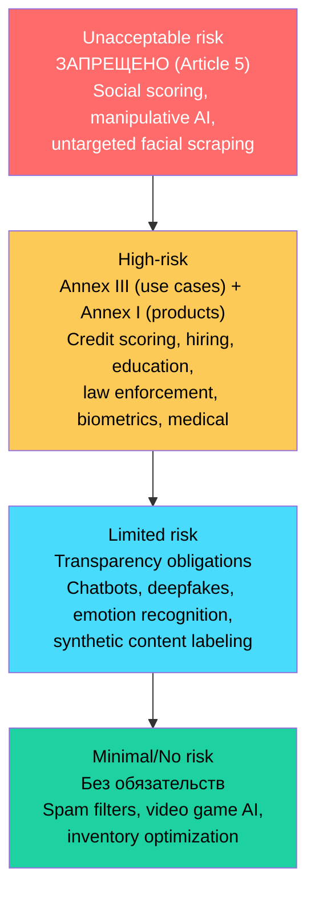
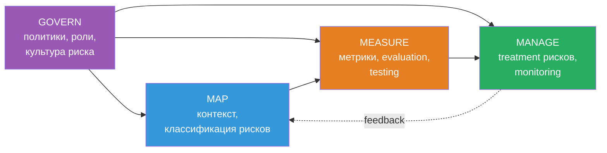
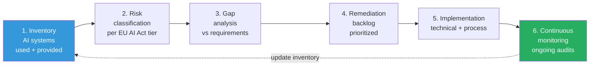

# Вопросы на собеседовании: `AI Compliance & Governance`

**AI Compliance & Governance** — это не «бюрократия про AI», а **операционная дисциплина**: классификация AI-систем по риску, документация (model cards, datasheets), технические меры (bias detection, explainability, audit trails) и процессы (DPIA, conformity assessment, incident reporting). В 2026 году это требование закона (EU AI Act, Colorado AI Act), а не «nice to have».

**Принцип:** compliance — это не «чек-лист перед релизом», а **непрерывный процесс** на всём жизненном цикле модели: от сбора данных и обучения до post-market monitoring и retirement.

> Дата актуализации: 2026-05-25.

## Полезные ссылки

### Регуляторика
- [EU AI Act — Regulation (EU) 2024/1689](https://eur-lex.europa.eu/eli/reg/2024/1689/oj) — официальный текст
- [AI Act Explorer](https://artificialintelligenceact.eu/) — интерактивный обзор статей
- [Colorado AI Act (SB 24-205)](https://leg.colorado.gov/bills/sb24-205) — первый comprehensive US state AI law
- [California AB 2013](https://leginfo.legislature.ca.gov/) — Generative AI Training Data Transparency
- [NYC Local Law 144](https://www.nyc.gov/site/dca/about/automated-employment-decision-tools.page) — hiring AI bias audits

### Фреймворки и стандарты
- [NIST AI Risk Management Framework 1.0](https://www.nist.gov/itl/ai-risk-management-framework) — Jan 2023
- [NIST AI RMF Generative AI Profile (NIST-AI-600-1)](https://nvlpubs.nist.gov/nistpubs/ai/NIST.AI.600-1.pdf) — July 2024
- [ISO/IEC 42001:2023](https://www.iso.org/standard/81230.html) — AI Management System
- [ISO/IEC 23894:2023](https://www.iso.org/standard/77304.html) — AI Risk Management
- [OECD AI Principles](https://oecd.ai/en/ai-principles)

### Документация моделей и данных
- [Model Cards (Mitchell et al. 2019)](https://arxiv.org/abs/1810.03993)
- [Datasheets for Datasets (Gebru et al. 2018)](https://arxiv.org/abs/1803.09010)
- [HuggingFace Model Card Guide](https://huggingface.co/docs/hub/model-cards)
- [C2PA Content Provenance](https://c2pa.org/)

### Incident DB и safety
- [AI Incident Database](https://incidentdatabase.ai/) — Stanford / Partnership on AI
- [White House Blueprint for an AI Bill of Rights](https://www.whitehouse.gov/ostp/ai-bill-of-rights/)
- [UK AI Safety Institute (AISI)](https://www.aisi.gov.uk/)

## Содержание

1. [EU AI Act: risk tiers, GPAI, penalties](#eu-ai-act-risk-tiers-gpai-penalties)
2. [NIST AI RMF и ISO/IEC 42001](#nist-ai-rmf-и-isoiec-42001)
3. [GDPR и data privacy для AI](#gdpr-и-data-privacy-для-ai)
4. [US, UK, China — regulation landscape](#us-uk-china--regulation-landscape)
5. [Model cards и datasheets](#model-cards-и-datasheets)
6. [Bias detection и explainability](#bias-detection-и-explainability)
7. [Audit trails и provenance](#audit-trails-и-provenance)
8. [Compliance roadmap и red teaming](#compliance-roadmap-и-red-teaming)
9. [Copyright и data residency](#copyright-и-data-residency)

---

## EU AI Act: risk tiers, GPAI, penalties

## Q1. Что такое EU AI Act, когда он вступил в силу и какова фазированная имплементация? (!)

**EU AI Act** — Регламент `(EU) 2024/1689`, **первый в мире** комплексный регламент по AI. Опубликован в Official Journal **12 июля 2024**, вступил в силу **1 августа 2024**.

**Фазированная имплементация** (не «всё сразу»):

| Дата | Что вступает в силу |
|---|---|
| **2 февраля 2025** | Запреты `prohibited AI` (Article 5), обязательные требования к AI literacy сотрудников |
| **2 августа 2025** | Правила для `GPAI` (General-Purpose AI), назначение национальных competent authorities, penalties (кроме GPAI) |
| **2 августа 2026** | Основная часть `high-risk` требований (Annex III системы), обязательства providers и deployers |
| **2 августа 2027** | High-risk AI **встроенный в продукты** (Annex I — медтехника, машины, игрушки), full enforcement |

**Зачем фазы:** регуляторам и индустрии нужно время — нотификация conformity assessment bodies, написание harmonised standards (CEN-CENELEC JTC 21), создание AI Office и AI Board.

**Территориальный охват** (Article 2): применяется к **provider** (создатель/размещение на рынке EU), **deployer** (использующий AI в EU), **importer/distributor**. Включая **компании вне EU**, если output используется в EU — экстерриториальность как у GDPR.

> EU AI Act — **product safety regulation**, а не privacy law. Он не заменяет GDPR, а дополняет: GDPR покрывает данные, AI Act — систему.

## Q2. Какие четыре risk tier-а определяет EU AI Act? (!)

**Pyramid of risk** — фундамент регламента. Четыре уровня, от запрещённого до минимального:



**Unacceptable risk** (Article 5): запрещено **полностью** — social scoring госорганами, manipulative AI с physical/psychological harm, exploitation уязвимостей (детей, инвалидов), real-time remote biometric ID в public spaces (с узкими исключениями для law enforcement), predictive policing по profile, untargeted scraping faces из интернета, emotion recognition на работе и в образовании, biometric categorization по чувствительным атрибутам (race, religion).

**High-risk** (Annex III): credit scoring, hiring/HR, образование (scoring экзаменов), law enforcement (risk assessment подозреваемых), critical infrastructure (электросети, transport), миграция/asylum, justice administration, demokratic processes. Плюс Annex I — AI как safety component в регулируемых продуктах (медтехника MDR, машины, игрушки).

**Limited risk**: transparency only — chatbot должен признать, что он AI; deepfake-контент должен быть помечен; emotion recognition — уведомление субъекта.

**Minimal/No risk**: ничего не требуется. Большая часть AI-систем (≈85% по оценкам Commission) попадает сюда.

> Классификация — **per use case**, не per technology. Один и тот же LLM может быть high-risk в hiring (CV screening) и minimal в спам-фильтре.

## Q3. Какие требования EU AI Act предъявляет к high-risk AI системам? (!)

Девять core requirements (Chapter III Section 2). Они касаются **provider** (создающего систему) и частично **deployer** (использующего):

| Требование | Что включает |
|---|---|
| **Risk management system** (Art. 9) | Continuous lifecycle process: идентификация рисков → оценка → mitigation → testing |
| **Data governance** (Art. 10) | Quality criteria для training/validation/test, bias detection, representativeness, statistical properties |
| **Technical documentation** (Art. 11, Annex IV) | Architecture, training methodology, performance metrics, foreseeable risks |
| **Record-keeping** (Art. 12) | Automatic logging — input data, references, identification persons, retention минимум 6 месяцев |
| **Transparency** (Art. 13) | Instructions for use, capabilities, limitations, expected accuracy, human oversight requirements |
| **Human oversight** (Art. 14) | Real ability vmешаться, override, stop — не cosmetic «уведомление» |
| **Accuracy, robustness, cybersecurity** (Art. 15) | Performance levels, resilience к ошибкам, защита от adversarial attacks, data poisoning |
| **Quality management system** (Art. 17) | ISO 9001-style — policies, procedures, regulatory compliance, post-market monitoring |
| **Conformity assessment** (Art. 43) | Внутренняя (self-assessment) или с notified body — перед `CE marking` |

**Post-market monitoring** (Art. 72): provider обязан continuous monitoring + сообщать `serious incidents` (Art. 73) в течение **15 дней** (24 часа для широко распространённых нарушений или infrastructure disruption).

**Deployer obligations** (Art. 26): использовать по инструкции, обеспечить human oversight, мониторить, логировать выходы, информировать affected persons, проводить **FRIA** (Fundamental Rights Impact Assessment) для public bodies или significant impact.

## Q4. Что такое GPAI и какие у него специальные обязательства? (!)

**GPAI** (General-Purpose AI model) — модель «общего назначения», способная выполнять широкий спектр задач, обычно обучена на больших данных через self-supervision (Article 3(63)). Примеры: GPT-4, Claude, Gemini, Llama 3, Mistral Large.

**Не путать** с `GPAI system`: модель — это веса + код, system — модель в составе продукта.

**Два уровня обязательств** GPAI (Chapter V):

**All GPAI providers** (Art. 53):
- Technical documentation (Annex XI) — архитектура, training process, data sources.
- Information и документация для downstream providers (Annex XII).
- Policy для compliance с copyright (DSM Directive).
- Публикация **summary of training content** (по template AI Office).

**GPAI с systemic risk** (Art. 51-55):
- Критерий: training compute **> 10²⁵ FLOPS** (≈ GPT-4 размер) или дизайнация AI Office по capability.
- Дополнительно: model evaluations (incl. adversarial testing / red teaming), assessment systemic risks, mitigation, incident reporting, cybersecurity, energy consumption disclosure.
- Adherence к `codes of practice` (на 2026 — General-Purpose AI Code of Practice, published April 2025).

**Open-source exemption**: часть обязательств снимается для свободно доступных моделей (weights, architecture, usage info публичны) — но НЕ для systemic-risk моделей и НЕ для использования copyright и публикации training summary.

## Q5. Какие penalties предусмотрены EU AI Act?

Tier-аnal penalty scheme (Article 99):

| Нарушение | Штраф |
|---|---|
| Prohibited AI practices (Art. 5) | до **€35M** или **7% global annual turnover** (whichever higher) |
| Несоблюдение high-risk requirements или GPAI obligations | до **€15M** или **3%** |
| Предоставление incorrect, incomplete, misleading info | до **€7.5M** или **1%** |

**Для SME и стартапов** — caps берутся в обратную сторону (whichever lower) — защита малого бизнеса.

**Сравнение с GDPR**: GDPR cap — 4% или €20M. AI Act жёстче для prohibited (7%), сравним для остальных.

**Enforcement**: национальные `market surveillance authorities` плюс AI Office (на уровне Commission) для GPAI. Penalties назначают MS authorities, GPAI — Commission.

> Первые крупные штрафы ожидаются **не раньше 2026-2027**, когда полностью вступит в силу high-risk часть. Но prohibited AI уже enforce-уется с февраля 2025.

## Q6. Что такое Annex III high-risk use cases — приведи примеры

**Annex III** — список «areas» high-risk AI применений (можно обновлять delegated acts):

1. **Biometric ID и categorization** (не запрещённое) — biometric verification (1:1), categorization не по чувствительным.
2. **Critical infrastructure** — управление electricity, gas, water, traffic.
3. **Education and vocational training** — оценка экзаменов, admission, мониторинг поведения студентов.
4. **Employment и HR** — recruitment (CV screening, ranking), task allocation, monitoring, evaluation, termination.
5. **Essential private and public services** — credit scoring, insurance underwriting, emergency call dispatch, eligibility для public benefits.
6. **Law enforcement** — risk assessment recidivism, polygraph alternatives, evidence reliability evaluation, crime prediction.
7. **Migration, asylum, border control** — risk assessment applicants, document authenticity, eligibility decisions.
8. **Administration of justice and democratic processes** — assist judge в research/interpretation law, influence elections.

**Conditional high-risk** (Art. 6(3)): если AI выполняет **narrow procedural task**, или improves результат уже принятого решения, или detects patterns без replace human assessment — может **не** быть high-risk. Но provider должен это документировать.

**Examples** — `CV ranker` в hiring (high-risk), `credit decision engine` в банке (high-risk), `traffic light optimization` (high-risk), `email spell-checker` (minimal), `customer chatbot для бронирования` (limited — transparency only).

---

## NIST AI RMF и ISO/IEC 42001

## Q7. Что такое NIST AI Risk Management Framework и какие у него четыре функции? (!)

**NIST AI RMF 1.0** (Jan 2023) — добровольный фреймворк от U.S. National Institute of Standards and Technology. **De facto** US стандарт; ссылается в federal contracts, executive orders, state laws (Colorado AI Act).

**Четыре core functions** (с playbook actions для каждой):



**Govern** — cross-cutting функция: AI risk management strategy, accountability, policies, roles (RACI), культура, supply chain.

**Map** — контекст: цели системы, stakeholders, риски (intended и foreseeable misuse), impact assessment, классификация по trustworthiness characteristics.

**Measure** — quantitative + qualitative оценка: accuracy, robustness, fairness, explainability, privacy, security. Testing, TEVV (Testing, Evaluation, Validation, Verification).

**Manage** — приоритизация рисков, treatment (avoid/mitigate/transfer/accept), continuous monitoring, incident response, decommissioning.

**Trustworthy AI characteristics** (cross-cutting): valid & reliable, safe, secure & resilient, accountable & transparent, explainable & interpretable, privacy-enhanced, fair (bias managed).

## Q8. Что такое NIST AI RMF Generative AI Profile?

**NIST AI 600-1** (July 2024) — companion profile к RMF 1.0, заточенный под `generative AI`. Содержит **200+ конкретных actions** в рамках 4 функций.

**12 risk categories** GenAI Profile:

| Категория | Пример |
|---|---|
| `CBRN information` | Инструкции для chemical/biological/radiological/nuclear weapons |
| `Confabulation` | Hallucinations — уверенный неверный ответ |
| `Dangerous, violent, hateful content` | Toxic outputs |
| `Data privacy` | Утечка PII из training, prompt injection с PII |
| `Environmental impact` | Carbon footprint training/inference |
| `Harmful bias and homogenization` | Discrimination, mode collapse |
| `Human-AI configuration` | Over-reliance, anthropomorphization |
| `Information integrity` | Disinformation, deepfakes |
| `Information security` | Model theft, prompt injection, RCE через tool use |
| `Intellectual property` | Copyright violations в outputs |
| `Obscene/abusive sexual content` | CSAM, non-consensual imagery |
| `Value chain and component integration` | Третьи стороны — модели, datasets, infra |

> GenAI Profile **не mandatory**, но активно используется как baseline в US — особенно federal agency contracts после EO 14110 (даже после его revocation в 2025 многие AI Use Case Inventory requirements продолжают действовать).

## Q9. Что такое ISO/IEC 42001 и как он связан с EU AI Act? (!)

**ISO/IEC 42001:2023** (опубликован декабрь 2023) — первый **сертифицируемый** международный стандарт для AI Management System (AIMS). Структура — Annex SL (как ISO 27001, 9001) — встраивается в существующую ISMS.

**Ключевые элементы**:
- Context organization (4) — внешние/внутренние факторы, stakeholders.
- Leadership (5) — AI policy, roles.
- Planning (6) — risk assessment, opportunity, AI objectives.
- Support (7) — resources, competence, awareness, documentation.
- Operation (8) — lifecycle controls, impact assessment, third-party.
- Performance evaluation (9) — monitoring, internal audit, management review.
- Improvement (10) — nonconformity, corrective action.

**Annex A controls**: ~38 controls в 9 категориях — AI policies, internal organization, AI lifecycle (design, development, V&V, deployment, operation, retirement), data, info for interested parties.

**Связь с EU AI Act**:
- ISO 42001 — **process** standard, AI Act — **product** regulation.
- Сертификация ISO 42001 НЕ заменяет AI Act compliance, но **демонстрирует** quality management system (Art. 17 AI Act).
- Harmonised standards (CEN-CENELEC) для AI Act ещё в разработке (ожидаются 2026-2027) — ISO 42001 закрывает gap.

**Companion**: **ISO/IEC 23894:2023** — AI Risk Management guidance (не сертифицируемый), детализирует подход к рискам ISO 31000 для AI.

**Кому полезно**: GPAI providers, enterprise AI vendors, deployers high-risk — все, кому нужно демонстрировать «we have AI governance» клиентам/регуляторам.

---

## GDPR и data privacy для AI

## Q10. Как GDPR применяется к AI-системам? (!)

**GDPR** (Regulation 2016/679, в силе с 2018) **не упоминает AI напрямую**, но множество положений активно применяются:

| Положение | Применение к AI |
|---|---|
| **Article 5** — principles | Data minimization vs «больше данных = лучше модель» (конфликт), purpose limitation, accuracy |
| **Article 6** — lawful basis | Training data — какой legal basis? Legitimate interest (с balancing test), consent, contract |
| **Article 9** — special categories | Health, biometric, racial — strict prohibition с exceptions |
| **Article 13-14** — info to data subject | Existence of automated decision-making, logic involved, consequences |
| **Article 15** — right of access | Включает logic of automated decisions |
| **Article 17** — right to erasure | «Право на забвение» в training data — **технически сложно** (нужен retraining, unlearning) |
| **Article 22** — automated decision-making | Special protections для decisions «solely» автоматических с legal/significant effect |
| **Article 25** — privacy by design | Применимо к AI architecture |
| **Article 35** — DPIA | Mandatory для high-risk processing — почти всегда для AI |
| **Chapter V** — international transfers | Training/inference cross-border — SCCs, adequacy decisions |

**Конфликты с AI Act**: GDPR требует erasure, AI Act требует retention логов 6+ месяцев. Решение: разные categories of data, или anonymization логов.

**Schrems II** (2020) — invalidated Privacy Shield, осложнил US ↔ EU transfers. Решено EU-US Data Privacy Framework (July 2023), но юридические challenges продолжаются.

## Q11. Что такое DPIA и когда она обязательна для AI? (!)

**DPIA** (Data Protection Impact Assessment, Article 35 GDPR) — формальная оценка risks для прав и свобод субъектов данных перед началом processing.

**Mandatory** когда:
- Systematic and extensive evaluation, включая profiling, с legal/significant effects.
- Large-scale processing special categories (Article 9) или criminal data.
- Systematic monitoring publicly accessible area.
- Дополнительные критерии EDPB Guidelines 248 (≥2 из 9): evaluation/scoring, automated decision, systematic monitoring, sensitive data, large scale, matching/combining datasets, vulnerable subjects, innovative tech, blocks data subject rights.

**AI почти всегда** попадает под минимум 2 критерия → DPIA mandatory.

**Содержание** (Art. 35(7)):
1. Systematic description processing, purposes, legitimate interest.
2. Necessity and proportionality.
3. Risks для прав и свобод.
4. Measures to address risks — safeguards, security, mechanisms ensuring compliance.

**Связь с AI Act**: high-risk AI требует `Fundamental Rights Impact Assessment` (FRIA, Art. 27) для deployers — public bodies, banking/insurance. DPIA и FRIA **дополняют** друг друга, не заменяют. EDPB рекомендует **integrated** assessment.

**Кто проводит**: data controller с участием DPO (если есть). Консультация с supervisory authority — если residual high risk не mitigated.

## Q12. Что говорит Article 22 GDPR про automated decision-making?

**Article 22(1)**: субъект имеет право не быть subject of decision, основанного **solely** на automated processing (включая profiling), которое production **legal effects** или **similarly significantly** affects.

**Условие «solely»**: если человек делает meaningful review — Art. 22 не применяется. Но «штамповать» одобрения без анализа = solely automated. EDPB Guidelines 251 говорят про **active and substantial** human involvement.

**Examples**:
- `Solely automated` (Art. 22 applies): online credit scoring, automated CV rejection, online ad targeting (debatable), insurance claim auto-decline.
- `Human in the loop` (Art. 22 NOT applies): AI flag → human review → human decides.

**Exceptions** (Art. 22(2)):
- Necessary для contract (a),
- Authorized by EU/MS law с safeguards (b),
- Explicit consent (c).

Даже при exception — минимальные **safeguards**: human intervention right, expression of point of view, contestation right.

**Special categories** (Art. 22(4)): Art. 9 data — только consent или substantial public interest.

**SCHUFA case** (CJEU, December 2023, C-634/21): credit scoring score сам по себе = automated decision, даже если bank использует его «как input» — если score фактически determinative.

---

## US, UK, China — regulation landscape

## Q13. Что такое AI Bill of Rights и Executive Order 14110?

**Blueprint for an AI Bill of Rights** (October 2022, White House OSTP) — **non-binding** framework с 5 принципами:

1. **Safe and Effective Systems** — testing pre-deployment, monitoring.
2. **Algorithmic Discrimination Protections** — proactive equity assessment.
3. **Data Privacy** — built-in, agency over data.
4. **Notice and Explanation** — субъект знает про AI и логику.
5. **Human Alternatives, Consideration, Fallback** — opt-out, человеческое решение.

**Сила**: морально-политическая, не law. Влияет на federal procurement, agency guidance.

**Executive Order 14110** (Biden, October 2023) — **самый большой US AI executive order**:
- Safety testing для frontier models (compute > 10²⁶ FLOPS) с reporting.
- NIST framework для red-teaming.
- Content authentication (C2PA).
- AI talent visa.
- Federal agency AI Use Case Inventories.

**Revoked Trump (January 2025)** — EO 14179 «Removing Barriers to American Leadership in AI». Но:
- Federal AI Use Case Inventories продолжаются (Congress requires).
- NIST AI RMF и GenAI Profile — независимы от EO.
- State laws не затрагиваются (preemption нет).

## Q14. Что такое Colorado AI Act и какие US state-level AI laws есть? (!)

**Colorado AI Act (SB 24-205)**, signed май 2024, в силе с **1 февраля 2026** — **первый comprehensive** AI law в US.

**Scope**: developers и deployers `high-risk AI systems` — consequential decisions (education, employment, financial, healthcare, housing, insurance, legal, government services).

**Developer obligations**:
- Disclosure deployers — purpose, known limitations, evaluation results, data governance.
- Public statement про AI systems и risk management.
- Notify Attorney General о known algorithmic discrimination в 90 дней.

**Deployer obligations**:
- Risk management policy и program.
- Annual impact assessment.
- Notify consumers пре consequential decision.
- Right to appeal automated decision.
- Right to explanation.

**Penalties**: civil action AG, up to $20,000 per violation.

**Другие US state laws**:

| Юрисдикция | Закон | Фокус |
|---|---|---|
| California | **AB 2013** (2024) | GenAI training data disclosure (с Jan 2026) |
| California | **AB 1008** (2024) | CCPA включает personal info в AI systems |
| California | **SB 942** (2024) | AI-generated content disclosure |
| New York City | **Local Law 144** (2023) | Hiring AI bias audit + notice |
| Illinois | **BIPA** (2008) | Biometric — широко применяется к AI |
| Texas | **TRAIGA** (HB 1709, 2026) | High-risk AI obligations |
| Utah | **SB 149** (2024) | GenAI disclosure для regulated professions |

> Регуляторный landscape в US — **fragmented**. Federal preemption обсуждается, но не принят. Компаниям проще соблюдать «highest common denominator» — обычно EU AI Act или Colorado.

## Q15. Какие подходы у UK и China к AI regulation?

**UK** — **light-touch, principles-based** (white paper 2023, реализовано через existing regulators):

Пять принципов:
1. Safety, security, robustness.
2. Appropriate transparency и explainability.
3. Fairness.
4. Accountability и governance.
5. Contestability и redress.

**Без AI Act** на 2026 — Sunak делал ставку на «UK as global AI safety hub». Labour (с 2024) обещали targeted legislation для frontier models, но конкретики ещё нет.

**AI Safety Institute (AISI)** — November 2023, government body для evaluation frontier models. Один из первых в мире. Не регулятор, а evaluator — voluntary access от labs (OpenAI, Anthropic, DeepMind).

**Sectoral approach**: ICO (data), FCA (finance), Ofcom (online safety), MHRA (medical) — каждый применяет принципы в своей сфере.

**China** — **proactive, prescriptive**:

| Регулирование | Дата | Фокус |
|---|---|---|
| **Algorithmic Recommendations** | Mar 2022 | Recommendation systems — algorithm registry |
| **Deep Synthesis** | Jan 2023 | Deepfakes — labeling, identity verification |
| **Interim Measures для Generative AI** | Aug 2023 | LLMs — registration, content moderation, training data legality |
| **Labeling AI-generated content** | Sep 2024 | Watermarks, metadata |

**Ключевые требования**:
- **Registration** алгоритмов в CAC (Cyberspace Administration China) — algorithm filing.
- **Security assessment** для LLM с public access.
- **Content moderation** — соответствие «socialist core values».
- **Training data** — laws compliance, real source.
- **Watermarking** — visible + invisible для AI-generated.

> Сравнение: **EU** — rights-based + product safety. **US** — sectoral + state-by-state. **UK** — principles + regulators. **China** — state control + content moderation.

---

## Model cards и datasheets

## Q16. Что такое Model Cards и какова их структура? (!)

**Model Cards** — стандарт документации модели (Mitchell, Wu et al., 2019, Google). Цель: transparency про intended use, performance, limitations.

**Стандартная структура** (расширенная):

| Секция | Содержание |
|---|---|
| **Model Details** | Developer, date, version, type (e.g. transformer 7B), license, paper, contact |
| **Intended Use** | Primary use cases, primary users, out-of-scope uses |
| **Factors** | Demographics, instrumentation, environment relevant to performance |
| **Metrics** | Performance measures, decision thresholds, variation approaches |
| **Evaluation Data** | Datasets, motivation, preprocessing |
| **Training Data** | Same как evaluation; если confidential — disclosed |
| **Quantitative Analyses** | Unitary results (overall), disaggregated (by subgroup) |
| **Ethical Considerations** | Sensitive data, life/safety impact, mitigations, risks |
| **Caveats and Recommendations** | Limitations, future work, idealised vs operational deployment |

**HuggingFace Model Cards** (mandatory на Hub):
- License (важно — без license модель «не использовать»).
- Model description.
- Uses (direct, downstream, out-of-scope).
- Bias, risks, limitations.
- Training details.
- Evaluation.
- Environmental impact (Co2 emissions).
- Technical specifications.

**Best practices**:
- Disaggregated metrics — **по subgroups** (gender, age, race, language) — не только aggregate accuracy.
- Honest limitations — НЕ маркетинг.
- Versioning — каждый retrain = новый card или version bump.
- Machine-readable — `MODEL_CARD.md` рядом с весами, или JSON schema.

**Применение в EU AI Act**: Annex IV technical documentation **включает аналог model card** для high-risk. Без него — нет conformity assessment.

## Q17. Что такое Datasheets for Datasets и зачем они нужны?

**Datasheets for Datasets** (Gebru et al. 2018, Microsoft Research / Google) — стандарт документации датасетов. Inspired by electronics datasheets — каждый компонент имеет datasheet.

**Семь категорий вопросов**:

1. **Motivation** — для какой цели создан, кто финансировал, кто создал.
2. **Composition** — что instances представляют, total count, есть ли labels, missing data, recommended splits.
3. **Collection Process** — как получены, sampling strategy, validation, timeframe, ethical review.
4. **Preprocessing/Cleaning/Labeling** — что сделано, raw data available, software.
5. **Uses** — past/current uses, recommended uses, NOT-recommended uses.
6. **Distribution** — third parties, licensing, restrictions, IP.
7. **Maintenance** — owner, contact, updates, versioning, deprecation.

**Зачем**:
- **Bias detection**: знать demographics dataset → понять blind spots модели.
- **Reproducibility**: знать preprocessing → воспроизводимый эксперимент.
- **Legal compliance**: knowing legal basis collection — GDPR, CCPA.
- **Responsible use**: out-of-scope uses формально документированы.

**Industry adoption**:
- HuggingFace `Dataset Cards` — обязательны для datasets на Hub.
- Google `Data Cards` — изобретены параллельно, частично пересекаются.
- ML CommonsCroissant — machine-readable schema для datasets.

**Anti-pattern**: «mystery dataset» — модели обучают на scraped web без datasheet → невозможно audit bias, copyright, PII.

## Q18. Чем Model Card отличается от Datasheet for Dataset и от System Card?

| Артефакт | Объект | Когда создаётся |
|---|---|---|
| **Datasheet for Dataset** | Dataset (training, evaluation) | После сбора данных, обновляется при изменении |
| **Model Card** | Trained model (weights + architecture) | После training, обновляется per version |
| **System Card** | Whole AI system (model + prompts + tools + guardrails) | Per deployed system, OpenAI / Anthropic — самостоятельный жанр |

**System Card** — относительно новый формат (OpenAI GPT-4 System Card, Anthropic Claude 3 Model Card). Включает:
- Model details + использование (chat, API).
- Safety mitigations (post-training, system prompts).
- Red-team findings.
- Capability evaluations (incl. dangerous capabilities — CBRN, cyber).
- Deployment context.

**Иерархия**:

```
Datasheet (data) → Model Card (model) → System Card (deployed system)
```

EU AI Act требует все три уровня для high-risk: data governance docs (Art. 10), technical documentation модели (Art. 11, Annex IV), product-level instructions (Art. 13).

---

## Bias detection и explainability

## Q19. Какие fairness metrics существуют и как выбрать подходящую? (!)

**Group fairness** — модель равно «хороша» для разных групп (защищённый attribute A, типично gender/race).

Основные метрики (`Ŷ` — prediction, `Y` — true label):

| Метрика | Определение | Подходит когда |
|---|---|---|
| **Demographic parity** (statistical parity) | `P(Ŷ=1|A=0) = P(Ŷ=1|A=1)` | Equal selection rate (e.g., hiring quota) |
| **Equal opportunity** | `P(Ŷ=1|Y=1, A=0) = P(Ŷ=1|Y=1, A=1)` | True positive rate equal — recall fair |
| **Equalized odds** | TPR равны + FPR равны | Stricter version equal opportunity |
| **Predictive parity** | `P(Y=1|Ŷ=1, A=0) = P(Y=1|Ŷ=1, A=1)` | Precision equal (calibration) |
| **Treatment equality** | FP/FN ratio равны | Errors симметричны по группам |

**Impossibility result** (Chouldechova 2017, Kleinberg 2016): demographic parity, equal odds, predictive parity **не могут** все три выполняться одновременно, если base rates отличаются (кроме trivial cases). Trade-off неизбежен.

**Counterfactual fairness** (Kusner 2017): решение модели не должно изменяться, если контрфактически изменить только sensitive attribute (gender, race) при сохранении causal structure. Сильнее group fairness, но требует causal model.

**Individual fairness**: similar individuals → similar predictions (Dwork 2012). Требует distance metric.

**Как выбрать**:
- **Hiring quotas** → demographic parity (поставлена цель equal selection).
- **Medical screening** → equal opportunity (нельзя пропускать больных в любой группе).
- **Credit scoring** → equalized odds + calibration (balance false positives и precision).
- **Criminal justice (COMPAS)** → debate predictive vs equal odds — нет «правильного» ответа без values.

**Tools**:
- **IBM AI Fairness 360** — 70+ metrics, mitigation algorithms (preprocessing, in-processing, post-processing).
- **Aequitas** (UChicago) — bias audit toolkit, focused on policy use cases.
- **Microsoft Fairlearn** — Python, integration с scikit-learn.
- **Google What-If Tool** — interactive visualization.

## Q20. Какие методы explainability существуют для ML и LLM? (!)

**Tabular / classical ML**:

| Метод | Тип | Идея |
|---|---|---|
| **SHAP** (Shapley values) | Model-agnostic, post-hoc | Контрибуция feature к prediction через cooperative game theory |
| **LIME** | Model-agnostic, post-hoc | Локальная linear approximation вокруг точки |
| **Feature importance** (built-in) | Model-specific | Trees — Gini decrease; linear — coefficients |
| **Permutation importance** | Model-agnostic | Shuffle feature → измерить drop in performance |
| **Partial dependence plots** | Visualization | Effect feature averaged over others |
| **Counterfactual explanations** | Local | «Если бы X=x', prediction был бы Y'» — actionable |

**Deep learning**:
- **Integrated gradients** (Sundararajan 2017) — axiom-satisfying attribution.
- **Grad-CAM** — visualization для CNN.
- **Attention visualization** — для transformers (caveat: attention ≠ explanation в strict sense).
- **TCAV** (Testing with Concept Activation Vectors) — concepts (e.g. «stripes»).

**LLM-specific**:
- **Chain-of-thought** — model says reasoning steps (но не настоящее объяснение — post-hoc rationalization).
- **Attention maps** — input tokens, что повлияли.
- **Feature attribution** — Captum, Inseq libraries.
- **Mechanistic interpretability** (Anthropic, OpenAI) — circuits, features через sparse autoencoders.
- **Activation patching** — causal trace, какие neurons вызывают behavior.

**Caveats**:
- Explainability ≠ correctness — модель может дать «explanation», которое не отражает actual reasoning.
- **Faithfulness** — насколько explanation отражает действительное reasoning модели. Часто низкая для post-hoc методов.
- **GDPR «right to explanation»** — scope debated, но minimum «meaningful information about logic involved» (Art. 13(2)(f)).
- **EU AI Act Art. 13(3)(b)(iv)** — instructions for use должны описывать характеристики, что enable interpretation output.

## Q21. Как организовать bias audit модели в production?

**Этапы bias audit**:

1. **Determine protected attributes**.
   - Legal: race, gender, age, disability, religion (Title VII US; protected characteristics UK Equality Act 2010).
   - Operational: customer segment, geographic region.
   - Proxies: zip code → race; name → gender, ethnicity.

2. **Collect demographic data** — часто **не доступно** (privacy laws не разрешают сбор без consent).
   - Альтернативы: BISG (Bayesian Improved Surname Geocoding), self-reported аnonymous survey, proxy modelling с caveats.

3. **Slice metrics** — disaggregated performance:
   - Не только overall accuracy.
   - По каждой защищённой группе: TPR, FPR, precision, recall, calibration.
   - Intersectional — black women, не только black + women.

4. **Statistical significance** — bootstrap CI, не один-два процента «между группами».

5. **Mitigation, если нашли disparity**:
   - **Pre-processing**: reweighing, disparate impact remover, learning fair representations.
   - **In-processing**: adversarial debiasing, fair constraints в loss.
   - **Post-processing**: threshold optimization per group (но юридически нюансно — disparate treatment).

6. **Documentation** — model card с disaggregated metrics, mitigations applied, residual risks.

7. **Continuous monitoring** — distribution shift → bias can re-emerge. Production metrics per group.

**Mandatory audits** (regulatory):
- **NYC Local Law 144** — hiring AI annual audit by independent auditor + public summary.
- **EU AI Act** — implied для high-risk через risk management + post-market monitoring.
- **Colorado AI Act** — annual impact assessment includes algorithmic discrimination.

---

## Audit trails и provenance

## Q22. Что должен включать audit trail для AI-системы? (!)

**Цель**: реконструировать «как и почему» модель приняла решение, чтобы answer:
- Что сказал AI пользователю в incident X?
- Какая версия модели обработала запрос Y?
- Были ли guardrails сработали?
- Кто/когда developer пушнул эту version weights?

**Уровни audit trail**:

| Уровень | Что логируется | Retention |
|---|---|---|
| **Decision logs** | Per request — input, output, model version, latency, guardrail flags, user ID | 6+ месяцев (AI Act Art. 12), дольше для regulated industries |
| **Model lineage** | Training data version, code commit, hyperparameters, eval results, who/when | Permanent (для traceability) |
| **Data lineage** | Source datasets, transformations, splits, anonymization | Permanent |
| **Access logs** | Кто из людей трогал модель/данные | Per company policy, SOC 2 — 1+ year |
| **Change logs** | Deployment history, rollbacks, config changes | Permanent |

**Properties** quality audit log:
- **Append-only** — нельзя редактировать post-hoc.
- **Cryptographically signed** или **immutable storage** (S3 Object Lock, blockchain — overkill в большинстве cases).
- **Timestamped** — synchronized clocks (NTP), ideally TSA (Time-Stamping Authority).
- **Structured** — JSON / Parquet, не free-form text.
- **Searchable** — индекс по request_id, user_id, model_version, timestamp.
- **Privacy-aware** — PII redaction в logs (но retain unsalted hash для linking, если legal allows).

**Tools**:
- **MLflow Model Registry** — model lineage.
- **DVC** + **Git** — data + code versioning.
- **OpenTelemetry** + LLM-specific (Langfuse, Helicone, Arize Phoenix) — request-level traces.
- **Apache Atlas / DataHub** — data lineage enterprise.
- **W&B / Comet** — experiment tracking.

**EU AI Act** (Art. 12) требует automatic logging для high-risk: events traceable, ID persons involved, reference data input. Минимум **6 месяцев**, дольше per national law.

## Q23. Что такое C2PA и зачем нужна provenance AI-generated content?

**C2PA** (Coalition for Content Provenance and Authenticity) — открытый стандарт (2021, Adobe, Microsoft, BBC, Intel, Arm, others) для cryptographic provenance media.

**Идея**: к каждому media (image, video, audio, document) прикрепляется **manifest** — подписанный набор assertions:
- Кто создал (claim generator).
- Когда.
- Какие edits сделаны (AI generation, cropping, color correction).
- Source materials (если derivative).
- Hashes для tamper detection.

**Manifest** хранится в file metadata (XMP, JUMBF — JPEG Universal Metadata Box Format) или sidecar.

**AI-specific**:
- `c2pa.ai_generative` — assertion для AI-generated.
- `c2pa.ai_compositional` — AI-edited / inpainting.
- `c2pa.training_mining` — opt-out signal для crawlers.

**Adoption (2026)**:
- OpenAI DALL-E, ChatGPT image generation — C2PA metadata embedded.
- Adobe Firefly — content credentials.
- Google SynthID — для Gemini image/text/audio.
- Sony, Nikon, Leica — cameras с C2PA signing.
- TikTok — labels для AI content (использует C2PA + own signals).

**Limitations**:
- Metadata strippable — re-encode, screenshot.
- Trust chain — cert authority needed.
- Verifies origin, NOT truth — fake C2PA-signed image остаётся фейком, просто авторизованным.

**Regulatory**:
- **EU AI Act Art. 50** — providers GenAI должны mark output как artificially generated (machine-readable). С 2 августа 2026.
- **California AB 942** — disclosure AI-generated content.
- **China** — mandatory watermarking AI content (с Sep 2024).

**Watermarking** (complementary): SynthID, Tree-Ring (image), invisible token sequences для text. Robust к compression/crop. C2PA = metadata, watermark = embedded в signal.

## Q24. Как организовать reporting AI incidents?

**Что считается incident** (EU AI Act Art. 3(49) — `serious incident`):
- Death или serious health damage.
- Serious и irreversible disruption critical infrastructure.
- Infringement EU fundamental rights protections.
- Serious damage to property или environment.

**Timeline** (Art. 73):
- **Immediately** после establishing causal link (или reasonable likelihood).
- **15 days** для standard serious incident.
- **2 days** для widespread infringement или critical infrastructure disruption.
- **10 days** для death.

**Кому**: market surveillance authority MS, где произошёл incident.

**Что в отчёте**:
- Описание incident.
- AI system involved (provider, model, version).
- Causal link analysis.
- Corrective actions taken / planned.

**Internal incident management**:
- Detection — anomaly monitoring, user reports, news/social signals.
- Triage — severity, scope (sus customers affected).
- Containment — rollback, disable feature, increase guardrails.
- Investigation — root cause, model behavior, data, prompts.
- Remediation — fix, communicate, learn.
- Post-mortem — blameless, документировать, share learnings.

**Public AI Incident Databases**:
- **AI Incident Database** (incidentdatabase.ai) — Partnership on AI / Stanford. 700+ incidents, taxonomy.
- **OECD AI Incidents Monitor** — global tracking.
- **AVID** (AI Vulnerability Database) — security-focused (analog CVE for AI).

**Famous incidents** (для контекста):
- COMPAS recidivism — racial bias (ProPublica 2016).
- Amazon hiring AI — gender bias scrap (2018).
- Air Canada chatbot — wrong refund advice, ordered to honor (2024).
- DPD chatbot — swearing at customer (2024).
- iTutor — discrimination resume screening, $365K EEOC (2023).

---

## Compliance roadmap и red teaming

## Q25. Как построить AI compliance roadmap для компании? (!)

**Шесть фаз**:



**1. Inventory** (часто самое сложное):
- AI systems **provided** компанией клиентам.
- AI systems **deployed** внутри (used от vendors — OpenAI, Anthropic, HuggingFace).
- Shadow AI — devs использующие LLM без discovery (ChatGPT, Copilot, AI features в SaaS).
- Methods: surveys teams, network monitoring, procurement review, SBOM-style ML BOM.

**2. Risk classification**:
- Per EU AI Act tier (prohibited / high / limited / minimal).
- Per use case (один LLM в разных contexts может иметь разный tier).
- GDPR risk (DPIA needed?).
- Sector-specific (medical → MDR, financial → DORA).

**3. Gap analysis** — для каждой high-risk system, что **есть** vs что **требуется**:
- Documentation (model card, datasheet, technical doc Annex IV).
- Processes (risk management, post-market monitoring).
- Technical (logging, monitoring, accuracy/robustness testing).

**4. Remediation backlog**:
- Приоритизация: regulatory deadline × business impact × effort.
- Owners назначены (engineering, legal, DPO, business).
- Tracking — Jira/Linear с тegging «AI-Act-compliance».

**5. Implementation**:
- Technical: logging infra, bias monitoring, model registry, red teaming program.
- Process: AI policy, DPIA template, incident response runbook.
- Training: AI literacy для всех сотрудников touching AI (AI Act требует с Feb 2025).

**6. Continuous monitoring**:
- Drift detection, performance monitoring per group.
- Periodic reviews — annual + post-incident.
- Regulatory updates — AI Act delegated acts, новые state laws.

**Governance structure**:
- **AI Ethics / Risk Committee** — cross-functional (legal, engineering, product, ethics).
- **DPO** — privacy.
- **AI Lead / Chief AI Officer** — accountability.
- **Model Risk Management** (banks — long-time role from SR 11-7).

## Q26. Что такое red teaming AI и какие best practices?

**Red teaming AI** — adversarial testing модели/системы для нахождения failures: harmful outputs, jailbreaks, hallucinations, bias, security vulnerabilities.

**Отличие от классического security red team**: не только «code exploits», а **behavioral attacks** на модель.

**Types of red teaming**:

| Тип | Цель | Пример |
|---|---|---|
| **Capability evaluation** | Что модель может (dangerous capabilities) | CBRN uplift, autonomous replication, deception |
| **Misuse red teaming** | Как взломать guardrails | Jailbreaks, role-play, encoding, multi-turn manipulation |
| **Bias / fairness probing** | Discrimination в outputs | Generate per-group stereotypes |
| **Robustness testing** | Adversarial inputs | Prompt injection, typos, distribution shift |
| **Security red teaming** | Infrastructure | Model extraction, training data extraction, MaaS auth bypass |

**Best practices**:
- **Diverse teams** — gender, race, expertise (domain experts для CBRN, etc.) — Anthropic Constitutional AI work.
- **Structured + unstructured** — taxonomies (HarmBench, AILuminate) + creative open-ended.
- **Document attacks** — reproducible, не «I think I jailbroke it».
- **Severity scoring** — likelihood × impact.
- **Re-test after mitigation** — fixes сами создают новые attack surfaces.
- **Continuous** — модель обновляется, attack landscape тоже. Не one-shot pre-launch.

**Frontier labs red teams** (2026):
- **OpenAI** — Frontier Red Team, Preparedness Framework (CBRN, cyber, persuasion, autonomy).
- **Anthropic** — Frontier Threats Red Team, Responsible Scaling Policy.
- **DeepMind** — Frontier Safety Framework.
- **External**: METR (Model Evaluation and Threat Research), AISI (UK), US AISI (now AI Safety Institute under NIST).

**Open frameworks/tools**:
- **PyRIT** (Microsoft) — automated red teaming.
- **Garak** — LLM vulnerability scanner.
- **HarmBench** — standardized benchmark for harmful outputs.
- **AILuminate** (MLCommons) — safety benchmark.

**EU AI Act** требует adversarial testing для systemic-risk GPAI (Art. 55(1)(b)). NIST GenAI Profile — multiple actions related to red teaming.

## Q27. Что такое post-market monitoring и почему compliance — continuous process?

**Post-market monitoring** (EU AI Act Art. 72) — обязательная **систематическая** деятельность providers high-risk AI после deployment:

- **Active** сбор и review performance data всю жизнь системы.
- Detect departures от expected/documented behavior.
- Trigger corrective actions если drift или harm.

**План** должен быть **part of technical documentation** (Annex IV) — НЕ ad-hoc.

**Что мониторить**:
- Performance metrics (accuracy, fairness, calibration).
- User feedback и complaints.
- Distribution shift (input data, demographics).
- Concept drift (target relationship changes).
- Incidents (включая near-misses).
- Adversarial use patterns.

**Триггеры corrective action**:
- Significant degradation метрик.
- New failure mode reported.
- Demographic group disparity растёт.
- Regulatory guidance changes.

**Почему compliance ≠ checkbox**:

| Static checkbox view | Continuous process view |
|---|---|
| Pre-launch certification, done | Ongoing risk management |
| Document and forget | Versioned docs, model card updates |
| Annual audit only | Real-time monitoring + periodic audits |
| Compliance team isolated | Cross-functional, embedded |
| Fix when caught | Proactive testing, red teaming |

**Reactive vs proactive**:
- **Reactive** (anti-pattern): wait для incident → fix → comply «good enough». Risk: large penalties, reputation, user harm uncaught.
- **Proactive**: continuous testing, monitoring, red teaming, incident drills, table-top exercises.

**Standards push to continuous**:
- ISO 42001 — Plan-Do-Check-Act cycle.
- NIST RMF — Manage function explicitly «monitor and respond».
- AI Act — post-market plan mandatory.

---

## Copyright и data residency

## Q28. Какие копирайт-вопросы стоят перед training AI? (!)

**Две большие категории**:

**А. Training data — fair use / fair dealing?**
- US: **fair use** defense (4-factor test) — purpose, nature, amount, market effect.
- EU: **Text and Data Mining (TDM)** exception (DSM Directive 2019/790 Art. 3-4):
  - Art. 3 — research orgs, non-commercial, broad.
  - Art. 4 — commercial, **rightsholders могут opt-out** machine-readable (robots.txt, ai.txt, meta tags).
- UK: TDM exception narrower (research only), commercial exception proposal abandoned (2023).
- Japan: explicit AI training exception (Art. 30-4) — copyright doesn't apply except where prejudices interests.

**Active litigation (2026)**:
- **NYT v. OpenAI/Microsoft** (Dec 2023, S.D.N.Y.) — direct copying, output regurgitation.
- **Getty Images v. Stability AI** (UK + US) — image training.
- **Authors Guild / GRR Martin v. OpenAI** — book training.
- **Bartz v. Anthropic** (Aug 2024) — pirate book sources.
- **Concord Music v. Anthropic** — lyrics in outputs.

**EU AI Act** не решает copyright, но:
- Art. 53(1)(c) — providers GPAI must publish summary of training content.
- Art. 53(1)(d) — comply с DSM rights reservations (opt-out).

**Б. AI-generated outputs — copyrightable?**
- **US Copyright Office** (2023): только work с **meaningful human authorship** copyrightable. Pure AI = public domain.
- **Thaler v. USCO** (2023) — DABUS «creativity machine» output не copyrightable.
- **Zarya of the Dawn** (2023) — partial — text + arrangement human (©), individual AI images (no ©).
- **Allen v. USCO** (Théâtre D'opéra Spatial, 2023) — too much AI involvement → no ©.

**UK**: section 9(3) CDPA 1988 — computer-generated work autorship assigned to person making arrangements. Old, controversial для modern GenAI.

**Practical guidance**:
- Document **human contribution** — selection, arrangement, editing.
- Disclose AI use в copyright registration.
- For training: keep records sources, opt-out signals, licensing.

## Q29. Что такое data residency для AI и как её обеспечить?

**Data residency** — требование, что data (training, inference inputs, outputs) обрабатывается и/или хранится в специфическом регионе.

**Зачем**:
- **GDPR Chapter V** — transfers вне EEA требуют SCCs / adequacy decision.
- **Schrems II** (2020) — US transfers under scrutiny, EU-US Data Privacy Framework partial fix.
- **National security** (China PIPL, Russia 152-FZ, India DPDPA).
- **Sectoral** — healthcare (HIPAA, EU EHDS), banking (DORA), defence.

**Решения от cloud AI providers (2026)**:

| Provider | Data residency |
|---|---|
| **OpenAI** | Azure OpenAI с regional deployment (EU, US, Asia). API direct — US/global. Enterprise — data residency commitments. |
| **Anthropic** | AWS Bedrock regional (eu-central-1, us-east-1, etc.), GCP Vertex. Direct API — US. |
| **Google Gemini** | Vertex AI с regional. EU AI sovereignty продукты. |
| **Mistral** | Self-hosted (open weights) + La Plateforme в EU. |
| **Aleph Alpha** | EU-based, sovereign AI focus (Germany). |

**Architecture patterns**:
- **Regional deployment** — модель в data center региона. Anthropic Bedrock EU = data не покидает EU.
- **Self-hosted** — own VPC / on-prem. Open weights (Llama, Mistral, Mixtral, Qwen) for sensitive workloads.
- **Hybrid** — embedding/retrieval on-prem, генерация в cloud с anonymized prompts.
- **EU sovereign clouds** — OVH, Scaleway, T-Systems с AI services.

**Cross-border training**:
- Часто **legal grey area** — training data scraped globally, GDPR применяется когда EU residents data, anywhere processing.
- Practical: regional training pipelines, или anonymization pre-training, или strict consent.

**Operational checklist**:
- Map data flows (inputs, outputs, telemetry, debugging).
- Vendor contracts — DPAs, SCCs, data location commitments.
- Encryption (in-transit, at-rest, ideally end-to-end).
- Access controls per region (если global team accessing EU data).
- Logs — где хранятся.

## Q30. Какие anti-patterns в AI compliance? (!)

**1. «Black-box» AI без documentation** — нет model card, нет datasheet, training data из «scraped web». Не пройдёт ни AI Act, ни GDPR DPIA, ни sectoral regulation.

**2. Privacy через obscurity** — «никто не узнает что мы scraped». Audit / class action / data subject request раскроет.

**3. Compliance как checkbox** — фокус на «pass the audit», не на actual safety. Pre-launch отчёт идеален, в production drift и harm накапливаются.

**4. Reactive risk management** — incident → scramble → patch. Без proactive red teaming следующий incident дороже.

**5. Compliance в silo** — отделить от engineering. «Legal handle it» — но technical controls (logging, monitoring) делает engineering. Cross-functional обязательно.

**6. One-time DPIA / impact assessment** — DPIA done в 2024 не покрывает изменения 2026. Должна обновляться при significant changes.

**7. Shadow AI** — devs использует ChatGPT/Copilot/AI features без discovery → data leaks, IP risk, no governance. Discover, policy, sanctioned tools.

**8. «We use only OpenAI, they are compliant»** — vendor compliance ≠ ваша compliance. Вы deployer (per AI Act) и controller (per GDPR) — у вас свои обязательства.

**9. Cosmetic human oversight** — UI с «approve» кнопкой без реальной возможности override (decision fatigue, lack training, no time). AI Act Art. 14 требует **meaningful**.

**10. Over-reliance на model card vendor** — нужен deployment-specific assessment. Foundation model card описывает model, не ваше использование.

**11. Training data без records** — невозможно ответить на «откуда взяли», «opt-out respected?», «PII inside?». Audit hostile.

**12. No incident response plan** — incident случится. Без runbook, contacts, communication template — каскад ошибок и regulatory penalties.

**Mitigation paths**:
- AI policy в written form, approved leadership.
- Inventory + classification (минимум quarterly).
- Cross-functional AI governance committee.
- Continuous monitoring infra (drift, bias, performance).
- Periodic red teaming + external audits.
- Incident response runbook + drills.
- Training all staff (AI literacy mandate AI Act Art. 4).

## Q31. Что такое FRIA и как она отличается от DPIA?

**FRIA** (Fundamental Rights Impact Assessment, EU AI Act Art. 27) — оценка влияния high-risk AI на fundamental rights.

**Кто обязан**:
- **Deployers** high-risk AI (не providers).
- Public bodies (incl. private actors providing public services).
- Private deployers — credit scoring (Annex III(5)(b)), life/health insurance pricing (Annex III(5)(c)).

**Содержание** (Art. 27(1)):
1. Description deployer processes.
2. Period and frequency use.
3. Categories natural persons affected.
4. Specific risks к рravam likely affected.
5. Human oversight measures.
6. Measures in case risk materialises (governance, complaint mechanism).

**Notification**: deployer уведомляет market surveillance authority о results FRIA.

**FRIA vs DPIA**:

| Аспект | DPIA (GDPR Art. 35) | FRIA (AI Act Art. 27) |
|---|---|---|
| **Scope rights** | Data protection (privacy) | Все fundamental rights (Charter EU) — dignity, non-discrimination, equality, expression |
| **Triggered by** | Processing personal data, high risk | High-risk AI deployment by certain deployers |
| **Who** | Data controller | Deployer high-risk AI |
| **Output** | Internal document, consult DPA if needed | Notification market surveillance authority |
| **Sanctions tied** | GDPR fines | AI Act fines |

**Integration**: EDPB recommends **integrated assessment** — одна procedure, обе perspective. Saves duplication, но требует expertise обеих сторон.

**Other impact assessments**:
- **AIA** (Algorithmic Impact Assessment) — Canadian Directive on Automated Decision-Making.
- **EIA** (Ethical Impact Assessment) — UNESCO recommendation.
- **HRIA** (Human Rights Impact Assessment) — corporate due diligence under UNGPs.

## Q32. Как ответить на собеседовании на вопрос «как бы вы готовили компанию к EU AI Act»?

**Структурированный ответ** (≈3 минуты):

**Шаг 1: Discovery и inventory.** Identify, какие AI systems провайдим клиентам (provider) и используем внутри (deployer, ofen via vendor). Включая shadow AI — sales team использует ChatGPT, engineering Copilot. Без inventory нет classification.

**Шаг 2: Risk classification per use case.** Для каждой системы определить EU AI Act tier — prohibited / high-risk Annex III / limited / minimal. Особое внимание Annex III категориям нашего сектора (e.g., если HR-tech — hiring tools всегда high-risk). Документировать reasoning.

**Шаг 3: Gap analysis для high-risk.** Для каждой high-risk — checklist Art. 9-15: risk management, data governance, technical doc Annex IV, logging, transparency, human oversight, accuracy/robustness. Что есть, чего нет.

**Шаг 4: Roadmap with deadlines.** 
- Q1 2026 — focus on prohibited check (Feb 2025 deadline уже прошёл, но verify) и AI literacy training (Art. 4).
- Q2-Q4 2026 — GPAI compliance (если applicable) и подготовка к Aug 2026 high-risk deadline.
- 2027 — Annex I products (embedded AI) full enforcement.

**Шаг 5: Technical implementation.**
- Logging infrastructure (Art. 12) — request logging, model versioning.
- Monitoring — performance, bias, drift per group.
- Model registry + model cards aligned с Annex IV.
- Red teaming program (для GPAI с systemic risk obligatory).

**Шаг 6: Governance.**
- AI governance committee (cross-functional).
- AI policy approved leadership.
- Roles: provider/deployer responsibilities clear, RACI.
- Vendor management — contracts с providers (data location, support обязательств).

**Шаг 7: Process integration.**
- DPIA + FRIA integrated assessment (где applicable).
- Incident response runbook (Art. 73 — 15 days, или 2/10 days для severe).
- Conformity assessment workflow (Art. 43).
- Post-market monitoring plan.

**Шаг 8: Training.** AI literacy для всех staff dealing с AI (Art. 4, в силе Feb 2025). Specialized training для legal, engineering, product.

**Шаг 9: Continuous.** Не one-shot — quarterly reviews inventory, annual audits, monitoring metrics, regulatory updates tracking (delegated acts, harmonised standards releases).

**Что сказать «между строк»**:
- Compliance это process, не project.
- Cross-functional ownership.
- Build на existing frameworks (ISO 27001, GDPR процессы) — не rebuild.
- Document everything — auditable trail сам по себе value.

---

## See also

- [AI Safety / Guardrails — собеседование](ai-safety-guardrails-interview.md) — guardrails, prompt injection, PII redaction в production
- [LLM Evaluation — собеседование](llm-evaluation-interview.md) — оценка моделей, метрики качества, бенчмарки
- [AI Observability — собеседование](ai-observability-interview.md) — мониторинг LLM в production, drift detection
- [MLOps — собеседование](mlops-interview.md) — lifecycle, model registry, deployment patterns
- [LLM Basics — собеседование](llm-basics-interview.md) — фундамент: что такое LLM, токены, attention
- [AI Agents — собеседование](ai-agents-interview.md) — autonomous AI, tool use, multi-step reasoning
- [Application Security — собеседование](../security/application-security-interview.md) — secure SDLC, OWASP, защита приложений
- [Supply Chain Security — собеседование](../security/supply-chain-security-interview.md) — SBOM, dependency security, vendor risk
- [System Design — собеседование](../system-design/system-design-interview.md) — архитектурные паттерны, scalability, reliability
