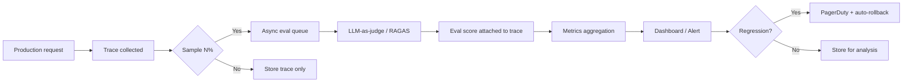
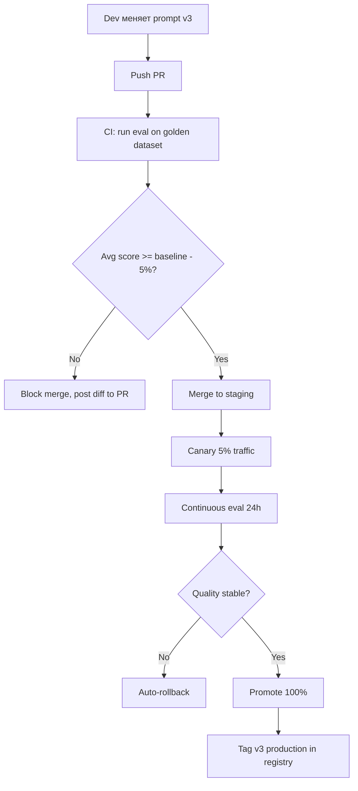
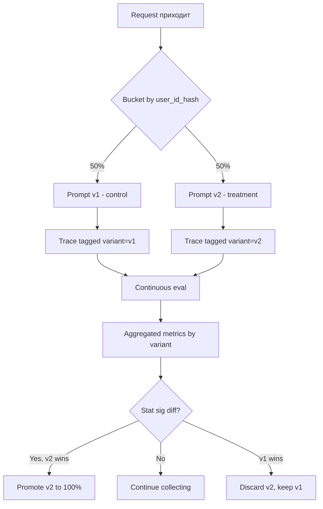
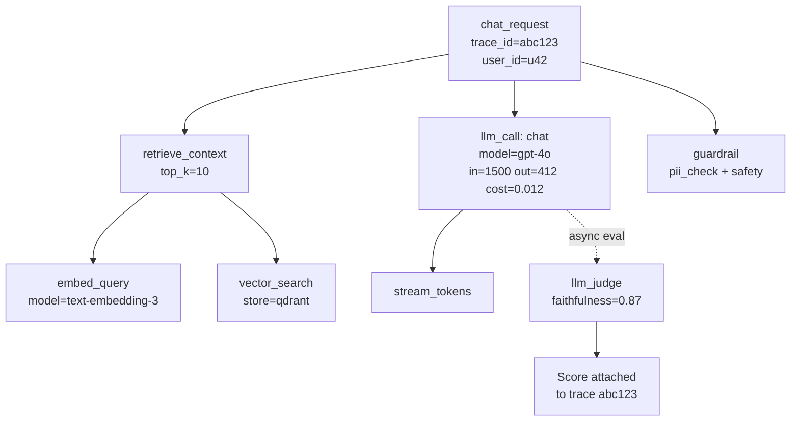
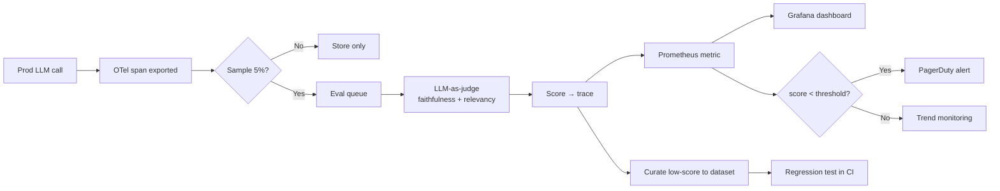
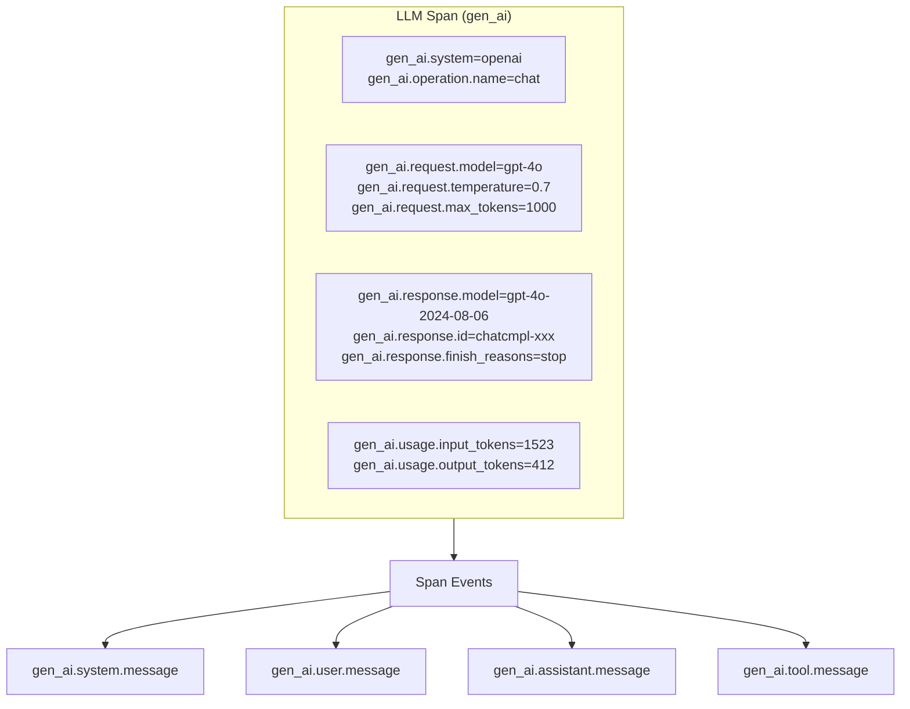

# Вопросы на собеседовании: `AI/LLM Observability`

**LLM Observability** — это специализированная ветка observability для систем на базе больших языковых моделей. Классические APM-инструменты (Datadog, New Relic) дают только grease — latency и status code, но не отвечают на главные вопросы: **«а ответ-то хороший?»**, **«почему модель галлюцинирует на этом промпте?»**, **«куда ушло $20 000 за неделю?»**. LLM-специфичный obs закрывает дыру: tracing цепочек/агентов, метрики токенов/стоимости, evals в проде, prompt versioning и A/B-тесты.

**Дата актуализации:** 2026-05-23

## Полезные ссылки

### Frameworks и платформы

- [LangSmith (LangChain)](https://docs.smith.langchain.com/) — observability + evals от LangChain
- [Langfuse](https://langfuse.com/) — open-source LLM observability (self-host + cloud)
- [Arize Phoenix](https://docs.arize.com/phoenix) — OpenTelemetry-native LLM observability
- [Helicone](https://www.helicone.ai/) — proxy-based observability, no SDK changes
- [W&B Prompts](https://wandb.ai/site/prompts/) — Weights & Biases для LLM
- [OpenLLMetry](https://www.traceloop.com/openllmetry) — OTel-based vendor-neutral SDK
- [TruLens](https://www.trulens.org/) — eval-first observability
- [Datadog LLM Observability](https://www.datadoghq.com/product/llm-observability/) — enterprise APM + LLM

### OpenTelemetry GenAI

- [OTel GenAI Semantic Conventions](https://opentelemetry.io/docs/specs/semconv/gen-ai/) — официальная спека
- [OTel GenAI events](https://opentelemetry.io/docs/specs/semconv/gen-ai/gen-ai-events/) — span events для prompts/completions
- [OpenInference](https://github.com/Arize-ai/openinference) — реализация конвенций (Arize)

### Production patterns

- [Continuous eval (Google paper)](https://arxiv.org/abs/2308.05374)
- [LLM Monitoring Best Practices (Anthropic)](https://www.anthropic.com/news/safety-bulletin)
- [PII redaction (Microsoft Presidio)](https://microsoft.github.io/presidio/)

## Содержание

1. **Зачем LLM observability отдельно** — Q1, Q2
2. **Tracing и spans** — Q3, Q4, Q5
3. **OpenTelemetry GenAI** — Q6, Q7
4. **Frameworks** — Q8, Q9, Q10, Q11, Q12
5. **Метрики и alerting** — Q13, Q14, Q15, Q16
6. **PII / Privacy** — Q17, Q18
7. **Continuous eval** — Q19, Q20, Q21, Q22
8. **Agent / RAG tracing** — Q23, Q24, Q25
9. **A/B testing и cost optimization** — Q26, Q27
10. **Анти-паттерны** — Q28

---

## Q1. Почему для LLM нужен отдельный observability, мало классического APM? (!)

**Классический APM** (Datadog APM, New Relic, Dynatrace) заточен под детерминированные сервисы:

- Запрос → ответ → код 200/500
- Метрики: latency, throughput, error rate
- Логи: stack trace при ошибке

**Что не работает с LLM:**

1. **Non-deterministic output.** Один и тот же prompt даёт разный ответ (`temperature > 0`). HTTP 200 ≠ корректный ответ. APM не отличит `"Париж — столица Франции"` от `"Берлин — столица Франции"`.
2. **Качество = бизнес-метрика.** В классическом сервисе «работает/не работает» бинарно. В LLM нужна **шкала качества**: faithfulness, relevancy, hallucination rate, user satisfaction.
3. **Многошаговые цепочки.** Agent делает 10 LLM-вызовов + 5 tool calls + 3 retrieval. APM покажет outer HTTP, но не структуру цепочки.
4. **Embedding context.** Для RAG критично: какие чанки достали, что использовала модель, что не использовала.
5. **Cost как first-class метрика.** В классическом APM нет «$ per request». В LLM один badly-tuned prompt = тысячи $ за день.
6. **Prompts эволюционируют.** Версионирование промпта = версионирование кода. Нужен diff и A/B.

**Вывод:** LLM observability — это **APM + eval-platform + cost-tracker + prompt-management** в одном.

---

## Q2. Какие три pillars у LLM observability? Чем отличается от классических metrics/logs/traces? (!)

**Классические 3 pillars:** metrics, logs, traces.

**LLM-специфичные 3 pillars:**

1. **Tracing** — структура запроса: chain → spans (LLM call, retrieval, tool call), parent-child, attributes (model, tokens, latency, cost).
2. **Metrics** — агрегаты: tokens/min, $/hour, p95 latency, eval scores, cache hit rate.
3. **Evals** — оценки качества: LLM-as-judge, RAGAS, user feedback, regression vs golden dataset.

**Где «исчезли» логи?** В LLM `prompt + completion` сам по себе **является логом** — он попадает в spans как `gen_ai.prompt` / `gen_ai.completion` (с PII-маскировкой). Отдельный текстовый лог не нужен.

| Классика     | LLM эквивалент                                  |
| ------------ | ----------------------------------------------- |
| `INFO log`   | Span с `gen_ai.system.message`                  |
| `ERROR log`  | Span с `status=error` + `gen_ai.response.finish_reasons` |
| HTTP-метрики | Token metrics, cost, latency per span           |
| APM trace    | LLM trace (chain + spans)                       |
| —            | **Eval scores** (новый pillar)                  |

---

## Q3. Что такое trace и span в контексте LLM? (!)

**Trace** — это end-to-end жизнь одного пользовательского запроса. Пример: пользователь спросил «расскажи про Spring», получил ответ.

**Span** — отдельный шаг внутри trace. У LLM-системы:

- **Root span** — HTTP-запрос или сессия чата.
- **LLM call span** — вызов модели (`gpt-4o`, `claude-3-7`).
- **Retrieval span** — поход в vector store.
- **Tool call span** — выполнение функции (web search, calculator).
- **Embedding span** — генерация вектора.
- **Guardrail span** — проверка safety/PII.

Spans образуют **дерево** через `parent_span_id`:

```
trace_id=abc123
└── chat_request (root)
    ├── retrieve_context (vector search)
    │   └── embedding (text → vector)
    ├── llm_call (gpt-4o)
    │   └── stream_tokens
    └── guardrail (PII check)
```

**Атрибуты span:**

- `gen_ai.system` = `openai`
- `gen_ai.request.model` = `gpt-4o`
- `gen_ai.usage.input_tokens` = 1500
- `gen_ai.usage.output_tokens` = 230
- `latency_ms` = 1200
- `cost_usd` = 0.012
- `trace.user_id` = `user_42`
- `trace.session_id` = `sess_xyz`

---

## Q4. Как устроена parent-child иерархия в trace для агента?

Для **ReAct-агента** с tool calls trace выглядит так:

```
trace_id=t1
└── agent_invoke (parent=null, type=AGENT)
    ├── llm_call #1 (parent=agent_invoke, decides tool)
    │   → output: "use search('Spring AOP')"
    ├── tool_call: search (parent=agent_invoke)
    │   ├── http_get (parent=tool_call)
    │   └── result: [docs]
    ├── llm_call #2 (parent=agent_invoke, reasoning)
    │   → output: "use calculator(2+2)"
    ├── tool_call: calculator (parent=agent_invoke)
    │   → result: 4
    └── llm_call #3 (parent=agent_invoke, final answer)
        → output: "ответ пользователю"
```

**Зачем иерархия?**

1. **Cost rollup** — стоимость `agent_invoke` = сумма всех детей.
2. **Latency breakdown** — где затык: LLM, tool, retrieval?
3. **Debug loops** — agent зациклился? Видим 50 child LLM-calls.
4. **Replay** — можно восстановить шаги для разбора.

**Span links** (cross-trace) — если агент A зовёт агента B через очередь, span B ссылается на span A через `links` (а не parent), чтобы сохранить причинно-следственную связь без вложенности.

---

## Q5. Какие атрибуты обязательны для LLM-span? (!)

**Минимальный набор** (OTel GenAI conventions):

| Атрибут                          | Пример          | Зачем                              |
| -------------------------------- | --------------- | ---------------------------------- |
| `gen_ai.system`                  | `openai`        | Какой провайдер                    |
| `gen_ai.operation.name`          | `chat`          | Тип операции (chat/embeddings)     |
| `gen_ai.request.model`           | `gpt-4o`        | Что попросили                      |
| `gen_ai.response.model`          | `gpt-4o-2024-08-06` | Что реально ответило           |
| `gen_ai.request.temperature`     | `0.7`           | Параметры запроса                  |
| `gen_ai.request.max_tokens`      | `1000`          |                                    |
| `gen_ai.usage.input_tokens`      | `1523`          | Cost calc                          |
| `gen_ai.usage.output_tokens`     | `412`           |                                    |
| `gen_ai.response.finish_reasons` | `["stop"]`      | `stop` / `length` / `tool_calls`   |
| `gen_ai.response.id`             | `chatcmpl-xxx`  | Для корреляции с провайдером       |

**Опциональные, но полезные:**

- `gen_ai.conversation.id` — для сессий
- `gen_ai.prompt` — full prompt (как span event, не attribute — большой)
- `gen_ai.completion` — ответ модели
- `cost_usd` — посчитанная стоимость
- `eval.score` — асинхронный eval result

---

## Q6. Что такое OpenTelemetry GenAI Semantic Conventions? Зачем они? (!)

**OpenTelemetry GenAI Semantic Conventions** — это **стандартный словарь атрибутов** для LLM-трейсов, утверждённый CNCF (статус Experimental → Stable в 2025).

**Зачем нужны:**

1. **Vendor-agnostic.** Один и тот же код кладёт `gen_ai.request.model` независимо от backend: Datadog, Jaeger, Langfuse, Phoenix — все понимают.
2. **Cross-tool analytics.** Считаем `sum(gen_ai.usage.input_tokens) by gen_ai.request.model` в любом OTel-совместимом сторадже.
3. **Будущее-proof.** Меняешь vendor — трейсы остаются валидными.

**Ключевые namespaces:**

```yaml
gen_ai.system: openai | anthropic | google | cohere | azure | ...
gen_ai.operation.name: chat | text_completion | embeddings
gen_ai.request.*: model, temperature, top_p, max_tokens, presence_penalty
gen_ai.response.*: model, id, finish_reasons
gen_ai.usage.*: input_tokens, output_tokens
gen_ai.conversation.id: <session id>
```

**Span events** для содержимого (вместо attributes, чтобы не раздувать каждый атрибут):

```yaml
gen_ai.system.message      # system prompt
gen_ai.user.message        # user input
gen_ai.assistant.message   # assistant output
gen_ai.tool.message        # tool call result
gen_ai.choice              # модельный choice (n>1)
```

**Контент-events могут отключаться** через флаг `OTEL_INSTRUMENTATION_GENAI_CAPTURE_MESSAGE_CONTENT=false` — для PII.

---

## Q7. Как использовать OTel GenAI на практике (Python пример)?

Установка автоинструментации (OpenLLMetry-style):

```python
from opentelemetry import trace
from opentelemetry.sdk.trace import TracerProvider
from opentelemetry.sdk.trace.export import BatchSpanProcessor
from opentelemetry.exporter.otlp.proto.grpc.trace_exporter import OTLPSpanExporter
from openinference.instrumentation.openai import OpenAIInstrumentor

# 1. Настроить OTel pipeline
provider = TracerProvider()
provider.add_span_processor(
    BatchSpanProcessor(OTLPSpanExporter(endpoint="http://otel-collector:4317"))
)
trace.set_tracer_provider(provider)

# 2. Авто-инструментировать OpenAI SDK
OpenAIInstrumentor().instrument()

# 3. Обычный код OpenAI — спаны создаются автоматически
import openai
client = openai.OpenAI()
resp = client.chat.completions.create(
    model="gpt-4o",
    messages=[{"role": "user", "content": "Hello"}]
)
# Span создан с атрибутами:
#   gen_ai.system=openai
#   gen_ai.request.model=gpt-4o
#   gen_ai.usage.input_tokens=8
#   gen_ai.usage.output_tokens=12
```

Ручное создание span:

```python
tracer = trace.get_tracer(__name__)

with tracer.start_as_current_span("custom_llm_call") as span:
    span.set_attribute("gen_ai.system", "anthropic")
    span.set_attribute("gen_ai.request.model", "claude-3-7-sonnet")
    span.set_attribute("gen_ai.request.temperature", 0.7)

    response = anthropic_client.messages.create(...)

    span.set_attribute("gen_ai.usage.input_tokens", response.usage.input_tokens)
    span.set_attribute("gen_ai.usage.output_tokens", response.usage.output_tokens)
    span.add_event("gen_ai.completion", {"content": response.content[0].text})
```

---

## Q8. Что такое LangSmith? Когда выбирать? (!)

**LangSmith** — observability + eval-платформа от создателей LangChain.

**Сильные стороны:**

- **Auto-instrumentation для LangChain/LangGraph** — нулевая настройка, если уже на этом стеке.
- **Datasets и experiments** — встроенное хранилище тестовых кейсов с версионированием.
- **Evaluations as code** — built-in evaluators (correctness, conciseness, custom LLM-judge).
- **Prompts hub** — версии промптов с diff и rollback.
- **Annotation queue** — UI для human-feedback.
- **A/B testing** — сравнение цепочек на одном датасете.

**Декоратор `@traceable`** (вне LangChain тоже работает):

```python
from langsmith import traceable

@traceable(run_type="llm", name="answer_question")
def answer(question: str) -> str:
    response = openai.chat.completions.create(
        model="gpt-4o",
        messages=[{"role": "user", "content": question}]
    )
    return response.choices[0].message.content
```

**Минусы:**

- **Vendor-lock** — экосистема LangChain (хотя есть SDK для других).
- **Cloud-only по дефолту** (self-host есть, но платный enterprise).
- **Цена** — Plus tier для команд начинается от $39/seat.

**Когда выбирать:** уже сидите на LangChain/LangGraph, хотите eval+obs в одном, готовы платить за SaaS.

---

## Q9. Что такое Langfuse? Чем отличается от LangSmith? (!)

**Langfuse** — open-source LLM observability, MIT-лицензия, можно self-hostить (Docker / k8s).

**Архитектура:**

- **Traces** — корневые запросы (с `user_id`, `session_id`, `tags`).
- **Observations** — span-эквивалент (типы: `LLM`, `GENERATION`, `SPAN`, `EVENT`).
- **Sessions** — группировка trace'ов одной беседы.
- **Users** — группировка по конечному пользователю.
- **Prompts** — версионируемые шаблоны с labels (`production`, `staging`).
- **Scores** — eval-результаты (числовые, категориальные, boolean).

**Пример SDK:**

```python
from langfuse import Langfuse
from langfuse.decorators import observe, langfuse_context

langfuse = Langfuse(
    public_key="pk-lf-...",
    secret_key="sk-lf-...",
    host="https://cloud.langfuse.com"
)

@observe(as_type="generation")
def call_llm(question: str) -> str:
    response = openai.chat.completions.create(
        model="gpt-4o",
        messages=[{"role": "user", "content": question}]
    )
    langfuse_context.update_current_observation(
        model="gpt-4o",
        input=question,
        output=response.choices[0].message.content,
        usage={"input": response.usage.prompt_tokens,
               "output": response.usage.completion_tokens}
    )
    return response.choices[0].message.content
```

**Чем отличается от LangSmith:**

| Критерий           | LangSmith              | Langfuse                       |
| ------------------ | ---------------------- | ------------------------------ |
| Open-source        | Нет                    | **Да (MIT)**                   |
| Self-host          | Enterprise only        | **Free, Docker compose**       |
| Vendor-lock        | LangChain-centric      | **Generic SDK**                |
| Prompt management  | Да (Hub)               | Да (с labels)                  |
| Eval               | Сильнее, code-first    | Есть, но проще                 |
| Cost               | $39+/seat              | Free self-host / $29+ cloud    |
| EU-hosting / GDPR  | Опционально            | EU region из коробки           |

**Когда Langfuse:** хотите контроль данных, бюджет ограничен, не на LangChain.

---

## Q10. Что такое Arize Phoenix? Чем уникален?

**Arize Phoenix** — open-source LLM observability от Arize AI, делает упор на **eval depth и cluster analysis**.

**Особенности:**

- **OpenTelemetry-native** — использует OpenInference (расширение OTel GenAI), легко интегрируется в существующий OTel-pipeline.
- **Embedding cluster analysis** — кластеризует ответы в embedding-пространстве, находит «плохие» кластеры (например, все запросы про API-доку → стабильно низкий score).
- **RAG dashboards** — context relevance, retrieval precision/recall как первоклассные метрики.
- **Local-first** — можно запустить `phoenix.launch_app()` прямо в notebook, не нужен внешний backend.
- **Built-in evaluators** — `HallucinationEvaluator`, `QAEvaluator`, `RelevanceEvaluator`.

**Пример:**

```python
import phoenix as px
from phoenix.otel import register

tracer_provider = register(project_name="my-llm-app")

# Запустить UI локально (или Phoenix Cloud)
session = px.launch_app()
# Открой http://localhost:6006

# Eval после сбора трейсов
from phoenix.evals import HallucinationEvaluator, run_evals
df = px.Client().get_spans_dataframe()
results = run_evals(df, [HallucinationEvaluator(eval_model="gpt-4o")])
```

**Когда Phoenix:** команда серьёзно занимается eval-ами, нужна кластеризация ошибок, уже на OTel.

---

## Q11. Что такое Helicone? Когда стоит выбирать?

**Helicone** — proxy-based observability. Принцип: вместо изменения SDK меняем `base_url` запроса на Helicone-прокси, и всё трейсится.

```python
import openai

client = openai.OpenAI(
    api_key="sk-...",
    base_url="https://oai.helicone.ai/v1",  # вместо api.openai.com
    default_headers={"Helicone-Auth": f"Bearer {HELICONE_KEY}"}
)
# Всё, дальше обычный SDK — Helicone видит каждый запрос
```

**Плюсы:**

- **Нулевой code change** — поменял URL и хедер.
- **Работает с любым LLM-SDK** (OpenAI-compatible).
- **Cache из коробки** — повторяющиеся запросы возвращаются мгновенно.
- **Rate limiting per user** на уровне прокси.

**Минусы:**

- **Дополнительный hop** — латентность +30-80 мс.
- **Single point of failure** — если Helicone лёг, лёг и ваш LLM.
- **Меньше глубины** — нет полноценного eval/dataset workflow.

**Когда выбирать:** быстрый старт без рефакторинга, нужен встроенный кэш и rate limit, готовы добавить hop.

---

## Q12. Сравни популярные LLM observability frameworks. (!)

| Tool          | Open-source | Self-host    | Approach          | Сильная сторона                | Слабость                  |
| ------------- | ----------- | ------------ | ----------------- | ------------------------------ | ------------------------- |
| **LangSmith** | Нет         | Enterprise   | SDK / @traceable  | LangChain ecosystem, evals     | Vendor-lock, цена         |
| **Langfuse**  | Да (MIT)    | Free Docker  | Generic SDK       | Self-host, prompt mgmt         | Eval депTH чуть слабее    |
| **Phoenix**   | Да          | Free         | OTel-native       | Eval, cluster analysis         | UX чуть инженерный        |
| **Helicone**  | Частично    | Да           | Proxy             | Zero code change, cache        | Extra hop, мало eval      |
| **OpenLLMetry** | Да (Apache) | Free         | OTel SDK          | Vendor-neutral, экспорт куда угодно | Не самостоятельный backend |
| **W&B Prompts** | Нет        | Cloud        | SDK               | Combined с ML training         | Дорого, тяжёлый           |
| **TruLens**   | Да          | Free         | SDK + decorators  | RAG-eval first                 | Меньше production-features|
| **Datadog LLM** | Нет        | Cloud        | SDK + APM         | Уже в Datadog → 1 UI           | Дорого, vendor-lock       |

**Правило выбора:**

- **LangChain-стек + бюджет есть** → LangSmith.
- **Контроль данных / GDPR / self-host** → Langfuse.
- **Серьёзный eval + кластеризация** → Phoenix.
- **Минимум усилий, нет SDK-доступа** → Helicone.
- **Уже OTel-инфра** → OpenLLMetry → любой OTel-backend (Tempo, Jaeger, Datadog).

---

## Q13. Какие метрики обязательно собирать с LLM-системы? (!)

**Token / Cost метрики:**

- `input_tokens_total`, `output_tokens_total` — по модели, юзеру, эндпоинту.
- `cost_usd_total` = `input_tokens × $price_in` + `output_tokens × $price_out`.
- `cost_per_user_hourly`, `cost_per_endpoint_daily` — для алертинга.

**Latency:**

- **TTFT** (time-to-first-token) — для streaming UX.
- **Total latency** — полный ответ.
- Перцентили **p50 / p95 / p99** — обязательно перцентили, mean врёт.

**Качество:**

- `eval_score` (faithfulness, relevancy) — асинхронно посчитанные.
- `user_feedback_thumbs` — `up`/`down`/null.
- `hallucination_rate` — % ответов с галлюцинациями (по eval).

**Надёжность:**

- `error_rate` — total / 4xx / 5xx / timeout / rate-limit.
- `retry_count` — сколько раз retry'или.
- `fallback_triggered_count` — переключения на резервную модель.

**Эффективность:**

- `cache_hit_rate` — % запросов из кэша (semantic / exact).
- `prompt_token_overhead` — отношение system prompt к user input (если 80% контекста — system, это плохо).
- `tool_call_avg` — среднее число tool calls на запрос (для агентов).

**Бизнес:**

- `tasks_completed_rate`, `user_retention`, `escalation_to_human` — если есть пользовательский продукт.

---

## Q14. Как считать стоимость LLM-вызова и отслеживать spike?

**Формула:**

```
cost_usd = (input_tokens / 1_000_000) × price_per_million_input
        + (output_tokens / 1_000_000) × price_per_million_output
```

Цены вшиты в библиотеку или подтягиваются из конфига:

```python
PRICING = {
    "gpt-4o":            {"in": 2.50, "out": 10.00},
    "gpt-4o-mini":       {"in": 0.15, "out": 0.60},
    "claude-3-7-sonnet": {"in": 3.00, "out": 15.00},
    "claude-3-5-haiku":  {"in": 0.80, "out": 4.00},
    "deepseek-chat":     {"in": 0.27, "out": 1.10},
}

def calc_cost(model: str, in_tok: int, out_tok: int) -> float:
    p = PRICING[model]
    return (in_tok / 1e6) * p["in"] + (out_tok / 1e6) * p["out"]
```

**Alert на spike** (Prometheus / VictoriaMetrics):

```promql
# Среднечасовая стоимость за последний час > 3× ср. за неделю
( sum(rate(llm_cost_usd[1h])) )
/
( sum(rate(llm_cost_usd[7d])) )
> 3
```

**Что обычно вызывает spike:**

1. Зацикленный агент (10 000 LLM calls за минуту).
2. Кто-то выкатил prompt с `max_tokens=16000`.
3. Бот-абуз публичного API.
4. Случайный переход с `gpt-4o-mini` на `gpt-4o`.
5. Rebuild RAG-индекса с embeddings без батчинга.

---

## Q15. Какие алерты обязательно настроить для LLM в проде? (!)

**Tier 1 — критические:**

1. **Cost spike** — `hourly_cost > 3× weekly_avg` → SMS дежурному.
2. **Latency p99** — `p99 > 30s` или `p99 > 2× baseline`.
3. **Error rate** — `5xx > 5%` за 5 минут.
4. **Rate limit hit** — `429 > N` → сигнал расширить квоту или включить очередь.
5. **Eval score drop** — `avg_faithfulness < threshold` за 1 час → возможна регрессия промпта.

**Tier 2 — деградация качества:**

6. **Hallucination spike** — `hallucination_rate > baseline + 3σ`.
7. **Thumbs-down rate** — `negative_feedback / total > 10%`.
8. **Empty / refusal responses** — модель массово отказывается.

**Tier 3 — операционные:**

9. **Cache hit drop** — `cache_hit_rate < 30%` (раньше было 60%) → инвалидируется кэш слишком часто.
10. **Tool call loop** — `tool_calls_per_request > 20` → агент зациклился.
11. **Provider degradation** — `latency by provider` показывает: у OpenAI выросло, надо включить fallback.

**Anti-pattern:** алертить только на 5xx. Для LLM 200 OK с галлюцинацией хуже, чем 500.

---

## Q16. Что такое sampling в трейсинге и какую стратегию выбрать?

**Sampling** — какой процент запросов трейсить. Трейсить всё на масштабе — дорого (storage) и медленно (network).

**Стратегии:**

| Стратегия            | Описание                                                | Когда                              |
| -------------------- | ------------------------------------------------------- | ---------------------------------- |
| **Always-on (100%)** | Все запросы трейсятся                                   | Low-volume (<100 req/min), dev     |
| **Head-based**       | Решение принимается до запроса (random N%)              | High-volume, простой uniform       |
| **Tail-based**       | Решение после ответа (на основе latency / error / cost) | Хочешь все медленные / дорогие      |
| **Adaptive**         | Динамический процент по нагрузке                         | Spike-prone системы                |
| **Always-errors**    | Все ошибки + N% успешных                                 | Default рекомендация               |

**Production-рецепт:**

```python
# Sampling rules
SAMPLE_RULES = [
    ("error", 1.0),              # все ошибки
    ("slow", 1.0),               # все > p99
    ("high_cost", 1.0),          # все > $0.50
    ("eval_flagged", 1.0),       # all low-score
    ("default", 0.05),           # 5% обычных
]
```

**Tail-based нюанс:** требует буферизации span'ов до конца trace → нужен collector с tail-sampling процессором (OTel Collector умеет).

---

## Q17. Как защитить PII при трейсинге prompts/completions? (!)

**Проблема:** prompt часто содержит ПД (email, номер карты, паспорт), которые попадают в спан → утечка при доступе к obs-платформе.

**Стратегии:**

1. **Redaction на уровне SDK** — перед отправкой span'а проходим `gen_ai.prompt` через redactor.

```python
from presidio_analyzer import AnalyzerEngine
from presidio_anonymizer import AnonymizerEngine

analyzer = AnalyzerEngine()
anonymizer = AnonymizerEngine()

def redact(text: str) -> str:
    results = analyzer.analyze(text=text, language="en")
    return anonymizer.anonymize(text=text, analyzer_results=results).text

# Hook в span processor
class RedactingSpanProcessor(BatchSpanProcessor):
    def on_end(self, span):
        for event in span.events:
            if event.name in ("gen_ai.user.message", "gen_ai.completion"):
                event.attributes["content"] = redact(event.attributes["content"])
        super().on_end(span)
```

2. **Regex pre-redaction** (быстрее) — для известных форматов (email, card, IP).

3. **Не логировать content вообще** — флаг `OTEL_INSTRUMENTATION_GENAI_CAPTURE_MESSAGE_CONTENT=false`. Тогда span содержит только метаданные, без текста.

4. **Hash вместо raw** — `sha256(prompt)` для уникальности запроса без раскрытия.

5. **Tier-based** — для VIP-юзеров content не сохраняется, для остальных — частично.

6. **GDPR right-to-deletion** — система должна уметь по `user_id` стереть все трейсы. Langfuse и Phoenix это поддерживают штатно.

**Аудит:** регулярно сэмплируем 1% трейсов на проверку «есть ли PII» (LLM-as-judge для PII detection).

---

## Q18. Что такое мasked prompts и зачем GDPR-режим?

**Masked prompts** — храним структуру промпта без значений переменных:

```text
Original:  "Find restaurants near 123 Main St for John Doe (john@example.com)"
Masked:    "Find restaurants near {ADDRESS} for {NAME} ({EMAIL})"
```

**Зачем:**

- Аналитика «какие шаблоны промптов часто использует юзер» работает без хранения ПД.
- A/B-тесты сравнивают шаблоны, а не индивидуальные запросы.
- GDPR-compliant: даже при breach утечёт только структура.

**GDPR-режим в Langfuse / LangSmith:**

- EU data residency (хранение только в ЕС-регионе).
- Encryption at rest + in transit (TLS 1.3, AES-256).
- DSAR API — экспорт всех данных по `user_id` за <30 дней.
- Right-to-deletion API — удаление за <30 дней.
- Sub-processor agreements (Vercel, AWS, etc).
- DPA (Data Processing Agreement) подписывается.

**Production-pattern:** хранить `user_id` как `sha256(raw_user_id + salt)`, плюс держать **reverse map** в отдельном vault. При запросе на удаление — удаляем строку в vault, и `user_id` в трейсах становится несвязанным с реальным человеком (effective deletion).

---

## Q19. Что такое continuous eval в production? (!)

**Continuous eval** — постоянное измерение качества LLM-системы на живом трафике, а не только при релизе.

**Pipeline:**



**Ключевые принципы:**

1. **Sample 1-5%** — eval сам по себе LLM-вызов, дорог.
2. **Async** — не блокировать ответ пользователю.
3. **Independent judge model** — eval'ит другая модель (Claude если основная GPT, и наоборот) — снижает self-bias.
4. **Multi-metric** — не одна метрика, а набор: faithfulness + relevancy + harmfulness.
5. **Scored → metric → alert** — каждый score попадает в Prometheus, оттуда алерт.

**Пример** (LangSmith feedback API):

```python
from langsmith import Client
client = Client()

# После каждого ответа — асинхронный eval
@async_task
def evaluate_response(run_id, question, answer, context):
    score = llm_judge_faithfulness(question, answer, context)
    client.create_feedback(
        run_id=run_id,
        key="faithfulness",
        score=score,
        comment="async LLM-as-judge"
    )
```

---

## Q20. Как интегрировать user feedback в observability?

**Каналы feedback:**

1. **Explicit** — thumbs up/down, 5-star rating, comment.
2. **Implicit** — пользователь переформулировал вопрос (значит ответ не понял), скопировал ответ (значит понравился), закрыл чат (могла быть фрустрация).
3. **Downstream signal** — конверсия / retention / refund rate.

**Связка с trace:**

```python
# Frontend отправляет feedback с trace_id
POST /api/feedback
{
  "trace_id": "abc123",
  "rating": "thumbs_down",
  "comment": "Wrong product link"
}

# Backend пишет в Langfuse / LangSmith
langfuse.score(
    trace_id="abc123",
    name="user_feedback",
    value=0,  # 0 для thumbs_down, 1 для up
    comment="Wrong product link"
)
```

**Дашборд:**

- `thumbs_down_rate by endpoint` — какой эндпоинт чаще всего получает негатив.
- `thumbs_down by model` — модель А чаще получает негатив, чем B.
- `correlation(eval_score, user_rating)` — если LLM-judge говорит 0.9 а юзер ставит ❌, judge калиброван плохо.

**Pipeline learnings → dataset:**

```text
Thumbs-down trace → ручной разбор → если eval подтверждает плохой ответ
→ добавляем в golden-dataset → используем для регресс-тестов будущих версий промпта
```

---

## Q21. Как из production-трейсов собрать golden dataset для регрессионного тестирования?

**Golden dataset** — курируемый набор пар `(input, expected_output / criteria)` для регрессии.

**Источники из production:**

1. **High-frequency queries** — топ-100 самых частых запросов (по эмбеддинг-кластеризации).
2. **Low-score traces** — все с `eval_score < 0.5` и подтверждением human.
3. **User-flagged** — все thumbs-down с разметкой.
4. **Edge cases** — самые длинные/короткие prompts, нестандартные языки.
5. **Adversarial** — попытки jailbreak, prompt injection, OOD-вопросы.

**Workflow** (Langfuse / LangSmith):

```python
# 1. Curate из трейсов
from langfuse import Langfuse
lf = Langfuse()

traces = lf.fetch_traces(
    tags=["thumbs_down"],
    from_timestamp="2026-04-01",
    limit=500
)

# 2. Создать dataset
dataset = lf.create_dataset(name="regression-v2", description="...")
for trace in traces:
    lf.create_dataset_item(
        dataset_name="regression-v2",
        input=trace.input,
        expected_output=trace.input_human_corrected,  # курируется человеком
        metadata={"source_trace": trace.id}
    )

# 3. Запустить новую версию промпта на dataset
results = run_experiment(
    dataset="regression-v2",
    prompt_version="v3",
    evaluators=[faithfulness, relevancy]
)

# 4. Сравнить с baseline v2 — pass/fail regression test
```

**В CI/CD:** при попытке мержа изменения промпта → запускается `evaluate` против dataset → если средний score упал >5% → блок мержа.

---

## Q22. Как регрессионный пайплайн встроен в CI/CD для промптов?

**Промпт = код**, значит у него должен быть pipeline:



**GitHub Actions пример:**

```yaml
name: prompt-regression
on: [pull_request]
jobs:
  eval:
    runs-on: ubuntu-latest
    steps:
      - uses: actions/checkout@v4
      - name: Run eval
        run: |
          python scripts/evaluate.py \
            --prompt-file prompts/customer_support.txt \
            --dataset langfuse://datasets/regression-v2 \
            --baseline-prompt main:prompts/customer_support.txt \
            --threshold 0.05
      - name: Comment results
        uses: actions/github-script@v7
        with:
          script: |
            // Postаем таблицу score'ов в PR
```

**Прометей-style алерт после canary:**

```promql
( avg_over_time(eval_score{prompt_version="v3"}[1h]) )
< ( avg_over_time(eval_score{prompt_version="v2"}[1h]) * 0.95 )
```

---

## Q23. Как трейсить агент и находить infinite loops? (!)

**Проблема:** ReAct-агент может зациклиться: `think → tool → think → tool → ...` бесконечно, сжигая токены.

**Сигналы зацикливания в трейсе:**

1. **High depth** — `span.depth > 20`.
2. **Repeating tool calls** — один и тот же tool вызывается с похожими аргументами N раз.
3. **Token spike per trace** — `total_tokens > 100_000` в одном trace.
4. **Latency outlier** — `duration > 5 min`.

**Метрики для алерта:**

```promql
# Алерт: средняя глубина агентского trace выросла
avg(llm_agent_depth) by (agent_name) > 15
```

**Дашборд для агентов** (Langfuse / Phoenix):

- `avg_tool_calls_per_task` — растёт ли?
- `cost_per_completed_task` — растёт ли?
- `infinite_loop_count` — сколько trace'ов прервано по `max_iterations`.
- `tool_call_distribution` — какой tool вызывается чаще ожиданий.

**Структура span'ов агента:**

```python
@traceable(run_type="chain", name="react_agent")
def react_agent(question, max_iter=10):
    for i in range(max_iter):
        with tracer.start_as_current_span(f"iter_{i}") as span:
            thought = think(question)
            span.set_attribute("agent.thought", thought)
            tool, args = decide_action(thought)
            span.set_attribute("agent.tool", tool)
            span.set_attribute("agent.args", str(args))
            result = execute_tool(tool, args)
            if is_done(result):
                return result
    raise MaxIterationsExceeded(f"agent={i+1} iterations")
```

**Hard limits в проде:** `max_iter`, `max_total_tokens`, `max_cost_per_request` — каждый имеет alert.

---

## Q24. Как трейсить RAG-pipeline? Какие метрики ловить? (!)

**RAG trace** включает:

```
chat_request
├── embed_query (text → vector)
├── vector_search (top-k)
│   └── attribute: retrieved_chunks=[id1, id2, ...]
├── rerank (опционально)
├── llm_call (prompt = query + context)
│   └── attribute: gen_ai.context.chunks_used=[id1, id3]
└── post_check (citation validation)
```

**Ключевые RAG-метрики:**

1. **Retrieval quality:**
   - `retrieval_precision@k` — сколько из top-k релевантны (по эвалу).
   - `retrieval_recall` — сколько релевантных нашли из всех существующих.
   - `mrr` (mean reciprocal rank).

2. **Context utilization:**
   - `chunks_retrieved` vs `chunks_cited_in_answer` — если из 10 кусков использовали 2, нагрузка избыточна.
   - `context_relevance_score` (RAGAS).

3. **Answer quality:**
   - `faithfulness` — ответ опирается на контекст? (RAGAS)
   - `answer_relevancy` — отвечает на вопрос?
   - `citation_correctness` — реально ли цитируемый кусок поддерживает утверждение?

4. **Operational:**
   - `embedding_latency_p95`, `vector_search_latency_p95`.
   - `cache_hit_rate` для embeddings.
   - `unfound_query_rate` — % запросов где retrieval вернул < threshold relevant chunks → пробел в knowledge base.

**Дашборд кластеризации** (Phoenix): кластеры query-embedding-ов, где `avg(faithfulness) < 0.5` — целые сегменты с плохим качеством.

**Пример атрибутов span'а:**

```python
span.set_attribute("retrieval.top_k", 10)
span.set_attribute("retrieval.chunks_returned", 8)
span.set_attribute("retrieval.avg_similarity", 0.78)
span.set_attribute("rag.chunks_cited", ["doc1#p3", "doc2#p1"])
span.set_attribute("rag.context_tokens", 4200)
```

---

## Q25. Как считать «context utilization» в RAG и зачем?

**Context utilization** = доля полученного контекста, реально использованного в ответе.

**Зачем измерять:**

- Если из 10 чанков использовано только 2 — мы платим за обработку 8 лишних (cost + latency).
- Можно уменьшить `top_k` без потери качества.
- Если 0/10 — модель проигнорировала контекст (галлюцинация).

**Как считать:**

1. **Citation-based** — модель обязана ссылаться на чанки (`[1]`, `[2]`). После ответа парсим citations.

```python
def context_utilization(retrieved_chunks, citations_in_answer):
    if not retrieved_chunks:
        return 0.0
    used = set(citations_in_answer) & set(c.id for c in retrieved_chunks)
    return len(used) / len(retrieved_chunks)
```

2. **LLM-as-judge** — отдельный prompt: «какие чанки реально использованы»?

3. **Attention-based** (если есть доступ к weights) — анализ attention на chunk tokens.

**Метрика в проде:**

```promql
avg(rag_context_utilization) by (endpoint) < 0.3
# → alert: top_k слишком большой, уменьшаем
```

---

## Q26. Как делать A/B тестирование промптов в проде? (!)

**Цель:** prompt v2 действительно лучше v1, а не «у меня так показалось».

**Pipeline:**



**Реализация:**

```python
def get_prompt(user_id: str) -> tuple[str, str]:
    bucket = hash(user_id) % 100
    if bucket < 50:
        return prompt_v1, "v1"
    else:
        return prompt_v2, "v2"

prompt, variant = get_prompt(request.user_id)
span.set_attribute("experiment.variant", variant)
response = llm.call(prompt + request.question)
```

**Метрики для решения:**

- `avg(eval_score) by variant` — основное.
- `avg(thumbs_up_rate) by variant` — пользовательское.
- `avg(latency_ms) by variant`, `avg(cost_usd) by variant` — операционное.
- **Statistical significance** — Mann-Whitney U test или Bayesian, не просто «среднее больше».

**Sample size:** для 5% effect и 80% power обычно 1000-3000 примеров на вариант. Калькулятор: `statsmodels.stats.power`.

**Anti-pattern:** «v2 за день дала лучше score» — могло быть случайностью. Ждать 7 дней минимум, проверять weekly seasonality.

---

## Q27. Как obs помогает оптимизировать costs? (!)

**Шаги:**

1. **Топ-10 самых дорогих эндпоинтов:**
   ```sql
   SELECT endpoint, SUM(cost_usd) as total
   FROM traces WHERE date > now() - 7d
   GROUP BY endpoint ORDER BY total DESC LIMIT 10
   ```
   → видим: 80% бюджета — на `/api/summarize`.

2. **Профиль одного запроса** в дорогом эндпоинте:
   - input_tokens 12 000 (большой system prompt) → **сократить system prompt**.
   - output_tokens 3 000 (нет `max_tokens`) → **установить limit**.
   - используется `gpt-4o` → **попробовать gpt-4o-mini для не-критичных**.

3. **Cache opportunities:**
   - `cache_hit_rate=15%` → много повторов, добавить semantic cache (Redis + embeddings).
   - 30% запросов одинаковы по структуре, отличаются датой → шаблон + параметр.

4. **Model downgrading by route:**
   - 70% запросов — простой Q&A → переключить на дешевую модель.
   - 30% — сложный reasoning → оставить flagship.
   - Routing logic в коде, метрика `model_distribution`.

5. **Batch / async:**
   - Embeddings из 1000 документов поодиночке — дорого. Батчить → -5x cost.

6. **Prompt caching (Anthropic / OpenAI):**
   - Длинный system prompt → cached → -90% cost на cached tokens.
   - Метрика `cache_read_tokens` vs `cache_create_tokens`.

**Дашборд cost-optimization:**

- `cost_per_endpoint` (трендится вниз?)
- `cost_per_active_user` (масштабируется хорошо?)
- `cost_per_completed_task` (для agent: уменьшается?)
- `cache_savings_usd` (сколько сэкономили на кэше)

---

## Q28. Какие анти-паттерны в LLM observability? (!)

**1. Логирование полных prompts без PII redaction.** Утечка ПД. Решение: Presidio / regex / отключить content capture для tier'ов.

**2. 100% sampling на масштабе.** При 10 000 req/min трейсы съедают storage и денег больше, чем сам LLM. Решение: tail-based sampling.

**3. Хранение raw embeddings в trace.** Embedding — 1500 floats × 4 bytes = 6 KB на каждый, при 1M запросов в день = 6 GB. Решение: хранить только `embedding_id` (ссылку в vector store) или хеш.

**4. Нет корреляции LLM trace ↔ business trace.** Юзер жалуется «ответ был плохой 15 минут назад» — без `user_id` / `session_id` / `request_id` найти невозможно. Решение: проксировать context через все span'ы.

**5. Только латентность, без качества.** «p99 = 800ms» ничего не говорит про галлюцинации. Решение: eval-метрики обязательны.

**6. Eval только в CI, не в проде.** В проде поведение модели дрейфует (провайдер обновил модель, новый класс запросов). Решение: continuous eval с асинхронным judge.

**7. Один judge model для всего.** Если основная модель GPT и judge тоже GPT, есть self-preference bias. Решение: cross-judge (judge другой семьёй).

**8. Prompts хардкодом в коде.** Любая правка → деплой → невозможно A/B. Решение: prompts в hub (LangSmith / Langfuse), pulled by name+version в runtime.

**9. Cost-метрики только в конце месяца (по invoice провайдера).** За месяц можно сжечь $50 000. Решение: real-time cost tracking + alert per hour.

**10. Игнор tool call'ов агента в трейсе.** Цепочка из 50 tool calls → 1 root span без детализации → дебажить нечего. Решение: каждый tool call — отдельный span.

**11. Нет SLO для LLM-системы.** «У нас всё хорошо» = неизмеримо. Решение: `99% запросов с eval_score > 0.8`, `p95 latency < 3s`, `cost_per_request < $0.01` — формальные цели.

**12. Trust judge без калибровки.** Judge думает 0.9, юзер ставит 1/5. Решение: периодически human-label N трейсов, считать корреляцию judge ↔ human, перекалибровать.

---

## Диаграмма: структура LLM trace



---

## Диаграмма: continuous eval pipeline



---

## Диаграмма: OTel GenAI attributes



---

## See also

- [MLOps](mlops-interview.md) — общие practices ML lifecycle, model registry, drift
- [LLM Evaluation](llm-evaluation-interview.md) — RAGAS, LLM-as-judge, golden datasets, benchmarks
- [AI Agents](ai-agents-interview.md) — ReAct, tool calling, agent loops для tracing
- [Multi-agent Orchestration](multi-agent-orchestration-interview.md) — distributed tracing для multi-agent
- [RAG](rag-interview.md) — retrieval pipeline, context utilization
- [Model Serving](model-serving-interview.md) — deployment, A/B, canary
- [Observability](../monitoring/observability-interview.md) — общие принципы 3 pillars и SLO
- [OpenTelemetry](../monitoring/opentelemetry-interview.md) — OTel API/SDK/collector
- [Distributed Systems](../architecture/distributed-systems-interview.md) — distributed tracing, correlation
- [Prometheus & Grafana](../monitoring/prometheus-grafana-interview.md) — метрики и дашборды
- [Jaeger / Zipkin](../monitoring/jaeger-zipkin-interview.md) — backend для OTel-traces
