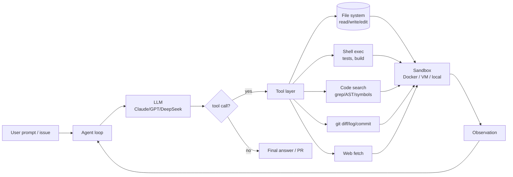
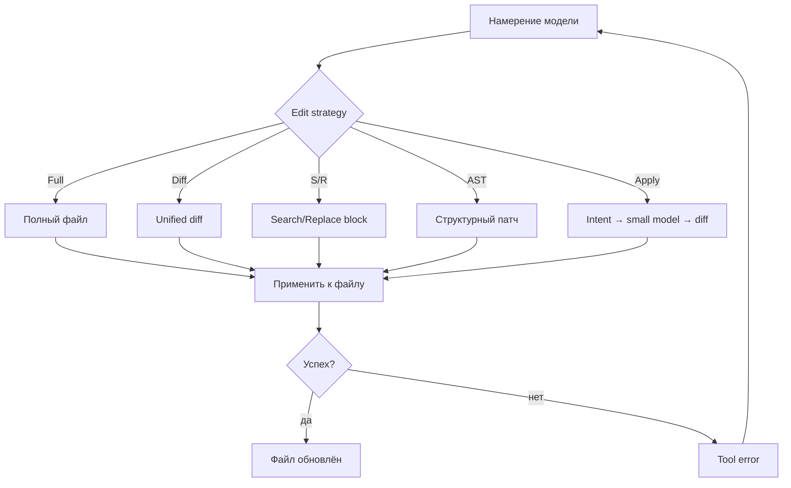
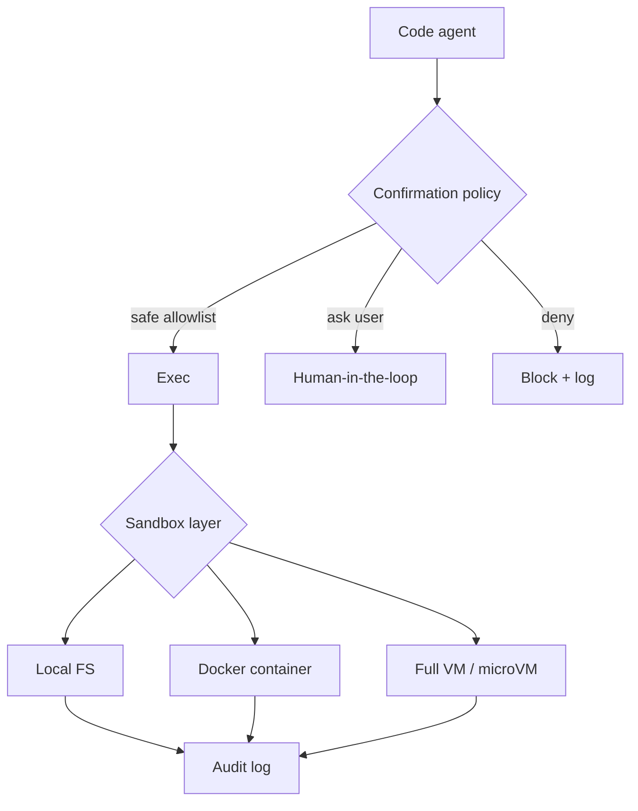
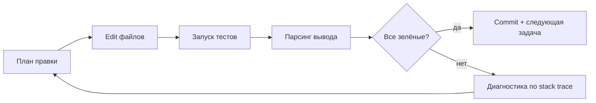

# Вопросы на собеседовании: `Code Agents`

**Code agent** — это LLM-приложение, которое читает, навигирует и **редактирует кодовую базу** через набор tools (file ops, shell, git, search) и **итерирует** до прохождения тестов. Спектр огромен — от inline-автокомплита (Copilot) до полностью автономных SWE-агентов в VM (Devin, OpenHands). В 2025-2026 они стали мейнстримом: SWE-Bench Verified превратился из академического бенчмарка в маркетинговое поле, а связка Claude Code + Cursor + Aider — стандартом ежедневного workflow многих команд.

## Полезные ссылки

### Официальная документация и авторитетные источники

- [SWE-Bench: Can Language Models Resolve Real-World GitHub Issues?](https://www.swebench.com/)
- [SWE-Bench Verified (OpenAI)](https://openai.com/index/introducing-swe-bench-verified/)
- [Anthropic: Claude Code documentation](https://docs.claude.com/en/docs/claude-code/overview)
- [Cursor — Features overview](https://cursor.com/features)
- [Aider — AI pair programming in your terminal](https://aider.chat/)
- [Cline (Claude Dev) — VS Code extension](https://github.com/cline/cline)
- [Cognition Labs: Devin announcement](https://cognition.ai/blog/introducing-devin)
- [OpenHands (ex-OpenDevin)](https://github.com/All-Hands-AI/OpenHands)
- [Princeton: SWE-agent paper](https://arxiv.org/abs/2405.15793)
- [Continue.dev — open-source code assistant](https://continue.dev/)
- [GitHub Copilot Workspace](https://github.blog/news-insights/product-news/github-copilot-workspace/)
- [tree-sitter — parser generator используется в Aider/Cursor](https://tree-sitter.github.io/tree-sitter/)

## Содержание

- [Полезные ссылки](#полезные-ссылки)
- [See also](#see-also)

**Спектр инструментов**
- [Q1. (!) Что такое code agent и какие категории существуют?](#q1--что-такое-code-agent-и-какие-категории-существуют)
- [Q2. (!) In-editor inline vs chat-in-editor vs agentic vs autonomous SWE?](#q2--in-editor-inline-vs-chat-in-editor-vs-agentic-vs-autonomous-swe)
- [Q3. Архитектура типичного code agent (LLM + tools + sandbox)?](#q3-архитектура-типичного-code-agent-llm--tools--sandbox)

**SWE-Bench**
- [Q4. (!) Что такое SWE-Bench и зачем он нужен?](#q4--что-такое-swe-bench-и-зачем-он-нужен)
- [Q5. (!) SWE-Bench Verified — чем отличается от Full?](#q5--swe-bench-verified--чем-отличается-от-full)
- [Q6. Как читать лидерборд SWE-Bench и где подвохи?](#q6-как-читать-лидерборд-swe-bench-и-где-подвохи)

**Tool use и edit strategies**
- [Q7. (!) Какие tools обычно есть у code agent?](#q7--какие-tools-обычно-есть-у-code-agent)
- [Q8. (!) Edit strategies: full replace / unified diff / search-replace / AST / apply-model?](#q8--edit-strategies-full-replace--unified-diff--search-replace--ast--apply-model)
- [Q9. (!) Почему unified diff часто ломается у LLM?](#q9--почему-unified-diff-часто-ломается-у-llm)
- [Q10. Apply-model в Cursor — что это и зачем?](#q10-apply-model-в-cursor--что-это-и-зачем)

**Tools: Cursor**
- [Q11. (!) Cursor: устройство и killer-фичи?](#q11--cursor-устройство-и-killer-фичи)
- [Q12. `.cursorrules` и project-level контекст?](#q12-cursorrules-и-project-level-контекст)

**Tools: Aider**
- [Q13. (!) Aider: git-first CLI и repo map?](#q13--aider-git-first-cli-и-repo-map)
- [Q14. Architect + Editor mode в Aider?](#q14-architect--editor-mode-в-aider)

**Tools: Claude Code**
- [Q15. (!) Claude Code: terminal-first agent и набор tools?](#q15--claude-code-terminal-first-agent-и-набор-tools)
- [Q16. Чем Claude Code отличается от Cursor/Aider?](#q16-чем-claude-code-отличается-от-cursoraider)

**Tools: Cline / Devin / OpenHands / Copilot Workspace**
- [Q17. Cline (Claude Dev): Plan/Act и auto-approve?](#q17-cline-claude-dev-planact-и-auto-approve)
- [Q18. (!) Devin: устройство, демо и реальные результаты?](#q18--devin-устройство-демо-и-реальные-результаты)
- [Q19. OpenHands — open-source альтернатива Devin?](#q19-openhands--open-source-альтернатива-devin)
- [Q20. GitHub Copilot Workspace и Continue?](#q20-github-copilot-workspace-и-continue)
- [Q21. Сравнительная таблица: Cursor / Aider / Claude Code / Cline / Devin?](#q21-сравнительная-таблица-cursor--aider--claude-code--cline--devin)

**Context и indexing**
- [Q22. (!) Как code agent выбирает релевантный контекст (repo map / embeddings / LSP)?](#q22--как-code-agent-выбирает-релевантный-контекст-repo-map--embeddings--lsp)
- [Q23. Почему long context (200K+) не отменяет indexing?](#q23-почему-long-context-200k-не-отменяет-indexing)

**Sandbox и testing**
- [Q24. (!) Sandboxing: Docker / VM / local shell с confirmation?](#q24--sandboxing-docker--vm--local-shell-с-confirmation)
- [Q25. (!) Test-driven loop: change → run → fix → repeat?](#q25--test-driven-loop-change--run--fix--repeat)

**Cost и production**
- [Q26. (!) Стоимость code agent: за задачу, за сессию, за месяц?](#q26--стоимость-code-agent-за-задачу-за-сессию-за-месяц)
- [Q27. Production patterns: bounded budget, checkpoints, diff review?](#q27-production-patterns-bounded-budget-checkpoints-diff-review)

**Anti-patterns и будущее**
- [Q28. (!) Anti-patterns: vibe coding, auto-merge, утечка ключей?](#q28--anti-patterns-vibe-coding-auto-merge-утечка-ключей)
- [Q29. MCP servers как универсальный tool layer для code agents?](#q29-mcp-servers-как-универсальный-tool-layer-для-code-agents)
- [Q30. AI code review (CodeRabbit, Codacy AI, Cursor PR review) — отдельный класс?](#q30-ai-code-review-coderabbit-codacy-ai-cursor-pr-review--отдельный-класс)
- [Q31. (!) Куда идут code agents: full SDLC и 24/7 коллаборация?](#q31--куда-идут-code-agents-full-sdlc-и-247-коллаборация)

## Q1. (!) Что такое code agent и какие категории существуют?

**Code agent** — это система на базе LLM, которая не просто отвечает текстом, а **действует** в репозитории: читает файлы, ищет по коду, редактирует, запускает тесты, делает git-коммиты. От обычного chat-ассистента отличается тем, что у него есть **tools** и **loop**: «подумал → вызвал tool → посмотрел результат → подумал ещё раз».

Условный спектр зрелости (от пассивных к автономным):

- `in-editor inline` — `GitHub Copilot`, `Tabnine`, `Codeium`. Подсказки в редакторе по контексту вокруг курсора. Tools нет, агентности почти нет.
- `chat-in-editor` — `Cursor Chat`, `Continue`, `Cody`. Диалог с моделью, она знает про открытые файлы, может предложить правку, но применяет её человек.
- `agentic in-editor` — `Cursor Composer`, `Cline`, `Windsurf Cascade`. Многошаговые задачи, многофайловые правки, запуск команд с подтверждением.
- `agentic CLI` — `Aider`, `Claude Code`. Терминал, git-first, длинные автономные сессии, MCP-интеграции.
- `autonomous SWE` — `Devin`, `OpenHands`, `SWE-agent`, `Cognition`. Получают задачу типа «реши issue», работают часами в VM, выдают PR.
- `IDE-like нового поколения` — `Cursor`, `Windsurf`, `Zed AI`. Это уже не плагины, а отдельные редакторы вокруг агентов.

## Q2. (!) In-editor inline vs chat-in-editor vs agentic vs autonomous SWE?

| Категория | Пример | Контроль человека | Tools | Длительность задачи |
|---|---|---|---|---|
| Inline | `Copilot`, `Tabnine` | каждая клавиша | нет | секунды |
| Chat-in-editor | `Cursor Chat`, `Continue` | принять каждый ответ | read-only | минуты |
| Agentic in-editor | `Cursor Composer`, `Cline` | подтверждение действий | read/write/shell | десятки минут |
| Agentic CLI | `Aider`, `Claude Code` | git-коммит как чекпоинт | read/write/shell/git/web | часы |
| Autonomous SWE | `Devin`, `OpenHands` | review финального PR | full VM | часы-дни |

Разделение нечёткое: `Cursor` сочетает inline-Tab, чат и Composer; `Claude Code` умеет работать как «короткий ответ» и как многочасовой агент. Важно понимать, **какой режим вы запускаете**, потому что от этого зависит стоимость, риски и human-in-the-loop.

## Q3. Архитектура типичного code agent (LLM + tools + sandbox)?



Три уровня:

1. **Orchestrator** — управляет циклом, считает токены, держит scratchpad/план, ловит ошибки tool-вызовов.
2. **LLM** — генератор решений; формат tool-call зависит от провайдера (Anthropic tool_use, OpenAI function calling, кастомный XML у некоторых агентов).
3. **Sandbox** — где живут файлы и шелл. Может быть локальный FS (Aider, Claude Code), Docker-контейнер (OpenHands), удалённая VM с браузером (Devin).

## Q4. (!) Что такое SWE-Bench и зачем он нужен?

**SWE-Bench** (Princeton, 2023) — бенчмарк, где модели должны **закрывать реальные GitHub issues** в популярных Python-репозиториях (`django`, `sympy`, `scikit-learn`, `astropy`, …). Для каждой задачи известно:

- описание issue и ссылка на PR-фикс;
- набор изменённых файлов;
- набор тестов, который **проваливался до фикса и проходит после**.

Модели/агенту дают только issue + полный репозиторий. Решение засчитывается, если их патч **проходит «fail-to-pass» тесты** и не ломает «pass-to-pass». Это куда честнее, чем «угадай функцию по docstring», потому что:

- задачи разбросаны по большому кодbase, надо ещё **найти место** для правки;
- тесты — реальные регрессии, написанные мейнтейнерами проекта;
- успех означает «PR прошёл бы CI», а не «код выглядит правдоподобно».

## Q5. (!) SWE-Bench Verified — чем отличается от Full?

Изначальный SWE-Bench (~2294 задачи) оказался **шумным**: часть проблем нерешаема без приватных данных, часть тестов flaky, часть issue двусмысленны. OpenAI вместе с авторами провели human-валидацию и опубликовали **SWE-Bench Verified — 500 задач**, где каждая:

- однозначно сформулирована;
- решаема в пределах данного контекста;
- тесты стабильны и проверяют именно описанную проблему.

Поэтому к 2025-2026 индустрия меряется почти всегда **на Verified**. Грубая шкала (показатели плавают и стареют, не доверяйте маркетингу буквально):

- 2023, base GPT-4 + RAG: единицы процентов.
- 2024, SWE-agent, Devin (демо): 10-15%.
- 2025, Claude 3.5 Sonnet + Claude Code: ~50%.
- начало 2026, Claude 3.7 Sonnet + Claude Code, агенты следующего поколения: ~65-70%.

Тренд важнее точной цифры: за два года прирост в разы — но потолок «100% без помощи человека» вряд ли реально достижим, потому что часть PR требует контекста, которого нет в репо.

## Q6. Как читать лидерборд SWE-Bench и где подвохи?

- **Verified vs Full vs Lite** — всегда смотрите, какая редакция. На Lite (300 задач) числа выше.
- **Agent vs model** — лидерборд оценивает связку. Один и тот же Claude в `SWE-agent` и в `Claude Code` даст разные цифры.
- **Pass@k vs Pass@1** — иногда заявляют «лучший из N запусков». Это завышает реальную полезность.
- **Внутренний vs воспроизводимый запуск** — у Cognition (Devin) долго не было воспроизводимого harness, цифры в маркетинге отличались от независимых тестов.
- **Утечка в обучении** — задачи известны, и часть фиксов могла попасть в pretraining. Это объясняет часть «магии».

Полезное правило: SWE-Bench — **не предсказатель** того, как агент справится с вашим легаси. Это нижняя оценка способности «закрывать описанные issue в Python OSS».

## Q7. (!) Какие tools обычно есть у code agent?

Минимальный «джентльменский набор» сложился к 2025:

- **File ops**: `read_file`, `write_file`, `edit_file` (search/replace или diff), `list_dir`, `glob`.
- **Code search**: `grep`, `ripgrep`-based, иногда AST/symbol-search через tree-sitter или LSP.
- **Shell exec**: запуск произвольных команд (`pytest`, `npm test`, `gradle build`, `psql`, …), обычно с таймаутом.
- **VCS**: `git status/diff/log`, авто-commit, иногда `git blame`.
- **Navigation**: «go to definition», «find references» — через LSP или tree-sitter.
- **Web fetch / search**: подтянуть документацию, прочитать issue, посмотреть Stack Overflow.
- **Task management**: TODO-лист, чекпоинты (в Claude Code/Cursor Composer есть встроенный «план»).
- **MCP-серверы**: универсальный мост к внешним системам (Postgres, Slack, GitHub API).

Хороший дизайн: tools **узкие и явные**, по принципу Unix («read_file» делает одно). Антипаттерн — один «execute_action» с гигантской схемой, в которой LLM теряется.

## Q8. (!) Edit strategies: full replace / unified diff / search-replace / AST / apply-model?

Главная боль агента — **как сказать «измени файл»**. Полная замена дорога, генерация диффа хрупка. Реальные стратегии:

| Стратегия | Кто использует | Плюсы | Минусы |
|---|---|---|---|
| **Full replace** (выдать весь файл заново) | базовые ассистенты | просто, ноль парсинга | дорого по токенам, рискует переписать чужие правки |
| **Unified diff** (`---/+++`, `@@`-hunks) | ранний Aider | компактно, привычно | LLM путается в номерах строк и whitespace |
| **Search/Replace blocks** (`<<<<<<< SEARCH ... ======= ... >>>>>>> REPLACE`) | Aider, Claude Code, Cline | дёшево, легко проверить, легко применить | требует уникального SEARCH-блока |
| **AST-aware edits** (через tree-sitter) | продвинутые refactor-tools | понимает структуру, не ломает синтаксис | сложно реализовать на каждый язык |
| **Apply-model** (отдельная маленькая модель превращает «intent» в diff) | Cursor | большая модель не тратит токены на точное форматирование | вторая модель = ещё одна точка отказа |

В современных агентах доминирует **search/replace**: модель пишет «найди этот блок, замени на этот», система ищет точное совпадение и применяет. Если SEARCH не уникален или не найден — агент получает ошибку и пробует снова.



## Q9. (!) Почему unified diff часто ломается у LLM?

Unified diff — это формат для **людей и `patch`-утилиты**, а не для LLM. Проблемы:

- LLM плохо считает номера строк (`@@ -120,7 +120,9 @@`), особенно после нескольких прошлых правок.
- Whitespace-чувствительность: один лишний/недостающий пробел в context-строке — `patch` отказывается применять.
- Большие файлы — LLM «забывает», что выше, и придумывает hunk, не подходящий ни к одной части файла.
- Несколько hunks в одном файле — высокая корреляция ошибок (один сломанный ломает всё).

Aider специально перешёл на **search/replace blocks**, потому что LLM гораздо лучше воспроизводит **локальный фрагмент** (несколько строк целиком), чем правильную мета-информацию о позиции. Эту проблему хорошо описал Paul Gauthier в постах про Aider — после смены формата проценты успеха выросли значительно.

## Q10. Apply-model в Cursor — что это и зачем?

В Cursor большая модель (Claude / GPT) **не пишет точный патч**. Она пишет фрагмент «как должно стать», иногда с маркерами «// …existing code…». Затем отдельная **специализированная маленькая модель** («apply model», fine-tune на edit-задачах) аккуратно соединяет это с реальным файлом и выдаёт точный diff.

Зачем так:

- Большая модель не тратит токены и внимание на дотошное копирование контекста.
- Маленькая модель дешёвая и быстрая, её можно гонять часто.
- Качество edit-применения растёт: можно специально обучить «склейку».

Аналогично работает «`apply` button» в Continue и в части Open Source-форков. Минус — это **проприетарный** компонент Cursor; локально его не воспроизвести.

## Q11. (!) Cursor: устройство и killer-фичи?

`Cursor` — форк VS Code, выстроенный вокруг агентов. Ключевые куски:

- **Cursor Tab** — собственная маленькая модель для inline-предсказаний (умнее, чем Copilot, особенно на больших правках/перемещениях кода).
- **Cursor Chat** — обычный chat-in-editor с контекстом из открытых файлов и `@`-меншенов файлов/папок/документов.
- **Composer** — многофайловый агент: даёшь задачу, он показывает план, делает правки во многих файлах, прогоняет тесты.
- **Bug Finder / PR review** — отдельные режимы для поиска багов и автокомментирования PR.
- **Embeddings index** репозитория — для быстрого retrieval по большим кодбейзам.

```bash
# Типичный layout проекта с Cursor
project/
  .cursor/
    rules/
      backend.mdc      # правила для backend-файлов (glob: src/backend/**)
      frontend.mdc     # правила для frontend-файлов (glob: src/frontend/**)
  .cursorrules         # legacy single-file правила
  src/
    ...
```

Платная модель — **bundled tokens**: фиксированная подписка, под капотом разные модели. Удобно как «один кошелёк», но потолки могут кусаться на больших агентских сессиях.

## Q12. `.cursorrules` и project-level контекст?

`.cursorrules` (и новые `.cursor/rules/*.mdc`) — это **системный промпт уровня проекта**. Туда кладут вещи, которые модель должна знать всегда:

- стек (Kotlin + Spring Boot 3, React + TypeScript, …);
- стилевые правила (no `var` в Java, prefer `record` в DTO);
- запреты (никогда не править файлы в `generated/`, не трогать миграции старше N);
- workflow (всегда запускать `./gradlew test` перед коммитом).

```text
# .cursorrules (пример)

Ты пишешь код для Kotlin/Spring Boot 3 backend и React/TS frontend.

Правила:
- Не используй мокa Mockito в новых тестах; используй Mockk + JUnit 5.
- Контроллеры — только тонкие, бизнес-логика в сервисах.
- Миграции в `src/main/resources/db/migration/` нумеруются V{дата}__описание.sql.
- Не редактируй файлы в `generated/`, `build/`, `node_modules/`.
- После любой правки кода предлагай команду для запуска тестов.
```

Аналогичные механизмы:

- `Aider` — `CONVENTIONS.md` и `--read` файлы.
- `Claude Code` — `CLAUDE.md` (project + user), скиллы, hooks.
- `Cline` — `.clinerules`.

Это критично: **без проектного контекста** агент выдаёт generic-код, который не вписывается в кодовую базу.

## Q13. (!) Aider: git-first CLI и repo map?

`Aider` — CLI-агент, написан на Python, **жёстко завязан на git**. Особенности:

- Каждое успешное изменение → **auto-commit** с осмысленным сообщением. Откат — обычный `git reset`.
- **Repo map**: при старте Aider сканирует репозиторий через tree-sitter, строит граф «какие символы где определены и кто их зовёт», и кладёт в контекст **сжатую карту** (имена классов/функций/публичных API без тел). LLM сразу видит структуру, не тратя контекст на полный код.
- `/add file.py` — явно добавить файл «в read/write». Без этого Aider читает, но не редактирует.
- `--read file.md` — read-only-контекст (например, спецификация или CONVENTIONS).
- Поддерживает любые модели через LiteLLM, в т.ч. локальные.

```yaml
# .aider.conf.yml
model: anthropic/claude-3-7-sonnet-latest
auto-commits: true
dirty-commits: true
gitignore: true
test-cmd: "./gradlew test"
auto-test: true
read:
  - CONVENTIONS.md
  - docs/architecture.md
```

«Git-first»-подход — большое преимущество: история работы агента видна как обычные коммиты, ревью идёт привычными инструментами.

## Q14. Architect + Editor mode в Aider?

В Aider есть режим **Architect**: одна (умная, но дорогая) модель играет роль архитектора и пишет **план + указания** на естественном языке, вторая модель (быстрая, дешёвая) роль **Editor** — превращает указания в конкретные search/replace-блоки.

Зачем:

- Архитектор может быть `o1`/`Claude Opus`, который дорог, но хорош в reasoning.
- Editor — `Sonnet`/`Haiku`/`DeepSeek`, дёшевый и точный в форматировании.
- В сумме дешевле и часто качественнее, чем одной большой моделью.

Это пример общего паттерна **separation of concerns** в агентах: одна модель думает, другая исполняет. Та же идея — apply-model в Cursor и в части reasoning-agent-фреймворков.

## Q15. (!) Claude Code: terminal-first agent и набор tools?

`Claude Code` — официальный CLI Anthropic, ориентированный на терминал. Дизайн:

- Tools на базе Anthropic tool_use: `Bash`, `Read`, `Edit`, `Write`, `Glob`, `Grep`, `WebFetch`, `WebSearch`.
- Длительные **agentic-сессии** с планом, scratchpad, периодическими «компакциями» истории, чтобы не упереться в окно.
- **MCP-интеграция «из коробки»**: подключение к Postgres, GitHub, custom-серверам через `~/.claude.json` и `.mcp.json`.
- `CLAUDE.md` — иерархия системных инструкций: global (`~/.claude/CLAUDE.md`) + project (`./CLAUDE.md`) + локальная папка.
- **Skills** — пакеты инструкций, которые активируются по триггеру (например, «когда пишу тесты в kratos — следуй conventions»).
- **Hooks** (PreToolUse/PostToolUse/Stop) — программные перехваты, через них настраивают, например, автообновление графа знаний или линтинг после edit.

```bash
# Регистрация MCP-сервера локально
claude mcp add postgres -- npx -y @modelcontextprotocol/server-postgres \
  "postgresql://localhost/mydb"

# Запуск задачи (агентская сессия)
claude "Реши issue #1234: добавь поле lastLoginAt в Customer и миграцию"
```

Стоимость — pay-per-token (Anthropic API), без bundled-подписки. Это даёт честную картину расхода, но дисциплинирует: длинные сессии стоят дорого.

## Q16. Чем Claude Code отличается от Cursor/Aider?

| Свойство | Cursor | Aider | Claude Code |
|---|---|---|---|
| UI | свой IDE (форк VS Code) | CLI | CLI/terminal |
| Платформа | macOS/Win/Linux GUI | где есть Python | где есть Node |
| Модель | bundled (multiple) | любая через LiteLLM | Anthropic only |
| Git | optional | **встроен**, авто-commit | optional, обычно через bash-tool |
| Контекст | embeddings index | tree-sitter repo map | on-demand read + CLAUDE.md |
| Edit-стратегия | apply-model | search/replace | search/replace + Edit tool |
| MCP | да | через расширения | первоклассный |
| Скиллы/hooks | rules + правила | conventions | CLAUDE.md + skills + hooks |
| Лучшее применение | живая разработка в IDE | git-чёткие пошаговые правки | длинные автономные задачи, ops |

Эти инструменты не конкурируют 1:1 — многие команды используют **связку**: Cursor для интерактивной работы в IDE, Aider/Claude Code для агентских сессий «закрой задачу целиком».

## Q17. Cline (Claude Dev): Plan/Act и auto-approve?

`Cline` (раньше Claude Dev) — open-source VS Code-extension, агент с явным **Plan/Act-тогглом**:

- **Plan mode** — модель только обсуждает план, ничего не делает.
- **Act mode** — выполняет tools, пишет файлы, гоняет команды.

Каждое действие требует подтверждения, **кроме** того, что включено в auto-approve (read-only команды, edit без удаления, и т.п.). Это очень удобный middle-ground: автоматизация рутины без потери контроля.

Подкласс из той же ниши — `Roo Code`, `Continue Agent`, `Cody Agentic Chat`. Все они дают похожий цикл «план → подтверждение → действие → следующий шаг».

## Q18. (!) Devin: устройство, демо и реальные результаты?

`Devin` от **Cognition Labs** — первый громкий «autonomous SWE» (март 2024). Дизайн:

- Полностью **в браузерной VM**: у Devin есть план-панель, редактор кода, шелл, браузер.
- Получает задачу типа «возьми bug из issue tracker и почини», работает часами автономно.
- Может **искать в интернете**, ставить зависимости, запускать сервисы, дебажить.

Маркетинг показал «решает SWE-Bench Verified лучше всех», но независимые проверки (включая reproduction от Princeton/Stanford) показали более скромные цифры (~14% на SWE-Bench в первой публичной оценке). К 2026 цифры подросли, но Devin остаётся **закрытым SaaS** и стоит дорого.

Главный вклад Devin — не цифра, а **формат**: «full-VM autonomous SWE» стал жанром, который потом подхватили open-source решения.

## Q19. OpenHands — open-source альтернатива Devin?

`OpenHands` (изначально `OpenDevin`, переименован) — open-source-фреймворк для autonomous SWE-агентов. Особенности:

- Каждая задача — в собственном **Docker-контейнере**, изоляция от хоста.
- Multi-agent: можно скомпоновать «coder + reviewer + tester».
- Backend-LLM любой: Claude, GPT, Gemini, DeepSeek, локальные через Ollama.
- Web UI похожий на Devin: чат + редактор + терминал + браузер.
- Активно публикует SWE-Bench-результаты и публичный benchmark suite.

Похожие проекты:

- **SWE-agent** (Princeton) — ACI (Agent-Computer Interface), оптимизированный под SWE-Bench.
- **AutoCodeRover** — упор на структурированный поиск по AST.
- **Magenta**, **Aider в roo-mode**, **Plandex** — каждый со своими акцентами.

Главный плюс open-source — можно **запускать локально**, ставить свои tools и аудитить логи.

## Q20. GitHub Copilot Workspace и Continue?

**GitHub Copilot Workspace** (анонс 2024) — попытка GitHub сделать end-to-end agentic-workflow на базе issue:

- Issue → план → спецификация → правки → PR.
- Всё интегрировано в GitHub UI; модель — GPT-семейство.
- Human-in-the-loop на каждом шаге: «вот план — поправь его — теперь поехали править файлы».

**Continue** (`continue.dev`) — open-source-аналог Cursor/Cline, VS Code+JetBrains-extension:

- Подключаешь любую модель (Claude, GPT, локальную через Ollama, кастомные провайдеры).
- Поддерживает edit-actions, чат, agent-mode.
- Бесплатная альтернатива Copilot с гибкими настройками.

`Cody` (Sourcegraph) — давний игрок с фокусом на поиск по очень большим кодовым базам, тоже движется в сторону agentic.

## Q21. Сравнительная таблица: Cursor / Aider / Claude Code / Cline / Devin?

| Свойство | Cursor | Aider | Claude Code | Cline | Devin |
|---|---|---|---|---|---|
| Тип | IDE | CLI | CLI | VS Code ext | Cloud VM |
| Открытый код | нет | **да** | нет | **да** | нет |
| Длительность задачи | минуты-часы | минуты-часы | часы | минуты-часы | часы-дни |
| Sandbox | локальный FS | локальный FS | локальный FS + bash | локальный FS | full VM |
| Git-first | нет | **да** | нет | нет | нет |
| Plan/Act явно | нет | Architect+Editor | план в скиллах | **да** | да |
| Multi-model | bundled | **да, любая** | только Anthropic | **да** | внутреннее |
| Цена | подписка | per-token API | per-token API | per-token API | подписка $$$ |
| Лучшее применение | ежедневный coding | дисциплинированные изменения | длинные ops/refactor | контролируемая автоматизация | «реши задачу пока я сплю» |

## Q22. (!) Как code agent выбирает релевантный контекст (repo map / embeddings / LSP)?

Большой репозиторий не влезает в контекст ни одной модели. Стратегии:

- **Embeddings index** (Cursor, Cody, Continue) — каждый файл/чанк → vector, поиск по cosine similarity. Хорошо для семантического «где это про X», слабо для точных API.
- **AST/tree-sitter repo map** (Aider) — структурное «оглавление» репо: символы и их связи без тел функций. Быстро, не требует embedding-API, хорошо подходит для «к какому файлу относится этот класс».
- **LSP symbol index** — `go to definition`, `find references`. Точно, но сложно поднять для всех языков.
- **On-demand read** (Claude Code) — модель сама вызывает `Glob`, `Grep`, `Read`, опираясь на CLAUDE.md и предыдущие шаги.
- **Граф знаний** (например, `graphify` в этом проекте) — пре-built структурный + semantic-граф, по которому агент навигирует прежде, чем читать сырые файлы.

В реальных агентах эти стратегии **сочетаются**: грубый поиск через embeddings/repo map, затем точное чтение нужных файлов, затем повторный поиск по результатам.

## Q23. Почему long context (200K+) не отменяет indexing?

С появлением Claude 200K/Gemini 1M возникла иллюзия «можно засунуть весь проект и забыть про retrieval». На практике это **не работает**:

- Стоимость линейна (или хуже) от длины контекста. 1M токенов на каждый запрос — это разорение.
- Latency растёт: «время до первого токена» при больших контекстах ощутимо.
- **«Lost in the middle»** — модели хуже находят факт в середине длинного контекста. Качество ответа падает.
- **Дублирование шума** — много нерелевантного кода заставляет модель ошибаться.

Поэтому даже у моделей с гигантским окном агенты всё равно делают retrieval: загружают **минимально необходимый** контекст и подгружают новый только когда нужно.

## Q24. (!) Sandboxing: Docker / VM / local shell с confirmation?

Code agent умеет запускать произвольные команды — значит, нужен **sandbox**.

| Подход | Кто использует | Изоляция | Удобство |
|---|---|---|---|
| Локальный shell без ограничений | базовые ассистенты | **никакой** | максимум |
| Локальный shell с confirmation | `Claude Code`, `Cline`, `Cursor Composer` | человек как гард | средний |
| Read-only по умолчанию + allowlist команд | продвинутые setup | средняя | средний |
| Docker-контейнер per task | `OpenHands`, серверные сценарии | хорошая | средний |
| Полная VM (microVM/Firecracker/QEMU) | `Devin`, enterprise | максимальная | сложно |

Минимум разумного:

- Не давайте агенту `rm -rf` без подтверждения.
- Запретите чтение секретов (`.env`, `~/.ssh`, `~/.aws`) — либо через инструмент, либо через прокси.
- Логируйте все shell-команды.
- Используйте git как **revert-инструмент**: даже плохая правка отменяется коммитом.



## Q25. (!) Test-driven loop: change → run → fix → repeat?

Хороший code agent **сам прогоняет тесты** и итерирует. Базовый цикл:



Ключевые практики:

- **Test gating** — нельзя коммитить, пока тесты красные.
- **Tight tests first** — агент пишет/обновляет тест, потом меняет код (TDD-lite), чтобы по выводу было понятно, что ломается.
- **Reflexion / самокоррекция** — после неудачи модель явно записывает «что я думал → что произошло → что попробую дальше».
- **Bounded retries** — например, 3-5 итераций; иначе агент уходит в петлю, тратит токены, и качество падает.

Reflexion и подобные паттерны — отдельная исследовательская тема (`Reflexion: Language Agents with Verbal Reinforcement Learning`, NeurIPS 2023), но в реальных code-agent они реализованы простыми эвристиками: «если тест упал — добавь в сообщение модели его вывод и попроси предложить другую правку».

## Q26. (!) Стоимость code agent: за задачу, за сессию, за месяц?

Грубые порядки (Claude 3.7 Sonnet, начало 2026, цены меняются):

- **Inline-автокомплит** (Copilot, Cursor Tab) — фиксированная подписка $10-20/мес.
- **Chat-in-editor** — единицы центов за вопрос.
- **Agentic короткая задача** ($0.05-$1) — почистить функцию, написать тест, поправить bug в одном файле.
- **Agentic длинная задача** ($1-5) — многофайловая фича с прогоном тестов.
- **Autonomous SWE** (Devin/OpenHands на сложной задаче) — $5-30+ за задачу.
- **Активный месяц heavy user** — $200-1000+ для Claude Code/Cursor Pro+ usage.

Что разоряет:

- Длинные сессии без **компакции** истории (контекст растёт, и каждый шаг платится за весь).
- Циклы без bounded retries («поправь тесты»).
- Сложные tools, которые возвращают много данных (полные логи, большие файлы).

Что экономит:

- Prompt caching (Anthropic, OpenAI) — повторяющиеся system prompt / CLAUDE.md / repo map.
- Подбор модели под задачу: апликатор/линтер — на маленькой модели.
- Чёткие задачи и хорошие тесты (меньше итераций).

## Q27. Production patterns: bounded budget, checkpoints, diff review?

Когда code agent встроен в реальный workflow, обязательны:

- **Bounded token/$ budget на задачу.** Лимит и hard stop, иначе одна петля выжжет бюджет.
- **Checkpoints** — git-коммит после каждого осмысленного шага, чтобы откатывать частично.
- **Diff review перед merge** — даже если агент уверен, человек смотрит финальный PR.
- **Test gating в CI** — никакого «agent сказал зелёное» без CI-подтверждения.
- **Static analysis + linters** — стандартные gates остаются, агент не исключение.
- **Audit log** — что агент читал, какие команды запускал, какие edit делал.
- **Кейс-bound role** — отдельный API key с минимальными правами (например, без доступа в production-БД).
- **Rollout по командам** — сначала пилотная команда, потом масштабирование.

## Q28. (!) Anti-patterns: vibe coding, auto-merge, утечка ключей?

Главные грабли первой волны массового использования code agents:

- **«Vibe coding»** — accept-all, не читая. Работает на хобби-проекте, ломает прод в команде.
- **Auto-merge без CI** — фатально. CI обязан оставаться единственным источником истины.
- **Чтение `.env`, `~/.ssh`, ключей** — агент может «утащить» секрет в логи провайдера. Sandbox + ignore-листы обязательны.
- **Запуск миграций/деплоя как tool без подтверждения** — катастрофично; всегда human-in-the-loop.
- **Долгие автономные сессии без бюджета** — деньги и токены сгорают, качество падает.
- **Слепая вера в SWE-Bench** — реальный легаси сложнее, цифры не переносятся 1:1.
- **Отсутствие проектного контекста** (`CLAUDE.md`, `.cursorrules`, `CONVENTIONS.md`) — агент стабильно выдаёт «среднеинтернетный» код.
- **«Pin to latest»** для модели — резкое изменение поведения после обновления провайдера ломает workflow; разумно фиксировать конкретные версии моделей.

## Q29. MCP servers как универсальный tool layer для code agents?

`MCP (Model Context Protocol)` решает «N×M-проблему» интеграций: вместо того чтобы каждый агент учил каждый внешний инструмент, есть **стандартный протокол** между host (агент) и server (Postgres, GitHub, Slack, Jira, файловая система, …).

Типовые MCP-серверы, полезные code-агенту:

- `filesystem` — расширенные файловые операции.
- `github` — issues, PRs, comments, releases.
- `postgres`/`sqlite` — SQL-запросы к dev-БД.
- `playwright`/`chrome-devtools` — браузерные сценарии и e2e.
- `atlassian` — Jira/Confluence для контекста задачи.
- кастомные: внутренний поиск по коду, мониторинг, фиче-флаги.

Code agent (Claude Code, Cursor, Cline) подключает MCP-серверы декларативно, и они становятся **общим набором tools**. Это разделяет «что умеет инструмент» и «какая модель его использует».

## Q30. AI code review (CodeRabbit, Codacy AI, Cursor PR review) — отдельный класс?

AI code review — это **специализация** code-agent под одну задачу: получить diff/PR, выдать комментарии «потенциальный bug / стиль / производительность / безопасность».

Игроки и подходы:

- `CodeRabbit` — глубокий PR-ревью, контекст из истории PR, авто-summary, conversation в комментариях.
- `Codacy AI`, `Sonar AI` — поверх классических линтеров, добавляют LLM-объяснения и предложения фикса.
- `Cursor BugBot / Cursor PR review` — расширение Cursor на GitHub.
- `GitHub Copilot for PR` — авто-summary, автоответы на review-комментарии.

Отличия от agentic-coding:

- Цикл короткий: один прогон по diff, без длинной автономии.
- Tools минимальны: чтение файлов в окрестности правки, иногда запуск тестов.
- Главная метрика — **сигнал-шум**: слишком много false-positives = люди начинают игнорировать.

Это **дополнение** к code-агенту, а не замена: агент пишет код → CI прогоняет тесты + AI-ревью → человек смотрит сводку.

## Q31. (!) Куда идут code agents: full SDLC и 24/7 коллаборация?

Прогнозы на 2026-2027:

- **Full SDLC-агенты** — от issue до deploy: спецификация → план → реализация → тесты → PR → ревью → деплой. Уже частично реализовано (Devin, Copilot Workspace, Plandex).
- **24/7 коллаборация** — агент работает «ночью», на утро у команды стопка PR; задача людей сдвигается в **спецификацию и ревью**.
- **Multi-agent в команде** — coder, reviewer, tester, ops — разные специализации, общая память через MCP.
- **Глубокая интеграция с LSP/IDE-семантикой** — отказ от «текстовых» правок в пользу AST-операций и рефакторинг-engine.
- **Локальные модели для рутины** — апплай, форматирование, поиск — на маленьких локальных моделях; большие модели только для тяжёлого reasoning.
- **Регуляторика** — компании добавят политики «AI-generated code маркируется, проходит отдельный gate». Аудит-логи станут обязательными.
- **Skill-based agents** — портативные пакеты инструкций (как Claude Skills, Cursor Rules, Aider conventions) станут переносимыми между инструментами.
- **Стандартизация tool-layer через MCP** — как HTTP в своё время для веба: один протокол, много реализаций.

Главный сдвиг — **роль человека**. Меньше «писать код руками», больше «формулировать задачу + ревью + отвечать за продукт». Команды, которые научатся работать в этом режиме раньше, получат большое преимущество в скорости.

---

## See also

- [AI Agents](ai-agents-interview.md) — общая теория ReAct/planning/tool use, на которую опираются code agents
- [Agentic Patterns](agentic-patterns-interview.md) — Plan-Act, Reflexion и другие паттерны, которые встречаются в code-агентах
- [MCP (Model Context Protocol)](mcp-interview.md) — стандартный tool-layer для Cursor / Claude Code / Cline
- [Function Calling](function-calling-interview.md) — как LLM вызывает tools (Anthropic tool_use, OpenAI functions)
- [Multi-agent Orchestration](multi-agent-orchestration-interview.md) — coder+reviewer+tester и другие multi-agent setups
- [LLM Basics](llm-basics-interview.md) — токены, контекст, long context — для понимания стоимости и ограничений
- [Code Review](../code-quality/code-review-interview.md) — куда встраивается AI code review и почему он не отменяет человеческого
- [Pipeline Design](../cicd/pipeline-design-interview.md) — test gating и CI как обязательный страховочный слой для code agents
- [Deployment Strategies](../cicd/deployment-strategies-interview.md) — почему авто-merge без safe deploy опасен в связке с агентами
