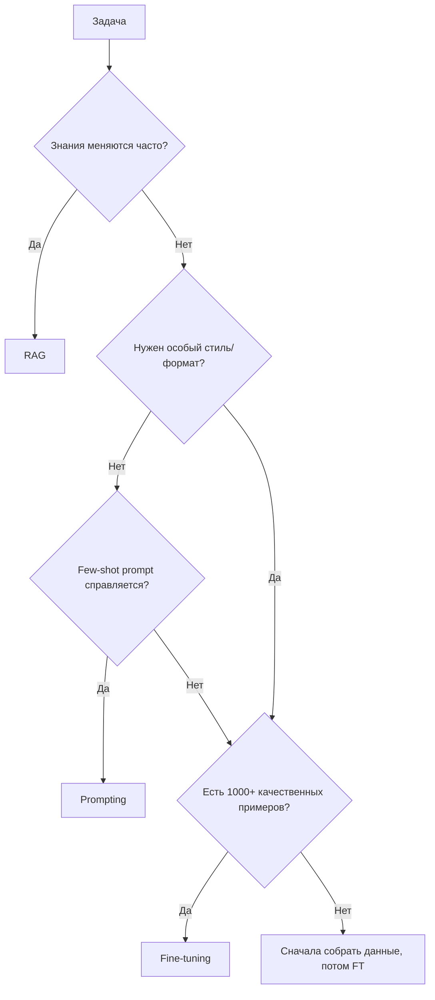
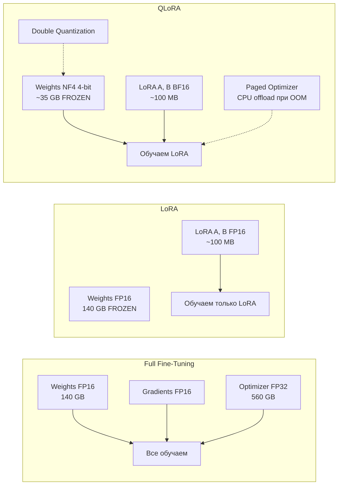
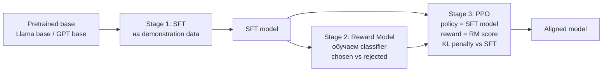
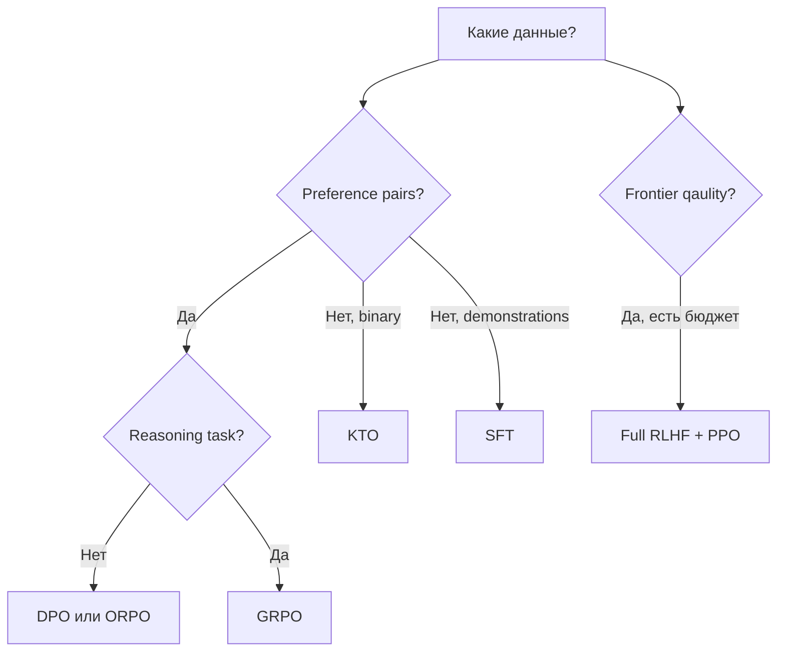
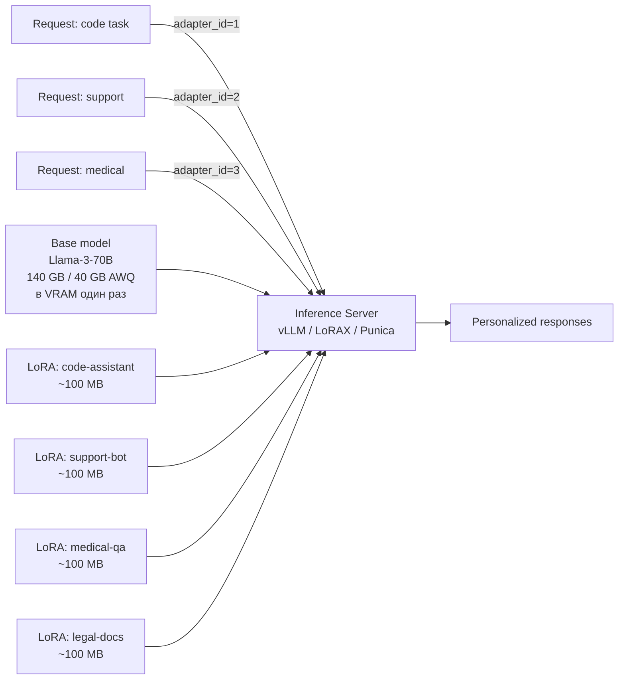
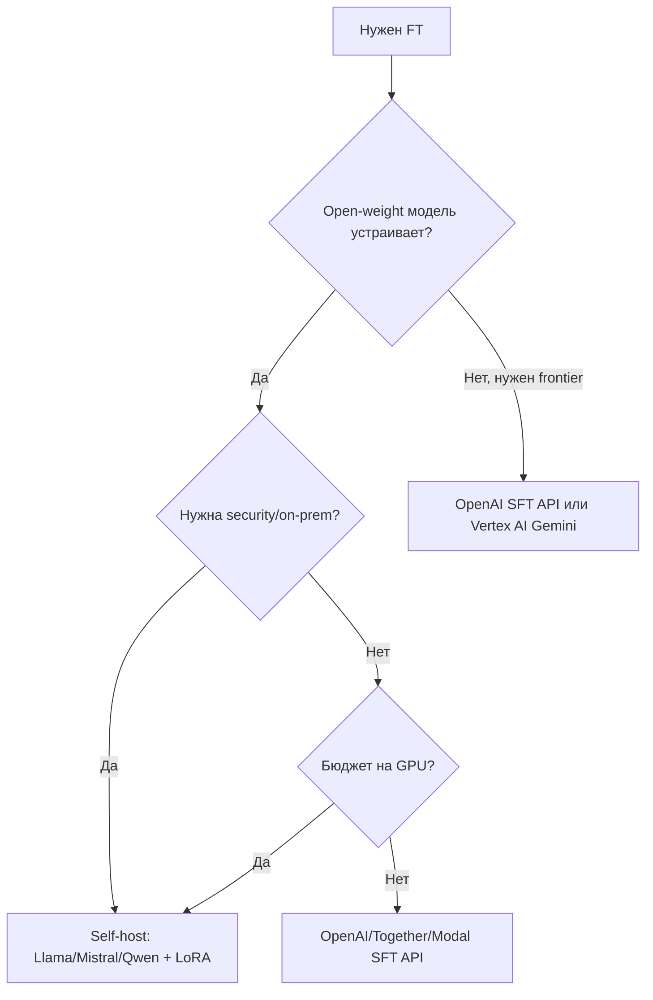

# Вопросы на собеседовании: `Fine-tuning LLM (LoRA/QLoRA/RLHF/DPO/GRPO)`

Fine-tuning LLM из «дорогой R&D-операции» к 2024-2026 превратился в **повседневный инструмент инженера**: появились PEFT-методы (LoRA, QLoRA, DoRA), которые позволяют дообучить 70B-модель на одной 80GB GPU; preference-алгоритмы упростились с PPO до `DPO` и `GRPO`; библиотеки (TRL, Unsloth, Axolotl) свели pipeline к десяткам строк кода.

На интервью спрашивают: **когда** fine-tune (а когда — prompt или RAG), **что выбрать** (full FT, LoRA, QLoRA, DoRA), **как** строить preference dataset (RLHF vs DPO vs GRPO vs KTO), какие **подводные камни** (chat template, catastrophic forgetting, EOS token), и **как deploy** (multi-LoRA serving, vLLM, adapter switching).

## Полезные ссылки

### Базовые статьи (papers)

- [LoRA: Low-Rank Adaptation of Large Language Models (Hu et al. 2021)](https://arxiv.org/abs/2106.09685) — оригинальная статья LoRA
- [QLoRA: Efficient Finetuning of Quantized LLMs (Dettmers et al. 2023)](https://arxiv.org/abs/2305.14314) — NF4, double quantization, paged optimizers
- [DoRA: Weight-Decomposed Low-Rank Adaptation (Liu et al. 2024)](https://arxiv.org/abs/2402.09353) — decomposition magnitude + direction
- [InstructGPT / RLHF paper (Ouyang et al. 2022)](https://arxiv.org/abs/2203.02155) — SFT + reward model + PPO
- [Direct Preference Optimization (Rafailov et al. 2023)](https://arxiv.org/abs/2305.18290) — DPO без RL
- [KTO: Model Alignment as Prospect Theoretic Optimization (Ethayarajh et al. 2024)](https://arxiv.org/abs/2402.01306) — binary labels вместо pairs
- [ORPO: Monolithic Preference Optimization without Reference Model (Hong et al. 2024)](https://arxiv.org/abs/2403.07691) — SFT + DPO в одном шаге
- [DeepSeek-R1 paper (2025)](https://arxiv.org/abs/2501.12948) — GRPO в действии
- [LIMA: Less Is More for Alignment (Zhou et al. 2023)](https://arxiv.org/abs/2305.11206) — 1000 примеров достаточно

### Документация и инструменты

- [HuggingFace TRL docs](https://huggingface.co/docs/trl) — SFTTrainer, DPOTrainer, GRPOTrainer
- [HuggingFace PEFT docs](https://huggingface.co/docs/peft) — LoRA/QLoRA/DoRA wrapper
- [Unsloth docs](https://docs.unsloth.ai/) — 2x speed, 70% less VRAM
- [Axolotl repo](https://github.com/axolotl-ai-cloud/axolotl) — high-level YAML-config
- [bitsandbytes repo](https://github.com/bitsandbytes-foundation/bitsandbytes) — 4/8-bit quantization
- [OpenAI fine-tuning guide](https://platform.openai.com/docs/guides/fine-tuning) — SFT/RFT через API
- [Google Vertex AI tuning](https://cloud.google.com/vertex-ai/generative-ai/docs/models/tune-models) — Gemini fine-tuning

## Содержание

- [Полезные ссылки](#полезные-ссылки)
- [See also](#see-also)

**Когда fine-tune**
- [Q1. (!) Что такое fine-tuning и когда он нужен?](#q1--что-такое-fine-tuning-и-когда-он-нужен)
- [Q2. (!) Fine-tuning vs prompting vs RAG — как выбрать?](#q2--fine-tuning-vs-prompting-vs-rag--как-выбрать)
- [Q3. Когда fine-tuning НЕ поможет?](#q3-когда-fine-tuning-не-поможет)

**Full vs PEFT (LoRA / QLoRA / DoRA)**
- [Q4. (!) Что такое full fine-tuning и почему он дорогой?](#q4--что-такое-full-fine-tuning-и-почему-он-дорогой)
- [Q5. (!) Что такое PEFT? Перечислить методы](#q5--что-такое-peft-перечислить-методы)
- [Q6. (!) LoRA — как устроена математически?](#q6--lora--как-устроена-математически)
- [Q7. (!) QLoRA — что добавила к LoRA?](#q7--qlora--что-добавила-к-lora)
- [Q8. DoRA — чем лучше LoRA?](#q8-dora--чем-лучше-lora)
- [Q9. На какие слои применять LoRA?](#q9-на-какие-слои-применять-lora)
- [Q10. Как выбрать rank `r` и `alpha`?](#q10-как-выбрать-rank-r-и-alpha)

**SFT / Continued Pretraining**
- [Q11. (!) Чем отличается SFT от continued pretraining (DAPT)?](#q11--чем-отличается-sft-от-continued-pretraining-dapt)
- [Q12. (!) Как выглядит SFT-pipeline на TRL?](#q12--как-выглядит-sft-pipeline-на-trl)
- [Q13. Distillation — как обучать маленькую модель от большой?](#q13-distillation--как-обучать-маленькую-модель-от-большой)

**Preference Optimization (RLHF / DPO / GRPO / KTO / ORPO)**
- [Q14. (!) Что такое RLHF и как работает классический pipeline?](#q14--что-такое-rlhf-и-как-работает-классический-pipeline)
- [Q15. (!) DPO — как заменил PPO для большинства случаев?](#q15--dpo--как-заменил-ppo-для-большинства-случаев)
- [Q16. (!) GRPO (DeepSeek) — чем отличается от PPO и DPO?](#q16--grpo-deepseek--чем-отличается-от-ppo-и-dpo)
- [Q17. KTO — когда не нужны preference pairs](#q17-kto--когда-не-нужны-preference-pairs)
- [Q18. ORPO — SFT и DPO в одном шаге](#q18-orpo--sft-и-dpo-в-одном-шаге)
- [Q19. Сравнительная таблица: RLHF vs DPO vs GRPO vs KTO vs ORPO](#q19-сравнительная-таблица-rlhf-vs-dpo-vs-grpo-vs-kto-vs-orpo)

**Datasets и chat templates**
- [Q20. (!) Какие открытые SFT-датасеты использовать?](#q20--какие-открытые-sft-датасеты-использовать)
- [Q21. Датасеты для preference optimization?](#q21-датасеты-для-preference-optimization)
- [Q22. (!) Chat templates — почему ошибка тут ломает модель?](#q22--chat-templates--почему-ошибка-тут-ломает-модель)
- [Q23. Качество vs количество (LIMA-эффект)](#q23-качество-vs-количество-lima-эффект)

**Libraries и hardware**
- [Q24. (!) Какие библиотеки — TRL, PEFT, Unsloth, Axolotl?](#q24--какие-библиотеки--trl-peft-unsloth-axolotl)
- [Q25. (!) Hardware tiers — что нужно для 7B/13B/70B?](#q25--hardware-tiers--что-нужно-для-7b13b70b)
- [Q26. Hyperparameters — learning rate, epochs, batch size?](#q26-hyperparameters--learning-rate-epochs-batch-size)

**Evaluation и pitfalls**
- [Q27. (!) Как оценивать качество fine-tuned модели?](#q27--как-оценивать-качество-fine-tuned-модели)
- [Q28. (!) Catastrophic forgetting — как обнаружить и митигировать?](#q28--catastrophic-forgetting--как-обнаружить-и-митигировать)
- [Q29. Топ-5 ошибок при fine-tuning](#q29-топ-5-ошибок-при-fine-tuning)
- [Q30. Merging моделей — SLERP, TIES, DARE, model soups](#q30-merging-моделей--slerp-ties-dare-model-soups)

**Deployment (multi-LoRA serving)**
- [Q31. (!) Как деплоить fine-tuned модель в production?](#q31--как-деплоить-fine-tuned-модель-в-production)
- [Q32. (!) Multi-LoRA serving — один base + много адаптеров?](#q32--multi-lora-serving--один-base--много-адаптеров)
- [Q33. OpenAI / Anthropic / Google fine-tuning APIs — статус 2026](#q33-openai--anthropic--google-fine-tuning-apis--статус-2026)
- [Q34. Open-weight base models 2025-2026](#q34-open-weight-base-models-2025-2026)
- [Q35. Cost estimation: cloud GPU vs API tuning](#q35-cost-estimation-cloud-gpu-vs-api-tuning)

## Q1. (!) Что такое fine-tuning и когда он нужен?

**Fine-tuning** — дообучение предварительно натренированной (`pretrained`) LLM на собственном task-specific датасете. Цель — сместить распределение модели в сторону конкретного домена, стиля или формата.

**Когда fine-tune действительно нужен:**

1. **Новый формат / стиль output** — например, всегда отвечать строгим JSON со специфичной схемой, или в фирменном tone-of-voice.
2. **Узкая domain expertise** — медицина, право, code на внутреннем DSL, где prompt не вытягивает.
3. **Latency / cost reduction** — заменить большую модель + длинный prompt на маленькую fine-tuned (`gpt-3.5-tuned` вместо `gpt-4o` с few-shot).
4. **Поведенческие правила**, которые в prompt разрастаются до тысяч токенов — переносим в веса.
5. **Sensitive data** — нужно on-prem, нет права отправлять в API → дообучаем open-weight модель.

**Когда НЕ fine-tune:**

- Достаточно few-shot prompting.
- Знания **часто обновляются** — лучше `RAG`.
- Объём качественной разметки <50 примеров.
- Метрики ещё не определены (без них нечем мерить успех).

## Q2. (!) Fine-tuning vs prompting vs RAG — как выбрать?

| Критерий | Prompting | RAG | Fine-tuning |
|----------|-----------|-----|-------------|
| **Скорость итерации** | Минуты | Часы | Дни-недели |
| **Стоимость setup** | $0 | $-$$ (vector DB) | $$-$$$$ (GPU + ML eng) |
| **Свежесть знаний** | Только из prompt | Свежие (re-index) | Замороженные (на момент обучения) |
| **Объём знаний** | Контекстное окно | Терабайты | Закодировано в весах |
| **Новый стиль / формат** | Слабо | Никак | **Сильно** |
| **Latency inference** | Зависит от prompt | +retrieval (50-200мс) | Чистая (≈ base) |
| **Cost per token** | Высокий (prompt длинный) | Средний | Низкий |
| **Когда лучший выбор** | Прототип, переменная задача | Factual grounding, актуальные данные | Фиксированный формат/стиль/domain |

**Шпаргалка по выбору:**



**Правило:** **Prompting → RAG → Fine-tuning**. Двигайся по этой лестнице, не перепрыгивай. Часто fine-tune + RAG комбинируются (FT для стиля, RAG для фактов).

## Q3. Когда fine-tuning НЕ поможет?

**Реалистичные ограничения:**

1. **Добавить факты, которых модель не знала.** Fine-tune **плохо учит новым фактам**, особенно редким. Это всё ещё языковая модель — она «размажет» факт между похожими. Для фактов — `RAG`.
2. **Сделать модель умнее.** Если base модель не умеет в reasoning, SFT на 1000 примерах не сделает её reasoning model. Нужны **миллионы reasoning traces + RL**, как в R1.
3. **Исправить системную галлюцинацию.** Fine-tune может усилить галлюцинации, если в датасете есть несогласованности.
4. **Заменить prompt engineering**, когда вы не понимаете задачу. Сначала прототип на prompts → когда работает → fine-tune для cost/latency.
5. **Маленький датасет (<50 примеров)** — overfitting гарантирован, generalization не будет.

**Правило:** fine-tuning сдвигает распределение, но не превращает воду в вино.

## Q4. (!) Что такое full fine-tuning и почему он дорогой?

**Full fine-tuning** — обновление **всех параметров** модели через backpropagation.

**Что приходится хранить в VRAM (для AdamW):**

| Компонент | Размер (FP16) | Для 7B | Для 70B |
|-----------|---------------|--------|---------|
| Weights | 2 байта/param | 14 GB | 140 GB |
| Gradients | 2 байта/param | 14 GB | 140 GB |
| Optimizer state (AdamW: m, v в FP32) | 8 байт/param | 56 GB | 560 GB |
| Activations | зависит от batch | 5-20 GB | 50-200 GB |
| **Итого минимум** | | **~80 GB** | **~800 GB** |

**Следствия:**

- 7B full FT → 1×80GB H100 впритык.
- 70B full FT → 8×80GB H100 минимум (с FSDP / DeepSpeed).
- 405B full FT → датацентр.

**Проблемы full FT:**

1. **Catastrophic forgetting** — модель «забывает» общие способности.
2. **Storage** — fine-tuned 70B = 140GB файлов. Каждая версия. Каждый домен.
3. **Deployment** — нужен отдельный inference cluster под каждый fine-tune.

**Когда full FT всё-таки оправдан:**

- Очень большой датасет (миллионы примеров).
- Требуется максимальное качество без compromise.
- Меняется фундаментальное поведение (continued pretraining на новый язык/домен).

## Q5. (!) Что такое PEFT? Перечислить методы

**PEFT (Parameter-Efficient Fine-Tuning)** — семейство методов, обучающих **малую долю параметров** (0.01-1%) при заморозке остальных. База — наблюдение, что fine-tuning живёт в low-rank подпространстве.

**Основные методы:**

| Метод | Идея | Параметров | Inference overhead |
|-------|------|------------|-------------------|
| **LoRA** | ΔW = B·A, low-rank decomposition | 0.1-1% | 0 (merge в base) |
| **QLoRA** | LoRA поверх 4-bit quantized base | 0.1-1% | small (dequant) |
| **DoRA** | Magnitude + Direction decomposition | ~LoRA | 0 (merge) |
| **Adapters** | Bottleneck MLP внутри FFN | 1-5% | +небольшой |
| **Prefix Tuning** | Learnable prefix к KV cache | <0.1% | +prefix |
| **P-Tuning v2** | Learnable embeddings на каждом слое | <0.5% | small |
| **IA³** | Per-vector scaling factors | <0.01% | negligible |
| **BitFit** | Только bias terms | <0.1% | 0 |

**Победитель в 2024-2026 — LoRA/QLoRA/DoRA.** Остальные либо хуже по качеству, либо дают inference overhead.

**Почему PEFT работает:**

- Hu et al. (LoRA paper) показали: fine-tuning сдвигает веса в **intrinsic low-rank** подпространство.
- Дообучение всех 70B параметров избыточно — реальное изменение «помещается» в rank-16 матрицы.

## Q6. (!) LoRA — как устроена математически?

**Идея LoRA (Low-Rank Adaptation):** вместо обновления полной матрицы `W ∈ R^(d×d)` обучаем **low-rank delta**:

```
W_new = W + ΔW
ΔW = B · A
где A ∈ R^(r × d), B ∈ R^(d × r), r << d
```

**Параметров вместо `d²` — `2·d·r`**. Для `d=4096, r=16`: вместо 16.7M параметров обучаем **131K** (в 128 раз меньше).

**Initialization:**
- `A` — Gaussian random (small).
- `B` — нулями.
- В начале обучения `ΔW = B·A = 0` → модель эквивалентна base, learning стартует с identity.

**Scaling factor `α` (alpha):**

```
W_effective = W + (α/r) · B · A
```

`α` контролирует «силу» адаптера. Типично `α = 2·r` (например, r=16, α=32). Через `α/r` можно регулировать вклад LoRA без переобучения.

**Forward pass (PyTorch-stylized):**

```python
class LoRALinear(nn.Module):
    def __init__(self, base_linear, r=16, alpha=32):
        super().__init__()
        self.base = base_linear  # frozen
        self.lora_A = nn.Linear(base_linear.in_features, r, bias=False)
        self.lora_B = nn.Linear(r, base_linear.out_features, bias=False)
        nn.init.zeros_(self.lora_B.weight)
        self.scale = alpha / r

    def forward(self, x):
        return self.base(x) + self.scale * self.lora_B(self.lora_A(x))
```

**На inference:** можно **сделать merge** — `W_merged = W + (α/r)·B·A` — и получить обычную матрицу без overhead. Либо оставить адаптер раздельно (multi-LoRA serving).

**Какие матрицы трогать (типично):**
- Attention `q_proj, k_proj, v_proj, o_proj` — основной выбор.
- Иногда + FFN `gate_proj, up_proj, down_proj` (Mistral/Llama).
- Embedding/lm_head обычно **не трогают**.

## Q7. (!) QLoRA — что добавила к LoRA?

**QLoRA (Dettmers et al. 2023)** — три трюка, позволившие fine-tune 65B на **одной 48GB GPU**:



**Три ключевые техники:**

1. **NF4 (NormalFloat 4-bit) quantization** — информационно-оптимальное 4-битное представление для весов, распределённых нормально (типично для LLM). 16 уровней размещены по квантилям N(0,1).

2. **Double Quantization (DQ)** — квантизируем сами quantization constants (которые иначе занимали бы много памяти). Экономит ~0.5 бит/param → ещё ~3 GB на 65B.

3. **Paged Optimizers** — используют NVIDIA unified memory: optimizer state автоматически выгружается на CPU при OOM-spike (например, при длинных последовательностях). Без OOM crash.

**Цифры (из paper):**
- LLaMA-65B QLoRA fits в **48 GB** (один A6000).
- Качество — практически paritет с full fine-tuning.
- ~2-3x медленнее обучение, чем LoRA, но возможно вообще.

**Дефолт в 2024-2026 для open-weight моделей** — `QLoRA` через `bitsandbytes` + `peft` + `trl`.

## Q8. DoRA — чем лучше LoRA?

**DoRA (Weight-Decomposed LoRA, 2024)** — улучшение LoRA через явную декомпозицию веса на **magnitude** и **direction**:

```
W = m · (V / ||V||)
где m — magnitude (scalar per column), V/||V|| — нормализованное направление
```

DoRA обучает:
- `m` — magnitude отдельно (полный вектор, маленький).
- Низкоранговая ΔV — direction (как в LoRA).

**Преимущества:**

- **Качество ближе к full FT**, чем у LoRA — особенно при низких rank (r=4, r=8).
- Стабильнее обучение.
- Тот же inference overhead, что у LoRA (можно merge).

**Минусы:**

- Чуть медленнее (нужно считать нормы).
- На больших rank разница с LoRA минимальна.

**Когда использовать DoRA:** ограниченный compute, хочется выжать максимум из rank=8 LoRA.

**В `peft`:** `LoraConfig(use_dora=True)` — одна опция.

## Q9. На какие слои применять LoRA?

**Минимальный набор (по умолчанию в большинстве туториалов):**

```python
target_modules = ["q_proj", "v_proj"]
```

Только query и value projections — это вариант из оригинальной LoRA-статьи.

**Стандартный набор для Llama/Mistral в 2024-2026:**

```python
target_modules = [
    "q_proj", "k_proj", "v_proj", "o_proj",     # attention
    "gate_proj", "up_proj", "down_proj",         # FFN (SwiGLU)
]
```

Это «`all-linear`» — все Linear-слои attention и FFN. В `peft` можно указать `target_modules="all-linear"`.

**Эмпирическое правило:**

- Больше target modules → больше параметров → лучше качество, но больше памяти/времени.
- Для **instruction tuning** часто достаточно attention-only.
- Для **domain adaptation** (новый стиль/формат) лучше all-linear.

**Что НЕ трогать обычно:**
- `embed_tokens` и `lm_head` — большие матрицы, ломают tokenizer matching при merge.
- `LayerNorm` параметры — крошечные, отдельная история (BitFit-style).

## Q10. Как выбрать rank `r` и `alpha`?

**Rank `r`** — главный hyperparameter LoRA:

| Rank | Параметров | Когда использовать |
|------|------------|-------------------|
| `r=4-8` | Минимум | Простой стиль, instruction format |
| `r=16` | Стандарт | Большинство SFT задач |
| `r=32-64` | Больше | Domain adaptation, сложные задачи |
| `r=128+` | Близко к full FT | Когда хочется максимум качества |

**Эмпирика:** удвоение `r` редко удваивает качество. На большинстве задач `r=16` даёт 90% от `r=64`. Начинай с `r=16`, расти если метрики плохие.

**Alpha `α`:**

- Правило: **`α = 2·r`** (классика).
- Альтернатива: `α = r` (более консервативно).
- При merge: финальный scale = `α/r`. Меняя `α` без переобучения, можно слабее/сильнее применить адаптер.

**Dropout:** LoRA dropout 0.05-0.1 — стандарт. Помогает при маленьких датасетах.

**Пример `peft` LoraConfig:**

```python
from peft import LoraConfig

config = LoraConfig(
    r=16,
    lora_alpha=32,
    target_modules=["q_proj", "k_proj", "v_proj", "o_proj",
                    "gate_proj", "up_proj", "down_proj"],
    lora_dropout=0.05,
    bias="none",
    task_type="CAUSAL_LM",
    use_dora=False,  # True для DoRA
)
```

## Q11. (!) Чем отличается SFT от continued pretraining (DAPT)?

**Два разных режима обучения после pretraining:**

| Аспект | Continued Pretraining (DAPT) | SFT (Supervised Fine-Tuning) |
|--------|------------------------------|-------------------------------|
| **Цель** | Расширить знания/язык/домен | Научить инструкциям/формату |
| **Данные** | Сырой текст (статьи, код, книги) | `{instruction, response}` пары |
| **Loss** | Next-token на всём тексте | Next-token часто **только на response** |
| **Формат** | Без chat template | С chat template |
| **Объём** | Миллиарды-триллионы токенов | Тысячи-миллионы примеров |
| **Когда** | Новый язык, узкий домен (medical, legal) | Превратить base в instruct модель |
| **Пример** | BloombergGPT (financial), Code Llama (code) | Llama-3-Instruct, Mistral-Instruct |

**Pipeline на практике:**

```
Base model (Llama-3-8B)
    ↓ Continued pretraining (опционально)
Domain base model
    ↓ SFT на instruction data
Instruct model
    ↓ Preference optimization (DPO/RLHF)
Aligned model
```

**Важно для SFT:** в TRL у `SFTTrainer` есть `completion_only_loss=True` — loss считается только на токенах ответа, не на инструкции (иначе модель учится «переписывать» вопросы).

## Q12. (!) Как выглядит SFT-pipeline на TRL?

**Минимальный пример QLoRA + SFT через `transformers` + `trl` + `peft` + `bitsandbytes`:**

```python
import torch
from transformers import AutoModelForCausalLM, AutoTokenizer, BitsAndBytesConfig
from peft import LoraConfig, get_peft_model, prepare_model_for_kbit_training
from trl import SFTConfig, SFTTrainer
from datasets import load_dataset

model_id = "meta-llama/Meta-Llama-3-8B"

# 4-bit quantization config (NF4 + double quant)
bnb_config = BitsAndBytesConfig(
    load_in_4bit=True,
    bnb_4bit_quant_type="nf4",
    bnb_4bit_compute_dtype=torch.bfloat16,
    bnb_4bit_use_double_quant=True,
)

tokenizer = AutoTokenizer.from_pretrained(model_id)
tokenizer.pad_token = tokenizer.eos_token

model = AutoModelForCausalLM.from_pretrained(
    model_id,
    quantization_config=bnb_config,
    device_map="auto",
)
model = prepare_model_for_kbit_training(model)

# LoRA config
lora_config = LoraConfig(
    r=16, lora_alpha=32,
    target_modules="all-linear",
    lora_dropout=0.05, bias="none",
    task_type="CAUSAL_LM",
)
model = get_peft_model(model, lora_config)
model.print_trainable_parameters()  # ≈ 0.5% от total

# Dataset: ожидаются поля messages (ChatML format)
dataset = load_dataset("HuggingFaceH4/ultrachat_200k", split="train_sft[:5000]")

training_args = SFTConfig(
    output_dir="./llama3-8b-sft",
    num_train_epochs=2,
    per_device_train_batch_size=4,
    gradient_accumulation_steps=4,
    learning_rate=2e-4,
    bf16=True,
    logging_steps=10,
    save_strategy="epoch",
    warmup_ratio=0.03,
    lr_scheduler_type="cosine",
    max_seq_length=2048,
    packing=True,  # склеивает короткие примеры в одно окно
)

trainer = SFTTrainer(
    model=model,
    args=training_args,
    train_dataset=dataset,
    tokenizer=tokenizer,
)
trainer.train()
trainer.save_model("./llama3-8b-sft")  # сохраняет только адаптер (~100 MB)
```

**Ключевые моменты:**
- `bnb_4bit_compute_dtype=bfloat16` — операции в bf16, веса хранятся в NF4.
- `prepare_model_for_kbit_training` — фиксит градиенты для quantized base.
- `packing=True` — упаковка коротких примеров → лучше GPU utilization.
- На output остаются **только LoRA-веса** (~100 MB вместо 16 GB).

**Unsloth-версия того же кода в ~3 раза быстрее** и с ~70% меньше VRAM (см. Q24).

## Q13. Distillation — как обучать маленькую модель от большой?

**Distillation** — обучение «студента» (маленькой модели) на выходах «учителя» (большой модели). Два уровня:

**1. Response distillation (knowledge distillation soft):**
- Учитель генерирует ответы на корпус prompts.
- Студент учится на этих `{prompt, teacher_response}` парах через обычный SFT.
- **Пример:** `Llama-3.1-Nemotron-70B` distilled варианты, `DeepSeek-R1-Distill-Qwen-7B/14B/32B`.

**2. Logit distillation (hard knowledge distillation):**
- Учитель отдаёт **distribution over vocab** на каждом шаге.
- Студент учится через KL-divergence от teacher distribution + cross-entropy от ground truth:

```
Loss = α · CE(student, ground_truth) + (1-α) · KL(student || teacher) · T²
```

где `T` — temperature, `α ∈ [0,1]`.

- Качественнее, но **дорого** — нужен parallel forward пасс учителя.

**Когда что использовать:**

- **Response distillation** — production-friendly, основной метод в open-source (R1-Distill).
- **Logit distillation** — research, или когда учитель и студент с одинаковым vocab и доступом к нему.

**Bonus — Speculative Decoding** — не distillation, но идейно похоже: маленькая модель предлагает, большая верифицирует. Ускоряет inference большой модели в 2-3 раза.

## Q14. (!) Что такое RLHF и как работает классический pipeline?

**RLHF (Reinforcement Learning from Human Feedback)** — alignment-pipeline из InstructGPT (Ouyang et al. 2022), сделавший ChatGPT таким, как мы знаем.

**Классический three-stage pipeline:**



**Stage 1 — SFT:**
- 10K-100K demonstration `{prompt, response}` пар.
- Стандартный supervised fine-tuning.

**Stage 2 — Reward Model:**
- Берём SFT model, заменяем lm_head на scalar head.
- Обучаем на preference pairs `{prompt, chosen, rejected}`.
- Loss: `-log(sigmoid(r(prompt, chosen) - r(prompt, rejected)))`.
- Получаем RM, оценивающую «насколько ответ нравится человеку».

**Stage 3 — PPO (Proximal Policy Optimization):**
- Policy = LLM (инициализируется из SFT).
- Sample response → RM даёт reward → backprop через PPO.
- **KL-penalty** от reference (SFT) модели: предотвращает reward hacking и degeneration.

**Минусы RLHF/PPO:**

- **Сложно** — три модели в памяти (policy, reference, RM, иногда value model).
- **Нестабильно** — chasen hyperparameters, легко reward-hack.
- **Дорого** — десятки тысяч long-horizon rollouts.

**Кто использует:** GPT-4, Claude, Gemini — все frontier models через variant RLHF. Open-source постепенно мигрирует на DPO/GRPO как более простую замену.

## Q15. (!) DPO — как заменил PPO для большинства случаев?

**DPO (Direct Preference Optimization, Rafailov et al. 2023)** — главный прорыв 2023 года в alignment.

**Идея:** математически вывели, что **PPO-задачу можно решить closed-form** без reward model и без RL — просто classification loss на preference pairs.

**DPO loss:**

```
L_DPO = -E_{(x, y_w, y_l)} [
    log σ(
        β · (log π_θ(y_w|x) / π_ref(y_w|x)) 
      - β · (log π_θ(y_l|x) / π_ref(y_l|x))
    )
]
```

- `y_w` (winner) — chosen response.
- `y_l` (loser) — rejected response.
- `π_θ` — policy (обучаемая).
- `π_ref` — reference (frozen SFT model).
- `β` — temperature (0.1-0.5), контролирует «жёсткость» KL.
- `σ` — sigmoid.

**Что делает:** увеличивает log-prob chosen относительно rejected, держа модель близко к reference через neявный KL.

**Преимущества DPO над PPO:**

| Аспект | PPO | DPO |
|--------|-----|-----|
| Reward model | Обязательна | **Не нужна** |
| RL loop | Да | **Нет** (обычный SFT-стиль training) |
| Моделей в памяти | 3-4 | 2 (policy + reference) |
| Стабильность | Сложно | Просто |
| Hyperparameters | Много | β + lr |
| Качество | Может быть выше при tuning | Часто на уровне PPO |

**Пример с TRL:**

```python
from trl import DPOTrainer, DPOConfig

dpo_config = DPOConfig(
    output_dir="./model-dpo",
    beta=0.1,                    # KL strength
    learning_rate=5e-7,          # очень маленький для DPO
    num_train_epochs=1,
    per_device_train_batch_size=2,
    gradient_accumulation_steps=8,
)

trainer = DPOTrainer(
    model=sft_model,             # уже SFT-tuned
    ref_model=None,              # auto-clone SFT model
    args=dpo_config,
    train_dataset=preference_dataset,  # поля: prompt, chosen, rejected
    tokenizer=tokenizer,
)
trainer.train()
```

**Когда DPO лучше:** почти всегда — если у тебя preference pairs и нет ресурсов на полноценный RLHF.

## Q16. (!) GRPO (DeepSeek) — чем отличается от PPO и DPO?

**GRPO (Group Relative Policy Optimization)** — RL-алгоритм от DeepSeek, ставший знаменитым с R1.

**Главное отличие от PPO:** **нет value model**. Вместо обучения отдельной сети-критика, advantage вычисляется через **сравнение внутри группы** sampled responses.

**Pipeline GRPO:**

1. Для каждого prompt `x` сэмплируем **группу** из `G` ответов `{y_1, ..., y_G}` (обычно G=4-16).
2. Считаем reward `r_i` для каждого через **rule-based verifier** (math correct? code passes tests?).
3. Normalize advantages внутри группы:

```
A_i = (r_i - mean({r_1, ..., r_G})) / std({r_1, ..., r_G})
```

4. Policy gradient update с этим advantage + KL penalty от reference.

**Сравнение PPO vs DPO vs GRPO:**

| Свойство | PPO | DPO | GRPO |
|----------|-----|-----|------|
| Reward source | Learned RM | Static preference pairs | **Rule-based verifier** |
| Value model | Нужна | Не нужна | **Не нужна** |
| RL loop | Да | Нет | Да (с rollouts) |
| Где используется | GPT-4, Claude | Open-source SFT+ | **R1, R1-Zero, math LLMs** |
| Hyperparams | Сложные | Простые (β) | Group size, ε clip |
| Когда лучший выбор | Универсальный RLHF | Preference pairs готовы | Verifiable tasks (math, code) |

**Почему GRPO взлетел:**

- **Дешевле PPO** на ~50% (нет value model).
- **Verifiable rewards** = нет reward hacking (нельзя обмануть ground truth).
- **Emergent reasoning** — модель сама учится длинному CoT для повышения accuracy.
- Использован в **DeepSeek-R1-Zero** (pure RL без SFT) — революция конца 2024.

**Минусы:**

- Работает только для задач с **verifiable answers** (math, code, logic).
- Нужно много rollouts (G responses per prompt) → дорого по compute.
- На noisy reward (например, judge LLM) может быть нестабильно.

**В TRL** появился `GRPOTrainer` в 2025:

```python
from trl import GRPOTrainer, GRPOConfig

def reward_func(completions, **kwargs):
    return [check_math_answer(c) for c in completions]  # 1.0 or 0.0

config = GRPOConfig(
    output_dir="./r1-style",
    num_generations=8,           # group size G
    beta=0.04,                   # KL penalty
    learning_rate=1e-6,
)
trainer = GRPOTrainer(
    model=model,
    reward_funcs=reward_func,
    args=config,
    train_dataset=math_prompts,
)
trainer.train()
```

## Q17. KTO — когда не нужны preference pairs

**KTO (Kahneman-Tversky Optimization, Ethayarajh et al. 2024)** — alignment метод, основанный на **prospect theory** из поведенческой экономики.

**Главная фишка:** работает на **binary labels** `{desirable, undesirable}`, а не на pairs `{chosen, rejected}`.

**Зачем это нужно:**

- В реальности у тебя часто есть `thumbs up / thumbs down` логи продакшна — каждый ответ оценён отдельно, без пары.
- Собрать pair `{A_better_than_B}` сложно и дорого.

**Loss (упрощённо):**

```
L_KTO = - λ_w · E_desirable[ value(r_θ) ] - λ_l · E_undesirable[ value(-r_θ) ]
```

где `value()` — prospect-theory utility function (concave для gains, convex для losses, как у людей).

**Преимущества:**

- Дешевле собирать данные (binary > pairs).
- Robust к imbalanced datasets (можно настроить `λ_w, λ_l`).
- Часто на уровне DPO по качеству.

**Когда выбирать KTO:**

- У тебя production-логи с rating per response.
- Соотношение good/bad сильно несбалансировано.
- Нет ресурсов делать аннотацию pairs.

**В TRL:** `KTOTrainer` есть с 2024.

## Q18. ORPO — SFT и DPO в одном шаге

**ORPO (Odds Ratio Preference Optimization, Hong et al. 2024)** — экзотический подход: **объединяет SFT и DPO в один loss**, без отдельной SFT-стадии и без reference model.

**Loss:**

```
L_ORPO = L_SFT(chosen) + λ · L_OR
L_OR = -log σ( log(odds(y_w|x)) - log(odds(y_l|x)) )
```

где `odds(y|x) = P(y|x) / (1 - P(y|x))`.

**Что даёт:**

- **Нет reference model** → ещё меньше памяти, чем DPO.
- **Один шаг обучения** вместо `SFT → DPO`.
- Конкурентное качество.

**Минусы:**

- Меньше control: нельзя отдельно настроить SFT и preference alignment.
- Менее протестирован в production, чем DPO.

**Когда использовать ORPO:** ограниченный compute, хочется попробовать «one-shot alignment».

## Q19. Сравнительная таблица: RLHF vs DPO vs GRPO vs KTO vs ORPO

| Метод | Год | Reward | Reference model | Models в памяти | Данные | Когда выбирать |
|-------|-----|--------|-----------------|-----------------|--------|----------------|
| **RLHF (PPO)** | 2022 | Learned RM | Да | 3-4 | Preference pairs + demonstrations | Frontier alignment (GPT-4, Claude) |
| **DPO** | 2023 | Implicit (через pairs) | Да | 2 | Preference pairs | **Дефолт для open-source alignment** |
| **GRPO** | 2024 | Rule-based / verifier | Да | 2 + sampled group | Prompts с verifiable answers | **Reasoning, math, code** (R1-style) |
| **KTO** | 2024 | Binary labels | Да | 2 | Binary thumbs up/down | Production logs с per-response rating |
| **ORPO** | 2024 | Implicit | Нет | 1 | Preference pairs | Минимум compute, no-reference alignment |

**Решающее дерево:**



## Q20. (!) Какие открытые SFT-датасеты использовать?

**Топ-датасеты для instruction tuning (2024-2026):**

| Датасет | Размер | Описание | Лицензия |
|---------|--------|----------|----------|
| **Alpaca** | 52K | Self-instruct из GPT-3.5 | Research only (OpenAI ToS) |
| **Dolly-15k** | 15K | Human-written by Databricks employees | CC BY-SA 3.0 (commercial) |
| **OpenAssistant (OASST1/2)** | 161K conv | Multilingual, community-built | Apache 2.0 |
| **ShareGPT** | 90K | Real ChatGPT conversations | CC BY-NC (research) |
| **UltraChat** | 1.5M | Synthetic multi-turn от GPT | MIT |
| **LIMA** | 1K | Высоко-курированный | Research |
| **OpenOrca** | 1M+ | Augmented FLAN с GPT-4 explanations | MIT |
| **WizardLM** | 250K | Evol-Instruct (iterative complexity) | Research |
| **No Robots** | 10K | HuggingFace human-curated | CC BY-NC 4.0 |
| **Tulu-3-SFT-Mixture** | 1M | Allen AI отборная смесь | ODC-BY-1.0 |

**Best practices:**

1. **Mix** разнородные датасеты (general + code + math + multilingual).
2. **Decontaminate** — выкинь примеры, пересекающиеся с eval benchmarks (MMLU, GSM8K).
3. **Deduplicate** — exact match и near-dup через minhash.
4. **Filter качество** — выкинь короткие, обрезанные, шумные.
5. **Format-cast** — все примеры в один chat template.

**Для домена:**

- Code: **CodeAlpaca, Magicoder-Evol-Instruct**.
- Math: **MetaMathQA, GSM8K, MATH**.
- Multilingual: **Aya Collection (Cohere)**.
- Russian: **Saiga datasets, Vikhrmodels datasets**.

## Q21. Датасеты для preference optimization?

**Топ DPO/RLHF датасеты:**

| Датасет | Размер | Описание |
|---------|--------|----------|
| **Anthropic HH-RLHF** | 170K | Helpfulness + Harmlessness pairs от Claude team |
| **UltraFeedback** | 64K | GPT-4 judge на ответы 17 моделей |
| **Nectar (Berkeley)** | 183K | GPT-4 rankings |
| **OpenAssistant rankings** | ~30K | Human votes на multiple responses |
| **PKU-SafeRLHF** | 30K | Safety-focused pairs |
| **Argilla DPO-mix-7k** | 7K | Curated subset для quick DPO |

**Как собрать свой preference dataset:**

1. **LLM-as-judge** — две модели генерируют ответы, GPT-4/Claude судит → pair `{better, worse}`.
2. **Different temperatures** — sample 2-4 ответа из одной модели, выбери лучший вручную или judge'ом.
3. **Production logs** — `thumbs up/down` → конвертируй в pairs (если есть pair) или KTO (если только binary).
4. **Best-vs-worst-of-N** — из N кандидатов берёшь самый высокий и самый низкий рейтинг.

**Качество критично:** грязная аннотация даст шумную модель. Лучше 5K качественных пар, чем 100K плохих.

## Q22. (!) Chat templates — почему ошибка тут ломает модель?

**Chat template** — формат, в котором модель ожидает видеть многошаговую беседу (system / user / assistant). Это **критическая часть SFT** — несовпадение разрушает модель.

**Примеры популярных форматов:**

**ChatML (OpenAI / Qwen):**
```
<|im_start|>system
You are helpful.<|im_end|>
<|im_start|>user
Hello<|im_end|>
<|im_start|>assistant
Hi!<|im_end|>
```

**Llama-3:**
```
<|begin_of_text|><|start_header_id|>system<|end_header_id|>

You are helpful.<|eot_id|><|start_header_id|>user<|end_header_id|>

Hello<|eot_id|><|start_header_id|>assistant<|end_header_id|>

Hi!<|eot_id|>
```

**Mistral / Vicuna:**
```
<s>[INST] You are helpful.

Hello [/INST] Hi!</s>
```

**Что ломается при ошибке:**

1. Модель не знает, где её ход начинается → льёт мусор.
2. Не генерирует EOS → бесконечный output, обрезается по `max_tokens`.
3. Путает роли (думает что user это assistant).
4. Function calls/tools не парсятся.

**Правильный подход в HuggingFace:**

```python
tokenizer = AutoTokenizer.from_pretrained("meta-llama/Meta-Llama-3-8B-Instruct")

messages = [
    {"role": "system", "content": "You are helpful."},
    {"role": "user", "content": "Hello"},
    {"role": "assistant", "content": "Hi!"},
]

# tokenizer сам применяет правильный template
prompt = tokenizer.apply_chat_template(messages, tokenize=False)
```

**Когда менять base модель:**

- Llama-3 → Llama-3 format.
- Mistral → Mistral format.
- Qwen → ChatML.

**SFTTrainer в TRL** автоматически применяет chat template из tokenizer — пользуйся этим.

## Q23. Качество vs количество (LIMA-эффект)

**LIMA (Less Is More for Alignment, Meta 2023)** — провокационная работа: показала, что **1000 высококачественных примеров** дают alignment сравнимый с 50K синтетических.

**Тезисы:**

- Pretrained model уже «знает» — alignment лишь показывает **формат** ответа.
- Качество примеров >> количество.
- Diversity критична: разные task types, длины, стили.

**Практические выводы:**

1. Не собирай 100K плохо аннотированных примеров — лучше 1-2K качественных.
2. Manual review каждого примера в первой версии датасета окупается.
3. Synthetic data всё ещё работает, но фильтруй её жёстко (judge, deduplication).

**Сценарий типичного FT-проекта:**

```
Iteration 1: 500 hand-crafted примеров → SFT → evaluate
Iteration 2: + 1000 synthetic + filtered → SFT → evaluate
Iteration 3: + production logs (фильтрованные) → DPO → final
```

## Q24. (!) Какие библиотеки — TRL, PEFT, Unsloth, Axolotl?

**Стек 2024-2026:**

| Библиотека | Уровень | Что делает |
|------------|---------|------------|
| **`transformers`** | Низкий | Базовый API для моделей и tokenizer |
| **`peft`** | Низкий | LoRA, QLoRA, DoRA, prefix tuning — обёртка над моделью |
| **`bitsandbytes`** | Низкий | 4/8-bit quantization (NF4) |
| **`trl`** | Средний | `SFTTrainer`, `DPOTrainer`, `GRPOTrainer`, `KTOTrainer`, `ORPOTrainer` |
| **`accelerate`** | Низкий | Distributed training (FSDP, DeepSpeed) |
| **Unsloth** | Высокий | Оптимизированные kernels: **2x speed, 70% less VRAM** |
| **Axolotl** | Высокий | YAML-config над `trl` + `peft`, удобно для пайплайнов |
| **LLaMA-Factory** | Высокий | UI + CLI для fine-tuning |
| **DeepSpeed** | Низкий | ZeRO-3, offloading для огромных моделей |
| **FSDP** | Низкий | PyTorch native distributed sharding |

**Unsloth особенности:**

- Custom Triton kernels для LoRA/QLoRA → **2-5x скорость** обучения.
- **70% меньше VRAM** при том же качестве.
- Поддерживает Llama, Mistral, Gemma, Qwen, Phi.
- Бесплатная open-source версия + платный Unsloth Pro для multi-GPU.

**Пример с Unsloth (короче, чем чистый TRL):**

```python
from unsloth import FastLanguageModel
from trl import SFTTrainer, SFTConfig

model, tokenizer = FastLanguageModel.from_pretrained(
    model_name="unsloth/Meta-Llama-3.1-8B",
    max_seq_length=2048,
    load_in_4bit=True,
)
model = FastLanguageModel.get_peft_model(
    model, r=16, lora_alpha=32,
    target_modules=["q_proj", "k_proj", "v_proj", "o_proj",
                    "gate_proj", "up_proj", "down_proj"],
)

trainer = SFTTrainer(model=model, tokenizer=tokenizer,
                     train_dataset=dataset, args=SFTConfig(...))
trainer.train()
```

**Axolotl** — YAML вместо Python:

```yaml
base_model: meta-llama/Meta-Llama-3-8B
adapter: qlora
load_in_4bit: true
lora_r: 16
lora_alpha: 32
datasets:
  - path: HuggingFaceH4/ultrachat_200k
    type: sharegpt
num_epochs: 2
learning_rate: 2e-4
micro_batch_size: 4
gradient_accumulation_steps: 4
```

**Когда что выбрать:**

- **Прототип / research** → чистый `transformers` + `trl` + `peft`.
- **Скорость / экономия VRAM** → `Unsloth`.
- **Production pipeline** → `Axolotl` (декларативно, воспроизводимо).
- **Огромные модели (70B+, multi-node)** → `DeepSpeed` / `FSDP`.

## Q25. (!) Hardware tiers — что нужно для 7B/13B/70B?

**Карты VRAM (приблизительно для QLoRA, batch=4, seq_len=2048):**

| Модель | QLoRA (4-bit) | LoRA (BF16) | Full FT |
|--------|--------------|-------------|---------|
| **7B** | ~10 GB → **RTX 3090/4090 (24 GB)** | ~20 GB → **A100 40GB** | ~80 GB → **A100 80GB** |
| **13B** | ~16 GB → **RTX 4090** | ~30 GB → **A100 40GB** | ~150 GB → 2×A100 80GB |
| **34B** | ~24 GB → **RTX 4090 / A100 40GB** | ~70 GB → A100 80GB | ~400 GB → 4×H100 |
| **70B** | ~46 GB → **A100 80GB** | ~140 GB → 2×A100 80GB | ~800 GB → **8×H100** |
| **405B (Llama 3.1)** | ~250 GB → 4×H100 | n/a практически | дата-центр |

**Облачные варианты (цены 2025-2026, on-demand):**

| Provider | A100 80GB | H100 80GB |
|----------|-----------|-----------|
| **Lambda Labs** | $1.29/hr | $2.49/hr |
| **vast.ai** | $0.80-1.50/hr | $2-3/hr |
| **Runpod** | $1.19/hr | $2.19/hr |
| **Modal** | $1.10/hr | $3.90/hr |
| **Together AI** | n/a | $1.76/hr (serverless) |
| **AWS p4d.24xlarge** | 8×A100 ~$32/hr | n/a |

**Типичные сценарии:**

- **7B QLoRA на одной 4090**: 1-2 эпохи на 10K примеров ≈ 2-4 часа ≈ **$0**.
- **70B QLoRA на A100 80GB**: 2 эпохи на 50K ≈ 24-48 часов ≈ **$30-60**.
- **70B full FT на 8×H100**: $20/hr × 24h = **$480** за one-shot.
- **70B GRPO**: дороже SFT в 5-10x из-за rollouts.

**Локальные сборки:**
- RTX 4090 24GB ≈ $1800 — стартовая для 7B-13B QLoRA.
- 2×RTX 4090 ≈ $4000 + блок 1600W + охлаждение.
- Apple M-series (M3 Max 128GB) — может, но медленно (нет CUDA-оптимизаций bitsandbytes/unsloth).

## Q26. Hyperparameters — learning rate, epochs, batch size?

**Стартовые значения по сценариям:**

| Hyperparam | Full FT | LoRA | QLoRA | DPO | GRPO |
|------------|---------|------|-------|-----|------|
| **learning_rate** | 1e-5 — 5e-5 | 1e-4 — 5e-4 | 1e-4 — 3e-4 | 5e-7 — 5e-6 | 1e-6 — 5e-6 |
| **epochs** | 1-2 | 1-3 | 1-3 | 1 | n/a (по steps) |
| **per_device_batch_size** | 1-4 | 4-16 | 4-16 | 1-4 | 1-2 |
| **gradient_accumulation_steps** | 8-32 | 1-8 | 1-8 | 4-16 | 8-32 |
| **warmup_ratio** | 0.03-0.1 | 0.03-0.1 | 0.03-0.1 | 0.1 | 0.05 |
| **lr_scheduler** | cosine / linear | cosine | cosine | cosine | constant |
| **weight_decay** | 0.01-0.1 | 0 | 0 | 0 | 0 |
| **max_grad_norm** | 1.0 | 1.0 | 0.3-1.0 | 1.0 | 1.0 |

**Правила:**

1. **LoRA learning rate >> full FT** — потому что обучается мало параметров, нужны большие шаги.
2. **DPO learning rate << SFT** — иначе модель сразу деградирует от reference.
3. **Effective batch = per_device × grad_accum × num_gpus** — целься в 32-128 для SFT, 16-64 для DPO.
4. **Epochs не больше 3** — overfitting почти всегда после.
5. **Eval каждую эпоху** на held-out set и **early stop** по eval loss / metric.
6. **bf16 > fp16** на A100/H100 — меньше overflow.

**Sanity checks перед запуском:**

- Лосс на первом шаге ≈ `log(vocab_size)` ≈ 10-12 для 32K vocab. Если 0 — что-то сломано.
- Train loss падает за первые 100 шагов? Если нет — lr/data проблемы.
- Eval loss падает синхронно с train? Если train ↓ а eval ↑ — overfitting.

## Q27. (!) Как оценивать качество fine-tuned модели?

**Многоуровневая оценка:**

**1. Loss / Perplexity на held-out test set:**
- Самое быстрое, автоматическое.
- Сравнивай с baseline (untuned base модель на тех же данных).
- Минус: низкий loss != полезная модель.

**2. Task-specific benchmarks:**

| Benchmark | Что меряет |
|-----------|------------|
| **MMLU** | General knowledge (57 subjects) |
| **GSM8K** | Grade-school math |
| **MATH** | Competition math |
| **HumanEval / MBPP** | Code generation |
| **BBH (BIG-Bench Hard)** | Multi-step reasoning |
| **TruthfulQA** | Hallucination resistance |
| **MT-Bench** | Multi-turn chat (GPT-4 judge) |
| **AlpacaEval 2** | Helpfulness (LC win rate) |
| **HELM** | Holistic eval |

**3. Domain-specific eval:**
- Свои тесты для своего use case (медицина, право, support tickets).
- Golden set из 100-1000 примеров с ground truth.

**4. LLM-as-judge (Vibe checks):**
- GPT-4 / Claude оценивает ответы по rubric.
- Pairwise comparison: tuned vs baseline → win rate.
- Удобно но subjective.

**5. Human eval (gold standard):**
- Annotators rate на Likert scale или pairwise.
- Дорого и медленно, но единственный надёжный метод для open-ended качества.

**6. Catastrophic forgetting check:**
- Прогон на general benchmarks ДО и ПОСЛЕ fine-tuning.
- Регрессия >5% на MMLU/HellaSwag → проблема (см. Q28).

**7. Safety / red-teaming:**
- AdvBench, HarmBench для проверки, что модель не «расслабилась».

**Tools:** `lm-evaluation-harness` (EleutherAI), `lighteval` (HuggingFace), `evalplus` (для кода).

## Q28. (!) Catastrophic forgetting — как обнаружить и митигировать?

**Catastrophic forgetting** — модель теряет общие способности после fine-tune на узком домене. Классическая болезнь full FT, но и LoRA от неё не застрахован.

**Как обнаружить:**

1. Прогон general benchmarks (MMLU, HellaSwag, ARC) до и после FT.
2. Drop >2-3% на каждом — warning. >5% — нужно фиксить.
3. Проверь out-of-domain prompts — отвечает ли модель ещё разумно на «What's the capital of France?»

**Митигация:**

1. **Mix general data** — добавь 10-30% generic instruction data (Tulu/UltraChat) к domain-specific.
2. **Lower learning rate** — 1e-5 вместо 5e-5 уменьшает «разрушение» весов.
3. **Меньше epochs** — overtraining это главный источник forgetting.
4. **LoRA вместо full FT** — base веса заморожены, теоретически можно «отключить» адаптер.
5. **Replay buffer** — переодически добавляй примеры из pretraining corpus.
6. **EWC (Elastic Weight Consolidation)** — регуляризация по важным весам (классика, мало используется).
7. **Adapter switching** — храни base отдельно, адаптер для домена; на general queries — отключи адаптер.

**Особый случай — language drift:**
- Английская модель fine-tuned на русском → теряет английский.
- Лекарство: bilingual mix в данных (50/50 или 30/70 в пользу target).

## Q29. Топ-5 ошибок при fine-tuning

**1. Неправильный chat template.**
- Симптом: модель пишет мусор или не останавливается.
- Лекарство: `tokenizer.apply_chat_template()`, проверь тестовые prompts глазами.

**2. Mismatched tokenizer.**
- Использовал tokenizer от Llama-2 для Llama-3 → vocab shift, всё ломается.
- Лекарство: всегда `AutoTokenizer.from_pretrained(model_id)` с тем же id, что модель.

**3. Тренировка на маленьком датасете → overfitting.**
- 50 примеров × 10 эпох → модель повторяет их дословно.
- Лекарство: <500 примеров → 1 эпоха max; всегда eval set; early stopping.

**4. Catastrophic forgetting (без проверки).**
- Долгая FT на узких данных → общие способности падают.
- Лекарство: mix general data, regression test на MMLU.

**5. Забыли EOS token / неправильные labels mask.**
- Модель не учится останавливаться → бесконечный output.
- Symptoms: на inference генерирует до `max_tokens` без EOS.
- Лекарство: проверь, что в training data есть EOS; `tokenizer.pad_token = tokenizer.eos_token` если pad нет.

**Бонус-ошибки:**

6. **Data leakage** между train/eval → метрики врут.
7. **`completion_only_loss=False`** при SFT → модель учится «переписывать» вопросы.
8. **Batch=1 + gradient_accumulation_steps=1** без warmup → loss spikes.
9. **Сохранили только адаптер, забыли base** — у себя работает (кэш), у других — `model not found`.
10. **`save_strategy="no"`** + crash на последнем шаге → потеряли всю тренировку.

## Q30. Merging моделей — SLERP, TIES, DARE, model soups

**Model merging** — комбинирование весов нескольких fine-tuned моделей без переобучения. Стало популярно с 2023-2024 (платформы вроде `mergekit`).

**Основные методы:**

| Метод | Идея | Когда работает |
|-------|------|----------------|
| **Linear (average)** | `W = (W_A + W_B) / 2` | Модели близки (same base) |
| **SLERP** | Spherical interpolation между двумя моделями | Two-model merge |
| **TIES** | Trim small changes + Elect sign + Disjoint merge | Multiple models, redundancy resolution |
| **DARE** | Drop and Rescale: zero out 50-90% delta, rescale остальное | Multiple models, sparse merge |
| **Model Soups** | Average several FT runs from same base | Same task, multiple hyperparam runs |
| **Task Arithmetic** | `W = W_base + Σ τ_i (W_i - W_base)` | Composition разных задач |

**Зачем это нужно:**

- Скомбинировать **code-specialist + math-specialist** в одну модель.
- Усреднить несколько FT runs → стабильность.
- Open-source community: появилось много **merge моделей** на Hugging Face (`SOLAR-10.7B-Instruct-v1.0`, `Smaug-Llama-3-70B`).

**Pitfalls:**

- Модели должны быть от **одного base**.
- Разные chat templates → конфликт.
- Качество не гарантировано — нужно eval.

**Инструмент:** [`mergekit`](https://github.com/arcee-ai/mergekit) — де-факто стандарт, YAML-config.

## Q31. (!) Как деплоить fine-tuned модель в production?

**Сценарии deployment:**

**1. Full fine-tuned модель:**
- Сохраняешь полные веса (`save_pretrained()`).
- Загружаешь в **vLLM / TGI / TensorRT-LLM** для serving.
- 70B FT = 140GB на диске, ~80GB VRAM в FP16.

**2. LoRA adapter:**
- Сохраняешь **только адаптер** (`save_pretrained()` от `PeftModel`).
- 70B base + 100MB адаптера.
- Опции:
  - **Merge** в base → один файл, без runtime overhead, но потеря гибкости.
  - **Runtime composition** — base + адаптер, можно swap (см. Q32).

**3. Quantized после FT:**
- После FT квантизируй модель в **AWQ, GPTQ, EXL2** для inference.
- 70B в 4-bit AWQ ≈ 40GB → одна H100 / 2×A100 40GB.

**Inference серверы:**

| Сервер | LoRA support | Лучшая фича |
|--------|--------------|-------------|
| **vLLM** | Multi-LoRA (с 2024) | PagedAttention, continuous batching |
| **TGI (HF)** | Да | Production-ready, метрики, streaming |
| **TensorRT-LLM** | Limited | Максимальная скорость на NVIDIA |
| **LoRAX** | **Multi-LoRA native** | Adapter hot-swap, идеальный для multi-tenant |
| **SGLang** | Да | Быстрый serving, RadixAttention |
| **Ollama / llama.cpp** | Merge only | Локальный, CPU+GPU, GGUF quant |

**Пример vLLM с multi-LoRA:**

```python
from vllm import LLM, SamplingParams
from vllm.lora.request import LoRARequest

llm = LLM(model="meta-llama/Meta-Llama-3-8B",
          enable_lora=True, max_loras=4, max_lora_rank=16)

outputs = llm.generate(
    "Translate to French: Hello",
    SamplingParams(temperature=0.7),
    lora_request=LoRARequest("french-translator", 1, "/path/to/adapter"),
)
```

## Q32. (!) Multi-LoRA serving — один base + много адаптеров?

**Multi-LoRA serving** — главный production-паттерн для FT-моделей: **один base** в VRAM обслуживает **много адаптеров** одновременно.



**Зачем это нужно:**

- **Cost** — вместо 4 деплоев 70B моделей ($$$$) один deploy + 4 адаптера.
- **SaaS multi-tenancy** — каждый клиент получает свой адаптер.
- **A/B testing** — runtime swap для split traffic.

**Технологии:**

- **vLLM** — `enable_lora=True`, batch разных adapter requests вместе.
- **LoRAX (Predibase)** — самый зрелый multi-LoRA сервер.
- **Punica** — research-grade, оптимизированные kernels.
- **Hugging Face TGI** — `LORA_ADAPTERS` env, adapter loading.

**Performance overhead:** ~5-15% latency vs single base — приемлемо. Throughput почти такой же, потому что compute доминирует над adapter math.

**Multi-LoRA в облаках:**

- **Together AI** — serverless multi-LoRA endpoints.
- **Modal** — custom multi-LoRA deployment.
- **OpenAI fine-tuning API** — внутри уже multi-LoRA (один base для всех клиентов).

## Q33. OpenAI / Anthropic / Google fine-tuning APIs — статус 2026

**OpenAI:**
- **SFT** для `gpt-3.5-turbo`, `gpt-4o-mini`, `gpt-4o` (с 2024).
- **RFT (Reinforcement Fine-Tuning)** для o-series — с 2024, доступно через partner program.
- **Распределённый по клиентам multi-LoRA** под капотом.
- Цена SFT: training ~$25 за миллион токенов, inference в 1.5-2× от base.
- API: `client.fine_tuning.jobs.create(...)`.

**Anthropic:**
- **Public fine-tuning API отсутствует** (на 2026).
- Custom models — через enterprise contract (например, через AWS Bedrock).

**Google (Gemini):**
- **Vertex AI Tuning** для Gemini 1.5, 2.0, 2.5.
- LoRA-based supervised tuning.
- Distillation, RLHF варианты в Vertex AI.
- API: `aiplatform.LlmTuningJob.create(...)`.

**Mistral:**
- Mistral fine-tuning API (с 2024) для своих моделей.

**Cohere:**
- Fine-tuning через dashboard и API для Command моделей.

**Решающее дерево API vs self-host:**



## Q34. Open-weight base models 2025-2026

**Топ-семейства для fine-tuning:**

| Семейство | Размеры | Лицензия | Замечания |
|-----------|---------|----------|-----------|
| **Llama 3 / 3.1 / 3.2 / 3.3 (Meta)** | 1B, 3B, 8B, 70B, 405B | Llama Community (commercial OK >700M MAU) | Доминирует open-source |
| **Mistral / Mixtral** | 7B, 8x7B, 8x22B, Large | Apache 2.0 (Mistral 7B) | Mixtral MoE — для скорости |
| **Qwen 2.5 / 3** | 0.5B-72B + MoE | Apache 2.0 | Сильны в коде и multilingual |
| **DeepSeek V3, R1, V3.1** | 671B MoE (37B active) | MIT | Frontier-уровень open-source |
| **Gemma 2 / 3 (Google)** | 2B, 9B, 27B, 70B | Gemma Terms (commercial OK) | Хорошие small models |
| **Phi-3 / Phi-4 (Microsoft)** | 3.8B-14B | MIT | Сильны на синтетических данных |
| **Yi (01.AI)** | 6B-34B | Apache 2.0 | Bilingual EN/CN |
| **Command R (Cohere)** | 35B, 104B | CC-BY-NC | Multilingual, tool use |
| **OpenChat / Hermes / Dolphin** | varied | varied | Community-tuned варианты base |

**Какую выбрать для FT:**

- **General SFT** → Llama-3.1-8B, Mistral-7B-v0.3, Qwen-2.5-7B.
- **Reasoning fine-tune** → DeepSeek-R1-Distill-Qwen-32B (уже reasoning, можно дообучать).
- **Edge / mobile** → Phi-3-mini, Gemma-2-2B, Llama-3.2-1B.
- **Coding** → DeepSeek-Coder-V2, Qwen-2.5-Coder, CodeLlama.
- **Multilingual** → Qwen-2.5, Aya-23 (Cohere).
- **Frontier open** → DeepSeek V3 / R1 (671B MoE).

**Bonus: instruct-вариант или base?**

- **Base** → нужен continued pretraining или SFT с нуля.
- **Instruct** → можно сразу DPO/short SFT для дообучения стиля.
- Чаще берут **Instruct** и дотюнивают.

## Q35. Cost estimation: cloud GPU vs API tuning

**Формула:**

```
Cost = (Train_hours × GPU_price/hr) + (Tokens_in_training × storage)
        + (Inference_diff × ongoing_traffic)
```

**Пример 1: 8B QLoRA, 50K SFT примеров, Lambda Labs A100 80GB.**

- Время: ~8 часов на A100 80GB.
- Стоимость training: 8 × $1.29 = **$10.32**.
- LoRA артефакт: 100 MB → S3 копейки.
- Inference: base 8B на API (Together) ~$0.20/M tokens; не меняется.
- **Итого ~$10**.

**Пример 2: 70B QLoRA, 200K SFT, A100 80GB.**

- Время: ~48 часов.
- Стоимость training: 48 × $1.29 = **$62**.
- Inference на vLLM self-hosted: $1.30/hr 24/7 × 30 = **$936/mo** OR Together serverless $0.88/M tokens.

**Пример 3: 70B full FT, 8×H100, 1M примеров.**

- Время: ~36 часов на 8×H100.
- Стоимость training: 36 × 8 × $2.49 = **$717**.
- + Inference setup.

**Пример 4: OpenAI gpt-4o-mini SFT, 1M training tokens.**

- Training: 1M × $0.025/1K = **$25** (по прайсу 2025).
- Inference: $0.30/M input, $1.20/M output — 1.5× от base.
- Без забот о GPU.

**Когда self-host выигрывает по экономике:**

- Высокий traffic (>50M tokens/мес).
- Уже есть GPU инфра.
- Нужен on-prem / privacy.

**Когда API дешевле:**

- Low/medium traffic.
- Нет ML-инженера для self-host.
- Не хочется поддерживать GPU.

**Hidden costs self-host:**

- ML eng время (deployment, monitoring, evaluation).
- Запасной GPU (failover).
- Updates моделей.
- Логирование, безопасность.

**Правило большого пальца:** до **$1000/mo на API** — не парься, плати. После — считай self-host.

---

## See also

- [LLM Basics](llm-basics-interview.md) — фундамент архитектуры transformer
- [Reasoning Models (o1/o3/R1)](reasoning-models-interview.md) — GRPO и reasoning RL детально
- [MLOps](mlops-interview.md) — pipelines, monitoring, training-serving параллели
- [Model Serving](model-serving-interview.md) — vLLM, TGI, multi-LoRA serving
- [Embeddings](embeddings-interview.md) — embedding fine-tuning как частный случай
- [Prompt Engineering](prompt-engineering-interview.md) — что попробовать ДО fine-tuning
- [RAG](rag-interview.md) — альтернатива и комплимент fine-tuning
- [LLM Integration Patterns](llm-integration-patterns-interview.md) — routing, fallback fine-tuned моделей
- [System Design](../system-design/system-design-interview.md) — архитектура систем с FT-моделями
- [AI Agents](ai-agents-interview.md) — fine-tuning для агентного поведения
