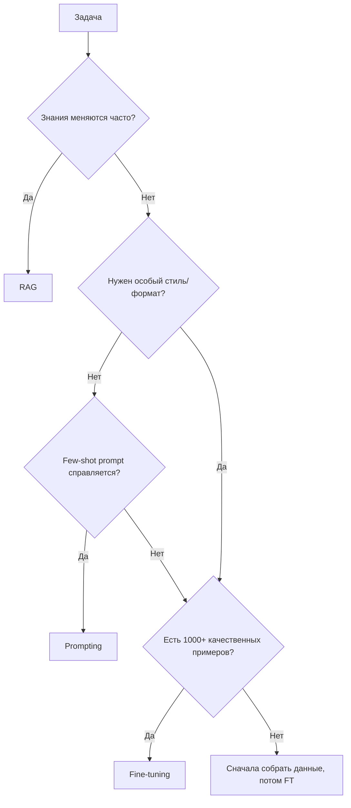
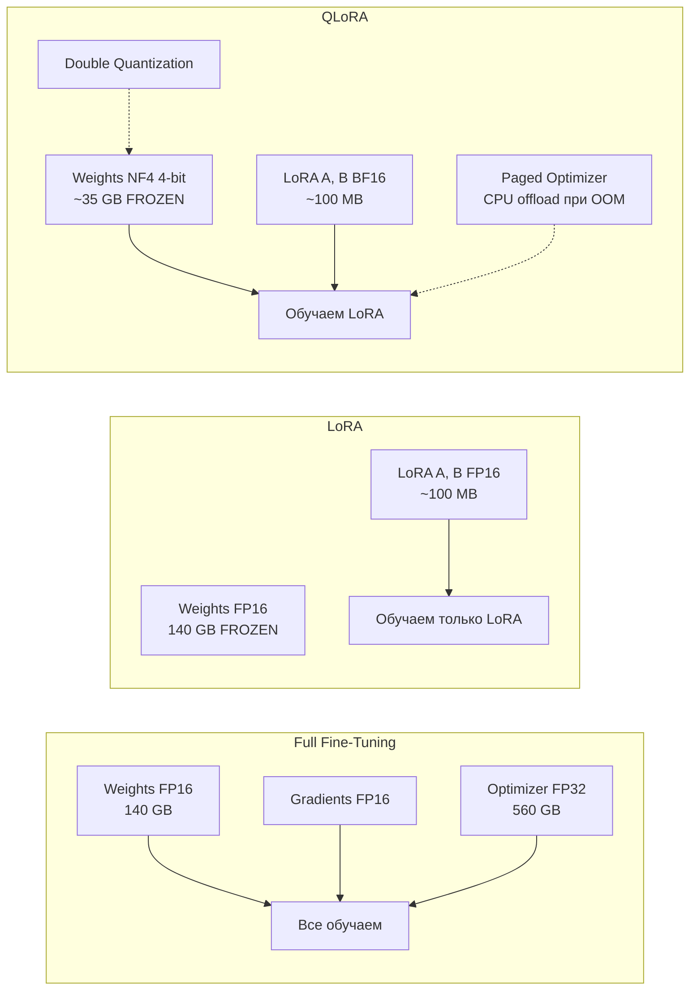
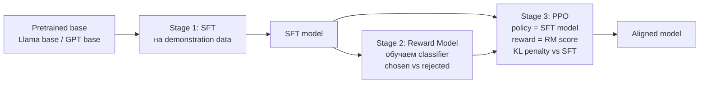
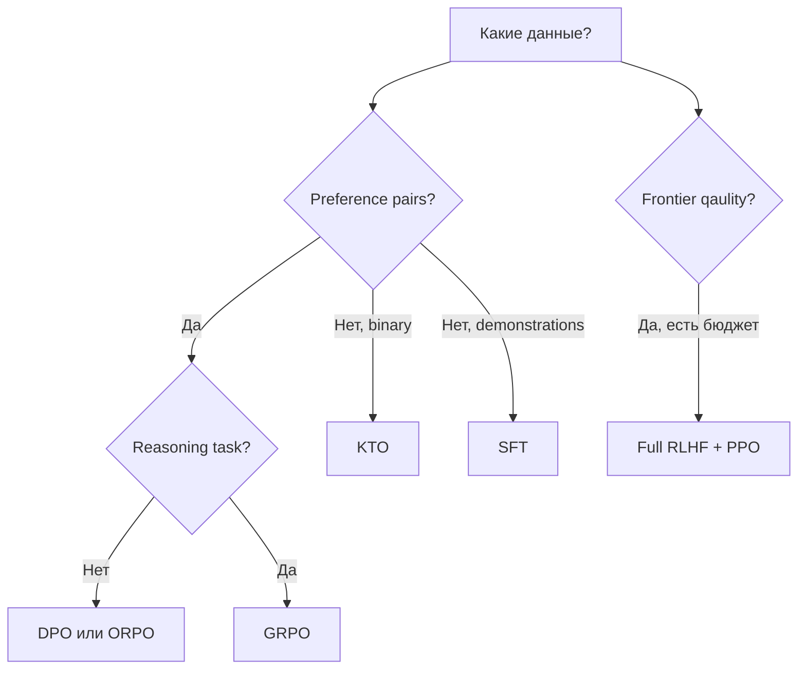
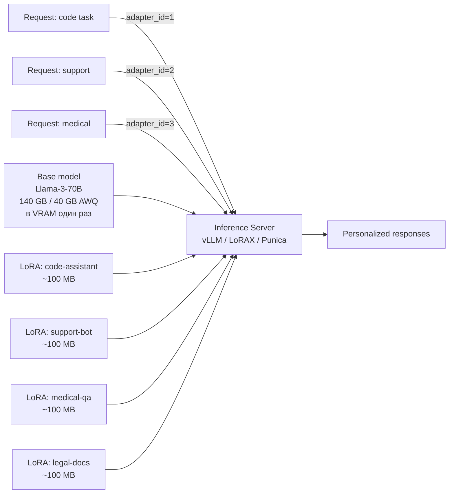
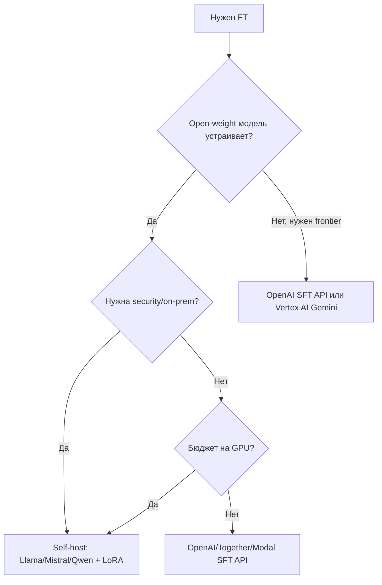

# Вопросы на собеседовании: `Fine-tuning LLM (LoRA/QLoRA/RLHF/DPO/GRPO)`

Fine-tuning LLM из «дорогой R&D-операции» к 2024-2026 превратился в **повседневный инструмент инженера**: появились PEFT-методы (LoRA, QLoRA, DoRA), которые позволяют дообучить 70B-модель на одной 80GB GPU; preference-алгоритмы упростились с PPO до `DPO` и `GRPO`; библиотеки (TRL, Unsloth, Axolotl) свели pipeline к десяткам строк кода.

На интервью спрашивают: **когда** fine-tune (а когда — prompt или RAG), **что выбрать** (full FT, LoRA, QLoRA, DoRA), **как** строить preference dataset (RLHF vs DPO vs GRPO vs KTO), какие **подводные камни** (chat template, catastrophic forgetting, EOS token), и **как deploy** (multi-LoRA serving, vLLM, adapter switching).

## Полезные ссылки

### Базовые статьи (papers)

- [LoRA: Low-Rank Adaptation of Large Language Models (Hu et al. 2021)](https://arxiv.org/abs/2106.09685) — оригинальная статья LoRA
- [QLoRA: Efficient Finetuning of Quantized LLMs (Dettmers et al. 2023)](https://arxiv.org/abs/2305.14314) — NF4, double quantization, paged optimizers
- [DoRA: Weight-Decomposed Low-Rank Adaptation (Liu et al. 2024)](https://arxiv.org/abs/2402.09353) — decomposition magnitude + direction
- [InstructGPT / RLHF paper (Ouyang et al. 2022)](https://arxiv.org/abs/2203.02155) — SFT + reward model + PPO
- [Direct Preference Optimization (Rafailov et al. 2023)](https://arxiv.org/abs/2305.18290) — DPO без RL
- [KTO: Model Alignment as Prospect Theoretic Optimization (Ethayarajh et al. 2024)](https://arxiv.org/abs/2402.01306) — binary labels вместо pairs
- [ORPO: Monolithic Preference Optimization without Reference Model (Hong et al. 2024)](https://arxiv.org/abs/2403.07691) — SFT + DPO в одном шаге
- [DeepSeek-R1 paper (2025)](https://arxiv.org/abs/2501.12948) — GRPO в действии
- [LIMA: Less Is More for Alignment (Zhou et al. 2023)](https://arxiv.org/abs/2305.11206) — 1000 примеров достаточно

### Документация и инструменты

- [HuggingFace TRL docs](https://huggingface.co/docs/trl) — SFTTrainer, DPOTrainer, GRPOTrainer
- [HuggingFace PEFT docs](https://huggingface.co/docs/peft) — LoRA/QLoRA/DoRA wrapper
- [Unsloth docs](https://docs.unsloth.ai/) — 2x speed, 70% less VRAM
- [Axolotl repo](https://github.com/axolotl-ai-cloud/axolotl) — high-level YAML-config
- [bitsandbytes repo](https://github.com/bitsandbytes-foundation/bitsandbytes) — 4/8-bit quantization
- [OpenAI fine-tuning guide](https://platform.openai.com/docs/guides/fine-tuning) — SFT/RFT через API
- [Google Vertex AI tuning](https://cloud.google.com/vertex-ai/generative-ai/docs/models/tune-models) — Gemini fine-tuning

## Содержание

- [Полезные ссылки](#полезные-ссылки)
- [See also](#see-also)

**Когда fine-tune**
- [Q1. (!) Что такое fine-tuning и когда он нужен?](#q1--что-такое-fine-tuning-и-когда-он-нужен)
- [Q2. (!) Fine-tuning vs prompting vs RAG — как выбрать?](#q2--fine-tuning-vs-prompting-vs-rag--как-выбрать)
- [Q3. Когда fine-tuning НЕ поможет?](#q3-когда-fine-tuning-не-поможет)

**Full vs PEFT (LoRA / QLoRA / DoRA)**
- [Q4. (!) Что такое full fine-tuning и почему он дорогой?](#q4--что-такое-full-fine-tuning-и-почему-он-дорогой)
- [Q5. (!) Что такое PEFT? Перечислить методы](#q5--что-такое-peft-перечислить-методы)
- [Q6. (!) LoRA — как устроена математически?](#q6--lora--как-устроена-математически)
- [Q7. (!) QLoRA — что добавила к LoRA?](#q7--qlora--что-добавила-к-lora)
- [Q8. DoRA — чем лучше LoRA?](#q8-dora--чем-лучше-lora)
- [Q9. На какие слои применять LoRA?](#q9-на-какие-слои-применять-lora)
- [Q10. Как выбрать rank `r` и `alpha`?](#q10-как-выбрать-rank-r-и-alpha)

**SFT / Continued Pretraining**
- [Q11. (!) Чем отличается SFT от continued pretraining (DAPT)?](#q11--чем-отличается-sft-от-continued-pretraining-dapt)
- [Q12. (!) Как выглядит SFT-pipeline на TRL?](#q12--как-выглядит-sft-pipeline-на-trl)
- [Q13. Distillation — как обучать маленькую модель от большой?](#q13-distillation--как-обучать-маленькую-модель-от-большой)

**Preference Optimization (RLHF / DPO / GRPO / KTO / ORPO)**
- [Q14. (!) Что такое RLHF и как работает классический pipeline?](#q14--что-такое-rlhf-и-как-работает-классический-pipeline)
- [Q15. (!) DPO — как заменил PPO для большинства случаев?](#q15--dpo--как-заменил-ppo-для-большинства-случаев)
- [Q16. (!) GRPO (DeepSeek) — чем отличается от PPO и DPO?](#q16--grpo-deepseek--чем-отличается-от-ppo-и-dpo)
- [Q17. KTO — когда не нужны preference pairs](#q17-kto--когда-не-нужны-preference-pairs)
- [Q18. ORPO — SFT и DPO в одном шаге](#q18-orpo--sft-и-dpo-в-одном-шаге)
- [Q19. Сравнительная таблица: RLHF vs DPO vs GRPO vs KTO vs ORPO](#q19-сравнительная-таблица-rlhf-vs-dpo-vs-grpo-vs-kto-vs-orpo)

**Datasets и chat templates**
- [Q20. (!) Какие открытые SFT-датасеты использовать?](#q20--какие-открытые-sft-датасеты-использовать)
- [Q21. Датасеты для preference optimization?](#q21-датасеты-для-preference-optimization)
- [Q22. (!) Chat templates — почему ошибка тут ломает модель?](#q22--chat-templates--почему-ошибка-тут-ломает-модель)
- [Q23. Качество vs количество (LIMA-эффект)](#q23-качество-vs-количество-lima-эффект)

**Libraries и hardware**
- [Q24. (!) Какие библиотеки — TRL, PEFT, Unsloth, Axolotl?](#q24--какие-библиотеки--trl-peft-unsloth-axolotl)
- [Q25. (!) Hardware tiers — что нужно для 7B/13B/70B?](#q25--hardware-tiers--что-нужно-для-7b13b70b)
- [Q26. Гиперпараметры обучения — learning rate, число эпох, batch size?](#q26-гиперпараметры-обучения--learning-rate-число-эпох-batch-size)

**Evaluation и pitfalls**
- [Q27. (!) Как оценивать качество fine-tuned модели?](#q27--как-оценивать-качество-fine-tuned-модели)
- [Q28. (!) Catastrophic forgetting — как обнаружить и митигировать?](#q28--catastrophic-forgetting--как-обнаружить-и-митигировать)
- [Q29. Топ-5 ошибок при fine-tuning](#q29-топ-5-ошибок-при-fine-tuning)
- [Q30. Merging моделей — SLERP, TIES, DARE, model soups](#q30-merging-моделей--slerp-ties-dare-model-soups)

**Deployment (multi-LoRA serving)**
- [Q31. (!) Как деплоить fine-tuned модель в production?](#q31--как-деплоить-fine-tuned-модель-в-production)
- [Q32. (!) Multi-LoRA serving — один base + много адаптеров?](#q32--multi-lora-serving--один-base--много-адаптеров)
- [Q33. OpenAI / Anthropic / Google fine-tuning APIs — статус 2026](#q33-openai--anthropic--google-fine-tuning-apis--статус-2026)
- [Q34. Какие open-weight базовые модели брать в 2025-2026?](#q34-какие-open-weight-базовые-модели-брать-в-2025-2026)
- [Q35. Как оценить стоимость: cloud GPU против tuning через API?](#q35-как-оценить-стоимость-cloud-gpu-против-tuning-через-api)

## Q1. (!) Что такое fine-tuning и когда он нужен?

**Fine-tuning** — это дообучение уже предобученной (`pretrained`) LLM на собственном узкоспециализированном датасете. Цель не «добавить знаний», а **сместить распределение модели** в сторону нужного домена, стиля или формата: модель и так умеет говорить, мы лишь подстраиваем, *как именно* она это делает.

**Когда fine-tune действительно нужен:**

1. **Новый формат или стиль ответа** — всегда отдавать строгий JSON по своей схеме или выдержанный фирменный tone-of-voice. Это поведение, а не факты, — fine-tune тут силён.
2. **Узкая доменная экспертиза** — медицина, право, код на внутреннем DSL, где промпта не хватает.
3. **Снижение latency и стоимости** — заменить большую модель с длинным промптом на маленькую дообученную (`gpt-3.5-tuned` вместо `gpt-4o` с few-shot). Поведение «зашито» в веса, поэтому промпт короче.
4. **Поведенческие правила**, которые в промпте разрослись бы до тысяч токенов, — переносим их в веса один раз.
5. **Чувствительные данные** — нужен on-prem, нельзя отправлять в чужой API → дообучаем open-weight модель у себя.

**Когда fine-tune НЕ нужен:**

- Хватает few-shot промптинга — начни с него, он дешевле и быстрее.
- Знания **часто обновляются** — fine-tune замораживает их в весах, лучше `RAG`.
- Качественной разметки меньше 50 примеров — обучать не на чем.
- Метрики ещё не определены — без них непонятно, стало ли лучше.

## Q2. (!) Fine-tuning vs prompting vs RAG — как выбрать?

| Критерий | Prompting | RAG | Fine-tuning |
|----------|-----------|-----|-------------|
| **Скорость итерации** | Минуты | Часы | Дни-недели |
| **Стоимость setup** | $0 | $-$$ (vector DB) | $$-$$$$ (GPU + ML eng) |
| **Свежесть знаний** | Только из prompt | Свежие (re-index) | Замороженные (на момент обучения) |
| **Объём знаний** | Контекстное окно | Терабайты | Закодировано в весах |
| **Новый стиль / формат** | Слабо | Никак | **Сильно** |
| **Latency inference** | Зависит от prompt | +retrieval (50-200мс) | Чистая (≈ base) |
| **Cost per token** | Высокий (prompt длинный) | Средний | Низкий |
| **Когда лучший выбор** | Прототип, переменная задача | Factual grounding, актуальные данные | Фиксированный формат/стиль/domain |

**Шпаргалка по выбору:**



**Правило:** двигайся по лестнице **промптинг → RAG → fine-tuning**, не перепрыгивая ступени: каждый следующий шаг дороже и медленнее предыдущего. На практике fine-tune и RAG часто работают вместе — fine-tune отвечает за стиль и формат, RAG подаёт свежие факты.

## Q3. Когда fine-tuning НЕ поможет?

Главное, что нужно держать в голове: fine-tune **меняет поведение, а не наполняет голову знаниями и интеллектом**. Отсюда его реальные пределы:

1. **Не добавит фактов, которых модель не знала.** Особенно редких: это всё ещё языковая модель, и единичный факт она «размажет» между похожими, а не запомнит точно. Факты — это работа `RAG`.
2. **Не сделает модель умнее.** Если базовая модель не умеет в reasoning, SFT на 1000 примерах не превратит её в reasoning-модель. Для этого нужны **миллионы reasoning-трасс плюс RL**, как в DeepSeek-R1.
3. **Не вылечит системные галлюцинации.** Наоборот — если в датасете есть противоречия, fine-tune их закрепит и усилит.
4. **Не заменит prompt engineering, пока вы сами не поняли задачу.** Правильный порядок: сначала прототип на промптах → когда заработало → fine-tune ради стоимости и latency.
5. **Не вытянет из крошечного датасета (<50 примеров).** Переобучение гарантировано, обобщения не будет.

**Правило:** fine-tuning сдвигает распределение, но воду в вино не превращает.

## Q4. (!) Что такое full fine-tuning и почему он дорогой?

**Full fine-tuning** — обновление **всех параметров** модели через обратное распространение (backpropagation). Дорогой он не из-за самих весов, а из-за того, что под каждый обучаемый параметр оптимизатор держит ещё несколько копий вспомогательного состояния.

**Что приходится хранить в VRAM (для оптимизатора AdamW):**

| Компонент | Размер (FP16) | Для 7B | Для 70B |
|-----------|---------------|--------|---------|
| Weights | 2 байта/param | 14 GB | 140 GB |
| Gradients | 2 байта/param | 14 GB | 140 GB |
| Optimizer state (AdamW: m, v в FP32) | 8 байт/param | 56 GB | 560 GB |
| Activations | зависит от batch | 5-20 GB | 50-200 GB |
| **Итого минимум** | | **~80 GB** | **~800 GB** |

Главный множитель — строка optimizer state: 8 байт на параметр (m и v в FP32) дают для 70B целых 560 GB, на порядок больше самих весов. Именно она делает full FT неподъёмным.

**Что отсюда следует на практике:**

- 7B full FT → одна H100 80GB впритык.
- 70B full FT → минимум 8×H100 80GB с шардингом (FSDP / DeepSpeed).
- 405B full FT → отдельный датацентр.

**Чем ещё плох full FT, помимо обучения:**

1. **Catastrophic forgetting** — модель «забывает» общие способности (см. Q28).
2. **Хранение** — дообученная 70B весит 140 GB файлов. И так на каждую версию и каждый домен.
3. **Деплой** — под каждый дообученный вариант нужен отдельный inference-кластер.

**Когда full FT всё-таки оправдан:**

- Очень большой датасет (миллионы примеров) — PEFT начинает упираться в потолок ёмкости.
- Нужно выжать максимум качества без компромиссов.
- Меняется фундаментальное поведение модели — например, continued pretraining на новый язык или домен.

## Q5. (!) Что такое PEFT? Перечислить методы

**PEFT (Parameter-Efficient Fine-Tuning)** — семейство методов, которые обучают лишь **малую долю параметров** (0.01-1%), заморозив остальные. Это решает все три беды full FT разом: память под оптимизатор почти исчезает, артефакт обучения весит мегабайты вместо гигабайт, а замороженный base защищён от forgetting. В основе — наблюдение, что само дообучение живёт в низкоранговом (low-rank) подпространстве.

**Основные методы:**

| Метод | Идея | Параметров | Inference overhead |
|-------|------|------------|-------------------|
| **LoRA** | ΔW = B·A, low-rank decomposition | 0.1-1% | 0 (merge в base) |
| **QLoRA** | LoRA поверх 4-bit quantized base | 0.1-1% | small (dequant) |
| **DoRA** | Magnitude + Direction decomposition | ~LoRA | 0 (merge) |
| **Adapters** | Bottleneck MLP внутри FFN | 1-5% | +небольшой |
| **Prefix Tuning** | Learnable prefix к KV cache | <0.1% | +prefix |
| **P-Tuning v2** | Learnable embeddings на каждом слое | <0.5% | small |
| **IA³** | Per-vector scaling factors | <0.01% | negligible |
| **BitFit** | Только bias terms | <0.1% | 0 |

**Победитель в 2024-2026 — LoRA/QLoRA/DoRA.** Остальные методы либо проигрывают по качеству, либо добавляют накладные расходы на inference (свой prefix к KV-cache, лишние слои), тогда как LoRA-семейство можно «вплавить» в base без потери скорости.

**Почему PEFT вообще работает:**

- В статье про LoRA (Hu et al.) показали: при дообучении веса сдвигаются в **низкоранговое подпространство** малой внутренней размерности (intrinsic rank).
- Значит, обновлять все 70B параметров избыточно — реальное изменение «помещается» в пару матриц ранга 16.

## Q6. (!) LoRA — как устроена математически?

**Идея LoRA (Low-Rank Adaptation):** не трогаем исходную матрицу `W ∈ R^(d×d)` вовсе, а обучаем рядом её **низкоранговую поправку** ΔW, разложенную на две узкие матрицы:

```
W_new = W + ΔW
ΔW = B · A
где A ∈ R^(r × d), B ∈ R^(d × r), r << d
```

**Параметров вместо `d²` обучаем `2·d·r`**. Для `d=4096, r=16` это 131K вместо 16.7M — в 128 раз меньше, и именно поэтому LoRA так дёшев по памяти.

**Инициализация (важная деталь):**
- `A` — маленькими случайными числами (Gaussian).
- `B` — строго нулями.
- За счёт нулевой `B` в начале обучения `ΔW = B·A = 0`, то есть модель стартует точно как base и плавно отходит от неё — без скачка качества на первом шаге.

**Масштабирующий множитель `α` (alpha):**

```
W_effective = W + (α/r) · B · A
```

`α` задаёт «силу» адаптера. Типично берут `α = 2·r` (например, `r=16, α=32`). Удобство в том, что коэффициент `α/r` можно менять уже после обучения — тем самым усиливая или ослабляя вклад LoRA без повторного тренинга.

**Forward pass (PyTorch-stylized):**

```python
class LoRALinear(nn.Module):
    def __init__(self, base_linear, r=16, alpha=32):
        super().__init__()
        self.base = base_linear  # frozen
        self.lora_A = nn.Linear(base_linear.in_features, r, bias=False)
        self.lora_B = nn.Linear(r, base_linear.out_features, bias=False)
        nn.init.zeros_(self.lora_B.weight)
        self.scale = alpha / r

    def forward(self, x):
        return self.base(x) + self.scale * self.lora_B(self.lora_A(x))
```

**На inference есть выбор из двух режимов:**
- **Merge** — посчитать `W_merged = W + (α/r)·B·A` один раз и получить обычную матрицу: ноль накладных расходов, но адаптер уже не отделить.
- **Раздельно** — держать base и адаптер отдельно: чуть медленнее, зато один base обслуживает много адаптеров (multi-LoRA serving, см. Q32).

**Какие матрицы обычно трогают:**
- Attention `q_proj, k_proj, v_proj, o_proj` — базовый выбор.
- Иногда добавляют FFN `gate_proj, up_proj, down_proj` (Mistral/Llama).
- `embed_tokens` и `lm_head` обычно **не трогают** — они большие и ломают tokenizer-matching при merge.

## Q7. (!) QLoRA — что добавила к LoRA?

**QLoRA (Dettmers et al. 2023)** добавил к LoRA один ключевой ход: **держать замороженный base в 4 битах** вместо 16. Base всё равно не обучается — значит, можно сжать его в разы и освободить VRAM под всё остальное. Вокруг этой идеи — три техники, позволившие дообучить 65B на **одной GPU с 48 GB**:



**Три ключевые техники и зачем каждая:**

1. **NF4 (NormalFloat 4-bit).** Информационно-оптимальное 4-битное представление именно для весов с нормальным распределением (а у LLM оно как раз такое). 16 уровней расставлены не равномерно, а по квантилям N(0,1) — поэтому при тех же 4 битах точность выше, чем у обычного int4.

2. **Double Quantization (DQ).** Квантизируем сами константы квантизации, которые иначе сами съедали бы заметную память. Экономит ~0.5 бита на параметр → ещё ~3 GB на 65B.

3. **Paged Optimizers.** Опираются на unified memory NVIDIA: при всплеске памяти (например, на длинной последовательности) optimizer state автоматически вытесняется на CPU вместо падения с OOM. Это не про скорость, а про надёжность — тренировка не валится на пиках.

**Цифры из статьи:**
- LLaMA-65B через QLoRA помещается в **48 GB** (один A6000).
- Качество — практически паритет с full fine-tuning.
- Обучение в ~2-3 раза медленнее, чем у LoRA (из-за деквантизации на лету), зато вообще становится возможным на доступном железе.

**Дефолт в 2024-2026 для open-weight моделей** — `QLoRA` через связку `bitsandbytes` + `peft` + `trl`.

## Q8. DoRA — чем лучше LoRA?

**DoRA (Weight-Decomposed LoRA, 2024)** улучшает LoRA, явно разделив каждый вес на две независимые части — **длину (magnitude)** и **направление (direction)**. Идея в том, что full FT свободно меняет обе, а обычный LoRA — нет; DoRA возвращает эту свободу и потому ближе к full FT:

```
W = m · (V / ||V||)
где m — magnitude (scalar per column), V/||V|| — нормализованное направление
```

DoRA обучает два компонента раздельно:
- `m` — magnitude (полный, но маленький вектор) учится напрямую.
- ΔV — направление, через ту же низкоранговую поправку, что и в LoRA.

**Плюсы:**

- **Качество ближе к full FT**, чем у LoRA, — особенно заметно на низких рангах (`r=4`, `r=8`), где обычному LoRA не хватает ёмкости.
- Обучение стабильнее.
- Накладные расходы на inference те же, что у LoRA — адаптер так же можно merge.

**Минусы:**

- Чуть медленнее обучается — приходится считать нормы.
- На больших рангах преимущество перед LoRA почти исчезает.

**Когда брать DoRA:** ограниченный compute и желание выжать максимум из `r=8` LoRA. Включается одной опцией в `peft`: `LoraConfig(use_dora=True)`.

## Q9. На какие слои применять LoRA?

Выбор слоёв — это компромисс «качество против памяти»: чем больше матриц охватывает LoRA, тем выше потолок качества, но тем больше обучаемых параметров и расход VRAM.

**Минимальный набор (часто по умолчанию в туториалах):**

```python
target_modules = ["q_proj", "v_proj"]
```

Только query- и value-проекции — это вариант из оригинальной статьи про LoRA.

**Стандартный набор для Llama/Mistral в 2024-2026:**

```python
target_modules = [
    "q_proj", "k_proj", "v_proj", "o_proj",     # attention
    "gate_proj", "up_proj", "down_proj",         # FFN (SwiGLU)
]
```

Это режим «`all-linear`» — все Linear-слои attention и FFN сразу. В `peft` он задаётся как `target_modules="all-linear"`.

**Эмпирическое правило:**

- Больше целевых модулей → больше параметров → выше качество, но дороже по памяти и времени.
- Для **instruction tuning** (научить формату ответа) обычно хватает только attention.
- Для **доменной адаптации** (новый стиль или формат) лучше брать all-linear.

**Что обычно НЕ трогают:**
- `embed_tokens` и `lm_head` — большие матрицы, к тому же ломают tokenizer-matching при merge.
- Параметры `LayerNorm` — крошечные, это отдельная история в стиле BitFit.

## Q10. Как выбрать rank `r` и `alpha`?

**Ранг `r`** — главный гиперпараметр LoRA: он задаёт ёмкость адаптера, то есть сколько «нового» модель в принципе способна выучить.

| Rank | Параметров | Когда использовать |
|------|------------|-------------------|
| `r=4-8` | Минимум | Простой стиль, instruction format |
| `r=16` | Стандарт | Большинство SFT задач |
| `r=32-64` | Больше | Domain adaptation, сложные задачи |
| `r=128+` | Близко к full FT | Когда хочется максимум качества |

**Эмпирика:** удвоение `r` редко удваивает качество — отдача быстро убывает. На большинстве задач `r=16` даёт уже ~90% от качества `r=64`. Поэтому стартуй с `r=16` и поднимай ранг, только если метрики не устраивают.

**Alpha `α`:**

- Классическое правило: **`α = 2·r`**.
- Консервативная альтернатива: `α = r`.
- На inference итоговый масштаб равен `α/r`, и менять его можно без переобучения — так адаптер применяется слабее или сильнее.

**Dropout:** стандарт — LoRA dropout 0.05-0.1. Помогает против переобучения на маленьких датасетах.

**Пример `peft` LoraConfig:**

```python
from peft import LoraConfig

config = LoraConfig(
    r=16,
    lora_alpha=32,
    target_modules=["q_proj", "k_proj", "v_proj", "o_proj",
                    "gate_proj", "up_proj", "down_proj"],
    lora_dropout=0.05,
    bias="none",
    task_type="CAUSAL_LM",
    use_dora=False,  # True для DoRA
)
```

## Q11. (!) Чем отличается SFT от continued pretraining (DAPT)?

Это два разных режима дообучения после pretraining, и путать их нельзя: **DAPT расширяет знания** модели на сыром тексте, а **SFT учит формату** ответа на парах «инструкция → ответ». Разница в данных, в loss и в порядке применения.

| Аспект | Continued Pretraining (DAPT) | SFT (Supervised Fine-Tuning) |
|--------|------------------------------|-------------------------------|
| **Цель** | Расширить знания/язык/домен | Научить инструкциям/формату |
| **Данные** | Сырой текст (статьи, код, книги) | `{instruction, response}` пары |
| **Loss** | Next-token на всём тексте | Next-token часто **только на response** |
| **Формат** | Без chat template | С chat template |
| **Объём** | Миллиарды-триллионы токенов | Тысячи-миллионы примеров |
| **Когда** | Новый язык, узкий домен (medical, legal) | Превратить base в instruct модель |
| **Пример** | BloombergGPT (financial), Code Llama (code) | Llama-3-Instruct, Mistral-Instruct |

**Pipeline на практике:**

```
Base model (Llama-3-8B)
    ↓ Continued pretraining (опционально)
Domain base model
    ↓ SFT на instruction data
Instruct model
    ↓ Preference optimization (DPO/RLHF)
Aligned model
```

**Важная деталь SFT:** у `SFTTrainer` в TRL есть флаг `completion_only_loss=True` — loss считается только на токенах ответа, а не на инструкции. Без него модель тратит ёмкость на то, чтобы научиться «переписывать» сами вопросы, вместо того чтобы хорошо на них отвечать.

## Q12. (!) Как выглядит SFT-pipeline на TRL?

Канонический минимальный пайплайн QLoRA + SFT собирается из четырёх библиотек: `bitsandbytes` квантизует base в 4 бита, `peft` навешивает LoRA-адаптер, `trl` даёт `SFTTrainer`, `transformers` — модель и токенайзер.

**Минимальный пример:**

```python
import torch
from transformers import AutoModelForCausalLM, AutoTokenizer, BitsAndBytesConfig
from peft import LoraConfig, get_peft_model, prepare_model_for_kbit_training
from trl import SFTConfig, SFTTrainer
from datasets import load_dataset

model_id = "meta-llama/Meta-Llama-3-8B"

# 4-bit quantization config (NF4 + double quant)
bnb_config = BitsAndBytesConfig(
    load_in_4bit=True,
    bnb_4bit_quant_type="nf4",
    bnb_4bit_compute_dtype=torch.bfloat16,
    bnb_4bit_use_double_quant=True,
)

tokenizer = AutoTokenizer.from_pretrained(model_id)
tokenizer.pad_token = tokenizer.eos_token

model = AutoModelForCausalLM.from_pretrained(
    model_id,
    quantization_config=bnb_config,
    device_map="auto",
)
model = prepare_model_for_kbit_training(model)

# LoRA config
lora_config = LoraConfig(
    r=16, lora_alpha=32,
    target_modules="all-linear",
    lora_dropout=0.05, bias="none",
    task_type="CAUSAL_LM",
)
model = get_peft_model(model, lora_config)
model.print_trainable_parameters()  # ≈ 0.5% от total

# Dataset: ожидаются поля messages (ChatML format)
dataset = load_dataset("HuggingFaceH4/ultrachat_200k", split="train_sft[:5000]")

training_args = SFTConfig(
    output_dir="./llama3-8b-sft",
    num_train_epochs=2,
    per_device_train_batch_size=4,
    gradient_accumulation_steps=4,
    learning_rate=2e-4,
    bf16=True,
    logging_steps=10,
    save_strategy="epoch",
    warmup_ratio=0.03,
    lr_scheduler_type="cosine",
    max_seq_length=2048,
    packing=True,  # склеивает короткие примеры в одно окно
)

trainer = SFTTrainer(
    model=model,
    args=training_args,
    train_dataset=dataset,
    tokenizer=tokenizer,
)
trainer.train()
trainer.save_model("./llama3-8b-sft")  # сохраняет только адаптер (~100 MB)
```

**На что обратить внимание в коде:**
- `bnb_4bit_compute_dtype=bfloat16` — веса лежат в NF4, но сами вычисления идут в bf16 (4 бита для матричного умножения — слишком грубо).
- `prepare_model_for_kbit_training` — чинит проток градиентов через квантизованный base (включает gradient checkpointing, кастует нужные слои).
- `packing=True` — склеивает короткие примеры в одно окно, чтобы GPU не простаивал на паддинге.
- На выходе сохраняются **только веса LoRA** (~100 MB вместо 16 GB полной модели).

**Та же логика на Unsloth выходит примерно в 3 раза быстрее** и требует на ~70% меньше VRAM (см. Q24).

## Q13. Distillation — как обучать маленькую модель от большой?

**Distillation (дистилляция)** — обучение «ученика» (маленькой модели) на выходах «учителя» (большой). Различаются два уровня по тому, *что именно* перенимает ученик — только готовые ответы или всё распределение вероятностей:

**1. Response distillation — учим на ответах:**
- Учитель генерирует ответы на корпус промптов.
- Ученик дообучается на этих парах `{prompt, teacher_response}` обычным SFT.
- **Примеры:** дистиллированные варианты `Llama-3.1-Nemotron-70B`, серия `DeepSeek-R1-Distill-Qwen-7B/14B/32B`.

**2. Logit distillation — учим на распределении:**
- Учитель отдаёт не один ответ, а **полное распределение по словарю** на каждом шаге — то есть свою «уверенность» во всех вариантах.
- Ученик учится через KL-дивергенцию от распределения учителя плюс cross-entropy по ground truth:

```
Loss = α · CE(student, ground_truth) + (1-α) · KL(student || teacher) · T²
```

где `T` — температура, `α ∈ [0,1]`. Богаче сигнал (ученик видит не только «правильный» токен, но и относительные шансы остальных), но **дорого** — нужен параллельный forward-проход учителя на каждом шаге.

**Что когда использовать:**

- **Response distillation** — практичный, production-friendly метод, основной в open-source (та же R1-Distill).
- **Logit distillation** — скорее research; применим, когда учитель и ученик делят один словарь и есть доступ к его логитам.

**Бонус — Speculative Decoding.** Это не дистилляция, но идейно близко: маленькая модель предлагает токены, большая их проверяет одним проходом. Ускоряет inference большой модели в 2-3 раза без потери качества.

## Q14. (!) Что такое RLHF и как работает классический pipeline?

**RLHF (Reinforcement Learning from Human Feedback)** — пайплайн выравнивания (alignment) из InstructGPT (Ouyang et al. 2022), благодаря которому ChatGPT стал таким, каким мы его знаем. Суть: научить модель не «продолжать текст», а отвечать так, как нравится людям, — а для этого предпочтения людей сначала превращают в обучаемую награду.

**Классический пайплайн из трёх стадий:**



**Стадия 1 — SFT.** Обычный supervised fine-tuning на 10K-100K демонстрационных пар `{prompt, response}`. Это «разогрев»: модель учится отвечать в нужном формате, дальше её только полируют.

**Стадия 2 — Reward Model (модель награды).** Берём SFT-модель, меняем lm_head на скалярную голову и обучаем на парах предпочтений `{prompt, chosen, rejected}` с loss `-log(sigmoid(r(prompt, chosen) - r(prompt, rejected)))`. На выходе — RM, которая по ответу выдаёт число «насколько он понравится человеку». По сути мы сжали ручную разметку в обучаемую функцию награды.

**Стадия 3 — PPO (Proximal Policy Optimization).** Policy = сама LLM (инициализирована из SFT). Цикл: модель генерирует ответ → RM ставит ему награду → PPO обновляет веса в сторону высокой награды. Ключевой элемент — **KL-штраф** относительно reference-модели (той же SFT): он не даёт policy уйти слишком далеко и заняться reward hacking (выкручивать награду в ущерб качеству) или вырождением.

**Почему RLHF/PPO так тяжёл:**

- **Сложно** — в памяти одновременно держим policy, reference и RM, а иногда и value-модель.
- **Нестабильно** — чувствителен к гиперпараметрам, легко скатывается в reward hacking.
- **Дорого** — десятки тысяч длинных rollout'ов (генераций) на обучение.

**Кто использует:** GPT-4, Claude, Gemini — все frontier-модели выровнены тем или иным вариантом RLHF. Open-source же постепенно уходит на DPO/GRPO как на более простую замену — именно из-за перечисленных минусов.

## Q15. (!) DPO — как заменил PPO для большинства случаев?

**DPO (Direct Preference Optimization, Rafailov et al. 2023)** — главный прорыв 2023 года в alignment: он убрал из RLHF и reward-модель, и сам RL-цикл.

**Идея.** Авторы математически показали, что задачу PPO можно решить **в замкнутой форме** — без отдельной reward-модели и без RL. Сама LLM неявно содержит свою модель награды, поэтому всё сводится к обычному классификационному loss на парах предпочтений: «поднять вероятность chosen, опустить вероятность rejected». Получается стабильное обучение в стиле SFT вместо капризного RL.

**DPO loss:**

```
L_DPO = -E_{(x, y_w, y_l)} [
    log σ(
        β · (log π_θ(y_w|x) / π_ref(y_w|x)) 
      - β · (log π_θ(y_l|x) / π_ref(y_l|x))
    )
]
```

- `y_w` (winner) — выбранный (chosen) ответ.
- `y_l` (loser) — отклонённый (rejected) ответ.
- `π_θ` — обучаемая policy.
- `π_ref` — reference, замороженная SFT-модель.
- `β` — температура (0.1-0.5), регулирует «жёсткость» неявного KL.
- `σ` — сигмоида.

**Что в итоге делает loss:** повышает log-вероятность chosen относительно rejected, но через отношение к `π_ref` удерживает модель рядом с reference — то есть неявно встроенный KL-штраф играет ту же роль, что и явный в PPO.

**Преимущества DPO над PPO:**

| Аспект | PPO | DPO |
|--------|-----|-----|
| Reward model | Обязательна | **Не нужна** |
| RL loop | Да | **Нет** (обычный SFT-стиль training) |
| Моделей в памяти | 3-4 | 2 (policy + reference) |
| Стабильность | Сложно | Просто |
| Hyperparameters | Много | β + lr |
| Качество | Может быть выше при tuning | Часто на уровне PPO |

**Пример с TRL:**

```python
from trl import DPOTrainer, DPOConfig

dpo_config = DPOConfig(
    output_dir="./model-dpo",
    beta=0.1,                    # KL strength
    learning_rate=5e-7,          # очень маленький для DPO
    num_train_epochs=1,
    per_device_train_batch_size=2,
    gradient_accumulation_steps=8,
)

trainer = DPOTrainer(
    model=sft_model,             # уже SFT-tuned
    ref_model=None,              # auto-clone SFT model
    args=dpo_config,
    train_dataset=preference_dataset,  # поля: prompt, chosen, rejected
    tokenizer=tokenizer,
)
trainer.train()
```

**Когда выбирать DPO:** почти всегда, если у тебя есть готовые пары предпочтений и нет ресурсов (или желания) разворачивать полноценный RLHF с PPO.

## Q16. (!) GRPO (DeepSeek) — чем отличается от PPO и DPO?

**GRPO (Group Relative Policy Optimization)** — RL-алгоритм от DeepSeek, прославившийся вместе с R1.

**Главное отличие от PPO — нет value-модели (критика).** В PPO отдельная сеть оценивает «насколько хорош ход» (baseline для advantage). GRPO выкидывает её и берёт baseline бесплатно — как **среднее по группе** ответов на тот же промпт. Хорош ли ответ, решается относительно его «соседей», а не отдельной обученной сети.

**Как работает GRPO:**

1. Для каждого промпта `x` сэмплируем **группу** из `G` ответов `{y_1, ..., y_G}` (обычно G=4-16).
2. Считаем награду `r_i` для каждого через **rule-based verifier** — детерминированную проверку: верен ли матответ, проходят ли тесты у кода.
3. Нормируем advantage внутри группы (вычитаем среднее, делим на разброс):

```
A_i = (r_i - mean({r_1, ..., r_G})) / std({r_1, ..., r_G})
```

4. Обновляем policy по policy-gradient с этим advantage плюс KL-штраф от reference — так ответы лучше среднего по группе становятся вероятнее, хуже среднего — реже.

**Сравнение PPO vs DPO vs GRPO:**

| Свойство | PPO | DPO | GRPO |
|----------|-----|-----|------|
| Reward source | Learned RM | Static preference pairs | **Rule-based verifier** |
| Value model | Нужна | Не нужна | **Не нужна** |
| RL loop | Да | Нет | Да (с rollouts) |
| Где используется | GPT-4, Claude | Open-source SFT+ | **R1, R1-Zero, math LLMs** |
| Hyperparams | Сложные | Простые (β) | Group size, ε clip |
| Когда лучший выбор | Универсальный RLHF | Preference pairs готовы | Verifiable tasks (math, code) |

**Почему GRPO взлетел:**

- **Дешевле PPO примерно вдвое** — нет value-модели, а это половина обучаемых сетей и памяти.
- **Проверяемая награда → нет reward hacking.** Ground truth нельзя обмануть: ответ либо верен, либо нет, поэтому модели нечего «взламывать».
- **Reasoning возникает сам.** Чтобы чаще давать верный ответ, модель самостоятельно начинает писать длинные цепочки рассуждений (CoT) — это эмерджентное поведение, ему не учили напрямую.
- Лёг в основу **DeepSeek-R1-Zero** — чистый RL вообще без SFT, прорыв января 2025.

**Минусы:**

- Применим только к задачам с **проверяемым ответом** (математика, код, логика) — там, где есть rule-based verifier.
- Нужно много rollout'ов (по `G` ответов на промпт) → дорого по compute.
- На зашумлённой награде (например, judge-LLM вместо строгой проверки) становится нестабильным.

**В TRL** `GRPOTrainer` появился в 2025:

```python
from trl import GRPOTrainer, GRPOConfig

def reward_func(completions, **kwargs):
    return [check_math_answer(c) for c in completions]  # 1.0 or 0.0

config = GRPOConfig(
    output_dir="./r1-style",
    num_generations=8,           # group size G
    beta=0.04,                   # KL penalty
    learning_rate=1e-6,
)
trainer = GRPOTrainer(
    model=model,
    reward_funcs=reward_func,
    args=config,
    train_dataset=math_prompts,
)
trainer.train()
```

## Q17. KTO — когда не нужны preference pairs

**KTO (Kahneman-Tversky Optimization, Ethayarajh et al. 2024)** — метод выравнивания на основе **prospect theory** из поведенческой экономики.

**Главная фишка:** KTO учится на **бинарных метках** `{хороший, плохой}`, а не на парах `{chosen, rejected}`. Это снимает самое дорогое требование DPO — наличие пар.

**Зачем это нужно:**

- В реальном продакшне у тебя обычно есть логи `thumbs up / thumbs down`: каждый ответ оценён сам по себе, без пары-конкурента.
- Собрать честную пару «A лучше B» дороже и сложнее, чем просто проставить лайк/дизлайк.

**Loss (упрощённо):**

```
L_KTO = - λ_w · E_desirable[ value(r_θ) ] - λ_l · E_undesirable[ value(-r_θ) ]
```

где `value()` — функция полезности из prospect theory (вогнутая для выигрышей, выпуклая для потерь — ровно как воспринимают ценность люди).

**Плюсы:**

- Данные собирать дешевле — бинарных меток получить проще, чем пар.
- Устойчив к перекосу классов: веса `λ_w, λ_l` позволяют выровнять дисбаланс хороших/плохих.
- По качеству часто не уступает DPO.

**Когда выбирать KTO:**

- Есть продакшн-логи с оценкой каждого ответа по отдельности.
- Соотношение хороших и плохих ответов сильно несбалансировано.
- Нет ресурсов размечать именно пары.

**В TRL:** `KTOTrainer` доступен с 2024.

## Q18. ORPO — SFT и DPO в одном шаге

**ORPO (Odds Ratio Preference Optimization, Hong et al. 2024)** идёт ещё дальше DPO: **сливает SFT и preference-выравнивание в один loss** — без отдельной SFT-стадии и, что важно, без reference-модели. Если DPO держит в памяти две модели (policy + reference), то ORPO — одну.

**Loss:**

```
L_ORPO = L_SFT(chosen) + λ · L_OR
L_OR = -log σ( log(odds(y_w|x)) - log(odds(y_l|x)) )
```

где `odds(y|x) = P(y|x) / (1 - P(y|x))`.

**Что это даёт:**

- **Нет reference-модели** → памяти нужно ещё меньше, чем для DPO.
- **Один проход обучения** вместо двухступенчатого `SFT → DPO`.
- Качество конкурентное.

**Минусы:**

- Меньше контроля: нельзя отдельно подкрутить SFT и preference-выравнивание — они слиты в один loss.
- Менее обкатан в продакшне, чем DPO.

**Когда брать ORPO:** ограниченный compute и желание попробовать выравнивание «в один проход».

## Q19. Сравнительная таблица: RLHF vs DPO vs GRPO vs KTO vs ORPO

| Метод | Год | Reward | Reference model | Models в памяти | Данные | Когда выбирать |
|-------|-----|--------|-----------------|-----------------|--------|----------------|
| **RLHF (PPO)** | 2022 | Learned RM | Да | 3-4 | Preference pairs + demonstrations | Frontier alignment (GPT-4, Claude) |
| **DPO** | 2023 | Implicit (через pairs) | Да | 2 | Preference pairs | **Дефолт для open-source alignment** |
| **GRPO** | 2024 | Rule-based / verifier | Да | 2 + sampled group | Prompts с verifiable answers | **Reasoning, math, code** (R1-style) |
| **KTO** | 2024 | Binary labels | Да | 2 | Binary thumbs up/down | Production logs с per-response rating |
| **ORPO** | 2024 | Implicit | Нет | 1 | Preference pairs | Минимум compute, no-reference alignment |

**Решающее дерево:**



## Q20. (!) Какие открытые SFT-датасеты использовать?

**Топ-датасеты для instruction tuning (2024-2026):**

| Датасет | Размер | Описание | Лицензия |
|---------|--------|----------|----------|
| **Alpaca** | 52K | Self-instruct из GPT-3.5 | Research only (OpenAI ToS) |
| **Dolly-15k** | 15K | Human-written by Databricks employees | CC BY-SA 3.0 (commercial) |
| **OpenAssistant (OASST1/2)** | 161K conv | Multilingual, community-built | Apache 2.0 |
| **ShareGPT** | 90K | Real ChatGPT conversations | CC BY-NC (research) |
| **UltraChat** | 1.5M | Synthetic multi-turn от GPT | MIT |
| **LIMA** | 1K | Высоко-курированный | Research |
| **OpenOrca** | 1M+ | Augmented FLAN с GPT-4 explanations | MIT |
| **WizardLM** | 250K | Evol-Instruct (iterative complexity) | Research |
| **No Robots** | 10K | HuggingFace human-curated | CC BY-NC 4.0 |
| **Tulu-3-SFT-Mixture** | 1M | Allen AI отборная смесь | ODC-BY-1.0 |

**Рекомендации по подготовке датасета:**

1. **Смешивай** разнородные источники (general + code + math + multilingual) — чтобы не просесть на одном в пользу другого.
2. **Деконтаминируй** — убери примеры, пересекающиеся с eval-бенчмарками (MMLU, GSM8K), иначе метрики будут завышены утечкой.
3. **Дедуплицируй** — точные дубли и near-дубли через minhash; повторы перевешивают loss.
4. **Фильтруй по качеству** — выкинь короткие, обрезанные и шумные примеры.
5. **Приведи к одному формату** — все примеры под единый chat template (см. Q22).

**Под конкретный домен:**

- Code: **CodeAlpaca, Magicoder-Evol-Instruct**.
- Math: **MetaMathQA, GSM8K, MATH**.
- Multilingual: **Aya Collection (Cohere)**.
- Russian: **Saiga datasets, Vikhrmodels datasets**.

## Q21. Датасеты для preference optimization?

**Топ DPO/RLHF датасеты:**

| Датасет | Размер | Описание |
|---------|--------|----------|
| **Anthropic HH-RLHF** | 170K | Helpfulness + Harmlessness pairs от Claude team |
| **UltraFeedback** | 64K | GPT-4 judge на ответы 17 моделей |
| **Nectar (Berkeley)** | 183K | GPT-4 rankings |
| **OpenAssistant rankings** | ~30K | Human votes на multiple responses |
| **PKU-SafeRLHF** | 30K | Safety-focused pairs |
| **Argilla DPO-mix-7k** | 7K | Curated subset для quick DPO |

**Как собрать свой датасет предпочтений:**

1. **LLM-as-judge** — две модели дают ответы, GPT-4/Claude выбирает лучший → готовая пара `{better, worse}`.
2. **Разные температуры** — сэмплируешь 2-4 ответа из одной модели, лучший выбираешь вручную или судьёй-LLM.
3. **Продакшн-логи** — `thumbs up/down`: если есть пары, конвертируешь в pairs; если только одиночные оценки — это случай KTO (см. Q17).
4. **Best-vs-worst-of-N** — из N кандидатов берёшь самый высокий и самый низкий по рейтингу: контраст резче, сигнал чище.

**Качество решает всё:** грязная разметка даёт шумную модель. 5K чистых пар лучше, чем 100K сомнительных.

## Q22. (!) Chat templates — почему ошибка тут ломает модель?

**Chat template** — это точный формат спецтокенов, в котором модель привыкла видеть диалог (system / user / assistant). Почему ошибка тут смертельна: модель распознаёт границы реплик и свой ход именно по этим маркерам. Сдвинь формат — и она перестаёт понимать, где её очередь говорить и где надо остановиться. Поэтому chat template — **критическая часть SFT**.

**Примеры популярных форматов:**

**ChatML (OpenAI / Qwen):**
```
<|im_start|>system
You are helpful.<|im_end|>
<|im_start|>user
Hello<|im_end|>
<|im_start|>assistant
Hi!<|im_end|>
```

**Llama-3:**
```
<|begin_of_text|><|start_header_id|>system<|end_header_id|>

You are helpful.<|eot_id|><|start_header_id|>user<|end_header_id|>

Hello<|eot_id|><|start_header_id|>assistant<|end_header_id|>

Hi!<|eot_id|>
```

**Mistral / Vicuna:**
```
<s>[INST] You are helpful.

Hello [/INST] Hi!</s>
```

**Что именно ломается при несовпадении формата:**

1. Модель не понимает, где начинается её ход → выдаёт мусор.
2. Не генерирует EOS-токен → ответ не кончается и обрезается грубо по `max_tokens`.
3. Путает роли — принимает реплику user за свою и наоборот.
4. Вызовы функций и инструментов перестают парситься.

**Правильный подход в HuggingFace** — не собирать формат руками, а доверить это токенайзеру:

```python
tokenizer = AutoTokenizer.from_pretrained("meta-llama/Meta-Llama-3-8B-Instruct")

messages = [
    {"role": "system", "content": "You are helpful."},
    {"role": "user", "content": "Hello"},
    {"role": "assistant", "content": "Hi!"},
]

# tokenizer сам применяет правильный template
prompt = tokenizer.apply_chat_template(messages, tokenize=False)
```

**Сменил base — сменился и формат.** Каждое семейство ждёт свой:

- Llama-3 → формат Llama-3.
- Mistral → формат Mistral.
- Qwen → ChatML.

Скопировать формат от другой модели — частая и фатальная ошибка. `SFTTrainer` в TRL применяет правильный chat template из токенайзера автоматически — на это и опирайся, не пиши его руками.

## Q23. Качество vs количество (LIMA-эффект)

**LIMA (Less Is More for Alignment, Meta 2023)** — провокационная работа: показала, что **1000 тщательно отобранных примеров** дают выравнивание не хуже, чем 50K синтетических.

**Почему так получается:**

- Предобученная модель уже всё «знает» — alignment не вкладывает знания, а лишь показывает **формат** правильного ответа. А формату много примеров не нужно.
- Качество примеров важнее количества: один шумный пример портит сильнее, чем десять хороших помогают.
- Критично разнообразие: разные типы задач, длины и стили, иначе модель переобучится на узкий шаблон.

**Практические выводы:**

1. Не гонись за 100K плохо размеченных примеров — 1-2K качественных дадут больше.
2. Ручной просмотр каждого примера в первой версии датасета окупается.
3. Синтетика всё ещё работает, но фильтруй её жёстко — судьёй-LLM и дедупликацией.

**Сценарий типичного FT-проекта:**

```
Iteration 1: 500 hand-crafted примеров → SFT → evaluate
Iteration 2: + 1000 synthetic + filtered → SFT → evaluate
Iteration 3: + production logs (фильтрованные) → DPO → final
```

## Q24. (!) Какие библиотеки — TRL, PEFT, Unsloth, Axolotl?

**Стек 2024-2026:**

| Библиотека | Уровень | Что делает |
|------------|---------|------------|
| **`transformers`** | Низкий | Базовый API для моделей и tokenizer |
| **`peft`** | Низкий | LoRA, QLoRA, DoRA, prefix tuning — обёртка над моделью |
| **`bitsandbytes`** | Низкий | 4/8-bit quantization (NF4) |
| **`trl`** | Средний | `SFTTrainer`, `DPOTrainer`, `GRPOTrainer`, `KTOTrainer`, `ORPOTrainer` |
| **`accelerate`** | Низкий | Distributed training (FSDP, DeepSpeed) |
| **Unsloth** | Высокий | Оптимизированные kernels: **2x speed, 70% less VRAM** |
| **Axolotl** | Высокий | YAML-config над `trl` + `peft`, удобно для пайплайнов |
| **LLaMA-Factory** | Высокий | UI + CLI для fine-tuning |
| **DeepSpeed** | Низкий | ZeRO-3, offloading для огромных моделей |
| **FSDP** | Низкий | PyTorch native distributed sharding |

Стек делится на два уровня: низкоуровневые кирпичики (`transformers`, `peft`, `bitsandbytes`) дают полный контроль, высокоуровневые обёртки (Unsloth, Axolotl) — скорость работы и воспроизводимость ценой гибкости.

**Чем выделяется Unsloth:**

- Собственные Triton-ядра под LoRA/QLoRA → обучение в **2-5 раз быстрее**.
- **На 70% меньше VRAM** при том же качестве.
- Поддержка Llama, Mistral, Gemma, Qwen, Phi.
- Бесплатная open-source-версия плюс платный Unsloth Pro для multi-GPU.

**Пример с Unsloth (короче, чем чистый TRL):**

```python
from unsloth import FastLanguageModel
from trl import SFTTrainer, SFTConfig

model, tokenizer = FastLanguageModel.from_pretrained(
    model_name="unsloth/Meta-Llama-3.1-8B",
    max_seq_length=2048,
    load_in_4bit=True,
)
model = FastLanguageModel.get_peft_model(
    model, r=16, lora_alpha=32,
    target_modules=["q_proj", "k_proj", "v_proj", "o_proj",
                    "gate_proj", "up_proj", "down_proj"],
)

trainer = SFTTrainer(model=model, tokenizer=tokenizer,
                     train_dataset=dataset, args=SFTConfig(...))
trainer.train()
```

**Axolotl** — YAML вместо Python:

```yaml
base_model: meta-llama/Meta-Llama-3-8B
adapter: qlora
load_in_4bit: true
lora_r: 16
lora_alpha: 32
datasets:
  - path: HuggingFaceH4/ultrachat_200k
    type: sharegpt
num_epochs: 2
learning_rate: 2e-4
micro_batch_size: 4
gradient_accumulation_steps: 4
```

**Когда что выбрать:**

- **Прототип / research** → чистый `transformers` + `trl` + `peft`.
- **Скорость / экономия VRAM** → `Unsloth`.
- **Production pipeline** → `Axolotl` (декларативно, воспроизводимо).
- **Огромные модели (70B+, multi-node)** → `DeepSpeed` / `FSDP`.

## Q25. (!) Hardware tiers — что нужно для 7B/13B/70B?

**Карты VRAM (приблизительно для QLoRA, batch=4, seq_len=2048):**

| Модель | QLoRA (4-bit) | LoRA (BF16) | Full FT |
|--------|--------------|-------------|---------|
| **7B** | ~10 GB → **RTX 3090/4090 (24 GB)** | ~20 GB → **A100 40GB** | ~80 GB → **A100 80GB** |
| **13B** | ~16 GB → **RTX 4090** | ~30 GB → **A100 40GB** | ~150 GB → 2×A100 80GB |
| **34B** | ~24 GB → **RTX 4090 / A100 40GB** | ~70 GB → A100 80GB | ~400 GB → 4×H100 |
| **70B** | ~46 GB → **A100 80GB** | ~140 GB → 2×A100 80GB | ~800 GB → **8×H100** |
| **405B (Llama 3.1)** | ~250 GB → 4×H100 | n/a практически | дата-центр |

**Облачные варианты (цены 2025-2026, on-demand):**

| Provider | A100 80GB | H100 80GB |
|----------|-----------|-----------|
| **Lambda Labs** | $1.29/hr | $2.49/hr |
| **vast.ai** | $0.80-1.50/hr | $2-3/hr |
| **Runpod** | $1.19/hr | $2.19/hr |
| **Modal** | $1.10/hr | $3.90/hr |
| **Together AI** | n/a | $1.76/hr (serverless) |
| **AWS p4d.24xlarge** | 8×A100 ~$32/hr | n/a |

**Типичные сценарии:**

- **7B QLoRA на одной 4090**: 1-2 эпохи на 10K примеров ≈ 2-4 часа ≈ **$0**.
- **70B QLoRA на A100 80GB**: 2 эпохи на 50K ≈ 24-48 часов ≈ **$30-60**.
- **70B full FT на 8×H100**: $20/hr × 24h = **$480** за one-shot.
- **70B GRPO**: дороже SFT в 5-10x из-за rollouts.

**Локальные сборки:**
- RTX 4090 24GB ≈ $1800 — стартовая карта под 7B-13B QLoRA.
- 2×RTX 4090 ≈ $4000 плюс блок питания на 1600W и серьёзное охлаждение.
- Apple M-series (M3 Max 128GB) — тренировать может, но медленно: под Metal нет CUDA-оптимизаций bitsandbytes/unsloth, и Triton-ядра Unsloth не работают.

## Q26. Гиперпараметры обучения — learning rate, число эпох, batch size?

**Стартовые значения по сценариям:**

| Hyperparam | Full FT | LoRA | QLoRA | DPO | GRPO |
|------------|---------|------|-------|-----|------|
| **learning_rate** | 1e-5 — 5e-5 | 1e-4 — 5e-4 | 1e-4 — 3e-4 | 5e-7 — 5e-6 | 1e-6 — 5e-6 |
| **epochs** | 1-2 | 1-3 | 1-3 | 1 | n/a (по steps) |
| **per_device_batch_size** | 1-4 | 4-16 | 4-16 | 1-4 | 1-2 |
| **gradient_accumulation_steps** | 8-32 | 1-8 | 1-8 | 4-16 | 8-32 |
| **warmup_ratio** | 0.03-0.1 | 0.03-0.1 | 0.03-0.1 | 0.1 | 0.05 |
| **lr_scheduler** | cosine / linear | cosine | cosine | cosine | constant |
| **weight_decay** | 0.01-0.1 | 0 | 0 | 0 | 0 |
| **max_grad_norm** | 1.0 | 1.0 | 0.3-1.0 | 1.0 | 1.0 |

**Правила и логика за ними:**

1. **LoRA learning rate сильно больше, чем у full FT.** Параметров обучается мало, и каждый влияет на больше, поэтому нужны крупные шаги — отсюда `1e-4` против `1e-5`.
2. **DPO learning rate сильно меньше, чем у SFT.** Модель и так стартует от reference, и большой шаг мгновенно уводит её в деградацию.
3. **Эффективный batch = per_device × grad_accum × num_gpus.** Целься в 32-128 для SFT и 16-64 для DPO — это «настоящий» размер батча, на который реагирует обучение.
4. **Эпох не больше 3.** Дальше почти всегда начинается переобучение.
5. **Eval после каждой эпохи** на отложенном наборе и **ранняя остановка** по eval loss или метрике.
6. **bf16 предпочтительнее fp16** на A100/H100 — шире диапазон, меньше переполнений.

**Что проверить перед запуском (sanity checks):**

- Loss на первом шаге должен быть ≈ `log(vocab_size)` ≈ 10-12 для словаря на 32K. Если 0 — что-то сломано (скорее всего, labels).
- Падает ли train loss за первые 100 шагов? Если нет — проблема в learning rate или данных.
- Eval loss падает синхронно с train? Если train идёт вниз, а eval вверх — это переобучение.

## Q27. (!) Как оценивать качество fine-tuned модели?

Никакая одна метрика не отвечает на вопрос «стало ли лучше», поэтому оценивают в несколько слоёв — от быстрых автоматических к дорогим и надёжным. Идти стоит сверху вниз, отсеивая провалы дёшево.

**1. Loss / perplexity на отложенном тесте:**
- Самое быстрое и полностью автоматическое.
- Сравнивай с baseline — недотюненным base на тех же данных.
- Минус: низкий loss ещё не значит полезную модель — он меряет лишь совпадение с целевым текстом, а не пользу ответа.

**2. Task-specific benchmarks:**

| Benchmark | Что меряет |
|-----------|------------|
| **MMLU** | General knowledge (57 subjects) |
| **GSM8K** | Grade-school math |
| **MATH** | Competition math |
| **HumanEval / MBPP** | Code generation |
| **BBH (BIG-Bench Hard)** | Multi-step reasoning |
| **TruthfulQA** | Hallucination resistance |
| **MT-Bench** | Multi-turn chat (GPT-4 judge) |
| **AlpacaEval 2** | Helpfulness (LC win rate) |
| **HELM** | Holistic eval |

**3. Доменная оценка:**
- Свои тесты под свой сценарий (медицина, право, обращения в поддержку).
- Golden set из 100-1000 примеров с эталонными ответами (ground truth) — то, что публичные бенчмарки не покрывают.

**4. LLM-as-judge (vibe-проверка):**
- GPT-4 / Claude оценивает ответы по заданному rubric.
- Попарное сравнение tuned против baseline → win rate.
- Удобно и быстро, но субъективно — судья тоже может ошибаться.

**5. Оценка людьми (золотой стандарт):**
- Аннотаторы ставят оценки по шкале Лайкерта или сравнивают попарно.
- Дорого и медленно, но это единственный надёжный способ мерить open-ended качество.

**6. Проверка на catastrophic forgetting:**
- Прогон на общих бенчмарках ДО и ПОСЛЕ fine-tuning.
- Регрессия >5% на MMLU/HellaSwag — тревожный сигнал (см. Q28).

**7. Безопасность и red-teaming:**
- AdvBench, HarmBench — проверить, что модель не «расслабилась» по части безопасности.

**Инструменты:** `lm-evaluation-harness` (EleutherAI), `lighteval` (HuggingFace), `evalplus` (для кода).

## Q28. (!) Catastrophic forgetting — как обнаружить и митигировать?

**Catastrophic forgetting** — модель теряет общие способности после дообучения на узком домене: переписывая веса под одну задачу, она затирает в них всё остальное. Классическая болезнь full FT, но и LoRA от неё не полностью застрахован.

**Как обнаружить:**

1. Прогон общих бенчмарков (MMLU, HellaSwag, ARC) до и после FT.
2. Просадка на 2-3% — повод насторожиться, >5% — нужно чинить.
3. Прогони out-of-domain промпты: отвечает ли модель ещё разумно на простое вроде «Какая столица Франции?»

**Как митигировать (и почему помогает):**

1. **Подмешай общие данные** — 10-30% обычной instruction-выборки (Tulu/UltraChat) к доменной. Так модель не «забывает» базовые навыки, продолжая видеть их при обучении.
2. **Снизь learning rate** — `1e-5` вместо `5e-5` меньше разрушает исходные веса.
3. **Меньше эпох** — переобучение и есть главный источник forgetting.
4. **LoRA вместо full FT** — base заморожен, а адаптер при необходимости можно вовсе отключить и вернуть исходное поведение.
5. **Replay buffer** — периодически добавляй примеры из pretraining-корпуса.
6. **EWC (Elastic Weight Consolidation)** — регуляризация, штрафующая изменение важных весов; классика, но на практике применяют редко.
7. **Переключение адаптеров** — храни base отдельно, адаптер — под домен; на общих запросах адаптер просто отключаешь.

**Частный, но болезненный случай — language drift:**
- Англоязычную модель дообучили на русском → она теряет английский.
- Лекарство: двуязычная смесь в данных (50/50 или 30/70 в пользу целевого языка).

## Q29. Топ-5 ошибок при fine-tuning

**1. Неправильный chat template.**
- Симптом: модель пишет мусор или не останавливается.
- Лечение: только `tokenizer.apply_chat_template()`, и обязательно посмотри тестовые промпты глазами.

**2. Несовпадающий tokenizer.**
- Взял токенайзер Llama-2 для Llama-3 → сдвиг словаря, ломается всё.
- Лечение: всегда `AutoTokenizer.from_pretrained(model_id)` с тем же id, что и у модели.

**3. Маленький датасет → переобучение.**
- 50 примеров × 10 эпох → модель заучивает их дословно вместо обобщения.
- Лечение: меньше 500 примеров → максимум 1 эпоха; всегда отдельный eval-набор и ранняя остановка.

**4. Catastrophic forgetting без проверки.**
- Долгий FT на узких данных → общие способности проседают незаметно.
- Лечение: подмешать общие данные, прогнать регрессию на MMLU (см. Q28).

**5. Забыли EOS-токен или неправильно замаскировали labels.**
- Модель не учится останавливаться → бесконечный вывод.
- Симптом: на inference генерирует до `max_tokens` без EOS.
- Лечение: убедись, что в обучающих данных есть EOS; если нет pad-токена — `tokenizer.pad_token = tokenizer.eos_token`.

**Бонус-ошибки:**

6. **Утечка данных** между train и eval → метрики врут и выглядят лучше реальности.
7. **`completion_only_loss=False`** на SFT → модель тратит ёмкость на «переписывание» вопросов.
8. **batch=1 и grad_accum=1 без warmup** → скачки loss в начале обучения.
9. **Сохранили только адаптер, забыли про base** — у себя работает из кэша, у коллег — `model not found`.
10. **`save_strategy="no"`** плюс падение на последнем шаге → потеряна вся тренировка.

## Q30. Merging моделей — SLERP, TIES, DARE, model soups

**Model merging** — это объединение весов нескольких дообученных моделей напрямую, без какого-либо переобучения: просто арифметика над тензорами. Работает потому, что все модели выросли из одного base и сидят в близких областях пространства весов. Стало популярно в 2023-2024 с появлением `mergekit`.

**Основные методы:**

| Метод | Идея | Когда работает |
|-------|------|----------------|
| **Linear (average)** | `W = (W_A + W_B) / 2` | Модели близки (same base) |
| **SLERP** | Spherical interpolation между двумя моделями | Two-model merge |
| **TIES** | Trim small changes + Elect sign + Disjoint merge | Multiple models, redundancy resolution |
| **DARE** | Drop and Rescale: zero out 50-90% delta, rescale остальное | Multiple models, sparse merge |
| **Model Soups** | Average several FT runs from same base | Same task, multiple hyperparam runs |
| **Task Arithmetic** | `W = W_base + Σ τ_i (W_i - W_base)` | Composition разных задач |

**Зачем это нужно:**

- Слить **code-специалиста и math-специалиста** в одну модель без совместного дообучения.
- Усреднить несколько прогонов FT → выше стабильность результата.
- Это движок open-source-сообщества: на Hugging Face полно merge-моделей (`SOLAR-10.7B-Instruct-v1.0`, `Smaug-Llama-3-70B`).

**Подводные камни:**

- Модели обязаны быть от **одного base** — иначе веса несовместимы.
- Разные chat-шаблоны у слагаемых → конфликт формата.
- Качество не гарантировано — обязательно прогоняй eval после merge.

**Инструмент:** [`mergekit`](https://github.com/arcee-ai/mergekit) — де-факто стандарт, YAML-config.

## Q31. (!) Как деплоить fine-tuned модель в production?

Способ деплоя зависит от того, *что* у тебя на руках — полная модель или адаптер, — и сколько готов потратить на VRAM.

**1. Полностью дообученная модель:**
- Сохраняешь полные веса (`save_pretrained()`).
- Грузишь в inference-сервер (**vLLM / TGI / TensorRT-LLM**).
- 70B = 140 GB на диске и ~80 GB VRAM в FP16 — тяжело и дорого.

**2. LoRA-адаптер:**
- Сохраняешь **только адаптер** (`save_pretrained()` у `PeftModel`) — это 70B base плюс ~100 MB.
- Два варианта применения:
  - **Merge в base** → один файл, нулевой overhead на inference, но гибкость потеряна.
  - **Композиция в рантайме** → base + адаптер раздельно, можно горячо подменять (см. Q32).

**3. Квантизация после FT:**
- После дообучения квантизуй модель под inference в **AWQ, GPTQ или EXL2**.
- 70B в 4-bit AWQ ≈ 40 GB → влезает в одну H100 или 2×A100 40GB.

**Inference серверы:**

| Сервер | LoRA support | Лучшая фича |
|--------|--------------|-------------|
| **vLLM** | Multi-LoRA (с 2024) | PagedAttention, continuous batching |
| **TGI (HF)** | Да | Production-ready, метрики, streaming |
| **TensorRT-LLM** | Limited | Максимальная скорость на NVIDIA |
| **LoRAX** | **Multi-LoRA native** | Adapter hot-swap, идеальный для multi-tenant |
| **SGLang** | Да | Быстрый serving, RadixAttention |
| **Ollama / llama.cpp** | Merge only | Локальный, CPU+GPU, GGUF quant |

**Пример vLLM с multi-LoRA:**

```python
from vllm import LLM, SamplingParams
from vllm.lora.request import LoRARequest

llm = LLM(model="meta-llama/Meta-Llama-3-8B",
          enable_lora=True, max_loras=4, max_lora_rank=16)

outputs = llm.generate(
    "Translate to French: Hello",
    SamplingParams(temperature=0.7),
    lora_request=LoRARequest("french-translator", 1, "/path/to/adapter"),
)
```

## Q32. (!) Multi-LoRA serving — один base + много адаптеров?

**Multi-LoRA serving** — главный production-паттерн для дообученных моделей: **один base** в VRAM обслуживает **много адаптеров** разом. Это возможно именно потому, что адаптеры крошечные (~100 MB) на фоне base (десятки GB) — держать сотню адаптеров дешевле, чем второй экземпляр модели.



**Зачем это нужно:**

- **Экономия** — вместо четырёх деплоев 70B-модели ($$$$) один деплой плюс четыре адаптера.
- **Мультиарендность в SaaS** — каждый клиент получает свой адаптер на общем base.
- **A/B-тесты** — горячая подмена адаптера для разделения трафика.

**Технологии:**

- **vLLM** — `enable_lora=True`, batch разных adapter requests вместе.
- **LoRAX (Predibase)** — самый зрелый multi-LoRA сервер.
- **Punica** — research-grade, оптимизированные kernels.
- **Hugging Face TGI** — `LORA_ADAPTERS` env, adapter loading.

**Накладные расходы:** ~5-15% к latency по сравнению с одиночным base — это приемлемо. Throughput почти не страдает: основное время уходит на вычисления base, а математика адаптера на их фоне мала.

**Multi-LoRA в облаках:**

- **Together AI** — serverless multi-LoRA-эндпоинты.
- **Modal** — кастомный multi-LoRA-деплой.
- **OpenAI fine-tuning API** — под капотом это и есть multi-LoRA: один base на всех клиентов.

## Q33. OpenAI / Anthropic / Google fine-tuning APIs — статус 2026

Короткий итог по состоянию на 2026: у OpenAI и Google fine-tuning доступен публично, у Anthropic — только через enterprise.

**OpenAI:**
- **SFT** для `gpt-3.5-turbo`, `gpt-4o-mini`, `gpt-4o` (с 2024).
- **RFT (Reinforcement Fine-Tuning)** для o-серии — с 2024, через partner program.
- Под капотом — multi-LoRA, общий base на всех клиентов.
- Цена SFT: обучение gpt-4o-mini ~$3 за миллион токенов (полный gpt-4o ~$25/M), inference в 1.5-2× от base.
- API: `client.fine_tuning.jobs.create(...)`.

**Anthropic:**
- **Публичного fine-tuning API нет** (на 2026).
- Кастомные модели — только по enterprise-контракту (например, через AWS Bedrock).

**Google (Gemini):**
- **Vertex AI Tuning** для Gemini 1.5, 2.0, 2.5.
- Supervised tuning на основе LoRA.
- В Vertex AI есть и distillation, и варианты RLHF.
- API: `aiplatform.LlmTuningJob.create(...)`.

**Mistral:**
- Mistral fine-tuning API (с 2024) для своих моделей.

**Cohere:**
- Fine-tuning через dashboard и API для Command моделей.

**Решающее дерево API vs self-host:**



## Q34. Какие open-weight базовые модели брать в 2025-2026?

**Топ-семейства для fine-tuning:**

| Семейство | Размеры | Лицензия | Замечания |
|-----------|---------|----------|-----------|
| **Llama 3 / 3.1 / 3.2 / 3.3 (Meta)** | 1B, 3B, 8B, 70B, 405B | Llama Community (commercial OK >700M MAU) | Доминирует open-source |
| **Mistral / Mixtral** | 7B, 8x7B, 8x22B, Large | Apache 2.0 (Mistral 7B) | Mixtral MoE — для скорости |
| **Qwen 2.5 / 3** | 0.5B-72B + MoE | Apache 2.0 | Сильны в коде и multilingual |
| **DeepSeek V3, R1, V3.1** | 671B MoE (37B active) | MIT | Frontier-уровень open-source |
| **Gemma 2 / 3 (Google)** | Gemma 2: 2B, 9B, 27B; Gemma 3: 1B, 4B, 12B, 27B | Gemma Terms (commercial OK) | Хорошие small models |
| **Phi-3 / Phi-4 (Microsoft)** | 3.8B-14B | MIT | Сильны на синтетических данных |
| **Yi (01.AI)** | 6B-34B | Apache 2.0 | Bilingual EN/CN |
| **Command R (Cohere)** | 35B, 104B | CC-BY-NC | Multilingual, tool use |
| **OpenChat / Hermes / Dolphin** | varied | varied | Community-tuned варианты base |

**Какую выбрать для FT:**

- **General SFT** → Llama-3.1-8B, Mistral-7B-v0.3, Qwen-2.5-7B.
- **Reasoning fine-tune** → DeepSeek-R1-Distill-Qwen-32B (уже reasoning, можно дообучать).
- **Edge / mobile** → Phi-3-mini, Gemma-2-2B, Llama-3.2-1B.
- **Coding** → DeepSeek-Coder-V2, Qwen-2.5-Coder, CodeLlama.
- **Multilingual** → Qwen-2.5, Aya-23 (Cohere).
- **Frontier open** → DeepSeek V3 / R1 (671B MoE).

**Важный выбор: брать base или instruct-вариант?**

- **Base** → потребует continued pretraining или полноценного SFT с нуля; берут, когда нужно глубоко перестроить поведение.
- **Instruct** → уже умеет следовать инструкциям, поэтому достаточно короткого SFT или DPO под свой стиль.
- На практике чаще берут **Instruct** и дотюнивают — это быстрее и дешевле.

## Q35. Как оценить стоимость: cloud GPU против tuning через API?

**Формула:**

```
Cost = (Train_hours × GPU_price/hr) + (Tokens_in_training × storage)
        + (Inference_diff × ongoing_traffic)
```

**Пример 1: 8B QLoRA, 50K SFT примеров, Lambda Labs A100 80GB.**

- Время: ~8 часов на A100 80GB.
- Стоимость training: 8 × $1.29 = **$10.32**.
- LoRA артефакт: 100 MB → S3 копейки.
- Inference: base 8B на API (Together) ~$0.20/M tokens; не меняется.
- **Итого ~$10**.

**Пример 2: 70B QLoRA, 200K SFT, A100 80GB.**

- Время: ~48 часов.
- Стоимость training: 48 × $1.29 = **$62**.
- Inference на vLLM self-hosted: $1.30/hr 24/7 × 30 = **$936/mo** OR Together serverless $0.88/M tokens.

**Пример 3: 70B full FT, 8×H100, 1M примеров.**

- Время: ~36 часов на 8×H100.
- Стоимость training: 36 × 8 × $2.49 = **$717**.
- + Inference setup.

**Пример 4: OpenAI gpt-4o-mini SFT, 1M training tokens.**

- Training: 1M × $0.003/1K = **$3** (по прайсу 2025; полный gpt-4o — $0.025/1K = $25).
- Inference: $0.30/M input, $1.20/M output — 1.5× от base.
- Без забот о GPU.

Главная развилка не в стоимости обучения (она копеечная для QLoRA), а в **стоимости постоянного inference** под твой трафик.

**Когда self-host выгоднее:**

- Высокий трафик (>50M токенов/мес) — фиксированная плата за GPU размазывается на много запросов.
- Уже есть GPU-инфраструктура.
- Нужен on-prem или приватность данных.

**Когда дешевле API:**

- Низкий или средний трафик.
- Нет ML-инженера, чтобы тянуть self-host.
- Не хочется обслуживать GPU.

**Скрытые издержки self-host** (которые забывают посчитать):

- Время ML-инженера на деплой, мониторинг и оценку.
- Запасной GPU на случай отказа (failover).
- Обновления моделей.
- Логирование и безопасность.

**Эмпирическое правило:** пока счёт за API меньше **$1000/мес** — не заморачивайся, плати. Выше — считай экономику self-host.

---

## See also

- [LLM Basics](llm-basics-interview.md) — фундамент архитектуры transformer
- [Reasoning Models (o1/o3/R1)](reasoning-models-interview.md) — GRPO и reasoning RL детально
- [MLOps](mlops-interview.md) — pipelines, monitoring, training-serving параллели
- [Model Serving](model-serving-interview.md) — vLLM, TGI, multi-LoRA serving
- [Embeddings](embeddings-interview.md) — embedding fine-tuning как частный случай
- [Prompt Engineering](prompt-engineering-interview.md) — что попробовать ДО fine-tuning
- [RAG](rag-interview.md) — альтернатива и комплимент fine-tuning
- [LLM Integration Patterns](llm-integration-patterns-interview.md) — routing, fallback fine-tuned моделей
- [System Design](../system-design/system-design-interview.md) — архитектура систем с FT-моделями
- [AI Agents](ai-agents-interview.md) — fine-tuning для агентного поведения
