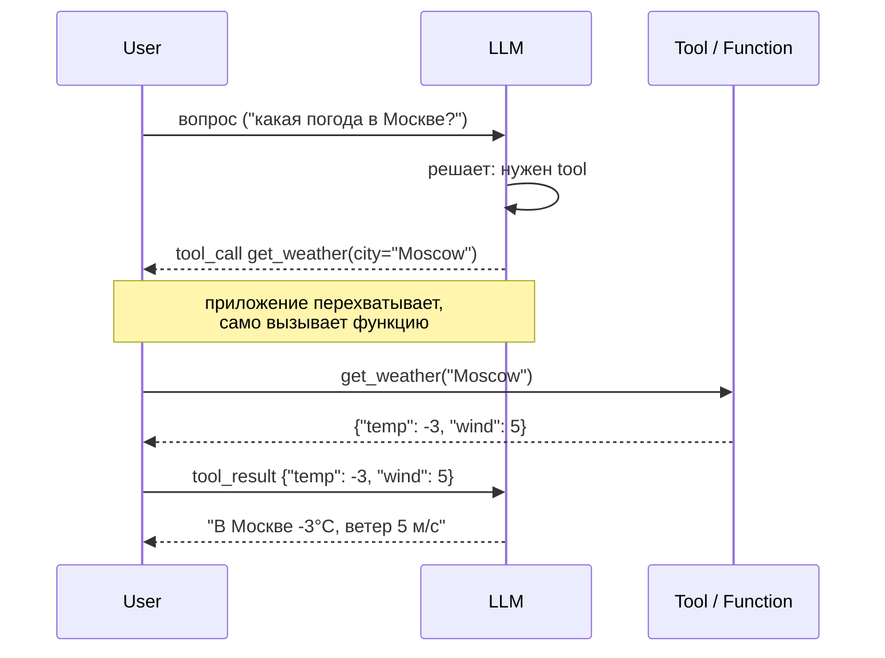
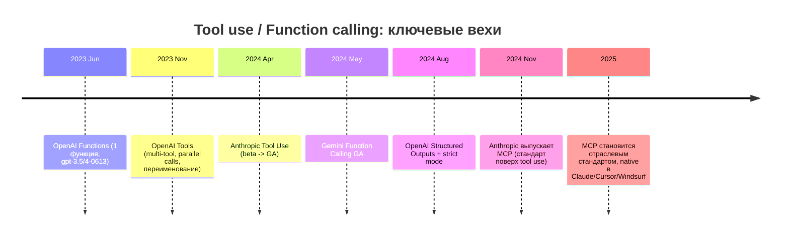
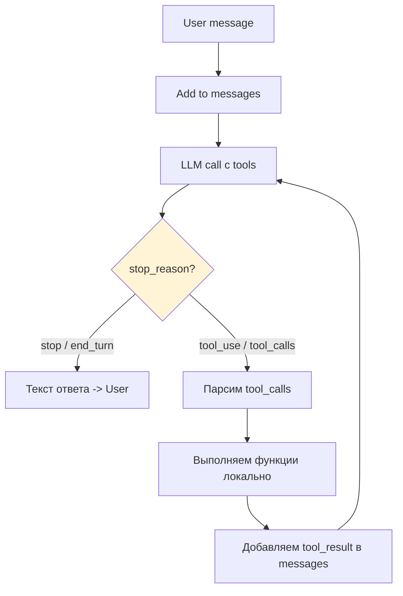
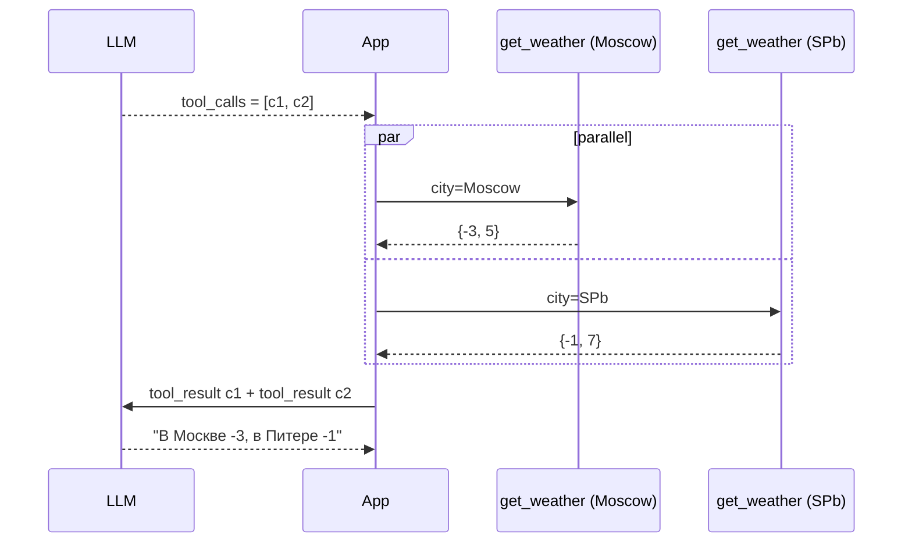
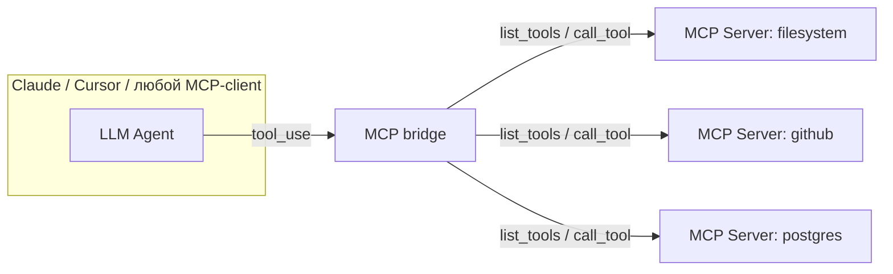

# Вопросы на собеседовании: `Function Calling / Tool Use`

**Function calling** (она же **tool use**) — способность LLM вместо обычного текстового ответа вернуть **structured JSON** с указанием «вызови такую-то функцию с такими-то аргументами». Появилось у OpenAI в июне 2023 (`functions`), переехало в `tools` в ноябре 2023 (multi-tool + parallel), Anthropic подключилась в 2024 (`tool_use`), Gemini — параллельно. С конца 2024 — стандартизация поверх через **MCP**. Это фундамент почти всех современных LLM-агентов, RAG-роутеров и structured-output пайплайнов.

## Полезные ссылки

### Официальная документация

- [OpenAI Function Calling Guide](https://platform.openai.com/docs/guides/function-calling)
- [OpenAI Structured Outputs](https://platform.openai.com/docs/guides/structured-outputs)
- [Anthropic Tool Use](https://docs.anthropic.com/en/docs/build-with-claude/tool-use)
- [Anthropic Tool Use & Prompt Caching](https://docs.anthropic.com/en/docs/build-with-claude/prompt-caching)
- [Gemini Function Calling](https://ai.google.dev/gemini-api/docs/function-calling)
- [Vercel AI SDK Tools](https://sdk.vercel.ai/docs/foundations/tools)
- [JSON Schema Specification](https://json-schema.org/)
- [Model Context Protocol](https://modelcontextprotocol.io/)

## Содержание

- [Полезные ссылки](#полезные-ссылки)
- [See also](#see-also)

**Основы**
- [Q1. (!) Что такое function calling / tool use?](#q1--что-такое-function-calling--tool-use)
- [Q2. (!) Чем function calling отличается от обычного prompt-engineering под JSON?](#q2--чем-function-calling-отличается-от-обычного-prompt-engineering-под-json)
- [Q3. Эволюция function calling в индустрии?](#q3-эволюция-function-calling-в-индустрии)
- [Q4. (!) Как выглядит multi-turn loop при tool use?](#q4--как-выглядит-multi-turn-loop-при-tool-use)

**OpenAI / Anthropic / Gemini API**
- [Q5. (!) OpenAI Tools API — структура запроса и ответа?](#q5--openai-tools-api--структура-запроса-и-ответа)
- [Q6. (!) Anthropic Tool Use API — структура?](#q6--anthropic-tool-use-api--структура)
- [Q7. Как устроен function calling в Gemini API?](#q7-как-устроен-function-calling-в-gemini-api)
- [Q8. (!) Сравнить OpenAI vs Anthropic vs Gemini API shape?](#q8--сравнить-openai-vs-anthropic-vs-gemini-api-shape)

**JSON Schema и Structured Output**
- [Q9. (!) Как описывается tool через JSON Schema?](#q9--как-описывается-tool-через-json-schema)
- [Q10. (!) Что такое Structured Output и чем отличается от JSON mode?](#q10--что-такое-structured-output-и-чем-отличается-от-json-mode)
- [Q11. Strict mode у OpenAI — что гарантирует?](#q11-strict-mode-у-openai--что-гарантирует)
- [Q12. Structured output без `response_format` (Anthropic-way)?](#q12-structured-output-без-response_format-anthropic-way)

**Parallel и tool_choice**
- [Q13. (!) Как работает параллельный вызов функций (parallel function calling)?](#q13--как-работает-параллельный-вызов-функций-parallel-function-calling)
- [Q14. (!) `tool_choice` — какие режимы и зачем?](#q14--tool_choice--какие-режимы-и-зачем)
- [Q15. Принудительный вызов tool (forced tool call) — как и когда?](#q15-принудительный-вызов-tool-forced-tool-call--как-и-когда)

**Frameworks (LangChain / LlamaIndex / Vercel AI)**
- [Q16. (!) LangChain `bind_tools()` — что под капотом?](#q16--langchain-bind_tools--что-под-капотом)
- [Q17. Что такое `FunctionTool` в LlamaIndex?](#q17-что-такое-functiontool-в-llamaindex)
- [Q18. Как работает `tool({parameters, execute})` в Vercel AI SDK?](#q18-как-работает-toolparameters-execute-в-vercel-ai-sdk)
- [Q19. Pydantic / Zod для tool schemas — зачем?](#q19-pydantic--zod-для-tool-schemas--зачем)

**MCP и Function Calling**
- [Q20. (!) Как MCP связан с function calling?](#q20--как-mcp-связан-с-function-calling)
- [Q21. Чем tools в OpenAI Assistants отличаются от raw function calling?](#q21-чем-tools-в-openai-assistants-отличаются-от-raw-function-calling)

**Production patterns и anti-patterns**
- [Q22. (!) Стоимость в токенах от tool definitions — как оптимизировать?](#q22--стоимость-в-токенах-от-tool-definitions--как-оптимизировать)
- [Q23. (!) Как сочетать prompt caching с tools в Anthropic?](#q23--как-сочетать-prompt-caching-с-tools-в-anthropic)
- [Q24. (!) Частые ошибки: выдуманные функции, неверные типы, потерянный tool_result?](#q24--частые-ошибки-выдуманные-функции-неверные-типы-потерянный-tool_result)
- [Q25. Дизайн tool definitions — описание, enum-ы, именование?](#q25-дизайн-tool-definitions--описание-enum-ы-именование)
- [Q26. (!) Error handling — что возвращать в `tool_result` при exception?](#q26--error-handling--что-возвращать-в-tool_result-при-exception)
- [Q27. Recursive tool calls — как защититься от infinite loop?](#q27-recursive-tool-calls--как-защититься-от-infinite-loop)
- [Q28. (!) Anti-patterns: слишком много tools, sensitive params, неконтролируемая стоимость?](#q28--anti-patterns-слишком-много-tools-sensitive-params-неконтролируемая-стоимость)
- [Q29. Production-чеклист: rate limit, timeout, аудит, RBAC?](#q29-production-чеклист-rate-limit-timeout-аудит-rbac)
- [Q30. Связывание tools с реальным кодом — dispatch в Python / Zod в TS?](#q30-связывание-tools-с-реальным-кодом--dispatch-в-python--zod-в-ts)

---

## Q1. (!) Что такое function calling / tool use?

**Function calling** — режим работы LLM, в котором модель вместо обычного текста возвращает **structured JSON** с описанием вызова функции: имя и аргументы. Сам вызов выполняет приложение — модель только **предлагает** что вызвать.

**Базовая идея цикла:**



**Ключевой момент:** LLM **не** исполняет код. Она только заполняет аргументы по JSON Schema и возвращает их клиенту — а реальный вызов, безопасность, retry, RBAC остаются на стороне приложения. Это и есть граница ответственности: модель решает «что и с чем вызвать», приложение решает «можно ли и как».

**Зачем это нужно** — function calling снимает три фундаментальных ограничения LLM:
- **Актуальные данные.** Модель знает мир только до cutoff; tool даёт ей доступ к свежим данным (курс валют, статус заказа).
- **Действия во внешнем мире.** Текст ничего не меняет; tool позволяет создать запись в БД, отправить письмо, дёрнуть API.
- **Структурированный вывод.** Даже без внешней функции tool-схема — удобный способ заставить модель ответить строго по формату (см. Q12).

## Q2. (!) Чем function calling отличается от обычного prompt-engineering под JSON?

Коротко: prompt-инжиниринг **просит** модель вернуть JSON, а function calling / Structured Output **гарантирует** его на уровне декодера. Это разница между «надеюсь» и «не может быть иначе».

| Подход | Гарантии | Стоимость | Когда |
|---|---|---|---|
| `"Ответь JSON: {...}"` в prompt | никаких — модель может уйти в текст или сломать схему | 0 | прототип, дёшево |
| JSON mode (`response_format: json_object`) | валидный JSON-синтаксис, но **схему не гарантирует** | низкая | схема простая или валидируете сами |
| Function calling / Structured Output | **JSON строго по schema** (constrained decoding) | tool definitions добавляют токены к prompt | продакшен, где формат критичен |

**Почему гарантия вообще возможна.** У OpenAI/Anthropic structured output работает через **constrained decoding**: на каждом шаге генерации сэмплер физически отсекает токены, которые увели бы JSON за пределы схемы. Модель не «старается» соблюсти формат — она просто не может его нарушить. Отсюда и главный практический выигрыш: не нужны retry на «модель вернула HTML вместо JSON».

**Сценарий:** извлечь `{name, email, phone}` из письма. Через голый prompt — 5-10% брака (сломанный JSON, лишний текст вокруг). Через structured output / function — практически 0%.

## Q3. Эволюция function calling в индустрии?



Главная мысль: за два года индустрия прошла путь от «одна функция у одного провайдера» до общего стандарта (MCP), и сегодня сосуществуют три «уровня» абстракции — чем выше, тем переносимее:
1. **Raw function calling** провайдера — OpenAI Tools, Anthropic `tool_use`, Gemini `function_declarations`. Максимум контроля, но код привязан к API конкретного вендора.
2. **Framework abstractions** — LangChain `bind_tools`, LlamaIndex `FunctionTool`, Vercel AI `tool()`. Прячут различия провайдеров за единым интерфейсом.
3. **MCP** — переносимое описание tools, которое любой клиент-агент подключает как плагин, не зная деталей провайдера.

## Q4. (!) Как выглядит multi-turn loop при tool use?

Tool use — это не «один запрос — один ответ», а **цикл**: приложение крутит обращения к LLM до тех пор, пока модель не перестанет просить tools и не вернёт финальный текст. Каждая итерация добавляет результат вызова обратно в историю сообщений, чтобы на следующем шаге модель видела, что вернула функция.



Псевдокод цикла:

```python
messages = [{"role": "user", "content": user_q}]
while True:
    resp = client.chat.completions.create(model=..., tools=tools, messages=messages)
    msg = resp.choices[0].message
    messages.append(msg)
    if not msg.tool_calls:
        return msg.content                       # финальный ответ
    for call in msg.tool_calls:
        result = dispatch(call.function.name, json.loads(call.function.arguments))
        messages.append({
            "role": "tool",
            "tool_call_id": call.id,
            "content": json.dumps(result),
        })
```

Ключевые инварианты цикла: сообщение ассистента (с `tool_calls`) кладётся в историю **до** результата, каждому вызову обязан соответствовать `tool_result` с тем же id, и обязателен **лимит итераций** (см. Q27) — иначе модель может зациклиться на повторных вызовах.

## Q5. (!) OpenAI Tools API — структура запроса и ответа?

У OpenAI tools передаются массивом объектов `{type: "function", function: {...}}`, а ответ модели с вызовом приходит в `message.tool_calls` при `finish_reason: "tool_calls"`. Главная особенность, на которой спотыкаются — **аргументы приходят строкой**, а не объектом.

**Запрос:**

```python
tools = [{
    "type": "function",
    "function": {
        "name": "get_weather",
        "description": "Returns current weather for a city.",
        "parameters": {
            "type": "object",
            "properties": {
                "city": {"type": "string", "description": "City name in English"},
                "units": {"type": "string", "enum": ["metric", "imperial"]}
            },
            "required": ["city"],
            "additionalProperties": False
        },
        "strict": True
    }
}]

resp = client.chat.completions.create(
    model="gpt-4o",
    messages=[{"role": "user", "content": "Погода в Москве?"}],
    tools=tools,
    tool_choice="auto",          # auto | none | required | {type, function}
    parallel_tool_calls=True
)
```

**Ответ (когда LLM решает вызвать tool):**

```json
{
  "choices": [{
    "finish_reason": "tool_calls",
    "message": {
      "role": "assistant",
      "content": null,
      "tool_calls": [{
        "id": "call_abc123",
        "type": "function",
        "function": {
          "name": "get_weather",
          "arguments": "{\"city\":\"Moscow\",\"units\":\"metric\"}"
        }
      }]
    }
  }]
}
```

**Reply от приложения** добавляется в `messages` как:

```python
{"role": "tool", "tool_call_id": "call_abc123", "content": "{\"temp\": -3}"}
```

Два момента, которые надо запомнить: `arguments` всегда **строка JSON** (нужен `json.loads`), а при `strict: True` OpenAI гарантирует соответствие аргументов схеме через constrained decoding.

## Q6. (!) Anthropic Tool Use API — структура?

У Anthropic нет отдельного API для tools — всё живёт в едином messages-API, где `tool_use` и `tool_result` — это обычные content-блоки внутри сообщений. Из-за этого форма заметно отличается от OpenAI: схема в `input_schema`, аргументы приходят сразу dict-ом, а результат возвращается в сообщении с `role: "user"`.

**Запрос:**

```python
tools = [{
    "name": "get_weather",
    "description": "Returns current weather for a city.",
    "input_schema": {                                # не "parameters"!
        "type": "object",
        "properties": {
            "city": {"type": "string"},
            "units": {"type": "string", "enum": ["metric", "imperial"]}
        },
        "required": ["city"]
    }
}]

resp = client.messages.create(
    model="claude-opus-4-7",
    max_tokens=1024,
    tools=tools,
    tool_choice={"type": "auto"},
    messages=[{"role": "user", "content": "Погода в Москве?"}]
)
```

**Ответ (stop_reason = `tool_use`):**

```json
{
  "stop_reason": "tool_use",
  "content": [
    {"type": "text", "text": "Сейчас уточню."},
    {"type": "tool_use", "id": "toolu_01abc",
     "name": "get_weather",
     "input": {"city": "Moscow", "units": "metric"}}
  ]
}
```

**Reply:**

```python
messages.append({"role": "assistant", "content": resp.content})
messages.append({
    "role": "user",
    "content": [{
        "type": "tool_result",
        "tool_use_id": "toolu_01abc",
        "content": json.dumps({"temp": -3})
    }]
})
```

**Отличия от OpenAI:**
- `input_schema` вместо `parameters`.
- `input` уже **dict** (не string).
- `tool_result` идёт в `role: "user"` как content-блок, а не в отдельном `role: "tool"`.
- `stop_reason: "tool_use"` вместо `finish_reason: "tool_calls"`.

## Q7. Как устроен function calling в Gemini API?

Gemini идейно ближе к OpenAI (схема в `parameters`, аргументы dict-ом), но имена и вложенность другие: tools оборачиваются в `function_declarations`, а вызовы/ответы ходят как `parts`.

```python
from google import genai
from google.genai import types

weather_func = types.FunctionDeclaration(
    name="get_weather",
    description="Returns current weather for a city.",
    parameters={
        "type": "object",
        "properties": {
            "city": {"type": "string"},
            "units": {"type": "string", "enum": ["metric", "imperial"]}
        },
        "required": ["city"]
    }
)

tools = types.Tool(function_declarations=[weather_func])

resp = client.models.generate_content(
    model="gemini-2.0-flash",
    contents="Погода в Москве?",
    config=types.GenerateContentConfig(tools=[tools])
)

for part in resp.candidates[0].content.parts:
    if fc := part.function_call:
        result = dispatch(fc.name, dict(fc.args))
        # ... send back as function_response part
```

**Особенности:**
- `tools: [{function_declarations: [...]}]` — два уровня вложенности.
- `function_call` / `function_response` как `parts`.
- В Python SDK есть **automatic function calling**: передаёшь Python-функцию напрямую, SDK сам делает loop.

## Q8. (!) Сравнить OpenAI vs Anthropic vs Gemini API shape?

Идея у всех трёх одинаковая (опиши tool схемой → модель вернёт вызов → верни результат), но «форма» — имена полей, тип аргументов, способ ответа — у каждого своя. Таблица фиксирует различия по строкам:

| Аспект | OpenAI | Anthropic | Gemini |
|---|---|---|---|
| Поле schema | `function.parameters` | `input_schema` | `parameters` |
| Список tools | `tools: [{type: "function", function: {...}}]` | `tools: [{name, description, input_schema}]` | `tools: [{function_declarations: [...]}]` |
| Аргументы в ответе | **string** (`arguments`) — нужен `json.loads` | **dict** (`input`) | **dict** (`args`) |
| Reply role | `role: "tool"` + `tool_call_id` | `role: "user"` + content `tool_result` | `function_response` part |
| Parallel calls | Да (`parallel_tool_calls: true`) | Да (несколько `tool_use` блоков) | Да |
| Forced tool | `tool_choice: {type: "function", function: {name}}` | `tool_choice: {type: "tool", name}` | `tool_config: {mode: "ANY"/"NONE"/"AUTO"}` |
| Strict schema | `strict: true` (constrained decoding) | через `tool_choice` + структуру | через `response_schema` |
| Structured output | `response_format: {type: "json_schema"}` | через single-tool trick | `response_schema` параметр |
| Prompt caching | через `cached_tokens` (auto) | явный `cache_control` (включая tools) | контекстное кэширование |
| Streaming | да, `tool_calls` приходят по частям | да, через `content_block_delta` | да |

Главный практический вывод: **аргументы у OpenAI — строка** (нужен `json.loads`), у Anthropic и Gemini — уже dict. Это самый частый баг при переносе кода между провайдерами: один и тот же `args` где-то парсится, а где-то падает с `TypeError`.

## Q9. (!) Как описывается tool через JSON Schema?

Tool описывается JSON Schema объекта-аргументов: минимум — `type: "object"` + `properties` + `required`. По сути это контракт, который читает и модель (чтобы понять, что писать в поля), и ваш код (чтобы валидировать пришедшее).

```json
{
  "type": "object",
  "properties": {
    "order_id": {
      "type": "string",
      "description": "Order UUID, format 8-4-4-4-12"
    },
    "reason": {
      "type": "string",
      "enum": ["damaged", "wrong_item", "no_longer_needed"],
      "description": "Refund reason category"
    },
    "amount": {
      "type": "number",
      "minimum": 0,
      "description": "Refund amount in EUR"
    },
    "partial": {
      "type": "boolean",
      "default": false
    }
  },
  "required": ["order_id", "reason"],
  "additionalProperties": false
}
```

**Что использовать активно** (каждый элемент напрямую улучшает попадание модели в формат):
- `enum` — закрытый список значений вместо free-form string. Мимо enum LLM почти никогда не промахивается — это самый дешёвый способ убрать «фантазийные» значения.
- `description` на **каждом** property — модель читает их, чтобы понять, что туда писать. Пустые описания = угадывание.
- `required` — отделяет обязательные поля от опциональных. У OpenAI с `strict: true` **все** properties должны быть в `required`, а опциональность выражается через nullable: `["string", "null"]`.
- `additionalProperties: false` — запрещает лишние поля. Сильно стабилизирует strict mode.
- `oneOf` / `anyOf` — для variant-типов (но не все провайдеры поддерживают полностью).
- `minimum/maximum`, `minLength/maxLength`, `pattern` — базовая валидация прямо в схеме.

**Подводные камни:** `$ref`, рекурсивные schemas, циклические зависимости работают плохо или вовсе запрещены — у OpenAI strict mode часть из этого блокирует явно. Если схема сложная и ссылочная, разворачивайте её в плоскую.

## Q10. (!) Что такое Structured Output и чем отличается от JSON mode?

Коротко: **JSON mode** гарантирует только *валидный синтаксис* JSON, а **Structured Output** — ещё и *соответствие вашей схеме*. Это разные уровни строгости одного и того же запроса «дай мне JSON».

Три уровня по нарастанию гарантий:

| Режим | Что гарантирует | Как |
|---|---|---|
| Plain prompt | ничего, модель может сломаться | «Ответь JSON» в системе |
| JSON mode | валидный JSON синтаксис | `response_format: {type: "json_object"}` |
| Structured Output | валидный JSON **по схеме** | `response_format: {type: "json_schema", json_schema: {...}}` |

OpenAI пример:

```python
resp = client.chat.completions.create(
    model="gpt-4o-2024-08-06",
    messages=[{"role": "user", "content": "Извлеки данные клиента из письма: ..."}],
    response_format={
        "type": "json_schema",
        "json_schema": {
            "name": "customer",
            "strict": True,
            "schema": {
                "type": "object",
                "properties": {
                    "name": {"type": "string"},
                    "email": {"type": "string"},
                    "phone": {"type": ["string", "null"]}
                },
                "required": ["name", "email", "phone"],
                "additionalProperties": False
            }
        }
    }
)
data = json.loads(resp.choices[0].message.content)
```

Разница на примере: в **JSON mode** модель «обещает валидный JSON», но может вернуть `{"answer": "..."}`, хотя вы ждали `{"name", "email"}` — синтаксис верный, схема нет. **Structured Output** работает через **constrained decoding**: сэмплер физически не может выйти за рамки schema, поэтому отдаёт ровно те ключи и типы, что описаны.

## Q11. Strict mode у OpenAI — что гарантирует?

`strict: true` (в tool definition или в `json_schema`) включает **constrained decoding на грамматике, скомпилированной из вашей JSON Schema** — то есть жёсткое следование схеме на уровне декодера, а не «по доброй воле модели».

**Что гарантирует:**
- Все обязательные ключи присутствуют.
- Типы и enums соблюдены.
- Нет лишних полей, если `additionalProperties: false`.
- При отказе модель кладёт причину в отдельное поле `refusal`, а не возвращает мусорный JSON — отказ становится обрабатываемым явно.

**Ограничения** (цена за гарантию):
- Schema должна быть **полной** — все properties в `required`. Опциональность выражается через nullable: `{"type": ["string", "null"]}`.
- Запрещены `oneOf` на root, `$ref` к самому себе, некоторые формы рекурсии.
- Первый запрос с новой схемой может быть медленнее — идёт компиляция грамматики (потом кэшируется).

Без `strict` модель **обычно** соблюдает schema, но не всегда — особенно на граничных случаях, где как раз и всплывают баги.

## Q12. Structured output без `response_format` (Anthropic-way)?

У Anthropic нет отдельного `response_format: json_schema`, но тот же результат достигается трюком — **одиночный обязательный tool**. Описываете один tool со схемой нужного ответа и форсите его через `tool_choice`, и модель обязана заполнить именно его аргументы — это и есть ваш структурированный JSON.

```python
extract_tool = {
    "name": "extract_customer",
    "description": "Extract customer info from the email.",
    "input_schema": {
        "type": "object",
        "properties": {
            "name": {"type": "string"},
            "email": {"type": "string"}
        },
        "required": ["name", "email"]
    }
}

resp = client.messages.create(
    model="claude-opus-4-7",
    tools=[extract_tool],
    tool_choice={"type": "tool", "name": "extract_customer"},  # форсим вызов
    messages=[{"role": "user", "content": email_text}],
    max_tokens=512
)

data = resp.content[0].input        # уже dict, готовый JSON
```

Здесь `tool_choice: {type: "tool", name: ...}` заставляет модель обязательно вызвать именно этот tool, а `resp.content[0].input` сразу dict с готовым JSON по схеме — структурированный output без отдельного API.

## Q13. (!) Как работает параллельный вызов функций (parallel function calling)?

Parallel function calling — это когда LLM в **одном** ответе возвращает **несколько** `tool_calls` сразу, потому что увидела, что данные независимы и их можно собрать параллельно. Выигрыш реализуется только если приложение действительно выполнит эти вызовы одновременно.

Пример: «Какая погода в Москве и СПб?» — два независимых запроса, модель просит оба разом.

```json
{
  "tool_calls": [
    {"id": "c1", "function": {"name": "get_weather", "arguments": "{\"city\":\"Moscow\"}"}},
    {"id": "c2", "function": {"name": "get_weather", "arguments": "{\"city\":\"SPb\"}"}}
  ]
}
```



**Что важно на практике:**
- Вернуть **все** `tool_result` за один следующий вызов, сопоставив их с id-шниками вызовов. Пропустишь один — API ругнётся.
- Запускать функции **параллельно** (`asyncio.gather`, `ThreadPoolExecutor`) — иначе смысл теряется, latency останется суммой.
- У OpenAI параллельность можно выключить через `parallel_tool_calls: false` — иногда так предсказуемее для агентов (по одному вызову за шаг).
- У Anthropic параллельность работает из коробки: модель просто кладёт несколько `tool_use`-блоков в один ответ.

## Q14. (!) `tool_choice` — какие режимы и зачем?

`tool_choice` управляет тем, **должна** ли модель вообще вызывать tools и какие. Это рычаг против главной проблемы режима `auto`: иногда модель отвечает текстом «не знаю» там, где обязана была вызвать tool.

| Режим | OpenAI | Anthropic | Когда |
|---|---|---|---|
| LLM сама решает | `"auto"` (default) | `{"type": "auto"}` (default) | большинство кейсов |
| Никогда не вызывать | `"none"` | `{"type": "none"}` (через отсутствие tools или явно) | финальный ответ пользователю, summarization |
| Обязательно вызвать **что-то** | `"required"` | `{"type": "any"}` | structured pipeline, где tool обязателен |
| Обязательно конкретный tool | `{"type": "function", "function": {"name": "X"}}` | `{"type": "tool", "name": "X"}` | structured output через tool (см. Q12), форс-роутинг |

Краткая шкала жёсткости: `auto` — модель сама (90% кейсов); `required`/`any` — гарантирует хотя бы один вызов; конкретный tool — гарантирует и вызов, и его JSON по схеме (отсюда трюк из Q12).

## Q15. Принудительный вызов tool (forced tool call) — как и когда?

Forced tool call (`tool_choice: required` или конкретный tool) применяют, когда вызов tool — не опция, а часть контракта пайплайна:
- **Structured extraction** — единственный обязательный tool как способ получить JSON (Q12).
- **Router** — первый шаг агента всегда обязан выбрать категорию задачи (`tool_choice: required`).
- **Тестирование** конкретного tool, когда не хочется зависеть от «захочет ли модель».

**Подводный камень:** если форсить tool, у которого все аргументы опциональны и есть `enum`, модель заполнит поля «лишь бы что-то» — выберет случайный enum-вариант. Поэтому форсить осмысленно только tools, где модель видит достаточно контекста, чтобы заполнить аргументы по делу.

## Q16. (!) LangChain `bind_tools()` — что под капотом?

`bind_tools([...])` превращает обычные Python-функции в tool-определения и подключает их к LLM, скрывая различия провайдеров. По сути это автоматическая генерация JSON Schema из сигнатуры функции плюс нормализация ответа в единый формат.

```python
from langchain_openai import ChatOpenAI
from langchain_core.tools import tool

@tool
def get_weather(city: str, units: str = "metric") -> str:
    """Returns current weather for a city."""
    return f"{-3 if city == 'Moscow' else 0}°C"

llm = ChatOpenAI(model="gpt-4o").bind_tools([get_weather])
resp = llm.invoke("Погода в Москве?")
# resp.tool_calls — уже распарсенный список
```

Что делает `bind_tools` по шагам:
1. Берёт **docstring** функции как `description` — поэтому docstring перестаёт быть «для людей» и читается моделью.
2. Берёт **type hints + Pydantic** и генерирует из них `parameters` (JSON Schema).
3. Подставляет правильный shape под провайдера (OpenAI / Anthropic / Gemini абстрагированы за одним интерфейсом).
4. Парсит ответ в единый формат `tool_calls: [{name, args, id}]` — независимо от того, что вернул вендор.

Сам цикл вызовов `bind_tools` не делает — его дают `ToolNode` (LangGraph), `AgentExecutor` или новый `create_react_agent`, либо вы пишете ручной dispatch.

## Q17. Что такое `FunctionTool` в LlamaIndex?

`FunctionTool` — стандартный примитив LlamaIndex для оборачивания функции в tool: как и `bind_tools`, он автоматически собирает схему из сигнатуры (или принимает явную Pydantic-модель) и отдаёт tool агенту.

```python
from llama_index.core.tools import FunctionTool
from llama_index.llms.openai import OpenAI
from llama_index.core.agent import ReActAgent

def get_weather(city: str) -> str:
    """Returns current weather for a city."""
    return "..."

tool = FunctionTool.from_defaults(fn=get_weather)
agent = ReActAgent.from_tools([tool], llm=OpenAI(model="gpt-4o"))
print(agent.chat("Погода в Москве?"))
```

LlamaIndex сильнее заточен под RAG, поэтому tools здесь часто соседствуют с retrieval-движком. `FunctionTool` поддерживает sync/async и встраивается в готовых агентов вроде `ReActAgent`, который сам крутит loop.

## Q18. Как работает `tool({parameters, execute})` в Vercel AI SDK?

Vercel AI SDK — TypeScript-первый подход, где ключевое отличие в том, что **`execute` живёт внутри самого tool**, и SDK сам гоняет multi-turn loop. То есть вы не пишете dispatch вручную — описали схему и функцию исполнения, дальше `generateText` сам вызывает и подставляет результаты.

```typescript
import { tool, generateText } from "ai";
import { openai } from "@ai-sdk/openai";
import { z } from "zod";

const result = await generateText({
  model: openai("gpt-4o"),
  tools: {
    getWeather: tool({
      description: "Returns current weather for a city.",
      parameters: z.object({
        city: z.string().describe("City name in English"),
        units: z.enum(["metric", "imperial"]).default("metric"),
      }),
      execute: async ({ city, units }) => {
        const r = await fetch(`https://api.weather/?q=${city}&u=${units}`);
        return await r.json();
      },
    }),
  },
  maxSteps: 5,                      // защита от infinite loop
  prompt: "Погода в Москве?",
});
```

**Плюсы:** Zod вместо raw JSON Schema даёт type-safety и IDE-автодополнение прямо на аргументах `({city, units})`, а защита от зацикливания (`maxSteps`) встроена. **Минусы:** идиоматичнее всего работает в Vercel-стеке (хотя сам SDK запускается где угодно).

## Q19. Pydantic / Zod для tool schemas — зачем?

Чтобы не писать JSON Schema руками и не держать два расходящихся источника правды (типы в коде vs схема для LLM). Pydantic/Zod описывают аргументы один раз — и из этого описания автоматически выводятся и схема для модели, и runtime-валидация, и типы.

```python
from pydantic import BaseModel, Field
from typing import Literal

class GetWeatherArgs(BaseModel):
    city: str = Field(..., description="City name in English")
    units: Literal["metric", "imperial"] = "metric"

schema = GetWeatherArgs.model_json_schema()
# {'type': 'object', 'properties': {...}, 'required': [...]}
```

**Что это даёт** (одно описание → три эффекта):
- **Type-safety**: после `GetWeatherArgs(**args)` поля уже типизированы, IDE подсказывает.
- **Валидация**: `ValidationError` ловит мусор от LLM до того, как он дойдёт до бизнес-логики.
- **Единый источник правды**: схема генерируется из типов, поэтому не может разъехаться с кодом.

Zod в TypeScript устроен так же: `z.object(...)` → JSON Schema + runtime-проверка + статические типы из одного объявления.

## Q20. (!) Как MCP связан с function calling?

**MCP (Model Context Protocol)** — стандарт от Anthropic (Nov 2024) для **переносимого описания tools / resources / prompts**. Function calling — это **транспорт внутри одной LLM-сессии**. MCP — это **протокол между клиентом-агентом и любым MCP-сервером**.



Поток показывает, как одно стыкуется с другим:
1. Host подключается к MCP-серверам и получает их `list_tools`.
2. Эти tools конвертируются в формат function calling конкретного провайдера (OpenAI/Anthropic/...).
3. Когда LLM вернула `tool_use`, host через MCP вызывает `tools/call` на нужном сервере.
4. Результат заворачивается обратно в `tool_result` и уходит модели.

Итог: function calling — это **LLM-side контракт** (как модель просит вызов), MCP — **app-side универсальный коннектор** (откуда берутся tools). Поэтому один MCP-сервер сразу работает в Claude Desktop, Cursor, Windsurf и OpenAI Agents SDK — каждый из них умеет конвертировать `list_tools` в свой нативный function calling.

## Q21. Чем tools в OpenAI Assistants отличаются от raw function calling?

Ключевое отличие: в raw function calling код исполняете **вы**, а Assistants API (2023) даёт **server-side built-in tools**, которые OpenAI исполняет на своей стороне (плюс хранит thread state). Это удобнее на старте, но ценой vendor lock-in и меньшего контроля.

| Tool | Описание | Аналог у Anthropic |
|---|---|---|
| `code_interpreter` | Песочница с Python, OpenAI сама исполняет код | нет (нужно поднимать самим) |
| `file_search` (retrieval) | Встроенный RAG поверх загруженных файлов | нет, делайте на эмбеддингах |
| `function` | Обычное function calling, ваш код | `tool_use` |

**Компромисс.** Плюс — Assistants держит thread state у OpenAI, не надо тащить историю самому. Минусы — vendor lock-in, ограниченный контроль, цена выше. С появлением **Responses API** и **Agents SDK** (2025) OpenAI движется к более явным контрактам, но идея «server-side tools, которые провайдер исполняет за вас» сохранилась.

У Anthropic своих server-side tools меньше: computer use, web search, code execution есть, но все они — явные tools, которыми управляет клиент. То есть Anthropic тяготеет к «вы контролируете исполнение», а OpenAI Assistants — к «провайдер исполняет за вас».

## Q22. (!) Стоимость в токенах от tool definitions — как оптимизировать?

Корень проблемы: tool definitions **подмешиваются в каждый запрос** как системный контекст, а в multi-turn loop запросов много — поэтому цена платится не один раз, а на каждой итерации. Большой набор tools легко съедает 2-5k токенов на запрос.

**Что делать** (от самого дешёвого к структурному):
- **Сократить descriptions**: кратко, но информативно. Выкинуть «This function is used to...», оставить «Returns ...».
- **Не передавать все tools сразу** — фильтровать по контексту: router-агент сначала определяет категорию задачи, и только тогда подгружаются релевантные tools.
- **Кэшировать** tool definitions, чтобы повторный префикс шёл по сниженной цене:
  - OpenAI — автоматически, если префикс повторяется и он ≥1024 токенов.
  - Anthropic — явный `cache_control` (см. Q23).
- **Удалить мёртвые tools** — часто 3-4 неиспользуемые функции с длинными описаниями тихо висят в каждом запросе.
- **Считать токены**: `tiktoken` для OpenAI, у Anthropic — поле `usage` в ответе.

**Эмпирическая оценка:** простой tool (5 properties + `enum`) — около 100-200 токенов; 30 tools — это 3-6k токенов **на каждый** запрос цикла. Отсюда видно, почему фильтрация и кэш дают кратную экономию именно на агентах.

## Q23. (!) Как сочетать prompt caching с tools в Anthropic?

Anthropic позволяет явно пометить tool definitions и system prompt для кэширования, и в multi-turn loop это окупается почти сразу. Кэш живёт 5 минут (или 1 час с extended caching), и повторные запросы в этом окне берут **cached tokens по цене 10%** от обычных input-токенов — то есть неизменный префикс из tools и system перестаёт стоить почти ничего.

```python
resp = client.messages.create(
    model="claude-opus-4-7",
    system=[
        {"type": "text", "text": "Вы — ассистент компании ACME...",
         "cache_control": {"type": "ephemeral"}}
    ],
    tools=[
        {"name": "get_weather", "description": "...",
         "input_schema": {...},
         "cache_control": {"type": "ephemeral"}}        # последний tool в массиве
    ],
    messages=[...]
)
```

**Правило:** `cache_control` ставится на **последний элемент** блока, который должен попасть в кэш. Кэш строится **префиксом** — кэшируется всё до отмеченного элемента включительно. Поэтому метка вешается на последний tool в массиве, а не на каждый.

**Экономия:** в цикле агента из 10 шагов, где tools и system неизменны, выигрыш на input-токенах — от 5x до 10x по сравнению с теми же итерациями без кэша.

## Q24. (!) Частые ошибки: выдуманные функции, неверные типы, потерянный tool_result?

Большинство багов function calling сводятся к трём классам: модель **придумала** вызов (не тот name/type), приложение **сломало контракт истории** (нет `tool_result` или не тот id), или код **не учёл различия провайдеров** (string vs dict). Таблица — карта симптом → лечение:

| Проблема | Симптом | Лечение |
|---|---|---|
| **Hallucinated function name** | LLM вызывает `getWeather` вместо `get_weather` | `strict: true`, проверка по белому списку, прозрачные имена + description |
| **Wrong arg types** | `{"amount": "100"}` вместо `100` | `strict: true`, ручная валидация Pydantic/Zod, retry с ошибкой |
| **Missing tool_result** | повторный запрос без результата → LLM начинает галлюцинировать или ругается на API | API-валидация: для каждого `tool_use` обязан быть `tool_result` с тем же id |
| **Не тот id `tool_use_id`** | API ошибка `tool_use_id not found` | копировать id 1-в-1, не генерировать новые |
| **JSON в content вместо tool_call** | модель «забыла» про tools и просто описала действие текстом | force `tool_choice: required` или улучшить prompt |
| **Argument string vs dict** | TypeError в коде после миграции с Anthropic на OpenAI | помнить: OpenAI — string, Anthropic — dict |
| **Поля null vs missing** | `email = None` падает в downstream | в strict mode объявлять nullable: `["string", "null"]` |
| **enum case-sensitive** | LLM возвращает `"Damaged"` вместо `"damaged"` | строгий `enum`, normalize на стороне приложения |

## Q25. Дизайн tool definitions — описание, enum-ы, именование?

Хороший tool — это маленькая документация, которую читает LLM: по имени и описанию модель решает, вызывать ли его и что класть в аргументы. Поэтому качество описания напрямую определяет точность вызовов — сравните два варианта ниже.

**Хорошо:**

```json
{
  "name": "refund_order",
  "description": "Issues a refund for a delivered order. Use when customer explicitly asks for a refund and order status is DELIVERED. Do NOT use for cancellations of pending orders — use cancel_order instead.",
  "parameters": {
    "type": "object",
    "properties": {
      "order_id": {"type": "string", "description": "UUID of the order"},
      "reason": {"type": "string", "enum": ["damaged", "wrong_item", "expired"], "description": "Refund category. Use damaged for visible defects."}
    },
    "required": ["order_id", "reason"]
  }
}
```

**Плохо:**

```json
{
  "name": "refund",
  "description": "Refund.",
  "parameters": {
    "type": "object",
    "properties": {
      "id": {"type": "string"},
      "type": {"type": "string"}
    }
  }
}
```

**Правила дизайна:**
- Имя в `snake_case`, формат «глагол + объект»: `get_weather`, `create_invoice` — модель угадывает смысл уже по имени.
- В description — **когда использовать**, **когда НЕ использовать**, граничные случаи. Именно «когда НЕ использовать» спасает от путаницы между похожими tools (refund vs cancel).
- Описание у каждого property, желательно с примером значения.
- `enum` вместо free-form там, где список значений конечен.
- Не больше 5-7 параметров на tool — иначе дробить на несколько узких tools.

## Q26. (!) Error handling — что возвращать в `tool_result` при exception?

Главный принцип: ошибку надо **вернуть модели как обычный `tool_result`**, а не выбрасывать exception и рвать loop. Модель часто умеет с ней справиться сама — попробовать другой tool, переформулировать аргументы или спросить пользователя — но только если она эту ошибку увидит. Формат — короткий структурированный объект (`{error, message}`), а не stack trace.

```python
try:
    result = call_external_api(args)
    content = json.dumps(result)
    is_error = False
except ApiNotFound as e:
    content = json.dumps({"error": "not_found", "message": str(e)})
    is_error = True
except RateLimitError:
    content = json.dumps({"error": "rate_limited", "retry_after": 5})
    is_error = True
```

OpenAI:

```python
{"role": "tool", "tool_call_id": "...", "content": content}
```

Anthropic — поддерживает явный флаг:

```python
{"type": "tool_result", "tool_use_id": "...",
 "content": content, "is_error": True}
```

**Чего не делать:**
- Кидать exception дальше и обрывать loop — LLM не узнает, что произошло, и не сможет восстановиться.
- Возвращать stack trace целиком — это мусор в контексте и утечка путей/секретов наружу.
- Возвращать `null` — модель примет это за «всё ок» и продолжит, как будто данные есть.

## Q27. Recursive tool calls — как защититься от infinite loop?

Проблема: модель зацикливается — после каждого `tool_result` снова просит тот же tool и не приходит к финальному ответу. Типичные причины: размытый prompt, противоречивый результат tool-а или его баг. Без явных ограничителей такой loop крутится, пока не упрётся в лимиты API или счёт.

**Защита** — несколько независимых предохранителей, ставить лучше сразу несколько:
- **max_iterations** на цикл (типично 5-15):
  ```python
  for step in range(MAX_STEPS):
      resp = call_llm(...)
      if not resp.tool_calls:
          break
      # ... dispatch
  else:
      raise AgentLoopExceeded()
  ```
- **Detect repeating calls**: хэшировать `(tool_name, arguments)`; если повтор 2+ раза подряд — прервать или подсказать модели «уже пробовал, попробуй другое».
- **Wall-clock timeout** на весь цикл — страховка на случай, если итераций мало, но каждая зависает.
- **Token budget**: если суммарный `usage` превысил лимит — abort (бьёт по стоимости напрямую).
- **Reflection-step**: после N шагов вставлять в контекст «осталось K итераций, сформулируй финальный ответ» — мягко выталкивает модель из цикла.

Готовые механизмы: LangChain/LangGraph дают `recursion_limit`, Vercel AI — `maxSteps`. В самописных циклах ограничение **всегда** ставится явно — по умолчанию его нет.

## Q28. (!) Anti-patterns: слишком много tools, sensitive params, неконтролируемая стоимость?

Анти-паттерны function calling бьют по трём осям: **точность** (модель путается, когда tools много или один «делает всё»), **безопасность** (секреты в args, destructive-вызовы без подтверждения) и **стоимость** (бесконтрольный loop). Таблица — что именно ломается и чем лечить:

| Anti-pattern | Почему плохо | Что делать |
|---|---|---|
| **>30 tools одновременно** | LLM путается, выбирает не то, токены растут линейно | router-агент или namespace по контексту; динамическая фильтрация |
| **Sensitive params в args** (`api_key`, `password`) | попадают в логи, MLOps tracing, потенциально в training | хранить secrets server-side, в tool args — только `account_id` |
| **Tool без идемпотентности** | retry создаёт дубликаты заказов | `idempotency_key` в схеме, dedupe на стороне tool |
| **Tools, изменяющие prod без подтверждения** | hallucination = удалённая БД | для destructive — confirmation step, RBAC, dry-run |
| **Возврат гигантских JSON** в tool_result | контекст забивается, дорого | summary + опциональный `details_url` |
| **Динамические descriptions** | кэш не работает | держать tools detection статическим |
| **Один tool на всё** (`do_anything(query)`) | теряется JSON Schema-валидация, LLM придумывает что угодно | дробить на маленькие tools с чёткой ответственностью |
| **Бесконтрольная цена** | агент в loop = десятки $ за сессию | hard token-budget, max_iterations, alerting |

## Q29. Production-чеклист: rate limit, timeout, аудит, RBAC?

Tool-runtime в проде — это, по сути, шлюз, через который LLM дёргает ваш реальный код, поэтому к нему применимы те же требования, что к публичному API: лимиты, таймауты, права, аудит. Минимальный чеклист:

- **Rate limit per tool / per user**: Redis-based bucket. Например, `send_email` — 10/min/user.
- **Timeout per call**: 5-30 сек. Без таймаута один зависший tool блокирует loop.
- **Retries with backoff** для transient errors (5xx, 429) — но не для 4xx.
- **Audit log**: `(user_id, session_id, tool_name, args_redacted, result_status, latency_ms, cost_tokens)`.
- **RBAC**: какие tools доступны какому пользователю/тенанту. Не все могут вызывать `refund_order`.
- **Sandboxing** для code-execution tools — Firecracker, gVisor, Docker.
- **PII redaction** в логах: маскировать email/phone/cards перед записью.
- **Cost tracking**: метрики по tokens / tools / requests; бюджет на сессию.
- **Observability**: trace на каждый шаг loop (Langfuse, LangSmith, OpenTelemetry).
- **Confirmation для destructive actions**: `delete_*`, `transfer_*`, `send_email` — human-in-the-loop.
- **Versioning tools**: если меняется schema — версия в имени (`get_weather_v2`).
- **Schema валидация на входе/выходе**: даже если LLM «строгая» — не доверять.

## Q30. Связывание tools с реальным кодом — dispatch в Python / Zod в TS?

Связка строится через **registry + dispatch**: один словарь «имя → функция» как единый источник правды, и диспетчер, который по имени из ответа модели находит функцию, валидирует аргументы и вызывает её. Ключевое правило — валидировать **до** вызова, никогда не доверяя аргументам от LLM напрямую.

Простой Python:

```python
TOOL_REGISTRY = {
    "get_weather": get_weather,
    "refund_order": refund_order,
    "send_email": send_email,
}

def dispatch(name: str, args: dict):
    fn = TOOL_REGISTRY.get(name)
    if fn is None:
        return {"error": "unknown_tool"}
    try:
        validated = TOOL_SCHEMAS[name](**args)         # Pydantic
        return fn(**validated.model_dump())
    except ValidationError as e:
        return {"error": "invalid_args", "details": e.errors()}
```

TypeScript с Zod:

```typescript
const tools = {
  getWeather: {
    schema: z.object({ city: z.string(), units: z.enum(["metric", "imperial"]).default("metric") }),
    execute: async ({ city, units }: { city: string; units: "metric" | "imperial" }) =>
      await fetchWeather(city, units),
  },
} as const;

async function dispatch(name: keyof typeof tools, raw: unknown) {
  const def = tools[name];
  const parsed = def.schema.safeParse(raw);
  if (!parsed.success) return { error: "invalid_args", issues: parsed.error.issues };
  return await def.execute(parsed.data);
}
```

**Принципы:**
- Registry — один dict/object, единственный source of truth по доступным tools.
- Валидация **до** вызова: аргументам LLM не доверяем, пропускаем их через Pydantic/Zod.
- Sync/async-aware: для параллельных tool_calls собираем результаты через `asyncio.gather` / `Promise.all`.
- Логируем `(name, args_redacted, result_status, latency)` на каждый dispatch — это и аудит, и материал для отладки.

---

## See also

- [mcp-interview.md](./mcp-interview.md)
- [ai-agents-interview.md](./ai-agents-interview.md)
- [llm-basics-interview.md](./llm-basics-interview.md)
- [llm-integration-patterns-interview.md](./llm-integration-patterns-interview.md)
- [prompt-engineering-interview.md](./prompt-engineering-interview.md)
- [rag-interview.md](./rag-interview.md)
- [embeddings-interview.md](./embeddings-interview.md)
- [../api/http-rest-interview.md](../api/http-rest-interview.md)
- [../system-design/system-design-interview.md](../system-design/system-design-interview.md)
